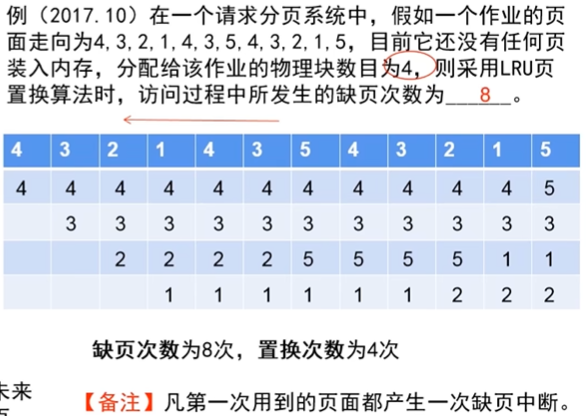

## 必考知识点

### 快表

$有效访存时间=未找到页表项的访存时间×未命中率+找到页表项的访存时间×命中率$

### 死锁

#### 定义

因多个进程竞争共享资源而引起的进程不能向前推进的僵死状态。

#### 产生死锁原因

竞争共享资源且分配资源的顺序不当。

#### 避免死锁的方法

将系统的资源分配状态分成安全状态和不安全状态。只要资源分配使系统资源分配状态处于安全状态，死锁就不会发生。

#### 安全状态

当系统能找到一个进程执行序列，并按序列为进程分配资源。

#### 做题方法

设系统有一类数量为$M$的独占性资源，系统中有$N$个进程竞争该类资源，每个进程对该类资源的最大需求为$W$，满足$N \times (W-1) ≥M$ 的情况都**有可能发生死锁**。$

### 记录型型号量

当$s.value>=0$时，$s.value$的值表示资源数量
当$s.value<0$时，$s.value$的绝对值等于某资源的等待队列中阻塞进程的数量

### 进程调度

#### 周转时间

作业在外存后备队列上等待调度的时间；

进程在就绪队列上等待进程调度的时间；

进程在CPU上执行的时间；

进程等待 I/O 操作完成的时间。

#### 平均周转时间

$$
T={\frac{1}{n}} [\sum^{n}_{i=1}T_i]
$$

#### 平均带权周转时间

$$
W={\frac{1}{n}} [\sum^{n}_{i=1} {\frac{T_i}{T_s}}]
$$

调度算法

#### 先来先服务调度算法（FCFS）

#### 短进程优先调度算法

#### 优先权调度算法

#### 时间片轮转调度算法

### 页置换算法

#### 先进先出置换算法

选择进入内存时间最早的页作为换出页。实现方式是为每个页记录该页调入内存的时间。

#### LRU置换算法

选择最近最久未使用的页换出。

#### 最佳置换算法

选择以后永远不会被访问的页或者在未来最长时间内不再被访问的页作为换出页。

### 地址变换步骤

1KB = 1024byte = 2的10次方 byte，转化为16进制为0x400。同时换一种说法，1KB可以表示1024个地址，0x400个地址，而且表示地址的范围是$0x00~0x3FF$。（记住）

2KB = 2的11次方byte, 转化为16进制为0x800，表示的地址范围为$0x00~7FF$。其中$0x400~0x7FF$表示的是第二KB的范围。

4KB = 2的12次方byte，0x1000，表示的地址范围$0x000~0xFFF$。（特殊要记住）

1MB = 1024KB = 2的20次方byte，0x100000。

#### 1、求得页号

页号：$P=INT(A/L)$

A 为逻辑地址，L 为页大小；INT 用来取整数，MOD 用来取余数。

#### 2、根据页号找到对应的页框号

#### 3、求得页内偏移量

页内偏移量： $W=MOD(A/L)$

#### 4、计算物理地址

$物理地址=页框号 \times 页框大小+页内偏移量$

页号从0开始计算。

### i结点

#### 方法

为每个文件赋予一个被称为 i结点 的数据结构，其中列出了文件属性和文件块的磁盘地址。每个结点只能存储固定数量的磁盘地址，如果文件较大，采用间接地址。即 **i结点存放间接块的簇号，间接块里存放文件数据的簇号**。

每个簇大小4KB，每个地址项占8字节。
$$
\frac{4KB}{8B}=\frac{2^{12B}}{2^3B}=512
$$

### 记录型信号量机制实现同步算法

### 进程调度/银行家算法

银行家算法

#### 银行家算法

基本思想是一个进程提出资源请求后，系统先进行资源的试分配。然后检测本次的试分配是否使系统处于安全状态，若安全则按试分配方案分配资源，否则不分配资源。

步骤：

1. 选择所需资源数每项都少于系统可用资源数的进程，将资源分配给它。
2. 待它执行完，释放资源。算出此时的系统可用资源数。
3. 将系统可用资源分配给其他进程，能顺利执行所有进程，则该分配顺序为安全序列。否则，重新分配。

（2）T0时刻是否为安全状态？若是，请给出安全序列。

1. P3(3,0,4)+(2,5,2)=(5,5,6)
2.  P5(3,1,4)+(5,5,6)=(8,6,10)
3. P4(2,0,4)+(8,6,10)=(10,6,14)
4. P2(3,0,2)+(10,6,14)=(13,6,16)
5. P1(2,1,2)+(13,6,16)=(15,7,18)

安全序列：P3-P5-P4-P2-P1

（3）在T0时刻若进程P1请求资源（3，0，3），是否能实施资源分配？为什么？

不可以，（3，0，3）> (2,5,2)，可用资源不足

（4）在T0时刻若进程P4请求资源（2，0，1），是否能实施资源分配？为什么？

可以，（2，0，1）< (2,5,2)，安全序列：P4-P3-P5-P2-P1

1. P4(2,0,4)+(2,5,2)=(4,5,6)
2. P3(3,0,4)+(4,5,6)=(7,5,10)
3. P5(3,1,4)
4. P2(3,0,2)
5. P1(2,1,2)

### 地址变换/页置换算法

页置换算法

### 磁盘调度

$平均寻道长度=磁盘移动道数/移动次数$

#### 先来先服务调度算法（FCFS）

算法：根据进程请求访问磁盘的先后顺序进行调度。

#### 电梯调度算法（SCAN）

当磁头正在自里向外移动时，SCAN算法所考虑的下一个访问对象应是其要访问的磁道既在当前磁道之外，又是**距离最近**的。这样**自里向外地访问，直至再无更外的磁道需要访问时，才将磁臂换为自外向里移动**。

#### 最短寻道时间优先 (Shortest Seek Time First, SSTF)

其要求访问的磁道与当前磁头所在的磁道距离最近，以使每次的寻道时间最短。但这种算法不能保证平均寻道时间最短。

#### 循环扫描（ CSCAN）算法

只是自里向外移动，当磁头移到**最外的磁道后，磁头立即返回到最里的要访问的磁道**，亦即将最小磁道号紧接着最大磁道号构成循环，进行循环扫描。