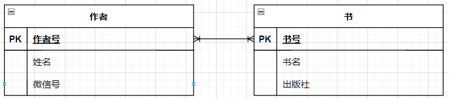

> # [**计算机信息管理专业笔记 080901**](https://github.com/Eished/self-study-exam_notes)
>
> **自考笔记在线更新地址** : <https://github.com/Eished/self-study-exam_notes>

# 202201 信息系统开发广东卷 7 月补考卷 02376 回忆版

## 选择题

1. TPS 事务处理系统数据收集的目的：收集完成事物处理所需的数据。【1.1.3 信息系统的类型
2. CASE：使得系统开发过程中的许多手工作业得以自动化 【2.6.4 case 工具的特点
3. 数据流的符号：→ 【5.2.2 数据流程图的基本符号
4. 数据模型的设计：简单 无冗余 灵活 适应性 【6.3 规范化
5. 浏览器服务器架构简称：B/S 【7.2.5 浏览器/服务器架构
6. 低耦合高内聚 【8.2.3 模块独立性
7. 结构化程序设计的指标：可靠性 可维护性 可理解性 效率 【8.5.2 程序设计目标
8. 条形码是什么输入：数模转换设备 【10.2.3 输入方式选择
9. 确认测试 【11.2.2 测试步骤
10. 系统设计转换为成果的过程称为：编码 【1.2.4 系统实施

## 填空题

1. 需求变更 需求跟踪 【4.2.5 需求管理
2. 分布式计算方案 简称 C/S 【7.2.3 客户/服务器架构
3. 软件结构图形态特征：深度、宽度、扇入、扇出 【8.3.2 软件结构图
4. 数据库建模首先建立概念数据模型，然后建立逻辑数据模型 【9.1 逻辑数据模型和物理数据模型
5. 输出格式设计：报表生成器设计 图形方式 【10.1.4 输出格式设计
6. 系统维护：程序的维护 数据文件的维护 代码的维护 【11.8.2 系统支持与维护
7. 类是对象的共同特性的表示。 【12.1.2 类与对象
8. UML 组成元素：视图、图、模型元素、通用机制 【13.1.2 UML 的构成
9. 执行用例前系统必须的状态：前置条件 ；执行完毕后系统可能处于的状态：后置条件 【14.2.4 用例说明
10. 将处理系统事件消息的职责分派给特定的类：全局控制器 局部控制器 【16.2.3 控制器模式

## 名词解释题

1. 快速应用开发路线 【2.3 快速应用开发路线

   - 是一种系统开发策略，该策略强调用户深入参与到一系列系统工作原型的快速进化和构造过程中，以加速系统开发过程，系统工作原型最终将成为目标系统（或者系统应用的一个版本）

2. 外部实体 【5.2.2 数据流程图的基本符号

   - 外部实体是与系统交互的外部的人员组织部门、其他系统或者其他组织，也称为源点终点。

3. 数据字典 【5.4 数据字典

   - 数据字典是定义和说明数据流程图中每个成分的工具。

4. 名字团体技术 【4.3.2 名义团体技术

   - 工作在一起解决问题的个人是名义上的团体，用于在团队成员中产生想法，是群组访谈的一种方式。

5. 第一范式 【6.3.1 第一范式
   - 设 R 是一个关系模式，如果 R 的所有属性都是最基本的、不可再分的数据项，则称 R 满足第一范式，简记为 1NF。

## 简答题

1. 甘特图的优点 【3.3.2 甘特图
   - 能够清楚地表达活动的开始时间、结束时间和持续时间，易于理解，并能为各层次的人员所掌握和运用
   - 使用方便，制作简单，应用广泛。
   - 不仅能安排时间，而且能与劳动计划、资源计划资金计划相结合。
2. 需求获取阶段，数据库建模需要获取哪些数据 【6.2 逻辑数据建模过程

   - 确定基本实体
   - 建立实体间的关联
   - 确定主码和属性

3. 需求分析要注意什么 【4.2.2 分析用户需求
   - 是否遗漏了重要的需求
   - 是否存在矛盾的需求；
   - 是否存在不可行的需求；
   - 是否存在重复的需求；
   - 是否存在模棱两可的需求
4. 目前常用的代码设计方法有哪两种? 分别简单阐述他们的优缺点? 【9.5.3 代码设计方法

   1. 线分类特点：
      - 结构清晰，容易识别和记忆，容易进行有规律的查找。
      - 与传统方法相似，对手工系统有较好的适应性。
      - 主要缺点是结构不够灵活，柔性较差。
   2. 面分类方法：
      - 柔性好，面的增加、删除、修改都很容易。
      - 可实现按任意组配面的信息检索，对机器处理有良好的适应性。
      - 缺点是不易直观识别，不便于记忆。

5. 面向对象分析与面向对象设计的区别 【16.1 系统设计与 UML
   1. 在侧重点上，面向对象分析侧重于理解问题，描述软件要做什么，而面向对象设计侧重于理解解决方案，描述软件要如何做。
   2. 面向对象分析一般只考虑理想设计，不关心技术和实现层面的细节，而面向对象设计需要得到更具体、更详尽，更接近于真实的代码的设计方案。
   3. 在设计结果的描方式上，面向对象分析阶段侧重于描述对象的行为，而面向对象设计阶段侧重于描述对象的属性和方法。
   4. 面向对象分析只关注功能性需求，而面向对象设计既关注功能性需求，也关注非功能性需求。
   5. 面向对象分析产生的系统模型通常规模较小，而面向对象设计产生的系统模型规模较大，内容也比较详尽、完整。

## 应用题

1. 作者有作者号、姓名、微信号，书有书号、书名，出版社。【6.1 E-R 图。9.3 将 E-R 图转化成关系。

   - 说明书和作者的关系。
     - 一本书有多个作者，一个作者有多本书
   - 画 E-R 图。
     - 
   - 实体关系模型转换，标出主码
     - 作者 (<u>作者号</u>、姓名、微信号)
     - 书 (<u>书号</u>、书名，出版社)

2. 使用结构化语言说明以下关系 【5.3.1 结构化语言

   1. 小于 19 岁

      1. 初中文化
         1. 脱产学习
      2. 高中文化
         1. 电工

   2. 大于 19 小于 45

      1. 初中文化或高中文化
         1. 男
            1. 钳工
         2. 女
            1. 车工
      2. 大学文化
         1. 技术员

   3. 大于 45 岁

      1. 技术员

   4. 答案：

      ```basic
      READ 年龄
      READ 文化水平
      READ 性别
      SELECT CASE
      CASE 1(年龄<19)
      	BEGIN IF
      		IF 文化水平=初中文化
      			脱产学习
      		ELSE 文化水平=高中
      			电工
        END IF
      CASE 2(19<年龄<45)
        BEGIN IF
          IF (文化水平=初中文化) 或 (化水平=高中)
          	BEGIN IF
          		IF (性别=男)
          			钳工
          		ELSE (性别=女)
          			车工
          ELSE 文化水平=大学
          	技术员
        END IF
      CASE 3(45<年龄)
      	技术员
      ```
