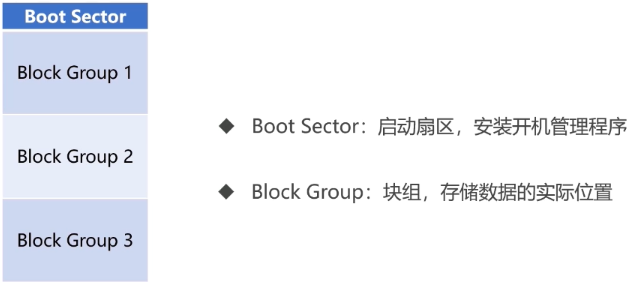
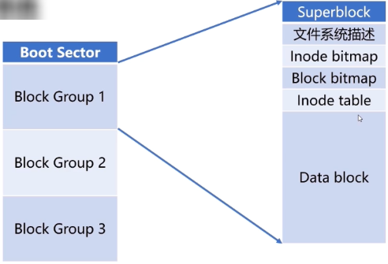
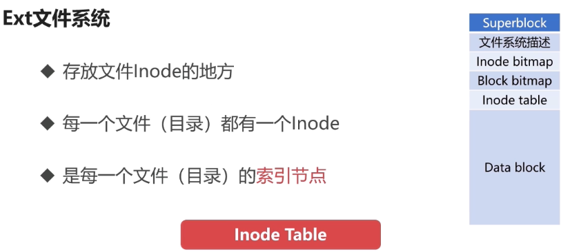
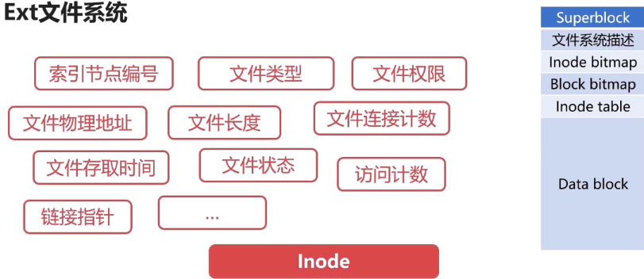

# Linux 系统概论

## Linux 文件基本操作

### Linux 目录

- 根目录
  - `/bin` 
    - 可执行二进制文件
  - `/etc` 
    - 配置文件
  - `/home` 
    - 用户文件主目录
    - `home/user`
      - user 用户的主目录
  - `/usr` 
    - 系统应用目录
    - `/usr/local/`
      - 管理员安装的软件目录
      - `/usr/local/bin`
        - 二进制可执行文件
      - `/usr/local/etc`
        - 用户安装的软件配置目录
  - `/opt` 
    - 额外安装的可选应用程序包所放置的位置
  - `/proc` 
    - 虚拟文件系统, 系统内存映射, 系统所有信息, Linux一切皆是文件
      - 数字是进程
      - 设备/软件等进程
  - `/dev` 
    - 用于存放设备文件
  - `/mnt` 
    - 系统管理员安装临时文件系统的安装点，系统提供这个目录是让用户临时挂载其他的文件系
  - `/lib` 
    - 存放跟文件系统中的程序运行所需要的共享库及内核模块
  - `/var`
    - 用于存放运行时需要改变数据的文件
  - `/boot`
    - 存放用于系统引导时使用的各种文件
  - `/sbin`
    - 存放二进制可执行文件，只有root才能访问
  - `/root`
    - 超级用户（系统管理员）的主目录

### Linux 文件常用操作

- 创建
  - 创建文件
    - `touch [文件名]`
  - 创建文件夹
    - `mkdir [文件名]`
- 查看
  - `ls -al` 查看当前目录详情
  - `cat [文件名]`  查看文件
- 删除
  - `rm [文件名]`
  - 删除文件夹
    - `rm -r [文件夹]` 递归删除
    - `rm -rf [文件夹]` 递归强制删除
- 写入
  - `vim [文件名]`
  - `echo "内容" >> [文件名] ` 追加内容
  - `echo "内容" > [文件名] ` 覆盖内容
- 下载
  - `wget [url]`
- 解压
  - `tar [操作] [文件名]` 
    - `tar zxvf linux-gtk.tar.gz  ` 
    - `z`：gz 压缩包
    - `x`：解压缩
    - `v`：显示过程
    - `f`：用包名作为文件夹名
- 压缩
  - `tar [操作] [文件名] [目录]` 
    - `tar zcvf linux-gtk.tar.gz linux-gtk  ` 
    - `c`：压缩

### 进程相关命令

- 只显示过滤的进程。

  - ```
    ps [options] | grep [options]
    ```

  - `ps -ef|grep docker`

- 实时显示进程

  - `top`
    - `m`：内存占用
    - `c`：cpu占用

- 停止进程

  - `kill 9 [pid]`

- 查看服务状态

  - `service sshd status`
  - 关闭
    - `service sshd stop`
    - `restart`
  - `systemctl status sshd`

### Linux 文件类型

- 普通文件
- 目录文件
- 符号链接
- 设备文件
- 套接字
- FIFO


## 文件系统概览

### 文件系统概览

- FAT（File Allocation Table）
  - FAT16、FAT32等，微软DoS/ Windows使用的文件系统
  - 使用一张表保存盘块的信息
- NTFS （New Technology File System）
  - Windows NT环境的文件系统
  - NTFS对FAT进行了改进，取代了旧的文件系统
- EXT2/3/4 
  - EXT（ Extended file system）：扩展文件系统
  - Linux的文件系统
  - EXT2/3/4数字表示第几代

### Ext文件系统









