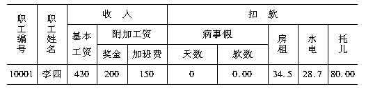
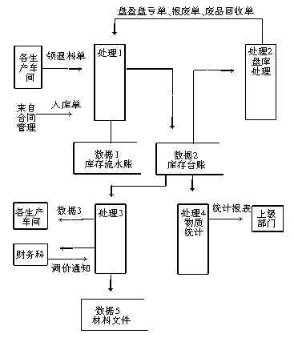
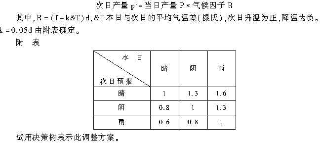

# [**计算机信息管理专业课程**](https://github.com/Eished/self-study-exam_notes)

**最新自考笔记** : https://github.com/Eished/self-study-exam_notes

# 信息系统开发 02376

## 目录

### 第 1 章 信息系统开发概述

#### 1.1 信息系统的基本概念

##### 1.1.1 信息系统与信息技术

##### 1.1.2 信息系统的结构

##### 1.1.3 信息系统的类型

##### 1.1.4 信息系统的生命周期

#### 1.2 信息系统开发过程

##### 1.2.1 系统规划

##### 1.2.2 系统分析

##### 1.2.3 系统设计

##### 1.2.4 系统实施

##### 1.2.5 系统运行与维护

#### 1.3 信息系统的相关角色

##### 1.3.1 信息系统所有者

##### 1.3.2 信息系统用户

##### 1.3.3 信息系统设计员

##### 1.3.4 信息系统构造人员

##### 1.3.5 信息系统分析员

##### 1.3.6 项目经理

##### 1.3.7 信息系统各种角色比较

#### 1.4 案例分析 ——校园二手书交易平台的设计与实现

##### 1.4.1 系统需求分析

##### 1.4.2 系统设计

##### 1.4.3 系统实现

##### 1.4.4 案例思考

##### 本章小结

##### 思考与练习

### 第 2 章 信息系统开发路线、方法与工具

#### 2.1 信息系统开发路线概述

#### 2.2 模型驱动开发路线

##### 2.2.1 面向过程方法

##### 2.2.2 面向数据方法

##### 2.2.3 面向对象方法

#### 2.3 快速应用开发路线

##### 2.3.1 迭代式开发

##### 2.3.2 敏捷式开发

#### 2.4 商用软件开发路线

##### 2.4.1 购买现成商用软件

##### 2.4.2 现成软件包二次开发

#### 2.5 选择合适的开发路线与方法

#### 2.6 自动化工具与技术

##### 2.6.1 case定义

##### 2.6.2 case工具分类

##### 2.6.3 基于 case的系统开发过程

##### 2.6.4 case工具的特点

#### 2.7 案例分析 ——case工具在系统开发中的应用

##### 2.7.1 采用 powerdesigner进行过程建模

##### 2.7.2 采用 powerdesigner进行数据建模

##### 2.7.3 采用 powerdesigner进行对象建模

##### 2.7.4 使用 powerdesigner生成信息系统开发报告

##### 2.7.5 案例思考

##### 本章小结

##### 思考与练习

### 第 3 章 信息系统项目管理

#### 3.1 信息系统项目管理生命周期

##### 3.1.1 项目发起

##### 3.1.2 项目规划

##### 3.1.3 项目执行

##### 3.1.4 项目终结

#### 3.2 项目组织

##### 3.2.1 单纯型项目组织

##### 3.2.2 职能型项目组织

##### 3.2.3 矩阵型项目组织

#### 3.3 项目管理技术

##### 3.3.1 工作分解结构

##### 3.3.2 甘特图

##### 3.3.3 计划评审技术

#### 3.4 案例分析 ——某系统开发项目管理失败原因分析

##### 本章小结

##### 思考与练习

### 第 4 章 需求获取

#### 4.1 系统需求概述

##### 4.1.1 需求获取的重要性

##### 4.1.2 系统需求分类

#### 4.2 需求获取过程

##### 4.2.1 了解用户需求

##### 4.2.2 分析用户需求

##### 4.2.3 编写需求文档

##### 4.2.4 评审需求文档

##### 4.2.5 需求管理

#### 4.3 需求获取的方法

##### 4.3.1 访谈

##### 4.3.2 名义团体技术

##### 4.3.3 直接观察用户

##### 4.3.4 文档、文件、表格抽样

##### 4.3.5 联合应用设计

##### 4.3.6 在需求获取中使用原型

#### 4.4 案例分析 ——客户关系管理系统的需求获取

##### 本章小结

##### 思考与练习

### 第 5 章 过程建模

#### 5.1 过程建模概述

#### 5.2 数据流图

##### 5.2.1 数据流程图的概念和作用

##### 5.2.2 数据流程图的基本符号

##### 5.2.3 数据流图的绘制

##### 5.2.4 数据流图规则

##### 5.2.5 数据流图的分解

##### 5.2.6 数据流图的平衡

#### 5.3 过程逻辑

##### 5.3.1 结构化语言

##### 5.3.2 决策表

##### 5.3.3 决策树

##### 5.3.4 结构化语言、决策表和决策树的选择

#### 5.4 数据字典

##### 5.4.1 数据项

##### 5.4.2 数据结构

##### 5.4.3 数据流

##### 5.4.4 过程字典

##### 5.4.5 数据存储

#### 5.5 案例分析 ——百货商店业务管理信息系统过程建模

##### 本章小结

##### 思考与练习

### 第 6 章 数据建模

#### 6.1 数据建模相关概念

##### 6.1.1 e-r图

##### 6.1.2 实体

##### 6.1.3 关系

#### 6.2 逻辑数据建模过程

##### 6.2.1 确定基本实体

##### 6.2.2 建立实体间的关联

##### 6.2.3 确定主码和属性

#### 6.3 规范化

##### 6.3.1 第一范式

##### 6.3.2 第二范式

##### 6.3.3 第三范式

#### 6.4 数据-过程模型映射

#### 6.5 案例分析 ——某网上商店概念数据建模

##### 6.5.1 确定基本实体

##### 6.5.2 确定实体间的关联

##### 6.5.3 确定主码和属性

##### 本章小结

##### 思考与练习

### 第 7 章 应用架构设计

#### 7.1 架构概述

##### 7.1.1 应用架构与框架

##### 7.1.2 架构的逻辑层次

#### 7.2 典型的系统应用架构

##### 7.2.1 基于主机的服务器架构

##### 7.2.2 文件服务器架构

##### 7.2.3 客户/服务器架构

##### 7.2.4 三层或 n 层客户/服务器架构

##### 7.2.5 浏览器/服务器架构

#### 7.3 应用架构举例

##### 7.3.1 mvc架构

##### 7.3.2 架构组成

##### 7.4 应用架构设计内容

##### 7.4.1 数据架构设计

##### 7.4.2 过程架构设计

##### 7.4.3 网络架构设计

#### 7.5 案例分析 ——某服务台系统架构设计

##### 本章小结

##### 思考与练习

### 第 8 章 软件过程设计

#### 8.1 过程设计主要内容

##### 8.1.1 总体设计

##### 8.1.2 详细设计

#### 8.2 软件设计的基本原理

##### 8.2.1 模块化

##### 8.2.2 抽象与信息隐蔽

##### 8.2.3 模块独立性

#### 8.3 软件设计工具

##### 8.3.1 hipo图

##### 8.3.2 软件结构图

##### 8.3.3 详细设计工具

#### 8.4 软件结构设计方法

##### 8.4.1 变换分析设计

##### 8.4.2 事务分析设计

##### 8.4.3 综合数据流图的映射

##### 8.4.4 分层数据流图的映射

#### 8.5 软件详细设计

##### 8.5.1 结构化程序设计

##### 8.5.2 程序设计目标

##### 8.5.3 程序设计方法

#### 8.6 案例分析 ——百货商店业务管理信息系统过程设计

##### 本章小结

##### 思考与练习

### 第 9 章 数据库设计

#### 9.1 逻辑数据模型和物理数据模型

##### 9.1.1 数据库设计前提

##### 9.1.2 逻辑数据模型到物理数据模型的转换规则

#### 9.2 关系数据库模型

#### 9.3 将 e-r 图转化成关系

##### 9.3.1 实体转换

##### 9.3.2 关系转换

##### 9.3.3 关系合并

#### 9.4 设计字段

##### 9.4.1 选择数据类型

##### 9.4.2 控制数据完整性

##### 9.4.3 设计文件的控制策略

#### 9.5 代码设计

##### 9.5.1 代码及其作用

##### 9.5.2 代码种类

##### 9.5.3 代码设计方法

##### 9.5.4 代码校验

##### 本章小结

##### 思考与练习

### 第 10 章 输入输出与用户界面设计

#### 10.1 输出设计

##### 10.1.1 输出设计目的

##### 10.1.2 输出设计原则

##### 10.1.3 输出方式选择

##### 10.1.4 输出格式设计

##### 10.1.5 输出设计过程

##### 10.1.6 输出设计说明

#### 10.2 输入设计

##### 10.2.1 输入设计目的

##### 10.2.2 输入设计原则

##### 10.2.3 输入方式选择

##### 10.2.4 输入格式设计

##### 10.2.5 输入控制与校验

##### 10.2.6 输入设计过程

#### 10.3 用户界面设计

##### 10.3.1 用户界面设计原则

##### 10.3.2 用户界面设计元素

##### 10.3.3 用户界面交互方式

##### 10.3.4 用户界面设计步骤

##### 10.4 输入输出界面示例

##### 本章小结

##### 思考与练习

### 第 11 章 系统实现与运行

#### 11.1 软件实现

##### 11.1.1 软件编程

##### 11.1.2 软件包安装与测试

#### 11.2 软件测试

##### 11.2.1 软件测试准则与标准

##### 11.2.2 测试步骤

#### 11.3 白盒测试技术

##### 11.3.1 逻辑覆盖

##### 11.3.2 控制结构测试

##### 11.3.3 循环测试

#### 11.4 黑盒测试技术

##### 11.4.1 等价类划分法

##### 11.4.2 边界值分析法

##### 11.4.3 错误推测法

#### 11.5 网络实现

#### 11.6 数据库实现

##### 11.6.1 定义数据库结构

##### 11.6.2 数据装载

##### 11.6.3 数据库试运行

#### 11.7 系统转换

##### 11.7.1 直接转换法

##### 11.7.2 并行转换法

##### 11.7.3 试点过渡法

#### 11.8 系统运行与支持

##### 11.8.1 系统运行

##### 11.8.2 系统支持与维护

#### 11.9 案例分析 ——某网站系统测试

##### 11.9.1 测试内容概述

##### 11.9.2 程序测试

##### 11.9.3 通用测试内容

##### 11.9.4 模块功能测试

##### 本章小结

##### 思考与练习

### 第 12 章 面向对象开发概述

#### 12.1 面向对象相关概念

##### 12.1.1 实体与对象

##### 12.1.2 类与对象

##### 12.1.3 消息

##### 12.1.4 属性

##### 12.1.5 操作

#### 12.2 面向对象的特性

##### 12.2.1 封装

##### 12.2.2 继承

##### 12.2.3 多态性

#### 12.3 面向对象开发的主要方法

##### 12.3.1 booch的 ood 方法

##### 12.3.2 coad/yourdon的 ooa-ood方法

##### 12.3.3 rumbaugh的 omt 方法

##### 12.3.4 jacoson方法

##### 12.3.5 各种方法的集成

##### 本章小结

##### 思考与练习

### 第 13 章 UML

#### 13.1 UML 概述

##### 13.1.1 UML 的概念和特点

##### 13.1.2 UML 的构成

#### 13.2 用例图

##### 13.2.1 参与者

##### 13.2.2 用例

##### 13.2.3 关联

##### 13.2.4 用例之间关系

#### 13.3 类图和对象图

##### 13.3.1 类的定义

##### 13.3.2 类之间的关联

##### 13.3.3 类的版型

##### 13.3.4 对象图

#### 13.4 状态图

##### 13.4.1 状态

##### 13.4.2 事件

#### 13.5 活动图

##### 13.5.1 活动

##### 13.5.2 泳道

##### 13.5.3 判定点

##### 13.5.4 并发路径

##### 13.5.5 对象流

##### 13.5.6 信号

#### 13.6 顺序图

##### 13.6.1 顺序图符号

##### 13.6.2 对象

##### 13.6.3 消息

#### 13.7 协作图

##### 13.7.1 序列化

##### 13.7.2 迭代

##### 13.7.3 控制点条件

#### 13.8 组件图

##### 13.8.1 组件

##### 13.8.2 依赖关系

##### 13.8.3 接口

#### 13.9 部署图

##### 13.9.1 节点

##### 13.9.2 通信关联

##### 13.10 包图

##### 13.10.1 包之间的关系

##### 13.10.2 合并包

##### 本章小结

##### 思考与练习

### 第 14 章 面向对象需求理解

#### 14.1 基于 UML 的系统开发过程

##### 14.1.1 需求理解

##### 14.1.2 系统分析

##### 14.1.3 系统设计

##### 14.1.4 系统实现

#### 14.2 理解需求

##### 14.2.1 确定业务参与者

##### 14.2.2 确定用例

##### 14.2.3 构造用例图

##### 14.2.4 用例说明

##### 14.2.5 用例模型检查

#### 14.3 案例分析 ——电子培训系统的需求理解

##### 14.3.1 分析问题领域

##### 14.3.2 确定 abc e-training系统范围和系统边界

##### 14.3.3 定义参与者

##### 14.3.4 定义用例

##### 14.3.5 绘制用例图

##### 14.3.6 用例说明

##### 本章小结

##### 思考与练习

### 第 15 章 面向对象分析

#### 15.1 领域建模

##### 15.1.1 发现类

##### 15.1.2 确定关联

##### 15.1.3 确定属性

#### 15.2 行为建模

##### 15.2.1 状态图

##### 15.2.2 活动图

##### 15.2.3 顺序图

#### 15.3 案例分析 ——网上商店客户订单处理系统分析

##### 15.3.1 用例图

##### 15.3.2 活动图

##### 15.3.3 类模型

##### 15.3.4 顺序图

##### 15.3.5 状态图

##### 本章小结

##### 思考与练习

### 第 16 章 面向对象设计

#### 16.1 系统设计与 UML

##### 16.1.1 系统设计的主要任务

##### 16.1.2 协作图

##### 16.1.3 组件图

##### 16.1.4 部署图

#### 16.2 通用职责分配软件模式

##### 16.2.1 专家模式

##### 16.2.2 创建者模式

##### 16.2.3 控制器模式

##### 16.2.4 低耦合模式

##### 16.2.5 高内聚模式

#### 16.3 类的设计

##### 16.3.1 设计类

##### 16.3.2 设计关系

##### 16.3.3 设计类图

#### 16.4 接口设计

##### 16.4.1 单个对象的接口设计

##### 16.4.2 多个对象的接口设计

##### 16.4.3 层次之间接口设计

#### 16.5 包设计

##### 16.5.1 包设计原则

##### 16.5.2 包设计步骤

#### 16.6 数据库设计

##### 16.6.1 UML 类图映射为库表的原则

##### 16.6.2 关系约束检查策略

##### 本章小结

##### 思考与练习

### 第 17 章 面向对象实现

#### 17.1 设计映射到代码

##### 17.1.1 根据设计类图创建类的定义

##### 17.1.2 根据协作图创建方法

#### 17.2 面向对象程序设计

##### 17.2.1 可重用原则

##### 17.2.2 可扩充原则

##### 17.2.3 健壮性原则

#### 17.3 面向对象测试策略

##### 17.3.1 单元测试

##### 17.3.2 集成测试

##### 17.3.3 系统测试

##### 17.3.4 回归测试

##### 17.4 设计测试用例

##### 本章小结

##### 思考与练习

# 四川版题型

100分 150分钟

- 选择题
  - 15题*1分 = 15分
- 填空题
  - 5题*2分 = 10分
- 判断改错题
  - 5题*4分 = 20分
- 简答题
  - 4题*7分 = 28分
- 综合应用题
  - 2题
    - 14分+13分 = 27分

## 四川版试题分析 201704/201804

### 选择题 15题*1分 = 15分

1. 信息内容
   - 系统开发效率
2. 系统建设
   - 管理信息系统(MIS)生命周期
3. 继承与多态 系统建设
   - 管理信息系统逻辑模型
4. 系信息系统开发
   - 信息稳定系数
5. 数据流图
   - 图形方法
6. 表格型图表工具
   - 数据库范式
7. 系统流程图
   - 系统可靠性技术
8. 测试用例
   - 系统开发计划与进度控制工具
9. 瀑布模型
   - 系统快速开发方法
10. 系统维护
    - 模块内部组合形式
11. 分布式系统
    - 结构化程序的三种基本控制结构
12. 数据库设计
    - 系统测试排错
13. MIS战略规划
    - 模块耦合
14. 绘制系统流程图
    - 决策表(判断表)的组成
15. 结构化方法
    - 关键成功因素法(CFS)

### 填空题 5题*2分 = 10分

1. 系统分析信息来源
   - 企业系统规划法(BSP)
2. 面对对象方法包括
   - 信息需求分析方法
3. 现代三大前沿科学
   - 系统分析阶段主要活动
4. 系统经济效益评价
   - 系统总体结构
5. 系统测试两个阶段
   - 数据储存的总体结构设计

### 判断改错题 5题*4分 = 20分

1. 数据储存主要关心
   - 影响系统可维护性的三个主要因素
2. 系统测试步骤
   - 模块独立性标准度量
3. 数据流图两种典型结构
   - 系统转换的方式
4. 信息反馈定义
   - 系统设计语言的发展
5. 系统实施阶段的主要活动
   - 系统设计工作的环境

### 简答题 4题*7分 = 28分

1. 信息/数据的概念
   - 系统维护的类型
2. 管理信息系统生命周期
   - 数据库设计的步骤
3. 数据流图四种成分
   - 软件系统总体结构设计的原则
4. 管理信息系统建设工作复杂性和体现方面
   - MIS战略规划过程的三个步骤

### 综合应用题 14分+13分 = 27分

1. 画数据流图
   - 画数据流图
2. 判断分析
   - 判断分析

# 全国版题型

- 选择题: 10题*1=10分
- 填空题: 18题*1=30分
- 名词解释: 5题*3=15分
- 简答题: 5题*5分=25分
- 应用题: 10题*2=20分

## 全国版试题分析 201810

### 选择题 10题*1=10分

1. 系统分析员应当是**用户与计算机技术人员的有效协作与组织者**.
2. 信息化生产力的三个要素是**人 / 技术 / 组织管理**.
3. 规范化理论中, 关系二维表, **任一列中, 数据项应具有同一个属性**; **在一个表中, 行的顺序不重要**; **行列的顺序无关**.
4. 结构化系统, **越下层模块越具体 / 简单**.
5. 数据库逻辑设计要解决: **包括那些文件**, **每个文件包括那些数据项**, 以及**文件间的联系**三方面问题.
6. 系统验收测试, 子系统和系统测试时主要采用**黑盒法**.
7. 信息系统生命周期中, 系统开发可分为: 系统规划、**系统分析、系统设计、系统实施**以及系统运行与支持.
8. 代码设计就是把管理对象**数字化或字符化**.
9. 系统测试的主要目的是**发现已编辑序中存在的错误**.
10. 除正确完成功能外, **程序的可读性**是衡量程序编写质量最重要的因素.

### 填空题 18题*1=30分

1. 信息资源管理的基本形式可分为: **分布式**和**集中式**两种.
2. CASE包括: **计算机辅助软件工程**和**计算机辅助系统工程**.
3. **系统设计说明书**是系统设计阶段的结果, **主要依据**是系统实施阶段工作的.
4. MIS的生命周期中, 经过了: **系统规划**/**系统分析**和**系统设计**后, 便开始**系统实施**阶段.
5. CASE系统的基本组成部分包括: **前端 / 中心 / 信息库后端**.
6. 系统方法的主要原则为: **整体性原则 / 分解—协调原则 / 目标优化原则**.
7. 结构化语言使用的语句类型有: **祈使语句 / 条件语句 / 循环语句**.
8. 信源是指信息的**发生者**, 信宿是指信息的**接受者**.
9. 结构化语言使用
10. 系统经济效益评价的方法有: **年利润增长额 / 纯收入投资回收期 / 数量效率系数 / 直接的价值估算法 / 大于—小于成本法**.
11. 用**IPO图**描述分层图中每一个模块的**输入 / 输出 / 处理 / 内容**.
12. 信息运动的三要素: **信源 / 信道 / 信宿**.
13. 按系统中信息资源的空间配置状况, MIS可分为 **分布式** 和 **集中式**.
14. 在软件系统中, 模块是指这样一组程序语句, 它包括: **输入输出 / 逻辑处理功能 / 内部信息 /运行环境**.
15. 系统实施阶段的主要活动有: **编码, 系统测试, 系统安装与调试, 新旧系统转换**.
16. 在系统分析中需要收集的信息有: **组织的信息 / 人的信息 / 环境的信息 / 关于工作的信息**.
17. 决策树是描述**条件比较多**的决策问题的**有效工具**.
18. MIS数据流图一般有两种典型结构: **变换型结构** / **事物型结构**.

### 名词解释题 5题*3=15分

1. **系统分析**: 是指在管理信息系统开发的生命周期中**分析阶段**的各项活动个方法, 即应用系统思想和系统科学的原理进行分析工作的方法和技术.
2. **系统规划**: 是管理信息系统生命周期的第一个阶段, 是MIS的概念形成时期, 该阶段又由**战略规划 / 需求分析 / 资源分析**三个字阶段组成.
3. **数据储存**: 数据流图中描述系统信息处理功能需要的 / 不考虑储存物理介质和技术手段的逻辑意义上的**数据储存环节**.
4. **实例连接**: 一个对象向的实体与另一个对象的实例的对应关系, 反映对象之间的**关联**和基于消息的**通信机制**.
5. **关键成功因素**: 对企业组织的成功其关键作用的因素.

### 简答题 5题*5分=25分

1. 简答**控制结构图的作用和控制方法**.

   - 控制结构图的作用: 
     - 描述了模块的组织结构和他们之间的控制通讯联系, 是描述系统结构的通讯工具. 
   - 控制结构图的绘制方法: 
     - 绘制控制结构图的出发点任然是数据流程图. 但如果已具备 HIPO 分层图, 则在此基础上加注模块间的控制与通讯标志(标制?), 就成了控制结构图.

2. 简述 **MIS 战略规划的核心问题和主要内容**.

   - MIS 战略规划的核心问题: 
     - 如何使一个组织中 MIS 发展战略与组织自身的发展战略保持一致, 它通常包括发展目标 / 发展重点 / 实现目标的途径和措施, 等等. 
   - MIS 战备规划通常包括:
     - 信息系统的目标 / 约束 / 结构.
     - 了解当前的能力状态.
     - 对影响计划的信息技术发展的预测.
     - 近期计划.

3. 简述**系统方法的主要原则**.

   - **整体性原则**. 
     - 系统是相互联系 / 相互作用的诸多要素的综合体. 
     - 一个特定的系统具有的功能与目标, 不是各组成部分功能与目标的简单相加, 而是各部分按一定秩序相互作用的结果. 
     - 系统方法的基本点是从整体和各组成部分之间的相互联系和相互作用, 是解决复杂系统各类问题的关键所在.
   - **分解—协调原则**.
     - 在处理复杂系统时, 可以依结构 / 功能 / 时间过程将整个系统分解成若干相关联的子系统, 即把复杂问题化成若干相对简单的问题以方便求解. 
     - 如果子系统任较复杂, 还可以进一步分解. 合理的分解, 可以使问题的处理大为简化. 
     - 在处理各类子问题时, 必须根据系统的整体目标与功能, 协调各子系统的行为 / 功能与目标, 以保证整体功能 / 目标的事项.
   - **目标优化原则**.
     - 对于单一目标的简单系统, “目标优化” 就是选定的方案应使某个设定的目标函数取极值.
     - 对于复杂系统, “目标优化” 就是, 在可能探索到的可行方案中, 选定对系统所有目标来说都能达到令人满意效果的方案. 
     - 简而言之, “目标优化” 对简单系统来说就是求“最优解”, 对复杂系统求“满意解”.

4. 简述**绘制数据流图的主要原则**.

   1. 明确系统界面;

   2. 自顶向下逐层扩展;

   3. 合理布局;

   4. 数据流图只反映数据流向 / 数据加工 和 逻辑意义上的数据存储;

   5. 数据流图绘制过程, 就是系统逻辑模型的形成过程, 必须始终与用户密切接触, 不断讨论修改;

      注: 4/5 可不答.

5. **什么是信息循环?**

   - 信息从**客体传输到主体**, 经接收 / 处理 / 行动各环节反馈到客体, 形成一个信息运动的循环.
   - 信息循环是信息运动的基本形式.

### 应用题 10题*2=20分

1. 将下列职工工资文件转化为关系型第一范式.

   

   | 职工编号 | 职工姓名 | 基本工资 | 奖金 | 加班费 | 天数 | 款数 | 房租 | 水电 | 托儿  |
   | -------- | -------- | -------- | ---- | ------ | ---- | ---- | ---- | ---- | ----- |
   | 10001    | 李四     | 430      | 200  | 150    | 0    | 0.00 | 34.5 | 28.7 | 80.00 |

   

2. 绘制取款过程的数据流程.

   储户将填好的取款单及存折交储蓄所, 经查对储户帐, 将不合格的存折和取款单退乎储户, 合格的存折和取款单被交取款处理, 处理时要修改储户帐和现金账, 并将存折 / 利息单和现金交储户, 同时将取款单存档.

## 全国版试题分析 201704

### 选择题 10题*1=10分

1. 提高系统可靠性的主要措施是使**系统具有容错能力**.
2. 系统测试的对象是**软件**.
3. 计算机辅助管理发展各阶段中, 事务处理的主要目的之一是**提高管理信息处理的准确性和及时性**.
4. 程序调试包括**语法调试 / 逻辑调试**.
5. 集中式系统的一个主要优点是**系统安全措施实施方便**.
6. 可行性研究的工作结果是**可行性研究报告和系统设计说明书**.
7. 现代管理的核心是**决策**.
8. 数据结构用以描述**数据流/数据存储**的逻辑组成.
9. 系统的代码设计是详细设计的一部分, 它的主要目的是**提高计算机处理效率**.
10. 构成信息传输运动的要素是**信源 / 信宿 / 载体**.

### 填空题 18题*1=30分

1. 系统转换有三种方式: **直接转换 / 并行转换 / 分段转换**.
2. 程序运行的效率主要指计算机运行该程序所需的**运行时间**和**储存空间**两个方面.
3. MIS 战略规划工作的核心问题之一是, 如何把一个组织中的 **MIS 发展战略**与**组织本身的发展战略**保持一致.
4. 系统维护的目的是保证**管理信息**正确而可靠地运行, 并能使其不断得到**系统改善**和提高.
5. **维护**就是为了保证系统中各个要素随着环境的变化始终处于**最新的系统** / 正确的工作状态.
6. 系统的技术评价包括: **目标评价 / 功能评价 / 性能评价 / 运行方式评价**.
7. 系统方法的主要原则: **整体性原则 / 分解—协调原则 / 目标优化原则**.
8. 模块之间调用关系有: **直接调用 / 重复调用 / 选择调用**.
9. 测试用例的设计, 一般是先用**黑盒法设计**出一组测试用例, 然后再用**白盒法补充**.
10. 程序设计语言的发展大致分为四代: **机器语言 / 汇编语言 / 高级语言 / 第四代语言**.
11. 系统分析在整个系统开发过程中, 要解决**“做什么”**的问题, 为下一阶段进行**物理方案**设计, 解决**“怎么做”**提供依据.
12. 按信息的稳定性分类, 可分成: **信息固定 / 相对固定信息 / 流动信息**.
13. 结构化方法的基本思路是把整个系统开发过程分成若干**阶段**, 每个**阶段**进行若干活动, 每项活动分成若干任务.
14. 系统维护可规划分为四种类型: **纠错性维护 / 预防性维护 / 完善性维护 / 适应性维护**.
15. 原型法的主要步骤是: **明确用户基本信息需求**, 建立初始原型, 使用原型以进一步明确用户需求, **修改和完善原型系统**.
16. 系统规划的主要任务是制定 **MIS 发展战略**, 确定组织的主要信息需求和制定系统建设的**资源分配**计划.
17. 战略集合转移法的第二步是把**组织战略集**转化为 **MIS 战略集**.
18. 影响系统可维护性主要有: **可理解性 / 可测试性 / 可修改性**.

### 名词解释题 5题*3=15分

1. **完善性维护:** 指用户对系统提出了某些新的信息需求, 因而在**原有系统的基础上**进行适当的**修改 / 扩充 / 完善系统的功能**, 以满足用户性的信息需求.
2. **数据耦合:** 如果两个模块彼此之间**通过数据交换信息**, 而且每一个参数仅仅为数据, 那么这种块间耦合称为数据耦合.
3. **封装:** 对所有对象的内部软件范围的边界进行**限定**, 对各对象之间相互作用的接口进行**描述**, 对每个对象的内部实现进行**保护**.
4. **决策树:** 又称判断树, 是一种图形工具, 适合于描述加工中**具有多个策略**, 而且每个策略和若干条件有关的逻辑功能.
5. **公共耦合:** 如果两个模块之间通过一个**公共的数据区域传递信息**, 那么这种块间耦合称为公共耦合.

### 简答题 5题*5分=25分

1. 简述**系统设计工作的依据和主要特点:**
   - 主要依据:
     1. 系统分析的成果;
     2. 先行技术;
     3. 现行的信息管理和信息技术的标准 / 规范和有关法律制度;
     4. 用户需求;
     5. 系统运行环境;
   - 特点: 系统设计工作是管理环境和技术环境的结合.
2. 简述**结构化程序设计的方法和步骤:**
   - 结构化程序设计的方法:
     - 即以自顶向下的方式, 按照模块化和逐步细化的思想, 用一组单入口和但出口的基本控制结构及反复嵌套来进行程序设计.
   - 结构化程序设计的步骤:
     1. 自顶向下的模块化设计;
     2. 逐步细化.
3. 简述**信息化对社会的经济意义:** 
   - 信息化是指人们的信息活动的不断增长以至于在国民经济中占主导地位的过程, 信息活动在社会经济活动中的规模和比例不断增加, 工业产品中信息成本的比例迅速增加, 信息化是以物质生产活动的成熟化为前提的.
   - 信息化是生产力的重大变革, 以计算机和通信技术为代表的现代信息技术是信息化生产力的重要组成成分, 推广应用现代信息技术是推动信息化工作的主要内容之一, 但信息化不等于计算机化, 不等于网络化.
   - 信息活动的主体是人而不是机器, 技术 / 组织管理和人是信息化生产力的三个重要因素, 也是推进信息化的三项关键资源.
4. 简述**系统转换的工作内容和方式:**
   - 系统转换的内容: 
     - 确定了系统转换的方式以后, 除了做好组织准备 / 物质准备和人员培训等准备工作以外, 最重要并且工作量最大的是数据准备和系统初始化工作.
   - 系统转换的方式包括: 直接转换 / 并行转换 / 分段转换.
5. 简述**计算机辅助管理各阶段的目标 / 典型功能的关键技术与代表性系统.**
   - 从信息处理功能和辅助管理内容来看, 计算机辅助管理大体经过了四个发展阶段:
     1. 事务处理. 
        - 目标: 提高文书 / 统计等事务处理工作的效率.
        - 典型功能: 统计 / 计算 / 制表 / 文字处理.
        - 对应的核心技术: 高级语言 / 文件管理.
        - 代表性系统: 电子数据处理系统.
     2. 系统处理.
        - 目标: 提高管理信息处理的综合性 / 计划性 / 系统性 / 及时性 / 准确性.
        - 典型功能: 计划 / 综合统计 / 管理报告的生成.
        - 对应的核心技术: 数据库技术 / 数据通讯与计算机网络.
        - 代表性系统: 传统的 MIS.
     3. 支持决策阶段.
        - 目标: 为决策者在决策过程中的活动提供支持, 以改善管理决策的有效性.
        - 典型功能: 分析 / 优化 / 评价 / 预测.
        - 核心技术: 人机对话 / 模型管理 / 人工智能应用.
        - 代表性系统: 决策支持系统 / 现代的管理信息系统.
     4. 综合服务.
        - 目标: 提高人员素质 / 创造良好工作环境.
        - 典型功能: 上述功能的综合集成, 特别是对人们的智能活动提供主动积极支持.
        - 对应的核心技术: 高速信息传输技术 / 多媒体信息处理技术 / 人工智能技术的应用.
        - 代表性系统: ISDN 系统 / 国际互联网 / www服务器.

### 应用题 10题*2=20分

1. 将下列职工工资文件转化为关系型第一范式.

   

   | 职工姓名 | 基本工资 | 资金 | 加班费 | 天数 | 款数 | 房租 | 水电 | 托儿 |
   | -------- | -------- | ---- | ------ | ---- | ---- | ---- | ---- | ---- |
   | 李莹     | 1150     | 2300 | 1080   | 2    | 400  | 600  | 50   | 300  |

   

2. 铁路货运收费标准如下：若收货地点在本省，快件每公斤5元慢件每公斤3元。若收货地点在外省且重量小于或等于20公斤，快件每公斤7元，慢件每公斤5元； 若重量大于20公斤，超重部分每公斤加收1.5元(重量用W表示)。
   请绘制确定收费的决策树。

   

## 全国版试题分析 201610

### 选择题 10题*1=10分

1. 决策树是描述基本加工的逻辑功能的有效工具.
2. 信息内容的四个层次: 数据 / 信息 / 分析 /措施.
3. BSP 方法实现的主要步骤是: 定义企业目标 / 定义企业过程 / 定义数据类 / 定义信息系统总结构.
4. 大多数程序模块编码时应把**可读性放在第一位**.
5. 数据流图是组织中信息运动的抽象 / 是管理信息系统模型的主要形式 / 与对系统的物理描述无关.
6. 比较困难的信息收集方法是实地观察实践.
7. 对程序设计基本的质量要求是正确性.
8. 系统实施的依据包括: 控制结构图 / 系统配置图 / 详细设计资料 / 数据库设计.
9. 管理信息系统的最终用户是各级各类管理人员.
10. 系统说明书的重点内容是新系统的目标和逻辑模型.

### 填空题 18题*1=30分

1. CASE 工具提供 DFD 和 DD 的编制功能, 具有图形处理 / 数据管理 / 文字编辑功能.
2. 数据库设计的核心问题是从系统的观点出发建立一个数据模式.
3. 制定系统开发计划注意遵循以下原则: 客观可行性原则 / 全面性原则 / 整体性原则 / 阶段性原则.
4. MIS 战略规划工作的核心问题之一是, 如何把一个组织中的 MIS 发展战略与组织本身的发展战略保持一致.
5. 系统设计工作环境是管理环境和技术环境的结合, 这是这一阶段工作的重要特点.
6. 系统维护的目的是保证管理信息正确而可靠地运行, 并能不断得到系统改善和提高.
7. 系统的技术评价包括: 目标评价 / 功能评价 / 性能评价 / 运行方式评价.
8. 数据流图由四种基本成分组成, 它们是: 外部项 / 数据存储 / 加工 / 数据流.
9. 数据字典的编写方法有: 手工编写 / 计算机辅助编写.
10. 数据的效用在于它反映信息的内容, 并可为接受者识别.
11. 通常支持 MIS 的数据库系统由模式 / 子模式 / 应用程序 / 数据库 /数据库管理系统等几部分组成.
12. 绘制系统结构图的出发点是 DFD 图, 但若已具备 HIPO 图, 则在此基础上加注模块间的控制与通讯标志就成系统结构图.
13. 系统分析在整个系统开发过程中, 要解决“做什么”的问题, 为下一阶段进行物理方案设计, 解决“怎么做”提供依据.
14. 结构化方法的基本思路是把整个系统开发过程分成若干阶段, 每个阶段进行若干项活动, 每项活动分成若干任务.
15. 数据时信息的具体表现形式, 数据的特征取决于载体的性质.
16. 集硬件 / 软件 / 数据于一体的管理信息系统称为集中式系统.
17. 影响系统安全性的因素主要有自然及不可抗拒因素 / 硬件及物理因素 / 电磁波因素 / 软件因素 / 人为管理因素.
18. 系统实施是在系统设计阶段以后才开始, 它是按照系统设计方案的文档进行的.

### 名词解释题 5题*3=15分

1. BSP 法: 

   - 企业系统规划法, 指为指导企业管理信息系统而建立的一种规范方法, 是一种结构化方法论, 它可以帮助企业做出管理信息系统的规划, 以满足其近期和长期的信息需求.

2. 无形成本: 

   - 系统成本中, 非经济性的 / 无法以财务支出方式体现出且无法量化.

3. 数据维护: 

   - 是为适应业务处理对数据需求的不断变化, 对数据进行定期和不定期的更新, 以及数据内容的增加 / 数据结构的调整 / 数据的备份与恢复等.

4. 信息资源: 

   - 信息资源通常包括: 信息及其载体 / 信息采集 / 传输 / 加工 / 存储的各种设施和软件, 制造上述硬软件的设施, 有关信息采集 / 加工 / 传输 / 存储利用的各种标准规范 / 规章 / 制度 / 方法 / 技术等.

5. 分解—协调: 

   - 在处理复杂系统问题时, 可以依结构 / 功能 / 时间过程将整个系统分解成若干相互关联的子系统, 即把复杂问题化为若干相对简单的子问题以方便求解.

     若子系统仍比较复杂, 还可以进一步分解. 合理的分解, 使问题的处理大为简化.

   - 在处理各类子问题时, 必须根据系统的整体功能和目标, 协调各子系统的行为 / 功能 / 目标, 以保证整体功能 / 目标的实现.

### 简答题 5题*5分=25分

1. 简述系统开发中生命周期法存在的问题.

   结构化生命周期法的应用, 使 MIS 的建设有了比较明确 / 严格的秩序和一套可以实施的标准 / 规范方法和技术, 开始走了科学化 / 规范化的通路, 但生命周期也存在以下问题: 

   1. 整个系统的开发工作是劳动密集型的, 系统开发的软件成本大大超过硬件成本;
   2. 系统开发的整个工作费时过长, 难以适应环境的急剧变化; 
   3. 对用户需求的变化不能做出迅速反应;
   4. 如果系统所处理的问题比较复杂, 不确定性因素较高, 结构化生命周期法就很难适应;
   5. 维护工作繁重, 专业人才紧缺.

2. 简述信息化的社会经济意义.

   1. 信息化: 是指人们的系信息活动的规模不断增长以至在国民经济中占主导地位的过程.
   2. 信息化的社会经济意义: 
      - 信息化是继工业化之后生产力发展的新阶段, 将对社会经济的发展以至整个人类文明产生巨大的深远的影响. 
      - 信息化活动在社会经济活动中的规模和比重不断增加, 工业产品中信息成本的比例迅增长, 这不是物质生产活动弱化的表现, 恰恰相反, 信息化是以物质生活活动的成熟化为前提的.
      - 信息化是生产力的重大变革. 信息化生产力的三个重要因素是技术 / 组织管理 / 人.

3. 简述影响信息系统安全性的因素.

   - 信息系统安全性是指: 为了防范意外或认为的破坏信息系统的运行或非法使用资源而采取的安全保护措施. 影响信息系统安全性的主要因素有: 
     1. 自然及不可抗拒因素;
     2. 硬件及物理因素;
     3. 电磁波因素;
     4. 软件因素;
     5. 数据因素;
     6. 人为及管理因素.

4. 在制定人员培训计划时要注意那个方面问题?

   1. 培训工作应从系统的开发和应用的全局出发, 不仅要注意技术开发人员的培训, 更要重视用户和系统维护人员的培训.
   2. 培训工作应比人员的工作安排具有一定的超前性.
   3. 培训采用多种方式进行.
   4. 培训工作应分阶段, 分层次进行.

5. 简述系统规划的目标和主要任务.

   - 系统规划的主要目标是制定成 MIS 的长期发展方案, 决定 MIS 在整个生命周期内发展方向 / 规划和发展进程. 
   - 主要任务是: 
     1. 制定 MIS 发展战略.
     2. 确定组织的主要信息需求, 形成 MIS 的总体结构方案, 安排项目开发计划;
     3. 制定系统建设的资源分配计划.

### 应用题 10题*2=20分

1. 材料供应管理系统中的库存管理数据流程图如下：

   

   库存管理是按入库或退料为库存增加，以领料为库存减少的收发工作，以及进行阶段性盘库平衡账、卡、物。另外库存管理应对各车间进行核算，并通知财务科做账，以及按时上报统计报表。问：

   1. “处理1”做什么处理?
      - “仓库收发台账管理”;
   2. “处理3”做什么处理?
      - 材料核算;
   3. “数据3”与“数据4”分别是什么数据?
      - 内部结算单和材料核算单;
   4. 若要增加“最佳库存分析”应在何处如何处理?出何数据?
      - 在“数据2”处加“最佳库存分析”处理, 并出“超限报警”数据 (给处理1使用).

2. 某厂产品销量对气候十分敏感，每日需根据次日的天气预报调整产量。调整方案为

   

   

# 名词解释

1. **结构化编程:**是一种规范化的编程方法，其基本点有

   1. 只使用三种基本结构及其相互嵌套的结构：顺序结构、选择结构和循环（重复）结构，每种结构一个入口，一个出口。
   2. 自顶向下，逐步细化
   3. 尽可能不采用无条件转移语句（即GOTO语句）
2. **系统的可维护性:**是指对系统进行维护的难易程度的度量，其中包括有：

   - 可理解性：指为外来读者理解系统的结构、接口、功能和内部过程的难易程度。 

   - 可测试性：指为系统进行诊断和测试的难易程度。

   - 可修改性：指对系统各部分进行修改的难易程度。
3. **数据词典是：**DFD中所有成分的定义和解释的文字结合，其描述的主要内容有：数据流、数据元素、数据存储、加工、外部项等。     
4. **系统测试：**是管理信息系统开发的一个重要而漫长的阶段，是保证系统质量与可靠性的最后关口，是对整个系统开发过程包括系统分析、系统设计和系统实现的最终审查。
5. **工作成果描述标准化原则：**结构化方法强调各阶段工作成果描述的标准化。每一工作阶段的成果，必须用明确的文字和标准化的图形、图表，完整、准确地进行描述，这不仅作为一个阶段工作完成的标志和管理决策的依据，并且作为系统建设必需的文件进行交流和积累存档，有的文件还是下一阶段工作的依据。工作成果描述的标准化，可以防止由于描述的随意性造成建设者之间的误解而贻误工作，便于工作交流和各阶段的交接，便于今后对系统进行检查、修改和补充。 
6. **企业过程：**指在企业资源管理中所需要的、逻辑上相关的一组决策和活动。
7. **系统的可测试性：**表现为对系统进行诊断和测试的难易程度。
8. **系统方法的整体性原则：**系统是相互联系、相互作用的诸要素的综合体。一个特定的系统具有的功能与目标，不是各组成部分功能与目标的简单相加，而是各部分按一定秩序相互作用的结果。系统方法的基本点是从整体目标和功能出发，正确处理系统各组成部分之间的相互联系和相互作用，是解决复杂系统各类问题的关键所在。
9. **数据类：**指支持企业过程所必需的逻辑上相关的数据。
10. **基本加工：**数据流图中所有不进一步分解的加工，称为基本加工。
11. **结构化程序设计基本思想：**把整个系统开发过程分成基干阶段，每个阶段进行若干活动，每项活动应用一系列标准、规范、方法和技术，完成一个或多个任务，形成符合给定规范的产品。
12. **系统重新组合技术**：当系统发生故障后，为了使系统部分恢复或完全恢复，自动将故障设备切除，或用备件替换故障设备的技术措施。
13. **数据流图**：是使用少数几种符号综合地反映出信息在系统中的流动、处理和存储情况的流程图，是一种能全面地描述信息管理系统逻辑模型的主要工具，是系统分析人员与用户进行交流的有效手段。
14. **过程错误**：过程错误主要指算术运算错误、初始过程错误、逻辑错误等。
15. **电磁屏蔽**：利用导电材料或铁磁材料制成的部件对大容量汽轮发电机定子铁心端部进行屏蔽，以降低由定子绕组端部漏磁在结构件中引起的附加损耗与局部发热的措施。
16. **继承性：**是类层次结构中，超类和子类之间共享数据的操作方法的机制。
17. **系统评价：**从广义上理解，是贯穿系统整个生命周期各个阶段的重要决策手段和工作环节，从狭义上理解，为系统投入运行以后的评价。
18. **系统转换：**指以新开发的系统替换旧的系统，并使之投入使用的过程。
19. **管理信息系统：**指为实现组织的整体目标，对管理信息进行系统地、综合地处理，辅助各级管理决策的计算机软件、硬件、通信设备，规章制度及有关人员的统一体。
20. **系统的总体结构：**指整个系统由哪些部分组成，以及各部分在物理上、逻辑上的相互关系，包括硬件部分和软件部分。
21. **系统方法的分解——协调原则：**即把复杂问题化成若干相对简单的问题以方便求解。
22. **系统规划方法中的收费法：**是把信息系统资源的费用分摊给用户的一种会计手段。
23. **程序设计：**又称编码，是系统生命周期中继详细设计之后的阶段。
24. **数据加密：**为了防止存储介质的非法拷贝、被窃，以及信息传输线路的被窃听而造成机要数据的泄密，在系统中应对机要数据采取加密存储和加密传输等安全保密技术措施。
25. **“先逻辑，后物理”原则：**在进行技术设计和实施之前，要进行充分的调查、分析、论证，进行逻辑方案的探索，弄清系统要为用户解决哪些问题，即解决“系统做什么”的问题，尽量避免过早地进入物理设计阶段。   
26.  **决策树：**是一种图形工具，用于描述加工中具有多个策略，而且每个策略和若干条件有关的逻辑功能。
27. **功能错误**：由于功能规格说明书不够完整或叙述不够确切，致使在编码时对功能有误解而产生的错误，称功能错误。
28. **系统开发计划的整体性原则：**系统开发计划应符合应用环境本身目标和信息系统建设目标的要求，从系统开发的总体规划出发，注意与系统运行环境中的其他计划相互联系、协调一致。
29. **结构化方法：**指信息系统的一种开发方法，其主要含义是一组规范的步骤、准则和工具来进行开发工作。
30. **管理信息系统规划**
    （1）制作MIS的发展战略。
    （2）确定组织的主要信息需求，形成MIS的总体结构方案
    （3）安排项目开发计划，制定系统建设的资源分配计划。
31. **业务流程图：**是进行系统调查的工具之一，描述组织内部业务处理活动的内容与工作流程。
32. **编码错误**：是指语法错误、变量名错误、局部变量与全局变量混淆、程序逻辑错误和编码书写错误等。
33. **系统开发的目标评价：**针对系统开发所设定的目标，逐项检查是否达到预期目标，实现的程度如何。
34. **CSF法：**即关键成功因素法，就是那些必须经常得到管理人员关注的活动区域，对这些区域的运行情况要经常不断地进行度量，并提供这些度量信息以供决策使用。
35. **关联图：**
36. **确认测试：**确认测试是进一步检查软件是否符合软件需求规格说明书的全部要求。
37. **满意解：**在可能探索到的可行方案中，选定对系统所有目标来说都能达到令人满意效果的方案。简而言之，目标优化对简单系统来说是求“最优解”，对复杂系统来说求的是“满意解”。
38. **计划类数据：**计划类数据包括战略计划、预测、操作日程、预算和模型，可以是数据，也可以是文本。        
39. **结构化语言：**结构化语言没有严格的语法规定，使用的词汇也比形式化的计算机语言广泛，使用的语句类型很少，结构规范，表达的内容清晰、准确、易理解，不易产生歧义。
40. **单元测试**：也称模块测试。单元是程序最小的独立编译单位。
41. **负荷分布技术：**将信息系统的信息处理、数据存储以及其他信息管理功能分布在多个设备单元上，以防止单一设备的故障致使整个系统瘫痪，未发生故障的部分可以照常进行，从而把故障影响限制在最小的范围内。
42. **系统更新：**当现有系统或系统的某些主要部分不能通过维护来适应环境和用户信息需求的变化时，或者用维护的办法在原有系统上进行调整已不经济时，则整个管理信息系统或某个子系统就要淘汰，新的系统建设工作或项目开发工作便随之开始。
43. **MIS战略集：**MIS战略集的元素构成MIS战略规划的要素，由系统目标、系统约束和系统设计战略组成。
44. **黑盒测试：**黑盒测试也称功能测试，是将软件看作黑盒子，在完全不考虑程序的内部结构和特性的情况下，测试软件的外部特征。
45. **系统的可维护性:**是指对系统进行维护的难易程度的度量，其中包括有：
    ①可理解性：指为外来读者理解系统的结构、接口、功能和内部过程的难易程度。 
    ②可测试性：指为系统进行诊断和测试的难易程度。
    ③可修改性：指对系统各部分进行修改的难易程度。
46. **系统测试：**是管理信息系统开发的一个重要而漫长的阶段，是保证系统质量与可靠性的最后关口，是对整个系统开发过程包括系统分析、系统设计和系统实现的最终审查。
47. **系统的可测试性：**表现为对系统进行诊断和测试的难易程度。
48. **系统方法的整体性原则：**系统是相互联系、相互作用的诸要素的综合体。一个特定的系统具有的功能与目标，不是各组成部分功能与目标的简单相加，而是各部分按一定秩序相互作用的结果。系统方法的基本点是从整体目标和功能出发，正确处理系统各组成部分之间的相互联系和相互作用，是解决复杂系统各类问题的关键所在。
49. **数据类：**指支持企业过程所必需的逻辑上相关的数据。
50. **基本加工：**数据流图中所有不进一步分解的加工，称为基本加工。
51. **结构化程序设计基本思想：**把整个系统开发过程分成基干阶段，每个阶段进行若干活动，每项活动应用一系列标准、规范、方法和技术，完成一个或多个任务，形成符合给定规范的产品。
52. **继承性：**是类层次结构中，超类和子类之间共享数据的操作方法的机制。
53. **系统评价：**从广义上理解，是贯穿系统整个生命周期各个阶段的重要决策手段和工作环节，从狭义上理解，为系统投入运行以后的评价。
54. **系统转换：**指以新开发的系统替换旧的系统，并使之投入使用的过程。
55. **管理信息系统：**指为实现组织的整体目标，对管理信息进行系统地、综合地处理，辅助各级管理决策的计算机软件、硬件、通信设备，规章制度及有关人员的统一体。
56. **系统的总体结构：**指整个系统由哪些部分组成，以及各部分在物理上、逻辑上的相互关系，包括硬件部分和软件部分。
57. **数据加密：**为了防止存储介质的非法拷贝、被窃，以及信息传输线路的被窃听而造成机要数据的泄密，在系统中应对机要数据采取加密存储和加密传输等安全保密技术措施。
58. **结构化方法：**指信息系统的一种开发方法，其主要含义是一组规范的步骤、准则和工具来进行开发工作。
59. **管理信息系统规划**
    （1）制作MIS的发展战略。
    （2）确定组织的主要信息需求，形成MIS的总体结构方案
    （3）安排项目开发计划，制定系统建设的资源分配计划。
60. **CSF法：**即关键成功因素法，就是那些必须经常得到管理人员关注的活动区域，对这些区域的运行情况要经常不断地进行度量，并提供这些度量信息以供决策使用。
61. **确认测试：**确认测试是进一步检查软件是否符合软件需求规格说明书的全部要求。
62. **单元测试**：也称模块测试。单元是程序最小的独立编译单位。
63. **MIS战略集：**MIS战略集的元素构成MIS战略规划的要素，由系统目标、系统约束和系统设计战略组成。
64. **黑盒测试：**黑盒测试也称功能测试，是将软件看作黑盒子，在完全不考虑程序的内部结构和特性的情况下，测试软件的外部特征。

#          **信息系统开发简答题**

1. 按不同的视角可以对管理信息系统进行不同的分类，请简述不同的分类标准和内容。
  1. 按核心业务活动分类: 电子业务系统（服务于组织的内部管理），电子政务系统（政府部门的政务管理活动和服务职能），电子商务系统（商贸活动）
  2. 按数据处理方式分类:（操作型管理信息系统，分析型管理信息系统）
  3. 按管理应用层次分类:（事务型管理信息系统，管理型管理信息系统，战略型管理信息系统）
  4. 按行业和业务职能分类行业: 铁路、林业、电力、港口、农业管理信息系统。职能：销售、生产、采购、财务、统计、人力资源等职能。
2. 请简要说明MRP、MRPⅡ、ERP的主要内容。
  - MRP系统（物料需求计划系统）是从所需求产品的生产计划导出相关物料的需求量和需求时间；根据物料的需求时间和生产周期来确定其开始生产的时间。主生产计划，物料清单，库存信息是MRP的三项基本输入数据。
  - MRPⅡ系统（制造资源计划系统）把企业作为一个有机整体，基于企业经营目标制订生产计划，围绕物料集成组织内的各种信息，实现按需、按时进行生产。
  - ERP系统（企业资源计划系统）是一种企业内部所有业务部门之间以及企业同外部合作伙伴之间交换和分享信息的系统；是集成供应链管理的工具，技术和流程，是管理决策和供应链流程优化不可缺少的手段，它有助于实现现代企业的竞争优势。
3. 管理信息系统的概念结构有哪些部件组成？请绘制出图形表示它们之间的关系。
   - MIS的概念结构由信息源、信息处理器、信息用户、信息管理者四大部件组成。
4. 什么是管理信息系统的功能结构？一个完整的管理信息系统通常包括哪几类功能？
   - 任何一个管理信息系统均有明确的目标，并由若干具体功能组成。为了完成这个目标，各功能相互联系，构成了一个有机结合的整体，表现出系统的特征，这就是管理信息系统的功能结构。
5. 什么是管理信息系统的层次结构？它与管理层次的关系是什么？
  - 管理组织从纵向看都是分层次的，管理活动也可以划分若干层次。不同管理层所需要的决策支持信息也是不同的，针对不同层次管理者的需求，开发信息系统，这就是管理信息系统的层次结构。
  - 多数情况下，人们将管理活动分为高、中、低三个层次，即战略计划层、管理控制层和执行控制层针对这三个层次所建设的系统称为战略计划子系统、管理控制子系统、执行控制子系统它们分别属于战略型、管理型和事务型管理信息系统。
6. 管理信息系统的网络计算结构有几种？请简述各自的原理。
  - 四种网络计算模式:
    - 中央主机集中分时处理模式、
    - 文件服务器模式、
    - 客户机/服务器模式C/S、
    - 浏览器/服务器模式B/S
7. 简述管理的含义。
  - 管理就是由一个或更多的人来协调他人的活动，以便收到个人单独活动所不能收到的效果而进行的各种活动。
  - 管理有三个方面的含义：
    1. 管理工作的中心是管理其他人的工作；
    2. 管理工作是通过协调其他人的活动来进行的；
    3. 管理人员必须同时考虑两方面的问题：一是其他人的活动，二是其他人。
  - 归结一点，所谓管理就是去营造一种激励环境，使处于其中的所有工作人员努力工作，发挥群众的协同效应，以达到企业或组织的目标。
8. 请说明管理层次与幅度的含义。
  - 管理幅度又称“管理宽度”或“管理跨度”，是指一名管理者有效的监督，管理其直接下属的人数是有限的，当超过某个限度时，管理的效率就会随之下降。管理者要想有效的领导下属，就必须认真考虑能直接管辖多少下属的问题，即管理幅度问题。
  - 管理层次是指管理组织划分为多少个等级。通常管理层次分为高层管理（战略级）、中层管理（战术级）、基层管理（执行层或作业层）
9. 如何理解管理的五大职能？
  - 管理的基本职能：计划，组织，指挥，协调，控制。	
    - 计划是管理的首要职能，对未来事件作出预测，以制定行动方案。
    - 组织是指完成计划所需的组织机构，规章制度，人财物的配备等。指挥指对所属对象的行为进行发令，调度，检查。
    - 协调指组织内部的每一部分或每一成员的个别行动都能服从于整个集体目标，是管理过程中带有综合性，整体性的一种职能。
    - 控制指对下属人员的行为进行检测，纠正偏差，使其按照规定的要求工作。
    - 管理的上述职能是相互关联，不可分割的一个整体。
    - 通过计划职能，明确组织的目标与方向；通过组织职能，建立实现目标的手段；通过指挥协调职能，把个人的工作与所要达到的集体目标协调一致；通过控制职能，检查计划的实施情况，保证计划的实现。
10. 请说明信息与数据关系
    - 信息是经过加工的数据，是有一定含义，能减少不确定性，对决策或行为有现实或潜在价值的数据。数据是对客观事物的记载，数据由一些可以鉴别的物理符号组成。信息与数据的概念是相对的，在一定条件下可以相互转化。
11. 信息具有哪些基本属性。
    - 普遍性、事实性、层次性、可压缩性、扩散性、非消耗性、共享性、变换性、可转化性。
12. 决策分为哪些类型？它们与管理层次的关系如何？
    - 管理决策的三种基本类型：结构化决策、半结构化决策、非结构化决策
    - 管理层次与决策类型的关系：管理活动的高、中、低三个层次分别对应三种类型的决策过程，即非结构化决策，半结构化决策，结构化决策。
13. 什么是系统？它有哪些属性和分类方式？
    - 系统：由一些相互联系、相互制约的若干组成部分结合而成的、具有特定功能的一个有机整体。
    - 系统的属性：整体性，关联性，层次性，统一性
    - 系统的分类：
      1. ⅰ按复杂程度分类：物理结构系统，生物系统，人类系统，社会系统，宇宙系统；
      2. ⅱ按系统与环境的关系分类：封闭系统，开发系统；
      3. ⅲ按是否有反馈机制分类：开环系统，闭环系统；
      4. ⅳ按抽象程度分类：概念系统，逻辑系统，物理系统。
14. 系统分解的目的和原则是什么？
    - 分解目的：减少分析问题的难度
    -  分解的原则：可控制性原则、功能内聚性原则、接口标准化原则。
15. 信息系统开发的主要技术包括哪些？请简要说明各种技术的主要内容。
    - 主要技术:网络技术、数据库技术、开发语言。
      1. 网络技术包括：计算机网络概念、网络的分类、网络协议、网络拓扑结构和网络安全五方面内容。
      2. 数据库技术：包括数据库的概念、数据表、数据库管理系统、结构化查询语言四个方面。数据库是各种相关数据的集合和容器。数据表是数据库的重要组成部分，是存放数据的基本数据结构。数据库管理系统是对数据库进行管理的系统软件，位于用户和操作系统之间，为用户或应用程序提供访问数据库的方法和工具。结构化查询语言是关系数据库标准语言，简称SQL语言。
      3. 计算机语言：人与计算机之间传递信息的媒介，是开发MIS软件的必备工具。发展过程分为：机器语言，汇编语言，高级语言。
16. 系统开发之前,企业应该具备的条件有哪些？
    1. （1）企业高层领导应重视和介入。用户企业高层领导是否重视，对管理信息系统开发和使用的成败起着决定性的作用。
    2. （2）企业业务人员要有积极性。系统开发过程中业务人员要提供相关数据，系统建成后，他们是系统的直接操作者，系统运行效果的好坏，很大程度上取决于他们的使用和配合。
    3. （3）企业要有一定的科学管理基础。没有科学管理的基础，就无法建成有效的计算机管理信息系统。
    4. （4）要有一定的投资保证。MIS的建设是一项资金耗费较大的工程项目，计算机设备、MIS的软件、机房设备等需要投入不少的资金，系统维护的费用也要占总投资的重要部分。
17. 系统开发前的准备工作有哪些
    1. （1借鉴同类系统的开发经验
    2. （2确定系统目标、开发策略和投资金额
    3. （3收集和整理基础数据
18. 系统开发的困难因素：
    1. （1新系统对当前的管理模式影响较大
    2. （2管理信息系统的效益不易用货币形式直接反映
    3. （3基础数据的准确性与完整性差
    4. （4重视编程，轻视规划
    5. （5采用增加开发人员的方式来加快进度
    6. （6堆栈现象
19. 系统开发应具备怎样的条件，请简要说明原因。                   
    - 答案：管理信息系统的开发必须在具备一定条件的基础上才能着手进行，这些条件主要有：
      1. （1）企业高层领导应重视和介入。这对管理信息系统开发和使用的成败起着决定性的作用。原因是：管理信息系统是一个涉及到整个企业的管理体制、管理方法和人员安排等诸多因素的全局性问题，需要投入大量的人力、物力和财力，这些都必须在高层领导的重视和亲自参与下才能顺利解决；
      2. （2）企业业务人员要有积极性。在系统开发过程中，需要这些人员的配合并提供有关数据，在系统建成投入使用后，他们是直接的操作才，系统运行效果好坏与他们的使用和配合直接相关；
      3. （3）企业要有一定的科学管理基础。管理信息系统是管理现代化的一个重要手段，如果企业中没有科学的管理作为基础，就无法建成有效的管理信息系统，或者说建立的管理信息系统不可能真正发挥作用；
      4. （4）要有一定的投资保障。管理信息系统的建立是一项资金耗费较大的工程项目，计算机设备、软件、机房设备、相关人员的工资等都需要投入不小的资金，在某种意义上讲，管理信息系统的规模和质量，甚至成败在很大程度上取决于投资额。                            
20. 请简述系统开发方法的必要性，常用的开发方法有哪些？        
    - 答案：管理信息系统的开发就是从问题提出、开发班子组成、总体规划、系统分析与设计、到系统实现和运行维护的全过程。由于管理信息系统是一个规模大、复杂程度高的人机系统，因而管理信息系统的开发是一项复杂的系统工程，它需要花费大量的人力、物力、需要各种硬、软件环境的支持，需要开发队伍中每个成员以及用户的通力合作。因此，为了取得开发的成功，必须利用有效的方法和技术，必须对开发过程作严格的组织和管理，也就是说，必须根据实际情况，采用一种有效的系统开发方法。
    - 常用的开发方法主要有：结构化方法、面向对象的方法、原型化方法。                           
21. 简述结构化方法和原型化方法特点和适应范围。
    - 结构化方法：
      - 特点：
        1. 自顶向下整体性的分析与设计和自底向上逐步实施的系统开发过程。
        2. （2）用户至上。
        3. （3）深入调查研究。
        4. （4）严格区分工作阶段。
        5. （5）充分预料可能发生的变化。
        6. （6）开发过程工程化。
      - 适用范围：该方法适用于一些组织相对稳定、业务处理过程规范、需求明确且在一定时期内不会发生大的变化的大型复杂系统的开发。特点是快速、自然和方便。
    - 原型化方法：
      - 特点：
        1. （1）、遵循了人们认识事物的客观规律，易于掌握和接受 
        2. （2）、将模拟的手段引入系统分析的初始阶段，沟通了人们（用户和开发人员）的思想，缩短了用户和系统分析人员之间的距离，解决了结构化方法中最难于解决的一环。强调用户参与、描述、运行、沟通。 　
        3. （3）、充分利用最新的软件工具，摆脱了传统的方法，使系统开发的时间、费用大大地减少，效率、技术等方面都大大地提高。强调软件工具支持。
      - 适用范围：
        1. （1）用户需求不清，管理及业务不稳定，需求经常变化
        2. （2）规模小，不太复杂
        3. （3）开发信息系统的最终用户界面。    
22. 试比较结构化方法，原型法和面向对象的方法的优缺点以及适用范围。   
    - （一）结构化系统开发方法（亦称“生命周期法”） 
      1. 1.优点：从系统整体出发，强调在整体优化的条件下“自上而下”地分析和设计，保证了系统的整体性和目标的一致性；遵循用户至上原则；严格区分系统开发的阶段性；每一阶段的工作成果是下一阶段的依据，便于系统开发的管理和控制；文档规范化，按工程标准建立标准化的文档资料。 
      2. 2.缺点：用户素质或系统分析员和管理者之间的沟通问题；开发周期长，难于适应环境变化；结构化程度较低的系统，在开发初期难以锁定功能要求。 
      3. 3.适用范围：主要适用于规模较大、结构化程度较高的系统的开发     
    - （二）、原型法 
      1. 1.优点：
         1. 1)符合人们认识事物的规律，系统开发循序渐进，反复修改，确保较好的用户满意度；
         2. 2)开发周期短，费用相对少；
         3. 3)由于有用户的直接参与，系统更加贴近实际；
         4. 4)易学易用，减少用户的培训时间；
         5. 5)应变能力强。 
      2. 2.缺点：不适合大规模系统的开发；开发过程管理要求高，整个开发过程要经过“修改—评价—再修改”的多次反复；用户过早看到系统原型，误认为系统就是就是这个模样，易使用户失去信心；开发人员易将原型取代系统分析；缺乏规范化的文档资料 
      3. 3.适用范围：处理过程明确、简单系统；涉及面窄的小型系统 
         - 不适合于：
           - 大型、复杂系统，难以模拟；
           - 存在大量运算、逻辑性强的处理系统；
           - 管理基础工作不完善、处理过程不规范；大量批处理系统         
    - (三)、面向对象开发方法 
      1. 1.优点：
         1. a、分析、设计中的对象和软件中的对象的一致性 
         2. b、实现软件复用，简化程序设计  
         3. c、系统易于维护 
         4. d、缩短开发周期 
      2. 2.缺点：不易于大系统的开发
23. 结构化设计的步骤，特点有哪些？
    答步骤总体设计和详细设计
    特点：
    1. （1）相对独立，功能单一的模块结构（提高了系统的质量（可维护性、可靠性））
    2. （2）块内联系大，块间联系小（这是结构化设计衡量“相对独立”性能的标准）
    3. （3）采用模块结构图的描述方式.
24. 原型化开发方法基本原理，主要形式有哪些？
    - 基本原理：在获得一组基本的用户需求之后，快速的开发出新系统的一个原型，用户、开发人员及其他有关人员在试用原型的过程中，加强通信和反馈，通过反复评价和反复修改原型系统，逐步确定各种需求的细节，适应需求的变化，从而最终提高新系统的质量。
    - 主要形式：探索型、实验型、演化型。
25. 建立“过程/数据类”矩阵的大致过程：
26. 如何审查企业资源清单，抽出带数据性质的资源？
    1. 一对非数据性资源，按照数据类的特点进行研究，为每项资源或资源组对每种类型数据类的可能需求提出初步方案。
    2. 二研究已提取出的数据类，基本确定数据类清单。
    3. 三对基本确定的数据类需求作进一步审核。
    4. 四编写每项数据类的详细说明，在最终确定数据类集的基础上建立描述过程与数据类之间关联的矩阵，这个矩阵将作为信息系统体系结构设计的基础。
27. 设置信息化管理组织机构和岗位时主要依据的原则：
    1. （1）效率原则，组织结构设置必须科学设计、合理安排和明确分配责、权、利，以保证信息化建设的效率性，保持运行和协调的顺畅。
    2. （2）精简原则，对一些已有的业务性质相同或类似的部门进行岗位简化合并，也指通过用全新的设置替代旧的设置来适应新需求、新发展。
    3. （3）灵活性原则，一是企业可以根据自身的传统、业务类型、人才构成等多方面的情况作出选择；二是随着信息化建设的推进，信息化管理职能会有所变化，职能重点发生改变，职能组成有增有减，企业必须审时度势，及时作出机构和岗位的调整。
    4. （4）因事设岗，因岗定编，岗位设定上要保证科学性、合理性、完备性、唯一性，每项职能都能落实，每项工作都要相应的部门和人员负责。同时，坚决避免因人设事、设岗
28. 系统评价大致从以下几个方面考虑：
    1. （1）新系统是否达到了预期的目标；
    2. （2）新系统是否具有较好的适应性和安全性；
    3. （3）新系统是否为企业带来了良好的间接效益（提高管理效率、管理水平等）；
    4. （4）新系统是否为企业带来了良好的直接效益。
29. 系统评价的目的：
    1. 一是检查系统的目标、功能及各项指标是否达到了设计要求；
    2. 二是检查系统的技术能力、可靠性、安全性、稳定性等质量问题；
    3. 三是检查系统的使用效果；
    4. 四是根据评审和分析的结果，找出系统的薄弱环节，提出改进意见

| 阶段     | 主要内容                                                     | 主要文档                   |
| -------- | ------------------------------------------------------------ | -------------------------- |
| 总体规划 | 当前系统的初步调查；  总体方案的提出；  对方案进行可行性分析 | 可行性报告                 |
| 系统分析 | 当前系统的详细调查；分析用户需求；建立新系统的逻辑模型       | 系统说明书                 |
| 系统设计 | 建立新系统的物理模型                                         | 设计说明书                 |
| 系统实施 | 编程及硬件的安装；   系统调试；用户培训；   新旧系统转换     | 操作手册维护手册           |
| 运行维护 | 系统的正常运行； 系统的各类维护；对系统进行评价              | 系统维护记录、系统评价报告 |

**决策类型的特点：P44**

| 类型特点 | 结构化决策 | 半结构化决策 | 非结构化决策 |
| ---------------------------- | ------------------------------ | -------------------------------- | -------------------------------- |
| 识别程度                     | 问题确定，参数量化             | 问题较难确定                     | 问题不确定，参数难量化           |
| 复杂程度                     | 不太复杂                       | 较复杂                           | 很复杂                           |
| 模型描述                     | 可用数学模型规范描述           | 较难描述                         | 需开发专用模型或无法建模         |
| 信息来源                     | 内部                           | 主要是内部                       | 内外综合信息                     |
| 决策方式                     | 自动化                         | 半自动化                         | 非自动化                         |

**企业**四中数据类型的特点及反应内容

 

 

 

 