> # [**计算机信息管理专业笔记 080901**](https://github.com/Eished/self-study-exam_notes)
>
> **最新自考笔记** : https://github.com/Eished/self-study-exam_notes

# 信息系统开发 02376

## 大纲

信息系统开发 方法、案例与实验

课程名称：信息系统开发

课程代码：02376

主编：郝晓玲

副主编：韩冬梅 韩松乔

出版社：清华大学出版社

出版日期：2012 年 3 月 第 1 版

开本：16 开

## Ⅰ 课程性质与设置目的的要求

### 本书共分三部分：

- 第 1 章至第 3 章是一般章， 主要介绍信息系统的概念、主要开发方法以及贯穿项目生命周期的项目管理技术；
- **第 4 章至第 11 章是重点章，讲述系统开发各阶段的任务、过程、结构化方法和工具；**
- 第 12 章至第 17 章是次重点章，讲述面向对象需求理解、面向对象分析、面向对象设计和面向对象实现。

### （一）课程性质和特点

信息系统开发是高等教育自学考试考试计划中的一门专业课，研究信息系
统的开发。信息系统开发有较强的理论性和实践性， 本书以整个信息系统开发生
命周期为主线，重点围绕结构化方法和面向对象开发方法，详细阐述系统规划、
系统分析、 系统设计、 系统实施以及系统运行与支持等各阶段的主要内容， 并介
绍了项目管理工具以及系统分析、设计的 case 等，强调信息系统开发的基本技
能，培养学生使用开发信息系统的实践能力。在每章之后提供了典型应用案例、
思考题和练习题，使学生加深对系统开发的理解。 Sybase PowerDesigner 是一
种具有强大功能、 简便操作的信息系统建模工具， 被广泛被用于信息系统的设计
与开发中。因此，本课程学习具有较强的应用性和针对性。

### （二）本课程的基本要求（课程总目标）

通过本课程的学习，要求达到以下“知识”和“技能”两方面目标。
知识方面：理解信息系统的基本概念和理论，搞懂信息系统的特点和方法，
学会信息系统的开发。
技能方面：掌握信息系统开发的方法， PowerDesigner 的使用和操作，在计
算机环境下创建信息系统原型，对一些实际问题进行信息系统开发。
Sybase PowerDesiger 是一个集成化的企业级建模以及设计解决方案，它能
帮助设计人员快速、 高效地进行企业应用系统各种分析与设计模型的构建， 可以
完成从定义业务需求到分析和设计整个流程的工作， 并集成了对多种常用数据库
系统和 Java、.NET、PowerBuilder 和 Web Services 等开发平台与技术的内在支
持。
本课程内容主要包括信息系统开发概述、信息系统开发路线、方法与工具、
信息系统项目管理、需求获取、过程建模、数据建模、应用架构设计、软件过程
设计、数据库设计、输入输出与用户界面设计、系统实现与运行、面向对象开发
概述、UML 、面向对象需求理解、面向对象分析、面向对象设计、面向对象实现。
对于系统开发各阶段的任务、过程、结构化方法和工具进行了详细的介绍。

### （三）本课程与相关课程的联系、分工或区别。

《信息系统开发 - 方法、案例与实验》是一门涉及计算机多种知识的信息管
理与信息系统类课程。 信息系统开发需要在操作系统支持下工作。 由于本课程是
基于 Windows 操作系统介绍 PowerDesigner 的使用操作的，所以要求学过计算机
先导课程《计算机应用技术》，特别是其中的 Windows 操作系统得使用部分。在
学习信息系统开发的数据库、 数据字典和数据流程时， 需要接触到一些初步的数
据库和程序设计知识，这是以《关系数据库设计》课程为基础。
本书共分三部分： 第 1 章至第 3 章是一般章， 主要介绍信息系统的概念、 主
要开发方法以及贯穿项目生命周期的项目管理技术； 第 4 章至第 11 章是重点章，
讲述系统开发各阶段的任务、 过程、结构化方法和工具； 第 12 章至第 17 章是次
重点章，讲述面向对象需求理解、 面向对象分析、面向对象设计和面向对象实现。

## Ⅱ 课程内容与考核目标

### 第 1 章 信息系统开发概述

### （一）学习目的与要求

（1）掌握系统的基本概念和组成
（2）理解系统开发的基本过程，系统开发各阶段的主要内容
（3）了解围绕信息系统开发主要过程的角色分配

### （二） 课程内容

1.1 信息系统的基本概念
1.2 信息系统开发过程
1.3 信息系统的相关角色
1.4 案例分析——校园二手书交易平台的设计与实现

### （三）考核知识点

1、信息系统
2 、信息系统生命周期
3、信息系统的相关角色
4、系统开发案例分析

### （四）考核要求

1、信息系统

（1）领会：系统的概念与九大要素
（2）领会：信息系统的概念与九大要素
（3）识记：信息系统的结构和类型
（4）领会：各类信息系统之间的联系与区别
2、信息系统生命周期
（1）识记：信息系统生命周期的五个阶段
（2）领会：信息系统生命周期五个阶段的主要任务
3、信息系统的相关角色
简单应用：信息系统的各个角色
4、系统开发案例分析
综合应用：系统开发案例的设计与实现

### 第 2 章 信息系统开发路线、方法与工具

（一） 学习目的与要求
（1）掌握几种典型的信息系统开发路线
（2）掌握合适的开发路线与方法
（3）掌握自动化工具与技术
（二） 课程内容
2.1 信息系统开发路线概述
2.2 模型驱动开发路线
2.3 快速应用开发路线
2.4 商用软件开发路线
2.5 选择合适的开发路线与方法
2.6 自动化工具与技术
2.7 案例分析—— case 工具在系统开发中的应用
（三）考核知识点
1、信息系统开发路线
2 、模型驱动开发路线
3、快速应用开发路线
4、商用软件包
5、开发路线与方法的选择
6、CASE
（四）考核要求
1、信息系统开发路线
简单应用：信息系统各种开发路线
2、模型驱动开发路线
综合应用：模型驱动开发的三种方法及它们之间的比较
3、快速应用开发路线
（1）识记：快速应用开发路线的两种开发方式
（2）识记：原型方法的三种类型
（3）简单应用：原型设计和开发的具体步骤
（4）领会：极限编程方法的步骤和特点
4、商用软件包
（1）简单应用：商业应用软件包开发路线的基本思想
（2）简单应用：选择商业软件包的两种方式及其步骤
（3）领会：现成软件包二次开发的优缺点
5、开发路线与方法的选择
简单应用：选择开发路线与方法的原则
6、CASE
（1）领会： CASE 的工具分类及特点
（2）综合应用： CASE 工具在系统开发中的应用

### 第 3 章 信息系统项目管理

（一） 学习目的与要求
（1）了解信息系统项目的管理过程
（2）了解作为高效的项目经理所需要的技能
（3）掌握项目发起、项目规划、项目执行和项目终结个阶段的主要任务及活动
（4）掌握关键路径规划的含义和甘特图和网络图的创建过程
（5）理解项目管理软件如何应用于支持项目进度的表示和管理
（二） 课程内容
3.1 信息系统项目管理生命周期
3.2 项目组织
3.3 项目管理技术
3.4 案例分析——某系统开发项目管理失败原因分析
（三）考核知识点
1、信息系统项目管理过程
2、项目组织
3、工作分解结构
4、关键路径规划
5、甘特图和网络图
6、项目管理软件
7、项目经理技能
（四）考核要求
1、信息系统项目管理过程
（1）领会：信息系统项目管理过程的四个阶段及其核心
（2）综合应用：项目发起、项目规划、项目执行和项目终结个阶段的主要任务
及活动
2、项目组织
简单应用：项目组织的三种形式及各自的优缺点
3、工作分解结构
简单应用：工作分解结构的各种方式和分解原则
4、关键路径规划
领会：关键路径规划的含义
5、甘特图和网络图
简单应用：甘特图和网络图的创建过程
6、项目管理软件
综合应用：项目管理软件如何应用于支持项目进度的表示和管理
7、项目经理技能
综合应用：作为高效的项目经理所需要的技能

### 第 4 章 需求获取

（一） 学习目的与要求
（1）掌握怎样设计并执行访谈的选择，制定访谈计划
（2）掌握观察工作者方式和分析业务文档方式以确定系统需求的优缺点
（3）了解如何为需求获取提供支持
（4）了解怎样计划一个联合应用设计会议
（5）掌握在需求获取过程中使用原型
（6）了解确定需求的现代化方法
（7）掌握需求获取技术在网络应用开发中的应用
（二） 课程内容
4.1 系统需求概述
4.2 需求获取过程
4.3 需求获取的方法
4.4 案例分析——客户关系管理系统的需求获取
（三）考核知识点
1、系统需求分类和获取
2 、系统需求获取方法
3、需求获取技术的应用
（四）考核要求
1、系统需求分类和获取
（1）识记：系统需求的分类
（2）简单应用：系统需求的获取过程
2、系统需求获取方法
（1）简单应用：收集系统需求的方法
（2）综合应用：计划并执行访谈的选择，以及制订访谈计划以确定系统需求
（3）简单应用：观察工作者方式和分析业务文档方式以确定系统需求的优缺
点
（4）简单应用：计算如何为需求获取提供支持
（5）综合应用：在需求获取过程中使用原型
（6）综合应用：确定需求的现代化方法
3、需求获取技术的应用
综合应用：需求获取技术应用于网络应用的开发

### 第 5 章 过程建模

（一） 学习目的与要求
（1）掌握逻辑过程建模
（2）掌握数据流图的绘制
（3）掌握数据流图的分解
（4）理解平衡高层和底层数据流图
（5）了解 4 种类型的数据流图之间的区别
（6）掌握使用数据流图作为工具以支持信息系统的分析
（二） 课程内容
5.1 过程建模概述
5.2 数据流图
5.3 过程逻辑
5.4 数据字典
5.5 案例分析——百货商店业务管理信息系统过程建模
（三）考核知识点
1、数据流图
2 、过程逻辑
3、数据字典
（四）考核要求
1、数据流图
（1）识记：数据流程图的概念、作用 和基本符号
（2）简单应用：数据流图的绘制
（3）简单应用：数据流图的规则
（4）领会：数据流图的分解
（5）简单应用：数据流图的平衡
（6）领会： 4 种类型的数据流图之间的区别
（7）综合应用：使用数据流图作为工具，支持信息系统的分析
2、过程逻辑
（1）识记：过程逻辑的表述方法
（2）识记：结构化语言的表示方法
（3）简单应用：构造决策表的基本步骤
（4）简单应用：决策树的绘制
（5）综合应用：三种描述工具各自的适用性
3、数据字典
（1）领会：数据字典的内容
（2）领会：数据字典的作用
（3）简单应用：数据字典的描述格式

### 第 6 章 数据建模

（一） 学习目的与要求
（1）掌握数据模型的一些术语
（2）掌握实体 - 联系图的绘制
（3）了解概念数据建模在整个信息系统分析和设计中的作用
（4）理解一元联系、二元联系和多元联系的差异
（5）理解 E-R 图与类图在数据建模中的性能差别
（6）掌握将数据建模与过程建模、逻辑建模联系起来，作为描述信息系统的各
种视图
（二） 课程内容
6.1 数据建模相关概念
6.2 逻辑数据建模过程
6.3 规范化
6.4 数据- 过程模型映射
6.5 案例分析——某网上商店概念数据建模
（三）考核知识点
1、数据建模相关概念
2 、逻辑数据建模过程
3、规范化
4、数据 - 过程模型映射
（四）考核要求
1、数据建模相关概念
（1）识记：实体类型、属性、多值属性、子集准则、联系、度、基数、业务规
则、关联实体等术语概念
（2）简单应用：绘制 E-R 图弱实体来描绘业务中的数据特性与关联
（3）综合应用：一元联系、二元联系和多元联系的区别
（4）综合应用：概念数据模型在整个信息系统分析与设计中所起的作用
（5）简单应用：概念数据模型中的 4 种基本业务规则
2、逻辑数据建模过程
综合应用：逻辑数据建模过程
3、规范化
（1）简单应用：数据模型设计的标准
（2）识记：第一、二、三范式的定义以及设计这些范式的基本方法
4、数据 - 过程模型映射
综合应用：数据模型与过程模型之间的映射

### 第 7 章 应用架构设计

（一） 学习目的与要求
（1）掌握系统应用架构的定义
（2）理解应用架构与框架的异同
（3）了解典型的系统应用架构及其特点
（4）了解怎样选择有效的应用架构设计方式
（二） 课程内容
7.1 架构概述
7.2 典型的系统应用架构
7.3 应用架构举例
7.4 应用架构设计内容
7.5 案例分析——某服务台系统架构设计
（三）考核知识点
1、系统应用架构
2 、典型的系统应用架构
3、MVC 架构
4、应用架构设计
5、系统架构设计应用
（四）考核要求
1、系统应用架构
（1）识记：系统应用架构的定义
（2）简单应用：系统应用架构的框架
（3）领会：构架的逻辑层次及其作用
2、典型的系统应用架构
（1）简单应用：系统应用架构的几种主要架构形式
（2）领会：几种典型应用架构的优缺点和工作原理
3、MVC 架构
（1）领会： MVC 架构的原理
（2）领会： MVC 架构的组成
4、应用架构设计
（1）简单应用：应用架构设计的内容
（2）综合应用：数据架构设计的两种方式及其策略
（3）领会：过程架构设计的主要内容
（4）领会：网络架构设计的主要内容
5、系统架构设计应用
综合应用：如何选择有效的应用架构设计方式

### 第 8 章 软件过程设计

（一） 学习目的与要求
（1）掌握软件过程设计的主要内容
（2）理解软件设计的基本原理
（3）了解各种软件设计工具
（4）了解软件结构设计各种方法，理解每种设计方法的适用情况
（5）掌握软件详细设计的目标和方法
（二） 课程内容
8.1 过程设计主要内容
8.2 软件设计的基本原理
8.3 软件设计工具
8.4 软件结构设计方法
8.5 软件详细设计
8.6 案例分析——百货商店业务管理信息系统过程设计
（三）考核知识点
1、软件工程设计的主要内容
2 、软件设计的基本原理
3、软件设计工具
4、软件结构设计方法
5、软件详细设计
6、软件过程设计的应用
（四）考核要求
1、软件过程设计的主要内容
综合应用：总体设计和详细设计的内容
2、软件设计的基本原理
（1）简单应用：软件设计的几种基本原理
（2）领会：模块的基本属性
（3）识记：模块化的定义
（4）识记：抽象和信息隐蔽的概念
（5）简单应用：模块独立性的定义及其衡量标准
（6）领会：耦合性和内聚性的类型与各种类型的特点
3、软件设计工具
综合应用：各种软件设计工具及其特点
4、软件结构设计方法
（1）识记：软件结构设计方法的分类
（2）简单应用：变换分析设计的主要步骤
（3）简单应用：事务分析设计的具体步骤
（4）综合应用：综合数据流图和分层数据流图的映射
5、软件详细设计
（1）识记：结构化程序设计的概念
（2）简单应用：结构化程序设计的基本思想
（3）简单应用：程序设计的目标和方法
6、软件过程设计的应用
综合应用：如何进行软件过程设计

### 第 9 章 数据库设计

（一） 学习目的与要求
（1）了解逻辑模型与物理模型的区别
（2）了解逻辑模型转换成物理模型的规则
（3）掌握将 E-R 图转换为关系并合并冗余的关系
（4）掌握为关系设计字段并选择合适的数据类型
（5）理解代码的含义及其作用
（6）掌握如何在实际模型中设计合理的代码
（二） 课程内容
9.1 逻辑数据模型和物理数据模型
9.2 关系数据库模型
9.3 将 e-r 图转化成关系
9.4 设计字段
9.5 代码设计
（三）考核知识点
1、逻辑数据模型和物理数据模型
2、将 E-R 图转化成关系
3、为关系设计字段
4、设计代码
（四）考核要求
1、逻辑数据模型和物理数据模型
（1）领会：逻辑数据模型和物理数据模型的区别
（2）领会：逻辑数据模型到物理数据模型的转换规则
2、将 E-R 图转化成关系
（1）简单应用： E-R 图转化成关系的步骤
（2）简单应用：将 E-R 图转化为关系的原则
（3）综合应用：视图整合时可能出现的 4 个问题
3、为关系设计字段
（1）识记：字段的含义
（2）简单应用：如何选择数据类型
（3）领会： 4 个通用的数据完整性控制方法
（4）简单应用：设计文件的控制策略
4、设计代码
（1）领会：代码的含义和作用
（2）识记：代码的种类
（3）简单应用：代码的设计方法
（4）简单应用：代码的校验

### 第 10 章 输入输出与用户界面设计

（一） 学习目的与要求
（1）掌握输入与输出的基本目的、设计原则、方式选择、格式设计、设计过程
及设计说明等
（2）掌握用户界面设计是遵循的原则、交互方式及设计步骤
（3）理解用户界面设计的应用
（二） 课程内容
10.1 输出设计
10.2 输入设计
10.3 用户界面设计
10.4 输入输出界面示例
（三）考核知识点
1、输出设计
2 、输入设计
3、用户界面设计
（四）考核要求
1、输出设计
（1）领会：输出设计的目的
（2）识记：输出设计的分类和每种分类的含义
（3）简单应用：输出设计的原则
（4）识记：输出的方式
（5）简单应用：输出格式的设计
（6）领会：输出设计的主要过程
（7）综合应用：写一份完整的输出设计说明书
2、输入设计
（1）简单应用：输入设计的目的
（2）领会：输入设计的原则
（3）识记：输入设备和输入方式
（4）简单应用：输入格式的设计
（5）简单应用：输入控制技术
（6）简单应用：输入的校验方法
（7）领会：输入设计遵循的主要步骤
3、用户界面设计
（1）综合应用：用户界面设计的常见错误与正确做法
（2）领会：用户界面设计的原则
（3）识记：用户界面设计的交互方式和设计步骤
（4）综合应用：输入输出界面的设计

### 第 11 章 系统实现与运行

（一） 学习目的与要求
（1）掌握程序设计语言的选择以及编程的基本规范
（2）了解软件测试的基本步骤和主要方法
（3）了解系统实现阶段要完成的主要任务
（4）了解系统运行阶段的主要工作
（二） 课程内容
11.1 软件实现
11.2 软件测试
11.3 白盒测试技术
11.4 黑盒测试技术
11.5 网络实现
11.6 数据库实现
11.7 系统转换
11.8 系统运行与支持
11.9 案例分析——某网站系统测试
（三）考核知识点
1、软件编程
2 、软件测试
3、系统实现
4、系统运行
5、系统测试
（四）考核要求
1、软件编程
（1）简单应用：程序设计语言的选择
（2）识记：软件编程的基本规范
2、软件测试
（1）领会：软件测试的目标和准则
（2）简单应用：软件测试的基本步骤和主要方法
3、系统实现
综合应用：系统实现阶段要完成的主要任务
4、系统运行
领会：系统运行阶段的主要工作
5、系统测试
综合应用：对系统进行测试

### 第 12 章 面向对象开发概述

（一） 学习目的与要求
（1）了解面向对象的基本思想
（2）理解类与对象、消息、属性、操作以及封装、继承、多态等基本概念
（3）掌握面向对象开发的几种主要方法
（二） 课程内容
12.1 面向对象相关概念
12.2 面向对象的特性
12.3 面向对象开发的主要方法
（三）考核知识点
1、面向对象
2 、面向对象开发
（四）考核要求
1、面向对象
（1）领会：面向对象的基本思想
（2）领会：对象的特点
（3）识记：类与对象、消息、属性、操作以及封装、继承、多态等基本概
念
（4）领会：面向对象的特性
2、面向对象开发
（1）领会：面向对象开发的主要方法
（2）综合运用：各种面向对象开发方法

### 第 13 章 UML

（一） 学习目的与要求
（1）理解 UML 的基本概念、特点及其构成
（2）掌握 UML 中的各种图，各种图的含义、应用场合、表示方法等
（二） 课程内容
13.1 UML 概述
13.2 用例图
13.3 类图和对象图
13.4 状态图
13.5 活动图
13.6 顺序图
13.7 协作图
13.8 组件图
13.9 部署图
13.10 包图
（三）考核知识点
1、UML
2 、用例图
3、类图
4、对象图
5、状态图
6、活动图
7、顺序图
8、协作图
9、组件图
10、部署图
11、包图
（四）考核要求
1、UML
（1）识记： UML 的概念和特点
（2）识记： UML 的构成
（3）识记： UML 视图的构成
（4）领会： UML 的各种类元及其功能
（5）领会： UML 中的各种图及不同类型图的用处
（6）领会： UML 中的通用机制
2、用例图
（1）领会：用例之间的关系
（2）综合运用：绘制用例图
3、类图
（1）领会：类之间的关系
（2）简单应用：绘制类图
4、对象图
（1）综合应用：绘制对象图
（2）领会：对象图与类图的区别
5、状态图
综合应用：绘制状态图
6、活动图
（1）识记：活动、泳道、判定点、并发路径、对象流、信号的含义
（2）综合应用：绘制活动图
7、顺序图
综合应用：绘制顺序图
8、协作图
（1）识记：迭代的表示方法
（2）识记：控制点条件表示法
（3）综合应用：绘制协作图
9、组件图
综合应用：绘制组件图
10、部署图
综合应用：绘制部署图
11、包图
（1）识记：包之间的关系
（2）综合应用：绘制包图

### 第 14 章 面向对象需求理解

（一） 学习目的与要求
（1）了解基于 UML 系统开发的步骤
（2）理解用例建模方法及其优缺点
（3）掌握需求用例建模的过程
（4）了解用例说明包含的要素以及各种类型的用例说明
（5）掌握用例模型检测方法及过程
（二） 课程内容
14.1 基于 uml 的系统开发过程
14.2 理解需求
14.3 案例分析——电子培训系统的需求理解
（三）考核知识点
1、基于 UML 系统开发
2 、需求理解
（四）考核要求
1、基于 UML 系统开发
识记：基于 UML 系统开发的步骤
2、需求理解
（1）领会：用例建模的基本思想和优缺点
（2）简单应用：用例建模的过程
（3）识记：用例说明包含的要素
（4）领会：各种类型的用例说明
（5）简单应用：用例模型检测方法及过程
（6）综合应用：对项目的需求理解
第 15 章 面向对象分析
（一） 学习目的与要求
（1）掌握面向对象分析和领域建模的概念
（2）掌握发现类的 4 种常用方法
（3）理解关联、属性的意义
（4）了解图的应用范围及画法
（二） 课程内容
15.1 领域建模
15.2 行为建模
15.3 案例分析——网上商店客户订单处理系统分析
（三）考核知识点
1、领域建模
2 、分析图
（四）考核要求
1、领域建模
（1）识记：面向对象分析和领域建模的概念
（2）识记：对象建模的步骤
（3）领会：发现类的 4 种常用方法及每种方法的内容
（4）识记：关联的各种形式
（5）领会：关联和属性的意义
2、分析图
（1）简单应用：分析图的应用范围和画法
（2）综合应用：绘制分析图

### 第 16 章 面向对象设计

（一） 学习目的与要求
（1）掌握控制器、耦合、内聚、协作图、设计类图、组件图、部署图、关联、
导航、包、范化以及聚合等基本概念
（2）了解通用职责分配软件模式（ GRASP ），GRASP 中的几种模式和应用
（3）了解协作图、设计类图、组件图、部署图等 UML 模型图
（4）掌握接口设计的原则
（5）掌握包的概念和设计原则
（6）理解从 UML 图映射到数据库表的过程并能完成整个数据库的设计
（7）了解关系约束检查策略
（二） 课程内容
16.1 系统设计与 UML
16.2 通用职责分配软件模式
16.3 类的设计
16.4 接口设计
16.5 包设计
16.6 数据库设计
（三）考核知识点
1、系统设计与 UML
2 、通用职责分配软件模式
3、类的设计
4、接口设计
5、包设计
6、数据库的设计
（四）考核要求
1、系统设计与 UML
（1）识记：面向对象设计的概念
（2）简单应用：面向对象分析与面向对象设计之间的区别
（3）领会：系统设计的主要任务
（4）识记：控制器、耦合、内聚、协作图、设计类图、组件图、部署图、
关联、导航、包、范化以及聚合等基本概念
2、通用职责分配软件模式
综合应用：通用职责分配软件模式的几种模式及其应用
3 、类的设计
（1）识记：类的分类
（2）识记：设计关系的分类
（3）领会：设计类图的步骤
4、接口设计
领会：接口设计的原则
5、包设计
（1）识记：包的概念
（2）领会：包设计的原则
（3）简单应用：包设计的步骤
6、数据库的设计
（1）领会： UML 类图映射为库表的原则
（2）识记：类之间的几种关联
（3）简单应用：泛化实现的几种策略
（4）综合应用：关系约束检查策略

### 第 17 章 面向对象实现

（一） 学习目的与要求
（1）掌握面向对象实现的两项工作
（2）掌握程序设计后的测试工作
（二） 课程内容
17.1 设计映射到代码
17.2 面向对象程序设计
17.3 面向对象测试策略
17.4 设计测试用例
（三）考核知识点
1、设计映射到代码
2 、面向对象程序设计
3、面向对象测试策略
4、设计测试用例
（四）考核要求
1、设计映射到代码
（1）领会：如何根据设计类图创建类的定义
（2）简单应用：如何根据协作图创建方法
2、面向对象程序设计
（1）领会：面向对象程序设计的三个原则
（2）简单应用：三个原则的详细准则
3、面向对象测试策略
（1）识记：面向对象测试的三个层次
（2）简单应用：面向对象测试策略
4、设计测试用例
综合应用：测试用例的设计

## Ⅲ 关于大纲的说明与考核实施要求

### （一） 自学考试大纲的目的和作用

本考试大纲是根据专业自学考试计划的要求，结合自学考试的特点而确定。其目的是对个人自学、社会助学和课程考试命题进行指导和规定。

本考试大纲明确了课程学习的内容以及深广度， 规定了课程自学考试的范围和标准。因此，它是编写自学考试教材和辅导书的依据， 是社会助学组织进行自学辅导的依据， 是自学者学习教材、 掌握课程内容知识范围和程度的依据， 也是进行自学考试命题的依据。

### （二）课程自学考试大纲与教材的关系

大纲是进行学习和考核的依据， 教材是学习掌握课程知识的
基本内容与范围，教材的内容是大纲所规定的课程知识和内容的
扩展与发挥。课程内容在教材中可以体现一定的深度或难度， 但
在大纲中对考核的要求一定要适当。
大纲与教材所体现的课程内容应基本一致； 大纲里面的课程内容和考核知识点，教材里一般也要有。反过来教材里有的内容，大纲里就不一定体现。

### （三）关于自学教材与主要参考书

指定使用教材： 《信息系统开发—方法、案例与实验》，新编高等院校信息管理类规划教材， 专业课系列， 郝晓玲、韩冬梅、韩松乔编著， 清华大学出版社，2012 年 3 月第 1 版。

### （四）关于自学要求和自学方法的指导

本大纲明确地规定了课程的基本内容和对基本内容的掌握程度， 基本要求中的知识构成了课程内容的主体部分， 考生应仔细体会考试大纲中对考核知识点要求掌握程度的提法，按照“识记 领会 简单应用 综合应用”四个能力层次的要求区别对待。凡是要求“识记”的内容，就不要自行上行到更高层次上去；反之，也不应随意降低， 以免达不到考试要求。 本大纲在各章内容的基本要求中已指明了知识点， 但因某些知识点可能会引出另一些知识点， 例如多个数据流程的设计和功能结构分析等基本操作， 大纲中是作为两个知识点对待的， 再教材中并未对这类知识点严格区别列出来， 但却是考生应该了解的。 类似这种情况， 要求考生根据教材自行领悟和体会。

信息系统开发是一门融合了方法、 案例和实验的实践性课程， 以整个信息系统开发生命周期为主线， 重点围绕结构化方法和面向对象开发方法， 详细阐述系统规划、系统分析、 系统设计、 系统实施以及系统运行与支持等各阶段的主要内容，并介绍了项目管理工具以及系统分析、设计的 CASE 等，使其更具实践性。在每章之后提供了典型应用案例、思考题和练习题，用以加深理解。

为有效地指导个人自学和社会助学， 本大纲已指明了课程的重点和难点， 在各章的基本要求中也指明了各章内容的重点和难点。 考生自学本课程时， 建议先粗读一遍教材， 大致了解一下课程的知识结构， 在此基础上再回过头来循序渐进地按章节次序精读教材。 精读时一定要参考大纲的要求， 力求搞懂各个知识点的内容和要求。 当结束一章的学习时， 应按大纲的知识点进行自我考核， 检查一下对知识点的掌握程度。 充分利用章末所附的习题， 独立认真地完成习题作业是自我 考 核 的 一 种 有 效 方 法 。 充 分 利 用 上 机 实 践 机 会 ， 上 机 实 验 是 学 习 PowerDesigner 不可缺少的环节。

### （五）对社会助学的要求

1、助学单位和辅导教师应熟知大纲的各项要求和规定
2、辅导老师进行辅导时，应以本大纲中指定教材为基础，以大纲为依据。不要随意增、删内容，也不要更改要求。
3、助学辅导时应重视基础和实验，根据考生的特点有针对性地制定和实施教学计划。
4、助学单位应具备上机实验条件和环境。

### （六）对考核内容和考核目标的说明

1、本课程要求考生学习和掌握的知识点内容都作为考核的内容。由于各个知识点在课程中的地位、 作用，以及自己特点的不同， 自学考试将各个知识点分别按照识记、领会、简单应用和综合应用四个能力层次确定其考核要求。
2、四个能力层次概念的解释
识记：能正确认识和表述科学事实、原理、术语和规律，知道该课程的基础知识，并能进行正确的选择和判断。
领会：能将所学知识加以解释、 归纳，能领悟某一概念或原理与其他概念或原理之间的联系，理解其引申意义，并能做出正确的表述和解释。
简单应用：能用所学的概念、原理、方法正确分析和解决较简单问题，具有分析和解决一般问题的能力。
综合应用：能灵活运用所学过的知识， 分析和解决比较复杂的问题， 具有一
定解决实际问题的能力。
简单而言，识记，要求考生能够指出什么， 需要对此项知识点进行必要的记忆；领会，要求考生能回答为什么，需要对此项知识点达到基本描述水平；简单应用，要求考生针对简单问题回答干什么、 怎么做，需要对具体步骤和主要项目设计达到熟练水平；综合应用，要求考生针对较复杂问题或延伸问题回答干什么、怎么做，需要对相应知识点达到掌握和应用的水平。

### （七）关于考试命题的若干规定

1、 考试方式

理论考试为闭卷、笔试。考试时间为 150 分钟。评分采用 100 分制， 60 分为及格。考试时，只允许携带笔和橡皮，不允许带计算器，答卷规定用蓝色或黑色墨水笔。

2、本大纲各章所规定的基本要求、知识点及知识点下的知识细目，都属于考核的内容。 考试命题既要覆盖到章， 又要避免面面俱到。 要注意突出课程的重点、章节重点，加大重点内容的覆盖度。

3、命题不应有超出大纲中考核知识点范围的题，考核目标不得高于大纲中所规定的相应的最高能力层次要求。 命题应着重考核自学者对基本概念、 基本知识和基本理论是否了解或掌握， 对基本方法是否会用或熟练。 不应出与基本要求不符的偏题或怪题。

4、本课程在试卷中对不同能力层次要求的分数比例大致为：识记占 20%，领会占 30%，简单应用占 30%，综合应用占 20%。

5、要合理安排试题的难易程度，试题的难度可分为：易、较易、较难和难四个等级。每份试卷中不同难度试题的分数比例一般为： 2:3:3:2 。

6、课程考试命题的主要题型一般有单项选择题、填空题、判断题、简答题、设计题。
在命题工作中必须按照本课程大纲中所规定的题型命制， 考
试试卷使用的题型原则上不能减少，也不能超出规定。

## 广东版试题分析

1. 201501
2. 201601
3. 201701
4. 202101

### 选择题 10 题\*2=20 分

1. 1 C C

   1. 下列信息系统的**实施阶段**应交付的成果是 **程序代码及文档**. P17 
      - A.系统设计说明书 C. 变更的程序代码和文档
      - B. 程序代码及文档 D.系统需求说明书
      
   2. 下列不属于信息系统的九大要素的是 C

      A. 构件之间的关系 **C. 存储** B.输入 D. 输出
      
   3. 信息内容有 4 个层次，其中反映“为什么?”的层次是

      - A.迹象 B.事实 **C.知识** D.智慧
      
   4. 软件系统开发过程中，在系统设计说明书包含的内容包括 P17

      -  A.**系统功能模块设计** B.需求调研报告 C.用户手册 D.维护说明书

2. 2 B B

   1. 项目中用于描述任务之间依赖的最佳方式是 **PERT 图**. P70
      - B.甘特图 D.业务流程图
      - A. PERTE C.决策树
      
   2. 项目规划的主要任务之一是 

      A. 建立管理规程 C.沟通项目状况 B. **制定初步进度** D. 项目评估
      
   3. 信息的分类方法有多种，其中含有军事信息、文化信息的分类方法属于 B

      - A.按信息的载体特征分类 **B.按信息的应用领域分类** C.按信息的传输方法分类 D.按信源的类型分类
      
   4. 将项目系统中被工程内容进度时间坐标进行标示, 直观展示各子任务在时间上对比关系的项目进度计划方法称为

      - A.wbs B.甘特图 C.perts D.数据流程

3. 3 B B

   1. 数据流程图中的基本符号 “→” 表示 **控制流**. P98

      - A.数据流 B.过程 C.数据存储 D.控制流

   2. 项目顺利进行需要可控的需求管理方式,主要涉及 

      B. **需求变更与需求跟踪** D. 制定项目计划 A.需求分析 C.需求规格说明编写
      
   3. 系统的可行性研究是 B

      - A.系统规划阶段的一项活动 **B.系统分析阶段的一项活动** C.系统设计阶段的一项活动 D.系统实施阶段的一项活动
      
   4. 数据流程图中用来表示外命实体的图形是

      - A. →箭头 B.○圆形 C.□长方形 D.圆角长方形

4. 4 D D

   1. 用以定义和说明**数据流程图**中各个成分的内容与特征的工具是 **数据字典**. P109

      - A.结构化语言 B.决策表 C.数据字典 D.决策树
   2. 决策树中条件节点所引出的决策结果由下列哪种图形表示? D
      
   3. 数据流图中描述系统的数据来源和数据去处的实体或工作环节称为 B
      - A.数据存储 B.数据加工 C.数据终端 **D.外部项**
   4. 在构造决策表时, 将线条段和行动段联合起来的部分是 D
      - A.逻辑 B.任务 C.规则 D.节点

5. 5 D A

   1. 在**网络架构设计**中需要描述的主要内容不包括 **服务器开发环境.** P151

      - B.处理器说明 D. 传输协议

        A.客户端及其物理位置 C. 服务器开发环境
      
   2. 对于 B/S 架构的软件开发,用于发布图形化组件、结构和链接的标准技术是
      A. 网页编程语言 В. ХМL С. НТML D. **CGI**
      
   3. 不属于系统总体结构设计内容的是 C

      - **A.用户界面的总体设计** B.软件系统总体结构设计 C.计算机硬件方案的选择和设计 D.数据存储的总体设计
      
   4. 下列不是网络架构设置的内容是 A

      - A.构建网络和超链接 B.服务器在网络的分配 C.客户端与服务端的链接 D.传输协议处理。

6. 6 B C

   1. 目前我国的汽车牌照的编号属于下列哪种编码类型？**混合码**. P196

      - A. 数字码 B.顺序码 C. 混合码 D.字符码

   2. 采用结构化程序设计方法构建大型复杂软件系统时,程序首要考虑的是 
      A. 可维护性、可靠性和效率 C. 可维护性、可理解性和效率

      B.**可维护性、可靠性和可理解性** D. 可理解性、可靠性和效率
      
   3. 系统设计成功最重要的是设计者 D

      - A.对现行技术的应用 B.对系统运行环境的充分理解 **C.对系统逻辑功能的充分理解** D.设计好信息技术的标准
      
   4. 下列关于关系数据库模型的描述错误的是

      - A.可使用相关联的表或关系对关系进行描述
        B.一张二维数据表可用来表示一个关系
        C.关系表中的每一行对应的是每一条记录
        D.以上说法都不对。

7. 7 C D

   1. 下列测试技术属于白盒测试技术的是 **基本路径测试**. P234

      - A.基本路径测试 B.边界分析法 C.错误推测法 D.等价类划分法
   2. 下列对于信息系统输入设计原则表述错误的是 输入过程尽量细化
      A. 减少输人延迟 C. 输人过程应尽量细化 B. 控制输人量 D.避免额外步骤
   3. 对程序设计最基本的质量要求是 D
      - A.程序效率很高 B.所选择的算法最佳 C.用户界面美观 **D.程序正确**
   4. 人们将计算机信息输出用到输出介质，下面输出介质的是
      -  A.显示器 B.打印机 C.光盘 D.扫描仪

8. 8 B D

   1. 在面向对象软件技术中，一个类可以自动具有某个类的所有属性和方法，无需再次编写相同代码的方式称为 **继承**. P266
      - A 多态性. B 继承. C 封装. D 复制操作
   2. 对象间互相联系的方式是 **传递消息**
      - A.接口 B.传递消息 C.代码复制 D.查询操作
   3. 下列关于组装测试的描述中，正确的是 B
      - A.组装测试主要以系统分析为依据 B.组装测试常采用白盒测试方法 C.组装测试所采用的策略是单元测试策略 **D.组装测试常采用黑盒测试方法**
   4. 下列关于语句覆盖测试的说法正确的是
      a语句覆盖又称为分支覆盖
      b语句覆盖可测试判断表达式的值
      c语句覆盖分别测试判断表达式中的每一个条件，取不同值的情况，D以上说法都不对。

9. 9 C D

   1. 在用例说明中，用以描述与该用例相关的可用性、可扩展性等**非功能需求**的说明事项是 **特殊需求**. P319
      - A 简要说明. B 前置条件. C 特殊需求. D 后置条件
   2. 在UML的结构图中,用以描述系统的静态设计的视图是 **类图**
      - A.对象图 B.用例图 C.类图 D.状态图
   3. 在系统开发的各个阶段中，费用最多的是 C
      - A.系统分析 B.系统设计 C.系统实施 **D.系统维护**
   4. 类之间的两种聚合关系，分别是
      - a普通和泛化 B组成和泛化 C组成和分享 D普通和分享

10. 10 C B

    1. 面向对象测试中，构造测试结构的基础是 **继承和组装关系**. P392
       - A 功能模块 B 类或抽象 C 类的方法 D 继承和组装关系
    2. 用于承载应用于系统接口的方式的类称为控制类,其在面向对象设计中的表示方式是 C
       - 
    3. 在面向对象设计中，命令层设计属于 B
       - A.问题空间设计 **B.人机交互设计** C.任务管理设计 D.数据管理设计
    4. 设计用例时用例模型是由哪两部分组成的
       - a事件流和前置条件 B用例场景和后置条件 C.事件流和用例场景 D.用例图和用例说明

### 填空题 18 题\*1=20 分

1. 1
   
   1. **原型方法**一般可分为 **探索性、实验性、演化型**三种类型。 P47
   2. 信息系统的类型通常可按照 **信息系统用户类别** 和 **提供的功能**(服务组织的层次) 两种方式划分。
   3. 在生产活动中，实体的流动称为 **物流**，它是单向流动的。
   4. 信息系统的发起者和主要倡导者称为息系统项目的管理者称为
   
2. 2
   
   1. 数据不能直接从一个数据存储流到一个 **外部实体**，数据必须由 **过程** 移动。 P102
   2. 系统需求包括 **业务需求**, **用户需求**, **功能需求**, 三个层次
   3. 管理信息系统的物理组成包括计算机软硬件系统、通信系统、数据及其存储介质、 非计算机系统的信息收集和处理设备、**规章制度**，以及工作人员。
   4. 计划评审技术(PERT)通过安排任务的顺序确定任务之间的相互依赖关系和 形成 
   
3. 3
   
   1. 目前系统应用架构中比较常用的是 **客户/服务器架构** 和 **浏览器/服务器** 两种。 P142
   2. 数据字典中的数据主要包括 **动态数据** 和 **静态数据**
   3. 管理的职能可分为计划、组织、人事、**指挥**、协调、报告和预算等七 个方面。
   4. 数据流图中标示每个元素的名字都是 , 如果一个对象只有入或输出没有过程, 那这个对象一定是
   
4. 4
   1. 在属性的转换规则中，字段名称需要按照 **DBMS 的约束和内部规则** 被缩短或者重新格式化。 P184
   2. 通过 **抽象**, 可以确定组成软件的过程实体; 通过 **信息隐蔽** , 可以定义和实现对模块的过程细节和局部数据结构的存取限制。
   3. 按管理信息的稳定性分类，可将信息分为固定信息、相对固定信息和 **流动** 信息。
   4. 系统应用架构是一个用于实现信息系统 和 设计蓝图
   
5. 5
   1. 输出设计的主要过程包括： **确定系统输出的需求 、 输出方式设计和设备选择 、输出格式设计、验证并测试输出**。 P204
   2. 字段是系统软件所识别的应用数据的最小单位,在指定每一个字段时基本上要确定表示该字段的 **数据(储存)类型** 和 **数据完整性控制**
   3. 管理信息系统是先进的科学技术和现代 **管理** 相结合的产物。
   4. 三层客户/服务器架构是在客户端和服务器端加入了中间层,在里这里将客户端的 和 进一步进行了划分.
   
6. 6
   1. 友好的用户界面应遵循的原则是 **可交互性原则** 和 **信息显示原则** 。 P214
   2. 使用网络传输可以安全、可靠、快捷地传输数据,其主要的传输媒介包括 **数字网络** 和 **电话网络**
   3. 系统方法的主要原则包括 **分解--协调** 原则、 **整体性** 原则和目标优化原则。
   4. 模块的独立性是由耦合性和内聚性两个定性标准决定的, 为提高模块的独立性, 应尽量做到 耦合 内聚.
   
7. 7
   1. UML 的结构图中用于描述系统中各种活动的执行顺序或某个操作中所要进行的各项活动的执行流程的是 **活动图**。 P289
   2. 需求规格说明的主体由 **需求陈述** 构成。
   3. 系统规划的三个阶段是 **战略规划**、**信息需求** 分析和资源分配。
   4. 输入格式设计要包括两个部分, 设计和 设计.
   
8. 8
   
   1. 包是一种把类进行分组的方式，两个包之间的相关方式包括 **泛化关系、依赖关系、 细化关系**。 P301
   2. 迭代是一种非常基本和重要的 **控制流类型** 可以在协作图中方便的建模, 用来指示重复的 **处理过程**
   3. 在对 MIS 进行系统规划时，应注意的关键问题是: 解决问题的 **有效** 性和 MIS 的 **应变** 能力。
   4. 操作是由类的所有实例提供的一个 类中操作的实现过程称为 .
   
9. 9
   
   1. 绘制**系统部署模型图**主要是从 **应用程序本身** 和 **运行环境** 两个方面的要求来分析，结合分析结果进行绘制。 P363
   2. 问题域中的两个或多个对象之间的 **相互依赖** **相互作用** 的关系称为关联。
   3. 企业过程的三项主要资源是计划和 **控制** 资源、产品/**服务** 资源和支持性资源
   4. 从保证用例模型的一致性和可维护角度,可在用例之间抽象出 , 和泛化三种关系.
   
10. 10
    1. 面向对象测试中以封装的类或对象为最小测试单元，类测试的三个主要部分是 **基于服务** 的测试、**基于状态** 的测试和 **基于响应状态** 的测试。 P393
    2. 类图是由类及其关系组成, 类之间的关系可细分为 **普通关联** , **泛化关联**、 **聚合关联** 等。
    3. 系统分析员是 **管理人员** 和计算机技术人员的桥梁。
    4. 设计类时, 用于表示用户与系统接口方式的类称为 类,用于承载应用或业务规则逻辑的类称为 类. 
    
11. 0

    1. 系统分析中关于组织的信息包括组织的使命、**目标** 与发展战略、组织

       的 **结构** 、职能部门的目标和宗旨，以及规章制度与政策。

12. 0

    1. 系统分析中信息的类型包括关于组织的信息、关于 **人** 的信息、关于工作的信息和关于 **环境** 的信息。

13. 0

    1. 在系统结构图中，表示 **数据** 的流向

14. 0

    1. 下图所表示的模块之间的调用关系是 **选择** 调用

       

15. 0

    1. 在 IPO 图中，共有 6 个方框，除 “输入”、“输出”、“由下列模块调用”、“调用下列模块”，以及“内部数据元素”等 5 个框外，还有一个名为 “ **处理** 内容” 的框。
    
16. 0

    1. 系统流程图用于表示信息联系、加工的逻辑顺序，以及 **人机** 关系。

17. 0

    1. 如果一个模块需要涉及另一个模块的内部信息，这种联系称为 **内容** 耦合.

18. 0

    1. 系统设计阶段的主要目的是将系统的逻辑方案转换成可以实施的基于计算机和通信系统的 **物理** 方案。

19. 0

    1. 结构化程序设计的基本控制结构为**顺序结构**、 **选择(条件) 结构**和 **重复(循环) 结构**。

20. 0

    1. 信息系统的开发，既具有知识密集型、 **阶段性** 密集型的特点，又具有 **可行** 密集型和资金密集型的特点。

21. 0

    1. 采用原型法开发系统过程中，应首先集中力量弄清用户最基本、最主要的 **需求**，估计好建立原型系统的规模和 **成本**。

### 名词解释题 5 题\*3=15 分

1. 1

   1. ##### 敏捷式开发 P48
      
      1. 是一种以编程为核心的开发方法, 目的是根据迅速变化的需求快速开发软件.
      2. 其本质在于它强调可适应性而不是可预测性, 是一种更加主动的开发模式.
      3. 它遵循使软件保持灵活\可维护的设计原则和设计模式, 其核心是实践.
      
   2. ##### 信息工程方法

      1. 是在企业中进行规划 \ 分析 \ 设计和实施应用的体系化方法, 用于改善企业的业务通信和资源管理以实现其商业背景; 其发展有两条主要分支: 数据驱动和业务驱动. 
      2. 信息工程方法认为所有信息系统的开发以数据为中心; 数据结构是稳定的, 而业务流程是多变的; 最终用户必须真正参加信息系统的开发.

   3. ##### 结构化方法的“自顶向下”原则
   
      1. 在系统开发的各阶段, 先把我系统的总体目标与功能, 然后逐级分解, 逐步细化.
      
   4. ##### 信息系统项目管理
2. 2
   
   1. ##### 关联实体 P127
      
      1. 是与一个或多个实体类型关联的实体类型, 并包含这些实体实例间的关系持有的属性.
      2. 是一种作为实体类型进行建模的关系, 图形表示为含菱形的实体矩形, 表示该实体由关系派生.
      3. 关联实体的 ± 码是关联的所有实体 ± 码组成的复合码, 其每个部分指向每个连接实体的一个且仅一个实例.
      
   2. ##### 需求跟踪
   
      1. 是指跟踪一个需求使用期限的全过程, 包括编制每个需求同系统元素之间的联系文档, 这些元素包括: 其他类型的需求 \ 体系结构 \ 其他设计部件 \ 源代码模块 \ 测试和帮助文件等;
      2. 它提供了由需求到产品实现整个过程范围的明确查阅的能力;
      3. 其目的是建立与维护 "需求-设计-编程-测试" 之间的一致性, 确保所有工作成果符合用户需求.
   
   3. ##### MIS 战略集
   
      1. MIS 战略集是 MIS 战略规划要素的集合, 由系统目标\ 系统约束和系统设计战略组成
      
   4. ##### 联合应用设置
3. 3
   1. ##### 变换流 P165
      
      1. 在数据流图中, 信息沿输入通路进入系统, 同时由外部形式变换为内部形式.
      2. 进入系统的信息通过变换中心, 经过处理后沿输出通路变换成外部形式离开软件系统, 具有这些特征的信息流叫做变换流.
      
   2. ##### 应用逻辑层
   
      1. 应用逻辑层也称为业务逻辑层, 包括支持实际业务应用和规则所需的所有逻辑和处理, 主要实现 DFD 中 \ 用例或功能说明中阐述的逻辑;
      2. 应用逻辑层次的工作通常通过程序设计语言的编程完成.
   
   3. ##### (数据流图中的)基本加工
   
      1. 数据流图中所有不进一步分解的加工称为基本加工. 
      2. 数据流图中基本加工有父项\无子项.
      
   4. ##### 用户界面
4. 4
   1. ##### 输出设计目的 P201
      
      1. 是使系统能够正确及时的输出用户所需的各种有用信息, 保证系统输出的信息能够方便的为用户所使用, 能够为用户的管理活动提供有效的信息服务.
      2. 用户所需的各种管理业务和经营决策信息都有系统的输出提供, 是管理层和用户最终评估系统价值的基础, 信息能否满足用户需要, 也直接关系到系统的使用效果和系统的成功与否.
      
   2. ##### 关系数据库模型
   
      1. 关系数据库模型采用相关联的表或者关系对关系进行描述; (1分) 
      2. 一个关系就是一张有命名的二维数据表。每个关系或表由几个列与任意多行组成。表中每一列对应于关系的一个属性, 而每一行对应于一条记录, 一条记录对所有属性都有一个值。(2分)
   
   3. ##### 非增式测试
   
      1. 在对所有模块分别进行了基于辅助模块的单元测试以后, 按程序结构图将所有模块联结起来, 把联结后的程序作为一个整体来进行的测试.
      
   4. ##### 系统测试
5. 5
   1. ##### 并发路径 P291
      
      1. 在对活动建模时, 往往需要将一个转移划分为两个单独的并发执行的路径, 而后再将他们合并到一起.
      2. 要表示这种活动路径的划分, 可以用一个与该路径垂直的黑色粗分叉的路径从这个实线条引出, 而并发活动路径的会和也使用?表示.
      
   2. ##### 对象
   
      1. 从用户的角度看,对象是一种具有某种属性和服务行为的事物。既可以是具体的物理实体的抽象,也可以是人为的概念或任何有明确边界和意义的东西;(1分)
      2. 从软件开发人员角度看,对象是一种将数据和处理数据的操作合并在一起的程序单元;(1分)
      3. 对象的特点包括: 以数据为中心、本身是主动的、实现了数据封装、具有并行性、模块独立性好等。(1分)
   
   3. ##### (系统开发计划的)整体性原则
   
      1. 从系统开发的总体规划出发, 
      2. 注意与系统运行环境中 其他计划相互联系\协调一致.
      
   4. ##### 用例包

### 简答题 5 题\*5 分=25 分

1. 1
   
   1. 简述**模型驱动开发**的三种方法。 P41
   
      1. 面向过程法: 以数据处理为核心, 通过系统中如何流动来建立数据流图和实体关系图.
      2. 面向数据方法: 分析企业的信息需求, 明确信息模型, 建立全企业共享的数据库.
      3. 面向对象方法: 分析企业的一些对象, 的数据和对对象的操作放在一起, 如果多个对象共享某些数据, 的数据和操作就构成了对象类.
   
   2. 简述**信息系统开发的相关角色**及其在信息系统开发中的作用
   
      1. 信息系统所有者: 信息系统的发起人和主要信导者,负责投资项目以进行开发、运行和维护信息系统;
      2. 信息系统用户: 使用信息系统或者受到信息系统影响的人;
      3. 信息系统设计员: 将信息系统用户的业务需求和约束条件转换成技术方案;
      4. 信息系统构造人员: 根据信息系统设计人员的设计说明构造信息系统构件;
      5. 信息系统分析员: 理解组织及其职能,解决信息系统开发过程中的各种问题;
      6. 项目经理: 领导项目组成员完成信息系统开发任务。
   
   3. ##### 简述管理信息系统的功能结构。
   
      1. 信息收集系统
      2. 信息存储系统
      3. 问题处理系统
      4. 对话和信息输出系统
      5. 信息管理机构
      
   4. ##### 什么是信息系统方法,运用信息系统方法观点考虑和处理问题时包含哪几个要点 
   
2. 2

   1. 简述**数据建模过程中数据模型的设计**需要满足的标准。 P131
      1. 数据模型应简单,
      2. 数据模型基本上应无冗余,
      3. 数据模型应是灵活的而且对未来的需求具有可适应性.
      
   2. 简述**系统需求获取**的主要活动

      1. 了解用户需求:即通过与客户访谈或调研确定一些基本需求信息; (1分)
      2. 分析用户需求:将客户需求与可能的系统功能或非功能需求相关联;(1分)
      3. 编写需求文档:使客户需求信息结构化,编写成文档或者示意图;(1分)
      4. 评审需求文档:选择客户代表评审文档并纠正存在的误解或者错误;(1分)
      5. 需求管理:需求变更及需求跟踪。(1分)

   3. ##### 简述管理信息系统生命周期阶段的划分。

      1. 系统规划
      2. 系统开发
      3. 系统运行和维护
      4. 系统更新
      
   4. ##### E-R模型中实体的标识符代表什么? 确定标识符的规则是什么?

3. 3

   1. 简述软件设计中**模块的基本属性**。 P156
      1. 接口: 模块的输入输出
      2. 功能: 模块实现的功能
      3. 逻辑: 如何实现要求的功能及所需的数据
      4. 状态: 该模块的运行环境, 即模块的调用与被调用关系
      5. 功能\状态\与接口反映模块的外在特征, 逻辑反映内在特征
      
   2. 简述信息系统采用 **B/S 架构**的优点

      1. 对于使用 Intermet 标准的客户/服务器架构,浏览器/服务器架构容易将表现逻辑、应用逻辑和数据访问逻辑进行分离,使其保持相互独立;(1分)
      2. 浏览器/服务器架构采用简单的程序语句链接接口到特定的应用逻辑模块,以执行各种功能;(1分)
      3. 浏览器/服务器架构可以对应用逻辑进行修改,而不用对表现逻辑和数据访问逻辑进行改动;(1分)
      4. 所有系统都在浏览器上运行,不用再担心存在多个不同的计算机架构,也不用担心存在不同的操作系统;(1分)
      5. 浏览器/服务器架构可以重新设计传统信息系统在网络上运行的能力。(1分)

   3. ##### 简述编制数据词典的基本要求。

      1. 对数据流图上各种成分定义必须明确\易理解\唯一
      2. 命名\编号与数据流图一致
      3. 符合一致性与完整性要求, 无遗漏\无内容矛盾\无同名异议\无异名同义项
      4. 格式规范, 风格统一\文字精炼\数字与符号正确
      
   4. ##### 目前常用的代码设置方法有哪两种? 分别简单阐述他们的优缺点?

4. 4

   1. 简述**输出设计的主要过程**。 P204
      1. 确定系统输出的需求: 内部使用还是外部使用
      2. 输出方式设计和设备选择: 确定实现方式及生产频率
      3. 输出格式设计: 按照需求设计表格和图形
      4. 设计\验证并测试输出: 采用原型化工具及代码生成器对输出进行测试
      
   2. 简述软件详细设计中, **结构化程序设计**的基本思想

      1. 在构造任何算法时，仅采用顺序结、选择（分支）结构和循环结构作为基本单元；（2分）
      2. 同时规定基本结构之间可以并列和互相包含，不允许交叉和从一个结构直接转到另一个结构的内部去；（1分）
      3. 结构化程序具有唯一入口和唯一出口，并且不会出现死循环；（1分）
      4. 程序的静态形式与动态执行流程之间具有良好的对应关系。（1分）

   3. ##### 简述数据库设计规范化理论中，二维表(关系)的性质。

      1. 在任一列上, 数据项应有同一属性
      2. 在这个关系中, 所有行都是不同的
      3. 在这个关系中, 每个列都有不同的名称, 列的顺序无关紧要
      4. 在这个关系中, 行的顺序无关紧要
      
   4. ##### 设计一个友好的用户界面应遵循的原则是什么? 这些原则具体包括了哪些内容?

5. 5

   1. 进行**用户界面设计**时，应遵循的**可交互性原则**包含哪些内容？ P214
      1. 用户针对性原则
      2. 多种交互方式
      3. 提供反馈
      4. 提供帮助
      5. 出错处理功能
      
   2. 简述**输入设计**应遵循的原则
   
      1. 控制输人量:在输人设计中,应尽量控制输人数据总量; (1分)
      2. 减少输人延迟:输入数据的速度往往成为提高信息系统运行效率的瓶颈, 一个良好、高效的输入界面对用户所有的输入和任务请求都能立即响应并作出反馈;(1分)
      3. 避免额外步骤:在输人设计时,应尽量避免不必要的输入步骤,当步骤不能省略时,应仔细验证现有步骤是否完备、高效;(1分)
      4. 输入过程应尽量简化:输人设计在为用户提供纠错和输人校验的同时,必须保证输人过程简单易用,不能因为查错、纠错而使输人复杂化,增加用户负担;(1分)
      5. 减少输人错误:输入设计中应采用多种输人校验方法和有效性验证技术,减少输入错误。(1分)
   
   3. ##### 简述影响信息系统安全性的主要因素。
   
      1. 自然及不可抗拒因素
      2. 电磁波因素
      3. 软件因素
      4. 数据因素
      5. 人为及管理因素
      
   4. ##### 请对发现类的各种方法进行简要说明

### 应用题 2 题\*10=20 分

1. 1

   1. ##### 假设要为银行的储蓄业务设计一个数据库

      1. 其中涉及到储户、存款、取款等信息，一个储户可以多次存款， 每次存款产生一张存款单；当然，一个储户也可以多次取款， 每次取款产生一张取款单。

      2. 储户的属性有身份证号、姓名、地址、账号、账户余额；

      3. 存款单的属性有存款单号、存款方式、存款金额

      4. 取款单的属性有取款单号、取款方式、取款金额。
      
      5. 存款时要记录存款日期；取款时要记录取款日期。
      
      6. 试绘出该储蓄业务的 **E-R 图**。 P122
      
         
      
      7. 将这个 E-R 图转换为**关系模型**，并给出各关系模型中的主码。 P185
      
         - 储户 (<u>身份证号</u> , 姓名 , 地址 , 账号 , 账户金额)
         - 存款单 (<u>存款单号</u> , 存款方式 , 存款金额)
         - 存款 (<u>身份证号 , 存款单号</u> , 存款日期)
         - 取款单 (<u>取款单号</u> , 取款方式 , 取款金额)
         - 取款 (<u>身份证号 , 取款单号</u> , 取款日期)
      
   2. ##### 商业集团数据库中有三个实体集。

      1. 一是“商店”实体集, 属性有商店编号、商店名、地址; 
      2. 二是“商品”实体集, 属性有商品名、商品号、规格、单价价; 
      3. 三是“职工”实体集, 属性有职工编号、姓名、性别、业绩。
      4. 商店与商品间存在“销售售”联系,每个商店可以销售多种商品,每种商品也可以放在多个商店销售,每个商店每销售一种商品,有月销售量;商店与职工间存在着“聘用”关系,每个商店有许多职工,每个职工只能在一个商店工作,商店聘用职工有聘用期和月薪。
      5. (1) 试绘出E-R图。
         - 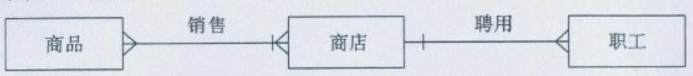
      6. (2) 将E-R 图转换成关系模型,并指出每个关系模型的主码。
         - 商店 (商店编号, 商店名, 地址)
         - 职工 (职工编号, 姓名, 性别, 业绩)
         - 聘用 (职工编号, 商店编号, 聘用期, 月薪)
         - 商品 (商品号, 商品名, 规格, 单价)
         - 销售 (商店编号, 商品号, 月销售量)

   3. 售书过程是，接受读者的订书单，根据图书文件核定订购量，如可以供应，做销售处理，修改图书文件和销售文件，然后开发票，将收款单送财务科，将取书单和发 票给读者;如缺书填写缺书文件，根据缺书文件进行缺书处理，将缺书通知送采购 科。

      1. 做出处理过程的数据流图。
      
         
      
   4. 某快餐店向用户提供午餐配送服务, 这一应用中包含两个实体, 分别是“送餐员"和“用户”, “送餐员“这一实体中包含属性有“员工号”、“姓名”和“电话”, “用户'' 这一实体中包含属性有“配送号”、“地址、“手机号"和"用户名", 请跟就上述条件回答

      1. 请简要描述两个实体之间的关联关系
      2. 试画出该应用中的E-R图
      3. 请将E-R图转换为关系模型并指出主码

2. 2

   1. 使用**白盒测试技术**中的**逻辑覆盖测试**方法测试以下程序段：

      ```c
      void DoWork(int x,int y,int z)
      {
       int k=0,j=0;
       if((x>3)&&(z<10))
       {
       		k=x*y-1;
       		j=sqrt(k);
       }
       if((x=4)||(y>5))
       		j=x*y+10;
       j=j%3;
      }
      ```

      说明：程序段中每行开头的数字（ 1-10）是对每条语句的编号。
      要求：

      1. 画出程序的控制流程图（用题中给出的语句编号表示） P237

         

      2. 以条件组合覆盖方法设计测试用例，并写出每个测试用例的执行路径（用题中给出的语句编号表示） P235
         
         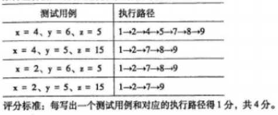
      
   2. ##### 某学校计算机教材购销系统有以下功能:

      1. 学生买书,首先填写购书单,计算机根据各班学生用书表及售书登记表审查有效性。若有效,计算机根据教材库存表进一步判断书库是否有书;若有书,把领书单返回给学生,学生凭领书单到书库领书。
      2. 对脱销的教材,系统统用缺书单的形式通知书库,新书购进库后,也由书库将进书通知返回给系统。
      3. 请就以上系统功能画出分层的数据流图(二级分解数据流图只需画出销售子系统的数据流图)。

         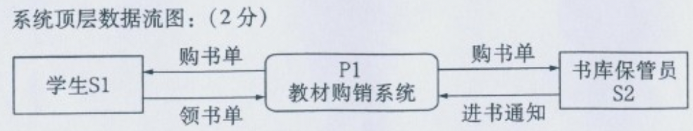

         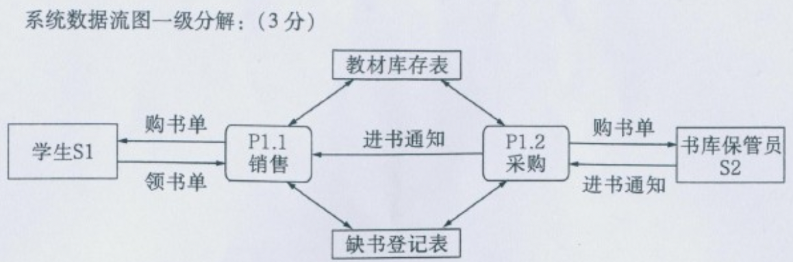

         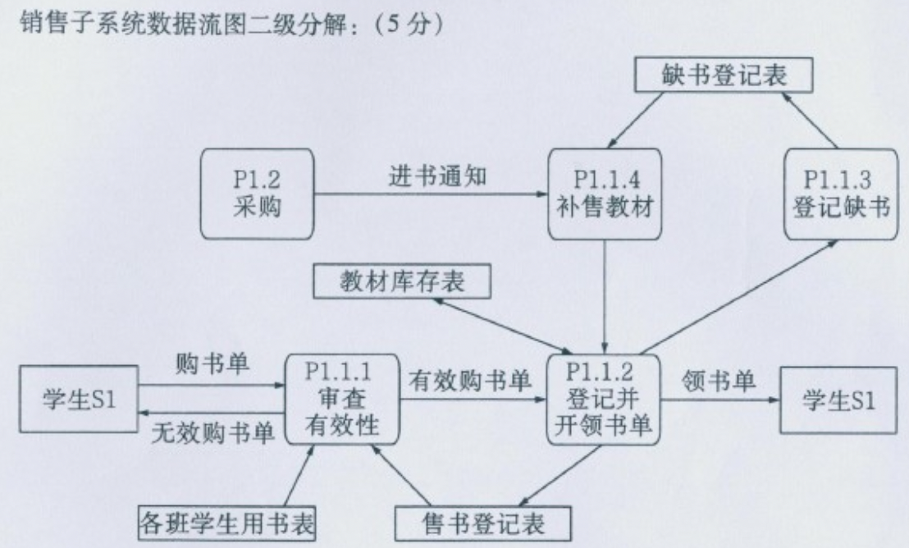

   3. 某单位统计职工科研成果，该单位有多个部门，每个部门有多名职工，每名职工可 以参加多个项工作，每个项目有多名职工参加。现需要如下统计表，试设计至少满 足成果统计表的数据库逻辑结构。

      1. 

         1. 部门 (部门号, 部门名)
         2. 职工 (职工号, 姓名, 职称, 部门号)
         
      
   4. 共享出租租赁企业需建立一套车辆信息管理系统,该系统包含“系统管理”,“车辆管理“和“数据查询”三个模块,其中“系统管理包括“数据存储"\“权限管理"和“数据备份与恢复"三个功能,“车辆管理"包含"车辆信息"、“GPS定位"两个功能,“数据查询"包括“车辆信息查询”和“用户信息查询"两个模块, "GPS 定位" 又包括 "停放地点" 和 "运动轨迹" 两个模块, 请根据上述信息画出共享单车信息管理系统的层次图或 hipo 图

## 第 1 章 信息系统开发概述

### 学习目标

- 信息系统的**基本概念和组成**，这部分是理解后续内容的基础。
- 信息系统开发的基本**过程**，系统开发各阶段的主要**内容**。
- 围绕信息系统开发主要过程的**角色分配**。

### 1.1 信息系统的基本概念

#### 1.1.1 信息系统与信息技术

1. 系统（system）是具有可识别边界的一套相互关联的组件共同工作以达到某种目的。系统反映了人们对事物的一种认识论，即系统是由两个或两个以上的元素相结合的有机整体，系统的整体不等于其局部的简单相加。系统普遍具有以下 9 个要素，如图 1.1 所示。

   1. ① 目的 ② 边界 ③ 构件 ④ 构件之间的关系
      ⑤ 环境 ⑥ 接口 ⑦ 输入 ⑧ 输出 ⑨ 约束

2. 信息系统的概念最早是由明尼苏达大学卡尔森管理学院的教授 Gordon B.Davis 手 1985 年提出的，他下的定义为：信息系统是一个利用计算机软硬件，利用各类分析、计划、控制、决策模型，以及数据库的人机信息系统，可以提供信息用以支持企业或组织的运行、管理和决策功能

   

3. 信息技术是指信息的采集、存储、加工、输出、传递等过程中的各种技术总称，主要包含计算机技术（软硬件）和电信技术（数据、图像和语音网络）。它也常被称为信息和通信技术（Information and Communications Technology，ICT）
   
4. 系统方法要求人们运用系统的观点，从系统整体与部分、功能与结构、系统与环境之间的相互联系和相互作用中考察对象。包含以下 4 个要点：
   
   1. 整体性。
   2. 结构性。
   3. 关联性。
   4. 功能性。
   

#### 1.1.2 信息系统的结构

1. 功能结构
   1. 输入
   2. 输出
   3. 储存
   4. 处理
   5. 反馈
2. 应用结构
   1. 根据信息系统服务对象的不同来划分。从横向看，信息系统可以承担多种服务职能
      - 生产子系统、市场子系统、供运子系统、财会子系统、人事子系统等。
   2. 丛纵向上来看，企业可划分为
      1. 战略管理层、战术管理层、知识管理层、操作管理层
3. 软件结构
   1. 信息系统的软件结构是指支持信息系统各种功能的软件系统或者软件模板组成的系统结构。
      1. 软件结构可以采用功能-层次矩阵表示。

#### 1.1.3 信息系统的类型

1. 信息系统按信息系统用户类别可分为
   1. 前端信息系统
   2. 后端信息系统
2. 按照提供的功能、服务组织的层次，信息系统可分为：
   1. 事务处理系统；
   2. 管理信息系统；
   3. 办公自动化系统
   4. 知识工作系统
   5. 决策支持系统；
   6. 经理信息系统。

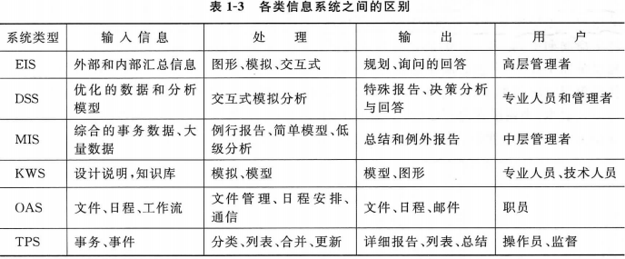

#### 1.1.4 信息系统的生命周期

1. 信息系统的生命周期大致可以划分为3个阶段：
   1. 开发阶段、
   2. 实施阶段
   3. 运行和维护阶段
2. 开发阶段的主要任务是构造系统，主要进行系统的规划、分析、设计与实现，需要在开发环境下完成。
3. 当信息系统开发完成后，需要在用户环境下进行安装和实施，通过验收后正式毯交给用户。
4. 系统便从开发环境转换到生产环境中，并进入运行与维护的生命周期。

### 1.2 信息系统开发过程 (重要)

#### 1.2.1 系统规划

1. 信息系统生命周期划分为5个阶段：
   1. 系统规划、
   2. 系统分析、
   3. 系统设计、
   4. 系统实施、
   5. 系统运行与维护。
2. 确定信息系统及项目的优先顺序
3. 组建信息系统项目团队
4. 确定信息系统项目范围
5. 启动项目

#### 1.2.2 系统分析

1. 需求理解
2. 需求表达
   1. 需求明确之后，需要采用规范化的、结构化的模型将其描述清楚。主要是借助一些逻辑该过程也称为“**逻辑设计**”过程。

#### 1.2.3 系统设计

设计阶段的目标是根据系统分析说明书的要求设计新系统的技术蓝图，从而为系统的实现奠定基础，该过程也称为“**物理设计**”过程。

1. 体系架构设计
2. 详细设计
3. 数据库设计
4. 输入和输出界面设计
5. 代码设计

#### 1.2.4 系统实施

该阶段的主要交付成果是可运行的系统。

1. 编程与测试
2. 系统转换
3. 用户培训

#### 1.2.5 系统运行与维护

它是系统建设的收获阶段。


### 1.3 信息系统的相关角色

6种角色：信息系统所有者、信息系统用户、信息系统分析员、信息系统设计员、信息系统构造人员和项目经理

1.3.1 信息系统所有者

1.3.2 信息系统用户

1.3.3 信息系统设计员

1.3.4 信息系统构造人员

1.3.5 信息系统分析员

#### 1.3.6 项目经理

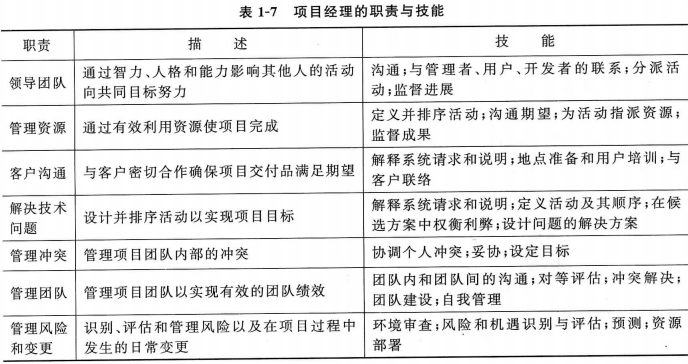

#### 1.3.7 信息系统各种角色比较

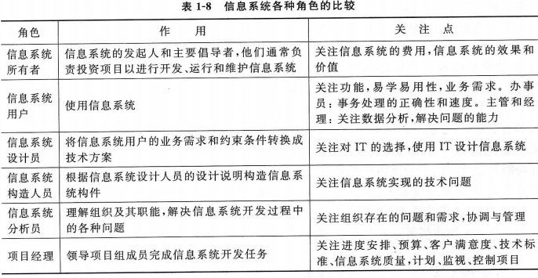

### 1.4 案例分析 ——校园二手书交易平台的设计与实现

1.4.1 系统需求分析

1.4.2 系统设计

1.4.3 系统实现

1.4.4 案例思考

本章小结

思考与练习

## 第 2 章 信息系统开发路线、方法与工具

### 学习目标

- 几种典型的信息系统**开发路线**。
- 合适的开发路线与方法。
- 自动化工具与技术。

### 2.1 信息系统开发路线概述

路线，主要取决于系统开发的目标资源和成本篑限制条件

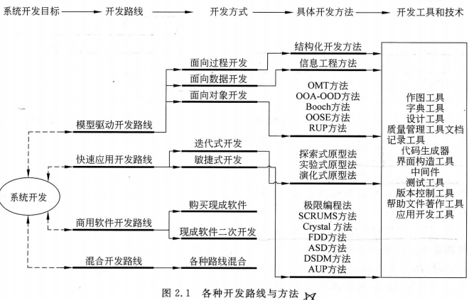

### 2.2 模型驱动开发路线

- 面向过程方法（Process Oriented，PQ：面向过程的开发方法是以数据处理为核心，通过了解数据在系统中如何流动来建立数据流图和实体关系图
- 面向数据方法（Data Oriented，Do）：面向数据的开发方法首先分析企业的信息需求，建立企业的信息模型，然后建立全企业共享的数据库
- 面向对象方法（Object Oriented，OO）：面向对象的开发方法是先分析企业的一些对象，把描述对象的数据和对对象的操作放在一起，如果多个对象共享某些数据和操作，共享的数据和操作就构成了对象类。

#### 2.2.1 面向过程方法

1. 面向业务过程
2. 面向数据处理过程


结构化方法是20世纪90年代较为流行的开发方法。

- 基本思想是：用系统工程的思想和工程化的方法，按用户至上的原则，结构化模块化、自顶向下地对系统进行分析与设计。
- 结构化方法以功能为核心，将数据流图作为驱动开发的力量。最近，随着关系数据库模型的盛行数据流图的重要性开始减弱，该方法也更加强调以数据为核心，重点放在实体关系图上。
- 该方法基于两种技术用于过程建模的数据流程图和用于数据建模的实体关系图。


1. 结构化系统分析设计开发方法（Structured System Analysis and Design，SSAD）
   1. 亚格区分工作阶段。
   2. 强调开发过程的整体性、全局性
   3. 充分预料可能发生的变化
   4. 工作文件的标准化和文档化。
   5. ）系统开发周期长。
   6. 方法是线性而非迭代或者递增的
   7. 开发出来的系统其总体结构和用户现实的业务运作过程存在着较大的差异，即寄观世界的问题领域系统的可理解性差。
   8. 系统的可维护性和稳定性差

#### 2.2.2 面向数据方法

- 信息工程方法的主要思想是
  1. （1）所有信息系统的开发建设都应该以数据为中心，不应该以处理为中心
  2. （2）数据结构是稳定的，而业务流程是多变的
  3. （3）最终用户必须真正参加信息系统的开发
- 系统开发基本步骤
  1. 企业规划
  2. 业务域分析：
  3. 系统设计
  4. 构造
- 面向过程的系统开发方法，侧重于信息系统中数据的流动、使用和转换


#### 2.2.3 面向对象方法

1. 面向对象方法的主体，具有以下特征
   1. 封装性。将对象作为一个独立存在的实体，从外部可以了解其功能，但内部细节是隐蔽的，不受外界千扰。对象之间相互依赖性很小，因此可以独立被其他各系统所选用。
   2. 继承性。对象和类之间的层次结构具有继承关系，即子类继承父类的属性
   3. 多态性。各种对象之间具有统一、方便、动态的消息传递机制。
2. 面向对象开发方法具有以下优点
   1. 无缝衔接。
   2. 开发效率高。
   3. 容易维护。
   4. 容易扩展
3. 在一些新的问题
   1. 由于面向更高的逻辑抽象层，使得在实现的时候，不得不做出性能上的牺牲
   2. 如果实施服务器采用的是关系数据库，则概念和实施之间的语义鸿沟会非常明显。
   3. 项目管理十分困难。

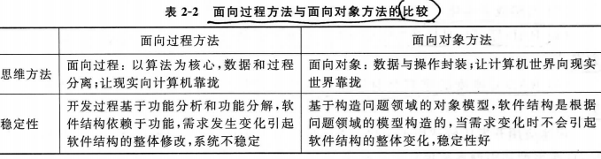


### 2.3 快速应用开发路线

快速应用开发路线（Rapid Application Development，RAD）是一种系统开发策略，该策略强调用户深入参与到一系列系统工作原型的快速进化和构造过程中，以加速系统开发过程，系统工作原型最终将成为目标系统（或者系统应用的一个版本）。快速应用开发路线的基本思想为：将系统开发组织成一系列重点突出的研讨会，研讨会要让系统所有者、用户分析员、设计人员和构造人员一同参与。通过一种迭代的构造方法加速需求分析和设计过程，让系统用户更主动地参与到分析设计和构造活动中来，让用户可以提前看到可以工作的系统，进而提出改进意见，不断优化。
绝大多数快速应用开发方法推荐系统分析员采用特定的技术和计算机工具来加速分析、设计、实施过程，例如采用CASE工具、JAD会议、可视化编程语言，简化并加速编程和代码产生过程。快速应用开发路线下主要有两种开发方式：迭代式开发和敏捷式

1. 开发快速应用开发具有如下优点

   1. 它鼓励用户和管理层主动参与（相对于不可工作的系统模型的被动响应），这增加了最终用户对项目的热情。

   1. 项目具有较高的可视性和支持度，因为用户深入地参加到整个开发过程中，用户和管理层看到可工作的基于软件的方案比模型驱动开发要快得多3）在原型中错误和遗漏往往在比在系统模型中更早地被发现

   1. 测试和培训是基本原型方法的一个自然副产品

2. 快速应用开发存在如下缺点

   1. RAD鼓励“编码、实现和修改”，可能会增加运行、支持和维护系统所需的费用
   2. 省略或者简化了问题分析，有可能导致错误的问题
   3. RAD原型容易导致“先人为主”，可能不会鼓励分析员考虑其他更有价值的技术方案。
   4. RAD对速度的重视会对质量造成伤害，因为这种方法中充斥着大量不明智的径
   5. 快速应用开发比较适用于用户需求不确定或不明确，同时规模不算太大的项目，因此，RAD在小型和中型系统项目中最流行。


#### 2.3.1 迭代式开发

1. 迭代式开发的重点是通过各阶段的迭代设计缩短开发应用软件和系统的时间，在循环的每次迭代中，都要构造和测试“一些设计原型或部分功能系统”。

2. 三种类型：

   1. 探索型（Exploratory Prototyping）主要是针对开发目标模糊、用户和开发人员对项目都缺乏经验的情况，其目的是弄清对目标系统的要求，确定所期望的特性并探讨多种方案的可行性
   2. 实验型（Experimental Prototyping）：用于大规模开发和实现之前考核验证方案是否合适，规格说明是否可靠。
   3. 演化型（Evolutionary Prototyping）：其目的不在于改进规格说明和用户需求，而是将系统改造得易于变化，在改进原型的过程中将原型演化成最终系统，它将原型方法的思想贯穿到系统开发全过程，对满足需求的改动较为适合

3. 原型设计和开发的具体步骤

   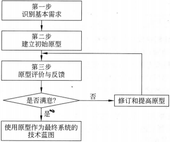

   

#### 2.3.2 敏捷式开发

1. 敏捷式开发主要是以编程为核心的方法，目的是根据迅速变化的需求快速开发软件。
2. 敏捷式方法和传统方法学的本质的不同之处在于它更强调可适应性而不是可预测性，是种更加主动的模式。为获取这种敏捷性，使用一些提供的必要的纪律和反馈的实践，遵循使软件保持灵活、可维护的设计原则和设计模式。
3. 敏捷的核心是实践。
4. **敏捷式开发方法包括极限编程（Extreme Programming，xP）**、SCRUM、水晶方法（Crystal Methods）特征驱动软件开发（Feature Driven Development，FDD）、自适应软件开发（Adaptive Software Development，ASD），动态系统开发方法（Dynamic Systems Development Method，DsDM等。敏捷式方法也经常与面向对象方法配合使用。
5. 极限编程方法的特点在于：测试和高效编程是XP方法的核心。
6. 然而，XP方法需要一系列的原则。否则，项目就不聚焦，发生混乱。因此，一般不超过12人的小型开发团队比较适合不适合大的应用。此外，该方法也需要现场进行用户输入。

### 2.4 商用软件开发路线

#### 2.4.1 购买现成商用软件

1. 购买现成商用软件的步骤如下：
   1. 在信息系统需求分析阶段进行一些初步的“技术市场调研”：确定存在着哪些软件包方案，这些软件有什么特征，以及用来评价这些应用软件的准则，确定是否需要采纳购买方案。
   2. 定义了业务需求之后，必须同提供候选的软件包的供应商进行交流，供应商提交他们的软件方案的建议或报价。这些建议方案按照需求方案说明书中确定的业务和技术需求进行评价。
   3. 与最终选择的供应商协商软件合同和订单，以及安装和维护软件可能需要的服务合同。供应商提供基本软件和文档，软件的安装和实现服务通常由供应商提供，或由软件的服务提供商提供。
   4. 当购买了应用软件包后，组织几乎都需要改变它的业务过程，以便更有效地利用该软件。由于很少有应用软件包能够在安装时满足所有的业务需求，需要进行差距分析来确定软件包的功能和特征不能满足哪些业务需求。对于不能满足的需求，可以要求软件供应商在可以接受的范围内对软件包进行定制；定义“附加软件需求”；定义“新增软件需求”。所谓差距分析是将商用软件包的业务和技术需求与特定的商用软件包的功能和特征进行比较，以定义不能满足的需求。
   5. 安装并测试基本软件，根据自己的偏好进行选择，并对参数进行设定，同时完成测试。设计并构造了所有的附加软件以满足附加的业务需求，系统最终经过测试并投入运行。
2. 购买现成商用软件包的主要优点包括
   （1）可以更好地实现新系统，因为不需要大量的编程工作
   （2）应用软件供应商将他们的开发费用平摊到购买软件的所有客户身上。这样，他们可以不断地投资以改进软件的特点，功能和可用性，这往往是单个企业无法做到的
   （3）应用软件供应商对重大的系统改进和错误修改负有责任。
   （4）在一个行业内部，许多企业的功能相似性多于差异性。每个组织自己“重打鼓另开张”没有什么意义，因此，购买软件也可以减少组织的重复建设与开发。
   商用软件包路线的主要缺点包括：
   （1）成功的商用软件实现依赖于软件供应商的长期成功和生存能力，如果供应商不工作，企业就会失去技术支持和未来的改进。
   （2）购买的系统很少能反映理想方案，而企业可以通过内部开发实现理想方案
   （3）改变业务过程以适应软件几乎总是会遇到一些阻力，一些用户将不得不被解雇或者分配新工作；而有些人的地位会发生变化，他们认为这些变化是技术驱动的，而非业务驱动的
   目前的现实证明，无论如何，购买商用软件的趋势不能被忽视。

#### 2.4.2 现成软件包二次开发

1. 在下列3种情况下可以优先考虑选择使用软件包开发系统的策略：
   1. 需要开发的系统功能是多数组织都要用到的一些通用功能，比如，工资管理、人力资源管理、会计财务管理、应收应付账款管理等。因为这类软件包很多，有比较宽的选择余地，成本也不会很高。
   2. 缺少组织内部的开发人员。不是每个组织都有足够的内部信息技术专业人员可以承担系统开发任务的，这时就可以考虑全部或部分地选用软件包来开发自己的信息系统。
   3. 开发的系统属于微机系统。因为目前市售的绝大多数应用软件包都是运行在微机环境下的。
2. 软件包开发的优点利用现成软件包开发
   1. 缩短开发时间。
   2. 可以得到比较好的维护。
   3. 能减轻组织内部对系统开发的阻力
3. 利用软件包开发的缺点
   1. 功能较为简单
   2. 难以满足特殊要求
   3. 实施的费用随客户化工作量的增大而急剧上升
4. 利用软件包开发系统的步骤
   1. 系统分析
   2. 系统设计
   3. 编程、调试、转换、安装、修改、设计程序接口、做文档、切换测试培训用户。
   4. 运行与维护，改错与升级。

### 2.5 选择合适的开发路线与方法

1. 选择开发方法
   1. 用户需求的明确性
   2. 对技术的熟悉程度
   3. 系统复杂性
   4. 系统可靠性
   5. 项目进度
   6. 进度可视性

### 2.6 自动化工具与技术

#### 2.6.1 case 定义

1. CASE（Computer Aided Software Engineerin是一种自动化或半自动化的方法目的是减少重复工作量，它能够全面支持除系统调查外的每一个开发步骤，通过将许多常规化的开发工作自动化和强化设计的各项规则，使开发者解脱出来，将精力集中到更需要创造力的工作中
2. 狭义地讲，CASE是一组工具和方法的集合，可以辅助软件生存周期各阶段的开发工作

#### 2.6.2 case 工具分类

1. CASE工具主要包括需求分析工具、软件设计工具、数据库设计工具、项目管理工具、程序设计和代码生成工具、测试工具，几乎涵盖了信息系统开发的整个生命周期的各个环节


#### 2.6.3 基于 case 的系统开发过程

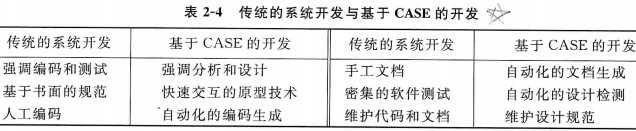

1. 基于CASE的系统开发过程主要分为数据生成和应用生成两大部分


#### 2.6.4 case 工具的特点

1. CASE工具的优点在于
   （1）使得系统开发过程中的许多手工作业得以自动化，为前期设计和分析提供了帮助，使错误大大减少
   （2）工具具有合法性检测功能，可以完成数据流图的自动平衡，校核数据流图及其说明的数据完整性和一致性
   （3）CASE工具包括原型法的功能，可以帮助分析员迅速绘制人机界面或报表布局供用户审核。
   （4）CASE工具包的一个核心部分是信息储存库，它存储了系统分析员在项目开发中定义的所有信息。
   5）CASE工具加快了软件开发速度，CASE工具简化了软件开发的管理和维护CASE工具的局限性在于：
   （1）CASE只是一种辅助的开发工具，在实际开发一个系统中，CASE环境的应用必须依赖于一种具体的开发方法
   （2）CASE无法自动生成具有特定功能的系统，无法实现与数据库和第四代语言之间的接口。
   （3）CASE不能自动进行系统分析，因此也不可能彻底改变系统分析和设计过程。因此，在系统开发过程中应当扬长避短，合理利用CASE技术来规范信息系统的开发过程，可以有效地避免因需求不清或设计不合理而造成的程序反复修改，使开发出的系统更符合用户的需要。但在使用CASE工具定义分析和设计对象时，一定要做到严格且完整，才能生成高质量的应用程序。

### 2.7 案例分析 ——case 工具在系统开发中的应用

2.7.1 采用 powerdesigner 进行过程建模

2.7.2 采用 powerdesigner 进行数据建模

2.7.3 采用 powerdesigner 进行对象建模

2.7.4 使用 powerdesigner 生成信息系统开发报告

2.7.5 案例思考

本章小结

思考与练习

## 第 3 章 信息系统项目管理

### 学习目标

- 信息系统项目的管理过程。
- 作为高效的项目经理所需要的技能
- 项目发起、项目规划、项目执行和项目终结各阶段的主要任务及活动。
- 关键路径规划的含义，描述甘特（Gantt）图和网络图的创建过程
- 项目管理软件如何应用于支持项目进度的表示和管理。

- 项目是一个（临时的）唯一的、复杂的和关联的具有同一目标或者目的并且必须在特定时间里、在预算内按照规格说明要求完成的活动序列。项目是唯一的，体现在每个项目都不相同，即使开发相同的系统，由于时间和资源有所不同，项目也不同。
- 信息系统项目也具有上述这些特征。信息系统项目管理是指在指定时间内用最少的费用开发可接受的系统的管理过程，具体内容包括确定范围、计划、人员安排、组织、指导和控制。项目管理的实质是在系统质量、项目完成时间、项目成本这三个要素之间进行权衡。它们之间相互影响，任何一方发生变动都会对另外两个要素产生影响。有效的项目管理有助于确保系统开发项目满足客户期望，并在规定的预算和时间内交付系统

### 3.1 信息系统项目管理生命周期

- 信息系统项目管理过程贯穿于整个系统开发过程，按照项目进展可以大致划分为4个阶段：
  - 项目发起、项目规划项目执行和项目终结。
- 在这4个阶段中的每个阶段都必须执行一些活动。
- 项目发起的核心是评估项目的大小、范围和复杂性，以及建立支持后续项目活动的规程。
- 项目规划的核心是定义清楚的、离散的活动以及完成每个活动需要做的工作：项目执行的核心是将项目发起阶段和规划阶段的计划付诸行动。
- 项目终结的核心是把项目带到结束。遵循正式的项目管理过程能够大幅度增加项目成功的可能性

#### 3.1.1 项目发起


#### 3.1.2 项目规划 （重要）

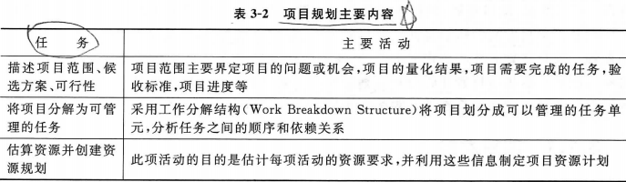


#### 3.1.3 项目执行

1. 项目执行阶段主要任务是使基线项目计划付诸于行动

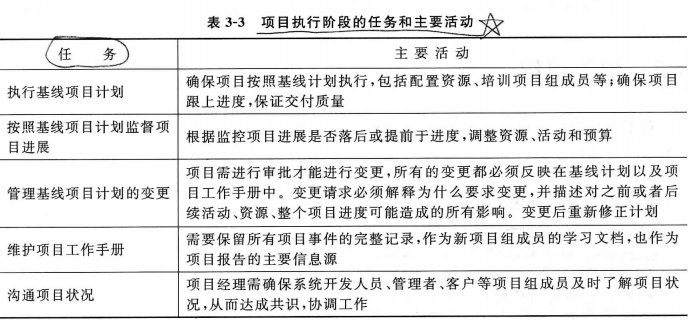


#### 3.1.4 项目终结

1. 项目终结阶段的核心是把项目进行到底


### 3.2 项目组织

#### 3.2.1 单纯型项目组织

- 单纯型项目组织特点如下：小组成员全职投入项目。
- 优点是：
  - 项目经理对项目拥有完全的自主权；
  - 成员只需要面对一个老板；
  - 沟通层级短，决策形成快
  - 荣誉感和使命感高。
- 缺点是：
  - 人员与设备无法共用，资源浪费
  - 组织的目标和策略容易被忽略
  - 职能部门与新科技脱节；
  - 项目小组成员完成项目即解散，容易导致项目延误。


#### 3.2.2 职能型项目组织

- 这种项目组织形式为：项目建立在职能部门中
- 优点
  - 成员可以同时参与多个项目；
  - 专业技能不会因为人员离开而遗失
  - 成员有机会升迁；
  - 职能部门中有大量专业人员处理技术问题。
- 缺点：
  - 项目中与职能部门的需要无直接相关性的地方容易被忽略
  - 客户的需求容易被忽略。


#### 3.2.3 矩阵型项目组织

- 矩阵型项目组织特点如下：项目组成员由不同职能部门提供，项目经理决定工作内容和完成时间，职能部门经理控制人员和技术。
- 优点是
  - 强化与职能部门的沟通；
  - 项目经理对项目负成败的责任
  - 降低资源重复；
  - 可以执行上级组织的政策
  - 项目可获得较多的支持。
- 缺点是：
  - 受职能部门和项目组的双重管理；
  - 项目经理需要较强的谈判技巧；
  - 项目组成员不容易全心投入项目。


### 3.3 项目管理技术

#### 3.3.1 工作分解结构

工作分解结构（Work breakdown Structure，WbS可以将项目层次化地分解成开发阶段、开发活动和开发任务

- WBS最低层次的项目交付成果称为工作包，工作包的定义应考虑80小时法则或者两周法则，即任何工作包的完成时间应该不超过80小时，即不超过两周。这样，每两周对所有工作包进行一次检查，可以控制项目的变化。
- 在分解时，尽量做到以下几点：
  - 某项具体任务只能在一个工作包出现。
  - 分附原则个工作包只能由一人负责，虽然可以有多人参与，但责任人只能是一个，这样才会责任清楚，不相互推卸
  - 任务分解应与实际执行方式保持一致
  - WBS不仅要合理，而且要具有一定的适应性，能够应付无法避免的需求变更
  - 鼓励项目团队积极参与创建wBS，提高WBS的合理性和有效性
  - 所有成果需要文档化


#### 3.3.2 甘特图

甘特图（Gantt Chart）也称横道图，是一种最直观的进度计划方法，

- 甘特图的优点有
  - 能够清楚地表达活动的开始时间、结束时间和持续时间，易于理解，并能为各层次的人员所掌握和运用
  - 使用方便，制作简单，应用广泛。
  - 不仅能安排时间，而且能与劳动计划、资源计划资金计划相结合
- 主要缺点有：
  - 很难表达工程活动之间的逻辑关系，看不出各项工作之间的相互依赖和相互制约的关系。
  - 工程活动之间的前后顺序及搭接关系不能确定。
  - 不能确定某项工作是否提前或推迟，以及延长持续时间会对哪些活动造成负面影响，以及对整个工期的影响程度。
  - 不能表示活动的重要性，如哪些活动是关键的或非关键的，哪些活动有推迟或拖延的余地，及余地的大小
  - 不能用计算机处理，即对一个复杂的工程不能进行工期计算
- 主要领域有
  - 可直接用于一些小项目，由于活动较少，可以直接用它来排工期计划。
  - 项目初期由于复杂的工程活动尚未揭示出来，一般人们都用甘特图作总体计划
  - 上层管理者一般仅需了解总体计划，故都用甘特图表示。
  - 作为网络分析的输出结果。现在几乎所有的网络分析程序都有工期计划甘特图输出功能，而且它被广泛使用。


#### 3.3.3 计划评审技术 PERT

**项目评审技术（Plan Evaluation and Review Technique，PERT）**是一种科学的计划管理技术，广泛应用于项目管理。PERT图是描述任务之间依赖方式的最佳方式，因为它显示了任务之间的完成顺序。这种方法根据工作分解结构分解后的结果，在任务之间建立起依赖关系，估计每个任务的工期，再根据这些数据进行整个项目工期的计算，同时计算出每个任务的时差，找到影响项目工期的任务（关键任务）。

- PERT的应用步骤如下：
  - （1）根据工作分解结构列出计划期内所有的任务。根据工作分解结构分解后的结果，在任务之间建立起依赖关系
  - （2）安排任务的顺序，确定任务之间的相互依赖关系和前后顺序形成网络图、
  - （3）情算出完成这些任务所需要的时间，PERT的作业时间（工期）有三个估计值（最乐期a，最可能工期m，最悲观工期b），而真正用来计算用的任务工期为（a+4m+b）/6
  - （注：这种加权平均法，套用了概率论中B分布的原理）。
  - （4）进行网络计算。计算每个任务的工期，最早开始、结束时间，最晚开始、结束时间富余时间，再根据这些数据进行整个项目工期的计算，同时计算出每个任务的时差，找到影响项目工期的任务（关键任务）。

将各节点之间的关键路线相连，即可计算全图的关键路线，即项目的关键路线。项目的关键路线即整个项目所需最长时间。本例为1-2-3-4-5-9-10-11-12，共需要420天


### 3.4 案例分析 ——某系统开发项目管理失败原因分析

本章小结

思考与练习

## 第 4 章 需求获取

### 学习目标

通过本章学习，要求掌握

- 设计并执行访谈的选择，以及制订访谈计划以确定系统需求
- 观察工作者方式和分析业务文档方式以确定系统需求的优缺点
- 计算如何为需求获取提供支持。
- 计划一个联合应用设计会议
- 在需求获取过程中使用原型。
- 确定需求的现代化方法。
- 需求获取技术如何应用于网络应用的开发
- 系统分析是系统开发生命周期的一个组成部分，通过它可以确定现有信息系统的功能并评估用户期望在新系统中看到什么。**系统分析由两个子阶段构成：需求获取和需求结构化**
- 需求获取涉及的主要技能是管理和沟通技能，是在整个系统开发过程中技术含量最少的阶段。但是，如果需求获取执行得不好，造成的后果却比其他阶段严重。

### 4.1 系统需求概述

#### 4.1.1 需求获取的重要性

需求获取是在问题及其最终解决方案之间架设桥梁的第一步，其实质是理解项目中描述的客户需求。一旦理解了需求，分析者、开发者和客户就能探索出描述这些需求的多种解决方案。需求获取主要涉及系统分析员，他们同系统用户和所有者一起工作，在系统开发的早期阶段确定对信息系统的业务需求的详细理解。

- 对于客户而言，他们在需求分析过程中可能会因为以下原因而影响需求的顺利确定；
  - 客户不明白他自已需要什么
  - 客户会不断更新所提出的需求
  - 客户与分析员之间缺乏有效沟通
  - 客户缺乏技术上的知识
  - 客户缺乏对软件开发的知识

#### 4.1.2 系统需求分类

- 系统需求可以从两方面理解，即
  - 用户角度（系统的外部行为）
  - 开发者角度（系统内部特性）。
- 需求包含三个层次业务需求、用户需求、功能需求（及非功能需求）
- 功能需求是指系统能够实现的基本功能和完成的任务
- 非功能需求是指衡量系统能否良好运行的定性指标。


### 4.2 需求获取过程 （重要）

- ##### 需求获取的途径主要有以下3点

  - （1）通过与用户对话或者观察用户收集的信息，如访谈手稿、观察和分析文档的笔会议纪要等。
  - （2）现有的书面信息：业务使命和战略陈述、业务表格、报告和计算机演示范例、规程手册、工作描述、培训手册、流程图和现有系统的文档、咨询报告。
  - 3）基于计算机的信息：来自于联合应用设计会议的结果、组群支持系统会议的手稿或者文件、现有系统的CASE资料库内容和报告、来自系统原型的显示和报告

- ##### 需求获取主要包括以下活动

  - （1）了解用户需求，即通过与客户访谈或调研确定一些基本需求信息
  - （2）分析用户需求。将客户需求与可能的系统功能或非功能需求相关联
  - （3）编写需求文档。使客户需求信息结构化编写成文档或者示意图
  - （4）评审需求文档。选择客户代表评审文档并纠正存在的误解或者错误。
  - （5）需求管理。主要指需求变更以及需求跟踪

#### 4.2.1 了解用户需求

- 方式了解系统需求
  - 识别系统用户
  - 用户调研与访谈
  - 访谈结果整理
  - 访谈结果呈现
- 活动
  - 明确标识出那些未确定的需求项（在需求分析初期往往有很多这样的待定项）；
  - 使需求符合系统的整体目标；
  - 保证需求项之间的一致性，解决需求项之间可能存在的冲突


#### 4.2.2 分析用户需求

- 排查以下方面的问题
  - 是否遗漏了重要的需求
  - 是否存在矛盾的需求；
  - 是否存在不可行的需求；
  - 是否存在重复的需求；
  - 是否存在模棱两可的需求


#### 4.2.3 编写需求文档

**需求文档是需求获取阶段的主要成果**

- 求规格说明的主体由需求陈述构成，主要包含如下内容
  - 系统应该提供的功能和服务
  - 系统的非功能需求，包括系统的特征、性能、属性等；
  - 系统开发或者运行必须遵守的约束条件
  - 系统与其他系统之间的接口。


#### 4.2.4 评审需求文档

- 用户评审和同行评审两类
  - 同行评审的目的是在软件项目初期发现那些潜在的缺陷或错误，
- 通过评审的需求文档称为需求基线（baseline）


#### 4.2.5 需求管理

需求管理主要涉及两方面的内容：需求变更以及需求跟踪。

- 需求变更

  - 需求变更的基本流程如下：
    1. 提出变更请求。
    2. 变更影响分析。
    3. 变更批准。
    4. 变更执行。
    5. 变更测试
    6. 变更结束。

  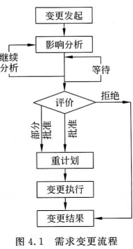

- ##### 需求跟踪（Requirements Tracing）

  - 是指跟踪一个需求使用期限的全过程，需求跟踪包括编制每个需求同系统元素之间的联系文档，这些元素包括其他类型的需求，体系结构，其他设计部件，源代码模块，测试，帮助文件等。需求跟踪提供了由需求到产品实现整个过程范围的明确查阅的能力。
  - 需求跟踪的目的是建立与维护“需求一设计一编程一测试”之间的致性确保所有的工作成果符合用户需求①。
  - 以需求和设计之间的跟踪为例旧目标主要有三个：
    - 进行设计时，保证需求没有遗漏地被实现
    - 需求变更时，能找到设计中需要变更的地方。
    - 设计变更时，能找到受影响的需求

### 4.3 需求获取的方法


#### 4.3.1 访谈


#### 4.3.2 名义团体技术

名义团体技术（Nominal Group Technique，NGT），顾名思义就是工作在一起解决间题的个人是名义上的团体，用于在团队成员中产生想法，是群组访谈的一种方式。


#### 4.3.3 直接观察用户


#### 4.3.4 文档、文件、表格抽样

1. 第一种有用的文档是书面工作规程。
2. 第二种对系统分析员有用的文档是业务表格
3. 第三种有用的文档是现有系统产生的报告


#### 4.3.5 联合应用设计

联合应用设计（JAD的主要思想是把主要用户、管理者、参与项目的系统分析员聚集在一起，类似于群组访谈；但JAD遵循一个特殊的角色和日程结构。使用JAD在分析阶段的主要目的是通过紧凑的、结构化的、非常高效的过程，从参与系统的关键人员那里同步收集系统需求，也便于系统分析员看到哪些领域存在一致性，哪些领域存在冲突。JAD会议通常在异地召开，通常可持续长达一周，使参与者远离干扰以便集中精力进行系统分析。


#### 4.3.6 在需求获取中使用原型

从20世纪80年代中期开始原型法作为需求分析的主要方法日益普遍应用。原型模拟最终软件的屏幕显示，用户可以看到最终软件的呈现形式。原型法是分析员和用户参与的迭代过程，从而构造信息系统的初始版本，并根据用户的反馈进行重构。

- 采用原型法需求

  - 需求调查分析。
  - 需求原型设计。
  - 进行需求评审。

- ##### 采用原型法进行需求获取主要适用于以下情况

  - 用户需求不清楚或者不理解时，例如开发全新系统
  - 开发复杂系统或者具体的系统呈现形式需要探讨；
  - 系统开发涉及多个关联方的参与
  - 已经有现成的工具（例如表格和报告产生器）和数据来快速构造工作系统

- 原型作为需求获取工具也有一些缺点包括：

  - 原型法趋向于避免创建正式的系统需求文档，这使得系统更加难于开发成为全面工作的系统
  - 原型法特殊针对最初的用户，难于传播并适应于其他潜在用户
  - 用户通常是独立的系统，因而忽略了与现有的其他系统的共享数据和交互，以及按比例增加应用等问题；
  - 绕过了SDLC中的检查，使得某些更加细致的但是十分重要的系统需求被遗忘（例如，安全、某些数据输入控制、跨系统的数据标准化等）。


### 4.4 案例分析 ——客户关系管理系统的需求获取

本章小结

思考与练习

## 第 5 章 过程建模

### 学习目标

通过本章学习，要求掌握：

- 逻辑过程建模。
- 按照特定的规则绘制数据流图，形成准确的、结构良好的过程模型
- 将数据流图分解为低层次的图形。
- 平衡高层和低层数据流图。
- 4种类型的数据流图之间的区别，即当前的物理流程图、当前的逻辑流程图、新的物理流程图、新的逻辑流程图
- 使用数据流图作为工具，支持信息系统的分析。
- 第4章介绍系统分析员收集必要信息的各种方法和怎样确定信息系统需求，本章的核心是描述如何对信息系统需求采用规范化方法进行表达，数据流图对数据如何流过系统、数据流之间的关系、数据如何储存等内容进行建模，数据流图也显示了变更或者转换数据的过程。因为数据流图关注的是过程之间的数据流动，所以被称为过程模型

### 5.1 过程建模概述

- 因为数据流图关注的是过程之间的数据流动，所以被称为过程模型

- **逻辑模型** 是描述系统是什么和做什么的非技术性的图形化表示，也称为概念模型或者业务模型。
  - 逻辑模型消除了由于实现方式而导致的偏见，降低了由于过于关注细节而丢失业务需求的风险，使得我们可以用非技术性的或较少技术性的语言与最终用户进行沟通。
- 过程（Pces也称为处理加工，变换等。
  - **过程建模**是围绕数据的处理建立模型的一种技术，它记录系统的“过程”和由系统的“过程”实现的逻辑、策略和程序

### 5.2 数据流图 （重要）

#### 5.2.1 数据流程图的概念和作用

- 数据流图（Data Flow Diagram，DFD）是过程建模的一种工具，用于分析、描述信息系统的数据转换和流动状况，显示系统内所有的基本成分及其相互联系的概况和细节。


#### 5.2.2 数据流程图的基本符号

- 数据流程图由4个部分组成：

  - 外部实体、处理过程、数据存储、系统中的数据流

  

- 外部实体

  

  - 外部实体是与系统交互的外部的人员组织部门、其他系统或者其他组织，也称为源点终点。外部实体中支持系统数据输入的实体称为源点，支持系统数据输出的实体称为终点它说明了外部数据的来源和去处，指明了系统的边界。
    外部实体通常是以下几种形式：办公室，部门；外部组织；另一个企业或者信息系统；系统的最终用户或者管理人员等
    外部实体的表示方法如表5-1所示，通常外部实体在数据流程图中用方形框表示，框中写上外部实体名称。为了避免在数据流图上出现数据流的线条交又，同一个外部实体允许在一张图上出现多次。

- 过程

  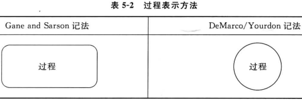

  - 在信息系统中，过程是指对输入数据流或条件做出响应的工作，即对数据进行处理或者变换，因此也称为处理或者转换。系统中的过程大致可以划分为三类一是功能过程，是套和企业相关活动和正在进行的活动，功能没有开始和结束。二是事件过程，功能由响应事件的过程组成，事件必须作为一个完整的逻辑单位工作，也被称为事务，接受输入而触发其执行，对输入作出响应后，事件结束。三是基本过程，是指为了完成一个事件的响应所需要
  - 的离散的、详细的活动或任务。每一种过程又包括数据输入数据处理和数据输出三个部分。系统本身也可以看做是一个过程。
    在数据流程图中过程用带圆角的长方形表示，有时也采用圆形进行表示，如表52所示。

- 数据流

  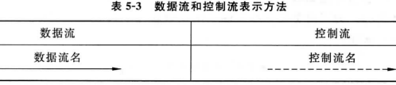

  - 数据流是一个过程的数据输入或数据输出，是流动中的数据。数据流是模拟数据在系统中传递过程的工具。数据流也用于表示在文件或数据库中创建、读取删除或修改数据数据流可以汇合，组合数据流是由其他数据流构成的数据流。数据流也可以分叉，分支的数据流是分成多个数据流的数据流，指示了一个数据流的所有或者部分到不同的目的地的路径。数据流用来表示数据流值，但不能用来改变数据值在数据流程图中用一个水平箭头或垂直箭头表示，箭头指出数据的流动方向，箭线旁注明数据流名。数据流图中有时也会出现控制流控制流表示触发一个过程的条件或非数握事件，用虚线箭头表示。如表53所示。

- 数据存储

  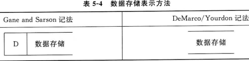

  - 在数据流程图中数据存储用右边开口的长方条表示，在长方条内写上数据存储名字，或者采用两条平行线表示
  - 数据存储是表示数据保存的地方，用来存储数据。系统过程从数据存储中提取数据，也将处理后的数据返回数据存储。与数据流不同的是数据存储本身不产生任何操作，它仅仅响应了存储和访问数据的要求。
    如果数据流是运动中的数据，数据存储就是静止的数据，存储的数据一般以文件和数据库形式存在于系统中，它存储了所有实体的实例。数据存储一般是以下内容之一：个人或小组、地点、对象、事件、概念等。


#### 5.2.3 数据流图的绘制

- 在对复杂软件系统进行描述时，难以在一张图中描述所有的细节，导致绘图工作庞大而复杂而且也难以理解。通常采用分层的方法将一个流程图分解成几个流程图来分别表示数据流程图的构造方法和指导思想是：自上而下，逐步细化直观清断，简单明了

- 如图5.2所示，一套分层的数据流图由顶层、0层、中间层和底层的数据流图所组成顶图说明了系统的边界，即系统的输入和输出的数据流，顶图只有一个处理，即被开发的系统。0层图将顶层图的系统分解为若干子系统。画系统内部时，一般将层号从0开始编号中间层流图则表示对上层父图的细化。它的每一处理都可以继续细化，形成子图。底图由一些不必再分解的处理组成，这些处理称为基本处理。在顶图和底图之间是中间层。上层图称为下层图的“父”图，下层图称为上层图的“子”图。

  

- 高层视图，称为顶层图，也称为环境图（context diagram），如图5.3所示，

  - 由于环境图重点描述系统与外部环境的边界，因此在该图中只包含一个过程，4个数据流和3个外部实体，没有数据存储。
  - 这个唯一的过程标志为0，代表整个系统；所有环境图都只有一个过程，外部实体代表了系统的环境边界。因为系统的数据存储概念上是属于过程内部的，所以数据存储不出现在环境图中。

- 0层数据流图

  - 它代表了系统中最高层的主要过程


#### 5.2.4 数据流图规则


#### 5.2.5 数据流图的分解

从一个系统到4个组成过程的行动称为功能分解。

般情况下，一个DFD所包含的过程不要超过7个


#### 5.2.6 数据流图的平衡

在对DFD进行分解时，必须将输入和输出保留到下一层分解的过程中。这种输入和输出的保留称为平衡（balancing）子图是父图中过程的详细描述，因而子图的输入、输出数据流应该与父图中过程的输入、输出数据流相一致。


### 5.3 过程逻辑

- 过程逻辑的表述方法主要有以下三种：结构化语言、决策表和决策树


#### 5.3.1 结构化语言

- 结构化语言是在自然语言基础上加了一些限定，使用有限的词汇和语句来描述处理逻辑。
- 其结构分内外两层，外层用来描述控制结构，采用顺序、选择、循环三种基本结构；
- 内层般采用祈使语句的自然语言短语。结构化语言使用数据字典中的名词和有限的自定义词，动词含义要具体。还可使用一些简单的算术运算和逻辑运算符号用结构化语言
- 任何过程逻辑都可以表达为顺序、选择、循环三种结构。

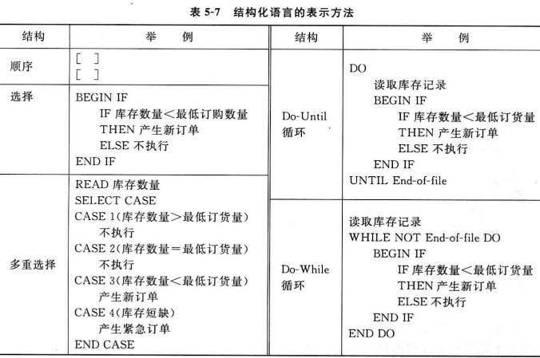


#### 5.3.2 决策表

- 决策表（decision table又称判断表，是一种表格状的图形工具，适用于描述处理判断条件较多，各条件又相互组合，有多种决策方案的情况。
- 决策表有三个部分：条件段（condit bs）行动段（action stubs）和规则（rules）。条件段包含所建模的各种条件。


1. 规则合并
2. 构造决策表的基本步骤
   1. 命名条件以及每个条件所取的值
   2. 命名所有可能出现的行动
   3. 列出所有可能的规则
   4. 在创建表时，替换第一个条件的值，正如对表5-9所示的雇员类型所采取的措施一样
   5. 为每个规则定义行动
   6. 简化决策表


#### 5.3.3 决策树

- 决策树又称做判定树，是一种树状的图形工具，适合描述处理中有多种策略，要根据若干条件的判定来确定所采用策略的情况。
- 左端方框为树根表示决策结点；
  - 由决策结点引出的直线形似树枝，称为条件枝，每条树枝代表一个条件；
  - 中间的圆圈称为条件结点；
  - 右端的实心椭圆表示决策结果。
  - 决策树中条件结点以及每个结点所引出条件的数量依具体问题而定


#### 5.3.4 结构化语言、决策表和决策树的选择

- 模的实际情况进行分析和选择，三种描述工具各自适用性如下
  （1）顺序和循环动作，适于结构化语言
  （2）多个条件复杂组合，适于决策表和决策树。
  （3）决策树比决策表直观；决策表进行逻辑验证更加严格。一般用决策表作底稿，在它基础上产生决策树。


### 5.4 数据字典 （重要）

数据分析的任务，是将数据流程图中所出现的各组成部分的**内容特征**用数据字典的形式做出明确的定义和说明。

数据字典是定义和说明**数据流程图**中每个成分的工具。

- 数据字典的作用是对数据流程图中的所有成分，包括数据项、数据结构、数据流、数据在储、处理功能、外部项等的逻辑内容与特征予以详细说明。数据字典是以后系统设计、系统实施与维护的重要依据。

- ##### 生成数据字典的方法有两种：

  - 由手工方式生成
  - 由计算机辅助生成。
  - 手工编写的优点是具有较大灵活性与适应性，但手工编写效率低，且编辑困难、容易出现疏漏和错误，对数据字典的检验、维护查询、统计、分析都不方便。
  - 计算机辅助编写数据字典是将数据字典有关的数据输人计算机，存储在数据字典库中。过算机辅助生成的数据字典具有查询、维护、统计、分析等功能

- ##### 数据字典中的数据主要包括两类，

  - 一类是动态数据可在系统内外流动的数据），
  - 另一类是静态数据（不参与流动的数据存储）的数据结构和相互之间的关系。

- ##### 数据字典中主要对以下数据内容创建字典：

  1. 数据项。
  2. 数据结构。
  3. 数据流。
  4. 数据存储。
  5. 过程。


#### 5.4.1 数据项

数据项也称做数据元素，是“不可再分”的数据单位，是数据的最小组成单位。


#### 5.4.2 数据结构

- 描述数据项之间的关系可由数据与数据结构组成。
  - 构成一个数据流的数据属性被组织成数据结构。
  - 数据结构是数据属性的特定排列，它定义了一个数据流的一个实例

- 数据流可以描述为以下几种类型的数据结构：
  - 一个序列或者一组依次出现的数据属性；
  - 从一组属性中选择一个或多个属性；
  - 一个或多个属性的重复


#### 5.4.3 数据流

数据流是由一个或一组固定的数据项组成的。


#### 5.4.4 过程字典

过程字典针对数据流程图中最底层的过程逻辑，用来说明DFD中基本过程的过程逻辑。


#### 5.4.5 数据存储

数据存储是数据结构停留或保存的场所。


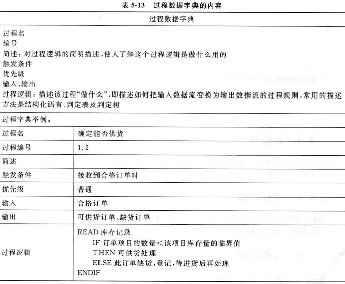


### 5.5 案例分析 ——百货商店业务管理信息系统过程建模

本章小结

思考与练习

## 第 6 章 数据建模

### 学习目标

通过本章学习，要求掌握：

- 下列数据模型术语：实体类型、属性、多值属性、子集准则、联系、度、基数、业务规则、关联实体。
- 绘制**实体-联系图（E-R图）**弱实体来描绘业务中的数据特性与关联
- 概念数据建模在整个信息系统分析和设计中所起的作用。
- 区分一元联系、二元联系和多元联系并举例说明
- 概念数据模型中的4种基本业务规则。
  对比ER图与类图在数据建模中的独特性能并说明。
- 将数据建模与过程建模、逻辑建模联系起来，作为描述信息系统的各种视图。
- 前面介绍过程模型的主要工具—数据流以及决策逻辑，学习了如何对数据流（运动中的数据）进行建模和分析，并介绍如何表示数据流图中的数据存储（静止的数据），但是，数据本身的定义、结构和数据之间的联系并没有显示出来。本章的数据模型将显示数据的特性以及数据之间的关联。


### 6.1 数据建模相关概念 （重要）

- 数据模型是一种组织和记录系统数据的技术，用于为数据库定义业务需求，数据模型最终要转换为数据库，因此也称为数据库建模。
- 在系统分析阶段展示的是系统数据的逻辑模型，在设计阶段，该模型被转换为物理数据模型，进而转换成物理的数据表。

#### 6.1.1 E-R 图

- 数据概念模型的典型代表就是著名的“实体关系模型”（Entity-Relationship Model）也称为实体联系模型（ER模型）。
  - ER模型是面向现实世界，而不是面向实现方法的；它用于描述现实信息世界中数据的静态特性，而不涉及数据的处理过程。它是企业或业务领域中实体、联系以及数据元素的详细的逻辑表述，表示业务环境中的实体、实体之间联系以及实体和联系的属性。
  - ER模型是用户和数据库设计人员之间进行交流的工具
- 在设计数据库系统之前，需要使用ER图将现实世界中的实体和实体之间的联系转换为概念模型ER模型的基本元素是：实体、属性和联系，ER模型通常表示成实体联系图（或ER图）。ER图有多种符号记法，多数记法以发明者命名（例如，Chen，Martin，Bach man，Merise）。本书采用 Martin记法


#### 6.1.2 实体

- 实体（entity）是用户环境中的数据对象如人、地方、对象、事件或概念等有它自己特有的特性，可以区别于其他实体。
  - 实体与实例之间存在着很重要的区别。实例（Instance）是指实体中的一个特例
- 属性
  - 属性用来描述实体的特征
  - ER模型中假定实体集的所有实例具有相同的属性
  - 每个属性都有其自身特性。
    - 特性包括指定该属性在某些情况下是否必需、属性是否有默认值、属性的数据类型，属性的取值范围、是否为主码或候选码等。
- 候选码
  - 候选码是唯一标识实体类型的每个实例的属性（或者属性组合）有些实体可能拥有不止一个候选码。
  - 例如，雇员的第一个候选码是雇员号，第二个候选码是雇员姓名和地址的组合（假设不存在名字相同的两个员工住在相同的地址）。
  - 如果有不止一个候选码，设计师必须选出其中一个候选码作为标识符。
- 标识符（identifier）（主码）
  - 标识符是被选出来作为实体类型的唯一标识的候选码标
    识符应满足如下规则
  - 选择在实体类型的每个实例的生命期内都不会改变值的候选码。
  - 对于实体的每个实例候选码都要确保它的每个属性都拥有合法值而具非空。保证值的合法性，在日常的数据输入和维护中可能要包含特殊控制，以消除错误的可能性。如果候选码是两个或更多属性的组合，确保码的所有组成部分都有合法值
  - 避免所谓的智能标识符，其结构显示了分类、地址以及其他实体性质。例如，实体“零件”的码的前两位数字可能表示仓库位置。这种代码常常随着情况的变化而变化，这导致了主码值的无效
  - 考虑用简单属性作为码来替代大型组合属性的码。例如，用实体“比赛”的属性“比赛编号”来代替“主队”和“客队”的组合。
- 替代码
  - 在有多个候选码的情况下，没有被选为主码的候选码即为替代码
- 复合码
  - 有时需要不止一个属性标识一个实体的实例。
    - 例如，一盘VCD有多份拷贝，需要一个VCD名，还需要同一个名字的每盘VCD都有一个拷贝号，这样由VCD名称和拷贝号共同作为一个复合主码。
- 外码
  - 在一个实体内作为主码的属性在另一个实体内则称为外码。

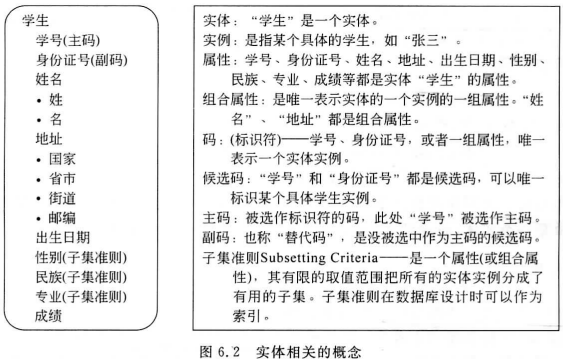

- 多值属性

  - 多值属性是指对于每个实体实例可以取多个值
  - 概念设计中，通常使用特殊符号或标记来突出多值属性，一般采用大括号

   


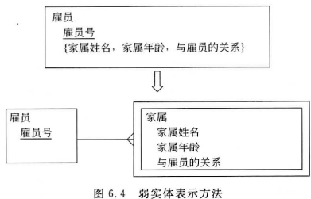


#### 6.1.3 关系

- **关系 （relationship）**
  - 也称为联系，是存在于一个或多个实体之间的业务联系。
  - 所有的关系隐含地都是双向的
  - 
- **外码 foreign key）**
  - 是某一个实体的主码，它同时存在于另一个实体以确定一个关系实例，外码总是与另一个实体的主码匹配，获得外码的实体为子实体，贡献主码的实体是父实体。通常父实体对子实体的关系是一对多的，如图6.6所示。
- 基数定义了一个实体相对于另一个关联实体的某个最小和最大具体值数量。ER图中基数的表示方法如表6-1所示。

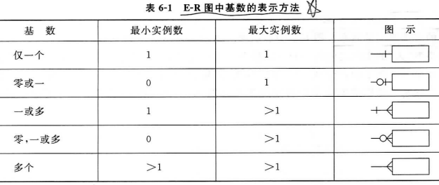

- **联系的度（degree）**是参与该联系的实体类型的数量。

  - ER模型中最常见的三种联系
    - 元联系（度数为1）
    - 二元联系（度数为2）
    - 三元联系（度数为3）

- **一元联系**（unary relationship）也被称为递归联系（recursive relationship.），是一个实体类型的实例之间的联系。

  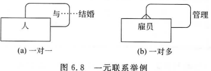

- **二元联系** （binary relationship））是两个实体类型的实例之间的联系，是数据建模中出现最多的联系类型。

  

- **三元联系** （ternary relationship）是三个实体类型的实例之间同时发生的联系
  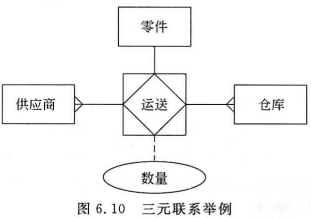

- **关联实体**associative entity：

  - 是与一个图6.10三元联系举例或多个实体类型关联的实体类型，并包含这些实体实例间的关系特有的属性。
  - 关联实体是数据建模人员选择的一种作为实体类型进行建模的关系，表示方法是采用实体矩形内包含菱形，表示该实体是由关系派生出来的。
  - 关联实体的主码是所关联的所有实体主码组成的复合码，其复合码的每个部分指向每个连接实体的一个且仅一个实例。

  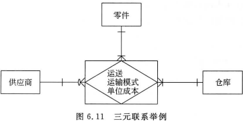

  


### 6.2 逻辑数据建模过程

#### 6.2.1 确定基本实体

- 系统中基本实体的确定主要是在了解**数据需求**的基础上进行的。数据获取主要通过调查和提问的方式进行，这些提问和调查主要集中在**数据**而不是过程和逻辑。

- ##### 确定基本实体考虑的问题

  - **业务的主题/对象是什么**？业务使用或交互哪些人、地方、东西、材料、事件等？这些数据必须被维护吗？
  - **每个对象存在多少个实例**？—数据实体及其说明每个对象有哪些区别于同类型其他对象的独特的特征？这些区别特征是随时间变化而变化的或者是持久不变的？如果我们知道该对象存在，它的这个特征可以缺失吗？—主码
  - **有哪些特征可以描述对象**？对象根据什么进行查询、选择、限制、排序、分类？为了运行业务我们必须了解每一个对象的哪些东西？—属性及副码
  - **用户如何使用这些数据**？用户需要查阅、修改、删除这些数据吗？谁是不被允许使用这些数据的？
    谁负责为这些数据建立合法的值？—安全控制以及了解谁真正知道数据的含义
  - **哪段时间用户会对这些数据有兴趣**？用户需要历史趋势、当前“快照”或预测估计吗？如果对象的某个特征随时间变化而变化，用户需要了解历史值吗？—基数与数据的时间维
  - **对于每一个对象来说，所有的实例都一样吗**？也就是说，有没有待殊的对象企业的描述或处理是哪些对象总结或组合了更多更详细的对象？—超类、子类、聚合
  - **什么事件发生会引起对象之间的联系**？业务的哪些活动或处理涉及同类或不同类对象的数据处理？—联系及其基数和度
  - **每个活动或事件的处理方法总是相同的吗**？或者有没有特殊情况？事件发生只涉及部分相关对象？或者是全部的对象？对象之间的联系随时间变化而变化吗（例如，雇员变换部门）？数据特性的值有哪些限制吗？—完整性控制、最大最小基数、数据的时间维


#### 6.2.2 建立实体间的关联

- 识别基本的实体后，需要建立实体之间的联系，并确定实体实例的基数。联系反映了一个或多个实体实例之间存在的某种自然联系，常见的有一对多、多对多、一对一的联系等


#### 6.2.3 确定主码和属性

- 确定主码时一般需要遵循如下原则
  1. 在每个实体实例的生命周期内，一个主码的值不会发生改变。
  2. 主码的值不能为空。
  3. 必须进行控制确保主码的值是有效值。
  4. 尽量不使用智能码。
- 对于多对多的关系，需要通过引入关联实体等形式进行分解


### 6.3 规范化

- ##### 数据模型的设计应当满足如下标准

  1. 好的数据模型是**简单**的。
  2. 好的数据模型基本上是**无冗余**的。
  3. 好的数据模型应该是**灵活**的而且对未来的需求具有可适应性。

- 规范化的关系模式，简称范式（Normal forms，NF），

  - 它提供了判别关系模式设计的优劣标准，也为数据库设计提供了严格的理论基础。
  - 利用规范化技术，可以将数据组合起来形成无冗余的、稳定的、灵活的并具有适应性的实体关系数据库中的联系是要满足一定要求的，满足不同的要求就称为不同的范式。
  - 满足最低要求的称为第一范式，简称1NF；
  - 在第一范式基础上有满足一定要求的称为第二范式简称2NF；依此类推，直到第五范式。

#### 6.3.1 第一范式

- 设R是一个关系模式，如果R的所有属性都是最基本的、不可再分的数据项，则称R满足第一范式，简记为1NF。1NF是最基本的范式要求，任何关系都必须遵守。

#### 6.3.2 第二范式

- 如果关系R是第一范式，且非主属性都完全依赖于主码，则称R满足第二范式称2NF。

#### 6.3.3 第三范式

- 如果关系模式R是第二范式，且所有非主属性对任何主码都不存在传递依赖，则称R满足第三范式，简记为3NF。

### 6.4 数据-过程模型映射

- 数据模型和过程模型代表了同一个系统的不同视图，但这些视图相互关联。
  - 对数据模型中的每个实体都应该在过程模型中有一个数据存储。
  - 采用 数据-过程-CRUD矩阵 来进行数据模型与过程模型的同步质量检查。
- 同步质量检查规则如下：为保持系统完整性，每个实体至少应该有一个C、一个R、一个U、一个D条目，否则可能是忽略了一个或者多个事件过程。


### 6.5 案例分析 ——某网上商店概念数据建模

6.5.1 确定基本实体

6.5.2 确定实体间的关联

6.5.3 确定主码和属性

本章小结

思考与练习

## 第 7 章 应用架构设计

### 学习目标

通过本章学习，要求掌握：

- 系统应用架构的定义
- 系统应用架构与框架的异同。
- 典型的系统应用架构：基于主机的架构、文件服务器架构、客户/服务器架构、三层或N层客户/服务器架构、浏览器/服务器架构，及其特点。
- 根据特定情况，能够选择有效的应用架构设计方式。

### 7.1 架构概述

- 系统应用架构（Application Architecture）是一个用于实现信息系统的软硬件和网络的设计蓝图，用于确定应用软件及数据的哪些部分指定给哪些硬件和网络。

#### 7.1.1 应用架构与框架

- 应用架构是一个逻辑性的框架描述通常由一个设计思想，加上若干设计模式，再规定系列的接口规范、传输协议、实现标准等文档组成。
- 软件架构的意义就是要将这些可逻辑划分的部分独立出来，用约定的接口和协议将它们有机地结合在一起，形成职责清晰、结构清楚的软件结构。
- 架构 （architecture）不同于框架（framework），软件框架通常是商业化的半成品。
- 应用架构包括软件层次、每个层次的职责、层次之间的接口、传输协议及标准、每个层次上所采用的软件框架等，如图7.1所示。

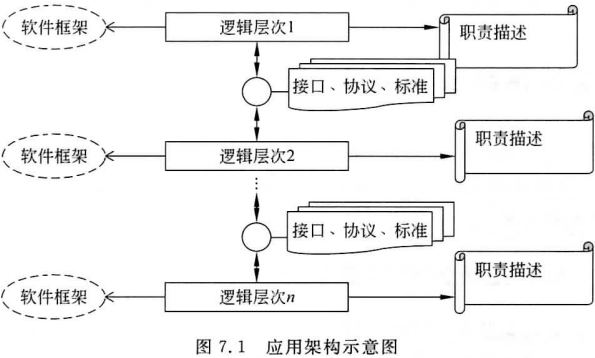


#### 7.1.2 架构的逻辑层次

- 主要的层：表示层、领域层和数据源层。
- 信息系统软件都可以划分为5个功能层次。
  - 表现层
  - 表现逻辑层
  - 应用逻辑层
  - 数据处理层
  - 数据层


- 系统的三个硬件组成包括**客户计算机、服务器和网络**。


### 7.2 典型的系统应用架构

#### 7.2.1 基于主机的服务器架构

- 最早的计算架构是基于主机的，主机完成所有的应用功能
- 优点是：简单，运行性能良好
- 主要缺点是：服务器必须执行所有消息，当应用请求越来越多时服务器计算机开始超负荷工作，不能迅速处理所有的计算机请求。响应时间开始减慢，网络管理者需要更多的投资来升级服务器计算机，但是服务器的升级极为昂贵。

#### 7.2.2 文件服务器架构

- 文件服务器架构是一种基于局域网的方案，服务器计算机仅装载了数据层。信息系统应用的所有其他层都在客户端实现，也称为基于客户端的架构，其工作原理如图7.2所示。


- 系统对用户请求的响应的逻辑如下
  1. 首先由客户向客户端的计算机发出请求，请求创建、增删改某条记录或者多条记录。
  2. 客户端将指令传到服务器端，服务器端的作用是存储和传输数据
  3. 记录存放在服务器上的文件服务器数据库里
  4. 在读取时需要将整个表加锁，直到客户端返回表为止。
  5. 文件服务器对客户端请求进行响应，返回整张表
  6. 客户端对某条记录进行数据处理（创建、增删改等），并将包含修改记录的整个表返回到服务器端
  7. 服务器端对文件服务器数据库进行修改
  8. 文件服务器数据库完成修改后，对整个表进行解锁。
- 服务器端仅执行存储的功能不提供存储和传输以外的服务
- 对单用户系统而言数据也存放在客户计算机上，不使用服务器。客户端和服务器之间需要移动大量不必要的数据，这样大的数据流量会明显地降低应用性能。此外，数据库的完整性可能会被破坏。
- 仅作为个人或小型工作组构造原型时采用。

#### 7.2.3 客户/服务器架构

- 客户/服务器架构是一种分布式计算方案，其中表现层、表现逻辑层、应用逻辑层数据处理层和数据层在客户端PC和一个或多个服务器间分布，这就要求服务器比文件服务器的功能更加强大。

- 在该模式下，应用逻辑可能在客户端，也可能在服务器端，也可能两端各承担一部分

  - 当客户承担大多数或者所有应用逻辑时，称为“胖客户”，
  - 当客户端只承担表现功能，而服务器承担大多数或者所有应用逻辑时，客户端称为“瘦客户”。

- 服务器主要划分为以下几种类型

  1. **数据库服务器**：运行一个或者多个共享的数据库，执行信息系统的所有数据库命令和服务，执行数据层和数据处理层的任务。如 Oracle，SQL Server，IBM 的 DB2。
  2. **事务服务器**：运行确保所有单个业务事务的数据库修改作为一个整体成功或者失败的服务，例如微软公司的 Transaction Server，IBM 公司的 CICS，BEA 公司的 Tuxedo。
  3. **应用服务器**：运行信息系统的应用逻辑和服务。必须同前台客户端通信，并同用于数据修改和访问的后台数据库服务器通信。通常应用服务器和实物服务器集成。多数应用服务器以 CORBA MS的COM+或者DNA标准为基础
  4. **信息和组件服务器**：运行电子邮件、日历或者其他工作组服务，这类功能实际可以集成到信息系统应用中。
  5. **服务器**：运行因特网或者内联网站点向客户返回文档和数据（XML）

- 在该架构模式下，数据层和数据处理层放在服务器上，应用逻辑层、表现逻辑层和表现层放置在客户端，也称为两层客户/服务器计算，这是真正的客户/服务器计算的一种最简单形式，也是大家常说的C/S结构。

- 该架构的应用原理如图7.3所示。

  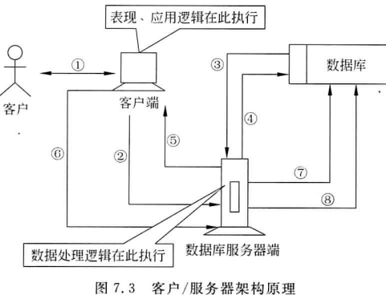

- ##### 工作原理

  1. 首先由客户向客户端的计算机发出请求，请求创建、增删改某条记录或者多条记录。
  2. 客户端将指令传到服务器端。
  3. 数据库服务器只从数据库表中读取请求的行和列。
  4. 在读取时只需要对请求的记录进行加锁，而不用对整个表加锁，直到客户端释放表为止。
  5. 数据库服务器对客户端请求进行响应，只返回需要的行和列
  6. 客户端对某条记录进行数据处理（创建、增删改等），并将修改的记录返回到服务器端。
  7. 数据库服务器端对数据库中的记录进行修改。
  8. 数据库服务器数据库完成更新后，对记录进行解锁。

- ##### 优点：

  - 比文件服务器架构的网络流量少只有数据库请求和需要的数据库记录实际在客户端工作站之间传递时才需要交互。此外数据库完整性更容易维护般只需要加锁使用的记录，其他客户可以使用同一个表的其他记录。

- ##### 缺点：

  1. 应用逻辑必须在所有客户端上进行复制和维护，可能涉及成千上万个客户端的应用软件安装。
  2. 设计人员必须为版本升级做计划，提供控制以确保每个客户端都运行业务逻辑的最新发布版，并确保其他软件不会干扰业务逻辑。
  3. 应用逻铒分布在客户端，客户发出数据请求，服务器端返回结果。当客户数目激增时，大量的数据传输也会增加网络负载，导致服务器的性能因为无法进行负载平衡而下降。

#### 7.2.4 三层或 n 层客户/服务器架构

- 三层架构使用了与两层客户/服务器架构同样的数据库服务器。
  - 它把客户端的应用逻辑和表现逻辑进一步划分，在客户端与服务器端加入中间层。
  - 应用服务器将应用的商业逻辑放在中间服务器上，这个服务器是一个应用或者事务服务器。
  - 应用逻辑放在服务器上维护，而不需要在所有客户端维护了。

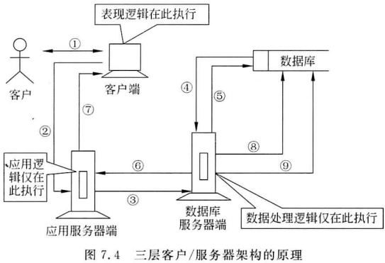

- 该架构模型的作原理如下：
  1. 首先由客户向客户端的计算机发出信息或者服务请求，请求执行某个应用逻辑，或者是创建、增删改某条记录或者多条记录
  2. 客户端将指令传到应用服务器端，如果仅涉及应用逻辑，不用读取数据，则在此执行，然后返回到客户端
  3. （3）如果是请求创建、读取、修改或者删除一个或多个记录，则将请求传递给数据库服务器。
     （4）数据库服务器从数据库表中读取请求的行和列
     （5）数据库服务器在读取时只需要对请求的记录进行加锁，而不用对整个表加锁，直到客户端释放表为止。
     （6）数据库服务器对数据处理请求的响应发送给应用服务器，只返回需要的行和列。
     （7）应用服务器执行应用逻辑，并响应客户的信息和服务，传送给客户端。
     （8）数据库服务器端对数据库里的记录进行修改。
     （9）数据库服务器数据库完成更新后，对记录进行解锁
- 业务逻辑层（Business Logic Layer）无疑是系统架构中体现核心价值的部分。
- 三层和两层架构相比优点在于：
  - 客户端执行整个系统组件的最小部分，只有用户界面和相对稳定的个人应用逻辑在客户端执行，简化了客户端的配置与管理。
  - 但是，与两层架构模式相比，三层或N层架构的设计非常复杂，软件编写较为复杂，因为所有应用都包含两部分，即在客户端的软件和在服务器端的软件，所以需要进行设计分割。
    - 设计分割是指如何在网络中最优地分布或复制应用构件的行为

#### 7.2.5 浏览器/服务器架构

- 浏览器/服务器架构主要用于网络计算和Web应用，表现层和表现逻辑层在客户端浏览器中使用从某个Wcb服务器下载的内容实现，然后表现逻辑层连到运行在应用服务器上的应用逻辑层，它最终连到后台数据库服务器。


- 在该技术下应用的相关网络技术如下：
  - Java技术：主要用于服务器端的应用逻辑编程，称为 servlets，有时也用于客户端的应用逻辑编程，称为 applets
  - 超文本标记语言：HTML（Hyper Text Markup Language），主要用于表现层的编程。
  - 可扩展标记语言：XML（Extensible Markup language），主要用于可以在Wcb上进行转换的数据内容的编程。
  - 基于Web的系统主要由Web浏览器执行表现逻辑和少量的应用逻辑，而Web服务器承担应用逻辑、数据访问逻辑和数据存储。
- 这种架构的优点是：
  - 对于使用 Internet标准的客户/服务器架构，容易将表现逻辑、应用逻辑和数据访问逻辑进行分离，使其保持相互独立。
    - 例如，表现逻辑可以采用HTML或者XML进行设计，指定网页如何在屏幕上进行显示。采用简单的程序语句链接接口到特定的应用逻辑模块，以执行各种功能。这些定义接口的HTML或者XML文件可以在不影响应用逻辑的情况下进行改动。同样，也可以对应用逻辑进行修改，而不用对表现逻辑和数据访问逻辑进行改动。
  - 此外，由于所有系统都在浏览器上运行（例如，财务系统、人力系统生产系统），不用再担心存在多个不同的计算机架构，也不用担心存在不同的操作系统。这种方法可以重新设计传统信息系统在网络上运行的能力。

### 7.3 应用架构举例

#### 7.3.1 mvc 架构

- 应用架构的起源中，大家最熟悉的是 Smalltalk-80语言中的MvC（Model-View-Controller）架构，该架构可以让Smllk程序员迅速建立程序的使用者接口（User Interface）。
- 典型的MVC架构包括三个抽象类别，即 Model、View及 Controller。

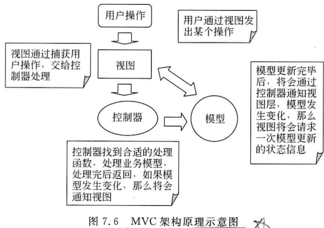

- Model 对象负责管理资料或文件，它可以对应到数个Ⅴiew对象，每个Ⅴiew对象显示出Mode对象的某一方面；每个vew对象有一个相对应的 Controller对象，它负责解释使用者输人入的消息，如移动鼠标等。使用者输入消息时，Controller根据消息要求Modl处理文件资料，也会要求vicw对象更新画面。一且 Model对象中的资料发生改变，Model对象会通知各 Controller k view对象，各vw对象会向Mod取得新资料，然后更新画面。
- 特点：
  - MVC架构使得应用程序的结构更加清晰，通过将代码按照层次划分为业务逻辑/数据、用户界面和应用流程控制这三个层次，增强了代码稳定性。
  - View的实现一般是由界面设计人员和界面程序员完成的 Model是对业务数据/信息进行处理的模块，包括对业务数据的存取、加工、综合等，由业务逻辑程序员来完成；
  - Controller负责vew和 Model之间的流程控制，也就是完成两个方向的动作：将用户界面（vew）的操作映射到具体的 Model，以完成具体的业务逻辑；将通过Mde处理完的业务数据及时反应到用户界面上，一般由负责整体控制的程序员来完成
- Controller部分的代码比较稳定，一般会使用一个通用的架构；Modl则跟随商务流程的变化而变化；View的更改则是随着用户需求的更改而更改的
- 这种模块功能的划分有利于在代码修改过程中进行模块的隔离，而不需要把具有不同功能的代码混杂在一起造成混乱
- 对于项目开发而言有利于在项目小组内按照小组成员各自的特点进行分工，有利于三个部分并行开发，加快项目进度

#### 7.3.2 架构组成

- 下面基于 MVC 架构提出了一个由5个层次组成的软件架构描述了各层次的构成、职责、使用的框架、各层次的传输标准。其中Web层采用了 Structs框架，Business control层和 Entity层采用了自己开发的框架，而 DB Control层采用了 Hibernate框架，如图7.7所示。

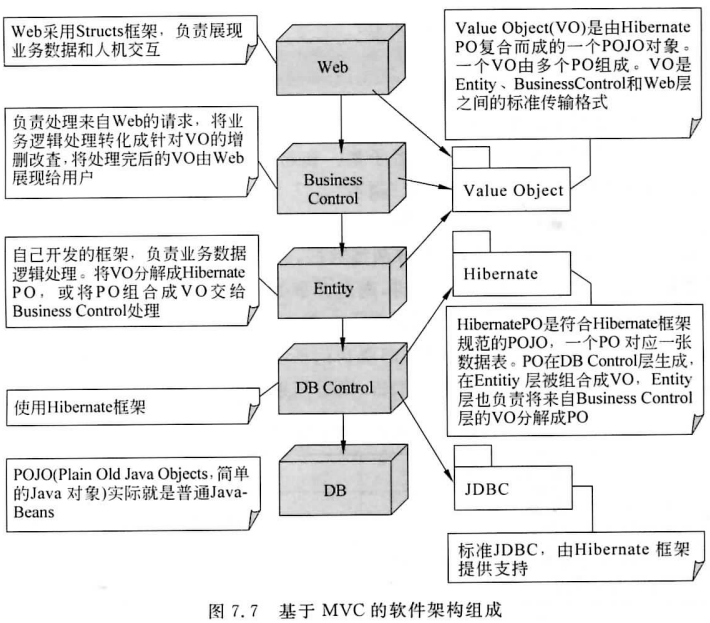


#### 7.4 应用架构设计内容

- 在进行应用架构设计时，需要考虑以下3个方面的内容：
  1. 信息系统集中或者分布程度，即网络架构，可以采用网络拓扑图进行表示
  2. 数据在网络处理器上如何分布，采用数据架构进行表示
  3. 过程在网络处理器上如何分布，采用过程架构进行表示

#### 7.4.1 数据架构设计

- 数据架构设计主要解决数据分布到不同的数据库服务器的问题，主要采取**数据分割和数据复制**两种方式。

  - 数据分割是指将数据的行或列拆分到特定的数据库服务器上，服务器之间的数据很少或者没有重复。
  - 水平分割是拆分不同的行到不同的数据库服务器，垂直分割是拆分不同的列到不同的数据库服务器。
  - 数据复制是在多个数据库服务器上复制一些表或者所有表。整个表可以被复制到某些数据库服务器上，同时表中行的子集可以被复制到其他数据库服务器上。

- ##### 数据分布的策略如下：

  1. 在单个服务器上存储所有数据
  2. 在不同服务器上存储特定表。
  3. 在不同服务器上存储特定表的子集。
  4. 在不同服务器上复制特定表或者子集。在这种情况下，被复制的表称为“主拷贝或者“主表”，其他的被指定为“拷贝”或者“副本”

- 在选用数据分割或者复制策略时，需要根据实际的业务数据存储需要进行考虑。

#### 7.4.2 过程架构设计

- 软件过程架构设计的主要内容是根据所选择的架构确定相应的软件开发环境（SDE）
  - 开发环境主要是用于构造信息系统的语言和工具包。
- 适用于服务器架构的软件开发环境主要具备如下特征
  - 个编辑器和一个编译器，用于编写程序；
  - 个事务监视器，用户管理联机事务和终端屏幕；
  - 个文件管理系统，或者数据库系统，用于管理存储的数据
- 适用于两层服务器架构的软件开发环境主要有PB、VB、Delphi等。这些开发环境一般具有如下特征
  - 用于构建图形用户界面的RAD环境：
  - 为 GUI 相关系统事件自动生成模块代码
  - 有编程语言；
  - 有到各种关系数据库引擎的连接
  - 有客户端使用的复杂代码测试和调试环境；
  - 系统测试环境；
  - 创建最终用户报告；
  - 有客户端帮助文件系统。
- 适用于多层服务器架构的软件开发环境除了具备两层软件开发环境的特征之外，还需要具备如下特征
  - 支持客户端和服务器异构计算平台；
  - 同时用于客户端和服务器的代码生成和编程；
  - 具有可复用性；
  - 有CASE工具；
  - 有客户端和服务器之间分割应用组件的工具；
  - 有客户端和服务器上的支持工具
  - 具有自动调整应用到不同平台的能力；
  - 能进行复杂的软件版本控制和应用管理。
- 为了支持浏览器/服务器架构的软件开发，快速应用开发工具正在兴起，大多数这类语言都围绕以下4个核心标准技术构建
  - HTML（超文本标记语言），用于构造大多数因特网和内联网网页内容和超链接的语言
  - XML（可扩展标记语言），用于通过web传输数据和属性的
  - 可扩展语言CGI（计算机网关接口），用于发布图形化组件、结构和链接的标准
  - 网页编程语言，如Java等，用于创建与平台无关的程序、Servlet和可以在浏览器的Java虚拟机内运行的 Applet.

#### 7.4.3 网络架构设计

- 网络架构主要解决如何将**客户端、服务器**以及**设备**分配到网络中，**客户端与服务器**之间如何连接，用户在哪里与客户端交互等问题。
- 网络架构（见图78）包括以下内容
  - 服务器及其物理位置。
  - 客户端及其物理位置
  - 处理器说明。处理器的资料库描述，可被用于定义处理器说明，如硬盘容量显示器等。
  - 传输协议。连接用传输协议和其他相关物理参数标记。

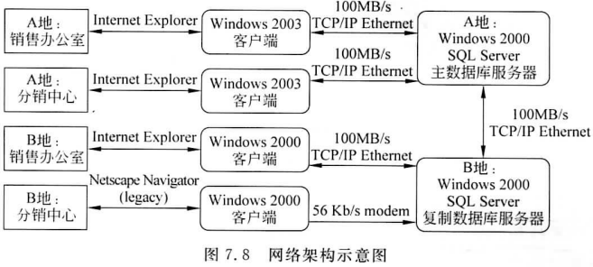


### 7.5 案例分析 ——某服务台系统架构设计

本章小结

思考与练习

## 第 8 章 软件过程设计

### 学习目标

通过本章学习，要求掌握：

- 软件过程设计的主要内容，包括总体设计和详细设计。
- 软件设计的基本原理，包括模块化、抽象与信息隐蔽、模块的独立性
- 各种软件设计工具，如HIPO图、软件结构图以及详细设计工具，并比较其特点。
- 软件结构设计的各种方法，理解每种设计方法的适用情况。
- 软件详细设计的目标和方法。
- 在系统分析阶段，系统分析人员通过对系统的调查和分析，对系统过程进行描述，利用结构化系统分析方法产生数据流图、数据字典等系统分析资料。
  - 在设计阶段，可以采用一组标准的工具和准则在数据流图的基础上进行结构设计，根据系统分析工作所构造的系统逻辑结构模型，产生结构化系统设计资料。


### 8.1 过程设计主要内容

#### 8.1.1 总体设计

- 为了最终实现系统目标，必须设计组成这个系统的所有程序和数据库。
  - 数据库设计完成与数据相关的设计任务，而过程设计主要是针对程序进行设计。
  - 这部分通常分为两个阶段完成：首先进行**结构设计**，然后进行**过程设计**。
    - 结构设计确定程序由哪些模块组成，以及这些模块之间的关系过程设计确定每个模块的处理过程。
    - 结构设计是总体设计阶段的任务，过程设计是详细设计阶段的任务。
- 概要设计
  - 将系统划分成功能模块
  - 明确软件结构（模块组成的层次系统）
  - 采用适当的工具描述软件结构


#### 8.1.2 详细设计

- 详细设计的目标是确定怎样具体实现软件结构图中每个模块的具体内容。
- 详细设计的任务还不是具体地编写程序，而是要设计出程序的“蓝图”，程序员可以根据这个蓝图编写实际的程序代码。
  - 因此，详细设计的结果基本上决定了最终的程序代码的质量


### 8.2 软件设计的基本原理

#### 8.2.1 模块化

- 模块在程序中是数据说明、可执行语句等程序对象的集合，或者是单独命名和编址的元素，如高级语言中的过程、函数、子程序等。
- 模块是可组合、分解和更新的单元。
- 模块有以下基本属性
  - 接口：指模块的输入与输出。
  - 功能：指模块实现什么功能。
  - 逻辑：描述内部如何实现要求的功能及所需的数据。
  - 状态：该模块的运行环境，即模块的调用与被调用关系。
  - 功能、状态与接口反映模块的外在特性，逻辑反映它的内在特性
- 模块化是指解决一个复杂问题时自顶向下逐层把软件系统划分成若干模块的过程。
- 优点：
  - 降低问题复杂性
  - 减少开发工作量
  - 减少开发成本
  - 提高软件开发效率

#### 8.2.2 抽象与信息隐蔽

- 抽象是认识复杂现象过程中使用的思维工具，即抽出事物本质的共同性而暂不考它的细节，不考虑其他因素。
- 抽象的概念被广泛应用于计算机软件领域，系统开发过程中的每步都可以看作是对软件解决方法的抽象层次的一次细化。
- 通过抽象，可以确定组成软件的过程实体。
- 通过信息隐蔽，可以定义和实现对模块的过程细节和局部数据结枃的存取限制信息隐蔽皆在设计和确定模块时，使得一个模块内包含的信息（过程或数据），对于不需要这些信息的其他模块来说，是不能访回的


#### 8.2.3 模块独立性

- 为了降低软件系统的复杂性，提高可理解性、可维护性，必须把系统划分成为多个模块，模块不能任意划分，应尽量保持其独立性。
- 模块独立性脂每个模块只完成系统要求的独立的子功能，并且与其他模块的联系最少且接口简单。根据模块的外部特征和内部特征，采用两个衡量软件的独立性的度量标准，即**耦合性和内聚性**


1. ##### 耦合性

   1. 耦合性称块间联系，指软件系统结构中各模块间相互联系紧密程度的一种度量

   2. 模块之间联系越紧密，其耦合性就越强，模块的独立性则越差。模块间耦合高低取决于模块间接口的复杂性、调用的方式及传递的信息。

      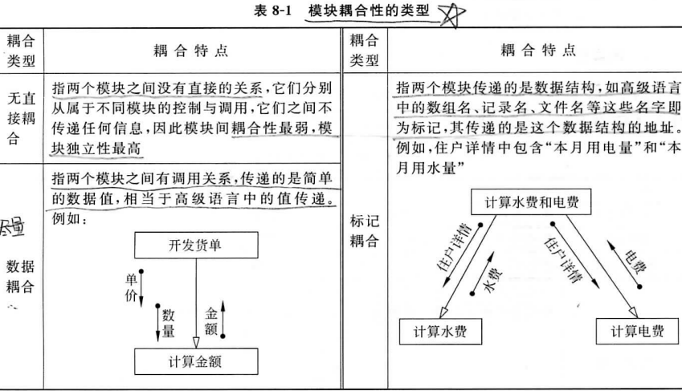

      

      1. **数据耦合**
      2. **标记耦合**
      3. **控制耦合**
      4. **内容耦合**
      5. **公共耦合**

2. ##### 内聚性

   1. 内聚性又称做块内联系指模块的功能强度的度量若一个模块内各元素（语句之间、程序字段之间）联系得越紧密，则它的内聚性就越高，内聚性有以下几种类型。

      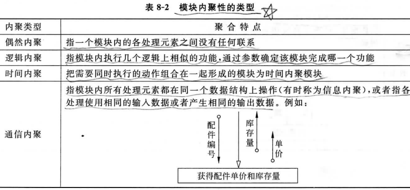

      

      1. **偶然内聚**
      2. **逻辑内聚**
      3. **时间内聚**
      4. **通信内聚**
      5. **顺序内聚**

3. 耦合性与内聚性是模块独立性的两个定性标准，将软件系统划分模块时，尽量做到**高内聚低耦合**，提高模块的独立性，为设计高质量的软件结构奠定基础

### 8.3 软件设计工具

#### 8.3.1 hipo 图

- HIPO（Hierarchy Plus InPut/Process/OutPut）图由美国IBM公司于20世纪70年代发明，用图形方法表达一个系统的输入和输出功能，以及模块的层次。该技术包括两方面的内容：HIPO分层图和IPO图。

- HIPO分层图用于表示自顶向下分解所得系统的模块层次结构。每个矩形框代表一个模块，连线表示“调用”而非“组成”。为了能使HIPO图具有可追踪性，在H图（层次图）里除了最顶层的方框之外，每个方框都可以加编号。编号规则和数据流图的编号规则相同。

  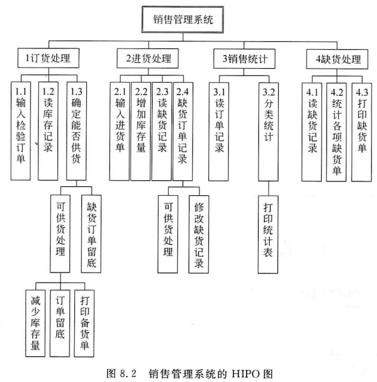

- IPO图（输人一处理一输出图）用于描述分层图中一个模块的输人输出和处理内容与H图中每个方框相对应，应该有一张IPO图描绘这个方框代表的模块的处理过程HIPO图中的每张IPO图内都应该明显地标出它所描绘的模块在H图中的编号，以便追踪了解这个模块在软件结构中的位置

  

- HIPO图适合于在自顶向下设计软件的过程中使用。应用HIPO技术可以进行系统设计、评价，在系统实施之前处理和修改已设计的系统。HIPO图清晰易懂，可以使用户管理人员和其他系统建设者很方便地理解系统的程序结构，也有利于程序的编写和系统的维护

  

#### 8.3.2 软件结构图


1. 模块：用方框表示，名字体现该模块的功能
2. 模块间的控制关系：方框之间的箭头（或直线）表示模块的调用关系。上层模块调用下层模块，但调用次序不严格
3. 模块间的信息传递：在结构图中通常还用带注释的箭头表示模块调用过程中来回传递的信息。如果希望进一步标明传递的信息是数据还是控制信息，则可以利用注释箭头尾部的形状来区分：尾部是空心圆表示传递的是数据，实心圆表示传递的是控制信息图8.5通过产生最佳解的示例显示了结构图的表示方法。
4. 两个附加符号：模块选择调用或循环调用。在图8.6中，图（a）表示当模块A中某个判定为真时调用模块B，为假时调用模块C。图（b）表示模块M循环调用模块A、B和C。


- 注意，层次图和结构图并不严格表示模块的调用次序。虽然多数人习惯于按调用次序从左到右画模块，但并没有这种规定，出于其他方面的考虑（例如为了减少交叉线），也完全可以不按这种次序画。此外，层次图和结构图并不指明什么时候调用下层模块。

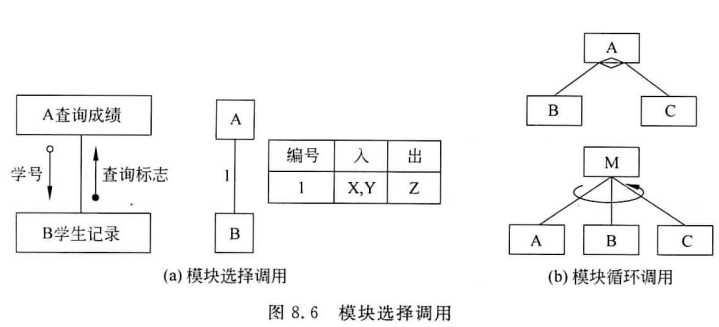

- 通常用层次图作为描绘软件结构的文档。结构图作为文档并不很合适，因为图上包貪的信息太多有时反而降低了清晰程度。

  - 但是，利用IPO图或数据字典中的信息得到模块调用时传递的信息，从而由层次图导出结构图的过程，却可以作为检查设计正确性和评价模块独立性的好方法。

- 软件结构图形态特征有如下四个指标分别是：

  - 深度，指结构图控制的层次，即模块的层数；

  - 宽度，指一层中最大的模块个数；

  - 扇入，指一个模块直接上属模块的个数，

  - 扇出，指一个模块直接下属模块的个数。

    如图8.7所示，该软件图深度为5，宽度为8；模块M的扇出为3，模块T的扇入为4

  

- 表示软件结构图时需要注意

  1. 同一名字的模块在结构图中仅能出现一次
  2. 调用关系只能从上到下
  3. 不严格表示模块的调用次序，习惯上从左到右，有时为了减少连线的交叉，适当地调整同一层模块的左右位置，以保证结构图的清晰
  4. 结构图并不指明什么时候调用下层模块，只表明一个模块调用哪些模块，至于模块内还有没有其他成分则完全没有表示。

#### 8.3.3 详细设计工具（重要）

详细设计的主要任务是设计每个模块的实现算法所需的局部数据结构。

详细设计的标有两个：实现模块功能的算法要**逻辑上正确**和**算法描述要简明易懂**。

1. ##### 程序流程图 （PFC）

   1. 程序流程图（PFC），又称程序框图，是描述程序逻辑结构的工具。它使用的符号与系统流程图的符号很多相同，但是，箭头符号代表控制流而不是数据流

      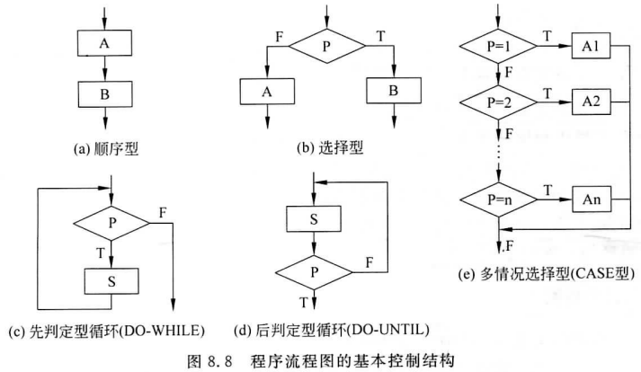

   2. 这5种基本的控制结构是：

      1. （1）顺序型：几个连续的处理步骤依次排列构成。
      2. （2）选择型：由某个逻辑判断式的取值决定选择两个处理中的一个。
      3. （3）先判定型循环：在循环控制条件成立时，重复执行特定的处理。
      4. （4）后判定型循环：重复执行某些特定的处理，直到控制条件成立。
      5. （5）多情况选择型：列举多种处理情况，根据控制变量的取值，选择其一执行程序结构图的优点是直观清晰、易于使用

   3. 缺点是：

      1. （1）易造成非结构化的程序结构编码时不加限制地使用GOTO语句，导致基本控制块多入口多出口，与软件设计的原则相违背。
      2. （2）程序流程图本质上不是逐步求精的好工具，会诱使过早考虑程序的控制流程，而不去考虑程序的全局结构。
      3. （3）程序流程图不易表示数据结构。

2. ##### 盒图 （N-S 图）

   1. 根据结构程序设计思想，Nasi和 Shneiderman提出了盒图，又称为Ns图

      

   2. 盒图具有如下特点

      1. （1）功能域（即一个特定控制结构的作用域）明确，可以从盒图上一眼就看出来
      2. （2）不可能任意转移控制。
      3. （3）很容易确定局部和全程数据的作用域。
      4. （4）很容易表现嵌套关系，也可以表示模块的层次结构。

   3. 优点：盒图没有箭头，因此不允许随意转移控制。

      1. 坚持使用盒图作为详细设计的工具，可以使程序员逐步养成用结构化的方式思考问题和解决问题的习惯

   4. 盒图的缺点是：

      1. 当程序内嵌套的层数增多时，内层的方框将越来越小，从而增加绘图的难度，使图形的清晰性受到影响

3. ##### 问题分析图 PAD（ Problem Analysis Diagram）

   1. 它用二维树形结构的图来表示程序的控制流（自1973年由日本日立公）
      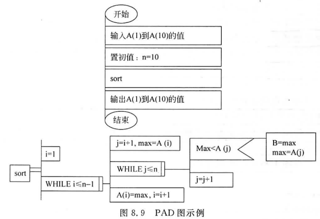
   2. **PAD图中竖线的总条数就是程序的层次数**
   3. PAD图的主要优点如下
      1. （1）支持结构化的程序设计原理，使用表示结构化控制结构的PAD符号所设计出来的程序必然是结构化程序
      2. （2）支持自顶向下、逐步求精的设计方法。开始时设计者可以定义一个抽象的程序，随着设计工作的深入而逐步增加细节，直至完成详细设计。
      3. （3）用PAD图表现程序逻辑，易读、易懂、易记。PAD图是二维树形结构的图形，程序从图中最左竖线上端的结点开始执行，自上而下，从左向右顺序执行，遍历所有结点。
      4. （4）支持程序自动生成。容易将PAD图转换成高级语言源程序，这种转换可用软件工具自动完成，从而可省去人工编码的工作有利于提高软件可靠性和软件生产率。
   4. PAD图是面向高级程序设计语言的，为 FORTRAN、COBOL和 Pascal等每种常用的高级程序设计语言都提供了一整套相应的图形符号。由于每种控制语句都有一个图形符号与之对应，显然将PAD图转换成与之对应的高级语言程序比较容易。

### 8.4 软件结构设计方法

面向数据流的设计方法的目标是给出设计软件结构的一个系统化的途径。

通常所说的结构化设计方法（简称SD方法），也就是基于数据流的设计方法。

结构化设计以结构化分析产生的数据流图为基础按一定的步骤映射成软件结构。面向数据流的设计方法把信息流映射成软件结构，信息流的类型决定了映射的方法。

信息流有下述两种类型；变换流和事务流，因此设计方法也相应地划分成两类：变换分析设计以及事务分析设计。

#### 8.4.1 变换分析设计

- 信息沿输入通路进入系统，同时由外部形式变换成内部形式，进入系统的信息通过变换中心，经处理以后再滑输出通路变换成外部形式离开软件系统。

  

- 当数据流图具有这些特征时，这种信息流就叫做使换流x变换型数据流的设计主要包含以下步骤

- （1）确定输入流和输出流的边界，从而孤立出变换中心

  - ①检查“输人流”的边界
    从输入的数据源开始，沿着毎一个由数据源传入的数据流的移动方向进行跟踪分析，逐个分析它所经过的处理逻辑功能。如果仅是传入的数据流作形式上的转换，逻辑上没有进行实际的数据处理功能，则这些处理逻辑属于系统的“输入处理部分”。延着传入的数据流的移动方向，一直跟踪到它被真正处理为止。
  - ②检查“输出流”的边界。
    从输出结果的地方开始，逆着每一个传递出去的数据流，由外向里反方向跟踪，逐个分析它的处理逻辑功能，一直反方向跟踪到它被真正产生出来为止
  - ③得到变换中心。
    根据前两步的分析结果，画出一个闭环界线在界线以内的就是变换中心

- （2）设计软件结构的顶层和第一层—变换结构，如图8.11所示。

  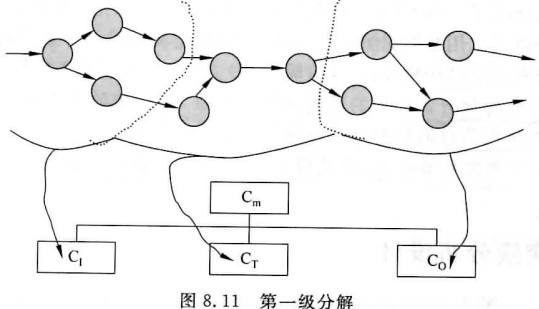

- 3）设计中、下层模块。
  在第一层的模块基础上自顶向下，逐层分解。输入模块的下属模块设计：为每个输人模块设计两个下层模块，一个用于接收数据，另一个用于将这些数据转换为所要求的数据重复这两个步骤直到物理输入为止，如图8.12所示。

  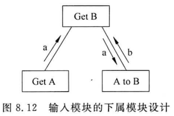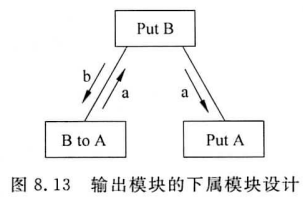

  变换模块的下属模块设计：按照模块独立性的原则来组织其结构，一般每个基本处理设计一个功能模块，如图8.14所示。

  

- （4）根据设计准则进行设计优化。
  ①输入部分的求精。对每个物理输入设置专门模块，以体现系统的外部接口；其他输入模块并非真正输入，当它与转换数据的模块都很简单时，可将它们合并成一个模块。如图8.15所示

  ②输出部分的求精。为毎个物理输出设置专门模块，同时注意把相同或类似的物理输出模块合并在一起，以降低耦合度，如图8.16所示

  ③变换部分的求精：根据设计准则，对模块进行合并和调整。软件结构的求精，具有很大的经验性。总体而言应该追求“高内聚，低耦合”方法，设计有独立功能的模块，模块间尽量传递数据型的参数，模块间共享信息尽量少。

  

  

#### 8.4.2 事务分析设计

- 基本系统模型意味着变换流，因此，原则上所有信息流都可以归结为这一类。

- 但是，当数据沿输人通路到达一个处理T，这个处理根据输入数据的类型分解成一串发散数据流，形成许多活动路径，并根据输入数据的类型在若干动作序列中选出一个来执行。

  - 这类数据流应该划分为一类特殊的数据流，称为**事务流**，是以事务为中心的，如图8.17所示

  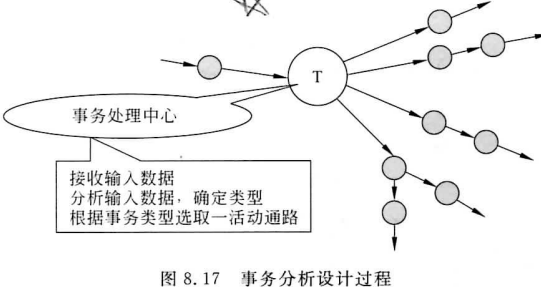

- 事务分析的设计步骤和变换分析的设计步骤大部分相同或类似，主要差别仅在于由数据流程图到软件结构的映射方法不同，由事务流映射成的软件结构包括一个接收分支和一个发送分支。

- 其具体设计步骤如下

  - （1）确定数据流图中的事务中心和处理路径。
    - 如果某个处理具有明显的事务中心特性时，将其视为事务中心。
  - （2）设计软件结构的顶层和第一层—事务结构。
    - 顶层为主模块，有两个功能：接收数据和根据事务类型调度相应的处理模块。因此，第一层有两个模块：一是接收模块，负责接收数据，映射出接收分支结构的方法和变换分析映射出输入结构的方法相似，即从事务中心的边界开始，把沿着接收流通路的处理逻辑映射成模块。二是发送分支，发送分支的结构包含一个调度模块，它控制下层的所有活动模块。
  - （3）把数据流程图中的毎一个活动流通路映射成与它的特征相对应的结构。
    - 事务结构中、下层模块的设计、优化等工作和变换型分析设计相同，如图8.18所示

  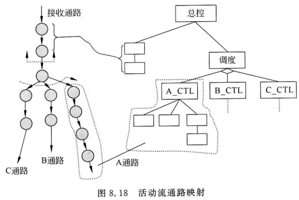

  

#### 8.4.3 综合数据流图的映射

- 对于既包含事务类型又包含变换类型的数据流，采用的映射方法如下：
  （1）确定DFD整体上的类型：除明显有事务类型的，都可认为是变换型。事务型用于高层DFD变换有平行处理的优点
  （2）把与全局特性不同的局部区域孤立出来，确定类型
  （3）按整体与局部的DD特性，设计软件结构

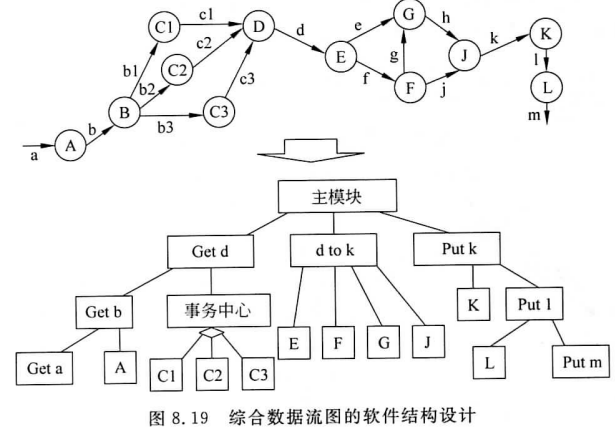

#### 8.4.4 分层数据流图的映射

- 由于数据流图往往是分层的，映射的软件结构图也可以采用分层策略，这样便于设计和修改。数据流图的顶层反映的是系统与外部的接口，所以相应的软件结构图中物理输入和都应该在对应的主图中，便于同顶层图进行对照检查，如图8.20所示。


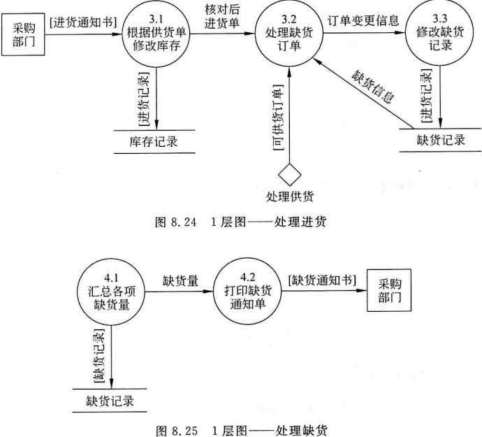


### 8.5 软件详细设计

#### 8.5.1 结构化程序设计

**详细设计结果基本上决定了最终程序代码的质量。**不仅要逻辑正确，性能满足，还要简明易懂

计算机科学家Bohm和 Jacopini证明了这样的事实：

- 任何简单或复杂的算法都可以由**顺序结构、选择结构和循环结构**这三种基本结构组合而成。
  - 所以，这三种结构就被称为程序设计的三种基本结构，也是结构化程序设计必须采用的结构
- 结构化程序设计的基本思想是在构造任何算法时，仅采用顺序结构选择（分支结构和循环结构作为基本单元，同时规定基本结构之间可以并列和互相包含，不允许交叉和从个结构直接转到另一个结构的内部去。
  - 结构化程序具有唯一人口和唯一出口，并且不会出现死循环。程序的静态形式与动态执行流程之间具有良好的对应关系。

#### 8.5.2 程序设计目标

- ##### 特性s

  1. 可维护性
  2. 可靠性
  3. 可理解性
  4. 效率

- ##### 程序效率与可维护性、可理解性的关系通常是矛盾的

- 小程序中，主要强调程序的正确和效率。大程序，可维护性、可靠性和可理解性，然后才是效率。

#### 8.5.3 程序设计方法

- ##### 自顶向下的结构化程序方法

  - 整体理解
  - 模块逐步求精
  - 功能

- ##### 注意：

  1. 模块应该具有独立性
  2. 模块大小划分要适当
  3. 模块功能要简单
  4. 共享的功能模块应集中

### 8.6 案例分析 ——百货商店业务管理信息系统过程设计

本章小结

思考与练习

## 第 9 章 数据库设计（重要）

### 学习目标

- 逻辑模型与物理模型的区别和逻辑模型转换成物理模型的规则
- 将 E-R 图转换为关系并合并冗余的关系
- 为关系设计字段并选择合适的数据类型
- 合理设计字段以保证数据完整性要求
- 代码的含义及其作用，并能在实际模型中设计合理的代码
- 数据库设计通常与系统界面设计同步进行。
  - 系统分析员必需理解实际应用中的概念数据设计，它通常是由具体的 E-R 或类图和各系统界面的数据要求（报告、表、屏幕等）来表示的。
  - 因此，数据库设计中包括了从上到下（由 E-R 或类图驱动）和从下到上（由系统界面中的特定信息要求驱动）两种方法。
  - 除此之外，系统分析员必须知道物理数据特征（如长度、格式）、系统界面的使用频率以及数据库技术性能。

### 9.1 逻辑数据模型和物理数据模型

数据库建模和系统开发生命周期之间的关系

1. 系统规划阶段
   - 企业范围的数据模型（主要实体）
   - 概念数据模型（E-R 及具体项目的实体）
2. 系统分析阶段
   - 概念数据模型（E-R 及属性）
3. 系统设计阶段
   - 逻辑数据模型（关系）和物理文件
   - 与数据库设计（文件组织）
4. 系统实施阶段
   - 数据库和文件定义（DBMS 具体代码）
5. 系统维护阶段
   - 数据模型评估

#### 9.1.1 数据库设计前提

- 逻辑模型基础上进行物理数据库设计
  - 物理字段设计
  - 数据量规划
- SDLC 阶段所收集并产生的信息
  - 规范化关系，数据量估计
  - 属性定义
  - 何时、何处利用数据的描述：输入、查询、删除和更新（包括 频次）
  - 反应时间和数据完整性的预期或要求
  - 操作文件和数据库的技术描述，用于掌握策略需求和技术选择的范围

#### 9.1.2 逻辑数据模型到物理数据模型的转换规则

- CASE 工具将数据模型自动翻译成为所选数据库技术的物理语言

- 实体的转换规则
  - 基本实体、关联实体和弱实体都被实现成一个独立的表
  - 标识主码，实现为表中的一个索引 
  - 每个副码实现为表中的索引
  - 对于任何被确定为子集准则的非主属性，应该建立索引
  - 标识外键，这些外键实现了数据模型的关系
  - 属性采用字段实现，对应表中的列
  - 数据类型
  - 字段大小
  - 空或非空
  - 域
  - 默认值

### 9.2 关系数据库模型

- 关系数据模型（1970）
  - 关联的表或者关系对关系进行描述
  - 每个关系就是一张二维数据表
  - 每个关系由几个列和任意行组成
- 关系与非关系表的区别在于关系具有
  1. 单元中的条目很简单
  2. 每个列中的条目来自同一个集合的值
  3. 每一行都是唯一确定的
  4. 列的顺序可以先后对换
  5. 行能够任意顺序
  6. 关系结构良好
     - 最小冗余
     - 用户修改不会出现错误或不一致

### 9.3 将 e-r 图转化成关系

- 为了比较概念模型和所开发的规范化关系，必须将E-R图或类图转化为用关系表示，将其规范化后结合到已经存在的规范化关系中
- 规范化后结合成一个最终的、统一的关系集
  1. 表示实体
  2. 表示关系
  3. 规范化关系
  4. 合并关系

#### 9.3.1 实体转换

- 实体类型和标识符成为对应关系的主码，而实体类型的其它属性成为关系中的非主码属性
- 主码检验以满足
  1. 主码的值必须唯一的确定关系中的每一行
  2. 主码应该是无冗余的，即在不破坏唯一性的前提下，主码中任何一个属性都不能删除
- 一个实体依赖于另一个实体的主码，则称为弱实体

#### 9.3.2 关系转换

- 关系的表示方法及依赖于关系层次，也依赖于关系数量

##### E-R 图到关系的转化原则

| E-R结构                                | 关系描述                                                     |
| -------------------------------------- | ------------------------------------------------------------ |
| 常规实体                               | 创建一个带有主码和非主码属性的关系                           |
| 弱实体                                 | 创建带有组合主码（包括该弱实体所依赖实体的主码）和非主码的属性的关系 |
| 二元或一元1：1关系                     | 在任意一个实体对应的关系中放置另一个实体的主码。或者对两个实体都做同样操作 |
| 二元1：N关系                           | 将1这边的实体的主码作为N这边实体对应关系的一个外码           |
| 二元或一元M：N关系或关联实体           | 使用相关实体的主码以及联系或联合实体的非码属性来创建带有组合主码的关系 |
| 二元或一元M：N关系或自己有码的关联实体 | 创建带有主码的关系，该主码与关系或联合实体相关，外加关系或联合实体的非主码和相关实体的主码（作为外码属性） |
| 父类、子类关系                         | 为父类创建关系，该关系包含主码和与子类共同的所有非码属性，此外为每个子类创建只包括相同主码（用相同的或局部名字）和只在各子类中出现的非码属性的独立关系 |


#### 9.3.3 关系合并

1. 同义属性
2. 异义属性
3. 非主码间的依赖
4. 类、子类

### 9.4 设计字段

field字段 是系统软件识别应用数据的最小单位

#### 9.4.1 选择数据类型

data type

1. 选择数据类型

| 数据类型 | 描述      |
| -------- | --------- |
| VARCHAR2 | 4000      |
| CHAR     | 255       |
| LONG     | 2GB  char |
| NUMBER   |           |
| DATE     | DATE      |
| BLOB     | 4GB       |

- ##### 权衡

  - 最小化储存空间
  - 能够表示一个字段所有可能的值
  - 改进字段的数据完整性
  - 支持字段的所有数据操作

2. 运算字段
3. 编码与压缩技术


#### 9.4.2 控制数据完整性

- ##### 四个方法

  1. 默认值
  2. 范围控制
  3. 参照完整性
  4. 空值控制

#### 9.4.3 设计文件的控制策略

文件备份和安全性

- 文件和数据库设计者有许多修复技术
  - 周期性的备份文件
  - 将每次更新内容作为处理日志或审查记录存到一个文件中
  - 每一行记录在修改前后都进行保存
- 安全性
  1. 编码或加密文件中的数据
  2. 要求数据文件用户输入用户名和密码，限制其功能
  3. 禁止用户直接操作文件中的数据，只允许拷贝

### 9.5 代码设计

#### 9.5.1 代码及其作用

**代码是人为确定的代表客观事物名称、属性或状态的符号，或者是这些符号的组合。**

1. 设计代码的作用
   1. 唯一化
   2. 规范化
   3. 系统化
2. 原则
   1. 必须保证有足够的容量
   2. 按属性系统化
   3. 分类要有一定的柔性
   4. 注意本分类系统与外系统、已有系统的协调


#### 9.5.2 代码种类

1. 顺序码
2. 数字码
3. 字符码
4. 混合码

#### 9.5.3 代码设计方法

1. 线分类方法
   1. 树结构
2. 面分类方法
   1. 多属性

#### 9.5.4 代码校验

加检验位


本章小结

思考与练习

## 第 10 章 输入输出与用户界面设计 （重要）

### 学习目标

- 输出与输入的基本目的、设计原则、方式选择、格式设计、设计过程及设计说明等
- 用户界面设计设计时遵循的原则、交互方式及设计步骤。
- 通过案例加深对本章内容理解。
- 输入输出是用户与系统的接口，是用户与系统关系最密切的两部分。

### 10.1 输出设计

#### 10.1.1 输出设计目的

- 输出通常作为管理层和用户最终评估系统价值的基础
- 信息系统输出设计的目的是使系统能够正确及时的输出用户需要的各种有用信息，保证系统输出的信息能够方便地为用户所使用，能够为用户的管理活动提供有效的信息服务。
- 系统输出
  - 中间输出：子系统对主系统或另一个子系统的之间的数据传送
  - 最终输出：最终输出则是通过终端设备向管理者输出的一类信息

#### 10.1.2 输出设计原则（重要）

1. 输出应该易于阅读和理解
2. 按时提供输出
3. 制作对用户有意义的输出
4. 选择有效的输出方法

#### 10.1.3 输出方式选择

1. 屏幕显示输出
2. 打印机打印输出

#### 10.1.4 输出格式设计

1. 报表生成器设计
2. 图形方式

#### 10.1.5 输出设计过程

1. 确定系统是输出的需求
2. 输出方式设计和设备选择 
3. 输出格式设计
4. 设计、验证并测试输出

#### 10.1.6 输出设计说明

- 输出内容设计的结果可采用“输出设计说明书”进行呈现。
  - 输出类型、内容、表格、介质和设备
    - 输出信息使用情况
    - 输出信息内容
    - 输出格式
    - 输出设备和介质

### 10.2 输入设计

#### 10.2.1 输入设计目的

- 设计的任务是根据具体业务需求，确定适当的输入形式。
- 输入设计的目的是根据信息系统目标和用户的特点，确定出使用户满意的输入设计方案。
  - 确保输入的正确性
  - 确保输入的快速高效

#### 10.2.2 输入设计原则

1. 控制输入量
   - 不能要求输入可以通过计算得到的数据
   - 不要输入已经存储的数据
   - 固定的输入
2. 减少输入延迟
3. 避免额外步骤
4. 输入过程应尽量简化
5. 减少输入错误

#### 10.2.3 输入方式选择

| 输入信息形式       | 输入设备                           |
| ------------------ | ---------------------------------- |
| 键盘输入           | 键盘                               |
| 数模转换设备       | 条形码、光电阅读器、扫描仪、传感器 |
| 网络通信输入设备   | 数字网络、电话网络                 |
| 磁盘、光盘输入设备 | 软盘、U盘、移动硬盘、光盘          |


#### 10.2.4 输入格式设计

1. 原始凭据格式设计
2. 输入介质记录格式设计

#### 10.2.5 输入控制与校验

- 错误数据来源

  - 误加 删减
  - 篡改 颠倒

- 输入控制技术

  | 输入测试   | 描述           |
  | ---------- | -------------- |
  | 类或构成   | 数据类型       |
  | 组成       | 组成是否有意义 |
  | 期望值     | 数据是否是期望 |
  | 缺失数据   | 是否存在       |
  | 图片、模板 | 存在性         |
  | 范围       |                |
  | 合理性     |                |
  | 校验位     |                |
  | 尺寸       |                |
  | 取值       |                |

- ##### 检验方法

  1. 重复校验（二次输入校验）
  2. 人工校验
  3. 校验位校验
  4. 控制总数校验
  5. 数据类型校验
  6. 格式校验
  7. 逻辑校验
  8. 界限校验
  9. 记录计数校验
  10. 平衡校验
  11. 匹配校验
  12. 顺序校验

#### 10.2.6 输入设计过程

1. 输入数据内容的确定
2. 输入方式和设备选择
3. 输入数据的格式设计
4. 输入数据的正确性校验
5. 采用原型化工具进行输入屏幕设计, 并进行验证

### 10.3 用户界面设计

1. 控制和选择信息的主要途径

#### 10.3.1 用户界面设计原则

1. ##### 可交互原则

   1. 用户针对性原则
   2. 多种交互方式
   3. 提供反馈
      - 状态信息
      - 弹出错误信息
      - 错误或警告信息
   4. 提供帮助
   5. 出错处理功能

2. ##### 信息显示原则

   1. 用户界面一致性
   2. 仅显示与当前上下文有关的信息, 尽量减少用户记忆
   3. 采用窗口分隔不同种类的信息, 保证各种类型的信息\指令和消息总是出现在通常的显示区域
   4. 界面上要安排足够的提示信息来引导操作, 提示简单明了
   5. 应用程序与界面相分离

#### 10.3.2 用户界面设计元素

1. 命令按钮
2. 单选按钮
3. 复选框
4. 文本框
5. 列表框
6. 下拉列表框
7. 表格和网格

#### 10.3.3 用户界面交互方式

1. 指令语言交互( Command Language Interaction)
2. 菜单交互
   - 位置
     - 弹出
     - 下拉
   - 菜单设计规范
     - 措辞: 意义, 清晰, 大小写字母混合
     - 组织: 一致性
     - 长度: 屏幕内, 多级菜单
     - 选择: 选择和输入方法一致
     - 突出显示: 尽量少用
3. 表单交互( Menu Interaction)
   - 填空白
4. 基于对象交互( Form Interaction)
   - 点图标( Icon)
5. 自然语言交互( Object-Based Interaction)

#### 10.3.4 用户界面设计步骤

1. 设计用户界面之间的相互转换关系以及先后顺序, 采用对话图的形式将所有界面联系起来
2. 设计用户界面原型
3. 从用户那里获取反馈信息
4. 迭代修改用户界面


- 用户界面设计说明
  1. 叙述总体概况
     1. 界面/对话名称
     2. 用户特征
     3. 任务特征
     4. 系统特征
     5. 环境特征
  2. 界面/对话设计
     1. 表/报表设计
     2. 对话顺序图和叙述总体概况
  3. 测试和可用性评估
     1. 测试对象
     2. 测试方法
     3. 测试结果
        1. 学习时间
        2. 运行速度
        3. 错误频率
        4. 使用持续时间
        5. 用户满意度和其他感觉

#### 10.4 输入输出界面示例


本章小结

思考与练习

## 第 11 章 系统实现与运行 （重要）

### 学习目标

- 程序设计语言的选择以及编程的基本规范
- 软件测试的基本步骤以及主要方法
- 系统实现阶段要完成的主要任务
- 系统运行阶段的主要工作

### 11.1 软件实现

11.1.1 软件编程

11.1.2 软件包安装与测试

### 11.2 软件测试

11.2.1 软件测试准则与标准

11.2.2 测试步骤

### 11.3 白盒测试技术（重要）

11.3.1 逻辑覆盖


11.3.2 控制结构测试

11.3.3 循环测试

### 11.4 黑盒测试技术（重要）

11.4.1 等价类划分法

11.4.2 边界值分析法

11.4.3 错误推测法

### 11.5 网络实现

### 11.6 数据库实现

11.6.1 定义数据库结构

11.6.2 数据装载

11.6.3 数据库试运行

### 11.7 系统转换

11.7.1 直接转换法

11.7.2 并行转换法

11.7.3 试点过渡法

### 11.8 系统运行与支持

11.8.1 系统运行

11.8.2 系统支持与维护

### 11.9 案例分析 ——某网站系统测试

11.9.1 测试内容概述

11.9.2 程序测试

11.9.3 通用测试内容

11.9.4 模块功能测试

本章小结

思考与练习

## 第 12 章 面向对象开发概述

### 学习目标

- 面向对象的基本思想。
- 类与对象、消息、属性、操作以及封装、继承、多态等基本概念。
- 面向对象开发的几种主要方法。

### 12.1 面向对象相关概念

12.1.1 实体与对象

12.1.2 类与对象

12.1.3 消息

12.1.4 属性

12.1.5 操作

### 12.2 面向对象的特性

12.2.1 封装

12.2.2 继承

12.2.3 多态性

### 12.3 面向对象开发的主要方法

12.3.1 booch 的 ood 方法

12.3.2 coad/yourdon 的 ooa-ood 方法

12.3.3 rumbaugh 的 omt 方法

12.3.4 jacoson 方法

12.3.5 各种方法的集成

本章小结

思考与练习

## 第 13 章 UML

### 学习目标

- UML 的基本概念、特点及其构成
- UML 中的各种图， 熟悉各种图的含义、应用场合、表示方法等。
- 信息系统较复杂
  - 用一组视图反映系统的各个方面，每个视图显示这个系统中的一个特定方面，每个视图由一组图构成，图中包含强调系统中某一方面的信息。既可全面描述系统，也利于就每个视图进行更为详细的理解和交流。
- 统一建模语言（Unified Modeling Language，UML）为人们提供了不同角度去观察和展示系统的各种特征的一种标准表达方式。在UML中，从任何一个角度对系统所作的抽象都可能需要用几种模型图来描述，而这些来自不同角度的模型图最终组成系统的完整模型。

### 13.1 UML 概述

13.1.1 UML 的概念和特点

13.1.2 UML 的构成

### 13.2 用例图

13.2.1 参与者

13.2.2 用例

13.2.3 关联

13.2.4 用例之间关系

### 13.3 类图和对象图

13.3.1 类的定义

13.3.2 类之间的关联

13.3.3 类的版型

13.3.4 对象图

### 13.4 状态图

13.4.1 状态

13.4.2 事件

### 13.5 活动图

13.5.1 活动

13.5.2 泳道

13.5.3 判定点

13.5.4 并发路径

13.5.5 对象流

13.5.6 信号

### 13.6 顺序图

13.6.1 顺序图符号

13.6.2 对象

13.6.3 消息

### 13.7 协作图

13.7.1 序列化

13.7.2 迭代

13.7.3 控制点条件

### 13.8 组件图

13.8.1 组件

13.8.2 依赖关系

13.8.3 接口

### 13.9 部署图

13.9.1 节点

13.9.2 通信关联

13.10 包图

13.10.1 包之间的关系

13.10.2 合并包

本章小结

思考与练习

## 第 14 章 面向对象需求理解

### 学习目标

- 基于 UML 系统开发的步骤，包括需求理解、系统分析、系统设计和系统实现。
- 用例建模方法及其优缺点。
- 需求用例建模的过程，包括确定业务参与者、确定用例、构造用例图、用例说明及用例模型检查。
- 用例说明包含的要素以及各种类型的用例说明。
- 用例模型检查方法及过程。

### 14.1 基于 UML 的系统开发过程

14.1.1 需求理解

14.1.2 系统分析

14.1.3 系统设计

14.1.4 系统实现

### 14.2 理解需求

14.2.1 确定业务参与者

14.2.2 确定用例

14.2.3 构造用例图

14.2.4 用例说明

14.2.5 用例模型检查

### 14.3 案例分析 ——电子培训系统的需求理解

14.3.1 分析问题领域

14.3.2 确定 abc e-training 系统范围和系统边界

14.3.3 定义参与者

14.3.4 定义用例

14.3.5 绘制用例图

14.3.6 用例说明

本章小结

思考与练习

## 第 15 章 面向对象分析

### 学习目标

- 面对对象分析和领域建模的概念
- 发现类的四种常用方法
- 关联、属性的意义
- 分析图的应用范围及画法

### 15.1 领域建模

15.1.1 发现类

15.1.2 确定关联

15.1.3 确定属性

### 15.2 行为建模

15.2.1 状态图

15.2.2 活动图

15.2.3 顺序图

### 15.3 案例分析 ——网上商店客户订单处理系统分析

15.3.1 用例图

15.3.2 活动图

15.3.3 类模型

15.3.4 顺序图

15.3.5 状态图

本章小结

思考与练习

## 第 16 章 面向对象设计

### 学习目标

- 以下面对对象设计的术语：
  - 控制器、耦合、内聚、协作图、设计类图、组件图、部署图、关联、导航、包、泛化以及聚合。
- 通用职责分配软件模式（GRASP），GRASP 中的几种模式及其应用。
- 协作图、设计类图、组件图、部署图等UML模型图。
- 接口设计的原则。
- 包的概念和设计原则。
- 从UML图映射到数据库表的过程并能完成整个数据库的设计。
- 关系约束检查策略。

### 16.1 系统设计与 UML

16.1.1 系统设计的主要任务

16.1.2 协作图

16.1.3 组件图

16.1.4 部署图

### 16.2 通用职责分配软件模式

16.2.1 专家模式

16.2.2 创建者模式

16.2.3 控制器模式

16.2.4 低耦合模式

16.2.5 高内聚模式

### 16.3 类的设计

16.3.1 设计类

16.3.2 设计关系

16.3.3 设计类图

### 16.4 接口设计

16.4.1 单个对象的接口设计

16.4.2 多个对象的接口设计

16.4.3 层次之间接口设计

### 16.5 包设计

16.5.1 包设计原则 

16.5.2 包设计步骤

### 16.6 数据库设计

16.6.1 UML 类图映射为库表的原则

16.6.2 关系约束检查策略

本章小结

思考与练习

## 第 17 章 面向对象实现

### 学习目标

- 面向对象实现的两项工作
  - 将设计映射到代码：
    - 实现从设计类图到类的定义、从协作图到类方法的转换。
  - 面向对象程序设计：
    - 包括设计过程中设计的三个原则以及详细准则等。
- 完成程序设计后的进行测试：包括测试的目的、作用、几种不同的测试策略等。


面向对象设计结果翻译成用某种程序语言书写的面向对象程序

测试并调试面向对象程序


面向对象程序的质量基本上由面向对象设计的质量决定， 采用的程序语言的特点和程序设计风格也将对程序的可靠性、可重用性及可维护性产生很大影响。

软件测试任然是保证软件可靠性的主要措施。

### 17.1 设计映射到代码

17.1.1 根据设计类图创建类的定义

17.1.2 根据协作图创建方法

### 17.2 面向对象程序设计

17.2.1 可重用原则

17.2.2 可扩充原则

17.2.3 健壮性原则

### 17.3 面向对象测试策略

17.3.1 单元测试

17.3.2 集成测试

17.3.3 系统测试

17.3.4 回归测试

17.4 设计测试用例

本章小结

思考与练习


## 附录：题型举例

### 一、单向选择题

1、不属于白盒测试的技术是（ ）
A、路径覆盖 B 、判定覆盖 C 、循环覆盖 D 、边界值分析
2、（ ）可以看作类图和顺序图的交集
A、协作图 B 、组件图 C 、部署图 D 、活动图

### 二、填空题

1、封装是把对象的 **\_\_\_**结合在一起，组成一个独立的对象
2、系统生命周期包括了系统规划、系统分析、 \***\*\_\*\***和系统实施。

### 三、判断题

1、系统构造人员的主要任务是将业务需求转换成课实现的技术方案，形成技术
蓝图》。 （ ）
2、弱实体一定是关联实体，但关联实体不一定是弱实体。（ ）

### 四、简答题

1、请写出 UML 系统开发的步骤。
2、请简述原型法开发过程的步骤。

### 五、设计题

请根据以下描述设计某图书管理系统的 E-R 图。
在一个图书馆管理系统中， 每一个学生可以借多本图书。 学生的属性有学号、
姓名、性别。图书的属性有编号、书名、作者。学生每次借阅图书时，都要登记
借出日期；学生每次归还图书时，都要登记归还日期。
要求：
（1）根据上述语义画出 ER 图，要求在图中画出实体的属性并注明联系的类型；
（2）试将 ER 模型转换成关系模型。

# 考纲 04757

### 第一章 导论

识记

1. 管理信息系统的分类
   1. 按核心业务活动: 电子业务系统 / 电子政务系统 / 电子商务系统.
   2. 按数据处理方式分为: 操作型 / 分析型.
   3. 按管理应用层次分为: 事务型 / 管理型 / 战略型.
2. 管理信息系统的结构
   - 主要包括: 功能结构 / 管理职能结构 / 软硬件结构 / 网络计算结构.
3. 管理信息系统的几种典型应用形式
   - 物料需求计划系统: MRP
   - 制造资源计划系统: MRP II
   - 企业资源计划系统: ERP

领会

1. 管理信息系统的基本定义 / 一体化系统 / 人机系统.
2. 管理信息系统各种分类的含义: 电子业务系统 / 电子政务系统 / 电子商务系统 / 操作型管理系统 / 分析性管理信息系统 / 业务型管理信息系统 / 管理型管理信息系统 / 战略型管理信息系统.
3. MRP / MRP II / ERP 基本原理.

### 第二章 基本知识

识记

1. 管理的基本知识:
   1. 几种典型的组织结构: 直线制结构 / 职能制结构 / 矩阵式结构.
   2. 管理部分划分的基本方法: 职能划分 / 地区划分 / 产品划分.
   3. 管理活动的三个基本层次: 高 中 低.
   4. 管理决策的三种基本类型: 非结构化决策 / 半结构化决策 / 结构化决策.
2. **信息的基本知识:**
   1. 信息论 / 控制论对信息的解释.
   2. 信息的基本属性:
      - 普遍性 / 事实性 / 层次性 / 可压缩性 / 扩散性 /
      - 非消耗性 / 共享性 / 变换性 / 可转化性.
   3. 信息的生命周期的几个主要阶段:
      - **需求 / 收集 / 传输 / 处理 / 储存 / 维护 / 使用 / 退出**.
3. **系统的基本知识:**
   1. 系统存在的三个基本条件: **要素 / 结构 / 功能**.
   2. 系统的五个基本要素: **输入 / 处理 / 输出 / 反馈 / 控制**.
   3. 系统的分类:
      - 按复杂度从低到高: 物理结构系统 / 生物系统 / 人类系统 / 社会系统 / 宇宙系统五类;
      - 按系统与环境的关系: 封闭系统 / 开放系统两类;
      - 按是否有反馈机制: 开环系统 / 闭环系统两类;
      - 按抽象程度: 概念系统 / 逻辑系统 / 物理系统三类.
   4. 系统的属性: 整体性 / 关联性 / 层次性 / 统一性.
4. 信息技术的基本知识
   1. 网络技术:
      - 计算机网络的概念 / 网络的分类 / 网络协议 / 基本的网络拓扑结构(总线型 / 星型 / 环形) ;
      - 网络安全的五个特征: 保密性 / 完整性 / 可用性 / 可审查性;
   2. 数据库技术:
      - 数据库的概念 / 数据表的概念 / 数据库管理系统的概念 / 结构化查询语言(Insert / Update / Delete / Select).
   3. 计算机语言:
      - 三个发展阶段: **机器语言 / 汇编语言 / 高级语言.**
      - 常见的高级语言

领会

1. 管理的基本知识:
   1. 管理的含义;
   2. 组织结构的含义;
   3. 管理幅度和层次的含义;
   4. 管理扁平化;
   5. 管理层次与决策类型的关系.
2. **信息的基本知识:**
   1. 信息的含义;
   2. 信息的基本属性的含义;
   3. 信息处理生命周期各阶段的主要任务;
   4. 管理信息的主要特点;
   5. 管理信息与决策的关系.
3. 系统的基本知识:
   1. 系统的概念;
   2. 系统的逻辑模型;
   3. **系统分解的目的与方法;**
   4. **系统分解的原则.**

### 第三章 系统开发方法概述

识记

1. 管理信息系统开发的主要方法:
   - **结构化方法 / 原型化方法 / 面对对象方法.**
2. 原型化方法的三种具体类型:
   - 探索型 / 实验型 / 演化型.
3. 面向对象方法的一些主要概念:
   - 对象 / 分类和实例 / 消息与方法 / 继承 / 封装 / 多态性 / 重载.
4. **管理信息系统的生命周期:**
   - 出现需求 / 提出新系统方案 / 系统产生与成长 / 系统成熟 / 系统衰退 / 系统废弃.
5. 瀑布模型与**结构化方法**的主要阶段:
   - **总体规划 / 系统分析 / 系统设计 / 系统实施 / 系统维护 / 系统评价.**

领会

1. 系统开发应具备的条件 / 开发前的准备工作和系统开发的困难因素.
2. **结构化分析**
   - 基本手段: **分解与抽象** ;
   - 基本策略: **自顶向下** / 由粗到细 / **逐步求精**;
   - 主要内容: 一套**分层的数据流** / 一本**数据词典** / 一组**加工说明** / **补充材料**.
3. **结构化设计**
   - 主要步骤: 总体设计和详细设计;
   - 主要特点: 相对独立 / 功能单一的模块结构; 块内联系大 / 块间联系小; 采用模块结构图的描述方式.
4. 开发过程组织与管理方法: 项目管理的主要内容 / 项目管理组的组成和文档管理原则.

### 第四章 总体规划

识记

1. **管理信息系统总体规划方法:**
   - 关键成功因素法 (Critical Success Factors, CSF)
   - 战略目标集转化法 (Strategy Set Transformation, SST)
   - **企业系统规划法 (Business System Planning, BSP)**
2. BSP 方法的 13 项主要活动:
   - 研究**目的**的确定, 研究的准备活动, 研究的开始阶段, **定义企业过程**,
   - 定义数据类, **分析**当前的系统支持, 研究管理部门对系统的要求,
   - 提出判断和结论, **设计**信息系统总体结构, 确定子系统开发的优先顺序,
   - **评价**信息资源管理工作, 制定建议书和开发计划, 研究成果报告.
3. BSP 方法**企业过程定义**的一般步骤:
   - 从计划和控制 / 产品和服务 / 其它支持性资源.
4. BSP 方法中, 资源生命周期不同阶段对信息的不同需求, 可将企业中的**数据分为四种类型**:
   - **库存文档型 / 事务型 / 计划型 / 综合统计型.**
5. BSP **识别企业数据**的方法有两种:
   - 企业实体法 / 企业过程法.
6. BSP 方法中, 划分子系统的过程实际上就是定义信息结构的过程. 具体做法是:
   - 用 **U/C 图**, U 表示使用( Use), C 表示产生( Create).

领会

1. 总体规划主要回答系统 **“是什么”** 的问题, 主要是:
   - 保证信息共享 / 协调子系统间的工作 / 是开发工作有序进行.
2. **总体规划的主要步骤及各阶段的主要内容:**
   - 需求初步调查 / 确定系统建设目标 / 初步确定子系统组成与基本功能 / 拟定系统实施方案 / 可行性分析 / 编制可行性分析报告.
3. 可行性分析的主要方法与主要内容:
   - **技术**上的可行性 / **经济**上的可行性 / **管理**上的可行性 / **开发环境**的可行性.

### 第五章 系统分析

识记

1. 业务流程( Business Process) 的概念:
   - 是指一组共同为顾客创造价值而又相互关联的活动.
2. 业务流程的特点:
   - 目标性 / 逻辑性 / 层次性.
3. 业务流程重组( BPR) 的定义:
   - 是对企业的业务流程做根本性的思考和彻底重建, 其目的是在成本 / 质量 / 服务 / 速度等方面取得显著的改善, 使得企业能最大限度的适应以顾客( Customer) / 竞争 ( Competition) / 变化( Change) 为特征的现代企业经营环境.
4. BRP 的四个核心基本特征: 根本性 / 彻底性 / 显著改善和流程.

领会

1. 系统分析的目的与难点.
2. 系统分析的主要任务.
3. 系统分析的逻辑与步骤.
4. 详细调查和目的与难点 / 主要内容和方法 / 原则.
5. 数据流程分析的步骤.

#### 应用 (重点)

1. **数据流图的基本画法.**
2. 数据字典的编制方法.
3. **加工说明的编写方法.**

### 第六章 系统设计

识记

1. 系统设计的原则:
   - 简单性 / 一致性和完整性 / 灵活与适应性 / 可靠性 / 安全性 / 经济型.
2. 系统设计的主要阶段:
   - 总体设计 / 详细设计.
3. 总体设计的主要内容:
   - 子系统的划分与确认 / 模块结构设计 / 网络设计与设备配置方案 / 数据库设计 / 安全控制设计.
4. 一个模块应具备的几个要素:
   - 输入输出 / 加工处理功能 / 内部数据 / 程序代码.
5. 模块的耦合方式有三种:
   - 数据耦合 / 控制耦合 / 内容耦合.
   - 第一种耦合度最低 / 性能最好.
6. 模块的内聚方式有六种:
   - 巧合 / 逻辑 / 过程 / 通信 / 顺序 / 功能内聚;
   - 其中功能内聚和聚合度最高 / 性能最好.
7. 数据库设计过程中, 按数据表或称关系的规范化程度, 可以将范式程度分为六个级别, 从低到高依次为:
   - 第一范式 / 第二范式 / 第三范式 / BC 范式 / 第四范式 / 第五范式.
   - 通常达到第三范式即可.

领会

1. 是模块结构图推导策略:
   - 从数据流图得到初始模块结构图( 事务分析 / 变换分析)
2. 评价模型结构设计质量的标准依据:
   - 耦合小 , 内聚大.
3. 改进模块结构图时应重点考虑的内容.
4. 编码设计的原则与分类.
5. 数据库设计的原则与分类.
6. 数据库设计的任务与步骤.
7. 数据库规范化的必要性( 数据冗余 / 更新异常 / 插入异常 / 删除异常).

#### 应用 (重点)

1. 绘制模块结构图.
2. 绘制简单的 E-R 图.

### 第七章 系统实施

识记

1. 系统实现的主要过程:
   - 准备工作 / 编码 / 代码审查 / 缺陷跟踪与改错和调试等若干活动.
2. **程序质量评价的主要指标:**
   - 可靠性 / 规范性 / 可读性 / 可维护性 / 适应性.
3. **系统测试的基本工作流程:**
   - 了解系统需求 / 编写测试计划 / 编写测试用例 / 执行测试用例 / 记录发现的错误 / 测试总结报告.

#### 领会 (重点)

1. 系统测试的目的与 G.Myers 给出的几个规则.
2. **黑盒测试法**的基本原理与具体方法:
   - 等价划分法 / 边界值分析法 / 错误推导法.
3. **白盒测试法**的基本原理与具体方法:
   - 按覆盖程度从低到高可分为语句覆盖 / 判定覆盖 / 条件覆盖 / 判定\条件覆盖 / 条件组合覆盖五种方法.
4. 测试策略与原则.
5. **系统测试的步骤:**
   - 模块测试 / 子系统测试 / 系统总体测试.
6. 系统切换的三种方式:
   - 直接切换 / 平行切换 / 分段切断.

### 第八章 运行管理

识记

1. **运行管理机构设置的原则:**
   - 效率原则 / 精简原则 / 灵活性原则 / 因事设岗 / 因岗定编原则.
2. 运行管理机构的人员构成:
   - 网络组 / 硬件组 / 软件组 / 业务组 / 行政组.
3. CIO 首席信息官:
   - 担负管理信息系统建设与企业高层管理之间沟通与对话的桥梁职责, 具有参谋作用 / 桥梁作用, 是企业信息化的总领队和信息化培训的总领导.
4. 数据备份管理的主要概念:
   - 数据备份 / 数据恢复 / 数据归档 / 归档恢复 / 在线备份 / 离线备份 / 全备份 / 增量备份 / 并行技术 / 数据克隆.
5. **系统技术评价的主要内容:**
   - 系统效率 / 系统可靠性 / 可扩展性 / 可移植性.

#### 领会 (重点)

1.  **系统维护的主要内容:**

- 硬件设备维护 / 系统软件维护 / 应用软件系统维护 / 网络维护 / 数据维护 / 运行环境维护 六部分内容.

2. **数据维护的分类:**
   - **改正**性维护 / **适应**性维护 / **完善**性维护 / **预防**性维护.
3. **系统维护的主要步骤:**
   - 维护申请 / 技术评估 / 下达任务 / 制定详细计划 / 计划实施 / 组织验收 / 资料存档.
4. **系统可维护性的评价指标:**
   - 可**理解**性 / 可**测试**性 / 可**修改**性 .
5. **评价的目的主要有:**
   - 检查系统的目标 / 功能及各项指标是否达到了设计要求;
   - 检查系统的技术能力 / 可靠性 / 安全性 / 稳定性等质量问题;
   - 检查系统的使用效果, 如工作性能 / 系统利用率 / 用户满意程度等;
   - 根据评审和分析的结果, 找出系统薄弱环节, 提出改进意见.

# 四川版题型

100 分 150 分钟

- 选择题
  - 15 题\*1 分 = 15 分
- 填空题
  - 5 题\*2 分 = 10 分
- 判断改错题
  - 5 题\*4 分 = 20 分
- 简答题
  - 4 题\*7 分 = 28 分
- 综合应用题
  - 2 题
    - 14 分+13 分 = 27 分

## 四川版试题分析 201704/201804

### 选择题 15 题\*1 分 = 15 分

1. 信息内容
   - 系统开发效率 信息化/系统化
2. 系统建设
   - 管理信息系统(MIS)生命周期 系统规划
3. 继承与多态 系统建设
   - 管理信息系统逻辑模型 数据流图
4. 系信息系统开发
   - 信息稳定系数 相对固定信息
5. 数据流图
   - 图形方法 IPO
6. 表格型图表工具
   - 数据库范式 第三范式
7. 系统流程图
   - 系统可靠性技术 数据加密
8. 测试用例
   - 系统开发计划与进度控制工具 CASE
9. 瀑布模型
   - 系统快速开发方法 原型法
10. 系统维护
    - 模块内部组合形式 功能组合
11. 分布式系统
    - 结构化程序的三种基本控制结构 goto
12. 数据库设计
    - 系统测试排错 黑盒测试
13. MIS 战略规划
    - 模块耦合 反馈耦合
14. 绘制系统流程图
    - 决策表(判断表)的组成 决策树
15. 结构化方法
    - 关键成功因素法(CFS) 性能指标

### 填空题 5 题\*2 分 = 10 分

1. 系统分析信息来源
   - 企业系统规划法(BSP) 自上而下 自下而上
2. 面对对象方法包括
   - 信息需求分析方法 结构化分析方法 面向对象分析方法
3. 现代三大前沿科学
   - 系统分析阶段主要活动 初步调查 当前系统的详细调查；分析用户需求；建立新系统的逻辑模型
4. 系统经济效益评价
   - 系统总体结构 集中式 分布式 批量处理 联机处理
5. 系统测试两个阶段
   - 数据储存的总体结构设计 数据结构的合理性。 数据存储的安全性。维护和管理方便

### 判断改错题 5 题\*4 分 = 20 分

1. 数据储存主要关心
   - 影响系统可维护性的三个主要因素
2. 系统测试步骤
   - 模块独立性标准度量
3. 数据流图两种典型结构
   - 系统转换的方式
4. 信息反馈定义
   - 系统设计语言的发展
5. 系统实施阶段的主要活动
   - 系统设计工作的环境

### 简答题 4 题\*7 分 = 28 分

1. 信息/数据的概念
   - 系统维护的类型
2. 管理信息系统生命周期
   - 数据库设计的步骤
3. 数据流图四种成分
   - 软件系统总体结构设计的原则
4. 管理信息系统建设工作复杂性和体现方面
   - MIS 战略规划过程的三个步骤

### 综合应用题 14 分+13 分 = 27 分

1. 画数据流图
   - 画数据流图
2. 判断分析
   - 判断分析

# 全国版题型

- 选择题: 10 题\*1=10 分
- 填空题: 18 题\*1=30 分
- 名词解释: 5 题\*3=15 分
- 简答题: 5 题\*5 分=25 分
- 应用题: 10 题\*2=20 分

## 全国版试题分析 201810

### 选择题 10 题\*1=10 分

1. 系统分析员应当是**用户与计算机技术人员的有效协作与组织者**.
2. 信息化生产力的三个要素是**人 / 技术 / 组织管理**.
3. 规范化理论中, 关系二维表, **任一列中, 数据项应具有同一个属性**; **在一个表中, 行的顺序不重要**; **行列的顺序无关**.
4. 结构化系统, **越下层模块越具体 / 简单**.
5. 数据库逻辑设计要解决: **包括那些文件**, **每个文件包括那些数据项**, 以及**文件间的联系**三方面问题.
6. 系统验收测试, 子系统和系统测试时主要采用**黑盒法**.
7. 信息系统生命周期中, 系统开发可分为: 系统规划、**系统分析、系统设计、系统实施**以及系统运行与支持.
8. 代码设计就是把管理对象**数字化或字符化**.
9. 系统测试的主要目的是**发现已编辑序中存在的错误**.
10. 除正确完成功能外, **程序的可读性**是衡量程序编写质量最重要的因素.

### 填空题 18 题\*1=30 分

1. 信息资源管理的基本形式可分为: **分布式**和**集中式**两种.
2. CASE 包括: **计算机辅助软件工程**和**计算机辅助系统工程**.
3. **系统设计说明书**是系统设计阶段的结果, **主要依据**是系统实施阶段工作的.
4. MIS 的生命周期中, 经过了: **系统规划**/**系统分析**和**系统设计**后, 便开始**系统实施**阶段.
5. CASE 系统的基本组成部分包括: **前端 / 中心 / 信息库后端**.
6. 系统方法的主要原则为: **整体性原则 / 分解—协调原则 / 目标优化原则**.
7. 结构化语言使用的语句类型有: **祈使语句 / 条件语句 / 循环语句**.
8. 信源是指信息的**发生者**, 信宿是指信息的**接受者**.
9.
10. 系统经济效益评价的方法有: **年利润增长额 / 纯收入投资回收期与数量效率系数 / 直接的价值估算法 / 大于—小于成本法**.
11. 用**IPO 图**描述分层图中每一个模块的**输入 / 输出 / 处理 / 内容**.
12. 信息运动的三要素: **信源 / 信道 / 信宿**.
13. 按系统中信息资源的空间配置状况, MIS 可分为 **分布式** 和 **集中式**.
14. 在软件系统中, 模块是指这样一组程序语句, 它包括: **输入输出 / 逻辑处理功能 / 内部信息 /运行环境**.
15. 系统实施阶段的主要活动有: **编码, 系统测试, 系统安装与调试, 新旧系统转换**.
16. 在系统分析中需要收集的信息有: **组织的信息 / 人的信息 / 环境的信息 / 关于工作的信息**.
17. 决策树是描述**条件比较多**的决策问题的**有效工具**.
18. MIS 数据流图一般有两种典型结构: **变换型结构** / **事务型结构**.

### 名词解释题 5 题\*3=15 分

1. **系统分析**: 是指在管理信息系统开发的生命周期中**分析阶段**的各项活动各个方法, 即应用系统思想和系统科学的原理进行分析工作的方法和技术.
2. **系统规划**: 是管理信息系统生命周期的第一个阶段, 是 MIS 的概念形成时期, 该阶段又由**战略规划 / 需求分析 / 资源分析**三个子阶段组成.
3. **数据储存**: 数据流图中描述系统信息处理功能需要的 / 不考虑储存物理介质和技术手段的逻辑意义上的**数据储存环节**.
4. **实例连接**: 一个对象向的实体与另一个对象的实例的对应关系, 反映对象之间的**关联**和基于消息的**通信机制**.
5. **关键成功因素**: 对企业组织的成功起关键作用的因素.

### 简答题 5 题\*5 分=25 分

1. 简答**控制结构图的作用和控制方法**.

   - 控制结构图的作用:
     - 描述了模块的**组织结构**和他们之间的**控制通讯联系**, 是**描述系统结构的通讯工具**.
   - 控制结构图的绘制方法:
     - 绘制控制结构图的出发点仍然是**数据流程图**. 但如果已具备 HIPO 分层图, 则在此基础上加注模块间的控制与通讯标志, 就成了控制结构图.

2. 简述 **MIS 战略规划的核心问题和主要内容**.

   - MIS 战略规划的核心问题:
     - 如何使一个**组织中 MIS 发展战略**与**组织自身的发展战略**保持一致, 它通常包括发展**目标** / 发展**重点** / 实现目标的**途径**和**措施**, 等等.
   - MIS 战略规划通常包括:
     1. 信息系统的目标 / 约束 / 结构.
     2. 了解当前的能力状态.
     3. 对影响计划的信息技术发展的预测.
     4. 近期计划.

3. 简述**系统方法的主要原则**.

   - **整体性原则**.
     - 系统是**相互联系 / 相互作用**的**诸多要素的综合体**.
     - 一个特定的系统具有的**功能与目标**, 不是各组成部分功能与目标的简单相加, 而是各部分按一定**秩序相互作用**的结果.
     - 系统方法的基本点是从整体和各组成部分之间的**相互联系和相互作用**, 是解决复杂系统各类问题的关键所在.
   - **分解—协调原则**.
     - 在处理复杂系统时, 可以依**结构 / 功能 / 时间过程**将整个系统分解成若干相关联的子系统, 即把复杂问题化成若干相对简单的问题以方便求解.
     - 如果子系统任较复杂, 还可以进一步分解. 合理的分解, 可以使问题的处理大为简化.
     - 在处理各类子问题时, 必须**根据**系统的整体目标与功能, **协调**各子系统的**行为 / 功能与目标**, 以保证整体功能 / 目标的实现.
   - **目标优化原则**.
     - 对于单一目标的简单系统, “目标优化” 就是选定的方案应使某个设定的**目标函数取极值**.
     - 对于复杂系统, “目标优化” 就是, 在可能探索到的可行方案中, 选定对系统所有目标来说都能达到**令人满意**效果的方案.
     - 简而言之, “目标优化” 对简单系统来说就是求**“最优解”**, 对复杂系统求**“满意解”**.

4. 简述**绘制数据流图的主要原则**.

   1. **明确系统界面;**

   2. **自顶向下逐层扩展;**

   3. **合理布局;**

   4. 数据流图只反映**数据流向 / 数据加工** 和 逻辑意义上的**数据存储**;

   5. 数据流图绘制过程, 就是系统逻辑模型的形成过程, 必须始终与用户密切接触, 不断讨论修改;

      注: 4/5 可不答.

5. **什么是信息循环?**

   - 信息从**客体传输到主体**, 经**接收 / 处理 / 行动**各环节**反馈到客体**, 形成一个信息运动的循环.
   - 信息循环是信息运动的基本形式.

### 应用题 10 题\*2=20 分

1. 将下列职工工资文件转化为关系型第一范式.

   

   | 职工编号 | 职工姓名 | 基本工资 | 奖金 | 加班费 | 天数 | 款数 | 房租 | 水电 | 托儿  |
   | -------- | -------- | -------- | ---- | ------ | ---- | ---- | ---- | ---- | ----- |
   | 10001    | 李四     | 430      | 200  | 150    | 0    | 0.00 | 34.5 | 28.7 | 80.00 |

2. 绘制取款过程的数据流程.

   储户将填好的取款单及存折交储蓄所, 经查对储户帐, 将不合格的存折和取款单退乎储户, 合格的存折和取款单被交取款处理, 处理时要修改储户帐和现金账, 并将存折 / 利息单和现金交储户, 同时将取款单存档.


## 全国版试题分析 201710

### 选择题 10 题\*1=10 分

1.

### 填空题 18 题\*1=30 分

1.

### 名词解释题 5 题\*3=15 分

1.

### 简答题 5 题\*5 分=25 分

1.

### 应用题 10 题\*2=20 分

## 全国版试题分析 201704

### 选择题 10 题\*1=10 分

1. 提高系统可靠性的主要措施是使**系统具有容错能力**.
2. 系统测试的对象是**软件**.
3. 计算机辅助管理发展各阶段中, 事务处理的主要目的之一是**提高管理信息处理的准确性和及时性**.
4. 程序调试包括**语法调试 / 逻辑调试**.
5. 集中式系统的一个主要优点是**系统安全措施实施方便**.
6. 可行性研究的工作结果是**可行性研究报告和系统设计说明书**.
7. 现代管理的核心是**决策**.
8. 数据结构用以描述**数据流/数据存储**的逻辑组成.
9. 系统的代码设计是详细设计的一部分, 它的主要目的是**提高计算机处理效率**.
10. 构成信息传输运动的要素是**信源 / 信宿 / 载体**.

### 填空题 18 题\*1=30 分

1. 系统转换有三种方式: **直接转换 / 并行转换 / 分段转换**.
2. 程序运行的效率主要指计算机运行该程序所需的**运行时间**和**储存空间**两个方面.
3. MIS 战略规划工作的核心问题之一是, 如何把一个组织中的 **MIS 发展战略**与**组织本身的发展战略**保持一致.
4. 系统维护的目的是保证**管理信息**正确而可靠地运行, 并能使其不断得到**系统改善**和提高.
5. **维护**就是为了保证系统中各个要素随着环境的变化始终处于**最新的系统** / 正确的工作状态.
6. 系统的技术评价包括: **目标评价 / 功能评价 / 性能评价 / 运行方式评价**.
7. 系统方法的主要原则: **整体性原则 / 分解—协调原则 / 目标优化原则**.
8. 模块之间调用关系有: **直接调用 / 重复调用 / 选择调用**.
9. 测试用例的设计, 一般是先用**黑盒法设计**出一组测试用例, 然后再用**白盒法补充**.
10. 程序设计语言的发展大致分为四代: **机器语言 / 汇编语言 / 高级语言 / 第四代语言**.
11. 系统分析在整个系统开发过程中, 要解决**“做什么”**的问题, 为下一阶段进行**系统方案**设计, 解决**“怎么做”**提供依据.
12. 按信息的稳定性分类, 可分成: **信息固定 / 相对固定信息 / 流动信息**.
13. 结构化方法的基本思路是把整个系统开发过程分成若干**阶段**, 每个**阶段**进行若干活动, 每项活动分成若干任务.
14. 系统维护可规划分为四种类型: **纠错性维护 / 预防性维护 / 完善性维护 / 适应性维护**.
15. 原型法的主要步骤是: **明确用户基本信息需求**, 建立初始原型, 使用原型以进一步明确用户需求, **修改和完善原型系统**.
16. 系统规划的主要任务是制定 **MIS 发展战略**, 确定组织的主要信息需求和制定系统建设的**资源分配**计划.
17. 战略集合转移法的第二步是把**组织战略集**转化为 **MIS 战略集**.
18. 影响系统可维护性主要有: **可理解性 / 可测试性 / 可修改性**.

### 名词解释题 5 题\*3=15 分

1. **完善性维护:** 指用户对系统提出了某些新的信息需求, 因而在**原有系统的基础上**进行适当的**修改 / 扩充 / 完善系统的功能**, 以满足用户的信息需求.
2. **数据耦合:** 如果两个模块彼此之间**通过数据交换信息**, 而且每一个参数仅仅为数据, 那么这种块间耦合称为数据耦合.
3. **封装:** 对所有对象的内部软件范围的边界进行**限定**, 对各对象之间相互作用的接口进行**描述**, 对每个对象的内部实现进行**保护**.
4. **决策树:** 又称判断树, 是一种图形工具, 适合于描述加工中**具有多个策略**, 而且每个策略和若干条件有关的逻辑功能.
5. **公共耦合:** 如果两个模块之间通过一个**公共的数据区域传递信息**, 那么这种块间耦合称为公共耦合.

### 简答题 5 题\*5 分=25 分

1. 简述**系统设计工作的依据和主要特点:**
   - 主要依据:
     1. 系统分析的成果;
     2. 现行技术;
     3. 现行的信息管理和信息技术的标准 / 规范和有关法律制度;
     4. 用户需求;
     5. 系统运行环境;
   - 特点: **系统设计工作是管理环境和技术环境的结合.**
2. 简述**结构化程序设计的方法和步骤:**
   - 结构化程序设计的方法:
     - 即以自顶向下的方式, 按照模块化和逐步细化的思想, 用一组单入口和单出口的基本控制结构及反复嵌套来进行程序设计.
   - 结构化程序设计的步骤:
     1. 自顶向下的模块化设计;
     2. 逐步细化.
3. 简述**信息化对社会的经济意义:**
   - 信息化是指人们的信息活动的不断增长以至于**在国民经济中占主导地位**的过程, 信息活动在**社会经济**活动中的规模和比例**不断增加**, **工业产品**中信息成本的比例**迅速增加**, 信息化是以**物质生产**活动的**成熟化**为前提的.
   - **信息化是生产力的重大变革**, **以计算机和通信技术为代表的现代信息技术**是信息化生产力的重要组成成分, 推广应用现代信息技术是推动信息化工作的主要内容之一, 但信息化不等于计算机化, 不等于网络化.
   - 信息活动的主体是人而不是机器, **技术 / 组织管理和人**是信息化生产力的三个重要因素, 也是推进信息化的三项关键资源.
4. 简述**系统转换的工作内容和方式:**
   - 系统转换的内容:
     - 确定了系统转换的方式以后, 除了做好**组织准备 / 物质准备和人员培训**等准备工作以外, 最重要并且工作量最大的是**数据准备和系统初始化**工作.
   - 系统转换的方式包括: **直接转换 / 并行转换 / 分段转换.**
5. 简述**计算机辅助管理各阶段的目标 / 典型功能的关键技术与代表性系统.**
   - 从信息处理功能和辅助管理内容来看, 计算机辅助管理大体经过了四个发展阶段:
     1. **事务处理.**
        - 目标: 提高文书 / 统计等事务处理工作的效率.
        - 典型功能: 统计 / 计算 / 制表 / 文字处理.
        - 对应的核心技术: 高级语言 / 文件管理.
        - 代表性系统: 电子数据处理系统.
     2. **系统处理.**
        - 目标: 提高管理信息处理的综合性 / 计划性 / 系统性 / 及时性 / 准确性.
        - 典型功能: 计划 / 综合统计 / 管理报告的生成.
        - 对应的核心技术: 数据库技术 / 数据通讯与计算机网络.
        - 代表性系统: 传统的 MIS.
     3. **支持决策阶段.**
        - 目标: 为决策者在决策过程中的活动提供支持, 以改善管理决策的有效性.
        - 典型功能: 分析 / 优化 / 评价 / 预测.
        - 核心技术: 人机对话 / 模型管理 / 人工智能应用.
        - 代表性系统: 决策支持系统 / 现代的管理信息系统.
     4. **综合服务.**
        - 目标: 提高人员素质 / 创造良好工作环境.
        - 典型功能: 上述功能的综合集成, 特别是对人们的智能活动提供主动积极支持.
        - 对应的核心技术: 高速信息传输技术 / 多媒体信息处理技术 / 人工智能技术的应用.
        - 代表性系统: ISDN 系统 / 国际互联网 / www 服务器.

### 应用题 10 题\*2=20 分

1. 将下列职工工资文件转化为关系型第一范式.

   

   | 职工姓名 | 基本工资 | 资金 | 加班费 | 天数 | 款数 | 房租 | 水电 | 托儿 |
   | -------- | -------- | ---- | ------ | ---- | ---- | ---- | ---- | ---- |
   | 李莹     | 1150     | 2300 | 1080   | 2    | 400  | 600  | 50   | 300  |

2. 铁路货运收费标准如下：若收货地点在本省，快件每公斤 5 元慢件每公斤 3 元。若收货地点在外省且重量小于或等于 20 公斤，快件每公斤 7 元，慢件每公斤 5 元； 若重量大于 20 公斤，超重部分每公斤加收 1.5 元(重量用 W 表示)。
   请绘制确定收费的决策树。

   

## 全国版试题分析 201610

### 选择题 10 题\*1=10 分

1. **决策树**是描述**基本加工的逻辑功能**的有效工具.
2. **信息内容**的四个层次: **数据 / 信息 / 分析 / 措施.**
3. **BSP** 方法实现的主要步骤是: **定义企业目标 / 定义企业过程 / 定义数据类 / 定义信息系统总结构.**
4. 大多数程序模块编码时应把**可读性放在第一位**.
5. **数据流图**是组织中**信息运动的抽象** / 是**管理信息系统模型**的主要形式 / **与对系统的物理描述无关.**
6. 比较困难的信息收集方法是**实地观察实践**.
7. 对程序设计基本的质量要求是**正确性.**
8. 系统实施的依据包括: **控制结构图 / 系统配置图 / 详细设计资料 / 数据库设计.**
9. 管理信息系统的最终用户是**各级各类管理人员**.
10. **系统说明书**的重点内容是**新系统的目标和逻辑模型**.

### 填空题 18 题\*1=30 分

1. **CASE(计算机辅助软件工程)** 工具提供 **DFD(数据流图)** 和 **DD(数据字典)** 的编制功能, 具有**图形处理 / 数据管理 / 文字编辑功能.**
2. **数据库设计**的核心问题是从**系统的观点出发建立一个数据模式**.
3. 制定系统开发计划注意遵循以下原则: **客观可行性原则 / 全面性原则 / 整体性原则 / 阶段性原则.**
4. MIS 战略规划工作的核心问题之一是, 如何把一个组织中的 **MIS 发展战略与组织本身的发展战略**保持一致.
5. **系统设计工作环境**是**管理环境**和**技术环境**的结合, 这是这一阶段工作的重要特点.
6. 系统维护的目的是保证管理信息**正确而可靠地运行**, 并能不断得到**系统改善和提高**.
7. 系统的**技术评价**包括: **目标评价 / 功能评价 / 性能评价 / 运行方式评价.**
8. **数据流图**由四种基本成分组成, 它们是: **外部项 / 数据存储 / 加工 / 数据流**.
9. **数据字典**的编写方法有: **手工编写 / 计算机辅助编写.**
10. **数据的效用**在于它反映信息的**内容**, 并可为接受者**识别.**
11. 通常支持 MIS 的数据库系统由**模式 / 子模式 / 应用程序 / 数据库 /数据库管理系统**等几部分组成.
12. 绘制系统结构图的出发点是 **DFD 图**, 但若已具备 **HIPO 图(Hierarchy plus Input-Process-Output,_HIPO_)**, 则在此基础上加注模块间的**控制**与**通讯标志**就成**系统结构图**.
13. 系统分析在整个系统开发过程中, 要解决“做什么”的问题, 为下一阶段进行系统方案设计, 解决“怎么做”提供依据.
14. 结构化方法的基本思路是把整个系统开发过程分成**若干阶段**, 每个阶段进行**若干项活动**, 每项活动分成**若干任务**.
15. 数据是**信息**的具体表现形式, 数据的特征取决于**载体**的性质.
16. 集**硬件 / 软件 / 数据**于一体的管理信息系统称为**集中式系统**.
17. 影响**系统安全性**的因素主要有**自然及不可抗拒因素** / **硬件及物理因素** / **电磁波因素** / **软件因素** / **人为管理因素**.
18. **系统实施**是在系统设计阶段以后才开始, 它是按照**系统设计方案**的文档进行的.

### 名词解释题 5 题\*3=15 分

1. **BSP 法 (Business System Planning, 企业系统规划法):**

   - 企业系统规划法, 指为**指导企业**管理信息系统而建立的一种规范方法, 是一种**结构化方法论**, 它可以**帮助企业**做出管理信息系统的规划, 以满足其近期和长期的**信息需求**.

2. **无形成本:**

   - 系统成本中, 非经济性的 / **无法以财务支出**方式体现出且**无法量化**.

3. **数据维护:**

   - 是为**适应业务**处理对数据需求的不断**变化**, 对数据进行定期和不定期的**更新**, 以及数据**内容的增加** / **数据结构的调整** / 数据的**备份与恢复**等.

4. **信息资源:**

   - 信息资源通常包括: **信息**及其**载体 / 信息采集 / 传输 / 加工 / 存储**的各种**设施**和**软件**, 制造上述硬软件的**设施**, 有关信息采集 / 加工 / 传输 / 存储利用的各种**标准规范 / 规章 / 制度 / 方法 / 技术**等.

5. **分解—协调:**

   - 在处理复杂系统问题时, 可以**依结构 / 功能 / 时间过程将整个系统分解成若干相互关联的子系统**, 即把复杂问题化为若干相对简单的子问题以方便求解.

     若子系统仍比较复杂, 还可以进一步分解. 合理的分解, 使问题的处理大为简化.

   - 在处理各类子问题时, 必须根据系统的整体功能和目标, **协调各子系统的行为 / 功能 / 目标, 以保证整体功能 / 目标的实现.**

### 简答题 5 题\*5 分=25 分

1. 简述系统开发中**生命周期法存在的问题**.

   结构化生命周期法的应用, 使 MIS 的建设有了比较明确 / 严格的秩序和一套可以实施的标准 / 规范方法和技术, 开始走了科学化 / 规范化的通路, 但生命周期也存在以下问题:

   1. 整个系统的开发工作是**劳动密集型**的, 系统开发的**软件成本大大超过硬件成本**;
   2. 系统开发的整个**工作费时过长, 难以适应环境的急剧变化**;
   3. 对**用户需求**的变化**不能做出迅速反应**;
   4. 如果系统所处理的问题比较复杂, **不确定性因素较高, 结构化生命周期法就很难适应**;
   5. **维护工作繁重, 专业人才紧缺.**

2. 简述**信息化的社会经济意义**.

   1. 信息化: 是指人们的**系信息活动**的规模不断增长以至在国民经济中**占主导地位的过程**.
   2. 信息化的社会经济意义:
      - **信息化是继工业化之后生产力发展的新阶段**, 将对社会经济的发展以至整个人类文明产生巨大的深远的影响.
      - 信息化活动**在社会经济活动中的规模和比重不断增加**, 工业产品中信息成本的比例迅增长, 这不是物质生产活动弱化的表现, 恰恰相反, 信息化是以物质生活活动的成熟化为前提的.
      - **信息化是生产力的重大变革**.
      - **信息化生产力**的三个重要因素是**技术 / 组织管理 / 人.**

3. 简述影响信息**系统安全性的因素**.

   - 信息系统安全性是指: 为了防范意外或认为的破坏信息系统的运行或非法使用资源而采取的安全保护措施. 影响信息系统安全性的主要因素有:
     1. **自然及不可抗拒因素;**
     2. **硬件及物理因素;**
     3. **电磁波因素;**
     4. **软件因素;**
     5. **数据因素;**
     6. **人为及管理因素.**

4. 在制定**人员培训计划**时要注意那个方面问题?

   1. 培训工作应从系统的开发和应用的**全局出发**, 不仅要注意**技术开发人员**的培训, 更要重视**用户和系统维护人员**的培训.
   2. 培训工作应比人员的工作安排具有一定的**超前性**.
   3. 培训采用**多种方式**进行.
   4. 培训工作应**分阶段, 分层次**进行.

5. 简述**系统规划的目标和主要任务.**

   - 主要目标是: 制定成 **MIS 的长期发展方案**, **决定 MIS 在整个生命周期内发展方向 / 规划和发展进程.**
   - 主要任务是:
     1. **制定 MIS 发展战略**.
     2. 确定**组织的主要信息需求**, 形成 MIS 的**总体结构方案**, **安排项目开发计划**;
     3. 制定系统建设的**资源分配计划.**

### 应用题 10 题\*2=20 分

1. 材料供应管理系统中的库存管理数据流程图如下：

   

   库存管理是按入库或退料为库存增加，以领料为库存减少的收发工作，以及进行阶段性盘库平衡账、卡、物。另外库存管理应对各车间进行核算，并通知财务科做账，以及按时上报统计报表。问：

   1. “处理 1”做什么处理?
      - “仓库收发台账管理”;
   2. “处理 3”做什么处理?
      - 材料核算;
   3. “数据 3”与“数据 5”分别是什么数据?
      - 内部结算单和材料核算单;
   4. 若要增加“最佳库存分析”应在何处如何处理?出何数据?
      - 在“数据 2”处加“最佳库存分析”处理, 并出“超限报警”数据 (给处理 1 使用).

2. 某厂产品销量对气候十分敏感，每日需根据次日的天气预报调整产量。调整方案为

   

   

## 全国版试题分析 201510

### 选择题 10 题\*1=10 分

1. 决策树是描述基本加工的逻辑功能的有效工具.
2. **信息内容**的四个层次: **数据 / 信息 / 分析 / 措施.**
3. **BSP** 方法实现的主要步骤是: **定义企业目标 / 定义企业过程 / 定义数据类 / 定义信息系统总结构.**
4. 对于大多数的程序模块，编码时应把()放在第一位。

### 填空题 18 题\*1=30 分

1.

### 名词解释题 5 题\*3=15 分

1.

### 简答题 5 题\*5 分=25 分

1.

### 应用题 10 题\*2=20 分

1.

# 名词解释

1. **结构化编程:**是一种规范化的编程方法，其基本点有
1. 只使用三种基本结构及其相互嵌套的结构：顺序结构、选择结构和循环（重复）结构，每种结构一个入口，一个出口。 2. 自顶向下，逐步细化 3. 尽可能不采用无条件转移语句（即 GOTO 语句）
1. **系统的可维护性:**是指对系统进行维护的难易程度的度量，其中包括有：

   - 可理解性：指为外来读者理解系统的结构、接口、功能和内部过程的难易程度。

   - 可测试性：指为系统进行诊断和测试的难易程度。

   - 可修改性：指对系统各部分进行修改的难易程度。

1. **数据词典是：**DFD 中所有成分的定义和解释的文字结合，其描述的主要内容有：数据流、数据元素、数据存储、加工、外部项等。
1. **系统测试：**是管理信息系统开发的一个重要而漫长的阶段，是保证系统质量与可靠性的最后关口，是对整个系统开发过程包括系统分析、系统设计和系统实现的最终审查。
1. **工作成果描述标准化原则：**结构化方法强调各阶段工作成果描述的标准化。每一工作阶段的成果，必须用明确的文字和标准化的图形、图表，完整、准确地进行描述，这不仅作为一个阶段工作完成的标志和管理决策的依据，并且作为系统建设必需的文件进行交流和积累存档，有的文件还是下一阶段工作的依据。工作成果描述的标准化，可以防止由于描述的随意性造成建设者之间的误解而贻误工作，便于工作交流和各阶段的交接，便于今后对系统进行检查、修改和补充。
1. **企业过程：**指在企业资源管理中所需要的、逻辑上相关的一组决策和活动。
1. **系统的可测试性：**表现为对系统进行诊断和测试的难易程度。
1. **系统方法的整体性原则：**系统是相互联系、相互作用的诸要素的综合体。一个特定的系统具有的功能与目标，不是各组成部分功能与目标的简单相加，而是各部分按一定秩序相互作用的结果。系统方法的基本点是从整体目标和功能出发，正确处理系统各组成部分之间的相互联系和相互作用，是解决复杂系统各类问题的关键所在。
1. **数据类：**指支持企业过程所必需的逻辑上相关的数据。
1. **基本加工：**数据流图中所有不进一步分解的加工，称为基本加工。
1. **结构化程序设计基本思想：**把整个系统开发过程分成基干阶段，每个阶段进行若干活动，每项活动应用一系列标准、规范、方法和技术，完成一个或多个任务，形成符合给定规范的产品。
1. **系统重新组合技术**：当系统发生故障后，为了使系统部分恢复或完全恢复，自动将故障设备切除，或用备件替换故障设备的技术措施。
1. **数据流图**：是使用少数几种符号综合地反映出信息在系统中的流动、处理和存储情况的流程图，是一种能全面地描述信息管理系统逻辑模型的主要工具，是系统分析人员与用户进行交流的有效手段。
1. **过程错误**：过程错误主要指算术运算错误、初始过程错误、逻辑错误等。
1. **电磁屏蔽**：利用导电材料或铁磁材料制成的部件对大容量汽轮发电机定子铁心端部进行屏蔽，以降低由定子绕组端部漏磁在结构件中引起的附加损耗与局部发热的措施。
1. **继承性：**是类层次结构中，超类和子类之间共享数据的操作方法的机制。
1. **系统评价：**从广义上理解，是贯穿系统整个生命周期各个阶段的重要决策手段和工作环节，从狭义上理解，为系统投入运行以后的评价。
1. **系统转换：**指以新开发的系统替换旧的系统，并使之投入使用的过程。
1. **管理信息系统：**指为实现组织的整体目标，对管理信息进行系统地、综合地处理，辅助各级管理决策的计算机软件、硬件、通信设备，规章制度及有关人员的统一体。
1. **系统的总体结构：**指整个系统由哪些部分组成，以及各部分在物理上、逻辑上的相互关系，包括硬件部分和软件部分。
1. **系统方法的分解——协调原则：**即把复杂问题化成若干相对简单的问题以方便求解。
1. **系统规划方法中的收费法：**是把信息系统资源的费用分摊给用户的一种会计手段。
1. **程序设计：**又称编码，是系统生命周期中继详细设计之后的阶段。
1. **数据加密：**为了防止存储介质的非法拷贝、被窃，以及信息传输线路的被窃听而造成机要数据的泄密，在系统中应对机要数据采取加密存储和加密传输等安全保密技术措施。
1. **“先逻辑，后物理”原则：**在进行技术设计和实施之前，要进行充分的调查、分析、论证，进行逻辑方案的探索，弄清系统要为用户解决哪些问题，即解决“系统做什么”的问题，尽量避免过早地进入物理设计阶段。
1. **决策树：**是一种图形工具，用于描述加工中具有多个策略，而且每个策略和若干条件有关的逻辑功能。
1. **功能错误**：由于功能规格说明书不够完整或叙述不够确切，致使在编码时对功能有误解而产生的错误，称功能错误。
1. **系统开发计划的整体性原则：**系统开发计划应符合应用环境本身目标和信息系统建设目标的要求，从系统开发的总体规划出发，注意与系统运行环境中的其他计划相互联系、协调一致。
1. **结构化方法：**指信息系统的一种开发方法，其主要含义是一组规范的步骤、准则和工具来进行开发工作。
1. **管理信息系统规划**
   （1）制作 MIS 的发展战略。
   （2）确定组织的主要信息需求，形成 MIS 的总体结构方案
   （3）安排项目开发计划，制定系统建设的资源分配计划。
1. **业务流程图：**是进行系统调查的工具之一，描述组织内部业务处理活动的内容与工作流程。
1. **编码错误**：是指语法错误、变量名错误、局部变量与全局变量混淆、程序逻辑错误和编码书写错误等。
1. **系统开发的目标评价：**针对系统开发所设定的目标，逐项检查是否达到预期目标，实现的程度如何。
1. **CSF 法：**即关键成功因素法，就是那些必须经常得到管理人员关注的活动区域，对这些区域的运行情况要经常不断地进行度量，并提供这些度量信息以供决策使用。
1. **关联图：**
1. **确认测试：**确认测试是进一步检查软件是否符合软件需求规格说明书的全部要求。
1. **满意解：**在可能探索到的可行方案中，选定对系统所有目标来说都能达到令人满意效果的方案。简而言之，目标优化对简单系统来说是求“最优解”，对复杂系统来说求的是“满意解”。
1. **计划类数据：**计划类数据包括战略计划、预测、操作日程、预算和模型，可以是数据，也可以是文本。
1. **结构化语言：**结构化语言没有严格的语法规定，使用的词汇也比形式化的计算机语言广泛，使用的语句类型很少，结构规范，表达的内容清晰、准确、易理解，不易产生歧义。
1. **单元测试**：也称模块测试。单元是程序最小的独立编译单位。
1. **负荷分布技术：**将信息系统的信息处理、数据存储以及其他信息管理功能分布在多个设备单元上，以防止单一设备的故障致使整个系统瘫痪，未发生故障的部分可以照常进行，从而把故障影响限制在最小的范围内。
1. **系统更新：**当现有系统或系统的某些主要部分不能通过维护来适应环境和用户信息需求的变化时，或者用维护的办法在原有系统上进行调整已不经济时，则整个管理信息系统或某个子系统就要淘汰，新的系统建设工作或项目开发工作便随之开始。
1. **MIS 战略集：**MIS 战略集的元素构成 MIS 战略规划的要素，由系统目标、系统约束和系统设计战略组成。
1. **黑盒测试：**黑盒测试也称功能测试，是将软件看作黑盒子，在完全不考虑程序的内部结构和特性的情况下，测试软件的外部特征。
1. **系统的可测试性：**表现为对系统进行诊断和测试的难易程度。
1. **系统方法的整体性原则：**系统是相互联系、相互作用的诸要素的综合体。一个特定的系统具有的功能与目标，不是各组成部分功能与目标的简单相加，而是各部分按一定秩序相互作用的结果。系统方法的基本点是从整体目标和功能出发，正确处理系统各组成部分之间的相互联系和相互作用，是解决复杂系统各类问题的关键所在。
1. **数据类：**指支持企业过程所必需的逻辑上相关的数据。
1. **基本加工：**数据流图中所有不进一步分解的加工，称为基本加工。
1. **结构化程序设计基本思想：**把整个系统开发过程分成基干阶段，每个阶段进行若干活动，每项活动应用一系列标准、规范、方法和技术，完成一个或多个任务，形成符合给定规范的产品。
1. **系统转换：**指以新开发的系统替换旧的系统，并使之投入使用的过程。
1. **管理信息系统：**指为实现组织的整体目标，对管理信息进行系统地、综合地处理，辅助各级管理决策的计算机软件、硬件、通信设备，规章制度及有关人员的统一体。
1. **系统的总体结构：**指整个系统由哪些部分组成，以及各部分在物理上、逻辑上的相互关系，包括硬件部分和软件部分。
1. **数据加密：**为了防止存储介质的非法拷贝、被窃，以及信息传输线路的被窃听而造成机要数据的泄密，在系统中应对机要数据采取加密存储和加密传输等安全保密技术措施。
1. **管理信息系统规划**
   （1）制作 MIS 的发展战略。
   （2）确定组织的主要信息需求，形成 MIS 的总体结构方案
   （3）安排项目开发计划，制定系统建设的资源分配计划。
1. **CSF 法：**即关键成功因素法，就是那些必须经常得到管理人员关注的活动区域，对这些区域的运行情况要经常不断地进行度量，并提供这些度量信息以供决策使用。
1. **确认测试：**确认测试是进一步检查软件是否符合软件需求规格说明书的全部要求。
1. **MIS 战略集：**MIS 战略集的元素构成 MIS 战略规划的要素，由系统目标、系统约束和系统设计战略组成。
1. **黑盒测试：**黑盒测试也称功能测试，是将软件看作黑盒子，在完全不考虑程序的内部结构和特性的情况下，测试软件的外部特征。

## 名词概念补充

#### IPO 图

IPO 图是输入/处理/输出图的简称，它是美国 IBM 公司提出的一种图形工具，能够方便地描绘输入数据、处理数据和输出数据的关系。

IPO 图使用的基本符号少而简单，因此很容易掌握使用这种工具。它的基本形式是在左边的框中列出有关的输人数据，在中间的框中列出主要的处理，在右边的框中列出产生的输出数据。处理框中列出了处理的顺序，但是用这些基本符号还不足以精确描述执行处理的详

细情况。下图是一个主文件更新的例子。 [1]

[](https://baike.baidu.com/pic/IPO图/9866101/0/faedab64034f78f0ac6820cb75310a55b3191ca2?fr=lemma&ct=single)

IPO 是指结构化设计中变换型结构的输入（Input）、加工（Processing）、输出（Output）。IPO 图是对每个模块进行详细设计的工具，它是输入加工输出（INPUT PROCESS OUTPUT）图的简称，它是由美国 IBM 公司发起并完善起来的一种工具。在系统的模块结构图形成过程中，产生了大量的模块，在进行详细设计时开发者应为每一个模块写一份说明。IPO 图就是用来说明每个模块的输入、输出数据和数据加工的重要工具。

##### 设计

IPO 图输入-处理-输出图是在层次结构图的基础上推出的一种描述系统结构和模块内部处理功能的工具。在总体设计、详细设计、设计、评审、测试和维护的不同阶段，都可以使用 IPO 图对设计进行描述。IPO 图的最重要的特征是它能够表示输入/输出数据（外部数据和内部数据流程）与软件的过程之间的关系，主要是配合层次图详细说明每个模块内部功能的一种工具。IPO 图的设计可因人因具体情况而异，例如，下图所示的 IPO 图。但无论怎样设计它都必须包括输入、处理、输出，以及与之相应的数据库文件在总体结构中的位置等信息。

[](https://baike.baidu.com/pic/IPO图/9866101/0/0e2442a7d933c89581f22343dd1373f08202007d?fr=lemma&ct=single)

IPO 图其他部分的设计和处理都是很容易的，惟独其中的处理过程描述部分较为困难。对于一些处理过程较为复杂的模块，用自然语言描述其功能十分困难，并且对同一段文字描述，不同的人还可能产生不同的理解（即所谓的二义性问题）。目前用于描述模块内部处理过程还有如下几种方法：结构化英语方法、决策树方法、判定表方法和算法描述语言方法。几种方法各有其长处和不同的适用范围，在实际工作中究竟用哪一种方法，需视具体的情况和设计者的习惯而定。

一个软件可由一张总的层次化模块结构图和若干张具体模块内部展开的 IPO 图组成。前者描述了整个系统的设计结构及各类模块之间的关系，后者描述了某个特定模块内部的处理过程和输入输出关系。 [2]

##### 作用

IPO 图的主体是算法说明部分，该部分可采用[结构化语言](https://baike.baidu.com/item/结构化语言)、[判定表](https://baike.baidu.com/item/判定表)、[判定树](https://baike.baidu.com/item/判定树)，也可用[N－S 图](https://baike.baidu.com/item/N－S图)、问题分析图和[过程设计语言](https://baike.baidu.com/item/过程设计语言)等工具进行描述，要准确而简明的描述模块执行的细节。

开发人员不仅可以利用 IPO 图进行模块设计，而且还可以利用它评价总体设计。用户和管理人员可利用 IPO 图编写、修改和维护程序。因而，IPO 图是系统设计阶段的一种重要文档资料。

在 IPO 图中，输入、输出数据来源于数据词典。局部数据项是指个别模块内部使用的数据，与系统的其它部分无关，仅由本模块定义、存贮和使用。注释是对本模块有关问题作必要的说明。

##### 模块 IPO 图

HIPO 图既反映了系统的总体结构，又反映了系统各个模块之间的关系。所以，HIPO 图是模块设计中一种重要的图形工具。但是，在 HIPO 图中每个模块只有名称，没有细节。按照系统设计的目标，还必须有模块的详细描述。模块 IPO 图就是这样一种图形工具。

一种改进的模块 IPO 图的形式如下表所示，这种图除了描述输入、处理、输出过程外，还包括了某些附加的信息，这些附加的信息非常有利于理解系统及对该模块的实现，它们包括系统的名称、设计人员、设计日期、模块名称、模块在结构图中的编号，调用本模块的模块清单、本模块调用的模块清单以及全局的、局部的数据变量等。

#### HIPO 图

H 图只说明了软件系统由那些模块组成及其控制层次结构，并未说明模块间的信息传递及模块内部的处理。因此对一些重要模块还必须根据[数据流图](https://baike.baidu.com/item/数据流图)、[数据字典](https://baike.baidu.com/item/数据字典)及 H 图绘制具体的 IPO 图，另外，还用类似[向量符号](https://baike.baidu.com/item/向量符号)（箭头线）清楚地指出[数据通信](https://baike.baidu.com/item/数据通信/897073)的情况。IPO 图使用的符号既少又简单，能够方便地描述输入数据、数据处理、输出数据之间的关系。

HIPO 图(Hierarchy plus Input-Process-Output,HIPO)是 IBM 公司于 20 世纪 70 年代中期在层次结构图的基础上推出的一种描述系统结构和模块内部处理功能的工具。HIPO 图由层次结构图和 IPO 图两部分构成,前者描述整个系统的设计结构以及各类模块之间的关系,后者描述某个特定模块内部的处理过程和输入/输出关系。HIPO 图一般由一张总的层次化模块结构图和若干张具体模块内部展开的 IPO 图组成。IPO 图上部反映模块基本信息，即该模块在总体系统中的位置,所涉及的编码方案,数据文件/数据库，编程要求，设计者和使用者等信息。IPO 图的下部主要用在数据流程分析阶段定义的输入、输出数据流的基础上，对给定模块的输入、输出数据流进行详细定义，重点对该模块的内部处理过程进行描述。输入、输出数据流的描述与标识参考数据流程分析,处理过程描述可用结构化描述语言、判断树、判定表和算法描述语言或伪码等,也可以用其他辅助性工具协助 IPO 图的设计。

HIPO 图简介

(hierarchy plus input-process-output)是[IBM](https://baike.baidu.com/item/IBM/9190)公司于 70 年代中期在层次结构图(structure chart)的基础上推出的一种描述系统结构和模块内部处理功能的工具(技术)。HIPO 图由层次结构图和[IPO 图](https://baike.baidu.com/item/IPO图/9866101)两部分构成,前者描述了整个系统的设计结构以及各类模块之间的关系,后者描述了某个特定模块内部的处理过程和输入/输出关系。

HIPO 图

**表示[软件结构](https://baike.baidu.com/item/软件结构)的另一种图形工具——HIPO 图**

HIPO 图(Hierarchy Plus Input/Processing/Output)图是美国[IBM](https://baike.baidu.com/item/IBM/9190)公司 70 年代发展起来的表示软件系统结构的工具。它既可以描述软件总的模块层次结构--H 图(层次图)，又可以描述每个模块输入/输出数据、处理功能及模块调用的详细情况--[IPO 图](https://baike.baidu.com/item/IPO图/9866101)。HIPO 图以模块分解的层次性以及模块内部输入、处理、输出三大基本部分为基础建立的。

它是表示软件系统结构的工具。HIPO 图以模块分解的层次性以及模块内部输入、处理、输出三大基本部分为基础建立的。

# **信息系统开发简答题**

1. 按不同的视角可以对管理信息系统进行不同的分类，请简述不同的分类标准和内容。
1. 按核心业务活动分类: 电子业务系统（服务于组织的内部管理），电子政务系统（政府部门的政务管理活动和服务职能），电子商务系统（商贸活动）
1. 按数据处理方式分类:（操作型管理信息系统，分析型管理信息系统）
1. 按管理应用层次分类:（事务型管理信息系统，管理型管理信息系统，战略型管理信息系统）
1. 按行业和业务职能分类行业: 铁路、林业、电力、港口、农业管理信息系统。职能：销售、生产、采购、财务、统计、人力资源等职能。
1. 请简要说明 MRP、MRPⅡ、ERP 的主要内容。

- MRP 系统（物料需求计划系统）是从所需求产品的生产计划导出相关物料的需求量和需求时间；根据物料的需求时间和生产周期来确定其开始生产的时间。主生产计划，物料清单，库存信息是 MRP 的三项基本输入数据。
- MRPⅡ 系统（制造资源计划系统）把企业作为一个有机整体，基于企业经营目标制订生产计划，围绕物料集成组织内的各种信息，实现按需、按时进行生产。
- ERP 系统（企业资源计划系统）是一种企业内部所有业务部门之间以及企业同外部合作伙伴之间交换和分享信息的系统；是集成供应链管理的工具，技术和流程，是管理决策和供应链流程优化不可缺少的手段，它有助于实现现代企业的竞争优势。

3. 管理信息系统的概念结构有哪些部件组成？请绘制出图形表示它们之间的关系。
   - MIS 的概念结构由信息源、信息处理器、信息用户、信息管理者四大部件组成。
4. 什么是管理信息系统的功能结构？一个完整的管理信息系统通常包括哪几类功能？
   - 任何一个管理信息系统均有明确的目标，并由若干具体功能组成。为了完成这个目标，各功能相互联系，构成了一个有机结合的整体，表现出系统的特征，这就是管理信息系统的功能结构。
5. 什么是管理信息系统的层次结构？它与管理层次的关系是什么？

- 管理组织从纵向看都是分层次的，管理活动也可以划分若干层次。不同管理层所需要的决策支持信息也是不同的，针对不同层次管理者的需求，开发信息系统，这就是管理信息系统的层次结构。
- 多数情况下，人们将管理活动分为高、中、低三个层次，即战略计划层、管理控制层和执行控制层针对这三个层次所建设的系统称为战略计划子系统、管理控制子系统、执行控制子系统它们分别属于战略型、管理型和事务型管理信息系统。

6. 管理信息系统的网络计算结构有几种？请简述各自的原理。

- 四种网络计算模式:
  - 中央主机集中分时处理模式、
  - 文件服务器模式、
  - 客户机/服务器模式 C/S、
  - 浏览器/服务器模式 B/S

7. 简述管理的含义。

- 管理就是由一个或更多的人来协调他人的活动，以便收到个人单独活动所不能收到的效果而进行的各种活动。
- 管理有三个方面的含义：
  1. 管理工作的中心是管理其他人的工作；
  2. 管理工作是通过协调其他人的活动来进行的；
  3. 管理人员必须同时考虑两方面的问题：一是其他人的活动，二是其他人。
- 归结一点，所谓管理就是去营造一种激励环境，使处于其中的所有工作人员努力工作，发挥群众的协同效应，以达到企业或组织的目标。

8. 请说明管理层次与幅度的含义。

- **管理幅度又称“管理宽度”或“管理跨度”**，是指一名管理者有效的监督，管理其直接下属的人数是有限的，当超过某个限度时，管理的效率就会随之下降。管理者要想有效的领导下属，就必须认真考虑能直接管辖多少下属的问题，即管理幅度问题。
- **管理层次是指管理组织划分为多少个等级**。通常管理层次分为高层管理（战略级）、中层管理（战术级）、基层管理（执行层或作业层）

9. 如何理解管理的五大职能？

- 管理的基本职能：**计划，组织，指挥，协调，控制。**
  - 计划是管理的首要职能，对未来事件作出预测，以制定行动方案。
  - 组织是指完成计划所需的组织机构，规章制度，人财物的配备等。指挥指对所属对象的行为进行发令，调度，检查。
  - 协调指组织内部的每一部分或每一成员的个别行动都能服从于整个集体目标，是管理过程中带有综合性，整体性的一种职能。
  - 控制指对下属人员的行为进行检测，纠正偏差，使其按照规定的要求工作。
  - 管理的上述职能是相互关联，不可分割的一个整体。
  - 通过计划职能，明确组织的目标与方向；通过组织职能，建立实现目标的手段；通过指挥协调职能，把个人的工作与所要达到的集体目标协调一致；通过控制职能，检查计划的实施情况，保证计划的实现。

10. 请说明信息与数据关系

    - 信息是经过加工的数据，是有一定含义，能减少不确定性，对决策或行为有现实或潜在价值的数据。数据是对客观事物的记载，数据由一些可以鉴别的物理符号组成。信息与数据的概念是相对的，在一定条件下可以相互转化。

11. 信息具有哪些基本属性。

    - 普遍性、事实性、层次性、可压缩性、扩散性、非消耗性、共享性、变换性、可转化性。

12. 决策分为哪些类型？它们与管理层次的关系如何？
    - 管理决策的三种基本类型：**结构化决策、半结构化决策、非结构化决策**
    - 管理层次与决策类型的关系：管理活动的高、中、低三个层次分别对应三种类型的决策过程，即非结构化决策，半结构化决策，结构化决策。
13. 什么是系统？它有哪些属性和分类方式？
    - 系统：由一些**相互联系、相互制约**的若干组成部分结合而成的、具有特定功能的一个有机整体。
    - 系统的属性：**整体性，关联性，层次性，统一性**
    - 系统的分类：
      1. ⅰ 按复杂程度分类：物理结构系统，生物系统，人类系统，社会系统，宇宙系统；
      2. ⅱ 按系统与环境的关系分类：封闭系统，开发系统；
      3. ⅲ 按是否有反馈机制分类：开环系统，闭环系统；
      4. ⅳ 按抽象程度分类：概念系统，逻辑系统，物理系统。
14. 系统分解的目的和原则是什么？
    - 分解目的：减少分析问题的难度
    - 分解的原则：**可控制性原则、功能内聚性原则、接口标准化原则**。
15. 信息系统开发的主要技术包括哪些？请简要说明各种技术的主要内容。
    - 主要技术:网络技术、数据库技术、开发语言。
      1. 网络技术包括：计算机网络概念、网络的分类、网络协议、网络拓扑结构和网络安全五方面内容。
      2. 数据库技术：包括数据库的概念、数据表、数据库管理系统、结构化查询语言四个方面。数据库是各种相关数据的集合和容器。数据表是数据库的重要组成部分，是存放数据的基本数据结构。数据库管理系统是对数据库进行管理的系统软件，位于用户和操作系统之间，为用户或应用程序提供访问数据库的方法和工具。结构化查询语言是关系数据库标准语言，简称 SQL 语言。
      3. 计算机语言：人与计算机之间传递信息的媒介，是开发 MIS 软件的必备工具。发展过程分为：机器语言，汇编语言，高级语言。
16. 系统开发之前,企业应该具备的条件有哪些？
    1. 企业高层领导应重视和介入。用户企业高层领导是否重视，对管理信息系统开发和使用的成败起着决定性的作用。
    2. 企业业务人员要有积极性。系统开发过程中业务人员要提供相关数据，系统建成后，他们是系统的直接操作者，系统运行效果的好坏，很大程度上取决于他们的使用和配合。
    3. 企业要有一定的科学管理基础。没有科学管理的基础，就无法建成有效的计算机管理信息系统。
    4. 要有一定的投资保证。MIS 的建设是一项资金耗费较大的工程项目，计算机设备、MIS 的软件、机房设备等需要投入不少的资金，系统维护的费用也要占总投资的重要部分。
17. 系统开发前的准备工作有哪些
    1. 借鉴同类系统的开发经验
    2. 确定系统目标、开发策略和投资金额
    3. 收集和整理基础数据
18. 系统开发的困难因素：
    1. 新系统对当前的管理模式影响较大
    2. 管理信息系统的效益不易用货币形式直接反映
    3. 基础数据的准确性与完整性差
    4. 重视编程，轻视规划
    5. 采用增加开发人员的方式来加快进度
    6. 堆栈现象
19. 系统开发应具备怎样的条件，请简要说明原因。
    - 答案：管理信息系统的开发必须在具备一定条件的基础上才能着手进行，这些条件主要有：
      1. 企业高层领导应重视和介入。这对管理信息系统开发和使用的成败起着决定性的作用。原因是：管理信息系统是一个涉及到整个企业的管理体制、管理方法和人员安排等诸多因素的全局性问题，需要投入大量的人力、物力和财力，这些都必须在高层领导的重视和亲自参与下才能顺利解决；
      2. 企业业务人员要有积极性。在系统开发过程中，需要这些人员的配合并提供有关数据，在系统建成投入使用后，他们是直接的操作才，系统运行效果好坏与他们的使用和配合直接相关；
      3. 企业要有一定的科学管理基础。管理信息系统是管理现代化的一个重要手段，如果企业中没有科学的管理作为基础，就无法建成有效的管理信息系统，或者说建立的管理信息系统不可能真正发挥作用；
      4. 要有一定的投资保障。管理信息系统的建立是一项资金耗费较大的工程项目，计算机设备、软件、机房设备、相关人员的工资等都需要投入不小的资金，在某种意义上讲，管理信息系统的规模和质量，甚至成败在很大程度上取决于投资额。
20. 请简述系统开发方法的必要性，常用的开发方法有哪些？
    - 答案：管理信息系统的开发就是从问题提出、开发班子组成、总体规划、系统分析与设计、到系统实现和运行维护的全过程。由于管理信息系统是一个规模大、复杂程度高的人机系统，因而管理信息系统的开发是一项复杂的系统工程，它需要花费大量的人力、物力、需要各种硬、软件环境的支持，需要开发队伍中每个成员以及用户的通力合作。因此，为了取得开发的成功，必须利用有效的方法和技术，必须对开发过程作严格的组织和管理，也就是说，必须根据实际情况，采用一种有效的系统开发方法。
    - 常用的开发方法主要有：结构化方法、面向对象的方法、原型化方法。
21. **简述结构化方法和原型化方法特点和适应范围。**

    - **结构化方法：**
      - 特点：
        1. **自顶向下**整体性的**分析**与设计和**自底向上**逐步**实施**的系统开发过程。
        2. 用户至上。
        3. 深入调查研究。
        4. 严格区分工作阶段。
        5. 充分预料可能发生的变化。
        6. 开发过程工程化。
      - 适用范围：该方法适用于一些组织相对**稳定**、业务处理过程**规范**、需求**明确**且在一定时期内不会发生大的变化的大型复杂系统的开发。特点是快速、自然和方便。
    - **原型化方法：**
      - 特点：
        1. 遵循了人们认识事物的客观规律，易于掌握和接受
        2. 将模拟的手段引入系统分析的初始阶段，沟通了人们（用户和开发人员）的思想，缩短了用户和系统分析人员之间的距离，解决了结构化方法中最难于解决的一环。强调用户参与、描述、运行、沟通。
        3. 充分利用最新的软件工具，摆脱了传统的方法，使系统开发的时间、费用大大地减少，效率、技术等方面都大大地提高。强调软件工具支持。
      - 适用范围：
        1. 用户需求不清，管理及业务不稳定，需求经常变化
        2. 规模小，不太复杂
        3. 开发信息系统的最终用户界面。

22. 试比较结构化方法，原型法和面向对象的方法的优缺点以及适用范围。

    - **结构化系统开发方法**（亦称“生命周期法”）

      1. 优点：

         - 从系统整体出发，强调在整体优化的条件下“自上而下”地分析和设计，保证了系统的整体性和目标的一致性；

         - 遵循用户至上原则；严格区分系统开发的阶段性；每一阶段的工作成果是下一阶段的依据，便于系统开发的管理和控制；
         - 文档规范化，按工程标准建立标准化的文档资料。

      2. 缺点：用户素质或系统分析员和管理者之间的沟通问题；开发周期长，难于适应环境变化；结构化程度较低的系统，在开发初期难以锁定功能要求。

      3. 适用范围：主要适用于规模较大、结构化程度较高的系统的开发

    - **原型法**

      1. 优点：
         1. 符合人们认识事物的规律，系统开发循序渐进，反复修改，确保较好的用户满意度；
         2. 开发周期短，费用相对少；
         3. 由于有用户的直接参与，系统更加贴近实际；
         4. 易学易用，减少用户的培训时间；
         5. 应变能力强。
      2. 缺点：不适合大规模系统的开发；开发过程管理要求高，整个开发过程要经过“修改—评价—再修改”的多次反复；用户过早看到系统原型，误认为系统就是就是这个模样，易使用户失去信心；开发人员易将原型取代系统分析；缺乏规范化的文档资料
      3. 适用范围：处理过程明确、简单系统；涉及面窄的小型系统
         - 不适合于：
           - 大型、复杂系统，难以模拟；
           - 存在大量运算、逻辑性强的处理系统；
           - 管理基础工作不完善、处理过程不规范；大量批处理系统

    - **面向对象开发方法**

      1. 优点：
         1. 分析、设计中的对象和软件中的对象的一致性
         2. 实现软件复用，简化程序设计
         3. 系统易于维护
         4. 缩短开发周期
      2. 缺点：不易于大系统的开发

23. **结构化设计**的步骤，特点有哪些？
    答步骤**总体设计**和**详细设计**
    特点：

    1. 相对**独立**，功能单一的模块结构（提高了系统的质量（可维护性、可靠性））
    2. **块内联系大**，**块间联系小**（这是结构化设计衡量“相对独立”性能的标准）
    3. 采用**模块结构图**的描述方式.

24. **原型化开发方法基本原理**，主要形式有哪些？

    - 基本原理：在获得一组基本的用户需求之后，**快速**的开发出新系统的一个原型，用户、开发人员及其他有关人员在试用原型的过程中，加强通信和**反馈**，通过反复评价和反复**修改**原型系统，逐步确定各种需求的细节，适应需求的变化，从而最终提高新系统的质量。
    - 主要形式：**探索型、实验型、演化型。**

25. 建立“过程/数据类”矩阵的大致过程：
26. 如何审查企业资源清单，抽出带数据性质的资源？
    1. 一对非数据性资源，按照数据类的特点进行研究，为每项资源或资源组对每种类型数据类的可能需求提出初步方案。
    2. 二研究已提取出的数据类，基本确定数据类清单。
    3. 三对基本确定的数据类需求作进一步审核。
    4. 四编写每项数据类的详细说明，在最终确定数据类集的基础上建立描述过程与数据类之间关联的矩阵，这个矩阵将作为信息系统体系结构设计的基础。
27. 设置信息化管理组织机构和岗位时主要依据的原则：
    1. （1）效率原则，组织结构设置必须科学设计、合理安排和明确分配责、权、利，以保证信息化建设的效率性，保持运行和协调的顺畅。
    2. （2）精简原则，对一些已有的业务性质相同或类似的部门进行岗位简化合并，也指通过用全新的设置替代旧的设置来适应新需求、新发展。
    3. （3）灵活性原则，一是企业可以根据自身的传统、业务类型、人才构成等多方面的情况作出选择；二是随着信息化建设的推进，信息化管理职能会有所变化，职能重点发生改变，职能组成有增有减，企业必须审时度势，及时作出机构和岗位的调整。
    4. （4）因事设岗，因岗定编，岗位设定上要保证科学性、合理性、完备性、唯一性，每项职能都能落实，每项工作都要相应的部门和人员负责。同时，坚决避免因人设事、设岗
28. 系统评价大致从以下几个方面考虑：
    1. （1）新系统是否达到了预期的目标；
    2. （2）新系统是否具有较好的适应性和安全性；
    3. （3）新系统是否为企业带来了良好的间接效益（提高管理效率、管理水平等）；
    4. （4）新系统是否为企业带来了良好的直接效益。
29. 系统评价的目的：
    1. 一是检查系统的目标、功能及各项指标是否达到了设计要求；
    2. 二是检查系统的技术能力、可靠性、安全性、稳定性等质量问题；
    3. 三是检查系统的使用效果；
    4. 四是根据评审和分析的结果，找出系统的薄弱环节，提出改进意见

| 阶段     | 主要内容                                                   | 主要文档                   |
| -------- | ---------------------------------------------------------- | -------------------------- |
| 总体规划 | 当前系统的初步调查； 总体方案的提出； 对方案进行可行性分析 | 可行性报告                 |
| 系统分析 | 当前系统的详细调查；分析用户需求；建立新系统的逻辑模型     | 系统说明书                 |
| 系统设计 | 建立新系统的物理模型                                       | 设计说明书                 |
| 系统实施 | 编程及硬件的安装； 系统调试；用户培训； 新旧系统转换       | 操作手册维护手册           |
| 运行维护 | 系统的正常运行； 系统的各类维护；对系统进行评价            | 系统维护记录、系统评价报告 |

**决策类型的特点：P44**

| 类型特点 | 结构化决策           | 半结构化决策 | 非结构化决策             |
| -------- | -------------------- | ------------ | ------------------------ |
| 识别程度 | 问题确定，参数量化   | 问题较难确定 | 问题不确定，参数难量化   |
| 复杂程度 | 不太复杂             | 较复杂       | 很复杂                   |
| 模型描述 | 可用数学模型规范描述 | 较难描述     | 需开发专用模型或无法建模 |
| 信息来源 | 内部                 | 主要是内部   | 内外综合信息             |
| 决策方式 | 自动化               | 半自动化     | 非自动化                 |

**企业**四中数据类型的特点及反应内容

# 2012 年自考信息管理系统考前练习 120 道

2012 年 06 月 14 日 来源：[网络](https://www.zikao365.com/new/201206/li2012061419414711778707.shtml)

**一、单项选择题**

1.利用防火墙技术允许或禁止访问的网络安全层次是（ ）。

A.网络层

B.应用层

C.数据链路层

D.会话层

2.提高组织控制的水平和能力的控制是（ ）。

A.实施审计控制

B.安全控制

C.管理控制

D.人员控制

3.可以极大提高按计划的时间和成本提高有质量保证的软件产品测试的能力的质量管理标准是（ ）。

A.ISO9000

B.CMM

C.TQM

D.PDCA

4.CMM 模型是先进管理思想在软件产品（ ）方面的具体应用。

A.质量保证

B.质量控制

C.质量改进

D.质量策划

5.在项目分析中对项目影响最大的风险是（ ）。

A.采用新技术可能拖延时间

B.供货商、外包商的质量问题

C.需求增加，需求不明确

D.开发人员的流动

6.通常采用工程法、程序法的手段提高项目各组成部分可靠性的风险规划方法是（ ）。

A.减轻风险

B.风险转移

C.预防风险

D.风险回避

7.按照理论或者是主观调整后的概率进行风险分析的方法是（ ）。

A.概率分布法

B.历史资料法

C.风险后果评估法

D.数学分析法

8.通过专家会议来识别风险的方法是（ ）。

A.德尔菲法

B.头脑风暴法

C.因果分析表法

D.情景分析法

9.如何应对处理可能发生的风险属于[风险管理](http://www.zikao365.com/xuanke/111-0-0/course-8239.shtml)中的（ ）。

A.风险监控

B.风险规划

C.风险分析

D.风险识别

10.市场风险属于哪种风险划分标准（ ）。

A.按风险后果

B.按风险来源

C.按原因角度

D.按风险可预测性

11.下列风险属于按风险来源划分的是（ ）。

A.纯粹风险和投机风险

B.政府风险和投资方风险

C.自然风险和人为风险

D.业主风险和供应商风险

12.项目管理时可利用（ ），以便用最少的时间和资源消耗来完成计划。

A.甘特图和网络计划技术

B.系统流程图

C.财务计划报表

D.数据流程图

13.关于项目风险管理说法正确的是（ ）。

A.风险管理规划、识别、定性分析、应对规划、监控

B. 风险管理规划、识别、定性分析、资金规划、监控

C.风险管理规划、变更、定性分析、资金规划、监控

D.风险管理规划、识别、定性分析、资金规划、修正

14.项目人力资源管理不包括（ ）。

A.人力资源管理

B.项目团队组建

C.项目人数确定

D.团队组建

15.质量管理不包括（ ）。

A.质量规划

B.质量保证

C.质量控制

D.质量成本估算

16.项目实施者必须放在第一位的关键管理问题是（ ）。

A.成本管理

B.时间管理

C.范围管理

D.风险管理

17.保证单元接口的**完整性、一致性**的测试是（ ）。

A.单元测试

B.集成测试

C.综合测试

D.系统测试

18.对于大多数的程序模块，编码时应把（ ）放在第一位。

A.可阅读性

B.正确性

C.运行效率

D.程序的编写

19.软件的维护工作不包括（ ）。

A.正确性维护

B.适应性维护

C.系统性维护

D.预防性维护

20.对数据文件进行定期和不定期的检查的维护是（ ）。

A.硬件维护

B.数据文件维护

C.软件维护

D.产品代码维护

**练习汇总：**[2012 年自考信息管理系统考前练习](http://www.zikao365.com/new/201206/li2012061419540269149804.shtml)

**答案解析：**[2012 年自考信息管理系统考前练习答案及解析](http://www.zikao365.com/new/201206/li2012061419521240934332.shtml)

21.系统实施后的评价是（ ）。

A.运行方式评价

B.系统转换前进行的评价

C.确定系统失败的原因与预定目标的比较

D.结项后的评价

22.信息管理系统文档根据服务目的不同分类不包括（ ）。

A.用户文档

B.系统文档

C.开发文档

D.管理文档

23.系统转换的主要方式（ ）。

A.直接转换、并行转换和分段转换

B.直接转换、并行转换

C.直接转换、分段转换

D.并行转换、分段转换

24.下列对象中不属于用户培训主要对象的是（ ）。

A.事务管理人员的培训

B.系统操作人员的培训

C.组织单位领导人员培训

D.系统维护人员培训

25.系统测试的目的是（ ）。

A.发现软件的错误

B.找出编码的错误

C.证明程序无措

D.找出数据错误

26.系统测试中，只对程序接口进行的测试是（ ）。

A.黑盒测试

B.白盒测试

C.个人复查

D.走查与会审

27.以保证系统的各组成部分**协调运行**的测试是（ ）。

A.单元测试

B.集成测试

C.系统测试

D.综合测试

28.提高程序的阅读性与相对独立性是为了提高系统的（ ）。

A.可靠性

B.可维护性

C.可理解性

D.效率

29.系统实施中硬件准备的依据是（ ）。

A.可行性报告

B.财力资源

C.物理配置报告

D.市场供应

30.下列选项中属于系统实施人员、进度、成本缺乏控制的是（ ）。

A.数据丢失

B.数据混乱

C.日常的工作文件丢失

D.管理混乱、人员不到位、资金缺乏

31.系统的设计报告是系统（ ）的成果。

A.使用阶段

B.设计阶段

C.编写阶段

D.规划阶段

32.反应信息系统可靠性的指标是（ ）。

A.系统的响应时间

B.系统的吞吐量

C.连续无差错工作时间

D.单位时间内完成的作业量

33.人机对话设计的基本类型中，只有当系统运行到某一阶段时才可以通过对话窗口向用户提问的人机对话界面是（ ）。

A.命令式

B.应答式

C.填表式

D.菜单式

34.在所有输入校验的方法中，统计记录个数，检查记录有无遗漏或重复的是（ ）。

A.数据类型校验

B.控制总数校验

C.记录统计校验

D.格式校验

35.在所有输入校验的方法中，对所有数据项的值求和进行校验是（ ）。

A.数据类型校验

B.控制总数校验

C.记录统计校验

D.格式校验

36.数据库的物理结构设计不包括（ ）。

A.数据库存储结构设计

B.逻辑结构设计

C.存取路径选择

D.数据索引的建立

37.代码的设计原则不包括（ ）。

A.唯一性、系统性、标准化

B.预留足够的以利于扩充

C.顺序编码

D.避免误解、不易出错

38.在数据库设计阶段用户需求分析不包括（ ）。

A.数据要求

B.处理要求

C.完整性与安全性要求

D.**实用性要求**

39.在代码设计原则中，代码的可扩充性是指（ ）。

A.每个代码的含义是唯一的

B.代码的位数时刻变化的

C.编码要留有足够的空位置

D.代码的含义是可变化的

40.代码作为计算机输入重要内容，直接影响整个**计算机处理质量**的是（ ）。

A.耦合性

B.经济性

C.实用性

D.正确性

41.代码的主要功能包括（ ）。

A.标识、分类、排序、专用含义

B.标识、区别、分类、排序

C.标识、分类、专用含义、区别

D.区别、分类、排序、专用含义

42.用连续的数字代表编码对象的代码是（ ）。

A.层次码

B.助记码

C.特征码

D.顺序码

43.反映系统多个模块间相互联系、相互依赖程度的特性是（ ）。

A.耦合性

B.内聚性

C.独立性

D.实用性

44.**模块设计优化**的原则是（ ）。

A.统一性、灵活性、易用性、容错性

B.系统性、简单性、保密性、经济性

C.模块的独立性、模块的大小、扇入与扇出、作用范围与控制范围

D.系统性、扇入与扇出、独立性、对立性

45.控制结构图中的符号“→”表示（ ）。

A.数据存储

B.模块间的**调用关系**

C.模块间的数据传递

D.模块

46.描述系统整体**结构**的图形（ ）。

A.数据流程图

B.结构控制图

C.程序流程图

D.系统流程图

47.系统设计应遵循的原则（ ）。

A.系统性原则

B.灵活性及可变性原则

C.经济性、可靠性原则

D.以上三项全正确

48.系统的可靠性一般用（ ）来衡量。

A.平均故障时间

B.系统处理错误能力

C.系统的应变能力

D.单位时间内完成的作业量

49.关于系统分析报告的作用说法错误的是（ ）。

A.描述目标系统的逻辑模型，作为开发人员进行系统设计和实施的基础

B.系统分析报告简明扼要、抓住本质

C.作为用户和开发人员间的协议或合同，为双方的交流和监督提供基础

D.作为系统验收和评价的依据

50.关于数据流程图的可读性说法错误的是（ ）。

A.简化处理之间的联系

B.分解应当均匀

C.数据守恒

D.命名恰当

51.数据流程**分层结构图**中（ ）增加了数据存储功能。

A.顶层

B.中层

C.底层

D.第二层分解

52.产生新系统的逻辑方案不包括（ ）。

A.确定目标

B.确定管理模式

C.确定业务流程关系

D.系统分析

53.关于分析数据的说法正确的是（ ）。

A.数据的类型及长度

B.数据的业务量

C.数据所属业务

D.弄清信息源周围的环境

54.在系统需求分析的几方面中适合用企业分析法和关键成功因素法的是（ ）。

A.信息需求分析

B.目标分析

C.系统范围界定

D.功能分析及划分

55.把流入的数据流转换为流出的数据流是数据流程图的哪个环节？（ ）。

A.数据存储

B.数据流

C.数据处理

D.外部实体

56.在系统调查中，适合于对系统进行定性调查的方法是（ ）。

A.研究资料法

B.开会调查法

C.问卷调查法

D.实地观察法

57.关于系统调查的主要内容说法不正确的是（ ）。

A.现有系统的基本情况

B.组织机构的调查

C.弄清系统的基本逻辑功能及信息流程

D.信息化现状

58.下列属于成本估计中的初始成本的是（ ）。

A.机房及附属设施的费用

B.人员费用

C.系统维护费用

D.内务开销

59.系统分析的前提是（ ）。

A.经济可行性分析

B.技术可行性分析

C.管理可行性分析

D.必要性分析

60.下列关于系统分析初步调查的目的正确的是（ ）。

A.相关组织的主要信息和用途

B.需要什么，有什么

C.读者对象和目的等

D.了解基本情况

61.电子商务的主要角色不包括（ ）。

A.采购者、供应者

B.使用者

C.支付中心、认证中心

D.物流中心、网络平台

62.IT 外包的主要风险是（ ）。

A.促进了企业资源整合

B.有益于预见成本

C.简化内部管理工作

D.降低了企业的控制能力

63.有较强的系统分析与设计队伍的组织与单位适合的信息系统开发方式是（ ）。

A.合作开发方式

B.独立开发方式

C.委托开发方式

D.购买现成软件

64.面向对象法的主要缺点是（ ）。

A.稳定性好

B.可维护性好

C.可重用性好

D.全局性控制较差

65.原型化方法的缺点是（ ）。

A.便于满足用户需求

B.开发时间短、效率高

C.频繁的需求变化使开发进程难以管理

D.安全性、可靠性

66.下列选项中属于生命周期法缺点的是（ ）。

A.系统的正确性、可靠性和可维护性

B.文档化工作大

C.文档齐全

D.目标明确，开发过程容易控制

67.结构化生命周期的主要特点不包括（ ）。

A.严格区分工作阶段

B.工作文件规范化

C.系统维护与运行

D.自顶向下的系统观点

68.系统实施阶段的工作不包括（ ）。

A.经济可行性

B.系统硬件的购置安装

C.程序的编写与调试

D.系统的调试与转换

69.下列选项中不属于信息系统开发的一般过程的是（ ）。

A.系统规划

B.系统分析设计

C.系统升级

D.系统实施运行与维护

70.信息系统战略规划方法中关键成功因素法的步骤不包括（ ）。

A.了解企业的战略目标

B.识别关键因素

C.分析信息需求

D.成立规划领导小组

71.信息系统的主要战略规划不包括（ ）。

A.设计系统整体结构

B.制定执行计划

C.制定资源配置计划

D.确定子系统的开发次序

72.下列选项中不属于 Access 中创建报表的方式的是（ ）。

A.使用自动报表功能

B.使用设计视图创建

C.使用向导功能创建

D.使用自动图文集功能

73.Access 查询类型中最常用的方式是（ ）。

A.选择查询

B.交叉表查询

C.参数查询

D.SQL 查询

74.再设计视图状态下，修改表结构的主要操作不包括（ ）。

A.增加、删除字段

B.修改字段

C.重新设计主关键字

D.创建页眉页脚

75.数据表建立表结构的方法不包括（ ）。

A.使用表向导创建表

B.在“数据表”试图中直接在字段名处输入字段名

C.插入新的工作簿

D.使用“设计视图”

76.Access 数据库文件的扩展名是（ ）。

A. .doc

B. .xcl

C. .mbp

D. .mdb

77.Access 的主要特点是（ ）。

A.操作简单

B.数据转换方便

C.文字处理能力强大

D.数据对象丰富

78.E—R 图的主要优点不包括（ ）。

A.清楚地描述了实体、实体属性及实体之间的关系

B.存在一定的规律，可以将 E—R 图转化为关系模式，并且转化方法简单

C.有方法可以证明，通过这种转化形成的模型是符合规范化的

D.需要不少数学知识

79.目前在数据库模型中最重要的数据模型是（ ）。

A.层次模型

B.关系模型

C.网状模型

D.面向对象模型

80.DBMS 中用数据操纵语言实现用户对数据库中数据的基本操纵功能是（ ）。

A.数据定义

B.数据操纵

C.数据库的运行与管理

D.数据库的建立和维护

81.传统的数据文件处理方式存在的问题不包括（ ）。

A.数据混乱

B.程序与文件过分依赖

C.实用性差

D.整体规划衔接性强

82.下设备中属于网络互连设备的是（ ）。

A.网络服务器

B.工作站

C.集线器（HUB）

D.调制解调器

83.将几十公里范围内的企业、单位、多个局域网进行互联而形成的通讯网络是（ ）。

A.城域网

B.广域网

C.国际互联网

D.局域网

84.OSI 协议中，建立数据连接，保证一帧为单位有效地传输数据的是（ ）。

A.应用层

B.会话层

C.数据链路层

D.运输层

85.下列哪个阶段是网络发展的第四个阶段（ ）。

A.面向远程终端的联机系统

B.信息高速公路

C.局域网和广域网结构

D.网络与网络的互联阶段

86.对计算机中所存放的大量数据进行组织、管理、查询并提供一定处理功能的是（ ）。

A.数据库管理系统

B.应用软件

C.语言处理程序

D.[操作系统](http://www.zikao365.com/shiti/downlist-7-1435.html)

87.计算机系统软件不包括（ ）。

A.操作系统

B.统计软件

C.语言处理程序

D.系统维护软件

88.下列硬件中属于外部设备的是（ ）。

A.运算器

B.控制器

C.内存储器

D.外存储器

89.信息系统的基础是（ ）。

A.计算机操作系统

B.计算机技术

C.信息技术

D.通讯技术

90.下列中不属于[管理信息系统](http://www.zikao365.com/xuanke/111-0-0/course-8253.shtml)的是（ ）。

A.计算机硬件

B.计算机软件

C.通信技术、计算机网络

D.电话程控交换机

91. BPR 的含义是（ ）。

A.企业流程再造

B.企业资源计划

C.客户关系管理

D.联机分析处理

92.为了实现组织的目标，需要管理过程的各种职能，其中保证计划实现的职能是（ ）。

A.控制

B.协调

C.指挥

D.组织

93.关于信息的定义有多种说法，其中信息理论创始人香农认为（ ）。

A.信息是构成有定义的一组数据

B.信息是用以消除不确定性的东西

C.信息是影响人改变决策方案的评价

D.信息是经过加工后的数据

94.战略信息又称为决策信息，其主要作用是（ ）。

A.制订生产管理计划

B.对运行过程的控制和调整

C.制订公司发展规划

D.为企业掌握生产进度提供依据

95.对所属对象的行为进行发令、调度、检查的管理职能是（ ）。

A.计划

B.指挥

C.协调

D.控制

96.信息技术支持组织变革的最基本方式是（ ）。

A.自动化

B.合理化

C.流程化

D.立足转移化

97.包括生产、材料和设备等管理的子系统属于（ ）。

A.执行控制子系统

B.业务处理子系统

C.管理控制子系统

D.战略计划子系统

98.战略信息的特点是（ ）。

A.使用时间短

B.使用频率低

C.信息精度高

D.信息结构性好

99.ERP 是从其他信息系统发展起来的，其核心功能是（ ）。

A.MRP

B.MRPⅡ

C.MIS

D.CRM

100.关于物流与信息流的关系，错误的说法是（ ）。

A.信息流是单向流动的，没有可逆性

B.随着物流的产生而产生信息流

C.信息流控制、调节着物流的状态

D.信息流滞后于物流的发生

101.对信息系统比较全面的认识是：信息系统既是一个技术系统，又是一个（ ）。

A.网络系统

B.计算机系统

C.社会系统

D.知识系统

102.不属于以信息的记录符号为依据的信息分类是（ ）。

A.军事信息

B.文字信息

C.数据信息

D.图像信息

103.直线式企业组织结构比较适合于（ ）。

A.小型企业

B.中型企业

C.大型企业

D.各类企业

104.适合产品相对稳定、规模较小、外部环境相对稳定的企业采用的组织结构形式是（ ）。

A.职能制组织机构

B.直线制组织结构

C.直线－职能式组织结构

D.矩阵制组织结构

105.最传统和古老的组织结构形式是（ ）。

A.直线制组织机构

B.职能式组织结构

C.事业部制组织结构

D.矩阵制组织结构

106.通常将管理分为三个层次，其中不包括（ ）。

A.高层管理

B.中层管理

C.基层管理

D.组织管理

107.管理的首要职能是（ ）。

A.组织职能

B.计划职能

C.指挥职能

D.协调职能

108.信息系统按照业务处理方式不同进行划分，不包括（ ）。

A.办公自动化系统

B.过程控制系统

C.管理信息系统

D.企业管理信息系统

109.电子数据处理的最初阶段是（ ）。

A.管理信息系统阶段

B.综合数据处理阶段

C.单项数据处理阶段

D.多项数据处理阶段

110.信息系统中，（ ）是将计算机技术、通信技术、系统科学及行为科学应用于传统的数据处理，以及现代的办公事务处理的一项综合技术。

A.决策支持系统

B.办公自动化系统

C.过程控制系统

D.辅助计划系统

111.对于系统开发，一般采用两种系统开发方式，这两种开发方式是（ ）。

A.自底向上和自顶向下

B.自顶向下和自下向上

C.自下向上和自底向上

D.自上向下和自下向上

112.下列关于系统的说法中，错误的是（ ）。

A.系统组成各元素不具有相关性

B.系统是由输入、加工、输出、反馈组成的

C.系统是有一定边界、有一定的目标

D.系统内各子系统相互作用

113.由相互作用和相互依赖的若干组成部分，为了某些目标结合而成的有机整体称为（ ）。

A.信息

B.管理信息

C.系统

D.系统方法

114.管理信息包括三个层次，三个层次中不包括（ ）。

A.战略信息

B.战术信息

C.作业信息

D.部门信息

115.信息可以通过各种局域网络、互联网等媒介快速传输和扩展，这说明了信息特性中的（ ）。

A.真伪性

B.层次性

C.可传输性

D.共享性

116.在企业中信息流起着至关重要的作用，其具体表现不包括（ ）。

A.信息流伴随着物流等其他流的产生

B.信息流反映其他流的状态

C.信息流对其他流具有控制和调节作用

D.信息流可以替代其他流

117.企业在整个生产经营活动中，存在多种“流”，其中（ ）是以货币的形式反映企业经营状况的主要形式。

A.物流

B.资金流

C.事务流

D.信息流

118.信息按认识主体为依据，分为（ ）。

A.客观信息、主观信息

B.连续信息、离散信息、半连续信息

C.真实信息、虚假信息、不确定信息

D.文献信息、光电信息、生物信息

119.一个复杂的系统由许多子系统构成，而这些子系统又可由他们各自的更小的子系统构成，层层相扣。这说明了系统具有（ ）。

A.层次性

B.整体性

C.目的性

D.相关性

120.决策支持系统主要支持（ ）类型的决策问题。

A.结构化决策

B.半结构化块策

C.结构化和非结构化决策

D.半结构化和非结构化决策

# 2012 年自考信息管理系统考前练习答案及解析

2012 年 06 月 14 日 来源：[网络](https://www.zikao365.com/new/201206/li2012061419521240934332.shtml) 字体：[大](<javascript:void(0);>)[小](<javascript:void(0);>) [ 打印](<javascript:void(0);>)

**练习汇总：**[2012 年自考信息管理系统考前练习](http://www.zikao365.com/new/201206/li2012061419540269149804.shtml)

**一、单项选择题**

1. 正确答案：A 答案解析：参见[教材](http://www.zikao365.com/html/2005/6/zh48751855132650022475.html)P186.

2. 正确答案：C 答案解析：参见教材 P186.

3. 正确答案：B 答案解析：参见教材 P184.

4. 正确答案：B 答案解析：参见教材 P181.

5. 正确答案：D 答案解析：解析：参见教材 P177.

6. 正确答案：C 答案解析：参见教材 P177.

7. 正确答案：A 答案解析：参见教材 P176.

8. 正确答案：B 答案解析：参见教材 P175.

9. 正确答案：B 答案解析：参见教材 P175.

10. 正确答案：C 答案解析：参见教材 P173、1714.

11. 正确答案：C 答案解析：参见教材 P173.

12. 正确答案：A 答案解析：参见教材 P172.

13. 正确答案：A 答案解析：参见教材 P171.

14. 正确答案：C 答案解析：参见教材 P170.

15. 正确答案：D 答案解析：参见教材 P170.

16. 正确答案：C 答案解析：参见教材 P169.

17. 正确答案：B 答案解析：参见教材 P159、160.

18. 正确答案：A 答案解析：参见教材 P158.

19. 正确答案：C 答案解析：参见教材 P166.

20. 正确答案：B 答案解析：参见教材 P166.

21. 正确答案：D 答案解析：参见教材 P165.

22. 正确答案：B 答案解析：参见教材 P163.

23. 正确答案：A 答案解析：参见教材 P162、162.

24. 正确答案：C 答案解析：参见教材 P161.

25. 正确答案：A 答案解析：参见教材 P159.

26. 正确答案：A 答案解析：参见教材 P160.

27. 正确答案：C 答案解析：参见教材 P160.

28. 正确答案：B 答案解析：参见教材 P158.

29. 正确答案：C 答案解析：参见教材 P157.

30. 正确答案：D 答案解析：参见教材 P157.

31. 正确答案：B 答案解析：参见教材 P154.

32. 正确答案：C 答案解析：参见教材 P150.

33. 正确答案：B 答案解析：参见教材 P149.

34. 正确答案：C 答案解析：参见教材 P147.

35. 正确答案：B 答案解析：参见教材 P147.

36. 正确答案：B 答案解析：参见教材 P142.

37. 正确答案：C 答案解析：参见教材 P138.

38. 正确答案：D 答案解析：参见教材 P140.

39. 正确答案：C 答案解析：参见教材 P138.

40. 正确答案：D 答案解析：参见教材 P137.

41. 正确答案：A 答案解析：参见教材 P136.

42. 正确答案：D 答案解析：参见教材 P136.

43. 正确答案：A 答案解析：参见教材 P135.

44. 正确答案：C 答案解析：参见教材 P135.

45. 正确答案：B 答案解析：参见教材 P128.

46. 正确答案：B 答案解析：参见教材 P128.

47. 正确答案：D 答案解析：参见教材 P126.

48. 正确答案：A 答案解析：参见教材 P126.

49. 正确答案：B 答案解析：参见教材 P123.

50. 正确答案：C 答案解析：参见教材 P117.

51. 正确答案：B 答案解析：参见教材 P115.

52. 正确答案：D 答案解析：参见教材 P114.

53. 正确答案：D 答案解析：参见教材 P113.

54. 正确答案：A 答案解析：参见教材 P111.

55. 正确答案：C 答案解析：参见教材 P108.

56. 正确答案：B 答案解析：参见教材 P105、106.

57. 正确答案：C 答案解析：参见教材 P104、105.

58. 正确答案：A 答案解析：参见教材 P100.

59. 正确答案：D 答案解析：参见教材 P99.

60. 正确答案：C 答案解析：参见教材 P98、99.

61. 正确答案：B 答案解析：参见教材 P96、97.

62. 正确答案：D 答案解析：参见教材 P88.

63. 正确答案：B 答案解析：参见教材 P86、87.

64. 正确答案：D 答案解析：参见教材 P82.

65. 正确答案：C 答案解析：参见教材 P80.

66. 正确答案：B 答案解析：参见教材 P78.

67. 正确答案：C 答案解析：参见教材 P77.

68. 正确答案：A 答案解析：参见教材 P76.

69. 正确答案：C 答案解析：参见教材 P74.

70. 正确答案：D 答案解析：参见教材 P71.

71. 正确答案：B 答案解析：参见教材 P69.

72. 正确答案：D 答案解析：参见教材 P67.

73. 正确答案：A 答案解析：参见教材 P65

74. 正确答案：D 答案解析：参见教材 P61.

75. 正确答案：C 答案解析：参见教材 P59.

76. 正确答案：D 答案解析：参见教材 P58.

77. 正确答案：C 答案解析：参见教材 P58.

78. 正确答案：D 答案解析：参见教材 P56.

79. 正确答案：B 答案解析：参见教材 P55.

80. 正确答案：B 答案解析：参见教材 P54.

81. 正确答案：D 答案解析：参见教材 P53.

82. 正确答案：C 答案解析：参见教材 P50.

83. 正确答案：A 答案解析：参见教材 P48.

84. 正确答案：C 答案解析：参见教材 P47

85. 正确答案：B 答案解析：参见教材 P46.

86. 正确答案：A 答案解析：解析：参见教材 P45.

87. 正确答案：B 答案解析：参见教材 P44.

88. 正确答案：D 答案解析：参见教材 P42.

89. 正确答案：C 答案解析：参见教材 P42.

90. 正确答案：D 答案解析：参见教材 P41.

91. 正确答案：A 答案解析：参见教材 P34.

92. 正确答案：A 答案解析：参见教材 P24.

93. 正确答案：B 答案解析：参见教材 P2.

94. 正确答案：C 答案解析：参见教材 P6.

95. 正确答案：B 答案解析：参见教材 P24.

96. 正确答案：A 答案解析：参见教材 P33.

97. 正确答案：A 答案解析：参见教材 P15.

98. 正确答案：B 答案解析：参见教材 P7.

99. 正确答案：B 答案解析：参见教材 P37.

100. 正确答案：A 答案解析：参见教材 P5.

101. 正确答案：C 答案解析：参见教材 P25.

102. 正确答案：A 答案解析：参见教材 P4.

103. 正确答案：C 答案解析：参见教材 P27.

104. 正确答案：C 答案解析：参见教材 P27.

105. 正确答案：A 答案解析：参见教材 P27.

106. 正确答案：D 答案解析：参见教材 P25.

107. 正确答案：B 答案解析：参见教材 P24.

108. 正确答案：D 答案解析：参见教材 P17.

109. 正确答案：C 答案解析：参见教材 P19.

110. 正确答案：B 答案解析：参见教材 P17.

111. 正确答案：A 答案解析：参见教材 P12.

112. 正确答案：A 答案解析：参见教材 P10.

113. 正确答案：C 答案解析：参见教材 P9.

114. 正确答案：D 答案解析：参见教材 P6.

115. 正确答案：C 答案解析：参见教材 P3.

116. 正确答案：D 答案解析：参见教材 P4.

117. 正确答案：B 答案解析：参见教材 P4.

118. 正确答案：A 答案解析：参见教材 P4.

119. 正确答案：A 答案解析：参见教材 P10.

120. 正确答案：D 答案解析：参见教材 P17.
