> # [**计算机信息管理专业笔记 080901**](https://github.com/Eished/self-study-exam_notes)
>
> **自考笔记在线更新地址** : https://github.com/Eished/self-study-exam_notes

# 信息系统开发 02376

## 大纲

信息系统开发 方法、案例与实验

课程名称：信息系统开发

课程代码：02376

主编：郝晓玲

副主编：韩冬梅 韩松乔

出版社：清华大学出版社

出版日期：2012 年 3 月 第 1 版

开本：16 开

### 关于考试命题的若干规定

1、 考试方式

理论考试为闭卷、笔试。考试时间为 150 分钟。评分采用 100 分制， 60 分为及格。考试时，只允许携带笔和橡皮，不允许带计算器，答卷规定用蓝色或黑色墨水笔。

2、本大纲各章所规定的基本要求、知识点及知识点下的知识细目，都属于考核的内容。 考试命题既要覆盖到章， 又要避免面面俱到。 要注意突出课程的重点、章节重点，加大重点内容的覆盖度。

3、命题不应有超出大纲中考核知识点范围的题，考核目标不得高于大纲中所规定的相应的最高能力层次要求。 命题应着重考核自学者对基本概念、 基本知识和基本理论是否了解或掌握， 对基本方法是否会用或熟练。 不应出与基本要求不符的偏题或怪题。

4、本课程在试卷中对不同能力层次要求的分数比例大致为：识记占 20%，领会占 30%，简单应用占 30%，综合应用占 20%。

5、要合理安排试题的难易程度，试题的难度可分为：易、较易、较难和难四个等级。每份试卷中不同难度试题的分数比例一般为： 2:3:3:2 。

6、课程考试命题的主要题型一般有单项选择题、填空题、判断题、简答题、设计题。
在命题工作中必须按照本课程大纲中所规定的题型命制， 考试试卷使用的题型原则上不能减少，也不能超出规定。

### 本书共分三部分：

 - 第 1 章至第 3 章是一般章， 主要介绍信息系统的概念、主要开发方法以及贯穿项目生命周期的项目管理技术；
 - **第 4 章至第 11 章是重点章，讲述系统开发各阶段的任务、过程、结构化方法和工具；**
 - 第 12 章至第 17 章是次重点章，讲述面向对象需求理解、面向对象分析、面向对象设计和面向对象实现。

## 广东版试题分析

1. 201501
2. 201601
3. 202101 回忆版
5. 202201 回忆版 不含深圳延考卷
5. [202201 延期补考卷](./202201 信息系统开发广东7月补考卷 02376.md)

### 选择题 10 题\*2=20 分

1. 考点分布:  1.2.5 系统运行与维护。1.1.1 信息系统与信息技术。

   1. 下列信息系统的**实施阶段**应交付的成果是 **程序代码及文档**. P17
      - A.系统设计说明书 C. 变更的程序代码和文档
      - B. 程序代码及文档 D.系统需求说明书
      
   2. 下列不属于信息系统的九大要素的是 C

      A. 构件之间的关系 **C. 存储** B.输入 D. 输出

   3. 软件系统开发过程中，在系统设计说明书包含的内容包括 P17

      - A.**系统功能模块设计** B.需求调研报告 C.用户手册 D.维护说明书

   4. CASE 的工具

   4. TPS 事务处理系统数据收集的目的：收集完成事务处理所需的数据。【1.1.3 信息系统的类型

2. 考点分布: 3.3.3 计划评审技术 PERT。3.1.2 项目规划。3.3.2 甘特图

   1. 项目中用于描述任务之间依赖的最佳方式是 **PERT 图**. P70
      - B.甘特图 D.业务流程图
      - A. PERT C.决策树
      
   2. 项目规划的主要任务之一是
   
      A. 建立管理规程 C.沟通项目状况 B. **制定初步进度** D. 项目评估
   
   3. 将项目系统中被工程内容进度时间坐标进行标示, 直观展示各子任务在时间上对比关系的项目进度计划方法称为
   
      - A.wbs **B.甘特图** C.perts D.数据流程
      
   4. 关系设计字段
   
   4. CASE：使得系统开发过程中的许多手工作业得以自动化 【2.6.4 case 工具的特点
   
3. 考点分布: 5.2.2 数据流程图的基本符号。4.2.5 需求管理。

   1. 数据流程图中的基本符号 “------→” 表示 **控制流**. P98

      - A.数据流 B.过程 C.数据存储 D.控制流

   2. 项目顺利进行需要可控的需求管理方式，主要涉及

      B. **需求变更与需求跟踪** D. 制定项目计划 A.需求分析 C.需求规格说明编写

   3. 数据流程图中用来表示外部实体的图形是

      - A. → 箭头 B.○ 圆形 **C.□ 长方形** D.圆角长方形

   4. 规范化理论（其中有关系二维表的表述）

   4. 数据流的符号：→ 【5.2.2 数据流程图的基本符号

4. 考点分布: 5.4 数据字典。5.3.3 决策树。5.3.2 决策表。

   1. 用以定义和说明**数据流程图**中各个成分的内容与特征的工具是 **数据字典**. P109

      - A.结构化语言 B.决策表 C.数据字典 D.决策树
   2. 决策树中条件节点所引出的决策结果由下列哪种图形表示? D
      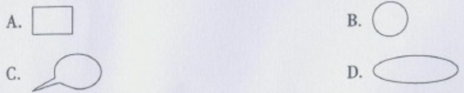
   3. 在构造决策表时, 将线条段和行动段联合起来的部分是 
      - A.逻辑 B.任务 **C.规则** D.节点
   4. 输入设计描述正确的是 信息输入准确性是由计算机系统评判
      - A. 与输入设备的价格有关 B. 与输入的速度等有关 C. 以上说法错误
   5. 数据模型的设计：简单 无冗余 灵活 适应性 【6.3 规范化

5. 考点分布: 7.4.3 网络架构设计。7.4.2 过程架构设计。

   1. 在**网络架构设计**中需要描述的主要内容不包括 **服务器开发环境.** P151

      - B.处理器说明 D. 传输协议

        A.客户端及其物理位置 C. 服务器开发环境

   2. 对于 B/S 架构的软件开发, 用于发布图形化组件、结构和链接的标准技术是
      A. 网页编程语言 В. ХМL С. НТML D. **CGI**
      
   3. 下列不是网络架构设计的内容是 A
   
      - **A.构建网络和超链接** B.服务器在网络的分配 C.客户端与服务端的链接 D.传输协议处理。
      
   4. 应用架构：Model, View, Controller
   
   4. 浏览器服务器架构简称：B/S 【7.2.5 浏览器/服务器架构
   
6. 考点分布: 9.5.2 代码种类。8.5.2 程序设计目标。9.2 关系数据库模型

   1. 目前我国的汽车牌照的编号属于下列哪种编码类型？**混合码**. P196

      - A. 数字码 B.顺序码 C. 混合码 D.字符码

   2. 采用结构化程序设计方法构建大型复杂软件系统时, 程序首要考虑的是
      A. 可维护性、可靠性和效率 C. 可维护性、可理解性和效率

      B.**可维护性、可靠性和可理解性** D. 可理解性、可靠性和效率

   3. 下列关于关系数据库模型的描述错误的是 D

      - A.可使用相关联的表或关系对关系进行描述 B.一张二维数据表可用来表示一个关系
      - C.关系表中的每一行对应的是每一条记录 D.以上说法都不对。
      
   4. 低耦合高内聚 【8.2.3 模块独立性
   
7. 考点分布: 11.3.2 控制结构测试。10.2.2 输入设计原则。10.1.3 输出方式选择。

   1. 下列测试技术属于白盒测试技术的是 **基本路径测试**. P234

      - A.基本路径测试 B.边界分析法 C.错误推测法 D.等价类划分法
   2. 下列对于信息系统输入设计原则表述错误的是 输入过程尽量细化
      A. 减少输入延迟 C. 输入过程应尽量细化 B. 控制输入量 D.避免额外步骤
   3. 人们将计算机信息输出用到输出介质，下面是输出介质的是 C
      - A.显示器 B.打印机 C.**光盘** D.扫描仪
   4. 结构化程序设计的指标：可靠性 可维护性 可理解性 效率 【8.5.2 程序设计目标

8. 考点分布: 12.2.2 继承。12.1.3 消息。11.3.1 逻辑覆盖

   1. 在面向对象软件技术中，一个类可以自动具有某个类的所有属性和方法，无需再次编写相同代码的方式称为 **继承**. P266
      - A 多态性. B 继承. C 封装. D 复制操作
   2. 对象间互相联系的方式是 **传递消息**
      - A.接口 B.传递消息 C.代码复制 D.查询操作
   3. 下列关于语句覆盖测试的说法正确的是 D
      
      - A 语句覆盖又称为分支覆盖
      - B 语句覆盖可测试判断表达式的值
      - C 语句覆盖分别测试判断表达式中的每一个条件，取不同值的情况
      - D 以上说法都不对。
   4. 条形码是什么输入：数模转换设备 【10.2.3 输入方式选择
   
9. 考点分布: 14.2.4 用例说明。15.1 领域建模。13.3.2 类之间的关联

   1. 在用例说明中，用以描述与该用例相关的可用性、可扩展性等**非功能需求**的说明事项是 **特殊需求**. P319
      - A 简要说明. B 前置条件. C 特殊需求. D 后置条件
   2. 在 UML 的结构图中, **用以描述系统的静态设计的视图**是 **类图**
      - A.对象图 B.用例图 C.类图 D.状态图
   3. 类之间的两种聚合关系，分别是 C
      - a 普通和泛化 B 组成和泛化 **C 组成和分享** D 普通和分享
   4. 确认测试 【11.2.2 测试步骤

10. 考点分布: 17.3 面向对象测试策略。16.3.1 设计类。14.2 理解需求

    1. 面向对象测试中，构造测试结构的基础是 **继承和组装关系**. P392
       - A 功能模块 B 类或抽象 C 类的方法 D 继承和组装关系
    2. 用于承载应用于系统接口的方式的类称为控制类, 其在面向对象设计中的表示方式是 C
       - A 实体类 B 接口类 C 控制类
       - 
    3. 设计用例时用例模型是由哪两部分组成的
       - A.事件流和前置条件 B.用例场景和后置条件 C.事件流和用例场景 **D.用例图和用例说明**
    4. 系统设计转换为成果的过程称为：编码 【1.2.4 系统实施

### 填空题 10 题\*2=20 分

1. 考点分布: 2.3.1 迭代式开发。1.1.3 信息系统的类型。1.3 信息系统的相关角色

   1. **原型方法**一般可分为 **探索型、实验型、演化型**三种类型。 P47
   2. 信息系统的类型通常可按照 **信息系统用户类别** 和 **提供的功能**(服务组织的层次) 两种方式划分。
   3. 信息系统的发起者和主要倡导者称为 **信息系统所有者**，信息系统项目的管理者称为 **项目经理**
   4. 面向对象分析中构造的两种模型是 静态模型 和 动态行为模型
   4. 需求变更 需求跟踪 【4.2.5 需求管理
2. 考点分布: 5.2.2 数据流程图的基本符号。4.1.2 系统需求分类。3.3.3 计划评审技术 PERT。

   1. 数据不能直接从一个数据存储流到一个 **外部实体**，数据必须由 **过程** 移动。 P102
   2. 系统需求包括 **业务需求**, **用户需求**, **功能需求**, 三个层次
   3. 计划评审技术(PERT)通过安排任务的顺序 **确定任务之间的相互依赖关系** 和 **计算任务工期** 形成
   4. 类与对象共同的特征分别有 属性 和 操作。
   5. 分布式计算方案 简称 C/S 【7.2.3 客户/服务器架构
3. 考点分布: 7.2 典型的系统应用架构。5.4 数据字典。5.2.4 数据流图规则。

   1. 目前系统应用架构中比较常用的是 **客户/服务器架构** 和 **浏览器/服务器** 两种。 P142
   2. 数据字典中的数据主要包括 **动态数据** 和 **静态数据**
   3. 数据流图中标示每个元素的名字都是 **唯一的** , 如果一个对象只有输入或输出没有过程, 那这个对象一定是**外部实体**
   4. 模块间耦合高低取决于 耦合性 和 内聚性 两方面
   4. 软件结构图形态特征：深度、宽度、扇入、扇出 【8.3.2 软件结构图
4. 考点分布: 9.1.2 逻辑数据模型到物理数据模型的转换规则。8.2.2 抽象与信息隐蔽。7.1 架构概述。
   1. 在属性的转换规则中，字段名称需要按照 **DBMS 的约束和内部规则** 被缩短或者重新格式化。 P184
   2. 通过 **抽象**, 可以确定组成软件的过程实体; 通过 **信息隐蔽** , 可以定义和实现对模块的过程细节和局部数据结构的存取限制。
   3. 系统应用架构是一个用于实现信息系统 **软硬件**和**网络 **的设计蓝图
   4. 需求中原型法的步骤有 **需求调查分析、需求原型设计、进行需求评审**。
   4. 数据库建模首先建立概念数据模型，然后建立逻辑数据模型 【9.1 逻辑数据模型和物理数据模型
5. 考点分布: 10.1.5 输出设计过程。9.4 设计字段。7.2.4 三层或 N 层客户服务器架构
   1. 输出设计的主要过程包括： **确定系统输出的需求 、 输出方式设计和设备选择 、输出格式设计、验证并测试输出**。 P204
   2. 字段是系统软件所识别的应用数据的最小单位, 在指定每一个字段时基本上要确定表示该字段的 **数据(储存)类型** 和 **数据完整性控制**
   3. 三层客户/服务器架构是在客户端和服务器端加入了中间层, 这里将客户端的**应用逻辑**和**表现逻辑**进一步进行了划分.
   4. UML 模型的关联表示法——和——
   4. 输出格式设计：报表输出 图形输出 【10.1.4 输出格式设计
6. 考点分布: 10.1.2 输出设计原则。10.2.3 输入方式选择。8.2.3 模块独立性
   1. 友好的用户界面应遵循的原则是 **可交互性原则** 和 **信息显示原则** 。 P214
   2. 使用网络传输可以安全、可靠、快捷地传输数据,其主要的传输媒介包括 **数字网络** 和 **电话网络**
   3. 模块的独立性是由耦合性和内聚性两个定性标准决定的, 为提高模块的独立性, 应尽量做到**低**耦合**高**内聚.
   4. UML 的衡量——和——为交付结果
   4. 系统维护：程序的维护 数据文件的维护 代码的维护 【11.8.2 系统支持与维护
7. 考点分布: 13.5 活动图。4.2.3 编写需求文档。10.2.4 输入格式设计。
   1. UML 的结构图中用于描述系统中各种活动的执行顺序或某个操作中所要进行的各项活动的执行流程的是 **活动图**。 P289
   2. 需求规格说明的主体由 **需求陈述** 构成。
   3. 输入格式设计要包括两个部分 **原始凭据格式** 设计和**输入介质记录格式**设计.
   4. 设计代码的主要作用——和——
   4. 类是对象的共同特性的表示。 【12.1.2 类与对象
8. 考点分布: 13.10.1 包之间的关系。13.7.2 迭代。12.1.5 操作。

   1. 包是一种把类进行分组的方式，两个包之间的相关方式包括 **泛化关系、依赖关系、 细化关系**。 P301
   2. 迭代是一种非常基本和重要的 **控制流类型** 可以在协作图中方便的建模, 用来指示重复的 **处理过程**
   3. 操作是由类的所有实例提供的一个 **功能或服务**，类中操作的实现过程称为 **方法**
   4. 类的协作图——类图和顺序图的交集，描述写作对象之间的交互和链接
   4. UML 组成元素：视图、图、模型元素、通用机制 【13.1.2 UML 的构成
9. 考点分布: 16.1.4 部署图。13.3.2 类之间的关联。13.2.4 用例之间关系。

   1. 绘制**系统部署模型图**主要是从 **应用程序本身** 和 **运行环境** 两个方面的要求来分析，结合分析结果进行绘制。 P363
   2. 问题域中的两个或多个对象之间的 **相互通信** 的关系称为关联。
   3. 从保证用例模型的一致性和可维护角度,可在用例之间抽象出**包含** , **扩展**和**泛化**三种关系.
   4. 系统应用架构——
   4. 执行用例前系统必须的状态：前置条件 ；执行完毕后系统可能处于的状态：后置条件 【14.2.4 用例说明
10. 考点分布: 17.3.1 单元测试。13.3.2 类之间的关联。16.3.1 设计类。
    1. 面向对象测试中以封装的类或对象为最小测试单元，类测试的三个主要部分是 **基于服务** 的测试、**基于状态** 的测试和 **基于响应状态** 的测试。 P393
    2. 类图是由类及其关系组成, 类之间的关系可细分为 **普通关联** , **泛化关联**、 **聚合关联** 等。
    3. 设计类时, 用于表示用户与系统接口方式的类称为**接口**类,用于承载应用或业务规则逻辑的类称为 **控制**类.
    3. 将处理系统事件消息的职责分派给特定的类：全局控制器 局部控制器 【16.2.3 控制器模式

### 名词解释题 5 题\*3=15 分

1. 考点分布:

   1. **敏捷式开发** P48 【2.3.2 敏捷式开发。
      1. 是一种以编程为核心的开发方法, 目的是根据迅速变化的需求快速开发软件.
      2. 其本质在于它强调可适应性而不是可预测性, 是一种更加主动的开发模式.
      3. 它遵循使软件保持灵活、可维护的设计原则和设计模式, 其核心是实践.
   2. **信息工程方法** 【2.2.2 面向数据方法。
      1. 是在企业中进行规划、分析、设计和实施应用的体系化方法, 用于改善企业的业务通信和资源管理以实现其商业背景; 
         - 其发展有两条主要分支: 数据驱动和业务驱动.
      2. 信息工程方法认为所有信息系统的开发以数据为中心; 
         1. 数据结构是稳定的, 而业务流程是多变的; 
         2. 最终用户必须真正参加信息系统的开发.
   3. **信息系统项目管理** 【3.1 信息系统项目管理。
      1. **信息系统项目管理**是指在指定时间内用最少的费用开发可接受的系统的管理过程，具体内容包括确定范围、计划、人员安排、组织、指导和控制。
      2. **项目管理的实质**是在系统质量、项目完成时间、项目成本这三个要素之间进行权衡。它们之间相互影响，任何一方发生变动都会对另外两个要素产生影响。
      3. 有效的项目管理有助于确保系统开发项目满足客户期望，并在规定的预算和时间内交付系统
   4. **工作分解结构** 【3.3.1 工作分解结构
   5. **快速应用开发路线** 【2.3 快速应用开发路线
      - 是一种系统开发策略，该策略强调用户深入参与到一系列系统工作原型的快速进化和构造过程中，以加速系统开发过程，系统工作原型最终将成为目标系统（或者系统应用的一个版本）
2. 考点分布: 

   1. **关联实体** P127 【6.1.3 关系。
      1. 是与一个或多个实体类型关联的实体类型, 并包含这些实体实例间的关系持有的属性.
      2. 是一种作为实体类型进行建模的关系, 图形表示为含菱形的实体矩形, 表示该实体由关系派生.
      3. 关联实体的主码是关联的所有实体主码的复合码, 其每个部分指向每个连接实体的一个且仅一个实例.
   2. **需求跟踪** 【4.2.5 需求管理。
      1. 是指跟踪一个需求使用期限的全过程, 包括编制每个需求同系统元素之间的联系文档, 这些元素包括: 
         - 其他类型的需求、体系结构、其他设计部件、源代码模块、测试和帮助文件等;
      2. 它提供了由需求到产品实现整个过程范围的明确查阅的能力;
      3. 其目的是建立与维护 "需求-设计-编程-测试" 之间的一致性, 确保所有工作成果符合用户需求.
   3. **联合应用设计** 【4.3.5 联合应用设计
      - 联合应用设计（JAD）的主要思想是把主要用户、管理者、参与项目的系统分析员聚集在一起，类似于群组访谈。
   4. **数据储存 **【5.2.2 数据流程图的基本符号。
   5. **外部实体** 【5.2.2 数据流程图的基本符号
      - 外部实体是与系统交互的外部的人员组织部门、其他系统或者其他组织，也称为源点终点。
3. 考点分布: 

   1. **变换流** P165 【8.4.1 变换分析设计。
   1. 在数据流图中, 信息沿输入通路进入系统, 同时由外部形式变换为内部形式.
      2. 进入系统的信息通过变换中心, 经过处理后沿输出通路变换成外部形式离开软件系统, 具有这些特征的信息流叫做变换流.
   2. **应用逻辑层** 【7.1.2 架构的逻辑层次。
   1. 应用逻辑层也称为业务逻辑层, 包括支持实际业务应用和规则所需的所有逻辑和处理, 主要实现 DFD 中、用例或功能说明中阐述的逻辑;
      2. 应用逻辑层次的工作通常通过程序设计语言的编程完成.
3. 用户界面 【10.3 用户界面。
   4. **软件结构图** 【8.3.2 软件结构图
   5. **数据字典** 【5.4 数据字典
   - 数据字典是定义和说明数据流程图中每个成分的内容和特征的工具。
4. 考点分布: 

   1. **输出设计目的** P201 【10.1.1 输出设计的目的。
      1. 是使系统能够正确及时的输出用户所需的各种有用信息, 保证系统输出的信息能够方便的为用户所使用, 能够为用户的管理活动提供有效的信息服务.
      2. 用户所需的各种管理业务和经营决策信息都有系统的输出提供, 是管理层和用户最终评估系统价值的基础, 信息能否满足用户需要, 也直接关系到系统的使用效果和系统的成功与否.
   2. **关系数据库模型 **【9.2 关系数据模型。
      1. 关系数据库模型采用相关联的表或者关系对关系进行描述; (1 分)
      2. 一个关系就是一张有命名的二维数据表。每个关系或表由几个列与任意多行组成。表中每一列对应于关系的一个属性, 而每一行对应于一条记录, 一条记录对所有属性都有一个值。(2 分)
   3. **系统测试** 【17.3.3 系统测试。
      1. 最后阶段的测试, 主要以用户需求为测试标准, 需要参考面向对象分析和面向对象分析测试的结果
         - 测试大纲法
         - 操作场景为重点的用例方法
   4. **对象图 **【13.3.4 对象图。
   5. **名义团体技术** 【4.3.2 名义团体技术
      - 工作在一起解决问题的个人是名义上的团体，用于在团队成员中产生想法，是群组访谈的一种方式。
5. 考点分布: 

   1. **并发路径** P291 【13.5.4 并发路径。
   - 在对活动建模时，往往需要将一个转移划分为两个单独的并发执行的路径，而后再将它们合并到一起。
      - 用一个与路径垂直的黑色粗实线表示，分叉的路径从这个实线条引出，而并发活动路径的回合也使用另一粗线条表示。
   2. **对象 **【12.1 面对对象相关概念。
   - 从用户的角度看,对象是一种具有某种属性和服务行为的事物。既可以是具体的物理实体的抽象,也可以是人为的概念或任何有明确边界和意义的东西;(1 分)
      - 从软件开发人员角度看,对象是一种将数据和处理数据的操作合并在一起的程序单元;(1 分)
   - 对象的特点包括: 以数据为中心、本身是主动的、实现了数据封装、具有并行性、模块独立性好等。(1 分)
   3. **用例包** 14.2.5 用例模型检查
      - UML 中最常用的管理模型复杂度的机制， 包也是 UML 中语义最简单的一种模型元素， 它就是一种容器，在包中可以容纳其他任意的模型元素（包括其它包）
      - 用于分类管理用例模型中的模型元素
4. 状态图  【13.4 状态图
   5. **第一范式** 【6.3.1 第一范式
   - 设 R 是一个关系模式，如果 R 的所有属性都是**最基本的、不可再分的数据项**，则称 R 满足第一范式，简记为 1NF。

### 简答题 5 题\*5 分=25 分

1. 考点分布: 

   1. **简述模型驱动开发的三种方法。** P41 【2.2 模型驱动开发。
   1. 面向过程法：以数据处理为核心，通过了解系统中如何流动来建立数据流图和实体关系图。
      2. 面向数据方法：分析企业的信息需求，明确信息模型, 建立全企业共享的数据库。
      3. 面向对象方法：分析企业的一些对象，把描述对象的数据和对对象的操作放在一起，如果多个对象共享某些数据，共享的数据和操作就构成了对象类。
   2. **简述信息系统开发的相关角色及其在信息系统开发中的作用 **【1.3 信息系统开发的相关角色。
      1. 信息系统所有者：信息系统的发起人和主要倡导者,负责投资项目以进行开发、运行和维护信息系统;
      2. 信息系统用户：使用信息系统或者受到信息系统影响的人;
      3. 信息系统设计员：将信息系统用户的业务需求和约束条件转换成技术方案;
   4. 信息系统构造人员：根据信息系统设计人员的设计说明构造信息系统构件;
      5. 信息系统分析员：理解组织及其职能,解决信息系统开发过程中的各种问题;
   6. 项目经理：领导项目组成员完成信息系统开发任务。
   3. 什么是信息系统方法，运用信息系统方法观点考虑和处理问题时包含哪几个要点
   4. **需求管理中需求变更的基础流程** 【4.2.5 需求管理
      1. 提出变更请求。
      2. 变更影响分析。
      3. 变更批准。
      4. 变更执行。
      5. 变更测试
      6. 变更结束。
   5. **甘特图的优点** 【3.3.2 甘特图
      - 能够清楚地表达活动的开始时间、结束时间和持续时间，易于理解，并能为各层次的人员所掌握和运用
      - 使用方便，制作简单，应用广泛。
      - 不仅能安排时间，而且能与劳动计划、资源计划资金计划相结合。

2. 考点分布: 

   1. 简述**数据建模过程中数据模型的设计**需要满足的标准。 P131 【6.3 规范化。
      1. 数据模型应简单,
      2. 数据模型基本上应无冗余,
      3. 数据模型应是灵活的而且对未来的需求具有可适应性.
   2. 简述**系统需求获取**的主要活动 【4.2需求获取过程。
   
      1. 了解用户需求：即通过与客户访谈或调研确定一些基本需求信息; (1 分)
      2. 分析用户需求：将客户需求与可能的系统功能或非功能需求相关联;(1 分)
      3. 编写需求文档：使客户需求信息结构化,编写成文档或者示意图;(1 分)
      4. 评审需求文档：选择客户代表评审文档并纠正存在的误解或者错误;(1 分)
      5. 需求管理：需求变更及需求跟踪。(1 分)
   3. **E-R 模型中实体的标识符代表什么? 确定标识符的规则是什么?** 【6.1 数据建模相关概念。
      1. 标识符是被选出来作为实体类型的唯一标识的候选码标
      2. 在每个实体实例的生命周期内，一个主码的值不会发生改变。
      2. 主码的值不能为空。
      3. 必须进行控制确保主码的值是有效值。
      4. 尽量不使用智能码。
   4. 构成逻辑的几种表述方式方法，并根据各自特点说明在建模过程中逻辑时应如何选择
   5. 需求获取阶段，数据库建模需要获取哪些数据 【6.2 逻辑数据建模过程
      - 确定基本实体
      - 建立实体间的关联
      - 确定主码和属性
   
3. 考点分布:  

   1. 简述软件设计中**模块的基本属性**。 P156 【8.2.1 模块化。
   		1. 接口：模块的输入输出
      
      2. 功能：模块实现的功能
      3. 逻辑：如何实现要求的功能及所需的数据
      4. 状态：该模块的运行环境，即模块的调用与被调用关系
      5. 功能、状态与接口反映模块的外在特征，逻辑反映内在特征
      
   2. 简述信息系统采用 **B/S 架构**的优点 【7.2.5 浏览器、服务器架构。
   
      1. 对于使用 Intermet 标准的客户/服务器架构,浏览器/服务器架构容易将**表现逻辑**、**应用逻辑**和**数据访问逻辑**进行分离,使其保持相互独立;(1 分)
      2. 浏览器/服务器架构采用简单的程序语句链接接口到特定的**应用逻辑**模块,以执行各种功能;(1 分)
      3. 浏览器/服务器架构可以对**应用逻辑**进行修改,而不用对表现逻辑和数据访问逻辑进行改动;(1 分)
      4. 所有系统都在浏览器上运行,不用再担心存在多个不同的计算机架构,也不用担心存在不同的操作系统;(1 分)
      5. 浏览器/服务器架构可以重新设计传统信息系统在网络上运行的能力。(1 分)
   
   3. **目前常用的代码设计方法有哪两种? 分别简单阐述他们的优缺点?** 【8.5.1 结构化程序设计。
   
      1. 线分类方法：
         - 结构清晰，容易识别和记忆，容易进行有规律的查找。
         - 与传统方法相似，对手工系统有较好的适应性。
         - 主要缺点是结构不够灵活，柔性较差。
      2. 面分类方法：
         - 柔性好，面的增加、删除、修改都很容易。
         - 可实现按任意组配面的信息检索，对机器处理有良好的适应性。
         - 缺点是不易直观识别，不便于记忆。
   
   4. **结构化程序设计的基础思想和目标**。【9.5.3 代码设计方法。
   
      1. 在构造任何算法时，仅采用顺序结构、选择、分支结构和循环结构作为基本单元
      2. 同时规定基本结构之间可以并列和互相包含，不允许交叉和从个结构直接转到另一个结构的内
         部去。
      3. 结构化程序具有唯一入口和唯一出口，并且不会出现死循环
      4. 程序的静态形式与动态执行流程之间具有良好的对应关系
      5. 目标
         1. 可维护性
         2. 可靠性
         3. 可理解性
         4. 效率
      
   5. **需求分析要注意什么** 【4.2.2 分析用户需求
   
      - 是否遗漏了重要的需求
      - 是否存在矛盾的需求；
      - 是否存在不可行的需求；
      - 是否存在重复的需求；
      - 是否存在模棱两可的需求
   
4. 考点分布:

   1. 简述**输出设计的主要过程**。 P204 【 10.1.5 输出设计的过程。
      1. 确定系统输出的需求：内部使用还是外部使用
      2. 输出方式设计和设备选择：确定实现方式及生产频率
      3. 输出格式设计：按照需求设计表格和图形
      4. 设计、验证并测试输出：采用原型化工具及代码生成器对输出进行测试
   2. 简述软件详细设计中, **结构化程序设计**的基本思想 【8.5.1 结构化程序设计。
   
      1. 在构造任何算法时，仅采用顺序结、选择（分支）结构和循环结构作为基本单元；（2 分）
      2. 同时规定基本结构之间可以并列和互相包含，不允许交叉和从一个结构直接转到另一个结构的内部去；（1 分）
      3. 结构化程序具有唯一入口和唯一出口，并且不会出现死循环；（1 分）
      4. 程序的静态形式与动态执行流程之间具有良好的对应关系。（1 分）
   3. **设计一个友好的用户界面应遵循的原则是什么? 这些原则具体包括了哪些内容?** 【10.3.1 用户界面设计原则。
      1. 可交互原则
         1. 用户针对性原则
         2. 多种交互方式
         3. 提供反馈
         4. 提供帮助
         5. 出错处理功能
      2.  信息显示原则
         1. 用户界面一致性
         2. 仅显示与当前上下文有关的信息, 尽量减少用户记忆
         3. 采用窗口分隔不同种类的信息, 保证各种类型的信息\指令和消息总是出现在通常的显示区域
         4. 界面上要安排足够的提示信息来引导操作, 提示简单明了
         5. 应用程序与界面相分离
   4. **信息系统输出设计的目的和设计原则是什么** 【10.1.2 输出设计原则。
      1. 输出应该易于阅读和理解
      2. 按时提供输出
      3. 制作对用户有意义的输出
      4. 选择有效的输出方法
   5. **目前常用的代码设计方法有哪两种? 分别简单阐述他们的优缺点**? 【9.5.3 代码设计方法
      1. 线分类特点：
         - 结构清晰，容易识别和记忆，容易进行有规律的查找。
         - 与传统方法相似，对手工系统有较好的适应性。
         - 主要缺点是结构不够灵活，柔性较差。
      2. 面分类方法：
         - 柔性好，面的增加、删除、修改都很容易。
         - 可实现按任意组配面的信息检索，对机器处理有良好的适应性。
         - 缺点是不易直观识别，不便于记忆。
   
5. 考点分布: 

   1. 进行**用户界面设计**时，应遵循的**可交互性原则**包含哪些内容？ P214 【10.3.3 用户界面交互方式。
      1. 用户针对性原则
      2. 多种交互方式
      3. 提供反馈
      4. 提供帮助
      5. 出错处理功能
   2. 简述**输入设计**应遵循的原则 【10.2 输入设计。
   
      1. 控制输入量：在输入设计中,应尽量控制输入数据总量; (1 分)
      2. 减少输入延迟：输入数据的速度往往成为提高信息系统运行效率的瓶颈, 一个良好、高效的输入界面对用户所有的输入和任务请求都能立即响应并作出反馈;(1 分)
      3. 避免额外步骤：在输入设计时，应尽量避免不必要的输入步骤，当步骤不能省略时，应仔细验证现有步骤是否完备、高效;(1 分)
      4. 输入过程应尽量简化：输入设计在为用户提供纠错和输入校验的同时,必须保证输入过程简单易用，不能因为查错、纠错而使输入复杂化，增加用户负担;(1 分)
      5. 减少输入错误：输入设计中应采用多种输入校验方法和有效性验证技术，减少输入错误。(1 分)
   3. **请对发现类的各种方法进行简要说明** 15.1.1 【15.1.1 发现类。
      1. 名词短语方法
      2. 通用类模式方法
      3. 用例驱动方法
      4. CRC 方法
      5. 混合方法
   4. **在用例说明中通常包含哪些要素** 【14.2.4 用例说明
      1. 简要说明 
      2. 用例场景
      3. 事件流 
      4. 前置条件
      5. 后置条件
      6. 特殊需求 
   5. **面向对象分析与面向对象设计的区别** 【16.1 系统设计与 UML
      1. 在侧重点上，面向对象分析侧重于**理解问题**，描述软件要做什么，而面向对象设计侧重于**理解解决方案**，描述软件要如何做。
      2. 面向对象分析一般**只考虑理想设计**，不关心技术和实现层面的细节，而面向对象设计需要得到**更具体、更详尽**，更接近于真实的代码的设计方案。
      3. 在设计结果的描方式上，面向对象分析阶段**侧重于描述对象的行**为，而面向对象设计阶段**侧重于描述对象的属性和方法**。
      4. 面向对象分析**只关注功能性需求**，而面向对象设计**既关注功能性需求**，**也关注非功能性需求**。
      5. 面向对象分析产生的**系统模型通常规模较小**，而面向对象设计产生的**系统模型规模较大**，内容也比较详尽、完整。

### 应用题 2 题\*10=20 分

1. **考点分布**: 6.1 E-R 图。9.3 E-R 转换为关系。6.2 关系模型。5.2 数据流图。

   1. ##### 假设要为银行的储蓄业务设计一个数据库

      1. 其中涉及到储户、存款、取款等信息，一个储户可以多次存款， 每次存款产生一张存款单；当然，一个储户也可以多次取款， 每次取款产生一张取款单。

      2. 储户的属性有身份证号、姓名、地址、账号、账户余额；

      3. 存款单的属性有存款单号、存款方式、存款金额

      4. 取款单的属性有取款单号、取款方式、取款金额。

      5. 存款时要记录存款日期；取款时要记录取款日期。

      6. 问题：试绘出该储蓄业务的 **E-R 图**。 P122

         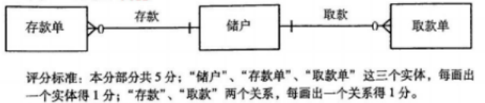

      7. 问题：将这个 E-R 图转换为**关系模型**，并给出各关系模型中的主码。 P185

         - 储户 (<u>身份证号</u> , 姓名 , 地址 , 账号 , 账户金额)
         - 存款单 (<u>存款单号</u> , 存款方式 , 存款金额)
         - 存款 (<u>身份证号 , 存款单号</u> , 存款日期)
         - 取款单 (<u>取款单号</u> , 取款方式 , 取款金额)
         - 取款 (<u>身份证号 , 取款单号</u> , 取款日期)

   2. ##### 商业集团数据库中有三个实体集。

      1. 一是“商店”实体集, 属性有商店编号、商店名、地址;
      2. 二是“商品”实体集, 属性有商品名、商品号、规格、单价;
      3. 三是“职工”实体集, 属性有职工编号、姓名、性别、业绩。
      4. 商店与商品间存在“**销售**”联系, 每个商店可以销售多种商品, 每种商品也可以放在多个商店销售, 每个商店每销售一种商品, 有**月销售量**; 商店与职工间存在着“**聘用**”关系, 每个商店有许多职工, 每个职工只能在一个商店工作, 商店聘用职工有**聘用期**和**月薪**。
      5. 问题：(1) 试绘出 E-R 图。
         - 
      6. 问题：(2) 将 E-R 图转换成关系模型,并指出每个关系模型的主码。
         - 商店 (<u>商店编号</u>, 商店名, 地址)
         - 职工 (<u>职工编号</u>, 姓名, 性别, 业绩)
         - 聘用 (<u>职工编号</u>, <u>商店编号</u>, 聘用期, 月薪)
         - 商品 (<u>商品号</u>, 商品名, 规格, 单价)
         - 销售 (<u>商店编号</u>, <u>商品号</u>, 月销售量)

   3. 售书过程是，接受读者的订书单，根据图书文件核定订购量，如可以供应，做销售处理，修改图书文件和销售文件，然后开发票，将收款单送财务科，将取书单和发票给读者; 如缺书填写缺书文件，根据缺书文件进行缺书处理，将缺书通知送采购科。(全国卷)

      1. 做出处理过程的数据流图。

         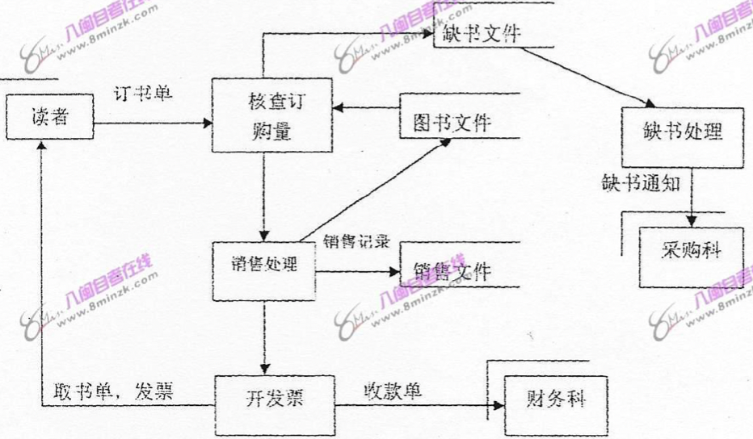

   4. 某快餐店向用户提供午餐配送服务, 这一应用中包含两个实体, 分别是“送餐员"和“用户”, “送餐员“这一实体中包含属性有“员工号”、“姓名”和“电话”, “用户'' 这一实体中包含属性有“配送号”、“地址、“手机号"和"用户名", 请跟就上述条件回答

      1. 请简要描述两个实体之间的关联关系
         - 一个配送号对应一个送餐员，一个送餐员对应多个配送号
      2. 试画出该应用中的 E-R 图
         - 
      3. 请将 E-R 图转换为关系模型并指出主码
         - 送餐员（<u>员工号</u>，姓名，电话）
         - 用户（<u>配送号</u>，用户名，地址，手机号）
      
   5. 假设有一组 7 位自然代码 C1C2C3C4C5C6C7 为 9376251，为验证该代码输入的准确性，需加上校验位，请根据下述条件，计算出校验位和最终代码

      1. 权因子 P1P2P3P4P5P6P7 为 7654321
      2. 确定模 M=11
      
   6. 作者有作者号、姓名、微信号，书有书号、书名，出版社。【6.1 E-R 图。9.3 将 E-R 图转化成关系。

      - 说明书和作者的关系。
        - 一本书有多个作者，一个作者有多本书
      - 画 E-R 图。
      - 实体关系模型转换，标出主码
        - 作者 (<u>作者号</u>、姓名、微信号)
        - 书 (<u>书号</u>、书名，出版社)

2. **考点分布**: 11.3 白盒测试。6.2 数据建模。8.3 HIPO 图。

   1. 使用**白盒测试技术**中的**逻辑覆盖测试**方法测试以下程序段：

      ```c
      void DoWork(int x,int y,int z)
      {
       int k=0,j=0;
       if((x>3)&&(z<10))
       {
       		k=x*y-1;
       		j=sqrt(k);
       }
       if((x=4)||(y>5))
       		j=x*y+10;
       j=j%3;
      }
      ```

      说明：程序段中每行开头的数字（ 1-10）是对每条语句的编号。
      要求：

      1. 画出程序的控制流程图（用题中给出的语句编号表示） P237

         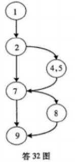

      2. 以条件组合覆盖方法设计测试用例，并写出每个测试用例的执行路径（用题中给出的语句编号表示） P235

         

   2. ##### 某学校计算机教材购销系统有以下功能:

      1. 学生买书,首先填写购书单,计算机根据各班学生用书表及售书登记表审查有效性。若有效,计算机根据教材库存表进一步判断书库是否有书;若有书,把领书单返回给学生,学生凭领书单到书库领书。

      2. 对脱销的教材,系统统用缺书单的形式通知书库,新书购进库后,也由书库将进书通知返回给系统。

      3. 请就以上系统功能画出分层的数据流图(二级分解数据流图只需画出销售子系统的数据流图)。

         

         

         

   3. 某单位统计职工科研成果，该单位有多个部门，每个部门有多名职工，每名职工可 以参加多个项工作，每个项目有多名职工参加。现需要如下统计表，试设计至少满 足成果统计表的数据库逻辑结构。(全国卷)

      

      1. 部门 (部门号, 部门名)
      2. 职工 (职工号, 姓名, 职称, 部门号)
      3. 项目（项目编号，项目名称，开始时间，结题时间，项目来源）
      4. 成果（项目编号，职工号，承担工作）

   4. 共享出租租赁企业需建立一套车辆信息管理系统，该系统包含“系统管理”、“车辆管理“和“数据查询”三个模块，其中“系统管理包括“数据存储"、“权限管理"和“数据备份与恢复"三个功能，“车辆管理"包含"车辆信息"、“GPS 定位"两个功能，“数据查询"包括“车辆信息查询”和“用户信息查询"两个模块，"GPS 定位" 又包括 "停放地点" 和 "运动轨迹" 两个模块，请根据上述信息画出共享单车信息管理**系统的层次图**或 **HIPO图**

   5. `a > 1` 假设为真值是 T1，假值是：T1；`b < 0`，假设为真值是 T2，假值是 T2；`c = 1`，假设为真值是 T3，假值是 T3。

      1. `a>1 b<-1` 的值和路径

      2. `a-1 b<1` 的值和路径

      3. `a>1 b<-1 c=1` 的值和路径

      4. 
   
         ```mermaid
         graph TD
         A[进入] --> B{a>0 and b<0}
             B --> |a<=0 or b>=0| D[F1]
             D --> G[结束]
             B --> |a>0 & b<0| E{c=0}
             E --> H[F2]
             H --> G[结束]
             E --> F[null]
             F --> I[null]
             I --> G[结束]
         
         ```
      
   6. 使用结构化语言说明以下关系 【5.3.1 结构化语言
   
      1. 小于 19 岁
   
         1. 初中文化
            1. 脱产学习
         2. 高中文化
            1. 电工
   
      2. 大于 19 小于 45
   
         1. 初中文化或高中文化
            1. 男
               1. 钳工
            2. 女
               1. 车工
         2. 大学文化
            1. 技术员
   
      3. 大于 45 岁
   
         1. 技术员
   
      4. 答案：
   
         ```basic
         READ 年龄
         READ 文化水平
         READ 性别
         SELECT CASE
         CASE 1(年龄<19)
         	BEGIN IF
         		IF 文化水平=初中文化
             THEN 脱产学习
         		ELSE 文化水平=高中
         		THEN 电工
           END IF
         CASE 2(19<年龄<45)
           BEGIN IF
             IF (文化水平=初中文化) OR (文化水平=高中)
             	BEGIN IF
             		IF (性别=男)
             		THEN 钳工
             		ELSE (性别=女)
             		THEN 车工
               END IF
             ELSE 文化水平=大学
             THEN 技术员
           END IF
         CASE 3(45<年龄)
         	技术员
         ```
   
         

## 第 1 章 信息系统开发概述

### 学习目标

- 信息系统的**基本概念和组成**，这部分是理解后续内容的基础。
- 信息系统开发的基本**过程**，系统开发各阶段的主要**内容**。
- 围绕信息系统开发主要过程的**角色分配**。

### 1.1 信息系统的基本概念

#### 1.1.1 信息系统与信息技术

1. 系统（system）是具有可识别边界的一套相互关联的组件共同工作以达到某种目的。系统反映了人们对事物的一种认识论，即系统是由两个或两个以上的元素相结合的有机整体，系统的整体不等于其局部的简单相加。

2. 系统普遍具有以下 **9 个要素**

   - ① 目的 ② 边界 ③ 构件
   - ④ 构件之间的关系 ⑤ 环境 ⑥ 接口
   - ⑦ 输入 ⑧ 输出 ⑨ 约束

3. **信息系统**的概念最早是由明尼苏达大学卡尔森管理学院的教授 Gordon B.Davis 手 1985 年提出的，他下的定义为：

   - 信息系统是一个利用计算机软硬件，利用各类分析、计划、控制、决策模型，以及数据库的人机信息系统，可以提供信息用以支持企业或组织的运行、管理和决策功能

   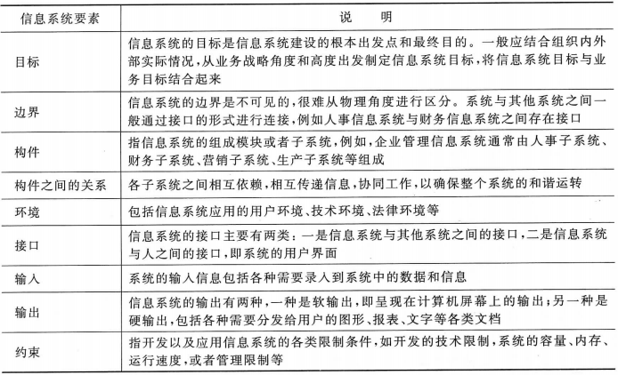

4. **信息技术**是指信息的采集、存储、加工、输出、传递等过程中的各种技术总称，主要包含计算机技术（软硬件）和电信技术（数据、图像和语音网络）。它也常被称为信息和通信技术（Information and Communications Technology，ICT）

5. **系统方法**要求人们运用系统的观点，从系统整体与部分、功能与结构、系统与环境之间的相互联系和相互作用中考察对象。包含以下 4 个要点：

   1. 整体性。
   2. 结构性。
   3. 关联性。
   4. 功能性。

#### 1.1.2 信息系统的结构

1. ##### 功能结构

   1. 输入
   2. 输出
   3. 储存
   4. 处理
   5. 反馈

2. ##### 应用结构

   1. 根据信息系统服务对象的不同来划分。从横向看，信息系统可以承担多种服务职能
      - 生产子系统、市场子系统、供运子系统、财会子系统、人事子系统等。
   2. 纵向来看，企业可划分为
      - 战略管理层、战术管理层、知识管理层、操作管理层

3. ##### 软件结构

   1. 信息系统的软件结构是指支持信息系统各种功能的软件系统或者软件模板组成的系统结构。
      - 功能-层次矩阵表示。

#### 1.1.3 信息系统的类型

1. 信息系统按**信息系统用户类别**可分为
   1. 前端信息系统
   2. 后端信息系统
2. 按照**提供的功能**、**服务组织的层次**，信息系统可分为：
   1. 事务处理系统：TPS
   2. 管理信息系统：MIS
   3. 办公自动化系统：OAS
   4. 知识工作系统：KWS
   5. 决策支持系统：DSS
   6. 经理信息系统：EIS


#### 1.1.4 信息系统的生命周期

- ##### 大致 3 个阶段：

  1.  开发阶段
      - 开发阶段的主要任务是构造系统，主要进行系统的规划、分析、设计与实现，需要在开发环境下完成。
  2.  实施阶段
      - 当信息系统开发完成后，需要在用户环境下进行安装和实施，通过验收后正式交给用户。
  3.  运行和维护阶段
      - 系统便从开发环境转换到生产环境中，并进入运行与维护的生命周期。

### 1.2 信息系统开发过程 (重要)

信息系统生命周期划分为 5 个阶段：

1. 系统规划
2. 系统分析
3. 系统设计
4. 系统实施
5. 系统运行与维护

#### 1.2.1 系统规划

1. 确定信息系统及项目的优先顺序
2. 组建信息系统项目团队
3. 确定信息系统项目范围
4. 启动项目

#### 1.2.2 系统分析

1. 需求理解
2. 需求表达
   - 需求明确之后，需要采用规范化的、结构化的模型将其描述清楚。
   - 主要是借助一些逻辑该过程也称为“**逻辑设计**”过程。

#### 1.2.3 系统设计

设计阶段的目标是根据系统分析说明书的要求，设计新系统的技术蓝图，从而为系统的实现奠定基础，该过程也称为“**物理设计**”过程。

1. 体系架构设计
2. 详细设计
3. 数据库设计
4. 输入和输出界面设计
5. 代码设计

#### 1.2.4 系统实施

该阶段的主要交付成果是可运行的系统。

1. 编程与测试
2. 系统转换
3. 用户培训

#### 1.2.5 系统运行与维护

它是系统建设的收获阶段。

1. 规划
   1. 信息系统项目规划书
2. 分析：xx需求
   1. 信息系统需求说明书
3. **设计**：xx设计
   1. 信息系统设计说明书
4. **实施**：xx测试
   1. 可以运行的系统
   2. 程序代码及文档
   3. 培训文档
   4. 用户使用说明书
5. 运行维护
   1. 变更的程序代码和文档
   2. 新版本或者软件的发布
   3. 维护说明书

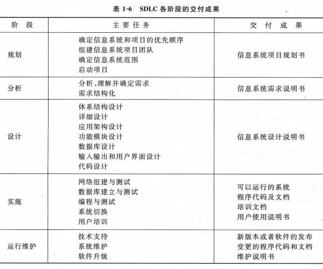

### 1.3 信息系统的相关角色

6 种角色：信息系统所有者、信息系统用户、信息系统分析员、信息系统设计员、信息系统构造人员和项目经理

#### 1.3.1 信息系统所有者

- 发起人和主要倡导者

#### 1.3.2 信息系统用户

- 使用者或影响到的人

#### 1.3.3 信息系统设计员

- 用户的业务需求和约束条件转换成技术方案

#### 1.3.4 信息系统构造人员

- 根据设计说明构造信息系统构件

#### 1.3.5 信息系统分析员

- 研究组织存在的问题和需求，确定如何最大化企业利益
- 是信息系统的所有者、用户、设计人员和构造人员间**沟通的桥梁**
- 需要的技能：
  1. 分析
  2. 技术
  3. 管理
  4. 人际关系

#### 1.3.6 项目经理

- **项目组织的管理者**，负责团队组件、任务分派、团队成员管理


#### 1.3.7 信息系统各种角色比较


### 1.4 案例分析 ——校园二手书交易平台的设计与实现

1.4.1 系统需求分析

1.4.2 系统设计

1.4.3 系统实现

1.4.4 案例思考

本章小结

思考与练习

## 第 2 章 信息系统开发路线、方法与工具（重要）

### 学习目标

- 几种典型的信息系统**开发路线**。
- 合适的开发路线与方法。
- 自动化工具与技术。

### 2.1 信息系统开发路线概述

路线，主要取决于系统开发的目标资源和成本等限制条件


### 2.2 模型驱动开发路线（重要）

- 面向过程方法（Process Oriented，PO）：面向过程的开发方法是以数据处理为核心，通过了解数据在系统中如何流动来建立数据流图和实体关系图
- 面向数据方法（Data Oriented，DO）：面向数据的开发方法首先分析企业的信息需求，建立企业的信息模型，然后建立全企业共享的数据库
- 面向对象方法（Object Oriented，OO）：面向对象的开发方法是先分析企业的一些对象，把描述对象的数据和对对象的操作放在一起，如果多个对象共享某些数据和操作，共享的数据和操作就构成了对象类。

#### 2.2.1 面向过程方法

1. 面向业务过程
2. 面向数据处理过程

**结构化方法**是 20 世纪 90 年代较为流行的开发方法。

- 基本思想是：用系统工程的思想和工程化的方法，按用户至上的原则，结构化模块化、自顶向下地对系统进行分析与设计。
- 结构化方法以功能为核心，将数据流图作为驱动开发的力量。最近，随着关系数据库模型的盛行数据流图的重要性开始减弱，该方法也更加强调以数据为核心，重点放在实体关系图上。
- 该方法基于两种技术用于过程建模的数据流程图和用于数据建模的实体关系图。

1. ##### 结构化系统分析设计开发方法（Structured System Analysis and Design，SSAD）

   - SSAD 特点：
     1. 严格区分工作阶段。
     2. 强调开发过程的整体性、全局性
     3. 充分预料可能发生的变化
     4. 工作文件的标准化和文档化。
   
   - 缺点：
     1. 系统开发周期长。
     2. 方法是线性而非迭代或者递增的
     3. 开发出来的系统其总体结构和用户现实的业务运作过程存在着较大的差异，即寄观世界的问题领域系统的可理解性差。
     4. 系统的可维护性和稳定性差
   

#### 2.2.2 面向数据方法

- 信息工程方法的主要思想是
  1. 所有信息系统的开发建设都应该以数据为中心，不应该以处理为中心
  2. 数据结构是稳定的，而业务流程是多变的
  3. 最终用户必须真正参加信息系统的开发
- 系统开发基本步骤
  1. 企业规划
  2. 业务域分析
  3. 系统设计
  4. 构造
- 面向过程的系统开发方法，侧重于信息系统中数据的流动、使用和转换

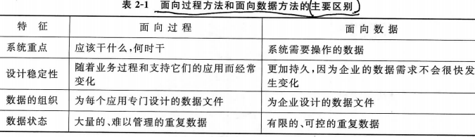

#### 2.2.3 面向对象方法

1. ##### 面向对象方法的主体，具有以下特征

   1. 封装性。将对象作为一个独立存在的实体，从外部可以了解其功能，但内部细节是隐蔽的，不受外界千扰。对象之间相互依赖性很小，因此可以独立被其他各系统所选用。
   2. 继承性。对象和类之间的层次结构具有继承关系，即子类继承父类的属性。
   3. 多态性。各种对象之间具有统一、方便、动态的消息传递机制。

2. ##### 面向对象开发方法具有以下优点

   1. 无缝衔接。
   2. 开发效率高。
   3. 容易维护。
   4. 容易扩展

3. ##### 在一些新的问题

   1. 由于面向更高的逻辑抽象层，使得在实现的时候，不得不做出性能上的牺牲
   2. 如果实施服务器采用的是关系数据库，则概念和实施之间的语义鸿沟会非常明显。
   3. 项目管理十分困难。


### 2.3 快速应用开发路线

快速应用开发路线（Rapid Application Development，RAD）是一种**系统开发策略**，该策略强调**用户深入参**与到一系列系统工作**原型的快速进化和构造过程**中，以**加速**系统开发过程，系统工作原型最终将成为目标系统（或者系统应用的一个版本）。

- 快速应用开发路线的基本思想为：
  - 将系统开发组织成一系列重点突出的研讨会，研讨会要让系统所有者、用户分析员、设计人员和构造人员一同参与。
  - 通过一种迭代的构造方法加速需求分析和设计过程，让系统用户更主动地参与到分析设计和构造活动中来，让用户可以提前看到可以工作的系统，进而提出改进意见，不断优化。
- 绝大多数快速应用开发方法推荐系统分析员采用特定的技术和计算机工具来加速分析、设计、实施过程，
  - 例如采用 CASE 工具、JAD 会议、可视化编程语言，简化并加速编程和代码产生过程。

**快速应用开发路线下主要有两种开发方式：迭代式开发和敏捷式**

1. 开发快速应用开发具有如下优点

   1. 它鼓励用户和管理层主动参与（相对于不可工作的系统模型的被动响应），这增加了最终用户对项目的热情。
   1. 项目具有较高的可视性和支持度，因为用户深入地参加到整个开发过程中，用户和管理层看到可工作的基于软件的方案比模型驱动开发要快得多 
   1. 在原型中错误和遗漏往往在比在系统模型中更早地被发现
   1. 测试和培训是基本原型方法的一个自然副产品
   
2. 快速应用开发存在如下缺点

   1. RAD 鼓励“编码、实现和修改”，可能会增加运行、支持和维护系统所需的费用
   2. 省略或者简化了问题分析，有可能导致错误的问题
   3. RAD 原型容易导致“先入为主”，可能不会鼓励分析员考虑其他更有价值的技术方案。
   4. RAD 对速度的重视会对质量造成伤害，因为这种方法中充斥着大量不明智的径
   5. 快速应用开发比较适用于用户需求不确定或不明确，同时规模不算太大的项目，因此，RAD 在小型和中型系统项目中最流行。

#### 2.3.1 迭代式开发

1. 迭代式开发的重点是通过各阶段的迭代设计缩短开发应用软件和系统的时间，在循环的每次迭代中，都要构造和测试“一些设计原型或部分功能系统”。

2. **原型方法的三种类型**：

   1. **探索型**（Exploratory Prototyping）：
      - 主要是针对开发目标模糊、用户和开发人员对项目都缺乏经验的情况，其目的是弄清对目标系统的要求，确定所期望的特性并探讨多种方案的可行性
   2. **实验型**（Experimental Prototyping）：
      - 用于大规模开发和实现之前考核验证方案是否合适，规格说明是否可靠。
   3. **演化型**（Evolutionary Prototyping）：
      - 其目的不在于改进规格说明和用户需求，而是将系统改造得易于变化，在改进原型的过程中将原型演化成最终系统，它将原型方法的思想贯穿到系统开发全过程，对满足需求的改动较为适合

3. 原型设计和开发的具体步骤

   

#### 2.3.2 敏捷式开发

1. 敏捷式开发主要是以**编程为核心**的方法，目的是根据迅速变化的需求快速开发软件。

2. 敏捷式方法和传统方法学的本质的不同之处在于它更强调**可适应性**而不是可预测性，是种更加主动的模式。为获取这种敏捷性，使用一些提供的必要的纪律和反馈的实践，遵循使软件保持灵活、可维护的设计原则和设计模式。

3. 敏捷的**核心是实践**。

4. ##### 敏捷式开发方法包括

   - **极限编程**（Extreme Programming，XP）
   - SCRUM
   - 水晶方法（Crystal Methods）
   - 特征驱动软件开发（Feature Driven Development，FDD）
   - 自适应软件开发（Adaptive Software Development，ASD）
   - 动态系统开发方法（Dynamic Systems Development Method）
   - DSDM 等
   - 敏捷式方法也经常与面向对象方法配合使用。

5. 极限编程方法的特点在于：测试和高效编程是 XP 方法的核心。

6. 然而，XP 方法需要一系列的原则。否则，项目就不聚焦，发生混乱。因此，一般不超过 12 人的小型开发团队比较适合，不适合大的应用。此外，该方法也需要现场进行用户输入。

### 2.4 商用软件开发路线

#### 2.4.1 购买现成商用软件

1. 购买现成商用软件的步骤如下：
   1. 在信息系统需求分析阶段进行一些初步的“技术市场调研”：确定存在着哪些软件包方案，这些软件有什么特征，以及用来评价这些应用软件的准则，确定是否需要采纳购买方案。
   2. 定义了业务需求之后，必须同提供候选的软件包的供应商进行交流，供应商提交他们的软件方案的建议或报价。这些建议方案按照需求方案说明书中确定的业务和技术需求进行评价。
   3. 与最终选择的供应商协商软件合同和订单，以及安装和维护软件可能需要的服务合同。供应商提供基本软件和文档，软件的安装和实现服务通常由供应商提供，或由软件的服务提供商提供。
   4. 当购买了应用软件包后，组织几乎都需要改变它的业务过程，以便更有效地利用该软件。由于很少有应用软件包能够在安装时满足所有的业务需求，需要进行差距分析来确定软件包的功能和特征不能满足哪些业务需求。对于不能满足的需求，可以要求软件供应商在可以接受的范围内对软件包进行定制；定义“附加软件需求”；定义“新增软件需求”。所谓差距分析是将商用软件包的业务和技术需求与特定的商用软件包的功能和特征进行比较，以定义不能满足的需求。
   5. 安装并测试基本软件，根据自己的偏好进行选择，并对参数进行设定，同时完成测试。设计并构造了所有的附加软件以满足附加的业务需求，系统最终经过测试并投入运行。
2. 购买现成商用软件包的主要**优点**包括
   1. 可以更好地实现新系统，因为不需要大量的编程工作
   2. 应用软件供应商将他们的开发费用平摊到购买软件的所有客户身上。这样，他们可以不断地投资以改进软件的特点，功能和可用性，这往往是单个企业无法做到的
   3. 应用软件供应商对重大的系统改进和错误修改负有责任。
   4. 在一个行业内部，许多企业的功能相似性多于差异性。每个组织自己“重打鼓另开张”没有什么意义，因此，购买软件也可以减少组织的重复建设与开发。
3. 商用软件包路线的主要**缺点**包括：
   1. 成功的商用软件实现依赖于软件供应商的长期成功和生存能力，如果供应商不工作，企业就会失去技术支持和未来的改进。
   2. 购买的系统很少能反映理想方案，而企业可以通过内部开发实现理想方案
   3. 改变业务过程以适应软件几乎总是会遇到一些阻力，一些用户将不得不被解雇或者分配新工作；而有些人的地位会发生变化，他们认为这些变化是技术驱动的，而非业务驱动的
   4. 目前的现实证明，无论如何，购买商用软件的趋势不能被忽视。

#### 2.4.2 现成软件包二次开发

1. 在下列 3 种情况下可以优先考虑选择使用软件包开发系统的策略：
   1. 需要开发的系统功能是多数组织都要用到的一些通用功能，比如，工资管理、人力资源管理、会计财务管理、应收应付账款管理等。因为这类软件包很多，有比较宽的选择余地，成本也不会很高。
   2. 缺少组织内部的开发人员。不是每个组织都有足够的内部信息技术专业人员可以承担系统开发任务的，这时就可以考虑全部或部分地选用软件包来开发自己的信息系统。
   3. 开发的系统属于微机系统。因为目前市售的绝大多数应用软件包都是运行在微机环境下的。
2. 利用现成软件包开发的**优点**
   1. 缩短开发时间。
   2. 可以得到比较好的维护。
   3. 能减轻组织内部对系统开发的阻力
3. 利用软件包开发的**缺点**
   1. 功能较为简单
   2. 难以满足特殊要求
   3. 实施的费用随客户化工作量的增大而急剧上升
4. 利用软件包开发系统的步骤
   1. 系统分析
   2. 系统设计
   3. 编程、调试、转换、安装、修改、设计程序接口、做文档、切换测试培训用户。
   4. 运行与维护，改错与升级。

### 2.5 选择合适的开发路线与方法

1. 选择开发方法
   1. 用户需求的明确性
   2. 对技术的熟悉程度
   3. 系统复杂性
   4. 系统可靠性
   5. 项目进度
   6. 进度可视性

### 2.6 自动化工具与技术

#### 2.6.1 case 定义

1. ##### CASE（Computer Aided Software Engineering)

   - 是一种自动化或半自动化的方法目的是减少重复工作量，它能够全面支持除系统调查外的每一个开发步骤，通过将许多常规化的开发工作自动化和强化设计的各项规则，使开发者解脱出来，将精力集中到更需要创造力的工作中

2. 狭义地讲，CASE 是一组**工具和方法的集合**，可以辅助软件生存周期各阶段的开发工作

#### 2.6.2 case 工具分类

1. CASE 工具主要包括**需求分析工具**、**软件设计工具**、**数据库设计工具**、**项目管理工具**、**程序设计**和**代码生成工具**、**测试工具**，几乎涵盖了信息系统开发的整个生命周期的各个环节

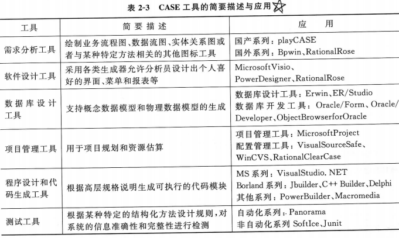

#### 2.6.3 基于 case 的系统开发过程


1. 基于 CASE 的系统开发过程主要分为**数据生成**和**应用生成**两大部分

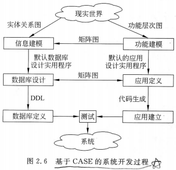

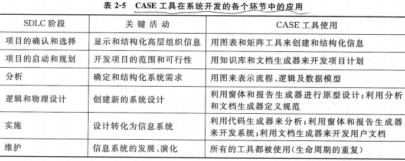

#### 2.6.4 CASE 工具的特点

- ##### CASE 工具的优点在于

  1. 使得系统开发过程中的许多手工作业得以自动化，为前期设计和分析提供了帮助，使错误大大减少
  2. 工具具有合法性检测功能，可以完成数据流图的自动平衡，校核数据流图及其说明的数据完整性和一致性
  3. CASE 工具包括原型法的功能，可以帮助分析员迅速绘制人机界面或报表布局供用户审核。
  4. CASE 工具包的一个核心部分是**信息储存库**，它存储了系统分析员在项目开发中定义的所有信息。
  5. CASE 工具加快了软件开发速度，CASE 工具简化了软件开发的管理和维护

- ##### CASE 工具的局限性在于：

  1.  CASE 只是一种辅助的开发工具，在实际开发一个系统中，CASE 环境的应用必须依赖于一种具体的开发方法
  2.  CASE 无法自动生成具有特定功能的系统，无法实现与数据库和第四代语言之间的接口。
  3.  CASE 不能自动进行系统分析，因此也不可能彻底改变系统分析和设计过程。
      - 因此，在系统开发过程中应当扬长避短，合理利用 CASE 技术来规范信息系统的开发过程，可以有效地避免因需求不清或设计不合理而造成的程序反复修改，使开发出的系统更符合用户的需要。
      - 但在使用 CASE 工具定义分析和设计对象时，一定要做到严格且完整，才能生成高质量的应用程序。

### 2.7 案例分析 ——case 工具在系统开发中的应用

2.7.1 采用 powerdesigner 进行过程建模

2.7.2 采用 powerdesigner 进行数据建模

2.7.3 采用 powerdesigner 进行对象建模

2.7.4 使用 powerdesigner 生成信息系统开发报告

2.7.5 案例思考

本章小结

思考与练习

## 第 3 章 信息系统项目管理

### 学习目标

- 信息系统项目的管理过程。
- 作为高效的项目经理所需要的技能
- 项目发起、项目规划、项目执行和项目终结各阶段的主要任务及活动。
- 关键路径规划的含义，描述甘特（Gantt）图和网络图的创建过程
- 项目管理软件如何应用于支持项目进度的表示和管理。
- 项目是一个（临时的）唯一的、复杂的和关联的具有同一目标或者目的并且必须在特定时间里、在预算内按照规格说明要求完成的活动序列。项目是唯一的，体现在每个项目都不相同，即使开发相同的系统，由于时间和资源有所不同，项目也不同。
- 信息系统项目也具有上述这些特征。
  - **信息系统项目管理**是指在指定时间内用最少的费用开发可接受的系统的管理过程，具体内容包括确定范围、计划、人员安排、组织、指导和控制。
  - **项目管理的实质**是在系统质量、项目完成时间、项目成本这三个要素之间进行权衡。它们之间相互影响，任何一方发生变动都会对另外两个要素产生影响。
  - 有效的项目管理有助于确保系统开发项目满足客户期望，并在规定的预算和时间内交付系统

### 3.1 信息系统项目管理生命周期

- 信息系统项目管理过程贯穿于整个系统开发过程，按照项目进展可以大致划分为 4 个阶段：
  - 项目发起、项目规划项目执行和项目终结。
- 在这 4 个阶段中的每个阶段都必须执行一些活动。
- 项目发起的核心是评估项目的大小、范围和复杂性，以及建立支持后续项目活动的规程。
- 项目规划的核心是定义清楚的、离散的活动以及完成每个活动需要做的工作：项目执行的核心是将项目发起阶段和规划阶段的计划付诸行动。
- 项目终结的核心是把项目带到结束。遵循正式的项目管理过程能够大幅度增加项目成功的可能性

#### 3.1.1 项目发起

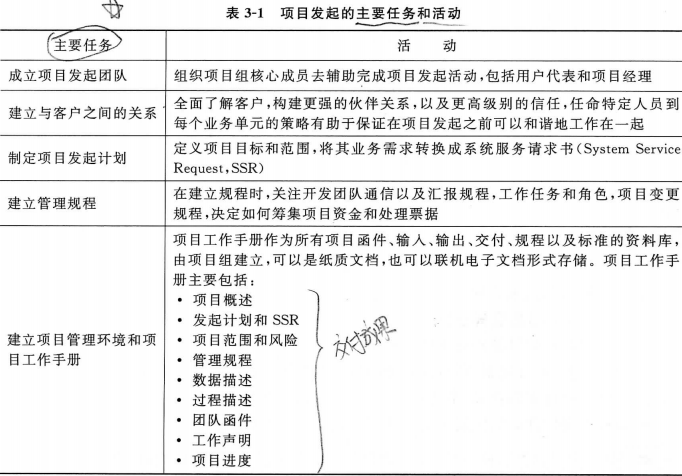

#### 3.1.2 项目规划 （重要）

1. 描述项目范围、候选方案、可行性
2. 将项目分解为可管理的任务
3. 估算资源并创建资源规划
4. **制定初步进度**
5. 制定通信计划
6. 确定项目标准和规程
7. 识别和评估风险
8. 创建初步的预算
9. 开发工作陈述
10. 建立基线项目计划


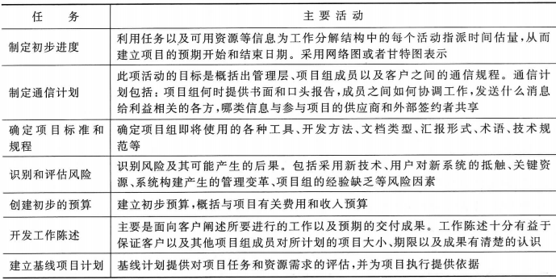

#### 3.1.3 项目执行

1. 项目执行阶段主要任务是使基线项目计划付诸于行动


#### 3.1.4 项目终结

1. 项目终结阶段的核心是把项目进行到底

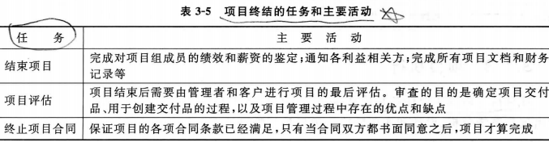

### 3.2 项目组织

#### 3.2.1 单纯型项目组织

- 单纯型项目组织特点如下：小组成员全职投入项目。
- 优点是：
  - 项目经理对项目拥有完全的自主权；
  - 成员只需要面对一个老板；
  - 沟通层级短，决策形成快
  - 荣誉感和使命感高。
- 缺点是：
  - 人员与设备无法共用，资源浪费
  - 组织的目标和策略容易被忽略
  - 职能部门与新科技脱节；
  - 项目小组成员完成项目即解散，容易导致项目延误。

#### 3.2.2 职能型项目组织

- 这种项目组织形式为：项目建立在职能部门中
- 优点
  - 成员可以同时参与多个项目；
  - 专业技能不会因为人员离开而遗失
  - 成员有机会升迁；
  - 职能部门中有大量专业人员处理技术问题。
- 缺点：
  - 项目中与职能部门的需要无直接相关性的地方容易被忽略
  - 客户的需求容易被忽略。

#### 3.2.3 矩阵型项目组织

- 矩阵型项目组织特点如下：项目组成员由不同职能部门提供，项目经理决定工作内容和完成时间，职能部门经理控制人员和技术。
- 优点是
  - 强化与职能部门的沟通；
  - 项目经理对项目负成败的责任
  - 降低资源重复；
  - 可以执行上级组织的政策
  - 项目可获得较多的支持。
- 缺点是：
  - 受职能部门和项目组的双重管理；
  - 项目经理需要较强的谈判技巧；
  - 项目组成员不容易全心投入项目。

### 3.3 项目管理技术（重要）

#### 3.3.1 工作分解结构

工作分解结构（Work breakdown Structure），WBS 可以将项目层次化地分解成开发阶段、开发活动和开发任务

- WBS 最低层次的项目交付成果称为**工作包**，
  - 工作包的定义应考虑 80 小时法则或者**两周法则**，即任何工作包的完成时间应该不超过 80 小时，即不超过两周。
  - 每两周对所有工作包进行一次检查，可以控制项目的变化。

- 在分解时，尽量做到以下几点：
  - 某项具体任务只能在一个工作包出现。
  - 分附原则个工作包只能由一人负责，虽然可以有多人参与，但责任人只能是一个，这样才会责任清楚，不相互推卸
  - 任务分解应与实际执行方式保持一致
  - WBS 不仅要合理，而且要具有一定的适应性，能够应付无法避免的需求变更
  - 鼓励项目团队积极参与创建 WBS，提高 WBS 的合理性和有效性
  - 所有成果需要文档化

#### 3.3.2 甘特图

甘特图（Gantt Chart）也称横道图，是一种最直观的**进度计划方法**，

- 甘特图的优点有
  - 能够清楚地表达活动的开始时间、结束时间和持续时间，易于理解，并能为各层次的人员所掌握和运用
  - 使用方便，制作简单，应用广泛。
  - 不仅能安排时间，而且能与劳动计划、资源计划资金计划相结合
- 主要缺点有：
  - 很难表达工程活动之间的逻辑关系，看不出各项工作之间的相互依赖和相互制约的关系。
  - 工程活动之间的前后顺序及搭接关系不能确定。
  - 不能确定某项工作是否提前或推迟，以及延长持续时间会对哪些活动造成负面影响，以及对整个工期的影响程度。
  - 不能表示活动的重要性，如哪些活动是关键的或非关键的，哪些活动有推迟或拖延的余地，及余地的大小
  - 不能用计算机处理，即对一个复杂的工程不能进行工期计算
- 主要领域有
  - 可直接用于一些小项目，由于活动较少，可以直接用它来排工期计划。
  - 项目初期由于复杂的工程活动尚未揭示出来，一般人们都用甘特图作总体计划
  - 上层管理者一般仅需了解总体计划，故都用甘特图表示。
  - 作为网络分析的输出结果。现在几乎所有的网络分析程序都有工期计划甘特图输出功能，而且它被广泛使用。

#### 3.3.3 计划评审技术 PERT（重要）

**项目评审技术（Plan Evaluation and Review Technique，PERT）**是一种科学的计划管理技术，广泛应用于项目管理。PERT 图是描述任务之间依赖方式的最佳方式，因为它显示了任务之间的完成**顺序**。这种方法根据工作分解结构分解后的结果，在任务之间建立起**依赖关系**，估计每个任务的**工期**，再根据这些数据进行整个项目工期的计算，同时计算出每个任务的时差，找到**影响项目工期的任务（关键任务）**。

- **主要步骤**：
  1. 安排任务顺序
  2. 确认任务之间的依赖关系
  3. 计算任务工期

- PERT 的应用步骤如下：
  1. 根据工作**分解结构列出计划期内所有的任务**。
     - 根据工作分解结构分解后的结果，在任务之间建立起依赖关系
  2. **安排任务的顺序，确定任务之间的相互依赖关系和前后顺序形成网络图**
  3. **估算**出完成这些任务所需要的**时间**。
     - PERT 的作业时间（工期）有三个估计值：最乐观工期 a，最可能工期 m，最悲观工期 b
     - 真正用来计算用的任务工期为 $(a+4m+b)/6$
  4. **进行网络计算**
     - 计算每个任务的工期，最早开始、结束时间，最晚开始、结束时间富余时间，再根据这些数据进行整个项目工期的计算，同时计算出每个任务的时差，找到影响项目工期的任务（**关键任务**）。
- 将各节点之间的关键路线相连，即可计算全图(项目)的**关键路线, 项目所需最长时间**。

### 3.4 案例分析 ——某系统开发项目管理失败原因分析

本章小结

思考与练习

## 第 4 章 需求获取（重要）

### 学习目标

通过本章学习，要求掌握

- 设计并执行访谈的选择，以及制订访谈计划以确定系统需求
- 观察工作者方式和分析业务文档方式以确定系统需求的优缺点
- 计算如何为需求获取提供支持。
- 计划一个联合应用设计会议
- 在需求获取过程中使用原型。
- 确定需求的现代化方法。
- 需求获取技术如何应用于网络应用的开发
- 系统分析是系统开发生命周期的一个组成部分，通过它可以确定现有信息系统的功能并评估用户期望在新系统中看到什么。**系统分析由两个子阶段构成：需求获取和需求结构化**
- 需求获取涉及的主要技能是管理和沟通技能，是在整个系统开发过程中技术含量最少的阶段。但是，如果需求获取执行得不好，造成的后果却比其他阶段严重。

### 4.1 系统需求概述

#### 4.1.1 需求获取的重要性

需求获取是在问题及其最终解决方案之间架设桥梁的第一步，其实质是理解项目中描述的客户需求。一旦理解了需求，分析者、开发者和客户就能探索出描述这些需求的多种解决方案。需求获取主要涉及系统分析员，他们同系统用户和所有者一起工作，在系统开发的早期阶段确定对信息系统的业务需求的详细理解。

- 对于客户而言，他们在需求分析过程中可能会因为以下原因而影响需求的顺利确定；
  - 客户不明白他自已需要什么
  - 客户会不断更新所提出的需求
  - 客户与分析员之间缺乏有效沟通
  - 客户缺乏技术上的知识
  - 客户缺乏对软件开发的知识

#### 4.1.2 系统需求分类

- 系统需求可以从两方面理解，即
  - **用户角度**（系统的外部行为）
  - **开发者角度**（系统内部特性）。
  
- ##### 需求包含三个层次：

  - **业务需求**
  - **用户需求**
  - **功能需求**（及非功能需求）

- 功能需求是指系统能够实现的基本功能和完成的任务

- 非功能需求是指衡量系统能否良好运行的定性指标。

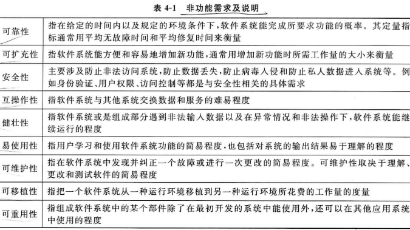

### 4.2 需求获取过程 （重要）

- ##### 需求获取的途径主要有以下 3 点

  1. 通过与用户**对话**或者**观察**用户收集的信息
  2. 现有的**书面**信息
  3. 基于**计算机**的信息

- ##### 需求获取主要包括以下活动

  1. 了解用户需求
  2. 分析用户需求。
  3. 编写需求文档。
  4. 评审需求文档。
  5. 需求管理。

#### 4.2.1 了解用户需求

- 了解系统需求的方式：
  - 识别系统用户
  - 用户调研与访谈
  - 访谈结果整理
  - 访谈结果呈现
- 活动
  - 明确标识出那些未确定的需求项（在需求分析初期往往有很多这样的待定项）；
  - 使需求符合系统的整体目标；
  - 保证需求项之间的一致性，解决需求项之间可能存在的冲突

#### 4.2.2 分析用户需求

- 排查以下方面的问题（分析注意事项）
  - 是否遗漏了重要的需求
  - 是否存在矛盾的需求；
  - 是否存在不可行的需求；
  - 是否存在重复的需求；
  - 是否存在模棱两可的需求

#### 4.2.3 编写需求文档

**需求文档是需求获取阶段的主要成果**

- **需求规格说明**的主体由**需求陈述构**成，
- 主要包含如下内容
  - 系统应该提供的功能和服务
  - 系统的非功能需求，包括系统的特征、性能、属性等；
  - 系统开发或者运行必须遵守的约束条件
  - 系统与其他系统之间的接口。

#### 4.2.4 评审需求文档

- 用户评审和同行评审两类
  - 同行评审的目的是在软件项目初期发现那些潜在的缺陷或错误，
- 通过评审的需求文档称为需求基线（baseline）

#### 4.2.5 需求管理

需求管理主要涉及两方面的内容：需求变更以及需求跟踪。

- 需求变更

  - 需求变更的基本流程如下：
    1. 提出变更请求。
    2. 变更影响分析。
    3. 变更批准。
    4. 变更执行。
    5. 变更测试
    6. 变更结束。

  

- ##### 需求跟踪（Requirements Tracing）

  - 是指跟踪**一个需求使用期限的全过程**，
    - 需求跟踪包括编制每个需求同系统元素之间的**联系文档**，这些元素包括其他类型的需求，体系结构，其他设计部件，源代码模块，测试，帮助文件等。
    - 需求跟踪提供了由需求到产品实现整个过程范围的**明确查阅的能力**。
  - 需求跟踪的目的是建立与维护“需求一设计一编程一测试”之间的致性确保所有的工作成果符合用户需求 ①。
  - 以需求和设计之间的跟踪为例旧目标主要有三个：
    - 进行设计时，保证需求没有遗漏地被实现
    - 需求变更时，能找到设计中需要变更的地方。
    - 设计变更时，能找到受影响的需求

### 4.3 需求获取的方法

1. **访谈**
2. **规察**
3. **名义团体技术**
4. **文档与报告**
5. **联合应用设计**
6. **原型**

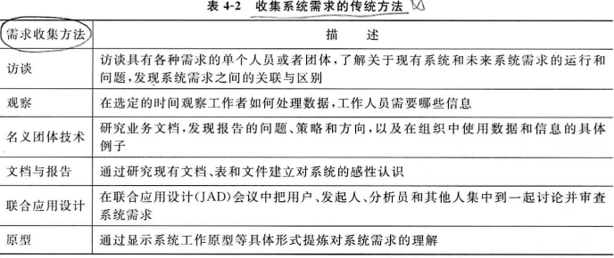

#### 4.3.1 访谈

#### 4.3.2 名义团体技术

名义团体技术（Nominal Group Technique，NGT），顾名思义就是工作在一起解决问题的个人是名义上的团体，用于在团队成员中产生想法，是群组访谈的一种方式。

#### 4.3.3 直接观察用户

#### 4.3.4 文档、文件、表格抽样

1. 第一种有用的文档是书面工作规程。
2. 第二种对系统分析员有用的文档是业务表格
3. 第三种有用的文档是现有系统产生的报告

#### 4.3.5 联合应用设计

联合应用设计（JAD）的主要思想是把主要用户、管理者、参与项目的系统分析员聚集在一起，类似于群组访谈；但 JAD 遵循一个特殊的角色和日程结构。

- 使用 JAD 在分析阶段的主要目的是通过紧凑的、结构化的、非常高效的过程，从参与系统的关键人员那里同步收集系统需求，也便于系统分析员看到哪些领域存在一致性，哪些领域存在冲突。
- JAD 会议通常在异地召开，通常可持续长达一周，使参与者远离干扰以便集中精力进行系统分析。

#### 4.3.6 在需求获取中使用原型

原型模拟最终软件的屏幕显示，用户可以看到最终软件的呈现形式。

原型法是分析员和用户参与的迭代过程，从而构造信息系统的初始版本，并根据用户的反馈进行重构。

- **采用原型法需求获取的步骤**：

  - 需求调查分析。
  - 需求原型设计。
  - 进行需求评审。

- ##### 采用原型法进行需求获取主要适用于以下情况

  - 用户需求不清楚或者不理解时，例如开发全新系统
  - 开发复杂系统或者具体的系统呈现形式需要探讨；
  - 系统开发涉及多个关联方的参与
  - 已经有现成的工具（例如表格和报告产生器）和数据来快速构造工作系统

- 原型作为需求获取工具也有一些缺点包括：

  - 原型法趋向于避免创建正式的系统需求文档，这使得系统更加难于开发成为全面工作的系统
  - 原型法特殊针对最初的用户，难于传播并适应于其他潜在用户
  - 用户通常是独立的系统，因而忽略了与现有的其他系统的共享数据和交互，以及按比例增加应用等问题；
  - 绕过了 SDLC 中的检查，使得某些更加细致的但是十分重要的系统需求被遗忘（例如，安全、某些数据输入控制、跨系统的数据标准化等）。

### 4.4 案例分析 ——客户关系管理系统的需求获取

本章小结

思考与练习

## 第 5 章 过程建模（重要）

### 学习目标

通过本章学习，要求掌握：

- 逻辑过程建模。
- 按照特定的规则绘制数据流图，形成准确的、结构良好的过程模型
- 将数据流图分解为低层次的图形。
- 平衡高层和低层数据流图。
- 4 种类型的数据流图之间的区别，即当前的物理流程图、当前的逻辑流程图、新的物理流程图、新的逻辑流程图
- 使用数据流图作为工具，支持信息系统的分析。
- 第 4 章介绍系统分析员收集必要信息的各种方法和怎样确定信息系统需求，本章的核心是描述如何对信息系统需求采用规范化方法进行表达，数据流图对数据如何流过系统、数据流之间的关系、数据如何储存等内容进行建模，数据流图也显示了变更或者转换数据的过程。因为数据流图关注的是过程之间的数据流动，所以被称为过程模型

### 5.1 过程建模概述

- 因为数据流图关注的是过程之间的数据流动，所以被称为**过程模型**

- **逻辑模型** 是描述系统是什么和做什么的非技术性的图形化表示，也称为概念模型或者业务模型。
  - 逻辑模型消除了由于实现方式而导致的偏见，降低了由于过于关注细节而丢失业务需求的风险，使得我们可以用非技术性的或较少技术性的语言与最终用户进行沟通。
- 过程（Process）也称为处理加工，变换等。
  - **过程建模**是围绕数据的处理建立模型的一种技术，它记录系统的“过程”和由系统的“过程”实现的逻辑、策略和程序

### 5.2 数据流图 （重要）

#### 5.2.1 数据流程图的概念和作用

- 数据流图（Data Flow Diagram，DFD）是过程建模的一种工具，用于分析、描述信息系统的**数据转换**和**流动状况**，显示系统内所有的基本成分及其相互联系的概况和细节。

#### 5.2.2 数据流程图的基本符号

- 数据流程图由 4 个部分组成：

  - 外部实体、处理过程、数据存储、系统中的数据流

  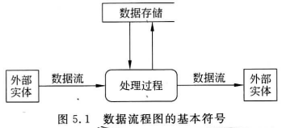

- ##### 外部实体

  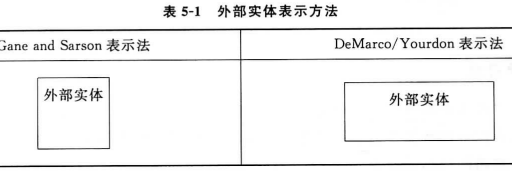

  - 外部实体是**与系统交互的外部的人员组织部门**、其他系统或者其他组织，也称为源点/终点。
  - 外部实体中支持系统数据输入的实体称为源点，支持系统数据输出的实体称为终点。它说明了外部数据的来源和去处，指明了系统的边界。
  - 外部实体通常是以下几种形式：办公室，部门；外部组织；另一个企业或者信息系统；系统的最终用户或者管理人员等
    - 部实体在数据流程图中用方形框表示，框中写名称。
  - 为了避免在数据流图上出现数据流的线条交又，同一个外部实体允许在一张图上出现多次。

- ##### 过程

  

  - 过程是指对**输入数据流**或**条件**做出**响应**的工作，即对数据进行处理或者变换，因此也称为处理或者转换。
  - 系统中的过程大致可以划分为三类
    - **功能过程**，是一套和企业相关活动和正在进行的**活动**，功能没有开始和结束。
    - **事件过程**，功能由响应事件的过程组成，事件必须作为一个完整的逻辑单位工作，也被称为**事务**，接受输入而触发其执行，对输入作出响应后，事件结束。
    - **基本过程**，是指为了完成一个事件的响应所需要的离散的、详细的活动或任务。
    - 每一种过程又包括数据输入数据处理和数据输出三个部分。
    - 系统本身也可以看做是一个过程。
  - 在数据流程图中过程用带圆角的长方形表示，有时也采用圆形进行表示，如表 52 所示。

- ##### 数据流

  

  - 数据流是一个过程的数据输入或数据输出，是流动中的数据。
  - 数据流是模拟数据在系统中传递过程的工具。
  - 数据流也用于表示在文件或数据库中创建、读取删除或修改数据数据流可以汇合，组合数据流是由其他数据流构成的数据流。
  - 数据流也可以分叉，分支的数据流是分成多个数据流的数据流，指示了一个数据流的所有或者部分到不同的目的地的路径。
  - 数据流用来表示数据流值，但不能用来改变数据值在数据流程图中用一个水平箭头或垂直箭头表示，箭头指出数据的流动方向，箭线旁注明数据流名。
  - 数据流图中有时也会出现控制流，控制流表示**触发**一个过程的条件或非数据事件，用虚线箭头表示。

- ##### 数据存储

  

  - 数据存储是表示**数据保存**的地方，用来存储数据。
    - 系统过程从数据存储中提取数据，也将处理后的数据返回数据存储。
    - 与数据流不同的是数据存储本身不产生任何操作，它仅仅响应了**存储和访问数据的要求**。
  - 如果数据流是运动中的数据，数据存储就是**静止的数据**，存储的数据一般以文件和数据库形式存在于系统中，它存储了所有实体的实例。
    - 数据存储一般是以下内容之一：个人或小组、地点、对象、事件、概念等。
  - 在数据流程图中数据存储用**右边开口的长方条**表示，在长方条内写上数据存储名字，或者采用两条平行线表示

#### 5.2.3 数据流图的绘制

- 在对复杂软件系统进行描述时，难以在一张图中描述所有的细节，导致绘图工作庞大而复杂而且也难以理解。

  - 通常采用**分层**的方法将一个流程图分解成几个流程图来分别表示
  - 数据流程图的构造方法和指导思想是：**自上而下，逐步细化**直观清断，简单明了

- 如图 5.2 所示，一套分层的数据流图由**顶层、0 层、中间层**和**底层**的数据流图所组成顶图说明了系统的边界，

  - 即系统的输入和输出的数据流，顶图只有一个处理，即被开发的系统。
  - 0 层图将顶层图的系统分解为若干子系统。
  - 画系统内部时，一般将层号从 0 开始编号中间层流图则表示对上层父图的细化。
  - 它的每一处理都可以继续细化，形成子图。
  - 底图由一些不必再分解的处理组成，这些处理称为基本处理。
  - 在顶图和底图之间是中间层。
  - 上层图称为下层图的“父”图，
  - 下层图称为上层图的“子”图。

  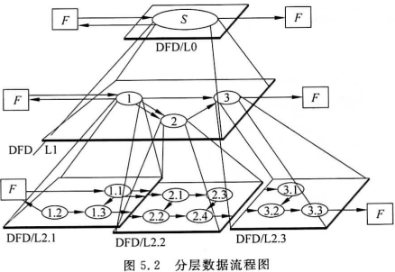

- **高层视图**，称为**顶层图**，也称为**环境图**（context diagram）

  - 由于环境图重点描述系统与外部环境的边界，因此在该图中只包含一个过程，4 个数据流和 3 个外部实体，没有数据存储。
  - 这个唯一的过程标志为 0，代表整个系统；所有环境图都只有一个过程，外部实体代表了系统的环境边界。因为系统的数据存储概念上是属于过程内部的，所以数据存储不出现在环境图中。

- 0 层数据流图

  - 它代表了系统中最高层的主要过程

#### 5.2.4 数据流图规则（重要）

- 命名规则：
  - 数据流程图中每一个元素都要命名。
  - 每个元素所取的名字要能反映该元素的属性，避免用空洞的名字，要具体的含义。
  - 每个元素的名字都能**唯一地标识**该元素。
  - 如果发现难以为某个数据流或过程命名时，这往往是因为数据流图分解不当，可重新分解。
- **过程：**
  - 没有过程只有输出：不可能凭空产生数据。如果一个对象只有输出，那么它一定是外部实体
  - 没有过程只有输入：如果一个对象只有输入，那么它一定是外部实体。
  - 过程的输入要足以产生相应的输出，不允许输入与输出之间毫无关联。
  - 过程的输入应有别于输出。即输入过程的数据流应在过程中发生变换，产生新的数据流，而不是简单的数据传送。
  - 一个过程采用动词短语标记。

#### 5.2.5 数据流图的分解

从一个系统到 4 个组成过程的行动称为功能分解。

功能分解（functional decomposition）是将系统描述或视角分解成为越来越细化的详细过程。

一般情况下，一个 DFD 所包含的过程不要超过 7 个。

#### 5.2.6 数据流图的平衡

在对 DFD 进行分解时，必须将输入和输出保留到下一层分解的过程中。

这种输入和输出的保留称为平衡（balancing）。

子图是父图中过程的详细描述，因而子图的输入、输出数据流应该与父图中过程的输入、输出数据流相一致。

- 某一层的组合数据流可以在下一层分解成为子数据流，但是要确保没有添加新的数据，并且组合数据流的所有数据都要在子流程中考虑到
- 某个过程的输入必须足以产生过程的输出（包括放在数据存储中的数据）。
  - 因此，所有输出必须都是由过程产生的，而且输入中的所有数据都要移动到另一个过程或者到过程外的一个数据存储，或者到显示该过程分解的更加详细的DFD
- 在最底层的DFD中，为了表示在例外情况下传输的数据，可以添加新的数据流：
  - 这些数据流通常代表了错误信息（例如，“客户不知道：你想创建一个新的客户吗？”）或者确认通知（例如，“你要删除该记录吗？”）
- 为了避免让数据流线相互交义，可以在DFD上重复数据存储或者外部实体，
  - 可以使用额外的符号来表明重复的符号，例如把数据存储的中间垂直线绘制成双线，或者在外部实体/外部实体方框的角落绘制斜线

### 5.3 过程逻辑

- 过程逻辑的表述方法主要有以下三种：结构化语言、决策表和决策树

#### 5.3.1 结构化语言

- 结构化语言是在自然语言基础上加了一些限定，使用有限的词汇和语句来描述处理逻辑。
- 其结构分内外两层，外层用来描述控制结构，采用**顺序、选择、循环**三种基本结构；
- 内层一般采用祈使语句的自然语言短语。
  - 结构化语言使用数据字典中的名词和有限的自定义词，动词含义要具体。
  - 还可使用一些简单的算术运算和逻辑运算符号用结构化语言

- 任何过程逻辑都可以表达为顺序、选择、循环三种结构。


#### 5.3.2 决策表

- 决策表（decision table）又称判断表，是一种表格状的图形工具，适用于描述处理判断条件较多，各条件又相互组合，有多种决策方案的情况。
- 决策表有三个部分：**条件段（condit stubs）**、**行动段（action stubs）**和**规则（rules）**。
  - 条件段包含所建模的各种条件。
  - 将条件与行动联系起来的那部分就是规则。

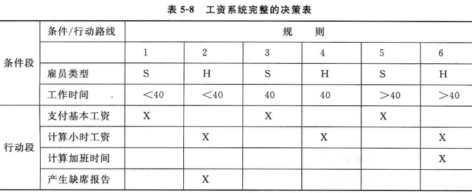


1. **规则合并**

   - 决策表能把什么条件下系统应做什么动作准确地表示出来，同时能发现需求不完整的地方，如某些条件组合下缺少应采取的动作。也能发现冗余的动作，可将条件合并。
   - 以表5-8为例，从第一列所指的条件值开始阅读，雇员类型是“S”或薪金制雇员，工作小时数小于40。当这两个条件同时出现时，工资系统按照基本工资支付。下一列值为“H”并且“<40”，意味着小时工的工作小于40小时。在这种情况下，工资系统计算每小时工资并在缺席报告中产生一个条目。
     - 规则3处理当薪金制雇员恰好工作40小时的情况，系统支付基本工资，和规则1一样。对于恰好工作40小时的小时工，规则4计算小时工资。
     - 规则5为超过40小时的薪金制雇员支付基本工资，规则5与规则1、规则3采取同样的行动，并且控制薪金制雇员的行为。工作时间不影响规则1、3、5的输出。
     - 对于这些规则，工作时间是**无关条件（indifferent condition）**，表现在它的值并不影响所采取的行动。规则6计算每小时支付以及工作超过40小时的小时工人的超时数。
     - 由于规则1、3、5是无关条件，可以通过将规则1、3、5浓缩成为一个规则，来减少规则的数量，如表5-9所示。无关条件用“一”表示。开始时用6个规则建立决策表，现在可以用更简单的表格采用4个规则传递同样的信息。


   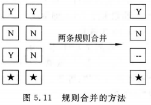

   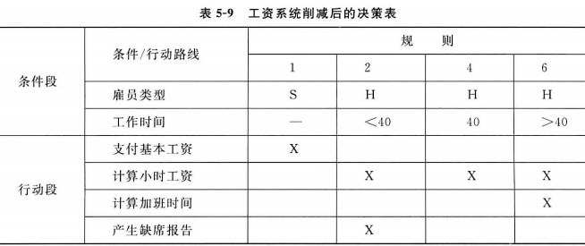

2. **构造决策表的基本步骤：**

   1. 命名条件以及每个条件所取的值
   2. 命名所有可能出现的行动
   3. 列出所有可能的规则
   4. 在创建表时，替换第一个条件的值，正如对表 5-9 所示的雇员类型所采取的措施一样
   5. 为每个规则定义行动
   6. 简化决策表

#### 5.3.3 决策树

- 决策树又称做判定树，是一种树状的图形工具，适合描述处理中有多种策略，要根据若干条件的判定来确定所采用策略的情况。
- 左端方框为树根表示**决策结点**；
  - 由决策结点引出的**直线**形似树枝，称为**条件枝**，每条树枝代表一个条件；
  - 中间的**圆圈**称为**条件结点**；
  - 右端的**实心椭圆**表示**决策结果**。
  - 决策树中条件结点以及每个结点所引出条件的数量依具体问题而定

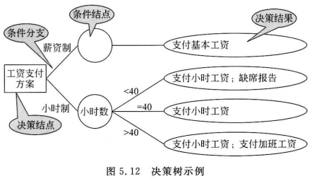

#### 5.3.4 结构化语言、决策表和决策树的选择

- 三种描述工具各自适用性如下
  1. 顺序和循环动作，适于结构化语言
  2. 多个条件复杂组合，适于决策表和决策树。
  3. 决策树比决策表直观；决策表进行逻辑验证更加严格。
     - 一般用决策表作底稿，在它基础上产生决策树。

### 5.4 数据字典 （重要）

数据字典是**定义和说明数据流程图**中每个成分的内容和特征的工具。

- **数据字典的作用**是对数据流程图中的所有成分，

  - 包括数据项、数据结构、数据流、数据在储、处理功能、外部项等的逻辑内容与特征予以详细说明。
  - 数据字典是以后系统设计、系统实施与维护的重要依据。

- ##### 生成数据字典的方法有两种：

  - 由手工方式生成
  - 由计算机辅助生成。

- ##### 数据字典中的数据主要包括两类：

  - **动态数据**：可在系统内外流动的数据）
  - **静态数据**（不参与流动的数据存储）的**数据结构和相互之间的关系**

- ##### 数据字典中主要对以下数据内容创建字典：

  1. 数据项
  2. 数据结构
  3. 数据流
  4. 数据存储
  5. 过程

#### 5.4.1 数据项

数据项也称做数据元素，是“不可再分”的数据单位，是数据的最小组成单位。

#### 5.4.2 数据结构

- 描述数据项之间的**关系**，可由数据与数据结构组成。

  - 构成一个数据流的数据属性被组织成数据结构。
  - 数据结构是数据属性的特定排列，它定义了一个数据流的一个实例

- 数据流可以描述为以下几种类型的数据结构：
  - 一个序列或者一组依次出现的数据属性；
  - 从一组属性中选择一个或多个属性；
  - 一个或多个属性的重复

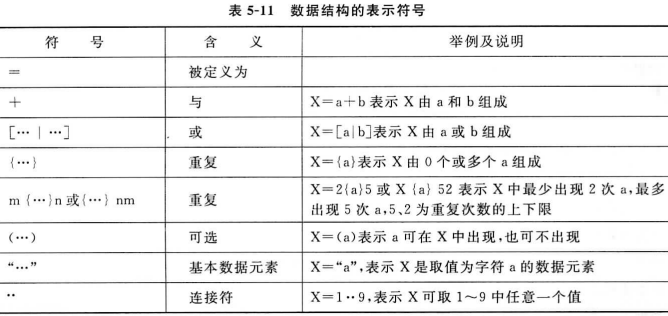

#### 5.4.3 数据流

数据流是由一个或一组固定的数据项组成的。

#### 5.4.4 过程字典

过程字典针对数据流程图中最底层的过程逻辑，用来说明 DFD 中基本过程的过程逻辑。

#### 5.4.5 数据存储

数据存储是数据结构停留或保存的场所。


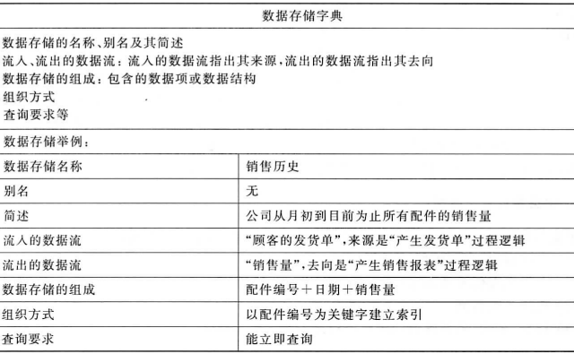

### 5.5 案例分析 ——百货商店业务管理信息系统过程建模

本章小结

思考与练习

## 第 6 章 数据建模（重要）

### 学习目标

通过本章学习，要求掌握：

- 下列数据模型术语：实体类型、属性、多值属性、子集准则、联系、度、基数、业务规则、关联实体。
- **绘制实体-联系图（E-R 图）**弱实体来描绘业务中的数据特性与关联
- 概念数据建模在整个信息系统分析和设计中所起的作用。
- 区分一元联系、二元联系和多元联系并举例说明
- 概念数据模型中的 4 种基本业务规则。对比 ER 图与类图在数据建模中的独特性能并说明。
- 将数据建模与过程建模、逻辑建模联系起来，作为描述信息系统的各种视图。
- 前面介绍过程模型的主要工具—数据流以及决策逻辑，学习了如何对数据流（运动中的数据）进行建模和分析，并介绍如何表示数据流图中的数据存储（静止的数据），但是，数据本身的定义、结构和数据之间的联系并没有显示出来。本章的数据模型将显示数据的特性以及数据之间的关联。

### 6.1 数据建模相关概念 （重要）

- 数据模型是一种组织和记录系统数据的技术，用于为数据库定义业务需求，数据模型最终要转换为数据库，因此也称为数据库建模。
- 在系统分析阶段展示的是系统数据的逻辑模型，在设计阶段，该模型被转换为物理数据模型，进而转换成物理的数据表。

#### 6.1.1 E-R 图（重要）

- 数据概念模型的典型代表就是著名的**“实体关系模型”（Entity-Relationship Model）**也称为实体联系模型（ER 模型）。
  - ER 模型是面向现实世界，而不是面向实现方法的；
  - 它用于描述现实信息世界中数据的静态特性，而不涉及数据的处理过程。
  - 它是企业或业务领域中实体、联系以及数据元素的详细的逻辑表述，表示业务环境中的实体、实体之间联系以及实体和联系的属性。
  - ER 模型是**用户和数据库**设计人员之间进行**交流的工具**
- 在设计数据库系统之前，需要使用 ER 图将现实世界中的实体和实体之间的联系转换为概念模型。
  - ER 模型的基本元素是：实体、属性和联系，ER 模型通常表示成实体联系图（或 ER 图）。
  - ER 图有多种符号记法，多数记法以发明者命名（例如，Chen，Martin，Bach man，Merise）。


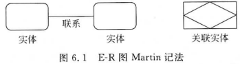

#### 6.1.2 实体

- 实体（entity）
  - 是用户环境中的数据对象如人、地方、对象、事件或概念等有它自己特有的特性，可以区别于其他实体。
  - 实体与实例之间存在着很重要的区别。
  - 实例（Instance）是指实体中的一个特例

- 属性
  - 属性用来描述实体的特征
  - ER 模型中假定实体集的所有实例具有相同的属性
  - 每个属性都有其自身特性。
    - 特性包括指定该属性在某些情况下是否必需、属性是否有默认值、属性的数据类型，属性的取值范围、是否为主码或候选码等。
- **候选码**
  - 候选码是**唯一标识**实体类型的每个实例的属性（或者属性组合）有些实体可能拥有不止一个候选码。
    - 例如，雇员的第一个候选码是雇员号，第二个候选码是雇员姓名和地址的组合（假设不存在名字相同的两个员工住在相同的地址）。
  - 如果有不止一个候选码，设计师必须选出其中一个候选码作为标识符。
- 标识符（**主码**）（identifier）
  - 标识符是被选出来作为实体类型的唯一标识的候选码标
  - 识符应满足如下规则：
    - 选择在实体类型的每个实例的生命期内都**不会改变值的候选码**。
    - 每个实例候选码的每个属性都有**合法非空值**。
    - 避免所谓的智能标识符，其结构显示了分类、地址以及其他实体性质。
      - 例如，实体“零件”的码的前两位数字可能表示仓库位置。这种代码常常随着情况的变化而变化，这导致了主码值的无效
    - 考虑用简单属性作为码来替代大型组合属性的码。
      - 例如，用实体“比赛”的属性“比赛编号”来代替“主队”和“客队”的组合。
- **替代码**
  - 在有多个候选码的情况下，没有被选为主码的候选码即为替代码
- **复合码**
  - 有时需要不止一个属性标识一个实体的实例。
    - 例如，一盘 VCD 有多份拷贝，需要一个 VCD 名，还需要同一个名字的每盘 VCD 都有一个拷贝号，这样由 VCD 名称和拷贝号共同作为一个复合主码。
- **外码**
  - 在一个实体内作为主码的属性在另一个实体内则称为外码。


- 多值属性

  - 多值属性是指对于每个实体实例可以取多个值
  - 概念设计中，通常使用特殊符号或标记来突出多值属性，一般采用大括号

  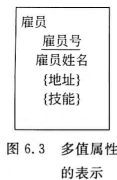


#### 6.1.3 关系

- **关系 （relationship）**
  - 也称为联系，是存在于一个或多个实体之间的业务联系。
  - 所有的关系隐含地都是双向的
  - 
- **外码 foreign key）**
  - 是某一个实体的主码，它同时存在于另一个实体以确定一个关系实例，外码总是与另一个实体的主码匹配，
    - 获得外码的实体为子实体，贡献主码的实体是父实体。
    - 通常父实体对子实体的关系是一对多的。
- **基数**定义了一个实体相对于另一个关联实体的某个最小和最大具体值数量。
  - ER 图中基数的表示方法如表 6-1 所示。


- **联系的度（degree）**是参与该联系的实体类型的数量。

  - ER 模型中最常见的三种联系
    - 元联系（度数为 1）
    - 二元联系（度数为 2）
    - 三元联系（度数为 3）

- **一元联系**（unary relationship）

  - 也被称为递归联系（recursive relationship），是一个实体类型的实例之间的联系。

  

- **二元联系** （binary relationship）

  - 两个实体类型的实例之间的联系，是数据建模中出现最多的联系类型。

  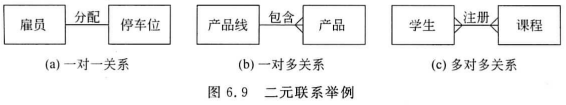

- **三元联系** （ternary relationship）

  - 三个实体类型的实例之间同时发生的联系
    

- **关联实体**（associative entity）：

  - 关联实体是数据建模人员选择的一种作为实体类型进行建模的关系，表示方法是采用实体矩形内包含菱形，表示该实体是由关系派生出来的。
  - **关联实体的主码是所关联的所有实体主码组成的复合码**，其复合码的每个部分指向每个连接实体的一个且仅一个实例。

  

### 6.2 逻辑数据建模过程

#### 6.2.1 确定基本实体

- 系统中基本实体的确定主要是在了解**数据需求**的基础上进行的。

  - 数据获取主要通过调查和提问的方式进行，这些提问和调查主要集中在**数据**而不是过程和逻辑。

- ##### 确定基本实体考虑的问题

  - **数据实体及其说明**
    - 业务的主题/对象是什么？
    - 业务使用或交互哪些人、地方、东西、材料、事件等？
    - 这些数据必须被维护吗？
    - 每个对象存在多少个实例？
  - **主码**
    - 每个对象有哪些区别于同类型其他对象的独特的特征？
    - 这些区别特征是随时间变化而变化的或者是持久不变的？
    - 如果我们知道该对象存在，它的这个特征可以缺失吗？
  - **属性及副码**
    - 有哪些特征可以描述对象？
    - 对象根据什么进行查询、选择、限制、排序、分类？
    - 为了运行业务我们必须了解每一个对象的哪些东西？
  - **安全控制以及了解谁真正知道数据的含义**
    - 用户如何使用这些数据？
    - 用户需要查阅、修改、删除这些数据吗？
    - 谁是不被允许使用这些数据的？
    - 谁负责为这些数据建立合法的值？
  - **基数与数据的时间维**
    - 哪段时间用户会对这些数据有兴趣？
    - 用户需要历史趋势、当前“快照”或预测估计吗？
    - 如果对象的某个特征随时间变化而变化，用户需要了解历史值吗？
  - **超类、子类、聚合**
    - 对于每一个对象来说，所有的实例都一样吗？
    - 也就是说，有没有待殊的对象企业的描述或处理是哪些对象总结或组合了更多更详细的对象？
  - **联系及其基数和度**
    - 什么事件发生会引起对象之间的联系？
    - 业务的哪些活动或处理涉及同类或不同类对象的数据处理？
  - **完整性控制、最大最小基数、数据的时间维**
    - 每个活动或事件的处理方法总是相同的吗？或者有没有特殊情况？
    - 事件发生只涉及部分相关对象？或者是全部的对象？
    - 对象之间的联系随时间变化而变化吗（例如，雇员变换部门）？
    - 数据特性的值有哪些限制吗？

#### 6.2.2 建立实体间的关联

- 识别基本的实体后，需要建立实体之间的联系，并确定实体实例的基数。
- 联系反映了一个或多个实体实例之间存在的某种自然联系，
  - 常见的有**一对多、多对多、一对一**的联系等


#### 6.2.3 确定主码和属性

- **确定主码时一般需要遵循如下原则**
  1. 在每个实体实例的生命周期内，一个主码的值**不会发生改变**。
  2. 主码的值**不能为空**。
  3. 必须进行控制确保主码的值**是有效值**。
  4. 尽量**不使用智能码**。
- 对于多对多的关系，需要通过引入关联实体等形式进行分解

### 6.3 规范化

- ##### 数据模型的设计应当满足如下标准

  1. 好的数据模型是**简单**的。
  2. 好的数据模型基本上是**无冗余**的。
  3. 好的数据模型应该是**灵活**的，而且对未来的需求具有可**适应性**。

- 规范化的关系模式，简称**范式**（Normal forms，NF），

  - 它提供了判别关系模式设计的优劣标准，也为数据库设计提供了严格的理论基础。
  - 利用规范化技术，可以将数据组合起来形成无冗余的、稳定的、灵活的并具有适应性的实体关系数据库中的联系是要满足一定要求的，满足不同的要求就称为不同的范式。
  - 满足最低要求的称为第一范式，简称 1NF；
  - 在第一范式基础上有满足一定要求的称为第二范式，简称 2NF；依此类推，直到第五范式。

#### 6.3.1 第一范式

- 设 R 是一个关系模式，如果 R 的所有属性都是最基本的、不可再分的数据项，则称 R 满足第一范式，简记为 1NF。1NF 是最基本的范式要求，任何关系都必须遵守。

#### 6.3.2 第二范式

- 如果关系 R 是第一范式，且非主属性都完全依赖于主码，则称 R 满足第二范式称 2NF。

#### 6.3.3 第三范式

- 如果关系模式 R 是第二范式，且所有非主属性对任何主码都不存在传递依赖，则称 R 满足第三范式，简记为 3NF。

### 6.4 数据-过程模型映射

- 数据模型和过程模型代表了同一个系统的不同视图，但这些视图相互关联。
  - 对数据模型中的每个实体都应该在过程模型中有一个数据存储。
  - 采用 数据-过程-CRUD 矩阵 来进行数据模型与过程模型的同步质量检查。
- 同步质量检查规则如下：为保持系统完整性，每个实体至少应该有一个 C、一个 R、一个 U、一个 D 条目，否则可能是忽略了一个或者多个事件过程。

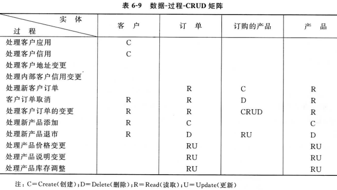

### 6.5 案例分析 ——某网上商店概念数据建模

6.5.1 确定基本实体

6.5.2 确定实体间的关联

6.5.3 确定主码和属性

本章小结

思考与练习

## 第 7 章 应用架构设计

### 学习目标

通过本章学习，要求掌握：

- 系统应用架构的定义
- 系统应用架构与框架的异同。
- 典型的系统应用架构：基于主机的架构、文件服务器架构、客户/服务器架构、三层或 N 层客户/服务器架构、浏览器/服务器架构，及其特点。
- 根据特定情况，能够选择有效的应用架构设计方式。

### 7.1 架构概述

- 系统应用架构（Application Architecture）是一个用于实现信息系统的**软硬件**和**网络**的设计蓝图，用于确定应用软件及数据的哪些部分指定给哪些硬件和网络。

#### 7.1.1 应用架构与框架

- 应用架构是一个逻辑性的框架描述通常由一个设计思想，加上若干设计模式，再规定系列的接口规范、传输协议、实现标准等文档组成。
- 软件架构的意义就是要将这些可逻辑划分的部分独立出来，用约定的接口和协议将它们有机地结合在一起，形成职责清晰、结构清楚的软件结构。
- 架构 （architecture）不同于框架（framework），软件框架通常是商业化的半成品。
- 应用架构包括软件层次、每个层次的职责、层次之间的接口、传输协议及标准、每个层次上所采用的软件框架等，如图 7.1 所示。


#### 7.1.2 架构的逻辑层次

- 主要的层：表示层、领域层和数据源层。
- 信息系统软件都可以划分为 5 个功能层次。
  - **表现层**
    - 呈现给用户的界面
  - **表现逻辑层**
    - 表现逻辑层主要是与用户行为进行交互的组件，即为了生成表现而必须进行的处理，如校验输入数据和格式化输出数据。
    - 它是提供给用户的可视化操作界面，是用户提出请求和接收回应的地方。
    - 用户的所有操作都通过表现层逻辑来支持，表现逻辑层将负责其他层与UI层之间的交互
  - **应用逻辑层**
    - 应用逻辑层也称为业务逻辑层，包括支持实际业务应用和规则所需的所有逻辑和处理，主要实现DFD中、用例或者功能说明中阐述的逻辑，
    - 例如，信用检查、计算、数据分析等。该层次的工作通常通过程序设计语言的编程完成
  - **数据处理层**
    - 数据处理层也称数据访问逻辑层，用来存储和访问往来于数据库的数据所需的所有命令和逻辑，通常指结构化查询语言SQL等
  - **数据层**
    - 数据库中实际存储的数据。
    - 绝大多数系统都需要存储和检索数据，不管采用的是小型文件系统还是大型数据库系统

- 系统的三个硬件组成包括**客户计算机、服务器和网络**。

### 7.2 典型的系统应用架构（重要）

#### 7.2.1 基于主机的服务器架构

- 最早的计算架构是基于主机的，主机完成所有的应用功能
- 优点是：简单，运行性能良好
- 主要缺点是：服务器必须执行所有消息，当应用请求越来越多时服务器计算机开始超负荷工作，不能迅速处理所有的计算机请求。响应时间开始减慢，网络管理者需要更多的投资来升级服务器计算机，但是服务器的升级极为昂贵。

#### 7.2.2 文件服务器架构

- 文件服务器架构是一种基于局域网的方案，服务器计算机仅装载了数据层。信息系统应用的所有其他层都在客户端实现，也称为基于客户端的架构，其工作原理如图 7.2 所示。

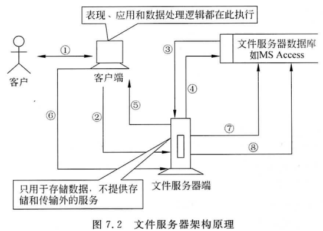

- 系统对用户请求的响应的逻辑如下
  1. 首先由客户向客户端的计算机发出请求，请求创建、增删改某条记录或者多条记录。
  2. 客户端将指令传到服务器端，服务器端的作用是存储和传输数据
  3. 记录存放在服务器上的文件服务器数据库里
  4. 在读取时需要将整个表加锁，直到客户端返回表为止。
  5. 文件服务器对客户端请求进行响应，返回整张表
  6. 客户端对某条记录进行数据处理（创建、增删改等），并将包含修改记录的整个表返回到服务器端
  7. 服务器端对文件服务器数据库进行修改
  8. 文件服务器数据库完成修改后，对整个表进行解锁。
- 服务器端仅执行存储的功能不提供存储和传输以外的服务
- 对单用户系统而言数据也存放在客户计算机上，不使用服务器。客户端和服务器之间需要移动大量不必要的数据，这样大的数据流量会明显地降低应用性能。此外，数据库的完整性可能会被破坏。
- 仅作为个人或小型工作组构造原型时采用。

#### 7.2.3 客户/服务器架构

- 客户/服务器架构是一种分布式计算方案，其中表现层、表现逻辑层、应用逻辑层数据处理层和数据层在客户端 PC 和一个或多个服务器间分布，这就要求服务器比文件服务器的功能更加强大。

- 在该模式下，应用逻辑可能在客户端，也可能在服务器端，也可能两端各承担一部分

  - 当客户承担大多数或者所有应用逻辑时，称为“胖客户”，
  - 当客户端只承担表现功能，而服务器承担大多数或者所有应用逻辑时，客户端称为“瘦客户”。

- 服务器主要划分为以下几种类型

  1. **数据库服务器**：运行一个或者多个共享的数据库，执行信息系统的所有数据库命令和服务，执行数据层和数据处理层的任务。如 Oracle，SQL Server，IBM 的 DB2。
  2. **事务服务器**：运行确保所有单个业务事务的数据库修改作为一个整体成功或者失败的服务，例如微软公司的 Transaction Server，IBM 公司的 CICS，BEA 公司的 Tuxedo。
  3. **应用服务器**：运行信息系统的应用逻辑和服务。必须同前台客户端通信，并同用于数据修改和访问的后台数据库服务器通信。通常应用服务器和实物服务器集成。多数应用服务器以 CORBA MS 的 COM+或者 DNA 标准为基础
  4. **信息和组件服务器**：运行电子邮件、日历或者其他工作组服务，这类功能实际可以集成到信息系统应用中。
  5. **服务器**：运行因特网或者内联网站点向客户返回文档和数据（XML）

- 在该架构模式下，数据层和数据处理层放在服务器上，应用逻辑层、表现逻辑层和表现层放置在客户端，也称为两层客户/服务器计算，这是真正的客户/服务器计算的一种最简单形式，也是大家常说的 C/S 结构。

- 该架构的应用原理如图 7.3 所示。

  

- ##### 工作原理

  1. 首先由客户向客户端的计算机发出请求，请求创建、增删改某条记录或者多条记录。
  2. 客户端将指令传到服务器端。
  3. 数据库服务器只从数据库表中读取请求的行和列。
  4. 在读取时只需要对请求的记录进行加锁，而不用对整个表加锁，直到客户端释放表为止。
  5. 数据库服务器对客户端请求进行响应，只返回需要的行和列
  6. 客户端对某条记录进行数据处理（创建、增删改等），并将修改的记录返回到服务器端。
  7. 数据库服务器端对数据库中的记录进行修改。
  8. 数据库服务器数据库完成更新后，对记录进行解锁。

- ##### 优点：

  - 比文件服务器架构的网络流量少只有数据库请求和需要的数据库记录实际在客户端工作站之间传递时才需要交互。此外数据库完整性更容易维护般只需要加锁使用的记录，其他客户可以使用同一个表的其他记录。

- ##### 缺点：

  1. 应用逻辑必须在所有客户端上进行复制和维护，可能涉及成千上万个客户端的应用软件安装。
  2. 设计人员必须为版本升级做计划，提供控制以确保每个客户端都运行业务逻辑的最新发布版，并确保其他软件不会干扰业务逻辑。
  3. 应用逻铒分布在客户端，客户发出数据请求，服务器端返回结果。当客户数目激增时，大量的数据传输也会增加网络负载，导致服务器的性能因为无法进行负载平衡而下降。

#### 7.2.4 三层或 n 层客户/服务器架构

- 三层架构使用了与两层客户/服务器架构同样的数据库服务器。
  - 它把**客户端**的**应用逻辑**和**表现逻辑**进一步划分，在客户端与服务器端加入中间层。
  - 应用服务器将应用的商业逻辑放在中间服务器上，这个服务器是一个应用或者事务服务器。
  - 应用逻辑放在服务器上维护，而不需要在所有客户端维护了。


- 该架构模型的作原理如下：
  1. 首先由客户向客户端的计算机发出信息或者服务请求，请求执行某个应用逻辑，或者是创建、增删改某条记录或者多条记录
  2. 客户端将指令传到应用服务器端，如果仅涉及应用逻辑，不用读取数据，则在此执行，然后返回到客户端
  3. 如果是请求创建、读取、修改或者删除一个或多个记录，则将请求传递给数据库服务器。
  4. 数据库服务器从数据库表中读取请求的行和列
  5. 数据库服务器在读取时只需要对请求的记录进行加锁，而不用对整个表加锁，直到客户端释放表为止。
  6. 数据库服务器对数据处理请求的响应发送给应用服务器，只返回需要的行和列。
  7. 应用服务器执行应用逻辑，并响应客户的信息和服务，传送给客户端。
  8. 数据库服务器端对数据库里的记录进行修改。
  9. 数据库服务器数据库完成更新后，对记录进行解锁
- 业务逻辑层（Business Logic Layer）无疑是系统架构中体现核心价值的部分。
- 三层和两层架构相比优点在于：
  - 客户端执行整个系统组件的最小部分，只有用户界面和相对稳定的个人应用逻辑在客户端执行，简化了客户端的配置与管理。
  - 但是，与两层架构模式相比，三层或 N 层架构的设计非常复杂，软件编写较为复杂，因为所有应用都包含两部分，即在客户端的软件和在服务器端的软件，所以需要进行设计分割。
    - 设计分割是指如何在网络中最优地分布或复制应用构件的行为

#### 7.2.5 浏览器/服务器架构

- 浏览器/服务器架构主要用于网络计算和 Web 应用，表现层和表现逻辑层在客户端浏览器中使用从某个 Wcb 服务器下载的内容实现，然后表现逻辑层连到运行在应用服务器上的应用逻辑层，它最终连到后台数据库服务器。

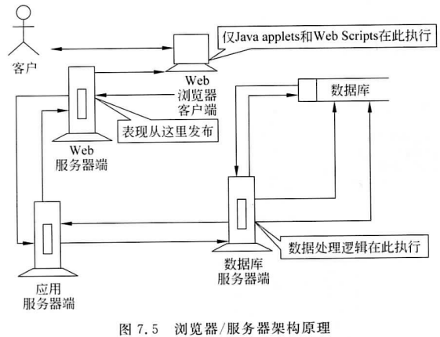

- 在该技术下应用的相关网络技术如下：
  - Java 技术：主要用于服务器端的应用逻辑编程，称为 servlets，有时也用于客户端的应用逻辑编程，称为 applets
  - 超文本标记语言：HTML（Hyper Text Markup Language），主要用于表现层的编程。
  - 可扩展标记语言：XML（Extensible Markup language），主要用于可以在 Wcb 上进行转换的数据内容的编程。
  - 基于 Web 的系统主要由 Web 浏览器执行表现逻辑和少量的应用逻辑，而 Web 服务器承担应用逻辑、数据访问逻辑和数据存储。
- 这种架构的优点是：
  - 对于使用 Internet 标准的客户/服务器架构，容易将表现逻辑、应用逻辑和数据访问逻辑进行分离，使其保持相互独立。
    - 例如，表现逻辑可以采用 HTML 或者 XML 进行设计，指定网页如何在屏幕上进行显示。采用简单的程序语句链接接口到特定的应用逻辑模块，以执行各种功能。这些定义接口的 HTML 或者 XML 文件可以在不影响应用逻辑的情况下进行改动。同样，也可以对应用逻辑进行修改，而不用对表现逻辑和数据访问逻辑进行改动。
  - 此外，由于所有系统都在浏览器上运行（例如，财务系统、人力系统生产系统），不用再担心存在多个不同的计算机架构，也不用担心存在不同的操作系统。这种方法可以重新设计传统信息系统在网络上运行的能力。

### 7.3 应用架构举例

#### 7.3.1 MVC 架构

- 应用架构的起源中，Smalltalk-80 语言中的 MVC（Model-View-Controller）架构，该架构可以让 Smlltalk 程序员迅速建立程序的使用者接口（User Interface）。
- 典型的 MVC 架构包括三个抽象类别，即 Model、View 及 Controller。


- Model 对象负责管理资料或文件，它可以对应到数个 View 对象，每个 View 对象显示出 Mode 对象的某一方面；
  - 每个 View 对象有一个相对应的 Controller 对象，它负责解释使用者输入的消息，如移动鼠标等。
  - 使用者输入消息时，Controller 根据消息要求 Model 处理文件资料，也会要求 View 对象更新画面。
  - 一但 Model 对象中的资料发生改变，Model 对象会通知各 Controller View 对象，各 View对象会向 Model 取得新资料，然后更新画面。

- 特点：
  - MVC 架构使得应用程序的结构更加清晰，通过将代码按照层次划分为业务逻辑/数据、用户界面和应用流程控制这三个层次，增强了代码稳定性。
  - View 的实现一般是由界面设计人员和界面程序员完成的。
  - Model 是对业务数据/信息进行处理的模块，包括对业务数据的存取、加工、综合等，由业务逻辑程序员来完成；
  - Controller 负责 View和 Model 之间的流程控制，也就是完成两个方向的动作：
    - 将用户界面（View）的操作映射到具体的 Model，以完成具体的业务逻辑；
    - 将通过 Model处理完的业务数据及时反应到用户界面上，一般由负责整体控制的程序员来完成
- Controller 部分的代码比较稳定，一般会使用一个通用的架构；
- Modle 则跟随商务流程的变化而变化；
- View 的更改则是随着用户需求的更改而更改的
- 这种模块功能的划分有利于在代码修改过程中进行模块的隔离，而不需要把具有不同功能的代码混杂在一起造成混乱
- 对于项目开发而言有利于在项目小组内按照小组成员各自的特点进行分工，有利于三个部分并行开发，加快项目进度

#### 7.3.2 架构组成

- 下面基于 MVC 架构提出了一个由 5 个层次组成的软件架构描述了各层次的构成、职责、使用的框架、各层次的传输标准。
  - 其中 Web 层采用了 Structs 框架，Business control 层和 Entity 层采用了自己开发的框架，而 DB Control 层采用了 Hibernate 框架，如图 7.7 所示。


### 7.4 应用架构设计内容

- 在进行应用架构设计时，需要考虑以下 3 个方面的内容：
  1. 信息系统集中或者分布程度，即网络架构，可以采用网络拓扑图进行表示
  2. 数据在网络处理器上如何分布，采用数据架构进行表示
  3. 过程在网络处理器上如何分布，采用过程架构进行表示

#### 7.4.1 数据架构设计

- 数据架构设计主要解决数据分布到不同的数据库服务器的问题，主要采取**数据分割和数据复制**两种方式。

  - 数据分割是指将数据的行或列拆分到特定的数据库服务器上，服务器之间的数据很少或者没有重复。
  - 水平分割是拆分不同的行到不同的数据库服务器，垂直分割是拆分不同的列到不同的数据库服务器。
  - 数据复制是在多个数据库服务器上复制一些表或者所有表。整个表可以被复制到某些数据库服务器上，同时表中行的子集可以被复制到其他数据库服务器上。

- ##### 数据分布的策略如下：

  1. 在单个服务器上存储所有数据
  2. 在不同服务器上存储特定表。
  3. 在不同服务器上存储特定表的子集。
  4. 在不同服务器上复制特定表或者子集。在这种情况下，被复制的表称为“主拷贝或者“主表”，其他的被指定为“拷贝”或者“副本”

- 在选用数据分割或者复制策略时，需要根据实际的业务数据存储需要进行考虑。

#### 7.4.2 过程架构设计

- 软件过程架构设计的主要内容是根据所选择的架构确定相应的软件开发环境（SDE）
  - 开发环境主要是用于构造信息系统的语言和工具包。
- 适用于**服务器架构**的软件开发环境主要具备如下特征
  - 个编辑器和一个编译器，用于编写程序；
  - 个事务监视器，用户管理联机事务和终端屏幕；
  - 个文件管理系统，或者数据库系统，用于管理存储的数据
- 适用于**两层服务器架构**的软件开发环境主要有 PB、VB、Delphi 等。这些开发环境一般具有如下特征
  - 用于构建图形用户界面的 RAD 环境：
  - 为 GUI 相关系统事件自动生成模块代码
  - 有编程语言；
  - 有到各种关系数据库引擎的连接
  - 有客户端使用的复杂代码测试和调试环境；
  - 系统测试环境；
  - 创建最终用户报告；
  - 有客户端帮助文件系统。
- 适用于**多层服务器架构**的软件开发环境除了具备两层软件开发环境的特征之外，还需要具备如下特征
  - 支持客户端和服务器异构计算平台；
  - 同时用于客户端和服务器的代码生成和编程；
  - 具有可复用性；
  - 有 CASE 工具；
  - 有客户端和服务器之间分割应用组件的工具；
  - 有客户端和服务器上的支持工具
  - 具有自动调整应用到不同平台的能力；
  - 能进行复杂的软件版本控制和应用管理。
- 为了支持**浏览器/服务器架构**的软件开发，快速应用开发工具正在兴起，大多数这类语言都围绕以下 4 个核心标准技术构建
  - **HTML（超文本标记语言）**，用于构造大多数因特网和内联网网页内容和超链接的语言
  - **XML（可扩展标记语言）**，用于通过 web 传输数据和属性的
  - **可扩展语言 CGI（计算机网关接口）**，用于发布**图形化**组件、结构和链接的标准
  - **网页编程语言**，如 Java 等，用于创建与平台无关的程序、Servlet 和可以在浏览器的 Java 虚拟机内运行的 Applet.

#### 7.4.3 网络架构设计

- 网络架构主要解决如何将**客户端、服务器**以及**设备**分配到网络中，**客户端与服务器**之间如何连接，用户在哪里与客户端交互等问题。
- 网络架构（见图 78）包括以下内容
  - 服务器及其物理位置。
  - 客户端及其物理位置
  - 处理器说明。处理器的资料库描述，可被用于定义处理器说明，如硬盘容量显示器等。
  - 传输协议。连接用传输协议和其他相关物理参数标记。


### 7.5 案例分析 ——某服务台系统架构设计

本章小结

思考与练习

## 第 8 章 软件过程设计

### 学习目标

通过本章学习，要求掌握：

- 软件过程设计的主要内容，包括总体设计和详细设计。
- 软件设计的基本原理，包括模块化、抽象与信息隐蔽、模块的独立性
- 各种软件设计工具，如 HIPO 图、软件结构图以及详细设计工具，并比较其特点。
- 软件结构设计的各种方法，理解每种设计方法的适用情况。
- 软件详细设计的目标和方法。
- 在系统分析阶段，系统分析人员通过对系统的调查和分析，对系统过程进行描述，利用结构化系统分析方法产生数据流图、数据字典等系统分析资料。
  - 在设计阶段，可以采用一组标准的工具和准则在数据流图的基础上进行结构设计，根据系统分析工作所构造的系统逻辑结构模型，产生结构化系统设计资料。

### 8.1 过程设计主要内容

#### 8.1.1 总体设计

- 为了最终实现系统目标，必须设计组成这个系统的所有程序和数据库。
  - 数据库设计完成与数据相关的设计任务，而过程设计主要是针对程序进行设计。
  - 这部分通常分为两个阶段完成：首先进行**结构设计**，然后进行**过程设计**。
    - 结构设计确定程序由哪些模块组成，以及这些模块之间的关系过程设计确定每个模块的处理过程。
    - 结构设计是总体设计阶段的任务，过程设计是详细设计阶段的任务。
- 概要设计
  - 将系统划分成功能模块
  - 明确软件结构（模块组成的层次系统）
  - 采用适当的工具描述软件结构

#### 8.1.2 详细设计

- 详细设计的目标是确定怎样具体实现软件结构图中每个模块的具体内容。
- 详细设计的任务还不是具体地编写程序，而是要设计出程序的“蓝图”，程序员可以根据这个蓝图编写实际的程序代码。
  - 因此，详细设计的结果基本上决定了最终的程序代码的质量

### 8.2 软件设计的基本原理

#### 8.2.1 模块化

- 模块在程序中是数据说明、可执行语句等程序对象的集合，或者是单独命名和编址的元素，如高级语言中的过程、函数、子程序等。
- 模块是可组合、分解和更新的单元。
- 模块有以下基本属性
  - 接口：指模块的输入与输出。
  - 功能：指模块实现什么功能。
  - 逻辑：描述内部如何实现要求的功能及所需的数据。
  - 状态：该模块的运行环境，即模块的调用与被调用关系。
  - 功能、状态与接口反映模块的外在特性，逻辑反映它的内在特性
- 模块化是指解决一个复杂问题时自顶向下逐层把软件系统划分成若干模块的过程。
- 优点：
  - 降低问题复杂性
  - 减少开发工作量
  - 减少开发成本
  - 提高软件开发效率

#### 8.2.2 抽象与信息隐蔽

- 抽象是认识复杂现象过程中使用的思维工具，即抽出事物本质的共同性而暂不考它的细节，不考虑其他因素。
- 系统开发过程中的每步都可以看作是对软件解决方法的抽象层次的一次细化。
  - 通过**抽象，可以确定组成软件的过程实体。**
  - 通过**信息隐蔽**，可以定义和实现对模块的**过程细节**和**局部数据结构**的**存取限制**。

#### 8.2.3 模块独立性

- 为了降低软件系统的复杂性，提高可理解性、可维护性，必须把系统划分成为多个模块，模块不能任意划分，应尽量保持其独立性。
- 模块独立性指每个模块只完成系统要求的独立的子功能，并且与其他模块的联系最少且接口简单。
- 根据模块的外部特征和内部特征，采用两个衡量软件的独立性的度量标准，即**耦合性和内聚性**

1. ##### 耦合性

   1. 耦合性称块间联系，指软件系统结构中各模块间相互联系紧密程度的一种度量

   2. 模块之间联系越紧密，其耦合性就越强，模块的独立性则越差。模块间耦合高低取决于模块间接口的复杂性、调用的方式及传递的信息。

      

      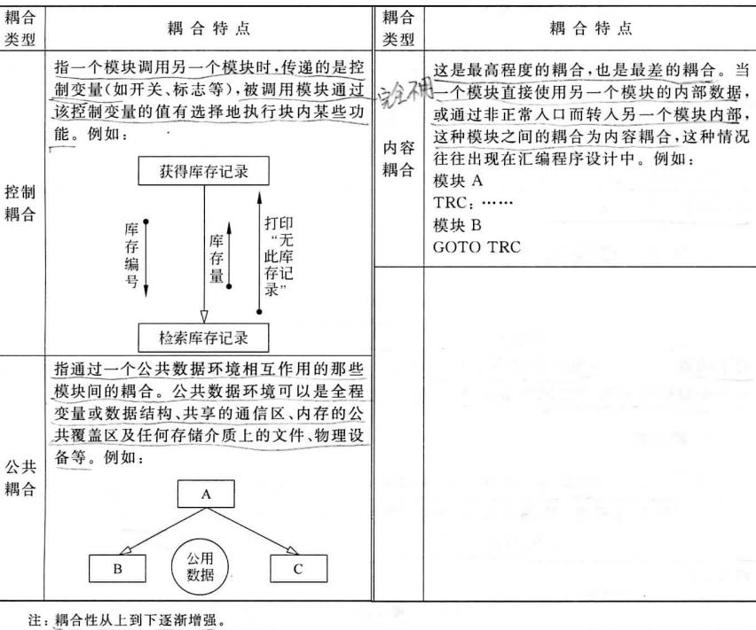

      1. **数据耦合**
      2. **标记耦合**
      3. **控制耦合**
      4. **内容耦合**
      5. **公共耦合**

2. ##### 内聚性

   1. 内聚性又称做块内联系指模块的功能强度的度量若一个模块内各元素（语句之间、程序字段之间）联系得越紧密，则它的内聚性就越高，内聚性有以下几种类型。

      

      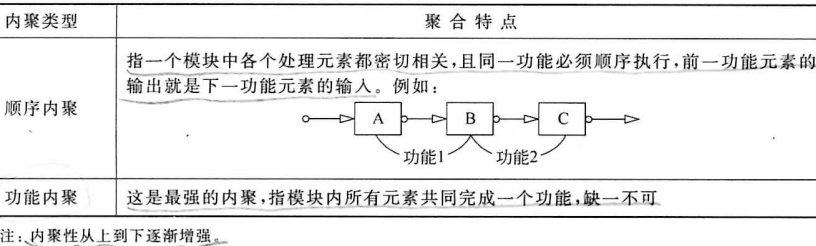

      1. **偶然内聚**
      2. **逻辑内聚**
      3. **时间内聚**
      4. **通信内聚**
      5. **顺序内聚**

3. 耦合性与内聚性是模块独立性的两个定性标准，将软件系统划分模块时，尽量做到**高内聚低耦合**，提高模块的独立性，为设计高质量的软件结构奠定基础

### 8.3 软件设计工具（重要）

#### 8.3.1 HIPO 图（重要）

- HIPO（Hierarchy Plus InPut/Process/OutPut）图由美国 IBM 公司于 20 世纪 70 年代发明，用图形方法表达一个系统的输入和输出功能，以及模块的层次。该技术包括两方面的内容：HIPO 分层图和 IPO 图。

- HIPO 分层图用于表示自顶向下分解所得系统的模块层次结构。每个矩形框代表一个模块，连线表示“调用”而非“组成”。为了能使 HIPO 图具有可追踪性，在 H 图（层次图）里除了最顶层的方框之外，每个方框都可以加编号。编号规则和数据流图的编号规则相同。

  

- HIPO 图（输入一处理一输出图）用于描述分层图中一个模块的输入输出和处理内容与 H 图中每个方框相对应，应该有一张 IPO 图描绘这个方框代表的模块的处理过程 HIPO 图中的每张 IPO 图内都应该明显地标出它所描绘的模块在 H 图中的编号，以便追踪了解这个模块在软件结构中的位置

  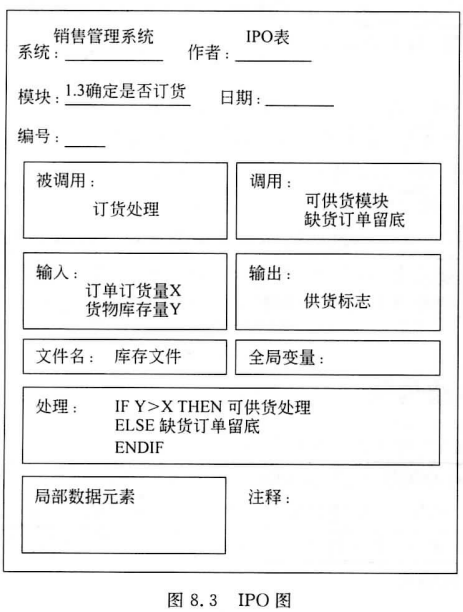

- HIPO 图适合于在自顶向下设计软件的过程中使用。应用 HIPO 技术可以进行系统设计、评价，在系统实施之前处理和修改已设计的系统。HIPO 图清晰易懂，可以使用户管理人员和其他系统建设者很方便地理解系统的程序结构，也有利于程序的编写和系统的维护

#### 8.3.2 软件结构图（重要）


1. 模块：
   - 用**方框**表示，名字体现该模块的功能
2. 模块间的控制关系：
   - 方框之间的**箭头**（或直线）表示模块的调用关系。上层模块调用下层模块，但调用次序不严格

3. 模块间的信息传递：
   - 在结构图中通常还用带注释的箭头表示模块调用过程中来回传递的信息。
   - 如果希望进一步标明传递的信息是数据还是控制信息，则可以利用注释箭头尾部的形状来区分：尾部是**空心圆表示传递的是数据**，**实心圆表示传递的是控制信息**
   - 图 8.5 通过产生最佳解的示例显示了结构图的表示方法。

4. 两个附加符号：**模块选择调用**或循环调用。
   - 在图 8.6 中，图（a）表示当模块 A 中某个判定为真时调用模块 B，为假时调用模块 C。图（b）表示模块 M 循环调用模块 A、B 和 C。


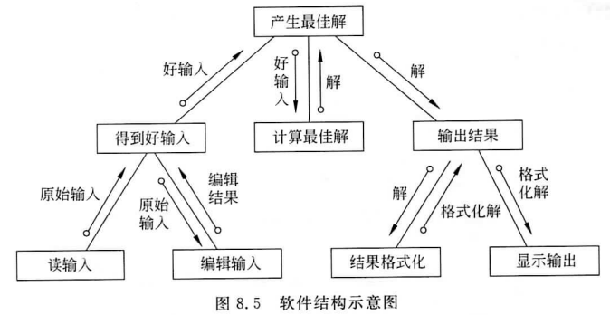

- 注意，层次图和结构图并不严格表示模块的调用次序。
  - 虽然多数人习惯于按调用次序从左到右画模块，但并没有这种规定，出于其他方面的考虑（例如为了减少交叉线），也完全可以不按这种次序画。
  - 此外，层次图和结构图并不指明什么时候调用下层模块。


- 通常用层次图作为描绘软件结构的文档。结构图作为文档并不很合适，因为图上包貪的信息太多有时反而降低了清晰程度。

  - 但是，利用 IPO 图或数据字典中的信息得到模块调用时传递的信息，从而由层次图导出结构图的过程，却可以作为检查设计正确性和评价模块独立性的好方法。

- 软件结构图形态特征有如下四个指标分别是：

  - 深度，指结构图控制的层次，即模块的层数；

  - 宽度，指一层中最大的模块个数；

  - 扇入，指一个模块直接上属模块的个数，

  - 扇出，指一个模块直接下属模块的个数。

    如图 8.7 所示，该软件图深度为 5，宽度为 8；模块 M 的扇出为 3，模块 T 的扇入为 4

  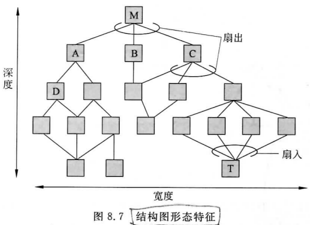

- 表示软件结构图时需要注意

  1. 同一名字的模块在结构图中仅能出现一次
  2. 调用关系只能从上到下
  3. 不严格表示模块的调用次序，习惯上从左到右，有时为了减少连线的交叉，适当地调整同一层模块的左右位置，以保证结构图的清晰
  4. 结构图并不指明什么时候调用下层模块，只表明一个模块调用哪些模块，至于模块内还有没有其他成分则完全没有表示。

#### 8.3.3 详细设计工具（重要）

详细设计的主要任务是设计每个模块的实现算法所需的局部数据结构。

详细设计的标有两个：实现模块功能的算法要**逻辑上正确**和**算法描述要简明易懂**。

1. ##### 程序流程图 （PFC）

   1. 程序流程图（PFC），又称程序框图，是描述程序逻辑结构的工具。它使用的符号与系统流程图的符号很多相同，但是，箭头符号代表控制流而不是数据流

      

   2. 这 5 种基本的控制结构是：

      1. 顺序型：几个连续的处理步骤依次排列构成。
      2. 选择型：由某个逻辑判断式的取值决定选择两个处理中的一个。
      3. 先判定型循环：在循环控制条件成立时，重复执行特定的处理。
      4. 后判定型循环：重复执行某些特定的处理，直到控制条件成立。
      5. 多情况选择型：列举多种处理情况，根据控制变量的取值，选择其一执行程序结构图的优点是直观清晰、易于使用

   3. 缺点是：

      1. 易造成非结构化的程序结构编码时不加限制地使用 GOTO 语句，导致基本控制块多入口多出口，与软件设计的原则相违背。
      2. 程序流程图本质上不是逐步求精的好工具，会诱使过早考虑程序的控制流程，而不去考虑程序的全局结构。
      3. 程序流程图不易表示数据结构。

2. ##### 盒图 （N-S 图）

   1. 根据结构程序设计思想，Nasi 和 Shneiderman 提出了盒图，又称为 N-S 图

      

   2. 盒图具有如下特点

      1. 功能域（即一个特定控制结构的作用域）明确，可以从盒图上一眼就看出来
      2. 不可能任意转移控制。
      3. 很容易确定局部和全程数据的作用域。
      4. 很容易表现嵌套关系，也可以表示模块的层次结构。

   3. 优点：盒图没有箭头，因此不允许随意转移控制。

      1. 坚持使用盒图作为详细设计的工具，可以使程序员逐步养成用结构化的方式思考问题和解决问题的习惯

   4. 盒图的缺点是：

      1. 当程序内嵌套的层数增多时，内层的方框将越来越小，从而增加绘图的难度，使图形的清晰性受到影响

3. ##### 问题分析图 PAD（ Problem Analysis Diagram）

   1. 它用二维树形结构的图来表示程序的控制流（自 1973 年由日本日立公）
      
   2. **PAD 图中竖线的总条数就是程序的层次数**
   3. PAD 图的主要优点如下
      1. 支持结构化的程序设计原理，使用表示结构化控制结构的 PAD 符号所设计出来的程序必然是结构化程序
      2. 支持自顶向下、逐步求精的设计方法。
         - 开始时设计者可以定义一个抽象的程序，随着设计工作的深入而逐步增加细节，直至完成详细设计。
      3. 用 PAD 图表现程序逻辑，易读、易懂、易记。
         - PAD 图是二维树形结构的图形，程序从图中最左竖线上端的结点开始执行，自上而下，从左向右顺序执行，遍历所有结点。
      4. 支持程序自动生成。
         - 容易将 PAD 图转换成高级语言源程序，这种转换可用软件工具自动完成，从而可省去人工编码的工作有利于提高软件可靠性和软件生产率。
   4. PAD 图是面向高级程序设计语言的，为 FORTRAN、COBOL 和 Pascal 等每种常用的高级程序设计语言都提供了一整套相应的图形符号。
      - 由于每种控制语句都有一个图形符号与之对应，显然将 PAD 图转换成与之对应的高级语言程序比较容易。

### 8.4 软件结构设计方法

面向数据流的设计方法的目标是给出设计软件结构的一个系统化的途径。

通常所说的结构化设计方法（简称 SD 方法），也就是基于数据流的设计方法。

结构化设计以结构化分析产生的数据流图为基础按一定的步骤映射成软件结构。面向数据流的设计方法把信息流映射成软件结构，信息流的类型决定了映射的方法。

信息流有下述两种类型；变换流和事务流，因此设计方法也相应地划分成两类：变换分析设计以及事务分析设计。

#### 8.4.1 变换分析设计

- 信息沿输入通路进入系统，同时由外部形式变换成内部形式，进入系统的信息通过变换中心，经处理以后再滑输出通路变换成外部形式离开软件系统。

  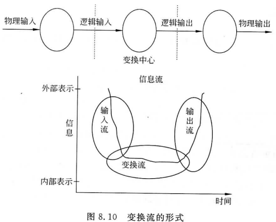

- 当数据流图具有这些特征时，这种信息流就叫做使换流 x 变换型数据流的设计主要包含以下步骤

  1. （1）确定输入流和输出流的边界，从而孤立出变换中心

    1.  检查“输入流”的边界
  
      从输入的数据源开始，沿着毎一个由数据源传入的数据流的移动方向进行跟踪分析，逐个分析它所经过的处理逻辑功能。如果仅是传入的数据流作形式上的转换，逻辑上没有进行实际的数据处理功能，则这些处理逻辑属于系统的“输入处理部分”。延着传入的数据流的移动方向，一直跟踪到它被真正处理为止。
    2. 检查“输出流”的边界。
  
      从输出结果的地方开始，逆着每一个传递出去的数据流，由外向里反方向跟踪，逐个分析它的处理逻辑功能，一直反方向跟踪到它被真正产生出来为止
    3. 得到变换中心。
  
      根据前两步的分析结果，画出一个闭环界线在界线以内的就是变换中心
  
  2. （2）设计软件结构的顶层和第一层—变换结构，如图 8.11 所示。
  
    

  3. （3）设计中、下层模块。
      在第一层的模块基础上自顶向下，逐层分解。输入模块的下属模块设计：为每个输入模块设计两个下层模块，一个用于接收数据，另一个用于将这些数据转换为所要求的数据重复这两个步骤直到物理输入为止，如图 8.12 所示。
  
    
  
    变换模块的下属模块设计：按照模块独立性的原则来组织其结构，一般每个基本处理设计一个功能模块，如图 8.14 所示。
  
    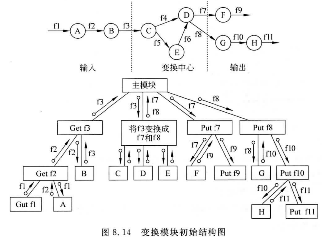
  
  4. （4）根据设计准则进行设计优化。
  
    - ① 输入部分的求精。对每个物理输入设置专门模块，以体现系统的外部接口；其他输入模块并非真正输入，当它与转换数据的模块都很简单时，可将它们合并成一个模块。如图 8.15 所示
  
    - ② 输出部分的求精。为毎个物理输出设置专门模块，同时注意把相同或类似的物理输出模块合并在一起，以降低耦合度，如图 8.16 所示
  
    - ③ 变换部分的求精：根据设计准则，对模块进行合并和调整。软件结构的求精，具有很大的经验性。总体而言应该追求“高内聚，低耦合”方法，设计有独立功能的模块，模块间尽量传递数据型的参数，模块间共享信息尽量少。
  
  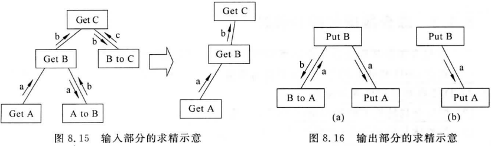

#### 8.4.2 事务分析设计

- 基本系统模型意味着变换流，因此，原则上所有信息流都可以归结为这一类。

- 但是，当数据沿输入通路到达一个处理 T，这个处理根据输入数据的类型分解成一串发散数据流，形成许多活动路径，并根据输入数据的类型在若干动作序列中选出一个来执行。

  - 这类数据流应该划分为一类特殊的数据流，称为**事务流**，是以事务为中心的，如图 8.17 所示

  

- 事务分析的设计步骤和变换分析的设计步骤大部分相同或类似，主要差别仅在于由数据流程图到软件结构的映射方法不同，由事务流映射成的软件结构包括一个接收分支和一个发送分支。

- 其具体设计步骤如下

  - （1）确定数据流图中的事务中心和处理路径。
    - 如果某个处理具有明显的事务中心特性时，将其视为事务中心。
  - （2）设计软件结构的顶层和第一层—事务结构。
    - 顶层为主模块，有两个功能：接收数据和根据事务类型调度相应的处理模块。因此，第一层有两个模块：一是接收模块，负责接收数据，映射出接收分支结构的方法和变换分析映射出输入结构的方法相似，即从事务中心的边界开始，把沿着接收流通路的处理逻辑映射成模块。二是发送分支，发送分支的结构包含一个调度模块，它控制下层的所有活动模块。
  - （3）把数据流程图中的毎一个活动流通路映射成与它的特征相对应的结构。
    - 事务结构中、下层模块的设计、优化等工作和变换型分析设计相同，如图 8.18 所示

  

#### 8.4.3 综合数据流图的映射

- 对于既包含事务类型又包含变换类型的数据流，采用的映射方法如下：
  （1）确定 DFD 整体上的类型：除明显有事务类型的，都可认为是变换型。事务型用于高层 DFD 变换有平行处理的优点
  （2）把与全局特性不同的局部区域孤立出来，确定类型
  （3）按整体与局部的 DD 特性，设计软件结构


#### 8.4.4 分层数据流图的映射

- 由于数据流图往往是分层的，映射的软件结构图也可以采用分层策略，这样便于设计和修改。数据流图的顶层反映的是系统与外部的接口，所以相应的软件结构图中物理输入和都应该在对应的主图中，便于同顶层图进行对照检查，如图 8.20 所示。


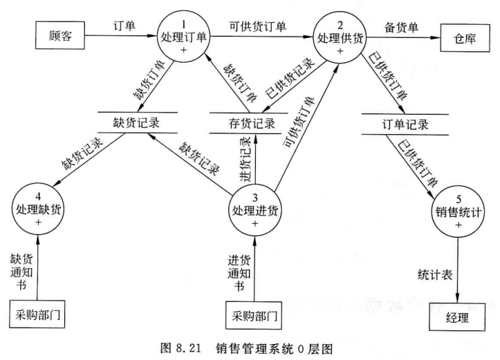

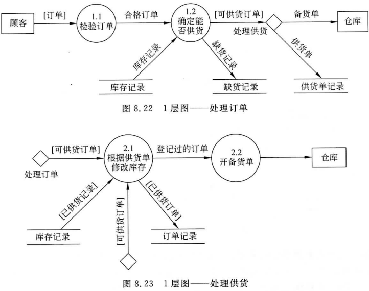


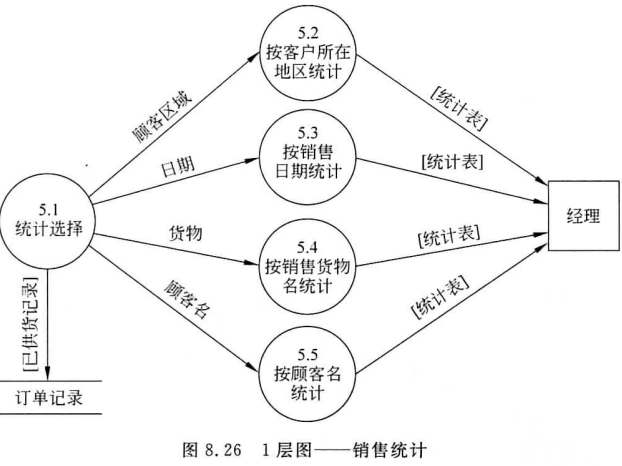

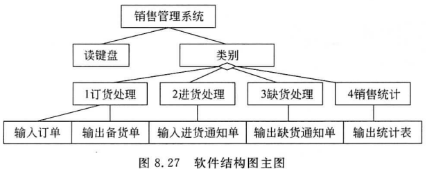

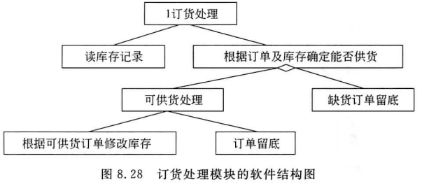

### 8.5 软件详细设计

#### 8.5.1 结构化程序设计

**详细设计结果基本上决定了最终程序代码的质量。**不仅要逻辑正确，性能满足，还要简明易懂

- 任何简单或复杂的算法都可以由**顺序结构、选择结构和循环结构**这三种基本结构组合而成。
- 结构化程序设计的基本思想是
  - 在构造任何算法时，仅采用顺序结构、选择、分支结构和循环结构作为基本单元，
  - 同时规定基本结构之间可以并列和互相包含，不允许交叉和从个结构直接转到另一个结构的内部去。
  - 结构化程序具有唯一入口和唯一出口，并且不会出现死循环。
  - 程序的静态形式与动态执行流程之间具有良好的对应关系。

#### 8.5.2 程序设计目标

- ##### 特性

  1. 可维护性
  2. 可靠性
  3. 可理解性
  4. 效率

- ##### 程序效率与可维护性、可理解性的关系通常是矛盾的

  - 小程序中，主要强调程序的**正确和效率**。
  - 大程序，**可维护性、可靠性和可理解性**，然后才是效率。

#### 8.5.3 程序设计方法

- ##### 自顶向下的结构化程序方法

  - 整体理解
  - 模块逐步求精
  - 功能

- ##### 注意：

  1. 模块应该具有独立性
  2. 模块大小划分要适当
  3. 模块功能要简单
  4. 共享的功能模块应集中

### 8.6 案例分析 ——百货商店业务管理信息系统过程设计

本章小结

思考与练习

## 第 9 章 数据库设计（重要）

### 学习目标

- 逻辑模型与物理模型的区别和逻辑模型转换成物理模型的规则
- 将 E-R 图转换为关系并合并冗余的关系
- 为关系设计字段并选择合适的数据类型
- 合理设计字段以保证数据完整性要求
- 代码的含义及其作用，并能在实际模型中设计合理的代码
- 数据库设计通常与系统界面设计同步进行。
  - 系统分析员必需理解实际应用中的概念数据设计，它通常是由具体的 E-R 或类图和各系统界面的数据要求（报告、表、屏幕等）来表示的。
  - 因此，数据库设计中包括了从上到下（由 E-R 或类图驱动）和从下到上（由系统界面中的特定信息要求驱动）两种方法。
  - 除此之外，系统分析员必须知道物理数据特征（如长度、格式）、系统界面的使用频率以及数据库技术性能。

### 9.1 逻辑数据模型和物理数据模型（重要）

数据库建模和系统开发生命周期之间的关系

1. 系统规划阶段
   - 企业范围的数据模型（主要实体）
   - 概念数据模型（E-R 及具体项目的实体）
2. 系统分析阶段
   - 概念数据模型（E-R 及属性）
3. 系统设计阶段
   - 逻辑数据模型（关系）和物理文件
   - 与数据库设计（文件组织）
4. 系统实施阶段
   - 数据库和文件定义（DBMS 具体代码）
5. 系统维护阶段
   - 数据模型评估

#### 9.1.1 数据库设计前提

- 逻辑模型基础上进行物理数据库设计
  - 物理字段设计
  - 数据量规划
- SDLC 阶段所收集并产生的信息
  - 规范化关系，数据量估计
  - 属性定义
  - 何时、何处利用数据的描述：输入、查询、删除和更新（包括 频次）
  - 反应时间和数据完整性的预期或要求
  - 操作文件和数据库的技术描述，用于掌握策略需求和技术选择的范围

#### 9.1.2 逻辑数据模型到物理数据模型的转换规则（重要）

- CASE 工具将数据模型自动翻译成为所选数据库技术的物理语言

- ##### 实体的转换规则
  
  - 基本实体、关联实体和弱实体都被实现成一个独立的表，表名可能按照 DBMS 的命名规则和大小限制进行格式化。
  - 标识主码，实现为表中的一个索引
  - 每个副码实现为表中的索引
  - 对于任何被确定为子集准则的非主属性，应该建立索引
  - 标识外键，这些外键实现了数据模型的关系
  - 属性采用字段实现，对应表中的列
    - 字段名称需要按照 DBMS 的约束和内部规则被缩短或者重新格式化
  - 数据类型
  - 字段大小
  - 空或非空
  - 域
  - 默认值

### 9.2 关系数据库模型（重要）

- 关系数据模型
  - **关联的表或者关系对关系进行描述**
  - **每个关系就是一张二维数据表**
  - **每个关系由几个列和任意行组成**
  - 表中每一列对应于关系的一个属性，每一行对应于一条记录
- 关系与非关系表的区别在于关系具有
  1. 单元中的条目很简单
  2. 每个列中的条目来自同一个集合的值
  3. 每一行都是唯一确定的
  4. 列的顺序可以先后对换
  5. 行能够任意顺序
  6. 关系结构良好
     - 最小冗余
     - 用户修改不会出现错误或不一致

### 9.3 将 E-R 图转化成关系（重要）

- 为了比较概念模型和所开发的规范化关系，必须将 E-R 图或类图转化为用关系表示，将其规范化后结合到已经存在的规范化关系中
- 规范化后结合成一个最终的、统一的关系集
  1. 表示实体
  2. 表示关系
  3. 规范化关系
  4. 合并关系

#### 9.3.1 实体转换

- 实体类型和标识符成为对应关系的主码，而实体类型的其它属性成为关系中的非主码属性
- 主码检验以满足
  1. 主码的值必须唯一的确定关系中的每一行
  2. 主码应该是无冗余的，即在不破坏唯一性的前提下，主码中任何一个属性都不能删除
- 一个实体依赖于另一个实体的主码，则称为弱实体

#### 9.3.2 关系转换

- 关系的表示方法及依赖于关系层次，也依赖于关系数量

##### E-R 图到关系的转化原则

| E-R 结构                                 | 关系描述                                                                                                                                               |
| ---------------------------------------- | ------------------------------------------------------------------------------------------------------------------------------------------------------ |
| 常规实体                                 | 创建一个带有主码和非主码属性的关系                                                                                                                     |
| 弱实体                                   | 创建带有组合主码（包括该弱实体所依赖实体的主码）和非主码的属性的关系                                                                                   |
| 二元或一元 1：1 关系                     | 在任意一个实体对应的关系中放置另一个实体的主码。或者对两个实体都做同样操作                                                                             |
| 二元 1：N 关系                           | 将 1 这边的实体的主码作为 N 这边实体对应关系的一个外码                                                                                                 |
| 二元或一元 M：N 关系或关联实体           | 使用相关实体的主码以及联系或联合实体的非码属性来创建带有组合主码的关系                                                                                 |
| 二元或一元 M：N 关系或自己有码的关联实体 | 创建带有主码的关系，该主码与关系或联合实体相关，外加关系或联合实体的非主码和相关实体的主码（作为外码属性）                                             |
| 父类、子类关系                           | 为父类创建关系，该关系包含主码和与子类共同的所有非码属性，此外为每个子类创建只包括相同主码（用相同的或局部名字）和只在各子类中出现的非码属性的独立关系 |

#### 9.3.3 关系合并

1. 同义属性
2. 异义属性
3. 非主码间的依赖
4. 类、子类

### 9.4 设计字段

field 字段 是系统软件识别应用数据的最小单位

#### 9.4.1 选择数据类型

1. 选择数据类型（data type）

    | 数据类型 | 描述     |
    | -------- | -------- |
    | VARCHAR2 | 4000     |
    | CHAR     | 255      |
    | LONG     | 2GB char |
    | NUMBER   |          |
    | DATE     | DATE     |
    | BLOB     | 4GB      |

    - ##### 权衡

      - 最小化储存空间
      - 能够表示一个字段所有可能的值
      - 改进字段的数据完整性
      - 支持字段的所有数据操作

2. 运算字段

    - 如果一个字段是从其它数据库字段中派生出来的，则称为一个运算字段（或派生字段）。

3. 编码与压缩技术

    - 字段简写压缩


#### 9.4.2 控制数据完整性

- ##### 四个方法

  1. 默认值
  2. 范围控制
  3. 参照完整性
  4. 空值控制

#### 9.4.3 设计文件的控制策略

文件备份和安全性

- 文件和数据库设计者有许多修复技术
  - 周期性的备份文件
  - 将每次更新内容作为处理日志或审查记录存到一个文件中
  - 每一行记录在修改前后都进行保存
- 安全性
  1. 编码或加密文件中的数据
  2. 要求数据文件用户输入用户名和密码，限制其功能
  3. 禁止用户直接操作文件中的数据，只允许拷贝

### 9.5 代码设计

#### 9.5.1 代码及其作用

**代码是人为确定的代表客观事物名称、属性或状态的符号，或者是这些符号的组合。**

1. 设计代码的作用
   1. 唯一化
   2. 规范化
   3. 系统化
2. 原则
   1. 必须保证有足够的容量
   2. 按属性系统化
   3. 分类要有一定的柔性
   4. 注意本分类系统与外系统、已有系统的协调

#### 9.5.2 代码种类

1. 顺序码
2. 数字码
3. 字符码：英文
4. 混合码：数字+字符

#### 9.5.3 代码设计方法（重要）

1. 线分类方法
   - 目前用的最多的一种方法，手工处理的唯一方法。
   - 主要出发点：
     - 首先给定母项
     - 母项下若干子项
     - 由对象的母项分大集合
     - 由大集合确定小集合
     - 最后落实到具体对象
   - 线分类划分两个原则：
     - 唯一性
     - 不交叉性
   - **线分类特点**：
     - **结构清晰**，容易识别和记忆，容易进行有规律的查找。
     - 与传统方法相似，**对手工系统有较好的适应性**。
     - 主要缺点是**结构不灵活**，柔性较差。
2. 面分类方法：
   - 面分类方法主要从面角度来考虑分类。
   - 面分类方法的特点是：
     - 柔性好，面的增加、删除、修改都很容易。
     - 可实现按任意组配面的信息检索，对机器处理有良好的适应性。
     - 缺点是不易直观识别，不便于记忆。

#### 9.5.4 代码校验

加检验位

本章小结

思考与练习

## 第 10 章 输入输出与用户界面设计 （重要）

### 学习目标

- 输出与输入的基本目的、设计原则、方式选择、格式设计、设计过程及设计说明等
- 用户界面设计设计时遵循的原则、交互方式及设计步骤。
- 通过案例加深对本章内容理解。
- 输入输出是用户与系统的接口，是用户与系统关系最密切的两部分。

### 10.1 输出设计

#### 10.1.1 输出设计目的

- 输出通常作为管理层和用户最终评估系统价值的基础
- 信息系统输出设计的目的是使系统能够正确及时的输出用户需要的各种有用信息，保证系统输出的信息能够方便地为用户所使用，能够为用户的管理活动提供有效的信息服务。
- 系统输出
  - 中间输出：子系统对主系统或另一个子系统的之间的数据传送
  - 最终输出：最终输出则是通过终端设备向管理者输出的一类信息

#### 10.1.2 输出设计原则

1. 输出应该易于阅读和理解
2. 按时提供输出
3. 制作对用户有意义的输出
4. 选择有效的输出方法

#### 10.1.3 输出方式选择

1. 屏幕显示输出
2. 打印机打印输出
   1. **输出设备**：显示终端、打印机、磁带机、绘图仪、多媒体设备
   2. **输出介质**：纸张、磁盘、磁带、光盘、多媒体介质

#### 10.1.4 输出格式设计

输出常用格式：**报表输出，图形输出**

1. 报表生成器设计
2. 图形方式

#### 10.1.5 输出设计过程

1. **确定**系统输出的需求
2. 输出**方式**设计和**设备**选择
3. 输出**格式**设计
4. **设计**、**验证**并**测试**输出

#### 10.1.6 输出设计说明

- 输出内容设计的结果可采用“输出设计说明书”进行呈现。
  - 应包含：输出类型、内容、~~表格~~、介质和设备 四方面内容
- 输出说明书通常包括：
  - 输出信息使用情况
  - 输出信息内容
  - 输出格式
  - 输出设备和介质

### 10.2 输入设计（重要）

#### 10.2.1 输入设计目的

- 设计的任务是根据具体业务需求，确定适当的输入形式。
- 输入设计的目的是根据信息系统目标和用户的特点，确定出使用户满意的输入设计方案。
  - 确保输入的正确性
  - 确保输入的快速高效

#### 10.2.2 输入设计原则

1. **控制输入量**
   - 不能要求输入可以通过计算得到的数据
   - 不要输入已经存储的数据
   - 固定的输入
2. **减少输入延迟**
3. **避免额外步骤**
4. **输入过程应尽量简化**
5. **减少输入错误**

#### 10.2.3 输入方式选择

| 输入信息形式       | 输入设备                           |
| ------------------ | ---------------------------------- |
| 键盘输入           | 键盘                               |
| 数模转换设备       | 条形码、光电阅读器、扫描仪、传感器 |
| 网络通信输入设备   | 数字网络、电话网络                 |
| 磁盘、光盘输入设备 | 软盘、U 盘、移动硬盘、光盘         |

#### 10.2.4 输入格式设计

1. **原始凭据格式设计**
   - 填写表单，输入信息

2. **输入介质记录格式设计**
   - 将原始凭证中的数据转录到存储介质上的格式。


#### 10.2.5 输入控制与校验

- 错误数据来源

  - 误加 删减
  - 篡改 颠倒

- 输入控制技术

  | 输入测试   | 描述           |
  | ---------- | -------------- |
  | 类或构成   | 数据类型       |
  | 组成       | 组成是否有意义 |
  | 期望值     | 数据是否是期望 |
  | 缺失数据   | 是否存在       |
  | 图片、模板 | 存在性         |
  | 范围       |                |
  | 合理性     |                |
  | 校验位     |                |
  | 尺寸       |                |
  | 取值       |                |

- ##### 检验方法

  1. 重复校验（二次输入校验）
  2. 人工校验
  3. 校验位校验
  4. 控制总数校验
  5. 数据类型校验
  6. 格式校验
  7. 逻辑校验
  8. 界限校验
  9. 记录计数校验
  10. 平衡校验
  11. 匹配校验
  12. 顺序校验

#### 10.2.6 输入设计过程

1. 输入数据内容的确定
2. 输入方式和设备选择
3. 输入数据的格式设计
4. 输入数据的正确性校验
5. 采用原型化工具进行输入屏幕设计, 并进行验证

### 10.3 用户界面设计（重要）

- 是系统和用户之间的接口，也是控制和选择信息的主要途径

#### 10.3.1 用户界面设计原则（重要）

1. ##### 可交互原则

   1. 用户针对性原则
   2. 多种交互方式
   3. 提供反馈
      - 状态信息
      - 弹出错误信息
      - 错误或警告信息
   4. 提供帮助
   5. 出错处理功能

2. ##### 信息显示原则

   1. 用户界面**一致**性
   2. 仅显示与当前上下文有关的信息，尽量减少用户记忆。
   3. 采用窗口**分隔**不同种类的信息，保证各种类型的信息、指令和消息总是出现在通常的显示区域。
   4. 界面上要安排足够的提示信息来**引导**操作, 提示简单明了，用户容易理解输入需求，并能进行正确操作。
   5. 应用程序与界面相分离。

#### 10.3.2 用户界面设计元素

1. 命令按钮
2. 单选按钮
3. 复选框
4. 文本框
5. 列表框
6. 下拉列表框
7. 表格和网格

#### 10.3.3 用户界面交互方式

1. 指令语言交互( Command Language Interaction)
2. 菜单交互
   - 位置
     - 弹出
     - 下拉
   - 菜单设计规范
     - 措辞: 意义, 清晰, 大小写字母混合
     - 组织: 一致性
     - 长度: 屏幕内, 多级菜单
     - 选择: 选择和输入方法一致
     - 突出显示: 尽量少用
3. 表单交互( Menu Interaction)
   - 填空白
4. 基于对象交互( Form Interaction)
   - 点图标( Icon)
5. 自然语言交互( Object-Based Interaction)

#### 10.3.4 用户界面设计步骤

1. 设计用户界面之间的相互转换关系以及先后顺序, 采用对话图的形式将所有界面联系起来
2. 设计用户界面原型
3. 从用户那里获取反馈信息
4. 迭代修改用户界面

- 用户界面设计说明
  1. 叙述总体概况
     1. 界面/对话名称
     2. 用户特征
     3. 任务特征
     4. 系统特征
     5. 环境特征
  2. 界面/对话设计
     1. 表/报表设计
     2. 对话顺序图和叙述总体概况
  3. 测试和可用性评估
     1. 测试对象
     2. 测试方法
     3. 测试结果
        1. 学习时间
        2. 运行速度
        3. 错误频率
        4. 使用持续时间
        5. 用户满意度和其他感觉

#### 10.4 输入输出界面示例

本章小结

思考与练习

## 第 11 章 系统实现与运行 （重要）

### 学习目标

- 程序设计语言的选择以及编程的基本规范
- 软件测试的基本步骤以及主要方法
- 系统实现阶段要完成的主要任务
- 系统运行阶段的主要工作

### 11.1 软件实现

#### 11.1.1 软件编程

1. ##### 选择程序设计语言

   1. 系统用户的要求
   2. 可以使用的编译程序
   3. 可以得到的软件工具
   4. 工程规模
   5. 程序员的知识
   6. 软件可移植性要求
   7. 软件的应用领域

2. ##### 编码风格

   1. 规范化程序内部的文档
   2. 规范数据说明
   3. 规范语句构造
   4. 规范输入输出
      - 数据校验
   5. 最大化效率
      - 程序运行时间
      - 储存器效率
      - 输入输出的效率

#### 11.1.2 软件包安装与测试

- 集成测试

### 11.2 软件测试

目前软件测试任然是保证软件质量的关键步骤, 它是对软件规格说明/设计和编码的最后复审.

单元测试: 编码人员编写

综合测试: 专人负责

1. 软件测试的目标
   - 发现错误

#### 11.2.1 软件测试准则与标准

1. 所有测试都应该能追溯到用户需求
2. 在测试开始时前指定出测试计划
3. 把 Pareto 原理应用到软件测试中
4. 从"小规模"测试开始, 并逐步进行"大规模"测试
5. 穷举测试是不可能的
6. 独立第三方进行测试

#### 11.2.2 测试步骤（重要）

1. ##### 单元测试

   - 模块测试
   - 使用白盒测试技术, 多模块测试并行

2. ##### 集成测试

   - 子系统测试
     - 把经过单元测试的模块放在一起形成一个子系统来测试
     - 着重测试模块接口, 发现接口有关的问题
   - 非渐增式测试
   - 渐增式测试

3. ##### 系统测试

   - 把经过测试的子系统装配成一个完整系统来测试

4. ##### 回归测试

   - 重新执行已经做过的测试的某个子集, 以保证上述这些变化没有带来非预期的副作用
   - 回归测试集 (已测试) 包括三类测试用例
     - 检测软件全部功能的代表性测试用例
     - 专门针对可能受修改影响的软件功能的附加测试
     - 针对被修改过的软件成分的测试

5. ##### 确认测试

   1. 验收测试, 验证软件的有效性
   2. 用户参与的实际数据测试
   3. 黑盒测试法
   4. 两种测试结果
      1. 功能和性能与用户要求一致, 软件是可以接受的
      2. 功能和性能与用户要求有差距, 软件有待改进
   5. Alpha 测试
      - 在开发者指导下测试, 记录问题, 环境受控
   6. Beta 测试
      - 真实用户测试

### 11.3 白盒测试技术（重要）

#### 11.3.1 逻辑覆盖

1. **语句覆盖**
2. **判定覆盖**：分支覆盖
3. **条件覆盖**：判定条件的所有值，更细分。
   - 满足判定覆盖不一定满足条件覆盖。
   - 满足条件覆盖不一定满足判定覆盖。

4. **判定/条件覆盖**：有时不一定比条件覆盖强。
5. **条件组合覆盖**：覆盖最强，但不一定每条路径都测试到

#### 11.3.2 控制结构测试

1. ##### 基本路径测试

   1. 在程序流程图的基础上, 绘制程序图, 通过分析由控制构造的环路复杂性, 导出基本路径集合, 设计测试用例保证这些基本路径至少通过一次

2. ##### 程序图

   1. 控制流图或流图, 圆圈代表节点, 框代表流程图中的处理, 箭头(边/路径)代表控制流向
      1. 一个边必须终止于一个节点, 在选择分支的汇合处即使没有语言也应该有汇聚点
      2. 如果判断中的条件表达式是由一个或多个逻辑运算符连接的符合条件表达式, 则需要改为一系列只有单个条件的嵌套的判断

3. 设计测试用例的步骤

   1. 根据过程设计结果画出相应的流图
   2. 计算流图的环形复杂度
   3. 确定线性独立路径的基本集合
   4. 设计测试用例, 确保每条基本路径至少执行一次

#### 11.3.3 循环测试

1. 简单循环
2. 嵌套循环
3. 串接循环

### 11.4 黑盒测试技术（重要）

- 黑盒测试目的:
  1. 功能不正确或遗漏了功能
  2. 界面错误
  3. 数据结构错误或外部数据库访问错误
  4. 性能错误
  5. 初始化和终止错误
- 设计考虑:
  1. 怎样测试功能的有效性
  2. 那些类型的输入可构成好测试用例
  3. 系统是否对特定的输入值特别敏感
  4. 怎样画分数据类的边界
  5. 系统能够承受是什么样的数据率和数据量
  6. 数据的特定组合将对系统运行产生什么影响
- 能够说设计出满足下述标准的测试用例集
  1. 所设计出的测试用例能够减少为达到合力测试所需要的设计的测试用例的总数
  2. 所设计出的测试用例能够表明是否表明是否存在某些类型的错误, 而不是仅仅指出与特定测试相关的错误是否存在

#### 11.4.1 等价类划分法

1. 等价类划分法力图设计出能发现若干类程序错的测试用例, 从而减少必须设计的测试用例的数目
2. 划分等价类的经验:
   1. 如果规定了输入值的范围, 则可以划分出一个合理的等价类( 输入值在此范围内 )和两个不合理的等价类( 输入值小于最小值或大于最大值 )
   2. 如果规定了输入数据的个数, 则类似的可以划分出一个合理的等价类和两个不合理的等价类
   3. 如果规定了输入数据的一组值, 而且程序对不同输入值做不同处理, 则每个允许的输入值是一个合理的等价类, 此外还有一个不合理的等价类( 任一个不允许的输入值)
   4. 如果规定了数据必须遵循的规则, 则可以划分出一个合理的等价类( 符合规则) 和若干个不合理的等价类( 从各种不同角度违反规则)
   5. 如果规定了输入数据为整形, 则可以划分出正整数\零和负整数 3 个合理类
   6. 如果程序的处理对象是表格, 则应该使用空表, 以及含一项或多项的表
3. 根据等价类设计测试方案:
   1. 设计一个新的测试方案以尽可能多的覆盖尚未被覆盖的有效的等价类, 重复这一步骤指导所有有效等价类都被覆盖为止
   2. 设计一个新的测试方案, 使它覆盖一个而且只覆盖一个尚未被覆盖的无效等价类, 重复这一步骤知道所有无效等价类都被覆盖为止
4. 按照等价类划分方法进行测试:
   1. 划分等价类并编号
   2. 确定测试用例, 设计测试用例

#### 11.4.2 边界值分析法

- 通常设计测试方案时总是联合使用等价类划分和边界值分析两种技术
  - 边界值分析法比等价类划分法发现错误的能力更强, 但确定边界比较复杂

#### 11.4.3 错误推测法

- 错误推测法很大程度上靠直觉和经验进行
  - 列举出程序中可能有错误和容易发生错误的特殊情况, 并且根据它们选择测试方案

### 11.5 网络实现

1. 用通信线路把各种设备连接起来组成网络系统. 其中工作包括网络选型/布线/网络设备安装/服务器安装, 整个网络系统的调试
   1. 确定网络类型与结构
   2. 网络设备和服务器的选型与安装
   3. 网络拓扑结构
   4. 网络产品的选型

### 11.6 数据库实现

#### 11.6.1 定义数据库结构

确定逻辑结构和物理结构, DBMS DDL 描述数据库结构

#### 11.6.2 数据装载

- 人工入库
  1. 筛选数据
  2. 转换数据格式
  3. 输入数据
  4. 校验数据

#### 11.6.3 数据库试运行

编制和调试数据库的应用程序

- 联合调试
  - 功能测试
  - 性能测试

### 11.7 系统转换

#### 11.7.1 直接转换法

也叫突然切入, 旧系统停止运行, 新系统投入运行

一般只有在老的系统已完全无法满足需求或新系统不太复杂的情况下采用这种方法

#### 11.7.2 并行转换法

利用老系统对新系统进行校验

1. 以新系统为正式作业, 原系统作校核用
2. 验证新系统处理准确可靠后, 原系统停止运行

#### 11.7.3 试点过渡法

位置转换也称为试点过渡法

注意以下问题:

1. 基础数据
2. 人工准备
3. 局部问题处理
4. 整体问题重新设计

### 11.8 系统运行与支持

11.8.1 系统运行

#### 11.8.2 系统支持与维护

1. ##### 系统维护

   1. 程序的维护
   2. 数据文件的维护
   3. 代码的维护

2. ##### 系统恢复

   1. 从用户终端恢复程序
   2. 系统操作人员矫正某些问题
   3. 如果系统崩溃发生在事务过程中, 回滚恢复数据
   4. 如果网络问题繁盛系统崩溃, 修复网络问题
   5. 技术专家或者供应商改正硬件问题
   6. 修复软件故障

3. ##### 技术支持

   1. 例行监督
   2. 满意度调查
   3. 修改业务流程
   4. 提供额外培训
   5. 在资料库中记录和改进想法和要求

4. ##### 系统改进

### 11.9 案例分析 ——某网站系统测试

11.9.1 测试内容概述

11.9.2 程序测试

11.9.3 通用测试内容

11.9.4 模块功能测试

本章小结

思考与练习

## 第 12 章 面向对象开发概述

### 学习目标

- 面向对象的基本思想。
- 类与对象、消息、属性、操作以及封装、继承、多态等基本概念。
- 面向对象开发的几种主要方法。

### 12.1 面向对象相关概念

#### 12.1.1 实体与对象

- 对象的特点
  1. 以数据为中心
  2. 对象是主动的
  3. 实现了数据封装
  4. 本质上具有并行性
  5. 模块独立性好

#### 12.1.2 类与对象

- 类是对象共有特征的表示。
  - 类是创建对象的模板, 对象是类的实例
  - 类描述对象的属性名及类型、对象方法的实现途径，类的所有实例（对象）具有相同的属性名称及类型、相同的方法、相同的消息响应方式。

#### 12.1.3 消息

- 消息是执行某个对象执行类中所定义的某个操作的规格说明
- 组成:
  1. 接收消息的对象
  2. 消息选择符
  3. 零个或者多个参数

#### 12.1.4 属性

- 属性是类中定义的数据, 是对客观世界实体所具有的性质的抽象

#### 12.1.5 操作

- 操作是由类的所有实例提供的一个**功能或服务**
  - 类中操作的实现过程叫做方法，一个方法有方法名、参数、方法体。
- 操作的三种类型: 创建, 查询, 更新 (UML)
  1. 构造函数, 创造类的新实例
  2. 查询操作, 访问对象的状态
  3. 更新操作, 改变对象的状态
  4. 范围操作, 是应用于类而不是对象实例的操作

### 12.2 面向对象的特性

#### 12.2.1 封装

对外界隐藏对象内部实施细节的技术称为封装 (encapsulation), 或信息隐藏

1. 封装性的条件:
   1. 清晰的边界
   2. 确定的接口

#### 12.2.2 继承

继承是指能够**获得已有的特征和性质**, 而不必重复定义它们

继承性具有传递性:

- 单继承指一个类只有一个父类,
- 多继承指一个类有多个父类

#### 12.2.3 多态性

多态性指子类对象可以像父类那样使用, 同样消息既可以发给父类对象也可以发给子类对象.

类等级的不同层次可以共享一个行为方法的名字, 按照自己的方式实现.

### 12.3 面向对象开发的主要方法

#### 12.3.1 Booch 的 OOD 方法

以设计为重

- 微观过程: 反复递增的开发框架
  - 确定类和对象
  - 确定这些对象和类的语义, 建立类和对象的含义
  - 确定类和对象的关系
  - 实现类和对象
- 宏观过程: 对微观过程进行控制
  - 概念化, 建立核心需求
  - 分析和建立理想的行为模型
  - 设计并创建体系结构
  - 细化并完善和实现模型
  - 维护, 管理并提交模型
- 图技术
  - 类图 (类结构-静态视图)
  - 对象图 (对象结构-静态视图)
  - 状态转移图 (类结构-动态试图)
  - 时态图 (对象结构-动态试图)
  - 模块图 (模块体系结构)
  - 进程图 (进程体系结构)

适用于系统设计和构造

#### 12.3.2 Coad/Yourdon 的 OOA-OOD 方法

面向对象分析 OOA

- 建立五层模型
  1. 确定类及对象, 建立类和对象层
  2. 确定继承与合成结构, 建立结构层
  3. 将相似的类和对象归纳为同一主题, 建立主题层
  4. 确定对象的属性, 建立属性层
  5. 定义服务 (方法) , 确定每个服务和消息连接, 建立服务层

面向对象设计 OOD

- 规范化整理 OOA
  - 对象定义规格的求精过程
  - 数据模型与数据库设计
  - 优化

#### 12.3.3 Rumbaugh 的 OMT 方法

在实体关系模型基础上上扩展了类, 继承和行为. 是以分析为重点的代表性方法.

从三个视角描述系统并建立模型:

1. 对象模型 (信息结构图) : 静态结构和关系, 信息结构图+数据词典
2. 动态模型 (状态转换图) : 系统随时间变化的方面, 状态转换图+全局事件流图
3. 功能模型 (数据流图) : 系统所有的计算方法, 数据流图+约束

开发过程四个阶段:

1. 系统分析
2. 系统设计
3. 对象设计
4. 实现

#### 12.3.4 Jacoson 方法

面向对象软件工程(OOSE)方法

- 以用例驱动为特点的面向对象软件工程方法
- 涉及整个软件生命周期, 需求分析, 设计, 实现和测试
- 从组成系统的实际操作入手, 分析系统如何使用, 强调交互, 建立用例模型
- 再以用例模型为核心构造其它模型,
  - 包括: 问题域模型, 分析模型, 设计模型, 实现模型和测试模型
- 从用户角度详细描述使用系统的每种方式
- 适合支持商业工程设计和需求分析

开发的四个阶段:

1. 需求分析
2. 设计
3. 实现
4. 测试

#### 12.3.5 各种方法的集成

三种基本的活动:

1. 识别对象和类
2. 描述对象和类之间的关系
3. 通过描述每个类的功能定义对象的行为

本章小结

思考与练习

## 第 13 章 UML

### 学习目标

- UML 的基本概念、特点及其构成
- UML 中的各种图， 熟悉各种图的含义、应用场合、表示方法等。
- 信息系统较复杂
  - 用一组视图反映系统的各个方面，每个视图显示这个系统中的一个特定方面，每个视图由一组图构成，图中包含强调系统中某一方面的信息。既可全面描述系统，也利于就每个视图进行更为详细的理解和交流。
- 统一建模语言（Unified Modeling Language，UML）为人们提供了不同角度去观察和展示系统的各种特征的一种标准表达方式。在 UML 中，从任何一个角度对系统所作的抽象都可能需要用几种模型图来描述，而这些来自不同角度的模型图最终组成系统的完整模型。

### 13.1 UML 概述

[什么是 UML ?](https://www.visual-paradigm.com/guide/uml-unified-modeling-language/what-is-uml/)

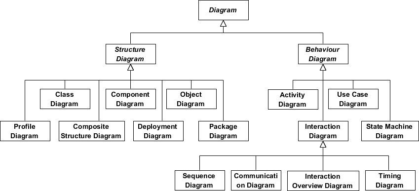

#### 13.1.1 UML 的概念和特点

通用建模语言, 具有创建系统的**静态结构**和**动态行为**等多种结构模型的能力

建立在三种面向对象方法的基础之上：

1. Booch
2. OMT
3. OOSE

**注意**:

- UML 不是可视化程序语言, 而是标准的图形化建模语言
- 不是工具或知识库的规格说明, 而是建模语言规格说明
- 不是过程, 也不是方法, 但允许任何一种过程或者方法使用它
- 与具体实现无关, 可应用于任何语言平台和工具平台
- 与具体过程无关, 可应用于任何软件开发过程

#### 13.1.2 UML 的构成

UML 由 **视图 View**、**图 Diagrams**、**模型元素 Model Elements**、**通用机制 General Mechanism** 组成

1. ##### UML 视图

   五种视图:

   1. ##### 用例视图 (Use Case View)

      - 用户角度看到或需要的系统功能

   2. ##### 逻辑视图 (Logical View)

      - 系统的静态或结构组成及特征。也称为结构模型视图 (Structural Model View) 或 静态视图 (Static View)
        - 包图，类图，对象图

   3. ##### 并发视图 (Concurrent View)

      - 系统的动态或行为特征。也称为模型视图 (Behavioral Model View) 或 动态视图 (Dynamic View)
        - 顺序图 (Sequence Diagram)
          - 按照时间顺序
        - 协作图 (Collaboration Diagram)
          - 按照时间和空间顺序
        - 状态图 (State Diagram)
          - 状态条件和响应
        - 活动图 (Activity Diagram)
          - 系统元素的活动

   4. ##### 组件视图 (Component View)

      - 系统实现的结构和行为特征。也称为实现模型视图 (Implementation Model View)
        - 模型代码库，执行文件，运行库，其他组件

   5. ##### 部署视图 (Deployment View)

      - 系统实现环境的结构和行为特征。也称为环境视图 (Environment Model View) 或 物理视图 (Physical View)

2. ##### UML 中的模型元素

   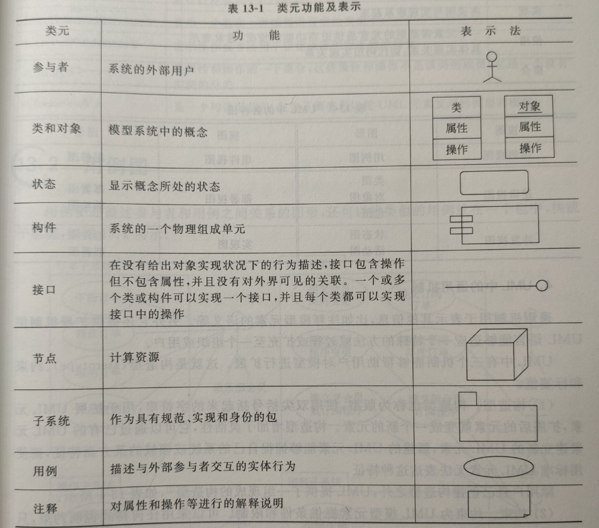

   - 参与者
   - 类和对象
   - 状态
   - 构件
   - 接口
   - 节点
   - 子系统
   - 用例
   - 注释

3. UML 中的图（**五类十种图**）

   1. 用例图
   2. 逻辑视图
      1. 类图
      2. 对象图
      3. 包图
         1. 包
         2. 类
   3. 行为图
      1. 活动图
      2. 状态图
   4. 交互图
      1. 协作图
      2. 顺序图
   5. 实现图
      1. 组件图
      2. 部署图

4. **类元之间关系的功能及表示**

   

   1. 外部链接

      1. 外部链接（External links）是对象之间的基本关系。

   2. ##### 泛化（Generalization）

      1. 即继承的反方向，指的是一个类（称为父类、父接口）具有另外的一个（或一些）类（称为子类、子接口）的共有功能。子类可视为其父类的特例，并可以增加新功能。用带空心三角形箭头的实线表示

   3. ##### 实现（Realization）

      1. 指的是一个 class 类实现 interface 接口（可以是多个）的功能；在 Java 中此类关系通过关键字 implements 明确标识。用带空心三角形箭头的虚线表示。

   4. ##### 依赖关系（Dependency）依赖

      1. 可以简单的理解为一个类 A 使用到了另一个类 B

   5. ##### 关联（Association）

      1. 一个关联（Association）代表一个家族的联系。

   6. ##### 聚合（Aggregate）

      1. 是表示整体与部分的一类特殊的关联关系，是“弱”的包含关系

   7. ##### 组成（Composition）

      1. 组成（Composition）关系，是一类“强”的整体与部分的包含关系

5. UML 中的通用机制

   1. 构造型：版型`<<type>>`
   2. 约束：条件和限制
   3. 标签值：定义属性

### 13.2 用例图

- **描述参与者和用例之间的关系**


#### 13.2.1 参与者

角色

- 系统外部实体
  - 以某种方式参与用例的执行过程
  - 参与者是启动用例的前提, 主动角色和被动角色
  - 指用户扮演的角色

#### 13.2.2 用例

- **用例是用户期望系统执行的具体动作**
  - 椭圆表示

#### 13.2.3 关联

- 参与者和用例之间的关联关系, 用一条实线表示
  - 可以是单向, 也可以是双向
  - 箭头指向被动接受者
  - 可以不带箭头

#### 13.2.4 用例之间关系

1. ##### 包含关系 include

   - 公共步骤提取, 抽象用例 abstract use case

2. ##### 扩展关系 extend

   - 从复杂用例中提取步骤构成新用例, 简化原始用例并扩展其功能
     - extends relationship
     - 指向被扩展的用例
     - 指将扩展用例 extension 的事件流在一定的条件下按照相应的扩展点插入到基础用例中
   - 扩展发生点称为扩展点 extension point
   - 对于包含关系, 子用例中的事件流是一定要插入到基础用例中, 并且插入点只有一个
   - 扩展关系, 根据条件插入, 多个插入点

3. ##### 泛化关系 generalization

   - 继承关系, 用于参与者和用例表示其子项从父项继承的功能
   - 参与者泛化, 两个参与者共同发起一个用例, 公共行为分配给新的抽象参与者, 减少冗余

4. 用例关系准则

   - 用例关系是澄清需求, 不要过度使用用例关系, 不要把用例关系用到编程中
     1. 如果一个用例有几种变体, 那么用抽象用例来建模公共行为, 然后再特化每种变体. 不要简单使用泛化来共享行为片段, 要用包含关系共享行为片段.
     2. 如果一个用例包含一段定义良好且有可能用于其它场合的行为, 则可以把该行为定义成一个用例, 并把该用例包含在原始用例中.
     3. 如果用可选特性来定义一个有意义的用例, 那么要把常规行为定义成基础用例, 用扩展关系来增加特性.

### 13.3 类图和对象图


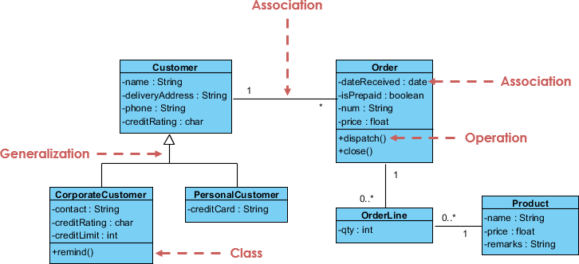

#### 13.3.1 类的定义

- 类模型、对象模型以及他们之间的关系揭示了系统的结构。
  - 类图描述了系统中的类及其相互之间的各种关系
  - 本质反映了系统中对象的**类型**以及对象间的**静态**关系

[UML 类图简明教程](https://segmentfault.com/a/1190000039232402)

- 一个类代表一个概念，它封装了**状态（属性）**和**行为（操作）**。每个属性都有一个类型。

- 每个**操作**都有一个**签名**。_类名是**唯一的必填信息**_。

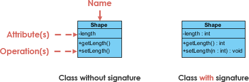

**类名称 (Class Name)：**

- 类的名称出现在第一个分区中。

**类属性 (Attribute)：**描述类的对象（实例）所具有的一系列特性值

- 属性显示在第二个分区中。
- 属性类型显示在冒号后面。
- 属性映射到代码中的成员变量（数据成员）。

**类操作 Operation（方法 Method）：**修改、检索类的属性或执行某些动作

- 操作显示在第三个分区中。它们是班级提供的服务。
- 方法的返回类型显示在方法签名末尾的冒号后面。
- 方法参数的返回类型显示在参数名称后的冒号后面。操作映射到代码中的类方法

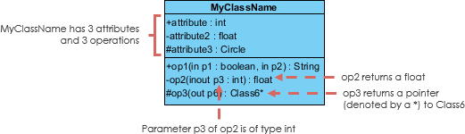

##### 类可见性 (Visibility)

类中属性和操作名称前面的+，-和＃符号表示该属性和操作的可见性。

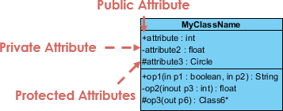

- `+` 表示公共属性或操作
- `-` 表示私有属性或操作
- `＃` 表示受保护的属性或操作

##### 参数方向性 (Parameter Directionality)

操作（方法）中的每个参数都可以表示为 in，**out**或**inout**，它们指定了相对于调用者的方向。该方向性显示在参数名称之前。


##### 类图的观点 (Perspectives of Class Diagram)

透视图的选择取决于您在开发过程中走了多远。例如，在制定**领域模型的过程中**，您很少会超越**概念观点**。**分析模型**通常将**概念和规范观点**混合在一起。**设计模型的**开发通常会从着重于**规范角度开始**，然后演变为**实现角度**。

可以从多种角度解释图：

- **概念 (Conceptual)**：表示领域中的概念
- **规范 (Specification)**：重点是软件中的抽象数据类型（ADT）的接口
- **实现 (implementation)**：描述类将如何实现其接口

视角会影响要提供的详细信息的数量以及值得呈现的关系的种类。如上所述，类名是唯一的必填信息。


#### 13.3.2.1 类之间的关系

##### 类之间的关系 (Relationships)

类可能涉及与其他类的一个或多个关系。关系可以是下列类型之一：

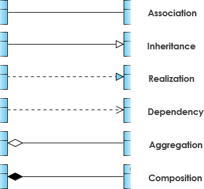

##### 继承 Inheritance（或泛化 Generalization）：

概括是更一般的分类器和更具体的分类器之间的分类学关系。特定分类器的每个实例也是通用分类器的间接实例。因此，特定分类器继承了更通用分类器的特征。

- 表示“是”关系。
- 抽象类名称以斜体显示。
- SubClass1 和 SubClass2 是超类的专业。

下图显示了继承层次结构的示例。SubClass1 和 SubClass2 派生自 SuperClass。关系显示为带有空心箭头的实线，该空心箭头从子元素指向父元素。


##### 继承 (inheritance) 示例-形状

下图显示了具有两种样式的继承示例。尽管连接器的绘制方式不同，但它们在语义上是等效的。

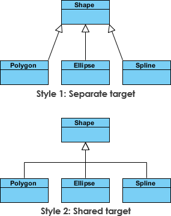

#### 13.3.2.2 类之间的关联

关联指类之间存在相互通信的关系。

1. ##### 普通关联

   - 一对一, 一对多

   - 角色多重性 multiplicity

   - ##### 限定关联

     - 一对多或一对一
     - 简化为一对一或多对一
     - 限定词放在关联关系末端小方框

2. ##### 聚合关联

   1. 组成聚合
      1. 部分与整体共存
      2. 直线加实心菱形表示
   2. 共享聚合
      1. 类与对象之间是整体与部分的关系
      2. 直线加空心菱形

3. ##### 泛化关联

   1. 抽取事务的共有特征
   2. 三角符号指向超类, 表示对子类的泛化
   3. 抽象类, 在类名下方加标记值 `{abstract}`
   4. 抽象操作, 在后面加性质串 `{abstract}`
   5. 接口与抽象类很相似, 但有所不同:
      1. 接口没有属性
      2. 接口没有实现方法

4. ##### 依赖关系

   1. 两模型语义上的连接关系, 其中一个独立, 另一个非独立
   2. 带箭头的虚线连接, 指向独立的类
   3. 虚线带构造型标签, 说明依赖的种类

5. ##### 精化关系

   1. 同一事务, 建立在不同抽象层上的两种描述
   2. 空心三角的虚线表示

6. ##### 派生关联关系

   1. 派生属性, 从其他属性中推演得到的属性
   2. 派生关联, 从其他关联中计算推演得到的关联

##### 关联 (Assoication)

关联是 UML 类图中的类之间的关系。它们由类之间的实线表示。关联通常使用反映真实世界问题域的动词或动词短语来命名。

##### 简单关联

- 两个对等类之间的结构链接。
- Class1 和 Class2 之间存在关联

下图显示了简单关联的示例。有一个连接`<< control >>`类 Class1 和`<< boundary >>`类 Class2 的关联。关系显示为连接这两个类的实线。


##### 基数 (Cardinality)

基数表示为：

- 一对一
- 一对多
- 多对多

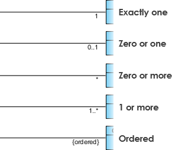

##### 聚合 (Aggregation)

一种特殊类型的关联。

- 它代表关系的“一部分”。
- Class2 是 Class1 的一部分。
- Class2 的许多实例（用\*表示）可以与 Class1 相关联。
- Class1 和 Class2 的对象具有单独的生存期。

下图显示了一个聚合示例。该关系以实线显示，在关联端带有未填充的菱形，该菱形连接到表示聚合的类。


##### 组成 (Composition)

- 一种特殊的聚合，其中的一部分在整体被破坏时会被破坏。
- Class2 的对象与 Class1 一起生存和死亡。
- Class2 不能自立。

下图显示了组成示例。关系以实线显示，在关联端带有实心菱形，该实线与表示整体或合成的类连接。


##### 相依性 (Dependency)

一个类的对象可能在方法的代码中使用另一个类的对象。如果对象未存储在任何字段中，则将其建模为依赖关系。

- 一种特殊类型的关联。
- 如果对一个类的定义进行更改可能会导致对另一类的更改，则该类存在于两个类之间（反之亦然）。
- Class1 取决于 Class2

下图显示了依赖性的示例。该关系显示为带有打开箭头的虚线。


下图显示了依赖关系的另一个示例。Person 类可能具有带有 Book 参数的 hasRead 方法，如果该人已经读过这本书（可能通过检查某些数据库），则该方法返回 true。


##### 实现 (Realization)

实现是蓝图类与包含其各自实现级别详细信息的对象之间的关系。据说该对象实现了蓝图类。换句话说，您可以将其理解为接口和实现类之间的关系。

例如，所有者接口可以指定获取属性和处置属性的方法。Person 和 Corporation 类需要以可能完全不同的方式实现这些方法。

#### 类图示例：订单系统

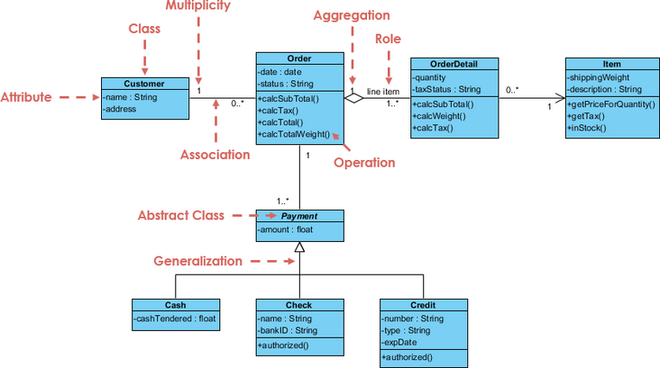

#### 类图示例：GUI

类图可能还具有附加到类或关系的注释。

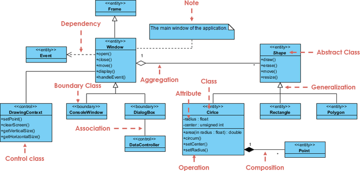

#### 13.3.3 类的版型

- 版型 stereotype : 构造型
  - UML 的三种扩展机制之一, 另外两种扩展机制分别是**标记值 tagged value** 和**约束 constrain**
- 版型可以用于所有类型的模型元素

#### 13.3.4 对象图

- 类图的实例化
  - 对象图相当于快照
  - 对象名首字母小写, 后面跟一个冒号, 后面该对象所属的类名, 整个名字带下划线
  - 除加下划线外, 基本和类图相同

### 13.4 状态图

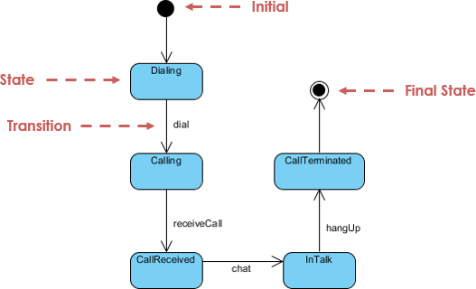

1. **特定对象的复杂行为用状态图**（行为）
2. **一个用例或者一个业务流程用活动图**（流程）
3. **顺序图和协作图体现交互性**（交互）

#### 13.4.1 状态


- 圆角矩形表示
- 状态改变
  - 转移, 用箭头表示, 标出转移条件
- 对象状态:

  1. **初态**: **实心圆**

  2. **终态**: 一对**同心圆**, 内圆实心圆

  3. **中间状态**: **圆角矩形**

     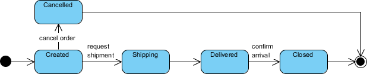

- 状态组成
  - 上: 名称
  - 中: 状态变量名字和值, 可选
  - 下: 活动表, 可选
- 活动表三种标准事件:
  - entry: 进入状态的动作
  - exit: 退出状态的动作
  - do: 在该状态的动作

简单状态机图符号


进入/退出操作

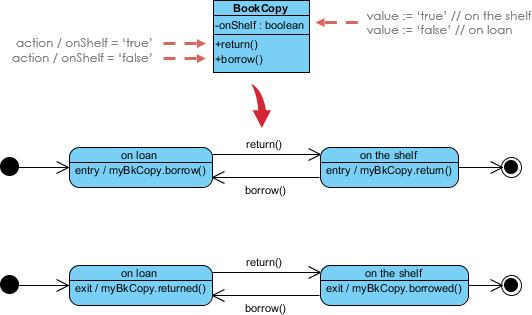

#### 13.4.2 事件

状态转换线上标出触发转换的事件表达式

未标出则执行完自动触发

### 13.5 活动图


活动图描述系统中各种活动的执行顺序，通常用于描述一个操作中所要进行的各项活动的执行流程。

也常被用来描述一个用例的处理流程，或某种交互流程。

1. 商务建模层次
   1. 业务单元级别对更高级别业务过程进行建模
2. 具体处理流程层次
   1. 用例的处理流程
   2. 对低级别的内部类操作进行建模, 表示活动或对象和类之间的过程控制流

#### 13.5.1 活动

- 普通状态：直边圆角

- 活动：也称为活动状态, 圆角矩形表示，标识动作

  - 状态
    - 圆边矩形 或 圆角矩形
  - 特殊状态
    - 开始和结束状态, 表示法和状态图一样
  - 转移
    - 显示状态改变的控制流，可显示状态到活动、活动之间、状态之间的控制流。
    - 转移标记符是执行控制流方向的开放箭头。

#### 13.5.2 泳道

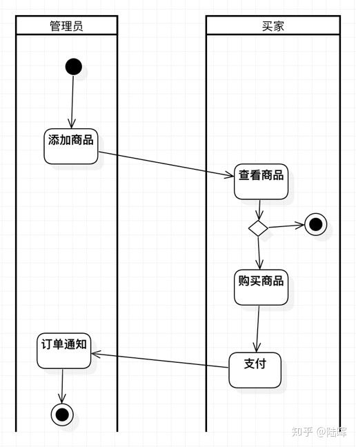

#### 13.5.3 判定点

- 一个活动序列往往要达到某个点，并在该点做出判定或者决策。
  - 一组条件引发一条执行路径，另一组条件则引发另一条执行路径，并且这两条执行路径是互斥的。

- 路径的执行条件: **守卫条件 Guard**


**决策与合并（decision node & merge node）**

UML 引入了决策与合并的模型，用于表达分支流程。


#### 13.5.4 并发路径

- 在对活动建模时，往往需要**将一个转移划分为两个单独的并发执行的路径**，**而后再将它们合并到一起**。
  - 用一个与路径垂直的黑色粗实线表示，分叉的路径从这个实线条引出，而并发活动路径的回合也使用另一粗线条表示。

**分叉与加入（fork node & join node）**

有了决策与合并，看似能覆盖多数场景了，但是还是有一些场景没办法满足，还是看网购的场景，当用户支付成功后，**同时**进行微信提醒和短信提醒。已知的图例没办法表达出**同时**的场景，因此 UML 使用了分叉与加入（ fork&join） 的方式来进行表达。分叉（for）表示流程从这里开始并行出多个子流程，加入（join） 表示子流程从这里汇集，所有子流程完成之后，开始进行下一个流程。

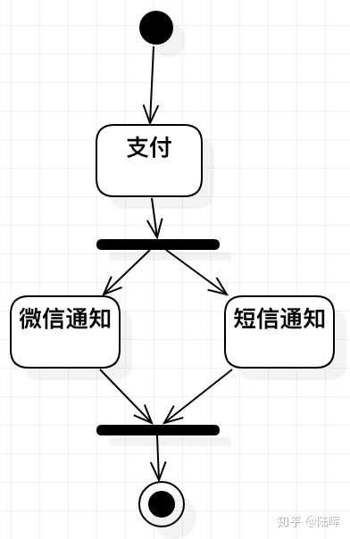

#### 13.5.5 对象流

- 对象可以作为活动的输入输出
- 活动图中的对象流表示活动和对象之间的关系
- 对象流属于控制流, 如果活动之间已有对象流, 则不必重复画控制流

#### 13.5.6 信号

- 活动序列中的活动可以发送信号
  - 信号被接受时, 引起活动发生
  - 发送信号用凸角五边形表示
  - 接收信号用凹角五边形表示
  - 箭头虚线连接

### 13.6 顺序图

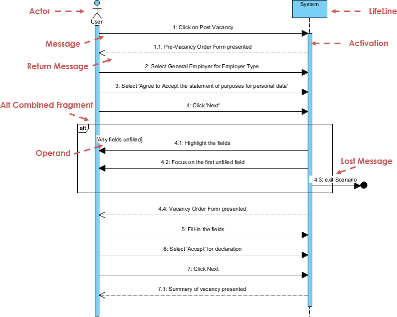

顺序图也称时序图, 描述对象之间的动态交互关系, 着重体现消息的传递时间顺序

建模元素包括:

- 对象
- 生命线
- 激活期
- 消息

#### 13.6.1 顺序图符号

顺序图由一组对象构成, 每个带有一条竖线, 称为生命线, 代表时间轴

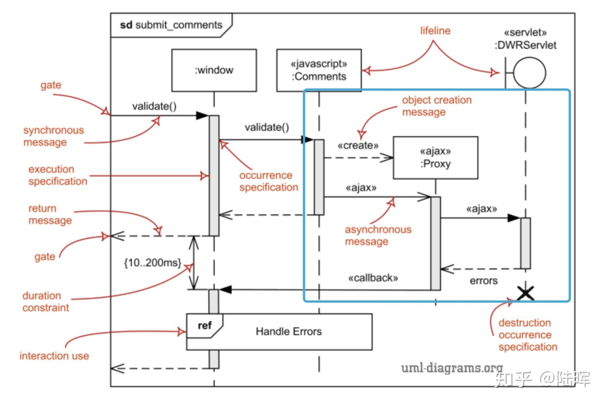

#### 13.6.2 对象

- 三种命名
  1. 对象名和类名
  2. 只显示类名, 匿名对象
  3. 只显示对象名, 不管属于什么类

**对象（lifeline）**

> Lifeline is a named element which represents an individual participant in the interaction. While parts and structural features may have multiplicity greater than 1, lifelines represent only one interacting entity.

[对象](https://link.zhihu.com/?target=https%3A//www.uml-diagrams.org/sequence-diagrams.html%23lifeline)表示**一个具体的实例**对象，敲重点，时序图只表达其中一个实例对象的交互流程，因此如果系统中有多个实例对象，每个实例对象流程有所区别，那么应该画多个时序图。因此时序图表达的是系统某一时段，对象的交互过程。这个对象不仅是一个 class 的实例，也有可能是一个子系统，分布式集群里的某个节点。

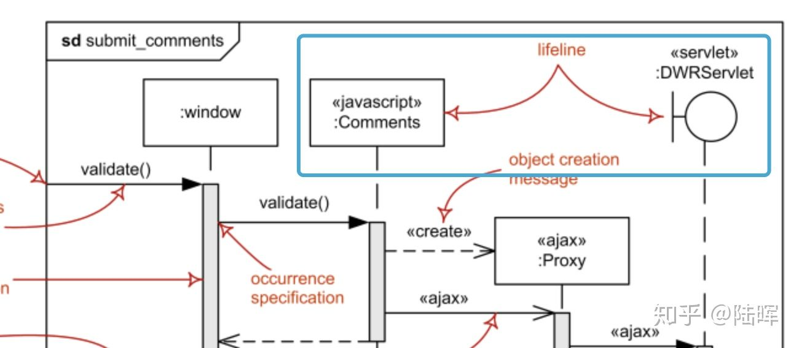

#### 13.6.3 消息

1. 调用消息 procedure call
   - 同步消息
2. 异步消息
3. 返回消息
4. 阻止消息
   - 折返箭头表示
5. 超时消息
   - 箭头上圆圈

**消息（interaction message）**

> Message is a named element that defines one specific kind of communication between lifelines of an interaction. The message specifies not only the kind of communication, but also the sender and the receiver. Sender and receiver are normally two occurrence specifications (points at the ends of messages).

[消息](https://link.zhihu.com/?target=https%3A//www.uml-diagrams.org/interaction-message.html)不代表通讯的协议，只是表明了发送者向接收者进行了一次通讯，可能会代表一次 http 请求，也可能代表一个函数调用。 消息分为[同步消息](https://link.zhihu.com/?target=https%3A//www.uml-diagrams.org/interaction-message.html%23synchronous-call)、[异步消息](https://link.zhihu.com/?target=https%3A//www.uml-diagrams.org/interaction-message.html%23asynchronous-call)、[返回消息](https://link.zhihu.com/?target=https%3A//www.uml-diagrams.org/interaction-message.html%23reply)、[创建消息](<[https://www.uml-diagrams.org/interaction-message.html#create](https://link.zhihu.com/?target=https%3A//www.uml-diagrams.org/interaction-message.html%23create)>)、[删除消息](<[https://www.uml-diagrams.org/interaction-message.html#delete](https://link.zhihu.com/?target=https%3A//www.uml-diagrams.org/interaction-message.html%23delete)>)等

##### 同步消息

顾名思义，就是消息发送后，等待消息的回复。从代码的角度来说，就是执行了一个函数调用，并且等待函数的返回。


##### 异步消息

是指发送了消息后不等待返回，立即处理后续的事情。从代码的角度来说，就是开了另一个线程执行函数调用，不等待函数的返回结果

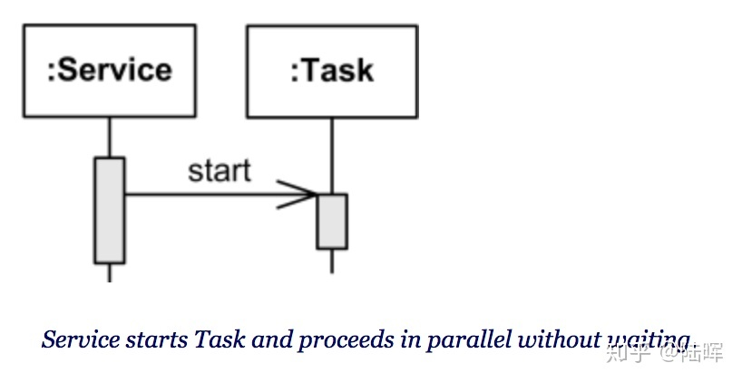

##### 返回消息

表明消息接受者已经处理完消息，把结果返回给发送者。从代码的角度来说，就是 A 调用了 B，B 返回了结果（无论是通过函数返回或函数回调的方式）


##### 创建消息

即创建对象，A 给 B 发送了创建消息，从代码的角度来说就是在 A 的方法里，执行了 `new B()` 的操作


##### 删除消息

和创建对象相反，A 给 B 发送了删除的消息，从代码的角度来说就是在 A 的方法里，执行了 `release B` 的操作，在 C++等手动内存管理的场景会比较好举例，等价于释放了对象的内存

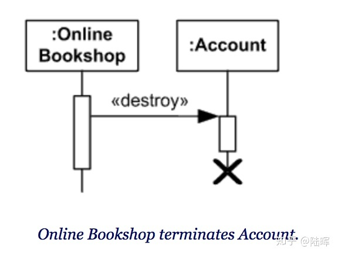

### 13.7 协作图

- 类图和顺序图的交集.


- **描述写作对象之间的交互和链接.**

表示方法:

- 对象用对象图符表示
- 箭头表示消息发送的方向
- 消息执行顺序由消息的编号来表明

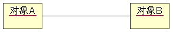


#### 13.7.1 序列化

添加 ID 号, 按照执行顺序排列

#### 13.7.2 迭代

- **非常基本和重要的控制流类型**
  - 迭代可以在协作图中方便的建模，用来指示重复的处理过程。

两种标记符：

- 单个对象发送消息到一组其他对象
  - A→ `*[all]1:Message` →B（重叠矩形）
- 消息从一个对象到另一个对象发送多次
  - A→ `*[1...5]1:Message` →B

#### 13.7.3 控制点条件

- 控制点条件
  - 控制消息的表达式的计算结果限制消息发送
  - 包含在消息中, 在序列 ID 号和消息文本之间

### 13.8 组件图

[什么是组件图](https://www.archimetric.com/%E4%BB%80%E4%B9%88%E6%98%AF%E7%BB%84%E4%BB%B6%E5%9B%BE%EF%BC%9F-what-is-component-diagram/)

组件图将正在开发的实际系统分解为各种高级功能。每个组成部分在整个系统中负责一个明确的目标，并且只在需要知道的基础上与其他基本要素相互作用。

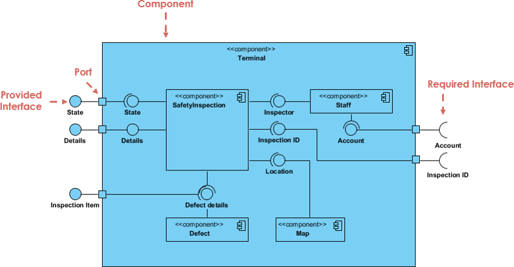

上面的示例显示了更大组件的内部组件：

- 数据（帐户和检查 ID）通过右侧的端口流入组件，并转换为内部组件可以使用的格式。右侧的接口称为必需接口，它表示组件执行其职责所需的服务。
- 然后，数据通过各种连接传递到并通过其他几个组件，然后在左侧的端口输出。左侧的那些接口称为提供的接口，其表示由展示组件提供的服务。
- 重要的是要注意内部组件被一个大的“盒子”包围，它可以是整个系统本身（在这种情况下，右上角不会有组件符号）或整个系统的子系统或组件（在这种情况下，’box’是一个组件本身）。

#### 13.8.1 组件

组件表示系统的模块化部分，其封装其内容并且其表现形式可在其环境中替换。在 UML 2 中，组件被绘制为矩形，其中可选的隔间垂直堆叠。UML 2 中组件的高级抽象视图可以建模为：

1. 带有组件名称的矩形
2. 带有组件图标的矩形
3. 带有构造型文本和/或图标的矩形


#### 13.8.2 依赖关系

子系统分类器是组件分类器的专用版本。因此，子系统表示法元素继承了与组件表示法元素相同的所有规则。唯一的区别是子系统符号元素具有子系统而不是组件的关键字。


##### 港口

使用沿系统边缘的正方形或组件来表示端口。端口通常用于帮助公开组件的必需和提供的接口。

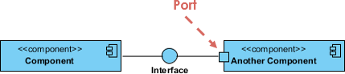

##### 关系

在图形上，组件图是顶点和弧的集合，通常包含组件，接口和依赖关系，聚合，约束，泛化，关联和实现关系。它还可能包含注释和约束。

| 关系                                                         | 符号                                                         |
| ------------------------------------------------------------ | ------------------------------------------------------------ |
| **关联**：关联指定可在类型化实例之间发生的语义关系。它至少有两个由属性表示的末端，每个末尾都与末尾的类型相连。关联的多个末端可能具有相同的类型。 |  |
| **组成**：复合聚合是一种强大的聚合形式，需要一次将一个实例包含在最多一个复合中。如果删除了复合，则通常会删除它的所有部分。 |  |
| **聚合**一种关联，其末尾之一被标记为共享聚合，这意味着它具有共享聚合。 |  |
| **约束**以自然语言文本或机器可读语言表达的条件或限制，用于声明元素的某些语义。 |  |
| **依赖**依赖关系是一种关系，表示单个或一组模型元素需要其他模型元素用于其规范或实现。这意味着依赖元素的完整语义在语义上或结构上依赖于供应商元素的定义。 |  |
| **泛化：**泛化是更通用的分类器和更具体的分类器之间的分类关系。特定分类器的每个实例也是一般分类器的间接实例。因此，特定分类器继承了更通用的分类器的特征。 |  |

#### 13.8.3 接口

在其末尾提供具有完整圆圈的**界面**符号表示组件提供的界面 – 该“棒棒糖”符号是界面分类器的实现关系的简写。

**所需的接口**符号末端只有一个半圆（也称为套接字）表示组件所需的接口（在这两种情况下，接口的名称都放在接口符号本身附近）。


##### 组件图示例 – 使用接口（订购系统）

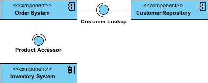

### 13.9 部署图

- 配置图
  - 系统中硬件和软件的物理配置情况及系统体系结构
  - 展示各种组件如何在系统硬件上部署
  - 以及各个硬件之间如何联系
  - 是系统拓扑的最终物理描述

#### 13.9.1 节点

- Node 是指拥有某些计算机资源的物理对象, 两种类型:
  - 处理器是能够执行软件组件的节点
  - 设备是不能执行软件组件的外围硬件, 通常具备与外部的接口
- 节点用立方体表示
- 连接是连接两个立方体的线, 表示节点连接

#### 13.9.2 通信关联

- 节点通过通信彼此关联, 实线表示关联
- 通信关联的版型的标记符与组件依赖关系的版型的标记符相似
  - `<< >>` 表示通信方法或协议

##### TCP/IP 客户端/服务器示例


### 13.10 包图

包图用于简化复杂的类图，可以将类分组到包中。包是逻辑相关的 UML 元素的集合。

- 打包:
  - 分组后的元素放入文件夹
- 组:
  - 命名的包
  - 类名前追加名和双冒号 `::`

包可以用符号表示，下面显示一些示例：

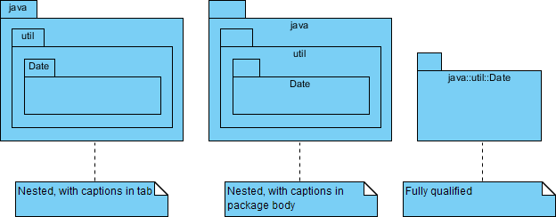

#### 13.10.1 包之间的关系

- 两个包之间三种方式:
  - **泛化**
  - **依赖**
    - 依赖关系涉及两种子类型。它们是 `<<import>>` 和 `<<access>>`。尽管有两种原型
  - **细化**

#### 13.10.2 合并包

- 合并关系是进行合并的包和获得合并操作的包的依赖关系, 合并结果是源包发生了转换

本章小结

思考与练习

## 第 14 章 面向对象需求理解

### 学习目标

- 基于 UML 系统开发的步骤，包括需求理解、系统分析、系统设计和系统实现。
- 用例建模方法及其优缺点。
- 需求用例建模的过程，包括确定业务参与者、确定用例、构造用例图、用例说明及用例模型检查。
- 用例说明包含的要素以及各种类型的用例说明。
- 用例模型检查方法及过程。

### 14.1 基于 UML 的系统开发过程

- 面向对象的系统开发强调的是**迭代开发**和**增量开发**, 不要求一个阶段彻底完成

#### 14.1.1 需求理解

- 面向对象系统开发的首要步骤:
  - 需求调研
  - 了解业务流程及涉及的各类人员
  - 确定系统边界, 识别用例和角色
  - 分析角色和用例的联系, 画出用例图
    - 了解业务过程, 业务过程的活动图
    - 领域分析, 了解主要实体, 构造高层类图
    - 识别协作系统, 建立部署图
    - 发现系统需求, 联合应用开发计划, 细化类图
    - 会议的工作产品是包图, 包代表了系统功能的高层领域
    - 结果提交给客户, 客户认可后继续

#### 14.1.2 系统分析

- 系统分析的任务:
  - 找出系统中所有需求并加以描述, 同时建立特定领域模型
    - 有助于开发人员考察用例, 抽取类, 描述类之间的关系
- 过程:
  - 理解系统用法, 进行高层用例分析
    - 工作产品是 用例图, 涵盖了用例与参与者和用例之间的包含, 扩展关系
  - 充实用例, 分析每个用例中的步骤序列
    - 工作产品是 对每个用例步骤的用例描述
  - 细化类图, 在类图中加入关联名, 抽象类, 多重性, 泛化和聚集
    - 工作产品是 一个细化的类图
  - 分析对象状态变化
    - 工作产品是 状态图
  - 定义对象之间的交互
    - 工作产品是 顺序图和协作图
  - 分析系统与其它协作系统的集成
    - 工作产品是 详细的系统部署图和数据类型

#### 14.1.3 系统设计

- 进一步细化分析阶段的模型
  - 开发和细化对象图
    - 工作产品是 对象图和活动图
  - 开发构件图
    - 工作产品是 构件图
  - 定制部署计划
    - 工作产品是 部署图
  - 设计和开发用户界面原型, 包括与用户进行 JAD 会议
    - 工作产品是 屏幕界面原型
  - 类的包化有助于进行系统结构设计
  - 设计测试
    - 工作产品是 测试脚本
  - 编制文档
    - 工作产品是 文档结构

#### 14.1.4 系统实现

- 主要工作:
  - 编制代码
  - 测试代码
  - 构建用户界面和用户界面到代码的连接与测试
  - 完成文档
  - 编制备份和恢复计划
  - 在硬件上安装最终系统
  - 测试安装后的系统
  - 系统试运行

### 14.2 理解需求

- **用例建模**是常用的理解需求的方法
- 用例方法的特点:
  1. 容易界定系统边界
  2. 将需求分析和设计分离
  3. 用例定义了系统功能的使用环境, 每一个用例描述的是一个完整的系统服务
  4. 根据用例来对目标系统进行测试
- 需求**用例模型**的过程:
  1. 确定业务参与者
  2. 确定业务需求用例
  3. 构造用例模型图（**用例图**）
  4. 记录业务需求用例描述（**用例说明**）

#### 14.2.1 确定业务参与者

- 指所有存在于系统外部并与系统进行交互的人或其它系统

#### 14.2.2 确定用例

- 根据参与者确定系统的用例
- 用例的抽取需要注意:
  1. 用例必须是由某一个角色触发而产生的活动, 即每个用例至少应该设计一个角色
  2. 对于同一个系统, 不同的人对于参与者和用例都可能有不同的抽象结果, 因而得到不同的用例模型
  3. 用例模型是一个团队开发的过程, 在建模过程中必须注意参与者和用例的名称应该符合一定的命名约定

#### 14.2.3 构造用例图

1. 参与者与用例之间的关系，即通信关联。
2. 参与者之间的泛化，用例之间的包含、扩展和泛化关系。

#### 14.2.4 用例说明

1. ##### 用例说明的要素

   1. | 用例说明事项    | 作用和内容                   |
      | --------------- | ---------------------------- |
      | 简要说明        | <u>作用</u>和<u>目的</u>     |
      | 用例场景        | 成功和失败场景               |
      | 事件流          | 基本流和备选流               |
      | 前置条件        | 执行用例前系统必须的状态     |
      | 后置条件        | 执行完毕后系统可能处于的状态 |
      | <u>特殊需求</u> | 非功能性需求和设计约束       |

2. ##### 包含关系的用例说明

   1. 引用被包含的用例

3. ##### 扩展关系的用例说明

4. ##### 泛化关系的用例说明

   1. 抽象共同特点

#### 14.2.5 用例模型检查

1. ##### 需求完备性检查

   1. 功能需求的完备性
   2. 模型是否易于理解
   3. 是否存在不一致性
   4. 避免二义性语义

2. ##### 用例模型的简洁和重用性检查

   1. 是否相互独立
   2. 是否被构建为另一个用例
   3. 是否应该将一个用例的还事件流插入另一个用例的事件流中

3. ##### 管理用例模型复杂度

   1. 用例包
      - UML 中最常用的管理模型复杂度的机制， 包也是 UML 中语义最简单的一种模型元素， 它就是一种容器，在包中可以容纳其他任意的模型元素（包括其它包）
      - 在用例模型中，用构造型 sterotype `<<use case>>` 扩展标准UML 包的语义，这种包叫用例包
      - 用于分类管理用例模型中的模型元素

### 14.3 案例分析 ——电子培训系统的需求理解

14.3.1 分析问题领域

14.3.2 确定 abc e-training 系统范围和系统边界

14.3.3 定义参与者

14.3.4 定义用例

14.3.5 绘制用例图

14.3.6 用例说明

本章小结

思考与练习

## 第 15 章 面向对象分析

### 学习目标

- 面对对象分析和领域建模的概念
- 发现类的四种常用方法
- 关联、属性的意义
- 分析图的应用范围及画法

### 15.1 领域建模

- 面向对象分析中构造的模型主要有两类:
  - **静态模型**
    - 识别问题域中的对象
  - **动态行为模型**
    - 描述系统的行为
- 系统分析的任务是分析系统的所有需求并加以描述, 同时建立特定领域模型, 也称为对象模型
  - 从实际需求抽象出类, 并描述各个类之间的关系
- 对象建模步骤如下:
  1. 研究所有分析的问题领域, 确定系统的需求
  2. 发现对象和类, 明确它们的含义和责任, 确定属性和操作
  3. 发现类之间的静态联系
  4. 设计类与联系
  5. 绘制对象类图并编制相应的说明

#### 15.1.1 发现类

1. ##### 名词短语方法

   - 需求文档中查找名词短语的形式, 每个名词视为候选的类
     - 不相关类
     - 相关类
     - 模糊类
   - 缺点: 大量文本冗长搜索

2. ##### 通用类模式方法 Common Class Pattern

   1. 实体类
   2. 概念类
   3. 事件类
   4. 人员类
   5. 地点类
   6. 缺点: 解决方案不完整, 类名误解

3. ##### 用例驱动方法

   1. UML 建模最被推崇的方法
   2. 自底向上
   3. 缺点: 名词短语相同缺点

4. ##### CRC 方法 Class Responsibility Collaboration

   1. 头脑风暴会议
   2. 类名在最上面, 类的责任在中间, 类的合作者在下面
   3. 适合对其他方法发现的类进行确认, 确定类的特性

5. ##### 混合方法

   1. 综合各自优点
   2. 发现类指南:
      - 目的陈述
      - 对象集样例描述
      - 属性集
      - 类与其它属性分开
      - 操作集

#### 15.1.2 确定关联

- 分析确定关联, 能促使分析员考虑问题域的边缘情况, 有助于发现那些尚未被发现的类和对象
- 三种表现形式:
  1. 普通关联: 导航关系
  2. **聚合关联: 组成聚合, 共享聚合**
  3. 泛化关联: 继承
- 关联说明包括:
  - 关联命名
  - 关联角色命名
  - 关联重数确定

#### 15.1.3 确定属性

- 分析阶段找出重要属性, 不要考虑纯粹用于实现的属性
- 常见的 6 种错误:
  1. 把对象当属性
  2. 把关联类的属性当做一般对象的属性
  3. 把限定误当成属性
  4. 把内部状态当成属性
  5. 过于细化
  6. 存在不一致的属性
- 针对 ATM 业务场景对象建模:
  1. 找出候选的类与对象
  2. 筛选出正确的类与对象
     1. 删除冗余名词
     2. 删除无关名词
     3. 删除笼统名词
     4. 删除作为属性的名词
     5. 删除作为操作的名词
     6. 删除作为实现的名词
  3. 初步确定关联
  4. 筛选关联
- 进一步完善关联:
  1. 检查关联名称
  2. 必要时分解类与对象
  3. 补充新的关联
  4. 标明重数
  5. 确定属性
  6. 确定泛化关系和聚合关系

### 15.2 行为建模

针对主要的用例和对象类, 通过分析系统的行为, 印证和修正系统的静态结构, 满足用户需求, 达到系统目标

动态行为模型也是同步细化用例图和类图的过程.

- UML 动态模型包括
  1. 状态模型
  2. 顺序模型
  3. 协作模型
  4. 活动模型

**顺序图和协作图通常合起来称为交互图**, 强调对象间的合作关系, 通过对象间的消息传递以完成系统的用例

#### 15.2.1 状态图

- 绘制状态图时, 需要确定一个对象生命周期可能出现的全部状态, 确定引起状态转移的时间以及将会发生的动作
- 状态图的建立步骤如下:
  1. 确定状态机, 可以是一个类, 子系统或整个系统
  2. 选择初始状态可能发生的转移
  3. 发现对象的各种中间状态
  4. 确定状态可能发生的转移
  5. 找出触发状态转移的事件
  6. 绘制状态图
  7. 细化状态图中的可选项( 状态变量, 活动表等)

#### 15.2.2 活动图

- 描述两个层面的活动:
  - 一个用于描述**用例场景**
  - 另一个用于描述**对象交互**
- 活动图是对系统业务流程的描述, 涉及活动的对象, 动作状态, 动作流以及对象流等
- 建立活动图步骤:
  1. 找出负责实现工作流的业务对象
  2. 确定工作流的初始状态和终结状态, 确定工作流的边界
  3. 从工作流的初始状态开始, 找出随事件发生的活动动作, 表示成活动状态或动作状态
  4. 复杂动作或重复动作, 组成一个活动状态, 用另一个活动图展开来表示
  5. 给出连接活动和动作的转移
  6. 在活动图中给出与工作流有关的重要对象, 虚箭线连接

#### 15.2.3 顺序图

- 顺序图描述用例中的交互活动, 确定参与交互活动的对象和类和交互事件
- 顺序图建立步骤:
  1. 找出参与交互的对象角色, 横向排列在顺序图顶部, 重要对象在左边, 交互密切的对象相邻. 交互创建的对象垂直安置在创建的时间点处
  2. 每个对象设置一条垂直向下的生命线
  3. 从初始化交互的信息开始, 自顶向下在对象的生命线之间安置信息
  4. 在生命线上绘出对象的激活期
  5. 根据消息之间的关系, 确定循环结构及循环参数的出口条件

### 15.3 案例分析 ——网上商店客户订单处理系统分析

15.3.1 用例图

15.3.2 活动图

15.3.3 类模型

15.3.4 顺序图

15.3.5 状态图

本章小结

思考与练习

## 第 16 章 面向对象设计

### 学习目标

- 以下面对对象设计的术语：
  - 控制器、耦合、内聚、协作图、设计类图、组件图、部署图、关联、导航、包、泛化以及聚合。
- 通用职责分配软件模式（GRASP），GRASP 中的几种模式及其应用。
- 协作图、设计类图、组件图、部署图等 UML 模型图。
- 接口设计的原则。
- 包的概念和设计原则。
- 从 UML 图映射到数据库表的过程并能完成整个数据库的设计。
- 关系约束检查策略。

### 16.1 系统设计与 UML

OOA 是提取和整理用户需求并建立问题域模型的过程.

OOD 是分析阶段得到的需求转变成符合成本和质量要求的, 抽象的系统实现方案的过程

- **面向对象分析与面向对象设计的区别**:
  1. 在侧重点上，面向对象分析侧重于**理解问题**，描述软件要做什么，而面向对象设计侧重于理解**解决方案**，描述软件要如何做。
  2. 面向对象分析一般只考虑**理想设计**，不关心技术和实现层面的细节，而面向对象设计需要得到更**具体、更详尽**，更接近于真实的代码的设计方案。
  3. 在设计结果的描方式上，面向对象分析阶段侧重于**描述对象的行为**，而面向对象设计阶段侧重于**描述对象的属性和方法**。
  4. 面向对象分析只**关注功能性需求**，而面向对象设计**既关注功能性需求，也关注非功能性需求**。
  5. 面向对象分析产生的系统模型通常**规模较小**，而面向对象设计产生的系统模型**规模较大**，内容也比较详尽、完整。

#### 16.1.1 系统设计的主要任务

- 主要任务:

  - 定义真实用例

  - 定义报告, 用户界面

  - 精化系统体系结构

  - 定义交互图

  - 定义设计类图

    定义数据库模式

#### 16.1.2 协作图

- 职责的确定和分配是在绘制协作图的语境中进行的
  - 一个类图的方法描述能够总结职责分配结果，职责的履行通过方法调用来具体实现。
- 协作是对象之间的相互请求, 描述了实现某些行为的一组对象之间的相互作用
  - 结构: 角色集合及其关系
  - 行为: 消息集合
- 绘制协作图步骤:
  1. 找出参与交互的对象角色, 作为图形的节点安置在协作图中. 重要在中间, 交互的放附近.
  2. 设置对象的初始性质
  3. 说明对象之间的关联
  4. 从初始化交互的消息开始, 在链接上安置相应的消息, 给出消息的序号
  5. 处理一些特殊情况, 循环, 自调用, 回调, 多对象等

#### 16.1.3 组件图

- 系统实现的源代码、二进制码、执行码可以按照模块化思想，用组件分别组织起来，明确系统各部分的功能职责和软件结构。
  - 组件是软件系统的一个物理单元，作为一个或多个类的软件实现，软件驻留在计算机中，提供与其它组件之间的接口。
  - 数据文件、表格、可执行文件、文档和动态链接库等都可以定义为组件。
  - 组件最重要的特征是具有潜在的复用性
- 组件图的绘制步骤:
  - 确定组件
  - 对组件加上必要的构造型
  - 确定组件之间的联系
  - 必要时把组件组织成包
  - 绘制组件图

#### 16.1.4 部署图

- 实施模型，将应用程序的各部分在物理结构上进行安装和部署。
  - 部署模型与运行环境有关，也与应用程序有关，在建立部署模型时，需要从应用程序本身和运行环境两个方面的要求来分析，结合分析结果共同绘制部署模型。
- 部署图的绘制步骤:
  1. 确定节点
  2. 对节点加上必要的构造型
  3. 确定联系
  4. 绘制部署图

### 16.2 通用职责分配软件模式

General Responsibility Assignment Software Pattern, GRASP

- 职责是一个类或者类型的契约或者义务, 两类:
  - 知道型职责
    - 对象需要了解或者获得一些信息
  - 做型职责
    - 对象完成某种动作行为或者和其它对象协作完成某个动作行为

#### 16.2.1 专家模式

- 如果发现某个类拥有完成该职责需要的信息(数据), 那么这个职责应该分配给这个类来实现和承担
  - 信息专家尽可能单一职责
- 优点:
  1. 使类保持良好的封装性, 低耦合
  2. 职责和信息分配在各个类中, 高内聚, 容易维护

#### 16.2.2 创建者模式

- 确定创建对象的职责具体由哪个类来承担
- 满足下列条件, 则认为类 A 是类 B 的实例创建者, 即由类 A 创建类 B 的对象实例
  - A 是 B 的聚合( 类 A 中包含类 B 的对象实例)
  - A 是 B 的容器( 类 B 对象的实例在类 A 产生的容器中运行)
  - A 持有发起 B 的信息
  - A 记录 B 的实例
  - A 频繁调用 B 类中的方法
- 优点:
  - 封装对象创建逻辑的细节
  - 封装创建逻辑的变化

#### 16.2.3 控制器模式

- 将处理系统事件消息的职责分派给特定的类
  - 该类接受请求消息并控制或协调请求的处理, 哪个类负责处理一个系统事件
  - 控制器是处理系统事件的非用户界面类对象, 控制器定义了系统操作方法
- 应用系统中的控制器:
  1. 全局控制器: 应用系统的外观控制器
  2. 局部控制器: 用例或会话级别的控制器
- 如果运用面向对象设计方法, 必须选出控制器处理输入事件
- 一个用例中所有系统事件都应该由一个控制器处理, 以维持状态信息, 识别出错的系统事件

#### 16.2.4 低耦合模式

耦合是衡量系统中一个元素( 如类, 子系统) 与其他元素关系强弱的尺度, 两个类之间的关系紧密程度代表了类之间的耦合程度

- 如果两个类之间存在控制关系, 调用关系, 数据传递关系等, 则存在耦合关系:
  - X 属性引用 Y 的实例
  - X 对象调用 Y 对象的服务
  - X 方法引用 Y 的实例(参数, 局部变量, 返回值)
  - X 是 Y 的直接或间接子类
  - Y 是接口, 而 X 是实现 Y 的接口
- 独立, 修改影响小, 提高软件生产效率

#### 16.2.5 高内聚模式

- 高内聚模式能够使系统中各个模块之间的尽可能充分合作,
  - 即充分考虑和协调各个类的职责之间的相关度和集中度,
  - 而不是由几个包揽所有功能的超级类完成

### 16.3 类的设计

#### 16.3.1 设计类

- **实体类**
  - 表示业务领域内的实际数据的类
  - 实体类承载业务信息特别是需要持久储存到数据库中的数据
  - 实体对象的抽象，通常来自域模型（现实世界），用来描述具体的实体，通常映射到数据库表格与文件中。
  - 
- **接口类**
  - 位于系统与外界的交界处（又称边界类），表示用户与系统接口的交互方式。
  - 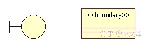
- **控制类**
  - 应用或者业务规则逻辑，应用程序的执行逻辑
  - 

#### 16.3.2 设计关系

1. ##### 依赖关系

   - 一个变化出现在一个类中, 它可能会影响另一个类
   - 一个持久类和一个临时类之间的关系

2. ##### 导航能力

   - 类之间的关联关系默认是双向的, 意味着一类对象可以导航(发送消息)到另一类对象

3. ##### 属性与方法的可见性

   - UML 提供了三个层次的可见性:
     - 公共可见性 (`+`)
     - 保护可见性 (`#`)
     - 私有可见性 (`-`)

4. ##### 对象责任

   - 对象收到请求时必须提供服务, 必要时需要与其他对象一同协助以满足请求

#### 16.3.3 设计类图

- 确定系统中各个类及类中的成员, 添加方法, 定义对象之间的消息传递, 产生的类图为设计类图
- 设计类图的创建依赖两个模型:
  - 协作图
  - 概念模型
- 设计类图包含信息:
  - 类, 关联, 属性
  - 接口和操作
  - 方法
  - 属性类型信息
  - 导航
  - 类(接口) 等元素之间依赖关系
- 建立设计类图的步骤如下:
  - 分析协作图, 识别类, 补充到类图
  - 分析协作图添加类图的方法, 为属性和烦那个发添加类型信息
  - 在类图中添加关联, 支持必要的类可见性
  - 关联上添加导航箭头, 指明属性可见性的方向
  - 添加依赖关系连线, 指明废属性的可见性

步骤:

1. 添加方法名
2. 添加关联和导航

### 16.4 接口设计

#### 16.4.1 单个对象的接口设计

- 单个对象通常是封装某种算法的对象

#### 16.4.2 多个对象的接口设计

- 行为相似而内容不同的对象
  - 将相同的操作方法提取出来形成接口

#### 16.4.3 层次之间接口设计

- 应用分层的目的是使各软件层职责清晰, 各施其职
- 门面模式: Facade 外观模式
  - 处理表现层和业务逻辑层之间的交互可以有效减少交互复杂度, 层次之间保持清晰关联

### 16.5 包设计

用于在物理上组织和管理类文件的包装器

包的作用是将类文件按照一定顺序有序的放置在一起

#### 16.5.1 包设计原则

1. 自顶向下原则
2. 职责集中原则
3. 互不交叉原则

#### 16.5.2 包设计步骤

1. 设计软件**层次包**: 自顶向下
2. 设计软件**模块包**: 职责集中
3. 设计软件**代码包**: 互不交叉

### 16.6 数据库设计

对象数据库, 不需要持久化机制

关系数据库需要关系服务

#### 16.6.1 UML 类图映射为库表的原则

1. ##### 类和属性的实现

   类图映射为数据库表的基本原则如下:

   1. 将类直接或间接映射成表
   2. 将类的属性映射成表单字段
      1. 不是类中的所有属性都是永久的
      2. 类中的属性是单值的, 单如果在类中存在多值属性, 则该属性映射成多个字段
   3. 将类图中的属性类型映射成表的域

2. ##### 关联的实现

   1. 一对一
   2. 一对多
   3. 多对多

3. ##### 泛化的实现

   1. 将整个类层次映射为单个数据库表, 即为基类和子类共建一张表
   2. 每个具体子类映射成单个数据表
   3. 每个类均映射为数据库表

4. ##### 聚合的实现

5. ##### 递归关联

#### 16.6.2 关系约束检查策略

1. 父表操作的约束
2. 字表操作的约束

本章小结

思考与练习

## 第 17 章 面向对象实现

### 学习目标

- 面向对象实现的两项工作
  - 将设计映射到代码：
    - 实现从设计类图到类的定义、从协作图到类方法的转换。
  - 面向对象程序设计：
    - 包括设计过程中设计的三个原则以及详细准则等。
- 完成程序设计后的进行测试：包括测试的目的、作用、几种不同的测试策略等。

面向对象设计结果翻译成用某种程序语言书写的面向对象程序

测试并调试面向对象程序

面向对象程序的质量基本上由面向对象设计的质量决定， 采用的程序语言的特点和程序设计风格也将对程序的可靠性、可重用性及可维护性产生很大影响。

软件测试任然是保证软件可靠性的主要措施。

### 17.1 设计映射到代码

#### 17.1.1 根据设计类图创建类的定义

设计类图中至少应该描述类名, 超类, 方法特征标记和简单的类属性

#### 17.1.2 根据协作图创建方法

### 17.2 面向对象程序设计

#### 17.2.1 可重用原则

1. 提高方法的内聚性
2. 减小方法的规模
3. 保持方法的一致性
4. 把策略和实现分开
5. 全面覆盖
6. 尽量不适用全局信息
7. 利用继承机制

#### 17.2.2 可扩充原则

1. 封装实现策略
2. 不要用一个方法遍历多条关联链
3. 避免使用多分支语句
4. 精心确定公有方法

#### 17.2.3 健壮性原则

1. 预防用户操作错误
2. 检查参数的合法性
3. 不要预先确定限制条件
4. 先测试后优化

### 17.3 面向对象测试策略

- 传统层次测试基于功能模块的层次结构
- 面向对象软件测试中：
  - **继承和组装关系**刻画了类的内在层次，既是**构造系统结构**的基础，也是**构造测试结构**的基础。

#### 17.3.1 单元测试

- 面向对象软件的类测试就是验证类的实现是否和该类的规格说明完全一致
  - 类中包含的方法, 测试类状态
- **类测试:**
  1. 基于服务的测试:
     - 测试类中的每一个方法
  2. 基于状态的测试:
     - 测试类的实例在其生命周期各个状态下的情况
  3. 基于响应状态的测试:
     - 从类和对象的责任触发, 以外界向对象发送的消息序列来测试对象的各个响应状态

#### 17.3.2 集成测试

- 在该测试阶段需要对类间的协作进行测试
  - 基于场景的测试
  - 行为测试

#### 17.3.3 系统测试

- 最后阶段的测试, 主要以用户需求为测试标准, 需要参考面向对象分析和面向对象分析测试的结果
  - 测试大纲法
  - 操作场景为重点的用例方法

#### 17.3.4 回归测试

1. 面向对象的回归测试不再作为一个独立阶段, 而是以增量的方法进行, 采用层次增量的测试模型

#### 17.4 设计测试用例

1. 确定测试用例场景
2. 确定测试执行路径
3. 设计并执行测试用例

本章小结

思考与练习

## 附录：题型举例

### 一、单向选择题

1、不属于白盒测试的技术是（ ）
A、路径覆盖 B 、判定覆盖 C 、循环覆盖 D 、边界值分析
2、（ ）可以看作类图和顺序图的交集
A、协作图 B 、组件图 C 、部署图 D 、活动图

### 二、填空题

1、封装是把对象的 **\_\_\_**结合在一起，组成一个独立的对象
2、系统生命周期包括了系统规划、系统分析、 \***\*\_\*\***和系统实施。

### 三、判断题

1、系统构造人员的主要任务是将业务需求转换成课实现的技术方案，形成技术
蓝图》。 （ ）
2、弱实体一定是关联实体，但关联实体不一定是弱实体。（ ）

### 四、简答题

1、请写出 UML 系统开发的步骤。
2、请简述原型法开发过程的步骤。

### 五、设计题

请根据以下描述设计某图书管理系统的 E-R 图。
在一个图书馆管理系统中， 每一个学生可以借多本图书。 学生的属性有学号、
姓名、性别。图书的属性有编号、书名、作者。学生每次借阅图书时，都要登记
借出日期；学生每次归还图书时，都要登记归还日期。
要求：
（1）根据上述语义画出 ER 图，要求在图中画出实体的属性并注明联系的类型；
（2）试将 ER 模型转换成关系模型。


# 考纲 02376

>  ## Ⅰ 课程性质与设置目的的要求
>
>  ### 本书共分三部分：
>
>  - 第 1 章至第 3 章是一般章， 主要介绍信息系统的概念、主要开发方法以及贯穿项目生命周期的项目管理技术；
>  - **第 4 章至第 11 章是重点章，讲述系统开发各阶段的任务、过程、结构化方法和工具；**
>  - 第 12 章至第 17 章是次重点章，讲述面向对象需求理解、面向对象分析、面向对象设计和面向对象实现。
>
>  ### （一）课程性质和特点
>
>  信息系统开发是高等教育自学考试考试计划中的一门专业课，研究信息系
>  统的开发。信息系统开发有较强的理论性和实践性， 本书以整个信息系统开发生
>  命周期为主线，重点围绕结构化方法和面向对象开发方法，详细阐述系统规划、
>  系统分析、 系统设计、 系统实施以及系统运行与支持等各阶段的主要内容， 并介
>  绍了项目管理工具以及系统分析、设计的 case 等，强调信息系统开发的基本技
>  能，培养学生使用开发信息系统的实践能力。在每章之后提供了典型应用案例、
>  思考题和练习题，使学生加深对系统开发的理解。 Sybase PowerDesigner 是一
>  种具有强大功能、 简便操作的信息系统建模工具， 被广泛被用于信息系统的设计
>  与开发中。因此，本课程学习具有较强的应用性和针对性。
>
>  ### （二）本课程的基本要求（课程总目标）
>
>  通过本课程的学习，要求达到以下“知识”和“技能”两方面目标。
>  知识方面：理解信息系统的基本概念和理论，搞懂信息系统的特点和方法，
>  学会信息系统的开发。
>  技能方面：掌握信息系统开发的方法， PowerDesigner 的使用和操作，在计
>  算机环境下创建信息系统原型，对一些实际问题进行信息系统开发。
>  Sybase PowerDesiger 是一个集成化的企业级建模以及设计解决方案，它能
>  帮助设计人员快速、 高效地进行企业应用系统各种分析与设计模型的构建， 可以
>  完成从定义业务需求到分析和设计整个流程的工作， 并集成了对多种常用数据库
>  系统和 Java、.NET、PowerBuilder 和 Web Services 等开发平台与技术的内在支
>  持。
>  本课程内容主要包括信息系统开发概述、信息系统开发路线、方法与工具、
>  信息系统项目管理、需求获取、过程建模、数据建模、应用架构设计、软件过程
>  设计、数据库设计、输入输出与用户界面设计、系统实现与运行、面向对象开发
>  概述、UML 、面向对象需求理解、面向对象分析、面向对象设计、面向对象实现。
>  对于系统开发各阶段的任务、过程、结构化方法和工具进行了详细的介绍。
>
>  ### （三）本课程与相关课程的联系、分工或区别。
>
>  《信息系统开发 - 方法、案例与实验》是一门涉及计算机多种知识的信息管
>  理与信息系统类课程。 信息系统开发需要在操作系统支持下工作。 由于本课程是
>  基于 Windows 操作系统介绍 PowerDesigner 的使用操作的，所以要求学过计算机
>  先导课程《计算机应用技术》，特别是其中的 Windows 操作系统得使用部分。在
>  学习信息系统开发的数据库、 数据字典和数据流程时， 需要接触到一些初步的数
>  据库和程序设计知识，这是以《关系数据库设计》课程为基础。
>  本书共分三部分： 第 1 章至第 3 章是一般章， 主要介绍信息系统的概念、 主
>  要开发方法以及贯穿项目生命周期的项目管理技术； 第 4 章至第 11 章是重点章，
>  讲述系统开发各阶段的任务、 过程、结构化方法和工具； 第 12 章至第 17 章是次
>  重点章，讲述面向对象需求理解、 面向对象分析、面向对象设计和面向对象实现。
>
>  ## Ⅱ 课程内容与考核目标
>
>  ### 第 1 章 信息系统开发概述
>
>  ### （一）学习目的与要求
>
>  （1）掌握系统的基本概念和组成
>  （2）理解系统开发的基本过程，系统开发各阶段的主要内容
>  （3）了解围绕信息系统开发主要过程的角色分配
>
>  ### （二） 课程内容
>
>  1.1 信息系统的基本概念
>  1.2 信息系统开发过程
>  1.3 信息系统的相关角色
>  1.4 案例分析——校园二手书交易平台的设计与实现
>
>  ### （三）考核知识点
>
>  1、信息系统
>  2 、信息系统生命周期
>  3、信息系统的相关角色
>  4、系统开发案例分析
>
>  ### （四）考核要求
>
>  1、信息系统
>
>  （1）领会：系统的概念与九大要素
>  （2）领会：信息系统的概念与九大要素
>  （3）识记：信息系统的结构和类型
>  （4）领会：各类信息系统之间的联系与区别
>  2、信息系统生命周期
>  （1）识记：信息系统生命周期的五个阶段
>  （2）领会：信息系统生命周期五个阶段的主要任务
>  3、信息系统的相关角色
>  简单应用：信息系统的各个角色
>  4、系统开发案例分析
>  综合应用：系统开发案例的设计与实现
>
>  ### 第 2 章 信息系统开发路线、方法与工具
>
>  （一） 学习目的与要求
>  （1）掌握几种典型的信息系统开发路线
>  （2）掌握合适的开发路线与方法
>  （3）掌握自动化工具与技术
>  （二） 课程内容
>  2.1 信息系统开发路线概述
>  2.2 模型驱动开发路线
>  2.3 快速应用开发路线
>  2.4 商用软件开发路线
>  2.5 选择合适的开发路线与方法
>  2.6 自动化工具与技术
>  2.7 案例分析—— case 工具在系统开发中的应用
>  （三）考核知识点
>  1、信息系统开发路线
>  2 、模型驱动开发路线
>  3、快速应用开发路线
>  4、商用软件包
>  5、开发路线与方法的选择
>  6、CASE
>  （四）考核要求
>  1、信息系统开发路线
>  简单应用：信息系统各种开发路线
>  2、模型驱动开发路线
>  综合应用：模型驱动开发的三种方法及它们之间的比较
>  3、快速应用开发路线
>  （1）识记：快速应用开发路线的两种开发方式
>  （2）识记：原型方法的三种类型
>  （3）简单应用：原型设计和开发的具体步骤
>  （4）领会：极限编程方法的步骤和特点
>  4、商用软件包
>  （1）简单应用：商业应用软件包开发路线的基本思想
>  （2）简单应用：选择商业软件包的两种方式及其步骤
>  （3）领会：现成软件包二次开发的优缺点
>  5、开发路线与方法的选择
>  简单应用：选择开发路线与方法的原则
>  6、CASE
>  （1）领会： CASE 的工具分类及特点
>  （2）综合应用： CASE 工具在系统开发中的应用
>
>  ### 第 3 章 信息系统项目管理
>
>  （一） 学习目的与要求
>  （1）了解信息系统项目的管理过程
>  （2）了解作为高效的项目经理所需要的技能
>  （3）掌握项目发起、项目规划、项目执行和项目终结个阶段的主要任务及活动
>  （4）掌握关键路径规划的含义和甘特图和网络图的创建过程
>  （5）理解项目管理软件如何应用于支持项目进度的表示和管理
>  （二） 课程内容
>  3.1 信息系统项目管理生命周期
>  3.2 项目组织
>  3.3 项目管理技术
>  3.4 案例分析——某系统开发项目管理失败原因分析
>  （三）考核知识点
>  1、信息系统项目管理过程
>  2、项目组织
>  3、工作分解结构
>  4、关键路径规划
>  5、甘特图和网络图
>  6、项目管理软件
>  7、项目经理技能
>  （四）考核要求
>  1、信息系统项目管理过程
>  （1）领会：信息系统项目管理过程的四个阶段及其核心
>  （2）综合应用：项目发起、项目规划、项目执行和项目终结个阶段的主要任务
>  及活动
>  2、项目组织
>  简单应用：项目组织的三种形式及各自的优缺点
>  3、工作分解结构
>  简单应用：工作分解结构的各种方式和分解原则
>  4、关键路径规划
>  领会：关键路径规划的含义
>  5、甘特图和网络图
>  简单应用：甘特图和网络图的创建过程
>  6、项目管理软件
>  综合应用：项目管理软件如何应用于支持项目进度的表示和管理
>  7、项目经理技能
>  综合应用：作为高效的项目经理所需要的技能
>
>  ### 第 4 章 需求获取
>
>  （一） 学习目的与要求
>  （1）掌握怎样设计并执行访谈的选择，制定访谈计划
>  （2）掌握观察工作者方式和分析业务文档方式以确定系统需求的优缺点
>  （3）了解如何为需求获取提供支持
>  （4）了解怎样计划一个联合应用设计会议
>  （5）掌握在需求获取过程中使用原型
>  （6）了解确定需求的现代化方法
>  （7）掌握需求获取技术在网络应用开发中的应用
>  （二） 课程内容
>  4.1 系统需求概述
>  4.2 需求获取过程
>  4.3 需求获取的方法
>  4.4 案例分析——客户关系管理系统的需求获取
>  （三）考核知识点
>  1、系统需求分类和获取
>  2 、系统需求获取方法
>  3、需求获取技术的应用
>  （四）考核要求
>  1、系统需求分类和获取
>  （1）识记：系统需求的分类
>  （2）简单应用：系统需求的获取过程
>  2、系统需求获取方法
>  （1）简单应用：收集系统需求的方法
>  （2）综合应用：计划并执行访谈的选择，以及制订访谈计划以确定系统需求
>  （3）简单应用：观察工作者方式和分析业务文档方式以确定系统需求的优缺
>  点
>  （4）简单应用：计算如何为需求获取提供支持
>  （5）综合应用：在需求获取过程中使用原型
>  （6）综合应用：确定需求的现代化方法
>  3、需求获取技术的应用
>  综合应用：需求获取技术应用于网络应用的开发
>
>  ### 第 5 章 过程建模
>
>  （一） 学习目的与要求
>  （1）掌握逻辑过程建模
>  （2）掌握数据流图的绘制
>  （3）掌握数据流图的分解
>  （4）理解平衡高层和底层数据流图
>  （5）了解 4 种类型的数据流图之间的区别
>  （6）掌握使用数据流图作为工具以支持信息系统的分析
>  （二） 课程内容
>  5.1 过程建模概述
>  5.2 数据流图
>  5.3 过程逻辑
>  5.4 数据字典
>  5.5 案例分析——百货商店业务管理信息系统过程建模
>  （三）考核知识点
>  1、数据流图
>  2 、过程逻辑
>  3、数据字典
>  （四）考核要求
>  1、数据流图
>  （1）识记：数据流程图的概念、作用 和基本符号
>  （2）简单应用：数据流图的绘制
>  （3）简单应用：数据流图的规则
>  （4）领会：数据流图的分解
>  （5）简单应用：数据流图的平衡
>  （6）领会： 4 种类型的数据流图之间的区别
>  （7）综合应用：使用数据流图作为工具，支持信息系统的分析
>  2、过程逻辑
>  （1）识记：过程逻辑的表述方法
>  （2）识记：结构化语言的表示方法
>  （3）简单应用：构造决策表的基本步骤
>  （4）简单应用：决策树的绘制
>  （5）综合应用：三种描述工具各自的适用性
>  3、数据字典
>  （1）领会：数据字典的内容
>  （2）领会：数据字典的作用
>  （3）简单应用：数据字典的描述格式
>
>  ### 第 6 章 数据建模
>
>  （一） 学习目的与要求
>  （1）掌握数据模型的一些术语
>  （2）掌握实体 - 联系图的绘制
>  （3）了解概念数据建模在整个信息系统分析和设计中的作用
>  （4）理解一元联系、二元联系和多元联系的差异
>  （5）理解 E-R 图与类图在数据建模中的性能差别
>  （6）掌握将数据建模与过程建模、逻辑建模联系起来，作为描述信息系统的各
>  种视图
>  （二） 课程内容
>  6.1 数据建模相关概念
>  6.2 逻辑数据建模过程
>  6.3 规范化
>  6.4 数据- 过程模型映射
>  6.5 案例分析——某网上商店概念数据建模
>  （三）考核知识点
>  1、数据建模相关概念
>  2 、逻辑数据建模过程
>  3、规范化
>  4、数据 - 过程模型映射
>  （四）考核要求
>  1、数据建模相关概念
>  （1）识记：实体类型、属性、多值属性、子集准则、联系、度、基数、业务规
>  则、关联实体等术语概念
>  （2）简单应用：绘制 E-R 图弱实体来描绘业务中的数据特性与关联
>  （3）综合应用：一元联系、二元联系和多元联系的区别
>  （4）综合应用：概念数据模型在整个信息系统分析与设计中所起的作用
>  （5）简单应用：概念数据模型中的 4 种基本业务规则
>  2、逻辑数据建模过程
>  综合应用：逻辑数据建模过程
>  3、规范化
>  （1）简单应用：数据模型设计的标准
>  （2）识记：第一、二、三范式的定义以及设计这些范式的基本方法
>  4、数据 - 过程模型映射
>  综合应用：数据模型与过程模型之间的映射
>
>  ### 第 7 章 应用架构设计
>
>  （一） 学习目的与要求
>  （1）掌握系统应用架构的定义
>  （2）理解应用架构与框架的异同
>  （3）了解典型的系统应用架构及其特点
>  （4）了解怎样选择有效的应用架构设计方式
>  （二） 课程内容
>  7.1 架构概述
>  7.2 典型的系统应用架构
>  7.3 应用架构举例
>  7.4 应用架构设计内容
>  7.5 案例分析——某服务台系统架构设计
>  （三）考核知识点
>  1、系统应用架构
>  2 、典型的系统应用架构
>  3、MVC 架构
>  4、应用架构设计
>  5、系统架构设计应用
>  （四）考核要求
>  1、系统应用架构
>  （1）识记：系统应用架构的定义
>  （2）简单应用：系统应用架构的框架
>  （3）领会：构架的逻辑层次及其作用
>  2、典型的系统应用架构
>  （1）简单应用：系统应用架构的几种主要架构形式
>  （2）领会：几种典型应用架构的优缺点和工作原理
>  3、MVC 架构
>  （1）领会： MVC 架构的原理
>  （2）领会： MVC 架构的组成
>  4、应用架构设计
>  （1）简单应用：应用架构设计的内容
>  （2）综合应用：数据架构设计的两种方式及其策略
>  （3）领会：过程架构设计的主要内容
>  （4）领会：网络架构设计的主要内容
>  5、系统架构设计应用
>  综合应用：如何选择有效的应用架构设计方式
>
>  ### 第 8 章 软件过程设计
>
>  （一） 学习目的与要求
>  （1）掌握软件过程设计的主要内容
>  （2）理解软件设计的基本原理
>  （3）了解各种软件设计工具
>  （4）了解软件结构设计各种方法，理解每种设计方法的适用情况
>  （5）掌握软件详细设计的目标和方法
>  （二） 课程内容
>  8.1 过程设计主要内容
>  8.2 软件设计的基本原理
>  8.3 软件设计工具
>  8.4 软件结构设计方法
>  8.5 软件详细设计
>  8.6 案例分析——百货商店业务管理信息系统过程设计
>  （三）考核知识点
>  1、软件工程设计的主要内容
>  2 、软件设计的基本原理
>  3、软件设计工具
>  4、软件结构设计方法
>  5、软件详细设计
>  6、软件过程设计的应用
>  （四）考核要求
>  1、软件过程设计的主要内容
>  综合应用：总体设计和详细设计的内容
>  2、软件设计的基本原理
>  （1）简单应用：软件设计的几种基本原理
>  （2）领会：模块的基本属性
>  （3）识记：模块化的定义
>  （4）识记：抽象和信息隐蔽的概念
>  （5）简单应用：模块独立性的定义及其衡量标准
>  （6）领会：耦合性和内聚性的类型与各种类型的特点
>  3、软件设计工具
>  综合应用：各种软件设计工具及其特点
>  4、软件结构设计方法
>  （1）识记：软件结构设计方法的分类
>  （2）简单应用：变换分析设计的主要步骤
>  （3）简单应用：事务分析设计的具体步骤
>  （4）综合应用：综合数据流图和分层数据流图的映射
>  5、软件详细设计
>  （1）识记：结构化程序设计的概念
>  （2）简单应用：结构化程序设计的基本思想
>  （3）简单应用：程序设计的目标和方法
>  6、软件过程设计的应用
>  综合应用：如何进行软件过程设计
>
>  ### 第 9 章 数据库设计
>
>  （一） 学习目的与要求
>  （1）了解逻辑模型与物理模型的区别
>  （2）了解逻辑模型转换成物理模型的规则
>  （3）掌握将 E-R 图转换为关系并合并冗余的关系
>  （4）掌握为关系设计字段并选择合适的数据类型
>  （5）理解代码的含义及其作用
>  （6）掌握如何在实际模型中设计合理的代码
>  （二） 课程内容
>  9.1 逻辑数据模型和物理数据模型
>  9.2 关系数据库模型
>  9.3 将 e-r 图转化成关系
>  9.4 设计字段
>  9.5 代码设计
>  （三）考核知识点
>  1、逻辑数据模型和物理数据模型
>  2、将 E-R 图转化成关系
>  3、为关系设计字段
>  4、设计代码
>  （四）考核要求
>  1、逻辑数据模型和物理数据模型
>  （1）领会：逻辑数据模型和物理数据模型的区别
>  （2）领会：逻辑数据模型到物理数据模型的转换规则
>  2、将 E-R 图转化成关系
>  （1）简单应用： E-R 图转化成关系的步骤
>  （2）简单应用：将 E-R 图转化为关系的原则
>  （3）综合应用：视图整合时可能出现的 4 个问题
>  3、为关系设计字段
>  （1）识记：字段的含义
>  （2）简单应用：如何选择数据类型
>  （3）领会： 4 个通用的数据完整性控制方法
>  （4）简单应用：设计文件的控制策略
>  4、设计代码
>  （1）领会：代码的含义和作用
>  （2）识记：代码的种类
>  （3）简单应用：代码的设计方法
>  （4）简单应用：代码的校验
>
>  ### 第 10 章 输入输出与用户界面设计
>
>  （一） 学习目的与要求
>  （1）掌握输入与输出的基本目的、设计原则、方式选择、格式设计、设计过程
>  及设计说明等
>  （2）掌握用户界面设计是遵循的原则、交互方式及设计步骤
>  （3）理解用户界面设计的应用
>  （二） 课程内容
>  10.1 输出设计
>  10.2 输入设计
>  10.3 用户界面设计
>  10.4 输入输出界面示例
>  （三）考核知识点
>  1、输出设计
>  2 、输入设计
>  3、用户界面设计
>  （四）考核要求
>  1、输出设计
>  （1）领会：输出设计的目的
>  （2）识记：输出设计的分类和每种分类的含义
>  （3）简单应用：输出设计的原则
>  （4）识记：输出的方式
>  （5）简单应用：输出格式的设计
>  （6）领会：输出设计的主要过程
>  （7）综合应用：写一份完整的输出设计说明书
>  2、输入设计
>  （1）简单应用：输入设计的目的
>  （2）领会：输入设计的原则
>  （3）识记：输入设备和输入方式
>  （4）简单应用：输入格式的设计
>  （5）简单应用：输入控制技术
>  （6）简单应用：输入的校验方法
>  （7）领会：输入设计遵循的主要步骤
>  3、用户界面设计
>  （1）综合应用：用户界面设计的常见错误与正确做法
>  （2）领会：用户界面设计的原则
>  （3）识记：用户界面设计的交互方式和设计步骤
>  （4）综合应用：输入输出界面的设计
>
>  ### 第 11 章 系统实现与运行
>
>  （一） 学习目的与要求
>  （1）掌握程序设计语言的选择以及编程的基本规范
>  （2）了解软件测试的基本步骤和主要方法
>  （3）了解系统实现阶段要完成的主要任务
>  （4）了解系统运行阶段的主要工作
>  （二） 课程内容
>  11.1 软件实现
>  11.2 软件测试
>  11.3 白盒测试技术
>  11.4 黑盒测试技术
>  11.5 网络实现
>  11.6 数据库实现
>  11.7 系统转换
>  11.8 系统运行与支持
>  11.9 案例分析——某网站系统测试
>  （三）考核知识点
>  1、软件编程
>  2 、软件测试
>  3、系统实现
>  4、系统运行
>  5、系统测试
>  （四）考核要求
>  1、软件编程
>  （1）简单应用：程序设计语言的选择
>  （2）识记：软件编程的基本规范
>  2、软件测试
>  （1）领会：软件测试的目标和准则
>  （2）简单应用：软件测试的基本步骤和主要方法
>  3、系统实现
>  综合应用：系统实现阶段要完成的主要任务
>  4、系统运行
>  领会：系统运行阶段的主要工作
>  5、系统测试
>  综合应用：对系统进行测试
>
>  ### 第 12 章 面向对象开发概述
>
>  （一） 学习目的与要求
>  （1）了解面向对象的基本思想
>  （2）理解类与对象、消息、属性、操作以及封装、继承、多态等基本概念
>  （3）掌握面向对象开发的几种主要方法
>  （二） 课程内容
>  12.1 面向对象相关概念
>  12.2 面向对象的特性
>  12.3 面向对象开发的主要方法
>  （三）考核知识点
>  1、面向对象
>  2 、面向对象开发
>  （四）考核要求
>  1、面向对象
>  （1）领会：面向对象的基本思想
>  （2）领会：对象的特点
>  （3）识记：类与对象、消息、属性、操作以及封装、继承、多态等基本概
>  念
>  （4）领会：面向对象的特性
>  2、面向对象开发
>  （1）领会：面向对象开发的主要方法
>  （2）综合运用：各种面向对象开发方法
>
>  ### 第 13 章 UML
>
>  （一） 学习目的与要求
>  （1）理解 UML 的基本概念、特点及其构成
>  （2）掌握 UML 中的各种图，各种图的含义、应用场合、表示方法等
>  （二） 课程内容
>  13.1 UML 概述
>  13.2 用例图
>  13.3 类图和对象图
>  13.4 状态图
>  13.5 活动图
>  13.6 顺序图
>  13.7 协作图
>  13.8 组件图
>  13.9 部署图
>  13.10 包图
>  （三）考核知识点
>  1、UML
>  2 、用例图
>  3、类图
>  4、对象图
>  5、状态图
>  6、活动图
>  7、顺序图
>  8、协作图
>  9、组件图
>  10、部署图
>  11、包图
>  （四）考核要求
>  1、UML
>  （1）识记： UML 的概念和特点
>  （2）识记： UML 的构成
>  （3）识记： UML 视图的构成
>  （4）领会： UML 的各种类元及其功能
>  （5）领会： UML 中的各种图及不同类型图的用处
>  （6）领会： UML 中的通用机制
>  2、用例图
>  （1）领会：用例之间的关系
>  （2）综合运用：绘制用例图
>  3、类图
>  （1）领会：类之间的关系
>  （2）简单应用：绘制类图
>  4、对象图
>  （1）综合应用：绘制对象图
>  （2）领会：对象图与类图的区别
>  5、状态图
>  综合应用：绘制状态图
>  6、活动图
>  （1）识记：活动、泳道、判定点、并发路径、对象流、信号的含义
>  （2）综合应用：绘制活动图
>  7、顺序图
>  综合应用：绘制顺序图
>  8、协作图
>  （1）识记：迭代的表示方法
>  （2）识记：控制点条件表示法
>  （3）综合应用：绘制协作图
>  9、组件图
>  综合应用：绘制组件图
>  10、部署图
>  综合应用：绘制部署图
>  11、包图
>  （1）识记：包之间的关系
>  （2）综合应用：绘制包图
>
>  ### 第 14 章 面向对象需求理解
>
>  （一） 学习目的与要求
>  （1）了解基于 UML 系统开发的步骤
>  （2）理解用例建模方法及其优缺点
>  （3）掌握需求用例建模的过程
>  （4）了解用例说明包含的要素以及各种类型的用例说明
>  （5）掌握用例模型检测方法及过程
>  （二） 课程内容
>  14.1 基于 uml 的系统开发过程
>  14.2 理解需求
>  14.3 案例分析——电子培训系统的需求理解
>  （三）考核知识点
>  1、基于 UML 系统开发
>  2 、需求理解
>  （四）考核要求
>  1、基于 UML 系统开发
>  识记：基于 UML 系统开发的步骤
>  2、需求理解
>  （1）领会：用例建模的基本思想和优缺点
>  （2）简单应用：用例建模的过程
>  （3）识记：用例说明包含的要素
>  （4）领会：各种类型的用例说明
>  （5）简单应用：用例模型检测方法及过程
>  （6）综合应用：对项目的需求理解
>  第 15 章 面向对象分析
>  （一） 学习目的与要求
>  （1）掌握面向对象分析和领域建模的概念
>  （2）掌握发现类的 4 种常用方法
>  （3）理解关联、属性的意义
>  （4）了解图的应用范围及画法
>  （二） 课程内容
>  15.1 领域建模
>  15.2 行为建模
>  15.3 案例分析——网上商店客户订单处理系统分析
>  （三）考核知识点
>  1、领域建模
>  2 、分析图
>  （四）考核要求
>  1、领域建模
>  （1）识记：面向对象分析和领域建模的概念
>  （2）识记：对象建模的步骤
>  （3）领会：发现类的 4 种常用方法及每种方法的内容
>  （4）识记：关联的各种形式
>  （5）领会：关联和属性的意义
>  2、分析图
>  （1）简单应用：分析图的应用范围和画法
>  （2）综合应用：绘制分析图
>
>  ### 第 16 章 面向对象设计
>
>  （一） 学习目的与要求
>  （1）掌握控制器、耦合、内聚、协作图、设计类图、组件图、部署图、关联、
>  导航、包、范化以及聚合等基本概念
>  （2）了解通用职责分配软件模式（ GRASP ），GRASP 中的几种模式和应用
>  （3）了解协作图、设计类图、组件图、部署图等 UML 模型图
>  （4）掌握接口设计的原则
>  （5）掌握包的概念和设计原则
>  （6）理解从 UML 图映射到数据库表的过程并能完成整个数据库的设计
>  （7）了解关系约束检查策略
>  （二） 课程内容
>  16.1 系统设计与 UML
>  16.2 通用职责分配软件模式
>  16.3 类的设计
>  16.4 接口设计
>  16.5 包设计
>  16.6 数据库设计
>  （三）考核知识点
>  1、系统设计与 UML
>  2 、通用职责分配软件模式
>  3、类的设计
>  4、接口设计
>  5、包设计
>  6、数据库的设计
>  （四）考核要求
>  1、系统设计与 UML
>  （1）识记：面向对象设计的概念
>  （2）简单应用：面向对象分析与面向对象设计之间的区别
>  （3）领会：系统设计的主要任务
>  （4）识记：控制器、耦合、内聚、协作图、设计类图、组件图、部署图、
>  关联、导航、包、范化以及聚合等基本概念
>  2、通用职责分配软件模式
>  综合应用：通用职责分配软件模式的几种模式及其应用
>  3 、类的设计
>  （1）识记：类的分类
>  （2）识记：设计关系的分类
>  （3）领会：设计类图的步骤
>  4、接口设计
>  领会：接口设计的原则
>  5、包设计
>  （1）识记：包的概念
>  （2）领会：包设计的原则
>  （3）简单应用：包设计的步骤
>  6、数据库的设计
>  （1）领会： UML 类图映射为库表的原则
>  （2）识记：类之间的几种关联
>  （3）简单应用：泛化实现的几种策略
>  （4）综合应用：关系约束检查策略
>
>  ### 第 17 章 面向对象实现
>
>  （一） 学习目的与要求
>  （1）掌握面向对象实现的两项工作
>  （2）掌握程序设计后的测试工作
>  （二） 课程内容
>  17.1 设计映射到代码
>  17.2 面向对象程序设计
>  17.3 面向对象测试策略
>  17.4 设计测试用例
>  （三）考核知识点
>  1、设计映射到代码
>  2 、面向对象程序设计
>  3、面向对象测试策略
>  4、设计测试用例
>  （四）考核要求
>  1、设计映射到代码
>  （1）领会：如何根据设计类图创建类的定义
>  （2）简单应用：如何根据协作图创建方法
>  2、面向对象程序设计
>  （1）领会：面向对象程序设计的三个原则
>  （2）简单应用：三个原则的详细准则
>  3、面向对象测试策略
>  （1）识记：面向对象测试的三个层次
>  （2）简单应用：面向对象测试策略
>  4、设计测试用例
>  综合应用：测试用例的设计


# 考纲 04757

### 第一章 导论

识记

1. 管理信息系统的分类
   1. 按核心业务活动: 电子业务系统 / 电子政务系统 / 电子商务系统.
   2. 按数据处理方式分为: 操作型 / 分析型.
   3. 按管理应用层次分为: 事务型 / 管理型 / 战略型.
2. 管理信息系统的结构
   - 主要包括: 功能结构 / 管理职能结构 / 软硬件结构 / 网络计算结构.
3. 管理信息系统的几种典型应用形式
   - 物料需求计划系统: MRP
   - 制造资源计划系统: MRP II
   - 企业资源计划系统: ERP

领会

1. 管理信息系统的基本定义 / 一体化系统 / 人机系统.
2. 管理信息系统各种分类的含义: 电子业务系统 / 电子政务系统 / 电子商务系统 / 操作型管理系统 / 分析性管理信息系统 / 业务型管理信息系统 / 管理型管理信息系统 / 战略型管理信息系统.
3. MRP / MRP II / ERP 基本原理.

### 第二章 基本知识

识记

1. 管理的基本知识:
   1. 几种典型的组织结构: 直线制结构 / 职能制结构 / 矩阵式结构.
   2. 管理部分划分的基本方法: 职能划分 / 地区划分 / 产品划分.
   3. 管理活动的三个基本层次: 高 中 低.
   4. 管理决策的三种基本类型: 非结构化决策 / 半结构化决策 / 结构化决策.
2. **信息的基本知识:**
   1. 信息论 / 控制论对信息的解释.
   2. 信息的基本属性:
      - 普遍性 / 事实性 / 层次性 / 可压缩性 / 扩散性 /
      - 非消耗性 / 共享性 / 变换性 / 可转化性.
   3. 信息的生命周期的几个主要阶段:
      - **需求 / 收集 / 传输 / 处理 / 储存 / 维护 / 使用 / 退出**.
3. **系统的基本知识:**
   1. 系统存在的三个基本条件: **要素 / 结构 / 功能**.
   2. 系统的五个基本要素: **输入 / 处理 / 输出 / 反馈 / 控制**.
   3. 系统的分类:
      - 按复杂度从低到高: 物理结构系统 / 生物系统 / 人类系统 / 社会系统 / 宇宙系统五类;
      - 按系统与环境的关系: 封闭系统 / 开放系统两类;
      - 按是否有反馈机制: 开环系统 / 闭环系统两类;
      - 按抽象程度: 概念系统 / 逻辑系统 / 物理系统三类.
   4. 系统的属性: 整体性 / 关联性 / 层次性 / 统一性.
4. 信息技术的基本知识
   1. 网络技术:
      - 计算机网络的概念 / 网络的分类 / 网络协议 / 基本的网络拓扑结构(总线型 / 星型 / 环形) ;
      - 网络安全的五个特征: 保密性 / 完整性 / 可用性 / 可审查性;
   2. 数据库技术:
      - 数据库的概念 / 数据表的概念 / 数据库管理系统的概念 / 结构化查询语言(Insert / Update / Delete / Select).
   3. 计算机语言:
      - 三个发展阶段: **机器语言 / 汇编语言 / 高级语言.**
      - 常见的高级语言

领会

1. 管理的基本知识:
   1. 管理的含义;
   2. 组织结构的含义;
   3. 管理幅度和层次的含义;
   4. 管理扁平化;
   5. 管理层次与决策类型的关系.
2. **信息的基本知识:**
   1. 信息的含义;
   2. 信息的基本属性的含义;
   3. 信息处理生命周期各阶段的主要任务;
   4. 管理信息的主要特点;
   5. 管理信息与决策的关系.
3. 系统的基本知识:
   1. 系统的概念;
   2. 系统的逻辑模型;
   3. **系统分解的目的与方法;**
   4. **系统分解的原则.**

### 第三章 系统开发方法概述

识记

1. 管理信息系统开发的主要方法:
   - **结构化方法 / 原型化方法 / 面对对象方法.**
2. 原型化方法的三种具体类型:
   - 探索型 / 实验型 / 演化型.
3. 面向对象方法的一些主要概念:
   - 对象 / 分类和实例 / 消息与方法 / 继承 / 封装 / 多态性 / 重载.
4. **管理信息系统的生命周期:**
   - 出现需求 / 提出新系统方案 / 系统产生与成长 / 系统成熟 / 系统衰退 / 系统废弃.
5. 瀑布模型与**结构化方法**的主要阶段:
   - **总体规划 / 系统分析 / 系统设计 / 系统实施 / 系统维护 / 系统评价.**

领会

1. 系统开发应具备的条件 / 开发前的准备工作和系统开发的困难因素.
2. **结构化分析**
   - 基本手段: **分解与抽象** ;
   - 基本策略: **自顶向下** / 由粗到细 / **逐步求精**;
   - 主要内容: 一套**分层的数据流** / 一本**数据词典** / 一组**加工说明** / **补充材料**.
3. **结构化设计**
   - 主要步骤: 总体设计和详细设计;
   - 主要特点: 相对独立 / 功能单一的模块结构; 块内联系大 / 块间联系小; 采用模块结构图的描述方式.
4. 开发过程组织与管理方法: 项目管理的主要内容 / 项目管理组的组成和文档管理原则.

### 第四章 总体规划

识记

1. **管理信息系统总体规划方法:**
   - 关键成功因素法 (Critical Success Factors, CSF)
   - 战略目标集转化法 (Strategy Set Transformation, SST)
   - **企业系统规划法 (Business System Planning, BSP)**
2. BSP 方法的 13 项主要活动:
   - 研究**目的**的确定, 研究的准备活动, 研究的开始阶段, **定义企业过程**,
   - 定义数据类, **分析**当前的系统支持, 研究管理部门对系统的要求,
   - 提出判断和结论, **设计**信息系统总体结构, 确定子系统开发的优先顺序,
   - **评价**信息资源管理工作, 制定建议书和开发计划, 研究成果报告.
3. BSP 方法**企业过程定义**的一般步骤:
   - 从计划和控制 / 产品和服务 / 其它支持性资源.
4. BSP 方法中, 资源生命周期不同阶段对信息的不同需求, 可将企业中的**数据分为四种类型**:
   - **库存文档型 / 事务型 / 计划型 / 综合统计型.**
5. BSP **识别企业数据**的方法有两种:
   - 企业实体法 / 企业过程法.
6. BSP 方法中, 划分子系统的过程实际上就是定义信息结构的过程. 具体做法是:
   - 用 **U/C 图**, U 表示使用( Use), C 表示产生( Create).

领会

1. 总体规划主要回答系统 **“是什么”** 的问题, 主要是:
   - 保证信息共享 / 协调子系统间的工作 / 是开发工作有序进行.
2. **总体规划的主要步骤及各阶段的主要内容:**
   - 需求初步调查 / 确定系统建设目标 / 初步确定子系统组成与基本功能 / 拟定系统实施方案 / 可行性分析 / 编制可行性分析报告.
3. 可行性分析的主要方法与主要内容:
   - **技术**上的可行性 / **经济**上的可行性 / **管理**上的可行性 / **开发环境**的可行性.

### 第五章 系统分析

识记

1. 业务流程( Business Process) 的概念:
   - 是指一组共同为顾客创造价值而又相互关联的活动.
2. 业务流程的特点:
   - 目标性 / 逻辑性 / 层次性.
3. 业务流程重组( BPR) 的定义:
   - 是对企业的业务流程做根本性的思考和彻底重建, 其目的是在成本 / 质量 / 服务 / 速度等方面取得显著的改善, 使得企业能最大限度的适应以顾客( Customer) / 竞争 ( Competition) / 变化( Change) 为特征的现代企业经营环境.
4. BRP 的四个核心基本特征: 根本性 / 彻底性 / 显著改善和流程.

领会

1. 系统分析的目的与难点.
2. 系统分析的主要任务.
3. 系统分析的逻辑与步骤.
4. 详细调查和目的与难点 / 主要内容和方法 / 原则.
5. 数据流程分析的步骤.

#### 应用 (重点)

1. **数据流图的基本画法.**
2. 数据字典的编制方法.
3. **加工说明的编写方法.**

### 第六章 系统设计

识记

1. 系统设计的原则:
   - 简单性 / 一致性和完整性 / 灵活与适应性 / 可靠性 / 安全性 / 经济型.
2. 系统设计的主要阶段:
   - 总体设计 / 详细设计.
3. 总体设计的主要内容:
   - 子系统的划分与确认 / 模块结构设计 / 网络设计与设备配置方案 / 数据库设计 / 安全控制设计.
4. 一个模块应具备的几个要素:
   - 输入输出 / 加工处理功能 / 内部数据 / 程序代码.
5. 模块的耦合方式有三种:
   - 数据耦合 / 控制耦合 / 内容耦合.
   - 第一种耦合度最低 / 性能最好.
6. 模块的内聚方式有六种:
   - 巧合 / 逻辑 / 过程 / 通信 / 顺序 / 功能内聚;
   - 其中功能内聚和聚合度最高 / 性能最好.
7. 数据库设计过程中, 按数据表或称关系的规范化程度, 可以将范式程度分为六个级别, 从低到高依次为:
   - 第一范式 / 第二范式 / 第三范式 / BC 范式 / 第四范式 / 第五范式.
   - 通常达到第三范式即可.

领会

1. 是模块结构图推导策略:
   - 从数据流图得到初始模块结构图( 事务分析 / 变换分析)
2. 评价模型结构设计质量的标准依据:
   - 耦合小 , 内聚大.
3. 改进模块结构图时应重点考虑的内容.
4. 编码设计的原则与分类.
5. 数据库设计的原则与分类.
6. 数据库设计的任务与步骤.
7. 数据库规范化的必要性( 数据冗余 / 更新异常 / 插入异常 / 删除异常).

#### 应用 (重点)

1. 绘制模块结构图.
2. 绘制简单的 E-R 图.

### 第七章 系统实施

识记

1. 系统实现的主要过程:
   - 准备工作 / 编码 / 代码审查 / 缺陷跟踪与改错和调试等若干活动.
2. **程序质量评价的主要指标:**
   - 可靠性 / 规范性 / 可读性 / 可维护性 / 适应性.
3. **系统测试的基本工作流程:**
   - 了解系统需求 / 编写测试计划 / 编写测试用例 / 执行测试用例 / 记录发现的错误 / 测试总结报告.

#### 领会 (重点)

1. 系统测试的目的与 G.Myers 给出的几个规则.
2. **黑盒测试法**的基本原理与具体方法:
   - 等价划分法 / 边界值分析法 / 错误推导法.
3. **白盒测试法**的基本原理与具体方法:
   - 按覆盖程度从低到高可分为语句覆盖 / 判定覆盖 / 条件覆盖 / 判定\条件覆盖 / 条件组合覆盖五种方法.
4. 测试策略与原则.
5. **系统测试的步骤:**
   - 模块测试 / 子系统测试 / 系统总体测试.
6. 系统切换的三种方式:
   - 直接切换 / 平行切换 / 分段切断.

### 第八章 运行管理

识记

1. **运行管理机构设置的原则:**
   - 效率原则 / 精简原则 / 灵活性原则 / 因事设岗 / 因岗定编原则.
2. 运行管理机构的人员构成:
   - 网络组 / 硬件组 / 软件组 / 业务组 / 行政组.
3. CIO 首席信息官:
   - 担负管理信息系统建设与企业高层管理之间沟通与对话的桥梁职责, 具有参谋作用 / 桥梁作用, 是企业信息化的总领队和信息化培训的总领导.
4. 数据备份管理的主要概念:
   - 数据备份 / 数据恢复 / 数据归档 / 归档恢复 / 在线备份 / 离线备份 / 全备份 / 增量备份 / 并行技术 / 数据克隆.
5. **系统技术评价的主要内容:**
   - 系统效率 / 系统可靠性 / 可扩展性 / 可移植性.

#### 领会 (重点)

1.  **系统维护的主要内容:**

- 硬件设备维护 / 系统软件维护 / 应用软件系统维护 / 网络维护 / 数据维护 / 运行环境维护 六部分内容.

2. **数据维护的分类:**
   - **改正**性维护 / **适应**性维护 / **完善**性维护 / **预防**性维护.
3. **系统维护的主要步骤:**
   - 维护申请 / 技术评估 / 下达任务 / 制定详细计划 / 计划实施 / 组织验收 / 资料存档.
4. **系统可维护性的评价指标:**
   - 可**理解**性 / 可**测试**性 / 可**修改**性 .
5. **评价的目的主要有:**
   - 检查系统的目标 / 功能及各项指标是否达到了设计要求;
   - 检查系统的技术能力 / 可靠性 / 安全性 / 稳定性等质量问题;
   - 检查系统的使用效果, 如工作性能 / 系统利用率 / 用户满意程度等;
   - 根据评审和分析的结果, 找出系统薄弱环节, 提出改进意见.

