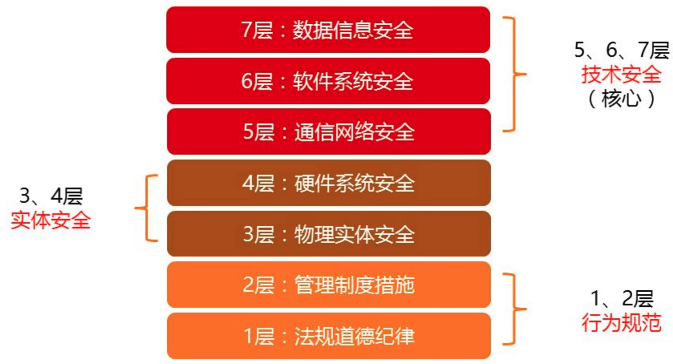

> # [**计算机信息管理专业  080901 笔记**](https://github.com/Eished/self-study-exam_notes)
>
> **自考笔记在线更新地址** : https://github.com/Eished/self-study-exam_notes

# 信息系资源管理 02378

## 大纲

## 历年真题

## 第1章 信息资源管理基础

学习目标与要求

一句话介绍：

- 围绕 “**信息**” 这份战略资源，
  - 从信息资源的 “**管理**” 角度出发，
  - 以 ”**信息系统**” 为主要研究对象，
  - 探讨了信息系统规划、信息系统开发、信息系统的内容、信息系统安全以及信息资源管理中涉及的法律法规。

### 1.1 导言：信息革命与信息化

#### 1.1.1 信息技术与信息革命

- **材料、能源、信息**是支配人类社会发展的三大基本要素。（选择）
- **信息技术**：应用信息科学的原理和方法研究信息**产生、传递、处理**的技术，
  - 具体包括有关信息的产生、收集、交换、存储、传输、显示、识别、提取、控制、加工和利用等方面的技术。
- **现代信息技术**: 3C+S
  - 通信技术（Communication）
  - 计算机技术（Computer）
  - 控制技术（Control）
  - 传感技术（Sensor）
  - 基础: 微电子技术
- **现代信息技术特点:**
  - 数字化: 二进制编码
  - 小型化: 体积变小
  - 网络化: 网络技术普及
  - 智能化: 智能技术
  - 系统化: 一卡通
- **信息革命:**
  - 含义：因信息技术发展而导致的社会变革称为信息革命。
  - 特征: 
    - 技术科学化
    - 群体化
    - 智能化
    - 高新性

#### 1.1.2 信息化

- **信息化定义**：（名词解释）
  - 指一个具体组织实体（如政府），应用**信息技术**提高信息资源**开发和利用**效率的**过程和活动**。
- **对于信息化的理解？**（选择）
  - 国民经济和社会生活中逐步应用的**过程**；国家信息化
  - 人类生存发展的一个历史**阶段**；信息产业
  - 促进经济发展和社会进步的重要**战略**；信息社会
  - 提高信息资源开发和利用效率的**活动**。
- **国家信息化体系的6大要素**（选择）
  - 信息资源
  - 信息网络
  - 信息技术应用
  - 信息技术和产业
  - 信息化人才队伍
  - 信息化政策法规和标准规范
- **国家信息化的3大思路**（选择）
  - 领域信息化
  - 区域信息化
  - 企业信息化
- **3大信息产业**（选择）
  - 信息技术制造（微电子、计算机等信息制造企业）
  - 信息内容产生（门户网站、电子媒体出版业）
  - 信息服务业（信息技术支持，信息中介，信息咨询等）
- 信息社会（不需掌握）
  - 信息化使我们正面对着一个数字化、，网络化的信息社会，它有着与农业社会和工业社会明显不同的特点
  - **信息社会特点**：
    - 非物质性：虚拟性
    - 超时空性：全球化，距离，时间
    - 可拓展性：可共享

### 1.2 信息（重要）

#### 1.2.1 信息的概念及其发展

- 信息传递

  - 
  - 

- 1948 Shannon

  - 通信的发生是以通信者具有不确定性为前提，通信的目的是就是减少不确定性，而消除不确定性的东西正是它所传递的信息
  - 只关注信息的传输，即通信，不关注信息的内容

- Shannon 熵（信息量）公式

  - $$
    H(Pi)=- \sum Pi \log_2(Pi)
    $$

  - 信息量是个状态信息量的平均信息量（数学期望）

  - 

  - 当各个状态的出现概率相等，即 $P_i=\frac{1}{n}$ 时，Shannon 熵公式变成

    - $$
      H=N\times \log(S)
      $$

      - Hartley 信息量测度公式
      - Hartley 公式是 Shannon 熵公式的特例

    - H 为信息量，N 代表 1 条信息包含字符的个数，S 代表通信符号集中符号的个数

- 1996 钟义信 **全信息理论**

  - 本体论

  - **认识论**

    - 语法信息（外在）
      - 随机信息（统计）信息
      - 模糊信息（状态不明确）
      - 偶发信息
    - 语义信息（内在）
    - 语用信息（价值）

  - **全信息** 

    - 实在信息（事物本身固有）
    - 先验信息（主体感知）
    - 实得信息（主体观察）

    引入主体和客体关系，衍生出

#### 1.2.2 信息的性质与分类

- 信息与物质、能量的关系

  - 联系且区别
  - 物质是基础，信息与能量源于物质
  - 信息可以转换为物质和能量

- **信息的性质**（选择题）

  - 无时无刻不在；精神世界信息无限一普遍的和无限的（实在信息）
  - 产生于物质，依附于媒体；可独立被重现一依附于媒体且可以独立于源事物
  - 可复制给其他主体，本身无损失一可以共享
  - 转换成其他形式存储，BMP、PNG一可以变换
  - 时间上传递-存储；空间上传递-通信；一可以传递但不增值
  - 信息随时间变化一动态且有时效性
  - 主体（人）利用感官感知信息一具体而可以被感知和处理的

- 信息的分类

  - 存储介质划分：磁电声光实

    - 磁介质，电介质，光介质，声介质，实体介质

  - 表现形式划分：

    - 文字信息、图像信息、声音信息、气味信息、形态信息

  - 信息的记录方式划分：

    - 事物型信息、记录型信息、智力型信息

  - **按信息源顺序层次划分**：（重点）

    - 原始信息：源事物发出，且未被处理的直接信息
    - 零次信息：人利用感觉（五官）直接得到的信息
    - 再生信息：一次信息（期刊论文）、二次信息、三次信息
    - 划分标准：信息加工处理深度

  - **按信息效用（影响）层次划分**：（重点）

    - | 层次 | 信息内容     | 描述问题 |
      | ---- | ------------ | -------- |
      | 1    | 迹象         | 什么？   |
      | 2    | 事实         | 是什么？ |
      | 3    | 知识         | 为什么？ |
      | 4    | 智能（策略） | 怎么办？ |

      最有效用的信息是： **知识、智能**

- （1）存储介质：磁、电、声、光、实质
  （2）信息表现形式：文字、图像、声音、气味、形态
  （3）信息记录方式：实物型、记录型、智力型
  （4）信息源顺序：原始信息、零次信息、再生信息（一次、二次等）
  （5）信息效用顺序：迹象，事实，知识，智能

#### 1.2.3 信息的测度

- 基于数据量的信息测度：
  - 按数据所占存储装置空间大小来衡量信息量的大小，字节作为单位
    - **重点：**按数据存储大小来衡量的方法 **基于语法信息。**

#### 1.2.4 信息功能与过程

产生 获取 传递 加工 再生 施效（利用）

### 1.3 信息资源管理概述

#### 1.3.1 信息资源

- **资源**：（名词解释）
  - 在自然界和人类社会生活中可以用来创造物质财富和精神财富，并具有一定积累的客观存在形式。
- 经济属性：
  - 需求性
  - 稀缺性
  - 可选择性
    - 不同资源组合有不同效果

#### 1.3.2 信息资源管理的主要内容

IRM: Information Resource Management

- 信息资源
  - 广义信息资源：是信息及其生产者、信息技术的集合，包括社会经济活动中经过加工处理
  - 狭义信息资源：有序化并大量积累的有用信息的集合，为某种目的而生产有用信息的信息生产者集合，加工、处理和传递有用信息的信息技术集合。
  - 信息——多生产者——信息技术
- 信息资源的性质
  - 不可分性
  - 积累性或非消耗性
  - 认知相对性
  - 不同一性
  - 驾驭性
- 内容
  - 管理对象：信息资源
  - 工具：信息技术
  - 特点：技术依赖性和系统综合性

#### 1.3.3 信息资源管理的产生与发展

- 产生背景
  1. 信息**爆炸**：文书记录和文献数量激增
  2. 三个应用**学科的发展**
     1. 数据库管理
     2. 记录或文献管理
     3. 数据处理管理
  3. 信息资源**地位提高**：信息无处不在
- 信息资源管理的发展
  - 马钱德（D.Marchand）和克雷斯莱茵（J.C.Kresslein）**四阶段说**
    - 1900-1960年 物的控制
    - 1960-1970年 自动化技术
    - 1970-1980年 信息资源管理
    - 1990年至今 知识管理
  - 信息资源管理：十九世纪末产生，学说在20世纪末产生
  - 信息资源管理强调“信息资源”为主导、技术是服务的管理理念
  - 知识管理：更高层次的信息资源管理，强调技术与管理的融合。

关键词：

信息化 信息 信息测度 Shannon熵 信息过程 信息资源

本章小结
练习题
网络学习题
思考题

## 第2章 信息化规划与组织

学习目标与要求

### 2.1 组织战略与信息化

- 组织战略
  1. 定义：组织战略是组织达成目标、完成使命的综合计划
  2. 包括：
     - 总战略：总的方向
     - 经营战略：某一产品、部门的竞争合作战略
     - 智能战略：各职能部门制定的战略，如制造、研发、信息技术等
  3. 制定过程：
     - 环境分析：充分考虑组织内部、外部所有的优势和劣势，评估机会和风险，对组织所处环境进行判断
     - 战略决策：明确使命、目标——战略方案
     - 战略规划的形成和完善：细化调整，形成可执行的战略规划
- 组织战略的规划方法
  1. **SWOT 矩阵法**（波士顿矩阵法）
     - SWOT矩阵法是全面分析组织外部环境和内部资源、**寻找满意战略组合**的分析工具。
     - 外部环境分析包括明确机会（O）和威胁（T），内部资源分析包括了解优势（S）和劣势（W），并根据绘制的SWOT矩阵进行组合分析和综合分析。
     - 
  2. 波特五力模型
     - 企业开辟新业务
  3. 价值链分析法
     - 业务流程重组
- 组织战略与信息化关系
  1. 组织信息化的**目的**：支持组织战略实现。
  2. 信息化是组织战略制定的**工具**。
  3. 组织信息化工作**重心**：支持管理决策的智能化。
  4. 组织内**最底层**的普通职员负责事务处理。
- 组织战略与信息化战略
  1. 信息化战略是组织战略的重要组成部分，是组织战略的**指导方针**
  2. 信息化战略必须服从**组织战略**的**核心思想**，在组织战略的框架下制定

### 2.2 信息化规划

#### 2.2.1 信息化规划概述

- 信息化发展中遇到的问题

  - **信息孤岛**：数据信息单元单独存放、不能自动的实现信息共享与交换，需要靠人工与外界进行联系的一种现象

    - **本质是组织信息化进程缺乏整体规划而造成的**

  - **IT 黑洞**：企业在 IT 应用上的巨额投资并没有达到预期效果，经济学家称为”生产率悖论“

    - 产生 IT 黑洞的原因

    

  - **IT 项目泥潭**：90%的 ERP 系统的实施要么超过预定时间，要么超过预算

- 如何解决这些问题？

  - **为了规避风险，保证信息化建设成功和健康发展，需要实现对组织信息化进行周密的计划**

- 信息化规划

  - 战略目标（如何规划）
    1. 业务匹配：信息技术投资与组织的远景规划和战略目标的匹配
    2. 竞争优势：提高组织竞争优势
    3. 管理资源：优化组织信息资源
    4. 技术架构：勾画出组织战略、组织结构和业务流程相适应的信息技术架构
  - **组织信息化规划在时间上一般为 3-5 年**

- 诺兰模型：

  - 组织 IT 应用发展分为起步、扩展、控制、集成、数据管理、成熟 6 个阶段
  - 早起信息化规划局限于技术（战术）层面的**信息系统项目规划**

- 信息化规划层次

  - 战略管理层面
    - 信息化**战略**规划
  - 管理业务层面
    - 信息化**资源**规划
  - 技术实现层面
    - 信息化**项目**规划

  

- **开展信息化规划的方式**（选择题）

  - 从下而上
    - 适合业务相对**稳定**的组织
  - 由上而下
    - 有较明确（新）发展战略的组织
  - 由外而内
  - 中间开花

#### 2.2.2 信息化战略规划

信息化战略规划内容

- 信息化战略：
  - 描述组织信息化建设的方向、重点、步骤和措施等的策略
  - 是组织信息化建设与发展的整体思路与指导体系

1. 信息化建设的**愿景与架构**（大方向）
   1. 组织战略、核心竞争力的识别
   2. 管理提升与业务改进方向
   3. 信息化的作用点和愿景分析
   4. 分析组织信息化现状、进行信息化能力评估
      1. 从**人、流程、技术**三个方面分析企业信息化现状
   5. 分析差距，探讨改进构想
   6. 业务需求调整
   7. 分析信息化体系架构
      1. 定义信息化所涉及的系统边界与环境；
      2. 分析信息化建设的组织结构；
      3. 分析各子系统的相互关系。
2. 项目**方案选择与组织**（做什么）
   1. 项目方案的选择
   2. 信息化建设的项目组织
3. 信息化**项目规划**（怎么做）
   1. 信息化建设阶段规划
   2. 风险管理质量监控策略
   3. 主要实施计划与培训计划

1. 信息化战略的**规划步骤**

   1. 基础信息调研：信息化现状与发展趋势调研、组织信息化需求调研、信息化建设基础条件调研
   2. 现状评估和问题分析
   3. 信息化战略目标设计和制定

2. **信息化战略规划方法**
1. **战略目标集转化法（SST）**
      1. **识别**组织战略集
   2. 将组织战略集**转化**为组织信息化战略
      3. 选出一个方案**送**决策层**审**核
      
   2. **价值链分析法（VCA）**
   1. 内容：将组织看成输入、转换和输出活动的集合
      
      - 一个组织 = 一些活动
      
      - 价值链分析法认为**信息技术**在组织的战略牵引方面起关键作用
         - 信息技术是关键
   
      2. 内容：将一个组织看成一些输入、转换与输出活动集合，称为价值链，每个活动都能产生增值作用
   
3. **关键成功因素法（CSF）**
   1. 内容：根据关键因素决定信息资源分配的优先级，利用信息技术发掘新机遇

3. **信息化战略规划书**

   1. 环境分析
   2. 信息化战略
   3. 信息化体系架构设计
   4. 信息化技术标准
   5. 项目分派和管理

#### 2.2.3 信息资源规划

1. 信息资源规划是什么

   - 某公司信息化发展水平处于初级阶段的表现：

      1. 分散的、独立运行的事务处理系统较多，应用系统之间缺乏自动化数据交换，没有共享数据库。
      2. 应用规模较小，没有中等规模的管理信息系统，数据缺乏规范化。
      3. 集团各单位信息联网困难，没有全系统的信息化标准化管理。

      解决这些问题的技术核心是：信息资源规划（数据集成）

2. 信息资源规划的产生与内涵

   - 数据处理危机：**根本原因是系统缺乏全面有效的高层（战略）数据规划。**
   - **詹姆斯·马丁（J.Martin）提出战略数据规划**
     - 数据标准：数据**命名，属性，设计，使用**一致性规范（选择题）

3. 高复提出，信息资源规划（IRP）：

   

   - 是对组织管理或经营活动所需要的信息，
   - 从**产生、获取，到处理、存储、传输及利用**进行全面的规划

4. 信息资源规划的步骤

   1. 建立负责信息资源规划的**工作组**，人
   2. 分析**职能域**及其业务，流程
   3. 对职能域数据进行**标准化**，技术

      1. **组织信息资源管理基础标准：**（选择题）
         1. **数据元素**标准
         2. **信息分类**编码标准
         3. 用户**视图**标准
         4. **概念**数据库标准
         5. **逻辑**数据库标准

5. 信息资源规划的**重点工作**（选择题）

   - 业务分析
   - 主题数据库与数据标准化
     1. **主题数据库：要求信息源的唯一性，即所有源信息一次一处地进入系统。**
     2. **数据标准化：数据元素标准化，信息分类编码标准化。**

#### 2.2.4 信息化项目规划

1. 信息化项目的定义
   - **信息化项目**：在特定时间、质量、资金等约束下，以应用信息技术为目标的一系列活动。
   - **应用型项目**：应用 SAP 的 ERP 软件，完成企业资源规划。
   - 开发型项目
2. **信息化项目规划的内容**（选择题）
   1. 范围规划
   2. 进度计划
   3. 成本计划
   4. 质量计划
3. **信息化项目规划的常用工具**（选择题）
   1. 项目管理工具 MS Project
   2. 用 **WBS（工作分解结构）**工具做出范围计划
   3. 常用的进度计划工具是**甘特图**

### 2.3 信息化组织

#### 2.3.1 信息化组织机构

1. 案例：海航集团
   - 信息化离不开有效的组织
   - 人、技术、管理
2. **信息化组织机构的类型**（选择题）
   1. **隶属**业务部门的信息部门
   2. 与业务部门**平级**的信息部门
   3. 由 **CEO** 直接领导的信息部门
   4. 由**信息管理委员**会直接领导的信息部门
3. **信息化组织机构的职能**（选择题）
   1. 信息化**战略制定及管理工作**的组织
   2. 信息系统**研发与管理**
   3. 信息系统**运行维护与管理**
   4. 信息资源**管理与服务**
4. 信息化组织机构的**岗位设置**
   1. **系统研发与管理部**（重要）
      1. **系统分析员**
         - 系统分析员的主要任务是对现行**系统运行环境、作业流程**和**用户需求**进行详细调查，
         - 进而确定目标系统的**功能结构、性能指标、资源配置、编码体系、逻辑模型**，以便为系统设计提供科学依据。
      2. 系统设计员
      3. 程序员
      4. 测试人员
   2. 系统运行维护与管理部
      1. 控制台操作员
      2. 设备管理员
      3. 数据录入员
      4. 运行的培训教师
      5. 资料保管员
      6. 支持人员
   3. 信息资源管理与服务部
      1. 资源管理员
      2. **信息员**（重要）
         - 负责信息的**收集、整理和发送**。
      3. 信息服务与技术支持人员

#### 2.3.2 CIO机制

- Chief Information Officer，首席信息官
  - 专门负责组织信息化建设、实施、和运作的管理者
  - 通常是组织决策层成员。
- **CIO 机制的构成**（选择）
  - **核心**：CIO
  - 信息化管理**委员会**：领导小组
  - 信息部门：**支持中心，管理中心**
  - 业务部门的信息人员：**业务部门**是信息化的**实施主体**
- CIO 的职能
  - 战略的参谋者
  - 战略的执行者
  - 信息的传播中介
- CIO 的能力
  - 管理知识
  - 技术知识
  - 沟通能力
  - 协调能力
  - 项目管理

关键词

本章小结

练习题

网络学习题

思考题

## 第3章 信息系统资源管理

学习目标与要求

### 3.1 信息系统资源管理概述

#### 3.1.1 信息系统的基本概念

1. **信息系统的定义**（名词解释）

   - **信息系统**是一个完成信息**采集、传递、存储、加工、维护**和**使用**等信息处理活动的系统。
   - **特点**：（选择）
     1. 涉及的数据量**大**
     2. 绝大部分数据是**持久**的
     3. 持久数据为多个应用程序所**共享**
     4. 向用户提供信息检索、统计报表、事务处理、规划、设计、指挥、控制、决策、报警、咨询等**信息服务**

2. **信息系统的组成**（选择）

   - 信息系统是一种非常复杂的**人机系统**，组成要素多，**结构复杂**。
   - 人、硬件、软件（系统、应用软件）、数据、处理规程

3. **信息系统的生命周期**（选择、简答）

   信息系统和任何事物一样，有一个产生、发展和消亡过程，这个过程周而复始，形成了信息系统生命周期。

   1. 第一步：系统**规划**阶段：（简答）
      - 对组织的环境、战略、目标、现行系统的状况进行**初步调查**。
      - 确定信息系统的**发展战略**。
      - 分析和预测建设新系统的**需求**。
      - 指定建设信息系统的各种指标，研究建设新系统的**必要性和可能性**。
      - 给出拟建各种子系统的顺序以及备选方案，并进行可行性分析，写出可行性分析报告，审议通过后，编写成系统**开发计划**书。
   2. 第二步：系统**分析**阶段：（简答）
      - 对**现行系统**运行环境、作业流程和用户需求进行**详尽调查**。
      - 确定**目标系统**的功能结构、性能指标、资源配置、编码体系、**逻辑模型**。
      - 系统分析完成后形成系统**分析**说明书。
   3. 第三步：系统**设计**阶段：
      - 系统**设计**说明书
   4. 第四步：系统**实施**阶段：（选择）
      - **系统实施按系统设计说明书**，指定系统实施计划。
   5. 第五步：系统**运行与维护**阶段

4. **信息系统的分类**（选择）

   1. | 组织层次 | 系统类型                                        | 典型功能                                                     |
      | -------- | ----------------------------------------------- | ------------------------------------------------------------ |
      | 战略层   | 经理支持系统（ESS）                             | 长期销售趋势预测、长期预算计划、长期人力资源计划（战长）     |
      | 管理层   | **决策支持系统（DSS）**  管理信息系统（MIS） | 成本分析、定价分析、投资分析 人力资源、财务、设备材料等业务管理系统 |
      | 知识层   | 办公自动化系统（OAS） 知识工作系统（KWS）    | 文字处理、电子邮件、电子日历等 计算机辅助设计、虚拟现实   |
      | 操作层   | 事务处理系统（TPS）                             | 销售记录、收支记录、设备使用记录、库存记录、工资发放等       |

#### 3.1.2 信息系统的资源观

1. **信息系统的资源观**（选择、简答）

   - **资源系统观**：全面观点

     - 信息系统资源观中**最核心**的观点

     - 三点含义：

       1. 信息系统是组织系统中的一个**子系统**，是组织的**神经系统**。

       2. 信息系统资源是由各种**组成要素**或**子系统资源**构成的。

          系统集成：

          1. 为**整合优化**系统资源提供了**工程科学方法**
          2. 关键：系统之间**互联**和**互操性**问题（教研平台、题库和app）

       3. 信息系统资源是动态发展的，有**产生、发展、消亡**的生命周期

   - 资源辩证观

     - 三个问题：
       1. 有限与无限（物质和信息）
       2. 有益性和有害性（社会法律）
       3. 量与质（量变引起质变）

   - 资源层次观

     - 三个层次：
       1. 低：**物质**资源
       2. 较高：**能源**资源
       3. 最高：**信息**资源

   - 资源开放观

     - 打破地域层次封锁，合理配置资源
     - 新理念：**云计算，泛在网络**

#### 3.1.3 信息系统资源管理

不考

### 3.2 信息系统开发管理

#### 3.2.1 信息系统开发管理的目的与意义

1. 信息系统开发管理的目的
   - 信息系统开发项目管理：
     - 要解决的基本问题，就是如何按所选择的研制方法，对开发项目进行有效的**计划、组织、协调、领导和控制**。
2. **信息系统开发管理的意义**（简答题）
   - 信息系统开发项目管理的重要性：
     1. 可以进行系统的思考，进行切合实际的**全局性安排**
     2. 可为项目**人力资源**的需求提供确切的依据
     3. 通过合理的计划安排对项目进行**最优化控制**
     4. 能够提供准确、一致、标准的**文档数据**

#### 3.2.2 信息系统开发管理的内容

1. **信息系统项目开发人员组织**（选择题）

   - 项目委员会：项目管理组，项目评审组，项目开发组
   - **一把手原则**：信息系统项目开发管理的**核心**
   - 项目评审组职责：
     1. 项目的**需求分析**
     2. 系统**选型**和开发**计划**
     3. 系统开发**阶段**性
     4. 项目**总结报告**

2. 信息系统项目开发**过程管理**

   1. **项目授权**：
      - 明确责任者
   2. **需求分析**：
      - 可行性评估
      - 需求评估
      - 项目总体安排
   3. **项目实施管理**
      - 计划
      - 检查
      - 控制

3. 信息系统项目开发管理的**质量控制**（选择题、简答题）

   - 质量控制的首要工作就是建立项目的**质量衡量标准**。

   - 项目质量控制标准是项目开发评审和控制标准的基础和核心。

   - **项目质量控制标准包括**：【简答题】

     （**控制 开发 流程 标准，协调 满意度**）

     - 项目开发**工作流程**的合理化
     - 开发时间和成本预算**控制**
     - 项目风险**控制**
     - 开发工作安排**效率**
     - 开发工作的**协调管理**过程
     - 工程化**开发方式**的运用
     - 程序的运行效率和统一的**信息标准**
     - 信息系统需求方**满意度**

### 3.3 信息系统运行维护管理

1. **信息系统运行维护管理**（名词解释，简答题）
   - 信息系统运行维护管理：是指信息系统**上线后**对信息系统运行过程中的**人员、硬件、软件、数据和规程**进行管理的活动。
     1. 人员管理重点在于**组织机构**建设、**培训和制度**建设
     2. **软硬件管理**主要是对软硬件系统进行检测、记录、维护、评价和审计过程
     3. **数据管理**主要是数据库的日常管理和维护

#### 3.3.1 信息系统运行维护中的人员管理

1. 【案例分析】
           SHANG:集团为H省皮革行业的龙头企业，信息主管黄先生为了企业信  息系统的运行忙得不亦乐乎。胡先生是该企业总裁，他对信息系统运转  有些犹豫，建设一个系统靠团队，那系统运行和维护靠谁呢？这不仅是一个技术问题，更是一个管理问题，也已经不是一个人的事情，而是关联到几百个合作伙伴，关系到几万人的大事。胡总裁对信息系统运转可能存在的薄弱环节十分迷茫。  

   1. 根据案例说明系统运行和维护的主要负责人员和相关机构。
   2. 分析系统运转过程中可能存在的薄弱环节。
      1. 信息系统运行和维护人员组织机构建设；
      2. 各类人员培训；
      3. 各种规章制度的制定与执行；

2. 信息系统运行和维护人员组织机构 

   - 以 **CIO**为首、以组织的**信息部门**为依托实体的、组织内各部门专职或兼职信息系统管理人员网状连接形成的完整的信息系统运行和维护机构。

   - 信息系统的运行和维护新的**发展趋势：外包**【选择题★】

3. **人员培训**（选择题）

   - **终端用户**：基本操作和系统功能模块使用的培训
   - **系统维护管理人员**：专门的技术和管理制度的培训

   **培训目标**：（简答题）

   - 使用户对目标系统有**较全面**的了解
   - 在用户中强化信息管理的**理念**
   - 使用户了解目标系统对现行系统的新要求，为新系统的运行作必要的**准备工作**

4. 信息系统运行管理制度【了解】

   - 指信息系统运行过程中的保障**信息系统安全**、稳定运行的各种**规章制度**，主要用于**规范**各类人员的**行为**。

#### 3.3.2 信息系统日常运行管理

1. 信息系统日常运行管理的内容
   1. **系统运行情况的记录**（选择题）
      - 正常
      - 不正常
      - 无法运行
   2. 审计跟踪
   3. **审查应急措施的落实**（选择题）
      - 应急计划
      - 数据备份必须做，关键领域设备备份
   4. 信息系统硬件和耗材等资源的管理
   5. 系统升级与退化

#### 3.3.3 信息系统数据管理

1. **数据库管理员 (DBA) 的主要操作**【选择题★】

   **技术类5**

   1. 安装和升级数据库及应用程序工具。

   2. 确定数据库设计系统存储方案，并制定未来的**存储需求计划**。

   3. 开发人员设计了一个应用，就需要DBA来创建**数据库存储结构**。 

   4. 开发人员设计了一个应用，就需要DBA来创建**数据库对象**。  

   5. 根据开发人员的反馈信息，必要的时候，修改**数据库的结构**。 

      **安全类4**

   6. 登记数据库的用户，维护数据库的**安全性**。 

   7. 保证数据库的使用符合知识产权的相关**法规**。  

   8. 控制和监控用户对数据库的存取**访问**。

   9. 监控和优化数据库的**性能**。

      **备份类3**

   10. 制定数据库备份计划，灾难出现时对数据库信息进行**恢复**

   11. **维护**适当介质上的存档或者备份数据。

   12. 备份和恢复数据库、联系数据库系统的生产厂商，跟踪技术信息。

#### 3.3.4 信息系统维护管理

1. 信息系统维护

   - 信息系统的维护是为了使信息系统处于**合用状态**而采取的一系列**措施**，目的是**纠正错误**和**改进功能**，保证信息系统**正常工作**。
   - 维护的种类：
     1. 改正性维护 
     2. 适应性维护
     3. 完善性维护
     4. 预防性维护
   - 完善性维护：用户需求增加而产生的软件修改或在开发。比例最大。

2. **系统维护内容**（简答题）

   助记词：成熟马背

   1. **程**序维护
   2. **数**据维护
   3. 代**码**维护
   4. 设**备**维护

3. **系统维护的流程**（简单题）

   助记词：目标方案实施档案总结

   1. 确定维护目标
   2. 建立维护计划方案
   3. 维护的实施
   4. 系统维护档案建立
   5. 维护的验收、总结和评价

#### 3.3.5 信息系统运行中的IT服务管理

1. 材料：某航空集团公司拥有一个**地域分散、多厂商、多平台、多系统**的复杂 IT 环境。IT系统运行复杂，业务系统故障多，技术人员的被动工方式难以适应企业IT服务需要。要求：试运用IT服务管理相关知识为该公司出谋划策，使其 IT服务向更高层次的主动服务发展。

   

   1. 引入先进的IT服务管理工具或相关平台型软件，实现服务台管理、事件管理、问题管理、变更管理、配置管理等多个功能。
   2. 开展IT服务管理体系的建设，首先调整和优化IT服务部门的组织结构，工作流程；
   3. 其次可以采用多层次服务支持模式，比如**三线服务支持模式**，
      1. 一线为**IT服务热线和现场工程师**，负责解决终端用户问题和巡检及监控等任务；
      2. 二线为**运行和维护管理人员**，除了日常工作外，负责解决一线突发事件，并对系统架构进行统一规划；
      3. 三线为**技术专家组人员**，负责IT服务项目管理工作及解决二线问题。

2. **IT服务管理**【选择题】

   1. IT服务管理的理念是 “**以流程为导向、以客户为中心**”   
   2. IT服务管理的两大类核心流程：
      1. **服务支持类**：服务台、事件管理、问题管理、配置管理、变更管理、发布管理
      2. **服务提供类**：服务级别管理、IT服务财务管理、IT服务持续性管理、  可用性管理和能力管理

#### 3.3.6 信息系统文档管理

1. **信息系统文档的内容**【选择题★】    
   - 信息系统文档主要包括**系统手册、用户手册、管理员手册、操作规程**及其相应的**管理制度**。
   - **程序**和**文档**合并一起称为软件。【选择题★】
2. **信息系统文档的作用**【选择题★】五个沟通
   1. 利于**系统分析员**与**用户**进行沟通
   2. 利于系统开发人员与**项目负责人**进行沟通
   3. 利于系统开发人员与**用户**进行沟通
   4. 利于系统开发人员与**系统维护人员**进行沟通
   5. **系统开发人员**之间进行沟通

#### 3.3.7 信息系统的评价和审计

1. 信息系统评价的内涵及其内容

   - 信息系统评价是指对信息系统的**运行状态**和**质量**进行各种衡量，以判断其是否**优质、高效、安全**地运行的活动。
   - 管理方面，主要考虑：
     - **提高**企业管理水平
     - **优化**管理流程
     - **完善**规章制度
     - **提高**人员素质等
   - 技术方面，主要是管理信息系统的性能，主要包括：
     - 系统的**总体水平**
     - 系统**功能与层次**
     - 信息资源**利用**的深度
     - 系统的**质量**
     - 系统文档的**完备**性
     - 系统的**安全与保密性**
   - 经济方面，主要是信息系统的成本与效益
     - 成本：开发成本、设备成本、运行成本
     - 开发成本：系统分析、系统设计、编码和测试、人员培训、记录文件等方面的成本

   

2. 材料：Q法院院长在经济责任审计项目中，通过对法院信息系统有关数据的对  比分析，发现Q法院业务信息系统部分数据存在明显的逻辑错误问题。法院以  此为切入点，开展信息系统评价和审计，发挥了审计的“免疫系统”功能。  

   1. 阐释信息系统审计的定义；
      - 信息系统审计是一个通过收集和评价**审计证据**，
      - 对信息系统是否能够**保护资产安全**、**维持数据的完整**、
      - 使被审计单位的**目标**得以有效实现、
      - 使组织的**资源**得到高效使用等方面做出判断的过程。  
   2. 结合材料，分析Q法院院长可采取哪些有效措施发挥**审计**的“免疫系统”功能。
      - 对法院信息系统有关数据进行对比分析，
      - 开展信息系统网络安全控制、服务器操作系统安全控制、数据库系统安全控制等一般控制审计；  
      - 开展信息系统数据输入输出等应用控制审计；  
      - 对业务信息系统使用绩效审计

关键词

| 信息系统         | 信息系的生命周期 | 资源观               |
| ---------------- | ---------------- | -------------------- |
| 信息系统资源管理 | 信息系统开发管理 | 信息系统运行维护管理 |
| 信息系统维护     | 数据管理         | IT服务管理           |
| 文档管理         | 信息系统评价     | 信息系统审计         |

本章小结
练习题
网络学习题
思考题

## 第4章 信息资源内容管理

学习目标与要求

### 4.1 信息需求

1. 案例：小光和几位同学积极响应学校大学生创业号召，打算在网上开店销售同学们闲置  商品。网上开店首先需要拟写一份商业计划书，于是小光向老师请教。老师看了计划书后，就问了几个问题：开网店的目的是什么？客户群如何定位？商品如何定价？货源如  何组织？投资预算及成本效益分析的依据是什么？老师让小光组织同学做相应的调研，然后用实际数据充实计划书，使得将来的网店具有一定的竞争力和可持续性。老师建议  小光他们先查阅资料，通过网络案例、期刊文章及相关统计数据，将问题系统化，就未知的问题设计调查问卷进行调查，以进一步明确上述问题，降低网站经营风险。
   1. 分析老师建议小光他们做的是信息系统开发中的哪个阶段的工作？
      - 需求分析工作
   2. 小光及其同学属于何类群体？
      - 信息用户
   3. 结合上述案例分析这类群体具有哪些特征。
      1. 拥有信息需求
      2. 具备利用信息的能力
      3. 具有接收信息服务的行动

#### 4.1.1 什么是信息需求

1. **信息用户及其特征**【选择，简答】

   - 将既具备信息需求又具有信息行为的人，称为**信息用户**。

   - 特征：
     - **拥有信息需求、具备利用信息的能力、具有接受信息服务的行动**
   - 能力：
     - **观察，理解，概括，抽象，分析与综合，判断与推理**【选择】
   - 信息需求是信息用户最本质的特征，如果只具备信息需求和信息能力而未形成实际行动，则为**潜在信息用户**。【选择】

#### 4.1.2 信息需求的类型

1. 个人信息需求
   1. 生活信息需求
   2. 职业信息需求
2. 组织信息需求

#### 4.1.3 组织中不同层次的信息需求

1. 决策与信息需求
   1. 决策是一种管理活动
   2. 决策过程：发现**问题**，设计和分析可能解决**方案**，选择**执行**其中一个方案解决问题。

#### 4.1.4 决策与信息需求

1. 决策问题的类型【选择题】
   1. 结构化问题
      - 经常重复发生的问题，例如：新员工工资
   2. 半结构化问题
      - 无固定、重复使用多次的解决方案可循，例如：当前市场行情，走势预测
   3. 非结构化问题
      - 独一无二、非重复性决策的问题，依靠决策者的直觉，例如危机公关

### 4.2 信息采集

#### 4.2.1 信息源

1. **信息源的类型**【选择题】
   1. 以组织边界为界限
      1. 内部信息源
      2. 外部信息源
   2. 根据信息是否被记录
      1. 记录型信息源
      2. 非记录型信息源
   3. 根据是否数字化 
      1. 数字化信息源
         1. 组织内部各种信息系统
         2. 专业数据库
         3. 数字出版物
      2. 非数字化信息源
2. **文献的分类及特点**【选择题】
   1. 根据载体的形式
      1. 印刷型
      2. 微缩型
      3. 机读型
      4. 声像型
   2. 根据出版形式
      1. 图书
      2. 连续性出版物
      3. 特种文献
   3. 根据文献内容、性质及加工情况
      1. **一次文献**：期刊文献，研究报告，专利说明书，会议论文
      2. **二次文献**：书目，题录，简介，文摘等检索工具
      3. **三次文献**：综述，专题评述，学科年度报告，进展报告，数据手册

#### 4.2.2 信息采集原则

1. **信息采集的原则**【选择题】
   1. 目的性原则：明确的目的性
   2. 系统性原则：时间上连续，空间上广泛
   3. 及时性原则：反映当前社会的现状
   4. 经济性原则：考虑投入产出比
   5. 计划性原则：满足当前需求，兼顾未来发展
   6. 可靠性原则：坚持调查研究
   7. 预见性原则：有超前性

#### 4.2.3 信息采集方法

1. **信息采集的方法**【选择题】

   网络上的信息资源的自动采集要依靠**搜索引擎技术**和**链接分析技术**

   1. 定向采集法
      - 在采集计划范围内，对某一学科、某一国别、某一特定信息尽  可能全面、系统地进行采集。例如：监听电台信号
   2. 定题采集法
      - 根据用户指定的范围或需求有针对性地采集信息。例如：生物多样性专题调查。
   3. 定点采集法
      - 聘请专门的信息采集人员定点采集相关信息资源。例如：交通路口摄像头
   4. 主动采集法
      - 针对特定需求或根据采集人员的预测，事先发挥主观能动性  赶在用户提出要求之前即着手采集工作。例如：春运
   5. 跟踪采集法
      - 根据需要对有关信息资源在一段时间内进行动态监视和跟踪  及时采集出现的一切新情况、新信息。例如：江歌案
   6. 社交采集法
      - 如参加各种会议、旅游、舞会、聚会、走亲访友、娱乐、网络  交流等。例如：国际会议。
   7. 现场采集法
      - 参加展览会、展销会、订货会、科技成果展示会、交易会、现场会、参观访问等
   8. 委托采集法
      - 委托某一信息机构或信息人员采集，根据采集的质量支付一定费用
   9. 间谍采集法
      - 利用间谍窃取所需信息的方法

#### 4.2.4 信息采集途径

1. 内部途径
2. 外部途径

### 4.3 信息存储与检索

#### 4.3.1 信息存储

1. 信息存储的作用	
   1. 方便检索
   2. 延长寿命
   3. 利与共享
   4. 方便管理
2. **信息存储的基本原则**【选择题，简答题】
   1. 统一性
   2. 便利性
   3. 有序性
   4. 先进性
3. 信息存储的主要技术
   1. 缩微存储：
      - 储信息密度高、存储方法简单、成本低、保存期长，忠实于  原件，不易出错；（胶片）
   2. 声像存储：
      - 包括录音存储技术、图像存储技术、电影存储技术
   3. 计算机存储：
      - 磁盘具有密度高、容量大、成本低、可自动存取数据等特点
   4. 光盘存储：
      - 存储密度高，容量大；价格低廉，便于复制；坚固耐用，存储  寿命长，然而误码率比较高
   5. 网络存储存：云端存储。

#### 4.3.2 信息检索

1. **信息检索的类型**【选择题】
   1. 按检索的**内容**分
      1. 文献检索
      2. 事实检索
      3. 数据检索
   2. 基于**电子文档**
      1. 全文检索
         1. 是**搜索引擎**的核心技术
         2. 检索对象（**文本信息**）
      2. 多媒体信息检索
         1. 多媒体信息检索是**基于内容**的检索，直接对图像、音频、视频等多媒体信息进行分析，抽取特征和语义，建立索引，然后进行检索。
2. **信息检索的基本程序**【选择题】
   1. 确定检索**范围**和深度
   2. 选择检索**工具**
   3. 选择检索**途径**
   4. 选择检索**方法**
   5. 实施信息**查找**
   6. 调取信息**资料**

### 4.4 信息加工与分析

#### 4.4.1 信息加工

1. **信息加工**【选择题】

   1. 指将采集来的大量**原始信息**进行**筛选**和**判别**、**分类**和**排序**、**计算**和**研究**、**著录**和**标引**、**编目**和**组织**从而使之成为**二次信息**的活动。
   2. 主要作用：去除糟粕、信息整序和综合创新

2. **信息筛选和判别**【选择题】

   1. 信息筛选和判别的基本程序：

      - 信息整理→浏览审核→再次审核

   2. **信息筛选和判别的基本方法**：【选择】

      助记词：**专家 现场 分析 学 赶 集**

      - 感官判断法，分析比较法，集体讨论法
      - 专家裁决法，数学核算法，现场核实法

3. 信息分类和排序

   1. 确定分类方法
   2. 实施信息分拣
   3. 进行信息**排序**（方便检索）

4. **信息著录标引**【选择题】

   1. 信息**著录**是指按照一定的**标准**和**格式**，对原始信息的外表特征（如**名称、来源、加工者**等）和物质特征（如**载体**形式等）进行描述并记载下来的活动。
      1. 做好前期准备工作
      2. 确定信息著录格式
      3. 加注表示符号（信息的标引）
   2. 信息的**标引**是指对著录后的信息载体按照一定规律**加注标识符号**的活动过程。
      1. 选择和熟悉分类表
      2. 进行主题分析
      3. 归入恰当的类
      4. 审校
   3. 信息著录和标引主要依据**元数据**（关于数据的数据，原始数据）

#### 4.4.2 信息分析（重点）

1. **信息分析**【选择题，名词解释】

   - 信息分析是指以社会用户的特定需求为依托，
   - 以**定性**和**定量**研究方法为手段，
   - 通过对信息的**整理、鉴别、评价、分析、综合**等系列化加工过程，
   - 形成新的、增值的信息产品，
   - 最终为不同层次的科学决策服务的一项具有科研性质的**智能活动**。

   用xx方法加工，变成 xx，为我们所用。

2. **信息分析的方法**【选择题】

   - 定性分析：
     - 综合法：来源、内容归纳汇集
     - 对比法：两种、辨别优劣
     - 相关法：已知推未知：瑞雪兆丰年；朝霞不出门；晚霞行千里
     - 因果法：因果关系
   - 定量分析：
     - 文献计量分析法：文献量与发展的关系
     - 插值法：内插外推
     - 回归分析法：回归方程
     - 决策分析法：运筹学，动态规划，决策树
     - 预测分析法：概率论，时间序列分析

3. **文献计量学方法**【名词解释，选择题】

   1. 文献计量学：

      - 是以文献体系和文献计量特征为**研究对象**，采用数学、统计学等**计量方法**，研究文献情报的分布结构、数量关系、变化规律和定量管理，并进而探讨科学技术的某些结构、特征和规律的一门**学科**。
      - 计量对象：【选择题】
        1. **文献量**（出版物，期刊，引文）
        2. **作者数**（个人或团体）
        3. **词汇数**（文献标识，叙词居多）

   2. 科学文献增长与时间成**指数函数关系**：普赖斯曲线

      - **普赖斯指数**：在某一知识领域内，把对年限不超过**五年**的文献引文数量与引文总量之比当做指数，用以量度文献的**老化速度和程度**。
        $$
        普赖斯指数=被引文献数量(\le 5 年)/ 被引文献总量 \times 100\%
        $$

   3. **网络计量学：**

      - 应用文献计量学及信息技术，对网上信息的组织、存储、分布、传递、相互引证和开发利用等进行定量描述和系统分析，以揭示其数量特征和内在规律。

4. **数据挖掘（Data Mining）**【案例分析】

   某个夏季，沃尔玛的销售数据显示这段时间啤酒和纸尿布的销售量同时有大幅度提升。通过对销售记录的分析，发现的确有很多顾客同时购买这两样商品，大多是25-35岁的父亲。沃尔玛因而重新布置了货架，将这两种商品摆在靠近的位置，进一步提升了二者的销量。

   1. **什么是数据挖掘**？【名词解释】
      - 数据挖掘：是从大量的、不完全的、有噪声的、模糊的、随机的**实际应用数据**中，**提取隐含**在其中的、人们事先不知道的、但又是**潜在有用**的信息和知识的过程。
   2. 结合案例，数据挖掘是如何提取有用信息和知识的。
      1. 数据挖掘能够对商业数据库中的的大量业务**数据**进行抽取、转换、分析和其他模型化处理。
         - 沃尔玛记录了大量的销售数据。通过对这些数据进行抽取、转换、分析等，发现有很多顾客同时购买了啤酒和尿布这两类商品，大多是25-35岁的父亲。这种隐含的相关性是事先不知道的。
      2. 通过数据挖掘方法和技术提取辅助商业决策的**关键性数据**。
         - 在本案例中根据数据挖掘发现的这种隐含关系，沃尔玛重新布置了货架，将这两种商品摆在靠近的位置，又进行针对性的促销，进一步提高了它们的销量。

5. **数据挖掘的方法和技术手段**【选择题】

   1. 关联分析：挖掘隐藏在数据间的关系
   2. 决策树：树形结构表示分类和决策
   3. 粗糙集：研究不明确知识的归纳方法
   4. 人工神经网络：非线性预测模型，模式识别
   5. 遗传算法：基于进化理论，自然选择
   6. 归纳学习：大量数据中归纳出规则和模式

### 4.5 知识管理

#### 4.5.1 知识管理的概念

1. 知识管理
   1. 对**知识、知识创造过程**和**知识的应用**进行规划和管理的活动。
2. **组织知识管理**【选择题】
   - **包括**：建立知识库；促进员工的知识交流；建立尊重知识的内部环境；把知识作为资产来管理。
   - **技术**：文档管理，知识门户，数据挖掘与知识发现，搜索引擎，智能检索技术，专家系统，电子会议，在线学习以及群件。
3. **个人知识管理**【选择题】
   - **包括**：知识获取、存储、共享、创新的管理过程。
   - **工具**：获取工具、存储工具、共享工具、创新工具。

#### 4.5.2 知识管理工具

- 常用的知识管理工具【案例分析】
  - 知识地图（类似思维导图）
  - 搜索引擎
  - 知识门户
- 常用的知识管理工具【案例分析】
  - 小王是个生物迷，想了解有关 “水母”的相关知识。他使用百度进行搜索，结果如图所示。
    1. 什么是搜索引擎？
       - 搜索引擎是常用的快速获取知识的有效工具之一，通过关键词进行知识搜索，根据相似度调整结果显示顺序。
    2. 根据这个搜索结果解释搜索引擎的基本原理
       - 检索对象是网页，采用全文检索技术。
       - 可根据相似度进行排序。检索时依据的是根据检索内容，不能区别“水母”的具体语义，因此第1、3、4个搜索结果实际上是无关的搜索结果。

#### 4.5.3 知识管理软件简介

不考

### 4.6 信息传递与共享

#### 4.6.1 信息传递

1. 信息传递
   - 信息传递是以信息提供者为起点，通过传输**媒介**或者**载体**，将信息传递给信息接受者的过程。
2. **信息传递常用工具**【选择题】      
   - 信息传递常用工具：语言，报刊杂志，图书，广播电视，电报电话，计算机  网络，通信卫星，激光通信，光纤通信，电传等。
3. **信息传递任务**【选择题】
   1. **信息发送处理**：信息编码和信息压缩技术
   2. **传输处理**：调制解调和信息加密
   3. **接受处理**：信息还原和解密

#### 4.6.2 信息共享

1. **信息共享的渠道**【选择题】

   1. 按信息提供者分：
      - 政府机构、大学、科研机构、商业机构、非政府机构、综合信息服务提供商、其他团体和个人。
   2. 按信息提供方式分：
      - 共享平台、共享数据库、信息资源目录、文献和数据传递
   3. 按信息传递技术分：
      - Web 服务方式、点对点方式、文件服务方式、电子邮件方式、光盘或印刷复制方式

2. **信息共享技术**【选择题】

   1. 信息传递技术
   2. 信息存储技术
   3. 信息安全技术
   4. 信息标准化
   5. 信息定位和描述技术
   6. 信息转换技术
   7. 信息融合技术

   **信息标准化**是信息共享的前提，**信息定位**和**描述技术**是查找和获取信息的依据。

3. **产生异构问题的原因**【选择题】

   - 计算机操作系统类型的差异
   - 网络协议标准的差异
   - 数据格式和标准的差异
   - 语言文化的差异

关键词

- 信息采集 信息源     信息需求
- 信息储存 信息检索 信息加工
- 信息分析 数据挖掘 知识管理
- 信息传递 信息共享

本章小结
练习题
网络学习题
思考题

## 第5章 信息资源管理的标准与法规

学习目标与要求

### 5.1 信息资源管理标准化（重点）

#### 5.1.1 标准的基本概念

1. **标准**【名词解释】

   - 为了在一定的**范围**内获得**最佳秩序**，经协商一致制定并由**公认**机构批准，共同使用的和重复使用的一种**规范性文件**。
   - 标准宜以**科学、技术**和**经验**的综合成果为基础，以促进最佳的共同效益为目的。

2. **制定标准的出发点**【选择题】

   - **建立最佳秩序，获得最佳效益**是建立标准系统的基本目标

3. **制定标准的对象的属性**【选择题】

   - 制定标准的对象，已经从技术领域延伸到经济领域和人类生活的其他领域，对象的内涵缩小为有线的特征，即**重复性事物**。
   - **对象的内涵是：重复性事物**。

4. **标准的本质特征**【选择题、简答题】

   - **统一**是标准的**本质特征**。
   - 不同级别的标准实在不同范围内进行统一的，不同类型的标准是不同角度、不同侧面进行统一的。统一并不意味着全部统死。标准的作用归根结底来源于统一。

5. **标准的级别**【选择题】

   - **国家标准**：

     - 对全国技术经济发展有重大意义而必须在全国范围内统一的标准。

     - 国家标准是我国标准体系中的**主体**。

     - 编号：国标 推荐 顺序号 年号

       

   - **行业标准**：

     - 全国性的各行业范围内统一规定的标准。
     - 国家标准需要行业标准进行补充。
     - 在公布相应的国家标准之后，行业标准即废止。
     - 编号：行业标准代号、行业标准顺序号、发布年号组成。
       - `SJ1195-2003(2009)`

   - **地方标准**：

     - 某个省、自治区、直辖市范围内的统一标准。

     - 公布前两者后，该标准废止。

     - 编号：地方标准代号 顺序号 年号

       

   - **企业标准**：

     - 由企业的产品标准和为企业内部需要协调统一的技术要求和管理、工作要求所制定的标准。

       

   

   

#### 5.1.2 标准化的基本概念

1. **标准化**【名词解释】
   - 为了在一定范围内获得**最佳秩序**，对现实问题或潜在问题制定共同的和重复使用的条款的**活动**。
     - **活动**：编制、发布及实施标准的过程；
     - **标准化**主要作用：在于为了其预期目的**改进**产品、过程和服务的适用性，**防止贸易壁垒**，并**促进**技术合作。
2. **标准化的主要作用、过程与效果**【选择题】
   - **作用**：
     - **改善产品**、生产过程和服务对于预定目标的适应性，**消除贸易壁垒，便于技术协作**。
   - **过程**：
     - **制定标准、贯彻标准、进而修订标准**的过程。此过程不是一次就完结，而是一个不断循环、螺旋式上升的运动过程。
   - **效果**：
     - 标准化的效果只有当标准在**社会实践**中实践以后才能表现出来。贯彻标准是一个不容忽视的环节。
3. **标准化工作的特征**【选择题】
   1. **统一性**：一定范围内的统一规定
   2. **政策性**：国家技术政策的一种体现
   3. **横向综合性**：标准化横向深入到各个专业的技术领域

#### 5.1.3 信息资源管理标准化的意义与作用

1. **信息资源管理标准化的作用**【选择题】
   - 意义：标准化是一项综合性很强的基础工作，是国家的一项重要**技术经济政策**。

#### 5.1.4 信息资源管理标准化的内容

1. **标准化技术**【名词解释，选择题】
   - 围绕着信息技术**开发、研制**和信息系统**建设与管理**等一系列活动而进行的标准化工作。
   - 主要包括信息资源的**生产、识别与提取、检测和分类编码、交换或传输、处理、存储、显示与打印、控制**以及信息资源的**利用**等技术的标准化。
2. **标准化术语**【名词解释，选择题】
   - 指对信息资源活动中某一事物或过程的**称谓或代号**的标准化，其目的是为了使国际和国内标准统一，同一术语表达同一概念，避免二义性，保持一致性。
   - **术语标准化遵循的原则**：【选择题】
     - 优先原则
     - 简化原则
     - 灵活性原则
     - 广义性原则

#### 5.1.5 信息资源管理标准化的指导原则和基本方法

1. **信息资源管理标准化的指导原则**【选择题，简答题】
   - **效益**原则
     - 为了取得经济社会效益，标准化目的的具体体现
   - **优化**原则
     - 运用最优化方法实施
   - **系统**原则
     - 系统思想为指导，整体观念
   - **协商**原则
     - 共同协商，取得一致
   - **动态**原则
     - 随着科技发展，生产力水平提高，发生相应的变化
2. **信息资源管理标准化的一般方法**【选择题】
   - **简化**
     - 在一定范围内缩减事物的类型，以充分满足在一定时期和一定领域需要的标准化方法，是标准化最基本的方法。**系列化**和**通用化**是简化的两种形式。
   - **统一**
     - 运用统一方法进行标准化时，应注意实施的范围、时机的掌握以及统一过程中的**灵活性**。
   - **组合**
     - 把**两个**以上具有特定信息资源功能的单元，按照预定的要求有选择地结合起来，形成一个具有新功能单元或系统的标准化方法。
   - **综合**
     - 对于由**不同部分**组成的复杂产品或服务，必须科学、系统地讲标准综合考虑，组成一个标准系统。
   - **程序化**
     - 信息资源管理工作的全过程应该按照严格的逻辑关系形成规范化的**程序**。

#### 5.1.6 信息资源管理标准的制定与实施

1. **标准的体系层次**【简答题】

   标准 制定部门 备案 废除

   1. 国家标准
   2. 行业标准
   3. 地方标准
   4. 企业标准

2. **标准的制定**【简答题】

   1. 信息资源管理标准的出台包括**制定**和**修订**两个过程。
      - 制定 修订
   2. 标准实施后，相关部门需复审，复审周期一般不超过**5年**。

3. **信息资源管理标准的实施**【选择题】

   1. **为什么要实施标准**？
      1. 标准只有经过贯彻实施后才能**取得效果**
      2. 实施标准同时也是对标准的**检验**
      3. 国家标准和行业标准分为**强制性标准**和**推荐性标准**
   2. **如何申请质量认证**？
      1. 企业对有**国家标准**或者**行业标准**的产品，可以向国家标准化部门或者该行政主管部门申请质量认证。

### 5.2 ISO9000质量标准体系

5.2.1 ISO9000系列标准产生的背景

1. **国际标准化组织（ISO）**【名词解释】
   - ISO成立于1947年，是由90多个国家级标准团体参与的国际性组织，也是世界上最大的具有民间性质的标准化机构，所制定的标准本质上都是自愿性质的。
   - **技术委员会（TC）**：负责起草各种标准
     - 分技术委员会（SC）
     - 工作组（WG）
   - P 成员，**参加成员**，可以参与TC和SC的技术工作；
   - O 成员，**观察成员**，**了解**工作情况及获取有关的信息资料，**不参与**技术工作。

5.2.2 ISO9000系列标准的构成

5.2.3 ISO9000标准的应用与发展

### 5.3 信息资源管理的法律规范

#### 5.3.1 概述

1. **信息法的定义**【名词解释，选择题】
   - **信息法**是调整**信息活动**中产生的各种社会关系的法律规范的总称。
   - **信息活动**：
     - 各种法律主体从事的、与信息的**生产、采集、获取、加工处理、传播、利用、保存**等事务相关的一切活动。
   - **信息法律**：
     - 对信息产业各领域内一定**主体**及其行为，一定**客体**以及它们之间的关系进行规范。
   - **信息法律的主体**
     - 是指在信息法律关系中依法享有权利并承担相应义务的**人或组织**。由于信息渗透在一切社会活动中，信息法律关系所涉及的主体范围十分广泛。
     - 如<u>政府部门、经济组织、非营利组织</u>及个人。
   - **信息法律的客体**
     - 是指一定的行为以及在特定环境中的物化和非物化的财产，包括信息资源、信息技术、各相关主体的信息行为三个方面。
2. **信息法的特点**【选择题】
   1. 信息法具有执行的**强制性**
   2. 法律的规定性，信息法是比信息政策**更成熟的形态**
   3. 信息法**具体、明确、可操作性强**
   4. 稳定性，信息法对信息政策的实施具有**约束性**

#### 5.3.2 信息采集方面的法律规范

- 政府采集信息
  - 食品卫生法
  - 国家安全法

#### 5.3.3 信息公开方面的法律规范

1. **信息公开方面的法律规范**【选择题，案例分析】
   - 2007年1月17日国务院第165次常务会议通过自2008年5月1日起实施。
   - 对于几类与国计民生关系重大的特殊信息，如**地震信息、疫情信息、气象信息、灾情信息**等，我国都有专门的法规来政府信息公开条例规范其公开办法。

#### 5.3.4 信息传播方面的法律规范

1. **信息传播方面的法律规范**【选择题】
   1. **新闻传播**方面的法律规范：《宪法》言论、出版自由。
   2. **网络传播**的法律规范：规定，解释，解释（二）
   3. 企业**广告宣传**方面的法律规范：1994年，全国人大常委会通过了《**广告法**》
   4. **图书情报**流通和传播方面的法规：1991年《国家科学技术情报发展政策》；

#### 5.3.5 信息市畅管理方面的法律规范

#### 5.3.6 信息资源利用方面的法律规范

#### 5.3.7 信息安全方面的法律规范

1. **信息安全方面的法律规范**【选择题】
   - 信息安全是指为保证信息的**完整性、可用性和保密性**所需的全面管理，规程和控制。分为计算机安全和网络安全。

**案例分析**：

网络新闻报道某省有一名疑似H7N9禽流感病毒患者就医后不治身亡，于是刘苗红同学写信给该省政府，要求公开H7N9相应时期的信息。

- 刘苗红同学有无权利要求省政府对H7N9疫情进行信息公开？
  - 刘苗红同学有权利要求该政府公开H7N9疫情情况。
- 依据什么法律？
  - 法律依据是2007年1月17日国务院第165次常务会议通过的、并自2008年5月1日起施行的《**中华人民共和国政府信息公开条例**》。

关键词

- 标准         标准化     国家标准
- 行业标准 地方标准 企业标准
- IOS9000 信息法      法律规范

本章小结
练习题
网络学习题
思考题

## 第6章 信息资源安全管理

学习目标与要求

### 6.1 信息资源安全管理内涵（重要）

1. 信息资源**安全问题呈现形式**：
   - **实体破坏**-灾难备份和恢复系统（银行）
   - **黑客攻击**
   - **违法行为**
   - **病毒入侵**
2. **信息资源安全管理**【名词解释】
   - 是指针对普遍存在的信息资源安全问题，人们利用各种技术方法和组织手段，所进行的有计划的管理活动。
     - 一手抓技术，一手抓管理
3. **信息安全技术**【名词解释】
   - 本质上，信息资源安全管理问题是指信息的**利用**和**权属**受到**威胁**。
   - **信息安全技术**：是信息资源**免受威胁**的方法和措施。关注如下问题。
     - **可用性**：有权限者，随时可以用；
     - **保密性**：机密信息不被窃取，或窃取后不能了解真实含义；
     - **认证性**：对信息来源进行判断（身份认证），伪造来源的信息予以鉴别；
     - **一致性**：内容不被非法用户篡改（信息内容认证）；
4. **信息资源安全管理的主要任务**【简答题】
   1. 采取**技术和管理措施**，保证信息资源可用，即让信息和信息系统在任何时候可被合法用户使用。
   2. 采用**数据加密技术**，使信息在其处理过程（存储或传递）中，内容**不被非法者获得**
   3. 建立**有效的责任机制**，防止用户否认其行为。
   4. 建立**可审查的机制**，实现责任追究性。
5. **信息资源安全管理**【选择题】
   1. **银行、电信、能源**等涉及面广、影响重大的要害部门，面临信息资源安全问题重大，需要采取**高等级**的安全管理措施和手段。
   2. 银行：应对突发灾难的最有效办法，是迅速建立并不断完善金融机构的**灾难备份**和**恢复系统**。

### 6.2 信息资源安全的系统管理

#### 6.2.1 信息系统安全模型

1. **信息安全网络层次模型**【选择题】OSI七层参考模型

   

   1. **技术安全层（软件）核心**
   2. 实体安全层（硬件）
   3. 行为安全层（人）

#### 6.2.2 行为规范管理

1. 信息系统安全的行为规范管理
   - 信息系统安全的行为规范管理包括**国家**和**社会组织**两个层面。
2. **制定安全策略的步骤**【简答题】
   1. 理解组织业务**特征**
   2. 建立安全管理组织**机制**
   3. 确定信息资源安全的整体**目标**
   4. 确定安全策略的**范围**
   5. 安全策略**评估**
   6. 安全策略**实施**
3. 信息资源安全策略
   1. 从宏观的角度反映了组织整体上的安全思想与观念，一般由组织的**高层**负责制定。
   2. 安全策略制定要兼顾内容上的**可理解性**、技术上的**可实现性**和实际操作的**可执行性**，它应该是**简明的、原则的、可审核的、可行的、文档化的、动态的**。

#### 6.2.3 实体安全管理

1. **实体安全**【名词解释】
   - 实体安全主要涉及信息系统的硬件及其运行环境，其安全与否对网络软件、数据等的安全有着重要的影响。
     - **场地环境安全**
     - **硬件安全**
       - 电源安全：一般电功率要超过所有设备负载的125%
     - **介质安全**

#### 6.2.4 网络安全管理（重要）

1. **网络资源**【选择题】
   1. 主机系统
      1. 网络管理服务器
      2. Web应用服务器
   2. 互联网设备
      1. 交换机
   3. 终端系统
      1. 客户机
2. **网络安全技术**【选择题】
   - 网络安全措施和技术包括：
     - 网络分段，防火墙，VPN（虚拟专用网），入侵检测，病毒防治
   - **网络分段与VLAN**（虚拟局域网）
     - 网络分段通常被认为是控制**广播风暴**的一种基本手段。其指导思想就是将非法用户与网络资源**相互隔离**。
     - 网络分段的好处包括：**过滤通信量；扩大了网络范围；提高可靠性；减少了网络嗅觉器监听范围**。
     - 网络分段包括：**物理分段和逻辑分段**（IP）。
       - VLAN（虚拟局域网）技术是一种常用的逻辑分段方法。
   - **防火墙技术**
     - 部署防火墙的系统必须确保通过防火墙与**系统外部的网络连接**。
   - **VPN**（虚拟专用网）（军事情报，政府内部政务信息，翻墙）
     - VPN被定义为是通过公共网络建立的**专用网络**。
     - 优点是：经济；结构灵活、管理方便；安全
   - **入侵检测**是一种主动安全保护技术。
     - 它在不影响网络性能的前提下，对网络进行检测，从计算机网络的若干关键点收集信息，通过分析这些信息，发现异常并判断识别是否为恶意攻击。
   - **病毒防治**
     - 网络病毒防治，主要从客户机或江作站、主机和防火墙等层面，对寄宿病毒的计算机系统及其网络进行预防和治理，包括扫描、过滤、清除等。

#### 6.2.5 软件安全管理（重要）

1. **软件安全问题**【选择题】
   1. 信息资产受到威胁：
      - 从管理手段看，软件安全管理既依赖于**道德、法律**（知识产权等）和**实体保护**（防盗）等非技术手段，也可以通过一些技术手段达到安全管理的目的。
      - 软件资产的安全管理措施：软件备份安全管理和软件代码安全管理。
      - 磁盘或光盘备份的软件：软件指纹，软件加密；安装使用的软件：**软件狗**，电子锁，时间炸弹
   2. **软件应用的安全问题**【选择题】
      - 软件分为**系统软件**和**应用软件**两类；恶意程序
2. **系统软件安全**【选择题】
   - 1983年，美国国防部国家计算机中心提出的“可信计算机系统评审标准“（TCSEC），堪称信息系统安全史上里程碑式的工作。
   - 四类八级：
     1. D：非安全保护类。如MS-DOS
     2. C：自主型保护类。
        1. C1：如早期UNIX 
        2. C2：Windows2000，UNIX
     3. B：强制型安全保护类
        1. B1；B2；B3
     4. A：验证型保护类
        1. A1；超A1
   - 我国1999年公布的《计算机信息系统安全保护等级划分准则》，规定了计算机系统安全保护能力的五个等级：
     1. 第一级：**用户**自主保护级
     2. 第二级：**系统**审计保护级
     3. 第三级：**安全**标记保护级
     4. 第四级：**结构**化保护级
     5. 第五级：**访问**验证保护级
3. **安全操作系统设计应遵循的原则**【选择题，名词解释】
   - **最小特权**
     - 为了使无意的或恶意的攻击所造成的损失达到最低程度，每个用户和程序必须尽可能地使用**最小特权**。
4. 应用软件安全
5. **恶意程序及其防治**【名词解释】
   - 恶意程序是指**未经授权**在用户不知道的情况下，进入用户计算机系统中，**影响**系统正常工作，甚至**危害或破坏**系统的计算机程序。
     - 具有**破坏性，非法性，隐蔽性**。
   - **恶意程序的防治**【选择题】
     - 包括**防护**和**治理**两方面，应该采取**管理和技术**相结合的方法。
   - 常见的恶意程序
     - 陷门
       - 指进入程序的秘密入口，也称后门，它使得知道的人可以不经过通常的安全访问过程而获得访问。
     - 逻辑炸弹
       - 指嵌入在合法程序中的代码，被设置为满足特定条件就会“爆炸”。
     - 特洛伊木马
       - 木马软件中含有一个觉察不出的有害的程序段，当它被执行时，会破坏用户的安全
     - 病毒
       - 是可传染的恶意程序，病毒有自复制功能，也可以通过寄宿于文件中，随着文件的传递而传播。
     - 蠕虫
       - 是一种通过网络自我复制的网络病毒程序。

#### 6.2.6 数据安全管理

1. **数据安全管理**【名词解释】

   - 数据安全管理是信息系统安全**最根本**的落脚点，其他层面的安全管理也是为数据安全目的而服务的。
     - 数据安全管理主要解决数据（信息）的**可用性、机密性、认证性**和**一致性**等问题。

2. **用户权限管理**【选择题】

   1. 数据库模式修改权限

      1. 索引权限
      2. 读权限
      3. 资源权限
      4. 插入权限

   2. 数据操作权限

      1. 修改权限
      2. 修改权限
      3. 撤销权限
      4. 删除权限

      数据库管理员可以利用 `GRANT<权限表>ON<数据库元素>TO<用户表><WITH option>` 语句进行授权。

3. 访问控制

4. **数据加密**【选择题】

   - 数据加密本质是一种数据变换，将数据变为不可识别（不可读）的内容，一般人不可利用。
     - **访问控制技术**：口令信息的加密、文件访问控制
     - **信道加密**：VPN
     - **真实性认证**
     - **用户口令管理**

5. **日志与备份**

   - 数据库的日志文件用来记录数据每一次**更新活动**

### 6.3 数据加密技术及其应用

#### 6.3.1 密码学基本概念

#### 6.3.2 加密技术及其应用

关键词
本章小结
练习题
网络学习题
思考题

## 第7章 企业与政府信息资源管理

学习目标与要求

### 7.1 企业信息资源管理

#### 7.1.1 企业及其经营管理

#### 7.1.2 企业信息化与企业信息资源管理

#### 7.1.3 案例

### 7.2 政府信息资源管理

#### 7.2.1 政府信息资源的类型

#### 7.2.2 政府信息资源的特点

#### 7.2.3 案例

关键词
本章小结
练习题
网络学习题
思考题
参考文献
