> # [**计算机信息管理专业  080901 笔记**](https://github.com/Eished/self-study-exam_notes)
>
> **自考笔记在线更新地址** : https://github.com/Eished/self-study-exam_notes

# 信息系资源管理 02378

## 大纲

## 历年真题

## 第1章 信息资源管理基础

学习目标与要求

一句话介绍：

- 围绕 “**信息**” 这份战略资源，
  - 从信息资源的 “**管理**” 角度出发，
  - 以 ”**信息系统**” 为主要研究对象，
  - 探讨了信息系统规划、信息系统开发、信息系统的内容、信息系统安全以及信息资源管理中涉及的法律法规。

### 1.1 导言：信息革命与信息化

#### 1.1.1 信息技术与信息革命

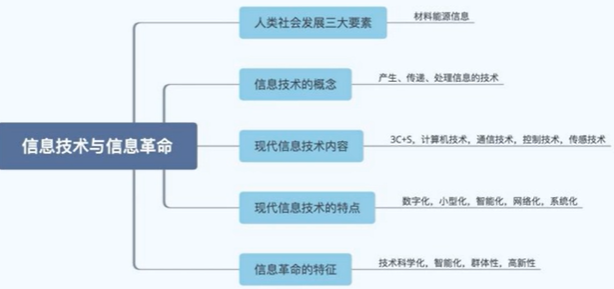

- **材料、能源、信息**是支配人类社会发展的三大基本要素。（选择）
- **信息技术**：应用信息科学的原理和方法研究信息**产生、传递、处理**的技术，
  - 具体包括有关信息的产生、收集、交换、存储、传输、显示、识别、提取、控制、加工和利用等方面的技术。
- **现代信息技术**: 3C+S
  - 通信技术（Communication）
  - 计算机技术（Computer）
  - 控制技术（Control）
  - 传感技术（Sensor）
  - 基础: 微电子技术
- **现代信息技术特点:**
  - 数字化: 二进制编码
  - 小型化: 体积变小
  - 网络化: 网络技术普及
  - 智能化: 智能技术
  - 系统化: 一卡通
- **信息革命:**
  - 含义：因信息技术发展而导致的社会变革称为信息革命。
  - 特征: 
    - 技术科学化
    - 群体化
    - 智能化
    - 高新性

#### 1.1.2 信息化

- **信息化定义**：（名词解释）
  - 指一个具体组织实体（如政府），应用**信息技术**提高信息资源**开发和利用**效率的**过程和活动**。
- **对于信息化的理解？**（选择）
  - 国民经济和社会生活中逐步应用的**过程**；国家信息化
  - 人类生存发展的一个历史**阶段**；信息产业
  - 促进经济发展和社会进步的重要**战略**；信息社会
  - 提高信息资源开发和利用效率的**活动**。
- **国家信息化体系的6大要素**（选择）
  - 信息资源
  - 信息网络
  - 信息技术应用
  - 信息技术和产业
  - 信息化人才队伍
  - 信息化政策法规和标准规范
- **国家信息化的3大思路**（选择）
  - 领域信息化
  - 区域信息化
  - 企业信息化
- **3大信息产业**（选择）
  - 信息技术制造（微电子、计算机等信息制造企业）
  - 信息内容产生（门户网站、电子媒体出版业）
  - 信息服务业（信息技术支持，信息中介，信息咨询等）
- 信息社会（不需掌握）
  - 信息化使我们正面对着一个数字化、，网络化的信息社会，它有着与农业社会和工业社会明显不同的特点
  - **信息社会特点**：
    - 非物质性：虚拟性
    - 超时空性：全球化，距离，时间
    - 可拓展性：可共享

### 1.2 信息（重要）

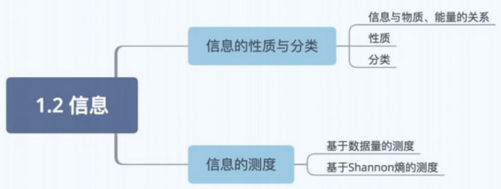

#### 1.2.1 信息的概念及其发展

- 信息传递

  - 
  - 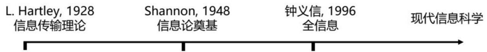

- 1948 Shannon

  - 通信的发生是以通信者具有不确定性为前提，通信的目的是就是减少不确定性，而消除不确定性的东西正是它所传递的信息
  - 只关注信息的传输，即通信，不关注信息的内容

- Shannon 熵（信息量）公式

  - $$
    H(Pi)=- \sum Pi \log_2(Pi)
    $$

  - 信息量是个状态信息量的平均信息量（数学期望）

  - 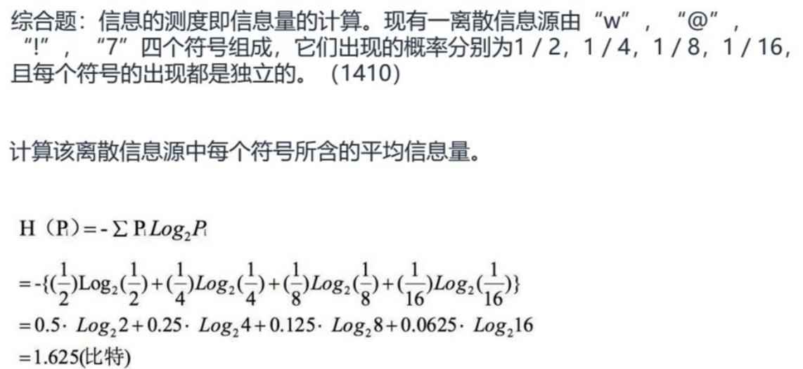

  - 当各个状态的出现概率相等，即 $P_i=\frac{1}{n}$ 时，Shannon 熵公式变成

    - $$
      H=N\times \log(S)
      $$

      - Hartley 信息量测度公式
      - Hartley 公式是 Shannon 熵公式的特例

    - H 为信息量，N 代表 1 条信息包含字符的个数，S 代表通信符号集中符号的个数

- 1996 钟义信 **全信息理论**

  - 本体论

  - **认识论**

    - 语法信息（外在）
      - 随机信息（统计）信息
      - 模糊信息（状态不明确）
      - 偶发信息
    - 语义信息（内在）
    - 语用信息（价值）

  - **全信息** 

    - 实在信息（事物本身固有）
    - 先验信息（主体感知）
    - 实得信息（主体观察）

    引入主体和客体关系，衍生出

#### 1.2.2 信息的性质与分类

- 信息与物质、能量的关系

  - 联系且区别
  - 物质是基础，信息与能量源于物质
  - 信息可以转换为物质和能量

- **信息的性质**（选择题）

  - 无时无刻不在；精神世界信息无限一普遍的和无限的（实在信息）
  - 产生于物质，依附于媒体；可独立被重现一依附于媒体且可以独立于源事物
  - 可复制给其他主体，本身无损失一可以共享
  - 转换成其他形式存储，BMP、PNG一可以变换
  - 时间上传递-存储；空间上传递-通信；一可以传递但不增值
  - 信息随时间变化一动态且有时效性
  - 主体（人）利用感官感知信息一具体而可以被感知和处理的

- 信息的分类

  - 存储介质划分：磁电声光实

    - 磁介质，电介质，光介质，声介质，实体介质

  - 表现形式划分：

    - 文字信息、图像信息、声音信息、气味信息、形态信息

  - 信息的记录方式划分：

    - 事物型信息、记录型信息、智力型信息

  - **按信息源顺序层次划分**：（重点）

    - 原始信息：源事物发出，且未被处理的直接信息
    - 零次信息：人利用感觉（五官）直接得到的信息
    - 再生信息：一次信息（期刊论文）、二次信息、三次信息
    - 划分标准：信息加工处理深度

  - **按信息效用（影响）层次划分**：（重点）

    - | 层次 | 信息内容     | 描述问题 |
      | ---- | ------------ | -------- |
      | 1    | 迹象         | 什么？   |
      | 2    | 事实         | 是什么？ |
      | 3    | 知识         | 为什么？ |
      | 4    | 智能（策略） | 怎么办？ |

      最有效用的信息是： **知识、智能**

- （1）存储介质：磁、电、声、光、实质
  （2）信息表现形式：文字、图像、声音、气味、形态
  （3）信息记录方式：实物型、记录型、智力型
  （4）信息源顺序：原始信息、零次信息、再生信息（一次、二次等）
  （5）信息效用顺序：迹象，事实，知识，智能

#### 1.2.3 信息的测度

- 基于数据量的信息测度：
  - 按数据所占存储装置空间大小来衡量信息量的大小，字节作为单位
    - **重点：**按数据存储大小来衡量的方法 **基于语法信息。**

#### 1.2.4 信息功能与过程

产生 获取 传递 加工 再生 施效（利用）

### 1.3 信息资源管理概述

#### 1.3.1 信息资源

- **资源**：（名词解释）
  - 在自然界和人类社会生活中可以用来创造物质财富和精神财富，并具有一定积累的客观存在形式。
- 经济属性：
  - 需求性
  - 稀缺性
  - 可选择性
    - 不同资源组合有不同效果

#### 1.3.2 信息资源管理的主要内容

IRM: Information Resource Management

- 信息资源
  - 广义信息资源：是信息及其生产者、信息技术的集合，包括社会经济活动中经过加工处理
  - 狭义信息资源：有序化并大量积累的有用信息的集合，为某种目的而生产有用信息的信息生产者集合，加工、处理和传递有用信息的信息技术集合。
  - 信息——多生产者——信息技术
- 信息资源的性质
  - 不可分性
  - 积累性或非消耗性
  - 认知相对性
  - 不同一性
  - 驾驭性
- 内容
  - 管理对象：信息资源
  - 工具：信息技术
  - 特点：技术依赖性和系统综合性

#### 1.3.3 信息资源管理的产生与发展

- 产生背景
  1. 信息**爆炸**：文书记录和文献数量激增
  2. 三个应用**学科的发展**
     1. 数据库管理
     2. 记录或文献管理
     3. 数据处理管理
  3. 信息资源**地位提高**：信息无处不在
- 信息资源管理的发展
  - 马钱德（D.Marchand）和克雷斯莱茵（J.C.Kresslein）**四阶段说**
    - 1900-1960年 物的控制
    - 1960-1970年 自动化技术
    - 1970-1980年 信息资源管理
    - 1990年至今 知识管理
  - 信息资源管理：十九世纪末产生，学说在20世纪末产生
  - 信息资源管理强调“信息资源”为主导、技术是服务的管理理念
  - 知识管理：更高层次的信息资源管理，强调技术与管理的融合。

关键词：

信息化 信息 信息测度 Shannon熵 信息过程 信息资源

本章小结
练习题
网络学习题
思考题

## 第2章 信息化规划与组织

学习目标与要求

### 2.1 组织战略与信息化

- 组织战略
  1. 定义：组织战略是组织达成目标、完成使命的综合计划
  2. 包括：
     - 总战略：总的方向
     - 经营战略：某一产品、部门的竞争合作战略
     - 智能战略：各职能部门制定的战略，如制造、研发、信息技术等
  3. 制定过程：
     - 环境分析：充分考虑组织内部、外部所有的优势和劣势，评估机会和风险，对组织所处环境进行判断
     - 战略决策：明确使命、目标——战略方案
     - 战略规划的形成和完善：细化调整，形成可执行的战略规划
- 组织战略的规划方法
  1. **SWOT 矩阵法**（波士顿矩阵法）
     - SWOT矩阵法是全面分析组织外部环境和内部资源、**寻找满意战略组合**的分析工具。
     - 外部环境分析包括明确机会（O）和威胁（T），内部资源分析包括了解优势（S）和劣势（W），并根据绘制的SWOT矩阵进行组合分析和综合分析。
     - 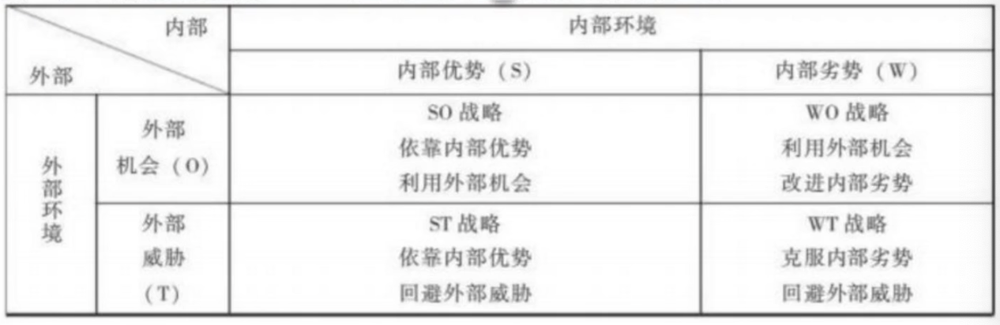
  2. 波特五力模型
     - 企业开辟新业务
  3. 价值链分析法
     - 业务流程重组
- 组织战略与信息化关系
  1. 组织信息化的**目的**：支持组织战略实现。
  2. 信息化是组织战略制定的**工具**。
  3. 组织信息化工作**重心**：支持管理决策的智能化。
  4. 组织内**最底层**的普通职员负责事务处理。
- 组织战略与信息化战略
  1. 信息化战略是组织战略的重要组成部分，是组织战略的**指导方针**
  2. 信息化战略必须服从**组织战略**的**核心思想**，在组织战略的框架下制定

### 2.2 信息化规划

#### 2.2.1 信息化规划概述

- 信息化发展中遇到的问题

  - **信息孤岛**：数据信息单元单独存放、不能自动的实现信息共享与交换，需要靠人工与外界进行联系的一种现象

    - **本质是组织信息化进程缺乏整体规划而造成的**

  - **IT 黑洞**：企业在 IT 应用上的巨额投资并没有达到预期效果，经济学家称为”生产率悖论“

    - 产生 IT 黑洞的原因

    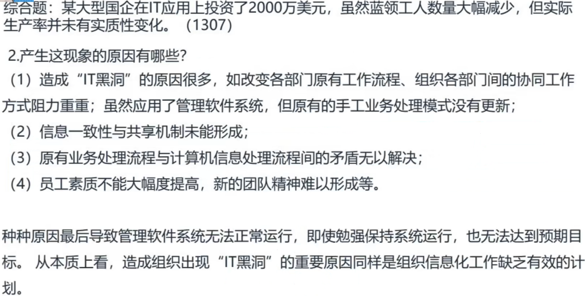

  - **IT 项目泥潭**：90%的 ERP 系统的实施要么超过预定时间，要么超过预算

- 如何解决这些问题？

  - **为了规避风险，保证信息化建设成功和健康发展，需要实现对组织信息化进行周密的计划**

- 信息化规划

  - 战略目标（如何规划）
    1. 业务匹配：信息技术投资与组织的远景规划和战略目标的匹配
    2. 竞争优势：提高组织竞争优势
    3. 管理资源：优化组织信息资源
    4. 技术架构：勾画出组织战略、组织结构和业务流程相适应的信息技术架构
  - **组织信息化规划在时间上一般为 3-5 年**

- 诺兰模型：

  - 组织 IT 应用发展分为起步、扩展、控制、集成、数据管理、成熟 6 个阶段
  - 早起信息化规划局限于技术（战术）层面的**信息系统项目规划**

- 信息化规划层次

  - 战略管理层面
    - 信息化**战略**规划
  - 管理业务层面
    - 信息化**资源**规划
  - 技术实现层面
    - 信息化**项目**规划

  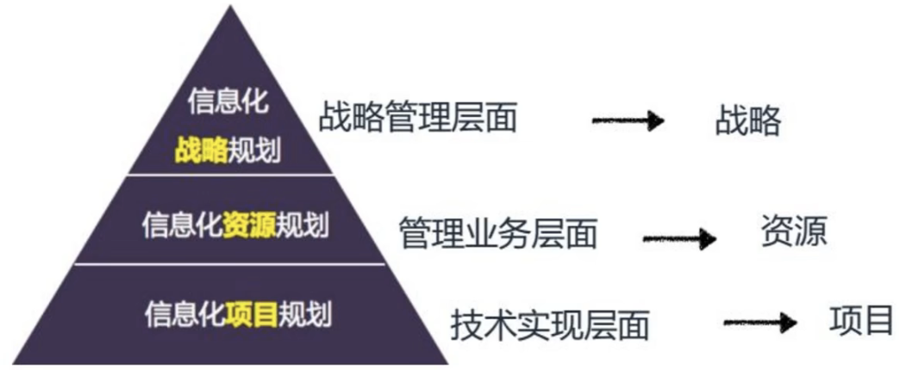

- **开展信息化规划的方式**（选择题）

  - 从下而上
    - 适合业务相对**稳定**的组织
  - 由上而下
    - 有较明确（新）发展战略的组织
  - 由外而内
  - 中间开花

#### 2.2.2 信息化战略规划

信息化战略规划内容

- 信息化战略：
  - 描述组织信息化建设的方向、重点、步骤和措施等的策略
  - 是组织信息化建设与发展的整体思路与指导体系

1. 信息化建设的**愿景与架构**（大方向）
   1. 组织战略、核心竞争力的识别
   2. 管理提升与业务改进方向
   3. 信息化的作用点和愿景分析
   4. 分析组织信息化现状、进行信息化能力评估
      1. 从**人、流程、技术**三个方面分析企业信息化现状
   5. 分析差距，探讨改进构想
   6. 业务需求调整
   7. 分析信息化体系架构
      1. 定义信息化所涉及的系统边界与环境；
      2. 分析信息化建设的组织结构；
      3. 分析各子系统的相互关系。
2. 项目**方案选择与组织**（做什么）
   1. 项目方案的选择
   2. 信息化建设的项目组织
3. 信息化**项目规划**（怎么做）
   1. 信息化建设阶段规划
   2. 风险管理质量监控策略
   3. 主要实施计划与培训计划

1. 信息化战略的**规划步骤**

   1. 基础信息调研：信息化现状与发展趋势调研、组织信息化需求调研、信息化建设基础条件调研
   2. 现状评估和问题分析
   3. 信息化战略目标设计和制定

2. **信息化战略规划方法**
1. **战略目标集转化法（SST）**
      1. **识别**组织战略集
   2. 将组织战略集**转化**为组织信息化战略
      3. 选出一个方案**送**决策层**审**核
      
   2. **价值链分析法（VCA）**
   1. 内容：将组织看成输入、转换和输出活动的集合
      
      - 一个组织 = 一些活动
      
      - 价值链分析法认为**信息技术**在组织的战略牵引方面起关键作用
         - 信息技术是关键
   
      2. 内容：将一个组织看成一些输入、转换与输出活动集合，称为价值链，每个活动都能产生增值作用
      
3. **关键成功因素法（CSF）**
   1. 内容：根据关键因素决定信息资源分配的优先级，利用信息技术发掘新机遇

3. **信息化战略规划书**

   1. 环境分析
   2. 信息化战略
   3. 信息化体系架构设计
   4. 信息化技术标准
   5. 项目分派和管理

#### 2.2.3 信息资源规划

1. 信息资源规划是什么

   - 某公司信息化发展水平处于初级阶段的表现：

      1. 分散的、独立运行的事务处理系统较多，应用系统之间缺乏自动化数据交换，没有共享数据库。
      2. 应用规模较小，没有中等规模的管理信息系统，数据缺乏规范化。
      3. 集团各单位信息联网困难，没有全系统的信息化标准化管理。

      解决这些问题的技术核心是：信息资源规划（数据集成）

2. 信息资源规划的产生与内涵

   - 数据处理危机：**根本原因是系统缺乏全面有效的高层（战略）数据规划。**
   - **詹姆斯·马丁（J.Martin）提出战略数据规划**
     - 数据标准：数据**命名，属性，设计，使用**一致性规范（选择题）

3. 高复提出，信息资源规划（IRP）：

   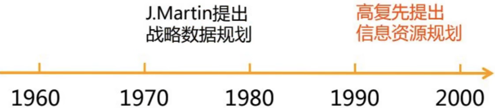

   - 是对组织管理或经营活动所需要的信息，
   - 从**产生、获取，到处理、存储、传输及利用**进行全面的规划

4. 信息资源规划的步骤

   1. 建立负责信息资源规划的**工作组**，人
   2. 分析**职能域**及其业务，流程
   3. 对职能域数据进行**标准化**，技术

      1. **组织信息资源管理基础标准：**（选择题）
         1. **数据元素**标准
         2. **信息分类**编码标准
         3. 用户**视图**标准
         4. **概念**数据库标准
         5. **逻辑**数据库标准

5. 信息资源规划的**重点工作**（选择题）

   - 业务分析
   - 主题数据库与数据标准化
     1. **主题数据库：要求信息源的唯一性，即所有源信息一次一处地进入系统。**
     2. **数据标准化：数据元素标准化，信息分类编码标准化。**

#### 2.2.4 信息化项目规划

1. 信息化项目的定义
   - **信息化项目**：在特定时间、质量、资金等约束下，以应用信息技术为目标的一系列活动。
   - **应用型项目**：应用 SAP 的 ERP 软件，完成企业资源规划。
   - 开发型项目
2. **信息化项目规划的内容**（选择题）
   1. 范围规划
   2. 进度计划
   3. 成本计划
   4. 质量计划
3. **信息化项目规划的常用工具**（选择题）
   1. 项目管理工具 MS Project
   2. 用 **WBS（工作分解结构）**工具做出范围计划
   3. 常用的进度计划工具是**甘特图**

### 2.3 信息化组织

#### 2.3.1 信息化组织机构

1. 案例：海航集团
   - 信息化离不开有效的组织
   - 人、技术、管理
2. **信息化组织机构的类型**（选择题）
   1. **隶属**业务部门的信息部门
   2. 与业务部门**平级**的信息部门
   3. 由 **CEO** 直接领导的信息部门
   4. 由**信息管理委员**会直接领导的信息部门
3. **信息化组织机构的职能**（选择题）
   1. 信息化**战略制定及管理工作**的组织
   2. 信息系统**研发与管理**
   3. 信息系统**运行维护与管理**
   4. 信息资源**管理与服务**
4. 信息化组织机构的**岗位设置**
   1. **系统研发与管理部**（重要）
      1. **系统分析员**
         - 系统分析员的主要任务是对现行**系统运行环境、作业流程**和**用户需求**进行详细调查，
         - 进而确定目标系统的**功能结构、性能指标、资源配置、编码体系、逻辑模型**，以便为系统设计提供科学依据。
      2. 系统设计员
      3. 程序员
      4. 测试人员
   2. 系统运行维护与管理部
      1. 控制台操作员
      2. 设备管理员
      3. 数据录入员
      4. 运行的培训教师
      5. 资料保管员
      6. 支持人员
   3. 信息资源管理与服务部
      1. 资源管理员
      2. **信息员**（重要）
         - 负责信息的**收集、整理和发送**。
      3. 信息服务与技术支持人员

#### 2.3.2 CIO机制

- Chief Information Officer，首席信息官
  - 专门负责组织信息化建设、实施、和运作的管理者
  - 通常是组织决策层成员。
- **CIO 机制的构成**（选择）
  - **核心**：CIO
  - 信息化管理**委员会**：领导小组
  - 信息部门：**支持中心，管理中心**
  - 业务部门的信息人员：**业务部门**是信息化的**实施主体**
- CIO 的职能
  - 战略的参谋者
  - 战略的执行者
  - 信息的传播中介
- CIO 的能力
  - 管理知识
  - 技术知识
  - 沟通能力
  - 协调能力
  - 项目管理

关键词
本章小结

练习题

网络学习题

思考题

## 第3章 信息系统资源管理

学习目标与要求

### 3.1 信息系统资源管理概述

#### 3.1.1 信息系统的基本概念

1. **信息系统的定义**（名词解释）

   - **信息系统**是一个完成信息**采集、传递、存储、加工、维护**和**使用**等信息处理活动的系统。
   - **特点**：（选择）
     1. 涉及的数据量**大**
     2. 绝大部分数据是**持久**的
     3. 持久数据为多个应用程序所**共享**
     4. 向用户提供信息检索、统计报表、事务处理、规划、设计、指挥、控制、决策、报警、咨询等**信息服务**

2. **信息系统的组成**（选择）

   - 信息系统是一种非常复杂的**人机系统**，组成要素多，**结构复杂**。
   - 人、硬件、软件（系统、应用软件）、数据、处理规程

3. **信息系统的生命周期**（选择、简答）

   信息系统和任何事物一样，有一个产生、发展和消亡过程，这个过程周而复始，形成了信息系统生命周期。

   1. 第一步：系统**规划**阶段：（简答）
      - 对组织的环境、战略、目标、现行系统的状况进行**初步调查**。
      - 确定信息系统的**发展战略**。
      - 分析和预测建设新系统的**需求**。
      - 指定建设信息系统的各种指标，研究建设新系统的**必要性和可能性**。
      - 给出拟建各种子系统的顺序以及备选方案，并进行可行性分析，写出可行性分析报告，审议通过后，编写成系统**开发计划**书。
   2. 第二步：系统**分析**阶段：（简答）
      - 对**现行系统**运行环境、作业流程和用户需求进行**详尽调查**。
      - 确定**目标系统**的功能结构、性能指标、资源配置、编码体系、**逻辑模型**。
      - 系统分析完成后形成系统**分析**说明书。
   3. 第三步：系统**设计**阶段：
      - 系统**设计**说明书
   4. 第四步：系统**实施**阶段：（选择）
      - **系统实施按系统设计说明书**，指定系统实施计划。
   5. 第五步：系统**运行与维护**阶段

4. **信息系统的分类**（选择）

   1. | 组织层次 | 系统类型                                        | 典型功能                                                     |
      | -------- | ----------------------------------------------- | ------------------------------------------------------------ |
      | 战略层   | 经理支持系统（ESS）                             | 长期销售趋势预测、长期预算计划、长期人力资源计划（战长）     |
      | 管理层   | **决策支持系统（DSS）**  管理信息系统（MIS） | 成本分析、定价分析、投资分析 人力资源、财务、设备材料等业务管理系统 |
      | 知识层   | 办公自动化系统（OAS） 知识工作系统（KWS）    | 文字处理、电子邮件、电子日历等 计算机辅助设计、虚拟现实   |
      | 操作层   | 事务处理系统（TPS）                             | 销售记录、收支记录、设备使用记录、库存记录、工资发放等       |

#### 3.1.2 信息系统的资源观

1. **信息系统的资源观**（选择、简答）

   - **资源系统观**：全面观点

     - 信息系统资源观中**最核心**的观点

     - 三点含义：

       1. 信息系统是组织系统中的一个**子系统**，是组织的**神经系统**。

       2. 信息系统资源是由各种**组成要素**或**子系统资源**构成的。

          系统集成：

          1. 为**整合优化**系统资源提供了**工程科学方法**
          2. 关键：系统之间**互联**和**互操性**问题（教研平台、题库和app）

       3. 信息系统资源是动态发展的，有**产生、发展、消亡**的生命周期

   - 资源辩证观

     - 三个问题：
       1. 有限与无限（物质和信息）
       2. 有益性和有害性（社会法律）
       3. 量与质（量变引起质变）

   - 资源层次观

     - 三个层次：
       1. 低：**物质**资源
       2. 较高：**能源**资源
       3. 最高：**信息**资源

   - 资源开放观

     - 打破地域层次封锁，合理配置资源
     - 新理念：**云计算，泛在网络**

#### 3.1.3 信息系统资源管理

不考

### 3.2 信息系统开发管理

#### 3.2.1 信息系统开发管理的目的与意义

1. 信息系统开发管理的目的
   - 信息系统开发项目管理：
     - 要解决的基本问题，就是如何按所选择的研制方法，对开发项目进行有效的**计划、组织、协调、领导和控制**。
2. **信息系统开发管理的意义**（简答题）
   - 信息系统开发项目管理的重要性：
     1. 可以进行系统的思考，进行切合实际的**全局性安排**
     2. 可为项目**人力资源**的需求提供确切的依据
     3. 通过合理的计划安排对项目进行**最优化控制**
     4. 能够提供准确、一致、标准的**文档数据**

#### 3.2.2 信息系统开发管理的内容

1. **信息系统项目开发人员组织**（选择题）

   - 项目委员会：项目管理组，项目评审组，项目开发组
   - **一把手原则**：信息系统项目开发管理的**核心**
   - 项目评审组职责：
     1. 项目的**需求分析**
     2. 系统**选型**和开发**计划**
     3. 系统开发**阶段**性
     4. 项目**总结报告**

2. 信息系统项目开发**过程管理**

   1. **项目授权**：
      - 明确责任者
   2. **需求分析**：
      - 可行性评估
      - 需求评估
      - 项目总体安排
   3. **项目实施管理**
      - 计划
      - 检查
      - 控制

3. 信息系统项目开发管理的**质量控制**（选择题、简答题）

   - 质量控制的首要工作就是建立项目的**质量衡量标准**。

   - 项目质量控制标准是项目开发评审和控制标准的基础和核心。

   - **项目质量控制标准包括**：【简答题】

     （**控制 开发 流程 标准，协调 满意度**）

     - 项目开发**工作流程**的合理化
     - 开发时间和成本预算**控制**
     - 项目风险**控制**
     - 开发工作安排**效率**
     - 开发工作的**协调管理**过程
     - 工程化**开发方式**的运用
     - 程序的运行效率和统一的**信息标准**
     - 信息系统需求方**满意度**

### 3.3 信息系统运行维护管理

1. **信息系统运行维护管理**（名词解释，简答题）
   - 信息系统运行维护管理：是指信息系统**上线后**对信息系统运行过程中的**人员、硬件、软件、数据和规程**进行管理的活动。
     1. 人员管理重点在于**组织机构**建设、**培训和制度**建设
     2. **软硬件管理**主要是对软硬件系统进行检测、记录、维护、评价和审计过程
     3. **数据管理**主要是数据库的日常管理和维护

#### 3.3.1 信息系统运行维护中的人员管理

1. 【案例分析】
           SHANG:集团为H省皮革行业的龙头企业，信息主管黄先生为了企业信  息系统的运行忙得不亦乐乎。胡先生是该企业总裁，他对信息系统运转  有些犹豫，建设一个系统靠团队，那系统运行和维护靠谁呢？这不仅是一个技术问题，更是一个管理问题，也已经不是一个人的事情，而是关联到几百个合作伙伴，关系到几万人的大事。胡总裁对信息系统运转可能存在的薄弱环节十分迷茫。  

   1. 根据案例说明系统运行和维护的主要负责人员和相关机构。
   2. 分析系统运转过程中可能存在的薄弱环节。
      1. 信息系统运行和维护人员组织机构建设；
      2. 各类人员培训；
      3. 各种规章制度的制定与执行；

2. 信息系统运行和维护人员组织机构 

   - 以 **CIO**为首、以组织的**信息部门**为依托实体的、组织内各部门专职或兼职信息系统管理人员网状连接形成的完整的信息系统运行和维护机构。

   - 信息系统的运行和维护新的**发展趋势：外包**【选择题★】

3. **人员培训**（选择题）

   - **终端用户**：基本操作和系统功能模块使用的培训
   - **系统维护管理人员**：专门的技术和管理制度的培训

   **培训目标**：（简答题）

   - 使用户对目标系统有**较全面**的了解
   - 在用户中强化信息管理的**理念**
   - 使用户了解目标系统对现行系统的新要求，为新系统的运行作必要的**准备工作**

4. 信息系统运行管理制度【了解】

   - 指信息系统运行过程中的保障信息系统安全、稳定运行的各种规章制度，
   - 主要用于规范各类人员的行为。

#### 3.3.2 信息系统日常运行管理

1. 信息系统日常运行管理的内容
   1. **系统运行情况的记录**（选择题）
      - 正常
      - 不正常
      - 无法运行
   2. 审计跟踪
   3. **审查应急措施的落实**（选择题）
      - 应急计划
      - 数据备份必须做，关键领域设备备份
   4. 信息系统硬件和耗材等资源的管理
   5. 系统升级与退化

#### 3.3.3 信息系统数据管理

1. **数据库管理员 (DBA) 的主要操作**【选择题★】

   **技术类5**

   1. 安装和升级数据库及应用程序工具。

   2. 确定数据库设计系统存储方案，并制定未来的**存储需求计划**。

   3. 开发人员设计了一个应用，就需要DBA来创建**数据库存储结构**。 

   4. 开发人员设计了一个应用，就需要DBA来创建**数据库对象**。  

   5. 根据开发人员的反馈信息，必要的时候，修改**数据库的结构**。 

      **安全类4**

   6. 登记数据库的用户，维护数据库的**安全性**。 

   7. 保证数据库的使用符合知识产权的相关**法规**。  

   8. 控制和监控用户对数据库的存取**访问**。

   9. 监控和优化数据库的**性能**。

      **备份类3**

   10. 制定数据库备份计划，灾难出现时对数据库信息进行**恢复**

   11. **维护**适当介质上的存档或者备份数据。

   12. 备份和恢复数据库、联系数据库系统的生产厂商，跟踪技术信息。

#### 3.3.4 信息系统维护管理

1. 信息系统维护

   - 信息系统的维护是为了使信息系统处于**合用状态**而采取的一系列**措施**，目的是**纠正错误**和**改进功能**，保证信息系统**正常工作**。
   - 维护的种类：
     1. 改正性维护 
     2. 适应性维护
     3. 完善性维护
     4. 预防性维护
   - 完善性维护：用户需求增加而产生的软件修改或在开发。比例最大。

2. **系统维护内容**（简答题）

   助记词：成熟马背

   1. **程**序维护
   2. **数**据维护
   3. 代**码**维护
   4. 设**备**维护

3. **系统维护的流程**（简单题）

   助记词：目标方案实施档案总结

   1. 确定维护目标
   2. 建立维护计划方案
   3. 维护的实施
   4. 系统维护档案建立
   5. 维护的验收、总结和评价

#### 3.3.5 信息系统运行中的IT服务管理

1. 材料：某航空集团公司拥有一个**地域分散、多厂商、多平台、多系统**的复杂 IT 环境。IT系统运行复杂，业务系统故障多，技术人员的被动工方式难以适应  企业IT服务需要。要求：试运用IT服务管理相关知识为该公司出谋划策，使其 IT服务向更高层次的主动服务发展。

   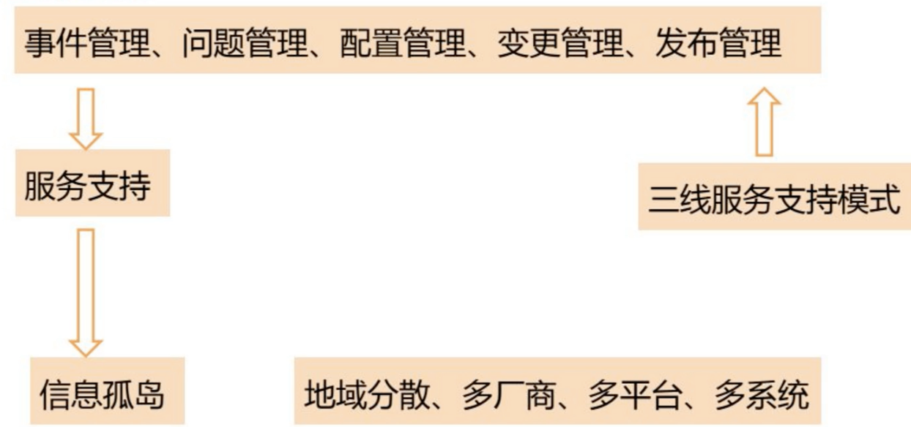

   1. 引入先进的IT服务管理工具或相关平台型软件，实现服务台管理、事件管理、问题管理、变更管理、配置管理等多个功能。
   2. 开展IT服务管理体系的建设，首先调整和优化IT服务部门的组织结构，工作流程；
   3. 其次可以采用多层次服务支持模式，比如**三线服务支持模式**，
      1. 一线为**IT服务热线和现场工程师**，负责解决终端用户问题和巡检及监控等任务；
      2. 二线为**运行和维护管理人员**，除了日常工作外，负责解决一线突发事件，并对系统架构进行统一规划；
      3. 三线为**技术专家组人员**，负责IT服务项目管理工作及解决二线问题。

2. **IT服务管理**【选择题】

   1. IT服务管理的理念是 “**以流程为导向、以客户为中心**”   
   2. IT服务管理的两大类核心流程：
      1. **服务支持类**：服务台、事件管理、问题管理、配置管理、变更管理、发布管理
      2. **服务提供类**：服务级别管理、IT服务财务管理、IT服务持续性管理、  可用性管理和能力管理

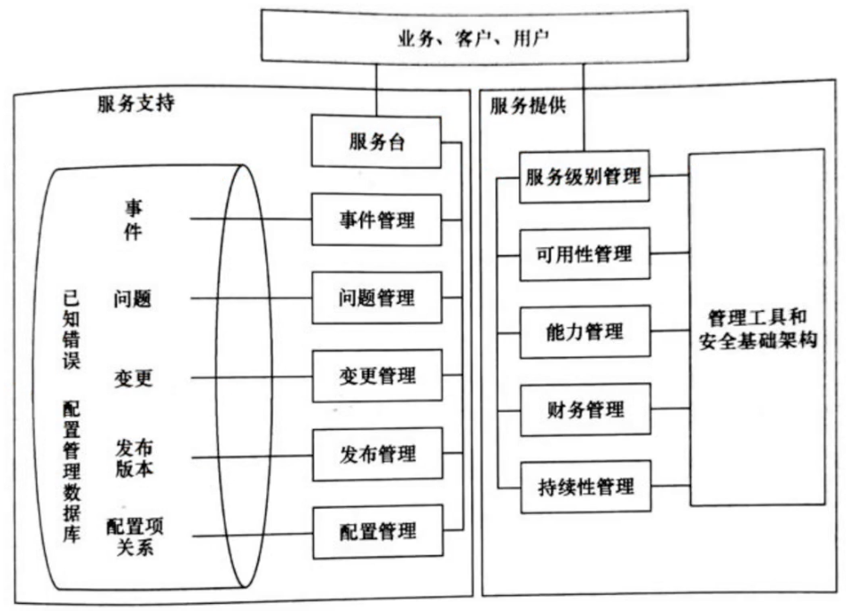

#### 3.3.6 信息系统文档管理

1. **信息系统文档的内容**【选择题★】    
   - 信息系统文档主要包括**系统手册、用户手册、管理员手册、操作规程**及其相应的**管理制度**。
   - **程序**和**文档**合并一起称为软件。【选择题★】
2. **信息系统文档的作用**【选择题★】五个沟通
   1. 利于**系统分析员**与**用户**进行沟通
   2. 利于系统开发人员与**项目负责人**进行沟通
   3. 利于系统开发人员与**用户**进行沟通
   4. 利于系统开发人员与**系统维护人员**进行沟通
   5. **系统开发人员**之间进行沟通

#### 3.3.7 信息系统的评价和审计

1. 信息系统评价的内涵及其内容
   - 信息系统评价是指对信息系统的**运行状态**和**质量**进行各种衡量，以判断其是否**优质、高效、安全**地运行的活动。
   - 管理方面，主要考虑：
     - **提高**企业管理水平
     - **优化**管理流程
     - **完善**规章制度
     - **提高**人员素质等
   - 技术方面，主要是管理信息系统的性能，主要包括：
     - 系统的**总体水平**
     - 系统**功能与层次**
     - 信息资源**利用**的深度
     - 系统的**质量**
     - 系统文档的**完备**性
     - 系统的**安全与保密性**
   - 经济方面，主要是信息系统的成本与效益
     - 成本：开发成本、设备成本、运行成本
     - 开发成本：系统分析、系统设计、编码和测试、人员培训、记录文件等方面的成本

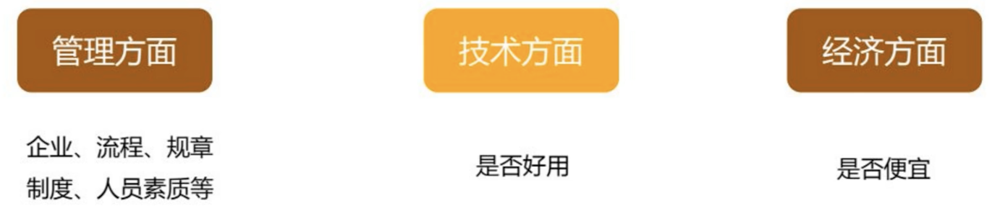

1. 材料：Q法院院长在经济责任审计项目中，通过对法院信息系统有关数据的对  比分析，发现Q法院业务信息系统部分数据存在明显的逻辑错误问题。法院以  此为切入点，开展信息系统评价和审计，发挥了审计的“免疫系统”功能。  
   1. 阐释信息系统审计的定义；
      - 信息系统审计是一个通过收集和评价审计证据，
      - 对信息系统是否能够保护资产安全、 维持数据的完整、使被审计单位的目标得以有效实现、使组织的资源得到高效使用等方面做出判断的过程。  
   2. 结合材料，分析Q法院院长可采取哪些有效措施发挥**审计**的“免疫系统”功能。
      - 对法院信息系统有关数据进行对比分析，
      - 开展信息系统网络安全控制、服务器操作系统安全控制、数据库系统安全控制等一般控制审计；  
      - 开展信息系统数据输入输出等应用控制审计；  
      - 对业务信息系统使用绩效审计

关键词

| 信息系统         | 信息系的生命周期 | 资源观               |
| ---------------- | ---------------- | -------------------- |
| 信息系统资源管理 | 信息系统开发管理 | 信息系统运行维护管理 |
| 信息系统维护     | 数据管理         | IT服务管理           |
| 文档管理         | 信息系统评价     | 信息系统审计         |

本章小结
练习题
网络学习题
思考题

## 第4章 信息资源内容管理

学习目标与要求

### 4.1 信息需求

#### 4.1.1 什么是信息需求

#### 4.1.2 信息需求的类型

#### 4.1.3 组织中不同层次的信息需求

#### 4.1.4 决策与信息需求

### 4.2 信息采集

#### 4.2.1 信息源

#### 4.2.2 信息采集原则

#### 4.2.3 信息采集方法

#### 4.2.4 信息采集途径

### 4.3 信息存储与检索

#### 4.3.1 信息存储

#### 4.3.2 信息检索

### 4.4 信息加工与分析

#### 4.4.1 信息加工

#### 4.4.2 信息分析

### 4.5 知识管理

#### 4.5.1 知识管理的概念

#### 4.5.2 知识管理工具

#### 4.5.3 知识管理软件简介

### 4.6 信息传递与共享

#### 4.6.1 信息传递

#### 4.6.2 信息共享

关键词
本章小结
练习题
网络学习题
思考题

## 第5章 信息资源管理的标准与法规

学习目标与要求

### 5.1 信息资源管理标准化

#### 5.1.1 标准的基本概念

#### 5.1.2 标准化的基本概念

#### 5.1.3 信息资源管理标准化的意义与作用

#### 5.1.4 信息资源管理标准化的内容

#### 5.1.5 信息资源管理标准化的指导原则和基本方法

#### 5.1.6 信息资源管理标准的制定与实施

### 5.2 ISO9000质量标准体系

#### 5.2.1 IS09000系列标准产生的背景

#### 5.2.2 1S09000系列标准的构成

#### 5.2.3 1S09000标准的应用与发展

### 5.3 信息资源管理的法律规范

#### 5.3.1 概述

#### 5.3.2 信息采集方面的法律规范

#### 5.3.3 信息公开方面的法律规范

#### 5.3.4 信息传播方面的法律规范

#### 5.3.5 信息市畅管理方面的法律规范

#### 5.3.6 信息资源利用方面的法律规范

#### 5.3.7 信息安全方面的法律规范

关键词
本章小结
练习题
网络学习题
思考题

## 第6章 信息资源安全管理

学习目标与要求

### 6.1 信息资源安全管理内涵

### 6.2 信息资源安全的系统管理

#### 6.2.1 信息系统安全模型

#### 6.2.2 行为规范管理

#### 6.2.3 实体安全管理

#### 6.2.4 网络安全管理

#### 6.2.5 软件安全管理

#### 6.2.6 数据安全管理

### 6.3 数据加密技术及其应用

#### 6.3.1 密码学基本概念

#### 6.3.2 加密技术及其应用

关键词
本章小结
练习题
网络学习题
思考题

## 第7章 企业与政府信息资源管理

学习目标与要求

### 7.1 企业信息资源管理

#### 7.1.1 企业及其经营管理

#### 7.1.2 企业信息化与企业信息资源管理

#### 7.1.3 案例

### 7.2 政府信息资源管理

#### 7.2.1 政府信息资源的类型

#### 7.2.2 政府信息资源的特点

#### 7.2.3 案例

关键词
本章小结
练习题
网络学习题
思考题
参考文献
