> # [**计算机信息管理专业课程**](https://github.com/Eished/self-study-exam_notes)
>
> **最新自考笔记** : https://github.com/Eished/self-study-exam_notes

# 大纲 (02323) 2017版

## 题型

1. 单项选择题
   - 20题x1分 = 20分
2. 填空题
   - 10题x2分 = 20分
3. 简答题
   - 5题x4分 = 20分
4. 综合题
   - 4题x10分 = 40分

## 试卷分析

操作系统概论题型分析

**选择题 20分**

1 操作系统

2 操作系统

3 操作系统

4 进程管理

5 进程管理

6 进程调度

7 进程调度

8 进程调度

9 进程调度

10 进程调度

11 内存管理

12 内存管理

13 内存管理

14 内存管理

15 内存管理

16 文件系统

17 文件系统

18 文件系统

19 I/O 设备

20 I/O 设备

**填空题 20分**

21 操作系统概念

22 进程概念

23 进程管理、进程调度

24 进程管理、进程调度

25 进程管理、进程调度

26 内存管理

27 内存管理

28 内存管理

29 文件系统

30 I/O 设备

**简答题 20分**

31 进程同步：计算或文字

32 进程调度：计算或文字

33 内存分页：计算或文字

34 文件系统：文字题

35 I/O 设备：文字题 处理过程 功能

**综合题 40分(重点)**

36 进程同步：记录型信号量

- 2021 04 同1904

37 进程调度：优先级算法，短进程优先、先来先服务、优先权 

- **2021 04 死锁 银行家算法 need矩阵=max矩阵-allocation矩阵**

38 内存分页：页大小、物理地址、逻辑地址

39 文件系统：磁盘寻道算法，FCFS、CSCAN

## 真题201910

### 一、选择题

1. 如果把操作系统当作一种接口, 是指该接口位于 **用户与硬件之间**。
2. 在单CPU的电脑上用迅雷下载文件,同时用 Excel做表格,这体现了操作系统的 **并发性**。
3. 不属于**微内核**操作系统的是 **Linux**。
4. 程序顺序执行的特点不包括 **间断性**。
5. 某计算圆周率的程序(无输入但输出值一样)在同一个 Windows机器上第一次运行耗时3分钟,第二次运行耗时5分钟,这体现了程序并发执行的哪个特点?  **间断性**。
6. 在采用优先权调度算法的系统中，如果所有进程都具有相同的优先级，则此时优先 权调度算法等效于 **先来先服务调度算法**。
7. 相对灵活且对低优先权进程不存在饥饿问题的是 **多级反馈队列调度算法**。
8. 最容易引起进程长期得不到调度的饥饿问题的是 **抢占式静态优先权调度算法**。
9. 死锁的必要条件不包括 **剥夺条件**。
10. 死锁与资源分配的安全状态之间的关系是 **死锁状态一定是不安全状态**。
11. 关于**操作系统内存管理**的目标，下列错误的是 提高内存的物理存取速度。
12. 当请求大小为64个页框的内存时，假设当前系统只有16、32、128、256大小的页框链表中有空闲块，采用Linux的伙伴系统算法，应选择的页框大小是 **128**。
13. 动态重定位技术的主要特点是 **在程序执行期间可动态变换映像在内存空间的地址**。
14. 基于分页的虚拟存储系统为某进程在内存中分配了三个页框，访问页的走向为 4，3，2，1，4，3，5，4，3，2，1，5，开始时所有页均不在内存中，采用**先进先出置换算法**，会发生页置换的次数为 6。
15. 某**分页存储管理系统**，逻辑地址长度为24位，其中页号占10位，则页大小是 **$2^{14}$ 字节**。
16. 文件系统中能实现按名访问文件的重要数据结构是 **目录**。
17. 操作做系统中处理文件的部分称为 **文件系统**。
18. 在UNIX系统中，可以读取目录内容的操作是 **OPENDIR**。
19. I/O 设备中，按传输速率分类，传输速率为几个~几百个字节/秒的设备称为 **低速设备**。
20. 磁盘的I/O 控制方式是 **DMA**。

### 二、填空题

1. 操作系统的主要功能包括：**处理机管理、内存管理、设备管理、文件管理**。
2. **进程控制块**中保留的处理机状态信息通常包括：**通用寄存器、指令计数器、程序状态字和用户指针。**
3. Linux 的中断描述符表中，第15号中断服务例程入口地址保存在相对于表起始地址的偏移量为 **120**。
4. 对多处理器系统有多种分类方法，根据处理器的耦合程度不同，可以把多处理器系统分为 **紧密耦合 多处理器系统**和 **松弛耦合 多处理器系统**。
5. 三个进程P、Q、R对某类资源的最大需求量分别是8个、9个和3个，且目前三个进程已分别得到了2个、4个和2个。为保证系统的安全，该系统目前剩余的资源至少要有 **3 个**。
6. 程序的执行在一段较短时间内，会局限于某个部分，相应地，它所访问的存储空间也局限在某个区域，程序所遵循的这个特征称为 **局部性原理**。
7. 在内存管理中，连续分配存储管理方式的动态分区分配算法中 **最佳适应** 算法能避免大材小用，内存利用率高，但易留下难以利用的小空闲区。
8. 采用**分页存储管理**方式的系统，页大小为1KB，逻辑地址为0x1A6F（十六进制），则该逻辑地址所在页号为 6（用十进制表示），页内偏移为 623（用十进制表示）。
9. 文件的类型包括**正规文件**、 **目录文件**、**字符设备文件**和 **块文件**等。
10. 设备独立软件完成的主要功能包括执行所有设备的 **公有操作**和向 **用户层软件**提供统一的接口。

### 三、简答题

1. **简述同步机制应遵循的准则**。
   1. 空闲让进
   2. 忙则等待
   3. 有限等待
   4. 让权等待
2. 什么是**最早截止时间优先**调度算法？试简述该调度算法的实现方法。
   1. 最早截止时间优先调度算法是根据进程的开始截止时间确定进程的优先级，截止时间越
      早，进程的优先级越高，越优先获得处理机。（2分）
   2. 该算法要求在系统中保持一个实时进程的就绪队列，该队列按各进程截止时间的早晚排
      序，具有最早截止时间的进程排在队列的最前面。调度程序在选择进程时，总是选择就
      绪队列中的第一个进程，为之分配处理机（2分）
3. 在采用**段页式存储管理**方式的系统中，为了获得一条指令或数据，需要3次访问内存。请按执行顺序分别写出3次访问的对象及获取的内容。
   1. 第一次，访问内存中的段表，从中取得页表开始地址。
   2. 第二次，访问内存中的页表，从中取出该页所在的物理块号，并将该块号与页内地址一起形成指令或数据的物理地址。
   3. 第三次，根据物理地址访问具体的内存地址，取出指令或数据。
4. 文件的**顺序存取**和**随机存取**的主要区别是什么？
   1. 顺序存取：从文件开始处读取文件中的所有字节或记录，但不能跳过某些内容，也不能不按顺序存取。
   2. 随机存取：也叫直接存取。是指可以以任意顺序读取文件中的字节或记录。
5. 操作系统中**设备管理软件的功能**，除了实现 I/O 设备的独立性和错误处理外，其它功能还有哪些？
   1. 异步传输
   2. 缓冲管理
   3. 设备分配和释放
   4. 实现 I/O 控制方式

### 四、综合题

1. 在列车运行中，驾驶员负责列车的启停与运行，而列车员负责列车车门的开与关。

   为确保列车运行安全，列车只有在车门关闭后才能移动，而车门在列车停稳后才能打开。为简单起见，该列车火车头只拖了一节客车车厢。请用记录型信号量机制实现驾驶员和列车员之间同步的算法。

   其中 starttrain()函数是开动列车， movetrainuntilstation()函数是正常行车直至到达某站才返回， stoptrain()函数是停止列车， opendoor函数是打开车门， closedoor()函数是关闭车门， coachwork()函数是车厢内日常工作。

   下面给出了部分代码，请在答题卡中填写（1）~（5）空白处的代码。
   注：每空一条语句代码。

   ```c
   struct semaphre doorshut,trainrest; // 分别表示门关闭、列车静止的信号量
   doorshut.value=0;
   trainrest.value=0; // 1
   viod locoman() // 列车驾驶员
   {
     while(true)
     {
       wait(doorshut); // 2
       stratrain();
       movetrainuntilstation();
       stoptrain(); 
       signal(trainrest);  // 3
     }
   }
   void conductor()
   {
     while(true)
     {
       signal(doorshut);  // 4
       doorshut.value=1;
       coachwork();
       doorshut.value=0;
       wait(trainrest);  // 5
     }
   }
   ```

2. 有5个进程，它们进入系统时间、优先数（优先数小者优先级高）和需要的运行时间如题37表所示，当系统分别采用先来先服务调度算法、短进程优先调度算法和优先权调度算法时，试计算各个进程的周转时间以及平均周转时间。

   |  进程名  |  P1  |  P2  |  P3  |  P4  |  P5  |
   | :------: | :--: | :--: | :--: | :--: | :--: |
   | 到达时间 |  0   |  2   |  4   |  6   |  8   |
   |  优先数  |  4   |  3   |  5   |  2   |  1   |
   | 运行时间 |  3   |  6   |  4   |  5   |  2   |

   1. FCFS 的执行顺序：P1 P2 P3 P4 P5
      1. 各进程的周转时间：`T1=3-0=0；T2=9-2=7；T3=13-4=9；T4=18-6=12；T5=20-8=12；​`
      2. 平均周转时间：`T=(3+7+9+12+12)/5=8.6`
   2. SPF 的执行顺序：P1 P2 P5 P3 P4
      1. 各进程的周转时间：`T1=3-0=0；T2=9-2=7；T3=15-4=11；T4=20-6=14；T5=11-8=3；`
      2. 平均周转时间：`T=(3+7+11+14+3)/5=7.6`
   3. 优先权调度的执行顺序：P1 P2 P5 P4 P3
      1. 各进程的周转时间：`T1=3-0=0；T2=9-2=7；T3=20-4=16；T4=16-6=10；T5=11-8=3；`
      2. 平均周转时间：`T=(3+7+16+10+3)/5=7.8`

3. 某计算机系统的主存按字节编址，逻辑地址和物理地址都是**32位**，**页表项大小为4字节**。

   1. 若使用一级页表的分页存储管理方式，逻辑地址结构如题38图（1）所示

      请计算：页的大小是多少字节？页表最大有多少项？页表项最大占用多少字节？

      `| 页号（20位） | 页内偏移量（12位） |`

      1. 页的大小是 4K (4096)字节；
         - $页表项大小(长度)=页号长度 + 页内偏移量长度==32$
         - $页大小=页内偏移量=2^{12}=4KB$
      2. 页表最多有 $2^{20}$ (1M 或 1048576)字节 项；
         - $页表项=总内存/页大小=2^{32}/2^{12}=2^{20}=1MB$
      3. 最大占用 4M ($2^{22}$ 或 4194304)字节。32位页表项需要 4Byte=32bit 存储页表项
         - $所有页表项最大占用=最大页号*存储页表项所需大小=2^{20}\times 4=2^{22}=4MB$

   2. 若使用两级页表的分页存储管理方式，逻辑地址结构及相关数据（十进制）如题38图（2）所示。设有一逻辑地址`0x00401232`，请计算对应的页目录号、页号、进程页所在的页框号、页内偏移以及物理地址。

      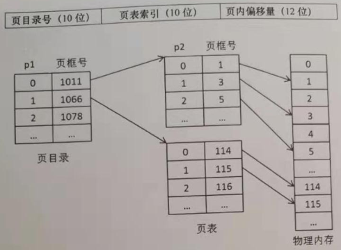

      1. 页目录号：1；

         页号：1；

         对应的页框号：115；

         页内偏移：`0x232` 或 562；

         物理量地址：`0x73232` 或 471602。

4. 设一移动头磁盘系统，共有200个磁道，编号为0-199。如果磁头当前正在143磁道处服务，则对于请求队列：86,147,91,17794,150,102,175,130，求在下列磁盘调度算法下的服务顺序、磁头平均寻道长度。

   1. 先来先服务算法（FCF）；

   2. 循环扫描算法（ CSCAN）。（按磁道号加方向访问）

      1. FCFS
         被访问的下一个磁道号：143 86 147→91-177-94 150-102 175 130（3分）

         平均寻道长度
         （143-86）+（147-86）+（147-91）+（177-01）+（177-94）+（150-94）+（150-102）+（75-102）+（175-13019=565/9=62.78（2分）

      2.  CSCAN
         被访问的下一个磁道号：143→147→150→175 177-86 91-94 102-130（3分）

         平均寻道长度
         147-143）+（150-147）+（175-150）+（177-175+177-86）+91-86+94-91）+（102-94）+（130-102）9=169/9=18.78（2分）


## 真题201904

### 一、选择题

1. 有一种操作系统允许在一台主机上同时连接多台终端，多个用户可以通过各自的终端同时交互地使用计算机，满足这一特征的是 **分时系统**。
2. 引入多道程序系统的主要目的是 **充分利用CPU，减少CPU的等待时间**。
3. 操作系统内核与应用程序之间的接口是 **系统调用**。
4. 下列不是操作系统内核基本功能的是 **文件管理**。
5. 如果有N（N>2）个进程并发运行，则不可能出现的情形是 **没有进程处于执行态，2个就绪态的进程，N-2个阻塞态的进程**。
6. 在死锁的预防中，资源的按序分配策略可以破坏 **循环等待资源条件**。
7. 在下列进程调度算法中，为每个就绪队列赋予不同时间片的调度算法是 **多级反馈队列调度**。
8. 实时系统中，进程调度需要考虑的关键因素是 **对完成截止时间条件的满足**。
9. 若某系统中有3个并发进程，各需要4个同类资源，则该系统不会产生死锁的最少资源总数应该是 **10个**。
10. 在操作系统进程调度中，时间片轮转调度算法的目的是 **多个终端都能得到系统的及时响应。**
11. 将一个进程的逻辑地址空间分成若干个大小相等的片，称为 **页。**
12. 实现虚拟存储器的目的是 **提高内存利用率**。
13. 用户程序所对应的地址空间是 **逻辑地址空间**。
14. 在采用快表的存储管理方式中，假定快表的命中率为90%，快表的访问时间为40ns，访问内存的时间为200ns，则系统的有效访存时间是 **260ms**。
15. 为了能将逻辑地址变换为物理地址，在系统中必须设置 **地址映射机构。**
16. 用于管理文件的系统文件是 **目录文件**。
17. 常用的文件存取方式有两种：随机存取和 **顺序存取。**
18. 文件存储的几种常用方式中，使用磁盘链接表进行分配的优点是 **可以充分利用每个簇。**
19. 在IO设备管理中，必须作为临界资源以互斥方式访问的设备是 **独占设备。**
20. 为了实现主机与设备控制器之间的成块数据传送，在DMA控制器中设计了四类寄存器，其中，记录本次向CPU发送中断信号前要读或写数据次数的寄存器是 **数据计数器。**

### 二、填空题

1. 操作系统常见的体系结构有**单体结构模型、层次结构模型、微内核结构模型 和动态可扩展结构模型**。
2. 程序并发执行时具有**间断性、失去封闭性、不可再现性。**
3. 对一个记录型信号量S，每执行一次wait（S）操作，S,vaue减1.若S. value为0，则该进程 **继续执行**；若S的数值小于0，则该进程 **被阻塞**。
4. 如果一个进程的完成截止时间为T，当前时间为T2，处理完该任务还需要的时间为T3，则松弛度L的计算式表示为 **L=T1-T2-T3。**
5. 银行家算法中，max[] 表示进程需要各类资源的最大数量， allocation[] 表示某时刻已分配给进程的某类资源数，need[] 表示进程还需要的某类资源的数量，那么三个变量之间的关系为 **need=max-allocation**。
6. 基于分页的虚拟存储系统中，如果频繁进行页面置换，则有可能产生抖动现象。引起抖动的主要原因是 **进程数量太多** 和 **每个进程分配到的页框太少**。
7. 在设有快表的分页存储管理方式中，当能在快表中找到所需的页表项时，有效访存时间等于一次访问 **快表** 的时间加上一次访问 **内存** 的时间。
8. 在二级分页系统中，为了能在地址映射时得到页表在物理内存中的地址，需要为页表再建立一个 **页目录表（或外层页表）**，在其中的表项中存放了每一个页表在物理内存中所在的 **页框号**。
9. 有三种文件结构，分别是：**无结构字节序列、固定长度记录序列 和 树形结构**。
10. 当进程提出 IO 请求后，如果系统没有 IO 通道，则需要按以下步骤进行设备分配：首先分配 **设备** 之后分配 **控制器**，这时设备分配才算成功。

### 三、简答题

1. 有两个并发进程P1、P2，其程序代码如下：

   ```c
   P1(){
   	x=1;
   	y=2;
   	z=x+y;
   	print z;
   }
   ```

   ```c
   P2(){
     x=-3;
     c=X*X;
     print c;
   }
   ```

   如果上述每行代码都具有原子性，请写出打印出的z和c所有可能的值。（其中x为P1、P2的共享变量）

   - z的值为-1或3；c的值为1或9；

2. 单处理器情况下，m个周期性实时进程，若进程i处理时间为Ci，周期时间为Pi（1≤i≤m），则要使系统可调度的限制条件是什么？

   设一个实时系统使用了4个周期事件，其周期分别为50ms，100ms，200ms，200m。假设这4个周期事件分别需要25ms，20ms, 10ms和xms的CPU时间。保持系统可调度的最大x值是多少？

   - $\displaystyle \sum^m  {i=1}\frac{Ci}{Pi} \leq1(1\leq i \leq m)$
   - $\displaystyle(25/50+20/100+10/200+x/200)\leq 1$所以x最大值为$(1-0.5-0.2-0.05)*200=50$

3. 什么是程序执行的局部性原理？局部性原理表现在哪两个方面？

   1. 局部性原理是指在一段短的时间内,程序的执行仅局限于某个部分.相应地,它所访问的存储空间也局限于某个区域.(2分)
   2. 局部性表现为以下两个方面
      1. 时间局部性:如果程序中的某条指令一且执行,则不久后该指令可能再次执行.(1分)
      2. 空间局部性:一旦访问了某个单元,不久之后,其附近的存储单元也将被访问(1分

4. 文件系统为文件分配磁盘空间是以簇为单位的。簇的尺寸太大或者太小都不合适。

   请问，簇的尺寸太大会有什么缺点？簇的尺寸太小会有什么缺点？

   - 大的簇尺寸意味着小文件也要占用很大的空间,造成磁盘空间的浪费.(2分
   - 小的尺寸表示大的文件需要跨越多个簇进行存取,因此需要多次寻道与旋转延迟才能读出所需要的数据,延长了访问的时间.(2分)

5. 当用户进程请求io服务，请简述该iO中断的处理过程。

   1. 用户进程发出iO请求后,由于等待iO操作的完成而被阻塞.
   2. CPU转去执行其他任务.
   3. 当iO任务完成,控制器向CPU发中断请求信号
   4. CPU转去执行中断处理程序,由中断处理程序唤醒被阻塞的用户进程.

### 四、综合题

1. 系统中有三个进程 INPUT、 PROCESS和 OUTPUT，共用两个缓冲区BUF1和BUF2。
   假设BUF1中最多可放10个数据，现已放入了2个数据；BUF2最多可放5个数据。
   INPUT进程负责不断地将输入的原始数据送入BUF1中， PROCESS进程负责从BUF中取出原始数据进行处理，并将处理后的结果数据送到BUF2中， OUTPUT进程负责从BUF2中读取结果数据并输出。请采用记录型信号量机制，实现进程INPUT、 PROCESS和 OUTPUT的同步算法。补充完成下列带标号处空缺的内容。
   （注：空缺处可能有多行代码）

   ```c
   struct semaphore empty1,full1,empty2,full2;//对应BUFl、BUF2空、满的信号量
   empty1.value =8;
   full1.value=2;
   empty2.value=5;
   full2.value =0;
   void process INPUT (){
     while(TRUE){
       wait(empty1);
   		//将信息送入BUFl;
   		signal(full1);
     }
   }
   void process PROCESS (){
     while(TRUE){
       wait(full1);
       //从BUF1中取出信息
       signal(empty1);
       wait(empty2);
       //将信息送入BUF2;
       signal(full2);
   	}
   }
   void process OUTPUT (){
     while(D)(
       wait(full2);
       //从BUF2中取出信息
       signal(empty2);
       }
   }
   ```

2. 有5个进程A、B、C、D、E, 他们的到达时间分别为0、10、20、30、35ms, 预计他们的运行时间分别为100、60、20、40、80ms。其优先数分别为3、1、4、5、2(优先级数值越小,表示优先级越高)。要求：

   (1)分别给出采用短进程优先调度算法、非抢占式优先权调度算法时,进程的启动顺序;

   (2)分别计算上述两种调度算法的平均周转时间。

   - 短进程优先调度算法，启动序列为：ACDBE
   - 非抢占式优先权调度算法，启动序列为：ABECD
   - 

3. 在采用基本分页内存管理方式的系统中, 一个由3个页面(页号为0、1、2),每页由2K字节组成的程序,把它装入一个由8个页框(页框号分别为0、1、2、3、4、5、6、7)组成的存储器中,其0、1、2页分别被分配到内存的6、7、3页框中.
   要求：
   
   (1)请简述地址转换的转换过程;

   (2)根据上面的已知条件计算逻辑地址320、2345、5374分别对应的物理地址
   
   - 在基本分页系统中进行地址转换时，地址变换机构将自动把逻辑地址转化为页号和页内偏移量。如果页号超过页表长度，将产生越界中断；否则以页号为索引去检索页表，从中得到对应的页框号，并把页框号和页内偏移量送入物理地址寄存器中，形成物理地址。（4分）
- 逻辑地址320，页号0，页内偏移量320，则页框号为6，故物理地址`6*2048+320=12608`
  
   - 逻辑地址2345，页号1，页内偏移量297，则页框号为7，故物理地址`7*2048÷297=14633`
   - 逻辑地址5374，页号2，页内偏移量1278，则页框号为3，故物理地址`3*2048+1278=7422`
   
4. 假设磁盘有500个磁道,磁盘请求中是一些随机请求,它们按照到达的次序分别处于198、383、237、422、14、424、165、267号磁道上,当前磁头在153号磁道上, 并向磁道号增加的方向移动。要求：
   分别给出按FCFS和SCAN算法进行磁盘调度时满足请求的次序，并计算出它们的平均寻道长度。

   - FCFS: $153→198→383→237→422→14→424→165→267$

     $45+185+146+185+405+410+259+102=1740$

     $平均寻道长度=1740/8=217.5$

   - SCAN: $153→165→198→237→267→383→422→424→14$

     $271+410=681$

     $平均寻道长度=681/8=85.125$


## 真题201810

### 一、选择题

1. 以下不属于操作系统主要功能的是 高级程序设计语言的编译。
2. 以下不属于分时系统基本特征的是 独立性。
3. 现代操作 系统具有并发的特征，主要是由于引入了 中断机制。
4. 进程所请求的一次打印输出完成后，进程的状态会从 执行态变为就绪态。
5. 临界区是 一个缓冲区。
6. 系统要求所有进程执行前一次性地申请在整个运行过程中所需要的全部资源，这样可以预防死锁发生的条件是 环路等待。
7. 在优先权调度算法中， 能够解决低优先权进程无穷等待问题的技术是 老化技术 。
8. 以下可以用来避免死锁的算法是  银行家算法。
9. 在实时系统的调度中，为了保证对截止时间要求较高的实时进程能及时运行，以下说法中**不**正确的是 应使得时间片尽可能短。
10. 以下对短进程优先调度算法的说法中，正确的是 相比FCFS而言，长进程可能会长时间得不到调度。
11. 内存管理的目的是 提高内存的利用率。
12. 在请求分页系统中，记录描述页的各种数据的数据结构称为 页表。
13. 选择在最近的过去最久未访问的页面予以置换的算法是 LRU 。
14. 在采用快表的存储管理方式中，假定快表的命中率为85%,快表的访间时间为30ns,访问内存的时间为210ns,则系统的有效访存时间是 271.5ns。
15. 基本分页存储管理方式的逻辑地址结构包括两部分，即页内偏移量和 页框号。
16. 为方便管理，文件系统会保存一一些与文件相关的信息，如文件的创建日期、文件大小和修改时间等细节，这些信息称为 文件属性 。
17. 作为WRITE操作的限制形式，只能在文件末尾添加数据的文件操作是 APPEND操作 。
18. MS-DOS文件系统采用的磁盘空间分配方式是  i结点。
19. 设备控制器的功能不包括 中断恢复 。
20. 对I/O设备的缓冲管理方法中，对单缓冲方案说法正确的是 一般用于面向流的设备。

### 二、填空题

1. CPU中的    存放当前程序下一条要执行的指令在内存中的地址，CPU从该地址取到指令，并将该指令放入CPU的     中。

2. 进程是程序的一次执行，具有并发性、  独立性、    和结构特征。

3. 在支持线程的操作系统中，   是被系统独立调度和分派的基本单位，而      则是资源分配的基本单位。

4. 资源分配状态S为死锁状态的充分条件是当且仅当S状态的       是不可完全简化的。

5. 设系统有一类数量为M的独占性资源，系统中5个进程竞争该类资源，每个进程对该类资源的最大需求为3。为确保系统不会发生死锁,M至少应该等于      。

6. 在分页存储管理方式中，页表的作用是实现从到     的映射。

7. 根据形成在内存中物理地址的时机不同，把程序的装入方式分为绝对装入方式、      和   

8. 在二级分页系统中，为页表再建立一个页目录表的目的是为了能在地址映射时得到页表在物理内存中的地址，在页目录表的表项中存放了每一个  在物理内存中所在的     

9. 文件的类型有:正规文件、目录文件、     和     

10. I0管理软件将设备管理软件从上至下分成四个层次:用户层软件,      ，    中断处理程序。

    

### 三、简答题

1. 何为系统调用?请简述系统调用与一般函数调用的区别。
2. 什么是安全状态?写出用于避免死锁的银行家算法的过程。
3. 引入虚拟存储技术的目的是什么?虚拟存储系统有哪些特征?
4. 磁盘文件系统可以使用磁盘链接表实现文件存储，也可以使用内存的链接表分配文件的存储空间。请论述它们在空间利用事和存取时间上的各自特点。
5. 磁盘的访问时间由哪几部分组成?其中花费时间最长的是哪个? 

### 四、综合题

1. 某展览会任何时刻最多可容纳500名參观者，当展览厅中少于500名参观者时，则

   厅外的参观者可立即进入，否则需在外面等待。参观者进入展览厅时，都必须在入口处登记(并领取资料和礼品),假定入口处有5位工作人员，每位工作人员每次只能接待一个参观者登记，请用记录型信号量机制实现参观者进程的同步算法。register0是完成登记并领取资料和礼品的函数; visitO是完成参观展览的函数; leaveO是表示参观完毕离开的函数。下面已经给出了部分代码，请填写1~2空白处的代码。注:每一空可能不止-行代码。

   ```
   struct semaphore cap, officer;//分别表示展览会容量、工作人员的信号量
   
   (1)     
   
   void process Vistor()//参观者
   
   {
   (2) 
   
   }
   ```

2. 有4个进程A、B、C、D,它们的到达时间、预计运行时间以及优先级数值(优先级数值越小，表示优先级越高)如题37表所示。

   题37表

   | 进程名 | 到达时间 | 预计运行时间 | 优先数 |
   | ------ | -------- | ------------ | ------ |
   | A      | 0        | 34           | 3      |
   | B      | 1        | 7            | 1      |
   | C      | 2        | 15           | 2      |
   | D      | 3        | 4            | 4      |

   1)请计算采用短进程优先调度算法的平均周转时间和平均带权周转时间。

   2)请计算采用抢占式优先权调度算法的平均周转时间和平均带权周转时间。(注:精确到小数点后2位)

3. 基本分页存储系统中，内存容量为64K,每页的大小为1K，对一个4页大的作业，其0、1、2、3页分别被分配到内存的2、4、6、7页框中。请简述地址转换的基本思想，然后根据上面的已知条件计算出下列逻辑地址对应的物理地址是什么?

   (本题所有数字均为十进制表示)

   (1) 1023(2) 2500(3) 4500

4. 假设磁盘有400个磁道，磁盘请求中是-些随机请求，它们按照到达的次序分别处于358、129、383、418、 59、256、 450、 238、179、 420号磁道上，当前磁头在220号磁道上，并向磁道号增加的方向移动。请给出按SSTP和SCAN算法进行磁盘调度时满足请求的次序，并计算出它们的平均寻道长度。


## 真题201804

### 一、选择题

1. 关于操作系统，以下叙述中正确的是 分时系统不一定都具有人机交互功能。

2. 实时操作系统追求的目标是 快速响应。

3. 操作系统的异步性是指 程序多次运行的时间不确定。

4. 进程从执行状态进入就绪状态的原因可能是 时间片用完。

5. 在操作系统中，要对甲、乙两个并发进程进行同步的原因是 甲、乙两个进程需要访问临界资源。

6. 关于系统安全状态的说法，不正确的是 系统处于不安全状态一定会发生死锁。

7. 设某作业在外存后备队列上等待调度的时间为Tl，进程在就绪队列上等待进程调度的时间为T2，进程在CPU上执行的时间为T3，进程等待I/O操作完成的时间为T4，那么作业的周转时间是指 TI+T2+T3+T4。

8. 根据实时进程的紧迫程度来进行调度的算法是 最低松弛度优先算法 。

9. 设系统有一类数量为M的独占性资源，系统中N个进程竞争该类资源，每个进程对资源的最大需求为W。当M、N、W分别取下列哪个值时，系统不会发生死锁? M=10；N=3；W=4 

10. 关于时间片轮转调度算法，在不考虑系统开销的情况下，以下说法正确的是 系统允许的最大进程数一定时，系统要求的响应时间越短，时间片取值应该越小。

11. 进程的最后一页一般装不满一个页框，形成了 外部碎片  。

12. 在程序装入时对目标程序中的指令和数据地址的修改过程称为 重定位。

13. 相对于分页机制，引入分段机制的主要目的是 提高内存的利用率 。

14. 假定快表的命中率为98％，快表的访问时间为20ns，内存的一次访问时间为100ns，则系统的有效访存时间是 122。

15. 基本分页存储管理方式的逻辑地址结构包括两个部分，即页号和 页内地址。

16. 能够为用户提供在计算机系统中对数据信息进行长期、大量存储和访问的操作系统重要功能是 文件系统管理 。

17.  正规文件的类型有二进制文件和 目录文件。

18. 以磁盘文件系统为例，文件存储的几种常用方式中，连续分配的缺点是 随着时间推移会形成很多“空洞”。

19. 按设备的共享属性分类，可把设备分为独享设备、共享设备和   虚拟设备。

20. DMA控制器的逻辑组成包括三部分：主机与DMA的接口、DMA与设备的接口，以及 I／O控制逻辑。

    

### 二、填空题

1. 分时系统的四个特征是：多路性、、、和交互性。

2. 进程是真实存在的实体，应用程序对应的进程由该程序、、和管理进程所需要的、构成。

3. 设某一临界区对应的记录型信号量 mutex，其初值为1（即 mutex.value=1），当
   mutex value=-2时，表示有、个进程在临界区内，有、个进程等待进入临界区。

4. 资源的有序分配策略可以破坏死锁的、条件。

5. 有3个进程p1、p2、p3，其进入系统的时间和服务时间如下表所示，按FCFS调度
   算法，它们的平均带权周转时间是（注：四舍五入精确到小数点后两

   

6. 在基于分页的虚拟存储系统中，常采用两种置换策略，即、和、

7. 在使用分段存储管理的系统中，程序员使用二维的逻辑地址，一个数用来表示、，另一个数用、来表示。

8. 考虑一个由8个页、每个页1K字节组成的逻辑地址空间，把它映射到由32个物理块组成的存储器，则逻辑地址有、位，物理地址有、位。

9. 文件系统的用户接口包括：文件的全名、对文件的操作、和、。

10. 在设备管理中，为了提高可适应性和可扩展性，现代操作系统实现了、，即应用程序独立于具体使用的物理设备。在应用程序中，使用、来请求使用设备，而在实际执行时，必须使用物理设备名称。

### 三、简答题

1. 相比于进程，请简述线程在地址空间资源、通信关系、并发性及系统开销方面有哪
   些特点？

2. 为了实现实时调度，系统需要为调度程序提供哪些信息？（至少写出4个）

   在单处理机情况下，如果有6个实时进程，周期时间都是30ms，系统为每个进程分配6ms的处理时间，请问系统能否保证每个实时进程都能在截止时间内完成吗？为什么？

3. 在内存管理中，分页管理和分段管理的主要区别是什么？

4. 某文件系统的 i 结点包括12个地址项，每个地址项存64位地址（8个字节），其中10个地址项用来存直接地址，一个地址项存一次间接地址，一个地址项存二次间接地址，当簇大小为4KB时，请问，系统能管理的单个文件最大长度是多少？（请写出计算的中间步骤

5. 请简述 SPOOLing系统的优点

### 四、综合题

1. 设有无穷多个整数缓冲区（即为无界缓冲池），A进程从输入设备逐个地读入整数
   并写入缓冲区，B进程则逐个地从缓冲区取出整数进行打印。其中存放整数的变量
   为item，缓冲区名为 buffer，读取过程使用函数 getAltem（int·im）来完成，而打印
   整数使用函数 printAltem（int itm）来完成。请用记录型信号量机制实现上述两个进程
   的同步算法。要求：补充完整下列算法程序中带标号处空缺的内容。（注：每个空
   缺部分的代码可能是多行代码）。

   ```c
   struct semaphore full
   int buffer[];//级冲区
   Int in,out;//缓冲区的入口指针量和出口指针量
   void processEd
   Int item
   //存放整数的变量
   void processBO
   Int item
   //存放整数的变量
   ```

2. 设系统中有三种类型的资源A、B、C,资源数量分别为15、7、18,系统有五个进
   程Pl、P2、P3、P4、P5,其最大资源需求量分别为(5,4,9)、(4,3,5)、(3,0,5)、(5,2,5)、(4,2,4).在T0时刻,系统为各进程已经分配的资源数量分别为(2,1,2)、(3,0,2)、(3,0,4)、(2,0,4)、(3,1,4).若系统采用银行家算法实施死锁避免策略,则请回答:
   (1)列表画出T0时刻的资源分配状态表,在表中显示进程还需要的资源数量和系
   统可用的资源数量.
   (2)T0时刻是否为安全状态?若是,请给出安全序列.
   (3)在T0时刻若进程P1请求资源(3,0,3),是否能实施资源分配?为什么?
   (4)在T0时刻若进程P4请求资源(2,0,1),则是否能实施资源分配?为什么?

3. 某系统采用基本分页存储管理策略,拥有逻辑地址空间32页,每页2K,拥有物理地址空间1M.要求:
   (1)请写出逻辑地址格式;
   (2)若不考虑访问权限,且页号不放入页表中,请问进程的页表有多少项?每项至
   少多少位?
   (3)如果物理空间减少一半,页表结构应做怎样的改变?

4. 假设磁盘有l 000个磁道，若磁盘请求是一些随机请求，它们按照到达的次序分别处于811、348、153、968、407、580、233、679、801、121磁道。当前磁头在656号磁道上，并且读写磁头正在向磁道号增加的方向移动。

   要求：给出用FCFS和SSCF算法进行磁盘调度时满足请求的次序，并计算出它们的平均寻道长度。


## 真题201710

### 一、单项选择题：本大题共20小题，每小题1分，共20分。

1．下列不属于Windows 2000特征的是 必须与MS—DOS共同管理系统资源

  A．具有标准化安全技术         B．提供活动目录技术

  C．必须与MS—DOS共同管理系统资源   D．支持移动用户

2．当中央处理器在目态工作时，如果收到一条特权指令，此时中央处理器将 拒绝执行该指令

  A．维持在日态     B．从目态转换到管态

  C．拒绝执行该指令   D．继续执行该指令

3．下列关于操作系统基本类型的叙述中，正确的是 批处理系统中用户不能直接干预作业的执行

  A．批处理系统中用户不能直接干预作业的执行

  B．分时系统不一定都具有人机交互功能

  C．从响应时间的角度看，实时系统与分时系统的要求差不多

  D．由于采用了分时技术，用户可以独占计算机资源

4．下列关于采用线程技术的操作系统的叙述中，正确的是 每个进程都有自己的主存空间

  A．每个进程都有自己的主存空间

  B．每个线程都有自己的主存空间

  C．同一进程的各线程不能共享进程的主存空间

  D．进程中的线程对进程的整个主存空间只有只读权限

5．进程控制块的四类信息中，进程的优先数属于 管理信息

 A．标识信息   B．说明信息

 C．现场信息   D.管理信息

6．根据作业对资源的要求进行分类，从不同类的作业中挑选作业的作业调度算法是 均衡调度算法 

 A．优先级调度算法   B．响应比高者优先算法

 C．均衡调度算法    D．先来先服务算法

7．计算机系统中用于存放当前参加运算的操作数的寄存器是 通用寄存器

 A．指令寄存器   B．通用寄存器

 C．控制寄存器   D．程序状态字寄存器

8．能消除碎片，但采用移动技术会增加系统开销的存储管理方式是 可变分区存储管理

 A．固定分区存储管理   B．可变分区存储管理

 C．页式存储管理     D．单用户连续存储管理

9．要保证一个程序在主存中被改变了存放位置后仍能正确执行，则对主存空间应采用 动态重定位

 A．静态重定位   B．动态重定位

 C．动态分配    D．静态分配

10．在文件管理中，采用**位示图**主要是实现 磁盘空间的管理

 A．文件目录查找   B．主存空间共享

 C．文件更新保护   D．磁盘空间的管理

11．如果文件系统中有两个文件重名，不应采用 一级目录结构

 A．一级目录结构   B．二级目录结构

 C．树型目录结构   D．多级目录结构

12．关于文件操作的使用，下列表述不正确的是 可直接删除一个被打开的文件

  A．可调用“打开”和“建立”来申请对文件的使用权

  B．可调用“关闭”操作来归还文件的使用权

  C．可直接删除一个被打开的文件

  D．可通过删除操作使系统收回该文件所占的存储空间

13．设一个文件由100个物理块组成，若采用链接存储结构，现欲从文件的开头和末尾分别去掉一块，则相应启动I/O的次数是 1、100

  A．1、101   B．1、1

  C．1、100  D．100、1

14．关于设备管理的各个功能，下列表述中，不正确的是 解决不同用户间的文件命名冲突

  A．实现外围设备的分配、启动、回收  B．解决磁盘的驱动调度问题

  C．用可共享设备来模拟独占设备    D．解决不同用户间的文件命名冲突

15．用户在使用I/O设备时，通常采用 设备的相对号

 A．设备的绝对号   B．设备的相对号

 C．虚拟设备号    D．设备地址号

16．采用斯普林技术的目的是 提高独占设备的利用率

  A．提高主机效率      B．提高独占设备的利用率

  C．减轻用户的编程负担   D．提高程序的运行速度

17．造成“与时间有关的错误”的原因不可鳆是 与程序的私有数据有关

  A．与进程被打断的时间有关   B．与能占用处理器的时间有关

  C．与进程执行次序有关     D．与程序的私有数据有关

18．关于采用信箱实现进程间通信，下列描述不正确的是 由发送信件者设置信箱 

  A．由发送信件者设置信箱       B．允许多个进程向同一进程发信件

  C．每次从指定的信箱中只取一封信件  D．至少要有send和receive两个原语

19．有m个进程共享同一临界资源，若使用信号量机制实现对一临界资源的互斥访问，则信号量的变化范围是 1至1-m 

  A．1至1-m  B．1至m-1   C．1至-m   D．1至m

20．关于死锁的四个必要条件，下列说法不正确的是 其中的“占有且等待资源”条件包含了“循环等待资源”条件

  A．发生死锁时，死锁必要条件一定同时成立

  B．死锁必要条件同时成立时，系统不一定会出现死锁

  C．死锁必要条件只要有一个不成立，系统就不会出现死锁

  D．其中的“占有且等待资源”条件包含了“循环等待资源”条件

### 二、多项选择题：本大题共5小题，每小题2分，共10分。

21．进程的状态从等待态转为就绪态，可能的原因有 ABC

  A．进程请求的外围设备工作结束   B．进程等待的资源得到满足

  C．进程等待的故障被排除D．进程被重新分配了处理器时间

  E．有更高优先级的进程需要运行

22．下列有关可变分区管理的说法中，正确的是 BCE

  A．采用可变分区管理主存储器时，主存储器中空闲区的大小一直在变化，但数目不变

  B．可变分区管理常采用的内存分配算法包括最先适应、最优适应和最坏适应算法

  C．最先适应算法实现简单，但碎片过多使内存空间利用率降低

  D．最优适应算法是最好的算法，但后到的较大作业很难得到满足

  E．最坏适应算法总是挑选最大的空闲区用于分割，使得剩下的分区仍可使用

23．按存放的时限，可将文件分为 ABD

 A．临时文件   B．永久文件

 C．用户文件   D．档案文件

 E．系统文件

24．下列有关设备管理的叙述中，正确的是 ACE

 A．计算机系统为每台设备确定一个绝对号

 B．每台设备都应该有一个唯一的相对号

 C．启动设备时应指出设备的绝对号

 D．申请设备时指定绝对号可提高设备的使用率

 E．申请设备时指定设备相对号使设备分配的灵活性强

25．下列关于系统安全状态的描述中，正确的是   。BDE

 A．不安全状态是死锁状态的一个特例

 B．系统处于安全状态一定不会发生死锁

 C．系统处于不安全状态一定会发生死锁

 D．系统处于不安全状态可能会发生死锁

 E．系统处于不安全状态不一定会发生死锁

### 三、填空题：本大题共10小题，每小题2分，共20分。

26．为了使用户能方便使用计算机系统，操作系统提供了两类使用接口，分别为程序员接口和操作员接口。程序员接口是指一组 系统功能调用 ，而操作员接口是指一组 操作控制命令。

27．单处理器系统中，有两道程序，A的执行过程为：计算50毫秒，打印100毫秒，再计算50毫秒，打印100毫秒，结束；B的执行过程为：计算80毫秒，打印50毫秒，结束。如果采用多道程序设计，让A、B两道并行处理，A先开始，处理机的利用率为 60 ％。

28．某单道程序设计系统中有3个作业A、B、C，它们到达输入井的时间分别为8：50、9：10、9：30，需计算的时间分别为l.5小时、0.4小时、1.0小时，若采用响应比高者优先算法，9：30开始调度，则此时优先进入主存储器的作业是 B 。

29．在一个请求分页系统中，假如一个作业的页面走向为4，3，2，1，4，3，5，4，3，2，1，5，目前它还没有任何页装入内存，分配给该作业的物理块数目为4，则采用LRU页面淘汰算法时，访问过程中所发生的缺页次数为   8   。

30．若某系统采用基址和限长寄存器的方法来保护存储信息，判断绝对地址是否越界的

判别式为   基址寄存器内容≤绝对地址≤限长寄存器内容   。

31．访问文件时，从当前目录到该文件的通路上所有各级目录名及该文件名组成的路径称为   相对路径   ，而从根目录开始到该文件的通路上所有各级目录名及该文件名组成的路径称为   绝对路径   。

32．用户使用文件时，若按文件的逻辑顺序依次进行读/写，这种文件存取方式称为  顺序  存取，若按任意次序读写文件中的信息，则称为  随机  存取。

33．斯普林系统由三部分组成，即： 预输入程序     、 井管理程序  和缓输出程序。

34．在磁盘的移臂调度中，若只考虑请求访问者的先后次序，而不考虑它们要访问的物理位置，这种调度算法是  先来先服务算法  ；若考虑移臂方向，访问离当前移动臂最近的位置，这种调度算法是  电梯调度算法  。

35．信号量的值具有明确的物理意义，值大于0时，其值表示   可用资源数目 ；值小于0时，其绝对值表示  等待该资源的进程数  。

### 四、简答题：本大题共5小题，每小题4分，共20分。

36．多道批处理系统的优点是什么?分时系统是如何克服多道批处理系统缺少交互性的缺点?

37．在某个分页管理系统中，某一个作业有4个页面，被分别装入到主存的第3、4、6、8块中，假定页面和块大小均为1024字节，当作业在CPU上运行时，执行到其地址空间第500号处遇到一条传送命令：mov 2100，3100请计算出MOV指令中两个操作数的物理地址(以上地址均为十进制)。

38．试述文件系统执行“删除”操作所完成的主要工作。

39．设某移动头磁盘系统，共有200个磁道，磁盘请求队列中是一些随机请求，它们按照到达的次序分别处于55、58、39、18、90、160、150、38、184号磁道上，当前磁头在100号磁道上，并向磁道号增加的方向移动，求在下列移臂调度算法下的服务顺序和磁头移动道数。

  (1)先来先服务调度算法(2)电梯调度算法

40．何为按序分配资源策略?请简单说明该策略能防止死锁的原因。

五、综合题：本大题共3小题，每小题10分，共30分。

41．有一个单CPU的多道批处理系统(内存中可同时装入两道作业)，作业调度采用“短作业优先”调度算法，进程调度采用“优先数抢占式”调度算法，且优先数越小优先级越高，系统拥有打印机一台，采用静态方法分配，忽略系统的调度开销。现有如下作业序列到达系统：

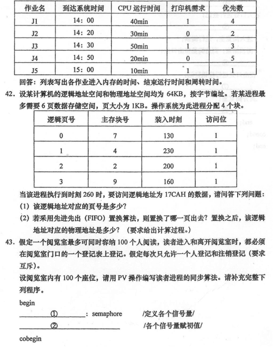


## 真题201704

### 一、单项选择题(本大题共20小题。每小题l分，共20分)

  在每小题列出的四个备选项中只有一个是符合题目要求的，请将其选出并将“答题卡”的相应代码涂黑。错涂、多涂或未涂均无分。

1、关于操作系统，下列说法正确的是

  A、操作系统是一种系统软件   B、操作系统是一种应用软件

  C、操作系统是一种通用软件   D、操作系统是一种工具软件

2、操作系统的作用是

  A、实现软硬件的虚拟化   B、把源程序编译为目标程序

  C、控制和管理系统资源的使用   D、便于进行目标管理

3、当中央处理器处于目态时，它可执行的指令应该

 A、仅限于特权指令   B、仅限于非特权指令

 C、是部分特权指令   D、是计算机系统中的全部指令

4、下列哪个不是PCB中的内容?

 A、进程运行的程序   B、进程优先数

 C、通用寄存器内容   D、程序状态寄存器内容

5、进程在运行过程中发生等待事件时，可将进程状态改为等待态的原语为

 A、创建原语   B、撤销原语

 C、阻塞原语   D、唤醒原语

6、关于作业调度与进程调度，下列描述正确的是

 A、对于任何一个作业，先被作业调度选中，才有机会被进程调度选中

 B、对于任何一个作业，先被进程调度选中，才有机会被作业调度选中

 C、对于任何一个作业，可以同时被作业调度与进程调度选中

 D、对于任何一个作业，可以先被作业调度选中，也可以先被进程调度选中

7、作业被执行的时候，必须把它的程序和数据等信息读到

  A、主存储器   B、寄存器   C、高速缓冲存储器  D、辅助存储器

8、在下列存储管理方案中，能扩充主存容量的是

  A、单用户连续存储管理  B、固定分区存储管理

  C、可变分区存储管理    D、页式虚拟存储管理

9、假定某采用页式存储管理的系统中，主存的容量为1MB，被分成256块，块号为0，1，2，……，255。某作业的地址空间占用4页，其页号为0，l，2，3，被分配到主存中的第2，4，l，5块中。则作业中页号为2的页在主存块中的起始地址是

  A、1   B、1024   C、2048   D、4096

10、文件的二级目录包括主文件目录和

  A、子目录   B、主目录   C、用户文件目录  D、当前目录

11、对记录式文件，操作系统为用户存取文件信息的最小单位是

  A、字符   B、记录   C、文件   D、数据项

12、对随机存取的文件，文件系统通常把它组织成

  A、顺序文件   B、链接文件   C、记录式文件   D、索引文件

13、存放在磁盘上的文件以链接结构组织，假定磁盘的分块大小为每块512字节，而文件的逻辑记录的大小为每个记录250字节。现有一个文件共有10个逻辑记录，采用成组操作，2个逻辑记录为一组，则当主存缓冲区大小为512个字节时，要读出第7个逻辑记录应启动磁盘

  A、1次   B、2次   C、3次   D、4次

14、根据使用的角度，外围设备可以分为独占设备和可共享设备，下列属于可共享设备的是

  A、打印机   B、磁盘机   C、输入机   D、输入输出处理机

15、在用户程序中使用设备时，通常使用

  A、作业名   B、设备名类型   C、设备的相对号   D、设备的绝对号

16、在执行一次信息传输操作时所花时间中，机械动作所占用的时间是

  A、延迟时间  B、寻找时间   C、传送时间   D、访问时间

17、下列会引起进程并发执行的是

  A、进程调度策略   B、资源分配策略

  C、进程状态变化   D、多道程序设计

18、对若干个并发进程共享某一变量的相关临界区的管理，下列说法不正确的是

  A、相关的多个进程可以同时进入临界区

  B、不能让一个进程无限制地在临界区执行

  C、不能强迫一个进程无限地等待进入它的临界区

  D、一次至多一个进程能够进入临界区

19、下列属于进程高级通信的是

  A、P操作   B、V操作   C、reCeive原语D、Read操作

20、对资源采用静态分配簸略后，进程在执行时

  A、会继续申请资源    B、不会继续申请资源

  C、会出现等待资源状态  D、会抢占其他进程所占资源‘

### 二、多项选择题(本大题共5小题。每小题2分，共l0分)

  在每小题列出的五个备选项中至少有两个是符合题目要求的，请将其选出并将“答题卡”的相应代码涂黑。错涂、多涂、少涂或未涂均无分。

21、关于时间片轮转调度算法，下列说法正确的是

  A、时间片越小，系统效率越高

  B、时阔片越大，系统效率越高

  C、时间片的值应根据进程数和进程要求决定

  D、当进程数较少时，可适当增大时间片的值

  E、所有进程的时间片必须是固定的，不可修改

22、在可变式分区管理方案中，空闲区表中的登记项按空闲区长度排序的算法是

 A、最先适应分配算法   B、最优适应分配算法

 C、最坏适应分配算法   D、先进先出调度算法

 E、均衡调度算法

23、文件的成组与分解操作能

  A、按名存取        B、增加启动存储设备的次数

  C、缩短检索文件的时间   D、减少启动存储设备的次数

  E、提高文件存储空间利用率

24、执行一次信息传输所花的时阅包括

 A、延迟时间   B、传送时阔

 C、寻找时阔   D、启动时间

 E、缓冲时间

25、PV操作可以用来实现

  A、并发进程之间的同步   B、并发进程之间的高级遥信

  C、系统死锁的防止     D、并发进程之间的互斥

  E、处理机的调度


### 三、填空题(本大题共20小题，每空1分，共20分)

26,嵌入式操作系统的主要特点是微型化和    ，后一个特点是由于嵌入式系统广泛应用于过程控制、数据采集、传输通信等场合，故对响应时间有严格要求。

27、操作系统为用户提供两类使用接口：一是程序员接口，通过“系统调用”使用操作系统功能；二是      接口，是一组操作控制命令。

28、从输入井中选取后备作业装入主存储器的工作称为    。

29、在一个单CPU系统中，共有6个用户进程。假设有一个用户进程正在执行，则处于就绪状态的用户进程最多右  个。

30、作业调度时，如果作业i进入输入井的时间为Si，等待时间为Wi，执行时间为Ri，得到最终计算结果的时间为Ei，则此作业的周转时间可以表示为    。

31、地址重定位指的是把逻辑地址转换成    。

32、为了减少内存中的碎片，可以采用移动技术，此时采用的地址映射方式

是    。

33、某虚拟存储器的用户编程空间共32个页面，每页为1KB，内存为l6KB。假定某时刻一用户页表中已调入内存的页面的页号和物理块号的对照表如下：

 

 则逻辑地址0868(H)所对应的物理地址是    （H)。

34、文件系统实现了从逻辑文件到    之间的转换。

35、用户调用“打开”文件和    操作来申请对文件的使用权。

36、设有一个包含1000个记录的索引文件，每个记录正好占用一个物理块。一个物理块存放10个索引表目。建立索引时，一个物理块应有一个索引表目，该文件采用3级索引，则索引及其文件本身应占个物理块。

37、计算机的外围设备可分为    和可共享设备两大类。

38、实现虚拟设备必须要有硬件与软件的配合。其中的硬件包括中断装置和    作为支撑。

39、对磁盘的任何一个访问请求，应给出访问磁盘的存储空间地址，包括    、

 

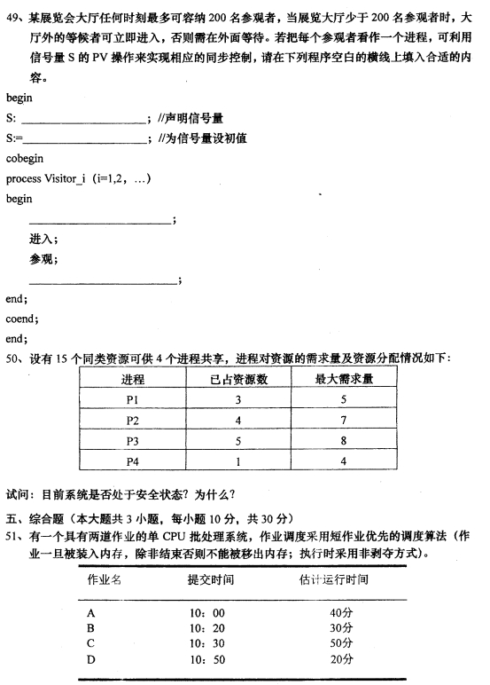 

 


## 软件(非必要)

- Windows10 Linux 子系统：ubuntu


# 第一章 操作系统简介

- 本章主要内容：

  1. 操作系统的概念（选择、填空）

  2. 操作系统的发展（选择、填空、简答）

  3. 操作系统的特征（选择、填空、简答）

  4. 操作系统的功能（选择、填空）

  5. 操作系统的体系结构（选择、填空、简答）

  6. 指令的执行（选择、填空、简答）

     近三年考试分值：8~9分

## 第一节 什么是操作系统

1. 用户与硬件之间的接口
   1. 操作系统概念：操作系统是一种复杂的系统软件，是不同程序代码、数据结构、初始化文件的集合，可执行。
   2. 操作系统是提供计算机用户与计算机硬件之间的接口，并管理计算机软件和硬件资源，并且通过这个接口使应用程序的开发变得简单、高效接口是两个不同部分的交接面。接口分为硬件接口和软件接口，计算机的所有功能最终都是由硬件的操作来实现的，计算机屏蔽了对硬件操作的细节。
   3. 操作系统完成的两个目标：
      1. 与硬件相互作用，为包含在所有硬件平台上的所有底层可编程部件提供服务
      2. 为运行在计算机系统上的应用程序（即用户程序）提供执行环境

2. 资源管理者

   现代计算机特点是支持多任务，一方面保证用户程序的顺利执行，另一方面使计算机系统资源得到高效的利用，保证计算机系统的高性能操作系统的功能：

   1. 处理机管理
   2. 内存管理
   3. 设备管理
   4. 文件管理

## 第二节 操作系统的发展

- 无操作系统一单道批处理系统一多道批处理系统一微机操作系一实时操作系统
  - 无操作系统阶段：电子管，无存储设备，第一台：1946年宾夕法尼亚大学的「埃尼阿克」
  - 单道批处理系统：晶体管，磁性存储设备，内存中有一道批处理作业，计算机资源被用户作业独占
  - 吞吐量是指单位时间内计算机系统处理的作业量
  - 多道程序系统：集成电路芯片，出现了分时操作系统（多个终端）
  - 微机操作系统：第一台 Intel 公司顾问 GaryKildall 编写的`CP/M`系统，是一台磁盘操作系统，用于 Inte8080 
  - 实时操作系统：广泛应用于各种工业现场的自动控制、海底探测、智能机器人和航空航天等。
- 批处理、实时、分时系统的优缺点比较：
  - 单道批处理系统：**自动性**、**顺序性**、**单道性**。
    - 优点：减少了等待人工操作的时间
    - 缺点：CPU资源不能得到有效的利用。
  - 多道批处理系统：多道性、**无序性**、调度性、**复杂性**。
    - 优点：能够使 CPU 和内存 IO资源得到充分利用，提高系统的吞吐量。
    - 缺点：系统平均周转时间长，缺乏交互能力
  - 分时系统：多路性、**及时性**、**交互性**、独立性。
    - 优点：提供了人机交互，可以使用户通过不同终端分享主机。
    - 缺点：不能及时接收及时处理用户命令。
  - 实时操作系统（用户实时控制和实时信息处理）：多路性、独立性、及时性、交互性、**可靠性**。
    - 在实时系统中，往往采取多级容错措施来保证系统安全和数据安全
- 操作系统产品：
  1. 主机操作系统（批处理、事务处理（银行支票处理或航班预订）、分时处理），
  2. 微机操作系统，
  3. 服务器操作系统、
  4. 嵌入式操作系统（物联网操作系统）

## 第三节 操作系统的特征

- 操作系统特征：
  - **并发**（多个事件在同一时间间隔内同时发生）
  - 共享
  - 虚拟
  - 异步

## 第四节 操作系统的功能

- 内存管理：
  - 任务是为多道程序的运行提供良好的运行环境，方便用户使用内存，提高内存利用率，以及从逻辑上扩充内存实现虚拟存储。
  - **内存分配**
    1. 用于内存分配数据结构。用来记录内存使用状况，如内存空闲区域的大小、空闲区域的起始地址等，为内存分配的实现提供依据
    2. 内存分配功能。系统按照一定的内存分配算法分配内存空间。
    3. 内存回收功能。系统需要回收被释放的内存空间
  - **内存保护**
  - **地址映射**
    - 逻辑地址与物理地址
    - 地址映射，将逻辑地址转换为对应的物理地址
  - **内存扩充**（借助与虚拟存储技术）
    - 请求调入功能。
    - 置换功能。
- 进程管理
- 文件管理：
  - 存储空间的管理
  - 目录管理
  - 文件的读写管理和存取控制
- 设备管理
  1. 缓冲管理。管理各种缓冲区。
  2. 设备分配。分配用户 IO所需要的设备。
  3. 设备处理。由设备驱动程序来实现CPU与设备控制器之间的通信
  4. 设备独立性和虚拟设备。设备独立性功能使应用程序独立于物理设备。
- 提供用户接口：
  - 命令接口
    - 联机用户接口
    - 脱机用户接口
  - 图形用户接口
  - 程序接口

## 第五节 操作系统的体系结构

- 操作系统体系结构的分析
  1. 简单的监控程序模型
  2. 单体结构模型
  3. 层次结构模型
  4. 客户/服务器模型与微内核结构
  5. 动态可扩展结构模型
- 单体内核是操作系统中最早、最常见的体系结构（ `UNIX/MS-DOS/LinUX/MAC OS X/BSD`）
- 层次结构最经典的例子 Dijkstra 的 THE 系统

## 第六节 指令的执行


- 指令的执行：
  - 程序是指令的集合，程序的执行就是按照某种控制流执行指令的过程。
  - 一个单一指令需要的处理称为指令周期，包括取指周期和执行周期
    1. 处理器与存储器之间的指令或数据传送操作。
    2. 处理器与O设备之间的指令或数据传送操作。
    3. 算术运算操作或逻辑运算操作。
    4. 控制操作，即修改指令的执行顺序的操作。


# 第二章 进程管理（重点）

- 本章主要内容：

  1. 进程的并发执行（选择、填空）

  2. **进程的定义、特征、进程控制块**（选择、填空、简答）

  3. 进程的状态（选择、填空、简答）

  4. 进程的组织（选择、填空）

  5. **进程的创建、阻塞、唤醒、终止**（选择、填空、简答）

  6. 中断的概念、类型、处理过程（选择、填空、简答）

  7. 系统调用的概念、类型（选择、填空、简答）

  8. 系统调用与一般函数的区别（选择、填空、简答）

  9. 进程同步的概念、同步机制准则（选择、填空、简答）

  10. **信号量机制**（选择、填空、简答、综合）

  11. **生产者——消费者问题**（选择、填空、简答、综合）

  12. **管程**（选择、填空、简答、综合）

  13. 线程的概念、分类、状态（选择、填空、简答）

  14. 线程与进程的关系（选择、填空、简答）

  15. 线程的控制（选择、填空、简答）

      本章近三年分值：13~19分

## 第一节 进程的描述

1. 程序的并发执行
   1. 程序的顺序执行特点：顺序性，封闭性、可再现性
   2. 程序的并发执行特点：**间断性**、**失去封闭性**、**不可再现性**

2. 进程的概念：

   1. 进程的定义

      1. **进程是允许并发的程序在某个数据集合上的运行过程**
      2. **进程是正文段、用户数据段和进程控制块共同组成的执行环境。正文段存放被执行的机器指令，用户数据段存放进程在执行时要操作的用户数据，进程控制块存放程序的执行环境，操作系统通过这些描述和管理进程。**

      - 进程代表了程序的执行过程，是一个动态的实体，它随着指令的执行而不断变化，在**某个特定时刻的进程内容被称为进程映像**。

   2. 进程的特征：

      1. 并发性
         - 内存中有多个进程实体，各进程可并发执行
      2. 独立性
         - 在没有引入线程概念的操作系统中，进程是**独立运行和资源分配、调度的基本单位**。
      3. 异步性
         - 各进程按各自独立的、不可预知的速度向前推进，操作系统要提供“进程同步机制“来解决异步问题。**不确定性**
      4. 动态性
         - 进程是程序的一次执行过程，是动态地产生、变化和消亡的，**基本特征**
      5. 结构特征
         - 每个进程都会配置一个PCB。结构上看，进程由程序段、数据段、PCB组成

   3. 进程和程序的比较：

      1. 进程和程序的区别：
         1. 程序是静态的，进程是动态的
         2. 程序是永久的，进程是暂时存在的
         3. 程序和进程存在的实体不同。程序是指令的集合，进程是由正文段、用户数据段、进程控制块组成

   4. 进程和程序的联系：

      - 进程是程序的一次执行，进程总是对应至少一个特定的程序，执行程序的代码一个程序可以对应多个进程

3. **进程控制块**：

   进程实体存在的标志是操作系统管理进程所使用的数据结构一进程控制块

   - **进程控制块是进程实体的一部分，是操作系统中最重要的数据结构**，进程控制块中记录了操作系统所需要的，用户描述进程情况以及控制进程运行所需要的全部信息，进程控制块是操作系统感知进程存在的唯一标志。
   - 进程控制块中的信息：
     - **进程标识符**信息
       - 进程标识符用于**唯一标识一个进程**。进程控制块中除了存有本进程的标识符外，还存放其父进程、子进程的标识符
     - **处理机状态**信息
       1. **通用寄存器**。用户程序可以访问的寄存器，用于暂存信息。
       2. **指令计数器**。其中存放了CPU要访问的下一条指令的地址
       3. **程序状态字 PSW**。其中包含状态信息，如条件码、执行方式和中断屏蔽标志等。
       4. **用户栈指针**。每个用户进程都有一个与之相关的系统栈，用于存放过程和系统调用参数及调用地址，栈指针指向该栈的栈顶。
     - **进程调度**信息
       - 进程调度信息包括**进程状态信息、进程优先级**和进程调度所需的其他信息。
     - **进程控制**信息
       - 进程控制信息包括**程序和数据的地址、进程同步**和通信机制、资源清单，以及**链接指针**

4. 进程的状态

   1. 三种基本状态：**就绪态**、**执行态**、**阻塞态**

   2. 进程状态的装换

      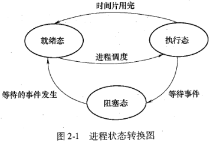

      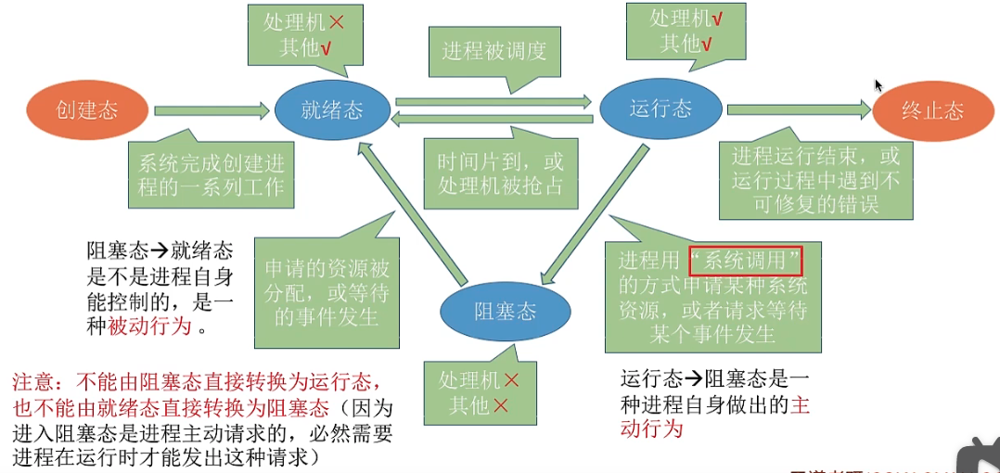

      

      

   3. Linux 的进程状态

      1. Linux2.4.30进程状态及状态定义。

         1. 可运行状态（ TASK  RUNNING）。
         2. 可中断的等待状态（ TASK  INTERRUPTIBLE）。
         3. 不可中断的等待状态（ TASK  UNINTERRUPTIBLE）。
         4. 暂停状态（ TASK  STOPPED）
         5. 僵死状态（TAK  ZOMBIE）。

         > #define TASK  RUNNINGP 0
         > #define TASK  INTERRUPTIBLE 1
         > #define TASK  UNINTERRUPTIBLE 2
         > #define TASK  ZOMBIE, 4
         > #define TaSK  SToPpEd 8定义文件:include/ linux/sched.h)

      2. Linux2.6.11进程状态及其定义。

         1. 可运行状态（ TASK  RUNNING）。
         2. 可中断的等待状态（ TASK  INTERRUPTIBLE）
         3. 不可中断的等待状态（ TASK  UNINTERRUPTIBLE）
         4. 暂停状态（ TASK  STOPPED）。
         5. 跟踪状态（ TASK  TRACED）。
         6. 僵死状态（ TASK  ZOMBIE）。
         7. 僵死  撤销状态（ EXIT  DEAD）。

         > #define TASK  RUNNING 0
         > #define TASK  INTERRUPTIBLE 1
         > #define TASK  UNINTERRUPTIBLE 2
         > #define TASK  STOPPED 4
         > #define TASK  TRACED 8
         > #define EXIT  ZOMBIE 16 
         >
         > #define EXIT  DEAD 32
         > (定义文件: include/ linux/ sched.h)
         > 在Limx2.6.11中,状态字段的值通常用一个简单的赋值语句设置.例如, `procdesc  ptr -> state= TASK  RUNNING`

5. 进程的组织

   

   1. **链接方式**
      - 把系统中具有相同状态的进程的进程控制块（PCB）用其中的链接字链接成一个队列，如 图 2-2 所示。
   2. **索引方式**
      - 系统根据所有进程的状态，建立几张索引表，索引表的每一个表项指向一个PCB的物理块，如 图 2-3 所示。
   3. **进程队列**
      - 前面讲解了进程控制块，当系统中有很多进程时，可以把进程控制块用队列组织起来，形成**进程队列**。把具有相同状态的进程放在同一个队列中，具有不同状态的进程就形成了不同的进程队列。处于就绪态的进程构成的进程队列称为**就绪队列**，处于阻塞态的进程构成的进程队列称为**阻塞队列**。
      - 根据算法的需要，又可以把就绪队列按照优先权的不同分成几个优先权不同的就绪队列，把阻塞进程根据阻塞原因的不同分成不同的阻塞队列，阻塞原因相同的进程在同一个阻塞队列中，如 图 2-4 所示。

   


## 第二节 进程的控制

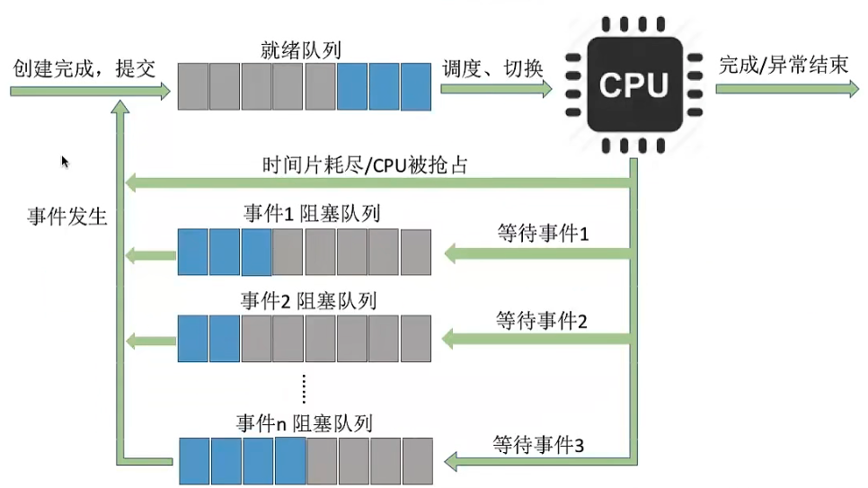

1. **创建进程**的条件

   1. 用户登录
   2. 作业调度
   3. 提供服务
   4. 应用请求

   - 当新进程被创建时，有两种**执行可能**。
     1. 父进程与子进程并发执行。
     2. 父进程等待，直到某个或全部子进程执行完毕。
   - 新进程的**地址空间**也有两种可能。
     1. 子进程共享父进程的地址空间。
     2. 子进程拥有独立地址空间。
   - **调用创建新进程**的系统调用来创建进程的一般步骤如下。
     1. 申请空白 PCB。
     2. 为新进程分配资源。
     3. 初始化进程控制块。
     4. 将新进程插入就绪队列。
   - Linux2.6.11 中创建进程的常用系统调用在函数库中的接口函数是 `fork()`。

   

2. **进程阻塞**的条件

   1. 请求系统服务
   2. 数据尚未到达
   3. 无工作可做
   4. 启动某种操作

3. **进程唤醒**的过程

   1. 将进程从阻塞队列中移出。
   2. 将进程状态由阻塞态改为就绪态。
   3. 将进程插入就绪队列。

4. **进程的终止**

   - 进程的终止也称进程的撤销，在下列情况下，进程会被终止。
     1. 进程正常执行完毕
     2. 一个进程调用适当的系统调用，终止另外一个进程。
   - 操作系统通过系统调用完成进程终止的一般过程如下。
     1. 从进程PCB中读进程状态。
     2. 若进程正在执行，则终止进程的执行
     3. 若进程有子孙进程，在大多数情况下需要终止子孙进程。
     4. 释放资源。
     5. 将终止进程的PCB移出。

5. 操作系统的启动和系统中进程的出现

   - 当打开计算机电源后，计算机会先进行**加电自检**，然后**寻找启动盘**。
     - 如果是选择硬盘启动，计算机会检查硬盘的**0柱面0磁道1扇区**。
     - 如果发现该扇区以`0xAA55`结束，则BOIS 认为它是引导扇区，一旦发现引导扇区，BOIS 会执行程序将其装入到内存地址`00007c00` 处，然后跳转到该地址处执行这段引导程序代码，开始加载操作系统。
   - 当硬盘被划分为多个分区，同时安装了**多个操作系统时**，每个分区都有自己的引导扇区，但是整个硬盘有一个**主引导扇区**，**主引导扇区就是硬盘的0柱面0磁道1扇区**。通过执行主引导扇区的代码，判断当前被激活的分区，然后加载被激活分区的引导扇区，通过该引导扇区代码的执行加载该激活分区的操作系统。
   - Linux系统从硬盘引导、加载、初始化和创建进程的简化过程如 图2-6  所示。

   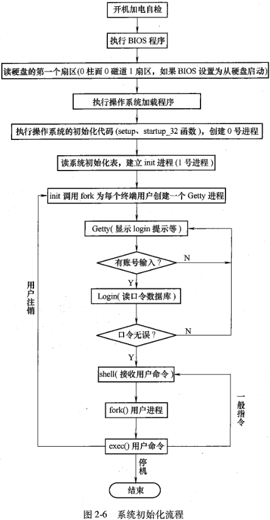

## 第三节 操作系统的内核

1. **支撑功能**
   - 支撑功能包括**中断处理**、**时钟管理**和**原语操作**。
   - 原语操作也称原子操作，是**一组在执行过程中不能被中断的操作**。
2. **资源管理功能**
   
- 资源管理包括进程管理、存储器管理和设备管理。
  
1. 中断

   1. 什么是中断

      - 中断是改变处理器执行指令顺序的一种事件，这样的事件与CPU芯片内外部硬件电路产生的电信号相对应。
      - 计算机在执行程序的过程中，当出现中断时，计算机停止现行程序的运行，转向对这些中断事件的处理，处理结束后再返回到现行程序的间断处

   2. 为什么需要中断

      - 使CPU可以与其他设备并行工作
      - 图 2-7 表示了在引入中断处理机制的系统中，打印服务进程与其他进程并发执行、打印机与CPU并行工作的情况。

      

   3. 中断的类型

      1. **同步中断**（也称内部中断或异常）

         - 只有在**一条指令终止执行**（注意：此时指令并不一定已经执行完毕）后CPU才会发出中断，如除法出错、调试、溢出和浮点出错等。

      2. **异步中断**（也称外部中断）

         异步中断是由其他硬件设备随机产生的

         1. **外部可屏蔽中断**。外部可屏蔽中断是由 **I/O 设备**产生的中断
         2. **外部不可屏蔽中断**。外部不可屏蔽中断是由**紧急事件**引起的中断，如硬件故障。

   4. 引起中断的原因

      1. 人为设置中断。
      2. 程序性事故。
      3. 硬件故障。
      4. I/O 设备。
      5. 外部事件。

   5. 中断响应

      1. 对于可屏蔽中断，**开中断**是响应中断的前提。
      2. 对于外部中断，CPU每执行完一条指令都会**检测**是否有外部中断信号的到来。若有则转中断处理过程。

   6. 单重中断的处理过程

      1. 外部中断的处理过程如 图2-8 所示。CPU在反复执行指令的过程中，每执行完一条指令，都会检测是否有外部中断信号的到来。如果检测到有中断信号，则转中断处理过程。

         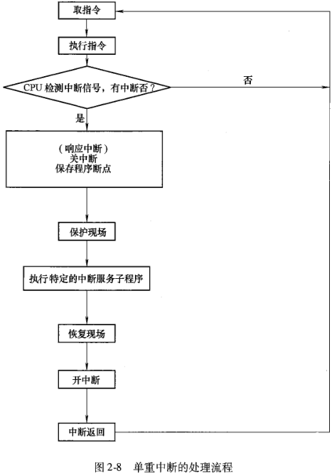

         1. 系统关闭中断，保护断点，把当前要执行的下一条指令的地址保存到内存中
         2. 转中断处理程序。在中断处理程序中完成保护现场的工作，就是把相关的硬件上下文信息保存到内存中。硬件上下文就是中断返回恢复被中断程序的执行时，需要写回CPU寄存器的值。
         3. 保护完现场后，要根据中断向量到中断向量表中（在 Linux中是到中断描述符表中）找到与中断处理子例程入口地址相关的信息，由这些信息得到中断处理子例程的入口地址，以执行中断处理子例程，完成本次中断处理的特定处理工作。
         4. 最后，恢复现场，开中断，CPU返回断点处继续执行被中断的程序

   7. 如何找到中断服务子程序

      1. **中断向量**。中断向量是**对不同中断源到来的信号编号**，该编号是一个无符号整数（0~255）

         - 不可屏蔽中断的向量和异常的向量是固定的，而可屏蔽中断的向量可以通过对中断控制器的编程来改变
         - Linux中的中断向量与中断源的对应关系如 表 2-1 所示

         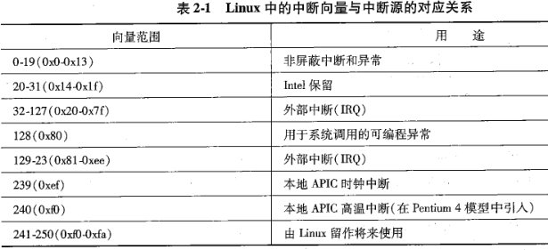

      2. **中断描述符表**（ Interrupt Descriptor Table,IDT）是一个系统表，每个中断或异常与向量相联系。

         - 每个向量在表中有唯一对应的表项，其中存有与中断或异常处理子例程入口地址相关的信息。
         - 内核在允许中断发生前，必须正确地初始化 IDT。
         - 在操作系统初始化时，由操作系统执行汇编指令 ldit 加载进入内存。

2. 时钟管理

   1. 时钟的重要性

   2. 计算机系统中的时钟

      - 大部分PC中有两个时钟源，分别称为**实时时钟**（ Real timer clocker,RTC）和**OS时钟**。
        - RTC时钟也称**CMOS时钟**，是一块时钟芯片，靠**电池供电**，为计算机提供计时标准，是最原始、最底层的数据。
        - OS时钟产生于PC主板上的**定时/计数芯片**，在**开机时有效**，由操作系统控制。
      - 计算机开机加电后，操作系统通过BOIS获取当前RTC时钟的值作为系统的初始时间，操作系统初始化后启用自己的时钟硬件，即可编程问隔定时器（ Programmable Internal Timer, PT）。PT可以按照一定的频率产生时钟中断（ Timer Interrupt），以告知内核又一个时间间隔过去了。
      - RTC时钟、OS时钟和应用程序之间的关系如图2-11所示。

      

   3. 操作系统的时钟机制

      1. 两种定时测量：

         1. 保存当前的系统时间和日期
         2. 维持定时器，操作系统依靠时钟硬件和时钟驱动程序来完成上述两种测量

      2. 操作系统依靠时钟硬件（可编程间隔定时器PI）和时钟驱动程序完成上述两种定时测量功能。

         1. **os时钟管理硬件**（可编程间隔定时器PIT）

            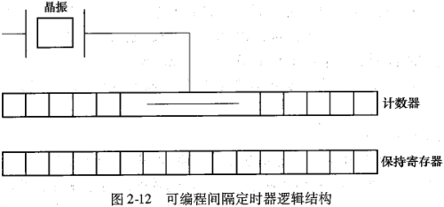

         2. 时钟软件—**时钟驱动程序**

            时钟驱动程序也称为时钟中断处理程序，**每产生一次时钟中断信号，操作系统内核要执行时钟驱动程序**，时钟驱动程序完成下列功能。

            1. 维护日期和时间

            2. 递减当前进程在一个时间片内的剩余执行时间，并检查是否为零，防止进程运行超时。

            3. 对CPU的使用情况记账。

            4. 递减报警计数器。

               

   4. Linux 时钟

      1. 时钟滴答。
         - OS时钟是由可编程定时/计数器输出脉冲触发中断而产生的，输出脉冲的周期称为一个时钟滴答。
         - Linux2.4 的设计者将**一个时钟滴答定义为10ms**（每秒产生100次时钟中断）。
      2. 时钟基准。 Linux的时间基准是1970年1月1日凌晨0点。
      3. Linux用全局变量jiffes表示自系统启动以来的时钟滴答数。
      4. Linux提供的时间格式举例。
      5. 与时钟中断相关的函数。

3. 系统调用

   1. 什么是系统调用

      - 系统调用是一群预先定义好的模块

      - 系统调用是系统程序与用户程序之间的接口

   2. **系统调用与一般函数的区别**

      1. 用户态执行
         - 用户空间是指用户进程所处的地址空间，**一个用户进程不能访问其他进程的用户空间，只有系统程序才能访问其他用户空间**。
         - 当CPU执行用户空间的代码时，称该进程在用户态执行。
      2. 系统态执行
         - 系统空间是指含有**一切系统核心代码的地址空间**，当CPU执行系统核心代码时，称进程处于系统态执行。
      3. 系统调用与一般函数调用的区别如下。
         1. 系统调用运行在系统态（核心态），而一般函数运行在用户态。
         2. 系统调用与一般函数调用的执行过程不同。系统调用执行时，当前进程被中断，由系统找相应的系统调用子程序，并在系统态下执行，执行结果返回进程。
         3. 系统调用要进行“中断处理”，比一般函数调用多了一些系统开销。

   3. 普通函数执行过程实例

   4. 系统调用执行过程实例

   5. 系统调用的类型

      1. 进程控制类系统调用。创建、撤销进程；获得、改变进程属性。
      2. 文件操纵类系统调用。创建文件、删除文件、打开文件、关闭文件和读/写文件。
      3. 设备管理类系统调用。请求、释放设备。
      4. 通信类系统调用。打开、关闭连接，交换信息
      5. 信息维护类系统调用。返回系统当前日期、时间、版本号、用户数、空闲内存和磁盘空间大小等信息。

   6. Linux 中的系统调用举例

      1. `fork` 创建一个新进程。
      2. `clone` 按指定条件创建子进程。
      3. `execve` 运行可执行文件
      4. `exit` 中止进程。exit立即中止当前进程 getdtablesize所能打开的最大文件数。
      5. `getpgid` 获取指定进程组标识号。
      6. `open` 打开文件。
      7. `creat` 创建新文件
      8. `close` 关闭文件描述字。
      9. `read` 读文件
      10. `write` 写文件。

   7. 操作系统提供系统调用的优点

      1. 使编程更加容易，把用户从学习硬件设备的低级编程特性中解放出来。
      2. 极大地提高了系统的安全性。

## 第四节 进程同步(重点)


1. 进程同步的基本概念

   - 必须以互斥方式访问的共享资源称为临界资源。

   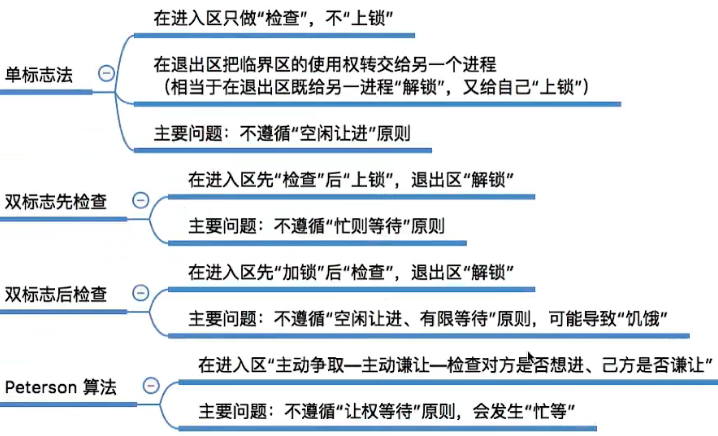

   

2. 同步机制应遵循的准则

   1. 空闲让进
   2. 忙则等待
   3. 有限等待
   4. 让权等待
      - 当进程申请不到共享资源的访问权时，应立即释放处理机，以免进程陷入“忙等”状态浪费CPU资源。

3. 信号量机制

   

   1. **整型信号量机制**

      - 整型信号量是表示共享资源状态且只能由**特殊的原子操作**改变的整型量。

        - 其完成同步功能的原理是定义一个整型变量，用整型变量值来标记资源的使用情况。
        - 如果整型量>0，说明有可用资源；
        - 如果整型量≤0，说明资源忙，进程必须等待。
        - 对于一次只允许一个进程访问的临界资源，可定义一个用于互斥的整型信号量，并将其初始化为1。

      - **整型信号量**的值只能通过两个特定的原子操作 **wait** 和 **signal** 来改变。

        1. 整型信号量的 wait 和 signal 操作

           ```C
           // s 定义为整型信号量
           var s integer;
           wait(s) //用于申请资源
           {
             while s<=0 do no-op; // 整型信号量值 <=0 时循环执行空操作
             s = s-1;
           }
           signal(s) // 用于释放资源
           {
             s = s+1;
           }
           ```

        2. 用整型信号量实现进程互斥

           - 用整型信号量实现进程互斥的思想是：

             - 为必须互斥访问的临界资源 CS 定义一个互斥信号量 mutex，将初始值置为 1，然后将CS放入wait（ mutex）和 signal（ mutex）之间。
             - 当CS可访问时， wait（ mutex）才能正常结束使进程进入CS，如 图 2-16 所示。

             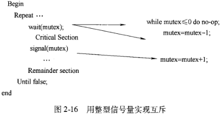

        3. 用整型信号量实现进程的协调

        4. Iinux 中的整型信号量

           - Linux2.4使用的自旋锁可以看作是整型信号量机制的一个应用实例。自旋锁是用来在多处理器环境中工作的一种特殊的锁。如果内核控制路径发现自旋锁“开着”，就是相应的整型信号量的值大于0，就获取锁并继续自己的执行。相反，如果内核控制路径发现锁由运行在另一个CPU上的内核控制路径“锁着”，即整型信号量的值等于0或者小于0，就反复执行一条紧凑的循环指令，直到锁被释放。

        5. **对整型信号量机制的总结**

           1. 整型信号量的值**只能由 wait 和 signal 操作改变**
           2. wait和 signal操作都是**原子操作**，即在这两个操作中对信号量的访问是不能被中断的
           3. 原子操作可以通过**关中断来实现**。
           4. 整型信号量机制的实例：Linux中的**自旋锁** SpinLock
           5. 不同的资源对应不同的信号量，并不是系统中所有的资源都用同一个信号量表示。

   2. **记录型信号量机制**

      

      除了互斥、同步问题外，还会考察有多个资源的问题，有多少资源就把信号量初值设为多少。申请资源时进行P操作，释放资源计进行V操作即可

      1. 记录型信号量的数据类型

      2. 记录型信号量的 `wait（s）`和 `signal（s）`操作

      3. 对记录型信号量 `wait（s）`和 `signal（s）`的说明

         1. 当`s. value>=0`时，`s.value` 的值表示资源数量。当 `s value<0`时，`s.value` 的绝对值等于某资源的等待队列中阻塞进程的数量。
         2. 每次的`wait（s）`操作，意味着进程请求一个单位的资源，描述为 `s. value= s. value-1`当`s.value<0`时，表示资源已分配完毕。因而，进程调用`block`原语，进行自我阻塞，放弃处理机，并自我阻塞进程，其进程控制块被插入到阻塞队列`S.L`中。
         3. 每次的 `signal（s）`操作，意味着进程释放一个资源，故`s. value=s. value+1`操作表示系统可用的资源数目加 1.若加 1后 `s.value<=0`，则表示在该信号量的阻塞队列中，仍有等待该资源的进程被阻塞，故还应该调用 `wakeup`原语，唤醒`s.L`队列中的一个阻塞进程
         4. 如果`s. value`的初值为 1，表示只允许一个进程访问临界资源，此时的信号量转化为互斥信号量。
         5. 记录型信号量机制的优点是不存在“忙等”，采取了“让权等待”的策略。

      4. 利用记录型信号量实现互斥

      5. 利用记录型信号量实现“协调”的应用举例

      6. Linux2.4内核记录型信号量实例

         `semaphore`信号量的定义文件：`/ include/asm-i386/ semaphore. h`

         1. 信号量结构的定义。
         2. 对信号量的操作。

   3. **AND 型信号量机制**

      1. AND型信号量机制的引入
         - AND信号量机制的基本思想是将进程在整个运行过程中所需要的所有资源**一次性地全部分配给进程**，待该进程使用完后再**一起释放**。只要还有一个资源不能分配给该进程，其他所有可能为之分配的资源也不分配给它。
      2. AND型信号量机制的实现

4. 经典的进程同步问题

   1. **生产者—消费者问题的描述**

      1. 问题描述

         - 生产者进程生产消息，并将消息提供给消费者进程消费。在生产者进程和消费者进程之间设置了一个具有n个缓冲区的缓冲池，生产者进程可以将它所生产的消息放入缓冲池的一个缓冲区中，消费者进程可以从一个缓冲区中取得一个消息消费。任意两个进程必须以互斥的方式访问公共缓冲池。当缓冲池空，没有可供消费的消息时，消费者进程必须阻塞等待。当缓冲池装满消息，没有空闲缓冲区时，生产者进程必须阻塞等待。

      2. 需要解决的问题

         1. 实现任意两个进程对缓冲池的互斥访问。
         2. 实现对生产者进程和消费者进程的“协调”，即缓冲池中有消息时消费者进程才能执行取消息的操作。无消息时，阻塞消费者进程。缓冲池中有空闲缓冲区时，生产者进程才能执行放消息的操作。无空间缓冲区时，阻塞生产者进程。

      3. 信号量的设置

         1. 设置一个互斥信号量 mutex，用于实现对公共缓冲池的互斥访问，初值为1

         2. 设置两个资源信号量，分别表示可用资源数

            empy ：表示缓冲池中的空缓冲区数，初值为n。

            full ：表示装有消息的缓冲区数，初值为0（一个缓冲区中放一个消息）。

      4. 同步程序

         1. 生产者进程同步代码的描述
         2. 消费者进程同步代码的描述

      5. 说明

         1. wait和 signal操作必须成对出现。
         2. wait操作的顺序不能颠倒。必须先对资源信号量（即empty和full）进行wait操作，然后再对互斥信号量进行wait操作。
         3. 用记录型信号量机制解决生产者一消费者问题，对具有相互合作关系的进程，提供了解决问题的模型

   2. **读者—写者问题**

      1. 问题描述
         - D是多个进程共享的数据区，允许多个进程同时读D区，仅允许一个进程写D区，且有进程写D区时，不能有任何其他进程读或写D区。
         - 数据库管理中存在这种同步问题的实例，系统允许多个用户同时读一个数据库表，但是任意时刻只允许一个用户修改它，当数据库表被用户（通常是有特殊权限的数据库管理员）修改时，任何其他用户不能读或者写这一数据库表。
      2. 信号量的设置
         1. 全局变量 headcount用于对进入共享区的读进程计数。
         2. 互斥信号量mute用于对多个进程共享的全局变量 headcount的互斥访间
         3. 互斥信号量 wmutex用于实现读操作与写操作的互斥，以及写操作与写操作的互斥
      3. 同步程序
         1. 写进程同步代码的描述
         2. 读进程同步代码的描述

5. 管程

   

   1. 管程的基本概念

      信号量机制的缺陷是每个访问共享资源的进程都必须自备同步操作wait（s）和 signal（s）。这就使大量的同步操作分散在各个进程中，这不仅给系统的管理带来麻烦，而且还会因同步操作的使用不当而导致系统出错，因此引入了管程的概念。

      1. 管程的定义
   
         - 管程是**描述共享资源的数据结构**和在数据结构上的**共享资源管理程序的集合**。其中包括变量的定义、变量的初始化代码，以及管理共享资源的过程。管程的语法描述如下。
   
         ```C
      type monter- name moniter 
           variable declarations 
          procedure entrypl(...)
         begin...end;
      ...
         procedure entrypn(...)
         	begin end; 
         begin initialization code
      end
         ```

         

      2. 管程的说明
   
         1. 管程是可供程序员调用的**软件包**。
         2. 每次**只有一个进程调用管程**执行，任意时刻管程中只能有一个活跃进程。
         3. 管程是一种编程语言的构件，所以编译器知道它们很特殊，并可以调用与其他过程不同的方法来处理它们。
   
      3. 条件变量
   
         - 条件变量的定义形式是：`Var x, y : condition`
   
   2. 管程的应用
   
      1. 利用管程解决生产者一消费者问题
      2. 利用管程解决哲学家进餐问题

## 第五节 进程通信

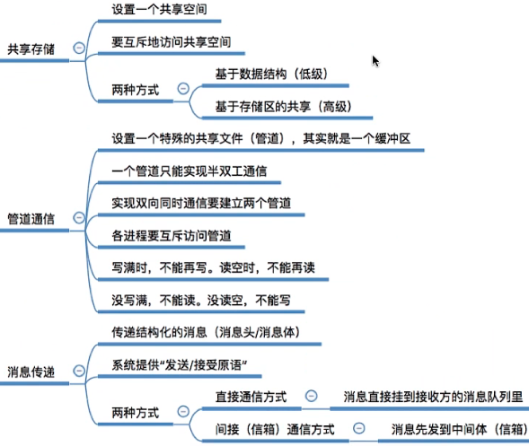

1. 共享存储器系统
   1. 基于**共享数据结构**的通信方式。
   2. 基于**共享存储区**的通信方式。
2. 消息传递系统
   1. 直接通信方式
   2. 间接通信方式。
3. **管道通信**
   - 管道（ Pipeline）是**连接读写进程**的一个特殊文件，也被称为管道文件。
   - 管道文件存在于外存中，其中的消息没有固定长度，能用于进程间大量的信息通信。
   - 向管道提供输入的发送进程以字符流的形式将大量的数据送入管道（写）。
   - 接受管道输出的接收进程，从管道中接收数据（读）。
4. **消息缓冲队列**
   - 消息缓冲队列机制广泛用于**本地进程**之间的通信。
   - 该机制包括**数据结构**、**发送原语**和**接收原语**，每个进程都有自己的消息缓冲队列和消息缓冲区。
   - 发送进程发送消息时，先申请个消息缓冲区，将要发送的消息从发送进程的发送区放入消息缓冲区。
   - 然后，调用发送原语将消息发送给接收进程，发送原语将发送缓冲区插入接收进程的消息缓冲队列。
   - 接收消息的进程通过调用接收原语将该进程消息缓冲队列中的消息复制到自己的消息接收区。

## 第六节 线程


1. 线程的描述
   1. 线程的概念和分类
      1. 线程的概念
      
         - 程的概念线程是**进程中的一个实体**，是被**系统独立调度和分派的基本单位**。
         - 线程只拥有在运行中必需的资源，包括**程序计数器、一组寄存器和栈**，但它可与同属一个进程的其他线程**共享进程所拥有的全部资源**。
         - 一个线程可以创建和撤销另一个线程。
         - 同一进程中的多个线程可以并发执行。线程在运行中呈现间断性，也有就绪、阻塞和执行3种基本状态。
      
      2. 线程的分类
      
         线程的实现可以分为两类，即**用户级线程**和**内核级线程。**
      
         内核级线程依赖于内核，用户进程和系统进程中的线程，它们的创建、撤销和切换都由内核实现。
      
         在内核中为线程创建线程控制块，内核根据该控制块感知线程的存在并对线程进行控制。
      
         1. 线程的调度与切换速度。
            - 内核级线程的调度由**内核的线程调度**程序完成，用户级线程的调度则由**用户线程包**中的一个过程来完成。内核级线程的调度程序运行在**系统态**，用户级线程的调度程序运行在**用户态**。
            - 内核级线程的调度规则与进程调度相似，用户级线程的调度规则相对简单。**内核级线程切换慢，用户级线程切换快**。
         2. 系统调用。
            - 内核级线程进行系统调用，只阻塞该**线程**。
            - 用户级线程的系统调用，要阻塞线程所属的**进程**
         3. 线程执行时间的分配。
            - 内核级线程的CPU时间以线程为单位分配，每一个线程都可以**独享**一个CPU时间片。
            - 用户级线程的CPU时间以进程为单位，同一进程的多个线程**共享**一个CPU时间片
      
   2. 线程的3种基本状态

      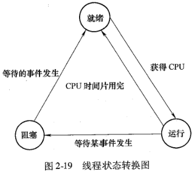

   3. **线程控制块**

      1. 线程控制块的定义

         - 每个线程都由一个数据结构表示，包括它的**基本状态、标识及记账信息**。
         - 这个数据结构就是**线程控制块（ Thread Control block, TCB）**。

      2. 线程控制块中的信息

         - 线程**标识符**信息
         - 处理机状态信息
         - 线程调度信息
         - 线程控制信息

      3. 线程控制块的组织方式

         - 线程控制块通常采用链接方式来组织，把同一进程中具有相同状态的TCB用指针链接成队列，如图2-20所示。

         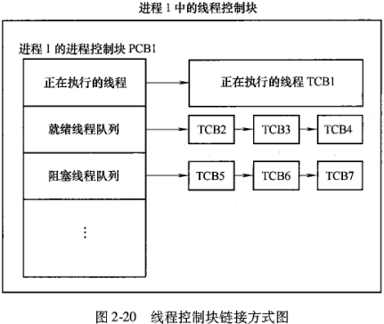

   4. **线程与进程的关系**

      1. 资源和调度
         - 线程是程序**执行**的基本单位，
         - 进程是拥有**资源**的基本单位。
      2. 地址空间资源
         - 不同进程的地址空间是相互**独立**的
         - 而同一进程中的各线程**共享**同地址空间。
      3. 通信关系
         - 进程之间的通信必须使用**操作系统提供**的进程间通信机制
         - 而同一进程中的各线程间可以通过**直接读**或写**全局变量**来进行通信，甚至无需操作系统的参与。
      4. 并发性
         - 都可以并发
      5. 系统开销
         - 进程开销大
         - 线程上下文切换时，只需保存和设置少量寄存器内容，因此开销很小。另外，由于同一进程内的多个线程共享进程的地址空间，因此，同一进程中的线程的上下文切换要更快。

2. 线程的控制
   1. **线程创建**
      1. 用户线程的创建
         - 用户线程的创建是通过调用线程库中的实用程序完成的。
         - 创建线程的实用程序为新线程申请空白线程控制块，并初始化线程控制块，然后将新线程插入其所属进程的就绪线程队列
      2. 内核线程的创建
         - 内核线程的创建是由内核完成的。
         - 内核为新线程申请空白线程控制块，并初始化线程控制块，然后将新线程插入其所属进程的就绪线程队列。
   2. **线程的终止**
      1. 引起线程终止的原因
         - 正常结束。
         - 异常结束。
         - 外界干预
      2. 线程的终止过程
         1. 根据被终止线程的标识符，从TCB集合中检索出该线程的TCB，从中读出该线程的状态。
         2. 若被终止线程正处于运行状态，应立即终止该线程的执行，并置调度标志为真，用于指示该线程被终止后应重新执行线程调度程序。
         3. 将被终止线程的TCB从所在队列（或链表）中移出，等待其他程序来搜集信息。
   3. **线程的调度与切换**
      1. 用户线程的调度与切换
         - 用户线程的调度在应用程序内部进行，通常采用非抢占式和更简单的规则，如时间片轮转规则，也无需用户模式和内核模式之间的切换
         - 一个多用户线程的应用程序不能充分利用多CPU技术。
      2. 内核线程的调度与切换
         - 内核线程由内核来维护其上下文信息，调度是由内核以线程为单位进行的。内核线程的调度和切换都需要用户模式和内核模式之间的切换
         - 调度可以为一个进程中的多个内核线程分配多个CPU，使多个内核线程达到并行。
   4. **线程的阻塞与唤醒**
      1. 引起线程阻塞的事件
         1. **请求系统服务**。
            - 当运行态线程请求操作系统提供服务时，由于某种原因，操作系统并不立即满足该线程的要求，该线程只能被阻塞。
         2. **启动某种操作**。
            - 当线程启动某种操作后，如果该线程必须在该操作完成之后才能继续执行，则必须先将该线程阻塞，以等待该操作完成。
         3. **新数据尚未到达**。
            - 对于相互合作的线程，如果其中一个线程先获得另一个线程提供的数据才能运行以对数据进行处理，则只要其所需数据尚未到达，该线程只能被阻塞
      2. 用户线程的阻塞与唤醒
         - 如果进程中的一个用户线程被阻塞，则整个进程都必须等待，即使还有其他用户线程可以在应用程序内运行。用户线程的阻塞过程如下。
           1. 停止该线程的执行，将该线程的状态改为阻塞态。
           2. 将该线程控制块插入相应的线程阻塞队列。
           3. 将该线程所属进程的状态改为阻塞态。
           4. 将该线程所属进程的进程控制块插入相应的进程阻塞队列。
           5. 将控制传递给进程调度程序，重新进行进程调度。
         - 用户线程的唤醒过程如下。
           1. 将该线程所属进程的状态由阻塞改为就绪。
           2. 将该线程所属进程的进程控制块从进程阻塞队列中移出。
           3. 将该线程所属进程的进程控制块插入进程就绪队列。
           4. 将该线程状态由阻塞改为就绪。
           5. 将该线程的线程控制块从线程阻塞队列中移出。
           6. 将该线程的线程控制块插入线程就绪队列。
      3. 内核线程的阻塞与唤醒
         - 如果进程中的一个内核线程被阻塞，内核可以调度同一个进程中的另一个内核线程运行。内核线程的阻塞过程如下。
           1. 停止该线程的执行，将该线程的状态改为阻塞态
           2. 将该线程控制块插入相应的线程阻塞队列。
           3. 将控制传递给线程调度程序，重新进行线程调度。
         - 内核线程的唤醒过程如下
           1. 将该线程状态由阻塞态改为就绪态。
           2. 将该线程的线程控制块从线程阻塞队列中移出
           3. 将该线程的线程控制块插入线程就绪队列。

3. 线程的同步

   - 一个进程中的所有线程共享同一个地址空间和诸如打开的文件之类的其他资源。
   - 一个线程对资源的任何修改都会影响同一个进程中其他线程的环境。
   - 因此，需要对各种线程的活动进行同步，保证诸线程以互斥的方式访问临界资源，以使它们互不干扰且不破坏数据结构。
   - 线程同步的机制有**原语操作**和**信号量机制**。

4. 线程通信

   - 线程通信是指线程之间的信息交换。
   - 由于同一进程中线程间共享内存和文件资源，各线程间可以通过**直接读/写全局变量**来进行通信，甚至无需操作系统内核的参与。
   - 对于不同进程的线程间通信，则必须使用操作系统提供的线程间通信机制。


# 第三章 进程调度与死锁（重点）

- 本章重点

  1. **进程调度算法**（选择、填空、简答、**综合**）

  2. **实时系统中的调度概念及算法**（选择、填空、简答、**综合**）

  3. 进程切换（选择、填空、简答）

  4. 多处理器调度（选择、填空、简答）

  5. 死锁产生的原因、必要条件（选择、填空、简答）

  6. 死锁的预防和避免（选择、填空、简答）

  7. **银行家算法**（选择、填空、简答、**综合**）

  8. 死锁的检测和解除（选择、填空、简答）

     近三年分值分布：21~26分

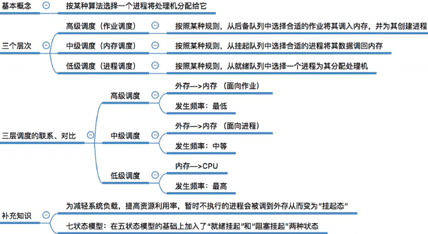

## 第一节 进程调度的功能与时机

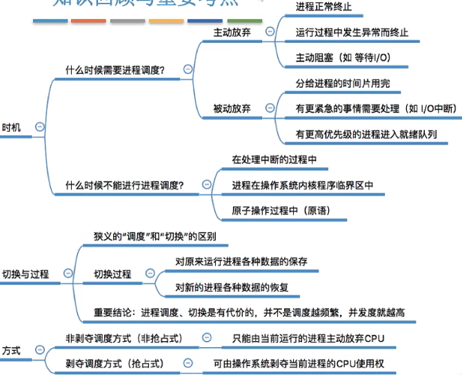

1. 进程调度的功能
   - 进程调度的功能是**按照某种策略和算法从就绪态进程（在 Linux中是可执行进程）中为当前空闲的CPU选择在其上运行的新进程。**
2. 进程调度的时机
   - 当一个进程运行结束（包括正常结束和异常结束）、进程阻塞、中断返回、在支持抢占式调度的系统中有比当前运行进程优先级更高的进程到来、当前运行进程的时间片用完时，系统都会通过执行进程调度程序重新进行进程调度。

## 第二节 进程调度算法(重点)

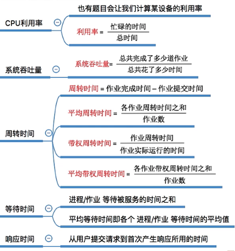


1. 选择调度方式和算法的若干准则
   1. **周转时间短**
      - 作业在外存后备队列上等待调度的时间，
      - 进程在就绪队列上等待进程调度的时间，
      - 进程在CPU上执行的时间，
      - 以及进程等待 I/O 操作完成的时间。
   2. **响应时间快**
      - 从输入设备（如键盘、鼠标等）输入的请求信息传送到处理机的时间
      - 处理机对请求信息进行处理的时间
      - 以及将所形成的响应信息回送到终端显示器的时间
   3. **截止时间的保证**
      - 必须开始执行的最迟时间，或必须完成的最迟时间
   4. **系统吞吐量高**
      - 单位时间内完成的作业数。
   5. **处理机利用率好**
2. 调度算法

   1. **先来先服务调度算法**(First-Come,First-Served, FCFS)
      
      1. 调度算法
         - 从就绪队列的队首选择最先到达就绪队列的进程，为该进程分配CPU。
      2. 性能分析
         - 适合长进程，不利于短进程
      
   2. **短进程优先调度算法**(Shortest-Process-First, SPF)
      
      1. 调度算法
      2. 算法优点
         - 短进程优先的算法能有效降低进程的平均等待时间，提高系统的吞吐量
      3. 算法的缺陷
         - 对长进程不利。如果系统中不断有短进程到来，长进程可能长时间得不到调度。
         - 不能保证紧迫进程的及时处理，因为该算法不考虑进程的紧迫程度
         - 进程的长短根据用户的估计而定，故不一定能真正做到短进程优先。
      4. 性能分析
         - 能降低系统的平均周转时间和带权平均周转时间。
      5. 完成时间=开始执行时间+所需服务时间 周转时间=完成时间-到达时间
      6. 到达后才进行排序
      
   3. **优先权调度算法**
      
      1. 调度算法
         - 系统将CPU分配给就绪队列中**优先权值最高**的进程。
      2. 优先权调度算法的类型
         1. 非抢占式(Nonpreemptive) 优先权调度算法
            - 高优先权进程一旦得到处理机，则该进程便一直运行下去，直到完成或由于某事件使该进程主动放弃处理机。
            - 非抢占式调度难以保证高优先权进程得到及时调度。
         2. 抢占式(Preemptive) 优先权调度算法
            - 系统会抢占CPU，把它分配给新到达的高优先权进程
      3. 优先权的类型
         1. 静态优先权
            - 静态优先权在创建时确定，在进程的整个运行期间保持不变。
         2. 动态优先权
            - 进程创建时被赋予的优先权，随进程的推进或随其等待时间的增加而改变
      4. 优先权调度算法存在的问题和解决方案
         1. 问题
            - 优先权调度算法的一个主要问题是**无穷阻塞**，或称**饥饿（ Starving）问题**。
         2. 解决方案
            - 低优先权进程无穷等待问题的解决方案之一是**老化（ Aging）技术**。
            - 逐渐增加在系统中等待时间很长的进程的优先权
      
   4. **时间片轮转调度算法**(Round-Robin, RR)
      
      时间片轮转调度算法是在现代分时系统中广泛使用的进程调度算法，UNIX、Linux、 Windows操作系统都采用基于时间片轮转、支持优先权和抢占式调度的混合式进程调度算法。
      
      1. 时间片轮转调度算法
         - 在早期的时间片轮转调度算法中，系统将所有的就绪进程按**先来先服务**的原则，排成个队列，每次调度时把CPU分配给队首进程，并令其执行一个时间片。
         - 当时间片用完时，调度程序终止当前进程的执行，并将它送到就绪队列的队尾。
         - 时间片是一个较小的时间单元，通常为10-100ms. Linux24内核给用户进程分配的时间片大小一般为50ms。
      2. 时间片大小的确定
         1. 系统对响应时间的要求
            - 因此在系统允许的最大进程数一定的情况下，时间片的长短取决于系统要求的响应时间。
            - **响应时间越短，时间片取值应该越小**
         2. 就绪队列中进程的数目
            - **当设定了系统的最长响应时间值后，时间片的大小就与系统允许的最大进程数成反比**
         3. 系统的处理能力
      3. **时间片轮转调度算法的性能评价**
         - 时间片轮转调度算法的性能很大程度上**依赖于时间片的大小**。
         - 在极端情况下，如果时间片很大，那么时间片轮转调度算法就与先来先服务算法一样（如果就绪队列按先进先出对进程排序）。
         - 如果时间片很小，进程需要经过多次上下文切换和进程调度，会大大增加CPU用于进程切换和进程调度的开销。
   
5. 多级队列调度
      1. **多级队列调度算法**(Multilevel Queue-Scheduling Algorithm)

         - 将就绪队列分成多个独立队列，根据进程的某些属性，如需要占用的内存大小、进程优先权或进程类型，进程会被永久地分配到一个队列。每个队列有自己的调度算法。不同的队列优先权不同，调度算法也可能不同。

      2. 多级队列调度算法应用举例：Minix操作系统的进程调度。
      
         - 优先权最高的任务进程队列、优先权次之的服务进程队列和优先权最低的用户进程队列。
      - 对任务进程和服务进程采用**基于优先权的非抢占式调度**，优先权高的进程一旦获得处理机将一直运行下去，直到阻塞。
         - 对优先权最低的用户进程采用时间片轮转的抢占式调度。

         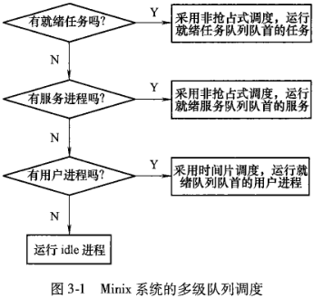

   6. **多级反馈队列调度**（Multilevel Feedback Queue Scheduling）
   
      - 在采用多级反馈队列调度的系统中建立多个优先权不同的就绪队列，为每个队列赋予大小不同的时间片。
        - 有一种反馈策略可以规定：队列优先权越高，时间片越短，时间片通常成倍增长。
        - 新进程被创建后，先插入优先权最高的队列。
        - 仅当高优先权队列空时，才调度优先权次之的队列。
        - 同一队列中，采用时间片轮转调度算法。
      - 使用CPU时间过多的进程会被移到优先权较低的队列中，在较低优先权队列中等待时间过长的进程会被转移到较高的优先权队列中。这样就通过使用**老化技术阻止了饥饿**的发生。
        - 但是，不同的操作系统在设计多级反馈队列调度时采取的策略可能是不同的。
      - 多级反馈队列算法的设计要考虑以下几个方面的问题。
        1. 就绪队列的数量
        2. 根据进程优先权确定进程应该进入哪个就绪队列的算法。
        3. 用以确定进程何时转移到较高优先权队列的算法。
        4. 用以确定进程何时转移到较低优先权队列的算法。
        5. 用以确定进程在需要服务时应该进入哪个队列的算法。
      - 多级反馈队列调度算法的一个典型实例是 **Linux 2.6.11 内核的进程调度算法。**

## 第三节 实时系统中的调度(重点)

1. 实现实时调度的基本条件

   1. 提供**必要的调度信息**

      1. 就绪时间。是一个实时任务成为就绪态的起始时间。
      2. 开始截止时间和完成截止时间。
      3. 处理时间。指一个实时任务从开始执行直至完成所需要的时间。
      4. 资源要求。关于任务执行所需要的资源信息。
      5. 据实时任务紧迫程度的不同，可以给实时任务赋予不同的优先权，使高优先权任务能优先获得系统资源，尽快得到执行。系统中实时进程的优先权不能动态降低。

   2. **系统处理能力强**

      1. 单处理机情况下必须满足的限制条件

         - 假定系统中有 $m$ 个周期性的硬实时进程，它们的处理时间可表示为 $C  i$，周期时间表示为 $P  i$，则在单处理机情况下，必须满足如 式（3-3）所示的限制条件。

         $$
         \sum^m_{i=1} \frac{C_i}{P_i}\leq 1(1\leq i \leq m)
         $$

         - 例如，有6个实时进程，它们的周期时间都是50 ms，也就是说每个进程都必须每隔50ms完成一次运行。
           - 处理机的处理能力为处理一个进程的时间是10 ms。
           - 所以该系统是无法保证所有的6个实时进程都能在截止时间内完成的，这种情况称为系统不可调度。
           - 要保证该系统是可调度的，可以提高处理机的处理能力以缩短每个实时进程的处理时间，也可以增加处理机数量。

      2. $n$ 个处理机情况下必须满足的限制条件

         - 采用多处理机系统可以提高实时系统的处理能力。若系统的处理机个数为 $n$，处理能力的限制条件改变如 式（3-4）所示。

         $$
         \sum^m_{i=1}\frac{C_i}{P_i}\leq n(1\leq i \leq m)
         $$

         

   3. 采用**抢占式调度机制**
      1. 基于时钟中断的抢占式优先权调度算法
         - 等到最近一次时钟中断到来时，系统才剥夺当前进程的CPU，将CPU分配给新到来的优先权更高的实时进程。
      2. 立即抢占的优先权调度算法
         - 在这种调度策略中，一旦接收到触发实时进程运行的信号，这通常是一个外部中断信号，系统立即剥夺当前进程的CPU，把它分配给请求中断的新的实时进程。这种算法能获得比基于时钟中断的抢占式优先算法更快的响应速度。

   4. 具有**快速切换机制**
      1. 对外部中断的快速响应能力
      2. 快读的进程切换能力

2. 常用的几种实时调度算法

   1. **最早截止时间优先 EDF(Earliest Deadline First, EDF)算法**
      - 该算法是根据进程的开始截止时间确定进程的优先级。截止时间越早，进程的优先级越高，越优先获得处理机。该算法要求在系统中保持一个实时进程的就绪队列，该队列按各进程截止时间的早晚排序，具有最早截止时间的进程排在队列的最前面。调度程序在选择进程时，总是选择就绪队列中的第一个进程，为之分配处理机，使之投入运行。最早截止时间优先的算法既可用于抢占式调度，也可用于非抢占式调度。
2. **最低松弛度优先 LLF(Least Laxity First, LLF) 算法**
      - 松弛度用来表示一个**实时进程的紧迫程度**。
        - 如果一个进程的完成截止时间为 $T$，当前时间为 $T  c$，处理完该任务还需要的时间为 $T  s$，则松弛度 $L$ 的计算式表示为 $L=T-T  c-T  s$ 
      - 在使用最低松弛度优先算法时，调度程序在调度时机到来时，每次选择松弛度 $L$ 最小的进程，把CPU分配给该进程。
      - 该算法在实现时，把进程按松弛度排序，**让松弛度最小的进程处于就绪队列队首，这样调度程序执行时只需选择就绪队列队首的进程执行即可。**

   

## 第四节 进程切换

- 进程切换使当前正在执行的进程成为被替换进程，出让其所使用的CPU，以运行被进程调度程序选中的新进程。进程切换通常包括以下几个步骤。
  1. 保存包括程序计数器和其他寄存器在内的CPU**上下文环境**。
  2. 更新被替换进程的**进程控制块**。
  3. **修改进程状态**，把执行态改为就绪态或者阻塞态。
  4. 将被替换进程的**进程控制块移到就绪队列**或阻塞队列。
  5. 执行通过进程调度程序选择的新进程，并更新该进程的进程控制块。
  6. 更新内存管理的数据结构。
  7. 恢复被调度程序选中的进程的硬件上下文。

## 第五节 多处理器调度

1. **多处理器系统 (MultiProcessor Systems, MPS) 的类型**
   1. 紧密耦合的多处理器系统和松弛耦合的多处理器系统
      1. 紧密耦合的多处理器系统
         - 紧密耦合的多处理器系统通常通过高速总线或高速交叉开关实现多个处理器之间的互连，它们共享主存储器系统和 I/O 设备，并要求将主存储器划分为若干个独立访问的存储器模块，以便多个处理器能同时对主存进行访问。
         - 系统中的所有资源和进程都由操作系统实施**统一的控制和管理**。
      2. **松弛耦合的多处理器系统**
         - 松弛耦合的多处理器系统通常通过通道或通信线路来实现多台计算机之间的互连。每台计算机都有自己的存储器和 I/O 设备，并配置了操作系统来管理本地资源和在本地运行的进程。
         - 因此，每一台计算机都能**独立工作**，必要时可通过通信线路与其他计算机交换信息，以及协调它们之间的工作。
   2. 对称多处理器系统和非对称多处理器系统
      - 当前的绝大多数多处理器系统都是**对称多处理器系统**。
2. 多处理器系统中的进程分配方式
   1. **对称多处理器系统中的进程分配方式**
      1. 静态分配
         - 在采用这种分配方式时，操作系统为每个处理器建立一个专门的就绪队列，该就绪队列的每个进程都只能在与就绪队列对应的处理器上运行。
         - 一个进程无论经过多少次调度，操作系统都把**同一个处理器分配给该进程**。
         - 静态分配方式的优点是进程调度的开销小，缺点是不能动态地平衡各处理器的负载，使系统存在各处理器忙闲不均的情况。
      2. 动态分配
         - 动态分配的基本特征就是每个进程经过多次调度，每次获得的不一定是同一个处理器
   2. **非对称多处理器系统（MPS）中的进程分配方式**
      - 对于非对称多处理器系统，大多采用主一从式操作系统，即操作系统的**核心部分驻留在台主机上**，而从机上只运行用户程序，只有主机执行调度程序，所有从机的进程都是由主机分配的。
      - 主、从式的进程分配方式的主要优点是系统处理比较简单。
3. **进程(线程)调度方式**
   1. 自调度
      1. **自调度算法的优点**
         1. **易移植**。在采用自调度方式的系统中，公共就绪队列可按照单处理器系统中所采用的各种组织方式加以组织，其调度算法也可沿用单处理器系统所用的算法，因此，很容易将单处理器环境下的调度机制移植到多处理器系统中。
         2. **有利于提高CPU的利用率**。只要系统中有任务，或者说只要公共就绪队列不为空就不会出现处理器空闲的情况，也不会发生处理器忙闲不均的现象，因而有利于提高处理器的利用率。
      2. **自调度方式的缺点**
         1. **瓶颈问题。**采用自调度，在整个系统中只有一个必须互斥访问的公共就绪队列。在系统中有多个处理器的情况下，对公共就绪队列的访问很容易形成瓶颈。当系统中处理器的数目在数十个，甚至数百个时，采用自调度算法瓶颈问题会非常严重
         2. **低效性。**采用自调度算法，CPU上的高速缓存的命中率较低。当进程阻塞后再重新就绪时，它只能进入唯一的公共就绪队列，经过进程调度后，不一定能在阻塞前的处理器上运行。如果在每台处理器上都配有高速缓存，则这时在其中保留的该进程的数据巳经失效，而在该进程新获得的处理器上又需要重新建立这些数据的备份。由于一个进程的整个生命期中，可能要多次更换处理器，因而使高速缓存的命中率很低。
         3. **线程切换频繁。**在多线程系统中，通常一个应用中的多个线程是相互合作的关系。而采用自调度时，相互合作的线程很难同时获得处理器运行，这将会使某些线程因其合作线程未获得处理器运行而阻塞，进而被切换下来。
   2. **成组调度**
      1. 成组调度的优点
         1. **减少线程切换，改善系统性能。**如果一组相互合作的线程或进程能并行执行，则能有效减少进程（线程）阻塞情况的发生，从而减少线程的切换，使系统性能得到改善。
         2. **减少调度开销。**因为每次调度都可以解决一组线程的处理器分配问题，因而可以显著减少调度频率，从而减少调度开销。
      2. 成组调度中的时间分配
         - 在成组调度中可以采用两种方式为应用程序分配处理器时间：
           - 一是面向所有的应用程序平均分配处理器时间；
           - 二是面向所有的线程平均分配处理器时间。
   3. 专用处理器分配
      - 这种方式会造成处理器资源的严重浪费。
      - 专用处理器的优点: 一是加速了应用程序的运行速度，二是避免了进程切换。

## 第六节 死锁(重点)


1. 产生死锁的原因和必要条件
   1. 原因
      - 竞争共享资源且分配资源的顺序不当。
   2. 必要条件
      1. **互斥**条件
         - 指一个进程在访问资源的过程中，其他进程不能访问该资源。
      2. **请求和保持**条件
         - 进程已经保持了至少一个资源，又提出了新的资源要求，而新请求的资源已经被其他进程占有，此时进程阻塞，但又对已经获得的资源保持不放，使得其他进程无法使用被保持的资源
      3. **不剥夺**条件
         - 进程已经获得的资源不能被剥夺，只能由进程自己释放。
      4. **环路等待**条件
         - 在发生死锁时，必然存在一个进程申请资源的环形链。
   3. 实例
      1. 互斥
      2. 请求和保持
      3. 不剥夺
      4. 环路等待
   
2. 处理死锁的基本方法
   1. **死锁的预防**
      1. 摒弃请求和保持条件
      2. 摒弃不剥夺条件
      3. 摒弃环路等待条件
      
   2. **死锁的避免**
      1. 系统的安全状态
         - **当系统能找到一个进程执行序列，使系统只要按此序列为每个进程分配资源**，就可以保证进程的资源分配和执行顺利完成，不会发生死锁时，称系统处于安全状态。
         - 若系统不存在这样的安全序列，则称系统处于不安全状态。
      2. 安全状态举例
      3. 不安全状态举例
      4. 安全状态可以向不安全状态转换
      
      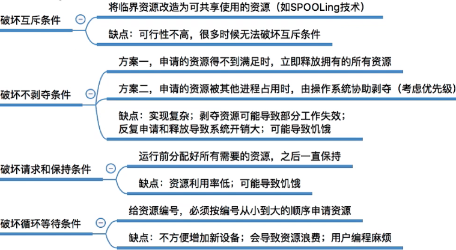
   
3. **银行家算法**
   
   其基本思想是一个进程提出资源请求后，系统先进行资源的**试分配**。然后检测本次的试分配是否使系统处于安全状态，若安全则按试分配方案分配资源，否则不分配资源。
   
   1. 数据结构
   
      1. `available[]`是一个一维数组, 表示系统中某种资源的**可用数量**
      2. `max[]`是一个 n 行 m 列的二维数组, 表示各进程需要各类资源的**最大数量**
      3. `allocation[]`是二维数组, 表示某时刻**已分配**给进程的某类资源数
      4. `need[]` 是二维数组, 表示某个进程**还需要**某类资源的数量
   
   2. 银行家算法的说明
   
      - 银行家算法分为两个过程，
        - 一是进行资源**试分配**的过程；
        - 二是对试分配后系统的状态做**安全性检测**的过程。
          - 经安全性检测，若试分配后系统状态是安全的，则分配资源。
          - 若不安全，则阻塞申请资源的进程，暂不为它分配资源。
   
      1. 资源试分配算法
   
         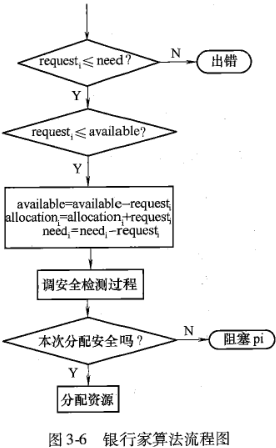
   
      2. 安全性检测算法
   
         - 安全性检测算法对 T 时刻的分配方案进行检测，确定是否存在至少一个安全序列。
   
         
   
   3. 实例
   
   4. 银行家算法应用情况的说明
   
      - 该算法缺乏实用价值。因为很少有进程能够在运行之前就知道其所需资源的最大值，而且进程数不是固定的，往往在不断发生变化，况且原本可用的资源也可能突然间变成不可用（如磁带机可能会坏掉）。
   
4. 死锁的检测和解除
   
   
   
   1. 何时调用检测算法

      1. 锁可能发生的频率，
      2. 当死锁发生时受影响的进程数量
   
   2. 资源分配图
   
      - 系统死锁可利用资源分配图来描述，该图由一组结点和一组边组成。如 图 3-8 所示，用圆圈代表一个进程，用方框代表一类资源。由于一种类型的资源可能有多个，用方框中的一个小圆圈代表某一类资源中的一个资源。
   
      - 请求边由进程指向方框中的 Rj 。而分配边则应始于方框中的一个点。图3-8 所示的资源分配图中，p1进程已分得了两个 R1 资源，并又请求一个 R2 资源。p2 进程分得了一个 R1 和一个 R2 资源，并请求一个 R1 资源。
   
        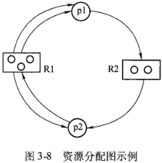
   
   3. **死锁定理**

      - 死锁定理用于检测系统所处的资源分配状态 S 是否为死锁状态。
      - 死锁定理为：**S 为死锁状态的充分条件是当且仅当 S 状态的资源分配图是不可完全简化的。**
   
   4. **死锁的解除**
   
      1. **进程终止**
         1. 终止所有死锁进程。
         2. 一次只终止一个处于死锁的进程，直到死锁解除。
      2. **资源抢占**
         1. 抢占哪个进程和哪些资源？必须确定抢占的顺序以使代价最小。
            - 影响因素有：死锁进程所拥有的资源数量、死锁进程到目前为止已经消耗的执行时间等。
         2. **回滚**。
            - 如果从一个进程那里抢占一个资源，那么该进程因缺少资源不能从抢占点正常执行，必须将进程回滚到某个安全状态，以便从该状态重启进程。
            - 最简单的方法是完全回滚，就是终止进程并重启进程。
         3. **饥饿**。饥饿是进程因长时间不能获得所需要的资源而无限等待的状态。
            - 比如系统采取基于静态优先权的进程调度算法，当系统不断有高优先权进程到来时，优先权低的进程就可能长时间得不到CPU，也就不能运行，这种状态被称为饥饿状态。


# 第四章 内存管理（重点）

- 本章主要内容：

  1. 存储器的层次结构（选择、填空、简答）

  2. 程序的链接和装入（选择、填空、简答）

  3. **连续分配存储管理、动态分区分配算法**（选择、填空、简答、**综合**）

  4. **分页、快表、两级页表**（选择、填空、简答、**综合**）

  5. 虚拟存储、缺页、页分配策略（选择、填空、简答）

  6. **页置换算法**（选择、填空、简答、**综合**）

  7. 分段系统、段表、段页式存储管理（选择、填空、简答）

     本章近3年分值：19~22分


## 第一节 储存器的层次结构


- 储存器系统层级结构

  在这个层次系统中，从高层到低层（L0~L5），较低层的存储设备速度更慢、容量更大、价格更便宜。

  1. 在最高层（L0层），是少量的快速 **CPU 寄存器**，CPU 可以在一个时钟周期内访问它们。
  2. 接下来是一个或多个小型或中型的基于 **SRAM 的高速缓存存储器**，可以在几个 CPU 时钟周期内访问它们。
  3. 然后 L3 层是一个大的基于 **DRAM 的主存**，可以在几十或几百个时钟周期内访问它们。
  4. L3 的下层 L4 是慢速但容量很大的**本地磁盘**。
  5. L5 表示有些系统可能还包括一层附加的**远程服务器上的磁盘**，需要通过网络来访问它们。

- 程序的执行遵循局部性原理。关于程序执行的局部性原理有以下几个论点。

  1. 程序在执行时，除了少部分的转移和过程调用指令以外，在大多数情况下是顺序执行的。
  2. 过程调用将会使程序的执行轨迹由一部分内存区域转到另一部分内存区域。但研究表明，在大多数情况下，过程调用的深度都不超过5; 这就是说，程序将会在一段时间内局限在这些过程的范围内运行
  3. 程序中存在很多循环结构，它们虽然由少数指令构成，但多次执行。
  4. 程序中往往包括许多对数据结构的处理。例如对数组进行操作，它们往往都局限在很小的范围内。

- 总的来说，局部性原理表现为**时间和空间的局部性**。

  1. **时间局部性**。如果程序中的某条指令一旦执行，则不久后该指令可能再次执行。如果某个数据结构被访问，不久以后该数据结构可能被再次访问。
  2. **空间局部性**。一且程序访问了某个单元，在不久之后，其附近的存储单元也将被访问。

## 第二节 程序的链接和装入

1. 程序的链接

   1. **静态链接（ Static Linking）**是在程序运行前，用链接程序将目标模块链接成一个完整的装人模块。

      静态链接程序的任务:

      1. **对逻辑地址进行修改**

         - 如图4-2 所示，链接前模块A、B、C的相对地址范围分别是`0~L-1、0~M-1、0~N-1`，通过链接程序把三个目标模块链接成一个可执行程序后，模块B和C的逻辑地址范围变成了`L~L+M-1、L+M~L+M+N-1` 三个独立目标模块的逻辑地址空间链接成了个连续的地址空间。

         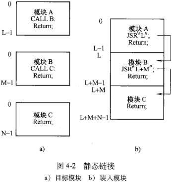

      2. **变换外部调用符号**

         - 将每个模块中所用的外部调用符号都变换为逻辑地址。在图4-2 中，经过链接后，j 将模块 B 的外部调用 `CALL B`变成了一条跳转到模块 B 在相对地址空间中的起始地址L处的指令 `JSR"L"`。对模块 B 的外部调用 `CALL C` 变成了一条跳转到模块 C 在逻辑地址空间中的起始地址 `L+M` 处的指令`JSR"L+m"`

         静态链接相对于动态链接而言，程序运行速度较快。但是无论程序在本次运行中会不会被执行，都将全部被链接到一个可执行文件中，使可执行文件比较大，占用的内、外存空间较大，使存储开销较大。另外，使用静态链接的方式，程序开发不够灵活、方便，修改某一个模块会导致整个程序的重新链接。

   2. **动态链接（ Run-time Dynamic Linking）**，可将某些目标模块的链接推迟到这些模块中的函数被调用执行时才进行。即在程序执行时，若发现一个被调用模块尚未链接，再把它链接到调用者模块上。采用动态链接的优点是节省内存和外存空间，方便了程序开发。

2. 程序的装入

   1. **绝对装入方式**

      - 编译程序事先已知程序在内存中的驻留位置，编译时产生物理地址的目标代码，绝对装入程序按照装入模块的物理地址将程序和数据装入内存。因此装入模块被装入内存后，无需对程序和数据的地址进行修改。

   2. **可重定位装入方式** (静态重定位)

      在程序装入时对目标程序中的指令和数据地址的修改过程称为重定位。

      可重定位方式的两个特点如下。

      1. 编译程序使目标模块的**起始地址从 0 开始**。

      2. 程序装入时，装入程序根据内存的使用情况将装入模块装入到内存的某个位置，并对模块进行重定位。

         物理地址=有效逻辑地址+程序在内存中的起始地址。

   3. **动态运行时装入** (动态重定位)

      - 进程在装入内存后，还可能从内存的一个区域移动到另一个区域，这种情况可能发生在支持虚拟存储的系统中。
      - 一个进程在被换出之前所在的内存位置与后来被作业地址空间从外存重新调入内存时所在的内存位置不同，在这种情况下，地址映射必须延迟到进程执行时再进行，把这种装入方式称为动态运行时装入。
      - 在采用动态运行时装入方式的系统中，系统将进程装入内存后，由于进程在内存中的位置可能发生移动，所以此时并不计算物理地址，而是在进程运行访存的过程中才进行地址转换，这种方式需要重定位寄存器的支持。当进程获得CPU运行时，系统把该进程在内存的起始地址存入重定位寄存器，进程在运行过程中访存时，通过重定位寄存器与被访问单元的逻辑地址计算出被访问单元的物理地址，如图4-4 所示。

      

## 第三节 连续分配储存管理方式(重点)


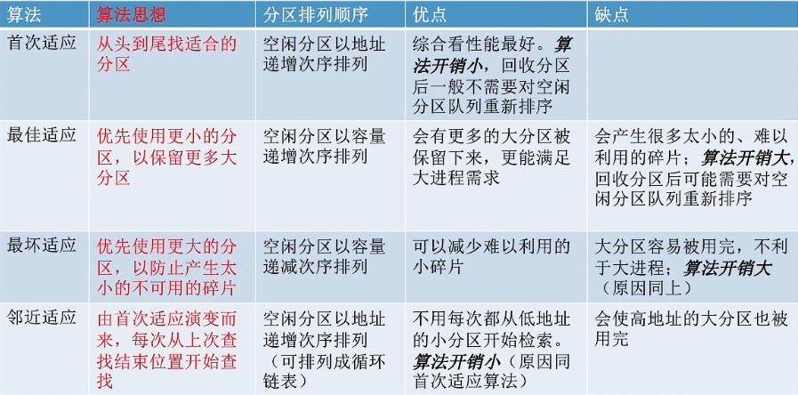


1. **单一连续区**分配方式内存中只有一个用户区，任意时刻内存中只能装入一道程序，这种分配方式仅适用于**单用户、单任务**的系统。

2. **固定分区**分配方式将内存用户区划分成若干个**固定大小**的区域，每个区域中驻留一道程序。

   1. 分区大小相等

   2. 分区大小不等

   3. 支持固定分区分配的数据结构

      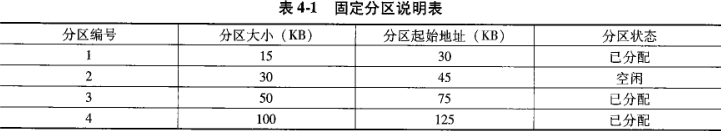

   4. 固定分区分配的过程

      - 需要为进程分配内存时，操作系统执行内存分配程序，搜索内存分区使用表。
      - 当找到一个大小大于或等于进程需要的内存空间而且处于空闲状态的用户分区时，将该分区分配给进程，并将该分区状态改为“已占用”。在上面的数据结构中，就是将相应分区的 state 字段置 1。

   5. 固定分区的回收

      - 把回收分区的使用状态改为“空闲”即可，就是将相应分区的 state 字段置 0。

3. **动态分区**分配方式系统动态地对内存进行划分，根据进程**需要的空间**大小分配内存。内存中分区的大小和数量是变化的。动态分区方式比固定分区方式显著地提高了内存利用率

   1. 动态分区分配原理

      - 系统初始只有一个大空闲区，当进程请求空间时，由系统根据进程需要的空间大小划分出一片空闲区分配给进程。

   2. 动态分区分配使用的数据结构。

      1. 空闲分区表

         - 如表4-2 所示，系统在空闲分区表中为每一个空闲分区建立一个表项，每个表项中包括分区编号、分区大小和分区起始地址。

         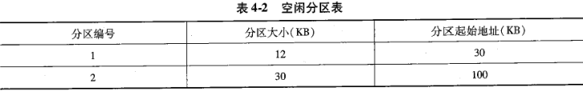

      2. 空闲分区链

         - 使用空闲分区链可以动态地为每一个空闲分区建立一个结点，每个结点包括分区大小、分区起始地址、指向前一个空闲分区结点的指针，以及指向后一个空闲分区结点的指针。

   3. 动态分区分配算法。

      1. **首次适应算法 FF**（ First Fit, FF）

         - 在采用空闲分区链作为数据结构时，首次适应算法要求空闲分区链以**地址递增**的顺序链接。在进行内存分配时，**从链首开始顺序查找**，直至找到一个能满足进程大小要求的空闲分区为止。然后，再按照进程请求内存的大小，从该分区中划出一块内存空间分配给请求者，余下的空闲分区仍留在空闲链中。
         - 该算法总是先分配低地址部分的内存空间，容易使低地址部分留下小分区，而高地址部分大空闲区较多。当进程请求大内存空间时，要找到合适的空闲分区，搜索空闲分区链需要的时间开销比较大。
         - 此外，由于低地址部分的空闲分区反复被划分，可能留下许多难以利用的很小的空闲分区，这种难以被利用的小空闲区也被称为**外部碎片**或外碎片。分配给进程的分区若大于进程请求的分区，分区内会存在一部分不被利用的空间，这部分被浪费的空间称为**内部碎片**或内碎片

      2. **循环首次适应算法 NF**（ Next Fit,NF）

         - 该算法是由首次适应算法演变而形成的。在为进程分配内存空间时，不再每次从链首开始查找合适的空闲分区，而是**从上次找到的空闲分区的下一个空闲分区开始查找**，直至找到第一个能满足要求的空闲分区，并从中划出一块与请求的大小相等的内存空间分配给进程。
           为实现该算法，应设置一个起始查找指针，以指示下一次起始查找的空闲分区，并采用循环查找方式，如图4-8 所示。
         - 循环首次适应算法的优点是：空闲区分布均匀、查找开销较小。缺点是容易使系统缺乏大空闲区。

         

      3. **最佳适应算法 BF**（ Best Fit, BF）

         - 该算法每次为作业分配内存，**总是把大小与进程所请求的内存空间大小最接近的空闲分区分配给进程**，避免了“大材小用”。为了加速寻找，该算法要求将所有的空闲区按分区大小**递增**的顺序形成一个空闲区链。这样，第一次找到的满足要求的空闲区必然是大小最接近进程需要的内存空间大小的。
         - 最佳适应算法的优点是避免了大材小用，能提高内存利用率。但是，采用最佳适应算法容易留下难以利用的小空闲区。

   4. 动态分区的分配和回收操作。

      1. 内存分配流程

         

      2. 内存回收流程

         内存回收的任务是释放被占用的内存区域，如果被释放的内存空间与其他空闲分区在地址上相邻接，还需要进行空间合并。

         1. 释放一块连续的内存区域。
         2. 如果被释放区域与其他空闲区间相邻，则合并空闲区。
         3. 修改空闲分区链。

## 第四节 基本分页储存管理方式(重点)

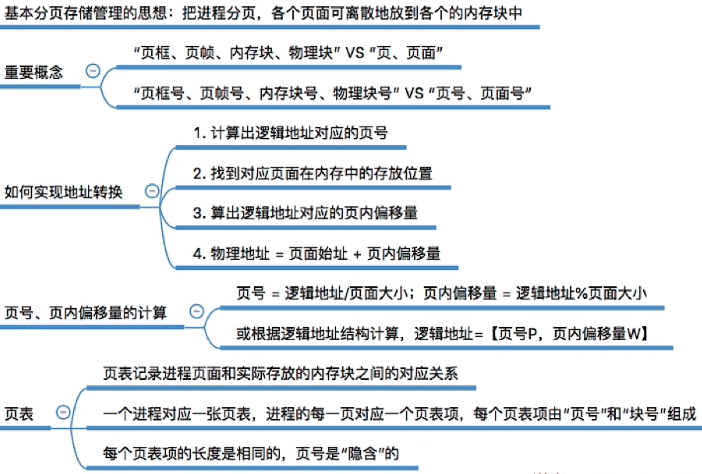


#### 一、分页存储管理的基本原理

1. 基本概念

   1. **页**（Page）

      - 将一个进程的**逻辑地址空间**分成若干个**大小相等的片**

   2. **页框**（ Page Frame）

      - 将**物理内存空间**分成**与页大小相同**的若干个存储块，称为 页框 或 页帧。

   3. **分页存储**

      - 在为进程分配内存时，以页框为单位将进程中的若干页分别装入多个可以不相邻接的页框中。
      - 如 图 4-27 所示，一个进程的逻辑地址空间包括两个页：0号页和1号页。0号页存放在0号页框中，1号页存放在2号页框中。

      

   4. **页内碎片**

      - 进程的最后一页一般装不满一个页框，而形成了不可利用的碎片，称为“页内碎片”，是一种内部碎片。

   5. **页表**（ Page Table）

      - 页表是系统为进程建立的数据结构，页表的作用是实现从**页号到页框号的映射**。在进程地址空间内的所有页（0~n），依次在页表中有一个页表项，其中记录了相应页在内存中对应的页框号。
      - 在基本的分页机制中，每个进程有一个页表，进程的每一个页在页表中有一个对应的**页表项**。**页表在内存中连续存放**。
      

##### 基本分页存储管理方式中的地址结构

- 基本分页的逻辑地址结构包含两部分：页号P和页内偏移量W。

  - 若用m位表示逻辑地址，页大小为 $2^n$ 字节（如512字节，1024字节），则用低n位表示页内偏移量W，用高m-n位表示页号P。

- 以32位地址为例：可用`0~11`位表示页内偏移，n=12，页大小=页框大小=4KB。12~31位（20位）表示页号，共可有20个页即1M个页。这种地址结构可以表示4G的逻辑地址空间，地址结构如 图4-28所示。

  

- **若A为逻辑地址，L为页大小，P为页号，W为页内偏移量，则有以下计算关系。**
  $P=INT(A/L)$

  $W=MOD(A/L)$

1. 分页地址变换

   地址变换机构，该机构的基本任务是实现逻辑地址到物理地址的变换。

   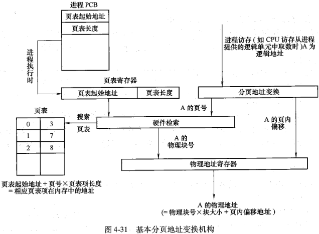

   1. 进程执行，PCB中页表起始地址和页表长度送CPU的页表寄存器。
   2. CPU访问逻辑单元A。
   3. 由分页地址变换硬件自动将A分为页号和页内偏移两部分。
   4. 由硬件检索页表，得到A所在的页对应的页框号。
      - 页号对应的页表项起始地址=页表起始地址+页表项长度×页号（页表项中存有页框号）。从该地址指示的内存单元中读取页框号。
   5. 页框号和页内偏移地址送物理地址寄存器，计算物理地址。
      - 物理地址 = 页框大小页框号 + 页内偏移量

2. **基本地址变换机构**（重要）

   - 基本地址变换机构可以借助进程的页表将逻辑地址转换为物理地址。
   - 通常会在系统中设置一个**页表寄存器（PTR）**，存放页表在内存中的**起始地址F**和**页表长度M**。进程未执行时，页表的始址和页表长度放在**进程控制块（PCB）**中，当进程被调度时，操作系统内核会把它们放到页表寄存器中。
   - 注意：页面大小是2的整数幂（页面偏移位数n，则 $页面大小=2^n$ ）
   - 设**页面大小为L**，**逻辑地址A**到**物理地址E**的变换过程如下：
      1. 计算**页号P**和**页内偏移量W**（如果用十进制数手算，则 $P=AL$，$W=A%L$；
         - 但是在计算机实际运行时，逻辑地址结构是固定不变的，因此计算机硬件可以更快地得到二进制表示的页号、页内偏移量）
      2. 比较**页号P**和**页表长度M**，若 $P≥M$，则产生越界中断，否则继续执行。
         - 注意：页号是从0开始的，而页表长度至少是1，因此$P=M$时也会越界
      3. 页表中**页号P**对应的 **$页表项地址=页表起始地址F + 页号P \times 页表项长度$** ，取出该**页表项内容b**，即为**内存块号**。
         - 注意区分页表项长度、页表长度、页面大小的区别。
         - **页表长度**指的是这个页表中**总共有几个页表项**，**即总共有几个页**；
         - **页表项长度**指的是**每个页表项占多大的存储空间**；
         - 页面大小指的是一个页面占多大的存储空间
      4. 计算 $E=b*L+W$ ，用得到的物理地址 E 去访问。
         - 如果内存块号、页面偏移量是用二进制表示的，那么把二者拼接起来就是物理地址

3. **页大小的选择**

   归纳影响页大小设计的因素如下。

   1. **管理内存的开销**

      - 选择较小的页，会导致进程被划分为较多的页，页表过长，占用大量内存空间。
      - 同时，进程的缺页率和置换率都会比较高，内存管理的时间开销相对大。

   2. **内存的利用率**

      - 选择较小的页，有利于提高内存的利用率，但存在（1）所述的缺点。
      - 选择较大的页，可克服（1）所述的缺点，但页内碎片大，空间利用率降低。

      页大小一般是2的整数次幂，大小为512B~4KB。现在硬件可以支持多种不同的页大小，页大小可以选择4KB、16KB、2MB、4MB、8MB和16MB等。如果系统支持的通常是大作业，可以选择较大的页。而支持较小的交互式应用的系统可以选择较小的页，**现在的交互式系统大多选择 4KB 的页**。

#### 二、快表

1. **什么是快表**

   - 快表也称**转换后援缓冲**（ Translation Look-aside Buffer, TLB），是为了提高CPU访存速度而采用的专用缓存，用来存放**最近被访问过的页表项**。TLB是关联的快速闪存。
   - TLB的条目由两部分组成：**键和值**。
     - 键部分对应页号，值部分对应页所在的页框号。
     - 当关联内存查找TLB中的页表项时，会同时与所有键进行比较，如果找到条目，就得到相应的值域，从而得到页的页框号。
   - 这种查找方式比较快，但是硬件比较昂贵。通常，TLB的条目数很有限，在64~1024个之间

2. 引入 TLB 之后的地址变换过程

   1. CPU产生分页的逻辑地址页号和页内偏移后，将该逻辑地址的页号提交给TLB。

   2. 查找TLB，如果找到页号，则把该页所在的页框号用于形成物理地址。否则（TLB失效）查找内存页表，从内存页表中找到相应的页表项，读取页所在的页框号，以形成物理地址。

   3. 如果所查找的页表项不在TLB中，在访问完内存页表后，要把找到的页表项中的页号和页框号写到TLB中。如果TB中的条目已满，系统会根据某种策略（如最近最少使用替换）选择一个TLB中的条目，用刚访问的页表项信息替换选中的这个TIB条目。

      有些系统中允许TLB中的某些条目是固定不变的，也就是说这些条目是永远不会被更新和替换的。这些被固定的TLB条目通常是与操作系统内核代码相关的条目。

   

3. **引入 TLB 的性能分析**（重要）

   - 在TLB中找到某一个页号对应的页表项的百分比称为TLB命中率。
   - 当能在TLB中找到所需要的页表项时，
     - $有效访存时间 = 一次访问TLB的时间 + 一次访问内存的时间$。
   - 当没有在TLB中找到所需要的页表项时，
     - $访存时间 = 一次访问TLB的时间 + 两次访问内存$（一次访问内存页表，一次访问内存读写数据或指令）的时间。
     - $有效访存时间 = 一次访问TLB的时间*命中率 + 两次访问内存*(1-命中率)$
   - 例 4-7：若 CPU 访问内存的速度为 120ns，访问 TLB 的速度为 20ns，试比较有 TLB 和无 TLB系统的平均有效访存时间。假定 TLB 的命中率为 $90\%$。
     1. $有TLB系统的有效访存时间=(120+120+20)× 10\%+(120+20)×90\%=152ns$
     2. $无TLB系统的有效访存时间=两次访问内存的时间=120+120=240ns$
     3. 无TLB系统的有效访问时间比有TLB系统的有效访问时间慢$（240-152）/152=57.9\%$。

#### 三、两级和多级页表


多级页表中，**各级页表的大小不能超过一个页面**。

若两级页表不够，可以分更多级

1. 两级页表

   两级页表是将页表再进行分页，使每个页表分页的大小与内存页框的大小相同，并为它们编号。将这些页表分页分别放入不同的、不一定相邻的页框中，为离散分配的页表再建立张外层页表，本书称之为**页目录表**，页目录表中的每个表项中记录了页表分页所在的页框号。

   1. 两级页表的逻辑地址结构

      

      - 页目录号 p1 实际上是一个索引值，根据pl从页目录表中找到页表所在的页框号。页号p2是页表中的偏移量，根据p2可以知道应该从页表的第p2项中找到进程页所在的页框号。

   2. **两级页表的寻址**

      使用两级页表的系统，当进程切换时，要运行的进程的页目录表起始地址被写入CPU寄存器，可以称之为页表寄存器，地址映射的过程如下。

      1. 对于给定的逻辑地址A，由硬件从中分离出页目录号p1、页号p2和页内地址d
      2. 由页表寄存器的值和页目录号 p1，从存放页目录的页框中找到页表所在的页框号。
         - **页表所在的页框号在内存中的地址 = 页目录起始地址 + p1 × 页表项长度**
         - 从该地址指示的物理内存单元中读取页表所在的页框号
      3. 由页表所在的页框号和页号 p2 ，从存放页表的页框中找到进程页所在的页框号。
         - **进程页所在的页框号在内存中的地址 = 页表的起始地址 + p2 × 页表项长度**
         - **页表的起始地址=页表所在的页框块号 x 页框大小**
      4. **A 的物理地址 = 进程页所在的页框号 × 页框大小 + 页内地址d**

      

   3. 减少页表占用内存的方法

      - 为了减少页表所占内存，可以将当前所需要的页目录表和页表存放在内存中，其余页表存放在外存中，当所需页表不在内存中时，产生中断，将请求的页表调入内存。

2. 多级页表

   对于64位的机器，使用二级页表，仍存在连续占用大量内存的问题，可以采用多级页表结构，将外层页表再分若干页，然后为外层页表建立连续存放的索引表。

#### 四、反置页表

- 在前面所介绍的分页系统中，每个进程都有一个页表，进程逻辑地址空间的每个页在页表中都有一个相应的页表项用来存放页所在的页框号。

  现代系统中可能存在大量进程，每个进程都允许很大的逻辑地址空间，因而进程可能拥有一个很大的页表，这些页表会占用大量的物理内存空间。

- 为了解决这个问题，可以使用反置页表，为每一个页框设一个表项，表项中存放进程号和页号，系统只维护一张反置页表即可。

- 由于物理存储空间小于逻辑存储空间，所以使用反置页表减少了页表占用的内存空间。

1. 反置页表的地址映射

   - 在利用反置页表进行地址变换时，是**用进程标志符（进程号）和页号去检索反置页表以获取页框号**。地址映射过程如下。
     1. 根据进程号和页号找到页框号。
     2. 物理地址 = 页框号 × 页框大小 + 页内偏移地址。

1. 空闲页框的管理

   1. 使用位图管理空闲页框
      - 使用位图管理空闲页框时，使位图中的每一位对应一个页框，具有N个页框的内存需要至少有N个二进制位的位图。当某个二进制位对应的页框被占用时，将该位置1。
      - 当该页框空闲时，该位置0。当操作系统为进程分配页框时，检索位图，找对应位为0的页框分配给进程（具体实现时用0表示空闲，1表示被占用，反之也可）。
   2. 使用空闲页框链表
      - 使用空闲页框链表时，系统维护记录空闲页框信息的链表。
      - 空闲页框链表可以按地址递增的顺序排序，每个结点中包含页框的地址信息、指向后面结点的指针和指向前面结点的指针。


## 第五节 基于分页的虚拟储存系统


- 虚拟存储技术至少能带来以下3点好处
  1. 提高内存利用率。
     - 因为虚拟存储技术允许只把进程的一部分装入内存，原则上尽量把必须或常用的部分装入内存
  2. 提高多道程序度。
     - 因为只把每个进程的一部分装入内存，因此可以在内存中装入更多的进程。
  3. 把逻辑地址空间和物理地址空间分开，使程序员不用关心物理内存的容量对编程的限制。
- 虚拟存储系统具有以下几个主要特征。
  1. 离散性。
     - 离散性是指进程可以分散地存储在物理内存中。分页、分段和段页式存储都属于离散的内存管理方式。离散性是实现虚拟存储管理的基础。
  2. 多次性。
     - 多次性是指不必把进程一次性全部装入内存，可以先将执行当前进程所必需的部分代码和数据装入内存，其余部分等进程运行需要时再装入，可以将进程分多次装入内存。
  3. 对换性。
     - 对换性是指在内存中的进程可以换出，以腾出内存空间换入外存中的进程为了提高内存的利用率，为程序员提供足够大的虚拟空间，在进程运行期间，系统可以将内存中暂时不用的程序代码或数据换出到外存，以后需要这些程序和代码时再由系统调入内存。
  4. 虚拟性。
     - 虚拟性是指虚拟存储系统为用户提供了比实际物理内存大的逻辑内存空间，使程序员不必在编程时受物理内存空间大小的限制。虚拟性是实现虚拟存储系统的最重要的目标

#### 一、请求分页中的硬件支持

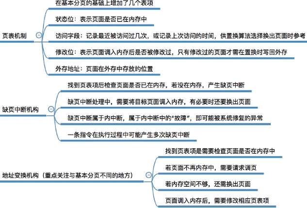

1. 页表

   - 页表是支持请求分页系统最重要的数据结构，其作用是记录描述页的各种数据，包括在实现逻辑地址到物理地址映射时需要的页号与页框号的对应关系。除了页号和页框号之外，页表中增加了请求换入和页置换时需要的数据。
     1. **页框号**：存放页所在的页框号。
     2. **状态位P**：用来标识页是否在内存中。
     3. **访问字段A**：用于记录页最近被访问的情况。A中可以存放页最近被访问的次数，也可以存放最近未被访问的时间长度。也可以简单地用A=1表示页最近被访问过，用A=0表示页最近没有被访问过。操作系统实现置换程序时需要根据A的值来选择被换出的页，出于效率的考虑，系统总是希望根据A的值把最近、最久未访问的页换出到外存。
     4. **修改位M**：用于标识页最近是否被修改过。由于内存中的每个页在外存中都保存有一个副本，如果页没有被修改过，则外存中的页副本和内存中的页完全一致。因此，换出页时就不用把页信息写回外存，只需要把该页所占用的页框标识为空闲可用即可。如果页最近被修改过，那么内存中的页和外存中该页的副本就不一致了。在换出页时，必须把最近修改过的页写回外存。往外存中写信息，需要请求磁盘操作，为了减少系统开销和启动磁盘的次数，在进行页置换时，尽量选择最近没有被修改过的页。
     5. **保护位**：用于标识页的访问权限，比如，该位值为1，表示页是既可读又可写的；该位为0，表示页是只读的。

   

2. 缺页异常机构

   缺页异常机构的主要作用是在访问内存过程中发现缺页时产生缺页异常信号，使CPU中断当前控制流的执行，转去执行操作系统的缺页异常处理程序，完成请求调页。

   1. 分页硬件通过页表完成逻辑地址到物理地址的映射时，通过检查页表中的状态位P，判断当前被访问的页是否在内存中。如果不在，则产生缺页异常信号。

   2. 执行操作系统的缺页异常处理过程。先在内存中为请求调入的页找一个空闲页框。
      然后，调度磁盘操作，把需要的页装入找到的空闲页框中。

   3. 修改页表，更新已经调入页的存在位、在内存中的页框号、访问位和保护位等字段的值。

   4. 重新开始执行因缺页而被中断的指令。

      缺页异常发生时，系统保存了被中断的进程状态，包括寄存器和程序计数器的内容。所以，缺页异常处理完成返回时，可以按照与中断前完全相同的位置和地址重新开始执行进程。

3. **地址变换**

   1. 由分页地址变换机构从逻辑地址中分离出页号和页内偏移地址。
   2. 以页号为索引查找快表，若快表中有该页的页表项，则读出页框号，计算物理地址。
   3. 若快表中无该页信息，转到内存页表中查找。若页表中的状态位P显示该页已调入内存，则从相应的页表项读出页所在的页框号，并计算物理地址，然后把该页表项写入快表。
   4. 若该页尚未调入内存，则产生缺页异常，请求操作系统从外存中把该页调入内存，然后修改页表，重新执行被中断的指令。该过程可以用 图 4-44 来表示。

   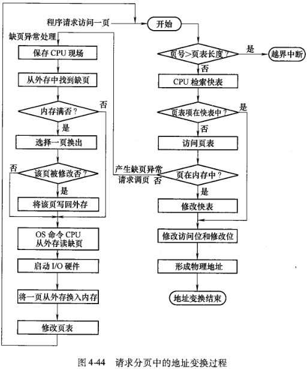
   
4. **补充细节**：

   1. 只有“写指令”才需要修改“修改位”。并且，一般来说只需修改快表中的数据，只有要将快表项删除时才需要写回内存中的慢表。这样可以减少访存次数。
   2. 和普通的中断处理一样，缺页中断处理依然需要保留CPU现场。
   3. 需要用某种“页面置换算法”来决定一个换出页面（下节内容）
   4. 换入/换出页面都需要启动慢速的/O操作，可见，如果换入/换出太频繁，会有很大的开销。
   5. 页面调入内存后，需要修改慢表，同时也需要将表项复制到快表中。

#### 二、页分配策略

> **固定分配局部置换**：系统为每个进程分配一定数量的物理块，在整个运行期间都不改变。若进程在运行中发生缺页，则只能从该进程在内存中的页面中选出一页换出，然后再调入需要的页面。这种策略的缺点是：很难在刚开始就确定应为每个进程分配多少个物理块才算合理。（采用这种策略的系统可以根据进程大小、优先级、或是根据程序员给出的参数来确定为一个进程分配的内存块数）
>
> **可变分配全局置换**：刚开始会为每个进程分配一定数量的物理块。操作系统会保持一个空闲物理块队列。当某进程发生缺页时，从空闲物理块中取出一块分配给该进程：若己无空闲物理块，则可选择一个未锁定的页面换出外存，再将该物理块分配给缺页的进程。采用这种策略时，只要某进程发生缺页，都将获得新的物理块，仅当空闲物理块用完时，系统才选择一个未锁定的页面调出。**被选择调出的页可能是系统中任何一个进程中的页，因此这个被选中的进程拥有的物理块会减少，缺页率会增加。**
>
> **可变分配局部置换**：刚开始会为每个进程分配一定数量的物理块。当某进程发生缺页时，只允许从该进程自己的物理块中选出一个进行换出外存。如果进程在运行中频繁地缺页，系统会为该进程多分配几个物理块，直至该进程缺页率趋势适当程度：反之，如果进程在运行中缺页率特别低，则可适当减少分配给该进程的物理块。
>
> 可变分配全局置换：只要缺页就给分配新物理块
>
> 可变分配局部置换：要根据发生缺页的频率来动态地增加或减少进程的物理块

1. **最少页框数**
   - 最少页框数，是指能保证进程正常运行所需要的最少的页框数。如果系统为进程分配的页框数少于这个值，进程将无法正常运行。
   - 保证进程正常运行所需要的最少页框数与进程的大小没有关系，它**与计算机的硬件结构有关，取决于指令的格式、功能和寻址方式**。
2. 页分配和置换策略
   1. 固定分配局部置换
      - 在进程创建时为每个进程分配一定数量的页框，在进程运行期间，进程拥有的页框数不再改变。
      - 当进程发生缺页时，系统从该进程在内存中的页中选择一页换出，然后再调入请求的页，以保证分配给该进程的内存空间保持不变。
   2. **可变分配全局置换**
      - 这是在操作系统中被广泛使用的策略。
      - 在采用这种策略时，先为系统中的每个进程分配一定数量的页框，同时，操作系统保持一个空闲页框队列。
      - 当某进程发生缺页时，由系统从空闲页框队列中取出一个页框分配给该进程，并将欲调入的缺页装人其中。任何产生缺页的进程都可以由系统获得新的页框，以增加本进程在物理内存中的页数。
      - 当系统总空闲页框数小于一个规定的阈值时，操作系统会从内存中选择一些页调出，以增加系统的空闲页框数，调出的页可能是系统中任何一个进程的页。
   3. **可变分配局部置换**
      - 进程创建时，为进程分配一定数目的页框。当进程发生缺页时，只允许从该进程在内存中的页中选出一页换出。只有当进程频繁发生缺页时，操作系统才会为该进程追加页框，以装人更多的进程页，直到该进程的缺页率降低到适当程度。反之，若一个进程在运行过程中的缺页率特别低，则可在不引起进程缺页率明显增加的前提下，适当减少分配给该进程的页框数。
3. 分配算法
   1. **平均分配算法**：如果系统中有n个进程，m个可供分配的内存页框，则为每个进程分配 `INT[m/n]` 个页框，其余的 `MOD[m/n]` 个页框可以放入空闲页框缓冲池中。
      - 例如，系统中有26个空闲页框，有3个进程，那么为每个进程分配8个页框，即共为3个进程分配24个页框，剩下的2个页框可以作为系统可用的空闲页框放在空闲页框缓冲池中。
   2. **按比例分配算法**：采用平均分配算法为进程分配页框的缺点是算法不考虑进程规模，可能使大进程分配到的页框与小进程一样多。大进程能进入内存的页数占本进程页总数的比例远远小于小进程，大进程可能因此频繁缺页。为了解决这个问题，可以采用按比例分配的算法。
      - 为进程分配的页框数=进程页数/所有进程页数的总和×页框数。
   3. 考虑优先权的分配算法：这种分配算法的思想是为优先权高的进程分配较多的页框数，为优先权低的进程分配较少的页框数。

#### 三、页调入策略

> 预调页策略：根据局部性原理，一次调入若干个相邻的页面可能比一次调入一个页面更高效。但如果提前调入的页面中大多数都没被访问过，则又是低效的。因此可以预测不久之后可能访问到的页面，将它们预先调入内存，但目前预测成功率只有50%左右。故这种策略主要用于进程的首次调入，由程序员指出应该先调入哪些部分。
>
> 请求调页策略：进程在运行期间发现缺页时才将所缺页面调入内存。由这种策略调入的页面一定会被访问到，但由于每次只能调入一页，而每次调页都要磁盘/O操作，因此/O开销较大。
>
> 
>
> 1.系统拥有足够的对换区空间：页面的调入、调出都是在内存与对换区之间进行，这样可以保证页面的调入、调出速度很快。在进程运行前，需将进程相关的数据从文件区复制到对换区。
>
> 2.系统缺少足够的对换区空间：凡是不会被修改的数据都直接从文件区调入，由于这些页面不会被修改，因此换出时不必写回磁盘，下次需要时再从文件区调入即可。对于可能被修改的部分，换出时需写回磁盘对换区，下次需要时再从对换区调入。
>
> 3.UNIX方式：运行之前进程有关的数据全部放在文件区，故未使用过的页面，都可从文件区调入。若被使用过的页面需要换出，则写回对换区，下次需要时从对换区调入。

1. 何时调入页

   - 大多数系统都采用预先调入页的策略，将预计不久之后会被访问的页预先调入内存，而不是缺哪一页时再调入该页。在实际系统中，通常是在调入缺页时，把与所缺页相邻的若干页也调入内存。

2. 从何处调入页

   1. 从对换区调入
      - 当系统拥有足够的对换空间时，若发生缺页请求，则从对换区调入页。
      - 从对换区调入页比从文件区调入页的速度快。
      - 对换区中的页是进程运行前从文件区复制到对换区的。
   2. UNIX 方式
      - 进程运行前，与进程有关的程序代码、数据等都存放在文件区，所以，没有被访问过的页都直接从文件区调入。
      - 换出页都存放在对换区，曾经运行过而又被换出的页从对换区中调入。
      - 对于可以共享的页，如果已经由于其他进程的需要而被调入内存，就无需再次从外存调入。

3. 调入过程

   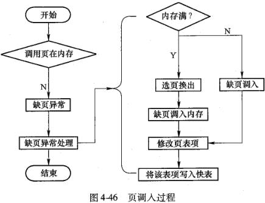

#### 四、页置换算法

1. 最佳置换算法和先进先出置换算法
   1. **最佳置换算法**（ Optimal page- Replacement Algorithm）
      - 最佳置换算法是 Belady于1966年提出的一种页置换算法，该算法选择以后**永远不会被访问**的页或者在未来**最长时间内不再被访问**的页作为换出页。因此，该算法主要用于理论研究。
      - 例如，如果知道一个算法不是最优，但是与最优相比最坏情况下的缺页率比最佳置换算法最多高10%，平均缺页率与最佳置换算法相比最多高5%，可以此说明该置换算法的性能。
   2. **先进先出页置换算法**（ First In first Out,FIFO）
      -  FIFO是最简单的页置换算法。实现这种算法的一种方式是**为每个页记录该页调入内存的时间**，当选择换出页时，选择进入内存时间最早的页。最简单的实现方法是创建一个FIFO的队列来管理内存中的所有页，选择队首的页作为换出页。新调入的页被加人到队尾。
      - FIFO算法实现简单，但是**效率较低**，会导致较高的缺页率。因为FFO算法不考虑页被引用的频繁程度，例如有的页刚被换出，可能立刻又要被访问。在进程中有些页经常被访问，如包含全局变量、常用函数等的页，FHFO算法不能保证这些经常被访问的页不被换出。
2. **最近最久未使用 LRU 置换算法**，LRU算法是广泛使用的性能较好的算法。
   1. LRU（ Least Recently Used,LRU）算法的描述
      - LRU 置换算法是选择**最近最久**未使用的页换出（最近最久未使用的页在最近的将来被访问的可能性也比较小）。该算法赋予每个页一个访问字段，用来记录一个页自上次被访问以来所经历的时间 t。当需要淘汰一个页时，选择现有页中 t 值最大的页换出程。
   2. LRU算法的实现
      1. **寄存器**
         - 为每个在内存中的页配置一个移位寄存器，可表示为R=Rn-1…R2RFO。
         - 当进程访问某页框时，要将相应的寄存器的最高位置成1。此时，每隔一定时间将寄存器右移一位。
         - 如果把n位寄存器的数看作是一个页对应的整数，那么具有最小数值的寄存器所对应的页就是最近最久未使用的页。图450所示的例子说明了一个具有8个页的进程，通过为每个页配备一个8位寄存器实现LRU算法的情况。
      2. **栈**
         - 可利用一个特殊的栈来保存当前使用的各个页的页号。
         - 每当进程访问某页时，便将该页的页号从栈中移出，将它压入栈顶。
         - 因此，栈顶始终是最新被访问页的编号，而栈底则是最近最久未使用的页号
      3. **计数器**
         - 为每个页表项增加一个时间字段，并为CPU增加一个逻辑时钟或计数器。
         - 每次访问内存中的某个页时，就增加这个页对应的页表项的时间字段的值，每次置换时选择时间字段值最小的页作为换出页。
3. **其他置换算法**
   1. 附加引用位算法
      - 采用这种算法时，为每个内存中的页增加一个8位的字节，每隔一段时间（如100ms），操作系统把每个页自己的访问位（请求分页管理的页表项中的A字段）移到8字节附加引用位的最高位，将其他位向右移，并抛弃最低位。进行页置换时，选择附加引用位值最小的页换出。因为具有最小附加引用位值的页可能不止一个，既可以换出所有这些页，也可以按 FIFO 选择部分具有最小附加引用位值的页换出。
   2. 简单 Clock 置换算法
      - 利用简单 Clock算法时，为每一页设置一位访问位，再将内存中的所有页都通过链接指针链接成一个循环队列。当某页被访问时，其访问位被置1.置换算法在选择一页换出时，按照 FIFO 算法，检查各页的访问位。如果是0，就选择该页换出；若为1，则重新将它置0，暂不换出而给该页第二次驻留内存的机会，再按照 FIFO 算法检查下一个页。
      - 当检查到队列中的最后一个页时，若其访问位仍为1，则再返回到队首去重新从第一个页开始检查。
   3. 改进型 Clock 算法
      - 简单 Clock算法在选择一个换出页时，不考虑该页被修改的情况，而选择最近既没有被访问过又没有被修改过的页换出，能大大提高页置换的效率。在将一个页换出时，如果该页已被修改过，便应将它重新写到磁盘上，但如果该页未被修改过，则不必将它写回磁盘。换而言之，修改过的页在换出时所付出的时间开销将比未修改过的页开销大。在改进型 Clock算法中，除了必须考虑页的使用情况外，还考虑了置换代价这一因素，这样选择换出页时，既要是未使用过的页，又要是未被修改过的页。把同时满足这两个条件的页作为首选的淘汰页。改进型Clcok 算法描述如下。
        在该算法中，由访问位A和修改位M可以组合成下面4种类型的页。
   4. 最少使用置换算法（ Least Frequently Used Page- Replacement Algorithm,LFU）
      - 这种算法选择最近时期内使用次数最少的页作为淘汰页。这种算法为每个页保留一个用于记录页被访问次数的计数器，每次选择其访问计数器值最小的页换出。这种算法可能存在的问题是：有些页在进程开始时被访问的次数很多，但以后这些页不再被访问，这些页不应该长时间留在内存中，而应该在不再被访问时被换出。解决这个问题的方法之一是定期地将计数器右移，以形成指数衰减的平均使用次数
   5. 页缓冲算法
      - 页缓冲算法采用 FIFO 算法选择换出页，并为换出页建立两个链表，被换出的页要放入两个链表中的一个。如果页没有被修改过，则将其放入空闲页链表中。如果页被修改过，则将其放入已修改页的链表中。页在内存中并不做物理上的移动，而只是将页表中的表项移到上述两个链表之一中。

#### 五、请求分页系统的性能分析


1. **缺页率对有效访问时间的影响**
   - 进程执行中访存发生缺页时，需要请求从外存调入缺页。如果内存中没有空闲页框，还需要进行页置换，调缺页后，指令需要重新执行。因此，一旦发生缺页，进程会存在因为访存而带来的时间延迟。下面分析缺页率对有效访问时间的影响。
   - 有效访问时间是成功访存所用的时间。假设 P 为缺页率，ma 为存储器访问时间。这里根据实际系统的可能性，取 $ma=100ns=0.1μs$ 。缺页异常服务时间、缺页读入时间及进程重新执行时间近似地取 25ms 是合理的。由此
     - $\displaystyle 有效访问时间=(1-P)\times ma+P \times 缺页异常时间$
     - $\displaystyle 缺页异常时间=缺页异常服务时间+缺页读入时间+进程重新执行时间$
       $≈25ms（毫秒）=25000μs（微秒）$
     - $\displaystyle 有效访问时间=0.1×(1-P)+25000×P$
       $=0.1+24999.9 \times P$
     - 由上式可见，**有效访问时间正比于缺页率**。
2. **工作集**
   1. 基本原理
      - 工作集就是在某段时间间隔 `△` 里，进程**实际要访问的页的集合**。要使缺页少发生，必须使程序的工作集全部在内存中。
      - 用`W(t,△)`表示当时间间隔为`△` 时 t 时刻的工作集。
        1. `△` 太大，工作集中的页太多，影响存储器利用率。
        2. `△` 太小，工作集中的页太少，缺页率高。
        3. `W(t,△)`与 t 相关，不同的t对应不同的工作集。即程序运行的过程中，运行到不同的时刻，需要访问的页不同。
   2. Windows NT 的工作机制
      1. 进程被第一次创建时，为进程指定了一个最小工作集和一个最大工作集。最小工作集是进程正常运行需要调入内存的最小页数。当内存有足够的空间时，可以为进程分配足够的空间以装入它的最大工作集。
      2. 当某进程在内存中的页数小于最大工作集时，若发生缺页，系统从空闲页框队列中取一页框分配给该进程。
      3. 当某进程在内存中的页数等于最大工作集时，若发生缺页，系统从该进程的页中按FIFO的原则，换出一个该进程的页。
      4. 当空闲页框队列中空闲页的数量减到一个最低值时，系统检查所有进程，对工作集大于最小工作集的进程，淘汰该进程的一些页，使该进程的工作集等于最小工作集。
3. **抖动产生的原因和预防方法**
   1. 抖动
      - 多道程序度太高，使运行进程的大部分时间都用于进行页的换入、换出，而几乎不能完成任何有效工作的状态称为抖动。
      - 引起系统抖动的主要原因是系统中的进程数量太多，每个进程能分配到的页框太少，以至于进程运行过程中频繁请求调页。
   2. 抖动的预防
      1. 采取局部置换策略。当进程发现缺页后，仅在进程自己的内存空间范围内置换页，不允许从其他进程获得新的页框。
      2. 在CPU调度程序中引人工作集算法。只有当每个进程在内存中都有足够大的驻留集时，才能再从外存中调入新的作业。
      3. 挂起若干进程。为了预防抖动，挂起若干进程，腾出进程占用的空间

## 第六节 分段储存管理


#### 一、分段机制的引入

- 把分别存放**逻辑上相关的信息**、相互独立的逻辑地址空间称为一个段，每个段由一个**从0到最大线性地址**的逻辑地址空间构成。各个段的长度可以是0到最大值之间的任何一个值，不同段的长度可以不相同，段的**长度在进程运行期间可以改变**。
- 在使用分段存储管理的系统中，程序员使用二维的逻辑地址，一个数用来表示段，另个数用来表示段内偏移。段是一个逻辑实体，程序员可以通过使用二维地址来访问不同的逻辑段。一个段可能包括一个过程，或者一个数组、一个堆栈、一些数值变量，但是一般不会同时包含多种不同的内容。
- 简单来说，引入分段机制的优点是**方便编程、分段共享、分段保护、动态链接**，以及存储空间的**动态增长**。

#### 二、分段系统的基本原理

1. 分段

   - 在分段的存储管理方式中，进程的地址空间被划分成若于个段。**每个段定义了一组逻辑信息**，每个段的大小由相应的**逻辑信息组的长度确定**，段的大小不一样，每个段的逻辑地址**从0开始**，采用一段**连续**的地址空间。
   - 系统为每个段分配一个连续的物理内存区域，各个不同的段可以离散地放入物理内存不同的区域。
   - 系统为每个进程建立一张段表，段表的每一个表项记录的信息包括段号、段长和该段的基址，段表存放在内存中。

2. 分段的逻辑地址结构

   - 分段机制的逻辑地址是二维的，由段号和段内地址组成。程序员采用二维地址使程序的可理解性更强，也方便编程。
   - 32位系统中分段的地址形式如图452所示。

   

3. ##### 段表

   - 段表是由操作系统维护的用于支持分段存储管理地址映射的数据结构。通常情况下，每个进程有一个段表，段表由段表项构成。
   - 每个段表项包含**段号、段基址（段的起始地址）**和**段长（即段大小）**3个部分。
     - 一个进程可能包含若干个段，每一个段在段表中有一个段表项与之对应。
     - 如表4-4所示的段表，表示某进程分为3个段：0号段的段长为30KB，段基址为40KB；1号段的段长为20KB，段基址为80KB；2号段的段长为15KB，段基址为120KB。


   

   - 在早期的16位计算机系统中，大多数情况下，段基址就是段在物理内存中的起始地址，段大小也称段界限，本书对分段原理的描述基于这个前提。
   - 根据段表可以知道一个段在物理内存中的位置，如图4-53所示。

   


#### 三、分段系统的地址变换

- 如 图 4-54 所示，已知的逻辑地址由段号 s 和段内偏移 d 构成。CPU上段表寄存器中存有当前在CPU上运行进程的段表起始地址。段号用作段表的索引，根据段表起始地址和段号可以获得存放段 s 的段表项的内存地址。
- s 号段表项在内存中的起始地址 = 段表起始地址 + 段号 s × 段表项长度段表项长度是指一个段表项所占用的字节数。
- 从相应段表项起始地址内存处可读取s段的段表项，获得s段的基地址和段界限。如果d≤段界限，在最简单的情况下，用s段基址加上段内偏移d就可得到已知逻辑单元的物理地址。

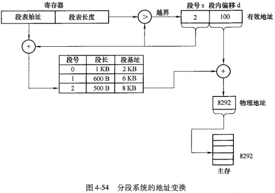

- 若已知逻辑单元的地址为 `s:d`，求相应物理地址的步骤如下。
  1. 以段号s作索引，从段表中找到段号为s的段表项。
  2. 从找到的段表项中读出s段的基地址和段大小
  3. 如果 `d≤段大小`，则将段基址与段内偏移 d 相加，得到与逻辑单元 `s:d` 相应的物理单元地址。

1. ##### 分页和分段的主要区别

   1. 页是按**物理单位**划分的，分页的引入是为了提高内存的利用率和支持虚拟存储。

      - 段是按**逻辑单位**划分的，一个段含有一组意义相对完整的信息。引入分段的目的是为了方便程序员编程。

   2. 页的大小是**固定**的。

      - 段的大小**不固定**，取决于用户编写的程序和编译器。

   3. 分页的地址空间是**一维**的，程序员给出的地址只是一个助记符，已知的逻辑地址是一个数，如2568。

      - 分段的地址空间是**二维**的，程序员在标识一个逻辑地址时需要给出两个数：一个是段号，一个是段内偏移。

2. 信息共享

   - **采用分段机制比采用分页机制更容易实现信息的共享。**
   - 下面举例说明，例如有一个多用户系统，同时有10个用户在执行同一个文本编辑程序。
     - 如果该文本编辑程序的代码占160KB空间，数据区占40KB空间。通常每个用户执行的文本编辑程序代码是可重入的代码，是被多个用户共享的同一个程序副本。
     - 在采用分页机制的系统中，假定页大小为4KB，那么文本编辑程序代码要占用40个页，假设这40个页被存放在`21~60`号页框中。10个用户进程有10个页表，每个页表中都有40个页表项与文本编辑程序代码页对应。为共享文本编辑程序，每个进程页表的这40个页表项都存放`21~60`号页框中的一个页框号。10个进程要用总共400个页表项来实现对文本编辑程序代码的共享。
     - 但是，如果采用分段机制，只需要在每个进程的段表中为文本编辑程序的代码段增加一个段表项，10个用户进程只需要10个段表项就可以实现对文本编辑程序代码的共享。

#### 四、段页式存储管理

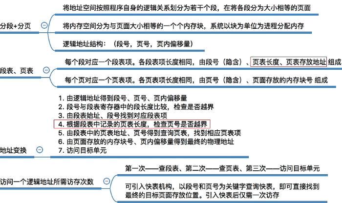


1. **段页式存储管理的基本原理**

   - 在段页式存储管理系统中，将用户进程的逻辑空间先划分成若干个段，每个段再划分成若干个页。进程以页为单位在物理内存中离散存放，每个段中被离散存放的页具有逻辑相关性。
   - 为了实现段页式存储管理的地址映射，操作系统为每个进程建立一个段表，为进程的每个段建立一个页表。进程段表的每一个段表项存放某个段的页表起始地址和页表长度。
     举例说明，一个进程 process1 的逻辑地址空间划分为5个段，段号分别为 0、1、2、3、4
   - 段表、页表和进程在内存中的存放如 图4-55 所示。

   

2. **地址变换过程**

   在段页式存储管理系统中，逻辑地址与分段系统的逻辑地址相同，由段号 s 和段内偏移地址 d 构成，地址变换过程如下。

   1. 以段号 s 作索引，找到段 s 的段表项，得到该段页表的起始地址。

   2. 通过分页机制从段内偏移 d 中分离出页号 P 和页内偏移 W。

   3. 以段内页号 P 作索引，从段 s 的页表中搜索页号 P 对应的页表项。

   4. 从页表项中得到页所在的页框号。

   5. 由页框号与页内偏移 W 得到某逻辑地址对应的物理地址。

      **物理地址 = 页框号 × 页框大小 + 页内偏移W**

      采用段页式内存管理的一个显然的好处是，程序员可以使用分段的逻辑地址，而实际上进程却以页为单位存放于物理内存中。

   

## 第七节 Linux 的伙伴系统

- Buddy 算法
  - Buddy 算法是经典的内存管理算法
  - 算法基于计算机处理二进制的优势具有极高的效率
  - 算法主要是为了解决内存外碎片的问题
    - 让内存分配与相邻内存合并能快速进行
- Buddy 内存管理算法
  - 向上取整为 2 的幂大小
  - 伙伴”指的是内存的“伙伴”
  - 一片连续内存的“伙伴”是相邻的另一片大小一样的连续内存
- Linux交换空间
  - 交换空间（Swap）是磁盘的一个分区
  - Linux 物理内存满时，会把一些内存交换至Swap空间
  - Swap 空间是初始化系统时配置的
    - 冷启动内存依赖
    - 系统睡眠依赖
    - 大进程空间依赖
  - swap 空间是**操作系统概念**，解决系统物理内存不足问题
  - 虚拟内存是**进程概念**，解决进程物理内存不足问题

- Linux的伙伴系统算法把所有的空闲页框分组为 11 个块链表，每个块链表分别包含大小为1、2、4、8、16、32、64、128、256、512和1024个连续的页框。

  - 对 1024 个页框的最大请求对应着 4MB 大小的连续页框。每个块的第一个页框的物理地址是该块大小的整数倍。
  - 例如，大小为16个页框的块，其起始地址是16×22（22=4096B，这是一个常规页的大小）的倍数。

- 下面通过一个简单的例子来说明该算法的工作原理。

  - 假设要请求一个128个页框的内存（即0.5MB）。算法先在128个页框的链表中检查是否有一个空闲块。如果没有这样的块，算法会查找下一个更大的块。也就是说，在256个页框的链表中找一个空闲块。如果存在这样的块，内核就把256的页框分成两等份，一半用作满足进程请求，另一半插入到128个页框的链表中。如果在256个页框的块链表中也没找到空闲块，就继续找更大的块—512个页框的块。如果这样的块存在，内核把512个页框的块中的128个页框用作满足进程请求，然后从剩余的384个页框中拿256个连续页框插入到256个页框的链表中，再把128个连续页框插入到128个页框的链表中。如果512个页框的链表还是空的，算法就放弃并发出错信号

- 内核试图把大小为 b 的一对空闲伙伴块合并为一个大小为 2b 的单独块。

  满足以下条件的两个块称为伙伴。

  1. 两个块具有相同的大小，记作 b
  2. 它们的物理地址是连续的，起始地址是 2b 的整数倍。

  第一块的第一个页框的物理地址是$2×b×2^{12}$的倍数。该算法是迭代的，如果它成功合并所释放的块，它会试图合并 2b 的块来形成更大的块。


# 第五章 文件系统

- 本章主要内容：

  1. 文件结构、类型、存取、属性（选择、填空、简答）

  2. 目录结构、路径名（选择、填空、简答）

  3. **实现文件、实现目录**（选择、填空、简答、**综合**）

     本章近3年分值：14~19分

## 第一节 文件

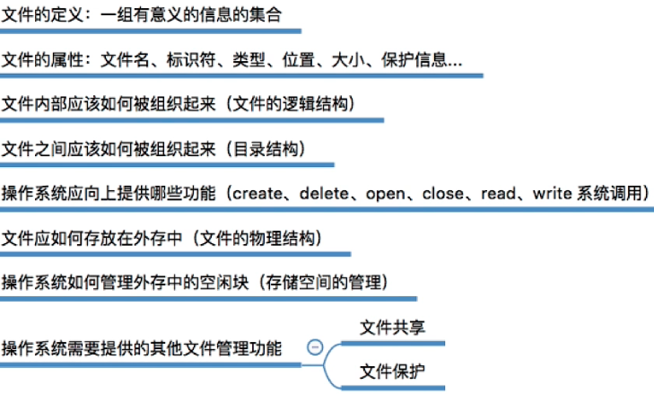

1. 文件命名

   - 多数操作系统都支持文件名用圆点隔开分为两部分，如 `hello.c`。圆点后面的部分称为文件扩展名。文件名`info.txt` 用于表示这个文件的类型，给用户一个提示，而不是表示给计算机传送什么信息。但是，编译器、链接程序等利用扩展名区分哪些是C文件，哪些是汇编文件，哪些是其他文件。
   - 在 Windows系统中，扩展名被赋予了含义。用户可以在操作系统中注册扩展名，并且规定哪个程序与该扩展名关联，当用户双击某个文件名时，关联该扩展名的程序就会启动并访问该文件。例如，双击“ `孔子.rmvb`”就会启动关联的电影播放软件，并播放该视频。

2. **文件结构**

   

   1. **无结构字节序列**
      - 无结构字节序列文件也称为**流式文件**，操作系统不知道也不关心文件内容是什么，操作系统所见到的就是字节，其任何含义由使用该文件的程序自行理解。在UNIX和 Windows系统中都采用这种方式。
      - 把文件看成字节序列为操作系统提供了最大的灵活性。用户程序可以向文件中加入任何内容，并以方便的形式对文件进行命名。
   2. **固定长度记录序列**
      - 在该模型中，构成文件的基本单位是具有**固定长度**的记录，每个记录都有其内部结构。
      - 把文件作为记录序列的中心思想是：读操作返回一个记录，而写操作重写或追加一个记录。
   3. **树形结构**
      - 文件由一棵记录树构成，记录长度不定，在记录的固定位置包含一个**关键字域**，记录树按关键字域排序。
      - 在这种文件结构中，基本操作是获取具有特定关键字的记录（而不是获取下一条记录）。
      - 增加记录时，由操作系统决定记录在文件中的存放位置。
      - 这类文件结构与UNX和 Windows系统中采用的无结构字节序列有明显不同，它在一些处理商业数据的大型计算机中获得了广泛使用。

3. 文件类型
   1. ASCII 文件(American Standard Code for Information Interchange)
      - ASCII 文件由多行正文组成，在某些系统中每行用回车符结束，某些则用换行符结束，而有些系统还同时采用回车符和换行符，如MS-DOS。各行的长度不必相同。
      - ASCII 文件的明显优势是**可以显示和打印**，也可以用通常的文本编辑器进行编辑。
      - 另外，如果程序以ASCII 文件作为输入和输出，就很容易把一个程序的输出作为另一个程序的输入
   2. 二进制文件
      - 二进制文件**具有一定的内部结构**，如可执行的.exe文件。
      - 用通常的文本编辑器**不能直接显示或打印**二进制文件，必须使用专门的二进制文件编辑器。
      - 不同的操作系统可以识别不同的二进制文件，比如把某一种结构（如ELF格式）的二进制文件作为系统中的可执行文件。

4. 文件存取
   1. **顺序存取**
      - 早期的操作系统只有顺序存取这一种文件存取方式。
      - 进程可以从文件开始处读取文件中的所有字节或者记录，但不能跳过某些内容，也不能不按顺序存取。在存储介质是磁带而不是磁盘时，顺序存取文件是很方使的。
   2. **随机存取**
      - 随机存取又称直接存取，即可以以任意顺序读取文件中的字节或记录。
      - 现代操作系统的文件一旦被创建，所有文件自动成为随机存取文件。
      - 定长记录的文件能很好地支持随机存取，而变长记录虽然可以随机存取，但实现起来复杂而且存取速度慢。

5. 文件属性

   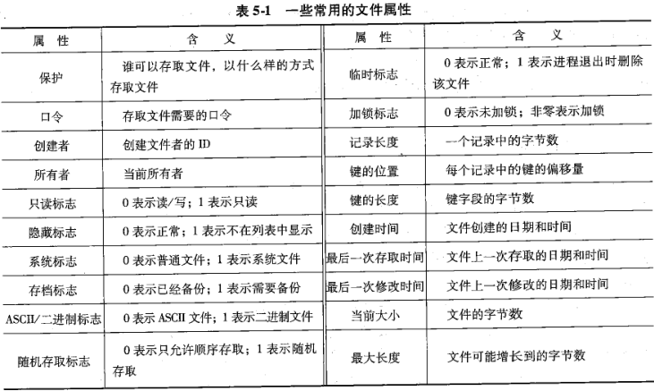

6. 文件操作
   1. CREATE
      - 该操作完成创建文件的功能，并设置文件的一些属性。
   2. DELETE
      - 当不再需要某个文件时，删除该文件并释放磁盘空间。
   3. OPEN
      - 在使用文件之前，必须先打开文件。
      - OPEN调用的目的是将文件属性和文件的地址信息装入主存，便于在对文件的后续访问中能快速存取文件信息。
   4. CLOSE
      - 当存取结束后，不再需要文件属性和地址信息，这时应该关闭文件以释放内部表空间。
      - 很多系统限制进程打开文件的个数，以鼓励用户关闭不再使用的文件
   5. READ
      - 从文件中读取数据。
      - 一般地，用户可以指定从哪个文件的第几个字节开始读取多少个字节的内容。
      - 此外，调用读文件的函数时，还需要给出存放被读取内容的内存缓冲区。
   6. WRITE
      - 往文件中写数据，写操作一般从写函数的参数指定的文件位置开始。
      - 如果当前位置是文件末尾，文件长度增加。
      - 如果当前位置在文件中间，则现有数据被覆盖，并且永远丢失。
   7. APPEND
      - 该操作是 WRITE调用的限制形式，它只能在文件末尾添加数据。
   8. SEEK
      - 对于随机存取文件，要指定从何处开始取数据。
      - 通常的做法是用SEEK系统调用把当前位置指针指向文件中特定的位置。SEEK调用结束后，就可以从该位置开始读写数据了。
   9. GETATTRIBUTES
      - 该操作用于获取文件属性。
   10. SETATTRIBUTES
       - 某些属性是可由用户设置的，文件创建以后，用户还可以通过系统调用 SETAT TRIBUTES来修改它们。
   11. REANME
       - 该操作用于修改已有文件的名件名。

## 第二节 目录

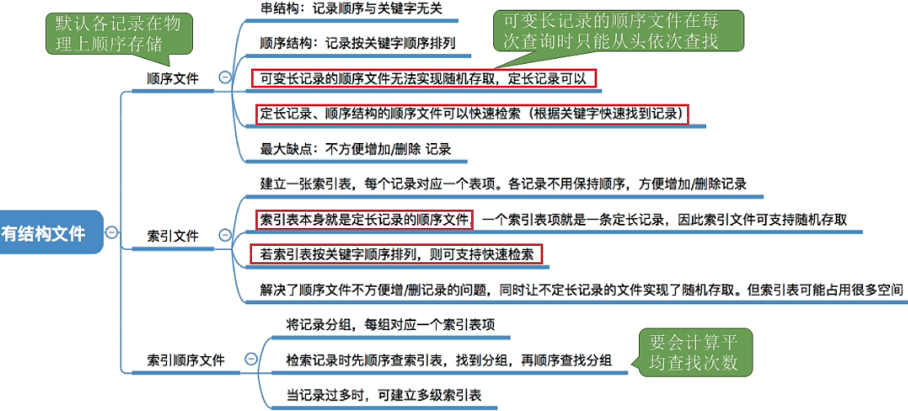

1. 层次目录系统
   1. 目录文件的结构
   
      - 目录文件有两种常见的结构：属性放在目录项中和放在 i 结点中。
   
      - 目录文件包含许多目录项，每个目录项用于描述一个文件。
   
        - 在第一种结构中，每个目录项长度相同，每个文件对应一个目录项。其中包含文件名、文件属性和文件的地址。
        - 在第二种结构中，目录项中有一个文件名和 i 结点号。i 结点是一种数据结构，文件属性和文件的地址信息存放在 i 结点中。
   
      - 这两种结构都得到了广泛的应用。图 5-2 分别描述了以上两种结构。
   
        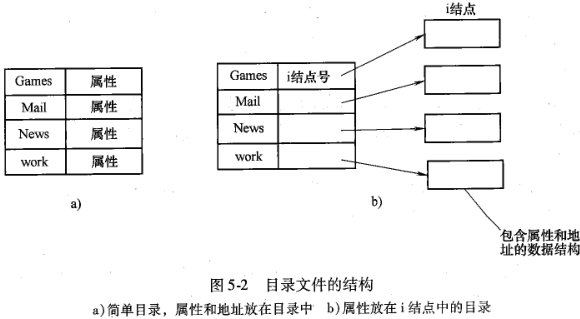
   
   2. 目录结构
      1. 单层目录
   
         - 这种目录也被称为根目录。在整个系统中设置一张线性目录表，表中包括了所有文件的描述信息。早期的个人计算机中，这种系统很普遍。这种目录结构使得软件设计相对简单。
           - 这种结构不适合在多用户系统中使用。
           - 由于使用单层目录时，要查找一个文件必须对单层目录表中的所有文件信息项进行搜索，因而搜索效率也较低。
         - 图5-3 所示是一个单层目录系统的例子。该目录中有4个文件。
   
         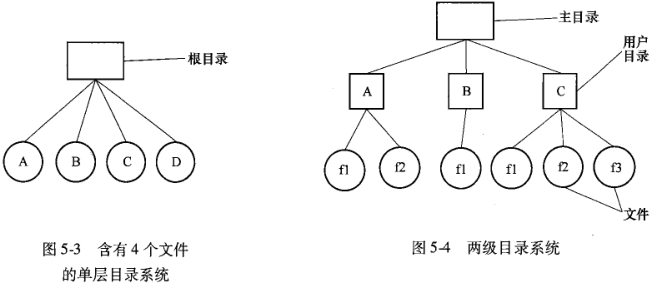
   
      2. 两级目录
   
         - 为了避免上述文件名冲突，一种改进方法是为每个用户提供一个私有目录。这样，一个用户选择文件名时就不会影响到其他用户。图5-4 展示了一个两级目录系统。
         - 在两级目录结构中，目录被分为两级，
           - 第一级称为主目录，给出了用户名和用户子目录所在的物理位置。
           - 第二级称为用户目录，给出了该用户所有文件的文件控制块。
           - 这一设计隐含的机制是，当一个用户试图打开文件时，系统知道是哪个用户，从而知道应该查询哪个目录。
         - 使用两级目录的优点是解决了文件的重名问题和文件共享问题，查找时间降低。缺点是增加了系统的存储开销。
   
      3. 树形目录
   
         - 把两级目录的层次关系加以推广，就形成了多级目录，又称树形目录，如 图5-5 所示。
         - 在多级目录结构中，除了叶子结点对应的存储块中装有文件信息外，其他每级目录中存放的都是下一级目录或文件的说明信息，由此形成层次关系。最高层为根目录，最底层为文件。在这种结构中，用户可以拥有多个所需的目录，自由地组织自己的文件。同时，用户可以创建任意数量子目录的功能，为用户组织其文件提供了一种强大的工具。
         - 树形目录的优点是**便于文件的分类，层次结构清晰，便于管理和保护，解决了重名问题，查找速度加快**。缺点是查找一个文件按路径名逐层检查，由于每个文件都放在外存中多次访问磁盘会影响速度，结构相对复杂。
   
         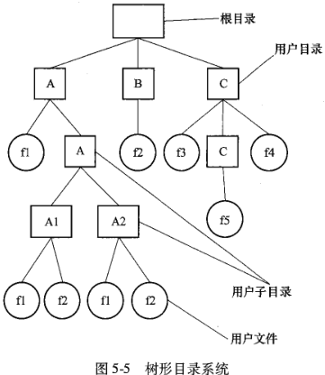
   
2. 路径名
   1. 绝对路径名

      - 绝对路径名由从根目录到文件的路径组成。

      - 只要路径名的**第一个字符是分隔符**，则这个路径就是绝对路径。

        ```
        Widows	\program\practice\test
        UNIX		/program/practice/test
        ```

   2. 相对路径名

      - 当访问一个文件系统的目录包含很多级时，如果访问每个文件都要从根目录开始，直到叶子的文件名为止，包含所有经过的各级分目录在内的全路径名是相当麻烦的。在设计文件系统时，可以允许用户指定一个目录作为当前的工作目录，所有的不从根目录开始的路径名都是相对于工作目录的。
      - 支持树形目录结构的大多数文件系统在每个目录中有两个特殊的目录项。
        - “`.`“指当前目录，“`..`”指当前目录的父目录。
        - 也就是说当在UNX的终端或 Windows的命令提示符中输入命令 “`cd .`”时，将返回上一层目录，如果已经到根目录，再执行该命令，当前目录将一直留在根目录。
   
3. 目录操作
   1. CREATE
      - 根据给定的目录文件名，创建目录。
      - 除了目录项“`.`”和“`..`”外，目录内容为空。“`.`”和“`..`”是系统自动放在目录中的
   2. DELETE
      - 删除目录，根据指定的目录名删除一个目录文件。
   3. OPENDIR
      - 目录内容可以被读取。
      - 例如，为列出目录中的所有文件和子目录，程序必须先打开该目录，然后读取其中所有文件的文件名，同打开和读取文件一样，在读目录之前必须打开目录。
   4. CLOSEDIR
      - 读目录结束后，应关闭目录以释放内部表空间。
   5. READDIR
      - 以标准格式返回打开目录的下一级目录项。
   6. RENAME
      - 更换目录名。


## 第三节 文件系统的实现(重点)

> 索引分配允许文件离散地分配在各个磁盘块中，系统会为每个文件建立一张索引表，索引表中记录了文件的各个逻辑块对应的物理块（索引表的功能类似于内存管理中的页表一一建立逻辑页面到物理页之间的映射关系）。索引表存放的磁盘块称为索引块。文件数据存放的磁盘块称为数据块。
> 若文件太大，索引表项太多，可以采取以下三种方法解决：
> ①链接方案：如果索引表太大，一个索引块装不下，那么可以将多个索引块链接起来存放。缺点：若文件很大，索引表很长，就需要将很多个索引块链接起来。想要找到ⅰ号索引块，必须先依次读入01号索引块，这就导致磁盘/O次数过多，查找效率低下。
> ②多层索引：建立多层索引（原理类似于多级页表）。使第一层索引块指向第二层的索引块。还可根据文件大小的要求再建立第三层、第四层索引块。采用K层索引结构，且顶级索引表未调入内存，则访问一个数据块只需要K+1次读磁盘操作。缺点：即使是小文件，访问一个数据块依然需要K+1次读磁盘。
> ③混合索引：多种索引分配方式的结合。例如，一个文件的顶级索引表中，既包含直接地址索引（直接指向数据块），又包含一级间接索引（指向单层索引表）、还包含两级间接索引（指向两层索引表）优点：对于小文件来说，访问一个数据块所需的读磁盘次数更少。

1. **实现文件**
   
   文件系统通常是以 $2^n$ 个连续的扇区为单位对文件进行磁盘空间的分配，下面把分配给文件的连续扇区构成的磁盘块称为簇
   
   1. 连续分配
   
      - 顾名思义，连续分配就是把每个文件作为一连串连续数据块存储在磁盘上。
      - 连续分配方式有两大优点。
        - 首先，**实现简单**，记录每个文件用到的簇仅需存储两个数字即可：第一块的磁盘地址和文件的块数。给定第一块的簇号，就可以找到任何其他块的簇号。
        - 其次，**读操作性能好**，在单个操作中就能从磁盘上读取整个文件。只需要寻找一次第一个块，之后不再需要寻道和旋转延迟，所以数据以磁盘全带宽的速率输入。
      - 但是，连续分配方式也有十分明显的缺点：
        - 随着时间的推移，磁盘会变得零碎。
        - 当删除文件时，文件所占的簇被释放，这些空闲的连续簇形成“空洞”。随着磁盘的使用，磁盘上会有许多空洞。当磁盘被充满而又需要创建新文件时，需要挑选大小合适的空洞存入文件，这时就有必要知道该文件的最终大小。但很多情况下，无法预知一个文件的最终大小，比如录入一个文档，文档的内容有多少，需要占用多大空间都是未知的，也就是说文件的大小可变，系统管理文件的存储会比较麻烦。
   
      
   
   2. 使用磁盘链接表的分配
   
      - 该方法为每个文件构造簇的链接表，每个簇开始的几个字节用于存放下一个簇的簇号，簇的其他部分存放数据，每个文件可以存放在不连续的簇中。在目录项中只需存放第一个数据块的磁盘地址，文件的其他块可以根据这个地址来查找。
      - 这一方法的优点是可以**充分利用**每个簇，不会因为磁盘碎片（除了最后一块中的内部碎片）而浪费存储空间，**管理也比较简单**。缺点是**随机存取相当缓慢**。要获得文件的第 n 块，每一次都要从头开始读取前面的 n-1 块。显然，进行如此多的读操作会占用很多时间。
   
      
   
   3. 使用内存的链接表分配
   
      - 该方法是将文件所在的磁盘的簇号存放在**内存的表**（文件分配表）中。访问文件时，只需从内存文件分配表中顺着某种链接关系查找簇的簇号。不管文件有多大，在目录项中只需记录文件的第一块数据所在簇的簇号，根据它查找到文件的所有块。
      - 这种方法的一个缺点是必须把整个表都存放在内存中。对于目前比较常见的500GB的磁盘，如果簇大小为1KB，这张表需要有500M个表项，每一项对应一个簇。若每项占4个字节，根据系统对空间或时间的优化方案，这张表要占用约2GB的内存（500M×4B）。很显然，这种方法**不适合大容量的磁盘**。
   
      
   
   4. **i- 结点**
   
      - 该方法为每个文件赋予一个被称为 **i 结点的数据结构**，其中列出了**文件属性**和**文件块的磁盘地址**。
   
      - 图5-9 所示是一个简单的例子。
   
        - 给定一个文件的 i 结点，就有可能找到文件的所有块。
        - 系统打开文件时，将文件的结点从磁盘读入内存。
        - 当访问文件时，系统先根据文件名搜索文件所在的目录文件，从该文件对应的目录项中找到文件的i结点号，根据 i 结点号从磁盘中将 i 结点信息读入内存，文件在磁盘中的地址信息都存放在 i 结点中。
   
        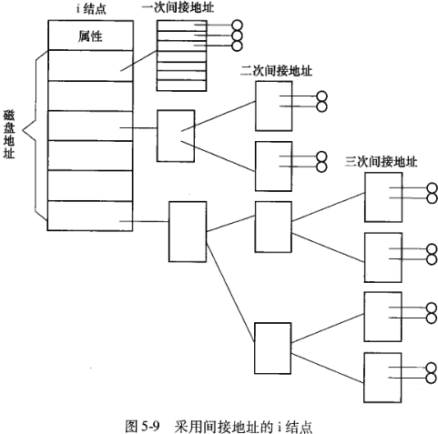
   
      - 如果每个 i 结点只能存储固定数量的磁盘地址，那么当一个文件比较大，所含簇的数目太多时，i 结点将无法记录所有的簇号。
   
        - 一个解决方案是采用间接地址，即使一个“磁盘地址”不存放数据块，而是存放簇号。对于一个大文件，i 结点内的其中一个地址是一次间接块的簇号，这个块包含了存放文件数据的簇的簇号。
        - 如果还不够的话，在 i 结点中还有二次间接块的簇号，其中存放了若干个一次间接块的簇号。文件再大的话，可以使用三次间接块，如图5-9 所示。
   
      - Linux的Ex2文件系统的一个i结点包括15个地址项，每个地址项存32位地址（4个字节），用其中12个地址项存直接地址，一个地址项存一次间接地址，一个地址项存二次间接地址，一个地址项存三次间接地址。当簇大小为1KB时，系统能管理的单个文件的最大长度该如何计算呢？
   
        - 首先，12个地址项存放的是簇号，所以12个直接地址可表示的文件大小为 12×1KB = 12KB。
        - 其次，每个簇大小为1KB，每个地址项占4个字节，所以，每个簇中可以存放256个簇号。
        - 这样，次间接块可以表示的文件大小为 256×1KB=256KB。
        - 以此类推，二次间接块可以表示的文件大小为 256×256×1KB=64MB。
        - 三次间接块可以表示的文件大小为 256×256×256×1KB=16GB。
        - 最后，一个文件的最大长度为 12KB+256KB+64MB+16GB。
   
2. **实现目录**

   1. CP/M 中的目录

      - CP/M 是一个徽机操作系统，它只有一层目录，因此只有一个目录文件。要查找文件名，就是在这个唯一的目录文件中找到文件对应的目录项，从目录项中获得文件存放的磁盘地址。

      - 图5-10所示为CP/M的目录项结构。其中，各字段的含义如下。

        

        1. 用户码：记录了文件所有者。

        2. 文件名：存放文件名。

        3. 扩展名：标识文件类型。

        4. 范围：由该域可知某目录项是文件的第几个目录项，因为一个很大的文件（大于16KB），其簇的数量多，在一个目录项中记录不下。

        5. 块数：文件实际使用的簇的数量。

        6. 最后16个域记录了簇号。

           需要注意的是，文件占用的最后一个簇可能没有写满，这样系统无法确切地知道文件的字节数，因为CP/M是以簇而不是以字节为单位来记录文件长度的

   2. MS-DOS 中的目录

      - 图5-11 所示是一个MS-DOS的目录项。它总共32个字节，其中包含了8个字节的文件名、1个字节的文件属性和2个字节的文件第一个簇的簇号。根据第一个簇号，顺着索引链表可以找到所有的文件块。 MS-DOS I中，目录可以包含其他子目录，从而形成树形目录。

        

      - MS-DOS用文件分配表即FAT作为索引表来存放文件数据所在簇的簇号。目录项包含了文件第一个数据块所在簇的簇号，将这个簇号用作FAT的索引，可依次找到文件的所有块。FAT的结构见前面的 图 5-8

      - FAT文件系统有3个版本：FAT2，FAT16和FAT32，取决于用多少个二进制位存放簇号

   3. UNIX 中的目录

      - UNIX中采用的目录结构非常简单，如图5-12所示，每个目录项只包含一个文件名及其 i 结点号。有关文件类型、长度、时间、所有者和簇号等信息都放在 i 结点中。当打开某个文件时，文件系统必须要获得文件名并且定位文件所在的第一个簇。

        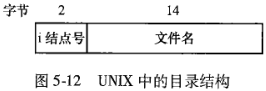

      - 下面说明文件系统寻找一个文件的过程，以查找UNIX 中的 `/usr/ast/mbox` 为例。

        - 首先，文件系统找到根目录，在 UNIX 中根目录的 i 结点位于磁盘的固定位置。然后，系统读根目录文件并且在根目录文件中查找路径的第一部分 usr，获得文件 /usr 的 i 结点号。
        - 由 i 结点号来定位 i 结点是很直接的，因为每个 i 结点在磁盘上都有固定的位置。根据这个i结点号，系统定位 usr 目录并查找下一部分 ast。一旦找到 ast 的目录项，便找到了 /usr/ast 的 i 结点。根据这个 i 结点，可以定位该目录并在其中查找 mbox。
        - 然后，这个文件的 i 结点被读入内存，并且在文件关闭之前会一直保留在内存中。查找的过程如图5-13 所示。

        

3. 磁盘空间管理
   1. 簇大小

      - 文件系统为文件分配磁盘空间是以簇为单位的，一旦用固定大小的簇来存储文件，就会出现一个问题：簇的大小应该是多少？
      - 拥有大的簇尺寸意味着每个文件，甚至一个字节的文件，都要占用很大的空间，也就是说小的文件浪费了大量的磁盘空间。另一方面，小的尺寸意味着大多数文件会跨越多个簇因此需要多次寻道与旋转延迟才能读出它们，从而降低了时间性能。因此，簇太大，容易造成空间的浪费；簇太小，则会使访问文件的时间延长般簇大小是2的整数次幂个连续的扇区，如1个扇区，512个字节；连续两个扇区大小为1KB；连续4个扇区，大小为2KB。根据系统管理的文件大小，可以选择合适的簇大小来格式化磁盘。

   2. 记录空闲块
      1. 空闲簇链接表

         - 用一些空闲簇存放空闲簇的簇号。一个簇存放尽可能多的空闲簇的簇号，并专门留出最后几个字节存放指向下一个存放空闲簇的指针。对于1KB大小的簇，可以存放256个32位的簇号（有一个存放指向下一个块的指针）。图5-14a 显示了该方法的记录方式。

      2. 位图

         - 用n位位图对应磁盘的n个簇，在位图中，空闲簇用1表示，已分配簇用0表示（或者反过来），如图5-14b 所示。很显然，位图方法所需空间少，因为每个簇只用一个二进制位标识，而在链接表方法中，每一个簇号都要用32位。

         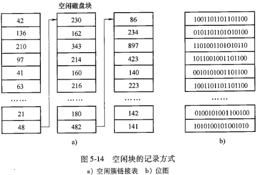


# 第六章 I/O 设备管理

- 本章主要内容：

  1. I/O系统的结构、I/O设备分类、设备控制器（选择、填空、简答）

  2. 轮询、中断、DMA控制方式（选择、填空、简答）

  3. 缓冲管理（选择、填空、简答）

  4. 设备分配、独立性、 SPOOLing技术（选择、填空、简答）

  5. I/O软件管理（选择、填空、简答）

  6. 磁盘结构（选择、填空、简答）

  7. **磁盘调度**（选择、填空、简答、综合）

     本章近3年分值：12~20分

## 第一节 I/O 系统的组成

1. I/O 系统的结构
   1. **微机 I/O 系统**

      - 总线型 I/O 系统结构如 图 6-1 所示。CPU与内存之间可以直接进行信息交换，但是不能与设备直接进行信息交换，必须经过设备控制器。

      

   2. **主机 I/O 系统**

      - I/O 系统可能采用四级结构，包括主机、通道、控制器和设备。一个通道可以控制多个设备控制器，一个设备控制器也可以控制多个设备。图 6-2 所示为具有通道的 I/O 系统结构。

      

      

2. I/O 设备的分类

   1. 按传输速率分类
      1. 低速设备。如键盘和鼠标，传输速率为几个~几百个字节/秒。
      2. 中速设备。如打印机，传输速率为数千个~数万个字节/秒。
      3. 高速设备。如磁带机、磁盘机、光盘机，传输速率为几十万~几兆字节/秒。
   2. 按信息交换的单位分类
      1. 块设备。数据的存取以数据块为单位，如磁盘。块设备在块中保存信息，块的大小通常是固定的，并且一次只传送一块，通常可以通过块号访问数据。
      2. 宇符设备。传送字节流，没有使用块结构。终端、打印机、通信端口和鼠标等都是字符设备。
         在操作系统实现驱动程序时，通常需要区分一个设备是块设备还是字符设备，操作系统对这两种设备的缓冲管理和驱动程序的实现方式是不同的。
   3. 按设备的共享属性分类
      1. **独占设备**。是必须作为临界资源以互斥方式访问的设备。在一个进程没有使用完毕之前，其他任何进程不能访问该设备，直到设备被释放。例如，打印机是典型的独占设备。
      2. **共享设备**。是允许多个进程共同访问的设备，如硬磁盘是典型的共享设备。
      3. **虚拟设备**。是通过某种虚拟技术把一台物理设备变成若干逻辑设备，从用户的角度看，多个用户拥有各自的设备，可以随时向设备发出访问请求并得到系统应答。

3. 设备控制器

   1. 什么是设备控制器

      1. 设备控制器是 **CPU与 I/O 设备之间的接口**，接收 I/O 的命令并控制设备完成 I/O 工作。
      2. 设备控制器是一个可编址设备，连接多个设备时可有多个设备地址。控制器可以直接做在主板上，也可以做成插卡插在主板上。现在有些设备的控制器嵌入在设备中，如激光打印机的控制器。

   2. 设备控制器的功能

      1. **接收和识别命令**
         - 接收CPU的命令和参数存放在控制器的控制寄存器中，并对命令和地址译码。
      2. **数据交换**
         1. 将驱动器中的比特流汇集在控制器的缓冲区中以形成字节块。
         2. 实现CPU到控制器、控制器到CPU的双向数据传送。
         3. 将控制器对设备的控制命令传送给设备控制器。
      3. **设备状态了解和报告**
         - 设备控制器中有专门用来存放设备状态信息的寄存器或触发器，CPU可以通过读取这些信息了解设备的当前状态。
      4. **地址识别**
         1. 设备控制器必须能识别它所控制的每个设备的地址。
         2. 设备控制器中的寄存器本身应该有唯一的地址，以使CPU能向寄存器中读/写数据。
         3. 将CPU要访问的外设地址送入控制器，由控制器的地址译码器译码后选中目标设备。
   5. **数据缓冲**
      
         - 在设备控制器中可以存储数据，作为CPU和 I/O 之间的缓冲。
   6. **差错控制**
      
   - 设备控制器需要具有差错检测功能，当通过数据校验发现数据传输出错时，可以向CPU报告，废弃错误数据，重新启动一次数据传输。
         
   3. 设备控制器的组成
   
   1. 设备控制器与处理机的接口：**数据线、控制线和地址线**
      
   2. 设备控制器与设备的接口：设备与设备控制器接口中的 3类信号为**数据、状态**和**控制信号**。
   3. I/O 逻辑：I/O 逻辑主要由**指令译码器**和**地址译码器**两部分功能部件构成，将CPU的命令和地址分别译码，控制指定设备进行 I/O 操作。
         设备控制器的逻辑结构如 图 6-3 所示。
   
      
   
   4. I/O 通道
   
      - I/O 通道是一种特殊的处理机，它具有执行 I/O 指令的能力，并通过执行通道程序来控制 I/O操作。简单地说，通道是大型主机系统中专门用于 I/O 的专用计算机。

## 第二节 I/O 控制方式

- 输人/输出方式有早期的程序轮询控制方式。在中断机制被引入计算机系统后，输入/输出控制采用中断控制方式。为了提高块设备的输入/输出性能，可以利用DMA（ Direct Memory Access，直接内存访问）控制器对输入/输出进行DMA控制。

1. 轮询

   - 早期的计算机系统，因为没有中断机制，处理器对输入/输出的控制不得不采取程序轮询的方式。采用这种控制方式，主机试图发送 I/O 控制命令之前，先通过反复检测设备控制器状态寄存器的忙/闲标志位，若设备“忙”，主机继续检测该标志位，直到该位为“空闲”，主机发送 I/O 指令。在主机发送完 I/O 指令后，设备控制器把状态寄存器的忙/闲标志位再置成“忙”，主机再次进入轮询状态，以检测本次输入/输出是否结束。这种控制方式使CPU经常处于由于输入/输出而造成的循环测试状态，造成CPU的极大浪费，影响整系统的吞吐量。

2. 中断

   - 现代计算机系统广泛采用中断控制方式完成对/O的控制。

     - 采用中断控制方式的 I/O 工作模式是CPU执行进程中，发出输入/输出请求，若此时 I/O 设备忙，则进程阻塞等待。
     - 当处于“忙”状态的设备工作完毕，通过中断控制器发出中断请求信号，CPU响应中断，执行对应该设备的中断处理程序，然后唤醒因等待该设备而被阻塞的进程。
     - CPU继续执行这个进程时，向设备控制器发送 I/O 指令，然后CPU被调度程序分配给某个进程，继续执行某个程序。
     - 自此，在设备控制器控制设备完成本次 I/O 的过程中， I/O 与CPU并行工作。
     - 当本次0结束后，设备控制器通过向CPU发送中断请求信号告知CPU本次数据传输结束。

   - 中断控制的工作方式能使CPU与 I/O 设备在某些时间段上并行工作，提高CPU的利用率和系统的吞吐量。图6-4 所示为3种 I/O 控制方式流程。

     

3. DMA

   - DMA控制需要特殊结构的设备控制器，DMA控制器的逻辑组成包括 3 部分：

     - 主机与DMA的接口
     - DMA与设备的接口
     - I/O 控制逻辑

   - 为了实现主机与设备控制器之间成块数据的传送，在DMA控制器中设计了 4 类**寄存器命令/状态寄存器CR**、**内存地址寄存器 MAR**、**数据寄存器 DR** 和**数据计数器 DC** 。

     DMA 控制器的逻辑结构如图6-5所示

     

   1. **命令/状态寄存器CR**

      - 用于接收从CPU发来的 I/O 命令或有关控制信息、设备状态。

   2. **内存地址寄存器MAR**

      - 存放内存地址，在输出数据时，存放输出数据在内存的起始地址，指示DMA应该从内存的什么地方读取输出数据。在输入数据时，存放输入数据将要被放入内存的起始地址，指示DMA应该把输入数据放到内存的什么地方。

   3. **数据计数器DC**

      - 指示DMA，本次向CPU发中断信号前要读或写数据的次数。

   4. **数据寄存器DR**

      - 用于暂存DMA传输中要输入或输出的数据。

      下面以从磁盘读数据为例，说明DMA控制方式的工作原理，以及**DMA控制和中断控制的区别**。

      - 没有使用DMA时磁盘读数据的过程

        1. 首先控制器一个比特一个比特地从设备完整地读出一块数据放入内部缓冲区中。
        2. 确认该块数据的正确性。
        3. 控制器发中断信号，CPU执行中断处理程序，从控制器的设备寄存器中将数据读入内存

      - 通过DMA从磁盘读数据的过程。

        1. 当CPU要从磁盘读入一个数据块时，便向磁盘控制器发送一条读命令。该命令被送到其中的命令寄存器CR中。
        2. 同时，CPU将本次读入数据将要放在内存中的起始地址送DMA的MAR寄存器，将本次要读的字节数送DC寄存器。
        3. 然后，启动DMA控制器进行数据传送。在DMA控制输入的过程中，CPU可以执行其他的进程。当本次读入的数据全部传送完毕后，DMA向CPU发送中断请求。

        在DMA控制磁盘读入数据的过程中，每读入一个字（节），便将该字（节）送到当前MAR指示的内存单元中，然后MAR的值递增，以指向下一个内存单元。

        - DC减1，若DC递减后的值不为0，说明本次数据传送没有结束，继续在DMA控制下传送下一个字节；
        - 若DC减1后变为0，说明本次数据传输结束，由DMA向CPU发中断请求。
        - 图6-6 所示为DMA工作方式流程

        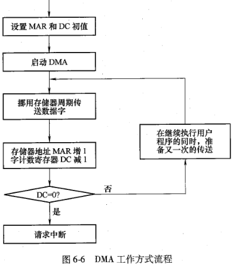

## 第三节 缓冲管理

1. 缓冲的引入
   1. 处理数据流的生产者与消费者之间的速度差异。
      - 双缓冲将生产者与消费者进行分离，缓和了两者之间的**时序要求**
   2. 协调传输数据大小不一致的设备。
      - 这种不一致在计算机网络中特别常见，缓冲常常用来处理**消息的分段和重组**。
      - 在发送端，一个大消息分成若干小网络包。这些包通过网络传输，接收端将它们放在重组缓冲区内以生成完整的源数据镜像。
   
2. 单缓冲

   - 操作系统提供的最简单的缓冲类型是单缓冲区，如图6-7所示。当一个用户进程发出 I/O 请求时，操作系统为该操作分配一个位于主存的缓冲区

     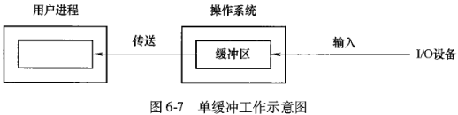

   - 对于面向流的 I/O ，在每次传送一行的方式下，或者每次传送一个字节的方式下，可以使用单缓冲方案。键盘、打印机和传感器等都属于面向流的设备。

   - 对于每次传送一行的 I/O ，可以用缓冲区保存一行数据。在输入期间用户进程被阻塞，等待整行的到达。对于输出，用户进程可以把一行输出放置在缓冲区中，然后继续处理。只有当第一次输出操作的缓冲区内容清空之前，又需要发送第二行输出时，它才需要被阻塞。对于每次传送一个字节的 I/O ，操作系统和用户进程之间的交互按照第三章进程同步讲述的生产者一消费者模型进行。

3. 双缓冲

   - 可以通过给操作系统指定两个系统缓冲区，如图6-8所示，对单缓冲方案进行改进。当一个进程往这一个缓冲区中传送数据（或从这个缓冲区中读取数据）时，操作系统正在清空（或填充）另一个缓冲区，这种技术称为双缓冲（ Double Buffering），或缓冲交换（ Buffering Swapping）

   - 双缓冲的性能比单缓冲的性能有所提高，但是这种提高是以增加复杂性为代价的。

     

4. 循环缓冲
   1. 循环缓冲的组成

      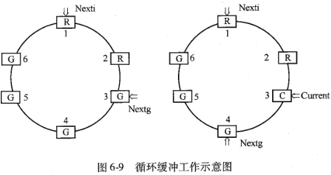

      1. 多个缓冲区
         1. 空缓冲区R：生产者进程下一个可用的空缓冲区。
         2. 已装满数据的缓冲区G：用于指示消费者进程下一个可用的装有产品的缓冲区。
         3. 现行工作缓冲区C：消费者进程正在使用的工作缓冲区。
      2. 多个指针
         1. Nextg：用于指示消费者进程下一个可用的装有数据的缓冲区。
         2. Nexti：用于指示生产者进程下一个可用的空缓冲区。
         3. Current：用于指示进程正在使用的工作缓冲区。

   2. 循环缓冲的使用

      1. Getbuf过程
         - 消费者进程要使用缓冲区中的数据时，可调用 Getbuf过程。
         - 该过程将Nexg指向的缓冲区提供给进程使用，并把它改成由 Current指针指向的现行工作缓冲区，同时使 Nextg指向下一个可用的装有数据的缓冲区G。
         - 而当生产者进程要使用空缓冲区来装数据时，也通过调用 Getbuf过程，把Next指示的空缓冲区提供给生产者进程使用，然后使 Nexti指向下一个空缓冲区R
      2. Releasebuf过程
         - 当进程使用完缓冲区之后，调用 Releasebuf过程释放缓冲区。
         - 当消费者进程把C缓冲区中的数据提取完毕时，便调用 Releasebuf过程释放C缓冲区，把该缓冲区改为空缓冲区R。
         - 当生产者进程把缓冲区装满数据后，调用 Releasebuf过程释放缓冲区，使装满数据的当前工作缓冲区成为G缓冲区。

   3. 进程同步

      1. Nexti 指针追上 Nextg 指针，即生产者进程速度大于消费者进程速度，没有空缓冲区，全部缓冲区已满。此时，需要阻塞生产者进程，等待消费者进程为生产者进程释放空缓冲区R
      2. Nextg 指针追上 Nexti 指针，消费者进程速度大于生产者进程速度，全部缓冲已空此时，需要阻塞消费者进程，等待生产者进程为消费者进程释放装有数据的缓冲区G。

5. 缓冲池
   1. 缓冲池组成

      1. **3 种类型的缓冲区**。
         - 空缓冲区、装满输入数据的缓冲区和装满输出数据的缓冲区。
      2. **3 种队列**。
         1. 空缓冲队列 emq：是由空缓冲区链接而成的队列。
         2. 输入队列 inq：是由装满输入数据的缓冲区链接成的队列
         3. 输出队列 outq：是由装满输出数据的缓冲区链接成的队列。
      3. **4 种工作缓冲区**。
         1. 收容输入数据的缓冲区。收容完输入数据后，缓冲区被插入输入队列中
         2. 提取输入数据的缓冲区。存在于输入队列中，进程需要输入数据时，先从输入队列中获取这种缓冲区。
         3. 收容输出数据的缓冲区。收容完输出数据后，缓冲区被插入输出队列中
         4. 提取输出数据的缓冲区。存在于输出队列中，进程需要输出数据时，先从输出队列中获取这种缓冲区。

   2. Getbuf 过程和 Putbuf 过程

      - 对缓冲池的操作由 Getbuf 过程和 Putbuf 过程来完成。
        - 为了使进程能以互斥的方式访问缓冲池队列，可为每个队列设置一个相应的互斥信号量MS（type）。
        - 为了保证进程同步使用缓冲区，可以为每个队列设置一个资源信号量RS（type）。
        - 其中，type指示缓冲区队列类型，可以是emq、inq或outq

      1. Getbuf 过程

         ```C
         Procedure Getbuf(type)
         Begin
           Wait(rs(type));		//申请缓冲区
           Wait(MS(type));		//申请缓冲队列的互斥访问权
           B(number)= Takebuf(type);	//提取缓冲区
           Signal(MS(type));		//释放缓冲队列的互斥访问权
         End
         ```

         

      2. Putbuf过程

         ```C
         Procedure Putbuf(type,number)
         Begin
           Wait(MS(type));				//申请缓冲队列的互斥访问权
           Addbuf( type, number);	//向type指示的队列中插入 number指示的缓冲区, number可以是hin、sin、sout或hout,见图6-10
           Signal (MS(type));			//释放缓冲队列的互斥访问权
           Signal( RS(type));	//释放缓冲区
         End
         ```

         

   3. 缓冲区的工作方式

      - 缓冲区可以工作在收容输入、提取输入、收容输出和提取输出4种工作方式下，如 图6-10 所示。

        

      1. 收容输入在进程需要收容输入数据时，要先从空缓冲队列提取一个空缓冲区，将输入数据写入缓冲后，再把装人了输入数据的缓冲区插入到输入队列中去。操作步骤如下。
         1. `Getbuf(emq)`。
         2. 将输入数据写人缓冲区。
         3.  `putbuf(ing,hin)`。
      2. 提取输入当进程需要输入数据时（如计算进程需要提取输人数据，然后对数据进行计算处理），先从输入队列提取输入缓冲区，然后从中提取输入数据，最后把缓冲区作为空缓冲区插入空缓冲队列。操作步骤如下。
         1. `Getbuf（inq）`。
         2. 从缓冲区提取数据。
         3.  `putbus（emq,sin）`。
      3. 收容输出在进程需要收容输出数据时，要先从空缓冲队列提取一个空缓冲区，将输出数据写入缓冲后，再把装入了输出数据的缓冲区插入到输出队列中去。操作步骤如下。
         1.  `Getbuf（emq）`。
         2. 将输出数据写入缓冲区。
         3.  `putbus（ouq,hout）`。
      4. 提取输出当进程需要输出数据时（如打印进程需要提取输出数据送打印机），先从输岀队列提取输出缓冲区，然后从中提取输出数据，最后把这个缓冲区插入空缓冲队列。操作步骤如下。
         1. `Getbuf（ outq）`
         2. 输出数据
         3. `putbuf（emq, sout）`

## 第四节 设备分配

1. 设备分配中的数据结构

   1. **设备控制表 DCT** (Device Control Table)
      1. 设备类型
      2. 设备标识符
      3. 设备状态: 忙/闲
      4. 重复执行的次数活时间
      5. 设备队列的首指针。设备队列也称设备请求队列，是因请求设备而被阻塞的进程的PCB构成的队列。设备队列的队首指针指向队首的PCB。
   2. **控制器控制表 COCT** (Controller Control Table)
      1. 控制器标识符。
      2. 控制器状态。
      3. 与控制器相连接的通道表指针。
      4. 控制器队列的队首指针。
      5. 控制器队列的队尾指针。
   3. **通道控制表 CHCT** (Channel Control Table)
      1. 通道标识符通道状态。
      2. 与通道连接的控制器表首址。
      3. 通道队列的队首指针。
      4. 通道队列的队尾指针。
   4. **系统设备表 SDT** (System Device Table)
      - 系统设备表是系统范围的数据结构，其中记录了系统中全部设备的情况。
      - 每个设备占个表目，其中包括设备类型、设备标识符、设备控制表及设备驱动程序的入口地址。

   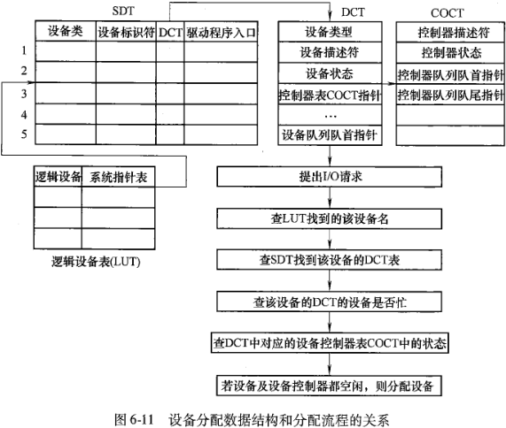

2. 设备分配

   1. 设备的固有属性
      1. **独占设备**
         - 对于独占设备，应采用独享分配策略，即将一个设备分配给某进程后，便由该进程独占，直至进程完成或释放该设备。然后，系统才能再将该设备分配给其他进程使用。这种分配策略的缺点是，设备得不到充分利用，而且还可能引起死锁
      2. **共享设备**
         - 对于共享设备，可同时分配给多个进程使用，此时需要注意对这些进程访问该设备的先后顺序进行合理的调度。
      3. **可虚拟设备**
         - 由于可虚拟设备是指一台物理设备在采用虚拟技术后可变成多台逻辑上的所谓虚拟设备，因而一台可虚拟设备是可共享的设备，可以将它同时分配给多个进程使用，并对进程访问该设备的先后顺序进行控制。
   2. 设备分配算法
      1. 先来先服务
      2. 基于优先权的分配算法
   3. 设备分配方式
      1. 安全分配方式
         - 在这种分配方式中，每当进程发出I/O请求后，便进入阻塞状态，直到其I/O操作完成时才被唤醒。在采用这种分配策略时，一旦进程已经获得某种设备（资源）后便阻塞，使该进程不可能再请求任何其他资源，而在它运行时又不能保持任何资源。因此，这种分配方式已经摒弃了造成死锁的4个必要条件之一的“请求和保持”条件，从而使设备分配是安全的。其缺点是进程进展缓慢，即对于同一个进程，CPU与I/O设备是串行工作的。
      2. 不安全分配方式
         - 在这种分配方式中，进程在发出I/O请求后仍在继续运行，需要时又发出其他的I/O请求。仅当进程所请求的设备已被另一个进程占用时，请求进程才进入阻塞状态。这种分配方式的优点是，一个进程可同时操作多个设备，使进程推进迅速。其缺点是分配不安全，因为它可能具备“请求和保持”条件，从而可能造成死锁。

3. 设备独立性

   1. 设备独立性的概念
      - 为了提高操作系统的可适应性和可扩展性，在现代操作系统中都毫无例外地实现了设备独立性，也称为设备无关性。其基本含义是应用程序独立于具体使用的物理设备。
      - 设备独立性，引入了逻辑设备和物理设备这两个概念。在应用程序中，使用逻辑设备名称来请求使用某类设备，而系统在实际执行时，还必须使用物理设备名称。因此，系统必须具有将逻辑设备名称转换为物理设备名称的功能。
   2. **实现设备独立性带来的好处**
      1. 应用程序与物理设备无关，系统增减或变更外围设备时不需要修改应用程序。
      2. 易于处理输入/输出设备的故障。
      3. 提高了系统的可靠性，增加了设备分配的灵活性。
   3. **设备独立软件**
      1. 执行所有设备的公有操作
         - 执行的操作包括：独占设备的分配与回收、将逻辑设备名映射为物理设备名、对设备进行保护、缓冲管理和差错控制。为了实现逻辑设备名到物理设备名的转化，可以利用称为逻辑设备表LUT（ Logical Unit Table）的数据结构。
      2. 向用户层软件提供统一接口
         - 设备独立软件向用户层屏蔽访问硬件的细节，向应用软件和最终用户提供简单、统一的访问接口。

4. **独占设备的分配程序**

   1. 分配设备

      - 根据用户请求的设备的物理名，查找系统设备表，从中找出该设备的设备控制表，检查设备控制表中的设备状态字。
      - 若设备忙，则将进程阻塞在该设备的阻塞队列中；
      - 若设备空闲，则根据设备分配算法将设备分配给进程。

   2. 分配控制器

      - 若系统为进程分配了其请求的设备，就到该设备的控制表中找出与该设备连接的控制器的COCT，即设备控制器控制表，检查其中的状态字段。
      - 若该控制器忙，则将请求 I/O 的进程阻塞在该设备控制器的阻塞队列中；
      - 若控制器空闲，则将它分配给进程。

   3. 分配通道

      - 在有通道的系统中，还需要从相应的设备控制器控制表中找到与该控制器连接的通道控制表，检查表中的通道状态字段。
      - 若通道忙，则将进程阻塞在该通道的阻塞队列上；
      - 若通道空闲，则将该通道分配给进程。

      当进程获得了设备、设备控制器或者获得了设备、设备控制器和通道时（在有通道的系统中），系统的本次设备分配才算成功，系统可以启动进程的 I/O

5. **SPOOLing 技术**

   1. 什么是 SPOOLing

      在多道程序环境下，利用一道**程序来模拟脱机输入时的外围控制机的功能，把低速 I/O 设备上的数据传送到高速输出磁盘上，再利用另一道程序来模拟脱机输出时外围控制机的功能，把数据从磁盘传送到低速输出设备上**。这种在联机情况下实现的同时外围操作称为 SPOOLing（ Simultaneous Perihernal Operations On-Line

      **SPOOLing 系统的组成**

      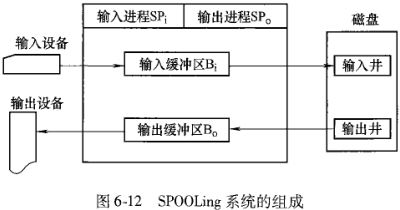

      1. 输入井和输出井
         - 这是位于磁盘上的两个分别存放输入数据和输出数据的存储区域，作为大量输入或输出数据的缓存。
      2. 输入缓冲区和输出缓冲区
         - 输人缓冲区用来暂存由输入设备送来的输入数据，输出缓存区用来存放从输出井送来的输出数据，以后再传给输出设备。
      3. 输入进程 SPi 和 输出进程 SPo
         - 输入进程把输人设备送来的数据送入输入缓存，再把缓存中的数据送人输入井。当消费者进程需要输入数据时，再从输入井把输入数据读人内存
         - 输出进程把要输出的数据从内存送入输出井，当需要输出数据时，再从输出井把数据读到输出缓存（如打印缓存），数据从输出缓存送往输出设备。
      4. 请求 I/O 队列
         - 请求输入或输出的进程提交的输入/输出任务组成的队列

   2. **利用 SPOOLing 技术实现共享打印机**

      1. 由输出进程在输出井中申请空闲盘块区，并将要打印的数据送入其中。
      2. 输出进程再为用户申请并填写一张用户请求打印表，将该表挂到请求打印队列上。
         当打印机空闲时，输出进程完成以下动作。
         1. 从请求打印队列队首取一张请求打印表。
         2. 将打印数据从输出井送到打印机缓冲区 (输出缓冲区)
         3. 打印。
         4. 打印完毕，若打印队列不为空，则转第①步。

   3. SPOOLing系统的特点如下。

      1. **提高了 I/O 速度**。
         - 由于使用了磁盘作为低速设备（如打印机、磁带等）的大容量缓存，提高了输人/输出的速度。
      2. **将独占设备改造为共享设备**。
         - 通过 SPOOLing系统使独占设备变为了逻辑上的共享设备，系统可以同时接受多个用户对设备的访问请求。
      3. **实现了虚拟设备功能**。
         - 把一台物理上只能互斥使用的设备，变为了从用户眼里看到的共享设备。
         - 宏观上看，系统可以同时响应多个用户对设备的请求。
         - 微观上看，任意时刻设备只能为某一个用户进程服务， SPOOLing系统实现了将独占设备变换成多个逻辑设备的功能。

## 第五节 I/O 软件管理

- I/O 软件的总体目标是将软件组织成一种层次结构，低层软件用来屏蔽硬件的具体细节，高层软件则主要是为用户提供一个简洁、规范的界面。

- 用户程序及操作系统中**设备管理软件**的构成和关系如 图6-13 所示，将设备管理软件组织成 4 个层次，即

  

  1. 用户层软件。
  2. 与设备无关的软件层。
  3. 设备驱动程序。
  4. 中断处理程序（底层）。

  设备管理软件与硬件关系最密切的是设备驱动程序，包括设备服务程序和中断处理程序。设备驱动程序上层是设备无关软件，通常完成设备命名、设备分配、设备独立性和缓冲管理等功能。最上层的用户进程向系统发送 I/O 请求，显示 I/O 操作的结果，提供用户与设备的接口。

1. **设备管理软件的功能**

   1. **实现 I/O 设备的独立性**
      - 当用户使用的设备发生变化时，比如用激光打印机替代了喷墨打印机，应用程序的代码不需要修改。
      - 操作系统向应用软件层提供的这一支持方便了应用程序的开发和维护。
   2. **错误处理**
      - 错误应该在尽可能接近硬件的地方处理，只有在低层软件处理不了的情况下才通知高层软件。
      - 例如，控制器进行一个读操作，它应该尽量处理并完成操作，如果因为某种故障控制器处理不了，则交给设备驱动程序，可能只需重读一次就可以解决问题。
   3. **异步传输**
      - 多数物理 I/O 是异步传输，即CPU在启动传输操作后便可以转向其他工作，直到中断到达
   4. **缓冲管理**
      - 由于设备之间的速度差异，必须提供缓冲管理，为所有的块设备和字符设备提供缓冲管理功能，并向高层软件屏蔽由于设备差异带来的缓冲管理实现的具体细节。
   5. **设备的分配和释放**
      - 对共享设备和互斥设备应该采取不同的方式为用户请求分配设备。
      - 设备使用完毕，要完成对设备的释放。
   6. **实现 I/O 控制方式**
      1. 针对不同的设备提供不同的 I/O 控制方式，如对打印机、键盘等字符设备实现中断控制。
      2. 而对磁盘这样的块设备既可以采用中断控制方式，也可以采用DMA控制方式。
      3. 但是，鉴于磁盘传输数据的特点，一般都采用DMA控制方式操作系统通过将 I/O 软件组织成如 图6-13 所示的 4 个层次，可以合理、高效地实现以上目标。

2. **中断处理程序**

   -  I/O 中断处理程序的作用是将发出 I/O 请求而被阻塞的进程唤醒。
   - 用户进程在发出 I/O 请求后，由于等待 I/O 的完成而被阻塞。
   - CPU转去执行其他任务，当 I/O 任务完成，控制器向CPU发中断请求信号，CPU转去执行中断处理程序，由中断处理程序唤醒被阻塞的设备用户进程。

3. **设备驱动程序**

   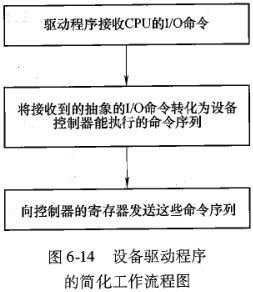

   - 读第 n 块磁盘的请求时，磁盘驱动程序的工作如下。
     1. 计算出所请求块的物理地址。
     2. 检查驱动器电机是否正在运转。
     3. 检查磁头臂是否定位在正确的柱面。
     4. 确定需要哪些控制器命令及命令的执行顺序。
     5. 向设备控制器的设备寄存器中写入命令。
     6. I/O 完成后，向上层软件传送数据。
   - 设备驱动程序属于操作系统的内核程序，但是一般由设备生产厂商开发，销售硬件设备时附送给用户，并不是由操作系统厂商提供。
     - 设备驱动程序要遵循操作系统提供的内核与设备驱动的接口标准。
     - 由于不同的操作系统提供的内核与驱动程序接口不一样，要使驱动程序在不同的操作系统环境中运行，对同一种设备需要开发针对不同操作系统的驱动程序。
     - 人们经常说某个驱动程序是 for Windows或者 for Linux的，就是出于这个原因

4. **与硬件无关的 I/O 软件**

   - 设备无关 I/O 软件的功能如下。
     1. 设备命名：将设备名映射到相应的驱动程序。
     2. 设备保护：为设备设置合理的访问权限。
     3. 提供独立于设备的块大小。
        - 例如，不同磁盘的扇区大小可能不同，设备无关软件屏蔽了这一事实并向高层软件提供统一的数据块大小。例如，扇区大小为512B，若逻辑磁盘块大小为1KB，则软件发出读两个连续扇区的命令，将连续两个扇区作为一个大小为1KB的逻辑块来处理。
     4. 为块设备和字符设备提供必要的缓冲技术。
     5. 块设备的存储分配。
        - 当创建了一个文件并向其输入数据时，该文件必须被分配新的磁盘块。为了完成分配工作，操作系统需要为每个磁盘都配置一张记录空闲盘块的表或位图，但定位一个空闲块的算法是独立于设备的，因此可以在高于驱动程序的层次处理。
     6. 分配和释放独立设备。
     7. 错误处理。

## 第六节 磁盘管理

1. **磁盘结构**

   1. 数据的组织和格式

      - 磁盘设备可包括一个或多个物理盘片，每个磁盘片分一个或两个存储面（ Surface），如图6-15a 所示。

        - 每个盘面被组织成若干个同心环，这种环称为磁道（ Track），各磁道之间留有必要的间隙。
        - 为使处理简单，在每条磁道上可存储相同数目的二进制位。
        - 这样，磁盘密度即是每英寸中所存储的位数，显然是内层磁道的密度较外层磁道的密度高。
        - 每条磁道又被划分成若于个扇区（ Sector）。
        - 图6-15b所示为一个磁道分成8个扇区，各扇区之间保留一定的间隙。

        

      - 一个物理记录存储在一个扇区上，磁盘上存储的物理记录数目是由扇区数、磁道数及磁盘面数所决定的。

      - 为了提高磁盘的存储容量，充分利用磁盘外磁道的存储能力，现代磁盘不再把内外磁道划分为相同数目的扇区，而是利用外层磁道容量较内层磁道大的特点，将盘面划分成若干条环带，使得同一环带内的所有磁道具有相同的扇区数。显然，外层环带的磁道拥有较内层环带的磁道更多的扇区。为了减少这种磁道和扇区在盘面分布的几何形式变化对驱动程序的影响，大多数现代磁盘都隐藏了这些细节。

      - 为了在磁盘中存储数据，必须先将磁盘低级格式化。图6-16 显示出了一种温盘（温切斯特盘）中一条磁道格式化的情况。其中每条磁道含有30个固定大小的扇区，每个扇区容量为600个字节。其中512个字节存放数据，其余的用于存放控制信息。每个扇区包括两个字段。

        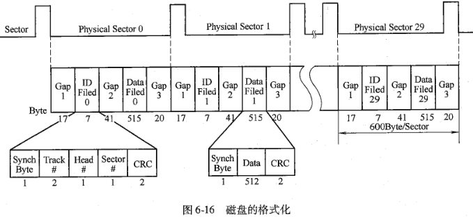

        1. 标识符字段，其中一个字节的 SYNCH 具有特定的位图像，作为该字段的定界符。利用磁道号、磁头号及扇区号三者来标识一个扇区。CRC 字段用于段校验。
        2. 数据字段，其中可存放512个字节的数据。
           - 磁盘格式化完成后，一般要对磁盘分区。在逻辑上，每个分区就是一个独立的逻辑磁盘。每个分区的起始扇区和大小都被记录在磁盘0扇区的主引导记录分区表所包含的分区表中。在这个分区表中必须有一个分区被标记成活动的，以保证能够从硬盘引导系统。
           - 但是，在真正可以使用磁盘前，还需要对磁盘进行一次高级格式化，即设置一个引导块、根目录和一个空文件系统，同时在分区表中标记该分区所使用的文件系统。

   2. 磁盘类型

      1. **固定头磁盘**
         - 这种磁盘在每条磁道上都有读/写磁头，所有的磁头都被装在一个刚性磁臂中。通过这些磁头可访问各磁道且进行并行读/写，有效地提高了磁盘的 I/O 速度。这种结构的磁盘主要用于大容量磁盘上。
      2. **移动头磁盘**
         - 这种磁盘每一个盘面仅配有一个磁头，也被装入磁臂中。为了能访问该盘面的所有磁道，该磁头必须能移动并进行寻道。可见，移动磁头仅能以串行方式读/写，致使磁盘读写速度较慢。但由于其结构简单，故仍广泛应用于中小型磁盘设备中。在微型机上配置的硬盘采用移动磁头结构，故本节主要针对这类磁盘的 I/O 进行讨论。

   3. 磁盘的访问时间

      1. **寻道时间**
         - 这是指把磁臂（磁头）移动到指定磁道上所经历的时间。该时间是启动磁臂的时间与磁头移动n条磁道所花费的时间之和。
      2. **旋转延迟时间**
         - 这是指将指定扇区移动到磁头下面所经历的时间。不同的磁盘类型，旋转速度差别很大。
      3. **传输时间**
         - 这是指把数据从磁盘读出或向磁盘写入数据时所经历的时间。其大小与每次所读/写的字节数和旋转速度有关。
         - 在磁盘访问时间中，寻道时间和旋转延迟时间基本上都与所读/写数据的多少无关，而且寻道时间和旋转延迟时间通常占据了访问时间中的大头。适当地集中数据在磁盘上存放的位置，可以减少磁臂移动距离，这将有利于提高传输速率。

2. **磁盘调度**

   1. **先来先服务 (First Come First Served, FCFS)**

      - 这是一种最简单的磁盘调度算法。它根据进程请求访问磁盘的先后顺序进行调度。此算法的优点是公平、简单，且每个进程的请求都能依次得到处理，不会出现某一进程的请求长期得不到满足的情况。但此算法由于未对寻道进行优化，致使平均寻道时间可能较长。
      - 表6-1给出了有9个进程先后提出磁盘 I/O 请求时，按FCFS算法进行调度的情况。这里将进程号（请求者）按他们发出的请求的先后顺序排队。这样，平均寻道距离为55.3条磁道，与后面即将讲到的几种调度算法相比，其平均寻道距离较大，故FCFS算法仅适用于请求磁盘 I/O 的进程数目较少的场合。

   2. **最短寻道时间优先 (Shortest Seek Time First, SSTF)**

      - 该算法选择这样的进程：其要求访问的磁道与当前磁头所在的磁道距离最近，以使每次的寻道时间最短。但这种算法不能保证平均寻道时间最短。

      - 表6-2给出了STF算法进行调度时，各进程被调度的顺序、每次磁头移动的距离，以及9次调度磁头平均移动的距离。

      - 比较表6-1和表6-2可以看出，SSTF算法的每次磁头移动平均距离明显低于FCFS的距离，因而SSTF较之FCFS有更好的寻道性能，故曾一度被广泛采用。

        

   3. **扫描（SCAN）算法**

      1. 进程“饥饿”现象
         - STF算法虽然能获得较好的寻道性能，但却可能导致某个进程发生“饥饿”（ Starvation）现象。
         - 因为只要不断有新进程的请求到达，且其所要访问的磁道与磁头当前所在磁道的距离较近，这种新进程的 I/O 请求必然优先被满足，导致所要访问的磁道距离与磁头所在位置较远的磁盘任务总是不能得到调度。对SSTF算法略加修改后所形成的SCAN算法可防止进程出现“饥饿”现象。
      2. SCAN 算法
         - 该算法不仅考虑到要访问的磁道与当前磁道的距离，更优先考虑磁头当前的移动方向。
         - 例如，当磁头正在自里向外移动时，SCAN算法所考虑的下一个访问对象应是其要访问的磁道既在当前磁道之外，又是**距离最近**的。这样**自里向外地访问，直至再无更外的磁道需要访问时，才将磁臂换为自外向里移动**。这时，同样也是每次选择这样的进程来调度，即要访问的磁道在当前位置内距离最近者。这样，磁头逐步地自外向里移动，直至再无更里面的磁道要访问，从而避免出现“饥饿”现象。由于在这种算法中磁头移动的规律颇似电梯的运行，因而又常称之为**电梯调度算法**。表6-3 给出了按SCAN算法对9个进程进行调度及磁头移动的情况

   4. **循环扫描（ CSCAN）算法**

      - SCAN算法既能获得较好的寻道性能，又防止了“饥饿”现象，故被广泛用于大、中、小型机器和网络中的磁盘调度。

        - 但SCAN也存在这样的问题：当磁头刚从里向外移动而越过了某一磁道时，恰好又有一进程请求访问此磁道。这时，该进程必须等待，待磁头继续自里向外，然后再自外向里扫描完所有要访问的磁道后，才处理该进程的请求，致使该进程的请求被大大推迟。为了减少这种延迟， CSCAN算法规定磁头是**单向移动**。
        - 例如，只是自里向外移动，当磁头移到**最外的磁道后，磁头立即返回到最里的要访问的磁道**，亦即将最小磁道号紧接着最大磁道号构成循环，进行循环扫描。
        - 表6-4 给出了 CSCAN算法对9个进程调度的顺序及每次磁头移动的距离。

        

   5. **NStepSCAN和 FSCAN调度算法**

      1. **NStepSCAN 算法**
         - 在SSTF、SCAN及 CSCAN几种调度算法中，都可能会出现磁臂停留在某处不动的情况，
           - 例如，有一个或几个进程对某一磁道有较高的访问频率，即这个（些）进程反复请求对某磁道的 I/O 操作，从而垄断了整个磁盘设备。把这一现象称为“**磁臂粘着**”（ Armstickiness）在高密度磁盘上容易出现此情况。 
           - NStepSCAN算法是将磁盘请求队列分成**若干个长度为N的子队列**，磁盘调度将按 **FCFS 算法依次处理这些子队列**。每处理一个队列时又是按SCAN算法，对一个队列处理完后，再处理其他队列。当正在处理某子队列时，如果又出现新的磁盘 I/O 请求，便将**新请求进程放入其他队列**，这样就可避免出现磁臂粘着现象。
           - 当N值取得很大时，会使 NStepSCAN 算法的性能接近于 SCAN 算法的性能。当 N=1 时， NStepSCAN 算法便蜕化为 FCFS 算法。
      2. **FSCAN 算法**
         - FSCAN算法实质上是 NStep SCAN算法的简化，即 FSCAN只将磁盘请求队列分成**两个子队列**。
           - 一个是由当**前所有请求磁盘 I/O 的进程形成的队列**，由磁盘调度按SCAN算法进行处理。
           - 在扫描期间，将新出现的所有请求磁盘 I/O 的进程，放入另一个**等待处理的请求队列**; 这样，所有的新请求都将被推迟到下一次扫描时处理。

3. 提高磁盘 I/O 速度的方法

   1. **提前读**
      - 简单来说，提前读就是系统根据现在用户请求读的内容，把预计最近不久可能要读的内容与现在请求读的内容一起提前读入内存。
      - 用户读文件时，经常是顺序读文件内容，文件的存放是按内容顺序放入磁盘块的。
      - 操作系统知道文件内容是按照怎样的顺序存放在磁盘块中的，所以可以在按照用户请求读当前磁盘块时，提前把下一个磁盘块的内容也读入缓冲区。
   2. **延迟写**
      - 延迟写是在支持请求分页的虚拟存储管理中，对修改过的换出页，在把页标记为换出页时并不马上把页的内容写入磁盘，而是暂时保留在内存中，直到这些页所在的页框要被使用，导致页的内容将被覆盖前的“最后”时刻才启动磁盘操作，把修改过的一个或若干页写入磁盘，这种延迟写的策略减少了写磁盘的次数。
   3. **优化物理块的分布**
      - 寻道时间和磁盘旋转延迟时间通常占据了磁盘 I/O 所耗时间中的主要部分，所以适当地集中数据在磁盘上存放的位置，可以减少磁臂移动距离，有利于提高传输速率。
      - 为了达到这一目的，可以采取优化文件物理块分布的方法。现在的文件系统都允许文件离散存放。理论上，一个文件的物理块可以分散在磁盘的任意位置。但是，如果将一个文件存放在过于分散的多个磁盘块上，会增加磁头的移动距离。
        - 例如，如果分配给一个文件的第一个磁盘块在最里面的磁道上，而第二个磁盘块在最外面的磁道上，当读完该文件的第一个磁盘块时，需要把磁头从最里面的磁道移动到最外面一个磁道。
        - 而如果把这个文件存放在同一个磁道或者相邻的两个磁道上，读这个文件的两个磁盘块磁头的移动距离会短得多，读磁盘的速度会快得多。
      - 因此，现在的文件系统基本都会考虑对文件的位置进行优化，原则就是尽可能地把一个文件存放在同一个磁道或者相邻的磁道上。
        - 实现这个原则的技术一个是以连续的几个扇区即一个簇作为磁盘块的分配单位，另一个技术是把磁盘分成块组，一个块组中的不同簇都在相邻的磁道上，一个文件尽可能地放在同一个块组中，如Lix的Ex2文件系统
   4. **虚拟盘**
      - 虚拟盘是指利用内存空间去仿真磁盘，又称RAM盘。虚拟盘可以接受所有标准的磁盘操作，但这些操作的执行不是在磁盘上，而是在内存中。
      - 因此，对虚拟盘的访问比对磁盘的访问速度快。用户对虚拟盘的操作与对磁盘的操作完全相同，所有实现细节对用户都是透明的。
      - 虚拟盘通常用于存放临时性文件，如编译程序所产生的目标程序等。虚拟盘与磁盘高速缓存虽然都位于内存中，但是虚拟盘中的内容操作完全由用户控制，而高速缓存中的内容则是由操作系统控制的。
   5. **磁盘高速缓存**
      - 磁盘高速缓存是指内存的一块存储空间，用来暂存从磁盘中读出的一系列盘块中的信息。因此，这里的高速缓存是一组逻辑上属于磁盘，而物理上是驻留在内存中的盘块。
      - 高速缓存在内存中可分成两种形式。
        - 第一种是在内存中开辟一个单独的存储空间来作为磁盘高速缓存，其大小是固定的，不会受应用程序多少的影响。
        - 第二种是把所有未利用的内存空间变为一个缓冲池，供请求分页系统和磁盘 I/O 时（作为磁盘高速缓存）共享。此时，高速缓存的大小不再是固定的。当磁盘频繁发生 I/O 时，该缓冲池可能包含更多的内存空间。而在应用程序运行得较多时，该缓冲池可能只剩下较少的内存空间。


