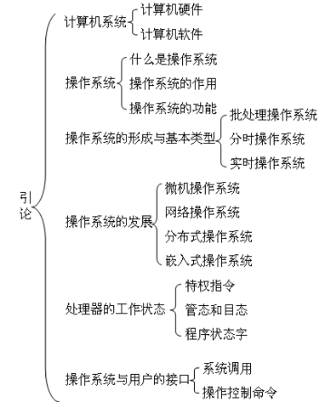

## [**计算机信息管理专业课程**](https://github.com/Eished/self-study-exam_notes)

**最新自考笔记** : https://github.com/Eished/self-study-exam_notes

# 大纲(02323)

## 题型

1. 单项选择题
   - 20题x1分
2. 填空题
   - 10题x2分
3. 简答题
   - 5题x4分
4. 综合题
   - 4题x10分

# 第一章 操作系统简介

本章主要内容：

1. 计算机系统的概念
2. 操作系统的定义、作用和功能
3. 操作系统的分类
4. 管态、目态、特权指令、访管指令的概念
5. 操作系统与用户的两个接口

重点：

1. 操作系统的功能、分类
2. 处理器的工作状态
3. 程序状态字
4. 系统功能调用

本章考试分值约为8~10分，出题形式多以单选题、多选题、填空题为主。

## 第一节 什么是操作系统

1. 用户与硬件之间的接口
   1. 操作系统概念：操作系统是一种复杂的系统软件，是不同程序代码、数据结构、初始化文件的集合，可执行。
   2. 操作系统是提供计算机用户与计算机硬件之间的接口，并管理计算机软件和硬件资源，并且通过这个接口使应用程序的开发变得简单、高效接口是两个不同部分的交接面。接口分为硬件接口和软件接口，计算机的所有功能最终都是由硬件的操作来实现的，计算机屏蔽了对硬件操作的细节。
   3. 操作系统完成的两个目标：
      1. 与硬件相互作用，为包含在所有硬件平台上的所有底层可编程部件提供服务
      2. 为运行在计算机系统上的应用程序（即用户程序）提供执行环境

2. 资源管理者

   现代计算机特点是支持多任务，一方面保证用户程序的顺利执行，另一方面使计算机系统资源得到高效的利用，保证计算机系统的高性能操作系统的功能：

   1. 处理机管理
   2. 内存管理
   3. 设备管理
   4. 文件管理

## 第二节 操作系统的发展

- 无操作系统一单道批处理系统一多道批处理系统一微机操作系一实时操作系统
  - 无操作系统阶段：电子管，无存储设备，第一台：1946年宾夕法尼亚大学的「埃尼阿克」
  - 单道批处理系统：晶体管，磁性存储设备，内存中有一道批处理作业，计算机资源被用户作业独占
  - 吞吐量是指单位时间内计算机系统处理的作业量
  - 多道程序系统：集成电路芯片，出现了分时操作系统（多个终端）
  - 微机操作系统：第一台 Intel 公司顾问 GaryKildall 编写的`CP/M`系统，是一台磁盘操作系统，用于 Inte8080 
  - 实时操作系统：广泛应用于各种工业现场的自动控制、海底探测、智能机器人和航空航天等。
- 批处理、实时、分时系统的优缺点比较：
  - 单道批处理系统：**自动性**、**顺序性**、**单道性**。
    - 优点：减少了等待人工操作的时间
    - 缺点：CPU资源不能得到有效的利用。
  - 多道批处理系统：多道性、**无序性**、调度性、**复杂性**。
    - 优点：能够使 CPU 和内存 IO资源得到充分利用，提高系统的吞吐量。
    - 缺点：系统平均周转时间长，缺乏交互能力
  - 分时系统：多路性、**及时性**、**交互性**、独立性。
    - 优点：提供了人机交互，可以使用户通过不同终端分享主机。
    - 缺点：不能及时接收及时处理用户命令。
  - 实时操作系统（用户实时控制和实时信息处理）：多路性、独立性、及时性、交互性、**可靠性**。
    - 在实时系统中，往往采取多级容错措施来保证系统安全和数据安全
- 操作系统产品：
  1. 主机操作系统（批处理、事务处理（银行支票处理或航班预订）、分时处理），
  2. 微机操作系统，
  3. 服务器操作系统、
  4. 嵌入式操作系统（物联网操作系统）

## 第三节 操作系统的特征

- 操作系统特征：
  - **并发**（多个事件在同一时间间隔内同时发生）
  - 共享
  - 虚拟
  - 异步

## 第四节 操作系统的功能

- 内存管理：
  - 任务是为多道程序的运行提供良好的运行环境，方便用户使用内存，提高内存利用率，以及从逻辑上扩充内存实现虚拟存储。
  - **内存分配**
    1. 用于内存分配数据结构。用来记录内存使用状况，如内存空闲区域的大小、空闲区域的起始地址等，为内存分配的实现提供依据
    2. 内存分配功能。系统按照一定的内存分配算法分配内存空间。
    3. 内存回收功能。系统需要回收被释放的内存空间
  - **内存保护**
  - **地址映射**
    - 逻辑地址与物理地址
    - 地址映射，将逻辑地址转换为对应的物理地址
  - **内存扩充**（借助与虚拟存储技术）
    - 请求调入功能。
    - 置换功能。
- 进程管理
- 文件管理：
  - 存储空间的管理
  - 目录管理
  - 文件的读写管理和存取控制
- 设备管理
  1. 缓冲管理。管理各种缓冲区。
  2. 设备分配。分配用户 IO所需要的设备。
  3. 设备处理。由设备驱动程序来实现CPU与设备控制器之间的通信
  4. 设备独立性和虚拟设备。设备独立性功能使应用程序独立于物理设备。
- 提供用户接口：
  - 命令接口
    - 联机用户接口
    - 脱机用户接口
  - 图形用户接口
  - 程序接口

## 第五节 操作系统的体系结构

- 操作系统体系结构的分析
  1. 简单的监控程序模型
  2. 单体结构模型
  3. 层次结构模型
  4. 客户/服务器模型与微内核结构
  5. 动态可扩展结构模型
- 单体内核是操作系统中最早、最常见的体系结构（ `UNIX/MS-DOS/LinUX/MAC OS X/BSD`）
- 层次结构最经典的例子 Dijkstra 的 THE 系统

## 第六节 指令的执行

- 指令的执行：
  - 程序是指令的集合，程序的执行就是按照某种控制流执行指令的过程。
  - 一个单一指令需要的处理称为指令周期，包括取指周期和执行周期
    1. 处理器与存储器之间的指令或数据传送操作。
    2. 处理器与O设备之间的指令或数据传送操作。
    3. 算术运算操作或逻辑运算操作。
    4. 控制操作，即修改指令的执行顺序的操作。

# 第二章 进程管理

## 第一节 进程的描述

## 第二节 进程的控制

## 第三节 操作系统的内核

## 第四节 进程同步

## 第五节 进程通信

## 第六节 线程

# 第三章 进程调度与死锁

## 第一节 进程调度的功能与时机

## 第二节 进程调度算法

## 第三节 实时系统中的调度

## 第四节 进程切换

## 第五节 多处理器调度

## 第六节 死锁

# 第四章 内存管理

## 第一节 储存器的层次结构

## 第二节 程序的链接和装入

## 第三节 连续分配储存管理方式

## 第四节 基本分页储存管理方式

## 第五节 基于分页的虚拟储存系统

## 第六节 分段储存管理

## 第七节 Linux 的伙伴系统

# 第五章 文件系统

## 第一节 文件

## 第二节 目录

## 第三节 文件系统的实现

# 第六章 I/O 设备管理

## 第一节 I/O 系统的组成

## 第二节 I/O 控制方式

## 第三节 缓冲管理

## 第四节 设备分配

## 第五节 I/O 软件管理

## 第六节 磁盘管理

