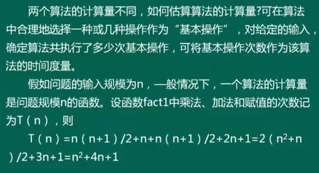
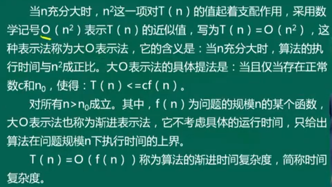
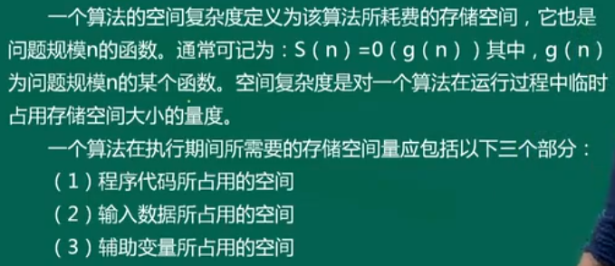

# 大纲


## 题型


## 考纲


> **计算机信息管理专业课程**
>
> 自考笔记在线更新地址 : https://github.com/Eished/self-study-exam_notes


# 第一章 概论

本章重点：数据结构、数据逻辑结构、数据储存结构及运算

难点必考：**算法时间复杂度分析。**

## 1.1 引言

- 计算机处理问题的一般步骤：

  1. 从具体的问题**抽象**出一个适当的**数学模型**；
  2. 设计一个**求解**该数学模型的**算法**；
  3. 用某种计算机语言**编写**实现该算法的**程序**，调试和运行程序直至最终得到问题的解答。

  **算法 + 数据结构 = 程序**

  

## 1.2 基本概念和术语

### 1.2.1 数据、数据元素和数据项

- **数据**：

  - 所有被计算机储存、处理的对象。数值、布尔值等扩展到字符串、表格、图像甚至声音等。

- **数据元素**（元素）：

  - 数据的基本单位，在程序中作为一个整体加以考虑和处理。

- **数据项**：

  - 一般情况下，数据元素由数据项组成。在数据库中数据项又称为**字段**或**域**。它是数据的不可分割的最小单位。

  

### 1.2.2 数据的逻辑结构

- 数据元素之间的逻辑关系。逻辑关系指数据元素之间的关联方式或“邻接关系”。
- 四种基本的逻辑结构：
  - 集合：无邻接关系
  - 线性结构：一对一
  - 树形结构：一对多
  - 图结构：多对多


### 1.2.3 数据的储存结构

- 数据的逻辑结构在计算中的实现称为数据的储存结构（或物理结构）。包括：
  1. 储存数据元素；
  2. 数据之间的关联方式。
- 主要储存方式：
  - 顺序存储：所有存储结点放在一个连续的储存区里。利用结点在存储器中的相对位置来表示数据元素之间的逻辑关系。
  - 链式存储：每个存储结点除了含有数据元素外，还包含指针，每个指针指向一个与本节点有逻辑关系的结点，用指针表示数据之间的逻辑关系。
  - 索引存储；
  - 散列存储。


### 1.2.4 运算

- 增 删 改 查


## 1.3 算法及描述

- C 语言描述算法

  1. 函数描述形式： func()
  2. 输入、输出语句
     - 输入： scanf
     - 输出：printf
  3. 赋值语句 =
  4. 选择语句
     1. 条件语句： if
     2. 分支语句： switch
  5. 循环语句： for 、do while、while
  6. 结束语句： return(表达式)、 break、 exit(异常代码)
  7. 出错语句：error(“错误描述”)
  8. 注释
     1. 单行注释：`// 注释内容`
     2. 多行注释：`/* 注释内容 */`

  

## 1.4 算法分析

- 正确性：能用
- 易读性：修改
- 健壮性：稳定
- 时空性：性能

### 1.4.1 时间复杂度（重要）

- 例【1-4】编制函数求 $1!+2!+...+n!$

  - ```C++
    int fact1(int n)
    {
      int i, j, temp, s;
      s = 0;
      for (i = 1; i <= n; i++)
      {
        temp = 1;
        for (j = 1; j <= 1; j++)
        {
          temp = temp * j;
        }
        s = s + temp;
      }
      return s;
    }
    
    int fact2(int n)
    {
      int i, temp, s;
      s = 0;
      temp = 1;
      for (i = 1; i <= n; i++)
      {
        temp = temp * i;
        s = s + temp;
      }
      return s;
    }
    ```

- 两种算法的计算量不同，如何估算计算量？

  - $T(n)=O(f(n))$ 称为算法的渐进时间复杂度，简称时间复杂度。

  

  

  

- 常见的时间复杂度有和从小到大的顺序：

  1. 常数阶 $O(1)$ 
  2. 对数阶 $O(log_2n)$ 
  3. 线性阶 $O(n)$
  4. 多项式阶 $O(n^2)$ 和 $O(n^3)$
  5. 指数阶 $O(2^n)$
     - 指数阶过大，实际不可计算
     - 低于平方阶是高效的

  最坏时间复杂度（常用）、平均时间复杂度、最好时间复杂度


### 1.4.2 空间复杂度




# 第二章 线性表

本章重点：线性表概念和基本特征；线性表的基本运算；顺序表和单链表的组织方法和算法设计。

难点必考：**单链表上的算法设计。**

## 2.1 线性表的基本概念

## 2.2 线性表的顺序储存

### 2.2.1 线性表顺序储存的类型定义

### 2.2.2 线性表的基本运算在顺序表上的实现

### 2.2.1 顺序表实现算法的分析


## 2.3 线性表的连接储存

### 2.3.1 单链表的类型定义

### 2.3.2 线性表的基本运算在单链表上的实现


## 2.4 其它运算在单链表上的表现

### 2.4.1 建表

### 2.4.2 删除重复节点


## 2.5 其它链表

### 2.5.1 循环链表

### 2.5.2 双向循环链表


## 2.6 顺序实现与链接实现的比较

## 2.7 小结


# 第三章 栈/队列和数组

本章重点：栈和队列的特征；顺序栈和链栈上基本运算的实现和简单算法；顺序队列和链队列上基本运算的实现和简单算法。

难点必考：**循环队列的组织，队列满和队列空的条件及循环队列基本运算的算法。**

## 3.1 栈

### 3.1.1 栈的基本概念

### 3.1.2 栈的顺序实现

### 3.1.3 栈的链接实现

### 3.1.4 栈的简单应用和递归


## 3.2 队列

### 3.2.1 队列的基本概念

### 3.2.1 队列的顺序实现

### 3.2.1 队列的链接实现

### 3.2.1 队列应用


## 3.3 数组

### 3.3.1 数组的逻辑结构和基本运算

### 3.3.1 数组的储存结构

### 3.3.1 矩阵的压缩储存


## 3..4 应用举例

## 3.5 小结


# 第四章 树和二叉树

本章重点：树形结构的概念；二叉树的定义、储存结构和遍历算法。

**难点必考：二叉树的遍历算法和哈夫曼树构造算法。**

## 4.1 树的基本概念

### 4.1.1 树的基本概念

### 4.1.2 树的相关术语


## 4.2 二叉树

### 4.2.1 二叉树的基本概念

### 4.2.2 二叉树的性质


## 4.3 二叉树的储存结构

### 4.3.1 二叉树的顺序储存结构

### 4.3.2 二叉树的链式储存结构


## 4.4 二叉树的遍历

### 4.4.1 二叉树遍历的递归实现

### 4.4.2 二叉树的层次遍历

### 4.4.3 二叉树遍历的非递归实现

### 4.4.4 应用举例


## 4.5 树和森林

### 4.5.1 树的储存结构

### 4.5.2 树、森林与二叉树的关系

### 4.5.3 树和森林的遍历


## 4.6 判定树和哈夫曼树

### 4.6.1 分类与判定树

### 4.6.2 哈夫曼（Huffman）树与哈夫曼算法

### 4.6.3 哈夫曼编码


## 4.7 小结


# 第五章 图

本章重点：图的邻接矩阵和邻接表两种储存结构，图的深度优先和广度优先搜索算法。

**难点必考：求最小生成树的 Prim 算法；求单源最短路径；求拓扑排序算法。**

## 5.1 图的基本概念

### 5.1.1 图的应用背景

### 5.1.2 图的定义和术语


## 5.2 图的储存结构

### 5.2.1 邻接矩阵

### 5.2.1 邻接表


## 5.3 图的遍历

### 5.3.1 连通图的深度优先搜索

### 5.3.2 连通图的广度优先搜索

### 5.3.3 应用举例


## 5.4 图的应用

### 5.4.1 最小生成树

### 5.4.2 拓扑排序


## 5.5 小结


# 第六章 查找

本章重点：二分查找方法；二叉树的查找方法；散列表的查找方法。

难点必考：**二叉树的插入算法。**

## 6.1 基本概念

## 6.2 静态查找表

### 6.2.1 顺序表上的查找

### 6.2.2 有序表上的查找

### 6.2.3 索引顺序表上的查找


## 6.3 二叉排序树


## 6.4 散列表

### 6.4.1 常用散列法

### 6.4.2 散列表的实现

### 6.4.3 散列表的基本操作算法


## 6.5 小结


# 第七章 排序

本章重点：直接插入排序算法、冒泡排序算法、快速排序算法，直接选择排序算法、堆排序算法、二路归并排序算法。

难点必考：**快速排序算法和堆排序算法。**

## 7.1 概述


## 7.2 插入排序


## 7.3 交换排序

### 7.3.1 冒泡排序

### 7.3.2 快速排序


## 7.4 选择排序

### 7.4.1 直接选择排序

### 7.4.2 堆排序


## 7.5 归并排序

### 7.5.1 有序序列的合并

### 7.5.2 二路归并排序


## 7.6 小结