# 大纲


## 题型

### 数据结构导论 02142

1. 单项选择题
   - 15题x2分=30分
2. 填空题
   - 13题x2分=26分
3. 应用题
   - 5题x6分=30分
4. 算法设计题
   - 2题x7分=14分

### 数据结构 02331

1. 单项选择题
   - 15题x2分=30分
2. 填空题
   - 10题x2分=20分
3. 解答题
   - 4题x5分=20分
4. 算法阅读题
   - 4题x5分=20分
5. 算法设计题
   - 1题x10分=10分

## 考纲


## [**计算机信息管理专业课程**](https://github.com/Eished/self-study-exam_notes)

**最新自考笔记** : https://github.com/Eished/self-study-exam_notes


# 第一章 概论

本章重点：数据结构、数据逻辑结构、数据储存结构及运算

难点必考：**算法时间复杂度分析。**

## 1.1 引言

- 计算机处理问题的一般步骤：

  1. 从具体的问题**抽象**出一个适当的**数学模型**; 
  2. 设计一个**求解**该数学模型的**算法**; 
  3. 用某种计算机语言**编写**实现该算法的**程序**, 调试和运行程序直至最终得到问题的解答。

  **算法(操作) + 数据结构(逻辑+储存) = 程序**

  

## 1.2 基本概念和术语

### 1.2.1 数据、数据元素和数据项

- **数据** (data) ：

  - 所有被计算机储存、处理的对象。数值、布尔值等扩展到字符串、表格、图像甚至声音等。

- **数据元素** (data element) ：

  - 数据的基本单位, 在程序中作为一个整体加以考虑和处理。

- **数据项** (data item) ：

  - 一般情况下, 数据元素由数据项组成。在数据库中数据项又称为**字段**或**域**。它是数据的不可分割的**最小单位**。

- 数据对象 (Data Object) ：

  - 相同特性**数据元素**的集合, 是数据的子集。

- 数据结构(Data Structure)：

  - 是相互之间存在一种或多种特定**关系**的**数据元素**的集合。

  

### 1.2.2 数据的逻辑结构

- 逻辑结构：数据元素之间的逻辑关系。
  - 数据元素间抽象化的相互关系, 与数据的存储无关, 独立于计算机, 它是从具体问题抽象出来的数学模型。
- 四种基本的逻辑结构：
  - 集合：没有关系
  - 线性结构：一对一
  - 树形结构：一对多
  - 图结构：多对多


### 1.2.3 数据的储存结构

- 数据元素及其关系在计算机存储器中的存储方式。
- 主要储存方式：
  - **顺序存储**：借助元素在存储器中的相对位置来表示数据元素间的逻辑关系
  - **链式存储**：借助指示元素存储地址的**指针**表示数据元素间的逻辑关系
  - 索引存储：字典中单词存储关系
  - 散列存储：地址与散列函数之间建立的一种映射 (哈希) 


### 1.2.4 运算

- 建 增 删 改 查


## 1.3 算法及描述

### 1.3.1 C 语言描述算法

1. 函数描述形式： `func()`
2. 输入、输出语句
   - 输入： `scanf()`
   - 输出：`printf()`
3. 赋值语句 =
4. 选择语句
   1. 条件语句： `if(){}`
   2. 分支语句： `switch{}`
5. 循环语句： `for 、do while、while`
6. 结束语句： `return(表达式)、 break、 exit(异常代码)`
7. 出错语句：`error(“错误描述”)`
8. 注释
   1. 单行注释：`// 注释内容`
   2. 多行注释：`/* 注释内容 */`

### 附带基础知识：

- 数据类型：定义:在一种程序设计语言中, 变量所具有的数据种类

  - C语言:
    - 基本数据类型: `char int float double void`
    - 构造数据类型: 数组、结构体、共用体、文件
    - 数据类型是一组性质相同的值的集合, 以及定 义于这个集合上的一组运算的总称

- 抽象数据类型

  - 抽象数据类型(`ADTs: AbstractData Types`)

  - 更高层次的数据抽象

  - 由用户定义, 用以表示应用问题的数据模型

  - 由基本的数据类型组成, 并包括 一组相关的操作

    说明:抽象数据类型的表示与实现

    - 抽象数据类型可以用以下的三元组来表示:.
      `ADT= (D, S, P)`
      - 数据对象
      - D上的关系集
      - D上的操作集

    - ```C
      ADT抽象数据类型名{
      数据对象: <数据对象的定义>
      数据关系: <数据关系的定义>
      基本操作: <基本操作的定义>
      } ADT抽象数据类型名
      ```

  - 抽象数据类型可以通过固有的数据类型(如整型、实型、字符型等)来表示和实现。
  
- **本课程用到的 C 语言基础：[Linux C语言结构体.md](https://github.com/Eished/self-study-exam_notes)**

- **本笔记使用 C 和 C++ 表示算法, C 代码后面都有 C++ 代码。**


**补充：C 语言的动态分配函数 `<stdlib.h>`**

- `malloc(m)` : **新建** m 字节长度的地址空间, 并返回这段空间的首地址
  - 相当于C++ 中的 `new`
  - **必须强制转换它的类型**
- `sizeof(x)` : 计算变量 x 的**长度**
- `free(p)` : **释放指针** p 所指变量的存储空间,即彻底删除一个变量
  - 相当于C++ 中的 `delete`


**补充：C++ 语言的动态储存分配**

```C
new 类型名T (初值列表)
功能:申请用于存放T类型对象的内存空间, 并依初值列表赋以初值
结果值:
	成功: T类型的指针,指向新分配的内存
	失败:0(NULL)
```

```C
delete 指针P
delete p; 
功能:
	释放指针P所指向的内存。P必须是new操作的返回值
```

- C++ 函数调用时传送给形参表的实参必须与形参在类型、个数、顺序上保持一致。

- 子函数在main函数后时要**提前声明**子函数原型。

- 引用类型作形参的三点说明：

  - 传递引用给函数与传递指针的效果是-样的形参变化实参也发生变化。

  - 引用类型作形参, 在内存中并没有产生实参的副本, 它直接对实参操作; 而一般变量作参数, 形参与实参就占用不同的存储单元, 所以形参变量的值是实参变量的副本。因此, 当参数传递的数据量较大时, 用引用比用一般变传递参数的时间和空间效率都好。

  - 指针参数虽然也能达到与使用引用的效果,但在被调函数中需要重复使用“`*指针变量名`”的形式进行运算, 这很容易产生错误且程序的阅读性较差;另一方面在主调函数的调用点处,必须用变量的地址作为实参。

    **传数组等同于传数组的地址, 要修改元素就传引用, 不用修改传形参**


## 1.4 算法分析

算法：一个有穷的指令集, 这些指令为解决某一特定任务规定了一个运算序列

- 正确性：能用
- 易读性：修改
- 健壮性：鲁棒性, 稳定
- 时空性：性能


### 1.4.1 时间复杂度 (重要) 

- 事前分析：一个高级语言程序在计算机上运行所消耗的时间取决于:

  - ①依据的算法选用何种策略
    ②问题的规模
    ③程序语言
    ④编译程序产生机器代码质量
    ⑤机器执行指令速度

  

- $T(n)=O(f(n))$ 称为算法的渐进时间复杂度, 简称时间复杂度。

- 时间复杂度的表示方法有两种:

  - 方法1:
    - 大O法: $T(n)=O(f(n))$
    - 它表示随问题规模`n`的增大, 算法执行时间的增长率和`f (n)`的增长率相同, 称作算法的渐进时间复杂度, 简称时间复杂度。
  - 方法2: 语句频度法
    - 计算该语句重复执行的次数, 又叫频度统计法。
      说明:
    - 数学符号“O”的定义为:
    - 若  $T (n)$ 和 $f(n)$ 是定义在正整数集合上的两个函数, 则$T(n) =O (f(n) )$ 表示存在正的常数 $C$ 和 $n_o$ , 使得当 $n\geq n_0$ 时都满足 $O≤T (n)≤Cf (n)$。

  

- 示例：$n*n$ 矩阵加法

  - ```C
    for ( i=0;i<n; i++)
    for ( j=0;j<n;j++)
    c[i][j] = a[i][j] + b[i][j];
    ```

  - 语句的频度(Frequency Count ) :重复执行的次数:

  - $n*n->T (n) =O (n^2)$

  - 即: 矩阵加法的运算量和问题的规模n的平方是同一个量级

- 分析算法时间复杂度的基本方法

  - 找出语句频度最大的那条语句作为基本语句

  - 计算基本语句的频度得到问题规模 n 的某个函数 f (n), 取其数量级用符号“O”表示

    - ```C
      for ( inti=0;i<n;i++ )
      for ( intj=0;j<n;j++ )
      y++;
      ```

    - $f (n) =n^2->T (n) =O (n^2)$

  - **时间复杂度是由嵌套最深层语句的频度决定的**

  

- **常见的时间复杂度** 和 **增长率从慢到快的顺序**：

  1. 常数阶： $O(1)$ 
  2. 对数阶： $O(log_2n)$ 
  3. 线性阶： $O(n)$
  4. n 倍对数阶： $O(nlog_2n)$ 
  5. 多项式阶
     1. 平方阶： $O(n^2)$ 
     2. 立方阶： $O(n^3)$
6. 指数阶： $O(2^n)$
     - (1)当`f (n)` 为对数函数、幂函数、或它们的乘积时, 算法的运行时间是可以接受的, 称这些算法是有效算法; 当`f (n)`为指数函数或阶乘函数时, 算法的运行时间是不可接受的, 称这些算法是无效的算法。
     - (2)随着n值的增大, 增长速度各不相同, n足够大时, 存在下列关系:
       对数函数<幂函数<指数函数

  最坏时间复杂度 (常用) 、平均时间复杂度、最好时间复杂度


### 1.4.2 空间复杂度

- 一个算法的空间复杂度定义为该算法所耗费的存储空间

  - **三个部分**：
1. **存储算法本身**所占用的空间
    2. 算法的**输入/输出数据**占用的空间
    3. 算法在运行过程中**临时占用的辅助空间**
    
- 原地工作: 若辅助空间相对于输入数据量是常数, 则称此算法是原地工作。
    说明: 若所占空间量依赖于特定的输入, 按最坏情况来分析
- 它也是问题规模 n 的函数。通常可记为：$S(n)=O(g(n)$其中, $g (n) $为问题规模 n 的某个函数。空间复杂度是对一个算法在运行过程中临时占用存储空间大小的量度。


##  1.5 考核的知识点与考核要求 

　　1.数据结构、数据、数据元素和数据项的概念
　　识记：数据结构; 数据; 数据元素; 数据项。
　　领会：数据结构的作用; 数据、数据元素、数据项三者关系。
　　2.数据逻辑结构和数据存储结构
　　识记：数据逻辑结构、数据存储结构。
　　领会：四类基本逻辑结构的特点; 顺序存储结构; 链式存储结构; 逻辑结构与存储结构的关系。
　　3.运算、算法和算法分析
　　识记：运算; 基本运算; 算法分析; 时间复杂度; 空间复杂度。
　　领会：运算与数据结构的关系; 算法的描述方法; 算法的评价因素; 时间复杂度分析方法; 空间复杂度分析方法。
　　简单应用：运用类C语言描述算法; 简单算法时间复杂度分析; 简单算法的空间复杂度分析。

　　四、本章重点、难点
　　本章重点：数据结构、数据逻辑结构、数据存储结构以及运算等概念。
　　本章难点：算法时间复杂度分析。


# 第二章 线性表 (重要) 

**本章重点：线性表概念和基本特征; 线性表的基本运算; 顺序表和单链表的组织方法和算法设计。**

**难点必考：单链表上的算法设计。**


## 2.1 线性表的基本概念

- 线性：
  - 有且仅有一个开始和一个终端结点, 并且所有结点都最多只有一个直接前趋和一个后继。
  - 线性表、堆栈、队列、字符串、数组。
- 非线性：
  - 一个结点可能有多个直接前趋和直接后继。
  - 树、图。
- 线性表基本运算有：初始化、求表长、读表元素、定位、插入、删除。

- 线性表的定义: 用数据元素的有限序列表示
- 


## 2.2 线性表的顺序储存

### 2.2.1 线性表顺序储存的类型定义

- 线性表的顺序存储：**逻辑结构相邻的结点其存储位置也相邻**。

  - 用顺序存储实现的线性表称为顺序表, 一般用数组来表示顺序表, 如图2-1所示

  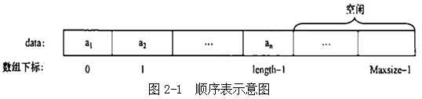

  - **顺序表的类型定义**

  - ```C++
    #define MAXSIZE 100
    //最大长度
    typedef struct {
      ElemType *elem; /指向 数据元素的基地址
        int length;
      //线性表的当前长度
    }SqList;
    ```

  - 以图书表的顺序存储结构类型为例:

  - ```C++
    #define MAXSIZE 10000 //图书表可能达到的最大长度
    typedef struct //图书信息定义
    {
      char no[20]; //图书ISBN
      char name[50]; //图书名字
      float price; //图书价格
    } Book;
    typedef struct
      Book *elem; //存储空间的基地址
    int length; //图书表中当前图书个数
    }SqList; //图书表的顺序存储结构类型为SqList
    ```


### 2.2.2 线性表的基本运算在顺序表上的实现

- 顺序表的**插入**运算`InsertSeqlist (SeqList L,DataType x,int i`) 是指在顺序表的第`i (1<=i<=n+1) `个元素之前, 插入一个新元素x。使长度为n的线性表` (a1, a2, ..., ai-1, a i, ..., an`) 变为长度为n+1的线性表` (a1, a2, ..., ai-1, x, a i, ..., an) ` 。

  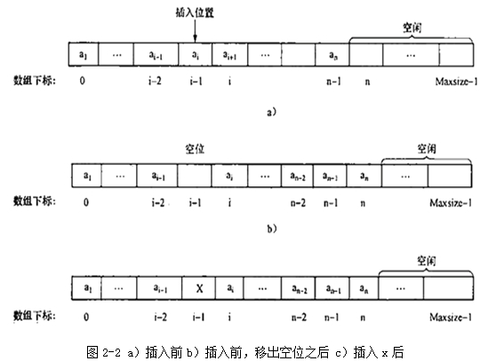

  具体算法描述如下：

  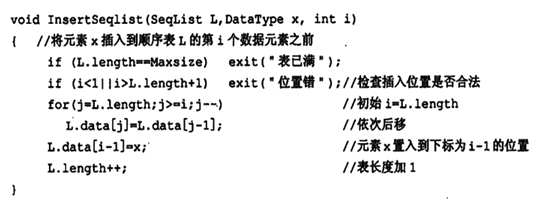


- **删除**运算`DeleteSeqlist (SeqList L, int i` ) 是指将线性表的第 `i (1<=i<=n) `个数据元素删去, 使长度为n的线性表` (a1, a2, ... , ai-1,  ai, ai+1, ..., an) `变为长度为`n-1`的线性表 (a1, a2, ... , ai-1,  ai+1, ..., an)  。

  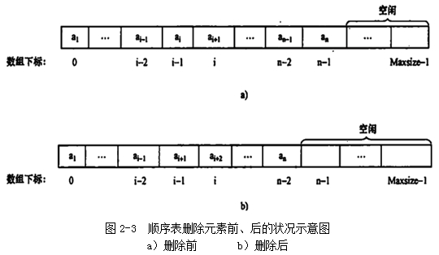

  具体算法描述如下：

  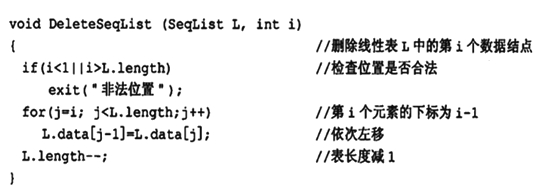


- **定位**运算`LocateSeqlist (SeqList L,DataType x) `的功能是查找出线性表L中值等于x的结点序号的最小值, 当找不到值为x的结点时, 返回结果0。下列算法从左往右扫描顺序表中的元素, 考察元素的值是否等于X, 描述算法如下：

  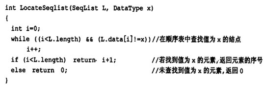


### 2.2.3 顺序表实现算法的分析

- 插入：O(n)
- 删除：O(n)
- 定位：O(n)

- **线性表的重要基本操作** (C++)

  1. **初始化**

     1. 初始化线性表L (参数用引用)

        - ```C++
          Status InitList_ Sq (SqList &L) {
            //构造一个空的顺序表L
            L.elem-new ElemType[MAXSIZE];
            I/为顺序表分配空间.
              if (!L.elem) exit (OVERFLOW) ; //存储分配失败
            L.length=0; //空表长度为0
            return OK;
          }
          ```

          

     2. 初始化线性表L ( 参数用指针)

        - ```C++
          Status InitList_ Sq (SqList*L) { //构造 一个空的顺序表L
            L-> elem-new ElemType[MAXSIZE];
            //为顺序表分配空间
            if (!L-> elem) exit (OVERFLOW) ; //存储分配失败
            L-> length=0;
            //空表长度为0
            return OK;
          }
          ```

          

        补充:几个简单基本操作的算法实现

        1. 销毁线性表L

           - ```C++
             void DestroyList ( SqList &L)
             {
             if (L.elem) delete[]L.elem; //释放存储空间
             }
             ```

             

        2. 清空线性表L

           - ```C++
             void ClearList ( SqList &L)
             {
             L.length=0;
             //将线性表的长度置为0
             }
             ```

             

        3. 求线性表L的长度

           - ```C++
             int GetLength (SqList L)
               retur (L.length);
             }
             ```

             

        4. 判断线性表L是否为空

           - ```C++
             判断线性表L是否为空
             int IsEmpty (SqList L)
             {
               if (L.length==0) retur 1;
               else return 0;
             }
             ```

             

  2. **取值** (根据位置i获取相应位置数据元素的内容)

     1. 获取线性表L中的某个数据元素的内容

        - ```C++
          int GetElem (SqListL,  int i, ElemType &e)
          {
            if (i<l|ji>L.length) return ERROR;
            //判断i值是否合理, 若不合理, 返回ERROR
            e=L.elem[i-1;//第i-1的单元存储着第i个数据
            return OK;
          }
          ```

          

  3. **查找**

     1. 查找(根据指定数据获取数据所在的位置)
        顺序查找图示

        效率为 O(n)

     2. 在线性表L中查找值为e的数据元素

        - ```C++
          int LocateELem (SqList L, ElemType e)
          {
            for (i=0;i< L.length;i++)
              if (L.elem[j]==e)
                return i+1;
            return 0;
          }
          ```

          

  4. **插入** (插在第i个结点之前)

     1. [算法步骤]

        1. 判断插入位置i是否合法。
        2. 判断顺序表的存储空间是否已满。
        3. 将第n至第i位的元素依次向后移动一个位置, 空出第i个位置。
        4. 将要插入的新元素e放入第i个位置。
        5. 表长加1 
        6. 插入成功返回OK.

     2. 在线性表L中第i个数据元素之前插入数据元素e 

        - `平均移动次数=n/2`

        - ```C++
          Status ListInsert_ Sq (SqList&L,  inti , ElemTypee) {
            if (i<1 |i>L.length+1) return ERROR; /i 值不合法
              if (L.length-=MAXSIZE) return ERROR; //当 前存储空间已满
            for (j=L.length-1j>=i-1j-)
              L.elem[j+ l]=L.elem[j];
            //插入位置及之后的元素后移
            L.elem[i-1]=e; .
              //将新元素e放入第i个位置
              ++L.length; .
                //表长增1
            return OK;
          }
          ```

          

        - [算法分析]

          1. 算法时间主要耗费在移动元素的操作上
          2. 若插入在尾结点之后, 则根本无需移动(特别快) 
          3. 若插入在首结点之前, 则表中元素全部后移(特别慢)
          4. 考虑在各种位置插入(共 n+1 种可能)的**平均移动次数**: $\displaystyle \frac{n}{2}$

  5. **删除** (删除第i个结点)

     1. 将线性表L中第i个数据元素删除

        - ```C++
          Status ListDelete_ Sq (SqList &L, inti) {
            if ( (i<I) II (i>L.length) ) returm ERROR; /i值不合法
              for (j=i;j<=L.length-1:j++)
                L.elem[j-1]=L.elem[j]; /被删除 元素之后的元素前移
                --L.length;
            //表长减1
            return OK;
          }
          ```

          

        - [算法分析]

          1. 算法时间主要耗费在移动元素的操作上
          2. 若删除尾结点, 则根本无需移动(特别快) ;
          3. 若删除首结点, 则表中n-1个元素全部前移(特别慢)

        - $\displaystyle 平均移动次数= \frac{n-1}{2}$
        - 查找 \ 插入 \ 删除的平均时间复杂度为 $O(n)$
        - 空间复杂度 $S(n)=O(1)$


## 2.3 线性表的链接储存

### 2.3.1 单链表的类型定义

- 线性表的链接存储是指它的存储结构是链式的。结点在存储器中的位置是任意的, 即**逻辑上相邻的数据元素在物理上不一定相邻**。

  - 单链表（一个指针）、双链表（两个指针）、循环链表（收尾相连）、双向循环链表（双指针首尾相连）
  - 链表：n个结点由指针链组成一个链表。它是线性表的链式存储映像, 称为线性表的链式存储结构

- 单链表的结点：**数据元素**和**指针**
  　　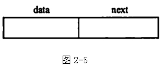

- 如图所示, data部分称为**数据域**, 用于存储线性表的一个数据元素, next部分称为**指针域**或链域, 用于存放一个指针, 该指针指向本结点所含数据元素的直接后继结点。

  非空的单链表和空单链表, 如图所示
  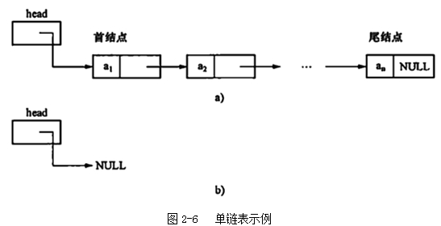

  

- **单链表的类型定义如下**：

    ```C
    Typedef　struct Node
    　　{ 
    　　ElemType data;  //数据域
    　　struct Node *next;  //指针域
    　　}Node, *LinkList; // *LinkList 为 Node类型指针
    Node *p; // 生成node 类型指针
    ```

    

- 为了便于运算实现, 在单链表的第一个结点之前增设一个类型相同的结点, 称之为头结点, 其他结点称为表结点。

    　　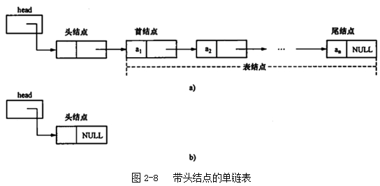
    　　a) 带头结点的非空单链表 b) 带头结点的空单链表

- 在链表中设置头结点有什么好处?

  - 第一: 便于首元结点的处理

    首元结点的地址保存在头结点的指针域中, 所以在链表的第一个位置上的操作和其它位置一致, 无须进行特殊处理;

  - 第二: 便于空表和非空表的统一处理; 无论链表是否为空, 头指针都是指向头结点的非空指针, 因此空表和非空表的处理也就统一了。

  - 可以为空或存信息, 不计入链表长度

  

### 2.3.2 线性表的基本运算在单链表上的实现

- **初始化**的工作是建立一个空表, 空表由一个头指针和一个头结点组成。

  算法描述如下：`next` 指的是下一个结点的地址

  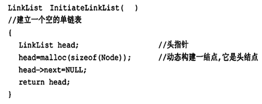

  ```C++
  Status InitList L (LinkList &L)
  {
    L= new LNode;
    L->next=NULL;
    return OK;
  }
  ```

  

- **求表长**
  在单链表存储结构中, 线性表的表长等于单链表中数据元素的结点个数, 即除了头结点以外的结点的个数。图2-9所示为数据域为整数的单链表, 其表长为4。

  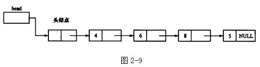

  - 通过结点的指针域来从头至尾访问每一个结点求表长, 让工作指针p通过指针域逐个结点向尾结点移动, 工作指针每向尾部移动一个结点, 让计数器加1。这样, 直到工作指针`p->next=NULL`。
    算法描述如下：
  
    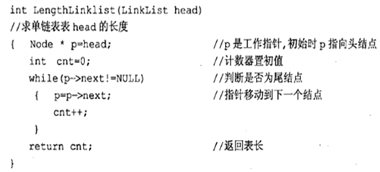
    
    ```C++
    intLstLength_L ( LinkListL) {
      //返回L中数据元素个数
      LinkList p;
      p=L->next;
      i-0;
      while (p) {
        i++;
        p-p->next; }
      return i;
    }
    ```
    
    
  
- **读表元素**
  　　通常给定一个序号i, 查找线性表的第i个元素。从头指针出发, 一直往后移动, 直到第i个结点。

    - 单链表的读表元素算法描述如下：
      　　　　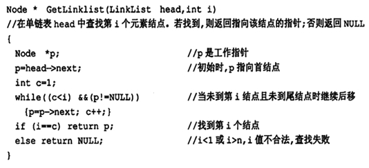

    　　- ```C++
    　　  　　//获取线性表L中的某个数据元素的内容
    　　Status GetElem_L (LinkListL, inti, ElemType &e) {
    　　      p=L->next;j=1; //初始化
    　　        while (p&&j<i) {//向后扫描, 直到p指向第i个元素或p为空
    　　      p-p->next; ++j;
    　　  　　                   }
    　　  　　  if (pllj>i) return ERROR;//第i个元素不存在
    　　  　　    e=p->data; //取第i个元素
    　　  　　      return OK;
    　　  　　}//GetElem_ L
    　　  ```


  　　
- **定位**
  　　线性表的定位运算, 就是对给定表元素的值, 找出这个元素的位置。从头至尾访问链表, 直至找到需要的结点, 返回其序号。若未找到, 返回0。

    - 定位运算算法描述如下：
      　　　　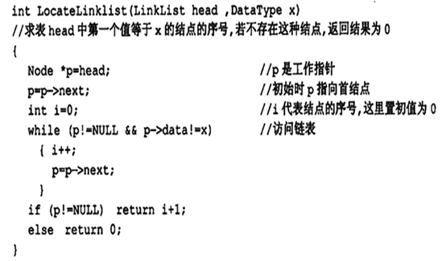

    　　- ```C++
    　　  　　//在线性表L中查找值为e的数据元素
    　　LNode *LocateELem_L (LinkList L, Elemtype e) {
    　　      //返回L中值为e的数据元素的地址, 查找失败返回NULL
    　　      p=L->next;
    　　    while (p &&p->data!=e)
    　　  　　      p-p->next;
    　　  　　  return p;
    　　  　　}
    　　  ```


  　　
- **插入**
  　　单链表的插入运算是将给定值为x的元素插入到链表head的第i个结点之前。插入结点的指针变化如图2-10所示。
    　　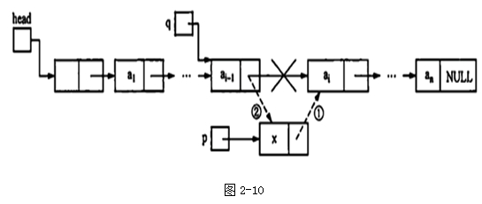

    - 插入算法描述如下：
      　　　　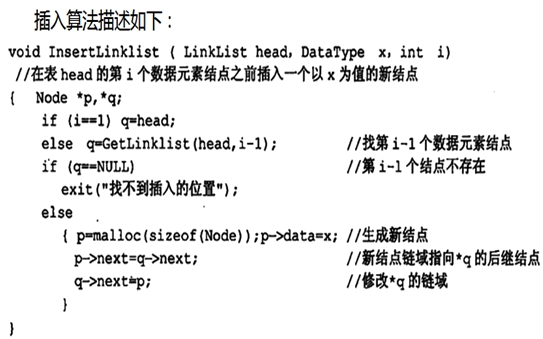
        　　注意：`p->next=q->next`和`q->next=p`两条语句的执行顺序不能颠倒, 链不能断。

    　　- ```C++
    　　  　　//在L中第i个元素之前插入数据元素e
    　　    Status ListInsert_L (LinkList &L, inti, ElemType e) {
    　　  p=L;j=0;
    　　      while (p&&j<i-1) {p=p->next;++j;} //寻找第i-1个结点
    　　      if (!p||j>i-1) return ERROR; //i大于表长+ 1或者小于1
    　　        s=new LNode; //生成新结点s
    　　  s->data=e; //将结点s的数据域置为e“
    　　  　　  s->next=p->next; //将结点s插入L中
    　　  　　  p->next-s;
    　　  　　  return OK;
    　　  　　}//ListInsert_ L
    　　  ```


  　　
- **删除**
  　　删除运算是给定一个值 i, 将链表中第 i个结点从链表中移出, 并修改相关结点的指针域, 以维持剩余结点的链接关系。删除结点的指针变化如图2-11所示。
    　　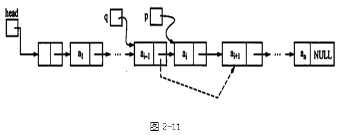

    　　单链表的删除运算算法描述如下：
    　　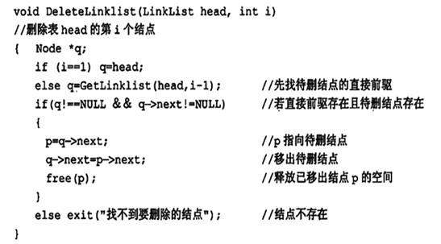
    　　注意, free (p) 是必不可少的, 无用结点需要释放它的空间。
    
    ```C++
    将线性表L中第i个数据元素删除
      Status ListDelete_L (LinkList &L, inti, ElemType &e) {
      p=L;j=0;
      while (p->next &&j<i-1) {//寻找第i个结点, 并令p指向其前驱
        p=p->next; ++j;
                              }
      if (! (p->next) ||j>i-1) return ERROR; //删除位置不合理
        q=p->next; //临时保存被删结点的地址以备释放
      p->next=q->next; //改变删除结点前驱结点的指针域
        e=q->data; //保存删除结点的数据域
          delete q; //释 放删除结点的空间
      return OK;
    } //ListDelete_ L
    ```
    
    

  

## 2.4 其它运算在单链表上的表现

### 2.4.1 建表

- 我们讨论建立含头结点的单链表。
  方法一：**前插法**
  
-  首先建立带头结点的空表; 
  
  - 其次建立一个新结点, 然后将结点连接到头结点之后; 
- 重复后面两个步骤, 直到线性表中所有元素链接到单链表中。
    代码描述如下：
  
    　　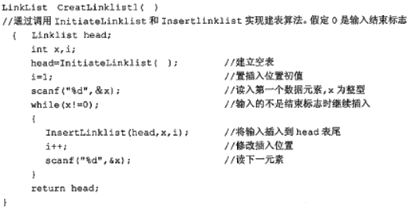
  
  ```C++
  void CreateList_F (LinkList &L, int n) {
    L=new LNode;
    L->next=NULL; //先建立- 一个带头结点的单链表
    for (i=n;i>0;--i) {
      p=new LNode; //生成新结点
      cin>>p->data; /输入元素值
        p->next=L->next; L->next p; /插入到表头
    }//CreateList_ F
  ```
  
  
  
- 方法二：**尾插法** 
  
- 上面的算法由于每次插入都从表头开始查找, 比较浪费时间。因为每次都是把新的结点链接到表尾, 我们可以用一个指针指向尾结点, 这样就为下一个新结点指明了插入位置。
      　　代码描述如下：

    　　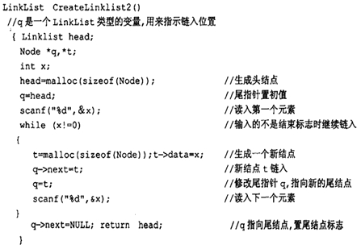
    
```C++
    void CreateList_L (LinkList &L, int n) {
  //正位序输入n个元素的值, 建立带表头结点的单链表L
  　　  L=new LNode;
  　　  L->next=NULL;
  　　  r=L;//尾指针r指向头结点.
  　　  for (i=0;<n;++i) {
  　　    p-new LNode;//生成新结点
  　　    cin>>p->data;//输入元素值
  　　    p->next=NULL; r->next=p;//插入到表尾
  　　    r=P;//r指向新的尾结点
  　　  }
  　　}//CreateList_ L
```

  　　　　方法中的链接操作如图2-12, 它的时间与元素个数成正比, 故其时间复杂度为O (n) 。
  　　　　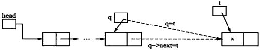
  　　
  　　　　图2-12　建表算法中的表尾链入操作
  　　
- 方法三：**头插法**
  　　
    - 始终将新增加的结点插入到头结点之后, 第一个数据之前。如图2-13所示。
    　　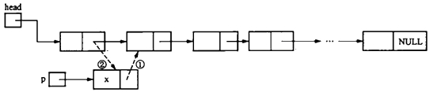
        　　图2-13　建表算法中的在表头链入操作
    
    　　代码描述如下：
    　　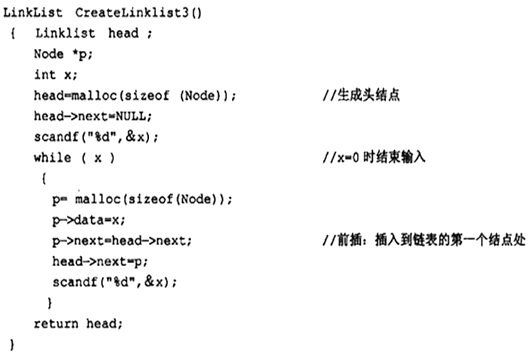

  

### 2.4.2 删除重复节点

- 在线性表中, 可能有多个结点的元素值是相同的, 它们是重复结点。可以设计算法删除重复结点, 只保留结点序号最小的那个结点。例如, 线性表` (4, 7, 2, 5, 2, 4) `, 删除重复结点后结果为` (4, 7, 2, 5) `。
  　　用链表作为存储结构, 细化上述算法得到最后的算法描述：

    　　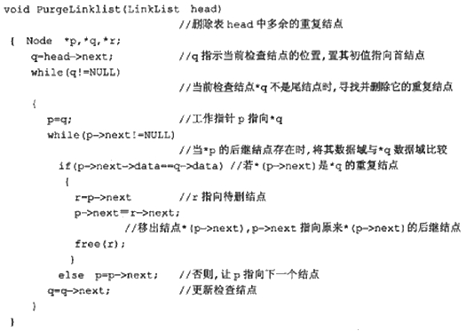

    　　单链表上删除结点时的指针变化如图2-14所示：
    　　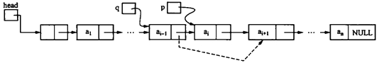
    　　图2-14

  

## 2.5 其它链表

### 2.5.1 循环链表

- 在单链表中, 如果让最后一个结点的指针域指向第一个结点可以构成循环链表。在循环链表中, 从任一结点出发能够扫描整个链表。
  　　图2-15给出常见的循环链表, 图2-15 a、b分别表示带头结点的非空循环链表和空循环链表, 头指针是head。在这种结构下, 要找到尾结点可以从头指针head出发扫描所有的结点。在图2-15 c、d中, 链表没有设头指针, 只设尾指针rear。这样, 首结点表示为：`rear->next->next`,首尾结点都能方便地访问。

    　　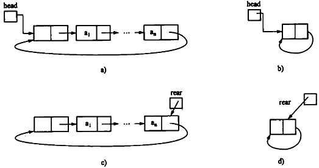
    　　图2-15
    　　a) 带头结点的非空循环链表 
    　　b) 带头结点的空循环链表
    　　c) 设立尾指针的非空循环链表 
    　　d) 设立尾指针的空循环链表

  

### 2.5.2 双向循环链表

- 双向循环链表的结点结构如图2-16所示：
  　　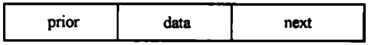
    　　图2-16　双向循环链表结点结构

- 双向循环链表示意图如图2-17所示, `prior`与`next`类型相同, 它指向直接前驱结点。头结点的prior指向最后一个结点, 最后一个结点的`next`指向头结点。
    　　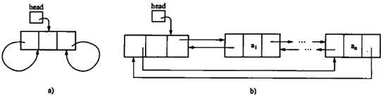
    　　图2-17　双向循环链表示意图
    　　a) 空表　　　　b) 非空表

- 双向循环链表与单链表类似, 用C语言描述如下：

  - ```C
    　　struct dbnode
  { Datatype data;
      	struct dbnode *prior, *next;
    }
  typedef struct dbnode * dbpointer ;
    　　typedef dbpointer DLinkList;
    ```
    
  - 双向循环链表是一种对称结构, 可以用下列等式表示：`p=p->prior->next=p->next->prior`

  - 在单链表中, 找直接后继结点的时间复杂度是O (1) 。在双向循环链表中, 找直接后继结点和前驱结点的时间复杂度都是O (1) 。

- 双向循环链表的求表长、定位、按序查找等运算的实现和单链表基本相同, 这里我们讨论它的插入和删除操作。

  1. .删除
     　　在单链表中删除结点时, 需要用一个指针指向待删结点的前驱结点, 在双循环链表中, 设p指向待删结点, 删除*p可通过下述语句完成, 执行效果如图2-18所示。

     1. `p->prior->next=p->next; ` 　//p前驱结点的后链指向p的后继结点
     2. `p->next->prior=p->prior; ` //p后继结点的前链指向p的前驱结点
     3. `free (p) ; ` //释放*p的空间

     1) 、 (2) 这两个语句的执行顺序可以颠倒。

     　　
     　　图2-18双向循环链表上结点的删除
     　　a) 删除结点*p之前　　　b) 删除结点*p后

  2. 插入
     在`p`所指结点的后面插入一个新结点`*t`, 需要修改四个指针：

     1. `t->prior=p; `
     2. `t->next=p->next; `
     3. `p->next->prior=t; `
     4. `p->next=t; `

     插入操作过程如图2-19所示, 注意这些语句之间的**顺序**, **先连后断**。

     　　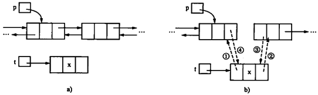
     　　图2-19　双向循环链表上结点的插入
     　　a) 插入前　　　　　　　　　b) 插入后

     

## 2.6 顺序实现与链接实现的比较

- 查找：
  - 对于**按位置查找**运算, 顺序表是**随机存取**, 时间复杂度为 $O (1) $。
  - **单链表**需要对表元素进行扫描**顺序存储**, 它时间为复杂度为 $O (n)$ 。
- 定位：
  - 基本操作是比较, 顺序表和单链表上的实现算法的时间复杂度是相同的, 均为 $O (n) $
- 插入和删除：
  - 在顺序表和链表中, 都需要进行定位。
  - 在顺序表中, 其基本操作是元素的比较和结点的移动, 平均时间复杂度为**O (n)** 。
  - 在单链表中, 由于需要定位, 基本操作是元素的比较, 尽管不需要移动结点, 其平均时间复杂度仍然为**O (n)** 。
- 单链表的每个结点包括数据域与指针域, 指针域需要占用额外空间。
  - 从整体考虑, 顺序表要预分配存储空间, 如果预先分配得过大, 将造成浪费, 若分配得过小, 又将发生上溢; 
  - 单链表不需要预先分配空间, 只要内存空间没有耗尽, 单链表中的结点个数就没有限制。


## 2.7  考核的知识点与考核要求 

　　1.线性表概念
　　识记：线性表概念; 线性表的基本特征。
　　领会：线性表表长; 线性表初始化、求表长、读表元素、定位、插入、删除等基本运算的功能。

　　2.线性表的顺序存储结构—顺序表
　　识记：顺序表表示法、特点和类C语言描述。
　　领会：顺序表的容量; 顺序表表长; 插入、删除和定位运算实现的关键步骤。
　　简单应用：顺序表插入、删除和定位运算的实现算法。
　　综合应用：顺序表上的简单算法; 顺序表实现算法的分析。

　　3.线性表的链式存储结构—单链表
　　识记：结点的结构; 单链表的类C语言描述。领会：头指针; 头结点; 首结点; 尾结点; 空链表; 单链表插入、删除和定位运算的关键步骤。
　　简单应用：单链表插入、删除和定位等基本运算的实现算法。
　　综合应用：用单链表设计解决应用问题的算法。

　　4.循环链表和双向循环链表
　　识记：循环链表的结点结构; 双向循环链表结点结构; 循环链表和双向循环链表类C语言描述。
　　领会：循环链表插入和删除运算的关键步骤; 双向循环链表插入和删除运算的关键步骤。


　　四、本章重点、难点
　　本章重点线性表概念和基本特征; 线性表的基本运算; 顺序表和单链表的组织方法和算法设计。
　　难点：单链表上的算法设计。


# 第三章 栈/队列和数组

本章重点：栈和队列的特征; 顺序栈和链栈上基本运算的实现和简单算法; 顺序队列和链队列上基本运算的实现和简单算法。

难点必考：**循环队列的组织, 队列满和队列空的条件及循环队列基本运算的算法。**

## 3.1 栈

### 3.1.1 栈的基本概念

- 栈 (Stack) 是运算**受限的线性表**, 这种线性表上的插入和删除运算限定在表的某一端进行。

  - 允许进行插入和删除的一端称为**栈顶**, 另一端称为栈底。
  - 不含任何数据元素的栈称为**空栈**。
  - 处于栈顶位置的数据元素称为栈顶元素。

- 栈具有先进后出, 或者后进先出的特征, 例如：在饭店, 服务员洗盘子, 厨师使用盘子, 就类似于栈的元素入栈和出栈的过程。

  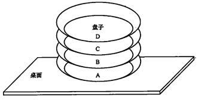

  ​													图3－1

  - 栈的基本运算有：
    1. 初始化 `InitStack (S)` ：构造一个空栈S;
    2. 判栈空 `EmptyStack (S)` ：若栈S为空栈, 则结果为1, 否则结果为0; 
    3. 进栈 `Push (S,x)` ：将元素x插入栈S中, 使x成为栈S的栈顶元素; 
    4. 出栈 `Pop (S)` ：删除栈顶元素; 
    5. 取栈顶 `GetTop (S)` ：返回栈顶元素。

### 3.1.2 栈的顺序实现

- 栈的顺序存储结构是用一组连续的存储单元依次存放栈中的每个元素, 并用始端作为栈底。用顺序结构实现的栈称为顺序栈。通常用一个一维数组和一个记录栈定位置的变量来实现之。
  　　


  　　
- 顺序栈的表示：
  
- ```C++
  　　  　　#define MAXSIZE 100
    　　typedef struct
    　　  　　{
    　　  　　 SElemType *base;
    　　  　　 SElemType *top;
    　　  　　 int stacksize;
    　　  　　}SqStack;
  ```


  　　
- 顺序栈的C和C++语言定义：

  1. 初始化

     -  **top 指向栈顶元素之上**, 为空。
  
     ```C
     int initStack (SeqStk *stk) 
     　　{
     　　　　　stk->top=0;
     　　　　　return 1;
   　　}
     ```

     ```C++
     Status InitStack ( SqStack &S )
     {
       S.base =new SElemType[MAXSIZE];
       if ( !S.base ) return OVERFLOW;
       S.top = S.base;
       S.stackSize = MAXSIZE;
       return OK;
     }  
     ```
   ```
  
   
  
  2. 判栈空
  
     ```C
     int EmptyStack (SeqStk *stk) //若栈为空, 则返回值1, 否则返回值0
     {
       if (stk->top==0) 
         return 1;
       else
         return 0;
     }
   ```
  
     ```C++
     bool StackEmpty ( SqStackS )
     {
       if (S.top == S.base)
       return true;
       else return false;
   }
     ```
  
     
  
  3. 进栈
  
     ```C
     int Push (SeqStk *stk,DataType x) 
     　　//若栈未满, 元素x 进栈stk中, 否则提示出错信息
     {
     　　　if (stk->top == maxsize - 1) //判断栈是否满
     　　{
   　　　 error ("栈已满") ;
     　　　 return 0;
   　　}
       	else
     　　　{
     　　　　stk->top++; //栈未满, top值加1
     　　　　stk->data[stk->top]=x; //元素x进栈
     　　　　return 1;
     　　　}
     }
     ```
  
   ```C++
     Status Push ( SqStack &S, SElemTypee)
     {
       if ( S.top- S.base= = S.stacksize ) // 栈满
         return ERROR;
       *S.top++=e; // 右++ 运算优先级低于赋值
       return OK;
     }
   ```
  
     
  
  4. 出栈　
  
     ```C
     Int Pop (SeqStk *stk) 
     　　{
     　　　　 if (EmptyStack (stk) ) 　　//判断是否下溢
     　　　　　{ error ("下溢") ; return 0;}
     　　　　else //未下溢, 栈顶元素出栈
     　　　　{
     　　　　　stk->top--; //top值减1
     　　　　　return 1;
     　　　　}
     　　}
     ```
  
     ```C++
     Status Pop ( SqStack &S,SElemType &e )
     {
       if ( S.top==S.base ) // 栈空
         return ERROR;
       e= *--S.top; // .运算符最高 左-- 高于 * 高于 = 
         return OK;
     }
     ```
  
     
  
  5. 取栈顶元素　
  
     ```C
     DataType GetTop (SeqStk *stk) 
     　　//取栈顶数据元素, 栈顶数据元素通过参数返回
     　　{
     　　　　if (EmptyStack (stk) ) return NULLData; //栈空, 返回NULLData
     　　　　else
     　　　　　　return stk->data[stk->top]; //返回栈顶数据元素
     　　}
     ```
  
     ```C++
     Status GetTop ( SqStackS,  SElemType &e)
     {
       if ( S.top== S.base ) return ERROR;
       //栈空
       e=* ( S.top-1 ); // 不能改变指针
       return OK;
     }
     ```
  
     

### 3.1.3 栈的链接实现

- 栈的链接实现, 即用链表作为存储结构实现栈的先进后出的特性, 我们成之为链栈。链栈不用预先考虑容量的大小。如图3－3所示。
  　　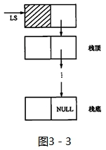

- 链栈用C语言和C++定义如下：

  ```C
  typedef struct node
  　　{
  　　　　DataType data;
  　　　　struct node * next;
  　　}Lkstk;
  ```

  ```C++
  typedef struct StackNode {
    SElemType data;
    struct StackNode *next;
  } StackNode, *LinkStack;
  LinkStack S;
  ```

  

  1. 初始化　

     ```C
     void InitStack (LkStk *LS) 
     　　{
     　　　　LS= (LkStk *) malloc (sizeof (LkStk) ) ;
     　　　　LS->next=NULL; //建立一个空栈
     　　}
     ```

     ```C++
     void InitStack ( LinkStack &S )
     {
     	S=NULL;
     }
     ```

     栈初始化时, 生成一个结点, 将该结点的next域设置为NULL , 如图3－4所示。

     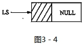

  2. 判栈空　

     ```C
     int EmptyStack (LkStk *LS) //若栈为空则返回值1, 否则返回值0。
     　　{
     　　　　if (LS->next==NULL) 
     　　　　　　　return 1;
     　　　　else
     　　　　　return 0;
     　　}
     ```

     ```C++
     Status StackEmpty ( LinkStack S)
     {
       if (S==NULL)
         return TRUE;
       else return FALSE;
     }
     ```

     

  3. 进栈　

     ```C
     void Push (LkStk *LS,DataType x) 
     　　{
     　　　　LkStk *temp;
     　　　　temp= (LkStk *) malloc (sizeof (LkStk) ) ; //temp指向申请的新结点
     　　　　temp->data=x; //新结点的data域赋值为x
     　　　　temp->next=LS->next; //temp的next域指向原来的栈顶结点
     　　　　LS->next=temp; //指向新的栈顶结点
     　　}
     ```

     ```C++
     Status Push (LinkStack &S, SElemType e)
     {
       p=new StackNode;
       if (!p) exit (OVERFLOW) ;
       p->data=e;
       p->next=S;
       S=p;
     return OK;
     }
     ```

     在进栈操作算法中釆用前插操作, 新增结点始终插入到头结点之后, 如图3－5所示。
     　　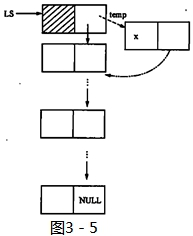

  4. 出栈　

     ```C
     int Pop (LkStk *LS) 
     　　//栈顶数据元素通过参数返回, 它的直接后继成为新的栈顶
     　　{
     　　　　LkStk *temp;
     　　　　if (! EmptyStack (LS) ) 　　//判断栈是否为空
     　　{
     　　　　temp=LS->next; 　　//temp指向栈顶结点
     　　　　LS->next=temp->next; //原栈顶的下一个结点成为新的栈顶
     　　　　 free (temp) ; 　//释放原栈顶结点空间
     　　　return 1;
     　　}
     　　else
     　　　　　return 0;
     　　}
     ```

     ```C++
     Status Pop (LinkStack &S, SElemType &e )
     {
       if (S== NULL) return ER ROR;
       e= S-> data;
       p=S;
       S=S-> next;
       delete p; return OK;
     }
     ```

     出栈操作始终是栈顶结点出栈, 即删除头结点之后的结点, 如图3－6所示。

     　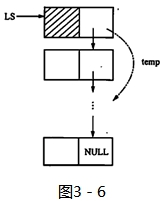

     链栈进出栈示意图
     　　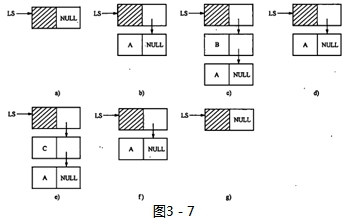
     a) 初始栈 (空栈) 	b) A进栈后	c) B进栈后	d) B出栈后

     e) C进栈后	f) C出栈后	g) A出栈后

  5. 取栈顶元素

     ```C
     DataType GetTop(LkStk &LS){
       if(!EmptyStack(LS)) //非空
         return LS->next->data; //取栈顶元素
       else return NULLData;
     }
     ```

     ```C++
     SElemType GetTop ( LinkStack S)
     {
       if (S==NULL) exit (1);
       else return S->data;
     }
     ```

     

### 3.1.4 栈的简单应用和递归

- 递归的定义若一个对象部分地包含它自己, 或用它自己给自己定义, 则称这个对象是递归的; 若一个过程直接地或间接地调用自己,  则称这个过程是递归的过程。

- 任何递归必须同时满足如下两个条件：

  1. 被定义项在定义中的应用 (即作为定义项的出现) 具有更小的“规模”; 
  2. 被定义项在**最小“规模”**上的定义是**非递归**的, 这是递归的**结束条件**。

  例如：阶乘函数可递归定义如下：

  ```C
  //　　代码实现：
  #include <stdio.h>
  long f(int n)
  {
    if (n == 1)
      return 1;
    else
      return n * f(n - 1);
  }
  int main()
  {
    int m, n = 3;
    m = f(n);
    printf("%d!=%d\n", n, m);
  }
  ```

  递归函数的运行引起递归调用。为了保证在不同层次的递归调用能正确地返回, 必须将每一次递归调用的参数和返回地址保存起来。由于函数的递归调用是后进先出的, 所以要用栈来保存这些值。

- 分治法:

    - 对于一个较为复杂的问题, 能够分解成几个相对简单的且解法相同或类似的子问题来求解

        1. 能将一个问题转变成一个新问题, 而新问题与原问题的解法相同或类同, 不同的仅是处理的对象, 且这些处理对象是变化有规律的
        2. 可以通过上述转化而使问题简化
        3. 必须有一个明确的递归出口, 或称递归的边界

    - 分治法求解递归问题算法的一般形式:

        - ```C++
            void p (参数表) {
              if (递归结束条件)可直接求解步骤; ---基本项
                else p (较小的参数) ; ---归纳项
                longFact ( longn ) {
                if ( n==0) return 1;
                //基本项
                else returnn* Fact (n-1) ; //归纳项
            }
            ```

            

- 【经典案例】斐波那契数列
  　　斐波那契数列指的是这样一个数列 `1, 1, 2, 3, 5, 8, 13, 21, 34, 55, 89, 144, 233, 377, 610, 987.......`.这个数列从第3项开始, 每一项都等于前两项之和。请输入一个正整数`n (0<n<20) `, 输出斐波那契数列第n项的值。

  ```C
  int fun (int n) 
  {
    if (n==1||n==2) 
    {
      return 1;
    }
    else
    {
      return fun (n-1) +fun (n-2) ;
    }
  }
  int main (　) 
  {
    int n;
    cout<<"请输入一个正整数 (1~20) ：";
    cin>>n;
    cout<<fun (n) ;
    return 0;
  }
  ```


## 3.2 队列

### 3.2.1 队列的基本概念

- 栈和队列的定义和特点

  1. 定义只能在表的一端(队尾)进行插入, 在另一端(队头)进行删除运算的线性表
  2. 逻辑结构：与线性表相同, 仍为一对一关系
  3. 存储结构：用顺序队列或链队存储均可
  4. 运算规则：先进先出(F In F Out)
  5. 主要操作：入队和出队函数, 具体实现依顺序队或链队的不同而不同 

- 队列的抽象数据类型

  ```C
  ADT Queue {
    数据对象: D={ai|ai∈=ElemSet, i=1, 2, ..., n, n≥0}
    数据关系: R={<ai-1, ai>|ai-1,ai∈D,  i=1,  2, ..., m}
    基本操作: 约定 a1端为队列头, an 端为队列尾
      (1) InitQueue (&Q) 		//构造空队列
      (2) DestroyQueue (&Q) //销毁队列
      (3) ClearQueue (&S)   //清空队列
      (4) QueueEmpty (S) 		//判空. 空--TRUE, 
      (5) QueueLength (Q) 	//取队列长度
      (6) GetHead (Q, &e)   //取队头元素, 
      (7) EnQueue (&Q, e)   //入队列
      (8) DeQueue (&Q, &e) //出队列
      (9) QueueTraverse (Q, visit () ) //遍历
  }ADT Queue
  
  //栈的抽象数据类型
  ADT Stack {
    数据对象:
    数据关系:
    基本操作:
  } ADT Stack
  ```

  

- 图3－8所示为队列示意图, a1是队列的首元素, an是队列的尾元素。
　　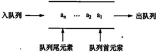
    　　　　　　　　　图3－8
  
- 队列的基本运算： 队列初始化`InitQueue (Q)` ：

  1. 设置一个空队列 `Q`;  
  2. 判队列空`EmptyQueue (Q)` ：若队列Q为空, 则返回值为1, 否则返回值为0;  
  3. 入队列 `EnQueue (Q,x)` ：将数据元素x从队尾一端插入队列, 使其成为队列的新尾元素;  
  4. 出队列 `OutQueue (Q)` ：删除队列首元素;  
  5. 取队列首元素 `GetHead (Q)` ：返回队列首元素的值。


### 3.2.2 队列的顺序实现

- 顺序存储实现的队列称为顺序队列, 它由一个一维数组 (用于存储队列中元素) 及两个分别指示队列首和队列尾元素的变量组成, 这两个变量分别称为“队首指针”和“队尾指针”。

  用类C语言定义顺序队列类型如下：　

  ```C
  const int maxsize=20;
  typedef struct seqqueue
  {
    DataType data[maxsize];
    Int front,rear;
  }SeqQue;
  SeqQue SQ;
  ```

  - 第一种存储结构:顺序队列的表示一一用一维数组 `base[M]`

  ```C++
  #define M 100 //最大队列长度
  Typedef struct {
    QElemType*base; //初始化的动态分配存储空间
    int front; //头指针
    int rear; //尾指针
  }SqQueue;
  ```

  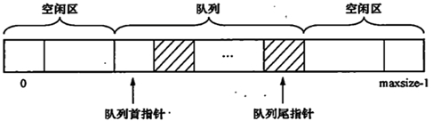
  　　　　　　　　　　　　　　　　　图3－9
  　　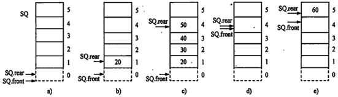
  　　　　　　　　　　　　图3－10　顺序队列操作的几种状态

  　　图3－10a为空队列, `SQ.rear` 为0, `SQ.front`为0。
  　　图3－10b为20入队列后, `SQ.rear`为1, `SQ.front`为0。
  　　图3－10c为30, 40, 50依次入队列后, `SQ.rear`为4, `SQ.front`为0。
  　　图3－10d为20, 30, 40, 50依次出队列后, `SQ.rear`为4, `SQ.front`为4。
  　　图3－10e为60入队列后, `SQ_rear`为5, `SQ.front`为4。

- 顺序队列的“**假溢出**”现象, 如图3－10。为了解决这种现象, 我们可以将存储队列元素的一维数组首尾相接, 形成一个环状, 这样的队列称为**循环队列**。如图3－11所示。

  　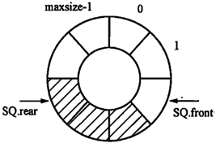
    　　　　　　　　　　图3－11
   
- 当`SQ.rear=maxsize-1`时, 只要数组的低下标端有空闲空间, 仍可进行入队列运算。此时只需令`SQ.rear=0,` 即把`SQ.data[0]`作为新的队列尾, 并将入队的元素置入此单元中。这样就解决了“假溢出”问题。

    - **循环队列队满条件**： `( (CQ.rear+1) % maxsize==CQ.front)` 
    - **循环队列队空条件**： `(CQ.rear==CQ.front)` 
         　　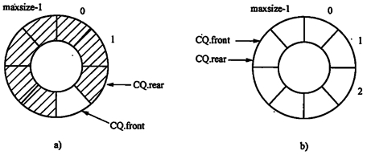
         　　　　　　　　　　 　　　图3－12
         　　　　a) 队列满情况 　　　　　 　 　　　　　b) 队列空情况

- 循环队列的基本运算包含：

  1. 队列的初始化

     ```C
     void InitQueue (CycQue CQ) 
     　　{
     　　　　CQ.front=0;
     　　　　CQ.rear=0;
     　　}
     ```

     ```C++
     //[算法步骤]
     //(1)申请一个空队
     //(2)设置空队的队首、队尾标志
     //[算法描述]循环队列初始化
     Status InitQueue (SqQueue &Q) {
       Q.base =new QElemType[MAXQSIZE]
         if (!Q.base) exit (OVERFLOW) ;
       Q.front =Q.rear=0;
       return OK;
     }
     ```

     - 最大长度：`M-1`

     - 实际长度：

       ```C++
       int QueueLength ( SqQueue Q) {
         return (Q.rear-Q.front+MAXQSIZE ) %MAXQSIZE;
       }
       ```

       

  2. 判队空 

     ```C
     int EmptyQueue (CycQue CQ) 
     　　{
     　　　　if (CQ.rear==CQ.front) 
     　　　　return 1;　　//队列为空, 返回1
     　　　else
     　　　　return 0;　　//队列不为空, 返回0
     　　}
     ```

     - 队满 ：`rear= (rear+1) %M == front;`

     

  3. 入队列 `rear= (rear+1) %M;`

     ```C
     int EnQueue (CycQue CQ,DataType x) 
     　　{
     　　　　
     　　　　if ( (CQ.rear+1) % maxsize==CQ.front) 
     　　{
     　　　　　error ("队列满") ;
     　　　　　return 0;
     　　}　　//队列满, 入队失败
     　　else
     　　{
     　　　　CQ.rear = (CQ.rear+1) % maxsize;
     　　　　CQ.data[CQ.rear] = x;
     　　　　return 1;　　//入队成功
     　　}
     　　}
     ```

     ```C++
     //[算法设计步骤]
     //(1)满队不能入队
     //(2)队尾入队
     //(3)队尾指针移动
     [算法描述]循环队列入队
       Status EnQueue ( SqQueue&Q, QElemTypee) {
       if ( (Q.rear+1) %MAXQSIZE=-Q.front)
         return ERROR;
       Q.base[Q.rear]=e;
       Q.rear= (Q.rear+1 ) %MAXQSIZE;
       return OK;
     }
     ```

     

  4. 出队列 `front= ( front+l ) %M;`

     ```C
     int OutQueue (CycQue CQ) 
     　　{
     　　　　if (EmptyQueue (CQ) ) //判断队列是否为空
     　　　　{
     　　　　error ("队列空") ; //队列为空, 出队失败
     　　　　return 0;
     　　　　}
     　　else
     　　　　{
     　　　　CQ.front = (CQ.front+1) % maxsize;
     　　　　//不为空, 出队列
     　　　　return 1;　　//出队列成功
     　　　　}
     　　}
     ```

     ```C++
     /*[算法设计步骤]
     (1)满队不能入队
     (2)队首出队
     (3)队首指针移动
     */
     Status DeQueue (LinkQueue &Q, QElemType &e) {
       if (Q.front==Q.rear) return ERROR;
       e=Q,base[Q.front];
       Q.front= (Q.front+1) %MAXQSIZE;
       return OK;
     }
     ```

     

  5. 取队列首元素　

     ```C
     DataType GetHead (CycQue CQ) 
     　　{
     　　　　if (EmptyQueue (CQ) ) 　//判断队列是否为空
     　　　　　　return NULLData ; //队列为空, 返回空数据标志
     　　　　else
     　　　　　　return CQ.data[ (CQ.front+1) %maxsize];
     　　}
     ```

     

- 循环队列操作, 如图3－13所示。
  　　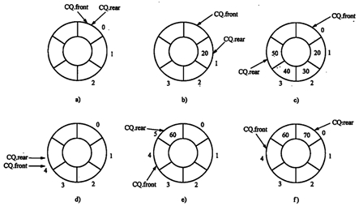
    　　　　　　　　　　　　　　　　图3－13


### 3.2.3 队列的链接实现

- 使用一个带有头结点的单链表来表示队列, 称为链队列。如图3－14所示。
  　　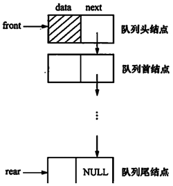

  图3－14　链队列示意图

- 链接队列用类 C 语言和 C++ 描述类型定义如下：

  ```C
  typedef struct LinkQueueNode
  {
  DataType data;
  struct LinkQueueNode *next;
  } LkQueNode;
  typedef struct LkQueue
  {
  LkQueNode *front,*rear;
  }LkQue;
  LkQue LQ;
  ```

  ```C++
  typedef struct QNode{
    QElemType data;
    struct Qnode *next;
  }Qnode, *QueuePtr;
  typedef struct {
    QueuePtr front; //队头指针
    QueuePtr rear; //队尾指针
  }LinkQueue;
  ```

  

- 链队列的队空和队满：

  - 队满：由于链接实现需要动态申请空间, 故链队列在一定范围内不会出现队列满的情况。
  - 队空：`LQ.front==LQ.rear`

- 链队列的基本运算： 

  1. 队列的初始化 

     - ```C
       void InitQueue (LkQue *LQ) 
       　　{
       　　　　LkQueNode *temp;
       　　　　temp= (LkQueNode *) malloc (sizeof (LkQueNode) ) ;//生成队列的头结点
       　　　　LQ->front=temp; //队列头指针指向队列头结点
       　　　　LQ->rear=temp; //队列尾指针指向队列尾结点
       　　　　 (LQ->front) ->next=NULL;
       　　}
       ```

       ```C++
       Status InitQueue (LinkQueue &Q) {
       Q.front=Q.rear= (QueuePtr) malloc ( sizeof (QNode) ) ;
         if (!Qfront) exit (OVERFLOW) ;
       Q.front->next=NULL;
         return OK;
       }
       ```
       
       　
       
       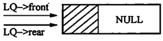
       　　　　　　　　图3－15
       
   - 销毁
  
     - ```C++
         Status DestroyQueue (LinkQueue &Q) {
         while (Q.front) {
             Q.rear=Q.front->next;
             free (Q.front) ;
             Q.front=Q.rear; }
           return OK;
         }
         ```
  
         
  
  2. 判队列空  
  
     - ```C
       int EmptyQueue (LkQue LQ) 
       　　{
       　　　　if (LQ.rear == LQ.front) 
       　　　　　　return 1; //队列为空
       　　　　else
       　　　　　　return 0;
       　　}
       ```
  
     - ```C++
       Status QueueEmpty (LinkQueueQ) {
         return (Q.front== =Q.rear) ;
       }
       ```
  
       
  
  3. 入队列 
  
     - ```C
       void EnQueue (LkQue *LQ,DataType x) 
       　　{
       　　　　LkQueNode *temp;
       　　　　temp= (LkQueNode *) malloc (sizeof (LkQueNode) ) ;
       　　　　temp->data=x;
       　　　　temp->next=NULL;
       　　　　 (LQ->rear) ->next=temp; //新结点入队列
       　　　　LQ->rear =temp; //置新的队列尾结点
       　　}
       ```
       
       ```C++
       Status EnQueue ( LinkQueue&Q, QElemType e) {
         p= (QueuePtr) malloc (sizeof (QNode) ) ;
         if (!p) exit (OVERFLOW) ;
         p->data=e; p->next=NULL;
         Q.rear->next=p;
         Q.rear=p;
         return OK;
       }
       ```
       
       
     
     入队的具体过程如图3－16
        　　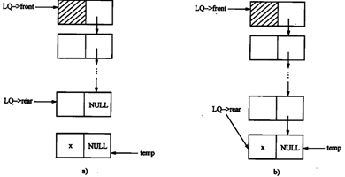
        　　　　　　　　　　　　图3－16
        　　　　　a) 入队列前　　　　　　　　　　b) 入队列后


  4. 出队列 

     - ```C
       OutQueue (LkQue *LQ) 
       　　{
       　　　　LkQueNode *temp;
       　　　　if (EmptyQueue (CQ) ) 　　//判队列是否为空
       　　{
       　　　　　　error ("队空") ; //队列为空
       　　　　　　return 0;
       　　}
       　　else //队列非空
       　　{
       　　　　　temp = (LQ->front) ->next;　　//使temp指向队列的首结点
       　　　　 (LQ->front) ->next=temp->next;　　//修改头结点的指针域指向新的首结点
       　　　　　if (temp->next==NULL) 
       　　　　　　LQ->rear=LQ->front;　　//无首结点时, front和rear都指向头结点
       　　　　　free (temp) ;
       　　　　　return 1;
       　　　　　}
       　　}
       ```
       
       ```C++
       Status DeQueue (LinkQueue &Q, QElemType &e) {
         if (Q.front==Q.rear) return ERROR;
         p=Q.front->next; 
           e-p->data; 
             Q.front->next= p->next;
         if (Q.rear==p) Q.rear=Q.front;
         delete p;
         return OK;
       }
       ```
       
       

   　　出队列的具体过程如图3－17
   　　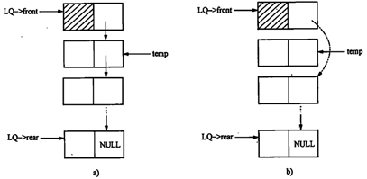
   　　　　　　　　　　　　　图3－17
   　　　　　a) 出队列前　　　　　　　　　b) 出队列后

  5. 取队列首元素

     - ```C
       DataType GetHead (LkQue LQ) 
       　　{
       　　　　 LkQueNode *temp;
       　　　　if (EmptyQueue (CQ) ) 
       　　　　　　　return NULLData; //判队列为空, 返回空数据标志
       　　　　else
       　　　　　{
       　　　　　temp=LQ.front->next;
       　　　　　　　return temp->data //队列非空, 返回队列首结点元素
       　　　　　}
       　　}
       ```

       ```C++
       Status GetHead (LinkQueue Q, QElemType&e) {
         if (Q.front ==Q.rear) return ERROR;
         e=Q.front->next->data;
         return OK;
       }
       ```
       
       

### 3.2.4 队列应用

- 【例】在日常生活中, 到银行办理业务时, 往往需要排队等候, 也就是按照“先到先服务”的原则 (这里不考虑不同业务分类处理的情况) 。

  - 在排队等候的过程中, 主要有两件事：

    1. 客户到达银行时, 在电脑上取号; 
    2. 客户等待银行电脑语音报号, 当报出某客户序号时, 客户到相应的窗口接受服务。

    现在用计算机来模拟等待和接受服务这一过程。显然, 客户等待服务, 可以利用队列这一数据结构来实现。“在电脑上取号”用命令`‘A’`表示, “客户到相应的窗口接受服务”用命令`‘N’`表示, 命令`‘Q’`表示不再接受取号, 已排队等候的人依次接受服务, 然后结束模拟。

- 算法描述如下：

  ```C
  while (1) 
  　　{
  　　接收命令;
  　　若为‘A’, 取号, 排队等待;
  　　若为‘N’, 队列中第一个人, 即持所报号的人, 出队列接受服务;
  　　若为‘Q’, 队列中剩余人按顺序依次接受服务, 结束。
  　　}
  ```

  

## 3.3 数组

### 3.3.1 数组的逻辑结构和基本运算

- 数组, 它由一组具有**相同类型的数据元素**组成, 并存储在一组**连续的存储单元**中。

  - 二维数组可以看成一个**一维数组的每一个元素又是一维数组**。

  - 以此类推, 如果一维数组的每个元素又是一个二维数组, 则组成的是一个三维数组。 

  $$A_{m\times n}= \left( \begin{matrix} a_{0\,0}  & a_{0\,1}  & \cdots & a_{0 {\,n-1}}  \\ a_{1\,0} & a_{1\,1} &  \cdots & a_{1 {\,n-1}}  \\ \vdots & \vdots &    & \vdots   \\ a_{m-1{\,0}}  & a_{m-1{\,1}}   & \cdots & a_{m-1{\,n-1}}   \end{matrix} \right)$$

- 对于一个`m*n`的二维数组, 它可看成是由`m` 个行向量或者`n` 个列向量组成的线性表。
  二维数组看成是`n` 个列向量组成的线性表, 它可以表示成：

  $a'= (a_0, a_1, …, a_{n－1})$

  $$A_{m\times n}=\left[ \begin{array}{c|c|c|c}  a_{0\,0}  & a_{0\,1}  & \cdots & a_{0 {\,n-1}}  \\ a_{1\,0} & a_{1\,1} &  \cdots & a_{1 {\,n-1}}  \\ \vdots & \vdots &    & \vdots   \\ a_{m-1{\,0}}  & a_{m-1{\,1}}   & \cdots & a_{m-1{\,n-1}}  \end{array} \right]$$

  　　　　　　　　　图3－19

- 二维数组看成是m 个行向量组成的线性表, 它可以表示成：
  　　$a'' (β0, β1, …, βm－1) $

  $$A_{m\times n}=\left( \begin{matrix} \big(a_{0\,0}  & a_{0\,1}  & \cdots & a_{0 {\,n-1}}\big)  \\ \big(a_{1\,0} & a_{1\,1} &  \cdots & a_{1 {\,n-1}}\big)  \\ \vdots & \vdots &    & \vdots   \\ \big(a_{m-1{\,0}}  & a_{m-1{\,1}}   & \cdots & a_{m-1{\,n-1}}\big)  \end{matrix} \right)$$

  　　　　　　　　图3－20

- 数组通常只有两种基本运算： 

  1. 读：给定一组下标, 返回该位置的元素内容;  
  2. 写：给定一组下标, 修改该位置的元素内容。


### 3.3.1 数组的储存结构

- 一维数组的内存单元地址是连续的, 二维数组有两种存储方法：以列序为主序存储, 以行序为主序存储, 通常采用行序存储。

- 数组元素存储地址的计算: 

  - 假设二维数组A每个元素占用s个存储单元, `Loc (aij)`  为元素 `aij` 的存储地址, `Loc (a00 )`是`a00`存储位置, 也是二维数组`A`的理址。
  - 若**以行序为主序**的方式存储二维数组, 则元素`aij`的存储位置可由下式确定:
    $Loc (aij ) =Loc (a00 ) + (n*i+j ) *s$
  - 若**以列序为主序**的方式存储二维数组, 则元素`aij`的存储位置可由下式确定:
    $Loc (aij ) =Loc (a00) + (m*j+i ) *s$

  

### 3.3.1 矩阵的压缩储存

- 矩阵是很多科学计算问题研究的对象, 矩阵可以用二维数组来表示。
  为了节省存储空间, 对这类矩阵采用多个值相同的元素只分配一个存储空间, 零元素不存储的策略, 这一方法称为矩阵的压缩存储。

  1. 特殊矩阵

     1. 对称矩阵

        若一个`n`阶方阵`A`中的元素满足下述条件：
        　　`aij = aji i>=0, j<=n－1`
        对称矩阵有近一半的元素可以通过其对称元素获得, 为每一对对称元素只分配一个存储单元, 则可将 $n^2$ 个元素压缩存储到含有 $n (n+1) /2$ 个元素的一维数组中。我们以行为主序存储其下三角 (包括对角线) 中的元素。

        $$A=\left( \begin{matrix} a_{0\,0}  &    &   &     \\ a_{1\,0} & a_{1\,1} &    &    \\ \cdots & \cdots &  \cdots   &   \\ a_{m-1{\,0}}  & a_{m-1{\,1}}   & \cdots & a_{n-1{\,n-1}}   \end{matrix} \right)$$

     2. **三角矩阵**

        以主对角线为界的上 (下) 半部分是一个固定的值c或零, 这样的矩阵叫做下 (上) 三角矩阵。

        　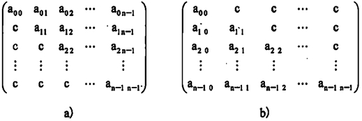

        　　　　　a) 上三角矩阵　　　　　　　　　　　　　　b) 下三角矩阵

  2. **稀疏矩阵**

       1. 假设`m`行`n`列的矩阵有`t`个非零元素, 当 `t<<m*n `时, 则称矩阵为稀疏矩阵。

            如图3－23。
                    　　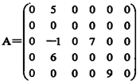
                    　　　　　　　图3－23

       2. 稀疏矩阵压缩存储的**三元组表示法**：

            需要用三个项来表示稀疏矩阵中的非零元素`aij`, 即` (i, j, aij) `。

       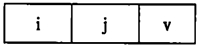
           　　　　　　　　图3－24

  ​	图3－24 中, `v `为非零元素, `i ` 为非零元素`v `所在矩阵的行号, `j `为`v `所在矩阵的列号。

  ​	图3－23 中的**稀疏矩阵 A 可表示成如下的三元组表**:  $( (0, 1, 5) ,  (2, 1, －1) ,  (2, 3, 7) ,  (3, 1, 6) ,  (4, 4, 9) ) $

   - 十字链储存结构储存稀疏矩阵


## 3.4 考核的知识点与考核要求

　　1.栈及其顺序实现和链接实现
　　识记：栈的概念; 栈的后进先出特征; 栈的基本运算。
　　领会：栈顶和栈底; 顺序栈的组织方法及其类C语言描述; 顺序栈栈满和栈空的条件; 链栈的组织方法及其类C语言描述; 链栈为空的条件。
　　简单应用：采用顺序存储和链接存储实现栈的基本运算的算法。
　　综合应用：用栈解决简单问题。

　　2.队列及其顺序实现和链接实现
　　识记：队列的概念; 队列的先进先出基本特征; 队列的基本运算; 循环队列。
　　领会：队列头和队列尾; 顺序队列的组织方法及其类C语言描述; 顺序队列满和队列空的条件; 循环队列的组织方法; 循环队列的队列满和队列空的条件; 链队列的组织方法及其类C语言描述; 链队列为空的条件。
　　简单应用：用数组实现循环队列的基本运算; 用链表实现队列的基本运算。
　　综合应用：设计用队列解决简单问题的算法。

　　3.数组及其实现
　　识记：一维、二维数组的逻辑结构及其顺序存储方法。
　　领会：顺序存储的一维数组、二维数组的地址计算; 特殊矩阵 (三角矩阵、对称矩阵) 的概念。
　　简单应用：用一维数组存储特殊矩阵的压缩存储方法; 给定特殊矩阵中某个元素的位置 (i, j) ; 计算该元素在一维数组中的位置k。


　　四、本章重点、难点
　　本章重点：栈和队列的特征; 顺序栈和链栈上基本运算的实现和简单算法; 顺序队列和链队列上基本运算的实现和简单算法。
　　难点：循环队列的组织, 队列满和队列空的条件及循环队列基本运算的算法。

　　

# 第3.5章 串和广义表(02331)

## 3.5.1 串

## 3.5.2 广义表

- 定义:广义表也称为列表, 是线性表的一种扩展, 也是数据元素的有限序列。
  - 记作: `LS= (d0, d1, d2, .....dn-1..)` 其中d1 既可以是单个元素, 也可以是广义表。
  - 广义表的定义是一个递归定义, 因为在描述广义是时又用到了广义表;
  - 在线性表中数据元素是单个元素, 而在广义表中, 元素可以是单个元素,  称为单元素(原子), 也可以是广义表, 称为广义表的子表
  - `n` 是广义表长度;
- 广义表的存储结构
  由于广义表中数据元素可以具有不同结构, 故难以用顺序结构表示广义表。通常采
  用链表存储方式


# 第四章 树和二叉树(重要)

本章重点：树形结构的概念; 二叉树的定义、储存结构和遍历算法。

**难点必考：二叉树的遍历算法和哈夫曼树构造算法。**

## 4.1 树的基本概念

### 4.1.1 树的基本概念

- 树是由`n (n≥0)`个结点组成的有限集合。若`n=0`, 称为空树; 若`n>0`, 则:

  1. 有一个特定的称为根(`root`) 的结点。它只有直接后继, 但没有直接前驱;
  2. 除根结点以外的其它结点可以划分为`m(1m≥0)`个互不相交的有限集合`To,T1, ..., Tm1`, 每个集合`Ti (i=0, 1, ..., m-1)` 又是一棵树, 称为根的子树, 每棵子树的根结点有且仅有一个直接前驱, 但可以有0个或多个直接后继。
  
- 树 (Tree) 是一类重要的数据结构, 其定义如下：

  - 树是`n (n≥0) `个结点的有限集合, 一棵树满足以下两个条件：

    1. 当`n=0`时, 称为**空树**; 
    2. 当`n>0`时, 有且仅有一个称为根的结点, 除根结点外, 其余结点分为`m (m≥0) `个互不相交的非空集合`T1, T2, …, Tm`, 这些集合中的每一个都是一棵树, 称为根的子树。

    如图4－2所示的几种结构都不是树。

    　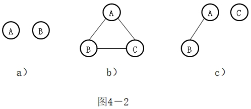

- 树的逻辑结构可以用二元组描述为:

  ```C
  tree= (K, R)
    K={ki| 1≤i≤n;n≥0, ki∈elemtype}
  	R={r}
  r={(A,B),(A,C),(A,D),(B,E),(B,F),(C,G)}
  ```

  

### 4.1.2 树的相关术语

- **结点**
  
  - 指树中的一个数据元素, 一般用一一个字母表示。
  
- **度**
  
  - 一个结点包含子树的数目, 称为该结点的度。
  
- **结点的度**：

  - 树上任一结点所拥有的**子树的数目**称为该结点的度。

- **叶子**：

  - **度为0的结点**称为叶子或**终端结点**。

- **树的度**：

  - 一棵树中所有结点的度的最大值称为该树的度。

- **孩子结点**

  - 若结点 X 有子树, 则子树的根结点为 X 的孩子结点, 也称为孩子。
  - 相应地该结点 X 称为孩子的**双亲 (也称父结点)** 。

- 祖先结点

  - 从根结点到该结点所经过分枝上的所有结点为该结点的祖先。

- 子孙结点

  - 某一结点的子女及子女的子女都为该结点子孙。

- 兄弟结点

  - 具有同一个双亲的结点, 称为兄弟结点。

- **树的层次**：

  - 根结点的层数为1, 其它结点的层数为从根结点到该结点所经过的分支数目再加1。

- **树的高度**：(深度)

  - 树中结点所处的最大层数称为树的高度。

- 有序树：

  - 若树中各结点的子树从左到右是有次序的, 不能互换, 称为有序树。有序树中最左边子树的根称为第1个孩子, 左边第i个子树的根称为第i个孩子。

- 无序树：

  - 若树中各结点的子树是无次序的, 可以互换, 则称为无序树。

- **森林(树林)**：

  - 若干棵互不相交的树组成的集合为森林。一棵树可以看成是一个特殊的森林。

- 树的基本运算有：

  1. 求根
  2. 求双亲
  3. 求孩子
  4. 建树
  5. 剪枝
  6. 遍历

  

## 4.2 二叉树

### 4.2.1 二叉树的基本概念

- 二叉树 (Binary Tree) 是`n (n≥0) `个元素的有限集合, 该集合或者为空, 或者由一个根及两棵互不相交的左子树和右子树组成, 其中左子树和右子树也均为二叉树。

    - 每个结点的度小于等于 2;
    - 是有序树;

- **二叉树的任一结点都有两棵子树** (它们中的任何一个都可以是空子树) , 并且这两棵子树之间**有次序关系**。
  　　
    如 图4－3a、b、c 分别是含两个结点 A、B 且以 A 为根的二叉树和树的示意图。
    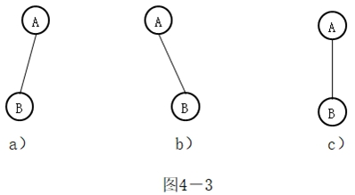
    　　a) 右子树为空的二叉树　b) 左子树为空的二叉树　c) 含一棵子树的树
    
- 二叉树有五种基本形态
  　　
    如图4－4所示其中方块表示子树
    　　
    　　a) 空二叉树　b) 左右子树均为空的二叉树　c) 右子树为空的二叉树　d) 左子树为空的二叉树　e) 左、右子树都非空的二叉树
    
- 二叉树的基本运算：

  1. 初始化
  2. 求双亲
  3. 求左孩子
  4. 建立二叉树
  5. 先序遍历
  6. 中序遍历
  7. 后序遍历
  8. 层序遍历

  

### 4.2.2 二叉树的性质

- 性质1：

  - **二叉树第 $i (i≥1) $层上至多有 $2^{i-1}$ 个结点。**

- 性质2：

  - **深度为 $k (k≥1)$ 的二叉树至多有 $2^k-1$ 个结点。**

- 性质3：

  - 对任意一棵二叉树, 如果叶子结点个数为 $n0$, 度为 $2$ 的结点个数为 $n2$, 则有 $n0=n2+1$

- 满二叉树：

  - 深度为$k (k≥1)$ 且有$2k-1$个结点的二叉树称为满二叉树。

- 完全二叉树：

  - 如果对满二叉树按从上到下, 从左到右的顺序编号, 并在最下一层删去部分结点 (删后最后一层仍有结点) , 如果删除的这些结点的**编号是连续的**且删除的结点中含有最大编号的结点, 那么这棵二叉树就是完全二叉树。
- 若设二叉树的深度为 h, 则共有 h 层。除第 h 层外, 其它各层 (0~h-1) 的结点数都达到最大个数, **第 h 层从右向左连续缺若干结点, 这就是完全二叉树**。
  
  　
    　　图4－5 满二叉树、完全二叉树和非完全二叉树
    　　a) 满二叉树　b) 完全二叉树　c) 非完全二叉树　d) 非完全二叉树

对于**完全二叉树**, 还有以下两个重要性质：

- 性质4：

  - 含有 $n$ 个结点的完全二叉树的深度为 $⌊log_2n⌋+1$

  - 证明: 设完全二叉树的深度为 $k$, 则有

    $2^{k-1}-1<n≤2k-1$   ;   $2^{k-1}≤n< 2^k$

    取对数 $k-1≤log_2n<k$

    因为 $k$ 为整数, 所以 $k= ⌊log_2n⌋+1$

- 性质5：

  - 如果将一棵有 $n$ 个结点的完全二叉树按层编号, 按层编号是指：将一棵二叉树中的所有 $n$ 个结点按从第一层到最大层, 每层从左到右的顺序依次标记为 $1, 2, …, n$ 。

  - 则对任一编号为 $i (1≤i≤n)$ 的结点 $A$ 有：
  
    1. 若 $i=1$ , 则结点 $A$ 是根; 
  2. 若 $i>1$ , 则 $A$ 的双亲 $Parent (A)$ 的编号为 $\displaystyle ⌊\frac{i}{2}⌋$ ; 
    3. 若 $2*i>n$ , 则结点 $A$ 既无左孩子, 也无右孩子; 否则 $A$ 的左孩子 $Lchild (X)$ 的编号为 $2*i$; 
  4. 若 $2*i＋1>n$, 则结点 $A$无右孩子; 否则,  $A$ 的右孩子 $Rchild (A)$ 的编号为 $2*i＋1$。
    5. 若 $i$ 为偶数, 且 $i!=n$, 则其右兄弟为 $i+1$
  6. 若 $i$ 为奇数, 且 $i!=1$, 则其左兄弟为 $i-1$
       $i$ 所在层次为 $⌊log_2i⌋+1$
  
    　　
    　　图4－6 完全二叉树上父、子结点编号之间的关系
    　　a) i为偶数    b) i为奇数
  
  

## 4.3 二叉树的储存结构

### 4.3.1 二叉树的顺序储存结构

- 二叉树的顺序存储结构可以用**一维数组**来实现, 
  　　
    - 二叉树上的结点按某种次序分别存入该数组的各个单元中。
    - 图4－7为完全二叉树的顺序存储,
- 图4－8为非完全二叉树的顺序实现。
      　　
        　　图4－7 完全二叉树的顺序存储示例
        　　a) —棵完全二叉树 b) 顺序存储示意
    
    　　
    　　图4－8 非完全二叉树的顺序实现
    　　a) —棵非完全二叉树BT　b) 增设虚拟结点后的BT
    　　c) BT的一种不恰当的顺序存储　d) BT的顺序存储

  

### 4.3.2 二叉树的链式储存结构

- 二叉树有不同的链式存储结构, 其中最常用的是二叉链表与三叉链表。
  　　
    - 二叉链表必须有一个指向根节点的指针
    - 二叉链表和三叉链表的结点形式如图4－9 a、b所示。
    
    　　    　　图4－9 二叉链表和三叉链表结点结构
    　　    　　a) 二叉链表的结点　b) 三叉链表的结点
  
- 二叉链表的类型定义如下：　

  ```C
  typedef struct btnode
  {
    DataType data;
    //指向左右孩子的指针
    struct btnode *lchild, *rchild;
  }*BinTree;
  ```

- 三叉链表的类型定义如下：　

  ```C
  typedef struct ttnode
  {
    datatype data;
    struct ttnode * lchild, *parent, *rchild;
  }*TBinTree;
  TBinTree root;
  ```

- 二叉树的链式存储示意图如图4－10所示：
  　　
    　　图4－10 二叉树的链式存储结构
    　　a) 一棵二叉树　b) 二叉链表示意　c) 三叉链表示意


## 4.4 二叉树的遍历

二叉树的四大操作:
遍历化、线索化、最优化、转换化

### 4.4.1 二叉树遍历的递归实现

- 二叉树的遍历( Traversing Binary Tree )是指按某种次序访问二叉树上的所有结点, 使**每个结点被访问一次且仅被访问一次**。

  1. 先序遍历( Preorder Traversal)
     1. 若被遍历的二叉树为空, 执行空操作; 否则, 依次执行下列操作：
        1. 访问根结点(D); 
        2. 先序遍历左子树(L); 
        3. 先序遍历右子树(R)。
  2. 中序遍历( Inorder Traversal)
     1. 若被遍历的二叉树为空, 执行空操作; 否则, 依次执行下列操作：
        1. 中序遍历左子树; 
        2. 访问根结点; 
        3. 中序遍历右子树。
  3. 后序遍历( Postorder Traversal )
     1. 若被遍历的二叉树为空, 执行空操作; 否则, 依次执行下列操作：
        1. 后序遍历左子树; 
        2. 后序遍历右子树; 
        3. 访问根结点。

- **中根加先根**或者**中根加后根**可以唯一确定一棵二叉树。

- 【例4－1】分别给出图4－11a的二叉树先序遍历、中序遍历、后序遍历三种访问方式的结点访问序列。
  　　
    　　图4－11 二叉树及其划分
    　　a) 二叉树　b) 二叉树划分

  1. 得到先序遍历的结点序列是：ABDEGCF
  2. 得到中序遍历的结点序列是：DBGEACF
  3. 得到后序遍历的结点序列是：DGEBFCA

- 三种遍历的递归算法描述

  1. 先序：

     ```C
     void preorder (BinTree bt) {
     　　if (bt!=NULL) {
     　　visit (bt) ; //访问根节点bt
     　　preorder (bt->lchild) ; //先序遍历左子树
     　　preorder (bt->rchild) ; //先序遍历右子树
     　　}
     　　}
     ```

     

  2. 中序：

     ```C
     void inorder (BinTree bt) {
     　　if (bt!=NULL) {
     　　inorder (bt->lchild) ; //中序遍历左子树
     　　visit (bt) ; //访问根节点bt
     　　inorder (bt->rchild) ; //中序遍历右子树
     　　}
     　　}
     ```

     　　

  3. 后序：

     ```C
     void postorder (BinTree bt) {
     　　if (bt!=NULL) {
     　　postorder (bt->lchild) ; //后序遍历左子树
     　　postorder (bt->rchild) ; //后序遍历右子树
     　　visit (bt) ; //访问根节点bt
     　　}
     　　}
     ```

     

### 4.4.2 二叉树的层次遍历

- 所谓二叉树的层次遍历, 是指从二叉树的根结点的这一层开始, 逐层向下遍历, 在每一层上按从左到右的顺序对结点逐个访问。
  　　

  - 该二叉树按层次遍历所得到的结点序列为A、B、C、D、E、F。

  

### 4.4.3 二叉树遍历的非递归实现

- 【案例】假设一棵二叉树的中序序列与后序序列分别为：BACDEFGH和BCAEDGHF, 建立该二叉树。

  　　

## 4.5 树和森林

### 4.5.1 树的储存结构

1. 孩子链表表示法
   　　孩子链表表示法是树的一种链式存储结构。它的主体是一个数组元素个数和树中结点个数相同的一维数组。树上的一个结点X以及该结点的所有孩子结点组成一个带头结点的单链表, 单链表的头结点含有两个域：数据域和指针域。其中, 数据域用于存储结点X中的数据元素, 指针域用于存储指向X第一个孩子结点的指针。
      　　
     
2. 孩子兄弟链表表示法
     存储时每个结点除了数据域外, 还有**指向该结点的第一个孩子**和**下一个兄弟结点的指针**。

     结点结构如图4－14所示。
      　　
     二叉链表中结点的左、右指针分别指向左、右孩子; 而孩子兄弟链表中结点的两个指针分别指向孩子和兄弟。
      　　

3. 双亲表示法
     双亲表示法由一个**一维数组**构成。数组的每个分量包含两个域：**数据域**和**双亲域**。

     - 数据域用于存储树上一个结点中数据元素, 

     - 双亲域用于存储本结点的**双亲结点在数组中的序号** (下标值) 。

          图4－13a中树的双亲表示法如图4－16所示。
           　　


### 4.5.2 树、森林与二叉树的关系

1. **树转换为二叉树**

   任何一棵树可唯一地与一棵二叉树对应。相应地, 一棵二叉树也唯一地对应一棵树, 即树与二叉树可以互相转换。

   将树转换成二叉树的方法如下：

   1. **连线**：

        - 将所有兄弟结点连接起来; 

   2. **抹线**：

        - 保留第一个兄弟结点与父结点的连接, 断开其他兄弟结点与父结点的连接；

   3. **旋转**：

        - 以根结点为轴心按顺时针的方向旋转45°角。
             

        

2. **森林转换为二叉树**

   森林F转换成二叉树的方法如下：

   1. 将每棵树转换成相应的二叉树; 

   2. 将 (1) 中得到的各棵二叉树的根结点看作是兄弟连接起来。
      　　
        图4－18为森林转换到二叉树的过程。
        
         　　
        (a) 森林 F　(b) 与树 T1 对应的二叉树　(c) 与树 T2 对应的二叉树　
        
        (d) 与 T3 对应的二叉树　(e) 与 F 对应的二叉树
        
        

3. **二叉树转换为森林(还原)**

   将二叉树转换成对应的森林的方法如下：

   1. **右链断开**
        - 将二叉树的**根结点的右链及右链的右链**等全部断开, 得到若干棵**无右子树**的二叉
          树。
   2. **二叉树转换成树**
        - 将 step1 中得到的每一棵二叉树都**还原成树**(与树转换成二叉树的步骤刚好相反。)
             
              　　
              　　
              　　
              　　a) 二叉树B　b) 第一次转换结果　c) 第二次转换结果　　d) 第三次转换结果
   
   

### 4.5.3 树和森林的遍历

- 树的遍历

  与二叉树类似, 这里我们定义树的先序遍历、后序遍历和层次遍历。

  1. 先序遍历：

     1. 访问根结点; 

     2. 依次先序遍历根的各棵子树 $T1, …, Tm$。

        对图4－13a 所示的树来说, 先序遍历得到结点访问序列为H, A, B, E, G, F, D, C; 

  2. 后序遍历：

     1. 依次后序遍历根的各棵子树 $T1, …, Tm$; 

     2. 访问根结点。

        对图4－13a 所示的树来说, 后序遍历得到结点访问序列为B, G, F, D, E, A, C, H; 

  3. 层序遍历：

     1. 若树非空, 访问根结点; 

     2. 若第 $i (i≥1)$ 层结点已被访问, 第 $i＋1$ 层结点尚未访问, 则从左到右依次访问第 $i＋1$ 层结点。

        对图4－13a 所示的树来说, 层次遍历得到结点访问序列为H, A, C, B, E, G, F, D。

- 森林的遍历

  森林有两种遍历方法：

  1. 先序遍历森林。若森林非空, 则

     1. 访问森林中第一棵树的根结点; 

     2. 先序遍历森林第一棵树的根结点的子树组成的森林; 

     3. 先序遍历除去第一棵树之外其余的树组成的森林。

        对图 4－18a 中的森林进行先序遍历, 得到的先序序列为ABCDEFGHJI。

  2. 中序遍历森林。若森林非空, 则

     1. 中序遍历森林中第一棵树的根结点的子树组成的森林; 

     2. 访问第一棵树的根结点; 

     3. 中序遍历除去第一棵树之外其余的树组成的森林。

        对图 4－18a 中的森林进行中序遍历, 得到的中序序列为BCDAFEJHIG。

  **另外, 请注意, 树和森林的先序遍历等价于它转换成的二叉树的先序遍历, 树和森林**
  **的后序遍历等价于它转换成的二叉树的中序遍历。**
  
  

## 4.6 判定树和哈夫曼树

### 4.6.1 分类与判定树

-  表4－1 人口按年龄分类问题

  | 类别           | A        | B           | C           | D        |
  | -------------- | -------- | ----------- | ----------- | -------- |
  | 年龄值`age/岁` | `age<18` | `18≤age<45` | `45≤age<60` | `age≥60` |
  | 百分比 (%)     | 0.2      | 0.3         | 0.25        | 0.25     |

- 用于描述分类过程的二叉树称为判定树。对上述分类问题可以画出两棵不同的判定树, 如图4－20所示。
  　　

  　　

  

### 4.6.2 哈夫曼 (Huffman) 树与哈夫曼算法

- 一种最优的二叉树, 最优是指 WPL 最小!

  - 路径长度(Path Length )：

    - 两个结点之间的路径长度是连接两结点的路径上的分枝数

  - 树的路径长度是各结点到根结点的路径长度之和。

  - 结点的带权路径长度为: 

    - 从根结点到该结点之间的路径长度与该结点的权的乘积

  - 树的带权路径长度：

    - 树的带权路径长度规定为所有叶子结点的带权路径长度之和。
    - 记为 $\displaystyle wpl=\sum^n_{i=1} w_il_i$ 其中 $n$ 为叶子结点数目, $w_i$ 为第 $i$ 个叶子结点的权值, $1_i$ 为第 $i$ 个叶子结点的路径长度。

    

  - 哈夫曼树中, 权值大的结点离根最近。

  - **n 个叶子结点的哈夫曼树共有 $2n-1$ 个结点**

- 我们来讨论如何构造一棵哈夫曼树, 
  1. 假设有 $n$ 个权值, 则构造出的哈夫曼树有 $n$ 个叶子结点;
  
  2. $n$ 个权值分别设为 $w_1, w_2,  ... , w_n$ , 则哈夫曼树的构造规则为: 
  
       1. 将 $w_1, w_2,  ... , w_n$ 看成是有 $n$ 棵树的森林(每棵树仅有一个结点) ;
       2. 在森林中**选出两个根结点的权值最小的树合并**, 作为一棵新树的左、右子树, 且**新树的根结点权值为其左、右子树根结点权值之和**;
       3. 从森林中删除选取的两棵树, 并将**新树加入森林;**
       4. 重复(2)、(3) 步, 直到森林中只剩一棵树为止, 该树即为我们所求得的哈夫曼树。
  
       
  
       (a)初如森林	(b)一次合并后的森林	(c)二次合并后的森林	(d)三合并后的森林

### 4.6.3 哈夫曼编码

- 通常希望字符在传输过程中总的编码长度越短越好。

- 考虑到一个待传输的文本中不同字符出现的频率是不同的, 直观的想法是让出现频率较多的字符采用较短的编码, 则传输的字符总编码长度会减少。用哈夫曼树就可以解决这一问题。

  - 将 $\{p1, ……, pn\}$ 作为一组叶结点的权值, 用哈夫曼算法, 可以构造出一棵具有最小带权路径长度的二叉树。
  - 将该二叉树中每个结点的**左分支**标志为 $“0”$ , 每个结点的**右分支**标志为 $“1”$ , 这样, 从根到每个叶结点形成 $“0” / “1”$ 序列
  - **将该序列作为叶结点对应字符的编码, 由此得到的二进制编码称为哈夫曼编码。**
  - 哈夫曼编码是一种前缀编码, 解码时不会混淆

- 【案例】设某通信系统中一个待传输的文本有 6 个不同字符, 它们的出现频率分别是 0.5, 0.8, 1.4, 2.2, 2.3, 2.8, 试设计哈夫曼编码。

  【分析】由题意, 共有 $n=6$ 个不同的字符, 字符的频率序列为 $p=\{0.5, 0.8, 1.4, 2.2, 2.3, 2.8\}$, 以这些频率作为权值, 构造一棵哈夫曼树, 并对其进行哈夫曼编码, 结果如图4－22所示。
  　　

  - 出现频率为0.5的字符编码为1000
  - 出现频率为0.8的字符编码为1001
  - 出现频率为1.4的字符编码为101
  - 出现频率为2.2的字符编码为00
  - 出现频率为2.3的字符编码为01
  - 出现频率为2.8的字符编码为11

  

## 4.7 **考核的知识点与考核要求**

　　1.树结构、森林
　　识记：树的基本概念; 术语; 森林基本概念。
　　领会：树的基本运算。
　　简单应用：结点的度计算; 树的度计算; 树的高度计算; 结点的层次数计算。
　　2.二叉树
　　识记：二叉树的概念; 左子树; 右子树。
　　领会：二叉树的基本运算; 二叉树的性质; 二叉树顺序存储及类C语言描述; 二叉树链式存储及类C语言描述; 二叉树的遍历算法。
　　简单应用：二叉树结点数计算; 二叉树深度计算; 给出二叉树先序序列、中序序列和后序序列; 由二叉树先序序列、中序序列和后序序列构造二叉树。
　　综合应用：设计二叉树上基于先序遍历、中序遍历和后序遍历的应用算法。
　　3.树和森林
　　识记：树的先序遍历方法; 树的后序遍历方法; 树的层次遍历方法; 森林的先序遍历方法; 森林的中序遍历方法。
　　领会：树、森林与二叉树的关系; 树转换成二叉树方法; 森林转换成二叉树方法; 二叉树转换成对应森林方法。
　　4.判定树和哈夫曼树
　　识记：判定树概念; 哈夫曼树概念; 哈夫曼编码。
　　领会：分类与判定树的关系; 哈夫曼树构造过程; 哈夫曼算法。
　　简单应用：由一组叶结点的权值构造一棵对应的哈夫曼树, 设计哈夫曼编码。

　　**四、本章重点、难点**
　　本章重点：树形结构的概念; 二叉树的定义、存储结构和遍历算法。
　　本章难点：二叉树的遍历算法和哈夫曼树构造算法。


# 第五章 图(重要)

本章重点：图的邻接矩阵和邻接表两种储存结构, 图的深度优先和广度优先搜索算法。

**难点必考：求最小生成树的 Prim 算法; 求单源最短路径; 求拓扑排序算法。**

## 5.1 图的基本概念

### 5.1.1 图的应用背景

- 假如有这样一个问题：在N个城市间建立通信网络, 使得其中的任意两个城市之间有直接或间接的通信线路, 假设已知每两个城市之间通信线路的造价, 要求找出一个总造价最低的通讯网络。当N很大时, 这个问题十分复杂, 只能借助计算机来求解。
  　　
    　　图5－1　用图描述的通信网络问题
    　　a) 初步方案G0　b) 最优方案G0'


### 5.1.2 图的定义和术语

- 有向图、无向图：

    - 图 G 由两个集合 V 和 E 组成, 记为 `G＝ (V, E) ` , 其中, V 是顶点的有穷非空集合; E 是边的集合, 边是 V 中顶点的**偶对**。如果边是有方向的则称图为有向图, 否则称为无向图。
    - **偶对** `<v, w>` 表示有向图中从顶点v到顶点w有一条边; 偶对 ` (v, w) ` 表示无向图中顶点 v 和顶点 w 间有一条边。
    - **弧、弧头、弧尾**：有向图的边称为弧。
        - `<v, w>` 表示有向图 G 中从 v 到 w 的一条弧, v 称为弧尾或始点, w 称为弧头或终点。

- 无向完全图：**任何两点之间都有边的无向图**。

    - 一个具有 n 个顶点的无向完全图的**边数**为。

- 有向完全图：**任何两点之间都有弧的有向图称为有向完全图**。

    - 一个具有 n 个顶点的有向完全图的**弧数**为。

- 权、带权图：

    - **图的边附带数值, 这个数值叫权**。权在实际应用中可表示从一个顶点到另一个顶点的距离、代价或耗费等。**每条边都带权的图称为带权图**。

- **顶点的度、入度、出度：无向图中顶点v的度是与该顶点相关联的边的数目**。

    - 如果 G 是一个有向图, 则把以顶点 v 为终点的弧的数目称为 v 的**入度**。
    - 把以顶点 v 为始点的弧的数目称为 v 的**出度**。
    - 有向图中顶点 v 的度为入度与出度的和。

- **子图：**

    - 设`G＝ (V, E) `是一个图, 若 `E'`是 E 的子集,  `V'` 是 V 的子集, 并且 `E'` 中的边仅与 `V'` 中的顶点相关联, 则图`G'＝ (V', E') `称为图 G 的子图。

    
    　　图5－2　有向图和无向图示例
    　　a) G1　b) G2
    　　
    　　图5－3　G1的若干子图
    　　
    　　图5－4　G2的若干子图

- 路径、路径长度：路径上**边 (或弧) 的数目**称为路径长度。
  
- **简单路径、回路、简单回路：**
  
- 序列中**顶点不重复出现**的路径称为简单路径。
  　　- **第一个顶点和最后一个顶点相同**的路径称为**回路或环**。
    　　- 除了第一个顶点和最后一个顶点外, **其余顶点不重复**的回路, 称为简单回路或简单环。
  
- **连通、连通图、连通分量：**
  　　
    - 在无向图中, 如果从顶点 V 到顶点 `V'` 有路径, 则称 V 和 `V'` 是连通的。
    - 如果图中的**任意两个顶点 Vi 和 Vj 都是连通**的, 则称 G 为连通图。
    - 图 5－2 中 G2 是一个连通图。
    　　    - 图 5－5a 中存在多个不连通顶点。
        　　    - 例如, V0 和 V3 是不连通的, 所以 G3 是**非连通图**, G3 有两个**连通分量**, 
                　　        - 如图 5－5b 所示。
        - **连通分量是无向图中的极大连通子图**。
          
            　　      　　
            　　        　　图5-5　无向图及其连通分量示例
          　　        　　a) 无向图 G3　　b) G3 的两个连通分量
  
- **强连通、强连通图、强连通分量：**
  　　
    - 对于有向图来说, 如果图中任意一对顶点 Vi 和 Vj (其中 i≠j )  都有顶点 Vi 到顶点 Vj 的路径, 也有从 Vj 到 Vi 的路径, 即两个**顶点间双向连通**, 那么称该有向图是**强连通图**。

    　　- **有向图的极大强连通子图称为强连通分量。**
    
      　　    图5－2a 的强连通分量如图5－6所示。
        　　
        　　  　　　　图5－6　有向图 G1 的两个强连通分量示意图
  
- **生成树：**

    - 一个连通图的生成树, 是含有该连通图的**全部顶点**的一个**极小连通子图**。
    - 若连通图 G 的顶点个数为 n, 则 G 的生成树的边数为 `n-1`。
    - 如果 G 的一个子图 `G'` 的边数大于 `n-1`, 则 `G'` 中**一定有环**。
    - 相反, 如果 `G'` 的边数小于 `n-1`, 则 `G'` 一定不连通。

- 生成森林：
  
  - 在非连通图中, 由每个连通分量都可得到一个**极小连通子图**, 即一棵生成树。
    - 那么这些连通分量的生成树就组成了一个非连通图的生成森林。
      　　  　　
        　　    　　图5－7　G2的一棵生成树
    
- 图的基本运算：

  1. 建立图`CreateGraph (G, V, E) `：建立一个图 G, 其中 V 是 G 的顶点集合, E 是 G 的边的集合; 
  2. 取顶点信息`GetVex (G, u) `：获取图 G 中顶点 u 的信息; 
  3. 取边信息`Getarc (G, u, v) `：获取图G中边` (u, v) `或`<u, v>`的信息; 
  4. 查询第一个邻接点`FirstVex (G, u) `：获取图 G 中顶点 u 的第一个邻接点; 
  5. 查询下一个邻接点`NextVex (G, u, v) `：已知 v 是 u 的一个邻接点, 获取图 G 中顶点 u 的下一个邻接点; 
  6. 插入顶点`InsertVex (G, v) `：在图 G 中插入一个顶点 v ; 
  7. 删除顶点`DeleteVex (G, v) `：在图 G 中删除一个顶点 v ; 
  8. 插入边`InsertArc (G, v, w) `：在图 G 中插入一条边 ` (v, w) `  或 `<v, w>`; 
  9. 删除边`DeleteArc (G, v, w) `：在图 G 中删除一条边 ` (v, w) ` 或 `<v, w>`; 
  10. 遍历图`Traverse (G, tag) `：遍历图 G , 使 G 中每个顶点被访问一次且仅被访问一次, 当tag=0, 则遍历的方法为深度优先搜索, 当tag=1, 则遍历的方法为广度优先搜索。

  

## 5.2 图的储存结构

### 5.2.1 邻接矩阵

- **邻接矩阵就是用矩阵来描述图中顶点之间的关联关系, 在程序设计语言中我们用二维数组来表示矩阵。**

- 设 `G= (V, E) ` 是一个图, 其中 `V={V0, V1, …, Vn-1}`, 那么 G 的邻接矩阵 A 定义为如下的 n 阶方阵：
  　　$A[i][j]$=

    ​	图5－2中有向图 G1 和无向图 G2 的邻接矩阵分别为 M1 和 M2 。
    　　
    ​	无向图的邻接矩阵是一个对称矩阵, 例如 M2。

- 类型定义如下：　

  ```C
  const int vnum=20;
  　　typedef struct gp
  　　{
  　　　　VertexType vexs[vnum]; //顶点信息
  　　　　int arcs[vnum][vnum]; //邻接矩阵
  　　　　int vexnum,arcnum; //顶点数, 边数
  　　}Graph;
  ```

  ```C++
  struct mgraph
  {图中顶点数;
   图中边数;
   存放顶点信息v1, v2, ...,vn;
   邻接矩阵;
  };
  ```

  

- 用邻接矩阵也可以表示**带权图**(也称网), 只要令
  　　$A[i][j]$＝

    　　图5－8给出一个带权图和它的邻接矩阵。
    　　
    　　图5－8带权图及其邻接矩阵

  1. a) 有向带权图
  2. b) 有向带权图的邻接矩阵
  3. c) 无向带权图
  4. d) 无向带权图的邻接矩阵

- 带权图的邻接矩阵表示的类型定义作如下的修改：　

  ```C
  const int vnum＝20;
  　　const int MAX_INT＝32767;
  　　typedef struct gp
  　　{　　
  　　　　VertexType vexs[vnum];
  　　　　WeightType arcs[vnum][vnum];
  　　　　int vexnum,arcnum;
  　　}WGraph;
  ```

  

### 5.2.1 邻接表

- 邻接表是**顺序存储**与**链式存储**相结合的存储方法。

    - 在邻接表中, 对图中每个顶点建立一个单链表。
    - 每一个单链表设一个表头结点, 为了便于随机访问, 将所有单链表的头结点组成一个一维数组。

- 单链表中每一个结点称为**表结点**, 包括两个域：
  
- **邻接点域 (adjvex)** 和**链域 (nextarc)** , 
  - 在带权图的表结点中增加一个权值域, 用于存储边的**权值 (weight)** 。
  - 表头结点形式：`vertex; firstarc`
  
  - 表结点形式：`adjvex; nextarc`
  
  - 带权图表结点形式：`adjvex; weight; nextarc`
  
- **无向图的邻接表**表示:

    - 
    - 空间效率为 $O (n+2e)$ 。
    - 若是稀疏图 $(e<<n^2)$, 比邻接矩阵表示法 $O (n^2) $ 省空间
    - 度: $TD (Vi) =单链表中链
        接的结点个数$

- **有向图的邻接表**表示：

    - 
    - 空间效率为 $O (n+e)$
    - 出度: $OD (Vi) =邻接点域为Vi的弧尾个数$
    - 入度: $ID (Vi) =邻接点域为Vi的弧头个数$ 
    - 度: $TD (Vi) =OD( Vi )+ID( Vi )$

- 邻接表表示法的特点

    - 优点:空间效率高, 容易寻找顶点的邻接点;
    - 缺点:判断两顶点间是否有边或弧, 需搜索两结点对应的单链表,没有邻接矩阵方便。

- 邻接矩阵与邻接表表示法的关系

    - ①对于任一确定的无向图, **邻接矩阵是唯一的** (行列号与顶点编号一致), 但**邻接表不唯一**( 链接次序与顶点编号无关)。
    - ②邻接矩阵的空间复杂度为$O (n^2)$ , 而邻接表的空间复杂度为$O(n+e)$。
    - ③邻接矩阵多用于稠密图; 而邻接表多用于稀疏图。


- 邻接表的类型定义如下：　

  ```C
  #define vnum 20
  　　typedef struct arcnode
  　　{
  　　　　int adjvex; //下一条边的顶点编号
  　　　　WeightType weight; //带权图的权值域, 若是非带权图, 可不用该域
  　　　　struct arcnode *nextarc; //指向下一条边的指针
  　　}ArcNode;
  　　
  　　
  　　typedef struct vexnode
  　　{
  　　　　int vertex; //顶点编号
  　　　　ArcNode *firstarc; //指向第一条边的指针
  　　}AdjList[vnum];
  　　typedef struct gp
  　　{
  　　　　AdjList adjlist;
  　　　　int vexnum,arcnum; //顶点和边的个数
  　　}Graph;
  ```

- 如果一个无向图有n个顶点, e条边, 那么它的邻接表需要n个头结点和2e个表结点。

    - 显然, 在边稀疏` (e<<n (n-1) /2) `的情况下, 用邻接表表示比用邻接矩阵节省存储空间。

- 在邻接表上如何求顶点的度？

    - 无向图中顶点Vi的度恰为第i个单链表中的结点数。
    - 对有向图, 第i个单链表中的结点个数只是顶点Vi的出度。
    - 为了求入度, 必须遍历整个邻接表。
    - 在所有单链表中, 其邻接点域的值为i的结点的个数是顶点Vi的入度。

- 对于有向图, 有时需要建立一个逆邻接表, 即对每个顶点Vi建立一个以Vi为弧头的邻接点的链表。
  　　
    - 这同邻接表正好相反。对于逆邻接表可以很容易求出Vi的入度。
    - 图5－2中G1的邻接表和逆邻接表如图5－11所示。
    　　
        　　    　　图5－11　G1的邻接表和逆邻接表
        　　    　　a) 邻接表　b) 逆邻接表
  
- 同理, 我们可以给出 图5－1a 无向带权图的邻接表如 图5－12a 所示,
  　　
    -  图5－8a有向带权图的邻接表如 图5－12b 所示和 逆邻接表如 图5－12c 所示。
        　　
    　　
            　　图5－12　带权图的邻接表
  
  1. a) G0无向带权图的邻接表
2. b) G0有向带权图的邻接表
  3. c) G0有向带权图逆邻接表

  

## 5.3 图的遍历

- 从图中某一顶点出发访遍图中其余顶点, 且使每个顶点仅被访问一一次, 就叫做图的遍历(Traversing Graph)。
- 图的遍历算法是求解图的**连通性问题**、**拓扑排序**和**求关键路径**等算法的基础。

### 5.3.1 连通图的深度优先搜索

- 深度优先搜索遍历算法思想: 采用堆栈
  1. 首先访问顶点 i , 并将其访问标记置为访问过, 即 `visited[i]=1`;
  2. 然后搜索与顶点 i 有边相连的下一个顶点 j, 若 j 未被访问过, 则访问它, 并将 j 的访问标记置为访问过, `visited[j]=1`, 然后从 j 开始重复此过程, 若 j 已访问, 再看与 i 有边相连的其它顶点;
  3. 若与 i 有边相连的顶点都被访问过, 则退回到前一个访问顶点并重复刚才过程,直到图中所有顶点都被访问完止。
     
     　　　　　　　　　图5－13　深度优先搜索过程示例
     　　　　　a) 无向图G4 　　　　　 　　　　　　b) G4的深度优先搜索过程

- 需要注意两点：
  2. **深度搜索的顶点的访问序列不是唯一的**。
  3. 以邻接表为存储结构, 深度优先搜索算法的时间复杂度是 $O (n＋e) $ , 其中 n 为图的顶点数, e 为图的边数。采用邻接矩阵作为存储结构, 深度优先搜索算法的时间复杂度是 $O (n^2) $, 其中 n 为图的顶点数。


### 5.3.2 连通图的广度优先搜索

- 广度优先搜索的思想: 采用队列
  1. 开始时要将其置空。
  2. 在每访问一个顶点时, 要将其入队。
  3. 在访问一个顶点的所有后继时, 要将其出队。
  4. 若队列为空时, 说明每一个访问过的顶点的所有后继均已访问完毕, 因而本次遍历可以结束。若此时还有未访问的顶点, 需要另选起点进行遍历。

- 连通图广度优先搜索的基本思想是：
  　　- 从图中某个顶点Vi出发, 在访问了Vi之后依次访问Vi的所有邻接点, 
    - 然后依次从这些邻接点出发按广度优先搜索方法遍历图的其他顶点, 
    - 重复这一过程, 直至所有顶点都被访问到。
    - 广度优先搜索遍历类似于树的按层次遍历的过程。
      　　
        　　图5－14　广度优先搜索过程示意


### 5.3.3 应用举例

- 遍历和搜索的区别

  - 图的遍历: 访问图每个顶点一次且仅一次, 
  - 图的搜索: 从一个顶点触发访问到所有能访问的顶点一次且仅一次
  - 若图是非连通图, 需要多次调用搜索过程, 每一次调用后得到此非连通图的一个连通分量的一个连通分量

- 连通图中，极大连通图为其本身，显然是唯一的，极小连通图为其生成树，不唯一

- 非连通图中

  - 非连通图按照极大连通子图的定义可以拆为数个极大，也称连通分量，每个分量显然都是连通图

- 极小连通图

  - 首先它要包含连通图中所有顶点，但是在多加一条边就会产生环，减少一条边就无法构成完整的生成树，另外，所有无向树都是连通图

  

## 5.4 图的应用

### 5.4.1 最小生成树

- 如何生成树呢?

  - 两种遍历的算法可以获得生成树:
  - 深度优先(搜索)生成树、广度优先(搜索)生成树
    - 
    - 

- 最小生成树：

  - 在一般情况下, 图中的每条边若给定了权, 这时, 我们所关心的不是生成树, 而是生成树中边上权值之和。若生成树中每条边上权值之和达到最小, 称为最小生成树。
  - 下面将介绍求最小生成树的两种方法:
    - 第一种最小生成树:普里姆算法
    - 第二种最小生成树:克鲁斯卡尔算法

- **普里姆(prim) 算法思想**: 

  - 下面以无向网的最小生成树问题为例:

    普里姆方法的思想是:

    - 在图中任取一个顶点 K 作为开始点, 令 `U={k}, W=V-U`,  
    - 其中 V 为图中所有顶点集, 然后找一个顶点在 U 中, 另一个顶点在 W 中的边中**最短的一条**, 
    - 找到后, 将该边作为**最小生成树**的树边保存起来, 并将该边顶点全部加入 U 集合中, 并从 W 中删去这些顶点, 
    - 然后重新调整 U 中顶点到 W 中顶点的距离, 使之保持最小, 再重复此过程, 直到 W 为空集止。
  - 举例: 选择开始顶点 1,求最小生成树
    - 首先U={1}, W={2, 3, 4, 5, 6}
    - 

- 第二种最小生成树算法: **克鲁斯卡尔( kruskal)**

  - 克鲁斯卡尔算法的基本思想是:
    - 将图中所有边按权值递增顺序排列, 依次选定取权值较小的边, 但要求面选取的边不能与前面选取的边构成回路, 若构成回路, 则放弃该条边, 再去选后面权值较大的边, n 个顶点的图中, 选够 n-1 条边即可。
  - 

- **单源点最短路径**：

  - 单源点最短路径是指: 

    - 给定一个出发点(单源点)和一个有向网 `G= (V, E)`, 求出
      源点到其它各顶点之间的最短路径。
    - 迪杰斯特拉(Djkstra)在做了大量观察后, 首先提出了按路长度递增序产生各
      顶点的最短路径算法, 我们称之为迪杰斯特拉算法。

  - 迪杰斯特拉算法的基本思想：

    算法思想:

    - 设V为网中所有顶点集合, 设置并逐步扩充一个集合 s, 存放已求出其最短路径的顶点, 则尚未确定最短路径的顶点集合是 V-S; 按最短路径长度递增的顺序逐个把 V-S 中的顶点加到 S 中, 直到 S 中包含全部顶点, 而 V-S 为空。

  - 

  - 迪杰特斯拉算法过程:

    - 设源点为VI,则S中只包含顶点VI, 令 `W=V-S` ,则W中包含除VI外图中所有顶点, VI对应的距离值为0, W中顶点对应的距离值是这样规定的:
    - 若图中有弧`<Vi, Vj>`则 Vi, Vj 顶点的距离为此弧权值, 否则为∞(一个很大的数), 
    - 然后每次从W中的顶点中选一个其距离值为最小的顶点Vm加入到S中, 每往S中加入一个顶点Vm,就要对W中的各个顶点的距离值进行一次修改。
    - 若加进Vm做中间顶点, 使`<Vi,Vm>+<Vm, Vj>`的值小于`<Vi, Vj>`值,  则用`<Vi, Vm>+<Vm, Vj>`代替原来Vj的距离, 修改后再在W中选距离值最小的顶点加入到S中, 如此进行下去, 直到S中包含了图中所有顶点为止。

- 第二种所有顶点对之间的最短路径: Floyd 算法

  1. 顶点对之间的最短路径概念
     - 所有顶点对之间的最短路径是指:
       - 对于给定的有向网 G= (V, E), 对 G 中任意一对顶点有序对 `V、W(V≠W)`, 找出 V 到 W  的最短距离和 W 到 V 的最短距离。
     - 解决此问题有效方法:
       - 轮流以每一个顶点为源点, 重复执行迪杰斯特拉算法 n 次, 即可求得每一-对顶点之间的最短路径,  总的时间复杂度为 $O(n^3)$ 效率 太低!
     - Floyd 算法思想：
       - 将 v1 到 vj 的最短路径长度初始化, 即 $D[i][j]$ 为顶点到j的路径长度, 然后进行 n 次
         比较和更新。通过一个图的权值矩阵求出它的每两点间的最短路径矩阵。


1. 最小生成树的概念

   - 连通图的一次遍历所经过边的集合及图中所有顶点的集合就构成该图的一棵生成树。

   - 我们知道连通图的遍历序列不是唯一的, 所以能得到不同的生成树。

     图5－15为无向图G4的几棵生成树。
     　　
     　　图5－15　无向连通图G4的三棵生成树

   对于有n个顶点的无向图, **所有生成树中都有且仅有n-1条边, 一个图的最小生成树是图所有生成树中权总和最小的生成树**。

2. 构造最小生成树的Prim算法

   Prim算法的基本思想如下。假设`G= (V, E) `是一个带权图, 生成的最小生成树为`MinT＝ (V, T) `, 其中V为顶点的集合, T为边的集合。求T的步骤如下：

   1. 初始化：`U={u0}, T={ }`。其中U为一个新设置的顶点的集合, 初始U中只含有顶点u0, 这里假设在构造最小生成树时, 从顶点u0出发; 

   2. 对所有`u∈U, v∈V-U` (其中u, v表示顶点) 的边` (u, v) `中, 找一条权最小的边` (u', v') `, 将这条边加入到集合T中, 将顶点V’加入到集合U中; 

   3. 如果U=V, 则算法结束; 否则重复第 (2) 、 (3) 步。

      最后得到最小生成树`MinT=<V, T>`, 其中T为最小生成树的边的集合。
      　　
      　　图5－16　用Prim算法求最小生成树过程示例图

3. 构造最小生成树的克鲁斯卡尔方法

   克鲁斯卡尔 (Kruskal) 算法是另一种构造最小生成树的方法, 这里给出该算法的思想。

   1. 设`G＝ (V, E) `, 令最小生成树初始状态为只有n个顶点而无边的非连通图`T= (V, { }) `, 每个顶点自成一个连通分量; 
   2. 在E中选取代价最小的边, 若该边依附的顶点落在T中不同的连通分量上, 则将此边加入到T中, 否则, 舍去此边, 选取下一条代价最小的边; 
   3. 依此类推, 重复 (2) , 直至T中所有顶点都在同一连通分量上为止。
      　　
         　　图5－17　用Kruskal方法求最小生成树过程示例图

4. 单源最短路径

   1. 单源最短路径：给定一个带权有向图`G= (V, E) `, 其中每条边的权是非负实数。另外, 给定V中的一个顶点, 称为源。要计算从源到其他各顶点的最短路径长度。这里的长度是指路径上各边权值之和。
   2. Dijkstra 算法 (迪杰斯特拉) 求**单源最短路径**问题的基本思想是：
        - 设置顶点集合 S, 开始时 S中只含有源点 V。设 u是 G的某一个顶点, 把从源点 v到 u且中间只经过 S中顶点的路径称为从源到 u 的特殊路径, 并用数组 dist记录当前从源点 v到其他每个顶点所对应的最短特殊路径长度, `dist[u]`的初值设置为弧 `<v, u>`的权值, 若弧 `<v, u>`不存在, 则 `dist[u]`的初值设置为 `∞`, 或用 `MAX_INT` 表示。
   3. Dijkstra 算法每次从 V—S 中取出具有最短特殊路径长度的顶点 u, 将 u 添加到 S 中, 如果`dist[u]＋g.arcs[u][j]<dist[j]`, 则对数组 dist 做必要的修改, 即将 `dist[j]` 的值改为`dist[u]＋g.arcs[u][j]`, 这里`g.arcs[u][j]`表示图中弧`<u, j>`的权值。当 S 包含了所有V中顶点时, dist 就记录了从源到所有其他顶点的最短路径长度, 即`dist[u]`表示最终从源点 v 到顶点 u 的最短路径长度。
   4. 例如, 对图5－18中的有向图G5, 应用 Dijkstra 算法思想计算从源顶点v0到其他顶点间最短路径的过程列在表5－1中。
        
         　　图5－18　带权有向图G5

　　表5－1　Dijkstra算法的迭代过程状态变化

| 步骤  | s                  | u    | dist[1] | dist[2] | dist[3] |
| ----- | ------------------ | ---- | ------- | ------- | ------- |
| 第1步 | ｛v0｝             | -    | 20      | MAX_INT | 40      |
| 第2步 | ｛v0, v1｝         | 1    | 20      | 80      | 40      |
| 第3步 | ｛v0, v1, v3｝     | 3    | 20      | 50      | 40      |
| 第4步 | ｛v0, v1, v3, v2｝ | 2    | 20      | 50      | 40      |

 

### 5.4.2 拓扑排序

- 在工程实践中, 一个工程项目往往由若干个子项目组成, 这些子项目间往往有两种关系：

  - ①**先后关系**; 

  - ②**子项目间无关系**。

    这类问题都可以用有向图来进行描述, 我们把这些子项目、零部件、课程看成是一个个顶点, 把那些有前后关系的顶点用一条有向边连接。现在要从这些有向图上分别找出一个施工流程图、产品生产流程图、课程学习流程图, 以便顺利进行施工、产品生产和课程学习, 解决这些问题可以采用拓扑排序的方法。

- AOV网介绍:

  - 在这种有向图中, 顶点表示活动, 有向边表示活动的优先关系, 这有向图叫做顶点表示活动的网络( Actire On Vertices)简称为AOV网。
  - 在AOV网中, `<i, j>`有向边表示 i 活动应先于 j 活动开始, 即 j 活动必须完成后, j 活动才可以开始, 并称 i 为 j 的直接前驱, j 为 i 的直接后继,这种前驱与后继的关系有传递性, 
  - 此外, 任何活动 i 不能以它自己作为自己的前驱或后继, 这叫做反自反性。
  - 从前驱和后继的传递性和反自反性来看, AOV网中**不能出现有向回路(或称有向环)**, 对工程而言, 将无法进行；对程序流程而言, 将出现死循环。

- AOV网应用规则:

  - 对给定的AOV网, 应先判断它是否存在有向环。判断AOV网是否存在有向环的方法是对该AOV网进行拓扑排序, 将AOV网中顶点排列成一个线性有序序列, 若该线性序列中包含AOV网全部顶点, 则AOV网无环, 否则, AOV网中存在有向环, 该AOV网所代表的工程是不可行的。

- 拓扑排序的步骤:

  1. 在AOV网中选一个入度为0的顶点且输出之；
  2. 从AOV网中删除此顶点及该顶点发出来的所有有向边;
  3. 重复①②两步, 直到AOV网中所有顶点都被输出或网中不存在入度为0的顶点。

  从拓扑排序步骤可知, 若在第3步中, 网中所有顶点都被输出, 则表明网中无有向环, 拓扑排序成功。若仅输出部分顶点, 网中已不存在入度为0的顶点, 则表明网中有有向环, 拓扑排序不成功。

  


1. AOV网

   以图中的顶点来表示活动, 有向边表示活动之间的优先关系, 这种用顶点表示活动的有向图称为AOV网。AOV网中的弧表示了活动之间存在着的制约关系。
   　　表5－2　课程之间先后关系

| 课程代号 | 课程名称       | 前导课程 |
| -------- | -------------- | -------- |
| C1       | 高等数学       | 无       |
| C2       | 程序设计语言   | 无       |
| C3       | 数据结构       | C2       |
| C4       | 编译原理       | C2, C3   |
| C5       | 操作系统       | C3, C6   |
| C6       | 计算机组成原理 | C7       |
| C7       | 普通物理       | C1       |

　　课程之间的先后关系可用图5－19所示的有向图表示
　　
　　图5－19　课程之间先后关系的AOV网G6

2. 拓扑排序

   下面给出有向图拓扑排序算法的基本步骤：

   1. 图中选择一个入度为0的顶点, 输出该顶点; 

   2. 从图中删除该顶点及其相关联的弧, 调整被删弧的弧头结点的入度 (入度减1) ; 

   3. 重复执行 (1) 、 (2) 直到所有入度为0的顶点均被输出, 拓扑排序完成, 或者图中再也没有入度为0的顶点。

      任何一个无环有向图, 其全部顶点可以排成一个拓扑序列。
      　　
      　　图5－20　求拓扑序列的过程

   a) 初始AOV网

   b) 输出C1后

   c) 输出C2后

   d) 输出C5后

   e) 输出C4后

   这样便得到一个拓扑序列为C1, C2, C5, C4, C3。

   拓扑排序算法的时间复杂度为O (n+e) , n是图的顶点个数, e是图的弧的数目。


- 关键路径：
  - VOE网：
    - 若以带权有向图的顶点代表事件(event) 或工程进展状态, 用弧表示活动, 弧上的权值表示完成该动所需要的时间, 则这样的带权有向图称为AOE网(Activity On EdgeNetwork)


## 5.5 **考核的知识点与考核要求**

　　1.图的逻辑结构、图的存储结构
　　识记：图的应用背景; 图的概念; 图的逻辑结构; 有向图; 无向图; 子图; 图的**连通性**; 边 (弧) 的权值; 带权图; 生成树; 图的存储结构。
　　领会：图的基本运算; 图的邻接矩阵存储方式及类C语言描述; 图的邻接表和逆邻接表存储方式及类C语言描述。
　　简单应用：建立图邻接矩阵算法; 建立图邻接表算法。

　　2.图的遍历
　　识记：图的遍历; 图的深度优先搜索; 图的广度优先搜索。
　　领会：图的深度优先搜索算法; 图的广度优先搜索算法。
　　简单应用：求图的深度优先遍历的顶点序列; 求图的广度优先遍历的顶点序列。
　　3.图的应用
　　识记：最小生成树; 单源最短路径; AOV网; 拓扑排序。
　　领会：求最小生成树的Prim算法; 求最小生成树的Kruskal算法思想; 求单源最短路径Dijkstra算法思想; 拓扑排序算法。
　　简单应用：求最小生成树; 求从一源点到其他各顶点的最短路径; 求给定有向图的顶点的拓扑序列。

　　**四、本章重点、难点**
　　本章重点：图的**邻接矩阵**和**邻接表**两种存储结构, 图的**深度优先**和**广度优先**搜索算法。
　　本章难点：**求最小生成树的Prim算法; 求单源最短路径算法; 求拓扑排序算法**。


# 第六章 查找

本章重点：二分查找方法; 二叉树的查找方法; 散列表的查找方法。

难点必考：**二叉树的插入算法。**

## 6.1 基本概念

- 查找表

  - **由同一类型的数据元素(或记录)构成的集合**
  - 如果只是查询某个特定的元素是否在查找表中，或者特定元素的属性，则称为静态查找表；如果还要在查找表中插入或者删除一个元素，则称为动态查找表。

- 两类查找表

  - 静态查找表:
    - 查找的同时对查找表不做修改操作如插入和删除)
  - 动态查找表:
    - 查找的同时对查找表具有修改操作

- 基本术语

  - 关键字:
    - 记录中某个**数据项**的值, 可用来识别一个记录
  - 两类关键字:
    - **主关键字**和次关键字
  - 主关键字:
    - 唯一标识数据元素
  - 次关键字:
    - 可以标识若干个数据元素

- 查找算法的评价指标

  - 关键字的平均比较次数, 也称平均搜索长度ASL ( Average Search Length)

  $$
  \displaystyle ASL=\sum^n_{i=1} p_ic_i
  $$

  - $n$ : 记录的个数
    $p_i$ : 查找第 i 个记录的概率( 通常认为 $pi=1/n$ )
    $c_i$ : 找到第 i 个记录所需的比较次数


## 6.2 静态查找表

### 6.2.1 顺序表上的查找

- 顺序表或线性链表表示的静态查找表;

  - 表内元素之间无序;

  - 顺序表的表示

    - ```C
      typedef struct {
        ElemType *R; //表基址
        int length; //表长
      }SSTable;
      ```

    - 第2章在顺序表 L 中查找值为 e 的数据元素

      ```C
      int LocateELem ( SqList L, ElemType e)
      { for (i=0;i< L.length;i++)
        if (L.elem[i]==e) return i+1; .
          return 0;
      }
      ```

  - 改进:

    - 把待查关键字 key 存入表头(“哨兵”), 从后向前逐个比较, 可免去查找过
      程中每一步 都要检测是否查找完毕, 加快速度。

    - ```C
      int Search_Seq (SSTable ST , KeyType key) {
        ST.R[0].key=key;
        for ( i=ST.length; ST.R[i].key!=key;--i ) ;
        return i;
      }
      ```

  - 顺序查找的性能分析

    - 空间复杂度: 一个辅助空间。
    - 时间复杂度: 
      1. 查找成功时的平均查找长度, 设表中各记录查找概率相等
         $\displaystyle ASL_s(n) = \frac{(1+2+ .. +n) }{n}= \frac{(n+1)}{2}$
      2. 查找不成功时的平均查找长度 $ASL_f=n+1$

  - 顺序查找算法有特点

    - 算法简单, 对表结构无任何要求(顺序和链式)
    - 当 n 很大时查找效率较低
    - 改进措施: 二分查找, 分块查找


### 6.2.2 有序表上的查找

- 二分查找(折半查找或对分查找)

  - 折半查找的前提条件是: 查找表有序 顺序存储

  - 折半查找(Binary Search) 

    - 是用待查找元素的key与查找表的“**中间位置**”的元素的关键进行比较, 若它们的值相等, 则查找成功。
    - 若查找元素 key 大于查找表的“中间位置”的元素的关键字的值, 则在查找表的中间位置的后端范围内, 继续使用折半查找。
    - 否则, 则在查找表的中间位置的前端范围内, 继续使用折半查找。直到查找成功或者失败为止。

  - 判定树

  - 性能

    - 平均查找长度, $\displaystyle ASL= \frac{(n+1)}{nlog_2 (n+1) -1}$

    - 当 n 很大时, $ASL≈log_2(n+1)-1$ 可以作为二分查找成功时

      的时间复杂度为 $O(1og_2n)$。

  - [算法步骤]折半查找(非递归算法)

    1. STEP1: 
       - 设表长为 `n, low、 high  和 mid` 分别指向待查元素所在区间的上界、下和中点, `k` 为给定值初始值, 令`low=1, high=n, mid=[ ( low+high) /2]`
    2. STEP2: 让 k 与 mid 指向的记录比较
       - 若`k==R[mid].key`, 查找成功
       - 若`k<R[mid].key`, 则`high=mid-1`
       - 若`k>R[mid].key`, 则`low=mid+1`
    3. STEP3: 
       - 重复上述操作, 直至`low>high`时, 查找失败

  - [算法描述]折半查找(非递归算法)

    ```C++
    int Search_Bin (SSTable ST, KeyType key) {
      //若找到, 则函数值为该元素在表中的位置, 否则为0
      low= 1;high=ST.length;
      while ( low<=high) {
        mid= (low+high) /2;
        if (key==ST.R[mid].key) return mid;
        else if (key<ST.R[mid].key) high=mid-1;
        else low=mid+l;
      }
      return 0;
    }
    ```

    

  - [算法描述] 折半查找 (递归算法)

    ```C++
    int Search_Bin (SSTable ST, keyType key, int low, int high)
    { if (low>high) return 0; //查找不到时返回0
      mid= ( low+high) /2;
      if (key等于ST.elem[mid].key) returm mid;
      else if (key小于ST.clem[mid].key)
      ....//递归
      else.....//递归
    }
    ```

    

### 6.2.3 索引顺序表上的查找

- 分块查找(块间有序, 块内无序)

  - 分块有序, 即分成若干子表, 要求每个子表中的数值都比后一块中数值小(但子表内部未必有序)。
  - 然后将各子表中的最大关键字构成-一个索引表, 表中还要包含每个子表的起始地址(即头指针)

  

  

- 分块查找过程

  1. 对索引表使用折半查找法(因为索引表是有序表) ;
  2. 确定了待查关键字所在的子表后, 在子表内采用顺序查找法(因为各子表内部是无序表)

- 查找效率: $ASL=L_b+L_w$

  - Lb 对索引表查找的 ASL
  - Lw 对块内查找的 ASL
  - $\displaystyle ASL_{bs}=log_2(\frac{n}{s}+1)+\frac{s}{2} $ 
    - S 为每块内部的记录个数, $n/ S$ 即块的数目
  - $log_2n≤ASL_{bs}≤(n+1)/2$

- 分块查找优缺点

  - 优点:
    - 插入和删除比较容易, 无需进行大量移动。
  - 缺点:
    - 要增加一个索引表的存储空间并对初始索引表进行排序运算。
  - 适用情况:
    - 如果线性表既要快速查找又经常动态变化, 则可采用分块查找。


## 6.3 二叉排序树

- 表结构在查找过程中动态生成
  - 对于给定值 key
  - 若表中存在, 则成功返回
  - 否则插入关键字等于 key 的记录
- 二叉树排序查找
  - 二叉排序树查找: 前提是将查找表组织成为一棵二叉排序树。
    - 若二叉排树为空, 则查找失败, 否则, 先拿根结点值与待查值进行比较, 
    - 若相等, 则查找成功, 
    - 若根结点值大于待查值, 则进入左子树重复此步骤, 否则,  进入右子树重复此步骤, 
    - 若在查找过程中遇到二叉排序树的叶子结点时, 还没有找到待找结点, 查找不成功。
- [补充说明]二叉排序树的特点
  - 二叉排序树或是空树, 或是满足如下性质的二叉树:
    1. 若其左子树非空, 则左子树上所有结点的值均小于根结点的值
    2. 若其右子树非空, 则右子树上所有结点的值均大于等于根结点的值
    3. 其左右子树本身又各是一棵二叉排序树
- 举例过程
  例如, 结定关键字序列79, 62, 68, 90, 88, 89,  17,  5, 100,  120,  生成二叉排序
  树过程如下图所示。
  - 
- [算法思想]二叉排序树
  1. 若二叉排序树为空, 则查找失败, 返回空指针。
  2. 若二叉排序树非空, 将给定值key与根结点的关键字下 `T->data.key`进行比较:
     1. 若 key 等于 `T->data.key`, 则查找成功, 返回根结点地址
     2. 若 key 小于 `T->data.key`, 则进一步查找左子树
     3. 若 key大于 `T->data.key`, 则进一步查找右子树。
- ③二叉排序树查找的性能分析
  - 在二叉排序树查找中, 成功的查找次数不会超过二叉树的深度, 而具有 $n$ 个结点的二
    叉排序树的深度, 最多为$log2^n$,最坏为 $n$。
  - 因此, 二叉排序树查找的最好时间复杂度为 $O(log2^n)$, 最坏的时间复杂度为 $O(n)$,   般情形下, 其时间复杂度大致可看成 $O (log2^n)$ 
  - 比顺序查找效率要好, 但比二分查找要差。


- 平衡二叉排序树查找(平衡二叉树查找)
  - 平衡二叉树查找:
    - 前提是首先要调整成一棵平衡二叉排序树。
  - 平衡二叉树定义:
    - 若一棵二叉树中每个结点的左、右子树的深度之差的绝对值不超过1, 则称这样的二叉树为平衡二叉树。
    - 平衡因子:
      - 将该结点的左子树深度减去右子树深度的值, 称为该结点的平衡因子
        （balance factor)。


## 6.4 散列表(hash查找)

- 优点: **不通过大量无效比较, 直接找到待查关键字的位置的查找方法**
  基本术语:
  - Hash 方法:
    - 通过函数计算存储位置
  - Hash 函数:
    - 在Hash方法中使用的函数。
  - Hash 表:
    - 按Hash方法构造出来的表称为Hash表, 
  - Hash 地址:
    - 通过**Hash函数计算记录的存储位置**, 称为Hash地址
  - 冲突(Collision) :
    - 不同记录的关键字经过Hash 函数的计算可能得到同一 Hash地
      址, 即 $key_1≠key_2$ 时, $H (key_1) =H (key_2)$ 

### 6.4.1 常用散列法

1. 数字分析法

   - 设有 n 个 d 位数, 每一位可能有 r 种不同的符号。这r种不同的符号在各位上出现的
     频率不一定相同。可根据Hash表的大小, 选取其中各种符号分布均匀的若干位作为Hash地址。计算各位数字中符号分布均匀度的公式:
     $$
     \displaystyle λ_k=\sum_{i=1}^{r}(a_i^k-\frac{n}{r})^2
     $$
     其中, $a_i^k$ 表示第 i 个符号在第 k 位上出现的次数, $n/r$ 表示各种符号在 n 个数中均匀出现的期望值。计算的值越 $λ_k$ 小, 表明在该位各种符号分布的越均匀。

2. 除 留余数法

   - 设Hash表中允许的地址数为 m, 取一个不大于 m, 但接近或等于 m 的**素数(质数)** p,或
     选取一个不含有小于 20  的质因子的合数作为除数。这样的Hash函数为:

     $Hash(key)=key\%p(p≤m)$

     其中: $\%$ 是整数除法取余的运算, 要求这时的**素数(质数) p 不是接近 2 的幂**。
     这是一种常用的构造 Hash 函数的方法。

     使用素数可以让元素取模后的值，更不容易发生冲撞。

3. 平方取中法

   - 先计算构成关键码的表示符的内码的平方, 然后按照Hash表的大小取中间的若干位
     作为Hash地址。在平方取中法中, 一般取Hash地址为2的某次幂。

4. 基数转换法

   - 把键值看成另一种进制的数再转换成原来进制的数, 选其中几位作为散列地址。


### 6.4.2 散列表的实现

1. 线性探测法
   - 所谓开放地址法是指在冲突发生时, 产生某个探测序列, 按照这个序列, 探测在
     Hash表中的其它存储单元, 直到探测到不发生冲突的存储单元为止。
   - 可以用下述公式来描述:
     $H_i(key) = (H (key) +d_i)\, \%m \,(i=1, 2, ..., m)$
     - 其中: $H_i (key)$ 为经过 $i$ 次探测 $H (key)$ 为关键字 $key$ 的直接 Hash 地址, 
     - **$m$ 为 Hash表的长度, $d_i$ 为每次再探测时的地址增量**。
     - 这种方法容易产生“淤积(Full-up) ”现象。
   - 一般情况下, 地址增量的取值有以下三种:
     - $\displaystyle d_i=1, 2, ..., m-1$
       称这种情况为**线性探测**再Hash;
     - $\displaystyle d_i=1^2, -1^2, 2^2, -2^2, 3^2,  ... ±k^2 (k≤ [m/2])$
       称这种情况为**二次探测**再Hash;
     - $\displaystyle d_i=伪随机函数$
       称这种情况为**伪随机探测**再Hash;
2. 再Hash法
   - 所谓再Hash法是指当冲突发生时, 采用另一个 Hash 函数计算关键字的 Hash 地址。
     即构造一系列的 Hash 函数 $H1 (key) , H2 (key, Hk (key) $, 当冲突发生时, 依次检查所构造一系列的 Hash 函数所得到的 Hash 地址是否为空。这种方法不易产生“淤积”
     现象, 但却增加了计算时间。
3. 链地址法
   - 链地址法处理冲突的方法是, 将通过Hash函数计算出来的 Hash 地址相同的关键码通
     过链表链接起来, 各链表表头结点组成一个向量。向量的元素个数与关键字个数相同。
4. 多重散列法
   - 此法要求设立多个散列函数 $H_i, i=1, k$。当给定值 key与散列表中的某个键值是相对于某个散列函数 $H_i$ 的同义词而发生冲突时, 继续计算这个给定值 key 在下一个散列函数 $H_{i+1}$ 下的散列地址, 直到不再产生冲突为止。这种方法的优点是不易产生“堆积”, 缺点是计算量较大。
5. 公共溢出区法
   - 建立公共溢出区是指当冲突发生时, 将这些关键字存储在另设立的一一个公共溢出区
     中。
   - 具体的做法是:
     - 假设 Hash 地址区间为 $0 到 m-1$, 设向量 $HashTable[m]$ 为基本表, 每一个分量存放一一个记录,  另外设一个向量 $OverTable[n]$ 为溢出表。将所有与基本表中关键字冲突的记录, 都存放在该溢出表中。


### 6.4.3 散列表的基本操作算法

1. 链地址法散列表

   - ```
     
     ```

     

2. 线性探测法散列表

   - ```
     
     ```

     


## 6.5 小结


# 第七章 排序

本章重点：直接插入排序算法、冒泡排序算法、快速排序算法, 直接选择排序算法、堆排序算法、二路归并排序算法。

难点必考：**快速排序算法和堆排序算法。**

## 7.1 概述

- 排序的目的：便于查找

- 内部排序：待排序记录都在内存中

- 外部排序：待排序记录一部分在内存, 一部分在外存

  注:外部排序时, 要将数据分批调入内存来排序, 中间结果还要及时放入外存, 显然
  外部排序要复杂得多。

- 本章默认排序: **键值递增序列**

- **排序算法存储结构**: 记录序列以顺序表存储

  - ```C
    typedef struct
    {                     //定义每个记录(数据元素)的结构
      int key;        		//关键字
      InfoType otherinfo; //其它数据项
    } RedType;
    typedef RedType List[n+1];
    ```

    

    ```C++
    #define MAXSIZE 20   //设记录不超过 20个
    typedef int KeyType; //设关键字为整型量(int 型)
    typedef struct
    {                     //定义每个记录(数据元素)的结构
      KeyType key;        //关键字
      InfoType otherinfo; //其它数据项
    } RedType;
    
    typedef struct						//要背下来
    {                         //定义顺序表的结构
      RedType r[MAXSIZE + 1]; //存 储顺序表的向量, //r[0]-般作哨兵或缓冲区
      int length;             //顺序表的长度
    } SqList;
    ```


## 7.2 插入排序

- 基本思想:

  - 每步将一个待排序的对象, 按其关键码大小, 插入到前面已经排好序的一组对象的适当位置上, 直到对象全部插入为止。
  - 即边插入边排序, 保证子序列中随时都是排好序的

  

- 插入排序的基本步骤:

  1. 在`R[1..i-1]`中查找`R[i]`的插入位置, 

     `R[1..iJ.key ≤ R[i].key < R[j+1..i-1].key;`

  2. 将`R[j+1..i-1]`中的所有记录均后移一个位置

  3. 将`R[i]`插入到`R[j+1]`的位置上。

- 具体实现的三种不同算法:

  - 直接插入排序(基于顺序查找)

    - 排序过程: 整个排序过程为 $n-1$ 趟插入，即先将序列中第1个记录看成是一个有序子序列，然后从第2个记录开始，逐个进行插入，直至整个序列有序。

    - 

    - 监视哨

    - 

      ​														插入位置

    - 直接插入排序(程序重新输入)

      ```C
      #include <stdlib.h>
      void StraightInsertSort(List R, int n)
      {
        int i, j;
        for (i = 2; i <= n; i++) //n 为表长,从第二个记录进行插入
        {
          R[0] = R[i]; //第 i 个记录赋值为岗哨
          j = i - 1;
          while (R[0].key < R[j].key) //与岗哨比较,直至键值不大于岗哨值
          {
            R[j + 1] = R[j]; //将第 j 个记录赋值给第 j+1 个记录
            j--;
          }
          R[j + 1] = R[0]; //将第 i 个记录插入到序列中
        }
      }
      ```

      

      ```C++
      void InsertSort ( SqList &L)
      {inti, j;
       for (i=2;i<=L.length;++i)
         if ( L.r[i].key<L.r[i-1].key) //将Lr[i]插入有序子表
         { L.r[0]=L.r[i]; 						 //复制为哨兵
          L.r[i]=L.r[i-1];
          for (j=i-2; L.r[0].key<L.r[j].key;--j)
            L.r[j+1]=L.r[j]; // 记录后移
          L.r[j+1]=L.r[0];	 //插入到正确位置
         }
      }
      ```

      

  - 折半插入排序(基于折半查找)

  - 希尔排序(基于逐趟缩小增量)

- 直接插入排序举例

- 直接插入排序算法分析

  - 若出现各种可能排列的概率相同, 则可取最好情况和最坏情况的平均情况

  - 平均情况比较次数和移动次数为 $n^2/4$

  - **时间复杂度为 ​**$O (n^2)$

  - 空间复杂度为 $O(1)$

    是一种稳定的排序方法


## 7.3 交换排序

### 7.3.1 冒泡排序

- 两两比较, 如果发生**逆序则交换**, 直到所有记录都排好序为止。

  - 第一个值与第二个值比较, 大于第二个值则与第二个值交换, 第二个值再与第三个值比较, 以此类推直到最后一个

- 起泡排序(冒泡排序) $O (n^2)$

  - 冒泡排序思想

    1. 双循环
    2. 交换
    3. 外循环与内循环
    4. 同层比较

  - 最坏情况:

    - 比较次数: $\displaystyle \frac{1}{2}(n^2-n)$
    - 移动次数: $\displaystyle \frac{3}{2}(n^2-n)$

  - 时间复杂度为 $O (n^2)$

  - 空间复杂度为 $O(1)$

    是一种稳定的排序方法

- ```C
  #include <stdio.h>
   
  #define ARR_LEN 255 /*数组长度上限*/
  #define elemType int /*元素类型*/
   
  /* 冒泡排序 */
  /* 1. 从当前元素起，向后依次比较每一对相邻元素，若逆序则交换 */
  /* 2. 对所有元素均重复以上步骤，直至最后一个元素 */
  /* elemType arr[]: 排序目标数组; int len: 元素个数 */
  void bubbleSort (elemType arr[], int len) {
      elemType temp;
      int i, j;
      for (i=0; i<len-1; i++) /* 外循环为排序趟数，len个数进行len-1趟 */
          for (j=0; j<len-1-i; j++) { /* 内循环为每趟比较的次数，第i趟比较len-i次 */
              if (arr[j] > arr[j+1]) { /* 相邻元素比较，若逆序则交换（升序为左大于右，降序反之） */
                  temp = arr[j];
                  arr[j] = arr[j+1];
                  arr[j+1] = temp;
              }
          }
  }
   
  int main (void) {
      elemType arr[ARR_LEN] = {3,5,1,-7,4,9,-6,8,10,4};
      int len = 10;
      int i;
       
      bubbleSort (arr, len);
      for (i=0; i<len; i++)
          printf ("%d\t", arr[i]);
      putchar ('\n');
       
      return 0;
  }
  ```

  

### 7.3.2 快速排序

- 快速排序 $O(nlog_2n)$
- 基本思想:
  - 任取一个元素(如第一个)为中心所有**比它小的元素一律前放**, **比它大的元素一律后放,** 形成左右两个子表;
  - 对各子表重新选择中心元素并依此规则调整, 直到子表每个的元素只剩一个
- 快速排序的特点:
  1. 每一趟的子表的形成是采用从两头向中间交替式逼近法
  2. 由于每趟中对各子表的操作都相似, 可采用递归算法。
- 快速排序思想:
  1. 递归
  2. 每一次剖分是一个核心过程, 枢轴值的选择, 先从后边开始, 交替相向行进
- 算法分析
  - 可以证明, 平均计算时间是 $O (nlog_2n)$。
  - 实验结果表明:
    - 就平均计算时间而言, 快速排序是我们所讨论的所有内排序方法中最好的一个。
    - 快速排序是递归的, 需要有一个栈存放每层递归调用时参数(新的 low 和 high )。
    - 最大递归调用层次数与递归树的深度一致,  因此, 要求存储开销为 $O (log_2n)$。
  - 最好:  
    - 划分后, 左侧右侧子序列的长度相同
  - **最坏情况**:  
    - 整个序列都已经有序且完全倒序; 
    - 从小到大排好序, 递归树成为单支树, 每次划分只得到一个比上一次少一个对象的子序列, 
    - 必须经过 $n-1$ 趟才能把所有对象定位, 而且第 $i$ 趟需要经过 $n-i$ 次关键码比较才能找到第 $i$ 个对象的安放位置
    - 比较次数:  $\displaystyle \frac{n(n-1)}{2}≈\frac{n^2}{2}$
    - 时间效率: $O(n^2)$
- 快速排序算法分析:
  - 时间效率: $ O(nlog_2n)$  每趟确定的元素呈指数增加
  - 空间效率: $ O(log_2n)$  递归要用到栈空间
  - 稳定性:不稳定, 可选任一元素为支点。


## 7.4 选择排序

### 7.4.1 直接选择排序

- 基本思想:
  每一趟在后面 $n-i +1$ 个中选出关键码最小的对象, 作为有序序列的第 i 个记录(放在第 i 个位置)

- 

- 例如，`n=8`， 数组 R 中的排序码为: `(8, 3, 2, 1, 7, 4, 6, 5)`，则直接选择排序
  过程

  

- 时间复杂度: $O (n^2 )$

- 空间复杂度: $O (1)$

- 用数组实现的选择排序是**不稳定**的，用链表实现的选择排序是稳定的。


### 7.4.2 堆排序

- $n$ 个元素的序列 ${k1, k2, kn}$, 当且仅当满足下刚关系时, 成为堆:

  - $\displaystyle {k_i \leq k2i \choose k_i\leq k_{2i+1}} 或 {k_i \geq k2i \choose k_i\geq k_{2i+1}}$

  

- 

- 算法分析

  - 时间效率: $O (nlog_2n)$ 
  - 空间效率: $O (1)$
  - 稳定性:不稳定
  - 适用于 n 较大的情况


## 7.5 归并排序

### 7.5.1 有序序列的合并

- 归并: 将两个或两个以上的有序表组合成一个新有序表 
  - 2路归并排序
- 排序过程
  - 初始序列看成 n 个有序子序列, 每个子序列长度为 1
  - 两两合并, 得到 $[n/2]$ 个长度为 2 或 1 的有序子序列
  - 再两两合并, 重复直至得到一个长度为 n 的有序序列为止
- 
- 算法分析
  - 时间效率: $O (nlog_2n)$
  - 空间效率: $O (n)$
  - 稳定性:稳定


### 7.5.2 二路归并排序

- 同上

### 7.5.3 外部排序(不考)

- 外部排序基本思想
  - 前面的讨论都是内部排序的方法, 及整个排序过程都是在内存中完成的, 并不涉及数据的内外存交换问题, 但如果待排序的记录数目很大, 无法-次性调入内存,  整个排序过程就必须借用外存分批调入内存才能完成
- 外部排序基本上由两个相对独立的阶段组成:
  - 首先, 按可用内存大小, 将外存上含 n 个记录的文件分成若干长度力1的子文件或段(segment), 
  - 依次读入内存并利用有效的内部排序方法对它们进行排序, 
  - 并将排序后得到的有序子文件重新写入外存, 通常 称这些有序子文件为归并段或顺串(run) ; 
  - 然后, 对这些归并段进行逐躺归并, 使归并段 (有序的子文件)逐渐由小至大, 直到得到整个有序文件为止。