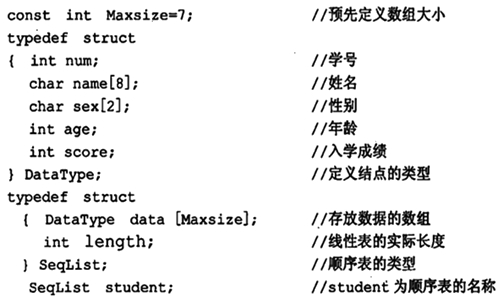
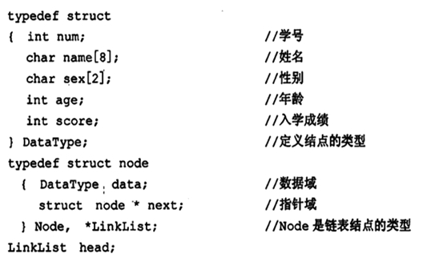
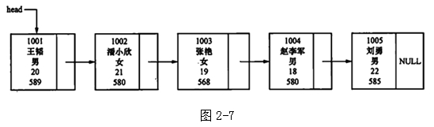
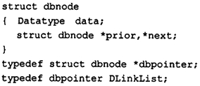

# 大纲


## 题型


## 考纲


> **计算机信息管理专业课程**
>
> 自考笔记在线更新地址 : https://github.com/Eished/self-study-exam_notes


# 第一章 概论

本章重点：数据结构、数据逻辑结构、数据储存结构及运算

难点必考：**算法时间复杂度分析。**

## 1.1 引言

- 计算机处理问题的一般步骤：

  1. 从具体的问题**抽象**出一个适当的**数学模型**；
  2. 设计一个**求解**该数学模型的**算法**；
  3. 用某种计算机语言**编写**实现该算法的**程序**，调试和运行程序直至最终得到问题的解答。

  **算法 + 数据结构 = 程序**

  

## 1.2 基本概念和术语

### 1.2.1 数据、数据元素和数据项

- **数据**：

  - 所有被计算机储存、处理的对象。数值、布尔值等扩展到字符串、表格、图像甚至声音等。

- **数据元素**（元素）：

  - 数据的基本单位，在程序中作为一个整体加以考虑和处理。

- **数据项**：

  - 一般情况下，数据元素由数据项组成。在数据库中数据项又称为**字段**或**域**。它是数据的不可分割的最小单位。

  

### 1.2.2 数据的逻辑结构

- 数据元素之间的逻辑关系。逻辑关系指数据元素之间的关联方式或“邻接关系”。
- 四种基本的逻辑结构：
  - 集合：无邻接关系
  - 线性结构：一对一
  - 树形结构：一对多
  - 图结构：多对多


### 1.2.3 数据的储存结构

- 数据的逻辑结构在计算中的实现称为数据的储存结构（或物理结构）。包括：
  1. 储存数据元素；
  2. 数据之间的关联方式。
- 主要储存方式：
  - 顺序存储：所有存储结点放在一个连续的储存区里。利用结点在存储器中的相对位置来表示数据元素之间的逻辑关系。
  - 链式存储：每个存储结点除了含有数据元素外，还包含指针，每个指针指向一个与本节点有逻辑关系的结点，用指针表示数据之间的逻辑关系。
  - 索引存储；
  - 散列存储。


### 1.2.4 运算

- 增 删 改 查


## 1.3 算法及描述

- C 语言描述算法

  1. 函数描述形式： func()
  2. 输入、输出语句
     - 输入： scanf
     - 输出：printf
  3. 赋值语句 =
  4. 选择语句
     1. 条件语句： if
     2. 分支语句： switch
  5. 循环语句： for 、do while、while
  6. 结束语句： return(表达式)、 break、 exit(异常代码)
  7. 出错语句：error(“错误描述”)
  8. 注释
     1. 单行注释：`// 注释内容`
     2. 多行注释：`/* 注释内容 */`

  

## 1.4 算法分析

- 正确性：能用
- 易读性：修改
- 健壮性：稳定
- 时空性：性能

### 1.4.1 时间复杂度（重要）

- 例【1-4】编制函数求 $1!+2!+...+n!$

  - ```C++
    int fact1(int n)
    {
      int i, j, temp, s;
      s = 0;
      for (i = 1; i <= n; i++)
      {
        temp = 1;
        for (j = 1; j <= 1; j++)
        {
          temp = temp * j;
        }
        s = s + temp;
      }
      return s;
    }
    
    int fact2(int n)
    {
      int i, temp, s;
      s = 0;
      temp = 1;
      for (i = 1; i <= n; i++)
      {
        temp = temp * i;
        s = s + temp;
      }
      return s;
    }
    ```

- 两种算法的计算量不同，如何估算计算量？

  - $T(n)=O(f(n))$ 称为算法的渐进时间复杂度，简称时间复杂度。

  - > 假如问题的输入规模为n，—般情况下，一个算法的计算量是问题规模n的函数。设函数fact1中乘法、加法和赋值的次数记为T（n），则
    > 　　T（n）=n（n+1）/2+n+n（n+1）/2+2n+1=2（n2+n）/2+3n+1=n2+4n+1
    >
    > 　　当n充分大时，n2这一项对T（n）的值起着支配作用，采用数学记号Ｏ（n2）表示T（n）的近似值，写为T（n）=Ｏ（n2），这种表示法称为大Ｏ表示法，它的含义是：当n充分大时，算法的执行时间与n2成正比。大Ｏ表示法的具体提法是：当且仅当存在正常数c和n0，使得：T（n）<=cf（n）。
    > 　　对所有n>n0成立。其中，f（n）为问题的规模n的某个函数，大Ｏ表示法也称为渐进表示法，它不考虑具体的运行时间，只给出算法在问题规模n下执行时间的上界。
    > 　　T（n）=Ｏ（f（n））称为算法的渐进时间复杂度，简称时间复杂度。

  

- 常见的时间复杂度有和从小到大的顺序：

  1. 常数阶 $O(1)$ 
  2. 对数阶 $O(log_2n)$ 
  3. 线性阶 $O(n)$
  4. 多项式阶 $O(n^2)$ 和 $O(n^3)$
  5. 指数阶 $O(2^n)$
     - 指数阶过大，实际不可计算
     - 低于平方阶是高效的

  最坏时间复杂度（常用）、平均时间复杂度、最好时间复杂度


### 1.4.2 空间复杂度

- 一个算法的空间复杂度定义为该算法所耗费的存储空间，它也是问题规模n的函数。通常可记为：S（n）=0（g（n））其中，g（n）为问题规模n的某个函数。空间复杂度是对一个算法在运行过程中临时占用存储空间大小的量度。
  - 一个算法在执行期间所需要的存储空间量应包括以下三个部分：
    1. 程序代码所占用的空间
    2. 输入数据所占用的空间
    3. 辅助变量所占用的空间


# 第二章 线性表（重要）

本章重点：线性表概念和基本特征；线性表的基本运算；顺序表和单链表的组织方法和算法设计。

难点必考：**单链表上的算法设计。**

## 2.1 线性表的基本概念

- 线性表中结点具有一对一的关系，如果结点数不为零，则除起始结点没有直接前驱外，其他每个结点有且仅有一个直接前驱；除终端结点没有直接后继外，其他每个结点有且仅有一个直接后继。
- 线性表基本运算有：初始化、求表长、读表元素、定位、插入、删除。


## 2.2 线性表的顺序储存

### 2.2.1 线性表顺序储存的类型定义

- 线性表的顺序存储：逻辑结构相邻的结点其存储位置也相邻。用顺序存储实现的线性表称为顺序表，一般用数组来表示顺序表，如图2-1所示

  

- 【例2-1】学生档案信息表的顺序存储实现。

  【分析】根据学生档案信息，给出顺序表具体的类型定义。




### 2.2.2 线性表的基本运算在顺序表上的实现

- 顺序表的插入运算`InsertSeqlist（SeqList L,DataType x,int i`）是指在顺序表的第`i（1<=i<=n+1）`个元素之前，插入一个新元素x。使长度为n的线性表`（a1，a2，...，ai-1，a i，...，an`）变为长度为n+1的线性表`（a1，a2，...，ai-1，x，a i，...，an）` 。

  

  具体算法描述如下：

  


- 删除运算`DeleteSeqlist（SeqList L，int i` ）是指将线性表的第 `i（1<=i<=n）`个数据元素删去，使长度为n的线性表`（a1，a2，... ，ai-1， ai，ai+1，...，an）`变为长度为`n-1`的线性表（a1，a2，... ，ai-1， ai+1，...，an） 。

  

  具体算法描述如下：

  


- 定位运算`LocateSeqlist（SeqList L,DataType x）`的功能是查找出线性表L中值等于x的结点序号的最小值，当找不到值为x的结点时，返回结果0。下列算法从左往右扫描顺序表中的元素，考察元素的值是否等于X，描述算法如下：

  


### 2.2.3 顺序表实现算法的分析

- 插入：O(n)
- 删除：O(n)
- 定位：O(n)


## 2.3 线性表的连接储存

### 2.3.1 单链表的类型定义

- 线性表的链接存储是指它的存储结构是链式的。线性表常见的链式存储结构有单链表、循环链表和双向循环链表，其中最简单的是单链表。

  下面举个例子说明单链表的结构：
  　

- **单链表**的一个结点由两部分组成：**数据元素**和**指针**，相当于火车的车厢和车钩。各个结点在内存中的存储位置并不一定连续。链表的结点可以重新连接，相当于火车的编组。
  　　

- 如图所示，data部分称为**数据域**，用于存储线性表的一个数据元素，next部分称为**指针域**或链域，用于存放一个指针，该指针指向本结点所含数据元素的直接后继结点。

  非空的单链表和空单链表，如图所示
  

  a）非空的单链表 b）空单链表

  　　我们通常用结构体类型来定义单链表的结点数据类型：
  　　单链表的类型定义如下：

  ```C
  Typedef　struct node
  　　{ 
  　　Data Type data； //数据域
  　　struct node * next； //指针域
  　　}Node,*LinkList；
  ```

- 例2-2】学生档案信息链表的类型完整描述
  　　

  　　则学生档案信息链式存储实现，如图2-7所示
  　　

  　　为了便于运算实现，在单链表的第一个结点之前增设一个类型相同的结点，称之为头结点，其他结点称为表结点。

  　　
  　　a）带头结点的非空单链表 b）带头结点的空单链表


### 2.3.2 线性表的基本运算在单链表上的实现

- **初始化**的工作是建立一个空表，空表由一个头指针和一个头结点组成。

  算法描述如下：

  

- **求表长**
  在单链表存储结构中，线性表的表长等于单链表中数据元素的结点个数，即除了头结点以外的结点的个数。图2-9所示为数据域为整数的单链表，其表长为4。

  
  - 通过结点的指针域来从头至尾访问每一个结点求表长，让工作指针p通过指针域逐个结点向尾结点移动，工作指针每向尾部移动一个结点，让计数器加1。这样，直到工作指针`p->next为NULL`。
    算法描述如下：

- **读表元素**
  　　通常给定一个序号i，查找线性表的第i个元素。从头指针出发，一直往后移动，直到第i个结点。

  　　单链表的读表元素算法描述如下：
  　　

- **定位**
  　　线性表的定位运算，就是对给定表元素的值，找出这个元素的位置。从头至尾访问链表，直至找到需要的结点，返回其序号。若未找到，返回0。

  　　定位运算算法描述如下：
  　　

- **插入**
  　　单链表的插入运算是将给定值为x的元素插入到链表head的第i个结点之前。插入结点的指针变化如图2-10所示。
  　　

  　　插入算法描述如下：
  　　
  　　注意：p->next=q->next和q->next=p两条语句的执行顺序不能颠倒。

- **删除**
  　　删除运算是给定一个值 i, 将链表中第 i个结点从链表中移出，并修改相关结点的指针域，以维持剩余结点的链接关系。删除结点的指针变化如图2-11所示。
  　　

  　　单链表的删除运算算法描述如下：
  　　
  　　注意，free（p）是必不可少的，无用结点需要释放它的空间。

  

## 2.4 其它运算在单链表上的表现

### 2.4.1 建表

- 我们讨论建立含头结点的单链表。
  方法一：尾插法，这个过程分为三部，首先建立带头结点的空表；其次建立一个新结点，然后将结点连接到头结点之后；重复后面两个步骤，直到线性表中所有元素链接到单链表中。
  　　代码描述如下：

  　　

- 方法二：上面的算法由于每次插入都从表头开始查找，比较浪费时间。因为每次都是把新的结点链接到表尾，我们可以用一个指针指向尾结点，这样就为下一个新结点指明了插入位置。
  　　代码描述如下：

  　　

  　　方法中的链接操作如图2-12，它的时间与元素个数成正比，故其时间复杂度为O（n）。
  　　

  　　图2-12　建表算法中的表尾链入操作

- 方法三：头插法，始终将新增加的结点插入到头结点之后，第一个数据之前。如图2-13所示。
  　　
  　　图2-13　建表算法中的在表头链入操作

  　　代码描述如下：
  　　

  

### 2.4.2 删除重复节点

- 在线性表中，可能有多个结点的元素值是相同的，它们是重复结点。可以设计算法删除重复结点，只保留结点序号最小的那个结点。例如，线性表（4，7，2，5，2，4），删除重复结点后结果为（4，7，2，5）。
  　　用链表作为存储结构，细化上述算法得到最后的算法描述：

  　　

  　　单链表上删除结点时的指针变化如图2-14所示：
  　　
  　　图2-14

  

## 2.5 其它链表

### 2.5.1 循环链表

- 在单链表中，如果让最后一个结点的指针域指向第一个结点可以构成循环链表。在循环链表中，从任一结点出发能够扫描整个链表。
  　　图2-15给出常见的循环链表，图2-15 a、b分别表示带头结点的非空循环链表和空循环链表，头指针是head。在这种结构下，要找到尾结点可以从头指针head出发扫描所有的结点。在图2-15 c、d中，链表没有设头指针，只设尾指针rear。这样，首结点表示为：`rear->next->next`,首尾结点都能方便地访问。

  　　
  　　图2-15
  　　a）带头结点的非空循环链表 
  　　b）带头结点的空循环链表
  　　c）设立尾指针的非空循环链表 
  　　d）设立尾指针的空循环链表

  

### 2.5.2 双向循环链表

- 双向循环链表的结点结构如图2-16所示：
  　　
  　　图2-16　双向循环链表结点结构

  　　双向循环链表示意图如图2-17所示，`prior`与`next`类型相同，它指向直接前驱结点。头结点的prior指向最后一个结点，最后一个结点的`next`指向头结点。
  　　
  　　图2-17　双向循环链表示意图
  　　a）空表　　　　b）非空表

- 双向循环链表与单链表类似，用C语言描述如下：
  　　

  双向循环链表是一种对称结构，可以用下列等式表示：`p=p->prior->next=p->next->prior`
  在单链表中，找直接后继结点的时间复杂度是O（1）。在双向循环链表中，找直接后继结点和前驱结点的时间复杂度都是O（1）。

- 双向循环链表的求表长、定位、按序查找等运算的实现和单链表基本相同，这里我们讨论它的插入和删除操作。

  1. .删除
     　　在单链表中删除结点时，需要用一个指针指向待删结点的前驱结点，在双循环链表中，设p指向待删结点，删除*p可通过下述语句完成，执行效果如图2-18所示。

     1. `p->prior->next=p->next；` 　//p前驱结点的后链指向p的后继结点
     2. `p->next->prior=p->prior；` //p后继结点的前链指向p的前驱结点
     3. `free（p）；` //释放*p的空间

     1）、（2）这两个语句的执行顺序可以颠倒。

     　　
     　　图2-18双向循环链表上结点的删除
     　　a）删除结点*p之前　　　b）删除结点*p后

  2. 插入
     在`p`所指结点的后面插入一个新结点`*t`，需要修改四个指针：

     1. `t->prior=p；`
     2. `t->next=p->next；`
     3. `p->next->prior=t；`
     4. `p->next=t；`

     插入操作过程如图2-19所示，注意这些语句之间的顺序。

     　　
     　　图2-19　双向循环链表上结点的插入
     　　a）插入前　　　　　　　　　b）插入后

     

## 2.6 顺序实现与链接实现的比较

- 查找：对于按位置查找运算，顺序表是随机存取，时间复杂度为O（1）。单链表需要对表元素进行扫描，它时间为复杂度为O（n）。
- 定位：基本操作是比较，顺序表和单链表上的实现算法的时间复杂度是相同的，均为O（n）
- 插入和删除：在顺序表和链表中，都需要进行定位。在顺序表中，其基本操作是元素的比较和结点的移动，平均时间复杂度为O（n）。在单链表中，由于需要定位，基本操作是元素的比较，尽管不需要移动结点，其平均时间复杂度仍然为O（n）。
- 单链表的每个结点包括数据域与指针域，指针域需要占用额外空间。从整体考虑，顺序表要预分配存储空间，如果预先分配得过大，将造成浪费，若分配得过小，又将发生上溢；单链表不需要预先分配空间，只要内存空间没有耗尽，单链表中的结点个数就没有限制。


# 第三章 栈/队列和数组

本章重点：栈和队列的特征；顺序栈和链栈上基本运算的实现和简单算法；顺序队列和链队列上基本运算的实现和简单算法。

难点必考：**循环队列的组织，队列满和队列空的条件及循环队列基本运算的算法。**

## 3.1 栈

### 3.1.1 栈的基本概念

### 3.1.2 栈的顺序实现

### 3.1.3 栈的链接实现

### 3.1.4 栈的简单应用和递归


## 3.2 队列

### 3.2.1 队列的基本概念

### 3.2.1 队列的顺序实现

### 3.2.1 队列的链接实现

### 3.2.1 队列应用


## 3.3 数组

### 3.3.1 数组的逻辑结构和基本运算

### 3.3.1 数组的储存结构

### 3.3.1 矩阵的压缩储存


## 3..4 应用举例

## 3.5 小结


# 第四章 树和二叉树

本章重点：树形结构的概念；二叉树的定义、储存结构和遍历算法。

**难点必考：二叉树的遍历算法和哈夫曼树构造算法。**

## 4.1 树的基本概念

### 4.1.1 树的基本概念

### 4.1.2 树的相关术语


## 4.2 二叉树

### 4.2.1 二叉树的基本概念

### 4.2.2 二叉树的性质


## 4.3 二叉树的储存结构

### 4.3.1 二叉树的顺序储存结构

### 4.3.2 二叉树的链式储存结构


## 4.4 二叉树的遍历

### 4.4.1 二叉树遍历的递归实现

### 4.4.2 二叉树的层次遍历

### 4.4.3 二叉树遍历的非递归实现

### 4.4.4 应用举例


## 4.5 树和森林

### 4.5.1 树的储存结构

### 4.5.2 树、森林与二叉树的关系

### 4.5.3 树和森林的遍历


## 4.6 判定树和哈夫曼树

### 4.6.1 分类与判定树

### 4.6.2 哈夫曼（Huffman）树与哈夫曼算法

### 4.6.3 哈夫曼编码


## 4.7 小结


# 第五章 图

本章重点：图的邻接矩阵和邻接表两种储存结构，图的深度优先和广度优先搜索算法。

**难点必考：求最小生成树的 Prim 算法；求单源最短路径；求拓扑排序算法。**

## 5.1 图的基本概念

### 5.1.1 图的应用背景

### 5.1.2 图的定义和术语


## 5.2 图的储存结构

### 5.2.1 邻接矩阵

### 5.2.1 邻接表


## 5.3 图的遍历

### 5.3.1 连通图的深度优先搜索

### 5.3.2 连通图的广度优先搜索

### 5.3.3 应用举例


## 5.4 图的应用

### 5.4.1 最小生成树

### 5.4.2 拓扑排序


## 5.5 小结


# 第六章 查找

本章重点：二分查找方法；二叉树的查找方法；散列表的查找方法。

难点必考：**二叉树的插入算法。**

## 6.1 基本概念

## 6.2 静态查找表

### 6.2.1 顺序表上的查找

### 6.2.2 有序表上的查找

### 6.2.3 索引顺序表上的查找


## 6.3 二叉排序树


## 6.4 散列表

### 6.4.1 常用散列法

### 6.4.2 散列表的实现

### 6.4.3 散列表的基本操作算法


## 6.5 小结


# 第七章 排序

本章重点：直接插入排序算法、冒泡排序算法、快速排序算法，直接选择排序算法、堆排序算法、二路归并排序算法。

难点必考：**快速排序算法和堆排序算法。**

## 7.1 概述


## 7.2 插入排序


## 7.3 交换排序

### 7.3.1 冒泡排序

### 7.3.2 快速排序


## 7.4 选择排序

### 7.4.1 直接选择排序

### 7.4.2 堆排序


## 7.5 归并排序

### 7.5.1 有序序列的合并

### 7.5.2 二路归并排序


## 7.6 小结