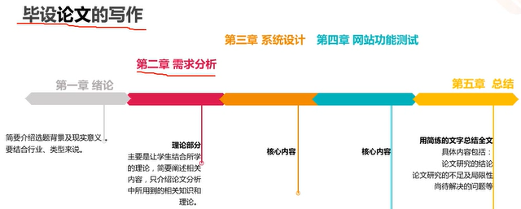
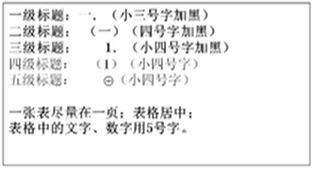

# 自考计算机专业毕业论文指导

> **计算机信息管理专业课程**
>
> 自考笔记在线更新地址 : https://github.com/Eished/self-study-exam_notes

## 1.选题

- **出发点：**
  1. 所学专业
  2. 工作岗位
  3. 个人爱好
  4. 手中资料
- **可选题目类型：**不限于此类
  1. 网络设计类
     - XX公司（学校）网络规划设计
     - XX单位网络优化设计
  2. 软件类
     - 管理信息系统设计与实现
     - XX网站设计与实现
     - XX APP设计与实现
  3. 硬件设计及其他
     - 嵌入式设计
     - 单片机应用
     - 智能家居…设计与实现

80%自己实现

## 2.任务书撰写

按章-节目录形式写，1-2页，类似于目录。

1. **本设计选题根据**
   - 为什么选择这个题目
   - 选题背景和意义
2. **本设计的结构与内容：**
   - 论文结构安排，以及计划在每一个章节要阐述的内容，以目录形式写出，即论文模板的研究框架。
3. **本人在该设计中完成的具体工作**
   - 为完成设计，本人将要干那些工作
   - （数据自资料搜集整理分析，分析XX管理的效果，提出改进对策建议等）
4. **主要参考文献、资料**
   - 10-15篇左右的近五年的文献
   - 来自正规教材、学术论文等，谨慎参考网上资料。

## 3.实施

以 XX 网站设计为例：

毕业**论文**的写作：设计与论文同步进行。

## 4.项目收尾 答辩

- 自查和完善论文
- 准备答辩PPT
- 储备与论文相关的理论知识

## 毕业设计论文格式要求

- 撰写的毕设应包括以下内容：
  1. 封面（论文题目、专业、姓名）
  2. 论文内容摘要（中文，200-400字）
  3. 论文目录
  4. 论文正文（1万字以上）
  5. 参考文献（10-15条）
  6. 附件代码

特别提醒：毕设论文如若存在严重雷同或抄袭将不能够毕业。

### 注意事项：

1. 层次结构合理，逻辑清晰，语言流畅
   - 建议按照任务书的结构（大的框架），切忌格式不规范，各级标题不清晰或层级混乱等。
   - 采用书面语言，避免使用口号式、大白话及企业内部的说法，即论文不能写成工作总结、方案介绍、规划书、设计书。
2. 论文内容的具体要求是：
   1. 论文要结合企业实际
      - 论文要有结合企业实际的分析内容，要有相关数据资料的分析，不能是大量借鉴和拷贝他人的观点和内容
      - 建议在写论文时，一定要收集必要的相关数据资料，对现状分析要具体，分析存在的问题、原因。
      - 解决问题一定要基于前面的问题分析，要具们针对性和可操作性
   2. 论文要运用相关的理论、方法
      - 要运用相关理论知识和方法来分析问题和解决问题
   3. 论文一定要有自己独立的设计内容
      - 论文要们学生自己的独立见解，不能是企业现有方案、在运用相关理论知识的基础上，联系企业实际分析本金业独有的问题，诊断原因，并有针对性地提出符合本企业实际的解决方案。
      - 尤其是来自同一企业选择同一题目的学生，可从不同角度、不同方面来进行分析论述，写出自己的独立见解，避免雷同。

