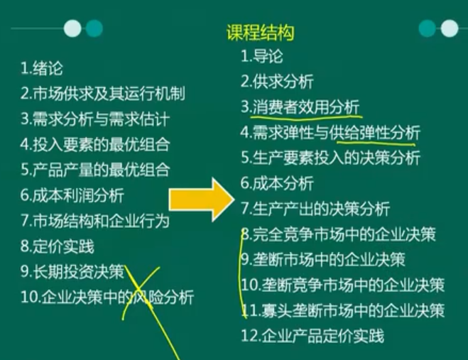
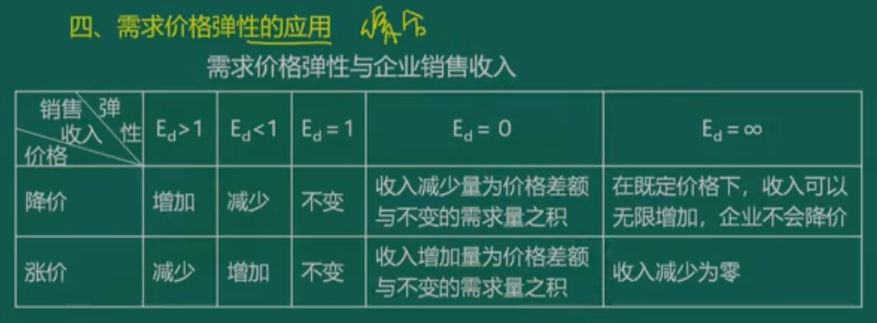
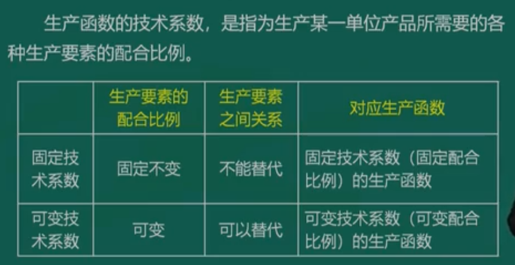
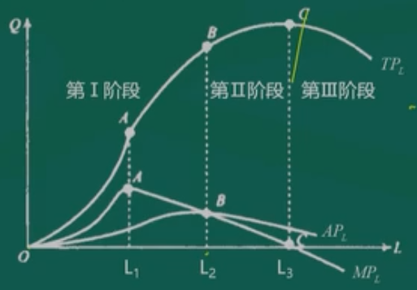
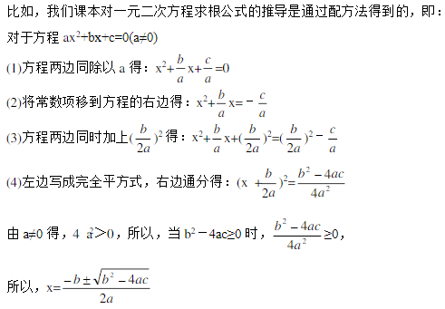
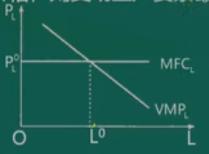
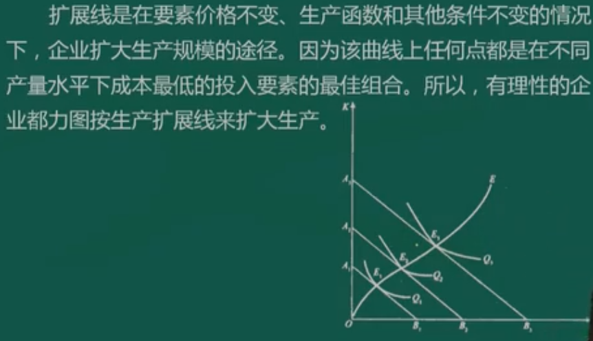
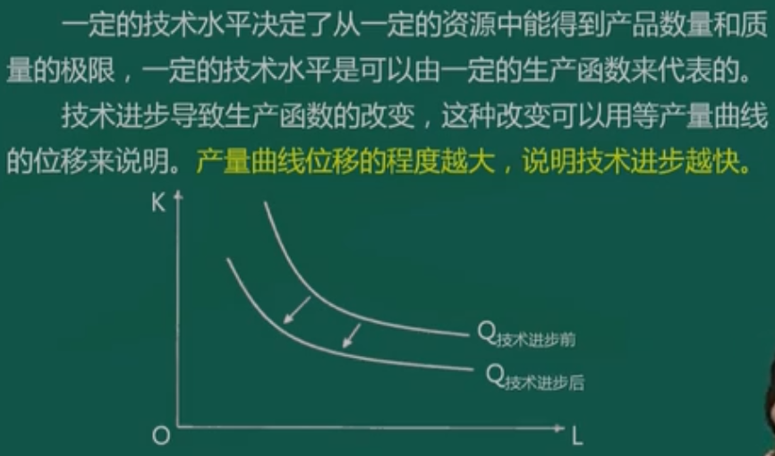
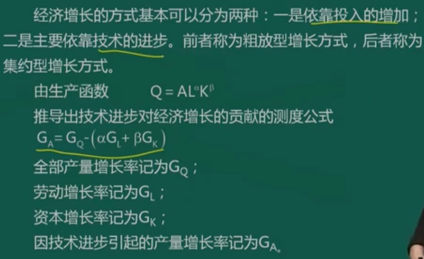

# 管理经济学考纲分析

## 课程性质和课程目标

### 课程性质

- 运用经济学和决策科学的分析工具。
- 为企业的管理决策实践提供理论和经济分析的思维框架。

### 课程目标

1. 引发对经济学理论、经济学分析方法以及决策科学的兴趣。
2. 掌握管理经济学的基本理论和分析方法。
3. 了解管理经济学的理论、方法与企业管理决策的相互关系。
4. 学会用管理经济学的理论、方法去分析和解决企业的各种管理决策问题。
5. 提高市场经济条件下管理决策的能力和水平。

### 课程相关内容

- 经济学原理与方法来自微观经济学，重点是对管理决策的应用。
- 与许多专业管理课（企业管理、市场营销、统计学）有联系。
- 具备高等数学知识，最高涉及微分学。

### 课程重点难点

1. 微观经济学的基本原理和编辑分析方法；
2. 经济学原理和方法在各种具体决策问题中的应用。

### 考核目标

1. 识记：
   - 识别记忆大纲规定的知识点，做出正确表述、选择和判断。
2. 领会：
   - 全面把握基本概念、基本原理和方法，掌握之间的联系，做出正确的判断、解释和说明。
3. 简单应用：
   - 运用少量知识点，分析和解决一般应用的决策问题。
4. 综合应用：
   - 运用多个知识点，综合分析和解决复杂应用的决策问题。

### 题目类型

1. 单项选择题：20题，每小题1分，共20分。
2. 简答题：5小题，每小题6分，共30分。
3. 计算题：5小题，每小题6分，共30分。
4. 案例分析题：1大题，共20分。

### 新教材改动

## 课程内容和考核要求

## 第一章导论

#### 学习目的与要求

参考资料自考通：重点已经标出，不再做笔记。

### 1.1 管理经济学的研究对象

#### 1.1.1 管理经济学的定义

​	管理经济学是运用**经济学理论**和**决策科学**的分析工具，使一个企业组织能够在一定的**经济环境中**，在面临的**各种约束条件**之下，最有效的达到自己既定目标的**科学**。

1. 管理经济学的研究对象是与资源配置有关的管理决策问题。
2. 管理经济学以经济理论和决策工具为分析工具。

#### 1.1.2 决策的基本过程

​	管理经济学解决的是与资源合理配置有关的管理决策问题，主要是量产决策和价格决策。

- 企业决策过程一般包括以下五个基本步骤：

  1. 明确企业面临的问题；
  2. 明确企业目标；
  3. 列举解决企业问题的可能方法；
  4. 从列出的解决办法中选择最优方案；
  5. 执行最优方案。

- 正确的决策条件包括：

  1. 明确的决策目标；
  2. 较高的决策者素质；
  3. 较充足的决策信息资料；
  4. 科学的理论和方法。

  正确决策的准则为：采取该项决策之后的情况比采取之前有所改善。

#### 1.1.3 管理经济学与微观经济学的关系

1. 微观经济学
   1. 价格理论
   2. 三个基本假设：
      - 完全理性
      - 完全信息
      - 市场出清
2. 管理经济学与微观经济学的区别
   1. 目的
   2. 方法
   3. 假设

#### 1.1.4 管理经济学的主要内容

1. 需求理论
2. 生产理论
3. 成本理论
4. 市场理论

### 1.2 管理经济学的基本分析方法

#### 1.2.1 无约束最优化

1. 边际与边际分析
2. 最大值和最小值
3. 无约束的利润最大化

#### 1.2.3 有约束最优化

### 1.3 市场经济条件下的企业

#### 1.3.1 企业的概念与特征

1. 企业的概念

   - 盈利为目的

   - 经济实体
   - 企业形式：
     - 个人、合伙、有限责任、股份

2. 企业的特征

   1. 自主经营
   2. 自负盈亏
   3. 产权明晰

#### 1.3.2 企业理论

- 企业产生的根源：交易成本高，交易花费的时间和精力
- 企业目标：价值最大化
- 企业决策：价值最大化

#### 1.3.3 企业利润与决策

1. 企业利润
   - 会计利润：企业已经取得的销售收入减去会计账目上已经发生的各种费用（即会计成本）的差。固定的显性成本。
   - 经济利润：收入减去从事某项经济活动的显性成本和隐形成本之和，企业所有者自己提供的资本、自然资源和劳动机会成本。和资源配置有关。
2. 机会成本
   1. 投资办企业=借出的利息
   2. 自己管理企业=别的公司任职
   3. 闲置机器=零机会成本
   4. 生产A的机器用来生产B=生产A的利润收入
3. 企业的重要决策
   1. 谁生产、生产什么？
   2. 生产多少？
   3. 怎么生产最经济？

## 第二章 供给分析

### 2.1 需求分析

#### 2.1.1 需求函数

1. 需求（Demand）

   - 一定时间
   - 价格水平
   - 愿意且能够购买
   - 商品或服务的数量

2. 影响需求的因素

   1. 价格
   2. 收入水平
   3. 相关商品的价格
      - 替代品VS互补品
   4. 消费者偏好
   5. 价格预期、市场规模、地区因素

3. 需求函数

   - 需求量与影响因素的关系：
     - $$
       Q_d=f(P,I,P_R,T...)
       $$
     
       
     
     - Qd 需求量，P 价格，I 收入，Pr 替代品或互补品的价格，T 消费者偏好
   - 价格与需求量的关系：
     
     - $$
       Q_d=f(P)
       $$
     
       

   1. 需求表
   2. 需求曲线
   3. 需求定理：商品的需求量与价格呈反向变动

4. 个人需求与市场需求

   - 个人需求：某个消费者购买某种商品的数量
   - 市场需求：市场上所有消费者愿意并且能够购买这种商品的数量

5. 企业市场的需求：市场购买企业某种商品的数量

   - 垄断市场
   - 完全竞争市场
   - 寡头垄断
   - 垄断竞争

2.1.2 需求量的变动和需求的变动

- 需求量变动-价格变动-沿需求曲线运动
- 需求变动-非价格因素变动-需求曲线发生位移

#### 2.1.3 需求估计

1. 需求估计方法
   1. 根据统计资料估计需求函数
   2. 市场调查方法
      - 访问调查法：面谈、访问
      - 市场实验法：具有较大客观性，模拟或实际市场进行
   3. 统计分析方法
      1. 建立理论模型
      2. 收集数据
      3. 选择函数形式
      4. 对结果的估计和
2. 需求预测方法
   1. 时间序列
      - 长期趋势
      - 周期变动
      - 季节效应
      - 随机波动
      - 时间序列预测模型：平滑技术，回归分析法。
   2. 调查和民意测验技术
   3. 经济计量模型
   4. 投入产出分析

### 2.2 供给分析

#### 2.2.1 供给函数

1. 供给（Supply）
2. 影响供给的因素
   1. 商品的价格
   2. 生产成本
   3. 替代品的价格
   4. 生产者对价格的期望
   5. 除以上主要因素外：政府税收、补贴因素等
3. 供给函数
   - $$
     Q_s=f(P,C,P_R,E...)
     $$
   
     
   
   - Qs 供给量，P 价格， C 成本，Pr 替代品价格，E 生产者价格期望
   
   - $$
     Q_s=f(P)
     $$
   
4. 供给表
5. 供给曲线

#### 2.2.2 供给量的变动和供给的变动

- 供给量的变动-价格变动-沿供给曲线运动
- 供给的变动-非价格因素变动-供给曲线发生位移

### 2.3 市场均衡分析

#### 2.3.1 市场均衡与供求法则

- 市场均衡：是指在影响需求和供给的其他因素都不变的条件下，市场上的商品价格达到的水平。
- 供求法则：反映供求状况与价格之间变化关系。
- 用函数形式将市场均衡状态表示：
  
  - $$
    Q_s=Q_d
    $$
  
    

#### 2.3.2 市场均衡变动

1. 需求的变动与市场均衡量的变动
2. 供给的变动与市场均衡量的变动
3. 需求和供给同时变动与市场均衡量的变动

#### 2.3.3 价格管制对市场均衡的影响

1. 政府规定的最低价格：保护、扶持，高于均衡价格
2. 政府规定的最高价格：生活必须品，低于均衡价格

## 第三章 消费者效用分析

### 3.1 效用理论概述

#### 3.1.1 效用的概念

- 效用：消费时的满足感（utility）

#### 3.1.2 效用理论基本假设

1. 完全信息
2. 偏好次序

#### 3.1.3 基数效用与序数效用

1. 基数效用论
2. 序数效用论

### 3.2 基数效用论与边际效用分析

#### 3.2.1 总效用与边际效用

- 总效用（Total utility，**TU**）：消费获得的效用总和
- 边际效用（Marginal Utility，**MU**）：增加一单位消费时，所获得的的总效用量的增量
- 边际效用公式：
  - $$
    MU={\Delta{TU}\over{\Delta{Q}}}
    $$
  
    
  
  - 如果消费量增量非常小，趋近于零，**边际效用**就是**总效用对商品消费量的一阶导数:
    $$
    MU={\displaystyle \lim_{\Delta{Q} \to 0}}{\Delta{TU}\over{\Delta{Q}}}={\frac{dTU}{dQ}}
    $$
    

#### 3.2.2 边际效用递减规律

- 一般情况，效用增量是递减的，边际效用最终会递减

#### 3.2.3 消费者均衡（重要）

- 有限的货币收入分配在购买中获得效用的最大化
- 效用最大化时的状态称为消费者的均衡状态。
- 均衡的条件：
  - 收入固定的情况下，市场上各种商品的价格已知，消费者应该使自己所购买的各种商品的边际效用与其相应的价格之比相等
- 假设某一个消费者用收入 $I$ 只消费两种商品 X 和 Y ，其效用函数为 U=U(X, Y)。X的商品价格为 Px，Y的商品价格为 Py，于是收入约束为：$\displaystyle P_xX+P_YY=I$。
  - 该消费者效用最大化均衡条件为：

$$
\frac{MU_x}{P_x}=\frac{MU_y}{P_y}
$$

#### 3.2.4 个人需求曲线的推导

1. 需求曲线向右下方倾斜。
2. 需求曲线表示在不同价格下，消费者所愿意购买的数量。
3. 需求曲线上的每一点都是消费者在既定价格下的效用最大化的均衡点。

#### 3.2.5 消费者剩余

- 愿意支付的价格与购买实际支付的价格之间的差额
- 由边际效用递减规律决定的
- 不是实际收入的增加

### 3.3 序数效用论与无差异曲线分析

#### 3.3.1 无差异曲线

1. 无差异曲线的性质

   消费者偏好相同的两种商品的不同数量的各种组合。
   $$
   U=f(X,Y)
   $$

   1. 向右下方倾斜，形状凸向原点
   2. 任意两条不相交
   3. 距离原点越远 效用水平越高

2. 边际替代率（MRS）
   $$
   MRS=-\frac{\Delta{Y}}{\Delta{X}}
   $$

   - 消费者保持自己效用水平不变的情况下，为增加一种商品（X）的消费量所愿意放弃另一种商品（Y）的消费量
   - 也可以用如下公式：

   $$
   MRS_{xy}=\frac{MU_x}{MU_y}
   $$

   

#### 3.3.2 消费者预算线

- 给定价格和收入，所有收入用于消费能获得的商品组合点的轨迹。

$$
P_xX+P_yY=I
$$

#### 3.3.3 消费者均衡 

- 消费者实现效用最大化的条件是：**预算线**和**无差异曲线切点**代表的商品组合。

即：
$$
MRS=-\frac{\Delta{Y}}{\Delta{X}}=\frac{P_x}{P_y}
$$
消费者均衡条件：
$$
MRS_{xy}=\frac{MU_x}{MU_y}=\frac{P_x}{P_y}
$$

#### 3.3.4 消费者需求曲线

1. 价格消费曲线：
   - 某一种商品的不同价格水平相联系的消费者效用最大化的均衡点的轨迹
2. 需求曲线的推导
   - 需求曲线上每一点都是在每一价格水平上给消费者带来最大效用水平或满足程度的需求量。

## 第四章 需求弹性与供给弹性分析

### 4.1 需求弹性

​	需求量对其影响因素变动的反应敏感程度

#### 4.1.1 需求价格弹性

- 需求价格弹性计算公式：
  - $E_d$ 为需求价格弹性系数；Q 为商品需求量；P 商品价格；$\Delta{Q}$ 为商品需求量的变化量；$\Delta{P}$ 为商品价格的变化量。

$$
\displaystyle \mbox{需求价格弹性系数}\big(E_d\big)={\mbox{需求量变动的百分比}\over\mbox{价格变动的百分比}}={{\Delta{Q}\over{Q}}\over{\Delta{P}\over{P}}}={\Delta{Q}\over{\Delta{P}}}\cdot{{P}\over{Q}}
$$

- 弧弹性：求平均值，也称为平均弹性

$$
E_d=\frac{Q_2-Q_1}{P_2-P_1}\times\frac{P_1+P_2}{Q_1+Q_2}
$$

- 点弹性：需要已知需求函数

$$
E_d=\lim_{\Delta{P}\to 0}{\frac{\Delta{Q}}{\Delta{P}}\times\frac{P}{Q}}=\frac{dQ}{dP}\times\frac{P}{Q}
$$

- 补充数学知识：
  - 导数：导数是函数的局部性质。函数在某一点的导数描述了这个函数在这一点附近的变化率。如果函数的自变量和取值都是实数，函数在某一点的导数就是该函数所代表的曲线在这一点上的切线斜率。

$$
y=ax^3+bx^2+cx+d
$$

$$
\frac{dy}{dx}=3ax^2+2bx+c
$$

##### 二、需求价格弹性的种类

1. 根据弹性系数绝对值大小分为五类
   - 完全无弹性 Ed = 0
   - 缺乏弹性  Ed < 0
   - 单位弹性 Ed = 1
   - 富有弹性 Ed > 1
   - 完全弹性 Ed = $\infty$

##### 三、影响需求价格弹性的主要因素

1. 商品的替代性
2. 商品用途的广泛性
3. 商品对消费者生活的重要程度
4. 商品的消费支出在消费者预算总支出中所占的比重
5. 所考察的消费者调节需求量的时间
6. 消费者收入水平、商品价格高低、教育程度等

##### 四、需求价格弹性的应用（重要）

#### 4.1.2 需求的收入弹性

- 需求收入弹性计算公式：
  - $E_d$ 为需求收入弹性系数；Q 为商品需求量；M 收入；$\Delta{Q}$ 为商品需求量的变化量；$\Delta{P}$ 为商品价格的变化量。

$$
\displaystyle \mbox{需求收入弹性系数}\big(E_d\big)={\mbox{需求量变动的百分比}\over\mbox{收入变动的百分比}}={{\Delta{Q}\over{Q}}\over{\Delta{M}\over{M}}}={\Delta{Q}\over{\Delta{M}}}\cdot{{M}\over{Q}}
$$

- 弧弹性：同价格弹性
- 点弹性：同价格弹性

二、需求收入弹性的种类

1. 完全无弹性 Em = 0
2. 缺乏弹性  Em < 1
3. 单位弹性 Em = 1
4. 富有弹性  Em > 1
5. 负弹性  Em < 0

三、需求收入弹性的应用

- 企业确定产品结构调整方向的重要依据，也是国家确定产业结构发展方向的重要依据。

#### 4.1.3 需求的交叉弹性

- 一种商品需求量变动对相关商品的价格变动的反应程度

- 需求价格弹性计算公式：
  - $E_d$ 为需求价格弹性系数；Q 为商品需求量；P 商品价格；$\Delta{Q}$ 为商品需求量的变化量；$\Delta{P}$ 为商品价格的变化量。

$$
\displaystyle \mbox{需求交叉弹性系数}\big(E_d\big)={\mbox{X商品需求量变动的百分比}\over\mbox{Y商品价格变动的百分比}}={{\Delta{Q_x}\over{Q_x}}\over{\Delta{P_y}\over{P_y}}}={\Delta{Q_x}\over{\Delta{P_y}}}\cdot{{P_y}\over{Q_x}}
$$

- 弧弹性：同价格弹性
- 点弹性：同价格弹性

二、需求收入弹性的种类

1. Ec > 0 ，替代关系
2. Ec < 0，互补关系
3. Em = 0，无关系

### 4.2 供给弹性

#### 4.2.1 供给价格弹性的概念

- 一种商品供给量的相对变动对于其价格的相对变动的反应程度，是供给率与价格变动率之比，其大小用供给价格弹性系数来表示。
- 计算公式：结果是正值

$$
\displaystyle \mbox{供给价格弹性系数}\big(E_s\big)={\mbox{供给量变动的百分比}\over\mbox{价格变动的百分比}}={{\Delta{Q_s}\over{Q_s}}\over{\Delta{P}\over{P}}}={\Delta{Q_s}\over{\Delta{P}}}\cdot{{P}\over{Q_s}}
$$

- 五种分类：
  - 完全无弹性 Es = 0
  - 缺乏弹性 0 < Es < 1
  - 单位弹性 Es = 1
  - 富有弹性 1 < Es < $\infty$
  - 完全弹性 Es = $\infty$

- 影响因素
  1. 商品生产时间的长短
  2. 商品生产的周期
  3. 生产规模和规模变化的难易程度
  4. 成产成本的变化
  5. 商品本身特性

## 第五章 生产要素投入的决策分析

### 5.1 生产函数

#### 5.1.1 生产函数的概念

1. 生产要素

   - 四类：
     - 土地（N）：一切生产物质
     - 劳动（L）：体力 智力总和
     - 资本（K）：劳动 土地生产出来，再用于生产过程的中间产品。资本的货币形态称为资本货币。
     - 企业家才能（E）：经营企业的组织能力、管理能力、创新能力。

2. 生产函数

   要点：

   - 投入和产出的关系
   - 最大产量
   - 函数关系
   - 技术不变

   一般形式：$Q=f(L,K,N,E)$

   简化：$Q=f(L,K)$

#### 5.1.2 常见生产函数

1. 柯布道格拉斯生产函数
   - Q 是制造业生产量；L 为劳动投入要素；K 为资本投入要素；A和$\alpha，\beta$都是正的常数，常用假定是A=1，$\alpha+\beta=1$，这样：$Q=L^{\alpha}K^{1-\alpha}$

$$
Q=AL^{\alpha}K^{\beta}
$$

2. 它的对数形式线性函数，可以使用线性回归分析法进行经验估计：

$$
\lg{Q}=\lg{A}+\alpha\lg{L}+\beta\lg{K}
$$

3. 它是齐次生产函数。$\alpha+\beta$ 可以判断规模报酬的情况。
4. $\alpha+\beta=1$ 的经济含义，$\alpha$ 和 $\beta$ 分别表示劳动和资本的产出弹性（$E_l、E_k$），据此可以展示劳动和资本在生产过程中的相对重要性。

二、学习曲线

1. 学习曲线是一种动态生产函数，或称生产改进函数。它以下面的假设为依据：知识对劳动的要素替代是生产经验的函数。
   1. L 是每单位产量的劳动投入量；N 是以前的产量累计数；B 和 $\beta$ 是大于零的常数，且$\beta<1$。 $\beta$ 大小表示“学习效应”的大小。

$$
L=BN^{-\beta}
$$

### 5.2 边际生产函数分析

#### 5.2.1 短期生产函数概念

1. 短期生产函数=单变量生产函数
2. 表达式：
   - $Q=f(L,\overline{K})$

#### 5.2.2 总产量、平均产量、边际产量

- **总产量（TP）**：一定量某种生产要素所生产出来的全部产量。
  - $TP_L=Q=f(L,\overline{K})$
- **平均产量（AP）**：平均每单位某种生产要素所生产出来的产量。
  - $AP_L=\frac{TP_L}{L}$
- **边际产量（MP）**：某种生产要素每增加一单位所增加的产量。
  - $MP_L=\frac{\Delta{Q}}{\Delta{L}}=\frac{\Delta{TP_L}}{\Delta{L}}$
  - $MP_L=\frac{d{Q}}{d{L}}=\frac{d{TP_L}}{d{L}}$
- 三者的关系：
  1. 递减
  2. 相交
  3. 最大值

#### 5.2.3 边际收益递减规律

- 也称报酬递减规律
- 注意以下五点：
  1. 生产技术状况不变
  2. 以一种要素可变，其它要素不变
  3. 某种变动要素投入量增加，边际收益一般经历递增、递减，负数的过程
  4. 可变生产要素的各个单位是同质的
  5. 如果生产要素只能按固定比例组合，这个规律不适用

#### 5.2.4 生产三阶段

1. 第一阶段：
   - 可变要素投入从零开始，到平均产量最大值L2为止。这一阶段增加投入有效。
2. 第二阶段：
   - 可变要素投入从平均产量最大值的L2开始，到边际产量为0的L3为止。这一阶段增加投入任然会有所收益。
3. 第三阶段：
   - 可变要素投入从边际产量为0的L3以后的阶段。追加生产要素的投入不合理。

> 一元二次方程解法：
>
> 

#### 5.2.5 一种生产要素变动时要素最佳投入量的确定

1. 根据企业的生产经营目标确定
2. 追求最大产量，L3 点
3. 追求单位产品成本最低（变动成本），L2 点
4. 追求最大利润，第二阶段

1. **边际产品价值（VMP）**：每增加一个单位的可变要素所增加的收入
   - 假定变动要素为 L，边际产品价值公式：
   - VMP 为变动要素的边际产品价值；TR为收入增量；Q 产品产量增量；MR 为边际收益；

$$
VMP_L=\frac{\Delta{TR}}{\Delta{L}}=\frac{\Delta{TR}}{\Delta{Q}}\cdot\frac{\Delta{Q}}{\Delta{L}}=MR \cdot MP_L
$$

- 如果价格不变，则边际收益与产品价格相等:
  - P 为产品单价

$$
VMP_L=MP_L\cdot P
$$

2. **生产要素的边际成本（MFC）**：每增加使用一单位的某种可变生产要素所增加的成本。
   - 假定变动要素为 L，生产要素的边际成本公式：
   - MFC 为生产要素的边际成本；TC为总成本；$\Delta{TC}$ 为总成本增量；PL 为变动要素的价格

$$
MFC_L=\frac{\Delta{TC}}{\Delta{L}}=\frac{\Delta{(P_L\cdot L)}}{\Delta{L}}=P_L
$$

3. **生产要素最佳投入量的确定**

   - 当一种生产要素变动时，生产要素最佳投入量的确定应满足以下均衡条件：

   $$
   VMP_L=MPC_L
   $$

   - 当生产过程中可变生产要素唯一且价格既定时，生产要素的边际成本等于变动生产要素的价格，则变动生产要素最佳投入量的均衡条件为：

   $$
   VMP_L=P_L
   $$

   

### 5.3 长期生产函数分析

#### 5.3.1 等产量曲线

- 等产量曲线：用来表示在技术水平不变的条件下，生产同一产量的两种生产要素投入量的各种不同组合的轨迹。

- 特点：

  1. 向右下方倾斜的曲线，即斜率为负值。

  2. 同一平面可以有无数条等产量曲线。同一条等产量曲线代表同样的产量，不同的等产量曲线代表不同的产量。离原点越远产量越高，越近越低。

  3. 同一平面内不能相交。

  4. 等产量曲线形状反映出两种投入要素之间的替代性。

     1. 生产要素的完全替代。直线
     2. 完全不可替代。直角平行线
     3. 一般的替代。曲线

  5. 等产量曲线是一条凸向原点的曲线。

     - 边际技术替代率（marginal rate of technical ，MRTS）：为了维护相同产量水平，增加一种生产要素的数量与可以减少的另一种生产要素的数量之比。

     - 要素 L、K，则技术替代率为 ：

       $\displaystyle MRTS_{LK}=-\frac{\Delta{K}}{\Delta{L}}$

     - 边际技术替代率递减规律：产量不变，一种生产要素不断增加，每一单位这种生产要素所能代替的另一种生产要素的数量是递减的。

       $\displaystyle MRTS_{LK}=-\frac{MP_L}{MP_K}$

#### 5.3.2 等成本曲线

- 表明成本与生产要素价格既定的条件下，可以购买到的两种生产要素数量的最大组合的线。

  $\displaystyle P_L\cdot L+P_K \cdot K=C$

- 等成本曲线斜率：

  $\displaystyle K=-\frac{P_L}{P_K}$

#### 5.3.3 生产要素最佳组合的确定

1. 产量既定成本最小的要素组合

   - 等成本线与等产量曲线的切点，成本最低

2. 成本既定产量最大的要素组合

   - 等成本线与等产量曲线的切点，产量最高

3. 生产要素最佳组合原则

   - 最佳组合点都在等产量曲线和等成本曲线相切的切点上。

   - 等产量曲线的斜率的绝对值等于等成本线的斜率的绝对值，等产量曲线的斜率的绝对值为边际技术替代率，等成本线的斜率的绝对值为生产要素的价格比。

   - 所以企业投入要素最佳组合均衡条件是：
     $$
     \displaystyle MRTS_{LK}=\frac{P_L}{P_K}=\frac{MP_L}{MP_K}
     $$

     $$
     \frac{MP_L}{P_L}=\frac{MP_K}{P_K}
     $$

4. 

### 5.4 规模报酬

#### 5.4.1 规模报酬的含义

- 含义：

  在一定技术条件下，所有生产要素的投入都按同意比例变化，从而生产规模变动时所引起的产量或受益的变动。

  1. 规模报酬发生作用的前提是技术水平不变。
  2. 规模报酬所指的是生产中使用的生产要素都在同比例变化。

- 变动的三个阶段：

  1. 规模报酬递增阶段。 $\alpha+\beta>1,Q>\lambda Q_0$  
  2. 规模报酬不变阶段。 $\alpha+\beta=1,Q=\lambda Q_0$  
  3. 规模报酬递减阶段。 $\alpha+\beta<1,Q<\lambda Q_0$  

#### 5.4.2 规模报酬变动的原因

1. 规模报酬递增的原因

   1. 技术方面的经济效果 
   2. 管理方面的经济效果
   3. 商业方面的经济效果
   4. 金融方面的经济效果
   5. 承担风险方面的经济效果

2. 规模报酬不变的原因

   

3. 规模报酬递减的原因

   1. 管理效率的降低

### 5.5 生产函数与技术进步

#### 5.5.1 技术进步导致生产函数的改变

#### 5.5.2 技术进步的测定

