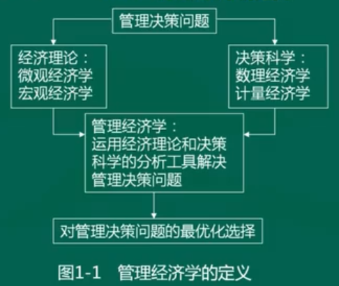

# 管理经济学考纲分析

## 课程性质和课程目标

### 课程性质

- 运用经济学和决策科学的分析工具。
- 为企业的管理决策实践提供理论和经济分析的思维框架。

### 课程目标

1. 引发对经济学理论、经济学分析方法以及决策科学的兴趣。
2. 掌握管理经济学的基本理论和分析方法。
3. 了解管理经济学的理论、方法与企业管理决策的相互关系。
4. 学会用管理经济学的理论、方法去分析和解决企业的各种管理决策问题。
5. 提高市场经济条件下管理决策的能力和水平。

### 课程相关内容

- 经济学原理与方法来自微观经济学，重点是对管理决策的应用。
- 与许多专业管理课（企业管理、市场营销、统计学）有联系。
- 具备高等数学知识，最高涉及微分学。

### 课程重点难点

1. 微观经济学的基本原理和编辑分析方法；
2. 经济学原理和方法在各种具体决策问题中的应用。

### 考核目标

1. 识记：
   - 识别记忆大纲规定的知识点，做出正确表述、选择和判断。
2. 领会：
   - 全面把握基本概念、基本原理和方法，掌握之间的联系，做出正确的判断、解释和说明。
3. 简单应用：
   - 运用少量知识点，分析和解决一般应用的决策问题。
4. 综合应用：
   - 运用多个知识点，综合分析和解决复杂应用的决策问题。

### 题目类型

1. 单项选择题：20题，每小题1分，共20分。
2. 简答题：5小题，每小题6分，共30分。
3. 计算题：5小题，每小题6分，共30分。
4. 案例分析题：1大题，共20分。

## 课程内容和考核要求

### 第一章导论

#### 学习目的与要求

参考资料自考通：重点已经标出，不再做笔记。

## 一、导论

### 第一节 管理经济学的研究对象

#### 1.1.1 管理经济学的定义

​	管理经济学是运用经济学理论和决策科学的分析工具，使一个企业组织能够在一定的经济环境中，在面临的各种约束条件之下，最有效的达到自己既定目标的科学。

1. 管理经济学的研究对象是与资源配置有关的管理决策问题。
2. 管理经济学以经济理论和决策工具为分析工具。

#### 1.1.2 决策的基本过程

​	管理经济学解决的是与资源合理配置有关的管理决策问题，主要是量产决策和价格决策。

- 企业决策过程一般包括以下五个基本步骤：

  1. 明确企业面临的问题；
  2. 明确企业目标；
  3. 列举解决企业问题的可能方法；
  4. 从列出的解决办法中选择最优方案；
  5. 执行最优方案。

- 正确的决策条件包括：

  1. 明确的决策目标；
  2. 较高的决策者素质；
  3. 较充足的决策信息资料；
  4. 科学的理论和方法。

  正确决策的准则为：采取该项决策之后的情况比采取之前有所改善。

#### 1.1.3 管理经济学与微观经济学的关系

