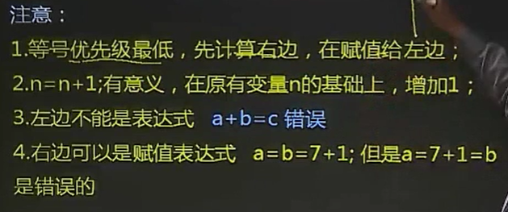
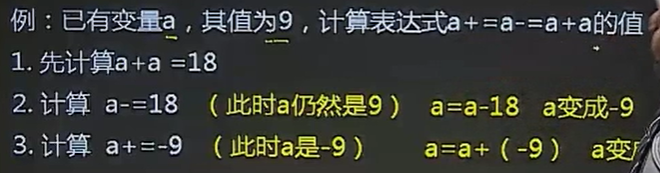
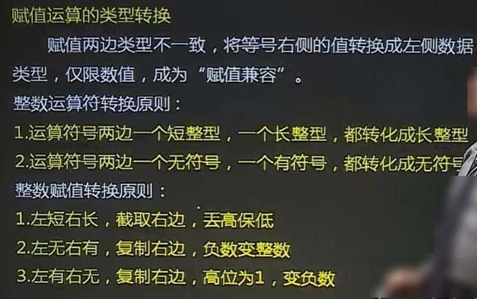
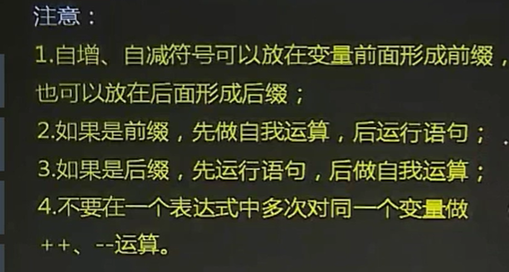
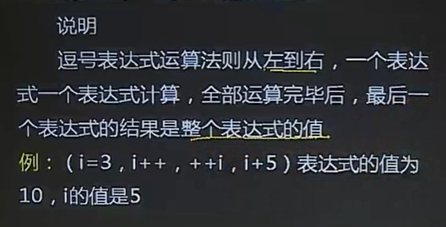
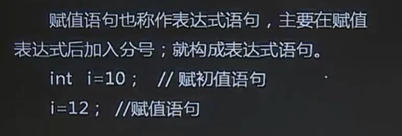
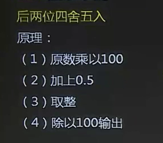
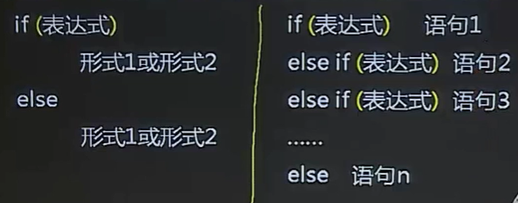
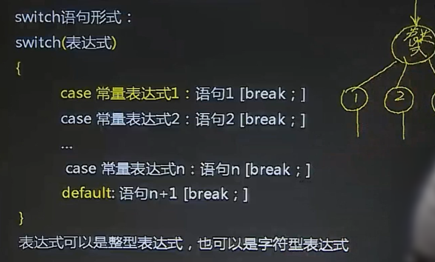
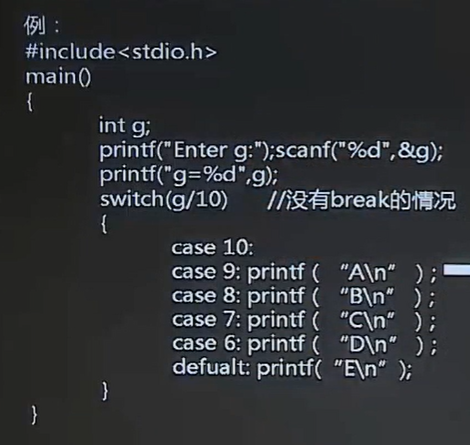

# 计算机二级C语言

https://www.bilibili.com/video/BV1sb411a7h6

## 第二章 C基础

### 数据类型


### 算术表达式


运算规则（优先级）：先函数，再括号后乘除，终加减，最后赋值



### 复合赋值表达式




### 赋值运算的类型转换



### 自增 自减 逗号 运算符号




### 逗号表达式




## 第三章 顺序结构

### 赋值语句



### 数据输出


#### 输出修饰符


#### 长度修饰符


重点考第七种


`printf`中是右运算

### 数据输入


#### 输入格式控制符


#### `scanf`函数的使用说明


### 复合语句和空语句


### 算法-后两位四舍五入




## 第四章 选择结构

### 关系运算和逻辑运算


### 逻辑运算符

双目运算符 单目运算符


### if语句和用if语句构成的选择结构




### 条件表达式


### switch语句





switch 是另外一种选择结构的语句，用来代替简单的、拥有多个分枝的 if else 语句，基本格式如下：

```c
switch(表达式){
  case 整型数值1: 语句 1;
  case 整型数值2: 语句 2;
  ......
  case 整型数值n: 语句 n;
  default: 语句 n+1;
}
```

它的执行过程是：
1) 首先计算“表达式”的值，假设为 m。

2) 从第一个 case 开始，比较“整型数值1”和 m，如果它们相等，就**执行冒号后面的所有语句**，也就是从“语句1”一直执行到“语句n+1”，而**不管后面的 case 是否匹配成功**。

3) 如果“整型数值1”和 m 不相等，就跳过冒号后面的“语句1”，继续比较第二个 case、第三个 case……一旦发现和某个整型数值相等了，就会执行后面所有的语句。假设 m 和“整型数值5”相等，那么就会从“语句5”一直执行到“语句n+1”。

4) 如果直到最后一个“整型数值n”都没有找到相等的值，那么就执行 default 后的“语句 n+1”。

需要重点强调的是，当和某个整型数值匹配成功后，会执行该分支以及后面所有分支的语句。

由于 default 是最后一个分支，匹配后不会再执行其他分支，所以也可以不添加`break;`语句。

1. case 后面必须是一个整数，或者是结果为整数的表达式，但不能包含任何变量。
2. default 不是必须的。当没有 default 时，如果所有 case 都匹配失败，那么就什么都不执行。


## 第五章 循环结构

### while和do-while


***do-while 分号结尾***

### 正负号累加算法


整型/浮点型=浮点型；使用 1.0/n 使整型转换为浮点型

### 精度处理


### for循环

### continue语句break语句

### 循环嵌套


## 第六章 字符型数据

## 第七章 函数

## 第八章 地址和指针

## 第九章 数组

## 第十章 字符串

## 第十一章 对函数的进一步讨论

## 第十二章 全局变量及其作用域和生存周期

### 函数的存储分类

## 第十三章 宏替换

### 文件包含和动态存储分配

## 第十四章 结构体、共同体和用户自定义类型

## 第十五章 位运算

## 第十六章 文件