# [计算机二级C语言](https://github.com/Eished/self-study-exam_notes)

> **最新自考笔记** : https://github.com/Eished/self-study-exam_notes
>
> **配套代码**：https://github.com/Eished/C-CPP

https://www.bilibili.com/video/BV1sb411a7h6

## 第一章 基础考点

### 整型常量

1. 八进制整型常量开头数字是 0
2. 十六进制整型常量开头数字是 0x
3. 常量后面加 `L` 是长整型数据
4. C语言中的实型常量有两种表示形式：
   1. 小数形式，小数形式表示的实型常量必须要
      有小数点；
   2. 指数形式，以"e"或E"后跟一个**整数**来表示以10为底数的幂数，且规定字母e或E之前必须要有数字，且e或后面的指数必须为整数.

### 标识符

1. C语言中标识符由字母、下划线、数字组成，且开头必须是字母或下
   划线。

   另外，关键字不能作为标识符。因为C语言中区分大小写，所以B）选项中的"FOR"可以作为标识符来用。

   

### 运算符结合性及使用

- `!代表逻辑取反,针对的是boolean型值计算；`
- 逻辑运算符两侧运算对象可以是任意合法的表达式


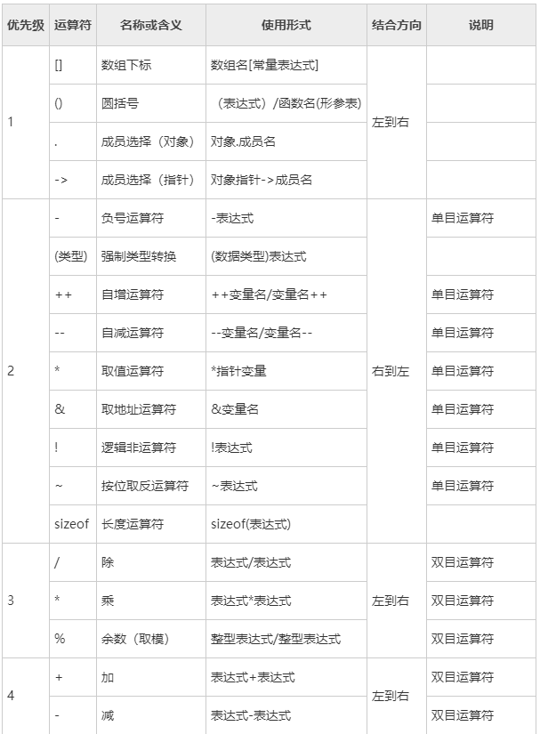


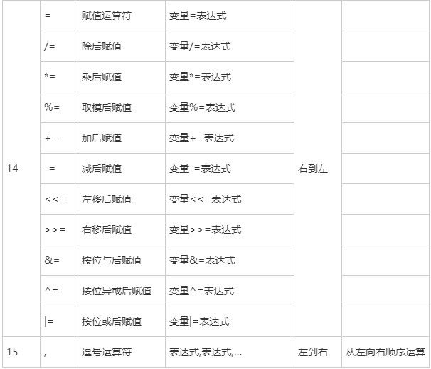


### Exit()

`exit()` 结束当前进程/当前程序/，在整个程序中，只要调用 exit ，就结束。

`return()` 是当前函数返回，当然如果是在主函数main, 自然也就结束当前进程了，如果不是，那就是退回上一层调用。

在多个进程时.如果有时要检测上进程是否正常退出的.就要用到上个进程的返回值。

exit(1)表示进程正常退出. 返回 1;

exit(0)表示进程非正常退出. 返回 0.

### **选择题易错：**

**1.C语言没有<>号**

**2.%操作两边都是整形数据**

**3.++运算优先级大于\***

**4.不能将变量赋值给表达式**

**5.^是按位异或，&是按位与**

**6.C语言标识符由字母、下划线、数字组成，开头必须是字母或下划线**

**7.C语言非执行语句不会被编译**

**8.数值常量不能夹带空格**

**9.C语言中注释不能再变量名或关键字中间**

**10.字符串常量“ ”、字符常量‘ ’**

**11.E后面指数必须为整形数据，之前要有数据**

**12.‘\0’为空值，ASCII码值为0**

**13.字符串是用一对双引号括起来的字符序列，并用字符型数组存放**


### 题型的分数分布

​     1.选择40%（注意，和省考不一样，提交完就不能修改了）

​     2.程序填空题20%

​     3.程序修改题20%

​     4.程序设计题20%

知道要做哪些题目了吗？

没错，就是程序修改题和程序填空题，这两题往往比较简单，程序修改题基本都是语法类型的错误。熟练了就只要几秒钟，没有夸张（我当时只用了3秒，就像条件反射一样）。两天时间，刷个20套不过分吧？每套就做这两题，思考超过3分钟就看答案，刷下一套，反反复复，直到看到了题目你就想到了答案，时间充足的话，可以刷40套。真的不懂可以看视频解析，但如果时间不充足的话，不推荐。


作者：智商比身高多一点
链接：https://www.zhihu.com/question/20097610/answer/772056467
来源：知乎
著作权归作者所有。商业转载请联系作者获得授权，非商业转载请注明出处。

## 第二章 C基础

### 数据类型

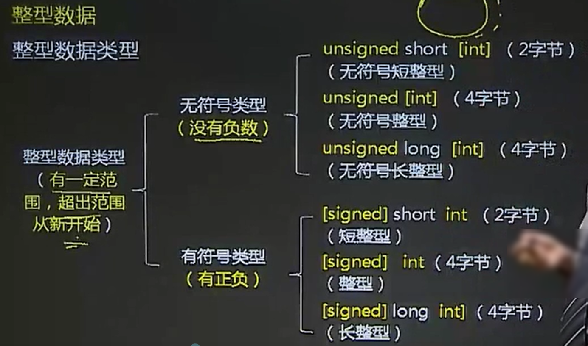

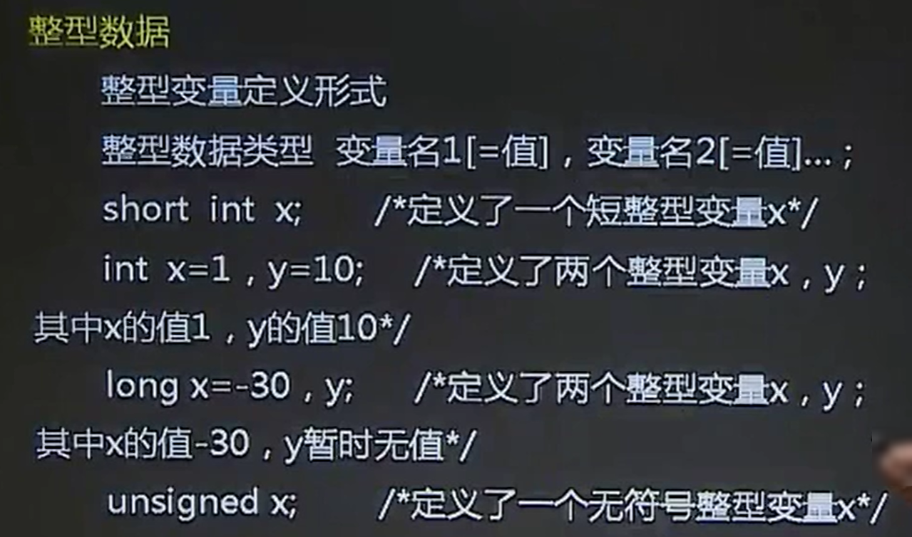

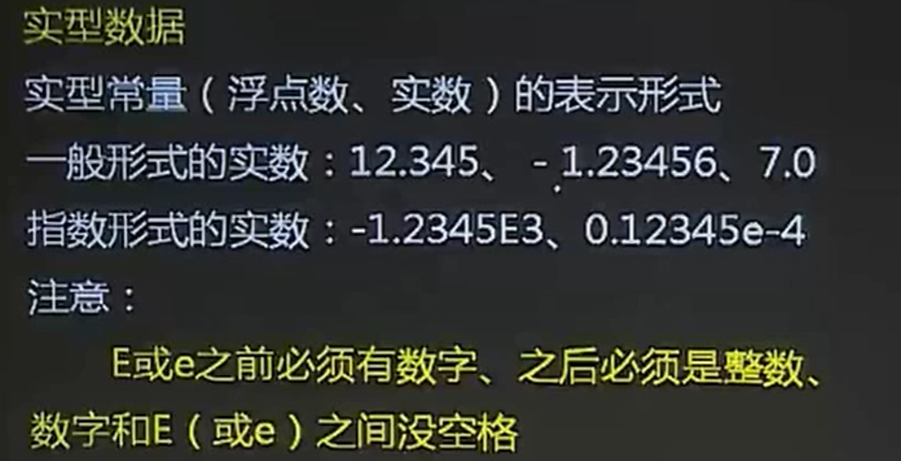


### 算术表达式

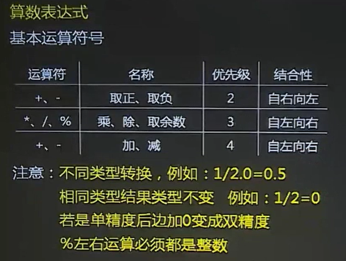

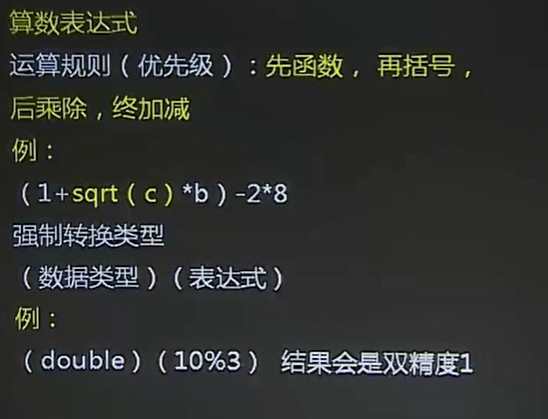

运算规则（优先级）：先函数，再括号后乘除，终加减，最后赋值

1. 等号优先级最低, 先计算右边, 在赋值给左边
2. n=n+1;有意义, 在原有变量n的基础上,增加1;
3. 左边不能是表达式a+b=c错误
4. 右边可以是赋值表达式a=b=7+1; 但是a=7+1=b是错误的

#### 一些容易出错的优先级问题

上表中，优先级同为1 的几种运算符如果同时出现，那怎么确定表达式的优先级呢？这是很多初学者迷糊的地方。下表就整理了这些容易出错的情况：


#### 数据类型转换

- ```c
  (type_name) expression;
  (int)1.0;
  ```

### 复合赋值表达式

主要运算符号

```
+= -= /= *=
例:
n+=1;(n=n+1)
n*=m+1(n=n*(m+1))
```

例: 已有变量a, 其值为9, 计算表达式a+=a-=a+a的值
1.先计算a+a=18
2计算a-=18 (此时a仍然是9) a=a-18a变成9
3计算 a+=9 (此时a是9) a=a+(-9) a变

### 赋值运算的类型转换

赋值两边类型不一致,将等号右侧的值转换成左侧数据类型,仅限数值,成为"赋值兼容
整数运算符转换原则

1. 运算符号两边一个短整型,一个长整型,都转化成长整型
2. 运算符号两边一个无符号,一个有符号,都转化成无符号

整数赋值转换原则

1. 左短右长,截取右边,丢高保低
2. 左无右有,复制右边,负数变整数
3. 左有右无,复制右边,高位为1,变负数

### 自增 自减 逗号 运算符号

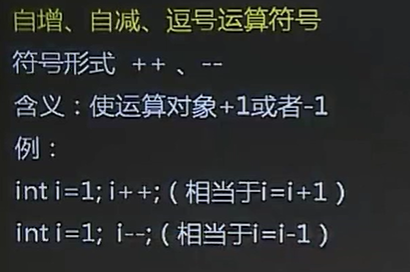

1自增、自减符号可以放在变量前面形成前缀也可以放在后面形成后缀
2如果是前缀,先做自我运算,后运行语句;
3如果是后缀,先运行语句,后做自我运算;
4.不要在一个表达式中多次对同一个变量做运算

### 逗号表达式

逗号表达式运算法则从**左到右**, 一个表达式一个表达式计算, 全部运算完毕后,

**最后一个表达式的结果是整个表达式的值**
例:

```
(i=3,i++,++i,i+5)
表达式的值为10,
i的值是5
```


## 第三章 顺序结构

### 赋值语句

赋值语句也称作表达式语句,主要在赋值表达式后加入分号;就构成表达式语句

```
int i=10;∥/赋初值语句
12;/赋值语句
```


### 数据输出

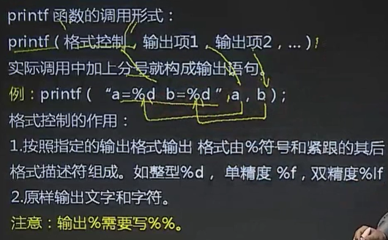

#### 输出修饰符

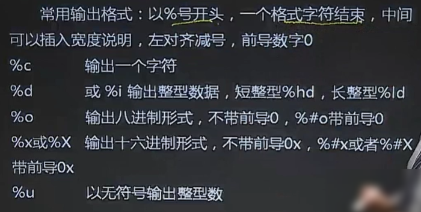

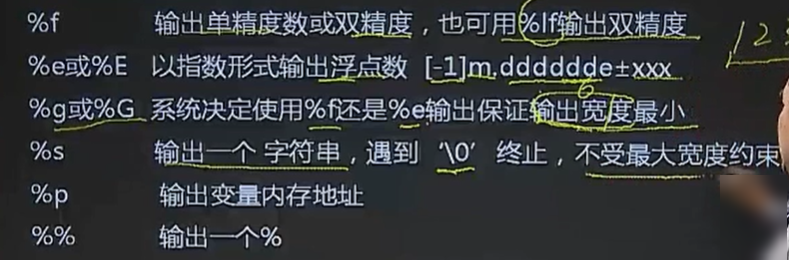

#### 长度修饰符

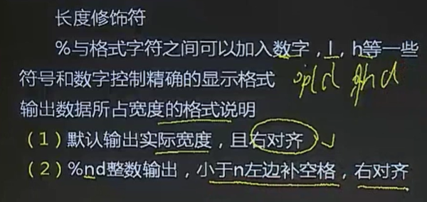

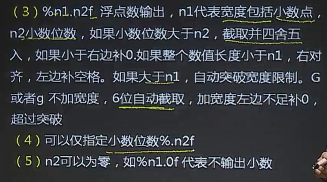

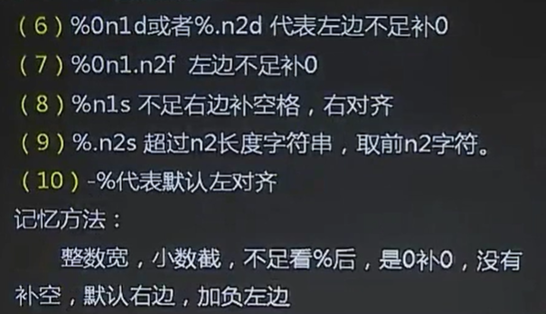

重点考第七种

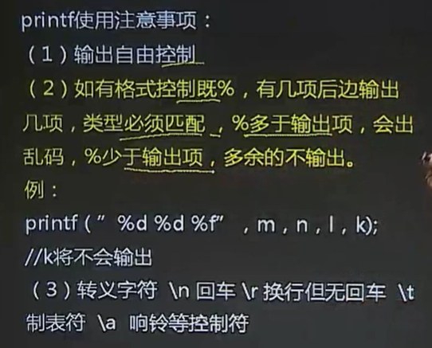

`printf`中是右运算

### 数据输入

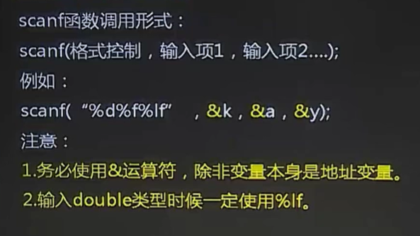

#### 输入格式控制符

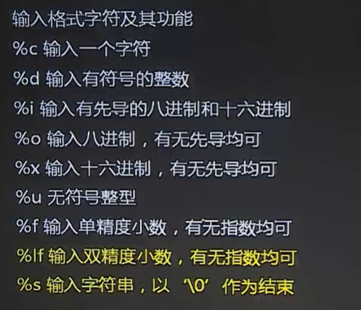

#### `scanf`函数的使用说明

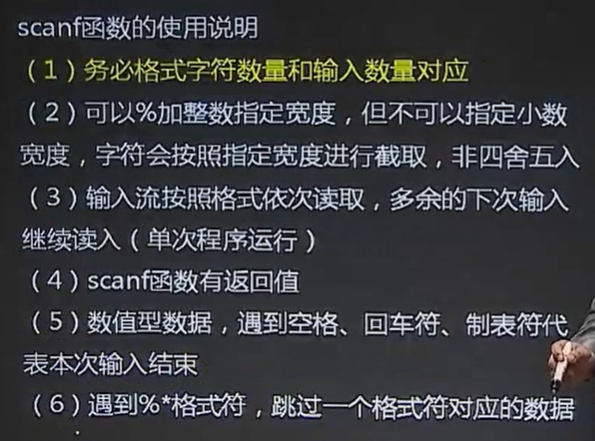

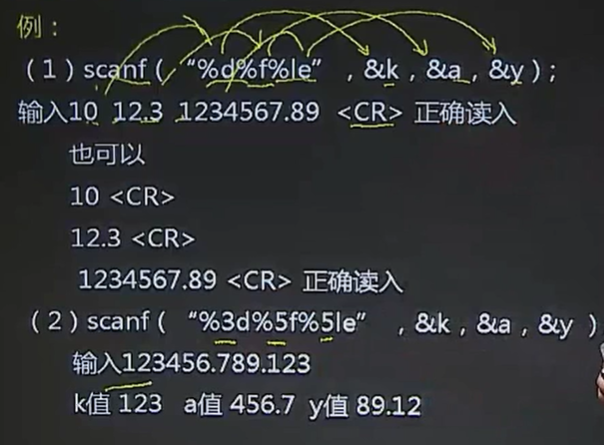

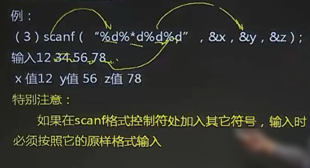

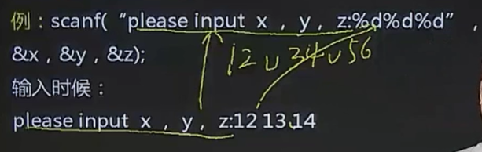

### 复合语句和空语句

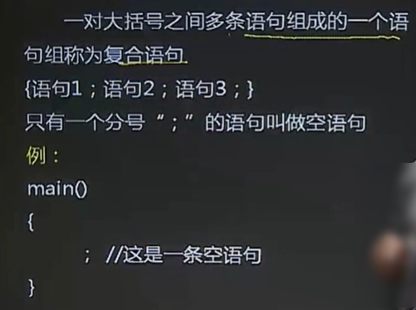

### 算法-后两位四舍五入

原理
(1)原数乘以100
(2)加上0.5
(3)取整
(4)除以100输出

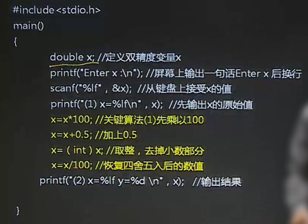


## 第四章 选择结构

### 关系运算和逻辑运算

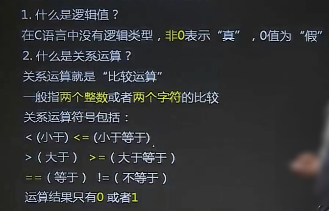


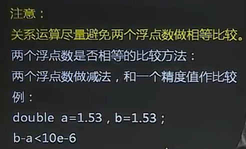

### 逻辑运算符

双目运算符 单目运算符

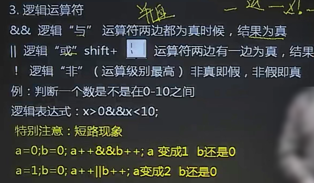

### if语句和用if语句构成的选择结构

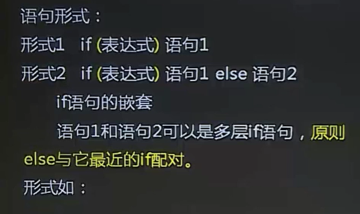


### 条件表达式

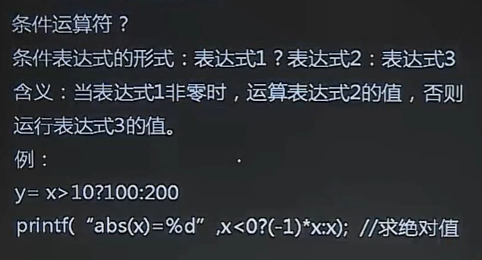

### switch语句

switch 是另外一种选择结构的语句，用来代替简单的、拥有多个分枝的 if else 语句，基本格式如下：

```c
switch(表达式){
  case 常量表达式1: 语句 1;
  case 常量表达式2: 语句 2;
  ......
  case 常量表达式n: 语句 n;
  default: 语句 n+1;
}
```

使用说明如下：

1) 程序执行时，首先计算表达式的值，与case后面的**常量表达式值**比较，若相等就执行对应部分的语句块，执行完后利用break语句跳出switch分支语句。若表达式的值与所有的case后的常量表达式均不匹配，则执行default项对应的语句n，执行后跳出switch分支语句。

2) case后面的常量表达式只能是整型、字符型或枚举型常量的一种；各case语句表达式的值各不相同，只起到一个标号作用，用于引导程序找到对应入口。

3) 这里的语句块可以是一条语句，或其它复合语句。语句块可以不用花括号“{}”。

4) 各个case语句并不是程序执行的终点，通常需要执行break语句来跳出switch分支语句；若某case语句的语句块被执行后，若其后没有break语句，则顺序执行其它case语句，直到遇到break语句或后面所有case语句全部执行完，再跳出switch分支语句。

5) 多个case可以共用一组执行语句块。

6) 各个case和default出现的先后次序，并不影响执行结果。

7) default语句不是必须的，但建议加上作为默认情况处理项。

8) switch语句仅做相等性检测，不能像if语句那样做关系表达式或逻辑表达式计算，进行逻辑真假判断。


```c
#include <stdio.h>
#include <stdlib.h>
int main()
{
  char str[] = "ABCDE";
  char c;
  int k;
  for (k = 0; (c = str[k]) != '\0'; k++)
  {
    switch (c)
    {
    case 'D':
      break; // 只跳出switch
    case 'B':
      continue; // 跳出for
    default:
      putchar(c);
      continue; // 跳出for
    }
    putchar('*');
  }
  return 0;
}
```

- **break 只对父级 switch 有效**。
- **continue 只对父级循环 for,while,do..while,switch,foreach 有效**。

它的执行过程是：
1) 首先计算“表达式”的值，假设为 m。

2) 从第一个 case 开始，比较“整型数值1”和 m，如果它们相等，就**执行冒号后面的所有语句**，也就是从“语句1”一直执行到“语句n+1”，而**不管后面的 case 是否匹配成功**。

3) 如果“整型数值1”和 m 不相等，就跳过冒号后面的“语句1”，继续比较第二个 case、第三个 case……一旦发现和某个整型数值相等了，就会执行后面所有的语句。假设 m 和“整型数值5”相等，那么就会从“语句5”一直执行到“语句n+1”。

4) 如果直到最后一个“整型数值n”都没有找到相等的值，那么就执行 default 后的“语句 n+1”。

需要重点强调的是，当和某个整型数值匹配成功后，会执行该分支以及后面所有分支的语句。

由于 default 是最后一个分支，匹配后不会再执行其他分支，所以也可以不添加`break;`语句。

1. case 后面必须是一个整数，或者是结果为整数的表达式，但不能包含任何变量。
2. default 不是必须的。当没有 default 时，如果所有 case 都匹配失败，那么就什么都不执行。


## 第五章 循环结构

### 5.1 while和do-while

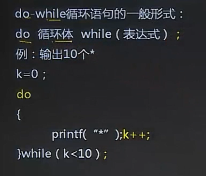

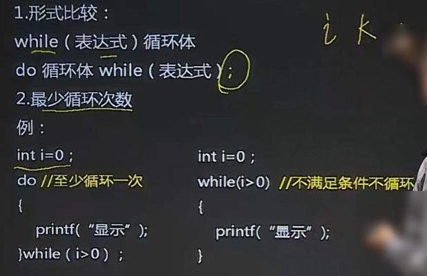

***do-while 分号结尾***

#### 正负号累加算法

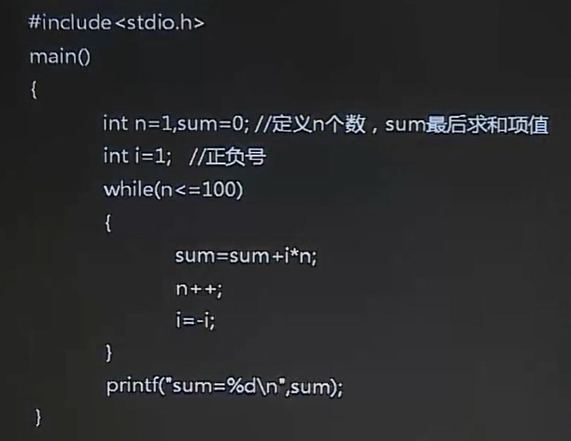

整型/浮点型=浮点型；使用 1.0/n 使整型转换为浮点型

#### 精度处理

```c
abs() /*取整数绝对值*/
fabs() /*取整数绝对值*/
```

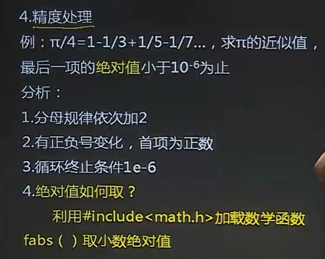

### 5.2 重要算法 斐波那契数列

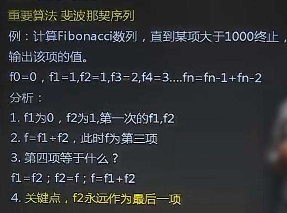

```c
#include <stdio.h>

int main()
{
  int f, f1 = 0, f2 = 1;
  printf("%d,", f1);
  do
  {
    printf("%d,", f2);
    f = f1 + f2;
    f1 = f2;
    f2 = f;
  } while (f2 <= 1000);
  return 0;
}
```


### 5.3 for循环


三个参数都可以省略。分号不能省略。


### 5.4 循环嵌套 重点算法判断质数（素数）

重点算法判断质数（素数）
1.什么是质数？
能够被1和自身整除的数
2.最小的质数？
2″是最小的质数
3.如何判断—个数是不是质数？
从2开始到此数之间没能找到一个数
将其除尽，此数为质数。

### 5.5 continue 语句 break 语句

结束本次循环

跳出所有循环

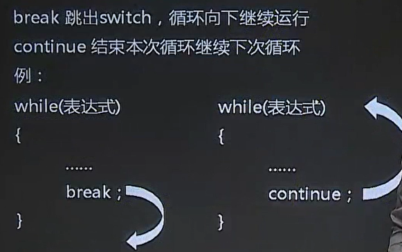


## 第六章 字符型数据

大纲中只规定了字符串与字符数组。
但本章内容涉及以下内容：

1. 字符常量，字符串常量
2. 字符变量的定义及使用
3. 字符型与整型数据的换算关系
4. 转义字符
5. 字符的输入与输出


### 6.1 字符型常量

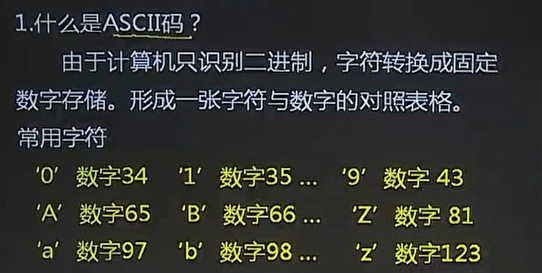

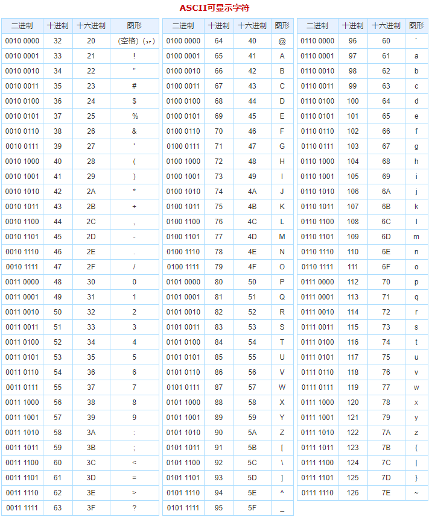

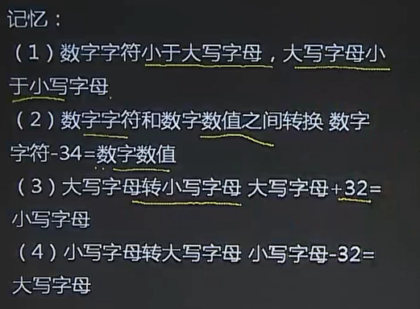

**字符常量**

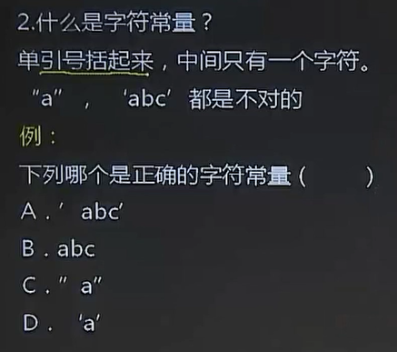

**什么是转义字符常量？**
单引号括起来，中间由反斜杠开头后跟一个特定字符。
常用转义字符

```c
\n回车换行
\t个制表符（按键盘tab键出现的空格数）
\r回车符 
\\输出反斜杠
\'单引号字符
\"双引号字符
\O空值（屏幕不可见）ACSII值0
注意：
\数字’只代表一个字符
```

**什么是字符串常量？**
双引号括起来，中间由若干字符和
转义字符组成。

`例如：“abd"“acb\n"`

**字符计算**

```c
'B'-'A'=1;
'a'-'A'=32;
```


### 6.2字符变量

定义形式

```c
char 变量名 [=值]
例
char a='a';
char a=97;
```


### 6.3 字符的输入输出

- 字符输出：`putchart(字符)` 等同于 `printf("%c",char)`
- 字符输入：`变量= getchar()` 等同于 `sacnf("%c",&char)`
- 注意:
  空格、tab、回车会被接收

```c
#include <stdio.h>
int main()
{
  char a, c, d, b; // 字符类型 所有输入都会被接收
  scanf("%c%c", &a, &b);
  c = getchar(); // 
  d = getchar();
  printf("%c%c%c%c\n", a, b, c, d);
}
// 12回车34回车
// 按顺序逐个字符赋值
```


#### 重点算法 字母大小写转换

例：把从终端输入的小字母转换成大写字母，其他字符不变
分析

1. 小写字母转大写需要减去32
2. 如何判断小写字母，在`a`到`z`之间的字符

```c
#include <stdio.h>
int main()
{
  char c;                         //定义一个字符型变量
  while ((c = getchar()) != '\n') //没有读入字符没有到回车时候转换
  {
    if (c >= 'a' && c <= 'z')
    {
      c = c - 'a' + 'A'; //或者直接写c=c-32
      putchar(c);        //输出字符c
    }
  }
  putchar('\n');
}
```


#### 重点算法 统计字符个数

例:统计字符中大写字母和小写字母个数

```c
#include <stdio.h>
int main()
{
  int s = 0, b = 0, n = 0; //定义变量s为小写字母数量,b为大写字母数量,n数字
  char c;
  while ((c = getchar()) != '\n')
  {
    if (c >= 'a' && c <= 'z')
      s++;
    if (c >= 'A' && c <= 'Z')
      b++;
    if (c >= '0' && c <= '9')
      n++;
  }
  printf("%d,%d,%d", s, b, n);
}
```


## 第七章 函数

1. 库函数的正确调用.
2. 函数的定义方法.
3. 函数的类型和返回值.
4. 开式参数与实在参数,参数值的传递.
5. 函数的正确调用,**嵌套调用,递归调用.**
6. **局部变量和全局变量.**
7. **变量的存储类别(自动,静态,寄存器,外部)，变量的作用域和生存期**

### 7.1 库函数

1. C语言是由函数组成的从 `main()`函数开始,在`main()`函数中结束
2. 标准库函数的引入通过命令行的形式 `#include<库函数头文件>`或者`#include"库函数头文件"`
3. 标准库函数的调用形式: 函数名(参数表)
   例：`y=sqrt(13);//开平方`

#### **常用数学函数**

- pow(底数,指数) 求幂
- sqrt(数值) 开平方
- abs(整数值) 取整数的绝对值
- fabs(实型值) 取实型值的绝对值
- sin(实型) 取得sin值
- cos(实型) 取得cos值
- exp(实型) 以自然对数e为底的幂


### 7.2 函数的定义和返回值

用户自定义函数的一般形式:

```c
函数返回值的类型名 函数名(类型名形参1, 类型名形参2,...)/*函数的首部*/
{
说明部分           /函数体*/
语句部分  
}
```

注意:

1. 函数名及形参由用户定义的标识符组成
2. 同一程序中函数名必须唯一
3. 形参名字在同一函数中命名唯一
4. **不能函数内部定义函数**
5. 如果**不指定返回值类型, 返回值为int型**
6. 函数调用前必须先定义(说明)
7. 无返回值,在函数返回类型处,用 void


**返回值**

函数返回值通过 return语句返回,形式: return表达式

一个函数中允许有多条 return,但是只能有一条执行


### 7.3 函数的调用

调用方法:

1. 函数名(实在参数表)

2. 函数名() 无实参情况
   例

   ```c
   double x=10.2,y=19.3,z;
   z=add(x,y);
   ```

函数调用原则：先定义，后调用。如果函数在调用之后，除返回值是int和char型的，都需要在程序之前进行说明

```c
char b()
{
  printf("bbbb");
}
#include <stdio.h>
double c()
{
  printf("ccc");
}

double d();

// 函数调用与声明
int main()
{
  double e();
  a();
  b();
  c();
  d();
  e();
}
int a()
{
  printf("aaaa");
}
// char a()
// {
//   printf("aaaa");
// }
// double a()
// {
//   printf("aaaa");
// }

double d()
{
  printf("dddd");
}
double e()
{
  printf("eee");
}

```


### 7.5 函数调用之间的数据传递

函数调用中，实参的数据和形参对应传递
两种传递方式

1. 值传递
   只传送值，实参不做改变
2. 地址传递
   传送地址，实参被改变

```c
#include <stdio.h>
void swap(int, int); /*函数说明*/
int main()
{
  int x = 10, y = 20;
  printf("(1)x=%d y=%d\n", x, y);
  swap(x, y); //值传递
  printf("(4)x=%d y=%d\n", x, y);
}
void swap(int a, int b)
{
  int t;
  printf("(2)a=%d b=%d\n", a, b);
  t = a, a = b, b = t;
  printf("(3)a=%d b=%d\n", a, b);
}
```


#### 函数传参注意

后`-- ++` 优先级低于函数。

```c
#include<stdio.h>
int fun(int d)
{
	printf("%d",d);
}

void main()
{
	int a=4;
	fun(a--);
	printf("%d",a);
}

// 输出 43
```


### 7.6 逗号表达式

逗号优先级最低

只保留右侧操作

右加加优先级低于传参

```c
#include <stdio.h>
#include <stdlib.h>
int main()
{
  int a = 1, b = 1;
  a = ++a, a + 10, a * 10;
  printf("a=%d", a);
  b = (++b, b + 10, b * 10);
  printf("b=%d", b);
  return 0;
}
```

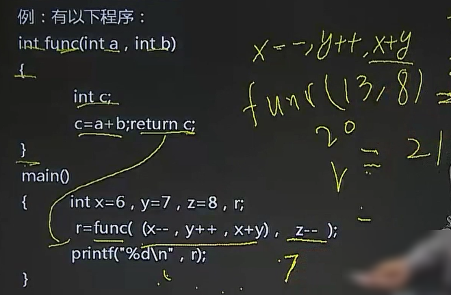

21

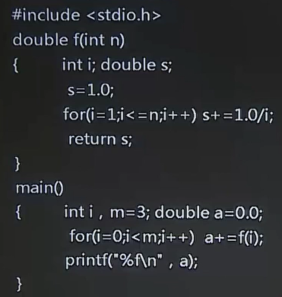

5.5

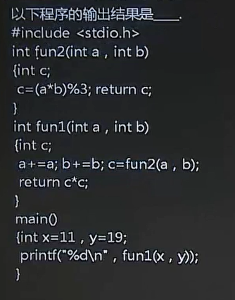

4


## 第八章 地址和指针

1. 变量的地址和指针
2. 指针变量的定义和指针变量的基类型
3. 给指针变量赋值
4. 对指针变量的操作
5. 函数之间地址值的传递

### 8.1 变量地址和指针

计算机的内存是以字节为单位的一片连续的存储空间,每—个字节都有一个编号这个编号就成为内存地址.

每个变量的地址是指该变量所占存储单元的第一个字节的地址

回忆:

计算机的存储单位

一进制的位(bit)  8bit=1字节. 1024字节=1KB, 1024KB=1M, 1024M=1G

例: int a=5;在内存中的存储结构通过&a可以取出a在内存中的地址此时a的地址为1245052

一种特殊的变量
这种变量只是用来存放内存地址的,起名为指针变量
假设定义了一个只存地址的变量 p
把变量a的地址赋予指针变量 p,
则指针变量p的值为 1245052
当访问变量a时,访问的是什么? 5
当访问指针变量p时,访问的是什么? 1245052

当访问变量时,为"直接存取(直接访问)"
我们也可以通过指针变量间接的访问该地址中原来的值.此时称为"间接存取(间接访问)


### 8.2 指针变量的定义和指针变量的基类型

```c
int*pi;
int *pJ, *pa;
```

说明:

1. pl, pJ, pa都是变量,不过都是指针变量,定义时在普通变量名的左边加上星号就行了
2. pi,pj,pa三个指针变量的类型为整型,说明三变量中只能存放n类型变量的地址
3. 这时我们称n是指针变量 pi, pj, pa的基类型.


例: 

```c
double *pd;
char *s1,*s2;
pd的基类型为 dou ble类型,在指针变量pd中,
只能存放 double类型变量的地址.
s1和s2的基类型为char类型,在指针变量s1和
s2中,只能存放cha类型变量的地址
  
指向指针的指针
例:
int **p,k,*s=&k; // 先取*p，再取*（*p）
p=&s;
```


### 8.3 给指针变量赋值

```c
int k,*q,p;//*k为整型变量,q和p都是指针变量.*
k=1;//*给普通变量赋值
q=&K;//*整型变量k的地址赋值给指针变量q*/
p=q;//*将q的值赋值给p*/
```

```c
#include <stdio.h>
int main()
{
  int a, b = 2, *p = NULL;// 必须赋值后才能使用指针
  a = 1;
  p = &a;
  *p = b;
  printf("%d,%d,%p,%p,%p", *p, a, &p, p, &a);
}
```


**给指针变量赋值**
除了给指针变量赋地址值之外,还可以给指针变量赋—个特殊的值, 该值为"空"值
注意
此时,指针变量p中不是没有值,而是有一个空值。

通过指针来引用一个存储单元,"间址运算符 \*"

```c
#include <stdio.h>
main(){
int k,*q,*p;
q=&k;
p=97;
printf("%d\n%d\n%d\n k,*q,*p);
}
```


### 8.4 对指针变量的操作

址运算符说明

1. \*与\&是逆运算

2. 在指针变量已经存有某一变量地址时, 可以利用"\*变量=值"的形式给指针变量指向的内存空间赋值

3. 关于`++、--`号对指针变量的运算
   例:

   ```c
   ++*p 代表 ++(*p);
   p++ 代表 *(p++);
   
   如果在右边使用自增或者自减符号,必须加括号
   (*p)++
   ```

   

例:用指针指向两个变量,通过指针运算选出值最小的那个数

```c
#include <stdio.h>
main(){
  int a,b,min,*pa,*pb,*pmin;
  pa=&a; pb=&b; pmin=&min;
  scanf("%d%d",pa,pb);
  printf( "a=%d b=%d\",a,b);
  *pmin=*pa;
  if(*pa>*pb) *pmin=*pb;
  printf("min=%d\n", min);
}

```


**移动指针**
所谓移动指针就是对指针变量加上或减去个整数,或通过赋值运算,使指针变昰指向相邻的存储单元

形式:

1. 指针变量+整型常量
2. 指针变量+整型变量


假定在内存中开辟了如图所示的五个连续的存放int类型整数的存储单元.
并分别给它们取代号为:`a[0]、a[1]、a[2 ]a[3]、a[4]`
这些代号所代表的存储单元中,分别有值为: 11、22、33、44、55.p指向a0所在地址,p++代表a[1]

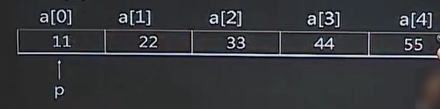


### 8.5 函数之间地址值的传递

形参为指针变量时实参和形参之间的数据传递

```c
#include <stdio. h>
int myadd (int *a, int *b)
{int sum;
sum=*a+*b
return sum;
 }
main(){
  Int x,y,z;
  pint(" Enter xy:") scanf("%d%d",&x,&y);
  z=myadd(&x, &y)
  printf("%d+%d=%d\n ",x,y,z);
}
```


## 第九章 数组

一维数组和二维数组的定义、初始化和数组元素的引用

1. 维数组的定义和一维数组元素的引用
2. 维数组和指针
3. 函数之间对维数组和数组元素的引用
4. 维数组应用举例
5. 二维数组的定义和二维数组元素的引用
6. 二维数组和指针
7. 二维数组名和指针数组作为实参


### 9.1 一维数组的定义和一维数组元素的引用

1. 什么是数组?

   数组是具有相同类型的变量的集合,这些变量在内存中占有连续的存储单元

   一维数组的定义形式如下:

   ```c
   类型名 数组名[整型常量表达式或整型常量]
   数组名:和变量名的命名规则相同
     
   [整型常量表达式]:也叫下标表达式,当只有一下标时,为一维数组,代表数组的数量
   ```

   ```c
   int a[8];//定义了一个名为a的一维数组
   	方括号中的8规定了a数组含有8个元素变量),
   它们是a0、a[1]、…a[7]
     类型名in规定了a数组中每个元素都是整型,在每个元素中只能存放整型数.
   在使用该数组时,它的下标范围是从0~7,即下标的下界为0,上界为7.
   ```

2. 在一个定义数组语句中,可以有多个数组说明符,
   它们之间用逗号隔开.如: `double w[22],v[100],u[5]`

3. 个数组元索实质上就是一个变量,代表内存中的一个存储单元.

   在引用数组元素时,数组元素中下标表达式的值必须是整数,下标表达式值的下限从0开始.


例9.1 编写程序,定义一个含有30个元素的int类型数组.

依次给数组元素赋奇数1、3、5、…
然后按每行10个数顺序输出,最后再按每行10个数逆序输出
分析
(1)定义30个元素的一维数组
(2)循环从1开始每次加2赋值给数组
(3)顺序输出,当数量%10==0时候换行
(4)逆序输出,当数量%10==0时候换行

```c
#include <stdio.h>
#define M 30
int main()
{
  int s[M], i, k = 1;
  for (i = 0; i < M; i++)
  {
    s[i] = k;
    k += 2;
  }
  printf("\nSequence Output: \n");
  for (i = 0; i < M; i++)
  {
    printf("%4d", s[i]);
    if ((i + 1) % 10 == 0)
      printf("\n");
  }
  printf("\ninvert Output: \n");
  for (i = M - 1; i >= 0; i--)
  {
    printf("%4d", s[i]);
    if (i % 10 == 0)
      printf("\n");
  }
  printf("\n");
}
```


### 9.2 一维数组和指针

维数组和数组元素的地址
如下定义的是一个包含5个元索的一维数组
`int a[5];`
引用5个元素地址
`a[0]、&a[1]、&a[2]、&a[3]、&a[4]`
直接输出a, 观察发现`a与&a[0]`相等.
数组名a也表示地址
**数组名代表数组的首地址,也就是第一个元素的地址.**
注意:不可以给a赋新的值


**通过数组的首地址引用数组元素**

```c
#include <stdio.h>
#define M 3
int main()
{
  int *p, a[M], i;
  for (p = a; p - a < M; p++)
  {
    scanf("%d", p);
    printf("%p，%p\n", a, p); // a为数组首地址 p为数组首地址
  }
  p -= M; // 重置指针起始位置
  for (i = 0; i < M; i++)
  {
    printf("%d，%d，%d\n", p[i], *(a + i), *(p + i)); // 通过指针获取数组值 数组和指针操作相同； a 是常量，p 是变量
  }
}
```


**用带下标的指针变量引用一维数组元素**
例如:

```
若有以下定义和语句:
int *p, s[10],i;
比如的取值范围:i>=0&&i<10
地址的表示方式有三种:&s[i] s+ p+i
数组元索的表示方式也有三种:s[i] *(s+1) *(p + i)
```

数组首地址是常量，指针是变量。


### 9.3 函数之间对一维数组和数组元素的引用

**数组元素地址作为实参**
例:编写函数,对具有10个元素的char类型数组从下标为4的元素开始,全部设置星号"*,保持前4个元素中的内容不变.


**函数的指针形参和函数体中数组的区别**

返回形参数组时，只返回首地址，数组内存已经销毁。数组要用实参传输。


### 9.5 二维数组的定义和二维数组元素的引用

二维数组的定义形式如下
类型名数组名`[整型常量表达式1][整型常量表达式2] 例如: int a[3][4]`

1. 定义了一个名为a的二维数组.
2. a中每个元素都是整型
3. a数组中共有两个下标,第一个方括号中的下标的下限为0,上限为2; 第二个方括号中的下标的下限为0,上限为3.

在引用数组元索时,数组元素中下标表达式的值必须是整数,下标表达式值的下限从O开始,且不能超越界限.引用二维数组时,一定要把两个下标分别放在两个方括号内.
例:以下引用都是非法的

```
W[O,1]
W[i+1,k-j-i]
```

**数组初始化和赋值**

```c
(1)为所定义的数组元素赋初值:
int a[4][3]={{1,2,3},{4,5,6},{8,9,3},{10,11,12}};

(2)当每行所赋初值的个数与数组元素个数不同时,例如:
int a[4][3]{{1,2},{4,5},{7},{10}};

(3)当所赋初值行数少于数组行数时,例如:
int a[4][3]={{1,2},{4,5}};

(4)当所赋初值省略行花括号时,例如: 从左到右，从上至下，依次赋值
inta[4][3]={1,2,4,5};

(5)通过赋初值定义二维数组的大小
例如: int a[][3]={{1,2,3},{4.5}{6},{8}};
注意:
对于二维数组,省略只能省略第一个方括号中的常量表达式
如上的赋值语句等同于:
int a[4][3]={{1,2,3},{45},{6},{8}}

(6)当用以下形式赋值时:
int c[][3]={1,2,3,4,5};
第一维的大小按以下规则决定
当花括号对中的个数能整除第二维的常量表达式时,整除的结果就是第一维的大小;
否则,第一维的大小等于所得的结果加1.

```


### 9.6二维数组和指针

```c
可以通过a[o][o],a[o][1]引用
可以把a[0]看做个整体,当做个数组名
a[O]就代表a[O][0],a[0][1]的地址.
p=a[0]是合法的p=a[0]+1相当于&a[0][1]

```

`a[0][0]`为具有4个整型元素的数组
`p=a;`非法
**指针p基类型只有4个字节, 二维数组a基类型有4X4个字节**

```c
再如有变量利,它们的取值范围为0<=i<3、0<=j<4
a[i][j] 的地址可以用以下五种表达形式
(1)&a[i][j]
(2)a[i]+j
(3)*(a+i)+j
(4)&a[0][0]+4*1+j
(5)a[0]+4*i+j
```


**取出数据的六种方法**

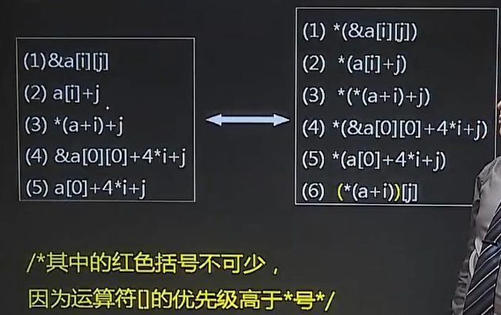


### 9.7 二维数组名和指针数组作为实参

```c
#include <stdio.h>
#define M 5
#define N 3
main(){
double s[M][N];
fun(s);
}

// 接收实参
fun(double (*a)[N]);
fun(double a[][n]);
fun (double a[M][N])
```


**二维数组的各种写法**

  `*a[0] = *(*(a + 0)) = **a; // * 等于 []`  指向指针的指针的转换
  `*a[1] = *(*(a + 1));       // 下标 等于 指针位移`
  `*(&a) = a;                 // * 逆运算 & 相互抵消; 由 * 等于 []，推出 [] 也和 & 相互抵消；`

```c
#include <stdio.h>
#define M 2
#define N 3

// 首地址+行数+列数
// void fun(double a[M][N])
// {
// }

// 首地址+列数
// void fun2(double a[][N])
// {
// }

// 行指针+列数
void fun(double (*a)[N])
{
  // printf("%8.2lf%8.2lf%8.2lf\n", (*a)[0], (*a)[1], (*a)[2]);                     // 取行地址值【列下标】
  printf("%8.2lf%8.2lf%8.2lf\n", (*(a + 1))[0], (*(a + 1))[1], (*(a + 1))[2]); // 取行地址值（行指针+位移）【列下标】  *优先级高于+
  // printf("%8.2lf%8.2lf%8.2lf\n", *(*a), *(*a + 1), *(*a + 2));                   // 取值（行指针地址+位移）
  printf("%8.2lf%8.2lf%8.2lf\n", *a[1], *(a[1] + 1), *(a[1] + 2));               // 取值（行指针【行下标】+位移）
  printf("%8.2lf%8.2lf%8.2lf\n", *(*(a + 1)), *(*(a + 1) + 1), *(*(a + 1) + 2)); // 取值（取行地址值（行指针+位移）+位移）

  printf("%p\n%p\n%p\n%p\n", (&a[0] + 1), (&a[0])[1], &a[1], (&a + 7));                                                                     // 相同地址
  printf("%8.2lf%8.2lf%8.2lf%8.2lf%8.2lf%8.2lf\n", *((&a[0] + 1)[0]), *((&a[0])[1]), *(*(&a[1])), *(&a[1][0]), *(&a + 7), *(*(&a[0] + 1))); // *逆运算&

  *a[0] = *(*(a + 0)) = **a; // * 等于 []
  *a[1] = *(*(a + 1));       // 下标 等于 指针位移
  *(&a) = a;                 // * 逆运算 & 相互抵消; 由 * 等于 []，推出 [] 也和 & 相互抵消；
  printf("%d\n", *a[0] == *(*(a + 0)) == **a);

  *(*(&a[1])) = *(*(a + 1)) = *a[1];

  *(&a[1][0]) = *(*(&a[1])) = a[1][0] = *a[1];
  *((&a[0])[1]) = *(*(*(&a) + 1)) = *a[1];
  *((&a[0] + 1)[0]) = *(*(*(&a) + 1)) = *(*(a + 1)) = *a[1];
}

int main()
{
  double s[M][N] = {{1, 2, 3}, {4, 5, 6}};
  fun(s);
}

```

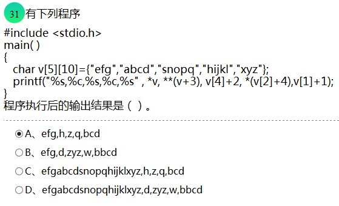


**指针数组作为实参时实参和形参之间的数据传递**

```c
#include <stdio.h>
#define M 5
#define N 3

// 行指针+列数
void fun(double *a[], int i) // 加括号：（指针）【列数】； 不加括号：指针数组 ；**a 指向指针的指针
{
  for (int j = 0; j < N; j++)
  {
    printf("%8.2lf", a[i][j]); // 首地址【行地址】【列地址】
  }
  printf("\n");
}

int main()
{
  double s[M][N] = {{1, 2, 3}, {4, 5, 6}}, *ps[M];
  for (int i = 0; i < M; i++)
  {
    printf("%p", &s[i]);
    ps[i] = s[i]; // 把二维数组每一行的[首地址]存到指针数组里面
    fun(ps, i);   // 传递指针数组及当前行
    // for (int j = 0; j < N; j++)
    // {
    //   printf("%8.2lf", ps[i][j]); // 首地址【行地址】【列地址】
    // }
    // printf("\n");
  }
}

```


## 第十章 字符串

字符串的地址以及指向字符串的指针
变量的定义.

字符常量:是用单引号括起来的一个字符
字符串常量:是由双引号括起来的一串字符

在内存中,系统会自动的在字符串的末尾加上个`\0`,作为字符串的结束标志,系统只要看到它
就认为该字符串到此就结束了.但要注意,该字符串的实际长度还是为5. 只是占位6.

注意:由于变量只能存放一个字符,所以**字符串的存放只能存储在数组当中**


### 10.1 用一维字符数组存放字符串

```c
(1) char str[10]={'h','e','l','l','o','\0'};
(2) char str[]={'h','e','l','l','o','\0'};
(3) char str[10]= {"hello"};
(4) char str[10]="hello";
(5) char str[]="hello";
```

注意：字符数组可以没有 '\0' 但字符串必须有 '0'

定义时长度 +1;


**字符串的赋值**

字符串是数组

```c
char mark[10]:
mark[0]='h'; mark[1]='e'; mark[2]='I';
mark[3]='1'; mark[4]='o'; mark[5]='\0';
  
下面做法是错误的
char mark[10];
mark="hello";
```


### 10.2 使指针指向一个字符串

可以在**定义字符指针变量的同时,将一个字符串赋值指针变量**.例如:

`char*ps1="form one";`

把存放字符串常量的 无名存储区 的首地址赋给指针变量ps1, 使ps1指向字符串的第一个字符f.

通过赋值运算使指针指向一个字符串

```c
char *s; // 正确示例；通过指针定义变量字符串
s=good；
```


**用字符数组作为字符串和用指针指向的字符串之间的区别**

若有以下定义:

```c
char mark[]="PROGRAM"
char *mark="PROGRAM"
```

两个字符串分别占有不同的存储空间.

指针变量 mark中的地址可以改变而指向另外一个长度不同的字符串.

两个字符串分别占有不同的存储空间. 指针变量 mark中的地址可以改变而指向另外一个长度不同的字符串.


### 10.3 字符串的输入和输出

1. 输入和输出的格式说明符为%s。

   ```c
   scanf("%s",字符串的首地址);
   ```

   输入字符串时候如果遇到**空格**和**回车**会作为**分隔符不能被读入**。

2. 若输入的长度超过指定长度, **越界**

3. 当输入是**数组元素的地址**时候, 将从该元素读入字符
   例:

   ```c
   char str[15];
   scant("%s,str+1); // 从指定位置读入
   ```

4. 当输入项为指针变量时,必须确保指针变量指向足够的空间


- 输出字符串

  ```c
  printf("%s",字符串首地址);
  ```

  遇到第一个`\0` 结束输出


- **利用gets接收字符串**

  ```c
  char str[20];
  gets(str);
  ```

  注意: 此处**可以接收空格**, **回车符将被替换成 `\0`**

- 利用puts输出字符串

  - `puts(字符串的起始地址);`

```c
*p1=*p2--; // 先赋值，后p2--；
```

```c
#include <stdio.h>
#include <string.h>
void fun(char *w, int m)
{
  char *p1, *p2, s;
  p1 = w;
  p2 = w + m - 1; // *p2="G";
  while (p1 < p2)
  {
    s = *p1++;   // s="A"; 后++优先级低于= 低于* 加括号也不管用
    *p1 = *p2--; // *(p1+1)="G"; 先取值赋值，最后--
    *p2 = s;     // *(p2-1)="A";
  }              // AG...AG;
}
int main()
{
  char a[] = "ABCDEFG";
  fun(a, strlen(a));
  puts(a);
}

```


### 10.4 字符串数组

所谓**字符串数组就是一个二维字符数组.**

```c
char name[10][80];/*定义了一个10行80列的二维字符数组*/
```

也可以把该二维数组视为由10个维数组构成, 每—个维数组中又包含80个数组元素

可以理解为: 10行, 每行80个字符  

定义时赋初值时行下标可以省略

```c
char ca[][5]="A", bb","CCC");
```


可以定义字符型**指针数组并通过赋初值来构成一个类似的字符串数组**

例如: `char *pa[3]={"a","bb","cc"};`

定义了一个字符型指针数组; 该数组中含有3个元素p[0]、p[1]、p[2],且每一个元素都是一个指向字符串的指针

各个字符串占用的空间不一定是连续的,访问这些字符串依赖于pa指针


### 10.5用于字符串处理的函数

C语言中提供了很多有关串操作的库函数

调用这些库函数能够对字符串进行整体的处理和一些操作

不过,在调用之前,必须在程序前面用命令行指定包含标准的头文件.

`include <string.h>`

1. **字符串复制**函数 `strcpy`；调用形式为: `strcpy(s1,s2)`
2. **字符串连接**函数 `strcat`；调用形式为: `strcat(s1,s2);`
3. **求字符串长度**函数 `strlen`；调用形式为: `strlen(s);` 
   - `strlen()`函数求得参数中字符串的长度(不包括字符串结束符`\0`);
4. **字符串比较**函数 `strcmp`；调用形式为: `strcmp(s1,s2);` 返回 `0` 相等。


## 第十一章 对函数的进一步讨论

### 11.1 传给main函数的参数

`int main(arg,arg2)`

### 11.2 通过实参向函数传递函数名或指向函数的指针变量

在C语言中**函数名**代表该函数的**入口地址**, 因此可以定义一种指向函数的指针来存放这种地址

`double (*fp)( int a,int*);`

### 11.3 函数的递归调用

所谓递归是函数自身调用自身

**求阶乘**

```c
#include <stdio.h>

int fac(int n)
{
  int t;
  if (n == 1 || n == 0)
    return 1;
  else
  {
    t = n * fac(n - 1);
    return t;
  }
}
int main()
{
  int m, y;
  scanf("%d", &m);
  if (m < 0)
    printf("Input Err!");
  else
  {
    y = fac(m);
    printf("%d!=%d", m, y);
  }
}

```


## 第十二章 C语言中用户标识符的作用域和储存类

### 12.1 局部变呈、全局变量和存储分类

1. 基本概念:
   1. 定义: 定义是指给变量分配确定的存储单元.
   2. 说明: 说明只是说明变量的性质, 而并不分配存储空间.
2. 分类
   1. 按作用域分：
      1. 局部变量
      2. 全局变量
   2. 按储存状态分：
      1. 自动类：局部变量既可说明为自动类也可说明为静态类。
      2. 静态类：全局变量只能是静态类。
   3. 四个与两种存储类别有关的说明符：
      1. auto（自动）
         - 函数中的局部变量，动态地分配存储空间，数据存储在动态存储区中，在调用该函数时系统会给它们分配存储空间，在函数调用结束时就自动释放这些存储空间。
      2. register（寄存器）
         - 为了提高效率，C语言允许将局部变量的值放在CPU中的寄存器中，这种变量叫"寄存器变量"，只有局部自动变量和形式参数可以作为寄存器变量。
      3. static（静态）
         - 静态局部变量属于静态存储类别，在静态存储区内分配存储单元。在程序整个运行期间都不释放。
      4. extern（外部）
         - 外部变量（即全局变量）是在函数的外部定义的，它的作用域为从变量定义处开始，到本程序文件的未尾。如果外部变量不在文件的开头定义，其有效的作用范围只限于定义处到文件终了。


### 12.2 局部变量及其作用域和生存期

1. auto变量
   1. 当在函数内部或复合语句内定义变量时，如果没有指定存储类、或使用了auto说明符，系统就认为所定义的变量具有自动类别
   2. auto变量的存储单元被分配在内存的**动态存储区**。每当进入函数体（或复合语句）时，系统自动为auto变量分配存储单元；**退出时自动释放**这些存储单元另作它用
   3. 局部变量的定义必须放在所在函数体（或复合语句）中全部可执行语句之前。
2. register变量
   1. 寄存器变量也是自动类变量。它与auto变量的区别在于：用register说明变量是建议编译程序将变量的值保留在CPU的寄存器中，而不是象一般变量那样，占内存单元
   2. CFU中寄存器的数目是有限的，因此只能说明少量的寄存器变量
   3. 由于 register变量的值是放在寄存器内而不是放在内存中，所以 register变量**没有地址**，也就不能对它进行求地址运算。
3. 静态存储类的局部变量
   1. 在整个程序运行期间，静态局部变量在内存的**静态存储区**中占据着**永久性的存储单元**。
   2. 静态局部变量的初值是编译时賦予的，在程序执行期间不再赋予初值。对未赋初值的静态局部变量，C编译程序**自动给它赋初值0**。

### 12.3 全局变呈及其作用域和生存期

1. 全局变量的作用域和生存期
   1. 全局变量的作用域从变量定义的位置开始，**到整个源文件结束为止**
   2. 当函数内有与全局变量名**相同的局部变量时**，**先用局部变量**，没有再用全局变量。
2. 在同一编译单元内用 extern说明符来扩展全局变量的作用域
   1. 全局变量的**说明**与全局变量的**定义**不同；变量的**定义**只能出现一次，在定义全局变量时，**不可使用 extern说明符**；而对全局变量的**说明**，在定义全局变量时，不可使用 extern说明符；而对全局变量的**说明**则可以出现在需要的地方，这时必须用 extern说明符。
   2. 可以重复说明。
   3. 类似于函数声明（说明）。
3. 在不同编译单位用 extern说明符来扩展全局变量的作用域
   1. 全局变量**可以在另一个编译单位中声明引用**；
   2. 但用 static 说明全局变量时，**即“静态”全局变量，只限本编译单位使用**。

### 12.4 函数的存储分类

1. 用 extern说明函数
   1. 当定义一个函数时，若在函数返回值的类型前加上说明符 extern时，称此函数为**“外部”函数**。 **Extern说明可以省略，一般的函数都隐含说明为 extern**。所以，我们之前所定义的函数都属于外部函数
   2. 外部函数的特征是：可以被其它编译单位中的函数调用。且函数的**返回值为非整型时**，应该在调用语句所在函数的说明部分**用 extern对所用的函数进行函数说明**。、
2. 用 static 说明函数
   1. 当定义一个函数时，若在函数返回值的类型前加上说明符 static时，则称此函数为“静态”函数。
   2. 静态函数的特征是：**只限于本编译单位的其它函数调用它**，而不允许其它**编译单位**中的函数对它进行调用。静态函数又可称作“内部”函数。


## 第十三章 编译预处理和动态存储分配

### 13.1 宏替换

1. 不带参数的宏替换

   1. “编译预处理”就是在C编译程序对C源程序进行編译前，由编译预处理程序对这些预处理命令进行处理的过程。

   2. 不带参数的宏定义命令形式如下：

      ```c
      #define 宏名 文本
      或
      #define 宏名
      ```

      1. **预处理命令必须以一个 “#” 开头，末尾不得加“；”**。
      2. 宏名不得与程序中的其它名字相同；

   3. 宏名与替换文本就是等量的代换的关系。

   4. 宏定义换行时，在最后一个字符后紧跟一个 “\”。

   5. 替换文本**不能替换双引号或用户标识符**中与宏名相同的字符串成分。

2. 带参数的宏替换

   1. `#define 宏名(形参表) 替换文本;`

   2. 等量代换

      ```c
      #define MU(x,y) ((x)*(y)) // 同样注意括号
      a=MU(5,2)=((5)*(2))=10;
      b=6/MU(a+3,a)=6/((a+3)*(a));
      ```

   3. 优先级

      ```c
      #define MIN(x, y) (x)<(y)?(x):(y)
      int i=10,j=15;
      k=10=MIN(i, j);
      =10*(i)(3)?(x):(y)
      =10×1015?10:15
      =100K15:10:15
      =15
      ```

3. 终止宏定义: `#undef 宏名`  

   1. 没有分号，在此后不替换宏名


### 13.2 文件包含和动态存储分配

1. 文件包含格式

   1. 格式

      `#include"文件名"`  或  `#include<文件名>` 

      如果文件名用双引号括起来，系统先在源程序所在的目录内查找指定的包含文件，如果找不到，再按照系统指定的标准方式到有关目录中去寻找。如果文件名用尖括号括起来，系统将直接按照系统指定的标准方式到有关目录中去寻找。

   2. 说明

      1. `#include`命令行通常书写在所有文件的开头，故有时也把包含文件称作“头文件”。头文件名可以**由用户指定**，其后缀不一定用 `".h"`。系统头文件必须 h 结尾

      2. 包含文件中，一般包含有一些公用的`#define`命令行、外部说明或对（库）函数的原型说明。

         例如 `stdio.h`就是这样的头文件

      3. 当包含文件修改后，对包含该文件的源程序必须重新进行编译连接

      4. 在一个程序中，允许有任意多个`#include`命令行

      5. 在包含文件中还可以包含其它文件。

2. 动态存储分配

   1. malloc 函数

      1. 函数的调用格式为：`malloc（size）`；

      2. 函数的返回值类型为：`void*`；

      3. malloc函数用来分配size个字节的存储区。**返回一个指向存储区首地址的基类型为void的地址。**

      4. 以下程序段使指针 pi 指向一个 int 类型的存储单元，指针 pf 指向一个 float 类型的存储单元。

         ```c
         int *p1, float *pf;
         pi=(int *)malloc(sizeof (int));
         pf(float *)malloc(sizeof (float));
         ```

      5. 没有足够的内存单元供分配,函数返回空NULL;

   2. free函数

      1. 函数的调用形式为：free(p）：这里指针变量p必须指向由动态分配函数 mallo分配的地址。Free函数将指针p所指的存储空间释放，使这部分空间可以由系统重新支配
      2. 此函数没有返回值

   3. calloc

      1. 函数函数的调用格式为：`calloc(n,size);`

      2. 函数的返回值类型为：void*;

      3. Calloc 函数用来给 n 个同一类型的数据分配连续的存储空间；每个数据项的长度为size个字节。

      4. 若没有足够的内存单元供分配，函数的返回空NULL；

      5. 以下函数调用语句开辟了10个连续的char类型的存储单元，由 ps 指向存储单元的首地址。

         ```c
         char *ps;
         ps=(char *)calloc(10,sizeof(char));
         ```

         

      6. 使用 callco 函数动态开辟的存储单元相当于开辟了一个一维数组。函数的第一个参数决定一维数组的大小；第二个参数决定了数组元素的类型。

      7. 使用 callco 函数开辟的动态存储单元，同样用free函数释放。


## 第十四章 结构体、共同体和用户自定义类型（重要）

1. 用 Typedef说明一个新类型。
2. 结构体和共用体类型数据的定义和成员的引用。
3. 通过结构体构成链表，单向链表的建立结点数据的输出、删除与插入。

### 14.1 利用 Typedef 定义新类型

- `typedef`：给变量类型起别名

  - `typedef int tni;`：把`int` 取别名 `tni`；
  - 不同于宏替换，预处理之后别名任然有效，等于普通变量

- 通常用法，声明结构体类型

  - ```C
    typedef struct 类型名{
      // 声明和函数
    }实例化变量;
    ```

### 14.2 结构体类型

- 创建结构体类型

  - ```c
    struct 结构体标识名
    {
    	类型名1 结构成员名表1;
    	类型名2 结构成员名表2;
    	类型名n 结构成员名表n;
    };
    ```

    结构体变量占的内存空间就为各成员的总和

  - ```C
    struct weapon
    {
      char name[20];
      int atk;
      int price;
    };
    
    struct weapon weapon_1; // 单独定义
    ```

- 声明变量

  - 可以直接在尾部定义变量

    - 可以不声明结构体类型名字, 但不能重复使用

    - ```C
      struct weapon// 可以不声明结构体类型名字,但不能重复使用
      {
        char name[20];
        int atk;
        int price;
      }weapon_1;
      ```

  - 单独定义 + 起别名

    - ```C
      #include <stdio.h>
      struct weapon //自定义类型
      {
        char name[20];
        int atk;
        int price;
      } weapon_2; //可以直接在尾部定义变量
      
      typedef struct{
        // 声明和函数
      }实例化变量; // 起别名
      
      int main()
      {
        int a = 0;
        float b = 0.0;
      
        struct weapon weapon_1; // 可以省略 struct
      
        return 0;
      }
      ```


1. **定义结构体的四种方法**

   1. 创建结构体后，单独定义
   2. 在结构体尾部定义变量
   3. 不声明结构体类型名字 + 在尾部定义变量
   4. `typedef struct Name;`  起别名

2. **给结构体变量和数组赋初值**

   1. 结构体变量赋值

      ```c
      struct student
      { char name[12]:
        char sex;
        int year, month, day;
        float sc[4];
      }std={"Li Ming",'M',1962,5,10,88,76,85.5,90};
      ```

   2. 结构体数组赋值

      ```c
      struct bookcard
      {	char num[5];
      	float money;
      }bk[3]={{"No1",35.5},{"NO.2″,25.0}，{"NO.3″,66.7}};
      ```

      结构体数组实例每个元素的子元素与结构体变量一一对应；

3. 引用(使用)结构体变量中的数据

   1. 结构体 `.`  值
   2. 指针 `->` 值
   3. 指针的值 `(*p).` 值

### 14.3 共用体

共用体(unon)的类型说明和变量的定义方式与结构体的类型说明和变量的定义方式完全相同,不同的是结构体变量中的成员各自占有自己的存储空间而共用体变量中的所有的成员占有同一个存储空间
共用体变量所占内存字节与其成员中占字节数最多的那个成员相等即是4个字节.

4.1 共用体

- 也称为联合体，关键字：`union`

**结构体与共用体不同：**

- 结构体大小 = 最后一个成员的偏移量 + 最后一个成员的大小 + 末尾填充字节数

  - 偏移量：某一成员地址与结构体首地址的距离

  - 每个成员相对于首地址的偏移量都得是**当前成员所占内存的整数倍**

  - 然后判断是不是**最宽变量类型的整数倍**

    - ```C
      struct data
      {
        int a;  // 4字节
        char b; // 1字节,填充三字节
        int c;  // 偏移量为8字节, 结构体总大小12字节, 然后判断是不是最宽变量类型的整数倍
      };
      ```

- 共用体

  - **初始化表只能有一个参数**

  - **所有变量共用内存地址**

  - ```C
    #include <stdio.h>
    union data 
    {
      int a;  
      char b; 
      int c; 
    };
    int main()
    {
      union data data_1; // 初始化表只能有一个常量
      data_1.b = 'C';
      data_1.a = 10; // 共用内存，覆盖前面的成员
      printf("%d\n %d\n", data_1.b, data_1.a);
      return 0;
    }
    ```


### 14.4 静态链表

链表的组成
头指针: 存放一个地址,该地址指向一个元素
结点: 用户需要的实际数据和链接节点的指针

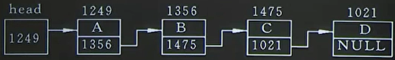

- 创建静态链表

  - ```C
    #include <stdio.h>
    struct weapon //自定义类型作为节点元素
    {
      int price;
      int atk;
      struct weapon *next; // 存放下一个节点的地址
    };
    int main()
    {
      struct weapon a, b, c, *head;
      a.price = 100;
      a.atk = 100;
      b.price = 200;
      b.atk = 200;
      c.price = 300;
      c.atk = 300;
      // 连成链表
      head = &a;
      a.next = &b;
      b.next = &c;
      c.next = NULL;
      // 生成指针p 访问结点
      struct weapon *p;
      p = head;
      while (p != NULL)
      {
        printf("%d,%d\n", p->atk, p->price);
        p = p->next;
      }
      
      return 0;
    }
    ```

- 在节点 `p,q` 之间插入节点关键算法

  - 新插入点 `s`

    ```c
    s->next=p->next; // p->next==q; s->next=q;
    p->next=s;
    ```

  - 再删除节点 `s`

    ```c
    p->next=s->next; // p->next=p->next->next;
    free(s);
    ```

    

  

### 14.5 动态链表

- 程序运行时创建新节点。

- 单向动态链表

  - ```C
    #include <malloc.h>
    #include <stdio.h>
    struct weapon //自定义类型作为节点元素
    {
      int price;
      int atk;
      struct weapon *next; // 存放下一个节点的地址
    };
    
    struct weapon *create()
    {
      struct weapon *head;
      struct weapon *p1, *p2;
      int n = 0;
      // malloc 分配内存 , sizeof 判断数据类型长度
      p1 = p2 = (struct weapon *)malloc(sizeof(struct weapon));
      scanf("%d,%d", &p1->price, &p1->atk); // 输入格式: 数据,数据
      head = NULL;
      while (p1->price != 0) // 输入 0 结束输入 
      {
        n++;
        if (n == 1)
          head = p1;
        else
          p2->next = p1;
    
        p2 = p1;
        p1 = (struct weapon *)malloc(sizeof(struct weapon));
        scanf("%d,%d", &p1->price, &p1->atk);
      }
      p2->next = NULL;
      return head;
    }
    int main()
    {
      struct weapon *p;
      p = create();
      while (p != NULL)
      {
        printf("%d,%d\n", p->price, p->atk);
        p = p->next;
      }
      return 0;
    }
    ```

    


## 第十五章 位运算

1. 位运算符的含义和使用
2. 简单的位运算
3. 比加减运算快一点，比乘除运算快很多

### 15.1 位运算符

1. 按位取反： `~`
   - 二进制中0变1，1变0。
2. 左移：`<<`
   - 进制中向左移动一位，相当于原有数值乘以 2。
3. 右移：`>>`
   - 进制中向右移动一位，相当于原有数值除以 2。
4. 按位与：`&`
   -  `1&1=1，1&0=0，0&1=0，0&0=0`
5. 按位异或：`^`
   - 当两个值不同时候结果为 1。
6. 按位或：`|`
   -  `1&1=1，1&0=1，0&1=1，0&0=0`


### 15.2 按位与 `&`

- 二进制数进行逻辑与运算

  - **必须是整型或字符型，必须补码形式**

  - ```C
    #include <stdio.h>
    #include <malloc.h>
    int main()
    {
      // & | ^ ~ << >>
      int a = 4; // 00000000 00000000 00000000 00000100
      int b = 7; // 00000000 00000000 00000000 00000111
                 // 00000000 00000000 00000000 00000100
      int C = a & b;
      printf("%d\n", C);
    
      // 迅速清零： 与 0 按位与
      int zero = a & 0;
      printf("%d\n", zero);
    
      // 保留指定位: b 低八位 置1, a&b, 得到 a 的低八位
      // 判断奇偶性: a&1=1 则是奇数，a&1=0 则是偶数
      return 0;
    }
    ```

    

### 15.3 按位或 `|`

```C
#include <stdio.h>
int main()
{
  //&|^~<< >>
  int a = 9; // 00000000 00000000 00000000 00001001
  int b = 5; // 00000000 00000000 00000000 00000101
             // 00000000 00000000 00000000 00001101
  int C = a | b;
  printf("c=%d\n", c);
  a = a | 0xFF; //低八位 置1
  printf("a=%d\n", a);
  return 0;
}
```


### 15.4 按位异或 `^`

```C
#include <stdio. h>
int main(){
  //&|^~<<>>
  int a=9;//0000 1001
  int b=5;//0000 0101
  				//0000 1100
  int c=a^b;
  printf("c=%d\n",c);
  
  // 定位翻转
  // 数值交换
  a = a^b;
  b=b^a;
  a=a^b;
  printf("a=%d\n, b=%d\n" ,a,b);

  return 0;
}
```

- 取反 `~` 右结合性

  - ```C
    ~( 00001001 ) // 11110110
    ```

    

### 15.5 左移右移 `<<` `>>`

- 高位丢弃，低位补零
  - 左移：乘以 2 的 n 次方
  - 右移：除以 2 的 n 次方

```C
#include <stdio. h>
int main(){
// &|^~<<>>
int a=3; //00000000 00000000 00000000 00000011
a= a<<4; //00000000 00000000 00000000 00110000
int i=1; //00000001
				 //00000100
return 0;
}
```


## 第十六章 文件

只要求缓冲文件系统(即高级磁盘I\O系统)。对非标准缓冲文件系统(即低级磁盘I\O系统)不要求。

1. 文件类型指针(FILE 类型指针)

2. 文件的打开与关闭( fopen, fclose)

3. 文件的读写 

   (fputc, fgetc, fputs, fgets, fread, fwrite, fprintf, fscanf 函数的应用,

   文件的定位( rewind,fseek函数的应用)

### 16.1 C语言文件概述

1. 计算中管理数据的方式通过文件

   文件有两种：

   1. 二进制文件
   2. 文本文件

### 16.2 文件指针

1. 什么是文件指针?

   文件指针实际上是指向一个结构体类型的指针.也就是说该指针中只能存放

   结构体类型类型变量的地址.

   文件类型指针变量的定义形式:`FE*指针变量名`

   例如:`FILE *fp1,*fp2;`

### 16.3 打开文件 fopen

```c
FILE *fp;
fp=fopen("file_path","r");
```

`read write append` 

`+`：读写

- `r`：(只读)为输入打开一个文本文件
- `w`：(只写)为输出打开个文本文件
- `r`：(追加)向文本文件尾增加数据
- `rb`：(只读)为输入打开一个**二进制**文件
- `wb`：(只写)为输出打开一个**二进制**文件
- `ab`：(追加)向**二进制**文件尾增加数据
- `r+`：(读写)为**读/写 **打开一个文本文件
- `w+`：(读写)为**读/写** 建立一个新的文本文件
- `a+`：(读写)为**读/写** 打开个文本文件
- `rb+`：(读写)为**读/写**打开个**二进制**文件
- `wb+`：(读写)为**读/写**建立一个新的**二进制**文件
- `ab+`：(读写)为**读/写**打开个**二进制**文件


### 16.4 关闭文件 fclose

```c
FILE *fpl, *fp2;
fp=fopen(" file_path","r");
fclose(fp);
```


### 16.5文件写入与读取

- Write

```c
#include <stdio.h>
#include <stdlib.h>
int main(void)
{
  FILE *fp;
  char ch, fileName[10];
  scanf("%s", fileName);
  if ((fp = fopen(fileName, "w")) == NULL)
  {
    printf("Can't Open File\n");
    exit(0); // 终止程序
  }
  ch = getchar(); // 接收执行scanf语句时最后输入的回车符
  ch = getchar(); // 接收输入的第一个字符
  while (ch != '#')
  {
    fputc(ch, fp);
    putchar(ch);
    ch = getchar();
    fclose(fp);
  }
}

```

- Read

```C
#include <stdio.h>
#include <stdlib.h>
int main(void)
{
  FILE *fp;
  char ch;
  if ((fp = fopen("123", "r")) == NULL)
  {
    printf("Can't Open File\n");
    exit(0); // 终止程序
  }
  ch = getc(fp); // 接收一个字符
  while (ch != EOF)
  {
    putchar(ch);
    ch = getc(fp);
    fclose(fp);
  }
}

```


### 16.6 判断文件结束feof

使用方法: `feof(文件指针)`
例如:

```
FILE * fp
feof( fp)
```

结束返回1

否则返回0


### 16.7 fprintf() 和 fscanf() 函数应用

格式化读写函数 `fprintf() 和 fscanf()` 

函数调用

```c
fprintf(文件指针,格式字符串,输出表列);
fscanf(文件指针,格式字符串,输入表列);
```

磁盘文件中**读入**或**输出**字符

```c
fprintf(fp, %d, %6.2f", i, t);
fscanf (fp, "%d, %f", &i, &t);
```


### 16.8 fgets() 和 fputs() 函数应用

1. gets 函数
   1. **从指定文件读入一个字符串.**
   2. 函数调用
      1. fgets(str,n, fp)
      2. 从印指向的文件输入n-1个字符,在最后加 `‘\0’` ;
   3. 返回值
      1. str的首地址
2. fputs 函数
   1. 向指定的文件输出一个字符串
   2. 函数调用
      1. `fputs("china", fp);`
      2. 第一个参数可以是字符串常量、字符数组名或字符指针.
      3. 字符串末尾的`\0`不输出.
   3. 返回值
      1. 输入成功,返回值为`0`
      2. 输入失败,返回`EOF`.


### 16.9 fread() 和 fwrite() 函数应用

1. fread 和 write 函数的应用

   两个函数 fread 和 fwrite 的调用形式完全相同

   1.  `fread( buffer, size, count, fp);`

      buffer是数据块的指针.它是内存的首地址,输入的数据存入此数据块中.

   2. `fwrite( buffer, size, count, fp);`

      buffer是数据块的指针,它是准备输出的数据的起始地址.

```c
fread(void *buffer,size_t size,size_t count,FILE *stream);
```

- 功能是从一个文件流中读数据,读取 count个元素,每个元素size字节,如果调用成功返回 count
- buffer: 用于接收数据的內存地址,大小至少是size *count字节;
- size: 单个元素的大小,单位是字节;
- count: 元素的个数,每个元素是size字节;
- stream: 输入流


### 16.10 文件定位

1. 文件定位函数( rewind、 fseek和fte函数)的应用

   1. **rewind 函数** 又称"反绕"函数，此函数的调用形式为: `rewind(pf);`

      此函数没有返回值。函数的功能是**使文件的位置指针回到文件的开头**。

   2. **fseek 函数**的调用形式为: `fseek(pf,offset,origin);`
      用来**移动文件位置指针到指定的位置上**，接着的读写操作将从此位置开始。

   3. **ftell 函数**的调用式: `ftell(fp);`
      用以**获得文件当前位置指针的位置**。当函数调用出错时函数的返回值为 `-1L`。


## 第十七章 上机操作指南

### VC++ 2010 C语言基本操作

1. 如何编译（F7）

   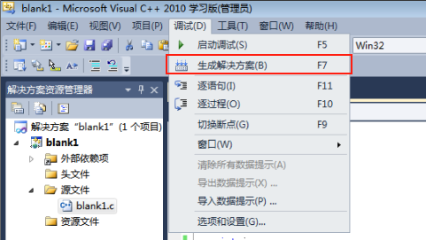

2. 如何运行（Ctrl+F5）

   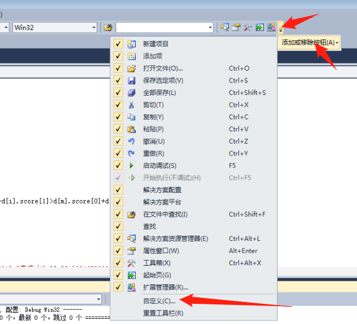

   

   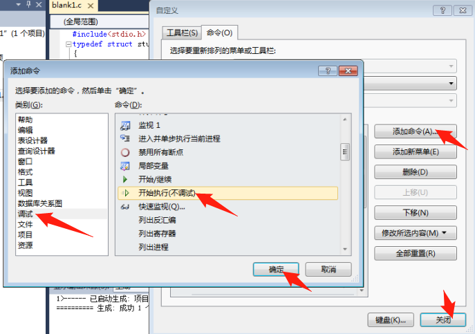

   

   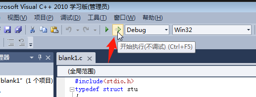

3. 如何启动调试（F5）

4. 建立变量跟踪方法

5. 如何查找错误

6. 错误信息的解读


## 附件 VSCode配置

```json
// https://code.visualstudio.com/docs/cpp/launch-json-reference
{
    "version": "0.2.0",
    "configurations": [{
        "name": "(gdb) Launch", // 配置名称，将会在启动配置的下拉菜单中显示
        "type": "cppdbg", // 配置类型，对于C/C++可认为此处只能是cppdbg，由cpptools提供；不同编程语言不同
        "request": "launch", // 可以为launch（启动）或attach（附加）
        "program": "${fileDirname}/${fileBasenameNoExtension}.exe", // 将要进行调试的程序的路径
        "args": [], // 程序调试时传递给程序的命令行参数，一般设为空
        "stopAtEntry": false, // 设为true时程序将暂停在程序入口处，相当于在main上打断点
        "cwd": "${workspaceFolder}", // 调试程序时的工作目录，此为工作区文件夹；改成${fileDirname}可变为文件所在目录
        "environment": [], // 环境变量
        "externalConsole": false, // 使用单独的cmd窗口，与其它IDE一致；为false时使用内置终端
        "internalConsoleOptions": "neverOpen", // 如果不设为neverOpen，调试时会跳到“调试控制台”选项卡，你应该不需要对gdb手动输命令吧？
        "MIMode": "gdb", // 指定连接的调试器，可以为gdb或lldb。但我没试过lldb
        "miDebuggerPath": "gdb.exe", // 调试器路径，Windows下后缀不能省略，Linux下则不要
        "setupCommands": [
            { // 模板自带，好像可以更好地显示STL容器的内容，具体作用自行Google
                "description": "Enable pretty-printing for gdb",
                "text": "-enable-pretty-printing",
                "ignoreFailures": false
            }
        ],
        "preLaunchTask": "Compile" // 调试前执行的任务，一般为编译程序。与tasks.json的label相对应
    }]
}
```

```json
// https://code.visualstudio.com/docs/editor/tasks
{
    "version": "2.0.0",
    "tasks": [{
        "label": "Compile", // 任务名称，与launch.json的preLaunchTask相对应
        "command": "gcc",   // 要使用的编译器，C++用g++
        "args": [
            "${file}",
            "-o",    // 指定输出文件名，不加该参数则默认输出a.exe，Linux下默认a.out
            "${fileDirname}/${fileBasenameNoExtension}.exe",
            "-g",    // 生成和调试有关的信息 断点参数
            // "-m64",  // 不知为何有时会生成16位程序而无法运行，此条可强制生成64位的
            "-Wall", // 开启额外警告
            "-static-libgcc",     // 静态链接libgcc，一般都会加上
            // "-fexec-charset=GBK", // 生成的程序使用GBK编码，不加这条会导致Win下输出中文乱码；繁体系统改成BIG5
            // "-D__USE_MINGW_ANSI_STDIO", // 用MinGW写C时留着，否则不需要，用于支持printf的%zd和%Lf等
        ], // 编译的命令，其实相当于VSC帮你在终端中输了这些东西
        "type": "process", // process是把预定义变量和转义解析后直接全部传给command；shell相当于先打开shell再输入命令，所以args还会经过shell再解析一遍
        "group": {
            "kind": "build",
            "isDefault": true // 不为true时ctrl shift B就要手动选择了
        },
        "presentation": {
            "echo": true,
            "reveal": "always", // 执行任务时是否跳转到终端面板，可以为always，silent，never。具体参见VSC的文档，即使设为never，手动点进去还是可以看到
            "focus": false,     // 设为true后可以使执行task时焦点聚集在终端，但对编译C/C++来说，设为true没有意义
            "panel": "shared"   // 不同的文件的编译信息共享一个终端面板
        },
        "problemMatcher":"$gcc" // 捕捉编译时终端里的报错信息到问题面板中，修改代码后需要重新编译才会再次触发
        // 本来有Lint，再开problemMatcher就有双重报错，但MinGW的Lint效果实在太差了；用Clangd可以注释掉
    }]
}
```

```json
{
    "configurations": [
        {
            "name": "Win32",
            "includePath": [
                "${workspaceFolder}/**"
            ],
            "defines": [
                "_DEBUG",
                "UNICODE",
                "_UNICODE"
            ],
            "intelliSenseMode": "gcc-x64",
            "compilerPath": "C:/TDM-GCC-64/bin/g++.exe"
        }
    ],
    "version": 4
}
```

```json
{
    "files.defaultLanguage": "c", // ctrl+N新建文件后默认的语言
    // "editor.formatOnType": true,  // 输入分号(C/C++的语句结束标识)后自动格式化当前这一行的代码
    // "editor.suggest.snippetsPreventQuickSuggestions": false, // clangd的snippets有很多的跳转点，不用这个就必须手动触发Intellisense了
    // "editor.acceptSuggestionOnEnter": "off", // 我个人的习惯，按回车时一定是真正的换行，只有tab才会接受Intellisense
    // "editor.snippetSuggestions": "top", // （可选）snippets显示在补全列表顶端，默认是inline

    // "code-runner.runInTerminal": true, // 设置成false会在“输出”中输出，无法输入
    // "code-runner.executorMap": {
    //     "c": "gcc '$fileName' -o '$fileNameWithoutExt.exe' -Wall -O2 -m64 -lm -static-libgcc -fexec-charset=GBK -D__USE_MINGW_ANSI_STDIO && &'./$fileNameWithoutExt.exe'",
    //     "cpp": "g++ '$fileName' -o '$fileNameWithoutExt.exe' -Wall -O2 -m64 -static-libgcc -fexec-charset=GBK && &'./$fileNameWithoutExt.exe'"
    //     // "c": "gcc $fileName -o $fileNameWithoutExt.exe -Wall -O2 -m64 -lm -static-libgcc -fexec-charset=GBK -D__USE_MINGW_ANSI_STDIO && $dir$fileNameWithoutExt.exe",
    //     // "cpp": "g++ $fileName -o $fileNameWithoutExt.exe -Wall -O2 -m64 -static-libgcc -fexec-charset=GBK && $dir$fileNameWithoutExt.exe"
    // }, // 右键run code时运行的命令；未注释的仅适用于PowerShell（Win10默认）和pwsh，文件名中有空格也可以编译运行；注释掉的适用于cmd（win7默认）、PS和bash，但文件名中有空格时无法运行
    // "code-runner.saveFileBeforeRun": true, // run code前保存
    // "code-runner.preserveFocus": true,     // 若为false，run code后光标会聚焦到终端上。如果需要频繁输入数据可设为false
    // "code-runner.clearPreviousOutput": false, // 每次run code前清空属于code runner的终端消息，默认false
    // "code-runner.ignoreSelection": true,   // 默认为false，效果是鼠标选中一块代码后可以单独执行，但C是编译型语言，不适合这样用
    // "code-runner.fileDirectoryAsCwd": true, // 将code runner终端的工作目录切换到文件目录再运行，对依赖cwd的程序产生影响；如果为false，executorMap要加cd $dir

    "C_Cpp.clang_format_sortIncludes": true, // 格式化时调整include的顺序（按字母排序）
}
```

