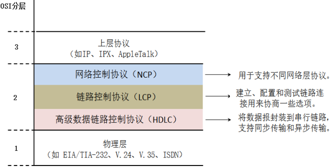
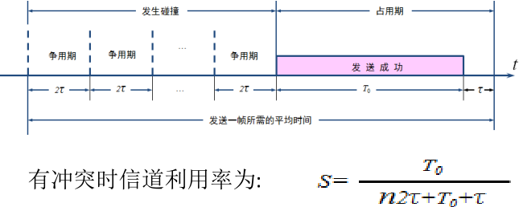

课程介绍:

课程目标：
理解数据通信的过程和TCP、IP协议的工作过程。
适用人群：
将来从事IT工作的人群，打算彻底从理论上搞明白计算机网络是如何通信的人群。

课程大纲-2019全新《计算机网络原理》考研视频教程

资料下载


# 第1章 计算机网络和协议

6小时43分钟30节

高端IT运维职位需要学习的技能 04:40 

1.1  计算机网络在当今社会的作用

## 1.2  认识网络


- 家庭ADSL无线拨号路由器逻辑图

  

  

## 1.3  理解计算机通信使用的协议


### 1-3 抓包分析应用层协议 12:37 


### 1-4 协议标准化的好处 10:04 

- 互联网中有很多常见的应用，很多家公司开发服务端程序，也有很多家公司开发客户端程序。为了使不同厂家开发的服务端程序和客户端程序能够通信 ，必须将这些应用程序通信协议的协议进行标准化

- TCP/IP协议组中知名的应用层协议
  ◼ 超级文本传输协议--HTTP ，用于访问Web 服务。
  ◼ 安全的超级文本传输协议--HTTPS ，能够将HTTP 协议通信进行加密访问。
  ◼ 简单邮件传输协议--SMTP ，用于发送电子邮件。
  ◼ 邮局协议版本3 --POP3 ，用于接收电子邮件。
  ◼ 域名解析协议--DNS ，用于域名解析。
  ◼ 文件传输协议--FTP ，用于在Internet 上传和下载文件。
  ◼ 简单文件传输协议--TFTP ，在客户机与服务器之间进行简单文件传输的协议。
  ◼ 远程登录--telnet 协议，用于远程配置网络设备和Linux 系统。
  ◼ 动态主机配置协议--DHCP ，用于计算机自动请求IP


### 1-5 以HTTP协议为例理解计算机通信协议 05:55 

- **HTTP 协议的甲方乙方分别是**
  Web 服务器和浏览器
  ◼ 该协议就是规定浏览器访问网站方法和规则。
  ◼ 定义了客户端能够向服务器发送哪些请求。
  ◼ 服务器能够向客户端发送哪些响应。
  ◼ 定义了请求报文格式。
  ◼ 定义了响应报文格式。

- **计算机通信使用的协议包含三要素**
  计算机通信使用的协议包含三要素：语法、语义和同步。
  - 语法
    - 定义协议中每种报文的格式：有哪些字段，字段是定长还是变长，如果是变长，字段分割符是什么，都要在协议中定义。一个协议有可能需要定义多种报文格式，比如ICMP 协议，定义了ICMP 请求报文格式、ICMP 响应报文格式、ICMP 差错报告报文格式。
  - 语义
    - 客户端能够向服务器发送那些请求（方法或命令），服务器有哪些响应（状态代码），每种状态代码代表什么意思。
  - 同步
    - 客户端访和服务器命令交互顺序，比如POP3 协议，需要先验证用户身份才能收邮件。


## 1.4 TCP/IP 协议

### 1-6 TCP/IP协议体系结构 17:17 


### 1-20 TCP/IP协议通信过程 28:15 


## 1.5 OSI 参考模型

### 1-7 OSI参考模型和TCP/IP协议之间的关系 05:51 


### 1.5.2 **OSI参考模型每层功能**

◼  应用层 ，根据互联网中需要通信的应用程序的功能，定义客户端和服务端程序通信的规范，应用层向表示层发出请求。
◼  表示层，定义数据格式、是否加密或压缩。例如，FTP 允许你选择以二进制或ASCII 格式传输。如果选择二进制，那么发送方和接收方不改变文件的内容。如果选择ASCII 格式，发送方将把文本从发送方的字符集转换成标准的ASCII 后发送数据。在接收方将标准的ASCII 转换成接收方计算机的字符集。
◼  会话层 ，它定义了如何开始、控制和结束一个会话，包括对多个双向消息的控制和管理，以便在只完成连续消息的一部分时可以通知应用，从而使表示层看到的数据是连续的。
◼  传输层 ，常规数据递送，面向连接或无连接。面向连接实现可靠传输，比如TCP 协议，面向无连接，提供不可靠传输，比如UDP 协议。
◼  网络层 ，根据网络地址为数据包选择选择转发路径。网络层为传输层提供服务，只是尽力转发数据包，不保证不丢包，也不保证按顺序到达接收端。
◼  数据链路层 ，数据链路层常简称链路层，两台主机之间的数据传输，总是在一段一段的链路上传送的，这就需要专门的链路层的协议。
◼  物理层 ，在物理层上所传输的数据单位是比特。发送方发送1 （或0 ）时，接收方应该收到1 （或0 ），而不是0 （或1 ）。因此物理层要考虑用多大电压代表“1 ”或“0 ”，以及接收方如何识别出发送方所代表的比特。物理层还要确定连接电缆的的插头应当有多少根引脚以及各条引脚应如何连接。


### 1.6.6 用分层的思想考虑问题

◼ 计算机通信按功能分层的好处就是当某一层有变换不会波及其他层。
◼ 比如单位的网络IP 地址重新规划，不会影响企业内外的服务的访问。
◼ 要实现这个分层，就不要在应用层包含网络层的信息，比如开发的客户端程序连接服务器就不要写服务器的IP 地址，而是写服务器的名称。如果将服务器的IP 地址写进应用程序，就没有采纳OSI 参考模型的分层思想。网络一旦调整，就需要修改客户端程序。这就是网络层变换引起应用层变化了。

### 1-15 网络层功能 07:25 


1-16 数据链路层功能 07:31 

1-17 物理层功能 06:57 


### 1-18 OSI参考模型指导网络排错 31:25 


### 1-21 集线器交换机路由工作在哪一层？ 07:29 


## 1.7  计算机网络性能指标

### 1.7.1 速率

- 网络技术中的速率指的是每秒钟传输的比特数量，称为数据率（data rate ）或比特率（bit
  rate ），速率的单位为b/s （比特每秒）或bit/s ，有时也写为bps ，即bit per second 。当速率较高时，就可以用kb/s （k=103= 千）、Mb/s （M=106= 兆）、Gb/s （G=109= 吉）或Tb/s（T=1012= 太）。现在人们习惯于用更简洁但不严格的说法来描述速率，比如10M 网速，而省略了单位中的b/s。 。
  ◼Windows 操作系统中，速率以字节为单位。大写的B 代表字节，是byte 的缩写，8 比特=1 字节。
  ◼ 速率是指的一个发端一个接收端平均每秒中发送多少bit。

### 1.7.2 带宽

- 在计算机网络中，带宽用来表示网络通信线路传输数据的能力，即最高速率。
- 可以设置电脑网卡的带宽。

### 1.7.3 吞吐量

- 吞吐量表示在单位时间内通过某个网络或接口的数据量，包括全部上传和下载的流量。

### 1.7.4 时延

- 时延（delay 或latency ）是指数据（一个数据包或bit ）从网络的一端传送到另一端所需要的时间。时延是一个很重要的性能指标，有时也称为延迟或迟延。

1. **发送时延（transmission delay ）**是主机或路由器发送数据帧所需时间，也就是从发送数据帧的第一个比特开始，到该帧最后一个比特发送完毕所需要的时间。下图

   

   

2. **传播时延（propagation delay）**是电磁波在信道中传播一定的距离需要花费的时间。如 下图所示，从最后一比特发送完毕到最后一比特到达路由器接口需要的时间就是传播时延。

   

3. **排队时延**

   - 分组在经过网络传输时，要经过许多的路由器。但分组在进入路由器后要先在输入队列中排队等待处理。

4. **处理时延**

   - 路由器或主机在收到数据包时，要花费一定时间进行处理，例如分析数据包的首部、进行首部差错检验，查找路由表为数据包选定转发出口，这就产生了处理时延。
   - 数据在网络中经历的总时延就是以上四种时延的总和。
   - 总时延= 发送时延+ 传播时延+ 处理时延+ 排队时延

### 1.7.5 时延带宽积

- 把链路上的传播时延和带宽相乘，就会得到时延带宽积。这对我们以后计算以太网的最短帧非常有帮助。

- 时延带宽积= 传播时延×带宽

  

  

### 1.7.6 往返时间

- 在计算机网络中，往返时间RTT（ Round-Trip Time ）也是一个重要的性能指标，它表示从发送端发送数据开始，到发送端接收到来自接收端的确认（发送端收到后立即发送确认），总共经历的时间。
- 往返时间带宽积，可以用来计算当发送端连续发送数据时，接收端如发现有错误，立即向发送端发送通知使发送端停止，发送端这段时间发送的比特量 。

### 1.7.7 利用率

- 利用率是指网络有百分之几的时间是被利用的（有数据通过），没有数据通过的网络利用率为零。网络利用率越高，数据分组在路由器和交换机处理时就需要排队等待，因此时延也就越大。下面的公式表示网络利用率和延迟之间的关系。


## 1.8  网络分类

### 1.8.1 按网络的范围进行分类

1. 局域网（Local Area Network ，LAN ）是在一个局部的地理范围内（如一个学校、
   工厂和机关内），一般是方圆几千米以内，将各种计算机、外部设备和数据库等
   互相连接起来组成的计算机通信网。
2. 广域网（Wide Area Network ，WAN ）通常跨接很大的物理范围，所覆盖的范围从
   几十公里到几千公里，能连接多个城市或国家，或横跨几个洲并能提供远距离通
   信，形成国际性的远程网络。
3. 城域网（Metropolitan Area Network ，MAN ）的作用范围一般是一个城市，可跨
   越几个街区甚至整个城市，其作用距离约为5 ～50km 。城域网可以为一个或几个
   单位所拥有，但也可以是一种公用设施，用来将多个局域网进行互连。目前很多
   城域网采用的是以太网技术，因此有时也将其并入局域网的范围进行讨论。
4. 个人区域网（Personal Area Network ，PAN ）就是在个人工作的地方把属于个人使
   用的电子设备（如便携式电脑等）用无线技术连接起来的网络，因此也常称为无
   线个人区域网（Wireless PAN ，WPAN ），比如无线路由器组建的家庭网络，就是
   一个PAN

### 1.8.2 按网络的使用者进行分类

1. 公用网（public network ）是指电信公司（国有或私有）出资建造的大型网络。“公用”的意思就是所有愿意按电信公司的规定交纳费用的人都可以使用这种网络。因此公用网也可称为公众网，因特网就是全球最大的公用网络。
2. 专用网（private network ）是某个部门为本单位的特殊业务工作需要而建造的网络。这种网络不向本单位以外的人提供服务。例如，军队、铁路、电力等系统均有本系统的专用网。
3. 公用网和专用网都可以传送多种业务。如传送的是计算机数据，则分别是公用计算机网络和专用计算机网络。

## 1.9 企业局域网设计

### 1.9.1 二层结构的局域网

- 接入层连接计算机

- 汇聚成连接接入层交换

  

  

### 1.9.2 三层结构的局域网

- 接入层
- 汇聚层
- 核心层


# 第2章 物理层

4小时29分钟15节

## 2.1  物理层的基本概念

- 物理层涉及到的内容

  

  物理层涉及到的知识点
  数字信号 双绞线 同轴电缆 光纤 时分多路 波分复用 编码方式
  模拟信号 频分多路复用 码分复用技术 全双工 半双工 单工通信

- **物理层实现的功能** 12:13 
  - **物理层定义了与传输媒体的接口有关的一些特性。**
    1. 机械特性 外形
    2. 电气特性 电压
    3. 功能特性 功能
    4. 过程特性 时序、顺序

## 2.2  数据通信基础

信息-数据-信号 26:53 

数字信号和模拟信号 08:47 

### 2.2.1  数据通信模型

1. 局域网通信模型

   

2. 广域网通信模型

   

3. 广域网通信模型

   

   

### 2.2.2  数据通信一些常用术语

- 信息（Message ）：通信的目的是传送信息，如文字、图像、视频和音频等都是消息。
- 数据（Data ）：信息在传输之前需要进行编码，编码后的信息就变成数据。
- 信号（signal ）：数据在通信线路上传递需要变成电信号或光信号。


### 2.2.3  模拟信号和数字信号

- 模拟信号或连续信号

  

- 数字信号或离散信号

  -   **二进制码元**

    - 一个码元表示一个二进制数。

    

  - **四进制码元**

    - 一个码元代表两位二进制数。

    

  - **八进制码元**

    - 一个码元代表三位二进制数。

    

- 数字信号和模拟信号优缺点

  - 模拟信号在传输过程中如果出现信号干扰发生波形发生变形，很难纠正。

    

  - 数字信号 波形失真可以修复

    

  

### 2.2.4  模拟信号转换成数字信号

- 模拟信号可以转换成数字信号，转换过程有失真。所以听歌还要去演唱会现场，100% 的音效。使用电脑听的音乐是转换成数字信号后再还原成模拟信号，就达不到现场效果了。

  

- 采样频率和采样精度决定音乐的品质

  


## 2.3  信道和调制

信道复用技术 10:57 

调制技术-基带调制和带通调制 19:37 

信道极限容量-码元的最高传输速率（奈氏准则） 16:43 

信道极限容量-最高数据传输速率（香农公式） 21:16 

### 2.3.1  信道

- 信道（Channel ）是信息传输的通道，即信息进行传输时所经过的一条通路，信道的一端是发送端，另一端是接收端。一条传输介质上可以有多条信道（多路复用）。

  

  

### 2.3.2  单工和半双工以及全双工通信

1. **单向通信**
   - 又称为单工通信，即信号只能向一个方向传输，任何时候都不能改变信号的传送方向。无线电广播或有线电视广播就是单工通信，信号只能是广播电台发送，收音机接收。
2. **双向交替通信**
   - 又称半双工通信，信号可以双向传送，但是必须是交替进行，一个时间只能向一个方向传。有些对讲机就是用半双工通信，A 端说话B 端接听，B 端说话A端接听，不能同时说和听。
3. **双向同时通信**
   - 又称全双工通信，即信号可以同时双向传送。比如我们手机打电话，听和说可以同时进行。

### 2.3.3  调制

- 来自信源的信号通常称为基带信号（即基本频带信号）。

- 调制可以分为两大类。

  - 一类仅仅对**基带信号的波形进行变换**，使它能够与信道特性相适应。变化后的信号仍然是基带信号，这类调制称为**基带调制**。由于这种基带调制十八数字信号转换成另一种形式的数字信号，因此大家更愿意把这种过程称为**编码（coding）** 
  - 另一类则需要使用**载波（carrier ）**进行调制，把基带信号的频率范围搬移到较高的频段以便在信道中传输 ， 经过载波调制后的信号称为带通信号（即仅在一段频率范围内能够通过信道），而使用载波的调制称为**带通调制**。

- 来自信源的信号通常称为基带信号（即基本频带信号） 。

- 为了把基带信号能够再介质中传输需要对基带信号进行调制。

  

- 调制可以分为两大类。

  - **基带调制又称编码**
  - 将基带信号调制成模拟信号

- 常用**编码方式**

- 常用**带通调制**方法

### 2.3.4 信道极限容量

- 有失真但可识别

  

- 失真太大无法识别

  

- 信道带宽

  - 信道带宽= 能够通过的最高频率-最低频率

    

- 模拟信号谐波成数字信号

  数字信号是由基波加上谐波叠加而成

  

- 数字信号高频带宽不能通过

  

- **奈氏准则 （数字信号）**

  - 在任何信道中，码元传输的速率是有上限的，否则就会出现码间串扰的问题，使接收端对
    码元的判决（即识别）成为不可能 。

  - 如果信道的频带越宽，也就是能够通过的信号高频分量越多，那么就可以使用更高速率传
    递码元而不出现码间串扰。

    **理想低通信道的最高码元传输速率=2WBaud**

    - W 是理想低通信道的带宽，单位为HZ。 
    - Baud 是波特，是码元传输速率的单位。

  - 使用奈氏准则给出的公式，可以根据信道的带宽，计算出码元的最高传输速率。

- 在码元传输速率一定的情况下提高数据传输速率

  - 码元传输速率一定，那就让一码元承载更多信息。8 进制码元，一码元代表三位二进制数，16 进制码元，一码元代表4 进制数。
  - 在工作电压一定的情况下，16 进制码元波形差别就小，更容易受干扰。
  - 要想增加码元之间的电压差别，那就要怎加工作电压，也就是提高发送信号的功率 。

  

- **香农公式 （适用于模拟信号和数字信号）**

  - 有噪声的 信道的极限信息传输速率C：$C=W log _2 (1+S/N)\quad(b/s)$
  - 式中，W 为信道的带宽（以Hz 为单位）；S 为信道内所传信号的平均功率；N为信道内部的高斯噪声功率

- 信噪比

  - 所谓信噪比就是信号的平均功率和噪声的平均功率之比，常记为S/N ，并用分贝（dB ）作为度量单位。即：$信噪比（dB ）=10log _{10} (S/N)\quad(dB)$
  - 例如，当S/N=10 时，信噪比为10dB ，而当S/N=1000 时，信噪比为30dB 。


## 2.4  传输媒体

导向传输媒体 24:16 

非导向传输媒体 10:03 

### 2.4.1  导向传输媒体

- 导向传输媒体

  - 双绞线

    

    

    

  - 同轴电缆

    

  - 光缆

    

    

    - 单一模光纤的光源要使用昂贵的半导体激光器，而不能使用较便宜的发光二极管。但单模光纤的衰耗较小，在2.5Gb/s 的高速率下可传输数十公里而不必采用中继器。

      

    - 光纤不仅具有通信容量非常大的优点，而且还具有其他的一些特点 ：

      - 传输损耗小，中继距离长，对远距离传输特别经济。
      - 抗雷电和电磁干扰性能好。这在有大电流脉冲干扰的环境下尤为重要。
      - 无串音干扰，保密性好，也不易被窃听或截取数据。
      - 体积小，重量轻。

### 2.4.2  非引导型传输媒体

-  无线电频段

  

  

  

- 短波通信

  - 短波通信即高频通信，主要是靠电离层的反射。

- 微波通信

  - 微波在空间主要是直线传播

- 无线局域网
  要使用某一段无线电频谱进行通信，通常必须得到本国政府有关无线电频谱管理机构的许可证。
  但是，也有一些无线电频段是可以自由使用的（只要不干扰他人在这个频段中的通信），这正好满足计算无线局域网的需求 。


## 2.5  信道复用技术

频分复用 17:05 

时分复用和波分复用 15:35 

码分复用 27:33 

### 2.5.1 频分复用

1. 频分复用FDM （Frequency Division Multiplexing ）适合于模拟信号。

   

   - A1 →A2 信道使用频率f1调制载波，B1 →B2 信道使用频率f2 调制载波，C1 →C2 信道使用频率f2调制载波，不同频率调制后的载波通过复用器将信号叠加后发送到信道。接收端的分用器将信号发送到三个滤波器，滤波器过滤出特定频率载波信号，再经过解调得到信源发送的模拟信号。

   

   - 频分复用 FDM的例子
     - 电话线路就使用的频分复用

   

   - 1路语音占用4kHz ，12 路语音信道形成一个组。5 个组形成一个超级组。可以看到频分复用可以进行多次叠加。

   

   

### 2.5.2 时分复用

- 数字信号的传输更多使用时分复用（Time Division Multiplexing ，TDM） 技术。

  - 时分复用采用同一物理连接的不同时段来传输不同的信号，  时分复用则是将时间划分为一段段等长的时分复用帧（TDM 帧）。

  

  

- 统计时分复用，需要给没有给用户添加一个标记，接收端用来区分用户。

  - 交换机之间使用干道链路连接，可以通过多个VLAN 的帧，就是给每个VLAN 的帧添加帧标记。

  

- 时分复用实现方法

  

  

### 2.5.3 波分复用

- 光纤技术的应用使得数据的传输速率空前提高。目前一根单模光纤的传输速率可达到2.5Gb/s 。再提高传输速率就比较困难了 。 为了提高光纤的传输信号的速率，也可以进行频分复用，由于光载波的频率很高，因此习惯上用波长而不用频率来表示所使用的光载波。这样就得出了波分复用这一名词。

  

  

### 2.5.4 码分复用

- 码分复用又称码分多址。是扩频通信技术（数字技术的分支）上发展起来的一种崭新而成熟的无线通信技术。

  

- 假如基站发送了码片序列（0 0 -2 +2 0 -2 0 +2） ） 。
  ⚫ A 手机的码片序列为（-1 -1 -1 +1 +1 -1 +1 +1） ）
  ⚫ B 手机码片序列为（-1 -1 +1 -1 +1 +1 +1 -1） ）
  ⚫ C 手机码片序列为（-1 +1 -1 +1 +1 +1 -1 -1） ）
  ◼问这三个手机，分别收到了什么信号？

  

- 码片正交

  - 什么是相互正交呢？两个不同站的码片序列正交，就是向量A  和B 的规格化内积（inner product） 都是0 ，令向量A 表示站A 的码片向量，令B  表示其他任何站的码片向量 。

    

  - 码片序列，自己和自己的格式化内积，为1。

    

  - 自己和自己的反码序列-A 格式化内积，为-1 。

    


## 2.6 宽带接入技术

铜线接入 18:08 

光纤同轴混合网 光纤接入和移动互联网接 10:17 

### 2.6.1  铜线接入技术 （电话线接入Internet） 

- 铜线宽带接入技术也就是xDSL （各种类型DSL （Digital Subscriber Line） ）数字用户线路的总称）技术，就是用数字技术对现有的模拟电话用户线进行改造，使它能够承载宽带业务。

- ADSL 属于DSL 技术的一种，全称Asymmetric Digital Subscriber Line （非对称数字用户线路），亦可称作非对称数字用户环路。是用数字技术对现有的模拟电话用户线进行改造，使其能够承载带宽数字业务。ADSL 考虑了用户访问Internet 的主要是获取网络资源，更多的下载流量，较少的上行流量，因此ADSL 上行和下行带宽设计成为不对称。上行指到 从用户到 ISP ，而下行指从ISP  到用户。

- 电话线中的频繁服用--ADSL 信道

  

- 基于ADSL 的接入网的组成

  

  

### 2.6.2  光纤同轴混合网（HFC 网） （有线电视同轴电缆）

-   光纤同轴混合网（HFC 网）在1988 年被提出，HFC 是Hybrid Fiber Coax 的缩写。HFC 是在目前覆盖面很广的有线电视网CATV 的基础上开发的一种居民宽带接入网。HFC 网除可传送CATV 外还提供电话、数据和其他宽带交互型业务。

  

  

### 2.6.3  光纤接入技术 （专门为小区居民铺设光缆）

- 从技术上讲，光纤到户FTTH （Fiber To The Home ）应当是最好的选择。所谓光纤到户，就是把光纤一直铺设到用户家庭，在用户的家中才把光信号转换成电信号，这样用户可以得到更高的上网速率。
- 根据光纤到用户的距离来分类，可分 成光 纤到小区（Fiber To The Zone 即 即FTTZ ）、光纤到路边（Fiber To The Curb 即FTTC ）、光纤到大楼（Fiber To The Building 即FTTB ）、光纤到户（Fiber To The Home即 FTTH ）以及光纤到桌面（Fiber To The Desk 即FTTD ）等。

### 2.6.4  移动互联网接入技术 （手机）

- 移动互联网，就是将 移动通信 和 互联网 二者结合起来，成为一体。

- 4G 全IP 网络

  

- 基于子网的4G IP 网络

  

  


# 第3章 GNS3和VMWare虚拟机搭建学习环境

2小时31分钟12节

- GNS3 是一款具有图形化界面、可以运行在多平台（包括Windows 、Linux 和Mac OS 等）上的网络虚拟软件。Cisco 网络设备管理员或是想要通过CCNA 、CCNP 、CCIE 等Cisco 认证考试的相关人士可以通过它来完成相关的实验；同时它也可以用于虚拟体验Cisco 网际操作系统IOS 或者检验将要在真实的路由器上部署实施的相关配置。
- 当然GNS3 对于我们学习计算机网络原理的学生，也是必不可少的工具。下面就讲解如何安装和配置GNS3 ，以及安装Wireshark抓包工具。

## 3-1 本章的地位 05:40 

1. 思科路由操作系统

   

2. 下载GNS3最新版，默认安装，自带**抓包工具**

3. **主要组件说明：**

   - WinPCAP ：抓包必需组件之一，建议安装，如果已经安装过可忽略；
   - Wireshark ：最流行的开源抓包工具，需在线下载，建议安装，也可自行安装；
   - SolarWinds Response Time Viewer for Wireshark ：一个Wireshark 的辅助分析工具，需在线下载，文件大耗时较长，新手不建议安装；
   - Dynamips ：一个用于模拟思科路由器的工具，必须安装；
   - QEMU ：是一套由Fabrice Bellard 所编写的模拟处理器的自由软件，必须安装；
   - VPCS ：GNS3 中模拟客户端的工具，必须安装；
   - Cpulimt ：一款限制CPU 进程的工具软件，优化系统资源的占用率，可选安装；
   - GNS3 ：核心组件，必须安装；
   - SuperPutty ：GNS3 自带终端工具，可选安装。

   

## 3-2 安装抓包工具分析数据包 12:16 


## 3-3 定义和使用抓包筛选器 16:01 


跟换协议过滤器点右上角箭头生效


## 3-4 安装和配置GNS3 12:45 

1. www.gns3.com

2. 最新版，默认安装

3. 新建项目

4. 安装路由器

   

   

   

5. 非模块化路由器与模块化路由器

   1. 非模块化路由器 Cisco 2500

      

      

      

   2. 模块化路由器

      

6. 配置模块

   

   1. NM-16ESW 16 个Fastethernet 接口（交换模块，在使用此模块做交换实验时，请
      使用no ip routing 关闭端口路由）
   2. NM-1E 1 个Ethernet 接口
   3. NM-1FE-TX 1 个Fastethernet 接口
   4. NM-4E 4 个Ethernet 接口
   5. NM-4T 4 个serial 接口


## 3-5 配置路由器和VPCS 24:09 

### pc配置命令和思科路由器命令

```sh
PC
pc>ip192.168.10.2255.255.250192.168.10.10
PC1> show

配置路由器以太网接口地址
R1#configure terminal
RI（config）#interface fastEthernet 0/0
R1（ config-if）# ip address192.168.10.1025255.250
R1（config-if）#no shutdown
RI（config-if）#exit
RI（config）#exit
R1#

配置广域网接口的命令
R1#show controllers serial 2/0
R1（config）#interface s
R1（config）#interface serial 2/0
RI（config-if）#clock rate
R1（config-if）#clock rate 64000
R1（ config-if）# ip address192.168.20.10255.25.255.0
RI（config-if）#no shutdown
R1#copy running-config startup-config
R1#show running-config

RI#show ip route
R1(config)# ip route 192.168.80.0 255.255.255.0 192.168.20.20

配置路由器以太网接口地址
◼Router>enable -- 进入特权模式
◼Router#config terminal -- 进入全局配置模式
◼Router(config)#interface fastEthernet 0/0 -- 进入接口配置模式
◼Router(config-if)#ip address 192.168.10.10 255.255.255.0 -- 添加IP地址
和子网掩码
◼Router(config-if)#no shutdown --

查看接口是DTE还是DCE
◼ Router(config-if)#exit -- 退出接口配置模式
◼ Router(config)#exit -- 退出全局配置模式
◼ Router#show controller serial 1/0 -- 查看接口是DCE 还是DTE
◼ M4T: show controller:
◼ PAS unit 0, subunit 0, f/w version 1-45, rev ID 0x2800001, version1
◼ idb = 0x643AE70C, ds = 0x643AF7D4, ssb=0x643AFB90
◼ Clock mux=0x0, ucmd_ctrl=0x1C, port_status=0x7B
◼ Serial config=0x8, line config=0x200
◼ maxdgram=1608, bufpool=78Kb, 120 particles
◼ DCD=up DSR=up DTR=up RTS=up CTS=up
◼ line state: up
◼ cable type : V.11 (X.21) DCE cable, received clockrate 64000 -- 可以看到该接口为DCE 需要配置时钟

配置Serial接口时钟频率和IP地址
◼Router#config terminal
◼Router(config)#interface serial 1/0 -- 进入接口配置模式
◼Router(config-if)#clock rate 64000 -- 配置时钟频率，控制带宽
◼Router(config-if)#encapsulation ppp -- 配置帧封装格式为ppp
◼Router(config-if)#ip address 172.16.0.1 255.255.255.0
◼Router(config-if)#no shutdown
◼Router(config-if)#exit
◼Router(config)#exit
◼Router#copy running-config startup-config -- 保存配置
```


## 3-6 将配置好的环境保存成快照 10:37 


## 3-7 使用Wireshark捕获GNS3搭建的网络环境中的 06:26 


项目名不要用中文，会无法运行抓包工具

- 可以抓多种传输协议


## 3-8 详细讲解VMWareWorkstation在你的计算 21:57 


- 桥接模式
  - 和电脑共用网卡，
  - 相当于直接连接外部路由器
- 仅主机
  - 物理机通过虚拟网卡与虚拟机相连
- NAT 模式
  - 共享主机 ip 地址

```
win环境：
运行,
wf.msc,
快速打开防火墙设置
```


## 3-9 GNS3路由器连接VMWare虚拟机 18:44 

- 连接形式


- 主机设置

  

- 新版使用云替代主机

  

- 虚拟机ip地址设置

  

- 路由转发表设置及命令

  `show ip route`

  `ip route 目的ip域 掩码 跳板ip地址 `

  

- 跟踪路由

  `tracert ip`

  

  


## 3-10 思科Packet Tracer 03:20 

- CCNA 学习考试用，不是真实路由器


## 3-11 Cisco PacketTracer 模拟软件搭建实验环境 15:45 


## 3-12 使用PacketTracer跟踪数据包 04:08 


# 第4章 数据链路层

5小时3分钟26节

4-1 本章主要内容 13:08 

4-2 数据链路层功能-封装成帧 17:49 

4-3 数据链路层功能-透明传输 10:32 

4-4 数据链路层功能-差错检验 11:43 

4-5 点到点信道数据链路层 10:56 

4-6 配置路由器广域网接口使用PPP协议封装 07:32 

4-7 PPP协议帧格式 07:36 

4-8 同步传输和异步传输 11:37 

4-9 PPP协议透明传输填充方式 06:06 

4-10 广播信道的数据链路层-CSMA/CD协议 19:23 

4-11 计算以太网最短帧 11:50 

4-12 冲突解决方法-退避算法 14:35 

4-13 以太网帧格式 11:37 

4-14 以太网道利用率 06:18 

4-15 网卡的作用-工作在数据链路层和物理层 09:08 

4-16 查看 更改网卡的MAC地址 跨网段扫描MAC地址 28:56 

4-17 扩展以太网规模和距离 07:31 

4-18 使用网桥和交换机优化以太网 08:01 

4-19 网桥MAC地址表构建过程 08:34 

4-20 实战：查看交换机MAC地址表 06:31 

4-21 交换机组网优缺点 13:59 

4-22 生成树协议 17:03 

4-23 配置生成树协议查看接口状态 10:05 

4-24 实战：查看生成树 关闭生成树 观察广播风暴 12:11 

4-25 快速以太网-100M以太网 06:21 

4-26 千兆万兆以太网 14:29 

**本章重点：讲解帧在不同链路的封装。**


## 4.1 数据链路层的三个基本问题

### 4.1.1  数据链路和帧

- **数据链路 和数据链路的区别**

  - **链路（Link ）**是指的从一个节点到相邻节点的一段物理线路（有线或无线），而中间没有任何其他的交换节点。
  - **数据链路（Data Link ）**则是另一个概念，这是因为当需要在一条线路上传送数据时，除了必须有一条物理线路外，还必须有一些必要的通信协议来控制这些数据的传输。

  

- 数据链路层把网络层交下来的数据封装成**帧**发送到链路上，以及把接收到的帧中的数据取出并上交给网络层。

- 在因特网中，网络层协议数据单元就是 **IP数据报**（或简称为数据报、分组或包）。数据链路层封装的**帧**，在物理层变成数字信号在链路上传输。


- 本章探讨数据链路层，就不考虑物理层如何实现比特传输的细节，我们就可以简单的认为数据帧通过数据链路由节点A发 发送到节点B。


### 4.1.2  数据链路层三个基本问题

1. **封装成帧**

   - 封装成帧，就是在将**网络层的IP 数据报**的前后分别添加首部和尾部，这样就构成了一个帧。
   - 不同的数据链路层协议的帧的首部和尾部包含的信息有明确的规定，**帧的首部和尾部有帧开始符和帧结束符，称为帧定界符**。接收端收到物理层传过来的数字信号读取到帧开始字符一直到帧结束字符，就认为接收到了一个完整的帧。
   - 在数据传输中出现差错时，**帧定界符**的作用更加明显。
   - 每一种数据链路层协议都规定了所能够传送的帧的数据部分长度的上限--即最大传输单元**MTU （Maximum Transfer Unit ）**，以太网的 MTU 为 **1500 个字节** 。

   

   

2. **透明传输**

   - 帧开始符和帧结束符最好是不会出现在帧的数据部分的字符，通常我们电脑键盘能够输入的字符是ASCII 字符代码表中打印字符，在ASCII 字符代码表中，还有非打印控制字符，在非打印字符中有两个字符专门用来做帧定界符，代码**SOH （Start Of Header ）**作为**帧开始定界符**，对应的二进制编码为00000001 ，代码**EOT （End Of Transmission ）**作为**帧结束定界符** 。

   

   - 当数据部分是非ASCII 字符代码表的文本文件时（比如二进制代码的计算机程序或图像等），情况就不同了。如果数据中的某一段二进制代码正好和SOH 或EOT 帧定界符编码一样，接收端就会误认为这就是帧的边界。
   - 现在就要想办法让接收端能够区分帧中EOT 或SOH 是数据部分还是帧定界符，我们可以在数据部分出现的帧定界符编码前面插入转义字符，
   - 如果传输的数据中，出现了帧开始字符和真结束字符，要添加转义字符，告诉接收端后面是数据。
     - 接收端收到后去掉转义字符，收到发送数据，这就是透明传输。
     - 不同的数据链路层协议，定义的转义字符不一样。

   

   1. ASCII 字符集中“头标开始”和“传输结束”是非打印控制字符。

   2. 避免在用户使用键盘输入帧开始字符和帧结束字符。

      

3. **差错检验**

   - 现实的通信链路都不会是理想的。这就是说，比特在传输过程中可能会产生差错：1 可能会
     变成0 ，而0 也可能变成1 ，这就叫做比特差错。

   - 为了保证数据传输的可靠性，在计算机网络传输数据时，必须采用各种差错检测措施。目
     前在数据链路层广泛使用了循环冗余检验CRC(Cyclic Redundancy Check ）的差错检验技术。

   - 要想让接收端能够判断帧在传输传输过程是否出现差错，需要在传输的帧中包含用于检测
     错误的信息，这部分信息就称为帧校验序列FCS （Frame Check Sequence

   

   1. **CRC运算示例**

      - 首先在要校验的二进制数据M=101001 后面添加n 位0 ，再除以收发双方事先商定好的n+1 位的除数P ，得出的商是Q ，而余数是R （n 位，比除数少一位），这个n 位余数R 就是计算出的FCS。 
      - 假如要得到3 位帧校验序列，就要在M 后面添加3 个0 ，就成为101001000 ，假定事先商定好的除数P=1101 （4 位），如图4-10 所示，做完除法运算后余数是001 ，001 将会添加到帧的尾部作为帧校验序列FCS ，得到商Q=110101 ，这个商并没什么用途。

      


## 4.2 点到点信道的数据链路

- 点到点信道是指的一条链路上就一个发送端和接收端的信道，通常用在广域网链路。

  

### 4.2.1 PPP协议的特点

1. **简单**  不提供可靠传输
2. **封装成帧** 首部和尾部 帧开始符  帧结束符
3. **透明传输** 加转义字符  收到后去掉转移字符
4. **差错检测** CRC 计算FCS
5. **支持多种网络层协议** IPv4 和IPv6 网络层协议都可以封装到PPP 帧中
6. **多种类型链路** 光纤  铜线 输 同步传输  异步传输  串行、并行链路均可
7. 检测连接状态  检测连接状态
8. **最大传送单元**  最大传输单元 1500 字节
9. **网络层地址协商**  能够为拨号的一段分配IP 地址，子网掩码  网关和DNS
10. **数据压缩协商**

### 4.2.2 PPP协议的组成

- PPP 协议有三个组成部分：

  

### 4.2.3 同步传输和异步传输

- 同步传输

  - **同步传输（Synchronous Transmission ）**以数据帧为单位传输数据，可采用字符形式或位组合形式的帧同步信号，在短距离的高速传输中，该时钟信号可由专门的时钟线路传输，由发送端或接收端提供专用于同步的时钟信号。计算机网络采用同步传输方式时，常将时钟同步信号（前同步码）植入数据信号帧中，以实现接收端与发送端的时钟同步。

  

- 异步传输

  - **异步传输（Asynchronous Transmission ）**以字符为单位传输数据，发送端和接收端具有相互独立的时钟（频率相差不能太多），并且两者中任一方都不向对方提供时钟同步信号。

  

### 4.2.4抓包查看PPP的帧首部

1. **PPP 首部三个字段**

   1. Address 是地址字段
   2. Control 是控制字段
   3. Protocol 是协议字段

   

### 4.2.5 PPP协议帧格式

- **Address** 字段的值为**0xff** ，0x 表示后面的ff 为十六进制数，写成二进制为1111 1111， 占一个字节的长度。点到点信道PPP 帧中的地址字段形同虚设，可以看到没有源地址和目标地址。
- **Control** 字段的值为**0x03** ，写成二进制为0000 0011 ，占一个字节长度。最初曾考虑以后对地址字段和控制字段的值进行其他定义，但至今也没给出。
- **Protocol** 字段占**2个字节**，不同的值用来标识PPP 帧内信息是什么数据。


### 4.2.6 PPP帧填充方式

- **异步传输使用字节填充**

  - 在异步传输的链路上，数据传输以字节为单位，PPP 帧的转义符定义为0x7D， 并使用字节填充 。
  - 把信息字段中出现的每一个0x7E 字节转变成为2 字节序列（0x7D ，0x5E ）。
  - 若信息字段中出现一个0x7D 的字节（即出现了和转义字符一样的比特组合），则把0x7D 转变成为2 字节序列（0x7D ，0x5D） 。

  

- **同步传输使用零比特填充**

  - 在同步传输的链路上，数据传输以帧为单位，PPP 协议采用零比特填充方法来实现透明传输。大家把PPP 协议帧界定符0x7E 写成二进制01111110, 也就是可以看到中间有连续的6 个1，  只要想办法在数据部分不要出现连续的6 个1,就肯定不会出现这界定符。具体办法就是“零比特填充法”。

  

  


## 4.3 广播信道的数据链路

### 4.3.1  广播信道的局域网

- 最初的局域网使用同轴电缆进行组网，总线型拓扑 。

- 广播信道使用 带冲突检测的载波侦听多路访问（ （ CSMA/CD  ）机制通信。 。CSMA/CD 就是广播信道使用的数据链路层协议，使用CSMA/CD 协议的网络就是以太网。

- 点到点链路就不用冲突检测，因此没必要使用CSMA/CD 协议。

  

- 使用集线器组建的局域网也是广播信道 ， 是 总线型拓扑 。

  

  

### 4.3.2  以太网标准

- 以太网（Ethernet ）是一种计算机局域网组网技术。IEEE 制定的IEEE 802.3 标准给出了以太网的技术标准，即以太网的介质访问控制协议（CSMA/CD ）及物理层技术规范（包括物理层的连线、电信号和介质访问层协议的内容）。

- 在 在IEEE 802.3 标准中 ， 为不同的传输介质制定了不同的物理层标准，在这些标准中前面的数字表示传输速度，单位是“Mbps ”，最后的一个数字表示单段网线长度（基准单位是100m ），Base 表示“基带”的意思。

  

  

### 4.3.3 CSMA/CD 协议

- 总线型网络使用CSMA/CD 协议进行通信，即带冲突检测的载波侦听多点接入技术。

- 即便检测出总线上没有信号，开始发送数据后也有可能和迎面而来的信号在链路上发生碰撞。

  - 比如，A 计算机发送的信号和B 计算机发送的信号在链路C 处发生碰撞，碰撞后的信号相互叠加，在总线上电压变化幅度将会增加，发送方检测到电压变化超过一定的门限值时，就认为发生冲突，这就是冲突检测。

- 使用CSMA/CD 协议的以太网不可能进行全双工通信而只能进行双向交替通信（半双工通信）。

  

  

### 4.3.4  以太网最短帧

- 为了能够检测到正在发送的帧在总线上是否产生冲突，以太网的帧不能太短，如果太短就有可能检测不到自己发送的帧产生了冲突。下面咱们探讨以太网的帧最短应该是多少字节。

  

- 下图因为帧太短不能检测到自己发的帧是否发生了冲突

  

- 以太网设计最大端到端长度为5km （实际上的以太网覆盖范围远远没有这么大），单程传播时延为大约为25.6μs, 往返传播时延为51.2μs ，10M 标准以太网最小帧为：

  

- 512 比特也就是64 字节，这就意味着以太网发送数据帧如果前64字节没有检测出冲突，后面发送的数据就一定不会发生冲突。换句话说，如果发生碰撞，就一定在发送前64 字节之内。由于一旦检测出冲突就立即终止发送，这时发送的数据一定小于64 字节，因此凡是长度小于64 字节的帧都是由于冲突而异常终止的无效帧，只要收到了这种无效帧，就应当立即将其终止。

  

### 4.3.5  冲突解决方法-- 退避算法

- 总线型网络中的计算机数量越多，在链路上发送数据产生冲突机会就多。

  

- 计算机要想知道发送的帧在链路上是否发生碰撞必须等待2τ ，2τ 称为争用期。

- 以太网使用截断二进制指数退避（truncated binary exponential backoff ）算法来解决碰撞问题。

  1. 确定基本退避时间，它就是争用期2τ 。以太网把争用期定为51.2μs 。对于10Mb/s以太网，在争用期内可发送512bit ，即64 字节。也可以说争用期是512 比特时间。1比特时间就是发送1比特所需的时间。所以这种时间单位与数据率密切相关。

  2. 从离散的整数集合$［0 ，1 ，… ，（2 ^k -1 )］$中随机取出一个数，记为 r 。重传应推
     后的时间就是r 倍的争用期。上面的参数k 按下面的公式计算：

     $k=Min[ 重传次数，10]$

     可见当重传次数不超过10 时，参数k 等于重传次数；但当重传次数超过10 时，k 就不再增大而一直等于10。

  3. 当重传达16 次仍不能成功时（这表明同时打算发送数据的站太多，以致连续发生冲突），则丢弃该帧，并向高层报告。

### 4.3.6  以太网帧格式

- 常用的以太网MAC 帧格式有两种标准，一种是EthernetV2 标准（即以太网V2标 标准），另一种是IEEE 的802.3 标准。使用得最多的是以太网V2 的MAC帧格式。

  

  

- Ethernet II 的帧比较简单，由五个字段组成。

  1. 前两个字段分别为**6 字节**长的**目的MAC 地址**和**源MAC 地址**字段。
  2. 第三个字段是**2 字节**的**类型字段**，用来标志上一层使用的是什么协议，以便把收到的MAC帧 帧的数据上交给上一层的这个协议。第四个字段是数据字段，其长度在46 到1500 字节之间 。
  3. 最后一个字段是**4 字节**的**帧检验序列FCS** （使用CRC 检验）

  

  

- 当数据字段的长度小于46 字节时，数据链路层就会在数据字段的后面加入一个整数字节的填充字段，以保证以太网的MAC 帧长不小于64 字节，接收端还必须能够将添加的字节去掉。

  

  

- **IEEE802.3 标准规定凡出现下列情况之一的即为无效的MAC 帧：**

  - 帧的长度不是整数个字节。
  - 用收到的帧检验序列FCS 查出有差错。
  - 收到的帧的MAC 客户数据字段的长度不在46-1500 字节之间。考虑到 到MAC 帧首部和尾部的长度共有18 字节，可以得出有效的MAC 帧长度为64-1518 字节之间。

- 对于检查出的无效MAC 帧就简单地丢弃。以太网不负责重传丢弃的帧。

  

### 4.3.7  以太网信道利用率

- 利用率是指的发送数据的时间占整个时间的比例。如图所示 ， 平均发送一帧所需要的时间，经历了n 倍争用期2τ， T 0 为发送该帧所需时间，τ 为该帧传播时延。

  

- 从公式可以看出，要想提高信道利用率最好是n 为0 ，这就意味着以太网上的各个计算机发送数据不会产生碰撞（这显然已经不是CSMA/CD ，而需要一种特殊的调度方法），并且能够非常有效的利用网络的传输资源，即总线一旦空闲就有一个站立即发送数据。这种情况算出来的信道利用率是极限信道利用率。

  

- 要想提高极限信道利用率就要降低公式中 的$\displaystyle \frac{\tau }{t_0}$ 比值

- τ 值和以太网连线的长度有关，这就意味着τ 值要小，  以太网网线的长度就不能太长。带宽一定的情况下T0 和帧的长度有关，这就意味着，以太网的帧不能太短。

  

### 4.3.8  网卡的作用

- **网卡**是工作在**链路层和物理层**的网络组件，是局域网中连接计算机和传输介质的接口，不仅能实现与局域网传输介质之间的物理连接和电信号匹配，还涉及帧的发送与接收、帧的封装与拆封、帧的差错校验、介质访问控制（以太网使用CSMA/CD 协议）、数据的编码与解码以及数据缓存的功能等。

  

  

### 4.3.9 MAC 地址

- 在广播信道实现点到点通信，这就需要网络中的每个网卡有一个地址。这个地址称为物理地址或MAC 地址（因为这种地址用在**MAC 帧**中）。IEEE802 标准为局域网规定了一种 **48 位的全球地址** 。

- 这种**6 字节**的MAC 地址已被固化在网卡的ROM 中。因此，MAC 地址也叫作**硬件地址（hardware address ）**或物理地址。当这块网卡插入（或嵌入）到某台计算机后，网卡上的MAC 地址就成为这台计算机的MAC地址了。

  

- 网卡有 **过滤功能**，适配器从网络上每收到一个MAC 帧就先用硬件检查MAC 帧中的目的地址。如果是发往本站的帧则收下，然后再进行其他的处理。否则就将此帧丢弃，不再进行其他的处理。这样做就不浪费主机的处理机和内存资源。这里“发往本站的帧”包括以下三种帧：

  1. **单播（unicast ）**帧（一对一），即收到的帧的MAC 地址与本站的硬件地址相同。
  2. **广播（broadcast ）**帧（一对全体），即发送给本局域网上所有站点的帧（全1 地址）。
  3. **多播（multicast ）**帧（一对多），即发送给本局域网上一部分站点的帧。

  

### 4.3.10  实战：查看和更改MAC 地址


## 4.4 扩展以太网

### 4.4.1 集线器

- 传统以太网最初是使用粗同轴电缆，后来演进到使用比较便宜的细同轴电缆，最后发展为使用更便宜和更灵活的双绞线。

- 1990 年IEEE 制定出星形以太网10BASE-T 的标准802.3i 。“10 ”代表10Mb/s 的数据率，BASE 表示连接线上的信号是基带信号，T 代表双绞线。

- 10BASE-T 以太网的通信距离稍短，每个站到集线器的距离不超过100m。 。

- 集线器和网线一样工作在物理层 。

  

  

### 4.4.2 计算机数量和距离上扩展

- 独立的冲突域

  

  

- 可以将多个集线器连接在一起形成一个更大的以太网，这不仅可以扩以太网中计算机的数量，还可以扩展以太网的覆盖范围。使用主干集线器连接教室中集线器，形成一个大的以太网，计算机之间的最大距离可以达到400米。

  

  

- 要是两个集线器的距离超过100 米，还可以光纤从将两个集线器连接起来，集线器之间通过光纤连接，可以将相距几千米的集线器连接起来，需要通过光电转换器，实现光信号和电信号的相互转换。

  

  

### 4.4.3 使用网桥优化以太网

- **利用网桥优化以太网**

  

  

- **网桥特点**

  1. 网桥基于MAC地址转发帧，工作在数据链路层。
  2. —个接囗—个冲突域。冲突域数量增加，冲突减少。
  3. 实现帧的存储转发，增加了时延。
  4. E1接口和E2接口可以是不同的带宽。

  

### 4.4.4 网桥自动构建MAC 地址表

- 使用网桥优化以太网，对于网络中的计算机是没有感觉的，也就是以太网中的计算机是不知道网络中有网桥存在，也不需要网络管理员配置网桥的MAC 地址表，因此我们称网桥是透明桥接。

- 网桥接入以太网时，MAC 地址表示空的，网桥会在计算机通信过程中自动构建MAC 地址表，这称为“自学习”。

  1. 自学习
     - 网桥的接口收到一个帧，就要检查MAC 地址表中与收到的帧源MAC 地址有无匹配的项目，如果没有，就在MAC 地表中添加该接口和该帧的源MAC 地址对应关系以及进入接口的时间，如果有，则把原有的项目进行更新。
  2. 转发帧
     - 网桥接口收到一个帧，就检查MAC 地址表中有没有该帧目标MAC 地址对应端口，如果有，就会将该帧转发到对应的端口，如果没有，则将该帧转发到全部端口（接收端口除外）。

  

  

### 4.4.5 多接口网桥-- 交换机


- 使用交换机组网与集线器组网相比有以下特点 ：

  1. **独享带宽**

     - 交换机的每个端口独享带宽，10M 交换机，则每个端口带宽是10M ，24 口10M 交换机，交换机的总体交换能力是240M ，这和集线器不同。

  2. **安全**

     - 使用交换机组建的网络比集线器安全，比如计算机A 给计算机B 发送的帧，以及计算机D 给计算机C 发送的帧，交换机根据MAC 地址表只转发到目标端口，E 计算机根本收不到其他计算机的通信的数字信号，即便安装了抓包工具也没用。

  3. **全双工通信**

     - 交换机接口和计算机直接相连，计算机和交换机之间的链路可以使用全双工通信。

  4. **全双工不再使用CSMA/CD 协议**

     - 用 交换机接口和计算机直接相连接，使用全双工通信数据链路层就不需要使用CSMA/CD 协议，但我们还是称交换机组建的网络是以太网，是因为帧格式和以太网一样。

  5. **接口可以工作在不同的速率**

     

- **转发广播帧到所有端口**

  

- 集线器是冲突域

- 交换机是广播域

- 路由器隔绝广播


### 4.4.6 实战：查看交换机MAC 地址表

- 交换机能够学习根据帧的源MAC 地址构造MAC 地址表

  

  

### 4.4.7 实战：验证交换机端口安全

### 4.4.8 实战：验证集线器不安全

### 4.4.8 生成树协议


## 4.5 高速以太网

### 4.5.1 100M 以太网

- 100BASE-T 是在双绞线上传送100Mb/s 基带信号的星型拓扑的以太网，仍使用IEEE802.3 的CSMA/CD 协议，它又称为快速以太网（FastEthernet ）。
- 使用交换机组建的100BASE-T 以太网，可在全双工方式下工作而无冲突发生。因此，CSMA/CD 协议对全双工方式工作的快速以太网是不起作用的 。因为其帧格式和以太网一样，所以依然称交换机组件的网络为以太网。
- 以太网的最短帧和带宽和链路长度有关，100M 以太网比10M 以太网速率提高10 倍，要想和10M 以太网兼容，就要确保最短帧也是64 字节，那就将电缆最大长度由1000m 降到100m ，因此以太网的争用期依然是5.12μs ，最短帧依然是64 字节。

1. 快速以太网100M 带宽，有以下标准：

   

   

### 4.5.2  吉比特以太网

- 吉比特以太网的标准IEEE802.3 z 有以下几个特点：

  1. 允许在1Gb/s 下全双工和半双工两种方式工作。
  2. 使用IEEE802.3 协议规定的帧格式。
  3. 在半双工方式下使用CSMA/CD 协议（全双工方式不需要使用CSMA/CD 协议）。
  4. 与10BASE-T 和100BASE-T 技术向后兼容。

- 吉比特以太网1000M 带宽，有以下标准：

  

- 吉比特以太网工作在半双工时，就必须进行碰撞检测，数据速率提高了，要想和10M 以太网兼容，就要确保最短帧也是64 字节，这只能减少最大电缆长度，以太网最大电缆长度就要缩短到10m， 短到几乎没有什么实用价值 。 吉比特以太网为了增加最大传输距离，将最短帧增加到4096 比特 。

- 当数据帧长度小于512 字节（即4096 比特）时，在FCS 域后面添加“载波延伸”  域。主机发送完短数据帧之后，继续发送载波延伸信号，冲突信号传回来时，发送端就能感知到了。

  

- 如果发送的数据帧都是64 字节的短报文，那么链路的利用率就很低，因为“载波延伸”域将占用大量的带宽。

- 千兆以太网标准中，引入了“分组突发”（packet bursting ）机制来改善这个问题。这就是当很多短帧要发送时，第一个短帧采用上面所说的载波延伸的方法进行填充，随后的一些短帧则可以一个接一个发送，它们之间只需要留有必要的帧间最小间隔即可 。

  

  

### 4.5.3 10吉比特以太网

- 10GE 的帧格式与10Mb/s ，100Mb/s 和1Gb/S 以太网的帧格式完全相同。10GE 还保留了802.3 标准规定的以太网最小和最大帧长。
- 由于数据率很高，10GE 不再使用铜线而只使用光纤作为传输媒体。它使用长距离（40km ）的光收发器与单模光纤接口，以便能够工作在广域网和城域网的范围。
- 10GE 只工作在全双工模式，因此不存在争用问题，也不使用CSMA/CD 协议。这就使得10GE 的传输距离不再受碰撞检测的限制而大大提高了。
- 10GE 的物理层有以下标准：


# 第5章 IP地址和子网划分

4小时11分钟22节

5-1 预备知识-二进制和十进制之间的关系 21:08 
5-2 预备知识-十六进制和二进制之间的转换 08:11 
5-3 MAC地址的作用和IP地址的作用 08:24 
5-4 IP地址格式 08:46 
5-5 子网掩码的作用 13:29 
5-6 IP地址的分类 14:35 
5-7 保留的特殊IP地址 12:29 
5-8 实战 验证主机位全1代表本网段所有主机 16:13 
5-9 公网IP地址和私网IP地址地址 12:32 
5-10 私网地址访问Internet需要进行端口地址转换(P 14:18 
5-11 为什么要划分子网 08:50 
5-12 等长子网划分 14:46 
5-13 等分成4个子网8个子网 18:19 
5-14 B类地址和A类地址子网划分 09:39 
5-15 变长子网划分 10:14 
5-16 点到点网络的子网掩码 04:54 
5-17 子网掩码的另外一种表示方法-CIDR 08:21 
5-18 判断一个IP地址所在的网段 07:07 
5-19 子网划分需要注意的几个问题 07:03 
5-20 使用超网合并网段 14:47 
5-21 合并网段的规律 10:28 
5-22 判断一个网段是超网还是子网 06:40 

## 5.1  学习IP 地址预备知识

## 5.2  理解IP 地址

## 5.3 IP 地址分类

## 5.4  私有地址和公网地址

## 5.5  等长子网划分

## 5.6  变长子网划分

## 5.7  超网合并网段


# 第6章 静态路由和动态路由

5小时18分钟28节

6-1 网络层实现的功能 05:42 
6-2 网络畅通的条件 11:14 
6-3 静态路由 07:13 
6-4 搭建静态路由实验环境 14:10 
6-5 实战:添加静态路由 18:05 
6-6 添加静态路由需要注意的两个地方 09:54 
6-7 路由汇总 14:08 
6-8 路由汇总例外和**汇总 08:48 
6-9 全球最大的网段和默认路由 06:30 
6-10 默认路由指向Internet 08:33 
6-11 让默认路由代表大多数网段 12:20 
6-12 Internet上路由器的路由表 10:08 
6-13 管理Windows系统上的路由 16:50 
6-14 排查路由引起的网络故障 11:54 
6-15 动态路由协议-RIP协议 18:06 
6-16 搭建RIP协议实验环境 23:03 
6-17 配置RIP协议 11:46 
6-18 RIP协议network的作用 16:48 
6-19 跟踪RIP协议工作过程 06:43 
6-20 验证RIP协议的健壮性 10:49 
6-21 RIP协议数据包格式 05:41 
6-22 介绍OSPF协议 09:10 
6-23 OSPF协议术语和OSPF协议工作过程 15:37 
6-24 OSPF支持多区域 06:40 
6-25 配置OSPF协议 09:31 
6-26 查看OSPF协议邻居表 链路状态表 路由表 16:30 
6-27 验证OSPF协议健壮性 04:36 
6-28 本章总结 08:09 

## 6.1 IP 路由- 网络层实现的功能

## 6.2  实战：配置静态路由

## 6.3  路由汇总

## 6.4  默认路由

## 6.5  网络排错案例

## 6.6  动态路由-RIP 协议

## 6.7  动态路由-OSPF 协议

## 6.8  配置OSPF


# 第7章 网络层协议

4小时49分钟26节

7-1 网络层协议本章重点 07:15 
7-2 网络层首部 06:10 
7-3 网络层首部-版本和首部长度 11:41 
7-4 网络层首部-区分服务 17:12 
7-5 网络层首部-总长度 09:40 
7-6 网络层首部-分片标志 11:40 
7-7 网络层首部-片偏移 18:47 
7-8 网络层首部-生存时间 13:45 
7-9 抓包观察数据包TTL变化 08:30 
7-10 网络层首部-协议号 05:33 
7-11 ICMP差错报告报文-TTL耗尽和目标主机不可到达 09:49 
7-12 ICMP协议数据包类型 10:57 
7-13 网络层首部-标识 04:24 
7-14 ICMP差错报告报文-路由重定向 11:51 
7-15 ICMP差错报告报文格式 05:40 
7-16 ICMP差错报告报文-给应用程序返回差错报告 07:01 
7-17 使用ping命令测试网络是否畅通 12:45 
7-18 跟踪数据包路径-tracert和pathping 12:13 
7-19 ARP协议的作用 09:18 
7-20 ARP欺骗 25:19 
7-21 防止ARP欺骗 12:02 
7-22 组播（多播）应用场景 11:39 
7-23 搭建点播和多播视频服务器 09:57 
7-24 多播IP地址和多播MAC地址 09:23 
7-25 IGMP协议功能 04:12 
7-26 配置跨网段多播看视频 23:09 

## 7.1  网络层首部

## 7.2 ICMP 协议

## 7.3  使用ICMP 排除网络故障案例

## 7.4 ARP 协议

## 7.5 IGMP 协议

## 7.6  实战：跨网段观看组播视频


# 第8章 传输层

6小时18分钟27节

8-1 本章重点 07:16 
8-2 传输层两个协议应用场景 24:47 
8-3 传输层协议和应用层协议之间的关系 04:22 
8-4 服务和端口的关系 09:25 
8-5 安装服务查看侦听的端口 14:02 
8-6 使用telnet和端口扫描工具扫描远程服务器打开的端 10:06 
8-7 服务器和客户端的端口要求本地唯一 07:57 
8-8 更改服务使用的端口 15:14 
8-9 端口和网络安全 10:52 
8-10 Windows防火墙和TCPIP筛选实现网络安全 13:46 
8-11 UDP协议特点和首部格式 14:44 
8-12 TCP协议特点 17:56 
8-13 TCP报文首部字段 18:31 
8-14 TCP报文格式-标记位 20:53 
8-15 TCP可靠传输的实现-停止等待协议 07:42 
8-16 改进的停止等待协议-连续ARQ和滑动窗口 10:42 
8-17 以字节为单位的滑动窗口技术详解 14:57 
8-18 选择性确认SACK 17:48 
8-19 超时重传时间的调整 18:30 
8-20 TCP协议流量控制功能-发送端根据接收端的接收能力调 21:24 
8-21 TCP协议拥塞控制 14:42 

## 8.1 传输层的两个协议

## 8.2 用户数据报协议UDP

## 8.3 传输控制协议TCP

## 8.4 可靠传输

## 8.5 流量控制

## 8.6 拥塞控制

## 8.7 TCP连接管理


# 第9章 应用层协议

7小时44分钟40节

9-15 查看释放刷新IP地址以及抓包观察DHCP协议定义的四 07:20 
9-16 跨网段分配IP地址 06:56 
9-17 配置跨网段分配IP地址 11:13 
9-18 telnet协议 16:22 
9-19 Windows远程桌面协议RDP 10:32 
9-20 http协议和html文档 11:50 
9-21 定位全球资源-统一资源定位符URL 17:35 
9-22 很路径和相对路径 04:21 
9-23 创建Web站点 17:48 
9-24 HTTP协议的版本 09:50 
9-25 HTTP请求报文和响应报文 09:21 
9-26 HTTP请求报文-POST和GET方法 05:25 
9-27 http响应报文状态代码 04:59 
9-28 记录用户身份-Cookie 13:54 
9-29 通过web代理访问网站 14:37 
9-30 Web代理服务器应用场 25:40 
9-31 FTP协议主动模式被动模式 12:33 
9-32 更改FTP客户端主动模式被动模式 14:14 
9-33 抓包分析FTP数据包 15:19 
9-34 隔离用户的FTP 11:34 
9-35 收发电子邮件使用的协议 09:08 
9-36 配置邮件客户端收发电子邮件 10:13 
9-37 使用telnet直接发送邮件 14:38 
9-38 POP3协议和IMAP协议 03:26 
9-39 POP3协议和IMAP协议 20:07 
9-40 通过抓包工具分析SMTP协议和POP协议数据包格式 08:05 

## 9.1  域名系统DNS

## 9.2  动态主机配置协议DHCP

## 9.3 Telnet 协议

## 9.4  远程桌面协议（RDP） ）

## 9.5  超级文本传输协议HTTP

## 9.6  文件传输协议FTP

## 9.7  发送电子邮件的协议SMTP

## 9.8  接收电子邮件的协议POP3 和IMAP


# 第10章 网络安全

5小时34分钟18节

10-1 网络安全介绍OK 14:34 
10-2 网络安全4个威胁 20:34 
10-3 篡改和伪造 22:59 
10-4 病毒和木马 22:25 
10-5 对称加密 11:13 
10-6 非对称加密和数字签名 28:41 
10-7 证书颁发机构 14:26 
10-8 安装CA并申请证书和邮箱 26:50 
10-9 发送签名加密电子邮件 20:50 
10-10 安全套接字SSLOK 19:10 
10-11 配置网站使用SSL通信OK 17:23 
10-12 验证http不加密 08:06 
10-13 验证https的安全性 18:32 
10-14 使用抓包工具验证https安全性 06:27 
10-15 网络层安全IPSec介绍 20:04 
10-16 搭建IPSec实验环境 10:28 
10-17 配置IPSec 29:09 
10-18 数据链路层安全 22:39 


# 第11章 Internet上音频视频

1小时31分钟5节


11-1 安装流媒体服务器 15:46 
11-2 通过网站访问流媒体服务器上的视频 15:36 
11-3 流媒体实现现场直播OK 26:26 
11-4 IP电话OK 17:15 
11-5 Internet上的音频视频面临的问题 16:33 


# 第12章 无线网络

32分钟2节

12-1 创建临时网络 12:17 
12-2 无线网络 20:20 


# 第13章 IPv6

5小时48分钟22节


13-1 IPv6网络层协议 14:45 
13-2 IPv6改进 14:21 
13-3 IPv6基本首部和扩展首部 19:42 
13-4 IPv6地址格式 20:31 
13-5 使用IPv6访问网站 06:50 
13-6 实战1：无状态IPv6地址自动配置 23:17 
13-7 实战2：有状态IPv6地址自动配置 19:49 
13-8 使用接口物理地址构造IPv6地址接口ID 05:13 
13-9 实战3：配置IPv6静态路由 04:40 
13-10 实战4：IPv6动态路由-RIPng 09:42 
13-11 实战5：配置EIGRPv6支持IPv6 08:22 
13-12 实战6：配置OSPFv3支持IPv6 05:54 
13-13 实战7：IPv6和IPv4的共存技术-双协议6 33:58 
13-14 实战8：IPv4和IPv6共存技术-6to4隧道技术 23:35 
13-15 实战8：IPv4和IPv6共存技术-6to4隧道配置 09:35 
13-16 实战9：IPv4和IPv6共存技术-ISATAP隧道 20:17 
13-17 实战9：ISATAP隧道IPv4和IPv6配置通 16:38 
13-18 实战11：IPv4和IPv6共存技术-动态NAT-P 17:12 
13-19 实战10：IPv4和IPv6共存技术-NAT-PT 25:23 
13-20 验证NAT-PT 20:57 
13-21 动态NAT-PT配置 19:26 
13-22 配置ISATAP路由器 为Windows指定ISAT 08:34 

# 附录：

win命令

```powershell
netstat -aon|findstr "10010"
UDP127.0.0.1:10010*:*18308
tasklist|findstr "18308"
NVIDIA Web Helper.exe18308 Console1 14,544 K
```

