> # [**计算机信息管理专业课程**](https://github.com/Eished/self-study-exam_notes)
>
> **最新自考笔记** : https://github.com/Eished/self-study-exam_notes
>

# 计算机网络原理  04741 课件整合

## 第一章 计算机网络概述

- 重点：
  - 计算机网络的基本概念、分组交换网络工作原理、计算机网络性能指标极其计算、OSI 参考模型与 TCP/IP 参考模型；
- 难点：
  - 分层网络体系结构的理解
  - 分组交换网络的性能指标计算


### 第一节 计算机网络基本概念

#### 一、计算机网络的定义

1. 定义：计算机网络就是**互连的、自治的**计算机集合

   - 自治：无主从关系
   - 互连：互联互通
     - 通信链路

2. 通过交换网络互连主机

   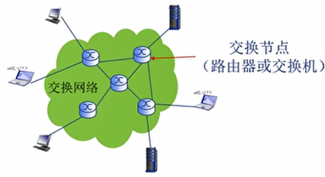

3. 什么是 Internet？

   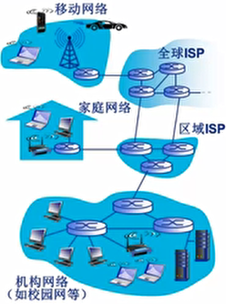

   - 全球最大的**互联网络**
     - ISP 网络互连的"网络之网络"
   - 数以百万计的互连的**计算设备**集合:
     - 主机( hosts)=端系统(end systems)
     - 运行各种网络应用
   - **通信链路**
     - 光纤, 铜缆, 无线电, 卫星.
   - **分组交换**：转发分组(数据包)
     - 路由器( routers)和交换机( switches)
   - **为网络应用提供通信服务的通信基础设施**：
     - Web,VoIP,emal,网络游戏,电子商务,社交网络,…
   - **为网络应用提供应用编程接口(API):**
     - 支持应用程序"连接" Internet,发送/接收数据
     - 提供类似于邮政系统的数据传输服务

#### 二、协议的定义

1. 协议是计算机网络有序运行的重要保证

   - 硬件(主机、路由器、通信链路等)是计算机网络的基础
   - 计算机网络中的数据交换必须遵守事先约定好的规则
   - 如同交通系统

2. 任何通信或信息交换过程都需要规则

   - 网络通信：通信主体是"机器"而不是人
   - 交换"电子化"或"数字化"消息
   - 计算机网络的所有通信过程都必须遵守某种/些规则一协议

   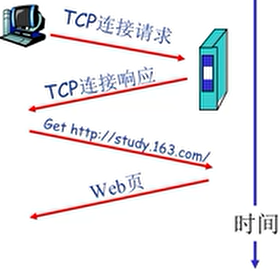

3. 什么是网络协议?

   - **网络协议** network protocol），简称为协议是为进行网络中的数据交换而建立的规则、标准或约定。
   - **协议**规定了通信实体之间所交换的消息的**格式、意义、顺序**以及针对收到信息或发生的事件所采取的“**动作**”（ actions）。

4. 协议的三要素

   1. **语法**（Syntax）
      - 数据与控制信息的结构或格式
      - 信号电平
   2. **语义**（Semantics）
      - 需要发出何种控制信息
      - 完成何种动作及做出何种响应
      - 差错控制
   3. **时序**（Timing）
      - 时间顺序
      - 速度匹配

5. 协议是计算机网络的重要内容

   - **协议规范了网络中所有信息发送和接收过程**
     - e.g.， Tcp，Ip， Http， Skype，802.11
   - **学习网络的重要内容之一**
   - **网络创新的表现形式之一**
   - **Internet 协议标准**
     - RFC：Request for Comments
     - IETF：互联网工程任务组（Internet Engineering Task Force）

#### 三、计算机网络的功能

#### 四、计算机网络的分类


### 第二节 计算机网络结构

#### 一、网络边缘

- **主机（端系统）**
  - 位于“网络边缘”
  - 运行网络应用程序
  - 如：Web, email
- **网络应用**
  - **客户/服务器 (client/server) 应用模型**：
    - 客户发送请求，接收服务器响应
    - 如：Web应用，文件传输FTP应用
  - **对等 (peer-peer, P2P) 应用模型:**
    - 无（或不仅依赖）专用服务器
    - 通信在对等实体之间直接进行
    - 如：Gnutella, BT, Skype, QQ

#### 二、接入网络

- 接入网络，物理介质

  - 有线或无线通信链路

- **数字用户线路 (DSL)**

  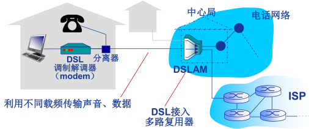

  - 利用**已有的电话线**连接中心局的DSLAM
    - 数据通信通过DSL电话线接入Internet
    - 语音（电话）通过DSL电话线接入电话网
  - < 2.5 Mbps上行传输速率 (典型速率 < 1 Mbps)
  - < 24 Mbps下行传输速率 (典型速率 < 10)
  - **FDM**: 
    - \>50 kHz - 1 MHz用于下行
    - 4 kHz - 50 kHz用于上行
    - 0 kHz - 4 kHz用于传统电话

- **电缆网络**

  

  - **频分多路复用** :  在不同频带（载波）上传输不同频道

  

  - **HFC**: 混合光纤同轴电缆（ hybrid fiber coax ）
    - 非对称:  下行高达30Mbps 传输速率，上行为2 Mbps传 传率 输速率
  - 各家庭（设备）通过电缆网络→ 光纤接入ISP 路由器
    - 各家庭 **共享** 家庭至电缆头端的络 **接入网络**
    - 不同于DSL的 的 **独占** 至中心局的接入

- **典型家庭网络的接入**

  

- **机构（企业）接入网络 (Ethernet)**

  

  - 主要用于公司、高校、企业等组织机构
  - 典型传输速率：10 Mbps, 100Mbps, 1Gbps, 10Gbps
  - 目前，端系统通常直接连接以太网交换机（switch）

-  **无线接入网络**

  - 通过**共享**的 无线接入网络连接端系统与路由器
    - 通过**基站**（base station）或称为“**接入点**”（access point）
  - **无线局域网（LANs ）**:
    - 同一建筑物内 (30m)
    - 802.11b/g (WiFi): 11Mbps、
    - 54Mbps传输速率
  - **广域无线接入：**
    - 通过电信运营商 (蜂窝网) ，接入范围在几十公里~
    - 带宽：1 Mbps、10 Mbps、100Mbps
    - 3G、 4G: LTE
    - 移动互联网

#### 三、接入核心

- 网络核心（核心网络）

  - 互联的路由器（或分组转发设备）
  - 网络之网络

- **网络核心**的关键功能: **路由+转发**

  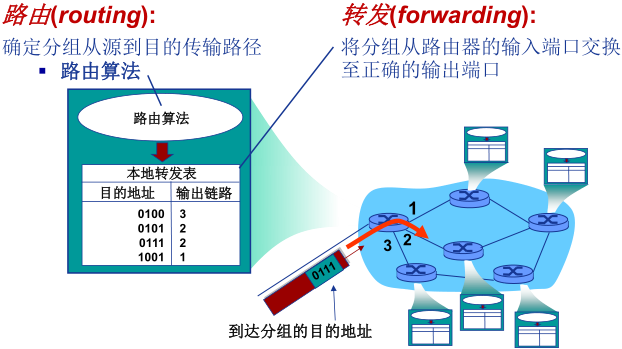

- **Internet 结构:  网络之网络**

  - 端系统通过入 接入**ISP （access ISPs  ）**连接到
    Internet
    - 家庭、公司和大学ISPs
  - 接入ISP 必须进一步互连
    - 这样任意两个主机才可以互相发送分组
  - 构成复杂的网络互连的网络
    - 经济和国家政策是网络演进的主要驱动力
  - 当前Internet 结构？
    - 无人能给出精确描述
  - 连接方式：
    - **区域网络（regional networks）**连接接入ISP和运营商ISP
    - **内容提供商网络（content provider networks）** ，如： Google,
      Microsoft 等) 

  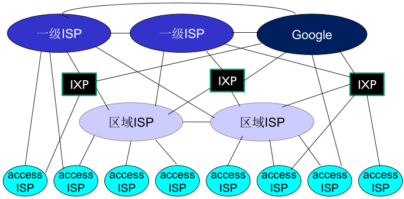

- 在网络中心: 少数互连的大型网络

  -  **“一级” (tier-1) 商业ISPs** (如：网通、电信、Sprint、 AT&T)，提供国家或国际范围的覆盖
  - **内容提供商网络（content provider network， 如：Google)**：私有网络，连接其数据中心与Internet，通常绕过一级ISP和区域ISPs


### 第三节 数据交换技术

#### 一、数据交换概念

- 为什么需要数据交换？

  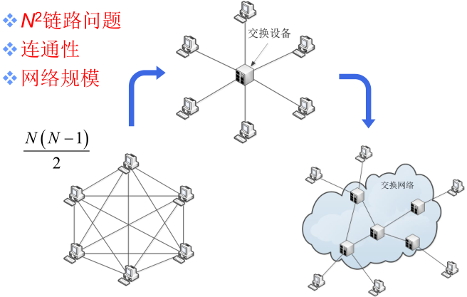

- 什么是交换？

  - 动态转接

    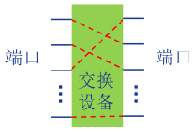

  - **动态分配传输资源**

- 数据交换的类型

  1. 电路交换
  2. 报文交换
  3. 分组交换

#### 二、电路交换

- 电路交换的特点

  - 最典型电路交换网络：电话网络
  - 电路交换的三个阶段：
    1. 建立连接（呼叫/电路建立）
    2. 通信
    3. 释放连接（拆除电路）
  - **独占资源**

  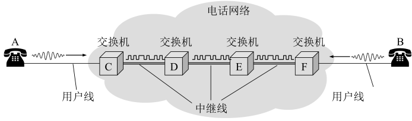

- **多路复用（Multiplexing）**：简称复用，是通信技术中的基本概念

  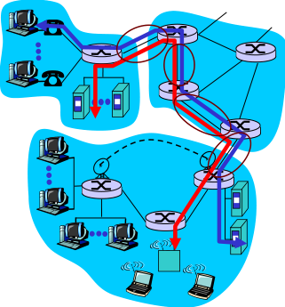

  

  - **多路复用(Multiplexing):** 

    - 链路/网络资源（如带宽）划分为“资源片”
    - 将资源片分配给各路“呼叫”（calls）
    - 每路呼叫**独占**分配到的资源片进行通信
    - 资源片可能“**闲置”(idle)**(无共享)

  - **典型多路复用方法:**

    - **频分多路复用**( frequency division multiplexing-**FDM** )

      

      - **频分多路复用**的各用户占用不同的带宽资源（请注意，这里的“带宽”是**频率带宽（单位：Hz）**而不是数据的发送速率）
      - 用户在分配到一定的频带后，在通信过程中自始至终都占用这个频带

      

    - **时分多路复用**( time division multiplexing-**TDM** )

      - **时分复用**则是将时间划分为一段段等长的**时分复用帧（TDM 帧）**，每个用户在每个 TDM 帧中占用固定序号的**时隙**
      - 每用户所占用的时隙是**周期性出现**（其周期就是TDM 帧的长度）

      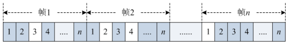

      - 时分复用的所有用户是在不同的时间占用**相同的频带宽度**

      

    - **波分多路复用**(Wavelength division multiplexing-**WDM**)

      - 波分复用就是光的频分复用

      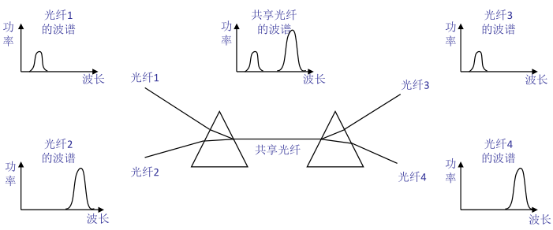

      

      

    - **码分多路复用**( Code division multiplexing-**CDM** )

      -  广泛应用于无线链路共享 (如蜂窝网,卫星通信等)

      - 每 个 用 户 分 配 一 个 唯 一 的 **m bit 码 片 序 列 (chippingsequence)**，其中“0”用**“-1”**表示、“1”用**“+1”**表示，例如：

        - S 站的码片序列：(–1 –1 –1 +1 +1 –1 +1 +1)

      - 各用户使用**相同频率载波**，利用各自码片序列编码数据

      - **编码信号 = (原始数据) × (码片序列)**

        - 如发送比特 1（+1），则发送自己的 **m bit 码片序列**
        - 如发送比特 0（-1），则发送该码片序列的**m bit 码片序列的反码**

      - 各用户码片序列相互**正交 (orthogonal)**

        

      - 令${d_i }$为原始数据序列，各用户的叠加向量为

        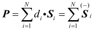

      - 解码 : 码片序列与编码信号的内积

        

      单用户：

      

      多用户：

      

#### 三、报文交换

- **报文交换（message switching）**

  - **报文**：源（应用）发送信息整体
    - 比如：一个文件

  

  

#### 四、分组交换

- **分组交换（package switching ）**

  - **分组**：报文分拆出来的一系列相对较小的数据包

    

  - 分组交换需要报文的**拆分**与**重组**

  - 产生**额外开销**

  

  

- **分组交换: 统计多路复用（Statistical Multiplexing ）**

  

  - A & B分组序列不确定，**按需共享链路**
    - statistical multiplexing.

- **存储- 转发（store-and-forward ）**

  

  - **报文交换**与**分组交换**均采用**存储-转发**交换方式
  - 区别：
    - 报文交换以**完整报文**进行“存储-转发”
    - 分组交换以**较小的分组**进行“存储-转发”

- **分组交换:  传输延迟**

  

- **报文交换 vs  分组交换**

  

  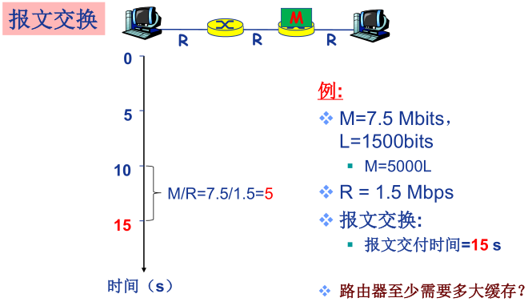

  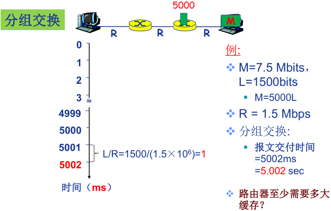

- **分组交换的报文交付时间**

  


**例题1.1**

- 在下图所示的采用“存储-转发”方式的分组交换网络中，所有链路的数据传输速率为100 Mbps，分组大小为1 000 B，其中分组头大小为20 B。若主机H1向主机H2发送一个大小为980 000 B的文件，则在不考虑分组拆装时间和传播延迟的情况下，从H1发送开始到H2接收完为止，需要的时间至少是多少？

  

  - 【 解】980 000 B大小的文件需要分1000个分组，每个分组1 000 B。H1发送整个文件需要的传输延迟为`(980 000+20*1000)*8/100 000 000=80ms`；根据路由选择基本原理，所有数据分组应该经过两个路由器的转发，所以再加上最后一个分组的两次转发的传输延迟，即`2*1000*8/100 000 000=0.16ms`。所以，H2收完整个文件至少需要80+0.16=80.16ms。


- **分组交换 vs  电路交换**

  

  - 分组交换绝对优于电路交换？
    - 分组交换适用于 **突发** 数据传输网络
      - 资源充分共享
      - 简单、无需呼叫建立
    - 可能**产生拥塞（congestion ）**:  分组延迟和丢失
      - 需要协议处理可靠数据传输和拥塞控制
    - Q:  **如何提供电路级性能保障?**
      - 例如，音/视频应用所需的带宽保障


### 第四节 计算机网络性能

#### 一、速率与带宽

- **速率**

  - 速率即**数据率**(data rate)或称**数据传输速率**或**比特率**(bit rate)
    - 单位时间（秒）传输信息（比特）量
    - 计算机网络中最重要的一个性能指标
    - 单位：b/s（或bps）、kb/s、Mb/s、Gb/s
    - $k=10^3 、M=10^6 、G=10^9$
  - 速率往往是指**额定速率**或**标称速率**

- **带宽**

  - “**带宽**”(bandwidth)：原本指信号具有的**频带宽度**，即**最高频率与最低频率之差**，单位是**赫兹（Hz）**
  - 网络的“带宽”：通常是数字信道所能传送的“**最高数据率**”，单位：**b/s (bps)**
  - 常用的带宽单位:
    - kb/s （$10^3 b/s$）
    - Mb/s（$10^ 6 b/s$）
    - Gb/s（$10^ 9 b/s$）
    - Tb/s（$10^ {12} b/s$）

  

#### 二、时延

- **延迟/ 时延**(delay 或latency)

  - Q:分组交换为什么会发生丢包和时延?
    A:分组在路由器缓存中排队
  - 分组到达速率超出输出链路容量时
  - 分组排队，等待输出链路可用

  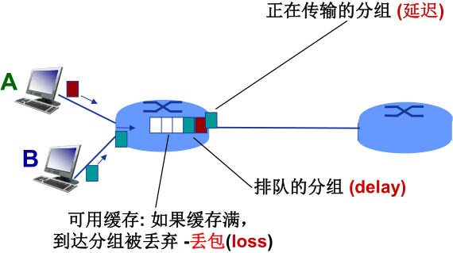

- **四种分组延迟**

  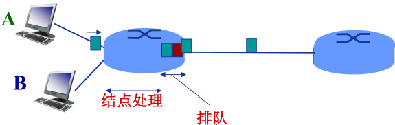

  - $d_{proc}$ : **结点处理延迟**（nodal processing delay）
    - 差错检测
    - 确定输出链路
    - 通常< msec
  - $d_{queue}$ : **排队延迟**（queueing delay）
    - 等待输出链路可用
    - 取决于路由器拥塞程度

  

  - $d_{trans}$ : **传输延迟**（transmission delay）
    - L: 分组长度(bits)
    - R: 链路带宽 (bps)
    - $d_{trans}$ = L/R
  - $d_{prop}$ : **传播延迟**（propagation delay）
    -  d: 物理链路长度
    - s: 信号传播速度  ($铜\approx2×10 ^8m/sec$)
    - $d_{prop}$ = d/s

-  **类比：车队**

  

  - 车速为100 km/hr ~ 信号传播速度
  - 收费站放行一台车用时12 秒 ~ 比特传输时间
  - 车 ~ 比特；车队 ~ 分组
  - 车队通过收费站时间 ~ **传输延迟**（120秒）
  - 每台车从第一个收费站跑到第二个收费站用时~ **传播延迟**（1小时）

- **排队延迟**

  


#### 三、时延带宽积


- 链路的时延带宽积又称为**以比特为单位的链路长度**


#### 四、丢包率

- **分组丢失**（丢包）

  - 队列缓存容量有限
  - 分组到达已满队列将被丢弃 (即丢包)
  - 丢弃分组可能由前序结点或源重发（也可能不重发）

  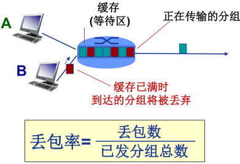

  

#### 五、吞吐率

- 吞吐量/ 率（Throughput ）

  - 吞吐量 :表示在发送端与接收端之间传送数据速率 (b/s)
    - 即时 吞吐量: 给定时刻的速率
    - 平均吞吐量 : 一段时间的平均速率

  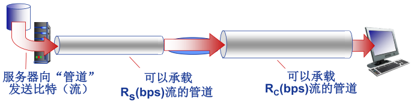

- 瓶颈链路（ bottleneck link ）

  - 端到端路径上，限制端到端吞吐量的链路。

  

- 吞吐量: Internet 场景

  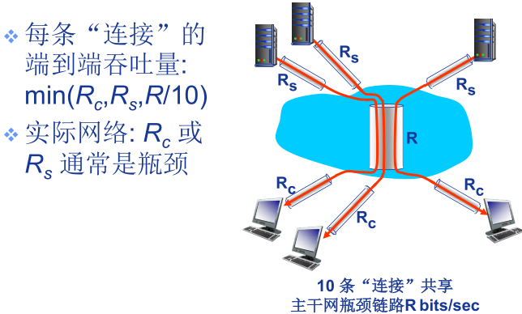

### 第五节 计算机网络体系结构

#### 一、计算机网络分层体系结构

- 为什么需要计算机网络体系结构

  - 计算机网络是一个非常复杂的系统 , 涉及许多组成部分 :
    - 主机（hosts）
    - 路由器（routers）
    - 各种链路（links）
    - 应用（applications）
    - 协议（protocols）
    - 硬件、软件

- 何为计算机网络的体系结构？

  - 网络体系结构是从**功能**上描述计算机网络结构
  - 计算机网络体系结构简称网络体系结构(network architecture)是**分层结构**
  - 每层遵循某个/些**网络协议**完成本层功能
  - **计算机网络体系结构**是计算机网络的各层及其协议的集合
  - 体系结构是一个计算机网络的功能层次及其关系的**定义**
  - 体系结构是**抽象的**

- 为什么采用分层结构?

  - 结构清晰，有利于识别复杂系统的部件及其关系
    - 分层的参考模型（reference model ）
  - 模块化的分层易于系统更新、维护
    - 任何一层服务实现的改变对于系统其它层都是透明的
    - 例如，登机过程的改变并不影响航空系统的其它部分（层）
  - 有利于标准化
  - 分层是否有不利之处？

- 分层网络体系结构基本概念

  

  - **实体(entity)**  表示任何可发送或接收信息的硬件或软件进程。
  - 协议是控制 **两个对等实体** 进行通信的规则的集合，协议 是 “ **水平的** ”  。
  - 任一层实体 需要使用 **下层** 服务，遵循本层协议，实现本层功能， 向 **上层** 提供 服务 ，服务是“ **垂直的** ” 。
  - 下层协议的实现对上层的 服务用户是 **透明** 的。
  - 同系统的相邻层 实体 间通过 **接口** 进行交互，通过 **服务访问点 SAP**(Service Access Point) ，交换 **原语** ，指定请求的特定服务。

#### 二、OSI 参考模型

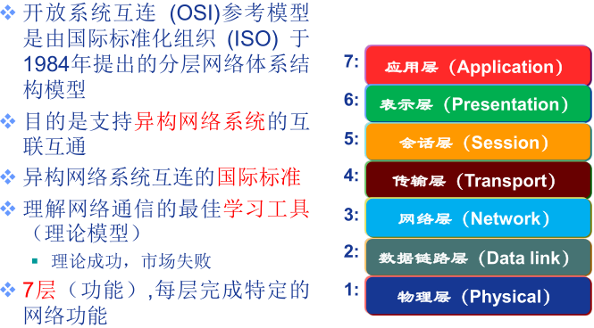

- **OSI 参考模型解释的通信过程**

  

- **OSI 参考模型数据封装与通信过程**

  

- **为什么需要数据封装 ？**

  - 增加**控制信息**
    - 构造协议数据单元 (PDU)
  - 控制信息主要包括:
    - **地址（Address）**: 标识发送端/接收端
    - **差错检测编码（Error-detecting code）**: 用于差错检测或纠正
    - **协议控制（Protocol control）**: 实现协议功能的附加信息，如: 优先级（priority）、服务质量（QoS）、 和安全控制等


**七层模型的功能**

1. **物理层功能**

   

   - **接口特性**
     - 机械特性、电气特性、功能特性、规程特性
   - **比特编码**
   - **数据率**
   - **比特同步**
     - 时钟同步
   - **传输模式**
     1. 单工（Simplex）
     2. 半双工（half-duplex）
     3. 全双工（full-duplex）

2. **数据链路层功能**

   

   - 负责**结点- 结点（node-to-node）**  数据传输
   - **组帧（Framing ）**
   - **物理寻址（Physical addressing ）**
     - 在帧头中增加发送端和/或接收端的**物理地址**标识数据帧的发送端和/或接收端

   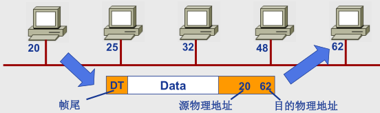

   - **流量控制（Flow control）**
     - 避免淹没接收端
   - **差错控制（Error control）**
     - 检测并重传损坏或丢失帧，并避免重复帧
   - **访问(接入)控制（Access control）**
     - 在任一给定时刻决定哪个设备拥有链路（物理介质）控制使用权

3. **网络层功能**

   

   - 负责**源主机到目的主机**数据分组（packet）交付
     - 可能穿越多个网络
   - **逻辑寻址（Logical addressing）**
     - 全局唯一逻辑地址，确保数据分组被送达目的主机，如IP地址
   - **路由（Routing）**
     - 路由器(或网关)互连网络，并路由分组至最终目的主机
     - 路径选择
   - **分组转发**

   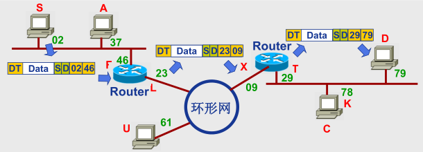

   

4. **传输层功能**

   

   - 负责 **源—目的（端—端）** （进程间） **完整报文传输**
   - **分段与重组**
   - **SAP寻址**
     - 确保将完整报文提交给正确进程，如端口号

   

   - **连接控制**
   - **流量控制**
   - **差错控制**

5. **会话层功能**

   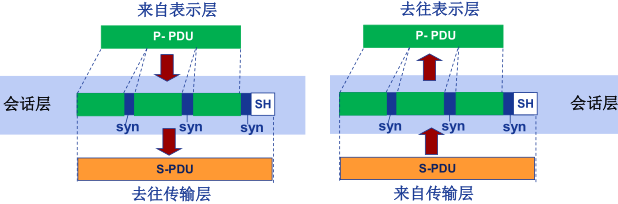

   - **对话控制（dialog controlling）**
     - 建立、维护
   - **同步(synchronization)**
     - 在数据流中插入“同步点”
   - 最“**薄**”的一层

6. **表示层功能**

   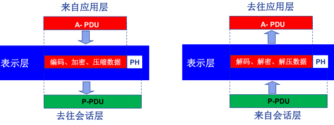

   处理两个系统间交换信息的 **语法与语义（syntax and semantics ）**问题

   - **数据表示转化**
     - 转换为主机独立的编码
   - **加密/解密**
   - **压缩/解压缩**

7. **应用层功能**

   

   - 支持用户通过用户代理（如浏览器）或网络接口**使用网络（服务）**
   - 典型应用层服务：
     - 文件传输（FTP）
     - 电子邮件（SMTP）
     - Web（HTTP）


#### 三、TCP/IP 参考模型

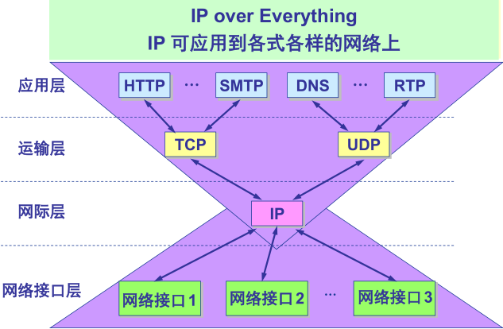

#### 四、五层参考模型

综合 OSI 和 TCP/IP 的优点

1. **应用层** : 支持各种网络应用
   - FTP, SMTP, HTTP
2. **传输层** : 进程-进程的数据传输
   - TCP, UDP
3. **网络层** : 源主机到目的主机的数据分组路由与转发
   - IP协议、路由协议等
4. **链路层** : 相邻网络元素（主机、交换机、路由器等）的数据传输
   - 以太网（Ethernet）、802.11 (WiFi)、PPP
5. **物理层** :比特传输


**5 层模型的数据封装**

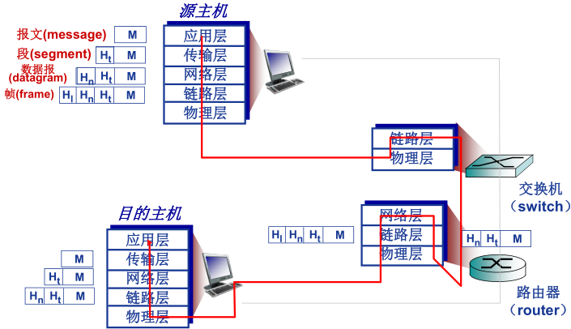


### 第六节 计算机网络与因特网发展简史

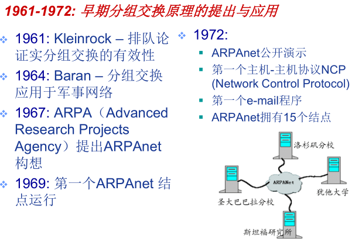


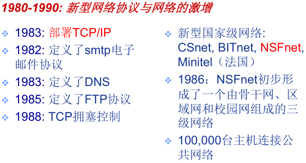


## 第二章 网络应用

- 重点：
  - 理解网络应用体系结构、特点与通信基本原理，掌握 DNS 域名解析过程、HTTP、SMTP、POP、FTP、P2P 应用，了解 Socket 编程基础
- 难点：
  - 是网络应用通信基本原理
  - 典型应用层协议
  - P2P 文件分发
  - Socket 编程基础


### 第一节 计算机网络应用体系结构

#### 一、客户/服务器（C/S, Client-Server）结构网络应用

- **服务器**
  - `7*24`小时提供服务
  - 永久性访问地址/域名
  - 利用大量服务器实现可扩展性
- **客户机**
  - 与服务器通信，使用服务器提供的服务
  - 间歇性接入网络
  - 可能使用动态IP地址
  - 不会与其他客户机直接通信

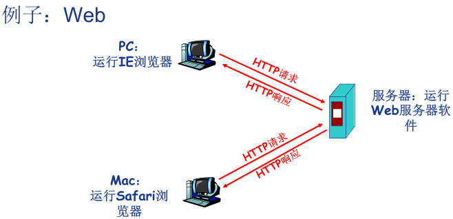


#### 二、纯P2P 结构 (Peer-to-peer, P2P) 网络应用

- 没有永远在线的服务器
  - 任意端系统/节点之间可以直接通讯
  - 节点间歇性接入网络
  - 节点可能改变IP地址
- 优点：高度可伸缩
- 缺点：难于管理

#### 三、混合网络应用 (Hybrid)

- Napster
  - 文件传输使用P2P结构
  - 文件的搜索采用C/S结构——集中式
    - 每个节点向中央服务器登记自己的内容
    - 每个节点向中央服务器提交查询请求，查找感兴趣的内容


### 第二节 网络应用通信基本原理

- **网络应用的基础：进程间通信**

  - 进程：
    - 主机上运行的程序
  - 同一主机上运行的进程之间如何通信？
    - 进程间通信机制
    - 操作系统提供
  - 不同主机上运行的进程间如何通信？
    - 消息交换
  - **客户机进程**: 发起通信的进程
  - **服务器进程**: 等待通信请求的进程

- **套接字: Socket**

  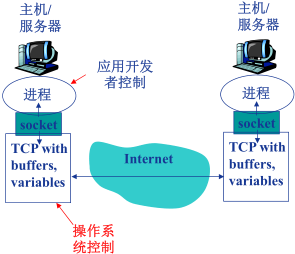

  - 进程间通信利用socket发送/接收消息实现
  - 类似于寄信
    - 发送方将消息送到门外邮箱
    - 发送方依赖（门外的）传输基础设施将消息传到接收方所在主机，并送到接收方的门外
    - 接收方从门外获取消息
  - 传输基础设施向进程提供**API**
    - 传输协议的选择
    - 参数的设置

- **如何寻址进程？**

  - 不同主机上的进程间通信，那么每个进程必须拥有标识符
  - 如何寻址主机？——**IP地址**
    - Q: 主机有了IP地址后，是否足以定位进程？
    - A: 否。同一主机上可能同时有多个进程需要通信。
  - **端口号/Port number**
    - 为主机上每个需要通信的进程分配一个端口号
    - HTTP Server: 80
    - Mail Server：25
  - **进程的标识符**
    - IP地址+端口号

  

- **应用层协议**

  - 网络应用需遵循应用层协议
  - 公开协议
    - 由**RFC(Request For Comments)**定义
    - 允许互操作
    - HTTP, SMTP, …
  - 私有协议
    - 多数P2P文件共享应用

- **应用层协议的内容**

  1. 消息的**类型(type)**
     - 请求消息
     - 响应消息
  2. 消息的**语法(syntax)**/格式
     - 消息中有哪些字段(field)？
     - 每个字段如何描述
  3. 字段的**语义(semantics)**
     - 字段中信息的含义
  4. **规则(rules)**
     - 进程何时发送/响应消息
     - 进程如何发送/响应消息

  

#### 附：网络应用的需求与传输层服务

- **网络应用对传输服务的需求**

  - **数据丢失(data loss)/可靠性(reliability)**
    - 某些网络应用能够容忍一定的数据丢失：网络电话
    - 某些网络应用要求100%可靠的数据传输：文件传输，telnet
  - **时间(timing)/延迟(delay)**
    - 有些应用只有在延迟足够低时才“有效”
    - 网络电话/网络游戏
  - **带宽(bandwidth)**
    - 某些应用只有在带宽达到最低要求时才“有效”：网络视频
    - 某些应用能够适应任何带宽——弹性应用：email

- **典型网络应用对传输服务的需求**

  

- **Internet 提供的传输服务**

  - **TCP服务**
    - **面向连接**: 客户机/服务器进程间需要建立连接
    - **可靠的传输**
    - **流量控制**: 发送方不会发送速度过快，超过接收方的处理能力
    - **拥塞控制**: 当网络负载过重时能够限制发送方的发送速度
    - 不提供时间/ 延迟保障
    -  不提供最小带宽保障
  - **UDP服务**
    - 无连接
    - 不可靠的数据传输
    - 不提供：
      - 可靠性保障
      - 流量控制
      - 拥塞控制
      - 延迟保障
      - 带宽保障

- **典型网络应用所使用的传输层服务**

  

  

### 第三节 域名系统（DNS）

#### 一、层次化域名空间

- DNS ：Domain Name System

  - Internet上主机/路由器的**识别问题**
    - **IP地址**
    - 域名：www.hit.edu.cn
  - 问题：域名和IP地址之间如何映射？
  - **域名解析系统DNS**
    - 多层命名服务器构成的**分布式数据库**
    - **应用层协议**：完成名字的解析
      - Internet**核心**功能，用**应用层**协议实现
      - 网络边界复杂

- DNS服务

  - 域名向IP地址的翻译
  - 主机别名
  - 邮件服务器别名
  - 负载均衡：Web服务器

- 问题：为什么不使用集中式的DNS？

  - 单点失败问题
  - 流量问题
  - 距离问题
  - 维护性问题

- 分布式层次式数据库

  

  - 客户端想要查询www.amazon.com的IP
    - 客户端查询根服务器，找到com域名解析服务器
    - 客户端查询com域名解析服务器，找到amazon.com域名解析服务器
    - 客户端查询amazon.com域名解析服务器，获得www.amazon.com的IP地址

#### 二、DNS 域名服务器

- **本地域名解析服务器**无法解析域名时，访问**根域名服务器**

- 根域名服务器

  - 如果不知道映射，访问权威域名服务器
  - 获得映射
  - 向本地域名服务器返回映射

  

- TLD 和权威域名解析服务器

  - 顶级域名服务器(TLD, top-level domain): 负责com, org, net,edu等顶级域名和国家顶级域名，例如cn, uk, fr等
    - Network Solutions维护com顶级域名服务器
    - Educause维护edu顶级域名服务器
  - 权威(Authoritative)域名服务器：组织的域名解析服务器，提供组织内部服务器的解析服务
    - 组织负责维护
    - 服务提供商负责维护

- 本地域名解析服务器

  - 不严格属于层级体系
  - **每个ISP有一个本地域名服务器**
    - 默认域名解析服务器
  - 当主机进行DNS查询时，查询被发送到本地域名服务器
    - 作为代理(proxy)，将查询转发给（层级式）域名解析服务器系统

  

  

#### 三、域名解析过程

- DNS查询示例

  - Cis.poly.edu 的主机想获得 gaia.cs.umass.edu 的IP地址
  - **迭代查询**
    - 被查询服务器返回域名解析服务器的名字
    - “我不认识这个域名，但是你可以问题这服务器”

  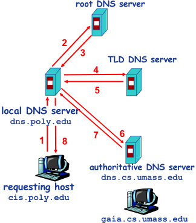

  - **递归查询**
    - 将域名解析的任务交给所联系的服务器

  

- 例题

  - 如果本地域名服务器无缓存，当采用递归方法解析另一网络某主机域名时，用户主机、本地域名服务器发送的域名请求消息数分别为
    - A．一条、一条
    - B．一条、多条
    - C．多条、一条
    - D．多条、多条
  - 【解析】域名递归解析过程中，主机向本地域名服务器发送DNS查询，被查询的域名服务器代理后续的查询，然后返回结果。所以，递归查询时，如果本地域名服务器无缓存，则主机和本地域名服务器都仅需要发送一次查询，故正确答案为查询，被查询的域名服务器代理后续的查询，然后返回结果。所以，递归查询时，如果本地域名服务器无缓存，则主机和本地域名服务器都仅需要发送一次查询，故正确答案为A。

- **DNS 记录缓存和更新**

  - 只要域名解析服务器获得域名—IP映射，即缓存这一映射
    - 一段时间过后，缓存条目失效（删除）
    - 本地域名服务器一般会缓存顶级域名服务器的映射
      - 因此根域名服务器不经常被访问
  - 记录的更新/通知机制
    - RFC 2136
    - Dynamic Updates in the Domain Name System (DNS UPDATE)

#### 附：DNS 记录和消息格式

- **DNS 记录**

  - 资源记录(RR, resourcerecords) 
    - `RR format:  (name, value, type, ttl)`
  - `Type=A`
    - `Name: 主机域名`
    - `Value: IP地址`
  - `Type=NS`
    - `Name: 域(edu.cn)`
    - `Value: 该域权威域名解析服务器的主机域名`
  - `Type=CNAME`
    - `Name: 某一真实域名的别名`
      -  www.ibm.com –servereast.backup2.ibm.com
    - `Value: 真实域名`
  - `Type=MX`
    - `Value是与name相对应的邮件服务器`

- **DNS 协议与消息**

  - DNS协议：
    - 查询(query)和回复(reply消息)
    - 消息格式相同
  - 消息头部
    - Identification: 16位查询编号，回复使用相同的编号
    - flags
      - 查询或回复
      - 期望递归
      - 递归可用
      - 权威回答

  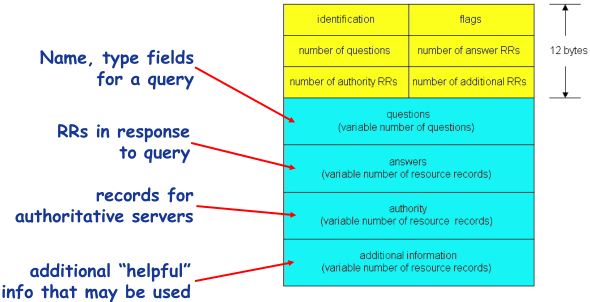

- 如何注册域名？

  - 例子：你刚刚创建了一个公司 “Network Utopia”

  - 在域名管理机构(如Network Solutions)注册域名networkutopia.com

    - 向域名管理机构提供你的权威域名解析服务器的名字和IP地址
    - 域名管理机构向com顶级域名解析服务器中插入两条记录

    

  - 在权威域名解析服务器中为www.networkuptopia.com 加入Type  A记录，为networkutopia.com加入Type MX记录


### 第四节 万维网应用

#### 一、万维网应用结构

- Web 与HTTP

  - **World Wide Web**: Tim Berners-Lee
    - 网页
    - 网页互相链接
  - **网页(Web Page)**包含多个对象(objects)
    - 对象：HTML文件、JPEG图片、视频文件、动态脚本等
    - 基本HTML文件：包含对其他对象引用的链接
  - **对象的寻址(addressing)**
    - URL(Uniform Resoure Locator)：统一资源定位器 RFC1738
    - `Scheme://host:port/path`

  


#### 二、HTTP

- HTTP 协议概述

  - **超文本传输协议**
    - HyperText Transfer Protocol
  - **C/S结构**
    - 客户—Browser：请求、接收、展示Web对象
    - 服务器—Web Server：响应客户的请求，发送对象
  - **HTTP版本**：
    - 1.0： RFC 1945
    - 1.1： RFC 2068
  - 使用**TCP**传输服务
    - 服务器在80端口等待客户的请求
    - 浏览器发起到服务器的TCP连接(创建套接字Socket)
    - 服务器接受来自浏览器的TCP连接
    - 浏览器(HTTP客户端)与Web服务器(HTTP服务器)交换HTTP消息
    - 关闭TCP连接
  - **无状态(stateless)**
    - 服务器不维护任何有关客户端过去所发请求的信息
    - 有状态的协议更复杂:
      - 需维护状态( 历史信息)
      - 如果客户或服务器失效，会产生状态的不一致，解决这种不一致代价高

- **HTTP 连接**

  - HTTP 连接的两种类型
    1. **非持久性连接(Nonpersistent HTTP)**
       - 每个TCP连接最多允许传输一个对象
       - HTTP 1.0版本使用非持久性连接
    2. **持久性连接(Persistent HTTP)**
       - 每个TCP连接允许传输多个对象
       - HTTP 1.1版本默认使用持久性连接

- **非持久性连接**

  

  - **响应时间分析与建模**

    - **RTT(Round Trip Time)**
      - 从客户端发送一个很小的**数据包到服务器并返回**所经历的时间
    - **响应时间(Response time)**
      - 发起、建立TCP连接：1个RTT
      - 发送HTTP请求消息到HTTP响应消息的前几个字节到达：1个RTT
      - 响应消息中所含的文件/对象传输时间
      - Total=2RTT +文件发送时间

    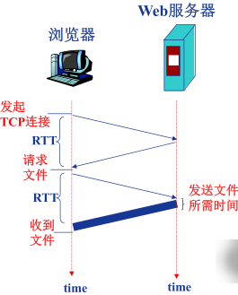

- **持久性HTTP**

  - 非持久性连接的问题
    - 每个对象需要2个RTT
    - 操作系统需要为每个TCP连接开销资源(overhead)
    - 浏览器会怎么做？
      - 打开多个并行的TCP连接以获取网页所需对象
      - 给服务器端造成什么影响？
  - **持久性连接**
    - 发送响应后，服务器保持TCP连接的打开
    - 后续的HTTP消息可以通过这个连接发送
  - **无流水(pipelining)的持久性连接**
    - 客户端只有收到前一个响应后才发送新的请求
    - 每个被引用的对象耗时1个RTT
  - **带有流水机制的持久性连接**
    - HTTP 1.1的默认选项
    - 客户端只要遇到一个引用对象就尽快发出请求
    - 理想情况下，收到所有的引用对象只需耗时约1个RTT

- **HTTP 消息格式**

  - HTTP协议有两类消息
    1. **请求消息(request)**
       - ASCII：人直接可读
    2. **响应消息(response)**

  

- **HTTP 请求消息的通用格式**

  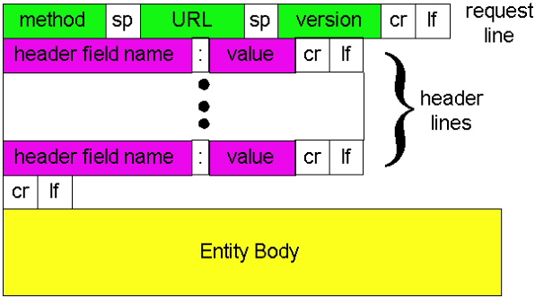

- **上传输入的方法**

  1. **POST方法**

     - 网页经常需要填写表格(form)
     - 在请求消息的消息体(entity body)中上传客户端的输入

  2. **URL方法**

     - 使用GET方法
     - 输入信息通过request行的URL字段上传

     > 例如：www.somesite.com/animalsearch?monkeys&banana

  3. **方法的类型**

     1. HTTP/1.0
        - GET
        - POST
        - HEAD
          - 请Server不要将所请求的对象放入响应消息中
     2. HTTP/1.1
        - GET, POST, HEAD
        - PUT
          - 将消息体中的文件上传到URL字段所指定的路径
        - DELETE
          - 删除URL字段所指定的文件

- **HTTP 响应消息**

  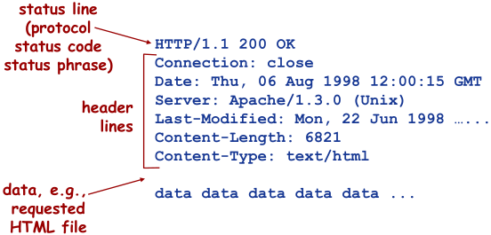

- **HTTP 响应状态代码**

  - 响应消息的第一行
  - 示例
    - 200 OK
    - 301 Moved Permanently
    - 400 Bad Request
    - 404 Not Found
    - 505 HTTP Version Not Supported

#### 三、Cookie

- 为什么需要Cookie ？

  - HTTP协议无状态
  - 很多应用需要服务器掌握客户端的状态，如网上购物，如何实现？

- **Cookie 技术**

  - 某些网站为了辨别用户身份、进行session跟踪而储存在用户本地终端上的数据（通常经过加密）。
  - RFC6265

- **Cookie的组件**

  - HTTP响应消息的cookie头部行
  - HTTP请求消息的cookie头部行
  - 保存在客户端主机上的cookie文件，由浏览器管理
  - Web服务器端的后台数据库

- **Cookie 的原理**

  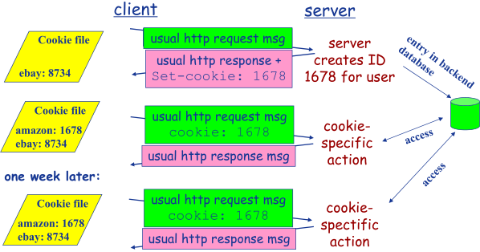

- **Cookie 的作用**

  - Cookie能够用于：
    - 身份认证
    - 购物车
    - 推荐
    - Web e-mail
  - 隐私问题
    - Cookie能够怎样被用于收集隐私？
    - 能够收集哪些隐私？
    - 你在上网的时候感觉到自己的隐私被严重侵犯吗？

#### 附：Web 缓存/ 代理服务器技术

- 功能

  - 在不访问服务器的前提下满足客户端的HTTP请求。

- 为什么要发明这种技术？

  - 缩短客户请求的响应时间
  - 减少机构/组织的流量
  - 在大范围内(Internet)实现有效的内容分发

- Web缓存/代理服务器

  - 用户设定浏览器通过缓存进行Web访问
  - 浏览器向缓存/代理服务器发送所有的HTTP请求
    - 如果所请求对象在缓存中，缓存返回对象
    - 否则，缓存服务器向原始服务器发送HTTP请求，获取对象，然后返回给客户端并保存该对象
  - 缓存既充当客户端，也充当服务器
  - 一般由ISP(Internet服务提供商)架设

  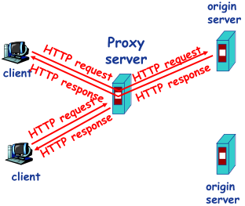

- Web 缓存示例(1)

  - 假定：
    - 对象的平均大小=100,000比特
    - 机构网络中的浏览器平均每秒有15个到原始服务器的请求
    - 从机构路由器到原始服务器的往返延迟=2秒
  - 网络性能分析：
    - 局域网(LAN)的利用率=15%
    - 接入互联网的链路的利用率=100%
    - 总的延迟=互联网上的延迟+访问延迟+局域网延迟=2秒+几分钟+几微秒

  

- Web 缓存示例(2)

  - 解决方案1：
    - **提升互联网接入带宽**=10Mbps
  - 网络性能分析：
    - 局域网(LAN)的利用率=15%
    - 接入互联网的链路的利用率=15%
    - 总的延迟=互联网上的延迟+访问延迟+局域网延迟=2秒+几微秒+几微秒
  - 问题：
    - 成本太高

  

  - 解决方案2：
    - **安装Web缓存**
    - 假定缓存命中率是0.4
  - 网络性能分析：
    - 40%的请求立刻得到满足
    - 60%的请求通过原始服务器满足
    - 接入互联网的链路的利用率下降到60%，从而其延迟可以忽略不计，例如10微秒
    - 总的平均延迟=互联网上的延迟+访问延迟+局域网延迟=0.6×2.01秒+0.4×n微秒<1.4秒

  

- **条件性GET方法**

  - 目标：
    - 如果缓存有最新的版本，则不需要发送请求对象
  - 缓存：
    - 在HTTP请求消息中声明所持有版本的日期
    - `If-modified-since: <date>`
  - 服务器：
    - 如果缓存的版本是最新的，则响应消息中不包含对象
    - HTTP/1.0 304 Not Modified

  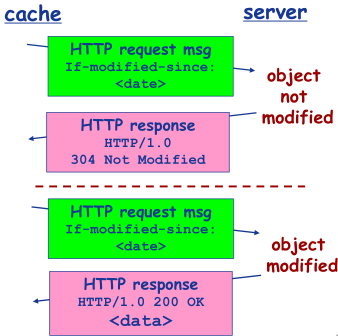


### 第五节 Internet 电子邮件

#### 一、电子邮件系统结构

- Email应用的构成组件
  - 邮件客户端(user agent)
  - 邮件服务器
  - SMTP协议(Simple Mail Transfer Protocol)
- 邮件客户端
  - 读、写Email消息
  - 与服务器交互，收、发Email消息
  - Outlook, Foxmail, Thunderbird
  - Web客户端
- **邮件服务器(Mail Server)**
  - 邮箱：存储发给该用户的Email
  - 消息队列(message queue)：存储等待发送的Email
- **SMTP协议**
  - 邮件服务器之间传递消息所使用的协议
  - 客户端：发送消息的服务器
  - 服务器：接收消息的服务器


#### 二、SMTP协议：RFC 2821

- 使用TCP进行email消息的可靠传输
- 端口25
- 传输过程的三个阶段
  - 握手
  - 消息的传输
  - 关闭
- 命令/响应交互模式
  - **命令(command)**: ASCII文本
  - **响应(response)**: 状态代码和语句
- Email 消息只能包含7位ASCII码

- Email 应用示例：


- SMTP交互示例：


- 动手尝试SMTP交互：
  - `telnet servername 25`
  - 服务器返回代码220
  - 输入以下命令与SMTP服务器交互
    - HELO
    - MAIL FROM
    - RCPT TO
    - DATA
    - QUIT
- SMTP协议
  - 使用持久性连接
  - 要求消息必须由7位 ASCII 码构成
  - SMTP 服务器利用 CRLF.CRLF 确定消息的结束。
- 与HTTP对比:
  - HTTP: 拉式(pull)
  - SMTP: 退式(push)
  - 都使用命令/响应交互模式
  - 命令和状态代码都是ASCII码
  - HTTP: 每个对象封装在独立的响应消息中
  - SMTP: 多个对象在由多个部分构成的消息中发送

#### 三、电子邮件格式与 MIME

- SMTP：email消息的传输/交换协议

- RFC 822：文本消息格式标准

  - 头部行(header)（与SMTP命令不同）
    - To
    - From
    - Subject
  - 消息体(body)
    - 消息本身
    - 只能是ASCII字符

  

- **Email 消息格式：多媒体扩展**

  - **MIME：多媒体邮件扩展** RFC 2045, 2056
    - 通过在邮件头部增加额外的行以声明MIME的内容类型

  

  

#### 四、邮件读取/访问协议

- 邮件访问协议：从服务器获取邮件
  - **POP**: Post Office Protocol [RFC 1939]
    - 认证/授权(客户端← →服务器)和下载
  - **IMAP**: Internet Mail Access Protocol [RFC 1730]
    - 更多功能
    - 更加复杂
    - 能够操纵服务器上存储的消息
  - **HTTP**：163, QQ Mail等。

- **POP 协议**

  

  - “下载并删除”模式
    - 用户如果换了客户端软件，无法重读该邮件
  - “下载并保持”模式：不同客户端都可以保留消息的拷贝
  - POP3是无状态的

- **IMAP协议**

  - 所有消息统一保存在一个地方：服务器
  - 允许用户利用文件夹组织消息
  - IMAP支持跨会话(Session)的用户状态:
    - 文件夹的名字
    - 文件夹与消息ID之间的映射等


### 第六节 FTP

### 第七节 P2P 应用

#### 一、P2P 应用：原理与文件分发

- 纯P2P 架构

  - Peer-to-peer
  - 没有服务器
  - 任意端系统之间直接通信
  - 节点阶段性接入Internet
  - 节点可能更换IP地址

- 文件分发：客户机/ 服务器 vs. P2P

  - 从一个服务器向N个节点分发一个文件需要多长时间?

  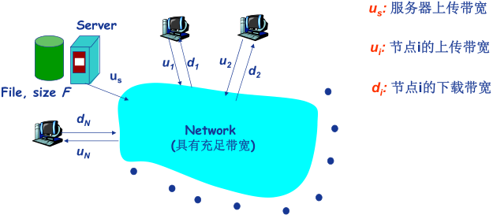

  - 文件分发：客户机/ 服务器

    - 服务器串行地发送N个副本
      - 时间： $NF/u_s$
    - 客户机i需要$F/d_i $时间下载

    

    

  - 文件分发：P2P

    - 服务器必须发送一个副本
      - 时间： $F/u_s$
    - 客户机i需要$F/d_i $时间下载
    - 总共需要下载$NF$比特
    - 最快的可能上传速率：$u_s +  \sum u_i$

    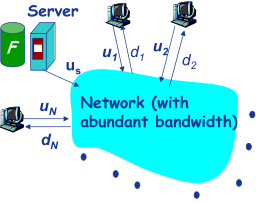
    $$
    d_{P2P} = max  \{ \frac{F}{u_s} , \frac{F}{min(d_i )} ,  \frac{NF}{(u_s + \sum u_i )} \}
    $$

  -  例子：

    - 客户端上传速率= u, F/u = 1 小时, $u_s = 10u, d_{min} ≥ u_s$

    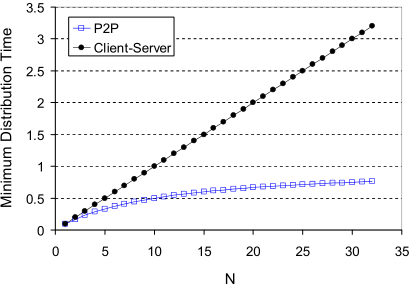

- **文件分发：BitTorrent**

  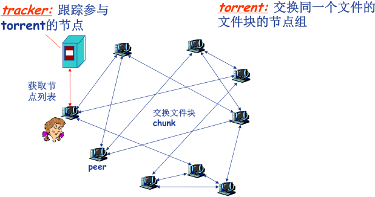

  - 文件划分为256KB的chunk

  - **节点加入torrent**

    - 没有chunk，但是会逐渐积累
    - 向tracker注册以获得节点清单，与某些节点（“邻居”）建立连接

  - 下载的同时，节点需要向其他节点上传chunk

    - 节点可能加入或离开

  - 一旦节点获得完整的文件，它可能（自私地）离开或（无私地）留下

  - **获取chunk**

    - 给定任一时刻，不同的节点持有文件的不同chunk集合
    - 节点(Alice)定期查询每个邻居所持有的chunk列表
    - 节点发送请求，请求获取缺失的chunk
      - 稀缺优先

  - 发送`chunk: tit-for-tat`

    - Alice向4个邻居发送chunk：正在向其发送Chunk，速率最快的4个
      - 每10秒重新评估top 4
    - 每30秒随机选择一个其他节点，向其发送chunk
      - 新选择节点可能加入top 4
      - “optimistically unchoke”

    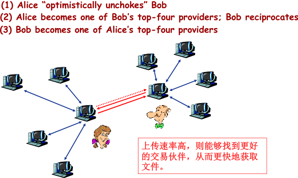

#### 二、P2P 应用：索引技术

- P2P:  搜索信息

  - P2P系统的**索引**：信息到节点位置(**IP地址+端口号**)的映射
  - **文件共享**(电驴)
    - 利用索引动态跟踪节点所共享的文件的位置
    - 节点需要告诉索引它拥有哪些文件
    - 节点搜索索引，从而获知能够得到哪些文件
  - **即时消息**(QQ)
    - 索引负责将用户名映射到位置
    - 当用户开启IM应用时，需要通知索引它的位置
    - 节点检索索引，确定用户的IP地址

- 集中式索引

  - Napster最早采用这种设计
    1. 节点加入时，通知中央服务器：
       - IP地址
       - 内容
    2. Alice查找“Hey Jude”
    3. Alice从Bob处请求文件

  

  - 集中式索引的问题
    - 单点失效问题
    - 性能瓶颈
    - 版权问题

- **洪泛式查询: Query flooding**

  - 完全分布式架构
  - Gnutella采用这种架构
  - 每个节点对它共享的文件进行索引，且只对它共享的文件进行索引
  - 覆盖网络(overlay network): Graph
    - 节点X与Y之间如果有TCP连接，那么构成一个边
    - 所有的活动节点和边构成覆盖网络
    - 边：虚拟链路
    - 节点一般邻居数少于10个
  - 查询消息通过已有的TCP连接发送
  - 节点转发查询消息
  - 如果查询命中，则利用反向路径发回查询节点

  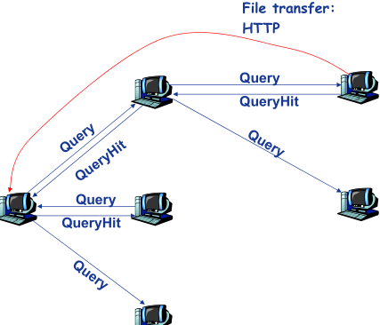

- **层次式覆盖网络**

  - 介于集中式索引和洪泛查询之间的方法
  - 每个节点或者是一个超级节点，或者被分配一个超级节点
    - 节点和超级节点间维持TCP连接
    - 某些超级节点对之间维持TCP连接
  - 超级节点负责跟踪子节点的内容

  

- **P2P 案例应用：Skype**

  - 本质上是P2P的：用户/节点对之间直接通信
  - 私有应用层协议
  - 采用层次式覆盖网络架构
  - 索引负责维护用户名与IP地址间的映射
  - 索引分布在超级节点上

  

  


### 第八节 Socket 编程基础（重要）

#### 一、应用编程接口（API ）

1. **网络程序设计接口**

   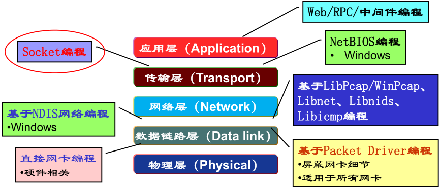

2. **应用编程接口 API**

   - 应用编程接口 API (Application Programming Interface)

     应用编程口接口API: 就是应用进程的控制权和操作系统的控制权进行转换的一 个 系统调用接口.

   

3. **几种典型的应用编程接口**

   1. Berkeley UNIX 操作系统定义了一种 API，称为套接字接口(socket interface)，简称**套接字（socket）**。
   2. 微软公司在其操作系统中采用了套接字接口 API，形成了一个稍有不同的 API，并称之为Windows Socket Interface，**WINSOCK**。
   3. AT&T 为其 UNIX 系统 V 定义了一种 API，简写为 **TLI** (Transport Layer Interface)。

#### 二、Socket API 概述

1. **Socket API**

   - 最初设计
     - 面向BSD UNIX-Berkley
     - 面向TCP/IP协议栈接口
   - 目前
     - 事实上的工业标准
     - 绝大多数操作系统都支持
   - Internet网络应用最典型的API接口
   - 通信模型
     - 客户/服务器（C/S）
   - 应用进程间通信的抽象机制

   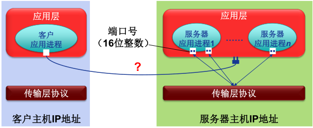

   - 标识通信端点（对外）：
     - IP地址+端口号
   - 操作系统/进程如何管理套接字（对内）？
     - 套接字描述符（**socket descriptor**）
       - 小整数

2. **Socket 抽象**

   - 类似于文件的抽象
   - 当应用进程创建套接字时，操作系统分配一个数据结构存储该套接字相关信息
   - 返回套接字描述符

   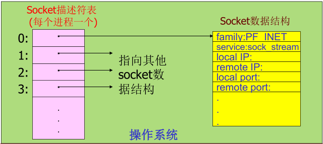

3. **地址结构**

   - 已定义结构`sockaddr_in`:

     ```c
     struct sockaddr_in
     {
     u_char sin_len; 				/* 地址长度  */
     u_char sin_family;  		/* 地址族(TCP/IP ：AF_INET) */
     u_short sin_port; 			/* 端口号  */
     struct in_addr sin_addr; /*IP 地址  */
     char sin_zero[8]; 			/* 未用( 置0) */
     }
     ```

   - 使用TCP/IP协议簇的网络应用程序声明端点地址变量时，使用结构 `sockaddr_in`


#### 三、Socket API 函数

1. **Socket API 函数（WinSock）**

   1. **WSAStartup**（初始化Windows Sockets API ）
   2. 应用程序
   3. **WSACleanup**（释放所使用的 Windows Sockets DLL ）

2. **WSAStartup**

   - `int WSAStartup(WORD wVersionRequested, LPWSADATA lpWSAData);`

   - 使用Socket的应用程序在使用Socket之前必须首先调用WSAStartup函数

   - 两个参数:

     - 第一个参数指明程序请求使用的WinSock版本，其中高位字节指明副版本、低位字节指明主版本.
       - 十六进制整数，例如0x102表示2.1版
     - 第二个参数返回实际的WinSock的版本信息
       - 指向WSADATA结构的指针

   - 例：使用2.1版本的WinSock的程序代码段

     ```
     wVersionRequested = MAKEWORD( 2, 1 );
     err = WSAStartup( wVersionRequested, &wsaData );
     ```

3. **WSACleanup**

   - `int WSACleanup (void);`
   - 应用程序在完成对请求的Socket库的使用，最后要调用WSACleanup函数
   - 解除与Socket库的绑定
   - 释放Socket库所占用的系统资源

4. **socket**

   - `sd = socket(protofamily,type,proto);`

   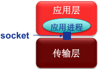

   1. 创建套接字

   2. 操作系统返回套接字描述符（sd）

   3. 第一个参数(协议族): `protofamily = PF_INET（TCP/IP）`

   4. 第二个参数(套接字类型):

      - `type = SOCK_STREAM,SOCK_DGRAM or SOCK_RAW（TCP/IP）`

   5. 第三个参数(协议号):0为默认

      例：创建一个流套接字的代码段

      ```c
      struct protoent *p;
      p=getprotobyname("tcp");
      SOCKET sd=socket(PF_INET,SOCK_STREAM,p->p_proto);
      ```

5. **Socket 面向TCP/IP 的服务类型**

   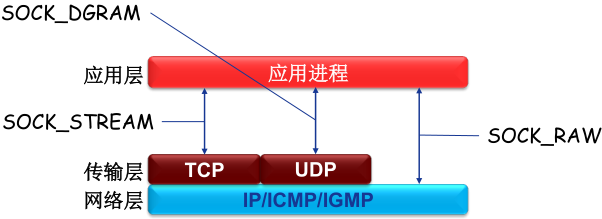

   - TCP：可靠、面向连接、字节流传输、点对点
   - UDP：不可靠、无连接、数据报传输

6. **Closesocket**

   - `int closesocket(SOCKET sd);`
   - 关闭一个描述符为sd的套接字
   - 如果多个进程共享一个套接字，调用`closesocket`将套接字引用计数减1，减至0才关闭
   - 一个进程中的多线程对一个套接字的使用无计数
     - 如果进程中的一个线程调用`closesocket`将一个套接字关闭，该进程中的其他线程也将不能访问该套接字
   - 返回值：
     - `0：成功`
     - `SOCKET_ERROR：失败`

7. **bind**

   - `int bind(sd,localaddr,addrlen);`
   - 绑定套接字的本地端点地址
     - IP地址+端口号
   - 参数:
     - 套接字描述符（sd）
     - 端点地址（localaddr）
       - 结构`sockaddr_in`
   - 客户程序一般不必调用bind函数
   - 服务器端？
     - 熟知端口号
     - IP地址？

   

8. **listen**

   - `int listen(sd,queuesize);`
   - 置服务器端的流套接字处于监听状态
     - 仅服务器端调用
     - 仅用于面向连接的流套接字
   - 设置连接请求队列大小（queuesize）
   - 返回值：
     - `0：成功`
     - `SOCKET_ERROR：失败`

9. **connect**

   - `connect(sd,saddr,saddrlen);`
   - **客户程序**调用connect函数来使客户套接字（sd）与特定计算机的特定端口（saddr）的套接字
     （服务）进行连接
   - 仅用于**客户端**
   - 可用于**TCP客户端**也可以用于**UDP客户端**
     - TCP客户端：建立TCP连接
     - UDP客户端：指定服务器端点地址

   

10. **accept**

    - `newsock = accept(sd,caddr,caddrlen);`
    - 服务程序调用accept函数从处于监听状态的流套接字sd的客户连接请求队列中取出排在最前的一个客户请求，并且创建一个新的套接字来与客户套接字创建连接通道
      - **仅用于TCP套接字**
      - **仅用于服务器**
    - 利用新创建的套接字（newsock）与客户通信

    

11. **send, sendto**

    - `send(sd,*buf,len,flags);`
      - send函数TCP套接字（客户与服务器）或调用了connect函数的UDP客户端套接字
    - `sendto(sd,*buf,len,flags,destaddr,addrlen);`
      - sendto函数用于UDP服务器端套接字与未调用connect函数的UDP客户端套接字

12. **recv, recvfrom**

    - `recv(sd,*buffer,len,flags);`
      - recv函数从TCP连接的另一端接收数据，或者从调用了connect函数的UDP客户端套接字接收服务器发来的数据
    - `recvfrom(sd,*buf,len,flags,senderaddr,saddrlen);`
      - recvfrom函数用于从UDP服务器端套接字与未调用connect函数的UDP客户端套接字接收对端数据

13. **setsockopt, getsockopt**

    - `int setsockopt(int sd, int level, int optname, *optval, int optlen);`
      - setsockopt()函数用来设置套接字sd的选项参数
    - `int getsockopt(int sd, int level, int optname, *optval, socklen_t *optlen);`
      - getsockopt()函数用于获取任意类型、任意状态套接口的选项当前值，并把结果存入optval

14. **Socket API 函数小结**

    1. **WSAStartup**: 初始化socket库( 仅对WinSock)
    2. **WSACleanup**: 清楚/终止socket库的使用 ( 仅对WinSock)
    3. **socket**: 创建套接字
    4. **connect**:“连接”远端服务器 ( 仅用于客户端)
    5. **closesocket**: 释放/关闭套接字
    6. **bind**: 绑定套接字的本地IP地址和端口号（ 通常客户端不需要）
    7. **listen**: 置服务器端TCP套接字为监听模式，并设置队列大小 ( 仅用于服务器端TCP 套接字)
    8. **accept**: 接受/提取一个连接请求，创建新套接字，通过新套接 ( 仅用于服务器端的TCP 套接字)
    9. **recv**: 接收数据（ 用于TCP 套接字或连接模式的客户端UDP 套接字）
    10. **recvfrom**: 接收数据报（ 用于非连接模式的UDP 套接字）
    11. **send**: 发送数据（ 用于TCP 套接字或连接模式的客户端UDP 套接字）
    12. **sendto**:发送数据报（ 用于非连接模式的UDP 套接字）
    13. **setsockopt**: 设置套接字选项参数
    14. **getsockopt**: 获取套接字选项参数

15. **关于网络字节顺序**

    - TCP/IP定义了标准的用于协议头中的二进制整数表示：网络字节顺序（network byte order）
    - 某些Socket API函数的参数需要存储为网络字节顺序（如IP地址、端口号等）
    - 可以实现本地字节顺序与网络字节顺序间转换的函数
      - htons : 本地字节顺序→网络字节顺序(16bits)
      - ntohs : 网络字节顺序→本地字节顺序(16bits)
      - htonl : 本地字节顺序→网络字节顺序(32bits)
      - ntohl : 网络字节顺序→本地字节顺序(32bits)

16. **网络应用的Socket API(TCP) 调用基本流程**

    

    


#### 四、Socket 编程- 客户端软件设计

1. **解析服务器IP 地址**

   - 客户端可能使用域名（如:study.163.com）或IP地址（如：123.58.180.121）标识服务器

   - IP协议需要使用32位二进制IP地址

   - 需要将域名或IP地址转换为32位IP地址

     - 函数`inet_addr( )` 实现点分十进制IP地址到32位IP地址转换
     - 函数`gethostbyname( )` 实现域名到32位IP地址转换
       - 返回一个指向结构`hostent` 的指针

     ```c
     struct hostent {
     char FAR* h_name; 				/*official host name / */
     char FAR* FAR* h_aliases; /*other aliases / */
     short h_addrtype; 				/*address type / */
     short h_lengty; 					/*address length / */
     char FAR* FAR* h_addr_list; /*list of address / */
     };
     #define  h_addr h_addr_list[0]
     ```

2. **解析服务器（熟知）端口号**

   - 客户端还可能使用**服务名**（如HTTP）标识服务器端口

   - 需要将服务名转换为熟知端口号

     - 函数`getservbyname( )`
       - 返回一个指向结构`servent`的指针

     ```c
     struct servent { 
     char FAR* s_name; 					/*official service name / */
     char FAR* FAR* s_aliases;  /*other aliases / */
     short s_port; 						 /*port for this service / */
     char FAR* s_proto;  				/*protocol to use / */
     };
     ```

     

3. **解析协议号**

   - 客户端可能使用**协议名**（如:TCP）指定协议

   - 需要将协议名转换为协议号（如：6）

     - 函数`getprotobyname ( )` 实现协议名到协议号的转换
       - 返回一个指向结构`protoent`的指针

     ```c
     struct protoent { 
     char FAR* p_name; 				/*official protocol name / */
     char FAR* FAR* p_aliases;  /*list of aliases allowed / */
     short p_proto;  					/*official protocol number*/
     };
     ```

     


- **TCP 客户端软件流程**

  1. 确定服务器IP 地址 与号 端口号
  2. 创建套接字
  3. 分配本地端点地址（IP 地址+ 端口号）
  4. 连接服务器（套接字）
  5. 遵循应用层协议进行通信
  6. 关闭/ 释放连接

- **UDP 客户端软件流程**

  1. 确定服务器IP 地址 与号 端口号
  2. 创建套接字
  3. 分配本地端点地址（IP 地址+ 端口号）
  4. 指定服务器端点地址，构造UDP 数据报
  5. 遵循应用层协议进行通信
  6. 关闭/ 释放套接字

- **客户端软件的 实现- connectsock()**

  - 设计一个connectsock 过程封装底层代码

    ```c
    /* consock.cpp - connectsock */
    #include <stdlib.h>
    #include <stdio.h>
    #include <string.h>
    #include <winsock.h>
    #ifndef INADDR_NONE
    #define INADDR_NONE 0xffffffff
    #endif /* INADDR_NONE */
    void  errexit(const char *, ...);
    /*-------------------------------------------------------
    * connectsock - allocate & connect a socket using TCP or UDP
    *------------------------------------------------------
    */
    
    SOCKET connectsock(const char *host, const char *service, const char
    *transport )
    {
    struct hostent *phe; /* pointer to host information entry  */
    struct servent *pse; /* pointer to service information entry */
    struct protoent *ppe; /* pointer to protocol information entry */
    struct sockaddr_in sin;/* an Internet endpoint address */
    int s, type; /* socket descriptor and socket type */
    memset(&sin, 0, sizeof(sin));
    sin.sin_family = AF_INET;
      
      /* Map service name to port number */
    if ( pse = getservbyname(service, transport) )
    sin.sin_port = pse->s_port;
    else if ( (sin.sin_port = htons((u_short)atoi(service))) == 0 )
    errexit("can't get \"%s\" service entry\n", service);
    /* Map host name to IP address, allowing for dotted decimal */
    if ( phe = gethostbyname(host) )
    memcpy(&sin.sin_addr, phe->h_addr, phe->h_length);
    else if ( (sin.sin_addr.s_addr = inet_addr(host))==INADDR_NONE)
    errexit("can't get \"%s\" host entry\n", host);
    /* Map protocol name to protocol number */
    if ( (ppe = getprotobyname(transport)) == 0)
    errexit("can't get \"%s\" protocol entry\n", transport);
      
      /* Use protocol to choose a socket type */
    if (strcmp(transport, "udp") == 0)
    type = SOCK_DGRAM;
    else
    type = SOCK_STREAM;
    /* Allocate a socket */
    s = socket(PF_INET, type, ppe->p_proto);
    if (s == INVALID_SOCKET)
    errexit("can't create socket: %d\n", GetLastError());
    /* Connect the socket */
    if (connect(s, (struct sockaddr *)&sin, sizeof(sin))==SOCKET_ERROR)
    errexit("can't connect to %s.%s: %d\n", host, service,
    GetLastError());
    return s;
    }
    ```

- **客户端软件的 实现-UDP 客户端**

  - 设计 connectUDP 过程用于创建连接模式客户端UDP套接字

    ```c
    /* conUDP.cpp - connectUDP */
    #include <winsock.h>
    SOCKET connectsock(const char *, const char *, const char *);
    /*-------------------------------------------------------
    * connectUDP - connect to a specified UDP service
    * on a specified host
    *-----------------------------------------------------
    */
    SOCKET connectUDP(const char *host, const char *service )
    {
    return connectsock(host, service, "udp");
    }
    ```

  - 设计connectTCP过程，用于创建客户端TCP套接字

    ```c
    /* conTCP.cpp - connectTCP */
    #include <winsock.h>
    SOCKET connectsock(const char *, const char *, const char *);
    /*----------------------------------------------------
    * connectTCP - connect to a specified TCP service
    * on a specified host
    *---------------------------------------------------
    */
    SOCKET connectTCP(const char *host, const char *service )
    {
    return connectsock( host, service, "tcp");
    }
    ```

  - 客户端软件的实现-异常处理

    ```c
    /* errexit.cpp - errexit */
    #include <stdarg.h>
    #include <stdio.h>
    #include <stdlib.h>
    #include <winsock.h>
    /*----------------------------------------------------------
    * errexit - print an error message and exit
    *----------------------------------------------------------
    */
    /*VARARGS1*/
    void errexit(const char *format, ...)
    { va_list args;
    va_start(args, format);
    vfprintf(stderr, format, args);
    va_end(args);
    WSACleanup();
    exit(1);}
    ```

- 例1 ：访问DAYTIME 服务的客户端（TCP ）

  - DAYTIME服务

    - 获取日期和时间
    - 双协议服务（TCP、 UDP），端口号13
    - TCP版利用TCP连接请求触发服务
    - UDP版需要客户端发送一个请求

    ```c
    /* TCPdtc.cpp - main, TCPdaytime */
    #include <stdlib.h>
    #include <stdio.h>
    #include <winsock.h>
    void  TCPdaytime(const char *, const char *);
    void  errexit(const char *, ...);
    SOCKET connectTCP(const char *, const char *);
    #define LINELEN 128
    #define WSVERS MAKEWORD(2, 0)
    /*--------------------------------------------------------
    * main - TCP client for DAYTIME service
    *--------------------------------------------------------
    */
    int main(int argc, char *argv[])
    {
    char *host = "localhost";  /* host to use if none supplied */
    char *service = "daytime";  /* default service port */
    WSADATA wsadata;
    switch (argc) {
    case 1:
    host = "localhost";
    break;
    case 3:
    service = argv[2];
    /* FALL THROUGH */
    case 2:
    host = argv[1];
    break;
    default:
    fprintf(stderr, "usage: TCPdaytime [host [port]]\n");
    exit(1);
    }
    if (WSAStartup(WSVERS, &wsadata) != 0)
    errexit("WSAStartup failed\n");
    TCPdaytime(host, service);
    WSACleanup();
    return 0;  /* exit */
    }
    /*-----------------------------------------------------
    * TCPdaytime - invoke Daytime on specified host and print results
    *-----------------------------------------------------
    */
    void TCPdaytime(const char *host, const char *service)
    {
    char buf[LINELEN+1];  /* buffer for one line of text  */
    SOCKET s; /* socket descriptor  */
    int cc;  /* recv character count */
    s = connectTCP(host, service);
    cc = recv(s, buf, LINELEN, 0);
    while( cc != SOCKET_ERROR && cc > 0)
    {
    buf[cc] = '\0'; /* ensure null-termination  */
    (void) fputs(buf, stdout);
    cc = recv(s, buf, LINELEN, 0);
    }
    closesocket(s);
    }
    ```

- 例2 ： 访问DAYTIME 服务的客户端 （UDP ）

  - ```c
    /* UDPdtc.cpp - main, UDPdaytime */
    #include <stdlib.h>
    #include <stdio.h>
    #include <winsock.h>
    void  UDPdaytime(const char *, const char *);
    void  errexit(const char *, ...);
    SOCKET connectUDP(const char *, const char *);
    #define LINELEN 128
    #define WSVERS MAKEWORD(2, 0)
    #define MSG “what daytime is it?\n"
    /*--------------------------------------------------------
    * main - UDP client for DAYTIME service
    *--------------------------------------------------------
    */
    int main(int argc, char *argv[])
    {
    char *host = "localhost";  /* host to use if none supplied */
    char *service = "daytime";  /* default service port */
    WSADATA wsadata;
    switch (argc) {
    case 1:
    host = "localhost";
    break;
    case 3:
    service = argv[2];
    /* FALL THROUGH */
    case 2:
    host = argv[1];
    break;
    default:
    fprintf(stderr, "usage: UDPdaytime [host [port]]\n");
    exit(1);
    }
    if (WSAStartup(WSVERS, &wsadata) != 0)
    errexit("WSAStartup failed\n");
    UDPdaytime(host, service);
    WSACleanup();
    return 0;  /* exit */
    }
    /*-----------------------------------------------------
    * UDPdaytime - invoke Daytime on specified host and print results
    *-----------------------------------------------------
    */
    void UDPdaytime(const char *host, const char *service)
    {
    char buf[LINELEN+1];  /* buffer for one line of text */
    SOCKET s;  /* socket descriptor */
    int n; /* recv character count  */
    s = connectUDP(host, service);
    (void) send(s, MSG, strlen(MSG), 0);
    /* Read the daytime */
    n = recv(s, buf, LINELEN, 0);
    if (n == SOCKET_ERROR)
    errexit("recv failed: recv() error %d\n", GetLastError());
    else
    {
    buf[cc] = '\0';  /* ensure null-termination  */
    (void) fputs(buf, stdout);
    }
    closesocket(s);
    return 0;  /* exit  */
    }
    ```

    

#### 五、Socket 编程- 服务器软件设计

- 4 种类型基本服务器

  1. **循环无连接**(Iterative connectionless)服务器
  2. **循环面向连接**(Iterative connection-oriented)服务器
  3. **并发无连接**(Concurrent connectionless)服务器
  4. **并发面向连接**(Concurrent connection-oriented)服务器

- **循环无连接 服务器基本流程**

  1. 创建套接字

  2. 绑定端点地址（INADDR_ANY+ 端口号）

  3. 反复求 接收来自客户端的请求

  4. 遵循应用层协议，构造响应报文，发送给客户

     数据发送

     - 服务器端不能使用connect()函数
     - 无连接服务器使用sendto()函数发送数据报

     

     获取客户端点地址

     - 调用recvfrom()函数接收数据时，自动提取

     

- **循环面向连接服务器基本流程**

  1. 创建（主）套接字，并绑定熟知端口号；
  2. 设置（主）套接字为被动监听模式，准备用于服务器；
  3. 调用accept() 函数 接收下一个连接请求（通过主套接字），创建新套接字用于与该客户建立连接；
  4. 遵循应用层协议，反复接收客户请求，构造并发送响应( 通过新套接字) ；
  5. 完成为特定客户服务后，关闭与该客户之间的连接，返回步骤3.

- **并发无连接服务器基本流程**

  1. 主线程1:  创建套 接字，并绑定熟知端口； 号；
  2. 主线程2:  反复调用recvfrom() 函数，接收下一个客户请求，并创建新线程处理该客户响应；
  3. 子线程1:  接收一个特定请求；
  4. 子线程2:  依据应用层协议构造响应报文，并调用sendto() 发送；
  5. 子线程3:  退出( 一个子线程处理一个请求后即终止) 。

- **并发面向连接 服务器基本流程**

  1. 主线程1:  创建； （主）套接字，并绑定熟知端口号；
  2. 主程线程2:  设置 （主）套接字为被动监听模式，准备用于服务器；
  3. 主程线程3:  反复调用accept() 函数 接收 下一个 连接请求 （通过主套接字 ），并创建一个新的子线程处理该客户响应；
  4. 子程 线程1:  接收一个客户的 服务请求 （通过新创建的套接字）；
  5. 程子线程2:  遵循应用层协议与特定客户进行交互；
  6. 程子线程3:  关闭/ 释放连接并退出（线程终止）.

- **服务器的实现**

  - 设计一个底层过程隐藏底层代码：

    - passivesock()

      ```c
      /* passsock.cpp - passivesock */
      #include <stdlib.h>
      #include <string.h>
      #include <winsock.h>
      void  errexit(const char *, ...);
      /*-----------------------------------------------------------------------
      * passivesock - allocate & bind a server socket using TCP or UDP
      *------------------------------------------------------------------------
      */
      SOCKET passivesock(const char *service, const char *transport, int qlen)
      {
      struct servent *pse; /* pointer to service information entry  */
      struct protoent *ppe; /* pointer to protocol information entry */
      struct sockaddr_in sin;/* an Internet endpoint address */
      SOCKET  s;  /* socket descriptor  */
      int  type;  /* socket type (SOCK_STREAM, SOCK_DGRAM)*/
      memset(&sin, 0, sizeof(sin));
      sin.sin_family = AF_INET;
      sin.sin_addr.s_addr = INADDR_ANY;
      /* Map service name to port number */
      if ( pse = getservbyname(service, transport) )
      sin.sin_port = (u_short)pse->s_port;
      else if ( (sin.sin_port = htons((u_short)atoi(service))) == 0 )
      errexit("can't get \"%s\" service entry\n", service);
      /* Map protocol name to protocol number */
      if ( (ppe = getprotobyname(transport)) == 0)
      errexit("can't get \"%s\" protocol entry\n", transport);
      /* Use protocol to choose a socket type */
      if (strcmp(transport, "udp") == 0)
      type = SOCK_DGRAM;
      else
      type = SOCK_STREAM;
      /* Allocate a socket */
      s = socket(PF_INET, type, ppe->p_proto);
      if (s == INVALID_SOCKET)
      errexit("can't create socket: %d\n", GetLastError());
      /* Bind the socket */
      if (bind(s, (struct sockaddr *)&sin, sizeof(sin)) == SOCKET_ERROR)
      errexit("can't bind to %s port: %d\n", service,
      GetLastError());
      if (type == SOCK_STREAM && listen(s, qlen) == SOCKET_ERROR)
      errexit("can't listen on %s port: %d\n", service,
      GetLastError());
      return s;}
      ```

      

  - 两个高层过程分别用于创建服务器端UDP套接字和TCP套接字（调用passivesock()函数）:

    - passiveUDP()

      ```c
      /* passUDP.cpp - passiveUDP */
      #include <winsock.h>
      SOCKET passivesock(const char *, const char *, int);
      /*-------------------------------------------------------------------------------------
      * passiveUDP - create a passive socket for use in a UDP server
      *-------------------------------------------------------------------------------------
      */
      SOCKET passiveUDP(const char *service)
      {
      return passivesock(service, "udp", 0);
      }
      ```

      

    - passiveTCP()

      ```c
      /* passTCP.cpp - passiveTCP */
      #include <winsock.h>
      SOCKET passivesock(const char *, const char *, int);
      /*------------------------------------------------------------------------------------
      * passiveTCP - create a passive socket for use in a TCP server
      *------------------------------------------------------------------------------------
      */
      SOCKET passiveTCP(const char *service, int qlen)
      {
      return passivesock(service, "tcp", qlen);
      }
      ```

      

- 例1 ：无连接循环DAYTIME服务器

  

  ```c
  /* UDPdtd.cpp - main, UDPdaytimed */
  #include <stdlib.h>
  #include <winsock.h>
  #include <time.h>
  void  errexit(const char *, ...);
  SOCKET passiveUDP(const char *);
  #define WSVERS  MAKEWORD(2, 0)
  /*------------------------------------------------------------------------
  * main - Iterative UDP server for DAYTIME service
  *------------------------------------------------------------------------
  */
  void main(int argc, char *argv[])
  {
  struct sockaddr_in fsin; /* the from address of a client  */
  char *service = "daytime";  /* service name or port number  */
  SOCKET sock;  /* socket */
  int  alen;  /* from-address length  */
  char * pts;  /* pointer to time string  */
  time_t now;  /* current time  */
  WSADATA wsadata;
  switch (argc)
  {
  case  1:
  break;
  case  2:
  service = argv[1];
  break;
  default:
  errexit("usage: UDPdaytimed [port]\n");
  }
  if (WSAStartup(WSVERS, &wsadata) != 0)
  errexit("WSAStartup failed\n");
  sock = passiveUDP(service);
  while (1)
  {
  alen = sizeof(struct sockaddr);
  if (recvfrom(sock, buf, sizeof(buf), 0,
  (struct sockaddr *)&fsin, &alen) == SOCKET_ERROR)
  errexit("recvfrom: error %d\n", GetLastError());
  (void) time(&now);
  pts = ctime(&now);
  (void) sendto(sock, pts, strlen(pts), 0,
  (struct sockaddr *)&fsin, sizeof(fsin));
  }
  return 1;  /* not reached */
  }
  ```

  

- 例2 ：面向连接并发DAYTIME 服务器

  

  ```c
  /* TCPdtd.cpp - main, TCPdaytimed */
  #include <stdlib.h>
  #include <winsock.h>
  #include <process.h>
  #include <time.h>
  void  errexit(const char *, ...);
  void  TCPdaytimed(SOCKET);
  SOCKET passiveTCP(const char *, int);
  #define QLEN 5
  #define WSVERS MAKEWORD(2, 0)
  /*------------------------------------------------------------------------
  * main - Concurrent TCP server for DAYTIME service
  *------------------------------------------------------------------------
  */
  void main(int argc, char *argv[])
  {
  struct sockaddr_in fsin;  /* the from address of a client  */
  char *service = "daytime";  /* service name or port number*/
  SOCKET msock, ssock;  /* master & slave sockets  */
  int  alen;  /* from-address length */
  WSADATA wsadata;
  switch (argc) {
  case 1:
  break;
  case 2:
  service = argv[1];
  break;
  default:
  errexit("usage: TCPdaytimed [port]\n");
  }
  if (WSAStartup(WSVERS, &wsadata) != 0)
  errexit("WSAStartup failed\n");
  msock = passiveTCP(service, QLEN);
  while (1) {
  alen = sizeof(struct sockaddr);
  ssock = accept(msock, (struct sockaddr *)&fsin, &alen);
  if (ssock == INVALID_SOCKET)
  errexit("accept failed: error number %d\n",
  GetLastError());
  if (_beginthread((void (*)(void *)) TCPdaytimed, 0,
  (void *)ssock) < 0) {
  errexit("_beginthread: %s\n", strerror(errno));
  }
  }
  return 1;  /* not reached */
  }
  /*----------------------------------------------------------------------
  * TCPdaytimed - do TCP DAYTIME protocol
  *-----------------------------------------------------------------------
  */
  void TCPdaytimed(SOCKET fd)
  {
  char * pts;  /* pointer to time string */
  time_t  now;  /* current time */
  (void) time(&now);
  pts = ctime(&now);
  (void) send(fd, pts, strlen(pts), 0);
  (void) closesocket(fd);
  }
  ```

  


## 第三章 传输层

- 重点：
  - 可靠数据传输基本原理、停—等协议、典型滑动窗口协议（GBN 协议、SR 协议）；
  - TCP 的报文段结构、TCP 连接建立于断开过程、TCP 序列号以及确认序列号、TCP 可靠数据传输机制、TCP 拥塞控制方法。
- 难点：
  - 停—等协议与滑动窗口协议的理解与信道利用率的计算
  - TCP 的连接管理
  - TCP 报文段序列号
  - TCP 的拥塞控制方法


### 第一节 传输层的基本服务

#### 一、传输层功能

#### 二、传输层寻址与端口

#### 三、无连接服务与面向连接服务


### 第二节 传输层的复用与分解

#### 一、无连接的多路复用与多路分解

#### 二、面向连接的多路复用与多路分解


### 第三节 停—等协议与滑动窗口协议

#### 一、可靠数据传输基本原理

#### 二、停—等协议

#### 三、滑动窗口协议


### 第四节 用户数据报协议（UDP）

#### 一、UDP 数据报结构

#### 二、UDP校验和


### 第五节 传输控制协议（TCP）

#### 一、TCP 报文段结构

#### 二、TCP 连接管理

#### 三、TCP 可靠数据传输

#### 四、TCP 流量控制

#### 五、TCP 拥塞控制


## 第四章 网络层

- 重点：
  - 转发与路由概念的理解
  - 虚电路网络与数据报网络工作原理
  - IP 数据报结构
  - IP 数据报分片
  - IP 地址
  - 子网划分
  - CIDR 
  - 路由聚合
  - 路由表
  - ICMP
  - DHCP
  - NAT
  - 链路状态路由选择算法
  - 距离向量路由选择算法
  - 层次化路由
  - RIP
  - OSPF
  - BGP基本工作过程
- 难点：
  - IP 数据报分片
  - IP 地址
  - 子网划分
  - 子网掩码
  - CIDR 
  - 路由聚合
  - 路由表
  - 路由计算
  - 层次化路由
  - OSPF
  - BGP


### 第一节 网络层服务


### 第二节 数据报网络与虚电路网络

#### 一、数据报网络

#### 二、虚电路网络


### 第三节 网络互连与网络互联设备

#### 一、异构网络互联

#### 二、路由器


### 第四节 网络层拥塞控制

#### 一、网络拥塞

#### 二、流量感知路由

#### 三、准入控制

#### 四、流量调节

#### 五、负载脱落


### 第五节 Internet 网络层

#### 一、IPv4 协议

#### 二、IPv4 编址

#### 三、动态主机配置协议

#### 四、网络地址转换

#### 五、ICMP

#### 六、IPv6


### 第六节 路由算法与路由协议

#### 一、链路状态路由选择算法

#### 二、距离向量路由选择算法

#### 三、层次化路由选择

#### 四、Internet 路由选择协议


## 第五层 数据链路层与局域网

- 重点：
  - 典型的差错编码
  - CDMA 工作原理
  - ALOHA、CSMA、CSMA/CD 及轮询协议的工作原理
  - MAC 地址、ARP、以太网、交换机的特点及其工作原理
  - PPP 工作原理
- 难点：
  - CDMA 工作原理
  - CSMA/CD 协议、以太网、交换机工作原理
  - VLAN 工作原理


### 第一节 数据链路层服务


### 第二节 差错控制

#### 一、差错控制的基本方式

#### 二、差错控制的基本原理

#### 三、差错控制的检错与纠错能力

#### 四、典型的差错编码


### 第三节 多路访问控制协议

#### 一、信道划分 MAC 协议

#### 二、随机访问 MAC 协议

#### 三、受控接入 MAC 协议


### 第四节 局域网

#### 一、数据链路层寻址与 ARP

#### 二、以太网

#### 三、交换机

#### 四、虚拟局域网


### 第五节 点对点链路协议

#### 一、PPP

#### 二、HDLC 协议


## 第六章 物理层

- 重点：
  - 数据通信基础、物理介质、信道容量、基带传输编码、频带传输调制技术、物理层接口规程特性；
- 难点：
  - 信道容量计算
  - 基带传输编码
  - 频带传输的基本原理调制技术


### 第一节 数据通信基础

#### 一、数据通信基本概念

#### 二、数据通信系统模型


### 第二节 物理介质

#### 一、引导型传输介质

#### 二、非引导型传输介质


### 第三节 信道与信道容量

#### 一、信道分类与模型

#### 二、信道传输特性

#### 三、信道容量


### 第四节 基带传输

#### 一、基带传输基本概念

#### 二、数字基带传输编码


### 第五节 频带传输

#### 一、频带传输的基本概念

#### 二、频带传输中的三种调制方式


### 第六节 物理层接口规程

#### 一、物理层接口概述

#### 二、物理层接口特性 


## 第七章 无线与移动网络

- 重点：
  - 无线网络基本结构
  - 无线网络特性
  - 移动网络基本原理
  - 间接路由与直接路由
  - IEEE 802.11 
  - CSMA/CA
  - 移动 IP 网络
- 难点：
  - CSMA/CA 协议及其退避机制
  - IEEE 802.11 帧的地址字段


### 第一节 无线网络

#### 一、无线网络基本结构

#### 二、无线链路与无线网络特性


### 第二节 移动网络

#### 一、移动网络基本原理

#### 二、寻址

#### 三、移动节点的路由选择


### 第三节 无线局域网 IEEE 802.11

#### 一、IEEE 802.11 体系结构

#### 二、IEEE 802.11 的 MAC 协议

#### 三、IEEE 802.11 帧


### 第四节 蜂窝网络

#### 一、蜂窝网络体系结构

#### 二、蜂窝网络中的移动性管理

#### 三、移动通信 2G/3G/4G/5G 网络


### 第五节 移动 IP 网络

#### 一、代理发现

#### 二、向归属代理注册


### 第六节 其他典型无线网络简介

#### 一、WiMax

#### 二、蓝牙

#### 三、ZigBee


## 第八章 网络安全基础

- 重点：
  - 计算机网络安全基本概念
  - 网络安全基本属性
  - 典型数据加密算法
  - 消息完整性验证、报文认证、数字签名、身份认证方法、KDC 与 CA、防火墙基本原理与分类
  - 网络安全协议（PGP、SSL、和 IPSec）
- 难点：
  - 数据加密算法
  - 网络安全协议（PGP、SSL 和 IPSec）


### 第一节 网络安全概述

#### 一、基本概念

#### 二、网络安全威胁


### 第二节 数据加密

#### 一、传统加密方式

#### 二、对称密钥加密

#### 三、非对称/公开密钥加密


### 第三节 消息完整性与数字签名

#### 一、消息完整性检测方法

#### 二、报文认证

#### 三、数字签名


### 第四节 身份认证


### 第五节 密钥分发中心与证书认证机构

#### 一、密钥分发中心

#### 二、证书认证机构


### 第六节 防火墙与入侵检测系统

#### 一、防火墙基本概念

#### 二、防火墙分类

#### 三、入侵检测系统 IDS 


### 第七节 网络安全协议

#### 一、安全电子邮件

#### 二、安全套接字层 SSL

#### 三、虚拟专用网 VPN 和 IP 安全协议 IPSec


