> # [**计算机信息管理专业课程**](https://github.com/Eished/self-study-exam_notes)
>
> **最新自考笔记** : https://github.com/Eished/self-study-exam_notes
>
> ## 计算机网络 国家精品课
>
> 课程地址：https://www.icourse163.org/course/HIT-154005
>
> ##### 讲师：李全龙、聂兰顺 
>
> ##### 课件整合补充：Eished
>
> 视频总时长：`37:25:46`

# 计算机网络原理  04741 

## 历年真题分析

1. 201910
2. 202008
3. 202104
4. 201904
5. 201810
6. 201804

### 题型

1. **单项选择题**：25小题，每小题1分，共25分。
2. **填空题**：10小题，每小题1分，共10分。
3. **简答题**：6小题，每小题5分，共30分。
4. **综合题**：3小题，共35分。

主攻简答和综合。

### 选择题

1. A C D B A

   1. 比较多见于广域网、核心网络的拓扑结构是 **网状拓扑结构。**
      - 其他知识点：总线型拓扑结构网络在早期的局域网中比较多见；环形拓扑结构网络多见于早期的局域网、园区网和城域网中；树型结构是目前很多局域网采用的形式；混合拓扑结构用于 Internet。
   2. 利用计算机网络可以实现的共享资源不包括
      - A.硬件资源 B.软件资源 **C.技术资源** D.信息资源
   3. 典型的用于创建数字签名的单向散列算法是
      - A.RSA B IDEA C.MDS **D.SHA-1**
   4. 多见于广域网或互联网核心层网络的拓扑结构是
      - A.环形拓扑结构 **B.网状拓扑结构** C.树形拓扑结构 D.星形拓扑结构
   5. 网络协议中定义实体之间交换信息格式与结构的协议要素是
      - **A．语法**  B．语义  C．模式  D．时序

2. C A D D C

   1. 大规模现代计算机网络结构中不包括的部分是 **主服务器。**
      - **包括：接入网络、网络核心、网络边缘。**
   2. 利用有线电视网络实现接入的网络技术是
      - **A.HFC接入** B.ADSL接入 C.移动接入D.局域网接入
   3. Internet的拓扑结构属于
      - A.环型拓扑结构 B.树型拓扑结构 C.星型拓扑结构 **D.混合拓扑结构**
   4. 信号从发送端发出，经过一定距离的物理链路到达接收端所需要的时间称为
      - A.处理时廷 B.排队时延 C.传输时延 **D.传播时延**
   5. 当某个分组在输出链路发送时，从发送第一位开始到发送完最后一位为止所用的时间称为
      -  A．处理时延  B．排队时延 **C．传输时延**  D．传播时延

3. B C A B B

   1. 比较典型的分组交换设备是 **路由器和交换机。**
   2. 假设分组长度L=1000B，链路带宽R=10Mbit/s，则所求传输延迟为 `1000*8 / 10*1 000 000`
      - A. $8*10^{-6}s$​​  B. $1*10^{-6}s$​​  **C**. $8*10^{-4}s$​​  D. $1*10^{-4}s$​
   3. 非对称数字用户线路ADSL基于的多路复用技术是
      - **A.频分多路复用** B.同步时分多路复用 C.波分多路复用 D.异步时分多路复用
   4. 在分组交換网中，若主机A向主机B 传送数据只能经过由3段链路组成的一条路径，其速率分别是 R1=500bit/s、R2=2 Mbit/s、R3=1 Mbit/s，则A到B的最大吞吐量为
      - A. 250bit/s **B. 500bit/s** C. $10^6 bit/s$ D.$2*10^6bit/s$
   5. 设信号传播速度V=2500km/s，链路长度D=500m，链路带宽R=10Mbit/s，则该段链路的时延带宽积为
      - A．1500bit   **B．2000bit**  C．2500bit   D．4000bit

4. D D C A C

   1. 若物理链路长度D=500m，信号传播速度V=2500km/s，则所求传播时延为 $2\times10^{-4}s $。
      - $Dp=500m/250000m/s=0.0002=2\times10^{-4}s $​
   2. 丢包率常被作为评价和衡量网络性能的指标，引发网络丢包的主要因素是
      - A.排队时延 B.吞吐量大 C.传播时延 **D.网络拥塞**
   3. 当一个分组在输出链路发送时，从发送第一位开始，到发送完最后一位为止，所用的时间称为
      - A.传播时延 B.结点处理时延 **C.传输时延** D.分组排队时延
   4. OSI参考模型中，应用层的协议数据单元（PDU）被称为
      - **A.报文** B.比特流 C.分组 D.报文段
   5. 在OSI参考模型中，数据链路层的协议数据单元(PDU)称为
      - A．包  B．报文  **C．帧**  D．位流

5. A B D D B

   1. 如果将物理链路看作传播数据的管道，则用来表示一段链路可容纳的数据位数的概念是 **时延带宽积。**
      - 时延带宽积的物理意义在于：如果将物理链路看作一个传输数据的管道的话，时延带宽积表示一段链路可以容纳的数据位数，也称为以位为单位的链路长度。（P38）
   2. OSI参考模型中，在层的实体之间传送的比特组称为 
      - A.地址 **B.数据单元** C.端口 D.服务原语
   3. 在OSI参考模型中，包括端到端的可靠数据传输、连接与流量控制以及拥塞控制功能的层次是
      - A.物理层 B.数据链路层 C.网络层 **D.传输层**
   4. 负责一个区并保存该区中所有主机域名到IP地址的映射的域名服务器是
      - A.根域名服务器 B.顶级域名服务器 C.中间域名服务器 **D.权威域名服务器**
   5. TCP/IP参考模型的核心层是
      - A．应用层  **B．网络互联层**  C．传输层  D．网络接口层

6. C A B B A

   1. 以下关于域名服务器说法错误的是

      - A.每个域名服务器存储部分域名信息 B.一个服务器负责管辖的范围叫作区 C.**域名服务器的管辖范围**~~以域为单位~~ D.主机一般都会配置默认域名服务器

      - 一个服务器所负责管辖的（可有权限）的范围叫作区（zone）。DNS服务器的管辖不是以“域”为单位，而是以“区”为单位。（P55）
   2. 作为每个应用进程与其他应用进程进行通信时的真正收发报文的通道是 

      - **A.套接字** B.IP地址 C.端口号 D.URL地址
   3. OSI参考模型中的协议数据单元PDU在应用层中被称为

      - A.帧 **B.报文** C.包 D.位流
   4. 在HTTP报文中用于服务器向客户端通告响应情况的是

      - A.短语 **B.状态码** C.方法 D.URL
   5. 分别用a-m共13个英文字母命名的域名服务器是
      - **A．根域名服务器**   B．顶级域名服务器  C．权威域名服务器  D．中间域名服务器

7. B C A A C

   1. 在Web应用中，寻址一个Web页或Web对象需要通过一个 **URL地址**
      - Web应用中，通过一个URL（Universal resource loactor）地址来寻址一个Web页或对象。
   2. 任何一个拥有域名的主机，其域名与IP地址的映射关系等信息都存储在所在网络的 
      - A.顶级域名服务器上 B.默认域名服务器上 **C.权威域名服务器上** D.中间域名服务器上
   3. 下列不属于TCP/IP参考模型网络互联层的协议是
      - **A.UDP** B.ICMP C.BGP D.IGMP
   4. 在 Intemet I邮件系统中不能用于邮件读取的协议是
      - **A.SMTP** B.IMAP C.HTTP D.POP3
   5. HTTP报文中最常见的请求方法是
      -   A．PUT   B．HEAD  **C．GET**   D．POST

8. D D A D B

   1. 在典型的HTTP请求方法中，最常见的方法是 **GET**

   2. 下列关于Cookie 说法正确的是 
      - A.Cookie 用于记录系统当前状态 B.Cookie 保存在服务器中 C.Cookie是一个小型可执行文件 D.**Cookie 服务器端生成**
      
   3. 设信噪比为30dB，用于发送二进制信号的3kHz信道的信道容量为
      - **A.30kbit/s** B.60kbit/s C.120kbit/s D.180kbit/s
      
   4. TCP实现传输层的可靠传输时，为解决数据丢失问题而采取的措施是

      - A.差错控制 B.引入顺序号 **C.重传机制** D.引入计时器

   5. 下列关于Cookie的说法错误的是

        A．Web的Cookie机制用于用户跟踪 **B．Cookie由客户端生成**

        C．Cookie存储在用户本地终端上  D．Cookie为小型文本文件

9. B B A A A

   1. 作为电子邮件应用客户端软件的用户代理不包括 A.Apple Mail **B.MIME** C.Fox Mail D.Outlook

      - MIME（Multipurpose Internet Mail Extensions，多用途互联网邮件扩展）（P70）
      
   2. 实现邮件服务器之间邮件传送的 Internet应用层协议是 A.POP3 **B.SMTP** C.MIME D.IMAP

   3. 在下列字符（串）中，可以作为**根域名服务器**名字的是 **A.b** B.c C.com D.arpa

   4. 下列关于TCP和UDP协议的说法正确的是

      - **A.UDP提供无连接、不可靠的传输服务** B.TCP连接的建立和释放采用“三次握手”过程
      - C.UDP首部为4个字段，每个字段由4个字节组成 D.TCP不提供流量控制，而将此问题交由数据链路层

   5. 电子邮件应用中将非ASCII码文本内容转换为ASCII码文本内容的协议是

        A．**MIME**   B．POP3

        C．HTTP   D．IMAP

10. D D B C B

    1. 网络应用进程可以创建的面向传输层UDP接口的套接字是 

       - A.原始套接字 B.接收数据套接字 C.流式套接字 **D.数据报类型套接字**
       - 网络应用进程可以创建3种类型的 Socket：
         1. 数据报类型套接字 SOCK_DGRAM 面向传输层UDP接口
         2. 流式套接字SOCK_STREAM 面向传输层TCP接口，
         3. 原始套接字SOCK_RAW面积网络层协议（如IP、ICMP等）接口（P77）

    2. 网络应用进程可以创建的面向传输层TCP接口的套接字是 

       - A.计时器类型套接字 B.原始套接字 C.数据类型套接字 **D.流式套接字**

    3. 下列HTTP的请求方法中，在指明的URL下存储一个文档的方法是 A.HEAD B.PUT C.POST **D.GET**

    4. 以下关于数据报网络的叙述正确的是

       - A.数据报网络提供面向连接的服务 B.数据报网络是一种报文交换网络 **C.接收方要对收到的分组重新排序** D.对数据报不需单独进行路径选择

    5. 在Socket编程过程中绑定套接字的本地端点地址的SocketAPI函数是

         A．addrlen   B．**bind**

         C．connect   D．socket

11. A A C D B

    1. 以下设备的协议栈中有传输层协议的是 **A.主机** B.交换机 C.路由器 D.集线器
       - 当网络边缘中的两台主机通过网络核心进行端到端通信时，只有主机的协议栈中才有传输层协议，而网络核心部分中的路由器在转发分组时都只用到下三层功能，即不需要使用传输层协议。（P92）
       
    2. 使用默认端口号53的服务器是 **A.DNS服务器** B.HTTP服务器 C.FTP服务器 D.POP3服务器

    3. 允许用户代理**只读取邮件部分内容**的邮件读取协议是
       - A.POP3 B.MIME **C.IMAP** D.SMTP
       
    4. 下列交换结构中，性能最好的路由器交换结构是 A.基于内存交换 B.基于总线交换 C.基于端口交换 **D.基于网络交换**

    5. 从滑动窗口协议的角度，选择重传(SR)协议的发送窗口W。与接收窗口W，满足

        A·Ws=1，Wr=l   **B．Ws >1，Wr>1**   

        C. Ws≥1，Wr=1   D．Ws≥l，Wr≥l

12. D C C B B

    1. 最简单的自动重传请求协议是 A.UDP协议 B.SR协议 C.GBN协议 **D.停等协议**
       - 最简单的ARQ（Automatic Repeat reQuest，自动重传请求）协议就是停一等协议。（P99）
       
    2. 在 Intemet网络中唯一标识套接字的基本信息是 
       - A.端口和应用进程 B.IP地址和资源名称 **C.IP地址和端口号** D.端口号和站点域名
       
    3. 关于虚拟专用网VPN，说法错误的是
       - A.VPN可以实现与专用网类似的功能 B.VPN的实现使用了隧道技术和数据加密
       - ~~C.VPN建立的安全通道独占网络资源~~ D.VPN可同时使用 IPSec技术和SSL协议
       
    4. 在以下网络拥塞控制的措施中，广泛应用于虚电路网络的拥塞预防技术是
    
       - A.流量感知路由 **B.准入控制** C.流量调节 D.负载脱落
    
    5. 虚电路网络是一种
    
         A．数据报网络  **B．分组交换网络**
    
         C．报文交换网络 D．电路交换网络
    
13. B B D C A

    1. 对于滑动窗口协议，与信道利用率有关的是 

       - A.发送与接收窗口的大小 **B.发送窗口的大小** C.接收窗口要大于等于1 D.接收窗口的大小

       - 对于滑动窗口协议，信道利用率与发送窗口的大小有关。（P109）

    2. 发送窗口和接收窗口都大于1的可靠数据传输协议是 A.停-等协议 **B.选择重传协议** C.UDP协议 D.回退N步协议

    3. 不可靠传输信道的不可靠性的主要表现不包括

        - A.可能发生比特差错 B.可能出现乱序 C.可能出现数据丢失 ~~D.可能出现延迟~~
        
    4. 主要功能是进行主机或路由器间的网络层差错报告与网络探测的协议是

        - A.DHCP B.UDP **C.ICMP** D.Ping

    5. 在网络层实现网络互连的设备是

          **A．路由器**  B．中继器

          C．交换机  D．集线器

14. C D B B A

    1. 已知TCP报文段的首部长度字段的值为15，则表示TCP报文段的首部和选项字段的最大长度分别为  

       - A.20字节和40字节 B.32字节和64字节 **C.60字节和40字节** D.60字节和80字节

       - 当首部字段取最大值15时，表示TCP段的最大首部长度即60字节。见TCP段的选项字段最多为40字节。（20字节的固定首部）（P113）

    2. UDP数据报首部不包括的字段是 A.端口号 B.长度 C.校验和 **D.序号**

    3. 设两台主机之间利用停等协议在一条链路上传输数据，报文段的传输时延为$4×10^{-4}ms$，往返传播时延为50ms，如果忽略ACK，则发送方的信道利用率为

       - A.0.000004 B.0.000008 C.0.00001 D.0.000024
       
    4. 下列 IPV6地址的表示中错误的是

       - A.5800：:2234:0231:ABCD:E5.3            B.2A32：2222：4DE3:：2072：4ABC
       - C.5700：:89AB：2103：59.23.0.154    D.1918：45EA：3740:：5321：1047

    5. 总长度为38008的IP数据报通过MTU为15008的链路传输，则该数据报需分成的片数和MF标志分别为

         A．3和1，1,0    B．3和0,0,1

         C．2和O，l，1   D．2和1，1．0

15. A C C A C

    1. 设甲乙双方采用GBN协议发送报文且甲已发送了0\~7号报文段，当计时器超时时甲只收到0、1、4号报文段的确认，则甲需重发的报文段为  

       - **A.2\~7号报文段** B.5\~7号报文段 C.0\~7号报文段 D.2、3和5-7号报文段

       - GBN协议发送方只使用1个计时器，且只对当前发送的窗口的“基序号”指向的分组进行计时。如果出现超时，发送方重传当前发送窗口中所有已发送但未被确认的分组。（P105-106）

    2. 以下关于虚电路网络的说法错误的是 

       - A.虚电路网络是一种分组交换网络 B.每条虚电路都有一个虚电路标识 ~~C.虚电路网络不保证分组传输顺序~~ D.虚电路是通信双方一条逻辑连接

    3. 关于数据报网络，说法错误的是

       - A.双方通信前不需要再建立连接 B.Internet是一个数据报网络 ~~C.每个数据报可分为若干个分组~~ D.接收方要对分组重新排序
       
    4. 下列差错控制方式中无需差错编码的

       - **A.反馈校验** B.前向纠错 C.检错重发 D.检错丢弃

    5. 设子网中主机的IP地址为192．168．0．135，子网掩码为255．255．255．192，该子网地址和子网所包含的IP地址总数分别为

         A．192．168．0．128／24和64  B．192．168．0．128和128

         C．192．168．0．128／26和64  D．192．168．0．192和128

16. D A C C B

    1. 实现两个异地同构网络互连的典型技术是  A.流量控制技术 B.加密技术 C.拥塞控制技术 **D.隧道技术**

       - 除了异构网络互连，还有同构网络互连问题，如两个异地以太网的互连，实现这类同构网络互连的典型技术是隧道技术。（P135）
       
    2. 下列网络互连设备中，属于最典型的网络层设备是 **A.路由器** B.集线器 C.交换机 D.中继器
    
    3. 关于网络层发生拥塞的原因，表述错误的是 
       - A.缓冲区容量有限 B.传输线路的带宽有限 ~~C.重传计时器超时~~ D.网络结点处理能力有限
       
    4. 下列英文缩写中表示**统计时分多路复用**技术的是
    
       - A.ATDM B.FDMA **C.STDM** D.TDMA
    
    5. 可以作为IPv6数据报源地址和目的地址的地址类型是
    
        A．任播地址  B．单播地址
    
        C．多播地址  D．组播地址
    
17. B B C D C

    1. 路由器的交换结构不包括 A.基于内存交换 **B.基于端口交换** C.基于总线交换 D.基于网络交换

       - 交换结构完成将输入端口的IP数据报交换到指定的输出端口。主要包括基于内存交换、基于总线交换和基于网络交换3种交换结构。（P137）
       
    2. 在路由器的交换结构中性能最低的是
       A.基于总线交换 **B.基于内存交换** C.基于网络交换 D.基于端口交换
       
    3. 当观察到网络上潜在的恶意流量时，能够产生警告的设备或系统的是
       - A.代理服务器 B.无状态分组过滤器 **C.入侵检测系统** D.有状态分组过滤器
       
    4. 以太网的帧中数据字段的最小长度是

       - A.18字节 B.32字节 C.40字节 **D.46字节**

    5. 对于二进制数据0111011采用奇校验和偶校验编码后的码字分别为

        A．00111011和lllt0110   B．1110110和1110111

        C．01110110和Olll0111   D．1110110和llll01l

18. A D A B D

    1. 已知IPv4数据报第1个字节和数据报长度字段内容分别为十六进制数45H和3FCH，则该数据报封装的数据为 

       - **A.1000字节** B.1020字节 C.1024字节 D.1200字节

       - 数据报长度也称为总长度字段，占16位，给出数据报的总字节数，包括首部和数据部分。3FCH转换成10进制为1020字节，除去最小的IP数据报首部20字节（45H），1020-20=1000 （P143）

    2. 已知IP数据报首部长度为20字节，若将总长度为6400B的IP数据报通过MTU为1600B的链路传输，则该数据报需分成的片数为 

       - A.2个 B.3个 C.4个 **D.5个**

    3. IPv4数据报的首部长度（不含选项字段）的字节数为

       - **A.20** B.40 C.60 D.64
       
    4. 点对点协议PPP定义的控制转移字节内容为

       - A.01111110 B.01111101 C.00000011 D.11111111

    5. 下列以太网的MAC地址表示中错误的是：

         A. AA—BB一00—1 1—22一CC   。  B．00—2A-AA-BB-CC一6B

         C．2A：El：8C：39：00：48   。D．43：25：AB：E5：2L：44  

19. C C B C C

    1. 设子网 212.121.0.0/24 为C类地址网络，则超网 212.121.0.0/22 中包含的C类地址网络和IP地址总数分别为 

       - A.2和1016 B.2和1024 **C.4和1024** D.4和1016

       - 超网化是指将具有较长前缀的相对较小的子网合并为一个具有稍短前缀的相对较大的子网。212.121.0.0/24超212.121.0.0/22，相当于划分了121.121.0.0-3.0四个子网，每个子网有256个IP地址数，256*4=1024。（P151）

    2. 下列IP地址中属于私有IP地址的是 

       - A.0.0.00/32 B.0.0.0.0/0 **C.10.0.0.0/8** D.127.0.0.08

    3. 在二进制数字调制方式中，相同信噪比下误码率最低的是

       - A.2ASK **B.2PSK** C.2FSK D.2DPSK
       
    4. 设信道带宽为16kHz，信噪比为30dB，则该信道的信道容量大约为

       - A.8kbit/s B.16kbit/s **C.160kbit/s** D.240khz

    5. 划分虚拟局域网的方法中不包括

         A．基于MAC地址划分  B．基于交换机端口划分

         C．基于安全需求划分  D．基于上层协议类型或地址划分

20. D A C B D

    1. 最具有代表性的分布式路由选择算法是 

       - A.求最短路径算法 B.链路状态路由选择算法 C.层次化路由算法 **D.距离向量路由选择算法**

       - 最具有代表性的分布式路由选择算法是距离向量路由选择算法（P164）

    2. IPv6的地址类型中不包括 **A.广播地址** B.组播地址 C.单播地址 D.任播地址

    3. 数据链路层提供的服务不包括 

       - A.链路接入 B.差错控制 ~~C.路径选择~~ D.可靠交付
       
    4. 若利用正负电平表示0、1，每位持续时间的中间时刻进行跳变，并利用该跳变分别表示0、1，该编码类型属于

       - A.差分码 **B.双相码** C.米勒码 D.归零码

    5. 利用带宽为4000Hz的**无噪声信道**传输二进制基带信号，其最大的数据传输速率可达到  

        A．2000bps   B．4000bps

        C．6000bps   D．8000bps

21. B B B A B

    1. 在以下的差错控制方式中，只适用于实时性要求较高的系统的是 

       - A.检错重发 **B.检错丢弃** C.前向纠错 D.反馈校验

       - 差错控制的基本方式有4种：**检错重发、前向纠错、反馈检验**和**检错丢弃**，其中检错丢弃只适用于实时性要求较高的系统。（P178）

    2. 在以下的差错控制方式中，不需要差错编码的是 

       - A.检错重发 **B.反馈校验** C.前向纠错 D.检错丢弃

    3. 在计算机网络中应用广泛的一种典型的差错控制方式是

       - A.反馈校验 **B.检错重发** C.前向纠错 D.检错丢弃
       
    4. 有线网络与无线网络的重要区别主要在

       - **A.数据链路层和物理层** B.应用层和物理层 C.网络层和数据链路层 D.传输层和网络层

    5. 若利用电平的变化与否表示信息，且相邻脉冲用电平有跳变表示1，无跳变表示0，则该编码类型属于

        A．AMI码  B．**差分码**

        C．米勒码  D．归零码

22. A D A B D

    1. 设生成多项式$G（x）=X^4+x^2+x+1$，则对位串 1001101101 进行CRC编码后的结果为 **A.1001110111011100** B.1100 C.1001110111010111 D.1011
       - CRC编码的基本思想是：将二进制位串看成是系数为0或1的多项式的系数。（P183）
       
    2. 对于生成多项式 $G(x)=x^4+x^2+1$ ,求得位串 1011011 的 CRC 码为
       - A.10101 B.0011 C.10110 **D.1100**
       
    3. 通信站发送数据前先侦听信道，若信道空闲则发送，否则继续侦听直至信道空闲后立即发送数据，采用此侦听策略的协议是
       - **A.1-坚持CSMA** B.非坚持CSMA C.P坚持CSMA D.ALOHA协议
       
    4. 若某个IEEE80211数据帧的帧控制字段中的“去往AP”、“来自AP”的值为1、0则该帧中的地址1、地址2、地址3分别是
    
       - A.目的地址、AP地址和源地址 **B.AP地址、源地址和目的地址** C.源地址、目的地址和AP地址 D.AP地址、目的地址和源地址
    
    5. 指明利用接口传输比特流的全过程以及各项用于传输事件发生的合法顺序的物理层接口特性是  
    
        A．机械特性  B．电气特性
    
        C．功能特性  D．规程特性
    
23. D C D B B

    1. 设有长度为1km，数据传输速率为10Mbps的以太网，信号传播速度为200m/us则求得**MAC帧的最小帧**长度为 A.1024bit B.512bit C.1000bit **D.100bit**

       - `Lmin/R>=2Dmax/V`，Lmin为数据帧最小长度；R信息传输率；Dmax两通信站之间的最远距离；V为信号传输速度。`Lmin=2DmaxR/v=2*1000*10/200=100`（P194）
       
    2. 设 CSMA/CD局域网的数据传输速率为1Gbps，信号传播速度为200000km/s，最小帧长度为25000bit，则该局域网中两站之间的最远距离为
       - A.1250m B.2000m **C.2500m** D.3000m
       
    3. 设 CSMA/CD局域网中两站间的最远距离为2500m，数据传输速率为1Gbis，信号传播速度为20000kXm/s，则**最小帧**长度应为
       - A.10000bit B.12500bit C.20000bit D.25000bit
       
    4. 被称为蓝牙网络的EEE802标准是

       - A.IEEE802.11 **B.IEEE802.15.1** C.IEEE802.16 D.IEEE802.154

    5. 最高具有11Mbit/s速率且工作在无需许可的2.4GHz的无线频谱上的无线局域网标准是

         A.IEEE802.11a   **B.IEEE802.11b**  C．IEEE802.119  D．IEEE802.11n

24. C A D C D

    1. 若采用HDLC协议发送的数据为1 0111110 01 01111100则接收的实际数据应为

       - A.101111101011111011111　B.101111110111110111110　**C.1 0111110 10 11111 111110**    D.101111111111111111100

       - 接收端收到一个帧后，先找到标志字段01111110定帧的边界，接着利用硬件扫描整个比特流，当发现5个连续的1，就删除其后面的0，以还原成原来的信息（P210）
       
    2. 设某信道带宽为4MHz信噪比为30dB，则该信道的信道容量为 

       - **A.40Mbit** B.60Mbit/s C.64Mbit/s D.80Mbit/s

    3. 下列MAC地址中，正确的是

       - A.10-2A-B1-76-80-39-10 B.FF:BA:CO:D:EF:FFO C.00:2A:EO76:8C:39:11 **D.A0-B0-C0-D0-E0-00**
       
    4. 设密钥key=4、字符集为26个小写字母，则利用凯撒密码所求明文 network的密文是

       - A.ghwyrun B.ghwyruo **C.rixasvo** D.ghwyruv

    5. IEEE802.11帧的类型中不包括 ：

        A．控制帧  B．数据帧

        C．管理帧  **D．无编号帧**

25. C B A B C

    1. 若采用4进制数字调制方式使数据传输速率达到4800bit/s ，则码元速率应达到

       - A.9600Baud B.4800Baud C.2400Baud D.1200Baud

       - 数据的传输速度与码元传输速率以及进制数的关系为`Rb= RBlogM`

         `RB=4800/2=2400Baud`（P236）

    2. 下列IEEE802标准中被称为蓝牙网络标准的是
       
       - A.IEEE802.11 **B.IEEE802.15.1** C.IEEE802.16 D.IEEE802.154
       
    3. 以太交换机的基本工作方式是
    
       - **A.存储转发** B.直通交换 C.点点交换 D.混合交换
       
    4. 典型的用于创建数字签名的单向散列算法是
    
       - A.MDS **B.SHA-1** C.RSA D.IDEA
    
    5. 下列加密算法中属于公开密钥算法的是
    
        A．AES      B．DES
    
        C．**RSA**      D．IDEA

### 填空题

1. 1
   1. 计算机网络通过信息交换可实现的核心功能是 **资源共享**（P24）
   2. 用于表示网络中的主机、网络设备间的物理连接关系与布局的概念是 **网络拓扑**
   3. 定义实体间交换信息的顺序以及如何匹配或适应彼此速度的网络协议要素是 **时序**
   4. 网络协议的三要素包括语法、语义和 **时序**
   5. 在目前的互联网环境下，软件共享的典型形式是 **SaaS**(软件即服务)
2. 1
   1. 星型拓扑结构的网络规模受限于中央结点的 **端口数量**（P25）
   2. 用于语音和视频这类实时性强的业务的交换技术是 **电路交换**
   3. 计算机网络按照其所采用的数据交换技术可分为**电路交换**网络、报文交换网络和分组交换网络。
   4. 计算机网络所划分的层次以及各层次协议的集合称为计算机 **网络体系结构**
   5. 对于报文和分组交换方式来说，更为公平的交换方式是 **分组交换**
3. 1
   1. 报文交换和分组交换技术中，现代计算机网络不采用的是 **报文交换**
   2. 数据从网络中的一个节点到达另一个节点所需要的时间称为 **时延**
   3. 一段物理链路的传播时延与链路带宽的乘积称为 **时延带宽积**
   4. 作为www应用的客户端软件是 **浏览器**
   5. 每个URL地址主要包括存放对象的服务器主机域名(或IP地址)和 **对象的路径名**(资源路径)
4. 1
   1. 通常将计算机网络中连接两个结点的直接链路称为 **跳步（hop）**（P37
   2. 在OSI参考模型中，数据链路的建立、维持和释放的过程被称为 **链路管理**
   3. OSI参考模型中，相邻层间的服务是通过接口面上的进行的 **服务访问点 SAP**
   4. FTP客户端发出传送请求给服务器端控制进程的熟知端口号是 **21**
   5. 从传输层的角度看，端到端的通信是 **应用进程** 之间的通信
5. 1
   1. 根据本网内目的主机或默认网关的IP地址获取其MAC地址的是协议 **ARP协议**
   2. 实现将域名映射为IP地址的过程称为 **域名解析**
   3. 设密钥k=4、字符集为a-z 26个英文字母，利用凯撒密码解密 `rixasvo` 后的明文为 **network**
   4. 最有代表性的全局式路由选择算法是 **链路状态(LS)** 路由选择算法
   5. 路由选择算法可分为全局式路由选择算法和 **分布式** 路由选择算法
6. 1
   1. 在域名解析的查询过程中，只要本地域名服务器不能直接响应解析结果，则都需要从 **根** 域名服务器开始查询。
   2. Internet传输层可以通过 Socket API的 **bind** 函数为UDP套接字绑定一个特定的端口号。
   3. C/S 网络应用最主要的特征是通信只在客户与服务器之间进行，**客户与客户** 之间不进行直接通信。
   4. 导致信息在信道中传输差错的噪声分为冲击噪声和 **随机** 噪声。
   5. 冲击噪声引起的第一位错误与最后一位错误之间的长度称为 **突发长度**
7. 1
   1. 在邮件接收进程实现SMTP的服务器端，通常绑定默认的熟知端口号是 **25**
   2. TCP/IP体系结构中服务器端使用的端口号包括熟知端口号和 **登记** 端口号
   3. 每个应用进程与其它应用进程进行网络通信时，真正收发报文的通道是在 socket **套接字**
   4. 令牌环网上最严重的两种错误是 **令牌丢失** 和数据帧无法撤销
   5. 广泛应用于光纤通信中的多路复用技术是 **波分多路复用** 技术
8. 1
   1. 在TCP/IP体系结构网络中，同一主机上传输层协议端口号可以唯一对应一个 **应用进程**
   2. 实现异构网络互连的基本策略主要包括 **协议转换** 和构建虚拟互联网络
   3. 域名系统中最重要的域名服务器是 **根域名服务器**
   4. HDLC协议采用了 **位** 填充方法确保数据的透明传输
   5. 令牌环网上最严重的两种错误是令牌丢失和 **数据帧无法撤销**
9. 1
   1. ICMP的主要功能是进行主机或路由器间的网络层 **差错报告** 与网络探测。
   2. IPv6 数据报基本首部长度为固定的 **40** 字节
   3. 互联网的Web应用引入了 Cookie机制用于 **用户跟踪**
   4. 研究密码变化客观规律中的固有缺陷，并应用于破译密码以获取通信情报的学问称为 **密码分析学**
   5. HDLC的三种帧类型是信息帧、管理帧和 **无序号帧**(U帧)
10. 1
    1. IEEE802.15.1本质上是一个低功率、小范围、低速率的“电缆替代”技术，通常也将该网络称为 **蓝牙网络**
    2. 阻止服务器为其他用户提供服务的网络攻击是 **拒绝服务DOS**
    3. 从传输层的角度看，端到端的通信是  之间的通信 **应用进程**
    4. 对称密钥加密算法面临的一个最大的问题是 **密钥分发** 问题。
    5. 无状态分组过滤器是典型的部署在内部网和 **网络边缘路由器** 上的防火墙

### 简答题

1. 第二章
   1. 简述为**UDP套接字分配端口号**的两种方法。
      - 一种方法是创建一个UDP套接字时，**传输层自动地为该套接字分配一个端口号**（通常从1024-65535分配一个端口号），端口号当前未被该主机中任何其他UDP套接字使用。
      - 另一种方法是，在创建一个UDP套接字后，通过**调用 bind() 函数**为该套接字绑定一个特定的端口号。
   2. 简述**简单邮件传输协议（SMTP）**所具有的特点
      - 只能传送 7位 ASCⅡ 码文本，包括 SMTP 命令、应答消息以及邮件内容。
      - SMTP 传送的内容不能包含 `CRLF.CRLF` 。如果包含需要进行转义。
      - SMTP 是推动协议。
      - SMTP 使用 TCP 连接是持久的。
   3. 简述**虚电路**的概念及其构成要素。
      - 虚电路是在**源主机到目的主机**的一条路径上建立的一条**网络层逻辑连接**，为区别于电路交换中的电路，称之为**虚电路**。
      - 一条虚电路由三个要素构成：
        1. 从源主机到目的主机之间的一条**路径**
        2. 该路径上的每条链路各有一个**虚电路标识 VCID**
        3. 该路径上每台**分组交换机**的转发表中记录虚电路标识的接续关系。
   4. 简述TCP所提供的面向连接服务。
      1. 左生成报文开始传送之前，TCP客户和服务器互相交换传输层的控制信息，完成握手（1分）。
      2. 在客户进程与服务器进程的套接字之间建立一条逻辑的TCP连接（1分）
      3. 这条连接是全双工的，即连接双方的进程可以在此连接上同时进行TCP报文收发（2分）。
      4. 等应用程序结束报文发送时，必须拆除该连接（1分）
   5. 简述米勒码的编码规则。
      1. 信息码中的1编码为双极非归零码的01或者10。
      2. 信息码连1时，后面的1要交替编码。
      3. 信息码中的0编码为双极非归零码00或者11，即码元中间不跳变。
      4. 信息码单个0时，其前沿、中间时刻、后沿均不跳变
      5. 信息码连0时，两个0码元的间隔跳变
2. 第三章
   1. 简述传输层实现可靠数据传输的主要措施 **差错检测、确认、重传、序号、计时器**。（P98）
   2. 简述不可靠传输信道的不可靠性的主要表现。
      1. **比特差错**。也就是比特跳变，即 0 错成 1 或 1 错成 0。
      2. **乱序**。先发送的数据包后到达，后发送的先到达。
      3. **丢失**。部分数据不能到达。
   3. 简述CMI 码的编码规则，并画出二进制比特序列1011010011的CM码信号波形。
      1. CMI 码的编码规则是将信息码的0编码为双极不归零码的01，信息码的交替编码为双极不归零码的11和00。（2分）
      2. 信号波形：（3分）
      3. 
   4. 简述 Cookie的常见用途。
      1. 网站可以利用 Cookie 的ID来准确**统计**网站的实际访问人数等数据
      2. 网站可以利用 Cookie **限制**某些特定用户的访问
      3. 网站可以**存储**用户访问过程中的操作习惯和偏好，有针对性地为用户提供服务，提升用户体验感。
      4. **记录**用户登录网站使用的用户名、密码等信息，使用户多次登录时，避免重复输入这些信息，实现快速登录。
      5. 电子商务网站利用 Cookie信息可以实现“购物车”功能
   5. 简述路由器输入端口接收与处理数据的过程。
      1. 输入端口负责从物理接口接收信号（1分），
      2. 还原数据链路层帧（1分），
      3. 提取IP数据报（1分），
      4. 根据IP数据报的目的IP地址检索路由表（1分），
      5. 决策需要将该数据报交换到哪个输出端口（1分）。
3. 2
   1. 简述**虚电路交换**和**数据报交换**的主要差别
      - （P134）是将顺序控制、差错控制和流量控制等功能交由网络来完成，还是由端系统来完成。
        - 虚电路通常由网络完成这些功能，向端系统提供无差错数据传送服务，而端系统则可以很简单；
        - 数据网络网络通常网络实现的功能很简单，如基本的路由与转发，顺序控制、差错控制和流量控制等功能则由端系统来完成。
   2. 简述OSI模型的网络层中产生拥塞的主要原因。
      1. **缓冲区**容量有限
      2. 传输线路**带宽**有限
      3. 网络结点的**处理能力**有限
      4. 网络中某些部分发生了**故障**
   3. 简述**POP3协议**交互过程。
      1. 授权阶段，用广代理需要向邮件服务器发送用户名和口令，服务器鉴别用户身份，授权用户访问邮箱。
      2. 事务处理阶段，用户代理向邮件服务器发送POP3命令，实现邮件读取、为邮件做删除标记、取消邮件删除标记以及获取邮件的统计信息等操作。
      3. 更新阶段，客户发出来quit命令，结束POP3回话，服务器删除那些被标记为删除的邮件。
   4. 简述**1-坚持CSMA**的基本原理
      1. 若通信站有数据发送，先侦听信道
      2. 若发信啊信道空闲，则立即发送数据
      3. 若发现信道忙，则继续侦听信道，直到发现信道空闲然后立即发送数据
   5. 简述**非坚持CSMA**的基本原理。
      1. 若通信站有数据发送，先侦听信道（1分）
      2. 若发现信道空闲，则立即发送数据（1分
      3. 若发现信道忙，则等待一个随机时间，然后重新开始侦听信道，尝试发送数据（1分）；
      4. 若发送数据时产生冲突，则等待一个随机时间，然后重新开始侦听信道，尝试发送数据（2分）。
4. 第四章
   1. 简述**数据链路层**提供的主要服务。
      - （P177）**组帧、链路接入、可靠交付、差错控制**
   2. 简述主机A与主机B建立**TCP连接的三次握手**过程。
      1. A向B发出连接请求 SYN 报文段，第一次握手。
      2. B 收到 SYN ，发回确认 SYNACK 报文段，第二次握手。
      3. A 收到 SYNACK 报文段后，发送确认报文段，第三次握手。
   3. 简述**快速重传算法**的基本思想。
      1. 快速重传算法的基本思想是：
      2. 接收端每收到一个失序的报文段后就立即发出重复确认，以使更早地通知发送端有丢包情况发生（2分）。
      3. 发送端会在收到三次重复确认段后立即重传丢失的报文段（2分），而不需要等待计时器超时（1分）。
   4. 简述典型的**HTTP请求方法**及其作用。
      1. Get请求读取由URL所标识的信息。
      2. Head请求读取由URL所标识的信息的首部。
      3. Post给服务器添加信息Option请求一些选项的信息。
      4. Put在指明的URL下存储一个文档。
   5. 简述地址解析协议**ARP**的作用及其基本思想。
      1. ARP用于根据本网内目的主机或默认网关的P地址获取其MAC地址（1分）。
      2. 基本思想：在每一台主机中设置专用内存区域作为ARP高速缓存区域，存储该主机所在局域网中其他主机和路由器（即默认网关）的P地址与MAC地址的对应关系，并且要经常更新这个地址表（2分）。
      3. ARP通过广播ARP查询报文的方式来询问某目的站的IP地址对应的MAC地址。即知道本网内某主机的IP地址，可以查询得到其MAC地址（2分）。
5. 第五章，第六章
   1. 简述**虚拟局域网（VLAN）**的概念及其划分方法。
      - （P207）虚拟局域网是一种基于**交换机**的逻辑**分割广播域的局域网**应用形式，划分虚拟局域网的方法主要有3种：**基于交换机端口划分、基于MAC地址划分、基于上层协议类型或地址划分。**
   2. 简述 CSMA/CA协议中的DFS、RTS、SIFS、CTS和NAV的中文含义。
      1. DIFS：分布式帧间隔
      2. RTS：请求发送控制帧
      3. CIFS：短帧间间隔
      4. CTS：允许发送控制帧
      5. NAV：网络分配向量
   3. 简述目的主机重组 IP 数据报分片的过程
      1. 目的主机在重组分片时，首先根据各分片首部的标识字段来判断这些分片是否属于同一个IP数据报，即同一个IP数据报分出来的IP分片具有相同的标识字段（1分）
      2. 其次，目的主机通过各分片首部的标志字段（MF）可以判断某个分片是否是最后个分片（2分）；
      3. 最后，目的主机根据各分片的片偏移字段，判断各IP分片的先后顺序（1分），结合每个IP分片首部的数据报长度字段，还可以判断是否缺少IP分片（1分）。
   4. 简述分组交换网中发生拥塞的原因及拥塞控制的概念。
      1. 发生拥塞的原因：
         1. 缓冲区容量有限。
         2. 传输线路的带宽有限。
         3. 网络结点的处理能力有限。
         4. 网络中某些部分发生了故障。
      2. 拥塞控制就是端系统或网络结点，通过采取某些措施来避免拥塞发生，或者对于已发生的拥塞做出反应，以便尽快消除拥塞。（3分）
   5. 简述差错控制的概念及差错控制的基本方式。
      1. 差错控制就是通过差错编码技术，实现对信息传输差错的检测（2分），
      2. 并基于某种机制进行差错纠正和处理（1分）
      3. 差错控制的基本方式主要包括：检错重发、前向纠错、反馈校验、检错丟弃。（2分）
6. 第八章
   1. 简述**数字签名**应满足的要求。
      1. 接收方能够确认或证实发送方的签名，但**不能伪造**
      2. 发送方发出签名的消息给接收方后，就**不能再否认**他所签发的消息。
      3. 接收方对已收到的签名消息不能否认，即有**收报认证**
      4. 第三者可以确认收发双方之间的消息传送，但**不能伪造**这一过程。
   2. 简述电子邮件对网络安全的主要需求。
      1. **机密性**：传输过程中不被第三方阅读到邮件内容，只有真正的接收方才可以阅读邮件。
      2. **完整性**：传输过程中不被篡改，若发生篡改，通过完整性验证可以判断出该邮件被篡改过。
      3. **身份认证性**：发送方不能被假冒，接收方能确认发送方身份。
      4. **抗抵赖性**：发送方无法对发送的邮件进行抵赖。
   3. 简述网络在报文传输方面所面临的安全威胁及其含义。
      1. 从报文传输方面，主要包括**窃听、插入、假冒、劫持**等安全威胁（1分）。
      2. **窃听**指的是报文传输过程中窃听信息，获取报文信息（1分）。
      3. **插入**威胁指的是攻击者主动在连接中插入信息，混淆信息，让接收信息者收到虚假信息（1分）。
      4. **假冒**指的是可以伪造分组中的源地址（或者分组的任意其他字段）（1分）。
      5. **劫持**指的是通过移除/取代发送方或者接收方“接管”连接（1分）。
   4. 简述消息完整性检测方法中所使用的**密码散列函数**应具备的主要特征
      1. 一般应具有算法可公开性。
      2. 能够快速计算。
      3. 对任意长度报文进行多对一映射均能产生定长输出。
      4. 对于任意报文无法预知其散列值。
      5. 不同报文不能产生相同的散列值。
   5. 简述IEEE802.11 中四个主要协议具有的共同特征。
      1. 都使用相同的介质访问控制协议 CSMA/CA。
      2. 链路层的帧使用相同的格式。
      3. 都具有降低传输速率以增加传输距离的能力。
      4. 都支持“基础设施模式”和“自组织模式”两种模式。

### 应用题

1. **第二、三、四章**

   1. 已知IP地址172.32.1.113对应的子网掩码为255.255.254.0，求出

      1. 这个IP地址所在网络的网络地址；（写出计算过程）

         - IP地址与对应的子网掩码作逐位与运算
         - 172.32.1.113  （10101100 00100000 00000001 01110001）
         - 255.255.254.0（11111111 11111111 11111100 00000001）
         - 172.32.0.0		 01011000 01000000 00000000 00000000
      
      2. 这个网段的IP地址范围；
      
         - 172.32.0.0-172.32.1.255
      
      3. 这个网段可分配的IP地址范围；
      
         - 172.32.0.1-172.32.1.254
      
      4. 这个网段的广播地址
      
         - 172.32.1.255（P151-153)
      
   2. （10分）假设某局域网由一台交换机和四台微机组成，连接情况如题42图所示，当前的交换表如题42表所示。现在A要发送数据到B，B在收到A的数据后对A进行回复。对照题42图，简要说明此过程中**交换机**和相应主机的工作过程及**交换表**的变化情况。

      

      1. 主机A将数据发送到交换机的1接口，交换机检测数据，发现目的MAC地址是B。
      2. 交换机检索交换表，没有找到B接口的索引，开始洪泛。数据沿着交换机所有接口（1接口除外）发送出去
      3. 主机B收到了数据后对A进行回复，主机C、D丢弃收到的数据交换机收到来自主机B的数据，把B的MAC地址和接口2的映射关系记录到交换表
      4. 交换机根据数据包中目的主机A的MAC地址检索交换表，发现A连接在它的1接口上，直接把数据沿1接口发出到主机A
      
   3. （10分）题42图给出了基于UDP客户与服务器的典型 Socket API函数调用过程，写出图中序号（1）~（5）处需要调用的 Socket API函数。

      

      1. `bind(ums)`
      2. `sendto(ucs)`
      3. `recvfrom(ums)`
      4. `recvfrom(ucs)`
      5. `sendto(ums)`
      
   4. （10分）设主机A和主机B由一条带宽为$R=10^8bit/s$、长度为D=100m的链路互连，信号传播速率为$v=250000km/s$如果主机A从 t=0 时刻开始向主机B发送长度为 $L=1024bit$ 的分组。试求：

      1. 主机A和主机B间的链路传输延迟 dt
         - $d_t=L/R=1024/10^8=0.1024*10^{-4}s$
      2. 主机A发送该分组的传播延迟（时延）dp
         - $d_p=D/V=100/(250000*1000)=0.4*10^{-6}s$
      3. 该分组从主机A到主机B的延迟T;（忽略节点处理延迟和排队延迟）
         - $T=d_t+d_p=0.1024*10^{-4}+0.4*10^{-6}=0.1064*10^{-4}s$
      4. 在 t=dt 时刻，分组的第一位在何处：（说明原因）
         - 分组的第一位已到达主机 B，因为：$d_t>d_p$
      5. 主机 A与主机B 间链路的时延带宽积G。
         - $G=d_p*R=0.4*10^{-6}*10^{8}=40bit$

   5. 设Bob给Alice发送了`frgh`和`cuerippnori$ottknlmrwpce`两段密文。其中第一段密文为密钥 k=3 (字符集为26个小写英文字母)的凯撒密码，第二段密文是。采用了第一段密文的明文作为加密密钥的列置换密码(填充字符为`$`)。试求：

      1. 第一段密文的明文：
         - code
      2. 第二段密文的明文(写出解密过程)。
         - 密文 `cuerippnori$ottknImrwpce`对应的明文矩阵为
         - comp
         - utern
         - etwo
         - rkpr
         - inci
         - ple$
         - 去掉填充字符所求明文为：computer network principle

2. **第二、三、四章**

   1. 在题43图所示的网络中，A在t=0时刻开始向C发送一个4Mbit的文件; B在`t(0.1+e)s`（e为无限趋近于0的小正实数）时刻向D发送一个2Mbit文件。忽略传播延迟和结点处理延迟（注：$M=10^6$）。如果采用报文交换方式，则A将文件交付给C需要大约多长时间？B将文件交付给D需要大约多长时间？（说明计算过程）

      

      - A发送给C的过程无需排队，因此总的延迟就是三段链路发送延迟的和（P49 15.）
      - `4Mbit/20Mbps +4Mbit/40Mbps+4Mbit/20Mbps=0.5s `
      - A经过 `4Mbit/2Mbps=0.2s`将报文送到第一台路由器，B在`t=(0.l+e)s`时刻开始发送，使用`2Mbit/20Mbps=0.1s`将B发出，B的报文总共经过`0.1s+es+0.1s=(0.2+e)S`将报文发送给第一台路由器。
      - A到C的报文再经过`4bit/40Mbps=0.1s`人台路由器发出，那么B到D的报要要等待A到C的报文发出后才可以发出，也就是B到D的报文要在第一台路由器等待0.1s的时间。
      - 因此B到D的报文总延迟为`2Mbit/20Mbps+4Mbit/40Mbps+ 2Mbit/40Mbps+2Mbit/20Mbps=0.1+0.1+0.05+0.1=0.35s`
      
   2. （12分）设网络拓扑如题43图所示。请利用 Dijkstra最短路径算法计算节点D的路由，将结果填入其路由表（题43表）中对应的序号①到⑧处。

      

      1. ①A ②1 ③B ④2 ⑤A ⑥3 ⑦E ⑧3
      
   3. （12分）某单位的IP网络`211.66.38.0/24`因业务需要欲将其划分为8个逻辑子网，且使每个子网可分配的P地址数最大。请回答

      1. 子网划分的具体方案及依据。
         1. 依题意要划分8个子网且使每个子网可连接的主机数最大，则需用主机地址中的高3位来划分8个子网。（3分）
      2. 写出子网的子网掩码
         1. 每个子网的子网掩码为：`255.255.255.224`（2分）
      3. 写出每个子网的子网地址和可分配的IP地址范围
         1. 8个逻辑子网的子网地址和可分配的IP地址范围如下
            ①子网地址211.66.38.0，可分配P地址范围211.66.38.1-211.66.38.30
            ②子网地址211.66.38.32，可分配IP地址范围211.66.38.33-211.66.38.62
            ③子网地址211.66.38.64，可分配P地址范围201.66.38.65-211.66.38.94
            ④子网地址211.66.38.96，可分配IP地址范围201.66.38.97-211.66.38.126
            ⑤子网地址211.66.38.128，可分配P地址范围201.66.38.129-211.66.38.158
            ⑥子网地址211.66.38.160，可分配IP地址范围201.66.38.161-211.66.38.190
            ⑦子网地址211.66.38.192，可分配IP地址范围201.66.38.193-211.66.38.222
            ⑧子网地址211.66.38.224，可分配IP地址范围201.66.38.225-211.66.38.254
      4. 计算因划分子网而新增的不可分配的IP地址个数。（写出计算过程）
         1. 新增不可分配的IP地址个数=划分前可用的IP地址个数-划分后可用的IP地址个数=`254-30*8=14`个。（3分）
      
   4. （12分）某公司总部与其子公司A、B、C分别位于四个不同的地区，总部与子公司的联网结构示意图如题43图所示。假设公司拥有的子网地址是202.119.110.0/24，总部和子公司A、B、C联网的主机数量分别是53、26、12、12。要求子公司B和C的主机位于地址相邻的子网。请写出题43表中序号处的IP地址或子网掩码。

      

      1. 202.119.110.190
      2. 202.119.110.65
      3. 255.255.255.224
      4. 202.119.110.110
      5. 202.119.110.113
      6. 202.119.110.126

   5. 题43图是某个TCP连接(协议为TCP—Reno)的拥塞窗口随RTT 的变化过程。请回答如下问题：

      

      1. 第1个RTT时的拥塞窗口阈值是多少?
         1. 16MSS
      2. 说明该过程中哪些时间段为慢启动阶段?
         1. 0-4，17-20
      3. 说明该过程中哪些时间段为拥塞避免阶段?
         1. 4-10， 11-16， 20-25
      4. 第10个RTT时，发生了什么事件?拥塞窗口及其阈值大小如何变化?
         1. 发送端收到了3个重复的ACK；拥塞窗口阈值设置为当前拥塞窗口的一半，即11MSS，拥塞窗口由22MSS变为11MSS。（4分
      5. 第16个RTT时，发生了什么事件?拥塞窗口及其阈值大小如何变化?
         1. 发送端计时器超时；拥塞窗口阈值置为当前拥塞窗口的一半，即8MSS； 拥塞窗口大小罝为1MSS。  （3分）

3. **第二、三、四章**

   1. 题44图展示了 TCP Reno拥塞控制算法中拥塞窗口的变化情况，请参照该示意图回答以下问题。

      

      1. 图中SA、BC和FG分别是拥塞控制中的哪个阶段？
         - SA是慢启动阶段；BC是拥塞避免阶段；FG是慢启动阶段
      2. 结点A、C、E、G处引起cwnd变化的原因分别是什么？
         - A点原因：三个重复ACK表征的丢包。
         - C点原因：三个重复ACK表征的丢包
         - E点原因：计时器超时表征的丢包
         - G点原因：拥塞窗口达到阈值，指数加速变成线性加速。
      3. 若图中A和C的高度是一样的，那么B和D两点的阈值有什么关系？
         - 相等。
      4. 假设这个网络中只存在一个TCP连接，这个TCP连接的速度是否仍要不停地改
         - 需要不停改变。
      
   2. （13分）假设主机A向主机B发送一个大小为30Mb的文件，主机A到主机B的距离为10000 公里，所有链路的传输速率均为10Mbps，信号传播速率为$2×10^8m/s$针对以下情况试求：
      
      1. 若主机A到主机B的路径上只有一条链路，则该文件作为一个分组从主机A到主机B的发送时延、传播时延和总时延分别是多少？
         1. 发送时延：$\frac{30Mb }{10Mbps}=3s$
         2. 传播时延：$\frac{10000km}{2x10^8m/s}=0.05s$
         3. 总时延：$发送时延+传播时延=3+0.05=3.05s$
      2. 若主机A到主机B的路径上只有两条等长的链路且由一台路由器连接（忽略路由器的处理时延和排队时延），则该文件作为一个分组从主机A到主机B的总时延是多少？（写出求解过程）
         1. A 到路由器和 路由器到B 的发送时延：$\frac{30Mb }{10Mbps}=3s$
         2. 主机A到路由器的传播时延和路由器到主机B的传播时延均：$\frac{5000km}{2x10^8m/s}=0.025s$
         3. A到B总时延：$3+0.025+3+0.025=6.05s$
      3. 针对（2）中链路的情形，若将该文件分成三个等长的分组并顺序发送，则第三个分组从主机A到主机B的总时延是多少？（写出求解过程
         1. 每个分组的长度：$\frac{30Mb }{3}=10Mb$
         2. 第三个分组在主机A的排队时延：$\frac{10Mb }{10Mbps} \times 2=2s$
         3. 第三个分组在主机A和路由器的发送时延均为：$\frac{10Mb }{10Mbps}=1s$
         4. 主机A到路由器和路由器到主机B的传播时延均为：$\frac{5000km}{2x10^8m/s}=0.025s$
         5. 第三个分组从主机A到主机B的总时延：$2+1+0.025+1+0.025=4.05s$（1分）
      
   3. （13分）某局域网采用 **CSMA/CD**协议实现介质访问控制，数据传输速率为 1Mbit/s，主机A和主机B之间的距离为 1km，信号传播速度为200000km/s。请回答：

      1. 假设主机A和主机B在发送数据的过程中，其他主机不发送数据。若主机A和主机B发送数据时发生冲突，则从开始发送数据时刻起，到两台主机均检测到冲突时刻止，所经过的最短和最长时间？

         1. 最短时间是主机A和主机B之问单向传播时延=`1km/(200000km/s)=5us`（2分）
         2. 最长时间是2个单向传播时延，即`10us`。（2分）

      2. 若网络不存在任何冲突与差错，主机A总是以**标准的最长以太网数据帧**向主机B发送数据，主机B每成功收到一个数据帧后立即向主机A发送一个64字节的确认帧，主机A收到确认帧后方可发送下一个数据帧。此时主机A的有效数据传输速率？并写出计算过程

         （说明：有效数据指以太网帧中封装的上层协议数据）

         1. 以太网最大帧长为1518B（2分）
         2. 发送1518B的数据帧所用时间传输时延）=`1518×8 bit/1Mbit/s=12.144ms`（1分）
         3. 发送64B的确认帧所用时间（传输时延）=`64×8bit/1Mbit/s=0.512ms`（1分）
         4. 主机A从发送数据帧开始到收完确认帧为止的时问`=12.144+0.512+2×0.005=12.666ms`（2分）
         5. 在12.666ms内发送的有效数据长度`=1518B-18B=1500B=12000bit`；（2分）
         6. 主机A的有效数据传输速率`=12000bit/12.666ms≈0.947Mbits`。（1分）
      
   4. （13分）设某网页的URL为`http://www.abc.com/index.html`，且该URL对应的IP地址在你的计算机上没有缓存：文件 index.html引用了8个小图像。在域名解析的过程中，无等待的一次DNS解析请求与响应时间记为RTTd，HTTP请求传输Web对象过程的一次往返时间记为RTTh。试给出：

      1. 该URL中的域名
         - `www.abc.com`
      2. 浏览器解析到该URL对应的IP地址的最短时间和最长时间
         - RTTd , 4RTTd
      3. 若浏览器没有配置并行TCP连接，则基于HTTP1.0获取该Web页的完整内容（包括引用的图像）所需要的时间（不包括域名解析时间）
         - 18RTTh
      4. 若浏览器配置5个并行TCP连接，则基于HTTP1.0获取该Web页的完整内容（包括引用的图像）需要的时间（不包括域名解析时间）
         - 6RTTh
      5. 若浏览器没有配置并行TCP连接，则基于非流水方式的 HTTP1.0 获取该Web页完整内容需要的时间以及基于流水方式的 HTTP1.0 获取该Web页的完整内容（包括引用的图像）需要的时间（不包括域名解析时间）
         - 10RTTh, 3RTTh

   5. 设网络拓扑如题44图所示。请利用Dijkstra最短路径算法计算节点X到网络中所有节点的最短路径，正确填写题44表中序号(1)一(12)的内容在答题卡上。

      注：如果某个节点在选择下一跳节点时，有多个节点的最短路径相同，则选择节点编号小的节点作为下一跳节点。例如，如果节点X到节点Y和节点Z的路径代价相同，而且都是X到所有下一跳节点中的最短路径，则选择Y为X的下一跳节点。

      

      1. 1.w 2.6 3.w 4.5 5.w 6.3 7.w 8.2 9.w 10.3 11.w 12.7


## 第一章 计算机网络概述

- 重点：
  - 计算机网络的基本概念、分组交换网络工作原理、计算机网络性能指标极其计算、OSI 参考模型与 TCP/IP 参考模型；
- 难点：
  - 分层网络体系结构的理解
  - 分组交换网络的性能指标计算

- 考点
  - 计算机网络概念
    - Internet、ISP、♣协议三要素、网络功能三共享
    - ♣网络分类：范围、拓扑结构、交换方式、用户属性
    - ♣网络结构：网络边缘+接入网络(5种)+网络核心
  - 分组交换网络
    - 报文分割为分组——存储+转发——分组组装成报文
    - 简答：分组交换的优点，四点P34
  - 网络性能指标及计算
    - 概念：速率和带宽、时延、时延带宽积、丢包率、吞吐
    - ♣4类时延，掌握计算，课后习题12-15
  - OSI模型
    - 网络体系结构采用分层的方式来组织协议
    - ♣P41图
      - 低三层为结点到结点层，在网络核心
      - 高四层为端到端层，其中会话层和表示层作废无用
      - 从高到低的封装，从低到高的解封
    - 下层向上层提供服务；面向连接\无连接两种形式
  - TCP/IP模型
    - ♣P44图，OSI和TCP/IP的层次对应
    - 网络互联层是整个TCP/IP参考模型的核心
    - ♣每层的数据单元名称：报文、段、数据报（分组）、帧、比特
  - 综合题
    - 速率+时延，对应课后习题12-15

### 第一节 计算机网络基本概念

#### 一、计算机网络的定义

1. 定义：计算机网络就是**互连的、自治的**计算机集合

   - 自治：无主从关系
   - 互连：互联互通
     - 通信链路

2. 通过交换网络互连主机

   

3. 什么是 Internet？

   

   - 全球最大的**互联网络**
     - ISP 网络互连的"网络之网络"
   - 数以百万计的互连的**计算设备**集合:
     - 主机( hosts)=端系统(end systems)
     - 运行各种网络应用
   - **通信链路**
     - 光纤, 铜缆, 无线电, 卫星.
   - **分组交换**：转发分组(数据包)
     - 路由器( routers)和交换机( switches)
   - **为网络应用提供通信服务的通信基础设施**：
     - Web,VoIP,emal,网络游戏,电子商务,社交网络,…
   - **为网络应用提供应用编程接口(API):**
     - 支持应用程序"连接" Internet,发送/接收数据
     - 提供类似于邮政系统的数据传输服务

#### 二、协议的定义

1. 协议是计算机网络有序运行的重要保证

   - 硬件(主机、路由器、通信链路等)是计算机网络的基础
   - 计算机网络中的数据交换必须遵守事先约定好的规则
   - 如同交通系统

2. 任何通信或信息交换过程都需要规则

   - 网络通信：通信主体是"机器"而不是人
   - 交换"电子化"或"数字化"消息
   - 计算机网络的所有通信过程都必须遵守某种/些规则一协议

   

3. 什么是网络协议?

   - **网络协议** network protocol），简称为协议是为进行网络中的数据交换而建立的规则、标准或约定。
   - **协议**规定了通信实体之间所交换的消息的**格式、意义、顺序**以及针对收到信息或发生的事件所采取的“**动作**”（ actions）。

4. 协议的三要素

   1. **语法**（Syntax）
      - 数据与控制信息的结构或格式
      - 信号电平
   2. **语义**（Semantics）
      - 需要发出何种控制信息
      - 完成何种动作及做出何种响应
      - 差错控制
   3. **时序**（Timing）
      - 时间顺序
      - 速度匹配

5. 协议是计算机网络的重要内容

   - **协议规范了网络中所有信息发送和接收过程**
     - e.g.， Tcp，Ip， Http， Skype，802.11
   - **学习网络的重要内容之一**
   - **网络创新的表现形式之一**
   - **Internet 协议标准**
     - RFC：Request for Comments
     - IETF：互联网工程任务组（Internet Engineering Task Force）

#### 三、计算机网络的功能（缺失已补）

- 计算机网络的功能是：在不同主机之间实现快速的信息交换
- 核心功能：**资源共享**
  1. **硬件资源共享**
     - CPU、存储、打印机、扫描仪、io设备
     - 云计算、云存储
  2. **软件资源共享**
     - 大型数据库系统、大型行业专用软件
     - 软件服务化：**软件即服务（Software as a Servers，SaaS）**
  3. **信息资源共享**

#### 四、计算机网络的分类（缺失已补）

1. **按覆盖范围分类**
   1. **个域网**（Personal Area Network，PAN）
      - 1~10m
   2. **局域网**（Local Area Network，LAN）
      - 10m~1km
   3. **城域网**（Metropolitan Area Network，MAN）
      - 5km~50km
   4. **广域网**（Wide Area Network，WAN）
2. **按拓扑结构分类**
   1. **星型拓扑结构**
      - 一个中央节点
   2. **总线型拓扑结构**
      - 一条广播信道作为公共传输介质
   3. **环形拓扑结构**
      - 所有节点形成闭环
   4. **网状型拓扑结构**
      - 多条链路与不同节点连接
   5. **树形拓扑结构**
      - 总线型或星形拓扑的扩展
   6. **混合拓扑结构**
      - 两种以上简单拓扑结构混合
3. **按交换方式分类**
   1. **电路交换网络**
   2. **报文交换网络**
   3. **分组交换网络**
4. **按网络用户分类**
   1. **公用网**（public network）
   2. **私有网**（private network）


### 第二节 计算机网络结构

#### 一、网络边缘

- **主机（端系统）**
  - 位于“网络边缘”
  - 运行网络应用程序
  - 如：Web, email
- **网络应用**
  - **客户/服务器 (client/server) 应用模型**：
    - 客户发送请求，接收服务器响应
    - 如：Web应用，文件传输FTP应用
  - **对等 (peer-peer, P2P) 应用模型:**
    - 无（或不仅依赖）专用服务器
    - 通信在对等实体之间直接进行
    - 如：Gnutella, BT, Skype, QQ

#### 二、接入网络

- 接入网络，物理介质

  - 有线或无线通信链路

- **数字用户线路 (DSL)**

  

  - 利用**已有的电话线**连接中心局的DSLAM
    - 数据通信通过DSL电话线接入Internet
    - 语音（电话）通过DSL电话线接入电话网
  - < 2.5 Mbps上行传输速率 (典型速率 < 1 Mbps)
  - < 24 Mbps下行传输速率 (典型速率 < 10)
  - **FDM**: 
    - \>50 kHz - 1 MHz用于下行
    - 4 kHz - 50 kHz用于上行
    - 0 kHz - 4 kHz用于传统电话 

- **电缆网络**

  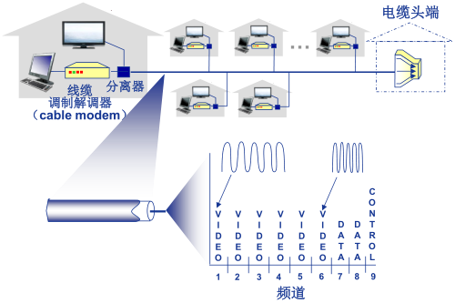

  - **频分多路复用** :  在不同频带（载波）上传输不同频道

  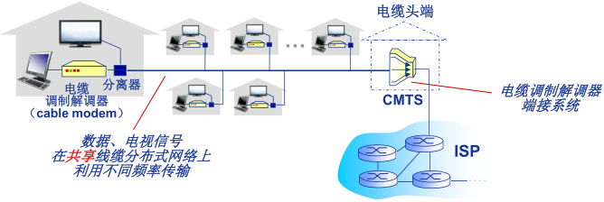

  - **HFC**: 混合光纤同轴电缆（ hybrid fiber coax ）
    - 非对称:  下行高达30Mbps 传输速率，上行为2 Mbps传输速率
  - 各家庭（设备）通过电缆网络→ 光纤接入ISP 路由器
    - 各家庭 **共享** 家庭至电缆头端的络 **接入网络**
    - 不同于DSL的 的 **独占** 至中心局的接入

- **典型家庭网络的接入**

  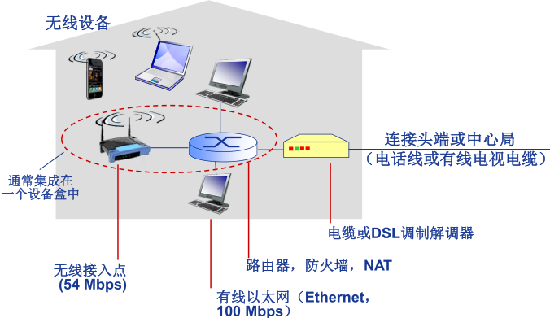

- **机构（企业）接入网络 (Ethernet)**

  

  - 主要用于公司、高校、企业等组织机构
  - 典型传输速率：10 Mbps, 100Mbps, 1Gbps, 10Gbps
  - 目前，端系统通常直接连接以太网交换机（switch）

-  **无线接入网络**

  - 通过**共享**的 无线接入网络连接端系统与路由器
    - 通过**基站**（base station）或称为“**接入点**”（access point）
  - **无线局域网（LANs ）**:
    - 同一建筑物内 (30m)
    - 802.11b/g (WiFi): 11Mbps、
    - 54Mbps传输速率
  - **广域无线接入：**
    - 通过电信运营商 (蜂窝网) ，接入范围在几十公里~
    - 带宽：1 Mbps、10 Mbps、100Mbps
    - 3G、 4G: LTE
    - 移动互联网

#### 三、接入核心

- 网络核心（核心网络）

  - 互联的路由器（或分组转发设备）
  - 网络之网络

- **网络核心**的关键功能: **路由+转发**

  

- **Internet 结构:  网络之网络**

  - 端系统通过入 接入**ISP （access ISPs  ）**连接到 Internet
    - 家庭、公司和大学ISPs
  - 接入ISP 必须进一步互连
    - 这样任意两个主机才可以互相发送分组
  - 构成复杂的网络互连的网络
    - 经济和国家政策是网络演进的主要驱动力
  - 当前Internet 结构？
    - 无人能给出精确描述
  - 连接方式：
    - **区域网络（regional networks）**连接接入ISP和运营商ISP
    - **内容提供商网络（content provider networks）** ，如： Google,
      Microsoft 等) 
  
  
  
- 在网络中心: 少数互连的大型网络

  -  **“一级” (tier-1) 商业ISPs** (如：网通、电信、Sprint、 AT&T)，提供国家或国际范围的覆盖
  - **内容提供商网络（content provider network， 如：Google)**：私有网络，连接其数据中心与Internet，通常绕过一级ISP和区域ISPs


### 第三节 数据交换技术

#### 一、数据交换概念

- 为什么需要数据交换？

  

- 什么是交换？

  - 动态转接

    

  - **动态分配传输资源**

- 数据交换的类型

  1. 电路交换
  2. 报文交换
  3. 分组交换

#### 二、电路交换

- 电路交换的特点

  - 最典型电路交换网络：电话网络
  - 电路交换的三个阶段：
    1. 建立连接（呼叫/电路建立）
    2. 通信
    3. 释放连接（拆除电路）
  - **独占资源**

  

- **多路复用（Multiplexing）**：简称复用，是通信技术中的基本概念

  

  

  - **多路复用(Multiplexing):** 

    - 链路/网络资源（如带宽）划分为“资源片”
    - 将资源片分配给各路“呼叫”（calls）
    - 每路呼叫**独占**分配到的资源片进行通信
    - 资源片可能“**闲置”(idle)**(无共享)

  - **典型多路复用方法:**

    - **频分多路复用**( frequency division multiplexing-**FDM** )

      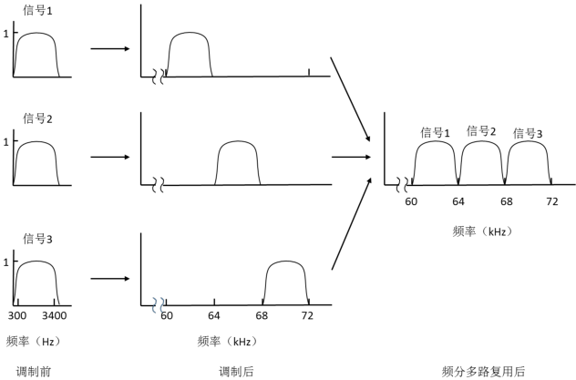

      - **频分多路复用**的各用户占用不同的带宽资源（请注意，这里的“带宽”是**频率带宽（单位：Hz）**而不是数据的发送速率）
      - 用户在分配到一定的频带后，在通信过程中自始至终都占用这个频带

      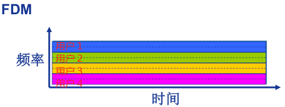

    - **时分多路复用**( time division multiplexing-**TDM** )

      - **时分复用**则是将时间划分为一段段等长的**时分复用帧（TDM 帧）**，每个用户在每个 TDM 帧中占用固定序号的**时隙**
      - 每用户所占用的时隙是**周期性出现**（其周期就是TDM 帧的长度）

      

      - 时分复用的所有用户是在不同的时间占用**相同的频带宽度**

      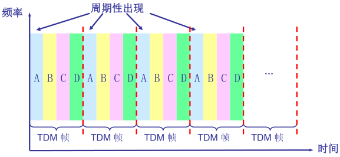

    - **波分多路复用**(Wavelength division multiplexing-**WDM**)

      - 波分复用就是光的频分复用

      

      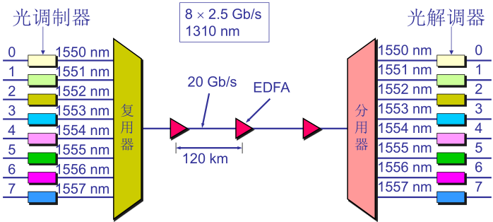

      

    - **码分多路复用**( Code division multiplexing-**CDM** )

      -  广泛应用于无线链路共享 (如蜂窝网,卫星通信等)

      - 每个用户分配一个唯一的 **mbit码片序列 (chippingsequence)**，其中“0”用**“-1”**表示、“1”用**“+1”**表示，例如：

        - S 站的码片序列：(–1 –1 –1 +1 +1 –1 +1 +1)

      - 各用户使用**相同频率载波**，利用各自码片序列编码数据

      - **编码信号 = (原始数据) × (码片序列)**

        - 如发送比特 1（+1），则发送自己的 **m bit 码片序列**
        - 如发送比特 0（-1），则发送该码片序列的**m bit 码片序列的反码**

      - 各用户码片序列相互**正交 (orthogonal)**

        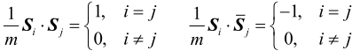

      - 令${d_i }$为原始数据序列，各用户的叠加向量为

        

      - 解码 : 码片序列与编码信号的内积

        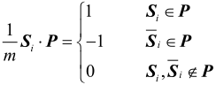

      单用户：

      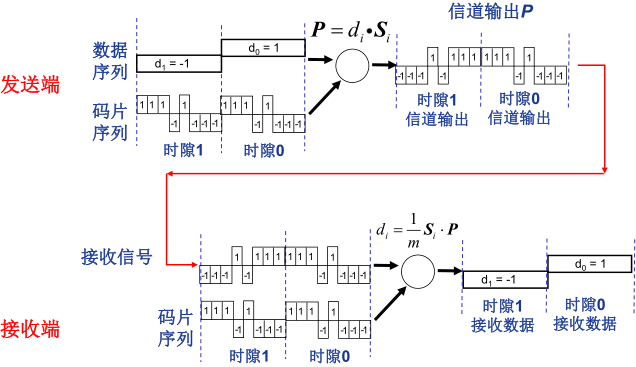

      多用户：

      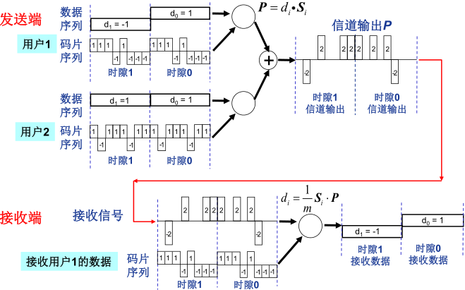

#### 三、报文交换

- **报文交换（message switching）**

  - **报文**：源（应用）发送信息整体
    - 比如：一个文件

  

  

#### 四、分组交换

- **分组交换（package switching ）**

  - **分组**：报文分拆出来的一系列相对较小的数据包

    

  - 分组交换需要报文的**拆分**与**重组**

  - 产生**额外开销**

  

  

- **分组交换: 统计多路复用（Statistical Multiplexing ）**

  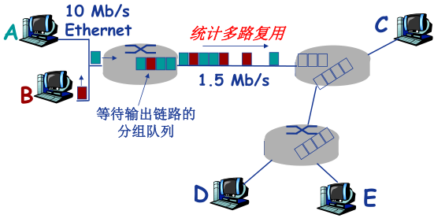

  - A & B分组序列不确定，**按需共享链路**
    - statistical multiplexing.

- **存储- 转发（store-and-forward ）**

  

  - **报文交换**与**分组交换**均采用**存储-转发**交换方式
  - 区别：
    - 报文交换以**完整报文**进行“存储-转发”
    - 分组交换以**较小的分组**进行“存储-转发”

- **分组交换:  传输延迟**

  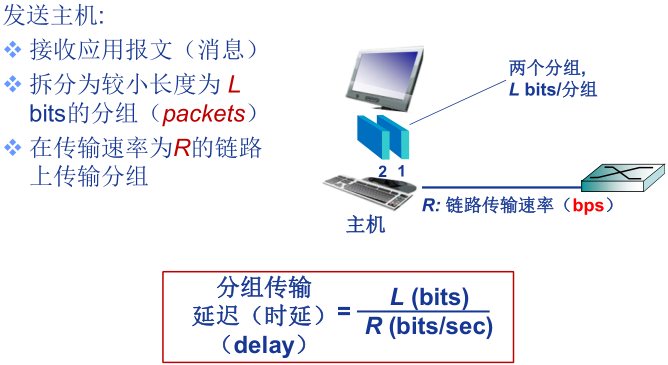

- **报文交换 vs  分组交换**

  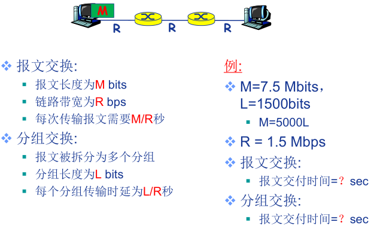

  

  

- **分组交换的报文交付时间**

  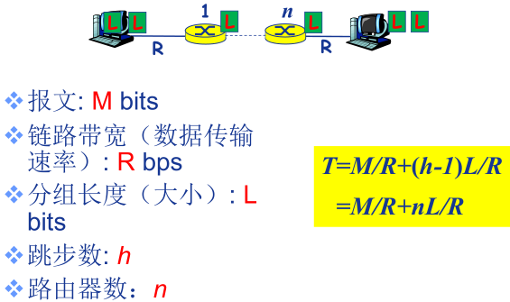


**例题1.1**

- 在下图所示的采用“存储-转发”方式的分组交换网络中，所有链路的数据传输速率为100 Mbps，分组大小为1 000 B，其中分组头大小为20 B。若主机H1向主机H2发送一个大小为980 000 B的文件，则在不考虑分组拆装时间和传播延迟的情况下，从H1发送开始到H2接收完为止，需要的时间至少是多少？

  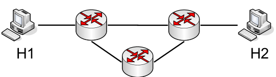

  - 【 解】980 000 B大小的文件需要分1000个分组，每个分组1 000 B。H1发送整个文件需要的传输延迟为`(980 000+20*1000)*8/100 000 000=80ms`；根据路由选择基本原理，所有数据分组应该经过两个路由器的转发，所以再加上最后一个分组的两次转发的传输延迟，即`2*1000*8/100 000 000=0.16ms`。所以，H2收完整个文件至少需要80+0.16=80.16ms。


- **分组交换 vs  电路交换**

  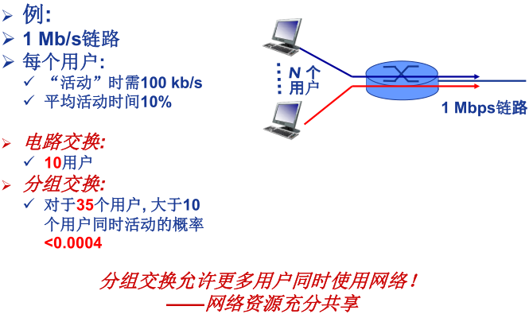

  - 分组交换绝对优于电路交换？
    - 分组交换适用于 **突发** 数据传输网络
      - 资源充分共享
      - 简单、无需呼叫建立
    - 可能**产生拥塞（congestion ）**:  分组延迟和丢失
      - 需要协议处理可靠数据传输和拥塞控制
    - Q:  **如何提供电路级性能保障?**
      - 例如，音/视频应用所需的带宽保障


### 第四节 计算机网络性能

#### 一、速率与带宽

- **速率**

  - 速率即**数据率**(data rate)或称**数据传输速率**或**比特率**(bit rate)
    - 单位时间（秒）传输信息（比特）量
    - 计算机网络中最重要的一个性能指标
    - 单位：b/s（或bps）、kb/s、Mb/s、Gb/s
    - $k=10^3 、M=10^6 、G=10^9$
  - 速率往往是指**额定速率**或**标称速率**

- **带宽**

  - “**带宽**”(bandwidth)：原本指信号具有的**频带宽度**，即**最高频率与最低频率之差**，单位是**赫兹（Hz）**
  - 网络的“带宽”：通常是数字信道所能传送的“**最高数据率**”，单位：**b/s (bps)**
  - 常用的带宽单位:
    - kb/s （$10^3 b/s$）
    - Mb/s（$10^ 6 b/s$）
    - Gb/s（$10^ 9 b/s$）
    - Tb/s（$10^ {12} b/s$）

  

#### 二、时延

- **延迟/ 时延**(delay 或latency)

  - Q:分组交换为什么会发生丢包和时延?
    A:分组在路由器缓存中排队
  - 分组到达速率超出输出链路容量时
  - 分组排队，等待输出链路可用

  

- **四种分组延迟**

  

  - $d_{proc}$ : **结点处理延迟**（nodal processing delay）
    - 差错检测
    - 确定输出链路
    - 通常`<msec`
  - $d_{queue}$ : **排队延迟**（queueing delay）
    - 等待输出链路可用
    - 取决于路由器拥塞程度

  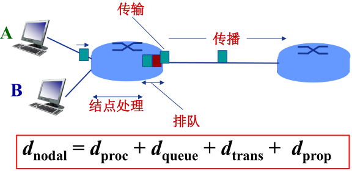

  - $d_{trans}$ : **传输延迟**（transmission delay）
    - L: 分组长度(bits)
    - R: 链路带宽 (bps)
    - $d_{trans}$ = L/R
  - $d_{prop}$ : **传播延迟**（propagation delay）
    -  d: 物理链路长度
    - s: 信号传播速度  ($铜\approx2×10 ^8m/sec$)
    - $d_{prop}$ = d/s

-  **类比：车队**

  

  - 车速为100 km/hr ~ 信号传播速度
  - 收费站放行一台车用时12 秒 ~ 比特传输时间
  - 车 ~ 比特；车队 ~ 分组
  - 车队通过收费站时间 ~ **传输延迟**（120秒）
  - 每台车从第一个收费站跑到第二个收费站用时~ **传播延迟**（1小时）

- **排队延迟**

  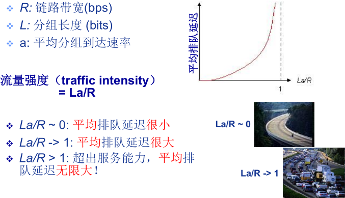


#### 三、时延带宽积

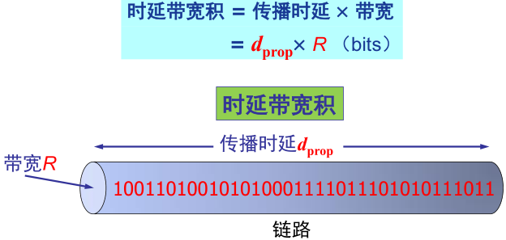

- 链路的时延带宽积又称为**以比特为单位的链路长度**


#### 四、丢包率

- **分组丢失**（丢包）

  - 队列缓存容量有限
  - 分组到达已满队列将被丢弃 (即丢包)
  - 丢弃分组可能由前序结点或源重发（也可能不重发）

  

  

#### 五、吞吐率

- 吞吐量/ 率（Throughput ）

  - 吞吐量 :表示在发送端与接收端之间传送数据速率 (b/s)
    - 即时 吞吐量: 给定时刻的速率
    - 平均吞吐量 : 一段时间的平均速率

  

- 瓶颈链路（ bottleneck link ）

  - 端到端路径上，限制端到端吞吐量的链路。

  

- 吞吐量: Internet 场景

  

### 第五节 计算机网络体系结构

#### 一、计算机网络分层体系结构

- 为什么需要计算机网络体系结构

  - 计算机网络是一个非常复杂的系统 , 涉及许多组成部分 :
    - 主机（hosts）
    - 路由器（routers）
    - 各种链路（links）
    - 应用（applications）
    - 协议（protocols）
    - 硬件、软件

- 何为计算机网络的体系结构？

  - 网络体系结构是从**功能**上描述计算机网络结构
  - 计算机网络体系结构简称网络体系结构(network architecture)是**分层结构**
  - 每层遵循某个/些**网络协议**完成本层功能
  - **计算机网络体系结构**是计算机网络的各层及其协议的集合
  - 体系结构是一个计算机网络的功能层次及其关系的**定义**
  - 体系结构是**抽象的**

- 为什么采用分层结构?

  - 结构清晰，有利于识别复杂系统的部件及其关系
    - 分层的参考模型（reference model ）
  - 模块化的分层易于系统更新、维护
    - 任何一层服务实现的改变对于系统其它层都是透明的
    - 例如，登机过程的改变并不影响航空系统的其它部分（层）
  - 有利于标准化
  - 分层是否有不利之处？

- 分层网络体系结构基本概念

  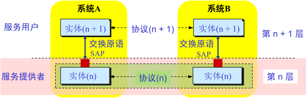

  - **实体(entity)**  表示任何可发送或接收信息的硬件或软件进程。
  - 协议是控制 **两个对等实体** 进行通信的规则的集合，协议 是 “ **水平的** ”  。
  - 任一层实体 需要使用 **下层** 服务，遵循本层协议，实现本层功能， 向 **上层** 提供 服务 ，服务是“ **垂直的** ” 。
  - 下层协议的实现对上层的 服务用户是 **透明** 的。
  - 同系统的相邻层 实体 间通过 **接口** 进行交互，通过 **服务访问点 SAP**(Service Access Point) ，交换 **原语** ，指定请求的特定服务。

#### 二、OSI 参考模型


- **OSI 参考模型解释的通信过程**

  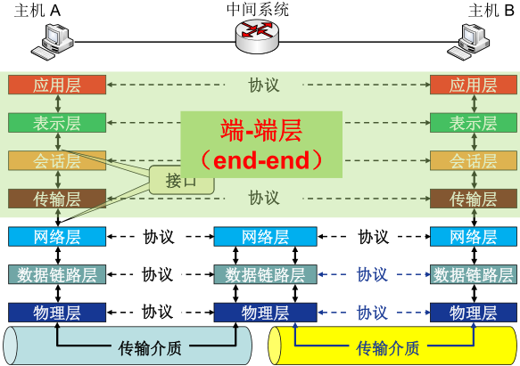

- **OSI 参考模型数据封装与通信过程**

  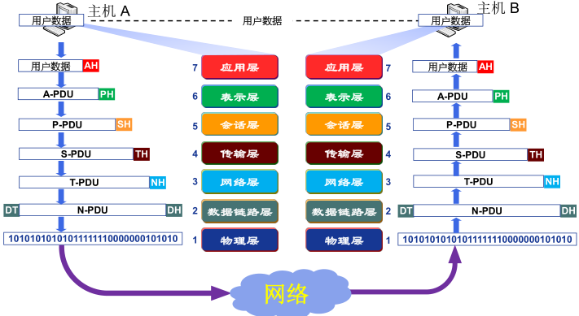

- **为什么需要数据封装 ？**

  - 增加**控制信息**
    - 构造协议数据单元 (PDU)
  - 控制信息主要包括:
    - **地址（Address）**: 标识发送端/接收端
    - **差错检测编码（Error-detecting code）**: 用于差错检测或纠正
    - **协议控制（Protocol control）**: 实现协议功能的附加信息，如: 优先级（priority）、服务质量（QoS）、 和安全控制等


**七层模型的功能**

1. **物理层功能**

   

   - **接口特性**
     - 机械特性、电气特性、功能特性、规程特性
   - **比特编码**
   - **数据率**
   - **比特同步**
     - 时钟同步
   - **传输模式**
     1. 单工（Simplex）
     2. 半双工（half-duplex）
     3. 全双工（full-duplex）

2. **数据链路层功能**

   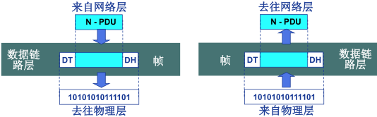

   - 负责**结点- 结点（node-to-node）**  数据传输
   - **组帧（Framing ）**
   - **物理寻址（Physical addressing ）**
     - 在帧头中增加发送端和/或接收端的**物理地址**标识数据帧的发送端和/或接收端

   

   - **流量控制（Flow control）**
     - 避免淹没接收端
   - **差错控制（Error control）**
     - 检测并重传损坏或丢失帧，并避免重复帧
   - **访问(接入)控制（Access control）**
     - 在任一给定时刻决定哪个设备拥有链路（物理介质）控制使用权

3. **网络层功能**

   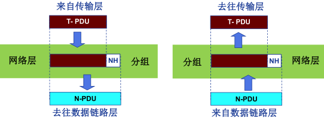

   - 负责**源主机到目的主机**数据分组（packet）交付
     - 可能穿越多个网络
   - **逻辑寻址（Logical addressing）**
     - 全局唯一逻辑地址，确保数据分组被送达目的主机，如IP地址
   - **路由（Routing）**
     - 路由器(或网关)互连网络，并路由分组至最终目的主机
     - 路径选择
   - **分组转发**

   

   

4. **传输层功能**

   

   - 负责 **源—目的（端—端）** （进程间） **完整报文传输**
   - **分段与重组**
   - **SAP寻址**
     - 确保将完整报文提交给正确进程，如端口号

   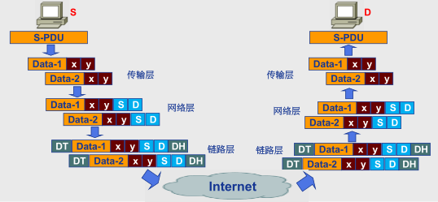

   - **连接控制**
   - **流量控制**
   - **差错控制**

5. **会话层功能**

   

   - **对话控制（dialog controlling）**
     - 建立、维护
   - **同步(synchronization)**
     - 在数据流中插入“同步点”
   - 最“**薄**”的一层

6. **表示层功能**

   

   处理两个系统间交换信息的 **语法与语义（syntax and semantics ）**问题

   - **数据表示转化**
     - 转换为主机独立的编码
   - **加密/解密**
   - **压缩/解压缩**

7. **应用层功能**

   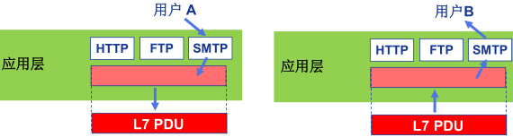

   - 支持用户通过用户代理（如浏览器）或网络接口**使用网络（服务）**
   - 典型应用层服务：
     - 文件传输（FTP）
     - 电子邮件（SMTP）
     - Web（HTTP）


#### 三、TCP/IP 参考模型


#### 四、五层参考模型

综合 OSI 和 TCP/IP 的优点

1. **应用层** : 支持各种网络应用
   - FTP, SMTP, HTTP
2. **传输层** : 进程-进程的数据传输
   - TCP, UDP
3. **网络层** : 源主机到目的主机的数据分组路由与转发
   - IP协议、路由协议等
4. **链路层** : 相邻网络元素（主机、交换机、路由器等）的数据传输
   - 以太网（Ethernet）、802.11 (WiFi)、PPP
5. **物理层** :比特传输


**5 层模型的数据封装**


### 第六节 计算机网络与因特网发展简史


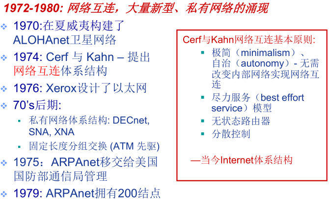


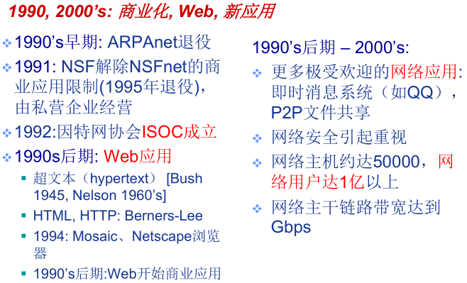


## 第二章 网络应用

- 重点：
  - 理解网络应用体系结构、特点与通信基本原理，掌握 DNS 域名解析过程、HTTP、SMTP、POP、FTP、P2P 应用，了解 Socket 编程基础
- 难点：
  - 是网络应用通信基本原理
  - 典型应用层协议
  - P2P 文件分发
  - Socket 编程基础
- 考点
  - 网络应用体系结构
    - 客户/服务器（C/S）结构，一般网络应用都是C/S
    - 纯P2P（Peer to Peer）结构，对等通信
    - 混合结构
  - 应用通信原理
    - 基本通信方式都是C/S通信
    - 典型的网络应用编程接口是套接字（Socket）
    - 一个应用进程对应多个传输层协议
    - 每个传输层协议对应一个套接字，通过端口号标识该套接字
  - DNS
    - 层次化域名空间，域名分类
    - 四类域名服务器
    - ♣域名解析过程
  - 应用协议
    - ♣HTTP，WEB应用，理解图2.10/11/12/13，课后习题5/7/9
    - SMTP，用于发送邮件，理解图2.17，邮箱格式
    - 读取邮件有POP3、IMAP、HTTP
    - FTP，文件传送协议，包含两个连接
    - P2P，理解公式2-1和2-3，课后习题13
  - Socket编程
    - 3种类型Socket
    - 典型的Socket API函数
  - 综合题
    - HTTP应用连接，课后习题9
    - P2P文件分发时间，课后习题13
  - 简答题
    - 本章小结最后5段，出5个简答题
    - 介绍HTTP连接方式与过程
    - SMTP发送邮件过程
    - FTP文件传输过程
    - P2P文件分发特点
    - Socket分类和功能


### 第一节 计算机网络应用体系结构

#### 一、客户/服务器（C/S, Client-Server）结构网络应用

- **服务器**
  - `7*24`小时提供服务
  - 永久性访问地址/域名
  - 利用大量服务器实现可扩展性
- **客户机**
  - 与服务器通信，使用服务器提供的服务
  - 间歇性接入网络
  - 可能使用动态IP地址
  - 不会与其他客户机直接通信


#### 二、纯P2P 结构 (Peer-to-peer, P2P) 网络应用

- 没有永远在线的服务器
  - 任意端系统/节点之间可以直接通讯
  - 节点间歇性接入网络
  - 节点可能改变IP地址
- 优点：高度可伸缩
- 缺点：难于管理

#### 三、混合网络应用 (Hybrid)

- Napster
  - 文件传输使用P2P结构
  - 文件的搜索采用C/S结构——集中式
    - 每个节点向中央服务器登记自己的内容
    - 每个节点向中央服务器提交查询请求，查找感兴趣的内容

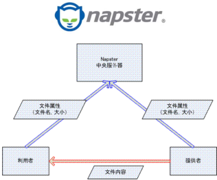


### 第二节 网络应用通信基本原理

- **网络应用的基础：进程间通信**

  - 进程：
    - 主机上运行的程序
  - 同一主机上运行的进程之间如何通信？
    - 进程间通信机制
    - 操作系统提供
  - 不同主机上运行的进程间如何通信？
    - 消息交换
  - **客户机进程**: 发起通信的进程
  - **服务器进程**: 等待通信请求的进程

- **套接字: Socket**

  

  - 进程间通信利用socket发送/接收消息实现
  - 类似于寄信
    - 发送方将消息送到门外邮箱
    - 发送方依赖（门外的）传输基础设施将消息传到接收方所在主机，并送到接收方的门外
    - 接收方从门外获取消息
  - 传输基础设施向进程提供**API**
    - 传输协议的选择
    - 参数的设置

- **如何寻址进程？**

  - 不同主机上的进程间通信，那么每个进程必须拥有标识符
  - 如何寻址主机？——**IP地址**
    - Q: 主机有了IP地址后，是否足以定位进程？
    - A: 否。同一主机上可能同时有多个进程需要通信。
  - **端口号/Port number**
    - 为主机上每个需要通信的进程分配一个端口号
    - HTTP Server: 80
    - Mail Server: 25
  - **进程的标识符**
    - IP地址+端口号

  

- **应用层协议**

  - 网络应用需遵循应用层协议
  - 公开协议
    - 由**RFC(Request For Comments)**定义
    - 允许互操作
    - HTTP, SMTP, …
  - 私有协议
    - 多数P2P文件共享应用

- **应用层协议的内容**

  1. 消息的**类型(type)**
     - 请求消息
     - 响应消息
  2. 消息的**语法(syntax)**/格式
     - 消息中有哪些字段(field)？
     - 每个字段如何描述
  3. 字段的**语义(semantics)**
     - 字段中信息的含义
  4. **规则(rules)**
     - 进程何时发送/响应消息
     - 进程如何发送/响应消息

  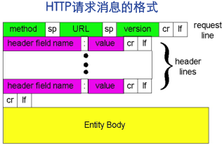

#### 附：网络应用的需求与传输层服务

- **网络应用对传输服务的需求**

  - **数据丢失(data loss)/可靠性(reliability)**
    - 某些网络应用能够容忍一定的数据丢失：网络电话
    - 某些网络应用要求100%可靠的数据传输：文件传输，telnet
  - **时间(timing)/延迟(delay)**
    - 有些应用只有在延迟足够低时才“有效”
    - 网络电话/网络游戏
  - **带宽(bandwidth)**
    - 某些应用只有在带宽达到最低要求时才“有效”：网络视频
    - 某些应用能够适应任何带宽——弹性应用：email

- **典型网络应用对传输服务的需求**

  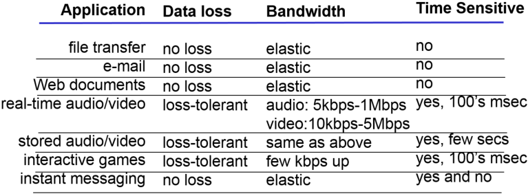

- **Internet 提供的传输服务**

  - **TCP服务**
    - **面向连接**: 客户机/服务器进程间需要建立连接
    - **可靠的传输**
    - **流量控制**: 发送方不会发送速度过快，超过接收方的处理能力
    - **拥塞控制**: 当网络负载过重时能够限制发送方的发送速度
    - 不提供时间/ 延迟保障
    -  不提供最小带宽保障
  - **UDP服务**
    - 无连接
    - 不可靠的数据传输
    - 不提供：
      - 可靠性保障
      - 流量控制
      - 拥塞控制
      - 延迟保障
      - 带宽保障

- **典型网络应用所使用的传输层服务**

  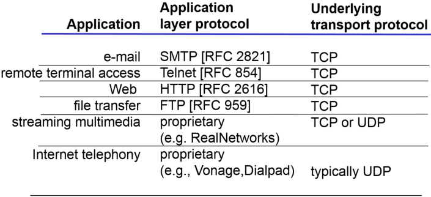

  

### 第三节 域名系统（DNS）

#### 一、层次化域名空间

- DNS ：Domain Name System

  - Internet上主机/路由器的**识别问题**
    - **IP地址**
    - 域名：www.hit.edu.cn
  - 问题：域名和IP地址之间如何映射？
  - **域名解析系统DNS**
    - 多层命名服务器构成的**分布式数据库**
    - **应用层协议**：完成名字的解析
      - Internet**核心**功能，用**应用层**协议实现
      - 网络边界复杂

- DNS服务

  - 域名向IP地址的翻译
  - 主机别名
  - 邮件服务器别名
  - 负载均衡：Web服务器

- 问题：为什么不使用集中式的DNS？

  - 单点失败问题
  - 流量问题
  - 距离问题
  - 维护性问题

- 分布式层次式数据库

  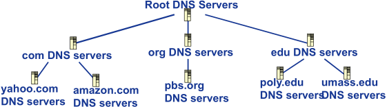

  - 客户端想要查询www.amazon.com的IP
    - 客户端查询根服务器，找到com域名解析服务器
    - 客户端查询com域名解析服务器，找到amazon.com域名解析服务器
    - 客户端查询amazon.com域名解析服务器，获得www.amazon.com的IP地址

#### 二、DNS 域名服务器

- **本地域名解析服务器**无法解析域名时，访问**根域名服务器**

- 根域名服务器

  - 如果不知道映射，访问权威域名服务器
  - 获得映射
  - 向本地域名服务器返回映射

  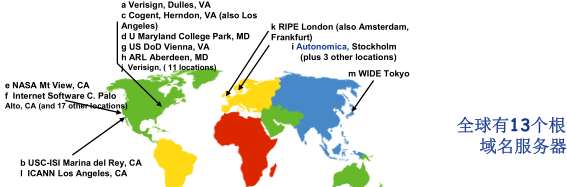

- TLD 和权威域名解析服务器

  - 顶级域名服务器(TLD, top-level domain): 负责com, org, net,edu等顶级域名和国家顶级域名，例如cn, uk, fr等
    - Network Solutions维护com顶级域名服务器
    - Educause维护edu顶级域名服务器
  - 权威(Authoritative)域名服务器：组织的域名解析服务器，提供组织内部服务器的解析服务
    - 组织负责维护
    - 服务提供商负责维护

- 本地域名解析服务器

  - 不严格属于层级体系
  - **每个ISP有一个本地域名服务器**
    - 默认域名解析服务器
  - 当主机进行DNS查询时，查询被发送到本地域名服务器
    - 作为代理(proxy)，将查询转发给（层级式）域名解析服务器系统

  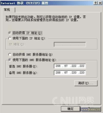

  

#### 三、域名解析过程

- DNS查询示例

  - Cis.poly.edu 的主机想获得 gaia.cs.umass.edu 的IP地址
  - **迭代查询**
    - 被查询服务器返回域名解析服务器的名字
    - “我不认识这个域名，但是你可以问题这服务器”

  

  - **递归查询**
    - 将域名解析的任务交给所联系的服务器

  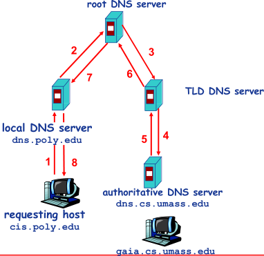

- 例题

  - 如果本地域名服务器无缓存，当采用递归方法解析另一网络某主机域名时，用户主机、本地域名服务器发送的域名请求消息数分别为
    - A．一条、一条
    - B．一条、多条
    - C．多条、一条
    - D．多条、多条
  - 【解析】域名递归解析过程中，主机向本地域名服务器发送DNS查询，被查询的域名服务器代理后续的查询，然后返回结果。所以，递归查询时，如果本地域名服务器无缓存，则主机和本地域名服务器都仅需要发送一次查询，故正确答案为查询，被查询的域名服务器代理后续的查询，然后返回结果。所以，递归查询时，如果本地域名服务器无缓存，则主机和本地域名服务器都仅需要发送一次查询，故正确答案为A。

- **DNS 记录缓存和更新**

  - 只要域名解析服务器获得域名—IP映射，即缓存这一映射
    - 一段时间过后，缓存条目失效（删除）
    - 本地域名服务器一般会缓存顶级域名服务器的映射
      - 因此根域名服务器不经常被访问
  - 记录的更新/通知机制
    - RFC 2136
    - Dynamic Updates in the Domain Name System (DNS UPDATE)

#### 附：DNS 记录和消息格式

- **DNS 记录**

  - 资源记录(RR, resourcerecords) 
    - `RR format:  (name, value, type, ttl)`
  - `Type=A`
    - `Name: 主机域名`
    - `Value: IP地址`
  - `Type=NS`
    - `Name: 域(edu.cn)`
    - `Value: 该域权威域名解析服务器的主机域名`
  - `Type=CNAME`
    - `Name: 某一真实域名的别名`
      -  www.ibm.com –servereast.backup2.ibm.com
    - `Value: 真实域名`
  - `Type=MX`
    - `Value是与name相对应的邮件服务器`

- **DNS 协议与消息**

  - DNS协议：
    - 查询(query)和回复(reply消息)
    - 消息格式相同
  - 消息头部
    - Identification: 16位查询编号，回复使用相同的编号
    - flags
      - 查询或回复
      - 期望递归
      - 递归可用
      - 权威回答

  

- 如何注册域名？

  - 例子：你刚刚创建了一个公司 “Network Utopia”

  - 在域名管理机构(如Network Solutions)注册域名networkutopia.com

    - 向域名管理机构提供你的权威域名解析服务器的名字和IP地址
    - 域名管理机构向com顶级域名解析服务器中插入两条记录

    

  - 在权威域名解析服务器中为www.networkuptopia.com 加入Type  A记录，为networkutopia.com加入Type MX记录


### 第四节 万维网应用

#### 一、万维网应用结构

- Web 与HTTP

  - **World Wide Web**: Tim Berners-Lee
    - 网页
    - 网页互相链接
  - **网页(Web Page)**包含多个对象(objects)
    - 对象：HTML文件、JPEG图片、视频文件、动态脚本等
    - 基本HTML文件：包含对其他对象引用的链接
  - **对象的寻址(addressing)**
    - URL(Uniform Resoure Locator)：统一资源定位器 RFC1738
    - `Scheme://host:port/path`

  


#### 二、HTTP

- HTTP 协议概述

  - **超文本传输协议**
    - HyperText Transfer Protocol
  - **C/S结构**
    - 客户—Browser：请求、接收、展示Web对象
    - 服务器—Web Server：响应客户的请求，发送对象
  - **HTTP版本**：
    - 1.0： RFC 1945
    - 1.1： RFC 2068
  - 使用**TCP**传输服务
    - 服务器在80端口等待客户的请求
    - 浏览器发起到服务器的TCP连接(创建套接字Socket)
    - 服务器接受来自浏览器的TCP连接
    - 浏览器(HTTP客户端)与Web服务器(HTTP服务器)交换HTTP消息
    - 关闭TCP连接
  - **无状态(stateless)**
    - 服务器不维护任何有关客户端过去所发请求的信息
    - 有状态的协议更复杂:
      - 需维护状态( 历史信息)
      - 如果客户或服务器失效，会产生状态的不一致，解决这种不一致代价高

- **HTTP 连接**

  - HTTP 连接的两种类型
    1. **非持久性连接(Nonpersistent HTTP)**
       - 每个TCP连接最多允许传输一个对象
       - HTTP 1.0版本使用非持久性连接
    2. **持久性连接(Persistent HTTP)**
       - 每个TCP连接允许传输多个对象
       - HTTP 1.1版本默认使用持久性连接

- **非持久性连接**

  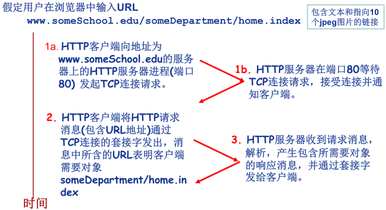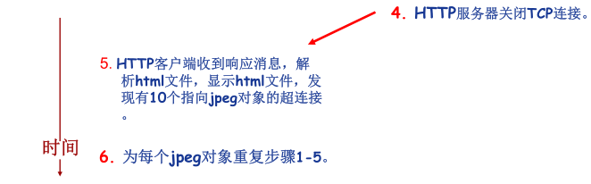

  - **响应时间分析与建模**

    - **RTT(Round Trip Time)**
      - 从客户端发送一个很小的**数据包到服务器并返回**所经历的时间
    - **响应时间(Response time)**
      - 发起、建立TCP连接：1个RTT
      - 发送HTTP请求消息到HTTP响应消息的前几个字节到达：1个RTT
      - 响应消息中所含的文件/对象传输时间
      - Total=2RTT +文件发送时间

    

- **持久性HTTP**

  - 非持久性连接的问题
    - 每个对象需要2个RTT
    - 操作系统需要为每个TCP连接开销资源(overhead)
    - 浏览器会怎么做？
      - 打开多个并行的TCP连接以获取网页所需对象
      - 给服务器端造成什么影响？
  - **持久性连接**
    - 发送响应后，服务器保持TCP连接的打开
    - 后续的HTTP消息可以通过这个连接发送
  - **无流水(pipelining)的持久性连接**
    - 客户端只有收到前一个响应后才发送新的请求
    - 每个被引用的对象耗时1个RTT
  - **带有流水机制的持久性连接**
    - HTTP 1.1的默认选项
    - 客户端只要遇到一个引用对象就尽快发出请求
    - 理想情况下，收到所有的引用对象只需耗时约1个RTT

- **HTTP 消息格式**

  - HTTP协议有两类消息
    1. **请求消息(request)**
       - ASCII：人直接可读
    2. **响应消息(response)**

  

- **HTTP 请求消息的通用格式**

  

- **上传输入的方法**

  1. **POST方法**

     - 网页经常需要填写表格(form)
     - 在请求消息的消息体(entity body)中上传客户端的输入

  2. **URL方法**

     - 使用GET方法
     - 输入信息通过request行的URL字段上传

     > 例如：www.somesite.com/animalsearch?monkeys&banana

  3. **方法的类型**

     1. HTTP/1.0
        - GET
        - POST
        - HEAD
          - 请Server不要将所请求的对象放入响应消息中
     2. HTTP/1.1
        - GET, POST, HEAD
        - PUT
          - 将消息体中的文件上传到URL字段所指定的路径
        - DELETE
          - 删除URL字段所指定的文件

- **HTTP 响应消息**

  

- **HTTP 响应状态代码**

  - 响应消息的第一行
  - 示例
    - 200 OK
    - 301 Moved Permanently
    - 400 Bad Request
    - 404 Not Found
    - 505 HTTP Version Not Supported

#### 三、Cookie

- 为什么需要Cookie ？

  - HTTP协议无状态
  - 很多应用需要服务器掌握客户端的状态，如网上购物，如何实现？

- **Cookie 技术**

  - 某些网站为了辨别用户身份、进行session跟踪而储存在用户本地终端上的数据（通常经过加密）。
  - RFC6265

- **Cookie的组件**

  - HTTP响应消息的cookie头部行
  - HTTP请求消息的cookie头部行
  - 保存在客户端主机上的cookie文件，由浏览器管理
  - Web服务器端的后台数据库

- **Cookie 的原理**

  

- **Cookie 的作用**

  - Cookie能够用于：
    - 身份认证
    - 购物车
    - 推荐
    - Web e-mail
  - 隐私问题
    - Cookie能够怎样被用于收集隐私？
    - 能够收集哪些隐私？
    - 你在上网的时候感觉到自己的隐私被严重侵犯吗？

#### 附：Web 缓存/ 代理服务器技术

- 功能

  - 在不访问服务器的前提下满足客户端的HTTP请求。

- 为什么要发明这种技术？

  - 缩短客户请求的响应时间
  - 减少机构/组织的流量
  - 在大范围内(Internet)实现有效的内容分发

- Web缓存/代理服务器

  - 用户设定浏览器通过缓存进行Web访问
  - 浏览器向缓存/代理服务器发送所有的HTTP请求
    - 如果所请求对象在缓存中，缓存返回对象
    - 否则，缓存服务器向原始服务器发送HTTP请求，获取对象，然后返回给客户端并保存该对象
  - 缓存既充当客户端，也充当服务器
  - 一般由ISP(Internet服务提供商)架设

  

- Web 缓存示例(1)

  - 假定：
    - 对象的平均大小=100,000比特
    - 机构网络中的浏览器平均每秒有15个到原始服务器的请求
    - 从机构路由器到原始服务器的往返延迟=2秒
  - 网络性能分析：
    - 局域网(LAN)的利用率=15%
    - 接入互联网的链路的利用率=100%
    - 总的延迟=互联网上的延迟+访问延迟+局域网延迟=2秒+几分钟+几微秒

  

- Web 缓存示例(2)

  - 解决方案1：
    - **提升互联网接入带宽**=10Mbps
  - 网络性能分析：
    - 局域网(LAN)的利用率=15%
    - 接入互联网的链路的利用率=15%
    - 总的延迟=互联网上的延迟+访问延迟+局域网延迟=2秒+几微秒+几微秒
  - 问题：
    - 成本太高

  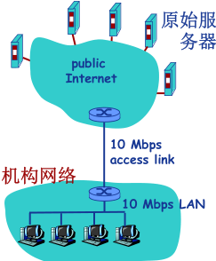

  - 解决方案2：
    - **安装Web缓存**
    - 假定缓存命中率是0.4
  - 网络性能分析：
    - 40%的请求立刻得到满足
    - 60%的请求通过原始服务器满足
    - 接入互联网的链路的利用率下降到60%，从而其延迟可以忽略不计，例如10微秒
    - 总的平均延迟=互联网上的延迟+访问延迟+局域网延迟=0.6×2.01秒+0.4×n微秒<1.4秒

  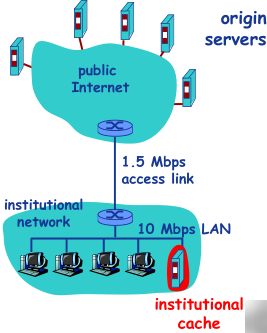

- **条件性GET方法**

  - 目标：
    - 如果缓存有最新的版本，则不需要发送请求对象
  - 缓存：
    - 在HTTP请求消息中声明所持有版本的日期
    - `If-modified-since: <date>`
  - 服务器：
    - 如果缓存的版本是最新的，则响应消息中不包含对象
    - HTTP/1.0 304 Not Modified

  


### 第五节 Internet 电子邮件

#### 一、电子邮件系统结构

- Email应用的构成组件
  - 邮件客户端(user agent)
  - 邮件服务器
  - SMTP协议(Simple Mail Transfer Protocol)
- 邮件客户端
  - 读、写Email消息
  - 与服务器交互，收、发Email消息
  - Outlook, Foxmail, Thunderbird
  - Web客户端
- **邮件服务器(Mail Server)**
  - 邮箱：存储发给该用户的Email
  - 消息队列(message queue)：存储等待发送的Email
- **SMTP协议**
  - 邮件服务器之间传递消息所使用的协议
  - 客户端：发送消息的服务器
  - 服务器：接收消息的服务器

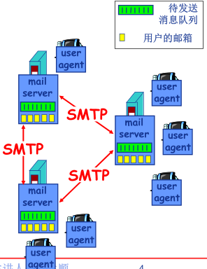

#### 二、SMTP协议：RFC 2821

- 使用TCP进行email消息的可靠传输
- 端口25
- 传输过程的三个阶段
  - 握手
  - 消息的传输
  - 关闭
- 命令/响应交互模式
  - **命令(command)**: ASCII文本
  - **响应(response)**: 状态代码和语句
- Email 消息只能包含7位ASCII码

- Email 应用示例：


- SMTP交互示例：


- 动手尝试SMTP交互：
  - `telnet servername 25`
  - 服务器返回代码220
  - 输入以下命令与SMTP服务器交互
    - HELO
    - MAIL FROM
    - RCPT TO
    - DATA
    - QUIT
- SMTP协议
  - 使用持久性连接
  - 要求消息必须由7位 ASCII 码构成
  - SMTP 服务器利用 CRLF.CRLF 确定消息的结束。
- 与HTTP对比:
  - HTTP: 拉式(pull)
  - SMTP: 推式(push)
  - 都使用命令/响应交互模式
  - 命令和状态代码都是ASCII码
  - HTTP: 每个对象封装在独立的响应消息中
  - SMTP: 多个对象在由多个部分构成的消息中发送

#### 三、电子邮件格式与 MIME

- SMTP：email消息的传输/交换协议

- RFC 822：文本消息格式标准

  - 头部行(header)（与SMTP命令不同）
    - To
    - From
    - Subject
  - 消息体(body)
    - 消息本身
    - 只能是ASCII字符

  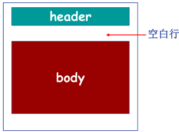

- **Email 消息格式：多媒体扩展**

  - **MIME：多媒体邮件扩展** RFC 2045, 2056
    - 通过在邮件头部增加额外的行以声明MIME的内容类型

  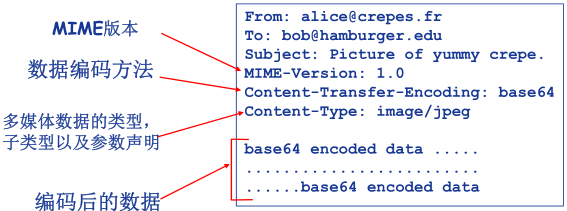

  

#### 四、邮件读取/访问协议

- 邮件访问协议：从服务器获取邮件
  - **POP**: Post Office Protocol [RFC 1939]
    - 认证/授权(客户端← →服务器)和下载
  - **IMAP**: Internet Mail Access Protocol [RFC 1730]
    - 更多功能
    - 更加复杂
    - 能够操纵服务器上存储的消息
  - **HTTP**：163, QQ Mail等。

- **POP 协议**

  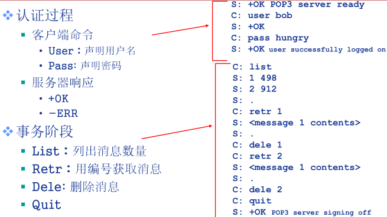

  - “下载并删除”模式
    - 用户如果换了客户端软件，无法重读该邮件
  - “下载并保持”模式：不同客户端都可以保留消息的拷贝
  - POP3是无状态的

- **IMAP协议**

  - 所有消息统一保存在一个地方：服务器
  - 允许用户利用文件夹组织消息
  - IMAP支持跨会话(Session)的用户状态:
    - 文件夹的名字
    - 文件夹与消息ID之间的映射等


### 第六节 FTP（缺失已补）

1. **文件传送协议（File Transfer Protocol，FTP）**，是在互联网的两个主机间实现文件互传的网络应用。

   1. 减少或消除不同操作系统下处理文件的不兼容性，屏蔽各计算机系统的细节，适合网络中任意异构计算机之间传送文件。
   2. C/S 架构，使用TCP协议交互以及文件传输。

2. FTP 服务器进程由两大部分组成：

   1. 主进程：接受新的客户请求；
   2. 若干从属进程，负责处理单个客户请求。实现同时为多用户服务。

3. 传输文件时，需要新建一个数据连接，完成后关闭

   1. 客户端发送给服务端21端口控制连接
   2. 服务端用20端口与客户端建立数据连接

   指令与数据分开传输称为：**带外控制（out-of-band control）**，如ftp；

   与之相反，指令和数据通过一个链接传输的应用层协议称为：**带内控制（in-band control）**，如http。

4. **FTP 会话**：7位 ASCⅡ 码格式传输

   - 每个FTP命令由 **4 个大写字母** ASCⅡ 组成
   - 常用命令：
     - `USER usename`：用于向服务器传送用户标识
     - `PASS password`：用于向服务器传送用户口令
     - `LIST`：用于请求服务器回送当前远程目录中的所有文件列表。列表由数据连接传送。
     - `RETR　filename`：从 FTP 服务器的当前目录下载文件。服务器发起数据连接，向客户发送所请求文件。
     - `STOR filename`：向 FTP 服务器的当前目录上传文件。
   - 每个 FTP 命令都对应一个从服务器发向客户的应答。每条应答由一个 3 位数字的状态码，后跟一个可选的短语信息构成。
     - `331 Usename OK, Password required`
     - `125 Data connection already open; transfer starting`
     - `425 Can't open data connection`

### 第七节 P2P 应用

#### 一、P2P 应用：原理与文件分发

- 纯P2P 架构

  - Peer-to-peer
  - 没有服务器
  - 任意端系统之间直接通信
  - 节点阶段性接入Internet
  - 节点可能更换IP地址

- **文件分发**：客户机/ 服务器 vs. P2P

  - 从一个服务器向N个节点分发一个文件需要多长时间?

  

  - 文件分发：客户机/ 服务器

    - 服务器串行地发送N个副本
      - 时间： $NF/u_s$
    - 客户机i需要$F/d_i $时间下载

    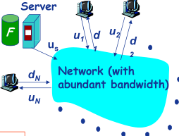

    

  - 文件分发：P2P

    - 服务器必须发送一个副本
      - 时间： $F/u_s$
    - 客户机i需要$F/d_i $时间下载
    - 总共需要下载$NF$比特
    - 最快的可能上传速率：$u_s +  \sum u_i$

    
    $$
    d_{P2P} = max  \{ \frac{F}{u_s} , \frac{F}{min(d_i )} ,  \frac{NF}{(u_s + \sum u_i )} \}
    $$

  -  例子：

    - 客户端上传速率= u, F/u = 1 小时, $u_s = 10u, d_{min} ≥ u_s$

    

- **文件分发：BitTorrent**

  

  - 文件划分为256KB的chunk

  - **节点加入torrent**

    - 没有chunk，但是会逐渐积累
    - 向tracker注册以获得节点清单，与某些节点（“邻居”）建立连接

  - 下载的同时，节点需要向其他节点上传chunk

    - 节点可能加入或离开

  - 一旦节点获得完整的文件，它可能（自私地）离开或（无私地）留下

  - **获取chunk**

    - 给定任一时刻，不同的节点持有文件的不同chunk集合
    - 节点(Alice)定期查询每个邻居所持有的chunk列表
    - 节点发送请求，请求获取缺失的chunk
      - 稀缺优先

  - 发送`chunk: tit-for-tat`

    - Alice向4个邻居发送chunk：正在向其发送Chunk，速率最快的4个
      - 每10秒重新评估top 4
    - 每30秒随机选择一个其他节点，向其发送chunk
      - 新选择节点可能加入top 4
      - “optimistically unchoke”

    

#### 二、P2P 应用：索引技术

- P2P:  搜索信息

  - P2P系统的**索引**：信息到节点位置(**IP地址+端口号**)的映射
  - **文件共享**(电驴)
    - 利用索引动态跟踪节点所共享的文件的位置
    - 节点需要告诉索引它拥有哪些文件
    - 节点搜索索引，从而获知能够得到哪些文件
  - **即时消息**(QQ)
    - 索引负责将用户名映射到位置
    - 当用户开启IM应用时，需要通知索引它的位置
    - 节点检索索引，确定用户的IP地址

- **集中式索引**

  - Napster最早采用这种设计
    1. 节点加入时，通知中央服务器：
       - IP地址
       - 内容
    2. Alice查找“Hey Jude”
    3. Alice从Bob处请求文件

  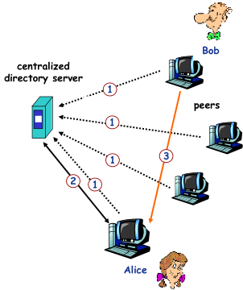

  - 集中式索引的问题
    - 单点失效问题
    - 性能瓶颈
    - 版权问题

- **洪泛式查询: Query flooding**

  - 完全分布式架构
  - Gnutella采用这种架构
  - 每个节点对它共享的文件进行索引，且只对它共享的文件进行索引
  - 覆盖网络(overlay network): Graph
    - 节点X与Y之间如果有TCP连接，那么构成一个边
    - 所有的活动节点和边构成覆盖网络
    - 边：虚拟链路
    - 节点一般邻居数少于10个
  - 查询消息通过已有的TCP连接发送
  - 节点转发查询消息
  - 如果查询命中，则利用反向路径发回查询节点

  

- **层次式覆盖网络**

  - 介于**集中式索引和洪泛查询之间**的方法
  - 每个节点或者是一个超级节点，或者被分配一个超级节点
    - 节点和超级节点间维持TCP连接
    - 某些超级节点对之间维持TCP连接
  - 超级节点负责跟踪子节点的内容

  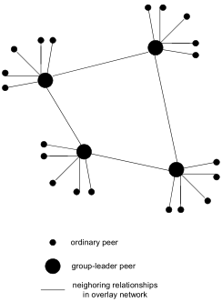

- **P2P 案例应用：Skype**

  - 本质上是P2P的：用户/节点对之间直接通信
  - 私有应用层协议
  - 采用层次式覆盖网络架构
  - 索引负责维护用户名与IP地址间的映射
  - 索引分布在超级节点上

  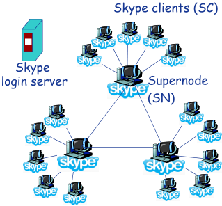

  


### 第八节 Socket 编程基础（重要）

#### 一、应用编程接口（API ）

1. **网络程序设计接口**

   

2. **应用编程接口 API**

   - 应用编程接口 API (Application Programming Interface)

   - 应用编程口接口API: 就是应用进程的控制权和操作系统的控制权进行转换的一个系统调用接口.

   

3. **几种典型的应用编程接口**

   1. Berkeley UNIX 操作系统定义了一种 API，称为套接字接口(socket interface)，简称**套接字（socket）**。
   2. 微软公司在其操作系统中采用了套接字接口 API，形成了一个稍有不同的 API，并称之为Windows Socket Interface，**WINSOCK**。
   3. AT&T 为其 UNIX 系统 V 定义了一种 API，简写为 **TLI** (Transport Layer Interface)。

#### 二、Socket API 概述

1. **Socket API**

   - 最初设计
     - 面向BSD UNIX-Berkley
     - 面向TCP/IP协议栈接口
   - 目前
     - 事实上的工业标准
     - 绝大多数操作系统都支持
   - Internet网络应用最典型的API接口
   - 通信模型
     - 客户/服务器（C/S）
   - 应用进程间通信的抽象机制

   

   - 标识通信端点（对外）：
     - IP地址+端口号
   - 操作系统/进程如何管理套接字（对内）？
     - 套接字描述符（**socket descriptor**）
       - 小整数

2. **Socket 抽象**

   - 类似于文件的抽象
   - 当应用进程创建套接字时，操作系统分配一个数据结构存储该套接字相关信息
   - 返回套接字描述符

   

3. **地址结构**

   - 已定义结构`sockaddr_in`:

     ```c
     struct sockaddr_in
     {
     u_char sin_len; 				/* 地址长度  */
     u_char sin_family;  		/* 地址族(TCP/IP ：AF_INET) */
     u_short sin_port; 			/* 端口号  */
     struct in_addr sin_addr; /*IP 地址  */
     char sin_zero[8]; 			/* 未用( 置0) */
     }
     ```

   - 使用TCP/IP协议簇的网络应用程序声明端点地址变量时，使用结构 `sockaddr_in`


#### 三、Socket API 函数

1. **Socket API 函数（WinSock）**

   1. **WSAStartup**（初始化Windows Sockets API ）
   2. 应用程序
   3. **WSACleanup**（释放所使用的 Windows Sockets DLL ）

2. **WSAStartup**

   - `int WSAStartup(WORD wVersionRequested, LPWSADATA lpWSAData);`

   - 使用Socket的应用程序在使用Socket之前必须首先调用WSAStartup函数

   - 两个参数:

     - 第一个参数指明程序请求使用的WinSock版本，其中高位字节指明副版本、低位字节指明主版本.
       - 十六进制整数，例如0x102表示2.1版
     - 第二个参数返回实际的WinSock的版本信息
       - 指向WSADATA结构的指针

   - 例：使用2.1版本的WinSock的程序代码段

     ```
     wVersionRequested = MAKEWORD( 2, 1 );
     err = WSAStartup( wVersionRequested, &wsaData );
     ```

3. **WSACleanup**

   - `int WSACleanup (void);`
   - 应用程序在完成对请求的Socket库的使用，最后要调用WSACleanup函数
   - 解除与Socket库的绑定
   - 释放Socket库所占用的系统资源

4. **socket**

   - `sd = socket(protofamily,type,proto);`

   

   1. 创建套接字

   2. 操作系统返回套接字描述符（`sd`）

   3. 第一个参数(**协议族**): `protofamily = PF_INET（TCP/IP）`

      相关头文件中的定义：

      > AF = Address Family
      > PF = Protocol Family
      > AF_INET = PF_INET
      >
      > 所以在windows中 **AF**_INET 与 **PF**\_INET 完全一样. 而在Unix/Linux系统中，在不同的版本中这两者有微小差别.对于BSD,是**AF**,对于POSIX是**PF.**
      >
      > 理论上建立socket时是指定协议，应该用PF_xxxx，设置地址时应该用AF_xxxx。当然AF_INET和PF_INET的值是相同的，混用也不会有太大的问题。

   4. 第二个参数(**套接字类型**):

      - `type = SOCK_STREAM,SOCK_DGRAM or SOCK_RAW（TCP/IP）`

   5. 第三个参数(**协议号**): 0为默认

      例：创建一个流套接字的代码段

      ```c
      struct protoent *p;
      p=getprotobyname("tcp");
      SOCKET sd=socket(PF_INET,SOCK_STREAM,p->p_proto);
      ```

5. **Socket 面向TCP/IP 的服务类型**

   

   - TCP：可靠、面向连接、字节流传输、点对点
   - UDP：不可靠、无连接、数据报传输

6. **Closesocket**

   - `int closesocket(SOCKET sd);`
   - 关闭一个描述符为sd的套接字
   - 如果多个进程共享一个套接字，调用`closesocket`将套接字**引用计数减1，减至0才关闭**
   - 一个进程中的多线程对一个套接字的使用无计数
     - 如果进程中的一个线程调用`closesocket`将一个套接字关闭，该进程中的其他线程也将不能访问该套接字
   - 返回值：
     - `0：成功`
     - `SOCKET_ERROR：失败`

7. **bind**

   - `int bind(sd,localaddr,addrlen);`
   - 绑定套接字的本地端点地址
     - IP地址+端口号
   - 参数:
     - 套接字描述符（sd）
     - 端点地址（localaddr）
       - 结构`sockaddr_in`
   - 客户程序一般不必调用bind函数
   - 服务器端？
     - 熟知端口号
     - IP地址？

   

8. **listen**

   - `int listen(sd,queuesize);`
   - 置服务器端的流套接字处于监听状态
     - **仅服务器端调用**
     - **仅用于面向连接的流套接字**
   - 设置连接请求队列大小（queuesize）
   - 返回值：
     - `0：成功`
     - `SOCKET_ERROR：失败`

9. **connect**

   - `connect(sd,saddr,saddrlen);`
   - **客户程序**调用connect函数来使客户套接字（sd）与特定计算机的特定端口（saddr）的套接字（服务）进行连接
   - 仅用于**客户端**
   - 可用于**TCP客户端 / UDP客户端**
     - TCP客户端：建立TCP连接
     - UDP客户端：指定服务器端点地址
   - 阻塞进程，等待返回成功

   

10. **accept**

    - `newsock = accept(sd,caddr,caddrlen);`
    - 服务程序调用accept函数从处于监听状态的**流套接字**sd的客户连接请求队列中取出排在**最前**的一个客户请求，并且创建一个**新的套接字**来与客户套接字创建连接通道
      - **仅用于TCP套接字**
      - **仅用于服务器**
    - 利用新创建的套接字（newsock）与客户通信
    - 并发处理请求
    - 阻塞进程，等待请求

    

11. **send, sendto**

    - `send(sd,*buf,len,flags);`
      - send函数TCP套接字（客户与服务器）或调用了connect函数的UDP客户端套接字
    - `sendto(sd,*buf,len,flags,destaddr,addrlen);`
      - sendto函数用于UDP服务器端套接字与未调用connect函数的UDP客户端套接字

12. **recv, recvfrom**

    - `recv(sd,*buffer,len,flags);`
      - recv函数从TCP连接的另一端接收数据，或者从调用了connect函数的UDP客户端套接字接收服务器发来的数据
    - `recvfrom(sd,*buf,len,flags,senderaddr,saddrlen);`
      - recvfrom函数用于从UDP服务器端套接字与未调用connect函数的UDP客户端套接字接收对端数据

13. **setsockopt, getsockopt**

    - `int setsockopt(int sd, int level, int optname, *optval, int optlen);`
      - setsockopt()函数用来设置套接字sd的选项参数
    - `int getsockopt(int sd, int level, int optname, *optval, socklen_t *optlen);`
      - getsockopt()函数用于获取任意类型、任意状态套接口的选项当前值，并把结果存入optval

14. **Socket API 函数小结**

    1. **WSAStartup**: 初始化socket库( 仅对WinSock)
    2. **WSACleanup**: 清楚/终止socket库的使用 ( 仅对WinSock)
    3. **socket**: 创建套接字
    4. **connect**:“连接”远端服务器 ( 仅用于客户端)
    5. **closesocket**: 释放/关闭套接字
    6. **bind**: 绑定套接字的本地IP地址和端口号（ 通常客户端不需要）
    7. **listen**: 置服务器端TCP套接字为监听模式，并设置队列大小 ( 仅用于服务器端TCP 套接字)
    8. **accept**: 接受/提取一个连接请求，创建新套接字，通过新套接 ( 仅用于服务器端的TCP 套接字)
    9. **recv**: 接收数据（ 用于TCP 套接字或连接模式的客户端UDP 套接字）
    10. **recvfrom**: 接收数据报（ 用于非连接模式的UDP 套接字）
    11. **send**: 发送数据（ 用于TCP 套接字或连接模式的客户端UDP 套接字）
    12. **sendto**:发送数据报（ 用于非连接模式的UDP 套接字）
    13. **setsockopt**: 设置套接字选项参数
    14. **getsockopt**: 获取套接字选项参数

15. **关于网络字节顺序**

    - TCP/IP定义了标准的用于协议头中的二进制整数表示：网络字节顺序（network byte order）
    - 某些Socket API函数的参数需要存储为网络字节顺序（如IP地址、端口号等）
    - 可以实现本地字节顺序与网络字节顺序间转换的函数
      - **htons** : 本地字节顺序→网络字节顺序(16bits)
      - **ntohs** : 网络字节顺序→本地字节顺序(16bits)
      - **htonl** : 本地字节顺序→网络字节顺序(32bits)
      - **ntohl** : 网络字节顺序→本地字节顺序(32bits)

16. **网络应用的Socket API(TCP) 调用基本流程**

    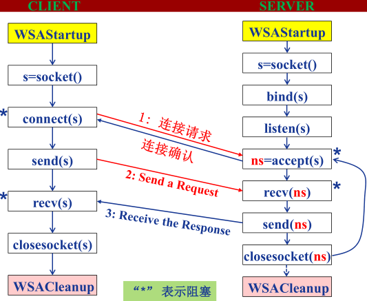

    


#### 四、Socket 编程- 客户端软件设计

1. **解析服务器IP 地址**

   - 客户端可能使用域名（如:study.163.com）或IP地址（如：123.58.180.121）标识服务器

   - IP协议需要使用32位二进制IP地址

   - 需要将域名或IP地址转换为32位IP地址

     - 函数`inet_addr( )` 实现点分十进制IP地址到32位IP地址转换
     - 函数`gethostbyname( )` 实现域名到32位IP地址转换
       - 返回一个指向结构`hostent` 的指针，值为网络字节顺序
       
       - > 错误 6 error LNK2019: 无法解析的外部符号 __imp__WSAStartup@8，该符号在函数 _main 中被引用 E:\项目\UDP 服务器与客户端\udp_client\udp_client\udp_client.obj udp_client
         >
         > 这个原因是VS缺少ws2_32.lib这个库。在项目->连接器->输入->附加依赖项中添加ws_32.lib就可以了。
     
     ```c
     struct hostent {
     char FAR* h_name; 				/*official host name / */
     char FAR* FAR* h_aliases; /*other aliases / */
     short h_addrtype; 				/*address type / */
     short h_lengty; 					/*address length / */
     char FAR* FAR* h_addr_list; /*list of address / */
     };
     #define  h_addr h_addr_list[0]
     ```

2. **解析服务器（熟知）端口号**

   - 客户端还可能使用**服务名**（如HTTP）标识服务器端口

   - 需要将服务名转换为熟知端口号

     - 函数`getservbyname( )`
       - 返回一个指向结构`servent`的指针

     ```c
     struct servent { 
     char FAR* s_name; 					/*official service name / */
     char FAR* FAR* s_aliases;  /*other aliases / */
     short s_port; 						 /*port for this service / */
     char FAR* s_proto;  				/*protocol to use / */
     };
     ```

     

3. **解析协议号**

   - 客户端可能使用**协议名**（如:TCP）指定协议

   - 需要将协议名转换为协议号（如：6）

     - 函数`getprotobyname ( )` 实现协议名到协议号的转换
       - 返回一个指向结构`protoent`的指针

     ```c
     struct protoent { 
     char FAR* p_name; 				/*official protocol name / */
     char FAR* FAR* p_aliases;  /*list of aliases allowed / */
     short p_proto;  					/*official protocol number*/
     };
     ```

     

- **TCP 客户端软件流程**

  1. 确定服务器 **IP 地址** 与 **端口号**
  2. 创建套接字
  3. 分配**本地端点地址**（IP 地址+ 端口号）系统自动完成
  4. 连接服务器（套接字）
  5. 遵循应用层协议进行通信
  6. 关闭/ 释放连接

- **UDP 客户端软件流程**

  1. 确定服务器 IP 地址 与 端口号
  2. 创建套接字
  3. 分配本地端点地址（IP 地址+ 端口号）
  4. **指定**服务器端点地址，构造UDP 数据报
  5. 遵循应用层协议进行通信
  6. 关闭/ 释放套接字

- **客户端软件的 实现- connectsock()**

  - 设计一个connectsock 过程封装底层代码

    ```c++
    /* consock.cpp - connectsock */
    #include <stdio.h>
    #include <stdlib.h>
    #include <string.h>
    #include <winsock.h>
    #ifndef INADDR_NONE
    #define INADDR_NONE 0xffffffff
    #endif /* INADDR_NONE */
    void errexit(const char *, ...);
    /*-------------------------------------------------------
    * connectsock - allocate & connect a socket using TCP or UDP
    *------------------------------------------------------
    */
    
    SOCKET connectsock(const char *host, const char *service, const char *transport)
    {
      struct hostent *phe;    /* pointer to host information entry  */
      struct servent *pse;    /* pointer to service information entry */
      struct protoent *ppe;   /* pointer to protocol information entry */
      struct sockaddr_in sin; /* an Internet endpoint address */
      int s, type;            /* socket descriptor and socket type */
      memset(&sin, 0, sizeof(sin));
      sin.sin_family = AF_INET;
    
      /* Map service name to port number */
      if (pse = getservbyname(service, transport))
        sin.sin_port = pse->s_port;
      else if ((sin.sin_port = htons((u_short)atoi(service))) == 0)
        errexit("can't get \"%s\" service entry\n", service);
      /* Map host name to IP address, allowing for dotted decimal */
      if (phe = gethostbyname(host))
        memcpy(&sin.sin_addr, phe->h_addr, phe->h_length);
      else if ((sin.sin_addr.s_addr = inet_addr(host)) == INADDR_NONE)
        errexit("can't get \"%s\" host entry\n", host);
      /* Map protocol name to protocol number */
      if ((ppe = getprotobyname(transport)) == 0)
        errexit("can't get \"%s\" protocol entry\n", transport);
    
      /* Use protocol to choose a socket type */
      if (strcmp(transport, "udp") == 0)
        type = SOCK_DGRAM;
      else
        type = SOCK_STREAM;
      /* Allocate a socket */
      s = socket(PF_INET, type, ppe->p_proto);
      if (s == INVALID_SOCKET)
        errexit("can't create socket: %d\n", GetLastError());
      /* Connect the socket */
      if (connect(s, (struct sockaddr *)&sin, sizeof(sin)) == SOCKET_ERROR)
        errexit("can't connect to %s.%s: %d\n", host, service,
                GetLastError());
      return s;
    }
    ```

- **客户端软件的 实现-UDP 客户端**

  - 设计 connectUDP 过程用于创建连接模式客户端UDP套接字

    ```c++
    /* conUDP.cpp - connectUDP */
    #include <winsock.h>
    SOCKET connectsock(const char *, const char *, const char *);
    /*-------------------------------------------------------
    * connectUDP - connect to a specified UDP service
    * on a specified host
    *-----------------------------------------------------
    */
    SOCKET connectUDP(const char *host, const char *service)
    {
      return connectsock(host, service, "udp");
    }
    ```

  - 设计connectTCP过程，用于创建客户端TCP套接字

    ```c++
    /* conTCP.cpp - connectTCP */
    #include <winsock.h>
    SOCKET connectsock(const char *, const char *, const char *);
    /*----------------------------------------------------
    * connectTCP - connect to a specified TCP service
    * on a specified host
    *---------------------------------------------------
    */
    SOCKET connectTCP(const char *host, const char *service)
    {
      return connectsock(host, service, "tcp");
    }
    ```

  - 客户端软件的实现-异常处理

    ```c++
    /* errexit.cpp - errexit */
    #include <stdarg.h>
    #include <stdio.h>
    #include <stdlib.h>
    #include <winsock.h>
    /*----------------------------------------------------------
    * errexit - print an error message and exit
    *----------------------------------------------------------
    */
    /*VARARGS1*/
    void errexit(const char *format, ...)
    {
      va_list args;
      va_start(args, format);
      vfprintf(stderr, format, args);
      va_end(args);
      WSACleanup();
      exit(1);
    }
    ```

- 例1 ：访问DAYTIME 服务的客户端（TCP ）

  - DAYTIME服务

    - 获取日期和时间
    - 双协议服务（TCP、 UDP），端口号13
    - TCP版利用TCP连接请求触发服务
    - UDP版需要客户端发送一个请求

    ```c++
    /* TCPdtc.cpp - main, TCPdaytime */
    #include <stdio.h>
    #include <stdlib.h>
    #include <winsock.h>
    void TCPdaytime(const char *, const char *);
    void errexit(const char *, ...);
    SOCKET connectTCP(const char *, const char *);
    #define LINELEN 128
    #define WSVERS MAKEWORD(2, 0)
    /*--------------------------------------------------------
    * main - TCP client for DAYTIME service
    *--------------------------------------------------------
    */
    int main(int argc, char *argv[])
    {
      char *host = "localhost";  /* host to use if none supplied */
      char *service = "daytime"; /* default service port */
      WSADATA wsadata;
      switch (argc)
      {
      case 1:
        host = "localhost";
        break;
      case 3:
        service = argv[2];
      /* FALL THROUGH */
      case 2:
        host = argv[1];
        break;
      default:
        fprintf(stderr, "usage: TCPdaytime [host [port]]\n");
        exit(1);
      }
      if (WSAStartup(WSVERS, &wsadata) != 0)
        errexit("WSAStartup failed\n");
      TCPdaytime(host, service);
      WSACleanup();
      return 0; /* exit */
    }
    /*-----------------------------------------------------
    * TCPdaytime - invoke Daytime on specified host and print results
    *-----------------------------------------------------
    */
    void TCPdaytime(const char *host, const char *service)
    {
      char buf[LINELEN + 1]; /* buffer for one line of text  */
      SOCKET s;              /* socket descriptor  */
      int cc;                /* recv character count */
      s = connectTCP(host, service);
      cc = recv(s, buf, LINELEN, 0);
      while (cc != SOCKET_ERROR && cc > 0)
      {
        buf[cc] = '\0'; /* ensure null-termination  */
        (void)fputs(buf, stdout);
        cc = recv(s, buf, LINELEN, 0);
      }
      closesocket(s);
    }
    ```

- 例2 ： 访问DAYTIME 服务的客户端 （UDP ）

  - ```c++
    /* UDPdtc.cpp - main, UDPdaytime */
    #include <stdio.h>
    #include <stdlib.h>
    #include <winsock.h>
    void UDPdaytime(const char *, const char *);
    void errexit(const char *, ...);
    SOCKET connectUDP(const char *, const char *);
    #define LINELEN 128
    #define WSVERS MAKEWORD(2, 0)
    #define MSG "what daytime is it ?\n"
    /*--------------------------------------------------------
    * main - UDP client for DAYTIME service
    *--------------------------------------------------------
    */
    int main(int argc, char *argv[])
    {
      char *host = "localhost";  /* host to use if none supplied */
      char *service = "daytime"; /* default service port */
      WSADATA wsadata;
      switch (argc)
      {
      case 1:
        host = "localhost";
        break;
      case 3:
        service = argv[2];
      /* FALL THROUGH */
      case 2:
        host = argv[1];
        break;
      default:
        fprintf(stderr, "usage: UDPdaytime [host [port]]\n");
        exit(1);
      }
      if (WSAStartup(WSVERS, &wsadata) != 0)
        errexit("WSAStartup failed\n");
      UDPdaytime(host, service);
      WSACleanup();
      return 0; /* exit */
    }
    /*-----------------------------------------------------
    * UDPdaytime - invoke Daytime on specified host and print results
    *-----------------------------------------------------
    */
    void UDPdaytime(const char *host, const char *service)
    {
      char buf[LINELEN + 1]; /* buffer for one line of text */
      SOCKET s;              /* socket descriptor */
      int n;                 /* recv character count  */
      s = connectUDP(host, service);
      (void)send(s, MSG, strlen(MSG), 0);
      /* Read the daytime */
      n = recv(s, buf, LINELEN, 0);
      if (n == SOCKET_ERROR)
        errexit("recv failed: recv() error %d\n", GetLastError());
      else
      {
        buf[cc] = '\0'; /* ensure null-termination  */
        (void)fputs(buf, stdout);
      }
      closesocket(s);
      return 0; /* exit  */
    }
    ```

  - VS2019 C++ 无法从“`const char [ ]`”转换为“`char *`”
  
    
  
    - 或类型转换 `const char *a="hello";`
  
  - 带参数调试：
  
    

#### 五、Socket 编程- 服务器软件设计

- **4 种类型基本服务器**

  1. **循环无连接**(Iterative connectionless)服务器
  2. **循环面向连接**(Iterative connection-oriented)服务器
  3. **并发无连接**(Concurrent connectionless)服务器
  4. **并发面向连接**(Concurrent connection-oriented)服务器

- **循环无连接 服务器基本流程**

  1. 创建套接字

  2. 绑定端点地址（INADDR_ANY+ 端口号）

  3. 反复接收来自客户端的请求

  4. 遵循应用层协议，构造响应报文，发送给客户

     **数据发送**

     - 服务器端不能使用connect()函数
     - 无连接服务器使用sendto()函数发送数据报

     

     **获取客户端点地址**

     - 调用recvfrom()函数接收数据时，自动提取

     

- **循环面向连接服务器基本流程**

  1. 创建（主）套接字，并绑定熟知端口号；
  2. 设置（主）套接字为被动监听模式，准备用于服务器；
  3. 调用accept() 函数 接收下一个连接请求（通过主套接字），创建新套接字用于与该客户建立连接；
  4. 遵循应用层协议，反复接收客户请求，构造并发送响应( 通过新套接字) ；
  5. 完成为特定客户服务后，关闭与该客户之间的连接，返回步骤3.

- **并发无连接服务器基本流程**

  1. 主线程1:  创建套接字，并绑定熟知端口号；
  2. 主线程2:  反复调用recvfrom() 函数，接收下一个客户请求，并创建新线程处理该客户响应；
  3. 子线程1:  接收一个特定请求；
  4. 子线程2:  依据应用层协议构造响应报文，并调用sendto() 发送；
  5. 子线程3:  退出( 一个子线程处理一个请求后即终止) 。

- **并发面向连接服务器基本流程**

  1. 主线程1:  创建（主）套接字，并绑定熟知端口号；
  2. 主线程2:  设置 （主）套接字为被动监听模式，准备用于服务器；
  3. 主线程3:  反复调用accept() 函数 接收 下一个 连接请求 （通过主套接字 ），并创建一个新的子线程处理该客户响应；
  4. 子线程1:  接收一个客户的服务请求 （通过新创建的套接字）；
  5. 子线程2:  遵循应用层协议与特定客户进行交互；
  6. 子线程3:  关闭/ 释放连接并退出（线程终止）.

- **服务器的实现**

  - 设计一个底层过程隐藏底层代码：

    - passivesock()

      ```c++
      /* passsock.cpp - passivesock */
      #include <stdlib.h>
      #include <string.h>
      #include <winsock.h>
      void errexit(const char *, ...);
      /*-----------------------------------------------------------------------
      * passivesock - allocate & bind a server socket using TCP or UDP
      *------------------------------------------------------------------------
      */
      SOCKET passivesock(const char *service, const char *transport, int qlen)
      {
        struct servent *pse;    /* pointer to service information entry  */
        struct protoent *ppe;   /* pointer to protocol information entry */
        struct sockaddr_in sin; /* an Internet endpoint address */
        SOCKET s;               /* socket descriptor  */
        int type;               /* socket type (SOCK_STREAM, SOCK_DGRAM)*/
        memset(&sin, 0, sizeof(sin));
        sin.sin_family = AF_INET;
        sin.sin_addr.s_addr = INADDR_ANY;
        /* Map service name to port number */
        if (pse = getservbyname(service, transport))
          sin.sin_port = (u_short)pse->s_port;
        else if ((sin.sin_port = htons((u_short)atoi(service))) == 0)
          errexit("can't get \"%s\" service entry\n", service);
        /* Map protocol name to protocol number */
        if ((ppe = getprotobyname(transport)) == 0)
          errexit("can't get \"%s\" protocol entry\n", transport);
        /* Use protocol to choose a socket type */
        if (strcmp(transport, "udp") == 0)
          type = SOCK_DGRAM;
        else
          type = SOCK_STREAM;
        /* Allocate a socket */
        s = socket(PF_INET, type, ppe->p_proto);
        if (s == INVALID_SOCKET)
          errexit("can't create socket: %d\n", GetLastError());
        /* Bind the socket */
        if (bind(s, (struct sockaddr *)&sin, sizeof(sin)) == SOCKET_ERROR)
          errexit("can't bind to %s port: %d\n", service,
                  GetLastError());
        if (type == SOCK_STREAM && listen(s, qlen) == SOCKET_ERROR)
          errexit("can't listen on %s port: %d\n", service,
                  GetLastError());
        return s;
      }
      ```

      

  - 两个高层过程分别用于创建服务器端UDP套接字和TCP套接字（调用passivesock()函数）:

    - passiveUDP()

      ```c++
      /* passUDP.cpp - passiveUDP */
      #include <winsock.h>
      SOCKET passivesock(const char *, const char *, int);
      /*-------------------------------------------------------------------------------------
      * passiveUDP - create a passive socket for use in a UDP server
      *-------------------------------------------------------------------------------------
      */
      SOCKET passiveUDP(const char *service)
      {
        return passivesock(service, "udp", 0);
      }
      ```

      

    - passiveTCP()

      ```c++
      /* passTCP.cpp - passiveTCP */
      #include <winsock.h>
      SOCKET passivesock(const char *, const char *, int);
      /*------------------------------------------------------------------------------------
      * passiveTCP - create a passive socket for use in a TCP server
      *------------------------------------------------------------------------------------
      */
      SOCKET passiveTCP(const char *service, int qlen)
      {
      	return passivesock(service, "tcp", qlen);
      }
      ```

      

- 例1 ：无连接循环DAYTIME服务器

  

  ```c++
  /* UDPdtd.cpp - main, UDPdaytimed */
  #include <stdlib.h>
  #include <time.h>
  #include <winsock.h>
  void errexit(const char *, ...);
  SOCKET passiveUDP(const char *);
  #define WSVERS MAKEWORD(2, 0)
  /*------------------------------------------------------------------------
  * main - Iterative UDP server for DAYTIME service
  *------------------------------------------------------------------------
  */
  void main(int argc, char *argv[])
  {
    struct sockaddr_in fsin;   /* the from address of a client  */
    char *service = "daytime"; /* service name or port number  */
    SOCKET sock;               /* socket */
    int alen;                  /* from-address length  */
    char *pts;                 /* pointer to time string  */
    time_t now;                /* current time  */
    WSADATA wsadata;
    switch (argc)
    {
    case 1:
      break;
    case 2:
      service = argv[1];
      break;
    default:
      errexit("usage: UDPdaytimed [port]\n");
    }
    if (WSAStartup(WSVERS, &wsadata) != 0)
      errexit("WSAStartup failed\n");
    sock = passiveUDP(service);
    while (1)
    {
      alen = sizeof(struct sockaddr);
      if (recvfrom(sock, buf, sizeof(buf), 0,(struct sockaddr *)&fsin, &alen) == SOCKET_ERROR)
        errexit("recvfrom: error %d\n", GetLastError());
      (void)time(&now);
      pts = ctime(&now);
      (void)sendto(sock, pts, strlen(pts), 0, (struct sockaddr *)&fsin, sizeof(fsin));
    }
    return 1; /* not reached */
  }
  ```
  
  

- 例2 ：面向连接并发DAYTIME 服务器

  

  ```c++
  /* TCPdtd.cpp - main, TCPdaytimed */
  #include <process.h>
  #include <stdlib.h>
  #include <time.h>
  #include <winsock.h>
  void errexit(const char *, ...);
  void TCPdaytimed(SOCKET);
  SOCKET passiveTCP(const char *, int);
  #define QLEN 5
  #define WSVERS MAKEWORD(2, 0)
  /*------------------------------------------------------------------------
  * main - Concurrent TCP server for DAYTIME service
  *------------------------------------------------------------------------
  */
  void main(int argc, char *argv[])
  {
    struct sockaddr_in fsin;   /* the from address of a client  */
    char *service = "daytime"; /* service name or port number*/
    SOCKET msock, ssock;       /* master & slave sockets  */
    int alen;                  /* from-address length */
    WSADATA wsadata;
    switch (argc)
    {
    case 1:
      break;
    case 2:
      service = argv[1];
      break;
    default:
      errexit("usage: TCPdaytimed [port]\n");
    }
    if (WSAStartup(WSVERS, &wsadata) != 0)
      errexit("WSAStartup failed\n");
    msock = passiveTCP(service, QLEN);
    while (1)
    {
      alen = sizeof(struct sockaddr);
      ssock = accept(msock, (struct sockaddr *)&fsin, &alen);
      if (ssock == INVALID_SOCKET)
        errexit("accept failed: error number %d\n",
                GetLastError());
      if (_beginthread((void (*)(void *))TCPdaytimed, 0,(void *)ssock) < 0)
      {
        errexit("_beginthread: %s\n", strerror(errno));
      }
    }
    return 1; /* not reached */
  }
  /*----------------------------------------------------------------------
  * TCPdaytimed - do TCP DAYTIME protocol
  *-----------------------------------------------------------------------
  */
  void TCPdaytimed(SOCKET fd)
  {
    char *pts;  /* pointer to time string */
    time_t now; /* current time */
    (void)time(&now);
    pts = ctime(&now);
    (void)send(fd, pts, strlen(pts), 0);
    (void)closesocket(fd);
  }
  ```


## 第三章 传输层

- 重点：
  - 可靠数据传输基本原理、停—等协议、典型滑动窗口协议（GBN 协议、SR 协议）；
  - TCP 的报文段结构、TCP 连接建立于断开过程、TCP 序列号以及确认序列号、TCP 可靠数据传输机制、TCP 拥塞控制方法。
- 难点：
  - 停—等协议与滑动窗口协议的理解与信道利用率的计算
  - TCP 的连接管理
  - TCP 报文段序列号
  - TCP 的拥塞控制方法
- 考点
  - 可靠数据传输的基本原理
    - 不可靠性
    - 差错检测、确认、重传、序号、计时器
  - 停-等协议
    - ARQ超时自动重传，包含了确认、重传、序号、计时器
    - 只使用ACK，理解图3.5
  - 滑动窗口协议
    - GBN协议，理解图3.8，课后习题11
    - SR协议，理解图3.9
    - 信道利用率的计算，公式3-8，课后习题12
  - ♣TCP报文段结构
    - 熟背百日通关，或课本P113-114
    - 计算序号和确认序号，课后习题14/15/16
  - ♣TCP连接管理与序列号
    - 三次握手，图3.16，百日通关
    - 四次挥手，图3.17，百日通关
  - TCP可靠数据传输机制
    - P119，简答题
    - TCP确认与重传，图3.18，课后习题18
  - TCP拥塞控制
    - 百日通关内容
    - 课后习题13/17
  - GBN协议报文段号+信道利用率计算
    - 课后习题11/12
  - TCP报文段结构+序号和确认序号计算
    - 百日通关习题
    - 课后习题14/15/16
  - TCP三次握手+序号计算
    - 百日通关习题
  - TCP拥塞控制
    - 百日通关真题
    - 课后习题13/17
  - TCP段结构
  - TCP三次握手
  - TCP四次挥手
  - TCP可靠数据传输机制
  - UDP段结构
  - GBN协议过程
  - SR协议过程
  - ARQ协议过程
  - TCP拥塞控制过程


### 第一节 传输层的基本服务

#### 一、传输层功能

- **主要功能：**

  1. 传输层寻址；
  2. 对应用层报文进行分段和重组；
  3. 对报文进行差错检测；
  4. 实现进程间端到端可靠数据传输控制；
  5. 面向应用层实现复用与分解（multiplexing/demultiplexing）；
  6. 实现端到端的流量控制；
  7. 拥塞控制；
- 传输层服务和协议

  - 传输层协议为运行在不同Host上的应用进程提供了一种 **逻辑通信机制**。
  - 端系统运行传输层协议
    - 发送方：将应用递交的消息分成一个或多个的 **传输层报文段（Segment）**，并向下传给网络层。
    - 接收方：将接收到的 segment 组装成消息，并向上交给应用层。
  - 传输层可以为应用提供多种协议
    - Internet上的 TCP
    - Internet上的 UDP

  

- 传输层 vs.  网络层

  - 网络层：提供 **主机之间**的逻辑通信机制
  - 传输层：提供 **应用进程之间**的逻辑通信机制
    - 位于网络层之上
    - 依赖于网络层服务
    - 对网络层服务进行（可能的）增强
  - 家庭类比:
    12 个孩子给 12 个孩子发信
    - 应用进程 = 孩子
    - 应用消息 = 信封里的信
    - 主机 = 房子
    - 传输层协议 = 李雷和韩梅梅
    - 网络层协议 = 邮政服务

- **Internet 传输层协议**

  - 可靠、按序的交付服务(TCP)
    - 拥塞控制
    - 流量控制
    - 连接建立
  - 不可靠的交付服务(UDP)
    - 基于 “尽力而为(Best-effort)” 的网络层，没有做（可靠性方面的）扩展
  - 两种服务均不保证
    - 延迟
    - 带宽

#### 二、传输层寻址与端口（缺失已补）

1. TCP/IP 使用协议端口号(protocol port number)，简称端口； 在全网使用 **IP地址+端口号** 唯一标识一个通信端点。
   - IP 标识主机，端口号标识进程。
2. 传输端口号：
   - 16位整数；
   - 0~1023 为熟知端口号；
   - 1024~49151为登记端口号，为没有熟知端口号的应用程序使用，必须在互联网数字分配结构（The Internet Assigned Numbers Authority，IANA）登记，以防止重复；
   - 49152~65535 为客户端口号或短暂端口号，留给客户进程或用户开发的非标准服务器暂时使用。
   - 端口只在本地有效。

#### 三、无连接服务与面向连接服务（缺失已补）

1. 无连接服务：
   - 数据传输前无需与对端进行任何信息交换（握手），直接构造传输层报文段并向接收端发送。
   - UDP
2. 面向连接服务
   - 是指在数据传输之前，需要双方交换一些控制信息，建立逻辑连接，然后再传输数据，数据传输完需要拆除连接。
   - TCP


### 第二节 传输层的复用与分解

#### 一、无连接的多路复用与多路分解

- 多路复用/ 分用

  

- 分用如何工作?

  - 主机接收到IP数据报(datagram)
    - 每个数据报携带源IP地址、目的IP地址。
    - 每个数据报携带一个传输层的段(Segment）。
    - 每个段携带源端口号和目的端口号
  - 主机收到Segment之后，传输层协议提取IP地址和端口号信息，将Segment导向相应的Socket
    - TCP做更多处理

  

- **无连接分用**

  - 利用端口号创建Socket

    - ```c++
      DatagramSocket mySocket1 = new DatagramSocket(99111);
      DatagramSocket mySocket2 = new DatagramSocket(99222);
      ```

  - UDP的 Socket 用**二元组**标识

    - ( **目的 IP 地址 ， 目的端口号**)

  - 主机收到UDP段后

    - 检查段中的目的端口号
    - 将UDP段导向绑定在该端口号的Socket

  - 来自不同源IP地址和/或源端口号的IP数据包被导向同一个Socket

  - `DatagramSocket serverSocket = new DatagramSocket(6428);`

  


#### 二、面向连接的多路复用与多路分解

- 面向连接的分用

  - TCP的 Socket 用**四元组**标识
    - 源 IP 地址
    - 源端口号
    - 目的IP 地址
    - 目的端口号
  - 接收端利用所有的四个值将Segment导向合适的Socket
  - 服务器可能同时支持多个TCPSocket
  - 每个Socket用自己的四元组标识
  - Web服务器为每个客户端开不同的Socket

  

- 面向连接的分用 ： **多线程** Web 服务器


### 第三节 停—等协议与滑动窗口协议

#### 一、可靠数据传输基本原理

- 什么是可靠 ？

  - 不错、不丢、不乱

- 可靠数据传输协议

  - 可靠数据传输对应用层、传输层、链路层都很重要
  - 网络Top-10问题
  - 信道的不可靠特性决定了**可靠数据传输协议 (rdt，reliable data transfer) **的复杂性

  

- 可靠数据传输协议基本结构: 接口

  

- 可靠数据传输协议

  - 渐进地设计可靠数据传输协议的发送方和接收方
  - 只考虑单向数据传输
    - 但控制信息双向流动
  - 利用 **状态机(Finite State Machine, FSM)** 刻画传输协议

  

#### 二、停—等协议

- Rdt 1.0:  可靠信道上的可靠数据传输

  - 底层信道完全可靠
    - 不会发生错误(bit error)
    - 不会丢弃分组
  - 发送方和接收方的FSM独立

  

- Rdt 2.0:  产生**位错误**的信道

  - 底层信道可能翻转分组中的位(bit)
    - 利用 **校验和** 检测位错误
  - 如何从错误中恢复 ？
    - **确认机制(Acknowledgements, ACK)**:  接收方显式地告知发送方分组已正确接收
    - **NAK**: 接收方显式地告知发送方分组有错误
    - 发送方收到NAK 后 ， **重传** 分组
  - 基于这种重传机制的rdt 协议称为**ARQ(Automatic Repeat reQuest) 协议**
  - Rdt 2.0 中引入的新机制
    - **差错检测**
    - 接收方反馈**控制消息**: ACK/NAK
    - **重传**

- Rdt 2.0: FSM 规约

  

- Rdt 2.0:  无错误场景

  

- Rdt 2.0:  有错误场景

  

- Rdt 2.0 有什么缺陷 ？

  - 如果ACK/NAK 消息发生错误/ 被破坏(corrupted) 会怎么样 ？
    - 为ACK/NAK 增加校验和 ， 检错并纠错
    - 发送方收到被破坏ACK/NAK 时不知道接收方发生了什么 ， 添加额外的控制消息
    - 如果ACK/NAK 坏掉 ， 发送方重传
      - 不能简单的重传 ： 产生 **重复分组**
  - 如何解决重复分组问题 ？
    - **序列号(Sequence number)**:  发送方给每个分组增加序列号
    - 接收方丢弃重复分组
  - stop and wait
    - Sender sends one packet, then waits for receiver response

- Rdt 2.1:  发送方,  应对ACK/NAK 破坏

  

- Rdt 2.1:  接收方,  应对ACK/NAK 破坏

  

- Rdt 2.1 vs. Rdt 2.0

  - 发送方：
    - 为每个分组增加了序列号
    - 两个序列号(0, 1)就够用，为什么？
      - 停等协议
    - 需校验ACK/NAK消息是否发生错误
    - 状态数量翻倍
      - 状态必须“记住”“当前”的分组序列号
  - 接收方
    - 需判断分组是否是重复
    - 当前所处状态提供了期望收到分组的序列号
    - 注意：接收方无法知道ACK/NAK是否被发送方正确收到

- Rdt 2.2:  无NAK 消息协议

  - 我们真的需要两种确认消息(ACK + NAK) 吗 ？
  - 与rdt 2.1 功能相同 ， 但是只使用ACK
  - 如何实现 ？
    - 接收方通过ACK 告知最后一个被正确接收的分组
    - 在ACK 消息中 **显式地加入被确认分组的序列号**
  - 发送方收到重复ACK 之后 ， 采取与收到NAK 消息相同的动作
    - 重传当前分组

- Rdt 2.2 FSM 片段

  

  

- Rdt 3.0

  - 如果信道既可能发生错误 ， 也可能丢失分组 ， 怎么办 ？
    - “校验和 + 序列号 + ACK + 重传”够用吗？
  - 方法：发送方等待“合理”时间
    - 如果没收到ACK，重传
    - 如果分组或ACK只是延迟而不是丢了
      - 重传会产生重复，序列号机制能够处理
      - 接收方需在ACK中显式告知所确认的分组
    - 需要**定时器**

- Rdt 3.0 发送方FSM

  

- Rdt 3.0 示例(1)

  

- Rdt 3.0 示例(2)

  

- Rdt 3.0 性能分析

  - Rdt 3.0能够正确工作，但性能很差

  - 示例：1Gbps链路，15ms端到端传播延迟，1KB分组

    

    - 发送方利用率：发送方发送时间百分比

      

    - 在1Gbps链路上每30毫秒才发送一个分组→33KB/sec

    - 网络协议限制了物理资源的利用

- Rdt 3.0:  停等操作

  

  

#### 三、滑动窗口协议

流水线机制与滑动窗口协议

- 流水线机制 ： 提高资源利用率

  

- 流水线协议

  - 允许发送方在收到ACK之前连续发送多个分组
    - 更大的 **序列号范围**
    - 发送方和/或接收方需要更大的**存储空间**以缓存分组

  

- 滑动窗口协议

  

  - **滑动窗口协议: Sliding-window protocol**
  - 窗口
    - 允许使用的序列号范围
    - 窗口尺寸为N：最多有N个等待确认的消息
  - 滑动窗口
    - 随着协议的运行，窗口在序列号空间内**向前滑动**
  - 滑动窗口协议：GBN, SR

**Go-Back-N 协议**

- Go-Back-N(GBN) 协议:  发送方

  - 分组头部包含k-bit序列号
  - 窗口尺寸为N，最多允许N个分组未确认

  

  - ACK(n): 确认到序列号n(包含n)的分组均已被正确接收
    - 可能收到重复ACK
  - 为空中的分组设置**计时器(timer)**
  - 超时Timeout(n)事件:  重传序列号大于等于n，还未收到ACK的所有分组

- GBN:  发送方扩展FSM

  

- GBN:  接收方扩展FSM

  

  - ACK机制: 发送拥有最高序列号的、已被正确接收的分组的ACK
    - 可能产生重复ACK
    - 只需要记住唯一的expectedseqnum
  - 乱序到达的分组：
    - 直接丢弃→接收方没有缓存
    - 重新确认序列号最大的、按序到达的分组

- GBN 示例

  

- 练习题

  -  数据链路层采用后退N帧（GBN）协议，发送方已经发送了编号为0～7的帧。当计时器超时时，若发送方只收到0、2、3号帧的确认，则发送方需要重发的帧数是多少？分别是那几个帧？
  - 解：根据GBN协议工作原理，GBN协议的确认是**累积确认**，所以此时发送端需要重发的帧数是4个，依次分别是4、5、6、7号帧。

**Selective Repeat 协议**

- GBN 有什么缺陷 ？

  - 接收方对每个分组**单独进行确认**
    - 设置**缓存机制**，缓存乱序到达的分组
  - 发送方只重传那些没收到ACK的分组
    - 为每个分组设置定时器
  - 发送方窗口
    - N个连续的序列号
    - 限制已发送且未确认的分组

- Selective Repeat ： 发送方/ 接收方窗口

  

- SR 协议

  

- SR协议示例

  

- SR 协议 ： 困境

  - 序列号: 0, 1, 2, 3
  - 窗口尺寸：3
  - 接收方能区分开右侧两种不同的场景吗？
  - (a)中，发送方重发分组0, 接收方收到后会如何处理？
  - 问题：**序列号空间大小与窗口尺寸**需满足什么关系？
    - $N_S +N_R \leq 2^k$

  

- 可靠数据传输原理与协议回顾

  1. 信道的(不可靠)特性
  2. 可靠数据传输的需求
  3. Rdt 1.0
  4. Rdt 2.0, rdt 2.1, rdt 2.2
  5. Rdt 3.0
  6. 流水线与滑动窗口协议
  7. GBN
  8. SR


### 第四节 用户数据报协议（UDP）

#### 一、UDP 数据报结构

- UDP: User Datagram Protocol  [RFC 768]
  - 基于Internet IP协议
    - 复用/分用
    - 简单的错误校验
  - “Best effort”服务，UDP段可能
    - 丢失
    - 非按序到达
  - 无连接
    - UDP发送方和接收方之间不需要握手
    - 每个UDP段的处理独立于其他段
- UDP 为什么存在?
  - 无需建立连接 ( 减少延迟)
  - 实现简单 ： 无需维护连接状态
  - 头部开销少
  - 没有拥塞控制:  应用可更好地控制发送时间和速率
- 常用于流媒体应用
  - 容忍丢失
  - 速率敏感
- UDP还用于
  - DNS
  - SNMP
  - 在UDP上实现可靠数据传输？
  - 在应用层增加可靠性机制
  - 应用特定的错误恢复机制


#### 二、UDP校验和(checksum)

- 目的 ： 检测UDP 段在传输中是否发生错误 （ 如位翻转 ）

- 发送方

  - 将段的内容视为16-bit 整数
  - 校验和计算 ： 计算所有整数的和， 进位加在和的后面 ， 将得到的值按位求反 ， 得到校验和
  - 发送方将校验和放入校验和字段

- 接收方

  - 计算所收到段的校验和
  - 将其与校验和字段进行对比
    - 不相等 ： 检测出错误
    - 相等 ： 没有检测出错误 （ 但可能有错误）

- 校验和计算示例

  - 注意：
    - 最高位进位必须被加进去
  - 示例：

  

  


### 第五节 传输控制协议（TCP）

#### 一、TCP 报文段结构

- TCP 概述:  RFCs-793, 1122, 1323, 2018, 2581

  - 点对点
    - 一个发送方，一个接收方
  - 可靠的、按序的字节流
  - 流水线机制
    - TCP拥塞控制和流量控制机制设置窗口尺寸
  - 发送方/接收方缓存
  - 全双工(full-duplex)
    - 同一连接中能够传输双向数据流
  - 面向连接
    - 通信双方在发送数据之前必须建立连接。
    - 连接状态只在连接的两端中维护，在沿途节点中并不维护状态。
    - TCP连接包括：两台主机上的缓存、连接状态变量、socket等
  - 流量控制机制

- **TCP段结构**

  

- **TCP:  序列号和ACK**

  - **序列号:**
    - 序列号指的是segment 中第一个字节的编号 ，而不是segment 的编号
    - 建立TCP 连接时 ， 双方随机选择序列号
  - **ACKs:**
    - 希望接收到的下一个字节的序列号
    - 累计确认 ： 该序列号之前的所有字节均已被正确接收到
  - Q:  接收方如何处理乱序到达的Segment ？
    - A: TCP 规范中没有规定 ， 由TCP 的实现者做出决策

  

  

#### 二、TCP 连接管理

TCP sender 和 receiver 在传输数据前需要建立**连接**

1. 初始化TCP变量
   - Seq. #
   - Buffer和流量控制信息
2. Client：连接发起者
   - `Socket clientSocket = new Socket("hostname","port number");`
3. Server: 等待客户连接请求
   - `Socket connectionSocket = welcomeSocket.accept();`

- Three way handshake **三次握手**:
  1. Step 1: client host sends TCP **SYN** segment to server
     - specifies initial seq #
     - no data
  2. Step 2: server host receives SYN, replies with **SYN ACK** segment
     - server allocates buffers
     - specifies server initial seq. #
  3. Step 3: client receives SYN ACK, replieswith **ACK** segment, which may contain data

- **TCP 连接管理 ： 建立**

  

- **TCP 连接管理 ： 关闭**

  - `client closes socket: clientSocket.close();`

  1. **client** 向server发送TCP **FIN** 控制segment
  2. **server** 收到FIN, 回复**ACK**. 关闭连接, 发送 **FIN**.
  3. **client** 收到FIN, 回复**ACK**.
     - 进入“等待” –如果收到FIN，会重新发送ACK
  4. **server** 收到ACK. 连接关闭.

  

  

- **TCP 连接管理**

  

  


#### 三、TCP 可靠数据传输

- **TCP 可靠数据传输概述**

  - TCP在IP层提供的不可靠服务基础上实现可靠数据传输服务
  - 流水线机制
  - 累积确认
  - TCP使用单一重传定时器
  - 触发重传的事件
    - 超时
    - 收到重复ACK
  - 渐进式
    - 暂不考虑重复ACK
    - 暂不考虑流量控制
    - 暂不考虑拥塞控制

- **TCP RTT 和超时**

  - 问题：如何设置定时器的超时时间？
    - 大于RTT
      - 但是RTT是变化的
    - 过短：
      - 不必要的重传
    - 过长：
      - 对段丢失时间反应慢
  - 问题：如何估计RTT？
    - SampleRTT: 测量从段发出去到收到ACK的时间
      - 忽略重传
    - SampleRTT变化
      - 测量多个SampleRTT，求平均值，形成RTT的估计值 EstimatedRTT
  - $EstimatedRTT = (1- \alpha)*EstimatedRTT + \alpha*SampleRTT$
    - **指数加权移动平均**
    - 典型值：0.125
  - **定时器超时时间的设置:**
    - EstimatedRTT + “ 安全边界”
    - EstimatedRTT 变化大 → 较大的边界
  - **测量RTT 的变化值: SampleRTT 与EstimatedRTT 的差值**
    - $DevRTT = (1- \beta)*DevRTT +\beta*|SampleRTT-EstimatedRTT|\\(typically, \beta = 0.25)$
  - **定时器超时时间的设置 ：**
    - $TimeoutInterval = EstimatedRTT + 4*DevRTT$

- **TCP 发送方事件**

  - **从应用层收到数据**
    - 创建Segment
    - 序列号是Segment第一个字节的编号
    - 开启计时器
    - 设置超时时间：TimeOutInterval
  - **超时**
    - 重传引起超时的Segment
    - 重启定时器
  - **收到ACK**
    - 如果确认此前未确认的Segment
      - 更新SendBase
      - 如果窗口中还有未被确认的分组，重新启动定时器

- TCP 发送端程序

  ```C++
  NextSeqNum = InitialSeqNum
  SendBase = InitialSeqNum
  loop (forever) {
    switch(event)
    event: data received from application above
      create TCP segment with sequence number NextSeqNum
      if (timer currently not running)
      	start timer
      pass segment to IP
      NextSeqNum = NextSeqNum + length(data)
    event: timer timeout
      retransmit not-yet-acknowledged segment with
      	smallest sequence number
      start timer
    event: ACK received, with ACK field value of y
      if (y > SendBase) {
      	SendBase = y
      if (there are currently not-yet-acknowledged segments)
      	start timer
      }
  } /* end of loop forever */
  ```

- TCP 重传示例

  

  

- **TCP ACK 生成**:  RFC 1122, RFC 2581

  

- 快速重传机制

  - TCP的实现中，如果发生超时，超时时间间隔将重新设置，即将超时时间间隔加倍，导致其很大
    - 重发丢失的分组之前要等待很长时间
  - 通过重复ACK检测分组丢失
    - Sender会背靠背地发送多个分组
    - 如果某个分组丢失，可能会引发多个重复的ACK
  - 如果sender收到对同一数据的3个ACK，则假定该数据之后的段已经丢失
    - 快速重传：在定时器超时之前即进行重传

- 快速重传算法

  ```c++
  event: ACK received, with ACK field value of y
  if (y > SendBase) {
  SendBase = y
  if (there are currently not-yet-acknowledged segments)
  start timer
  }
  else { //a duplicate ACK for already ACKed segment
  increment count of dup ACKs received for y
  if (count of dup ACKs received for y = 3) {
  resend segment with sequence number y //fast retransmit
  }
  ```


#### 四、TCP 流量控制

flow control：发送方不会传输的太多、 太快以至于淹没接收方（buffer 溢出 ）

- 接收方为TCP连接分配buffer

  

  - 上层应用可能处理buffer中数据的速度较慢
  - 速度匹配机制
  - (假定TCP receiver丢弃乱序的 segments)

-  Buffer中的可用空间(spare room)

  - $= RcvWindow$
    $= RcvBuffer-[LastByteRcvd - LastByteRead]$

- Receiver通过在Segment的头部字段将**RcvWindow** 告诉Sender

- Sender限制自己已经发送的但还未收到ACK的数据不超过接收方的空闲RcvWindow尺寸

- Receiver告知SenderRcvWindow=0, 会出现什么情况?

  - 继续发送小段接收 RcvWindow


#### 五、TCP 拥塞控制

- **拥塞(Congestion)**

  - 非正式定义：“太多发送主机发送了太多数据或者发送速度太快，以至于网络无法处理”
  - 表现：
    - 分组丢失（路由器缓存溢出）
    - 分组延迟过大（在路由器缓存中排队）
  - 拥塞控制 vs. 流量控制
    - 拥塞控制：从网络带宽角度
    - 流量控制：连接双方
  - A top-10 problem.

- **拥塞的成因和代价** ： 场景1

  - 两个senders, 两个 receivers
  - 一个路由器, 无限缓存
    - 没有重传
  - 拥塞时**分组延迟太大**
  - **达到最大 throughput**

  

  

- **拥塞的成因和代价** ： 场景2

  - 一个路由器, 有限buffers
  - Sender重传分组

  

  1. 情况a：Sender 能够通过某种机制获知路由器 buffer 信息，有空闲才发 $\lambda_{in}=\lambda_{out}$ (goodput)
  2. 情况b：丢失后才重发: $\lambda'_{in}>\lambda_{out}$ 
  3. 情况c：分组丢失和定时器超时后都重发，$\lambda'_{in}$ 变得更大

  

  - 拥塞的代价:
    - 对给定的”goodput”，要做更多的工作 (重传)
    - 造成**资源的浪费**

- **拥塞的成因和代价** ：场景3

  - 四个发送方
  - 多跳
  - 超时/重传
  - Q: 随着 $\lambda_{in}$和 $\lambda'_{in}$不断增加，会怎么样 ?

  

  

  - 拥塞的另一个代价:
    - 当分组被drop时，任何用于该分组的“**上游**”传输能力全都被**浪费**掉


- **拥塞控制的方法**

  - 端到端拥塞控制：
    - 网络层不需要显式的提供支持
    - 端系统通过观察loss，delay 等网络行为判断是否发生拥塞
    - TCP采取这种方法
  - 网络辅助的拥塞控制：
    - 路由器向发送方显式地反馈网络拥塞信息
    - 简单的拥塞指示(1bit)：SNA, DECbit, TCP/IP ECN, ATM)
    - 指示发送方应该采取何种速率

- 案例 ：**ATM** ABR **拥塞控制**

  - **ABR：available bit rate**
    -  “弹性服务”
    - 如果发送方路径“
      - underloaded”
      - 使用可用带宽
    - 如果发送方路径拥塞
      - 将发送速率降到最低保障速率
  - **RM(resource management) cells**
    - 发送方发送
    - 交换机设置RM cell位(网络辅助)
      - **NI** bit: rate不许增长
      - **CI** bit: 拥塞指示
    - RM cell 由接收方返回给发送方

  

  - 在RM cell中有显式的速率(**ER**)字段：两个字节
    - 拥塞的交换机可以将ER置为更低的值
    - 发送方获知路径所能支持的最小速率
  - 数据cell中的**EFCI**位: 拥塞的交换机将其设为1
    - 如果RM cell前面的data cell的EFCI位被设为1，那么发送方在返回的RM cell中置 CI位


- **TCP 拥塞控制的基本原理**

  - Sender限制发送速率
    - $LastByteSent-LastByteAcked <= CongWin$
    - $\displaystyle rate \approx \frac{CongWin}{RTT}  Bytes/sec$
  - CongWin:
    - 动态调整以改变发送速率
    - 反映所感知到的网络拥塞
  - 问题：如何感知网络拥塞？
    - Loss事件=timeout 或 3个重复ACK
    - 发生loss事件后，发送方降低速率
  - 如何合理地调整发送速率？
    - 加性增—乘性减: AIMD
    - 慢启动: SS

- **加性增— 乘性减: AIMD**

  - **原理**：逐渐增加发送速率，谨慎探测可用带宽，直到发生loss
  - 方法: AIMD
    - Additive Increase: 每个RTT将 CongWin 增大一个MSS——拥塞避免
    - Multiplicative Decrease: 发生loss 后将 CongWin **减半**

  

- **TCP 慢启动: SS**

  - TCP连接建立时，CongWin=1
    - 例：MSS=500 byte, RTT=200msec
    - 初始速率=20k bps
  - 可用带宽可能远远高于初始速率：
    - 希望快速增长
  - 原理：
    - 当连接开始时，指数性增长

  ```c++
  Slowstart algorithm
  
  initialize: Congwin = 1
  for (each segment ACKed)
  Congwin++
  until (loss event OR
  CongWin > threshold)
  ```

  - 指数性增长
    - 每个RTT将CongWin翻倍
    - 收到每个ACK进行操作
  - 初始速率很慢，但是快速攀升

  

- **Threshold变量**

  - Q:何时应该指数性增长切换为线性增长(拥塞避免)?
  - A: 当 CongWin 达到Loss 事件前值的 **1/2时.**
  - 实现方法:
    - 变量 Threshold
    - Loss事件发生时, Threshold 被设为 Loss 事件前 CongWin 值的1/2。

  

- Loss 事件的处理

  -  3个重复ACKs:
    - CongWin 切到一半
    - 然后线性增长
  - Timeout事件:
    - CongWin直接设为1个MSS
    - 然后指数增长
    - 达到threshold后, 再线性增长
  - Philosophy: 
    - 3个重复ACKs表示网络还能够传输一些 segments
    - timeout事件表明拥塞更为严重

- TCP 拥塞控制:  总结

  -  When CongWin is below Threshold, sender in **slow-start** phase, window grows exponentially.
  - When CongWin is above Threshold, sender is in **congestion-avoidance** phase, window grows linearly.
  - When **a triple duplicate ACK** occurs, Threshold set to CongWin/2 and CongWin set to Threshold.
  - When **timeout** occurs, Threshold set to CongWin/2 and CongWin is set to 1 MSS.

- TCP 拥塞控制

  

- TCP 拥塞控制算法

  ```c++
  Th = ?
  CongWin = 1 MSS
  /* slow start or exponential increase */
  While (No Packet Loss and CongWin < Th) {
  send CongWin TCP segments
  for each ACK increase CongWin by 1
  }
  /* congestion avoidance or linear increase */
  While (No Packet Loss) {
  send CongWin TCP segments
  for CongWin ACKs, increase CongWin by 1
  }
  Th = CongWin/2
  If (3 Dup ACKs) CongWin = Th;
  If (timeout) CongWin=1;
  ```

- 例题

  -  一个TCP连接总是以1 KB的最大段长发送TCP段，发送方有足够多的数据要发送。当拥塞窗口为16 KB时发生了超时，如果接下来的4个RTT（往返时间）时间内的TCP段的传输都是成功的，那么当第4个RTT时间内发送的所有TCP段都得到肯定应答时，拥塞窗口大小是多少？
  -  解：threshold=16/2=8 KB, CongWin=1 KB, 1个RTT后， CongWin=2 KB ，2个RTT后， CongWin=4 KB ，3个RTT后， CongWin=8 KB ，Slowstart isover; 4个RTT后， CongWin=9 KB


#### 附：TCP 性能分析

- **TCP throughput:  吞吐率**

  - 给定拥塞窗口大小和RTT ，TCP 的平均吞吐率是多少 ？
    - 忽略掉Slow start
  - 假定发生超时时CongWin的大小为W，吞吐率是$W/RTT$
  - 超时后，$CongWin=W/2$，吞吐率是$W/2RTT$
  - 平均吞吐率为：$0.75W/RTT$

- 未来的TCP

  - 举例：每个Segment有1500个byte, RTT是100ms，希望获得 10Gbps的吞吐率

    - $throughput = W*MSS*8/RTT$, 则
    - $W=throughput*RTT/(MSS*8)$
    - $throughput=10Gbps, 则W=83,333$
    - 窗口大小为 83,333

  - 吞吐率与丢包率(loss rate, L)的关系

    - CongWin从W/2增加至W时出现第一个丢包，那么一共发送的分组数为
      - $W/2+(W/2+1)+(W/2+2)+….+W = 3W^2 /8+3W/4$
    - W很大时，$3W^2 /8>>3W/4 ， 因此L ≈ 8/(3W^2 )$

    

    - $ L = 2\times10^{-10} $
    - 高速网络下需要设计新的TCP

- TCP的公平性

  - 如果K个TCP Session共享相同的瓶颈带宽R，那么每个Session的平均速率为R/K

  

  - **TCP 具有公平性**

  

  - **公平性与UDP**
    - 多媒体应用通常不使用TCP，以免被拥塞控制机制限制速率
    - 使用UDP：以恒定速率发送，能够容忍丢失
    - 产生了不公平
  - 研究：TCP friendly
  - **公平性与并发TCP连接**
    - 某些应用会打开多个并发连接
    - Web浏览器
    - 产生公平性问题
  - 例子：链路速率为R，已有9个连接
    - 新来的应用请求1个TCP，获得 R/10 的速率
    - 新来的应用请求11个TCP，获得 R/2 的速率


## 第四章 网络层

- 重点：
  - 转发与路由概念的理解
  - 虚电路网络与数据报网络工作原理
  - IP 数据报结构、IP 数据报分片、IP 地址
  - 子网划分
  - CIDR 
  - 路由聚合、路由表
  - ICMP、DHCP、NAT
  - 链路状态路由选择算法、距离向量路由选择算法
  - 层次化路由
  - RIP、OSPF、BGP基本工作过程
- 难点：
  - IP 数据报分片、IP 地址
  - 子网划分、子网掩码
  - CIDR 
  - 路由聚合、路由表、路由计算、层次化路由
  - OSPF
  - BGP
- 考点
  - 转发与路由概念理解
    - 路由选择和转发之间是相互作用的
    - 路由算法生成转发表，转发表执行路由操作
  - 虚电路网络与数据报网络工作原理
    - 数据报网络，无连接
    - 虚电路网络，有连接，VC三要素P133，分永久型和交换型
    - 异构网络互连在网络层的设备是路由器
  - 网络拥塞控制
    - 拥塞的概念，拥塞4种原因
    - 拥塞预防：流量感知、准入控制
    - 拥塞控制：抑制分组、背压
    - 消除拥塞：负载脱落
  - ♠IP数据报结构
    - P143-144，看百日通关
    - 数据报长度、链路层MTU限制，一般不超过1500字节P145
    - IP数据报分片，标志位字段MF+DF，理解P147表格
  - ♠IP地址
    - 分类地址，看百日通关
    - 特殊地址+私有地址
  - ♠子网划分+子网掩码+CIDR
    - 课本例子4.1+4.2
  - 路由表+路由聚合
    - 理解图4.18和4.19
  - DHCP+NAT+ICMP+IPv6
    - DHCP，工作过程
    - NAT，内网外网映射
    - ICMP，网络状态查询
    - IPv6，128位IP地址长度，地址格式P160
  - 路由算法
    - 路由算法分类：全局式+分布式、静态+动态
    - ♠链路状态路由算法，理解Dijkstra算法，P164表格
    - ♠距离向量路由算法，百日通关习题
  - 层次化路由
    - Internet的路由选择协议：RIP+OSPF+BGP
  - IP数据报分片
    - 课后习题10
  - IP地址类型划分
    - 百日通关习题
  - 子网划分+子网掩码+CIDR
    - 课后习题8/9
  - 路由表
    - 课后习题13
  - 路由算法
    - 百日通关习题
  - 数据报网络与虚电路网络的区别
  - 网络拥塞的概念和原因
  - DHCP工作过程
  - NAT工作原理 / NAT穿透技术
  - IPv6数据报特点


### 第一节 网络层服务

- 网络层

  - 从发送主机向接收主机传送**数据段**（segment）
  - 发送主机：将数据段**封装**到数据报（datagram）中
  - 接收主机：向传输层**交付**数据段（segment）
  - **每个**主机和路由器都运行网络层协议
  - 路由器**检验**所有穿越它的 IP数据报的头部域
    - 决策如何处理IP数据报

  

- **网络层核心 功能- 转发与路由**

  - **转发(forwarding):** 将分组从路由器的输入端口转移到合适的输出端口
  - **路由(routing):** 确定分组从源到目的经过的路径
    - 路由算法（routing algorithms）

  

- 网络层核心功能- **连接建立**

  - 某些网络的重要功能:
    - ATM, 帧中继, X.25
  - 数据分组传输之前两端主机需要首先建立虚拟/逻辑连接
    - 网络设备（如路由器）参与连接的建立
  - 网络层连接与传输层连接的对比:
    - 网络层连接: 两个主机之间 (路径上的路由器等网络设备参与其中)
    - 传输层连接: 两个应用进程之间（对中间网络设备透明）

  

- **网络层服务模型**

  - Q:  网络层为发送端（主机）到接收端（主机） 的数据报传送“ 通道(channel)” 提供什么样的服务模型(service model)?

  

  - **无连接服务(connection-less service):**
    - 不事先为系列分组的传输确定传输路径
    - 每个分组独立确定传输路径
    - 不同分组可能传输路径不同
    - **数据报网络**(datagram network )
  - **连接服务(connection service):**
    - 首先为系列分组的传输确定从源到目的经过的路径( 建立连接)
    - 然后沿该路径（连接）传输系列分组
    - 系列分组传输路径相同
    - 传输接 结束后拆除连接
    - **虚电路络网络**(virtual-circuit network )

### 第二节 数据报网络与虚电路网络

- 连接服务与无连接服务
  - 数据报 (datagram) 网络与虚电路 (virtual-circuit) 网络是典型两类分组交换网络
  - 数据报网络提供网络层无连接服务
  - 虚电路网络提供网络层连接服务
  - 类似于传输层的无连接服务（UDP）和面向连接服务（TCP），但是网络层服务：
    - 主机到主机服务
    - 网络核心实现

#### 一、数据报网络

- 数据报网络

  - 网络层无连接
  - 每个分组携带目的地址
  - 路由器根据分组的目的地址转发分组
    - 基于路由协议/算法构建转发表
    - 检索转发表
    - 每个分组独立选路

  

- **数据报转发表**

  

- 数据报转发表

  

  

  

- **最长前缀匹配优先**

  

  - 在检索转发表时，优先选择与分组目的地址匹配 **前缀最长的入口**（entry ）。


#### 二、虚电路网络(Virtual circuits)

- **虚电路**：一条从源主机到目的主机，**类似于电路的路径(逻辑连接)**

  - **分组交换**
  - 每个分组的传输利用链路的**全部带宽**
  - 源到目的路径经过的**网络层设备共同完成虚电路功能**

  

  - 通信过程：
    - 呼叫建立(call setup)→数据传输→拆除呼叫
  - 每个分组携带**虚电路标识(VCID)**，而不是目的主机地址
  - 虚电路经过的**每个**网络设备（如路由器），维护**每条**经过它的虚电路连接状态
  - 链路、网络设备资源(如带宽、缓存等)可以面向VC进行预分配
    - 预分配资源=可预期服务性能
    - 如ATM的电路仿真（CBR）

- VC 的具体实现

  - 每条虚电路包括:
    1. 从源主机到目的主机的一条路径
    2. 虚电路号（VCID）， 沿路每段链路一个编号
    3. 沿路每个网络层设备（如路由器），利用转发表记录经过的每条虚电路
  - 沿某条虚电路传输的分组，携带对应虚电路的VCID，而不是目的地址
  - 同一条VC ，在每段链路上的VCID通常不同
    - 路由器转发分组时依据转发表改写/替换虚电路号

- **VC 转发表**

  

  - VC 路径上每个路由器都需要维护VC 连接的状态信息！

- **虚电路信令协议(signaling protocols)**

  - 用于VC的建立、维护与拆除
    - 路径选择
  - 应用于虚电路网络
    - 如ATM、帧中继(frame-relay)网络等
  - 目前的Internet不采用

  


- **数据报网络 or VC 网络?**
  - Internet (数据报网络)
    - 计算机之间的数据交换
      - “弹性”服务，没有严格时间需求
    - 链路类型众多
      - 特点、性能各异
      - 统一服务困难
    - “智能”端系统 (计算机)
      - 可以自适应、性能控制、差错恢复
    - **简化网络，复杂“边缘”**
  - ATM (VC网络)
    - 电话网络演化而来
    - 核心业务是实时对话：
      - 严格的时间、可靠性需求
      - 需要有保障的服务
    - “哑(dumb)” 端系统（非智能）
      - 电话机
      - 传真机
    - **简化“边缘 ” ，复杂网络**


### 第三节 网络互连与网络互联设备（缺失已补）

#### 一、异构网络互联

1. 异构网络
   1. 两个网络的通信技术和运行的协议不同。
2. 实现异构网络互联
   1. 协议转换
      - 支持异构网络之间协议转换的网络中间设备。在除物理层之外的任何一层实现协议转换。
      - 网桥、交换机、多协议路由、应用网关
   2. 构建虚拟互联网络
      - 在现有异构网络基础上，构建一个同构的虚拟互联网络，异构网络均只需封装、转发虚拟互联网络分组，同时引入虚拟互联网络中间设备互连异构网络，实现在异构网络间转发统一的虚拟互联网的数据分组。
      - IP 网络
3. 同构互连
   - 隧道技术

#### 二、路由器

主要任务：获取与维护路由信息以及转发分组。

1. 输入端口
   - 从物理接口接收信号，还原数据链路层帧，提取IP数据报，根据IP数据报的目的IP地址检索路由表，决策将IP数据报交换到哪个输出接口。
   - 查找，转发，到达分组， 缓存排队功能。
   
2. 交换结构
   - 输入接口处理后，输出接口已经确定，具体转发工作由交换结构完成。
   - 完成具体的转发工作，将输入端口的IP数据报交换到指定的输出端口。
     1. 基于内存的交换
     2. 基于总线的交换
     3. 基于网络的交换
   - 内存交换性能最低，价格便宜。网络交换性能最好，价格最高。
   
   
   
   
   
   
   
3. 输出端口
   - 输出端口提供缓存排队功能，从队列中取出分组进行数据链路层数据帧的封装，通过 物理线路端接 发送出去。
   - 缓存排队，从队列中取出分组进行数据链路层数据帧的封装，发送。
   
4. 调度策略：

   1. A. 按先到先服务(FCFS)调度；
   2. B. 按优先级调度；
   3. C. 按IP数据报的服务类型调度。

5. 路由处理器
   - 负责执行路由器的各种指令，包括路由协议的运行、路由计算及路由表更新维护。
     - A. 执行命令；B. 路由协议运行；C. 路由计算以及路由表的更新和维护。
   - **转发与路由选择** 是路由器两项最重要的基本功能。
     - 静态（人工）或动态（路由协议）获取路由信息被保存在**路由表**中。每一个路由项也称为一个”入口“（entry）。
     - 如果除默认路由外，有多条匹配成功，则选择网络前缀匹配成功位数最长的路由项。**最长前缀匹配优先原则**。


### 第四节 网络层拥塞控制（缺失已补）

#### 一、网络拥塞

- 发生拥塞的原因：
  1. 缓冲区容量有限
  2. 传输线路的带宽有限
  3. 网络节点的处理能力有限
  4. 网络中某些部分发生了故障
- 解决拥塞
  - 增加资源，拥塞预防。
  - 减小负载，拥塞消除。

#### 二、流量感知路由

1. 带权无向图模拟网络
   1. 多路径路由，两个区域间流量的传输分散到两条不同的链路上。
   2. 缓慢转移过大负载。
2. 是一种拥塞预防措施。

#### 三、准入控制

1. 广泛应用于虚电网络的拥塞预防技术。
2. 准入审核。

#### 四、流量调节

1. 抑制分组
   - 选择一个被拥塞的数据报，给此源主机返回一个抑制分组。
2. 背压
   - 让抑制分组在从拥塞节点到源节点的路径上的每一跳，都发挥抑制作用。
   - 使用抑制分组逐跳发挥作用的背压方式，拥塞很快得到缓解，途径的每一跳都要分配更大的缓冲区。

#### 五、负载脱落

- 通过有选择的主动丢弃一些数据报，来减轻网络负载。
- 选择丢掉哪些是关键。小序号更有价值。


### 第五节 Internet 网络层

#### 一、IPv4 协议

1. **IP 数据报**

   - Internet 网络层

     主机、路由器网络层主要功能：

     

2. **IP 数据报( 分组) 格式**

   

   1. **版本号**字段占 4 位：IP 协议的版本号
      - E.g. 4→IPv4，6 → IPv6
   2. **首部长度**字段占 4 位：IP 分组首部长度
      - 以 4 字节为单位
      - E.g. 5→IP 首部长度为 20(5×4) 字节
   3. **服务类型(TOS)** 字段占 8 位：指示期望获得哪种类型的服务
      - 1998 年这个字段改名为**区分服务**
      - 只有在网络提供区分服务 (DiffServ) 时使用
      - 一般情况下不使用，通常 IP 分组的该字段 (第2字节) 的值为 00H
   4. **总长度**字段占 16 位：IP 分组的总字节数 (首部+数据)
      - 最大 IP 分组的总长度：65535B
      - 最小的 IP 分组首部：20B
      - IP 分组可以封装的最大数据：65535-20=65515B
   5. **生存时间（TTL ）**字段占 8 位：IP 分组在网络中可以通过的路由器数（或跳步数）
      - 路由器转发一次分组，TTL 减 1
      - 如果 TTL=0，路由器则丢弃该 IP 分组
   6. **协议**字段占 8 位：指示 IP 分组封装的是哪个协议的数据包
      - 实现复用/分解
      - E.g. 6 为 TCP，表示封装的为 TCP 段；17 为 UDP，表示封装的是 UDP 数据报
   7. **首部校验和**字段占 16 位：实现对 IP 分组首部的差错检测
      - 计算校验和时，该字段置全0
      - 采用反码算数运算求和，和的反码作为首部校验和字段
      - 逐跳计算、逐跳校验
   8. **源 IP 地址、目的IP 地址**字段各占 32 位：分别标识发送分组的源主机/路由器(网络接口)和接收分组的目的主机/路由器（网络接口）的IP地址
   9. **选项**字段占长度可变，范围在1~40B之间：携带安全、源选路径、时间戳和路由记录等内容
      - 实际上很少被使用
   10. **填充**字段占长度可变，范围在0~3B之间：目的是补齐整个首部，符合32位对齐，即保证首部长度是4字节的倍数

3. **IP 分片**

   1. **最大传输单元(MTU)**

      - 网络链路存在MTU (最大传输单元)—链路层数据帧可封装数据的上限
        - 不同链路的MTU不同

      

      

   2. **IP 分片与重组**

      - 大IP分组向较小MTU链路转发时，**可以**被“分片” (fragmented)
        - 1个IP分组分为多片IP分组
        - IP分片到达目的主机后进行“重组”(reassembled)
      - IP首部的相关字段用于标识分片以及确定分片的相对顺序
        - 总长度、标识、标志位和片偏移

      

   3. **IP 分组格式**

      

      1. **标识**字段占 16 位：标识一个IP分组
         - IP协议利用一个计数器，每产生IP分组计数器加1，作为该IP分组的标识
      2. **标志位**字段占 3 位：
         - DF (Don't Fragment)
           1. `DF =1`：禁止分片；
           2. `DF =0`：允许分片
         - MF (More Fragment)
           1. `MF =1`：非最后一片；
           2. `MF =0`：最后一片(或未分片)
      3. **片偏移**字段占 13 位：一个IP分组分片封装原IP分组数据的相对偏移量
         - 片偏移字段以 **8 字节**为单位

   4. **IP 分片过程**

      1. 假设原 IP 分组总长度为 L，待转发链路的 MTU 为 M

      2. 若 L>M，且 DF=0，则可以 /需要分片

      3. 分片时每个分片的标识复制原 IP 分组的标识

      4. 通常分片时，除最后一个分片，其他分片均分为 MTU 允许的最大分片

      5. 一个最大分片可封装的数据应该是 **8 的倍数**，因此，一个最大分片可封装的数据为：$\displaystyle [d=\frac{M-20}{8}]\times8$

      6. 需要的总片数为：$\displaystyle [n=\frac{L-20}{d}]$

      7.  每片的片偏移字段取值为：

      8. 每片的总长度字段为：

      9. 每片的MF标志位为：

         

         

#### 二、IPv4 编址

1. **IP 编址(addressing)**

   1.  IP分组：

      - 源地址(**SA**)-从哪儿来
      - 目的地址(**DA**)-到哪儿去

   2. **接口(interface)**: 主机/路由器与物理链路的连接

      - 实现网络层功能
      - 路由器通常有多个接口
      - 主机通常只有一个或两个接口 (e.g.，有线的以太网接口，无线的802.11接口)

      

   3. **IP地址**: 32 比特 (IPv4) 编号标识主机、路由器的接口 

   4. **IP地址与每个接口关联**

      

   5. 怎样为接口分配IP地址呢？

2. **IP 子网（Subnets ）**

   1. IP地址:

      - 网络号(NetID) – 高位比特
      - 主机号(HostID) – 低位比特

      

   2. IP 子网：

      - IP地址具有相同网络号的设备接口
      - **不跨越路由器**（第三及以上层网络设备）可以彼此**物理联通**的接口

      

3. **有类IP 地址**

   1. IP 地址(Addresses)

      - “有类”编址:

      

   2. 特殊IP 地址

      

   3. 私有（Private ）IP 地址

      

      

4. **IP 子网划分与子网掩码**

   1. 如何区分一个IP 子网更小范围网络（子网）?

      1. 子网划分

         - IP地址:

           - **网络号(NetID)** – 高位比特
           - **子网号(SubID)** – 原网络主机号部分比特
           - **主机号(HostID)** – 低位比特

           

           

           

   2. 如何确定是否划分了子网？利用多少位划分子网？

      - 子网掩码:

        - 形如IP地址:
          - 32位
          - 点分十进制形式
        - 取值：
          - NetID、SubID位全取1
          - HostID位全取0

        

        - 子网地址+ 子网掩码→准确确定子网大小

      - 例如：

        - A网的默认子网掩码为：255.0.0.0
        - B网的默认子网掩码为：255.255.0.0
        - C网的默认子网掩码为：255.255.255.0
        - 借用3比特划分子网的B网的子网掩码为：255.255.224.0

      - 例如：

        - 子网201.2.3.0，255.255.255.0，划分为等长的4个子网

        

      - 路由器如何确定应该将IP分组转发到哪个子网？

   3. 子网掩码的应用

      - 将IP分组的目的IP地址与子网掩码 按位与运算，提取子网地址

      - 例如：

        - 目的IP地址：172.32.1.112，子网掩码：255.255.254.0

          ```
          172.32.1.112= 10101100 00100000 00000001 01110000
          255.255.254.0= 11111111 11111111 11111110 00000000
          							10101100  00100000  00000000 00000000
          							172 			32 				0 			0
          ```

        - 子网地址：172.32.0.0(子网掩码：255.255.254.0)

        - 地址范围：172.32.0.0~172.32.1.255

        - 可分配地址范围：172.32.0.1~172.32.1.254

        - 广播地址：172.32.1.255

   4. 一个C类网络划分子网举例

      

      

5. **CIDR 与路由聚合**

   1. **无类域间路由** (CIDR: **C**lassless **I**nter**D**omain **R**outing)

      - 消除传统的 A 类、B 类和 C 类地址界限

        - NetID+SubID→Network Prefix (Prefix)可以任意长度

      - 融合子网地址与子网掩码，方便子网划分

        - 无类地址格式：a.b.c.d/x，其中x为前缀长度

      - 例如：

        

      - 子网201.2.3.64，255.255.255.192→201.2.3.64/26

   2. **CIDR 与路由聚合**

      1. 提高IPv4 地址空间分配效率

      2. 提高路由效率

         - 将多个子网聚合为一个较大的子网
         - 构造超网（supernetting）
         - 路由聚合（route aggregation）

         

         1. 层级编址使得路由信息通告更高效: 
         2. 选用更具体的路由： **最长前缀匹配优先！**

         

         

#### 三、动态主机配置协议 DHCP 

1. 如何获得IP 地址?

   - 一个主机如何获得IP地址？

     - “硬编码”
       - 静态配置

     

2.  **动态主机配置协议-DHCP** （**D**ynamic **H**ost **C**onfiguration**P**rotocol）

   - 从服务器动态获取：
     - IP 地址
     - 子网掩码
     - 默认网关地址
     - DNS 服务器名称与IP 地址
   - “即插即用”
   - 允许地址重用
   - 支持在用地址续租
   - 支持移动用户加入网络

3. **动态主机配置协议(DHCP)**

   1. 主机广播 “DHCP discover”(发现报文)
   2. DHCP服务器利用 “DHCP offer” (提供报文) 进行响应
   3. 主机请求IP地址: “DHCP request” (请求报文)
   4. DHCP服务器分配IP地址: “DHCP ack” (确认报文)

   

4. **DHCP 工作过程示例**

   

   - DHCP协议在应用层实现

     1. 请求报文封装到UDP数据报中
     2. IP广播
     3. 链路层广播 (e.g. 以太网广播)
     4. DHCP服务器构造ACK报文
        - 包括分配给客户的IP地址、子网掩码、默认网关、DNS服务器地址

     

     

#### 四、网络地址转换 NAT

1. **网络地址转换(NAT)**

   

   - 动机:
     - 只需/能从ISP申请一个IP地址
       - IPv4地址耗尽
     - 本地网络设备IP地址的变更，无需通告外界网络
     - 变更ISP时，无需修改内部网络设备IP地址
     - 内部网络设备对外界网络不可见，即不可直接寻址(安全)
   - **实现:**
     - **替换**
       - 利用(NAT IP 地址, 新端口号)替换每个**外出IP数据报**的( 源IP 地址, 源端口号)
     - **记录**
       - 将每对(NAT IP 地址,  新端口号) 与( 源IP 地址,  源端口号)的替换信息存储到**NAT转换表**中
     - **替换**
       - 根据NAT转换表，利用( 源IP 地址, 源端口号)替换每个**进入内网IP数据报**的( 目的IP 地址, 目的端口号)，即(NAT IP地址, 新端口号)

   

   - 16-bit端口号字段:
     - 可以同时支持60,000多并行连接！
   - NAT主要争议:
     - 路由器应该只处理第3层功能
     - 违背端到端通信原则
       - 应用开发者必须考虑到NAT的存在，e.g., P2P应用
     - 地址短缺问题应该由IPv6来解决

2. **NAT 穿透问题**

   - 客户期望连接内网地址为10.0.0.1的服务器

     - 客户不能直接利用地址10.0.0.1直接访问服务器
     - 对外唯一可见的地址是NAT地址: 138.76.29.7

   - **解决方案1**: 静态配置NAT，将特定端口的连接请求转发给服务器

     - e.g., (138.76.29.7, 2500) 总是转发给(10.0.0.1, 25000)

     

   - **解决方案2**: 利用UPnP(Universal Plug and Play)互联网网关设备协议 (IGD-Internet Gateway Device )自动配置:

     - 学习到NAT公共IP地址(138.76.29.7)
     - 在NAT转换表中，增删端口映射

     

   - **解决方案3**: 中继(如Skype)

     - NAT内部的客户与中继服务器建立连接
     - 外部客户也与中继服务器建立连接
     - 中继服务器桥接两个连接的分组

     

     

#### 五、互联网控制报文协议(ICMP)

1. **互联网控制报文议协议(ICMP)**

   - 互联网控制报文协议 ICMP (Internet Control MessageProtocol)支持主机或路由器：
     - 差错(或异常)报告
     - 网络探询
   - 两类ICMP 报文:
     - 差错报告报文(5种)
       - 目的不可达
       - 源抑制(Source Quench)
       - 超时/超期
       - 参数问题
       - 重定向 (Redirect)
     - 网络探询报文(2组)
       - 回声(Echo)请求与应答报文(Reply)
       - 时间戳请求与应答报文

2. **ICMP 报文**

   

   - 例外情况
     - 几种不发送 ICMP差错报告报文的特殊情况：
       1. 对ICMP差错报告报文不再发送 ICMP差错报告报文
       2. 除第1个IP数据报分片外，对所有后续分片均不发送ICMP差错报告报文
       3. 对所有多播IP数据报均不发送 ICMP差错报告报文
       4. 对具有特殊地址（如127.0.0.0 或 0.0.0.0）的IP数据报不发送
     - ICMP 差错报告报文
       1. 几种 ICMP 报文已不再使用
       2. 信息请求与应答报文
       3. 子网掩码请求和应答报文
       4. 路由器询问和通告报文

3. **ICMP 报文的格式**

   - ICMP 报文封装到IP 数据报中传输

   

4. **ICMP 差错报告报文数据封装**

   

5. **ICMP 的应用举例：Traceroute**

   1.  源主机向目的主机发送一系列UDP数据报
      - 第1组IP数据报TTL =1
      - 第2组IP数据报TTL=2, etc.
      - 目的端口号为不可能使用的端口号
   2. 当第n组数据报(TTL=n)到达第n个路由器时：
      - 路由器丢弃数据报
      - 向源主机发送ICMP报文(type=11, code=0)
      - ICMP报文携带路由器名称和IP地址信息
   3. 当ICMP报文返回到源主机时，记录RTT

   - **停止准则**:

     - UDP 数据报最终到达目的主机
     - 目的主机返回 “ 目的端口不可达” ”ICMP 报文 (type=3,code=3)
     - 源主机停止

     

     

#### 六、IPv6

1. **IPv6 ：动机**

   - **最初动机**: 32位 IPv4 地址空间已分配殆尽
   - 其他动机: 改进首部格式
     - 快速处理/转发数据报
     - 支持QoS

2. **IPv6数据报格式:**

   - 固定长度的40字节基本首部
   - 不允许分片

   

   1. **优先级(priority):** 标识数据报的优先级
   2. **流标签(flow Label)**: 标识同一“流”中的数据报
   3. **下一个首部(next header)**: 标识下一个选项首部或上层协议首部(如TCP首部)

   

3. **其他改变 vs IPv4**

   1. **校验和(checksum)**: 彻底移除，以减少每跳处理时间
   2. **选项(options)**: 允许，但是从基本首部移出，定义多个选项首部，通过“下一个首部”字段指示
   3. **ICMPv6**: 新版ICMP
      - 附加报文类型，e.g. “Packet Too Big”
      - 多播组管理功能

4. **IPv6 地址表示形式**

   1. **一般形式**: `1080:0:FF:0:8:800:200C:417A`
   2. **压缩形式**: `FF01:0:0:0:0:0:0:43` 压缩→`FF01::43`
   3. **IPv4-嵌入形式**:  `0:0:0:0:0:FFFF:13.1.68.3`  或 `::FFFF:13.1.68.3`
   4. **地址前缀**: `2002:43c:476b::/48`  (注: IPv6不再使用掩码!)

5. **IPv6 基本地址类型**

   1. **单播**(unicast): 一对一通信
   2. **多播**(multicast) :一对多通信
   3. **任意播**(anycast) : 一对一组之一（最近一个）通信

6. **IPv4 向IPv6 过渡**

   1. 不可能在某个时刻所有路由器同时被更新为IPv6
      - 不会有 “标志性的日期”
      - IPv4和IPv6路由器共存的网络如何运行？
   2. **隧道(tunneling)**: IPv6 数据报作为 IPv4 数据报的载荷进行封装，穿越 IPv4 网络

   

   

   


### 第六节 路由算法与路由协议

1. **路由与转发**

   

   

2. **网络抽象：图**

   

   - **图**: G = (N, E)
   - **N** = 路由器集合= { u, v, w, x, y, z }
   - **E** = 链路集合 ={ (u,v), (u,x), (v,x), (v,w), (x,w), (x,y), (w,y), (w,z), (y,z) }
   - **附注**: 图的抽象在网络领域应用很广泛
     - E.g.:P2P，其中，N是 peers集合，而E是TCP连接集合

3. **图抽象：费用(Costs)**

   - c(x, x’) =  链路(x, x’) 的费用 e.g., c(w, z) = 5 每是 段链路的费用可以总是1 ， 或者是，带宽的倒数、拥塞程度等
   - 路径费用：(x 1 , x 2 , x 3 ,…, x p ) = c(x 1 ,x 2 ) + c(x 2 ,x 3 ) + … + c(x p-1 ,x p )
   - **关键问题** : 源到目的（如u 到z ）的最小费用路径是什么？
   - **路由算法** :  寻找最小费用路径的算法

4. 路由算法分类

   1. 静态路由 vs  动态路由？
      1. **静态路由**：
         - 手工配置
         - 路由更新慢
         - 优先级高
      2. **动态路由**：
         - 路由更新快
         - 定期更新
         - 及时响应链路费用或网络拓扑变化
   2. 全局信息 vs  分散信息？
      1. **全局信息**：
         - 所有路由器掌握完整的网络
           拓扑和链路费用信息
         - **E.g.  链路状态(LS) 路由算法**
      2. **分散(decentralized)信息**：
         - 路由器只掌握物理相连的邻居以及链路费用
         - 邻居间信息交换、运算的迭代过程
         - **E.g.  距离向量(DV) 路由算法**

#### 一、链路状态路由选择算法


- **图**: G = (N, E)

  - **N** = 路由器集合= { u, v, w, x, y, z }
  - **E** = 链路集合 ={ (u,v), (u,x), (v,x), (v,w), (x,w), (x,y), (w,y), (w,z), (y,z) }

- **链路状态路由算法**

  - **Dijkstra 算法**
    - 所有结点(路由器)掌握网络拓扑和链路费用
      - 通过“链路状态广播”
      - 所有结点拥有相同信息
    - 计算从一个结点(“源”)到达所有其他结点的最短路径
      - 获得该结点的转发表
    - 迭代: k次迭代后，得到到达k个目的结点的最短路径
  - **符号**:
    - c(x,y): 结点x到结点y链路费用；如果x和y不直接相连，则=∞
    - D(v): 从源到目的v的当前路径费用值
    - p(v): 沿从源到v的当前路径，v的前序结点
    - N’: 已经找到最小费用路径的结点集合

- **Dijkstra  算法**

  ```
  1 初始化:
  2 N' = {u}
  3 for  所有结点v
  4 if v 毗邻u
  5 then D(v) = c(u,v)
  6 else D(v) = ∞
  7
  8 Loop
  9 找出不在 N’ 中的w  ，满足D(w) 最小
  10 将w 加入N'
  11 更新w 的所有不在N’中 中 的居 邻居v 的D(v) :
  12 D(v) = min( D(v), D(w) + c(w,v) )
  13 /* 到达v 的新费用或者是原先到达v 的费用，或者是
  14 已知的到达w 的最短路径费用加上w 到v 的费用 */
  15 until  所有结点在 N’中
  ```

  - 例1

    

    

  - 例2

    

    

    - u 的最终最短路径树:

      

    - u 的最终转发表:

      

- Dijkstra  算法: 讨论

  - 算法复杂性: n个结点

    - 每次迭代: 需要检测所有不在集合N’中的结点w
    - n(n+1)/2次比较: O(n 2 )
    - 更高效的实现: O(nlogn)

  - 存在震荡(oscillations)可能:

    - e.g., 假设链路费用是该链路承载的通信量:

    

    

#### 二、距离向量路由选择算法

1. **距离向量(Distance Vector) 路由算法**

   - Bellman-Ford方程(动态规划)

     

   - Bellman-Ford  举例

     

2. **距离向量路由算法**

   - $D_x (y) = 从结点x到结点y的最小费用估计$

     - x维护距离向量(DV): $D_x = [D_x (y): y \in N ]$

   - 结点x:

     - 已知到达每个邻居的费用: $c(x,v)$
     - 维护其所有邻居的距离向量: $D_v = [D_v (y): y \in N ]$

   - **核心思想:**

     - 每个结点不定时地将其自身的DV估计发送给其邻居
     - 当x接收到邻居的新的DV估计时，即依据B-F更新其自身的距离向量估计：

     $$
     \displaystyle D_x (y) ← min_v \{c(x,v) + D_v (y)\} \: for\: each\: node\: y\in N
     $$

     -  $D _x (y)$ 将最终收敛于实际的最小费用 $d _x (y)$

   - **异步迭代:** 

     - 引发每次局部迭代的因素
       - 局部链路费用改变
       - 来自邻居的DV更新

   - **分布式:**

     - 每个结点只当DV变化时才通告给邻居
     - 邻居在必要时（其DV更新后发生改变）再通告它们的邻居

     

3. **距离向量路由算法：举例**

   

   

   

4. **距离向量DV:  链路费用变化**

   1. 结点检测本地链路费用变化

   2. 更新路由信息，重新计算距离向量

   3. 如果DV

      - $t_0$  : y 检测到链路费用改变  ，更新DV ，通告其邻居.
      - $t_1$: z 收到y的 的DV 更新，更新其距离向量表，计算到达x 的最新其 最小费用，更新其DV ，并发送给其所有邻居.
      - $t_2$: y 收到z的 的DV 更新， 更新其距离向量 表，重新计算y的 的DV， ，未发生改变，不再向z 发送DV.

      “☺ ☺ 好消息传播快！” “坏消息会怎么样呢？”

5. **距离向量DV:  无穷计数问题**

   

   - **毒性逆转(poisoned reverse):**

     - 如果一个结点(e.g. Z)到达某目的(e.g.X)的最小费用路径是通过某个邻居(e.g.Y)，则：
     - 通告给该邻居结点到达该目的的距离为无穷大

     

     

   - 毒性逆转能否彻底解决无穷计数问题？

   - **定义最大度量(maximum metric):**

     - 定义一个最大的有效费用值，如15跳步，16跳步表示∞

     

     

#### 三、层次化路由选择

1. 层次路由

   1. 将任意规模网络抽象为一个图计算路由- 过于理想化

      - 标识所有路由器
      - “扁平”网络

      —— 在实际网络（尤其是大规模网络）中， **不可行**！

   2. **网络规模**：考虑6亿目的结点的网络

      - 路由表几乎无法存储！
      - 路由计算过程的信息（e.g. 链路状态分组、DV）交换量巨大，会淹没链路！

   3. **管理自治**：

      - 每个网络的管理可能都期望自主控制其网内的路由
      - 互联网(internet) = 网络之网络(network of networks)

2. **自治系统AS (autonomous systems)**

   - 聚合路由器为一个区域：自治系统AS (autonomous systems)
   - 同一AS内的路由器运行相同的路由协议(算法)
     - 自治系统内部路由协议(“intra-AS” routing protocol)
     - 不同自治系统内的路由器可以运行不同的AS 内部路由协议
   - 网关路由器(gateway router):
     - 位于AS“边缘”
     - 通过链路连接其他AS 的网关路由器

3. **互连的AS**

   - 转发表由AS内部路由算法与AS间路由算法共同配置
     - AS内部路由算法设置AS内部目的网络路由入口(entries)
     - AS内部路由算法与AS间路由算法共同设置AS外部目的网络路由入口

   

4. **自治系统间(Inter-AS) 路由任务**

   - 假设AS1内某路由器收到一个目的地址在AS1之外的数据报:
     - 路由器应该将该数据报转发给哪个网关路由器呢？
   - AS1必须:
     1. 学习到哪些目的网络可以通过AS2到达，哪些可以通过AS3到达
     2. 将这些网络可达性信息传播给AS1内部路由器

   

5. **例:  路由器1d 的转发表设置**

   - 假设AS1学习到(通过AS间路由协议)：子网x可以通过AS3 (网关 1c)到达，但不能通过AS2到达
     - AS间路由协议向所有内部路由器传播该可达性信息
   - 路由器1d：利用AS内部路由信息，确定其到达1c的最小费用路径接口I
     - 在转发表中增加入口：(x, I)

   

6. **例:  在多AS 间选择**

   - 假设AS1通过AS间路由协议学习到：子网x通过AS3和AS2均可到达
   - 为了配置转发表，路由器1d必须确定应该将去往子网x的数据报转发给哪个网关？
     - 这个任务也是由AS间路由协议完成!

   

   - 假设AS1通过AS间路由协议学习到：子网x通过AS3和AS2均可到达
   - 为了配置转发表，路由器1d必须确定应该将去往子网x的数据报转发给哪个网关？
     - 这个任务也是由AS间路由协议完成!
   - **热土豆路由**:  将分组发送给最近的网关路由器.

   

   

#### 四、Internet 路由选择协议

- **AS 内部路由**
  - Internet采用层次路由
  - AS内部路由协议也称为内部网络协议IGP(interior gateway protocols)
  - 最常见的AS内部路由协议:
    1. 路由信息协议：RIP(Routing Information Protocol)
    2. 开放最短路径优先：OSPF(Open Shortest Path First)
    3. 内部网关路由协议：IGRP(Interior Gateway Routing Protocol)
    4. Cisco私有协议


1. **RIP 协议简介**

   - 早于1982年随BSD-UNIX操作系统发布

   - 距离向量路由算法

     - 距离度量：跳步数 (max = 15 hops), 每条链路1个跳步
     - 每隔30秒，邻居之间交换一次DV，成为通告(advertisement)
     - 每次通告：最多25个目的子网(IP地址形式)

     

   - RIP ：举例

     

     

     

   - **RIP:  链路失效、恢复**

     - 如果180秒没有收到通告→邻居/链路失效
       - 经过该邻居的路由不可用
         - 重新计算路由
       - 向邻居发送新的通告
       - 邻居再依次向外发送通告（如果转发表改变）
       - 链路失效信息能否快速传播到全网？
         - 可能发生无穷计数问题
       - **毒性逆转技术**用于预防乒乓(ping-pong)环路 (另外：无穷大距离 = 16 hops)

   - **RIP路由表的处理**

     - RIP路由表是利用一个称作route-d (daemon)的应用层进程进行管理
       - 应用进程实现
     - 通告报文周期性地通过UDP数据报发送

     

2. **OSPF(Open Shortest Path First)**

   1. OSPF (Open Shortest Path First)

      1. “开放”: 公众可用
      2. 采用链路状态路由算法
         - LS分组扩散（通告）
         - 每个路由器构造完整的网络(AS)拓扑图
         - 利用Dijkstra算法计算路由
      3. OSPF通告中每个入口对应一个邻居
      4. OSPF通告在**整个AS**范围泛洪
         - OSPF报文直接封装到IP数据报中
      5. 与OSPF极其相似的一个路由协议:**IS-IS 路由协议**

   2. **OSPF 优点(RIP 不具备)**

      1. **安全(security):** 所有OSPF报文可以被认证(预防恶意入侵)
      2. 允许使用**多条**相同费用的**路径** (RIP只能选一条)
      3. 对于每条链路，可以针对不同的**TOS**设置多个不同的费用度量 (e.g., 卫星链路可以针对“尽力”(best effort) ToS设置“低”费用；针对实时ToS设置“高”费用)
      4. 集成单播路由与多播路由:
      5. 多播OSPF协议(MOSPF) 与OSPF利用相同的网络拓扑数据
      6. OSPF支持对大规模AS**分层(hierarchical)**

   3. **分层的OSPF**

      1. 两级分层:  **局部区(Area)**, **主干区(Backbone)**.

         - 链路状态通告只限于区内
         - 每个路由器掌握所在区的详细拓扑
         - 只知道去往其他区网络的“方向” (最短路径）

         

      2. **区边界路由器(Area Border Routers)**: “ 汇总”到达所在区网络的距离, 通告给其他区边界路由器

      3. **AS 边界路由器(AS boundary routers)**: 连接其他AS. 参考：RFC 2328

         

         

3. **边界网关协议BGP (Border Gateway Protocol)**

   1. Internet AS 间路由协议: BGP

      - **边界网关协议BGP (Border Gateway Protocol)**: 事实上的标准域间路由协议
        - 将Internet “粘合”为一个整体的关键
      - BGP为每个AS提供了一种手段:
        - **eBGP**: 从邻居AS获取子网可达性信息.
        - **iBGP**: 向所有AS内部路由器传播子网可达性信息.
        - 基于可达性信息与策略，确定到达其他网络的 “好”路径.
      - 容许子网向Internet其余部分通告它的存在：“ 我在这儿！”

   2. **BGP 基础**

      1. **BGP会话(session)**: 两个BGP路由器 (“**Peers**”) 交换BGP报文:

         - 通告去往不同目的**前缀**（prefix）的**路径** (“路径向量 (path vector)”协议)
         - 报文交换基于半永久的**TCP**连接

      2. **BGP报文**:

         - **OPEN**: 与peer建立TCP连接，并认证发送方
         - **UPDATE**: 通告新路径 (或撤销原路径)
         - **KEEPALIVE**: 在无UPDATE时，保活连接；也用于对 OPEN请求的确认
         - **NOTIFICATION**: 报告先前报文的差错；也被用于关闭连接

      3. 当AS3通告一个前缀给AS1时:

         - AS3承诺可以将数据报转发给该子网
         - AS3在通告中会聚合网络前缀

         

   3. **BGP 基础:  分发路径信息**

      1. 在3a与1c之间, AS3利用eBGP会话向AS1发送前缀可达性信息.

         - 1c则可以利用iBGP向AS1内的所有路由器分发新的前缀可达性信息
         - 1b可以（也可能不）进一步通过1b-到-2a的eBGP会话，向

      2. AS2通告新的可达性信息

         - 当路由器获得新的前缀可达性时，即在其转发表中增加关于该前缀的入口（路由项）.

         

   4. **路径属性与BGP 路由（route）**

      1. 通告的前缀信息包括BGP属性

         - 前缀+属性= “路由”

      2. 两个重要属性:

         - AS-PATH(AS路径): 包含前缀通告所经过的AS序列: e.g., AS 67,AS 17
         - NEXT-HOP(下一跳): 开始一个AS-PATH的路由器接口，指向下一跳AS.
           - 可能从当前AS到下一跳AS存在多条链路

         

   5. **BGP 路由选择**

      1. 网关路由器收到路由通告后，利用其**输入策略 (import policy)**决策接受/拒绝该路由
         - e.g., 从不将流量路由到AS x
         - **基于策略(policy-based)** 路由
      2. 路由器可能获知到达某目的AS的多条路由，基于以下准则选择：
         1. 本地偏好(preference)值属性: **策略决策(policy decision)**
         2. **最短 **AS-PATH
         3. **最近 **NEXT-HOP路由器: 热土豆路由(hot potato routing)
         4. 附加准则

   6. **BGP 路由选择策略**

      

      1. A,B,C是**提供商网络**/AS(provider network/AS)

      2. X,W,Y是**客户网络**(customer network/AS)

      3. W,Y是**桩网络**(stub network/AS): 只与一个其他AS相连

      4. X是**双宿网络**(dual-homed network/AS): 连接两个其他AS

         - X不期望经过他路由B到C的流量
         - … 因此，X不会向B通告任何一条到达C的路由

         

      

      1. A向B通告一条路径：AW
      2. B向X通告路径：BAW
      3. B是否应该向C通告路径BAW呢?
         - 绝不! B路由CBAW的流量没有任何“收益”，因为W和C均不是B的客户。
         - B期望强制C通过A向W路由流量
         - B期望只路由去往/来自其客户的流量！

   7. **为什么采用不同的AS 内与AS 间路由协议?**

      1. **策略(policy):**
         - inter-AS: 期望能够管理控制流量如何被路由，谁路由经过其网络等.
         - intra-AS: 单一管理，无需策略决策
      2. **规模(scale):**
         - 层次路由节省路由表大小，减少路由更新流量
         - 适应大规模互联网
      3. **性能(performance):**
         - intra-AS: 侧重性能
         - inter-AS: 策略主导


## 第五章 数据链路层与局域网

- 重点：
  - 典型的差错编码
  - CDMA 工作原理
  - ALOHA、CSMA、CSMA/CD 及轮询协议的工作原理
  - MAC 地址、ARP、以太网、交换机的特点及其工作原理
  - PPP 工作原理
- 难点：
  - CDMA 工作原理
  - CSMA/CD 协议、以太网、交换机工作原理
  - VLAN 工作原理
- 考点
  - 典型差错编码
    - 差错由噪声引起，两类噪声
    - ♠循环冗余码CRC，课本P183例子5.3
  - CDMA工作原理
    - P188，倒数第2段
  - 随机访问MAC协议
    - ALOHA：分纯ALOHA和时隙ALOHA，理解工作原理
    - ♠CSMA
      - 非坚持CSMA / 1-坚持CSMA / P-坚持CSMA
      - CSMA/CD，特点“先听后说，边听边说”
      - 数据帧最小长度计算，P194公式5-20
  - 轮询协议：集中式控制和分散式控制
    - 典型应用令牌环
  - MAC地址
    - 基本原理，P198
    - 理解P198图P5.16
  - ARP：IP地址转MAC地址
    - 以太网
    - 经典以太网，P201最后一段
    - 以太网帧结构，P202图5.17，理解数据字段长度46~1500
    - 四种以太网技术
  - 交换机
    - 理解交换机自学习构建交换表，P206图5.18
  - PPP工作原理：链路层协议
  - HDLC协议
    - 三种帧类型的区别，理解零比特填充，
  - CRC编码
    - 百日通关
  - CSMA/CD检测
    - 课后习题4
  - CDMA
    - 课后习题5
  - MAC帧与MAC地址
    - 课后习题10/12
    - 百日通关
  - 交换机
    - 课后习题13
  - 简述数据链路层服务
  - 四种差错控制方式
  - 非坚持CSMA / 1-坚持CSMA / P-坚持CSMA工作原理
  - CSMA/CD基本原理
  - 令牌环的工作过程
  - 经典以太网的工作过程
    - P202第2段
  - 简述四种以太网技术


### 第一节 数据链路层服务

1. **概述：术语**

   1. 主机和路由器：**结点(nodes)**
   2. 连接相邻结点的通信信道：**链路 (links)**
      - 有线链路(wired links)
      - 无线链路(wireless links)
      - 局域网(LANs)
   3. 链路层(第2层)数据分组：**帧(frame)**，封装网络层数据报
   4. **数据链路层** 负责通过一条链路从一个节点向另一个物理链路直接相连的相邻结点传送数据报。

2. **链路层服务**

   1. **组帧(framing)**
      - 封装数据报构成数据帧，加首部和尾部
      - 帧同步
   2. **链路接入(link access)**
      - 如果是共享介质，需要解决信道接入(channel access)
      - 帧首部中的“MAC”地址，用于标识帧的源和目的
        - 不同于IP地址！
   3. **相邻结点间可靠交付**
      - 在低误码率的有线链路上很少采用 (如光纤，某些双绞线等)
      - 无线链路：误码率高，需要可靠交付
   4. **流量控制(flow control)**
      - 协调(pacing)相邻的发送结点和接收
   5. **差错检测(error detection)**
      - 信号衰减和噪声会引起差错.
      - 接收端检测到差错:
      - 通知发送端重传或者直接丢弃帧
   6. **差错纠正(error correction)**
      - 接收端直接纠正比特差错
   7. **全双工和半双工通信控制**
      - 全双工：链路两端结点**同时**双向传输
      - 半双工：链路两端结点**交替**双向传输

3. **链路层的具体实现？**

   1. 每个主机或路由器接口
   2. 链路层在“适配器” (即网络接口卡-NIC)中实现 或者在一个芯片上实现
      - 以太网网卡，802.11网卡；以太网芯片组
      - 实现链路层和物理层
   3. 链接主机的系统总线
   4. 由硬件、软件与固件组成

   

4. **网卡间通信**

   1. 发送端：
      - 将数据报封装成帧
      - 增加差错检测比特，实现可靠数据传输和流量控制等.
   2.  接收端：
      - 检测差错，实现可靠数据传输和流量控制等
      - 提取数据报，交付上层协议实体

   

   

### 第二节 差错控制

#### 一、差错控制的基本方式

#### 二、差错控制的基本原理

1. **差错编码基本原理**

   - D→DR ，其中R 为差错检测与纠正比特（冗余比特）
   - 差错编码不能保证100% 可靠！

   

   

#### 三、差错控制的检错与纠错能力

1. **差错编码的检错能力**

   - 差错编码可分为**检错码**与**纠错码**

   - 对于检错码，如果编码集的汉明距离 $d_s =r+1$ ，则该差错编码可以检测r位的差错

     

     - 例如，编码集 {0000,0101,1010,1111} 的汉明距离d s =2，可以100%检测1比特差错

   - 对于纠错码，如果编码集的汉明距离 $d _s =2r+1$，则该差错编码可以纠正r位的差错

     

     - 例如，编码集 {000000,010101,101010,111111} 的汉明距离d s =3，可以纠正1比特差错，如100010纠正为101010。

       

#### 四、典型的差错编码

1. **奇偶校验码**

   - 1 比特校验位:

     - 检测奇数位差错

     

   - 二维奇偶校验:

     - 检测奇数位差错、部分偶数位差错
     - 纠正同一行/列的奇数位错

     

     

2. **Internet 校验和(Checksum)**

   - **发送端:**
     1. 将“数据”(校验内容)划分为16位的二进制“整数”序列
     2. 求和(sum)：补码求和(最高位进位的“1”，返回最低位继续加）
     3. 校验和(Checksum)：sum的反码
     4. 放入分组(UDP、TCP、IP)的校验和字段
   - **接收端:**
     1. 与发送端相同算法计算
     2. 计算得到的"checksum"：
        - 为16位全0（或sum为16位全1）：无错
        - 否则：有错

3. **循环冗余校验码(CRC)**

   1. 检错能力更强大的差错编码
   2. 将数据比特，**D**，视为一个二进制数
   3. 选择一个**r+1**位的比特模式 (生成比特模式)，**G**
   4. 目标：选择**r**位的CRC比特，**R**，满足
   5. `<D,R>`刚好可以被G整除(模2)
   6. 接收端检错：利用G除`<D,R>`，余式全0，无错；否则，有错！
   7. 可以检测所有突发长度小于r+1位差错。
   8. 广泛应用于实际网络 (以太网，802.11 WiFi，ATM)

   **CRC举例**

   


### 第三节 多路访问控制协议

1. 两类“链路”：
   1. 点对点链路
      - 拨号接入的PPP
      - 以太网交换机与主机间的点对点链路
   2. **广播链路 (共享介质)**
      - 早期的总线以太网
      - HFC的上行链路
      - 802.11无线局域网
   3. 单一共享广播信道
   4. 两个或者两个以上结点同时传输：干扰(interference)
      - **冲突(collision)**
        - 结点同时接收到两个或者多个信号→**接收失败**！
2. **多路访问控制协议(multiple access control protocol)**
   1. 采用分布式算法决定结点如何共享信道，即决策结点何时可以传输数据
   2. 必须基于信道本身，通信信道共享协调信息！
      1. 无带外信道用于协调
3. 理想MAC 协议
   1. **给定**：速率为R bps的广播信道
   2. **期望**：
      1. 当只有一个结点希望传输数据时，它可以以速率 R发送.
      2. 当有M个结点期望发送数据时，每个节点平均发送数据的平均速率是R/M
      3. 完全分散控制:
      - 无需特定结点协调
      - 无需时钟、时隙同步
      4. 简单
4. **MAC 协议分类**
   1. **信道划分(channel partitioning)MAC协议**
      - 多路复用技术
      - TDMA、FDMA、CDMA、WDMA等
   2. **随机访问(random access)MAC协议**
      - 信道不划分，允许冲突
      - 采用冲突“恢复”机制
   3. **轮转(“taking turns”)MAC协议**
      - 结点轮流使用信道

#### 一、信道划分 MAC 协议

1. 信道划分MAC 协议：TDMA

   **TDMA: time division multiple access**

   - “周期性”接入信道
   - 每个站点在每个周期，占用固定长度的时隙(e.g.长度=分组传输时间)
   - 未用时隙空闲(idle)
   - 例如：6-站点LAN，1,3,4传输分组，2,5,6空闲

   

2. 信道划分MAC 协议：FDMA

   **FDMA: frequency division multiple access**

   - 信道频谱划分为若干频带(frequency bands)
   - 每个站点分配一个固定的频带
   - 无传输频带空闲
   - 例如: 6站点LAN, 1,3,4频带传输数据, 2,5,6频带空闲。

   

   

#### 二、随机访问 MAC 协议

1. **随机访问MAC 协议**

   1. 当结点要发送分组时：
      - 利用信道全部数据速率 R 发送分组
      - 没有事先的结点间协调
   2. 两个或多个结点同时传输：➜ “冲突”
   3. **随机访问MAC协议**需要定义:
      - 如何检测冲突
      - 如何从冲突中恢复 (e.g., 通过延迟重传)
   4. 典型的随机访问MAC协议：
      1. 时隙(sloted)ALOHA
      2. ALOHA
      3. CSMA、CSMA/CD、CSMA/CA

2. **时隙ALOHA 协议**

   1. **假定：**

      1. 所有帧大小相同
      2. 时间被划分为等长的时隙 (每个时隙可以传输1个帧)
      3. 结点只能在时隙开始时刻发送帧
      4. 结点间时钟同步
      5. 如果2个或2个以上结点在同一时隙发送帧，结点即检测到冲突

   2. **运行:**

      1. 当结点有新的帧时，在下一个时隙(slot)发送
      2. 如果无冲突：该结点可以在下一个时隙继续发送新的帧
      3. 如果冲突：该结点在下一个时隙以概率 **p** 重传该帧，直至成功

      

   3. **优点:**

      1. 单个结点活动时，可以连续以信道全部速率传输数据
      2. 高度分散化：只需同步时隙
      3. 简单

   4. **缺点:**

      1. 冲突，浪费时隙
      2. 空闲时隙
      3. 结点也许能以远小于分组传输时间检测到冲突
      4. 时钟同步

   5. **效率(efficiency)** :  长期运行时，成功发送帧的时隙所占比例 ( 很多结点，有很多帧待发送)

      1. 假设: N个结点有很多帧待传输，每个结点在每个时隙均以概率p发送数据
      2. 对于给定的一个结点，在一个时隙将帧发送成功的 $概率= p(1-p) ^{N-1}$
      3. 对于任意结点成功发送帧的 $概率= Np(1-p) ^{N-1}$
      4. 最大效率: 求得使 $Np(1-p) ^{N-1}$ 最大的 $p^*$
      5. 对于很多结点，求 $Np^*(1-p*) ^{N-1}$ 当N趋近无穷时的极限，可得:
         1. $最大效率= 1/e = 0.37$
         2. 最好情况: 信道被成功利用的时间仅占37% 

3. **ALOHA 协议**

   1. 非时隙(纯)Aloha：更加简单，无需同步

   2. 当有新的帧生成时

      - 立即发送

   3. 冲突可能性增大:

      - 在t 0 时刻发送帧，会与在$[t _0 -1, t _0 +1]$期间其他结点发送的帧冲突

      

      

   4. **比时隙ALOHA 协议更差!**

      

4. **CSMA 协议**

   1. **载波监听多路访问协议CSMA** (carrier sense multiple access)
   2. 发送帧之前，监听信道 (载波)：
      - 信道空闲：发送完整帧
      - 信道忙：推迟发送
        - 1-坚持CSMA
          - 坚持型CSMA(1—persistent  CSMA)：其原理是若站点有数据发送，先监听信道，若站点发现信道空闲，则发送；
          - **若信道忙，则继续监听直至发现信道空闲**，然后完成发送；若产生冲突，等待一随机时间，然后重新开始发送过程。
          - 其优点是减少了信道空闲时间；缺点是增加了发生冲突的概率；广播延迟对协议性能的影响：广播延迟越大，发生冲突的可能性越大，协议性能越差。
        - 非坚持CSMA
          - 非坚持型CSMA(nonpersistent  CSMA)：其原理是若站点有数据发送，先监听信道，若站点发现信道空闲，则发送；
          - **若信道忙，等待一随机时间**，然后重新开始发送过程；若产生冲突，等待一随机时间，然后重新开始发送过程。
          - 它的优点是减少了冲突的概率；缺点是增加了信道空闲时间，数据发送延迟增大；信道效率比1-坚持CSMA高，传输延迟比1-坚持CSMA大。
        - P-坚持CSMA
          - p-坚持型CSMA(p-persistent  CSMA)：适用于分槽信道，**它的原理是若站点有数据发送，先监听信道，若站点发现信道空闲，则以概率p发送数据**，以概率`q=l-p`延迟至下一个时槽发送。
          - 若下一个时槽仍空闲，重复此过程，直至数据发出时槽被其他站点所占用；若忙，则等待下一个时槽，重新开始发送；若产生冲突，等待一随机时间，然后重新开始发送。
   3. **冲突可能仍然发生**：信号传播延迟
   4. 继续发送冲突帧：浪费信道资源

   

5. **CSMA/CD 协议**

   1. CSMA/CD: CSMA with Collision Detection

      - 短时间内可以检测到冲突
      - 冲突后传输中止，减少信道浪费

   2. 冲突检测:

      - 有线局域网易于实现：测量信号强度，比较发射信号与接收信号
      - 无线局域网很难实现：接收信号强度淹没在本地发射信号强度下 

      **“边发边听，不发不听”**

      

      

   3. 例题

      - 在一个采用CSMA/CD协议的网络中，传输介质是一根完整的电缆，传输速率为1 Gbps，电缆中的信号传播速度是200 000 km/s。若最小数据帧长度减少800比特，则最远的两个站点之间的距离至少需要
        A.增加160 m B.增加80 m C.减少160 m D.减少80 m
      
      

      

   4. **CSMA/CD 效率**

      - $T _{prop} = LAN$ 中2个结点间的最大传播延迟

      - $t _{trans} = 最长帧传输延迟$

        $\displaystyle 效率=\frac{1}{1+5t_{prop}/t_{trans}}$

      - $t _{prop}$ 趋近于0或者 $t _{trans}$ 趋近于∞时，效率趋近于1

      - **远优于ALOHA，并且简单、分散！**

      

#### 三、轮转访问 MAC 协议

1. 信道划分MAC协议：

   - 网络负载重时，共享信道**效率高**，且**公平**
   - 网络负载轻时，共享信道**效率低**！

2. 随机访问MAC协议：

   - 网络负载轻时，共享信道**效率高**，单个结点可以利用信道的全部带宽
   - 网络负载重时，产生冲突开销

3. **轮转访问MAC协议：**
   综合两者的优点！

   1. **轮询(polling):**

      - 主结点轮流“邀请”从属结点发送数据
      - 典型应用：“哑(dumb)” 从属设备

   2. 问题：

      - 轮询开销
      - 等待延迟
      - 单点故障

      

   3. **令牌传递(token passing):**

      - 控制令牌依次从一个结点传递到下一个结点.
      - 令牌：特殊帧

   4. 问题:

      - 令牌开销
      - 等待延迟
      - 单点故障

      

4. **MAC 协议总结**

   1. 信道划分MAC协议：时间、频带、码片划分
      - TDMA、FDMA、CDMA
   2. 随机访问MAC协议：
      - ALOHA, S-ALOHA, CSMA, CSMA/CD
      - CSMA/CD应用于以太网
      - CSMA/CA应用802.11无线局域网
   3. 轮转访问MAC协议：
      - 主结点轮询；令牌传递
      - 蓝牙、FDDI、令牌环网


### 第四节 局域网

#### 一、数据链路层寻址与 ARP

1. **MAC 地址**

   1. 32 位 IP 地址:

      - 接口的网络层地址
      - 用于标识网络层(第3层)分组，支持分组转发

   2. MAC地址 (或称 LAN 地址,物理地址,以太网地址) :

      - 作用：用于局域网内标识一个帧从哪个接口发出，到达哪个物理相连的其他接口
      - 48 位 MAC 地址(用于大部分LANs)，固化在网卡的 ROM中，有时也可以软件设置
        - e.g.: 1A-2F-BB-76-09-AD (16 进制表示）

   3. 局域网中的每块网卡都有一个**唯一的 MAC 地址**

      

      1. MAC地址由IEEE统一管理与分配
      2. 网卡生产商购买MAC地址空间(前24比特)
      3. 类比：
         - MAC地址：身份证号
         - IP地址：邮政地址
      4. MAC地址是“平面”地址： ➜ 可“携带”
         - 可以从一个LAN移到另一个LAN
      5. IP地址是层次地址： ➜ 不可“携带”
         - IP地址依赖于结点连接到哪个子网

      

2. **ARP：地址解析协议**

   

   1. **ARP表:**  LAN中的每个IP结点(主机、路由器)维护一个表
      - 存储某些LAN结点的 IP/MAC地址映射关系: `< IP地址; MAC地址; TTL>`
      - TTL (Time To Live)：经过这个时间以后该映射关系会被遗弃 (典型值为20min)
   2. **ARP 协议:  同一局域网内**
      1. A 想要给同一局域网内的 B发送数据报
         - B 的MAC地址不在 A的 ARP 表中.
      2. A **广播**ARP查询分组，其中包含B的IP地址
         - 目的MAC地址 = FF-FF-FF-FF-FF-FF
         - LAN中所有结点都会接收ARP查询
      3. B接收ARP查询分组，IP地址匹配成功，向A应答 B的MAC 地址
         - 利用单播帧向A发送应答
      4.  A在其ARP表中，缓存B的 IP-MAC地址对，直至超时
         - 超时后，再次刷新
      5. ARP是“即插即用”协议:
         - 结点自主创建ARP表，无需干预

3. **寻址:  从一个LAN 路由至另一个LAN**

   1. 通信过程: **A通过路由器R向B发送数据报**

      关注寻址：IP地址(数据报中)和MAC地址(帧中)

      - 假设A知道B的IP地址(怎么知道的?)
      - 假设A知道第一跳路由器R (左)接口IP地址 (怎么知道的?)
      - 假设A知道第一跳路由器R (左)接口MAC地址 (怎么知道的?)

      

   2. 过程：

      1.  A 构造IP 数据报，其中源IP 地址是A 的IP 地址，目的IP 地址是B 的IP 地址

      2. A 构造链路层帧， 其中源MAC 地址是A 的MAC 地址 ，目的MAC 地址是 **R( 左) 接口的MAC 地址** ，封装A 到B 的IP

         

      3. 帧从A 发送至R

      4. R 接收帧，提取IP 数据报，传递给上层IP

         

      5. R 转发IP 数据报（**源和目的IP 地址不变！**）

      6. R 创建链路层源 帧，其中源MAC 地址是 是R( 右) 接口的MAC 地址，目的 的MAC 地址是 是B 的MAC 地址 ，封装A 到B 的IP 数据报。 

         

         

#### 二、以太网

1. **以太网(ETHERNET)**

   “统治地位”的有线LAN技术:

   - 造价低廉(NIC不足￥100.00)
   - 应用最广泛的LAN技术
   - 比令牌局域网和ATM等，简单、便宜
   - 满足网络速率需求：10 Mbps – 10 Gbps

   

2. **以太网：物理拓扑**

   1. **总线(bus)**: 上世纪90年代中期前流行
      - 所有结点在同一**冲突域(collision domain)** (可能彼此冲突)
   2. **星型(star)**: 目前主流网络拓扑
      - **中心交换机(switch)**
      - 每个结点一个单独冲突域(结点间彼此不冲突)

   

3. **以太网：不可靠、无连接服务**

   1. **无连接(connectionless)**: 发送帧的网卡与接收帧的网卡间没有“握手”过程
   2. **不可靠(unreliable):** 接收网卡不向发送网卡进行确认
      - 差错帧直接丢弃，丢弃帧中的数据恢复依靠高层协议 (e.g., TCP)，否则，发生数据丢失
   3. 以太网的MAC协议: 采用**二进制指数退避算法的CSMA/CD**

4. **以太网CSMA/CD 算法**

   1. NIC从网络层接收数据报，创建数据帧。
   2. 监听信道：如果NIC监听到信道空闲，则开始发送帧；如果NIC监听到信道忙，则一直等待到信道空闲，然后发送帧。
   3. NIC发送完整个帧，而没有检测到其他结点的数据发送，则NIC确认帧发送成功！
   4. 如果NIC检测到其他结点传输数据，则中止发送，并 发 送 堵 塞 信 号 (jam signal)
   5. 中止发送后，NIC进入**二进制指数退避**：
   - 第m次连续冲突后：
     - 取 $n = Min(m, 10)$
     - NIC 从$\{0,1,2, …, 2 ^n -1\}$中随机选择一个数K
     - NIC等待 K·512 比特的传输延迟时间，再返回第2步
   - 连续冲突次数越多，平均等待时间越长。

5. **以太网帧结构**

   - 发送端网卡将 IP数据报 (或其他网络层协议分组)封装到以太网帧中：

   

   1. **前导码(Preamble)(8B):**

      - 7个字节的10101010，第8字节为10101011
      - 用于发送端与接收端的时钟同步

   2. **目的MAC地址、源MAC地址(各6B):**

      - 如果网卡的MAC地址与收到的帧的目的MAC地址匹配，或者帧的目的MAC地址为广播地址(FF-FF-FF-FF-FF-FF)，则网卡接收该帧，并将其封装的网络层分组交给相应的网络层协议。
      - 否则，网卡丢弃(不接收)该帧。

   3. **类型(Type)(2B)**: 指示帧中封装的是哪种高层协议的分组(如，IP数据报、Novell IPX数据报、AppleTalk数据报等)

   4. **数据(Data)(46-1500B)**: 指上层协议载荷。

      - R=10Mbps，RTT max =512μs，L min / R = RTT max

      - L min =512bits=64B，Data min =L min -18=46B

   5. **CRC(4B)**: 循环冗余校验码

      - 丢弃差错帧

6. **802.3 以太网标准:  链路与物理层**

   - **许多**不同的以太网标准
     - 相同的MAC协议和帧格式
     - 不同速率: 2 Mbps, 10 Mbps, 100 Mbps, 1Gbps, 10G bps
     - 不同物理介质: 光纤, 线缆

   

#### 三、交换机

1. **以太网交换机(switch)**

   1. **链路层设备**
      - 存储-转发以太网帧
      - 检验到达帧的目的MAC地址，**选择性 (selectively)** 向一个或多个输出链路转发帧
      - 利用CSMA/CD访问链路，发送帧
   2. **透明(transparent)**
      - 主机感知不到交换机的存在
   3. **即插即用(plug-and-play)**
   4. **自学习(self-learning)**
      - 交换机无需配置

2. **交换机:  多端口间同时传输**

   1. 主机利用独享(dedicated)链路直接连接交换机
   2. 交换机缓存帧
   3. 交换机在每段链路上利用CSMA/CD收发帧，但无冲突，且可以全双工
      - 每段链路一个独立的冲突域
   4. **交换(switching)**: A-A’与B-B’的传输可以同时进行，没有冲突

3. **交换机转发表：交换表**

   

   - Q: 交换机怎么知道A’可以通过接口4到达，而B’可以通过接口5到达?
   - A: 每个交换机有一个**交换表(switch table)**, 每个入口(entry):
     - (主机的MAC地址, 到达主机的接口, 时间戳)
     - 看起来很像路由表！
   - Q: 交换表入口信息如何创建和维护的那？
     - 类似于路由协议？

4. **交换机:  自学习**

   1. 交换机通过自学习，获知到达主机的接口信息

      - 当收到帧时，交换机“学习”到发送帧的主机（通过帧的源MAC地址），位于收到该帧的接口所连接的LAN网段
      - 将发送主机MAC地址/接口信息记录到交换表中

      

      

      

5. **交换机:  帧过滤/ 转发**

   - 当交换机收到帧:
     1. 记录帧的源MAC地址与输入链路接口

     2. 利用目的MAC地址检索交换表

         ```
         if 在交换表中检索到与目的MAC地址匹配的入口(entry)
         then {
         if 目的主机位于收到帧的网段
         then 丢弃帧
         else 将帧转发到该入口指向的接口
         }
         else 泛洪(flood) /* 向除收到该帧的接口之外的所有接口转发 */
         ```
     
     
   
6. **自学习与转发过程举例**

   - 目的MAC地址A’，位置未知：**泛洪**
   - 目的MAC地址A，位置已知：**选择性转发**

   

   

   

7. **交换机互联**

   - 交换机可以互联

     

   - Q:  当A 向G 发送帧时，S1怎么知道通过S4 转发？S4 又怎么知道通过S3转发?

   - A:  自学习！( 工作过程与单一交换机情形相同！)

8. **多交换机自学习举例**

   - 假设C向H发送帧，H向C发送应答帧

     

   - Q:  请给出S 1 , S 2 , S 3 , S 4 的 交换表，并说明帧的转发过程?

9. **组织机构(Institutional) 网络**

   

   

10. **交换机 vs.  路由器**

    1. 两者均为存储-转发设备:
       - 路由器: 网络层设备 (检测网络层分组首部)
       - 交换机: 链路层设备 (检测链路层帧的首部)
    2. 二者均使用转发表:
       - 路由器: 利用路由算法(路由协议)计算(设置), 依据IP地址
       - 交换机: 利用自学习、泛洪构建转发表, 依据MAC地址

    

    

11. **网络设备对比**

    

    


#### 四、虚拟局域网 VLANs

1. **VLANs:  动机**

   - 考虑一下情形:

     - CS用户迁移到EE，但是希望连接至CS交换机，怎么办？
     - 单一广播域 :
       - 所有第2层广播流量(ARP, DHCP, 未知目的MAC地址位置)必须穿越整个LAN
       - 安全/隐私、效率问题

     

2. **VLANs**

   1. **虚拟局域网(Virtual Local Area Network)**
      - 支持VLAN 划分的交换机 ， 可以在一个物理LAN 架构上配置 、定义多个VLAN

3. **基于端口的VLAN**

   1. **基于端口的VLAN**:  分组交换机端口 ( 通过交换机管理软件) ，于是，  单一的物理交换机就像多个虚拟交换机一样运行

      

      

   2. **流量隔离(traffic isolation)**: 去往/来自端口 1-8 的帧只到达端口 1-8

      - 也可以基于MAC地址定义VLAN, 而不是交换端口

   3. **动态成员**: 端口可以动态分配给不同VLAN

   4. **在VLAN间转发**: 通过路由(就像在独立的交换机之间)

      - 实践中，厂家会将交换机与路由器集成在一起

   

   

4. **跨越多交换机的VLAN**

   

   1. **多线缆连接**
      - 每个线缆连接一个VLAN
   2. **中继端口(trunk port)**: 在跨越多个物理交换机定义的VLAN承载帧
      - 为多 VLAN 转发802.1帧容易产生歧义 (必须携带VLAN ID信息)
      - 802.1q 协议为经过中继端口转发的帧增加/去除额外的首部域

5. **802.1Q VLAN 帧格式**

   


### 第五节 点对点链路协议

#### 一、PPP

1. **点对点数据链路控制**

   1. 一个发送端，一个接收端，一条链路：比广播链路容易
      - 无需介质访问控制(Media Access Control)
      - 无需明确的MAC寻址
      - e.g., 拨号链路, ISDN链路
   2. 常见的点对点数据链路控制协议：
      - HDLC: High Level Data Link Control
      - PPP (Point-to-Point Protocol)

2. **PPP 设计需求[RFC 1557]**

   1. **组帧**：将网络层数据报封装到数据链路层帧中
      - 可以同时承载任何网络层协议分组(**不仅IP数据报**)
      - 可以向上层实现分用（多路分解）
   2. **比特透明传输**：数据域必须支持承载任何比特模式
   3. **差错检测**：(无纠正)
   4. **连接活性(connection liveness)检测**：检测、并向网络层通知链路失效
   5. **网络层地址协商**：端结点可以学习/配置彼此网络地址

3. PPP 无需支持的功能

   - 无需差错纠正/恢复
     - 差错恢复、流量控制等由高层协议处理
   - 无需流量控制
   - 不存在乱序交付
   - 无需支持多点链路

4. **PPP 数据帧**

   1. **标志(Flag)**: 定界符(delimiter)
   2. **地址(Address):** 无效(仅仅是一个选项)
   3. **控制(Control):** 无效；未来可能的多种控制域
   4. **协议(Protocol):** 上层协议 (eg, PPP-LCP, IP, IPCP, etc)
   5. **信息(info):** 上层协议分组数据
   6. **校验(check):** CRC校验，用于差错检测

   

   

5. **字节填充(Byte Stuffing)**

   - “数据透明传输”需求: 数据域必须允许包含标志模式`<01111110>`
     - Q: 如何判断该作为数据接收，还是作为标志处理？
   - **发送端:** 在**数据**中的`<01111110>`和`<01111101>`字节前添加额外的字节`<01111101>` (“填充(stuffs)”)
   - **接收端:**
     - 单个字节`<01111101>`表示一个填充字节；
     - 连续两个字节`<01111101>`：丢弃第1个，第2个作为数据接收
     - 单个字节`<01111110>`: 标志字节

   

6. **PPP 数据控制协议**

   - 在交换网络层数据之前，PPP数据链路两端必须：
     1.  **配置PPP链路**
        - 最大帧长
        - 身份认证(authentication)
        - etc.
     2. **学习/配置网络层信息**
        - 对于IP协议: 通过交换IPCP协议 (IP Control Protocol )报文 (IP分组首部的“上层协议”字段取值: 8021)，完成IP地址等相关信息配置

   


#### 二、HDLC 协议（缺失已补）

1. **高级数据链路控制协议：HDLC** 工作在同步串行链路上，是一种面向比特的链路层协议；不支持异步链路和点到多点连接，不支持验证和IP地址自动协商。

   HDLC协议的特点：

   1、协议不依赖于任何一种字符编码集，对于三层的封装协议选择比较自由；

   2、数据报文可透明传输，用于透明传输的"0比特插入法"易于硬件实现；

   3、全双工模式，不必等待确认可连续发送数据，有较高的数据链路传输效率；

   4、数据帧均采用CRC校验，并对信息帧进行编号，防止漏收或重收，可靠性高；

   5、传输控制功能与处理功能分离，具有较大的灵活性和较完善的控制功能。

   

2. **HDLC帧结构：**

   

   

   

   1.  **Flag字段**：为`01111110`，用以标志帧的开始与结束，也可以作为帧与帧之间的填充字符。
   2. **Address字段**：用于描述数据帧是属于单播、组播、广播帧。
   3.  **Control字段**：用于构成各种命令及响应，以便对链路进行监视与控制。发送方利用控制字段来通知接收方来执行约定的操作；相反，接收方用该字段作为对命令的响应，报告已经完成的操作或状态的变化。
      1. **信息帧**用于传送有效信息或数据，简称为**I帧**
      2. **监控帧(管理帧)**用于差错控制和流量控制，简称**S帧**（监控帧中不能有Information字段）
      3. **无编号帧**用于提供对链路的建立、拆除以及多种控制功能，简称**U帧。**
   4.  **Information字段**：可以包含任意长度的二进制数，其上限由FCS字段或通讯节点的缓存容量来决定，目前用得较多的是1000-2000比特，而下限可以是0，即无信息字段。
   5.  **FCS字段**：可以使用16位CRC对两个标志字段之间的内容进行校验。

   

3. **HDLC状态检测：**

   

   

   

   1. HDLC设备以轮询时间间隔为周期，向链路上发送Keepalive消息
   2. 3个周期内无法收到对方发出的Keepalive消息，HDLC设备就认为链路不可用
   3. 同一链路两端设备的轮询时间间隔应设为相同的值

   

   1、 HDLC分为IETF公用版本和思科私有版本，华为设备使用的HDLC是思科私有版本，理论上华为设备和思科设备可以用HDLC实现对接，但需要调整成相同的控制位。由于HDLC存在兼容性问题，所以使用的情况比较少。

   2、 使用HDLC协议时，设备两端的IP地址可以使用不同子网段的地址，但由于HDLC不支持地址自动协商，需要手工配置静态路由。

   3、 IP地址借用允许一个没有IP地址的接口从其它接口借用IP地址。这样可以避免一个接口独占IP地址，节省IP地址资源。一般建议借用loopback接口的IP地址，因为这类接口总是处于活跃（active）状态，能提供稳定可用的IP。

   4、 由于广域网线路带宽普遍较低，所以HDLC支持数据报文和报头的压缩。

   发布于 2019-12-23


## 第六章 物理层（缺失已补）

> 物理层详细解析见 计算机网络-韩立刚版

- 重点：
  - 数据通信基础、物理介质、信道容量、基带传输编码、频带传输调制技术、物理层接口规程特性；
- 难点：
  - 信道容量计算
  - 基带传输编码
  - 频带传输的基本原理调制技术
- 考点
  - 数据通信基础
    - 理解P215图6.1
    - 理解模拟通信和数字通信的区别
    - 数据通信方式：单向+双向交替+全双向、并行+串行、异步+同步
  - 物理介质
    - 看百日通关
  - 信道容量
    - 理解图6.7
    - 理解调制信道和编码信道的区别
    - ♠信道容量计算，公式6-2、例子6.1
  - 基带传输编码
    - 概念：模拟信号或数字信号通过数字基带信号传输
    - 单极不归零+双极不归零
    - 单极归零+双极归零
    - 差分码 \ AMI码
  - 频带传输调制
    - 概念：模拟信号或数字信号通过模拟信号载波传输
    - 二进制幅移键控（2ASK），例6.6
    - 二进制频移键控（2FSK），例6.7
    - 二进制相移键控（2PSK），例6.8
    - 四种二进制调制技术对比
  - 物理层接口规程
    - 四个特性
  - 信道容量
    - 课后习题4 / 6 
    - 百日通关
  - 基带传输编码
    - 课后习题8、9
  - 频带传输调制
    - 课后习题10
  - 模拟通信和数字通信的区别
  - 调制信道和编码信道的区别
  - 四种调制技术2ASK\2PSK\2PSK\2DPSK的比较
  - 物理层接口规范四个特性


### 第一节 数据通信基础

#### 一、数据通信基本概念

1. 消息与信息
2. 通信
3. 信号
4. 数据
5. 信道

#### 二、数据通信系统模型

1. 数据通信系统的构成：
   1. 信源
   2. 发送设备
   3. 信道
   4. 接收设备
   5. 信宿
   6. 噪声
2. 模拟通信和数字通信
   1. 模拟信号：因变量连续的。
   2. 数字信号：因变量离散的。
3. 通信方式
   1. 单向通信、双向交替通信、双向同时通信
   2. 并行通信和串行通信
   3. 异步通信和同步通信
      1. 异步通信：异步式同步，以字符为单位独立发送。实现简单、效率低。
      2. 同步通信：同步式同步，以数据块为单位发送。效率高、开销小，需建立同步时钟，实现和控制比较复杂。
4. 数据通信系统的功能
   1. 信道的利用
   2. 接口及信号产生
   3. 同步
   4. 差错检测与纠正
   5. 寻址与路由
   6. 网络管理
   7. 安全保证

### 第二节 物理介质

#### 一、引导型传输介质

1. 架空明线
   - 平行且相互分离或绝缘的架空裸线线路，通常采用铜线或铝线。已淘汰。
2. 双绞线电缆
   - 100米内普遍使用。
3. 同轴电缆：已淘汰。
4. 光纤
   - 光纤不仅具有通信容量非常大的优点，而且还具有其他的一些特点 ：

     - 传输损耗小，中继距离长，对远距离传输特别经济。
     - 抗雷电和电磁干扰性能好。这在有大电流脉冲干扰的环境下尤为重要。
     - 无串音干扰，保密性好，也不易被窃听或截取数据。
     - 体积小，重量轻。

#### 二、非引导型传输介质

1. 地波传播：<2MHz
2. 天波传播：2~30MHz
3. 视线传播：>30MHz

### 第三节 信道与信道容量

#### 一、信道分类与模型

1. 调制信道：带通调制
2. 编码信道：基带调制

#### 二、信道传输特性

1. 恒参信道传输特性
   1. 固定衰减
   2. 固定延迟
2. 随参信道传输特性
   1. 衰减随机
   2. 延迟随机
   3. 多径传播

#### 三、信道容量

1. 连续信道容量

   1. **奈奎斯特第一准则：**

      最大频带利用率为：2Baud/Hz 

      传输 M 进制基带信号

      无噪声信道容量为：
      $$
      C=2B\times log_2M
      $$
      

      - C 为信道容量，单位 bit/s
      - B 为信道带宽，单位 Hz
      - M 为进制数，及信号状态数。

   2. **香农公式 （适用于模拟信号和数字信号）**

      - 有噪声的 信道的极限信息传输速率C：
        $$
        C=W log _2 (1+S/N)\quad(b/s)
        $$
        
      - 式中，W 为信道的带宽（以Hz 为单位）；S 为信道内所传信号的平均功率；N为信道内部的高斯噪声功率
      
      - **信噪比换算关系：**
        $$
        \displaystyle \left(\frac{S}{N}\right)_{dB}=10log_{10}\frac{S}{N}
        $$
   
2. 离散信道容量


### 第四节 基带传输

#### 一、基带传输基本概念

#### 二、数字基带传输编码

1. 数字基带信号码型
   1. 单极不归零编码
   2. 双极不归零编码
   3. 单极归零码
   4. 双极归零码
   5. 差分码
2. 数字基带传输码型
   1. **AMI 码 (Alter Mark Inversion) **，全称：信号交替反转码。0、1、-1 三种电平编码。
   2. **双向码（Biphase Code）：**又称：曼彻斯特（Manchester）码。正负两种电平。差分双向码：差分码曼彻斯特码。
   3. **米勒码（Miller Code）**：是一种双向码的变形，也称延迟调制码。
   4. **CMI 码 (Coded Mark Inversion)：** 即反转码，是一种双极性二电平码。
   5. **nBmb 码**：将 n 位二进制信息码作为一组，映射成 m 位二进制新码组，其中 m>n。含有效码（性能），禁用码（用于纠错）。
   6. **nBmT 码**：将 n 位二进制信息码作为一组，映射成 m 位三进制新码组，其中 m≤n。高速传输。
   
   

### 第五节 频带传输

#### 一、频带传输的基本概念

- 利用模拟信号调制载波，称为模拟调制。
- 利用数字基带信号调制载波，称为数字调制。

#### 二、频带传输中的三种调制方式

1. 二进制数字调制：调幅、调频、调相
   1. 二进制幅移键控（2ASK）
   2. 二进制频移键控（2FSK）
   3. 二进制相移键控（2PSK）
   4. 二进制差分相移键控（2DPSK）
   5. 二进制数字调制性能
      1. **频带利用率**：2ASK、2PSK、2DPSK相同，**2FSK最低。**
      2. **误码率**：**2PSK最低**，2ASK最高。向移优于频移，频移优于幅移。
      3. 对信道特性敏感性：2ASK敏感，性能最差。2FSK、2PSK不敏感。
      4. 综合：高速传输 2DPSK，中低速传输 2FSK。
2. 多进制数字调制：每个码元调制多位信息。MASK MFSK MPSK
3. 正交幅调制 QAM：高频带利用率，广泛使用。也称为：幅值相位联合键控（APK）

### 第六节 物理层接口规程

#### 一、物理层接口概述

#### 二、物理层接口特性 

**物理层定义了与传输媒体的接口有关的一些特性。**

1. 机械特性 外形
2. 电气特性 电压
3. 功能特性 功能
4. 过程特性 时序、顺序


## 第七章 无线与移动网络（缺失已补）

- 重点：
  - 无线网络基本结构
  - 无线网络特性
  - 移动网络基本原理
  - 间接路由与直接路由
  - IEEE 802.11 
  - CSMA/CA
  - 移动 IP 网络
- 难点：
  - CSMA/CA 协议及其退避机制
  - IEEE 802.11 帧的地址字段
- 考点
  - 无线网络基本结构
    - 基本组成：无线主机+无线链路+基站+网络基础设施
    - 蜂窝塔、AP都是基站
    - 网络基础设施是大规模有线网络
  - 无线网络特性
    - 两个特性：覆盖区域、链路速率
    - 室内用IEEE802.11，室外用2G/3G/4G
  - 移动网络基本原理
    - 理解图7.6，术语：归属网络+归属代理、外部网络+外部代理
    - 寻址：永久地址和外部地址COA
  - 间接路由和直接路由
    - 间接路由，理解图7.7，间接路由过程
    - 直接路由，理解图7.8，直接路由过程
  - 无线局域网IEEE802.11
    - IEEE802.11四个标准，P250表格7.1
    - IEEE802.11的基本构件：基站AP+基本服务集BSS
  - CSMA/CA
    - IEEE802.11的MAC协议采用CSMA/CA协议
    - CSMA/CA的信道预约原理，P253第一段
    - IEEE802.11帧类型、帧结构，各个部分的长度
    - 理解4个地址字段的使用，理解图7.15
  - 蜂窝网络
    - 2G蜂窝网络，GSM系统
    - 3G技术标准：WCDMA、CDMA2000、TD-SCDMA
    - 4G技术标准：LTE系统
    - 5G有望全世界共用一个标准
  - 移动IP网络
    - 移动IP标准3部分：代理发现、向归属代理注册、数据报的间接路由选择
    - 代理发现两种方式：代理通告、代理请求
    - 向归属代理注册的四个步骤
  - 其他无线网络
    - WiMax、蓝牙、ZigBee
  - IEEE802.11数据帧的地址填写
    - 没有现成题目，可能性不大，参考课本表7.2和7.3
  - 无线链路与有线链路的区别，P244
  - 什么是隐藏终端问题，P244
  - 移动网络（移动结点）的间接路由选择过程，P248
  - 移动网络（移动结点）的直接路由选择过程，P248-249第一段
  - IEEE802.11的四个标准共同特征，P250
  - 无线主机发现AP的过程，P252第二段
  - 移动结点向归属代理注册的步骤，P263-264的四个步骤


### 第一节 无线网络

#### 一、无线网络基本结构

1. 无线主机
2. 无线链路
3. 基站
4. 网络基础设施

#### 二、无线链路与无线网络特性


无线与有线：

1. 信号强度衰减（fading）
2. 干扰
3. 多径传播


### 第二节 移动网络

#### 一、移动网络基本原理

1. 从网络层角度分析用户的移动性
2. 移动节点的地址始终保持不变的重要性
3. 可用的有线基础设施的支持

#### 二、寻址

1. 外部网络可以通过向所有其他网络发通告，告知该移动结点正在它的网络中。
2. 将移动性功能从网络核心搬到网络边缘，由该移动结点的归属网络来实现。

#### 三、移动节点的路由选择

1. 移动结点的间接路由选择
   1. 移动结点到外部代理的协议。
   2. 外部代理到归属代理的注册协议。
   3. 归属代理数据报封装协议。
   4. 外部代理拆封协议。
2. 移动结点的直接路由选择。
   1. 克服了三角路由选择的低效问题，增加了复杂性。
   2. 引入的两个重要问题
      1. 需要一个移动用户定位协议
      2. 当移动结点从一个外部移动到另一个外部网络时。


### 第三节 无线局域网 IEEE 802.11（网络层）

1. 802.11 无线局域网简介

   1. **802.11b**
      - 2.4-2.5GHz免费频段(unlicensed spectrum)
      - 最高速率：11 Mbps
      - 物理层采用直接序列扩频(DSSS)技术
        - 所有主机使用相同的码片序列
   2. **802.11a**
      - 5-6 GHz频段
      - 最高速率：54 Mbps
   3. **802.11g**
      - 2.4-2.5 GHz频段
      - 最高速率：54 Mbps
   4. **802.11n**: 多天线(MIMO)
      - 2.4-2.5 GHz频段
      - 最高速率：600 Mbps

   均用 使用CSMA/CA 多路访问控制协议

   均有基础设施( 基站) 网络模式和特定网( 自组网) 网络模式

2. **IEEE 802.11 无线局域网**

   

   

#### 一、IEEE 802.11 体系结构

1. **IEEE 802.11 体系结构**

   - 无线主机与基站通信
     - 基站(base station) =  访问点(access point-AP)
   - 基本服务集BSS(Basic Service Set)  ，也 称为单元(cell)
     - 基础 设施网络式 模式:
       - 无线机 主机
       - AP:  基站
   - 自组网(ad hoc) 模式:
     - 只有主机

   

   

2. **802.11 ：信道与AP 关联**

   - 802.11b: 2.4GHz-2.485GHz频谱划分为11个不同频率的信道
     - 每个AP选择一个频率(信道)
     - 存在干扰可能: 相邻的AP可能选择相同的信道！
   - 主机: 必须与某个AP**关联(associate)**
     - 扫描信道，监听包含AP名称(服务集标识符-SSID )和 MAC地址的**信标 (beacon) **帧
     - 选择一个AP进行关联
     - 可能需要进行身份认证
     - 典型情形：运行DHCP获取IP地址等信息

3. **802.11AP 关联：被动扫描与主动扫描**

   

   - **被动扫描(scanning):**
     - 各AP发送信标帧
     - 主机(H1)向选择的AP发送关联请求帧
     - AP向主机(H1)发送关联响应帧
   - **主动扫描:**
     - 主机(H1)主动广播探测请求帧 (Probe Request Frame)
     - AP发送探测响应帧(Probe Response Frame)
     - 主机(H1)向选择的AP发送关联请求帧
     - AP向主机(H1)发送关联响应帧

#### 二、IEEE 802.11 的 MAC 协议

1. **802.11 ：多路访问控制**

   - 避免冲突: 2 + 结点同时传输
   - 802.11: CSMA – 发送数据前监听信道
     - 避免与正在进行传输的其他结点冲突
   - 802.11: 不能像CSMA/CD那样，边发送、边检测冲突！
     - 无线信道很难实现
     - 无法侦听到所有可能的冲突：隐藏站、信号衰落
     - 目标: **避免冲突(avoid collisions)**-CSMA/C (ollision) A (voidance)

   

   

2. **IEEE 802.11 MAC 协议: CSMA/CA**

   1. **802.11 sender**

      ```
      if 监听到信道空闲了DIFS 时间 then 
      	发送整个帧(无同时检测冲突，即CD)
      if 监听到信道忙 then
         开始随机退避计时
         当信道空闲时，计时器倒计时
         当计时器超时时，发送帧
         if 没有收到ACK then
         	增加随机退避间隔时间
         重复第2步
      ```

   2. **802.11 receiver**

      ```
      if 正确接收帧
      	延迟SIFS时间后，向发送端发送ACK
      (由于存在隐藏站问题)
      ```

      

   3. **基本思想**：允许发送端 “预约”(reserve) 信道，而不是随机发送数据帧，从而避免长数据帧的冲突

      - 发送端首先利用CSMA向BS发送一个很短的 **RTS** (request-to-send)帧
        - RTS帧仍然可能彼此冲突 (但RTS帧很短)
      - BS广播一个 **CTS** (clear-to-send)帧作为对RTS的响应
      - CTS帧可以被所有结点接收
        - 消除隐藏站影响
        - 发送端可以发送数据帧
        - 其他结点推迟发送

      **利用很小的预约帧彻底避免了数据帧冲突！**

      

3. **冲突避免(CA): RTS-CTS 交换**

   

   

#### 三、IEEE 802.11 帧

1. **IEEE 802.11 MAC 帧**

   

2. **IEEE 802.11 数据帧地址**

   - 802.11数据帧有4个地址字段
   - 地址 4 用于自组网络
   - 地址1~地址3：

   

   


### 第四节 蜂窝网络

#### 1. 蜂窝网络体系结构

1.小区（Cell）： 蜂窝网覆盖的区域分成的六边形的区域；


2.蜂窝网络体系结构

(1).**收发基站（Base Transceiver Station , BTS）**： 负责小区内的移动站点发送或接收信号；

(2).**基站控制器（Base Station Controller , BSC ）**： 服务于收发基站， 为用户分配收发基站无线信道、 执行寻呼， 执行移动用户的切换；

(3).**移动交换中心（Mobile Switching Center , MSC）**： 在用户鉴别和账户管理以及呼叫建立和切换中起决定性作用；


#### 2. 蜂窝网络中的移动性管理

1.间接路由选择方法管理移动性。

归属网络维护一个**归属位置注册器（Home Location Register , HLR）**的数据库：每个用户的永久蜂窝电话号码， 用户个人信息， 用户当前的位置信息。

被访网络维护一个**访问位置注册器（Visitor Location Register , VLR）**的数据库：为每一位当前在其服务网络的移动用户提供一个表项。

\2. 通信过程。

(1). 第一步： 通信者拨打移动用户的电话号码；

(2).第二步：归属移动交换中心收到该呼叫， 查询归属位置注册器来确定移动用户的位置，确定移动用户的漫游号码；

(3). 第三步：漫游号码确定后， 归属移动交换中心通过网络呼叫被访网络的移动交换中心， 被访网络的移动交换中心呼叫移动用户；


#### 3. 移动通信2G/3G/4G/5G网络

1. 第一代蜂窝移动通信（1G， generation）： 淘汰；

2. 第二代蜂窝移动通信（2G）；
   1. 全球移动通信（Global System for Mobile Communication， GSM）；
   2. 系统短信服务；
   3. 通用无线分组业务（General Packet Radio Service , GPRS）；
   4. 增强数据速率的 GSM 演进技术（Enhanced Data Rate for GSM Evolution , EDGE）;

   A.GSM系统是第二代移动电话系统的开端；

   B.GSM业务可以分为承载业务、 电信业务、 附加业务三大类；

   C.GSM系统采用的是FDMA和TDMA混合接入的方式；

3. 第三代移动通信系统（3G）；
   1. 国际电信联盟（ITU）提出并研究； WCDMA、 CDMA2000、 TD-SCDMA三大技术标准。
   2. 3G采用CDMA；
   3. 关键技术： 无线传输技术；
4. 4G/LTE；
   1. 长期演进（Long Term Evolution,LTE）标准化项目；
   2. 4G特点： 高速率传输， 智能化， 业务多样化， 无缝接入， 后向兼容， 经济；
   3. LTE下行空中接口的无线传输技术采用了正交频分多路复用技术，即OFDM
   4. 上行空中接口的无线传输技术采用了单载波频分多路复用技术，即SC-FDMA

5. 5G；
   1. 5G技术目的： 构建网络社会；
   2. 5G特点： 超高速率传输， 超高容量、 超可靠性、 随时随地可接入性；

文章来源: blog.csdn.net，作者：aiguangyuan，版权归原作者所有，如需转载，请联系作者。

原文链接：blog.csdn.net/weixin_40629244/article/details/111296752


### 第五节 移动 IP 网络

移动IP的工作原理

1.**代理发现**是指当某移动IP站点到达一个新网络时，不管是连到一个外部网络还是发回其归属网络，它都必须知道响应的外部代理或归属代理的身份。
2.代理发现可以通过两种方式实现，分别是**代理通告**和**代理请求**
3.**代理通告**：外部代理或归属代理使用一种现有路由器发现协议的扩展协议来通告其服务。
4**.代理请求**：一个想知道代理的移动结点是不必等待接收代理通知就能广播一个代理请求报文。

2.向归属代理注册
1.移动IP定义了移动结点和/或外部代理向一个移动结点的归属代理注册或注销COA所使用的的协议。

#### 一、移动IP的概念：

移动IP是网络层的一种通信协议，使计算机在不改变IP地址的前提下，可以实现跨越不同的网段进行网络通信。


移动IP和动态IP的区别：
动态IP是指在局域网中的计算机可以通过DHCP动态的获取IP地址，不需要用户在计算机网络的设置中指定。

#### 二、移动IP涉及的专业术语 ：

（1）移动节点：具有无线网络通信功能，并且可以到处移动的通信设备，比如：手机，笔记本电脑
（2）本地链路：移动节点最初所处的链路，移动节点IP与本地链路具有相同的网络前缀
（3）本地代理：是位于本地链路上并具有代理功能的路由器
（4）外部链路：网络前缀跟本地链路不相同的其他链路
（5） 外部代理：是位于外部连路上并具有代理功能的路由器
（6） 转交地址：移动节点移动到外部链路上时所获得的IP地址，转交地址与外部链路具有相同的网络前缀。
（7）隧道：当移动节点移动到外部链路上，本地代理会中途截获数据包（数据包的目的地址为移动节点本地IP地址）本地代理将截获的数据包进一步的封装（数据包的源地址为本地代理的IP地址，目的地址为转交地址）发送给外部代理，由外部代理解压，转交给移动节点，由移动节点对数据进行处理。

#### 三、移动IP的工作原理

移动IP的工作原理大体分为三部分：
（1）代理发现
（2）转交地址注册/转交地址的取消
（3）数据收发

##### 3.1 代理发现：


（1）本地代理或者外部代理会在他们自己的链路上通过定期的广播或采用多播的形式发送代理广告，代理广告中包含该代理的IP地址
（2）移动节点收到代理广告信息，说明节点所处的链路存在代理
（移动节点将自身的IP地址与获得的代理广告中代理的IP地址进行对比，如果两个IP地址具有相同的网络前缀，则移动节点在本地链路，否则在外部链路）
（3）当判断出移动节点已经从本地链路移动到外部链路时，会从外部代理发送的代理广告中的转交地址栏中获取一个转交地址。

##### 3.2 转交地址的注册


转交地址注册：移动节点将在外部链路上获得的转交地址告知本地代理
（1）移动节点将注册请求数据包发送给外部代理，（该注册请求数据包主要包括：移动节点的本地IP地址，移动节点转交IP地址，移动节点的本地代理IP地址以及注册生命周期）
（2）外部代理收到注册请求以后，进行有效性检查，如果检查请求无效，外部代理向移动节点发送注册回复，拒绝该请求，如果检查请求有效，外部代理将注册请求中继给本地代理。
（3）本地代理收到注册请求，进行有效性检查，如果检查无效，本地代理向外部代理发送注册回复，拒绝该请求，外部代理将拒绝请求消息中继给移动节点，如果检查有效，本地代理在本地映射表中添加移动节点的本地IP地址与转交地址的映射，然后将这个映射关系向外部代理发送，外部代理将映射关系记录下来，将注册答复消息中继给移动节点。

##### 3.3 转交地址的取消


转交地址的取消：当移动节点从外部链路回到本地链路时，移动节点向本地代理发送取消注册的请求
（1）移动节点向本地代理发送取消注册请求
（2）取消请求的数据包的转交地址变成移动节点的本地IP地址
（3）本地代理收到该消息，将映射表中移动节点的本地IP地址与转交地址对应关系删除。

##### 3.4 数据的接收：


（1）本地代理截取目的地址为移动节点本地IP的数据包
（2）本地代理以转交地址为目的地址，将获得的数据包进一步的封装，封装时，源地址为本地IP地址，目的地址为转交地址
（3）外部代理接收到本地代理发送的数据包，将数据包进行解封装，获得内部数据包（目的地址为本地IP地址的数据包）交给路由软件处理，路由软件会根据数据包的目的地址和路由表中的信息，选择一个合适的接口发送给移动节点（此时移动节点和外部代理在同一个链路上）

##### 3.5 数据的发送：


采用反隧道技术：
（1）移动节点将要发送的数据包（源地址为移动IP的本地IP地址，目的地址为目标计算机IP地址）进行进一步封装，封装后的数据包的源地址为转交地址，目的地址为外部代理地址
（2）外部代理收到数据包以后，发现源地址为自己提供的转交地址，外部代理对数据包进行解包，再进一步封装，这次封装的数据包的源地址为外部代理地址，目标地址为移动节点本地代理地址
（3）本地代理收到数据包以后，对数据包进行解压，将得到源IP数据包，根据路由发送到目标计算机。


### 第六节 其他典型无线网络简介

#### 1. WiMax

1. WiMax即全球微波互联接入，其目的是在更大范围内未用户提供可媲美有限网络的无线通信解决方案。
2. WiMax是一种城域网技术
3. 优点：更远的传输距离，更高速的宽带接入
4. 缺点：不能支持无缝切换
5. 标准，802.16

#### 2. 蓝牙

1. 网络范围小，低功率和低成本，自组织
2. 蓝牙是自组织网络，不需要网络基础设施来互连网络设备。
3. 蓝牙网络的标准802.15.1

#### 3. ZigBee

1. 第二个个人区域网络标准，功率低，数据速率低，工作周期低
2. 标准 802.15.4
3. 应用场景 物联网


## 第八章 网络安全基础

- 重点：
  - 计算机网络安全基本概念
  - 网络安全基本属性
  - 典型数据加密算法
  - 消息完整性验证、报文认证、数字签名、身份认证方法、KDC 与 CA、防火墙基本原理与分类
  - 网络安全协议（PGP、SSL、和 IPSec）
- 难点：
  - 数据加密算法
  - 网络安全协议（PGP、SSL 和 IPSec）
- 考点
  - 计算机网络安全基本概念
    - 概念，P271第2段
    - 网络安全威胁：窃听、插入、假冒、劫持、DDoS、映射、嗅探、IP欺骗
  - 网络安全基本属性，四个P270
  - 典型数据加密算法
    - 理解密码体制的5个要素：M、C、K、E、D
    - 凯撒加密，掌握计算例8.1
    - 列置换加密，掌握计算例8.2
    - 对称加密算法：DES、三重DES、AES、IDEA
    - 非对称加密，又称公开密钥加密：RSA
  - 消息完整性验证
    - 保证报文不被篡改，采用散列函数：MD5、SHA-1
  - 报文认证
    - 消息完整性技术用于报文认证
    - 报文认证的两个目的
    - 报文认证方法：简单报文认证，理解图8.6的MAC报文认证码认证
  - 数字签名
    - 数字签名与消息认证的区别
    - 简单数字签名
    - 签名报文摘要：理解图8.8
  - 身份认证方法
    - 在通信前鉴别通信双方身份
    - 通过KDC，采用对称加密算法
    - 通过CA，采用非对称加密，要CA保证公钥的有效性
  - 防火墙基本原理与分类
    - 三类防火墙
    - 入侵检测系统IDS、DMZ
    - 网络安全协议：PGP、SSL、IPSec
  - 综合题
    - 加密算法，凯撒加密和列置换加密
      - 课本例8.1+8.2
      - 课后习题3、4、5
  - 简答题
    - 网络安全通信的基本属性，P270的四个属性
    - 数字签名与消息认证的区别，和签名技术要求，P279
    - 简述防火墙的分类和各种防火墙的区别，P286-288


### 第一节 网络安全概述

1. 我国互联网基本 状况
   - 引自《2014年中国互联网网络安全报告》
     - 截至2014年12月底：
     - 网站总量为364.7万
     - 独立域名为481.2万
     - ISP为1068家
     - 网民规模为6.49亿
     - 手机网民规模达5.57亿
     - 互联网普及率为47.9%
2. 总体状况
   - 总体平稳，形势严峻
   - 基础网络仍存在较多**漏洞风险**
     - 2014年，CNCERT/CC协调处理涉及电信企业漏洞事件**1578**起
     - CNVD(国家信息安全漏洞共享平台)收录与基础电信企业软硬件资产相关漏洞**825**个，**66.2%**与路由器、交换机等网络设备相关
   - **云服务**日益成为网络攻击重点目标
   - **域名系统**面临严峻的拒绝服务攻击
     - 2014年，针对我国域名系统，流量规模达1Gbps以上的拒绝服务攻击事件，**日均约187起**
   - 针对重要网站的**域名解析篡改**攻击频发
   - 网络攻击威胁逐渐向**工业互联网**渗透
     - 2014年9月，出现一种远程木马“Havex”，利用OPC（开放通用通信协议）工业通信技术，扫描发现工业系统联网设备，收集工控设备详细信息并回传
     - 可以接收、执行恶意代码
   - **分布式反射型攻击**逐渐成为拒绝服务攻击的重要形式
   - 涉及重要行业和政府部门的**高危漏洞**事件增多
   - **基础应用或通用软硬件漏洞**风险凸显
     - “心脏出血”（Heartbleed）
     - “破壳”（Bash Shell Shock）
   - 漏洞风险向**传统**领域、**智能终端**领域泛华演进
   - 网站数据和个人**信息泄露**仍呈高发态势
   - **移动应用**程序成为数据泄露的心主体
   - **移动恶意程序**逐渐从主流应用商店向小型网站蔓延
   - 具有**短信拦截**功能的移动恶意程序大爆发
   - 针对金融、电信行业的**网页仿冒**事件大幅增加
   - 钓鱼站点逐渐向**云平台**迁移
   - 针对政府部门和重要行业单位网站的网络攻击频度、烈度和复杂度加剧
3. 互联网网络安全 一组数据（2014 年 ）
   1. **木马和僵尸程序监测：**
      - 木马或僵尸程序控制服务器IP地址总数104230(↓45.0%)
      - 木马或僵尸程序受控主机IP地址总数为13991480(↓25.2%) “
   2. **飞客”蠕虫监测：**
      - 全球互联网月均近943万台主机IP地址感染“飞客”蠕虫
   3. **移动互联网安全监测：**
      - CNCERT/CC捕获或通过厂商交换获得的移动互联网恶意程序样本数为951059（↑35.3%）
      - **恶意扣费类**居首，为522889（55.0%），资费消耗类（15.3%）、隐私窃取类（12.9%）分列二、三位
      - 针对**Android平台**的占99.9%，其次是Symbian，占0.1%
   4. **网站安全监测：**
      - 我国境内被**篡改网站**数量为36969个（↑45.0%）
      - 政府网站1763个（↓27.4%）
      - 监测到仿冒、钓鱼页面99409个
      - 监测到40186个境内网站被植入后门
   5. **安全漏洞：**
      - CNVD收集新增漏洞9163个
      - 前三甲漏洞：应用程序漏洞（68.5%）、Web应用漏洞（16.1%）、网络设备漏洞（6.0%）

#### 一、基本概念

1. **什么是网络安全？**

   - 网络安全是指网络系统的硬件、软件及其系统中的**数据受到保护**，**不**因偶然的或者恶意的原因而遭受到**破坏、更改、泄露**，系统**连续可靠正常地运行**，网络服务**不中断**。

2. **网络安全基本属性**

   1. **机密性(confidentiality):** 只有发送方与预定接收方能够理解报文内容
      - 发送方加密报文
      - 接收方解密报文
   2. **身份认证(authentication):** 发送方与接收方希望确认彼此的真实身份
   3. **信息完整性(message integrity):** 发送方与接收方希望确保信息未被篡改（传输途中或者后期），发生篡改一定会被检测到
   4. **可访问与可用性(access and availability) :**  网络服务必须对被授权用户可访问与可用

3. **网络安全的基本特征**

   1.  相对性
      - 只有相对的安全，没有绝对的安全
   2. 时效性
      - 新的漏洞与攻击方法不断发现
   3. 相关性
      - 新配置、新系统组件可能会引入新的安全问题
   4. 不确定性
      - 攻击时间、攻击者、攻击目标和攻击发起的地点都具有不确定性
   5. 复杂性
      - 网络安全是一项系统工程，需要技术的和非技术的手段
   6. 重要性
      - 网络安全关乎国家、政府、企业、个人的安全

4. **网络安全**

   1.  **网络安全研究领域:**
      - 入侵者（bad guys）如何攻击计算机网络
      - 如何防护网络对抗攻击
      - 如何设计网络体系结构免疫（immune）攻击
   2. **Internet最初设计几乎没考虑安全性**
      - 最初愿景: “一组彼此信任的互助用户连接到一个透明网络”进行信息共享 
      - Internet协议设计者扮演了“追赶者”（catch-up）角色
      - 网络安全需要在网络各个层次考虑!

5. **网络安全拟人模型**

   1. 拟人场景: Alice 、Bob 、Trudy

      - 网络安全领域的著名拟人模型
      - Bob与Alice是期望进行安全通信的情侣
      - Trudy是企图破坏Bob和Alice通信的入侵者 (intruder)，试图拦截、删除或添加信息

      

   2. 网络中的Bob 、Alice

      - 电子交易过程的Web浏览器/服务器 (e.g., 网购)
      - 网络银行的客户/服务器
      - DNS服务器
      - 路由器之间交换路由表更新

   3. 网络中的Trudy （Trudy：Bad Guys）

      - 通过Internet向主机植入恶意软件（malware）
        - 病毒（virus）
        - 蠕虫（worm）
        - 间谍软件（spyware）：记录键盘输入、web站点访问、向收集站点上传信息等
      - 被感染主机可能加入僵尸网络（botnet），用于发送垃圾邮件、DDoS攻击等

      

#### 二、网络安全威胁

1. **“坏蛋”们可能做什么？**
   - Q: “坏蛋”们能做什么?
   - A: 很多！
     - **窃听(eavesdrop):** 窃听信息
     - **插入(insert):** 主动在连接中插入信息
     - **假冒(impersonation):** 可以通过伪造(spoof)分组中的源地址(或者分组的任意其他字段）
     - **劫持(hijacking):** 通过移除/取代发送发或者接收方“接管”(take over)连接
     - **拒绝服务DoS(denial of service):** 阻止服务器为其他用户提供服务(e.g., 通过过载资源)

**Internet 安全威胁**

1. **映射(Mapping):**

   - 发起攻击前: “探路”(case the joint) – 找出网络上在运行什么服务
     - 利用ping命令确定网络上主机的地址
     - 端口扫描(Port-scanning): 依次尝试与每个端口建立TCP连接
     - nmap (http://www.insecure.org/nmap/)，广为使用的国外端口扫描工具之一
   - 对策(Countermeasures)?
     - 记录到达的网络流量
     - 分析、识别出可疑活动( IP地址和端口被依次扫描)

2. **分组“嗅探”(sniffing):**

   - 广播介质(共享式以太网，无线网络)
     - 混杂(promiscuous)模式网络接口可以接收/记录所有经过的分组/帧
     - 可以读到所有未加密数据(e.g., 包括口令！)
       - Wireshark就是一个典型免费的分组嗅探软件

   

   - **分组嗅探: 对策**
     - 组织中的所有主机都运行软件，周期性监测网络接口是否工作在混杂模式
     - 每段广播介质连接一台主机(如交换式以太网)

3. **IP欺骗(Spoofing):**

   - 直接由应用生成“原始”IP分组，可以设置分组的源IP地址字段为任意值
     - 接收方无法判断源地址是否被欺骗
     - e.g.: C冒充B

   

   - **IP欺骗对策: 入口过滤(ingress filtering)**
     - 路由器不转发源IP地址无效的IP分组 (e.g., 源IP地址不属于所连接网络)
     - 很有效！但是不能强制所有网络都执行入口过滤

4. **拒绝服务DOS(Denial of service):**

   - 向接收方恶意泛洪(flood)分组，淹没(swamp)接收方
     - 带宽耗尽
     - 资源耗尽
   - 分布式拒绝服务攻击 (DDOS): 多个源主机协同淹没接收方
   - e.g., C与另一个远程主机协同对A进行SYN攻击

   

   - **DDoS攻击过程:**

     1.  选择目标
     2.  入侵(break into) 网络中） 主机（构建僵尸网络）
     3.  控制 僵尸主机向目标发送分组

     

   - **反射式DDoS攻击**

     1.  选择目标
     2.  入侵网络中主机 （构建僵尸网络）
     3.  选择反射服务器Internet 安全威胁
     4.  借助反射服务器向目标发起攻击

     

   - **DOS: 对策**

     - 在到达主机前**过滤掉**泛洪分组(e.g., SYN)
       - 可能好坏一起扔
     - **追溯(traceback)** 攻击源
     - SYN cookie[RFC 4987]

     

     

### 第二节 数据加密

#### 附：密码学基础

1. **密码学(cryptography)**

   

2. **对称密钥加密**

   

   - **对称密钥加密:** Bob和Alice共享相同(对称)密钥: K S
     - e.g., 单码替代密码的替代模式
   - Q: Bob和Alice如何确认密钥值（密钥分发）?

3. **公开密钥加密**

   

4. **破解加密方法**

   1. **唯密文攻击(cipher-text only attack):** 入侵者(如 Trudy)只截获到密文，基于对密文的分析进行破解
   2. 两条途径:
      1. 暴力破解(brute force): 尝试所有可能的密钥
      2. 统计分析
         1. **已知明文攻击(known-plaintext attack):** 入侵者已知(部分)明文以及与之匹配的密文
            - e.g., 在单码替代密码 (monoalphabetic cipher)中，入侵者已确认字母a,l,i,c,e,b,o的替换关系
         2. **选择明文攻击(chosen-plaintext attack):** 入侵者可以获取针对选择的明文的密文


#### 一、传统加密方式

1. **替代密码(substitution cipher):** 利用一种东西替代另一种东西

   - **凯撒密码(Casesar cipher)：**一个字母替代另一个字母

     - 将一个字母利用字母表中该字母后面的第k个字母替代
     - 如k=3，“bob. i love you. alice”→“ere, l oryh brx. dolfh”

   - **单码(字母) 替代密码** (monoalphabetic cipher)

     

     

   - **多码(字母)替代加密** (polyalphabetic encryption)：使用多个单码替代密码，明文中不同位置的字母使用不同的单码替代密码

     - 例如，使用采用两个凯撒密码的多码替代加密：

     

     

2. **换位(transpositions)密码:** 重新排列明文中的字母

   - **置换法**(permutation method)

     - 将明文划分为固定长度 (d) 的组，每个组内的字母按置换规则 (f) 变换位置
     - 密钥：(d, f)

   - 例如：

     

   - **列置换加密**

     - 将明文按行组成一个矩阵，然后按**给定列顺序**输出得到密文

   - 例如：

     

     - 列置换加密的密钥包括**列数**和**输出顺序**
       - 可以用一个**单词**来表示
       - **单词长度**表示**列数**，单词中的**字母顺序**表示**输出顺序**
     - 例如：

     

     

#### 二、对称密钥加密

- **现代加密技术**
  - 现代加密技术的基本操作包括经典的替代和置换
    - 不再针对一个个字母，而是针对二进制位操作
  - 现代加密技术主要分为：
    - 对称密钥加密
    - 非对称密钥加密（公开密钥加密）
  - 对称密钥加密：
    - **流密码**（stream ciphers）
    - **分组密码**，也称块密码（block ciphers）


1. **流密码**

   1. 基本思想：

      - 首先利用密钥K产生一个密钥流：$z=z_0  z_1 z_2  …$
      - 然后使用如下规则对明文串$x=x _0 x _1 x _2 …$ 加密：$y=y _0 y _1 y _2 …=E _{z0} (x _0 )E _{z1} (x _1 )E _{z2 }(x _2 )…$

   2. 解密时，使用相同的密钥流与密文做运算 (XOR)

   3. 流密码工作流程:

      1. **加密 过程：**

         

      2. **解密 过程：**

         

2. **分组密码**

   1. 介绍

      1. 将明文序列划分成长为m的明文组
      2. 各明文组在长为i的密钥组的控制下变换成长度为n的密文组
      3. 通常取n＝m
         - n>m 扩展分组密码
         - n<m 压缩分组密码
      4. 典型分组密码结构：**Feistel分组密码结构**
         - 在设计密码体制的过程中，Shannon提出了能够破坏对密码系统进行各种统计分析攻击的两个基本操作：**扩散**(diffusion)和**混淆**(confusion)
         - 基于1949年Shannon提出的交替使用**替代**和**置换**方式构造密码体制

   2. **Feistel 分组密码结构**

      - 基于“**扩散**”和“**混乱**”的思考，Feistel提出通过**替代**和**置换**交替操作方式构造密码

      - Feistel是一种设计原则，并非一个特殊的密码

      - **加密：**

        

      - **解密：**

        

   3. **Feistel结构的分组密码安全性取决于：**

      1. **分组长度**
         - 分组长度越**大**，安全性越**高**，加密速度越**慢**，效率越**低**
         - 目前常用的分组加密算法的分组长度取**64位**
      2. **子密钥的大小**
         - 子密钥长度**增加**，安全性**提高**，加密速度**降低**
         - 设计分组密码时需要在安全性和加密效率之间进行**平衡**
      3. **循环次数**
         - 循环越**多**，安全性**越高**，加密效率**越低**
      4. **子密钥产生算法**
         - 在初始密钥给定的情况下，产生子密钥的算法**越复杂**，安全性**越高**
      5. **轮函数**
         - 一般情况下，轮函数**越复杂**，加密算法的安全性**越高**

      

#### 附：数据加密标准: DES

1. **DES: Data Encryption Standard**

   - IBM公司研制
   - 1972年，美国国家标准局NBS (National Bureau of Standards)开始实施计算机数据保护标准的开发计划。
   - 1973年5月13日，NBS征集在传输和存贮数据中保护计算机数据的密码算法。
   - 1975年3月17日，首次公布DES算法描述。
   - 1977年1月15日，正式批准为加密标准(FIPS-46)，当年7月1日正式生效。
   - 1994年1月的评估后决定1998年12月以后不再将DES作为数据加密标准。

2. **DES 结构**

   - DES是**16**轮的Feistel结构密码
   - DES是一个包含16个阶段的“**替代--置换**” 的分组加密算法
   - DES的分组长度是64位
     - 64位的分组明文序列作为加密算法的输入，经过16轮加密得到64位的密文序列
   - DES使用**56位**的密钥
   - DES的每一轮使用**48位**的子密钥
     - 每个子密钥是56位密钥的子集构成

3. **DES 算法结构**

   

4. **DES 过程**

   1. **初始 置换IP(Initial Permutation)**

      - 把输入的64位数据的排列顺序打乱，每位数据按照下面规则重新组合

      

      

   2. **一轮DES 加密过程**

      

      

   3. **DES ：f  函数结构**

      - 黑盒变换
      - 多个函数/操作(E、异或、S、P)的组合函数

      

      

   4. **f  函数的基本操作**

      - **扩展变换**:（Expansion Permutation，也被称为**E-盒**）将64位输入序列的右半部分从32位扩展到48位。

        - 确保最终的密文与所有的明文位都有关

        

      - **S- 盒替代**（S-boxes Substitution）

        

      - **P-盒置换**（P-boxes Permutation）

        

        

   5. **逆初始 置换 (Inverse  Initial  Permutation)**

      - 初始置换和对应的逆初始置换操作并不会增强DES算法的安全性
      - 主要目的是为了更容易地将明文和密文数据以字节大小放入DES芯片中

      

      

   6. **每轮子密钥的生成**

      

      

5. **DES 的安全性**

   - DES的56位密钥可能太小
     - 1998年7月，EFE（电子前哨基金会）宣布攻破了DES算法，他们使用的是不到25万美元的特殊的“DES破译机”，这种攻击只需要不到3天的时间。
   - DES的迭代次数可能太少
     - 16次恰巧能抵抗差分分析
   - S盒（即替代函数S）中可能有不安全因素
   - DES的一些关键部分不应当保密
   - DES存在**弱密钥**和**半弱密钥**
   - 针对DES的攻击方法：
     - 差分分析方法（Difference Analysis Method）
     - 线性分析方法（Linear Analysis Method）
     - 旁路攻击法（Side-Channel Attack）

6. **DES 的改进**

   - 密码分组链接（CBC-cipher block chaining）

     - 加密算法的输入是当前明文分组和前一次密文分组的异或
     - 重复的明文分组不会在密文中暴露出重复关系

     

   - DES密钥过短（56bits）→多重DES

   - **3DES**使用**3个密钥**，执行3次DES算法，加密过程：

     - 加密-解密-加密（EDE），即：

     

   - 为了避免3DES使用3个密钥进行三阶段加密带来的密钥过长的缺点（168bit），Tuchman提出使用两个密钥的三重加密方法，这个方法只要求112bit密钥，即令其K 1 =K 3 ：

     

   -  3DES的第二阶段的解密并没有密码编码学上的意义，唯一优点是可以使用3DES解密原来的单次DES加密的数据，即K 1 =K 2 =K 3

     

     

7. **高级加密 标准AES**

   - AES: Advanced Encryption Standard
   - NIST（美国国家标准技术研究所）对称密钥加密标准, 取代DES(2001年12月)
   - 1997年NIST宣布征集AES算法，要求:
     - 可公开加密方法
     - 分组加密，分组长度为128位
     - 至少像3DES一样安全
     - 更加高效、快
     - 可提供128/192/256位密钥
   - 比利时学者Joan Daemen和Vincent Rijmen 提出的 Rijndael加密算法最终被选为AES算法。
   - NIST在2001年12月正式颁布了基于Rijndael算法AES标准

8. **Rijndael 加密算法简介**

   - **不属于Feistel结构**
   - 加密、解密相似但不完全对称
   - 支持128/192/256数据块大小
   - 支持128/192/256密钥长度
   - 有较好的数学理论作为基础
   - 结构简单、速度快
   - Rijndael算法特点：
     - 分组长度和密钥长度均可变（128/192/256bits）
     - 循环次数允许在一定范围内根据安全要求进行修正
     - 汇聚了安全、效率、易用、灵活等优点
     - 抗线性攻击和抗差分攻击的能力大大增强
     - 如果1秒暴力破解DES，则需要149万亿年破解AES

   

#### 三、非对称/公开密钥加密

1. **公钥密码学**
   1. 对称密钥加密：
      - 需要发送方与接收方知道共享的秘密密钥
      - Q: 最初如何商定密钥（尤其“素未谋面”）?
   2. 公开密钥加密
      - 完全不同的方法 [Diffie-Hellman76,RSA78]
      - 发送方与接收方无需共享秘密密钥
      - 公开密钥（公钥） 完全公开
      - 私有密钥（私钥） 只有接收方知道
   
2. **公钥加密算法**

   

   - **RSA:  Rivest, Shamir, Adelson algorithm**

3. **前提条件:  模运算**

   - x mod n = x除以n的余数

   

   

4. **RSA:  预备知识**

   - 报文/信息(message): 仅仅是一个比特模式(bit pattern)

   - 每个比特模式可以表示为一个唯一的整数

   - 因此，加密一个报文就等价于加密一个数

   - 例如:

     - m= 10010001，可以唯一地表示为十进制数145
     - 为了加密m，我们可以加密对应的数(145)，得到一个新的数（即密文）

     

5. **RSA:  生成公钥/ 私钥对**

   

   

6. **RSA:  加密、解密**

   

   

7. **RSA 举例**

   

8. **RSA 的理论依据?**

   

   - **RSA:  另一个重要性质**

     

     

9. **RSA 为什么安全?**

   - RSA的安全性建立在“**大数分解和素性检测**”这个数论难题的基础上
     - 既将两个大素数相乘在计算上容易实现，而将该乘积分解的计算量相当大
   - 假设已知Bob的公钥(n,e)，那么有多大难度确定d，即私钥(n,d)？
   - 本质上需要在不知道两个因子p和q的前提下，找出n的因子
     - 分解一个大数是很困难的！

10. **RSA 的实际应用**

    - RSA的幂运算强度很大
    - DES至少比RSA快100倍
    - 实际应用中：
      - 利用公钥加密建立安全连接，然后建立第二个密钥-对称会话密钥，用于加密数据
    - **会话密钥(session key, K S )**
      - Bob与Alice利用RSA交换对称会话密钥$K_S$
      - 一旦双方确认$K _S $，则利用会话密钥加密/解密会话数据


### 第三节 消息完整性与数字签名

1. **报文完整性？**
   - 报文/消息完整性(message integrity)，也称为报文/消息认证（或报文鉴别），**目标**：
     - 证明报文确实**来自声称的发送方**
     - 验证报文在传输过程中**没有被篡改**
     - 预防报文的**时间、顺序被篡改**
     - 预防报文**持有期被修改**
     - 预防**抵赖**
       - 发送方否认
       - 接收方否认

#### 一、消息完整性检测方法

1. **密码散列函数**

   - **密码散列函数** (Cryptographic Hash Function)：**H(m)**
     - 散列算法公开
     - H(m)能够快速计算
     - 对任意长度报文进行**多对一**映射，均产生**定长输出**
     - 对于任意报文无法预知其散列值
     - 不同报文**不能**产生相同的散列值
     - **单向性**：无法根据散列值倒推出报文
       - 对于给定散列值h，无法计算找到满足h = H(m)的报文m
     - **抗弱碰撞性**(Weak Collision Resistence-WCR)
       - 对于给定报文x，计算上不可能找到y且y≠x，使得H(x)=H(y)
     - **抗强碰撞性**(Strong Collision Resistence-SCR)
       - 在计算上，**不可能**找到任意两个不同报文x和y(x≠y)，使得 H(x)=H(y)

2. **Internet校验和是优秀的密码散列函数吗？**

   - Internet校验和(checksum)具备散列函数的某些属性：
     - 多对一映射
     - 对于任意报文，产生固定长度的散列值(16-bit校验和)
   - 但是，对于给定的报文及其散列值，很容易找到另一个具有相同散列值的不同报文！

   

3. **散列函数算法**

   - **MD5**：被广泛应用的散列函数(RFC 1321)
     - 通过4个步骤，对任意长度的报文输入，计算输出128位的散列值
     - MD5不是足够安全
       - 1996年，Dobbertin找到了两个不同的512-bit块，在MD5计算下产生了相同的散列值
   - **SHA-1(Secure Hash Algorithm)**：另一个正在使用的散列算法
     - US标准 [NIST, FIPS PUB 180-1]
     - SHA-1要求输入消息长度$<2^{64}$
     - SHA-1的散列值为160位
     - 速度慢于MD5，安全性优于MD5

4. **报文摘要(Message digests)**

   - 对报文m应用散列函数H，得到一个固定长度的散列码，称为报文摘要(message digest), 记为H(m)
     - 可以作为报文m的数字指纹(fingerprint)。

   


#### 二、报文认证

1. **简单方案：报文+报文摘要→扩展报文(m, H(m))**

   

2. **报文认证码MAC(Message Authentication Code)：**

   - 报文m+认证密钥s+密码散列函数H→扩展报文(m, H(m+s))

   

   

#### 三、数字签名

1. 数字签名

   1. Q: 如何解决下列与报文完整性相关的问题？
      - **否认**：发送方不承认自己发送过某一报文
      - **伪造**：接收方自己伪造一份报文，并声称来自发送方
      - **冒充**：某个用户冒充另一个用户接收或发送报文
      - **篡改**：接收方对收到的信息进行篡改
   2. A: 数字签名(Digital signatures) ！
      - 数字签名技术是实现安全电子交易的核心技术之一
      - **可验证性**(verifiable)
      - **不可伪造性**(unforgeable)
      - **不可抵赖性**(non-repudiation)

2. **对报文m的简单数字签名:**

   - 报文加密技术是数字签名的基础

   

   

3. **签名报文摘要**

   

   


### 第四节 身份认证

1. **身份认证(Authentication)**

   - 目标: Bob希望Alice“证明”她的身份

2. **协议ap1.0**: Alice 声明“ “I am Alice ”

   - 在网络中,Bob“ “ 看 ” 不到 Alice,  因此Trudy可以简单地声明她就是Alice ！

3. **协议ap2.0**:  Alice 在IP 分组中声明“ “I am Alice” ”， IP 分组包含Alice 的源IP地址

   - Trudy 可以构造一个分组，“欺骗”为 为Alice 的IP地址

4. **协议ap3.0**: Alice 声明“ “I am Alice” ” 的同时，发送” 她的秘密口令进行“证明”.

   - **嗅探(sniffing)**: Trudy嗅探Alice  的分组，提取口令

   

   

5. **协议ap3.1**: Alice 声明“ “I am Alice” ” 的同时，发送她的 加密的” 秘密口令进行“证明”.

   - **回放攻击(playback attack):** Trudy 记录Alice  的分组，稍后 “回放”给Bob
   - **目标** :  避免回放攻击
     - **一次性随机数(nonce):**  一 个生命期内只用数 一次的数R

6. **ap4.0**:  为了证明是“ 真实” 的”Alice ，Bob 向Alice 发送一个数 **随机数R** ，Alice 必须返回R

   - ap4.0需要共享密钥！
     - 是否可以利用公钥技术那？

7. **ap5.0**: 利用一次性随机数以及公钥加密技术

   

8. **ap5.0:  安全漏洞**

   - **中间人攻击(man in the middle attack):** Trudy向Bob假扮Alice, 向Alice假扮Bob。

   

   - 很难检测:
     - Bob 与Alice 可以收到彼此发送的所有信息。
     - 问题是Trudy 也收到了所有信息！

   

### 第五节 密钥分发中心与证书认证机构

#### 一、密钥分发中心

1. 回顾身份认证协议：ap4.0

   - **对称密钥问题:**
     - 两个实体在网上如何建立共享秘密密钥？
   - 解决方案:
     - 可信任的**密钥分发中心(Key Distribution Center-KDC) **作为实体间的中介(intermediary)

2. **密钥分发中心(KDC)**

   - Alice与Bob需要共享对称密钥.
   - KDC：一个服务器
     - 每个注册用户(很多用户)共享其与KDC的秘密密钥
   - Alice和Bob只知道自己与KDC之间的对称密钥，用于分别与KDC进行秘密通信.

   

   - Q: KDC 如何支持Bob 和Alice 确定用于 彼此通信的共享对称密钥呢？

   

   - Alice 与Bob 通信: R1 作为**会话密钥(session key)** 用于共享对称加密 

   

#### 二、证书认证机构

1. 回顾身份认证 协议：ap5.0

2. **比萨恶作剧**

   - Trudy针对Bob实施“比萨恶作剧”

     - Trudy创建邮件订单:

       Dear Pizza Store, Please deliver to mefour pepperoni pizzas. Thank you, Bob

     - Trudy利用她的私钥签名订单

     - Trudy向比萨店发送订单

     - Trudy向比萨店发送她的公钥，但她声称这是Bob的公钥

     - 比萨店核实签名；然后向Bob递送4个腊肠比萨

     - Bob根本就不喜欢腊肠

3. **公钥 问题:**

   - 当Alice获得了Bob的公钥 (通过web网站、e-mail、磁盘等)，她怎么确认这真的是Bob的公钥而不是Trudy的?
   - 解决方案:
     - 可信任的**认证中心(Certification Authority-CA)**

4. **认证中心(CA)**

   - 认证中心(CA):  实现特定实体E与其公钥的绑定
   - 每个E(如人、路由器等)在CA上注册其公钥.
     - E向CA提供“身份证明”.
     - CA创建绑定E及其公钥的证书(certificate).
     - 证书包含由CA签名的E的公钥 – CA声明：“这是E的公钥”

   

   - 当Alice想要Bob的公钥时:

     - 首先或取Bob的公钥证书(从Bob或者其他地方).
     - 应用CA的公钥，解密证书中签名的公钥，获得Bob公钥

     

5. **公钥证书主要内容**

   1. 序列号(唯一发行号)
   2. 证书持有者信息，包括算法和密钥值(未显示)
   3. 证书发行者信息
   4. 有效期
   5. 发行者数字签名

   

   

### 第六节 防火墙与入侵检测系统

#### 一、防火墙基本概念

1. **防火墙(firewall)**

   - 隔离组织内部网络与公共互联网，允许某些分组通过，而阻止其他分组进入/ 离开内部件 网络的软件/ 硬件设施。

   

   

2. **为什么需要防火墙？**

   1. **预防拒绝服务攻击（DoS ）:**
      - SYN 泛洪:  攻击者建立许多虚假TCP 连接 ，耗尽资源 ，导致“真正”的连接无法建立
   2. **预防非法修改/ 内部数据访问:**
      - e.g.,  攻击者替换CIA 网站主页
   3. **只允许对内部网络的授权访问：**
      - 认证的用户/ 主机
   4. **三种类型的防火墙:**
      - 无状态分组过滤器(stateless packet filters)
      - 有状态分组过滤器(stateful packet filters)
      - 应用网关(application gateways)

3. **无状态分组 过滤**

   

   - 内部网络通过**路由器防火墙(router firewall)**与Internet连接
   - 路由器**逐个分组过滤**，决策是否转发/丢弃分组，依据：
     - 源IP地址、目的IP地址
     - TCP/UDP源、目的端口号
     - ICMP报文类型
     - TCP SYN和ACK标志位

   1. **无状态分组 过滤：举例**

      1. **例1**: 阻止协议字段=17，以及源或目的端口号=23 的数据报进入与离开
         - 结果: 所有进入或离开的UDP流量，以及Telnet连接均被阻止
      2. **例2**: 阻止进入的、 ACK=0的TCP段
         - 结果: 阻止外部客户与内部主机主动建立TCP连接，但是允许内部客户与外部主机主动建立连接

   2. **无状态分组 过滤：更多例子**

      

      

4. **访问控制列表**

   - **ACL(Access Control Lists):** 规则表，自顶向下应用于到达的分组：(action, condition)对

   

   

5. **有状态分组过滤**

   - **无状态分组过滤器**: 笨拙

     - 不加以区分放行满足条件的所有分组
     - 例如：放行dest port = 80、ACK=1的分组，即使没有建立的TCP连接:

     

   -  **有状态分组过滤器:** 跟踪每个TCP连接

     - 跟踪连接建立(SYN)、拆除(FIN): 根据状态确定是否放行进入或外出的分组
     - 超时的非活动连接: 不再允许分组通过

   - **扩展ACL**，以便在放行分组前，检测连接状态表

   

6. **应用网关**

   - 基 于 应 用 数 据 以 及 IP/TCP/UDP 头 部 字段过滤分组
   - **例如**：允许特定用户 telnet外部网络
     1. 要求所有Telnet用户通过网关Telnet外部网络；
     2. 对于授权的用户，网关代理用户与目的主机建立 Telnet连接，并且在两个连接之间进行数据中继；
     3. 路由器阻止所有不是由网关发起的Telnet连接。

   

   

7. **防火墙、应用网关的局限性**

   -  **IP欺骗(spoofing):** 路由器不知道数据是否来自于声称的源
   - 如果多个应用需要特殊处理，则每个应用需要一个应用网关
   - 客户软件必须知道如何连接网关
     - e.g., 必须配置Web浏览器的代理服务器的 IP地址
   - 过滤器经常对UDP流量使用“全部通过”或者 “全部不通过”策略
   - **折衷(tradeoff): 确定安全级别**
     - **与外部网络的通信度**
   - 很多安全防护级别很高的网站仍然遭受攻击

#### 二、防火墙分类

#### 三、入侵检测系统 IDS 


### 第七节 网络安全协议

#### 一、安全电子邮件

1. 电子邮件安全威胁
   - **垃圾邮件**
      - 增加网络负荷，占用服务器空间
   - **诈骗邮件**
      - 能迅速让大量受害者上当
   - **邮件炸弹**
      - 短时间内向同一邮箱发送大量电子邮件
   - 通过电子邮件/附件传播网络**蠕虫/病毒**
   - 电子邮件**欺骗、钓鱼**式攻击
2. **电子邮件安全需求**
   
   - **机密性**
      - 只有真正的接收方才能阅读邮件
   - **完整性**
      - 电子邮件在传输过程中不被修改
   - **身份认证性**
      - 电子邮件的发送者不被假冒
   - **抗抵赖性**
      - 发信人无法否认发过电子邮件
3. **安全电子邮件基本原理**
   
   -   邮件具有 **单向性** 和 **非实时性** 性
   
     - 不能 通过建立隧道来保证安全，只能对邮件本身密 加密
   
   - Alice 期望向Bob 发送 **机密**件邮件m
   
     
   
   - Alice 期望提供发送者 **认证** 与报文 **完整性**
   
     
   
     - Alice 对报文进行数字签名
     - 发送报文（明文）和数字签名
   
   - Alice 期望提供 **保密** 、发送者 **认证** 与报文  **完整性**
   
     
   
     - **Alice 使用3 个密钥:**  她自己的私钥、Bob 的公钥和新生成的对称密钥
4. **安全电子邮件标准**

   1. **PEM（Privacy Enhanced Mail）标准**

      - IETF与IRTF研究增强E-Mail的保密以及PEM的标准化
      - 1993年初，提出四份RFC(1421~1424)作为建议标准
      - PEM的运行依赖PKI(公钥基础设施)，如CA
        - 没有被广泛配置
      - PEM提供4种安全服务：
        - 邮件加密
        - 报文完整性
        - 发送方的认证
        - 防发送方否认

   2. **PGP（Pretty Good Privacy）标准**

      - Philip Zimmermann于1991年发布PGP 1.0

        - 事实上标准

      - 可在各种平台（Windows、UNIX等）免费运行

      - 还可用于普通文件加密及军事目的

      - 所用算法被证实为非常安全：

        - 公钥加密算法：RSA、DSS或Diffie-Hellman
        - 对称加密算法：CAST、3DES或IDEA
        - 散列算法：MD5或SHA-1

      - **PGP特点：**

        - 对邮件内容进行数字签名，保证信件内容不被篡改
        - 使用公钥和对称加密保证邮件内容机密且不可否认
        - 公钥的权威性由收发双方或所信任的第三方签名认证
        - 事先不需要任何保密信道来传递对称的会话密钥

      - **PGP功能框架**

        - Alice 期望PGP 提供保密、发送者认证与报文完整性

        

      - **PGP 报文的格式**

        

      - **PGP密钥**

        - 安装PGP时，软件为用户生成一个公开密钥对
          - 公钥放置用户网站或某公钥服务器上
          - 私钥则使用用户口令进行保护
            - 用户为随机生成的RSA私钥指定一个口令，只有给出口令才能将私钥释放出来使用
        - PGP公钥认证机制与传统CA差异较大：
          - PGP公钥可以通过可信的Web认证
          - 用户可以自己认证任何其信任的“公钥/用户名”对
          - 用户还可以为其他公钥认证提供“担保”
        - 防止篡改公钥的方法（Alice）：
          - 直接从Bob手中得到其公钥
          - 通过电话认证密钥
          - 从双方信任的David那里获得Bob的公钥
          - 通过CA

   3. **S/MIME（Secure/Multipurpose Internet Mail Extensions）标准**

      - 提供数据保密、完整性和认证等安全服务
      - 不仅限于邮件使用，可用于任何支持MIME数据的传输机制，如HTTP
      - 增加了新的MIME数据类型：
        - “应用 /pkcs7-MIME”（application/pkcs7-MIME）
        - “复合/已签名”（multipart/signed）
        - “应用 /pkcs7-签名”（application/pkcs7-signature）等
      - 只保护邮件的邮件主体，对头部信息则不进行加密
      - 认证机制依赖于层次结构的CA(Tree of Trust)
      - 证书格式采用X.509规范

#### 附：Web 应用安全

1. **Web 安全威胁**

   - 攻击与破坏事件层出不穷，需要安全Web服务
     - Web应用广泛、服务器底层软件复杂，可能隐藏安全漏洞
   - Web安全威胁的分类：
     - 主动攻击：篡改C/S之间信息或篡改Web站点信息（难防易检）
     - 被动攻击：监听数据流获取信息或进行信息量分析（难检易防）
   - 机密性
     - 网络监听、窃取数据
   - 完整性
     - 修改用户数据、修改传输的信息
   - 拒绝服务
     - 伪造请求淹没服务器
   - 身份认证
     - 冒充合法用户、伪造数据
   - Web服务器的安全威胁
     - Web服务越强大，包含安全漏洞概率就越高
     - HTTP服务可在不同权限下运行
   - Web浏览器的安全威胁
     - 活动Web页可能隐藏恶意程序
   - 通信信道的安全威胁
     - 监听程序会威胁通信信道中所传输信息的机密性
     - 伪造、篡改、重放会威胁所传输信息的完整性
     - 缺乏身份认证使得冒充他人身份进行中间人攻击
     - 缺乏数字签名机制使得通信双方能相互攻击
     - 拒绝服务攻击使得通信信道不能保证可用性

2. 基于**应用层实现Web 安全**

   - 为特定应用定制特定安全服务，将安全服务直接嵌入在应用程序中

     

     

3. 基于**传输层实现Web 安全**

   - SSL 或 TLS 可作为基础协议栈的组成部分，对应用透明

     - 也可直接嵌入到浏览器中使用

   - 使用SSL或TLS后，传送的应用层数据会被加密

     - 保证通信的安全

     

     

4. 基于**网络层实现Web 安全**

   - IPSec提供端到端（主机到主机）的安全机制

     - 通用解决方案

   - 各种应用程序均可利用IPSec提供的安全机制

     - 减少了安全漏洞的产生

     

     

#### 二、安全套接字层 SSL

1. **SSL: Secure Sockets Layer**

   - 广泛部署的安全协议
     - 几乎所有浏览器和Web服务器都支持
     - https
     - 每年通过SSL交易额达数十亿美元
   - 实现：Netscape
   - 变体：TLS(RFC 2246)
   - 提供：
     - **机密性(confidentiality)**
     - **完整性(integrity)**
     - **认证(authentication)**
   - 最初目标:
     - Web电子商务交易
     - 加密(尤其信用卡号)
     - Web服务器认证
     - 可选的客户认证
     - 方便与新商户的商务活动 (minimum hassle)
   - 可用于所有基于TCP的网络应用
     - 安全socket接口

2. **SSL 和TCP/IP**

   - SSL 为网络应用提供 应用编程接口 (API)
   - C 语言和Java 语言的 SSL库/ 类可用

   

   - 可以像PGP那样实现某些安全功能

     

     - 但是，需要发送字节流以及交互数据
     - 需要一组密钥用于整个连接
     - 需要证书交换作为协议的一部分：握手阶段

3. **简化的(Toy)SSL:  一个简单的安全信道**

   1. **握手(handshake):** 
      - Alice和Bob利用他们的证书、私钥认证（鉴别）彼此，以及交换共享密钥
   2. **密钥派生(key derivation):** 
      - Alice和Bob利用共享密钥派生出一组密钥
   3. **数据传输(data transfer):** 
      - 待传输数据分割成一系列记录
   4. **连接关闭(connection closure):** 
      - 通过发送特殊消息，安全关闭连接

4. **简化的SSL :  一个简单的握手过程**

   

   - **MS**: 主密钥
   - **EMS**: 加密的主密钥

5. **简化的SSL :  密钥派生**

   - 不同加密操作使用不同密钥会更加安全
     - 例如：报文认证码(MAC)密钥和数据加密密钥
   - **4个密钥：**
     - $K _c$ = 用于加密客户向服务器发送数据的密钥
     - $M _c$ = 用于客户向服务器发送数据的 MAC 密钥
     - $K_ s$ = 用于加密服务器向客户发送数据的密钥
     - $M_ s$ =用于服务器向客户发送数据的 MAC 密钥
   - 通过密钥派生函数(KDF)实现密钥派生
     - 提取主密钥和（可能的）一些额外的随机数，生成密钥

6. **简化的SSL :  数据记录**

   - 为什么不直接加密发送给TCP的字节流?

     - MAC放到哪儿？
       - 如果放到最后，则只有全部数据收全才能进行完整性认证。
     - e.g., 对于即时消息应用， 在显示一段消息之前，如何针对**发送的所有字节**进行完整性检验？

   - **方案**：将字节流分割为一系列记录

     - 每个记录携带一个MAC
     - 接收方可以对每个记录进行完整性检验

   - **问题**：对于每个记录， 接收方需要从数据中识别出MAC

     - 需要采用变长记录

     

     

7. **简化的SSL :  序列号**

   - **问题**: 攻击者可以捕获和重放记录或者重新排序记录
   - **解决方案**: 在MAC中增加序列号
     - $MAC = MAC(M _x , sequence||data)$
     - 注意: 记录中没有序列号域
   - **问题**: 攻击者可以重放所有记录
   - **解决方案**: 使用一次性随机数(nonce)

8. **简化的SSL :  控制信息**

   - **问题**: 截断攻击
     - 攻击者伪造TCP连接的断连段，恶意断开连接
     - 一方或双方认为对方已没有数据发送
   - 解决方案: 记录类型, 利用一个类型的记录专门用于断连
     - type0 用于数据记录；type1 用于断连
   - $MAC = MAC(M _x , sequence||type||data)$

   

   

9. **简化的SSL :  总结**

   

   

10. **简化的SSL 不完整**

    1. 每个域多长？
    2. 采用哪种加密协议？
    3. 需要协商吗？
       - 允许客户与服务器支持不同加密算法
       - 允许客户与服务器在数据传输之前共同选择特定的算法

11. **SSL 协议栈**

    1. 介于HTTP与TCP之间的一个可选层
       - 绝大多数应用层协议可直接建立在SSL之上
    2. SSL不是一个单独的协议，而是两层协议

    

    

12. **SSL 密码组(cipher suite)**

    1. 密码组(cipher suite)
       - 公开密钥算法(public-key algorithm)
       - 对称加密算法(symmetric encryption algorithm)
       - MAC算法
    2. SSL支持多个密码组
    3. 协商(negotiation): 客户与服务器商定密码组
       - 客户提供选项(choice)
       - 服务器挑选其一

    

13. **SSL 更改密码规格协议**

    1. 更改密码规格协议(Change Cipher Spec Protocol)
       - 更新当前连接的密钥组
         - 标志着加密策略的改变
       - 位于SSL记录协议之上
       - ContentType=20
       - 协议只包含一条消息（一个值为1的字节）

14. **SSL 警告协议**

    - 警告协议(Alert Protocol)
      - Alert消息：
        - 当握手过程或数据加密等出错或发生异常时，为对等实体传递SSL警告或终止当前连接
      - 位于SSL记录协议之上
      - ContentType=21
      - 协议包含两个字节：警告级别和警告代码

15. **SSL 握手协议**

    1. 握手协议(Handshake Protocol)
       - 协商结果是SSL记录协议的基础，ContentType=22
       - SSL v3.0的握手过程用到三个协议：握手协议、更改密码规格协议和警告协议
    2. **目的：**
       - 服务器认证/鉴别
       - 协商: 商定加密算法
       - 建立密钥
       - 客户认证/鉴别(可选)

16. **SSL 记录协议**

    - 记录协议(Record Protocol)
      - 描述SSL信息交换过程中的记录格式
      - 所有数据（含SSL握手信息）都被封装在记录中
      - 一个记录由两部分组成：记录头和数据

17. **SSL 握手过程**

    1. 客户发送其支持的算法列表，以及客户一次随机数(nonce)
    2. 服务器从算法列表中选择算法，并发回给客户：选择 + 证书 + 服务器一次随机数
    3. 客户验证证书，提取服务器公钥，生成预主密钥 (pre_master_secret)，并利用服务器的公钥加密预主密钥，发送给服务器
    4. 客户与服务器基于预主密钥和一次随机数分别独立计算加密密钥和MAC密钥
    5. 客户发送一个针对所有握手消息的MAC
    6. 服务器发送一个针对所有握手消息的MAC

    **最后2步的意义：保护握手过程免遭篡改**

    - 客户提供的算法，安全性有强、有弱
      - 明文传输
    - 中间人攻击可以从列表中删除安全性强的算法
    - 最后2步可以预防这种情况发生
      - 最后两步传输的消息是加密的
    - 为什么使用两个一次随机数？
    - 假设Trudy嗅探Alice与Bob之间的所有报文
    - 第二天，Trudy与Bob建立TCP连接，发送完全相同的记录序列
      - Bob(如Amazon)认为Alice对同一产品下发两个分离的订单
      - 解决方案: Bob为每次连接发送完全不同的一次随机数
        - 确保两天的加密密钥不同
      - Trudy的报文将无法通过Bob的完整性检验

18. **SSL 握手协议**

    1. SSL握手消息及参数

    

    

19. **SSL 握手协议工作过程**

    

    

20. **SSL 记录协议**

    - SSL记录协议的操作步骤：
      - 将数据分段成可操作的数据块
      - 对分块数据进行数据压缩
      - 计算MAC值
      - 对压缩数据及MAC值加密
      - 加入SSL记录头
      - 在TCP中传输

21. **SSL 记录协议**

    

    - **记录头(record header)**: 内容类型(ContentType);  版本;  长度
    - **MAC**: 包括序列号, MAC 密钥 $M_x$
    - **片段(fragment)**: 每个SSL 片段为$2^{14} $字节 (~16KB)

22. **SSL 记录格式**

    

    - 数据和MAC 是加密的( 对称密钥加密算法)

23. **实际的SSL 连接**

    

    

24. **密钥派生**

    - 客户一次数、服务器一次数和预主密钥输入伪随机数发生器
      - 产生主密钥MS
    - 主密钥和新一次随机数输入另一个随机数发生器:“密钥块(key block)”
    - 密钥块“切片”:
      - 客户MAC密钥
      - 服务器MAC密钥
      - 客户加密秘钥
      - 服务器加密秘钥
      - 客户初始向量(IV)
      - 服务器初始向量(IV)

#### 三、虚拟专用网 VPN

1. **专用网(PN)**

   - **动机**：安全
   - **专用网络PN**(Private Networks)：基于专属的网络设备、链路或协议等建设的专门服务于特定组织机构的网络。
     - 民航网络、铁路网络、银行网络、……
     - 成本问题：路由器、链路、DNS基础设施等

   

   

2. **虚拟专用网(VPN)**

   - **动机**：安全+成本
   - **虚拟专用网VPN**(Virtual Private Networks)：通过建立在公共网络(如Internet)上的安全通道，实现远程用户、分支机构、业务伙伴等与机构总部网络的安全连接，从而构建针对特定组织机构的专用网络。
     - 虚拟：“安全通道”不实际独占公共网络的资源，是一条逻辑的穿过公共网络的安全、稳定的隧道
     - 通过隧道技术、加密技术、密钥管理、认证和访问控制等，实现与专用网类似的安全性能

   

   

3. **典型VPN**

   

   

4. **VPN的功能**

   - 数据机密性保护
   - 数据完整性认证
   - 数据源身份认证
   - 防重放攻击
   - 访问控制

5. **VPN 关键技术**

   - **隧道技术**

      - 构建VPN的核心技术

      - **隧道**：通过Internet提供安全的点到点(或端到端)的数据传输“安全通道”

         - 实质上是一种封装

      - VPN隧道利用隧道协议对通过隧道传输的数据进行封装

         - 使数据安全穿越公共网络(通常是Internet)
         - 通过加密和认证以确保安全
         - 数据包进入隧道时，由VPN封装成IP数据报
         - 通过隧道在Internet上安全传输
         - 离开隧道后，进行解封装，数据便不再被保护

      - **隧道协议**:

        -  隧道协议内包括以下三种协议：

          1. 乘客协议（Passenger Protocol）
          2. 封装协议（Encapsulating Protocol）
          3. 承载协议（Carrier Protocol）

          

        - 常见VPN隧道协议：

          - 第二层隧道：PPTP、L2TP
            - 主要用于远程客户机访问局域网方案
          - 第三层隧道：**IPSec**
            - 主要用于网关到网关、或网关到主机方案
            - 不支持远程拨号访问

   - 数据加密

   - 身份认证

   - 密钥管理

   - 访问控制

   - 网络管理

6. **典型VPN 实现技术**

   1. **IPSec**：最安全、适用面最广
   2. **SSL**：具有高层安全协议的优势
   3. L2TP：最好的实现远程接入VPN的技术
   4. 典型VPN技术结合：IPSec与SSL、IPSec 与L2TP

#### 四、IP 安全协议 IPSec

1. IPsec 体系结构
   
   
   
   1. IPsec 服务
      - 机密性(confidentiality )
      - 数据完整性(data integrity)
      - 源认证/鉴别(origin authentication)
      - 重放攻击预防(replay attack prevention)
      - 提供不同服务模型的两个协议:
        - AH
        - ESP
   
2. **IPsec 的传输(transport) 模式**

   

   - IPsec数据报的发送与接收均由端系统完成
   - 主机是IPsec感知的(IPsec-ware)

3. **IPsec 的隧道(tunneling) 模式**

   - 边缘路由器是IPsec感知的(IPsec-ware)

4. **两个IPsec 协议**

   - 提供IPsec服务的两个协议:
     - AH：在IP数据报文头中的协议号为51
     - ESP：在IP数据报文头中的协议号为50
   - 认证头协议AH(Authentication Header)
     - 提供**源认证/鉴别**和**数据完整性**检验，但不提供机密性
   - 封装安全协议ESP(Encapsulation Security Protocol)
     - 提供**源认证/鉴别**、**数据完整性**检验以及**机密性**
     - 比AH应用更广泛

5. **IPsec 模式与协议的4 种组合!**

   

6. **安全关联(SA)**

   - 发送数据前，从发送实体到接收实体之间需要建立**安全关联SA (security association)**
     - SA是单工的: 单向
   - 发送实体与接收实体均需维护SA的状态信息
     - 回顾: TCP连接的端点也需要维护状态信息
     - IP是无连接的；**IPsec是面向连接的**！
   - 例如：

   

   - 安全关联主要参数：
     - 安全参数索引(SPI)：32位SA唯一标识(ID)
     - 加密密钥、认证密钥
     - 密码算法标识
     - 序列号(32位)
       - 抗重放攻击
     - 抗重播窗口
       - 接收方使用滑动窗口检测恶意主机重放数据报
     - 生存周期
       - 规定SA的有效使用周期
     - 运行模式：传输模式或隧道模式
     - IPSec隧道源、目的地址

7. **SA 举例**

   

   - **R1为SA存储:**
     - 32位SA标识(ID) : **安全参数索引SPI** (Security Parameter Index)
     - 起点(origin)SA接口(200.168.1.100)
     - 终点(destination)SA接口(193.68.2.23)
     - 加密类型(e.g., 3DES with CBC)
     - 加密密钥
     - 完整性检验类型(e.g., HMAC with MD5)
     - 认证/鉴别密钥

8. **安全关联数据库(SAD)**

   - IPsec端点将SA状态保存在**安全关联数据库SAD (security association database)**中
     - 在处理IPsec数据报时，定位这些信息
   - 对于n个销售人员，1个分支机构的VPN，总部的路由器R1的SAD中存储2 + 2n条SAs
   - 当发送IPsec数据报时，R1访问SAD，确定如何处理数据报
   - 当IPsec数据报到达R2
     - R2检验IPsec数据报中的SPI
     - 利用SPI检索SAD
     - 处理数据报
   - Security Policy Database (SPD)
   - 安全策略(SP):定义了对什么样的数据流实施什么样的安全处理
     - 应用IPSec、绕过、丢弃
   - 安全策略组成了SPD，每个记录就是一条SP
     - 提取关键信息填充到一个称为“选择符”的结构
       - 包括目标IP、源IP、传输层协议、源和目标端口等
     - 利用选择符去搜索SPD，检索匹配的SP
   - 安全处理需要的参数存储在SP指向的SA结构

9. **IPsec 数据报**

   - **传输模式AH：**

   

   - **隧道模式AH：**

   

   - **传输模式ESP：**

   

   - **隧道模式ESP：**

   

   

10. **IPsec 的传输模式**

    

    

11. **IPsec 的隧道模式**

    

    

12. **数据报处理过程**

    

    

13. **R1:  将原IP 数据报转换为 IPsec 数据报**

    - 检索SPD，确定处理策略
    - 检索SAD，确定SA
    - 在原IP数据报(包括原IP首部域！)后面附加“ESP尾部”.
    - 利用SA定义的算法与密钥，加密上述结果.
    - 在加密结果前面附加“ESP头”，创建“enchilada”.
    - 针对**整个enchilada**，利用SA定义的算法与密钥，创建报文认证码MAC；
    - 在enchilada后面附加MAC，构成载荷(新IP数据报载荷)；
    - 构造全新的IP头，包含所有经典的IPv4首部字段；
    - 将新IP头附加在载荷的前面

14. **R2:  解封 IPsec 数据报**

    - 从原始IP数据报中提取选择符，并搜索SPD，确定处理策略
      - 丢弃或转入系统IP协议栈进行后继处理
    - 判断是否为IPsec数据报
    - 从头部提取`<SPI>`，并检索SAD
      - 若找不到SA，则触发IKE或丢弃包；
      - 若找到，则根据SA解封数据报，得到原始IP数据报

15. **在enchilada 内部:**

    

    -  ESP尾部：填充以便应用分组密码
    - ESP首部：
      - SPI，接收实体基于此知道该做什么
      - 序列号，抵抗重放攻击
    - ESP的MAC认证字段，基于共享的秘密密钥

16. **IPsec 序列号**

    -  对于新SA，发送方初始化序列号为0
    - 每次通过SA发送数据报:
      - 发送方增加序列号计数器（加1）
      - 将计数器值置于序列号字段
    - 目的：
      - 预防嗅探与回放分组攻击
      - 接收重复的、已认证的IP分组，会破坏正常服务
    - 方法：
      - 接收方检验分组重复
      - 无需记录所有已接收分组；而是利用一个窗口

17. **SA 的建立和密钥管理**

    IPsec支持两种方式的SA建立和密钥管理：

    - 手工方式
      - 所有的信息需要手工配置
      - SA永远存在
      - 适用于结构简单的网络
    - 自动方式
      - SA可以通过协商方式产生
      - SA过期以后重新协商，提高了安全性
      - 适用于较复杂拓扑和较高安全性的网络

18. **Internet 密钥交换(IKE)**

    - 前面的例子：在IPsec端点，手工建立IPsec SA

      

    - 对于几百个端点规模的VPN，手工设置密钥是不可行的

    - 替代方案：**IPsec IKE** (Internet Key Exchange)

    - IKE协议可自动管理SA的建立、协商、修改和删除，是IPSec唯一的密钥管理协议

    - IKE：

      - ISAKMP(Internet Security Association and Key Management Protocol)的通用框架
        - 定义了协商、建立、修改和删除SA过程的通用框架
      - OAKLEY的密钥交换模式
        - 一个密钥交换协议，允许认证过的双方通过不安全的网络交换密钥参数
      - SKEME的共享和密钥更新技术
        - 提供了IKE交换密钥的算法

19. **IKE 和IPSec**

    - IKE为IPSec提供服务：
      1. 密钥交换与管理
      2. 身份认证：通信对等体的认证
      3. IPSec SA的协商与管理

    

    

20. **IKE: PSK 与PKI**

    1. 认证可以通过：
       - 预共享密钥 (PSK)，或者
       - 公钥基础设施PKI (公开/私有密钥对以及证书).
    2. PSK：基于共享的秘密密钥
       - 运行IKE认证彼此，并建立IPsec SAs (每个方向一个)
       - 包括加密秘钥和认证密钥
    3. PKI：基于公开/私有密钥对以及证书
       - 运行IKE认证彼此，并建立IPsec SAs (每个方向一个)
       - 类似于SSL的握手过程

21. **IKE 的阶段**

    IKE包括两个阶段：

    1. **阶段1**：建立双向IKE SA(也称为ISAKMP安全关联)
       - 为双方进一步的IKE通信提供机密性、数据完整性以及数据源认证服务
       - 注意：IKE SA不同于IPsec SA
       - 两种模式：
         - 野蛮模式(aggressive mode)
           - 3个消息交互，使用较少的消息
         - 主模式(main mode)
           - 6个消息交互
           - 主模式提供身份保护(identity protection)，并且更灵活
    2. **阶段2**：基于ISAKMP协议，进行IPsec SA的安全协商

22. **IPsec 总结**

    - IKE用于交换算法、秘密密钥、SPI
    - 采用AH协议或者ESP协议 (或者两者)
      - AH提供完整性、源认证服务
      - ESP提供完整性、源认证以及机密性服务
    - IPsec对等端可以是：
      - 两个端系统
      - 两个路由器/防火墙
      - 一个路由器/防火墙与一个端系统

#### 附：无线局域网安全

1. **WEP 的设计目标**

   - WEP(Wired Equivalent Privacy): 有线等效保密
   - 对称密钥加密
     - 机密性
     - 主机认证
     - 数据完整性
   - 自同步: 每个分组单独加密
     - 给定加密分组和密钥，便可以解密；即便前序分组丢失，也可以继续成功解密分组(与CBC不同)
   - 高效
     - 可以由硬件或软件实现

2. **回顾:  对称流密码**

   

   - 将密钥流的每个字节与明文的每个字节进行异或，得到密文：

     

   - WEP使用RC4算法

3. **流密码与分组独立性**

   - 回顾WEP设计目标: 每个分组独立加密
   - 如果对于n+1号帧使用的密钥流，是在n号帧的密钥流之后，那么每个帧就不是独立加密的
     - 需要知道n号帧使用的密钥流截止到哪里
   - WEP的解决方案：初始密钥+针对每个分组的新 IV（初始向量），产生针对每个分组的密钥流

   

   

4. **WEP 加密**

   1. 发送端针对数据(data)计算完整性校验值ICV(Integrity Check Value)
      - 4字节的散列值/CRC，用于数据完整性校验
   2. 每端有104位的共享密钥
   3. 发送端生成24位初始向量(IV)，附加到密钥上：得到128位密钥
   4. 发送端还要附加keyID (8位字段)
   5. 将128位密钥输入到伪随机数发生器，产生密钥流
   6.  利用RC4算法对帧中“数据+ICV”进行加密：
      - 将密钥流与“数据+ICV”逐个字节异或(XOR)
      - 将IV和keyID附加到加密数据，构成载荷
      - 将载荷插入到802.11帧中

   

   

   

5. **WEP解密概述**

   - 接收端提取IV
   - 将IV和共享密钥输入伪随机数发生器，得到密钥流
   - 将密钥流与加密部分逐个字节异或(XOR)，解密得到数据与ICV
   - 利用ICV校验数据完整性
     - 注意: 这里采用的消息完整性验证方法与报文认证码 MAC以及数字签名(利用PKI)不同.

6. **利用一次性随机数进行端点认证**

   - **一次性随机数(nonce)**:  一 个生命期内只用数 一次的数R
   - **如何证明Alice 是“真实的”**： Bob 向Alice 发送一次性随机数nonceR ， Alice 必须利用共享密钥加密并返回R 。

   

   

7. **WEP 的身份认证**

   

   - 注意:
     - 并非所有AP都进行认证，即便使用了WEP
     - AP会在信标帧(beacon frame)中指示是否需要认证
     - 认证需要在关联前进行

8. **破解802.11WEP 加密**

   - 安全漏洞:

     - 每帧一个24位的IV→IV最终会被重用
     - IV以明文传输→重用IV容易被监测

   - 攻击:

     

     

9. **802.11i:  改进的安全**

   - 多种（更强的）可选的加密方法
   - 提供密钥分发
   - 利用独立于AP的认证服务器
   - IEEE 802.11i 服务：
     - 认证
     - 访问控制
     - 数据与完整性加密

10. **802.11i:  运行的4 个阶段**

    

    

11. **EAP:  扩展认证协议**

    - EAP：客户(移动端)与认证服务器间的端-端协议
    - EAP运行在两段独立的“链路”上
      - 移动端到AP(EAPoL: EAP over LAN)
      - AP到认证服务器(RADIUS over UDP)

    


