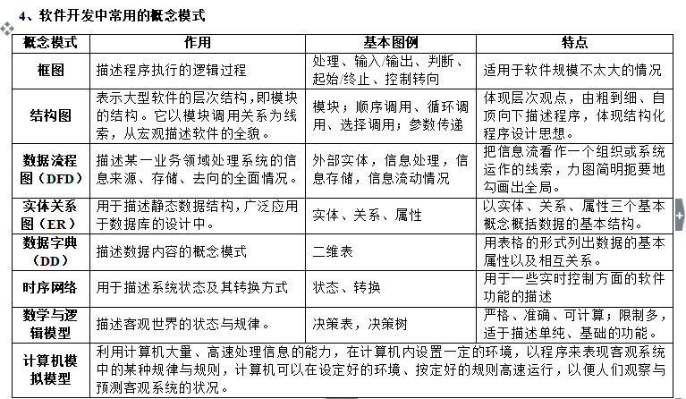
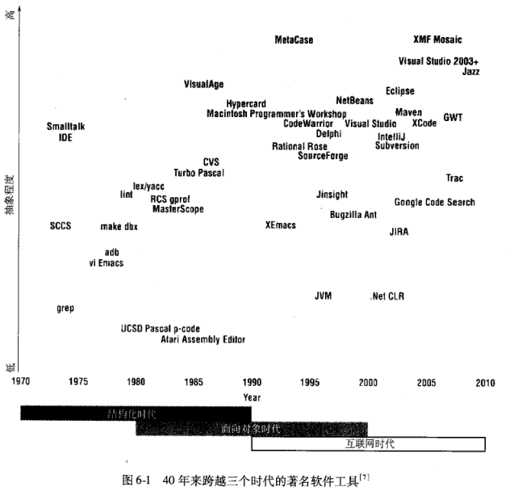
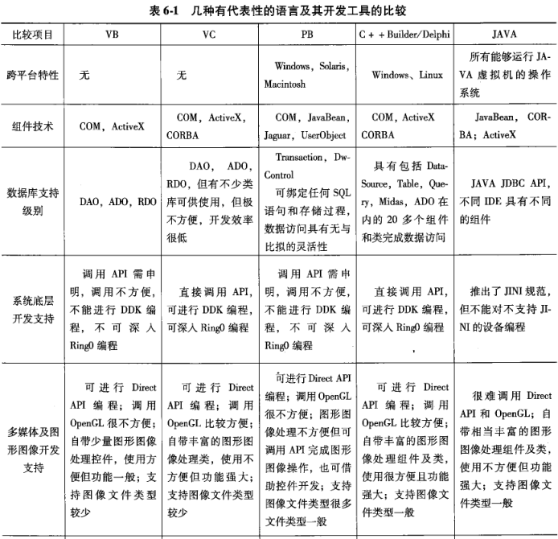
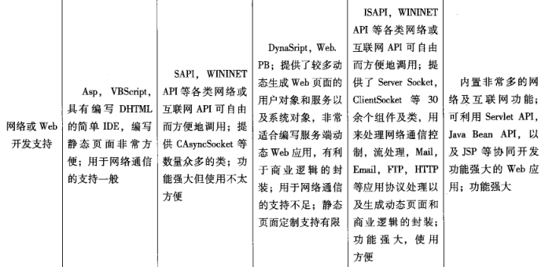
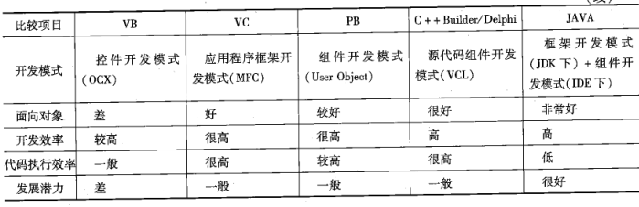

# [**计算机信息管专业课程**](https://github.com/Eished/self-study-exam_notes)

**最新自考笔记** : https://github.com/Eished/self-study-exam_notes

## 软件开发工具 03173

## 试题分值

1. 选择题
   - 20*1分=20分
2. 填空题
   - 20*1分=20分
3. 简答题
   - 6*5分=30分
4. 论述题
   - 1*10分=10分
5. 应用题
   - 1*20分=20分

## 试卷分析 201804

### 选择题

1. 为项目主管人员服务的软件开发工具是 **计划工具**。

2. 属于集成化软件开发工具的是 **Rational Rose。**

3. 结构化程序设计方法的主要服务对象是 **程序员**。

4. 在大型软件开发中，提出系统修改要求的是 **用户。**

5. 与数据库管理系统的功能相比，信息库（ Repository）的特点是 **统一管理计算机内外的信息存储。**

6. 对于软件系统及其应用来说，项目管理与版本管理的重要资源是 **用户反馈信息。**

7. 软件开发工具最重要的信息出口是 **代码生成** 和 **文档生成。**

8. 对软件开发工具进行审计，包括 **效率、响应速度、输出方式** 等。

9. 购买市场上已有的软件开发工具的优点是 **能减轻一定的工作负担**。

10. 在购置软件开发工具前，调查市场的重点包括 开发工具的品牌 开发工具的性能 这些工具的服务、培训条件 等。

11. 2008年，美国电子电气工程师协会的权威刊物《软件》的九月（十月号，以“软件开发工具”
    ftware Development Tool）为题的一期专刊中概括了40年来软件开发工具的发展轨迹，以下软件开发工具中，抽象程度最高的是 **XMF Mosaic。**

12. 以下几种较有代表性的语言及其开发工具中，代码执行效率最高的是 **C++ Builder/ Delphi 和 VC。**

13. 在以下几种较有代表性的语言及其开发工其中，开发效率最高的是 **PB 和 VC。**

14. 显示当前 Eclipse集成环境中加载的所有项目和文件列表的视图是 **导航器视图。**

15. 在使用 Eclipse时，单击□按钮会使**视图 最小化。**

16. Eclipse提供了从变量的任意引用位置直接定位到变量定义行的多种方法，方法之一是将光标定位到编辑器中相应的变量位置，单击菜单栏上的测览“ Navigate"菜单，使用**快捷键 F3。**

17. 下列关于 **MinGw**的描述中，不正确的是 MinGw支持在 Linux平台运行。

    > MinGW是指用来生成纯粹的Win32 可执行文件的编译环境，它项目的工具集，能够提供C、C++所需要的头文件和库文件，使用 Mingw.用户生成本地的 Windows程序时不需要第三方C、C++运行时库

18. 断点视图显示每个断点的状态，激活**断点**显示的颜色是 蓝色。

19. 在 Eclipse **CDT 编辑器**的窗口菜单中，选择首选项的选项是 Preferences。

20. 使用 **Rational rose建模**支持 系统分析到系统实现双向工程 采用基于组件的开发 UML的建模。

### 填空题

1. 客观世界的任何事物都是对象（ Object）。它们都有一些 **静态属性** 和相关的操作。
2. 作为一个整体，对象对外不必公开属性与操作，这就是 **封装** 性。
3. 数据流程图的基本元素是**外部实体**、**数据存储**与**数据处理**，用箭头表示信息在它们之间的流动情况。
4. 在结构图中，模块调用的三种方式是 **循环调用、顺序调用**和**选择调用**。
5. 软件开发工具帮助使用者编写**程序代码**，并编制、生成及修改各种**文档**。
6. 软件开发工具对于历史信息进行跨生命周期的管理，把**项目进度**与**版本更新**的有关信息科学地管理起来。
7. 在软件开发工具的结构中，处于中心位置的是 **总控** 和**人机界面**。
8. 于软件开发工具来说，所谓面向用户，最根本的是要立足于符合实际的 **应用领域**。
9. 为保证信息的准确传递，必须考虑信息的**抽象程度或详细程度**、**信息的结构与口径**、**信息的精确程度。**
10. 信息库中存放的有关**项目管理和版本管理**的信息包括项目**进度，过程、资源投入、人员分工**和**版本组织**。
11. 文档生成包括**文章**、**表格**和**图形**三大类。
12. 从几十年软件开发工具发展历史中，可以看到软件开发工具的一个特点是**多样性**和**趋同性**的并存。
13. 软件开发工具的**标准化**的问题是由**软件部件**和**组合软件**的想法引起的
14. 对我国的软件产业来说，当务之急应是大力普及**软件工程**及其**方法学**的知识，提高软件开发工作的水平，这才能使软件开发工具的应用具有实践的基础。
15. Eclipse的工作空间是负责管理**用户资源**的插件。
16. Eclipse提供了快速打开程序中已经在使用的特定**数据类型**及其相关**继承结构**的方法。F4
17. 使用 Eclipse的**重构**功能，用户可以在不影响程序行为的情况下进行系统范围内的代码更改。
18. 在 Eclipse CDT特有的搜索（ Search）功能中，可以执行**文件**、**任务**和**C/C++**搜索功能。
19. 不同于面向过程的分析方法，面向对象分析方法更侧重于**建模**而非分析流程。
20. 统一建模语言（UML）是一种面向**对象**的建模语言。

### 简答题

1. 简述**软件开发工具与计算机硬件、系统软件的关系**。【1.4 类别】
   - 有的软件开发工具依赖于特定的计算机或特定的软件（如某种数据库管理系统），有的软件开发工具则是独立于硬件与其他软件的，这当然**与工具自身的情况有关**。
     - 一般来说，**设计工具**多是依赖于特定软件的，因为它的生成代码，或测试数据不是抽象的，而是具体的某一种语言的代码或该语言所要求的格式的数据。
     - **分析工具与计划工具**往往是独立于机器与软件的。
     - 而**集成化**的软件开发工具又常常是依赖于机器与软件的。
2. **好的软件应具备哪些条件？**
   1. **正确**的实现所要求的功能，准确的给出预定的输出结果。
   2. 用户**界面友好**，符合实际用户使用习惯与知识能力。
   3. 具有足够的**速度**（不是越快越好），能在符合用户要求的时间限度内，给出所要求的处理结果。
   4. 具有足够的**可靠性**，能够在各种干扰下保持正常的工作。
   5. 程序**易读**，结构良好，文档齐全，从而保证正系统**易于修改**。
3. 简述**模块的划分应当符合的基本要求**。
   1. 模块的功能在**逻辑上尽可能的单一化、明确化**，最好做到一一对应。
   2. 模块之间的**联系及相互影响尽可能地少**，对于必须的联系都应当加以明确的说明，如参数的传递，共享文件的内容与格式等。
   3. 模块的**规模应当足够小**，以便使它本身的调试易于进行。
4. 代码生成器依据哪些资料生成代码？
   1. **信息库**里已有的有关资料。
   2. 各种标准**模块**的框架和构件。
   3. **使用者**通过屏幕前的操作送入的信息。
5. 软件开发工具会越来越多地得到应用吗？为什么？
   - 会。
   - 对于软件开发人员来说，对软件开发工具的兴趣来源于**选择与使用的现实需要**。正在软件开发中引进软件开发工具是一种必然的趋势。
6. 用例视图包括哪几类图表？为什么说它是UML的核心视图？
   - 包括：**用例图、活动图、顺序图**等。
   - 用例视图是从**系统外部使用者对系统的需求来描述该系统工程所应具备和完成的功能**，是UML的核心视图。

### 论述题

1. **试论软件开发过程的阶段划分及各阶段的主要任务。**
   1. 需求分析。任务：了解企业的结构与功能，掌握组织及管理者的信息需求，弄清信息流通的实际情况。
   2. 分析设计。任务：进行功能分解及数据分析，完成处理过程及数据库逻辑设计。
   3. 编程。任务：完成具体程序编写。
   4. 测试。任务：对代码进行检测、试用。
   5. 维护。任务：组织使用者有效地使用，并及时检查与修正发现的错误。

### 应用题

以下两题中的程序代码分别是用C和C++语言编写的“求一元二次方程根”的C和C++
程序代码，任选其中一题

1. ```C
   #include <stdio.h> 
   #include <stdlib.h> 
   #include <math.h>
   int main()
   {
     float a,b,c,p,q,x1,x2;
     scanf("%f,%f,%f",&a,&b,&c);
     disc=b*b-4*a*c;
     p=-b/(2*a);
     if(disc>0){
       q=sqrt(disc)/(2*a);
       x1=p+q; 
       x2=P-q;
       printf("两个根:x1=%5.2f\tx2=%5.2f",x1,x2)
     }
       else if(disc==0)
         printf("一个根:x=%5.2f",p);
       else if(disc<0)
         printf("没有根"); 
     return EXIT_SUCCESS;
   }
   ```

   1. 根据下面提供的菜单、文件夹、标签、按钮、窗口等操作选项,请写出从菜单栏上的File菜单开始,新建一个名为"X1X2"的C程序项目的基本操作步骤。File、New、 open file Project、 convert to a c/C++ Project、 class、 General文件夹、C/C++文件夹、 source file C Project、C++ Project、Next、 Project name标签、 Empty Project、 Hello World ANSI Project、 Hello World C++ Project、 MinGW GCC、Next、 Finish。
      1. 单击菜单栏中的文件（File）莱单，选择新建（New）子萊单下的项目（ Project）选项，弹出选择向导窗口（ Select a wizard）。在对话框中打开C/C++文件夹，选择 C Project后单击“Next”按钮进入下一步。
      2. 在 C Project窗口中选择C语言的相关属性。在项目名称（ Project name）标签中输入“X1X2”.在项目类型（ Project type）标签中打开 Executable文件夹，选择“XX2 ANSI C Project”，在工具箱（ Toolchains）标签中选择 MinGW GCc，完成之后单击“Next”按钮进入下一步。
      3. 在 Basic Settings窗口中可以设置源代码的注释部分内容，分别在作者（ Author）、版权声明（ Copyright notice）等标签中输入相应内容后，单击“Finish”按钮。
      4. 在 Select Conligurations窗口中可以选择调试和发布文件以及高级设定，保持默认设置后单击Finish”按钮即可新建 C Project，在这个项目中将会保存编写的源代码文件和配置文件。
   2. 将该程序在 Eclipse编辑器中进行编译后，在`disc=b*b-4*a*c;` 代码行前显示”X“符号,请回答代码行前显示"X"符号说明了什么？
      - 该语句出现语法错误，不能生成目标文件和可执行文件，不可以运行程序，必须改正后再重新编译。
   3. 修改该程序中的错误。
      1. `disc=b*b-4*a*c;` 加上 `  float a,b,c,p,q,x1,x2,disc;`
      2. `printf("两个根:x1=%5.2f\tx2=%5.2f",x1,x2)` 改为 `printf("两个根:x1=%5.2f\tx2=%5.2f",x1,x2);`

## 试卷分析 2018010

### 选择题

1. 属于软件开发工具范围的是**代码生成器**。
2. 对软件开发工具而言，下列应当首先考虑的性能是**对代码段特征的表达能力**。
3. 代码生成器属于**设计工具**。
4. 从软件开发方法发展的角度，把信息的静态属性和对它的处理结合起来的想法，最早出现于**面向对象程序设计方法。**
5. 结构化程序设计的实施方法是**自顶向下**。
6. 软件开发过程涉及多种信息，跨开发周期的一类信息是**用户对系统的变更要求的信息**。
7. 数据库设计中，广泛应用的概念模式是**实体关系图**。
8. 软件开发工具的各技术要素中，处于中心位置的是**总控和人机界面**。
9. 下述关于软件开发工具的使用记录的说法中，错误的是 软件工具的工作日志（Log）由人工完成。
10. 为自己所用而开发的工具，需要注意**设定现实的、有限的目标。**
11. 作为一款著名软件工具， Emacs出现于**结构化时代**。
12. 在大中型项目中，由于项目发周期长，交互性高，大多数开发团队倾向使用**集成开发工具**。
13. 下述关于 Eclipse的说法中错误的是 是Sun公司的专有产品。
14. 在 Eclipse中，如果想查看某大型程序中的函数参数传递过程，这时应使用它的**调用层次结构功能。**
15. GDB是GNU开源组织发布的一个**程序调试工具**。
16. 关于 Eclipse平台的编辑器，下述说法错误的是 用户可以关闭透视图中的编辑器。
17. Borland Star Team集成环境用于管理**配置和变更**。
18. 插件开发环境的简称是 **PDE**。
19. 组件的目标是粗粒度的复用，它的核心是**接口**。
20. 运行 Rational Rose，第一个界面是让用户选择**编程语言。**

### 填空题

1. 理解软件开发工具的概念应同时认识它的**继承性**和**创新性**。
2. 作为开发大型软件的项目组成员，必须具有高度的**组织纪律性**和**团队精神**。
3. 在大型软件开发中，用户要承担的工作包括：提出**需求、验收、使用、要求修改**。
4. 结构化程序设计方法把程序结构分解成三种基本模块：**处理单元、循环机制、二分决策机制。**
5. 项目管理是指比固定生产线上的日常生产有更大**变动性、时间性**的一类管理任务。
6. 在结构图中，模块调用有三种方式：**顺序调用**、**选择调用**和**循环调用**。
7. 面对用户各异的思维方式、操作方式、习惯与爱好，人机界面设计经常需要权衡**灵活性**和**一致性**之间的矛盾。
8. 需求分析阶段的任务是建立逻辑模型。具体地说，首先建立起软件所处**环境（领域）**的模型。
9. 软件开发工具的总控对各个部分的调度安排和软件界面设计应当符合**面向用户**的原则。
10. 系统审计是指对一个系统的**运行状况**及**效率**进行检测与评价，以便进一步用好或改进这个系统。
11. 为实现软件开发工具的一体化，关于**信息库**的内容及处理功能的讨论，可以从理论上为其提供基础。
12. Eclipse的体系结构主要包括运行时**内核、工作空间、工作台**和其它插件。
13. C语言是一种面向过程的计算机程序设计语言，既有高级语言的特点，又具有汇编语言的特点，允许直接访问**物理内存**地址。
14. 在 Eclipse中，抽取常量位于菜单栏中的**重构**菜单项。
15. 程序调试是指编写的程序投入实际运行前，通过调试工具或者手工方法进行测试，修正**语法**错误和**逻辑**错误的过程。
16. 如果Eclipse工具栏区被竖直的实线分成若干部分，那么，此时的工具栏处于**锁定**状态。
17. 在CVS的常用术语中，将对工作备份的修改反映到资源库中的操作称为**提交（commit）**。
18. Eclipse在首次启动时，会扫描并查找 plugins目录下的已被定义的**插件**。
19. 面向对象分析法不同于面向过程的分析方法，它更侧重于**建模**而非分析流程。
20. 对象是一些**属性及操作**行为的封装体，它是问题空间中一些东西的抽象。

### 简答题

1. 为什么说软件开发工具的提出和使用，是软件技术发展的一个新阶段？
   1. 提高了自动化程度（1分）
   2. 明确地把需求分析（1分）和架构设计（1分）包括在软件工作的范围之内
   3. 把软件开发工作延伸到项目管理及版本管理（1分）
   4. 吸收了许多管理科学的内容与方法（1分）
2. 简述用户界面设计的基本原则。
   1. 用户界面的主要功能是通信；
   2. 用户界面必须始终一致；
   3. 使用户能随时掌握任务的进展情况；
   4. 用户界面必须提供帮助；
   5. 宁可让程序多干，不可让用户多干。
3. 代码生成的输出形式有几种，各有什么优点？
   1. 某种高级程序设计语言的代码（1分）和某种机器（包括硬件和操作系统）环境下可运行的机器指令（1分）。
   2. 程序代码的优点是容易形成自己所要求的系统（1分）。
   3. 机器指令的优点是可以直接运行（1分），从而立即检查是否符合要求（1分）。
4. 引入软件开发工具之后，应当进行哪些组织管理工作？
   1. 严格使用制度。（1分）
   2. 记录使用的详细过程。（1分）
   3. 培训使用人员（1分），使有关人员真正领会软件开发工具所包含的思想与方法。（1分）
   4. 经常进行审计与评价工作。（1分）
5. 人工智能技术在软件开发工具的发展中称什么作用？
   1. 在软件开发工作中，存在着大量不确定的因素，人们常常需要用知识与经验来补充或加工（1分）。
   2. 在软件开发工具的研究与使用中引入人工智能、神经网络等技术（1分），使得软件开发工具对于不确定性的信息、模糊信息具有更强的处理能力（2分），也可以提高处理信息的功能及效率（1分）。
6. 简述采用 Rational rose实现应用系统建模的主要过程。
   1. 确认应用系统的功能需求，（1分）并为事务处理原则建模（1分）
   2. 对抽象的对象映射需求，提供设计模板并创建惯用的模板（1分）
   3. 分辨和设计对象（或划分三层模型的服务）（1分）
   4. 对软件的组成部分映射成对象并设计组件在网络上如何分布（1分）。

### 论述题

1. 大型软件开发有哪些困难？
   1. 致性难以保持；
   2. 测试的困难大为增斯
   3. 工作进度难以控制
   4. 文件与代码难以协调
   5. 版本更新困难。

### 应用题

完成一个程序，已知X、Y、Z 表示0~9中不的数字，求出使算式 `XXXX+YYYY+ZZZZ=YXXZ` 成立时x、Y、Z的值，并要求打印该算式。使用clipse CDT实现谏谷程序成从新建项目、源文件夹、编写代码并最终编译运行这一系列步骤，请料验述这些步骤中的关键点

1. 新建项目：打开Epse集成环境，点击菜单栏上的“①”菜单，选择
   新建子菜单下的②选项，弹出选择向导窗口。在对话框中打开C/C+
   文件夹，选择“ C Project”后点击“Next”进入下一步。在项目名称栏中输
   入“ my Test"，并在项目类型“ Project type”标签中打开“ Executable”文件
   夹，选择“ Empty Project”，点击“ Finish”按钮完成。

2. 新建源文件夹：鼠标右键点击资源浏览器中新建的 my Test项目，在弹出的
   菜单中，选择“New”子菜单里的源文件夹“ Source folder”选项。在弹出
   的窗口中需要输入文件夹名称，把光标定位到文件名（ Folder name）一栏中
   输入源文件夹名称“③”然后点击完成“ Finish”按钮即可。

3. 新建C类文件：参照前一个步骤新建的源文件夹，在资源管理器中鼠标右键点击
   src文件夹，在弹出的菜单中选择④子菜单里的⑤选项，新建
   个类文件。

4. 编写C程序代码：打开第3步中建好的类文件，在编辑器中编写代码如下，补充
   代码中的关键步骤。

   ```
   # include“ stdio.h
   # include“ stdlib.h”
   int main （void）（
   nt x, y,Z
   int k
   for（x=0：⑥：x+）
   for（y=0；y<10；y+）
   for（z0；z<10；z+）
   ix_⑦z
   continue
   k=sum（x, y，
   k=⑨A-+10*x
   dz=%d\n”
   z）
   printf（“‰d+%d+%d=%dln”，11.11111.，k）
   return ExIT SUCCESS
   ```

5. 运行程序：在 Eclipse的默认设置下，运行程序的快捷键是⑩

6. 文件（或者：File）（2分）
   项目（或者：Project）（2分）
   src（2分）
   新建（或者：New）（2分）
   Class（或者：类）（2分）
   x〈10（或者：x<=9）（2分）
   11（2分）
   z（2分）
   10000y（或者：y*10000（2分）
   Curl+F11（2分）

## 试卷分析 201904

### 选择题

1. 第三代程序设计语言成熟与普及于上世纪 **60年代初**。
2. 在大型软件开发过程中，承担模块调试工作的是 **程序员**。
3. 结构化程序设计方法的主要服务对象是 程序员。
4. 在软件开发与维护过程中，维护人员与计算机之间的通信界面是 **管理界面**。
5. 信息库研究中的核心问题是 **如何保持信息库的一致性**。
6. 根据IBM的AD/ Cycle模型，不属于需求分析阶段任务的是 **划分子系统或模块**。
7. 下列模块中，最容易由软件开发工具生成的模块是 **菜单控制**。
8. 以下软件开发工具中，开发难度最大的是 **集成与一体化的工具**。
9. 关于外购软件开发工具的说法中，正确的是 **对软件开发工具所依据的开发方法和开发理论的考察必不可少。**
10. 作为一款著名软件工具， Rational rose出现于 **面向对象时代**。
11. 下列各编程语言中，跨平台特性最好的是 **Java**。
12. 关于Java语言的技术中，属于数据库支持级别的是 **JDBC**。
13. 随着软件规模的增大，下述关于软件开发工具发展趋势的说法中，错误的是 **更高的使用复杂度。**
14. Eclipse在用户计算机磁盘上划出的用于存放用户工作资料的区域称为 **工作空间（ Workspace）。**
15. 关于 MinGW的描述中，不正确的是 **Mingw支持在 Linux平台运行**。
16. 在 Eclipse中，如果想快速定位到一个变量的定义位置，应使用它的 **变量声明功能**。
17. 常见的事件断点不包括 操作系统死机。
18. 在使用 Eclipse格式化代码的时候，发现右键→源代码（ source）→格式化（ （format）能够起作用，但curl+Shi+F却无法生效。如果己经确定各按键功能正常，下述原因中最有可能的是 快捷键冲突。
19. 为保证插件开发运行的准确性，PDE的重要任务是要准确地反映运行时的 **类路径**。
20. UML把系统开发分成五个阶段，分别是**需求分析、分析、设计、编程**和**测试**。

### 填空题

1. 软件应当包括**代码**和**文档**两个不可缺少的部分。
2. 结构化程序设计方法把程序结构分解成三种基本模块：**处理单元、循环机制**和**二分决策机制。**
3. 面向对象程序设计方法产生了巨大的影响，根本原因在于它提供了 **认识框架**。
4. 框图描述了程序执行**逻辑**的过程。
5. 数据流程图的基本元素包括：**外部实体**、**数据处理**和**数据存储**，用箭头表明信息在它们之间的流动状况。
6. 总控和人机界面处于软件开发工具的中心位置，这主要出于三种考虑：**面向使用者**、保证   **信息**的准确传递、保证**系统**的灵话性。
7. 按照AD/Cycle的划分，**分析设计阶段**的基本任务是完成**系统的总体设计**，包括**子系统**的划分以及它们之间相互联系的具体规定。
8. 信息库需要存放关于软件应用的领域与环境状况的信息，包括应用领域中的有关  **实体**  及它们之间的相互关系的描述。
9. 为了解决项目管理在信息处理上的困难，人们依据项目管理的经验，提出了以   **项目数据库**    为中心的解决问题的思路。
10. 在选择和购置软件开发工具时，除了考察该款软件开发工具对**应用软件结构**的理解与认识，还要 考察其对开发过程的划分与   **各阶段任务**   的理解与认识。
11. 从目前来看，软件开发工具将在**智能化、网络化、一体化**、 **标准化**四个方面进一步发展。
12. Eclipse是使用    JAVA    语言开发的。
13. 工作空间以   **项目**    为单位组织文件和目录，它将各种资源组织成树形结构。
14. Eclipse的视图提供了用户正在工作台中使用的一些    **对象**    的详细信息。
15. 使Eclipse的_  **重构**  功能 用户可以在不影响程序行为的情况下进行系统范围内的代码更改。
16. C语言是一种面向过程的计算机程序设计语言，既有高级语言的特点，又具有  **汇编**  语言的特点，允许直接访问物理地址
17. 在调试C/C++程序时，Eclipse CDT调试器允许用户设置3种类型的断点，分别是:**行断点**、  **方法**断点和**事件**断点。
18. 利用Eclipse自带的“保存历史记录”功能进行版本比较时、旧版本与目前文件的对比差异会以      **浅绿** 色标记显示。
19. 遵循Eclipse的接口规范所编写出来的程序被称为   **插件**    .
20. UML的作用就是从静态和动态方面用__ **模型** _来从各个角度全面描述要开发的系统，为人们提供一套功能强大的捕获信息技术要点的工具。

### 简答题

1. 针对软件开发过程的各个工作阶段，软件开发工具应在哪些方面提供帮助和支持?

   1. 认识与描述**客观系统**
   2. **存储及管理**开发过程中的信息
   3. 代码的**编写或生成**；
   4. 文档的**编制或生成**
   5. 软件**项目管理**。

2. 简述即插即用程序设计的基本思想。  

   1. 部分人专门开发软件组件（2分），另一部分人构造整个软件的结构（1分）
   2. 并且把组件插入这个结构（2分），以便快速完成开发工作。

3. 版本管理的核心任务是什么?有哪些方法?

   1. 核心是保持**两个一致性**：系统完善过程中，前后一致（1分）；

      系统的局部与整体一致（1分）。

   2. 方法：规定版本更新计划（1分），制定版本有关信息的范围及管理方法（1分），

      项目组内明确分工，在编程、测试等工作中明确要求（1分）

4. 简述信息库的三种结构方式及各自的特点。

   1. **集中存储**，优点是技术比较容易保持一致性，缺点是和模块化相冲突。
   2. **分散存储**，优点是易于变更和剪裁，缺点是各部分之间的一致性无从保障
   3. **逻辑上统一，物理上分散**，设立统一的信息库管理模块来进行管理。这种做法既保持了一致性，又保持了灵活性。

5. 自行研制软件开发工具要注意哪些问题?

   1. 从**实际出发**设定现实的、有限的目标；
   2. 坚持**短小实用**、逐步积累，避免期望过高和贪大求全；
   3. 注意**文档的齐全**与资料的积累。

6. 简述面向对象的对象，类，属性的含义。

   1. 对象：是一些属性及操作行为的封装体（1分），它是问题空间中一些东西
      的抽象（1分）。
   2. 类：是对一组几乎相同的对象的描述（1分）。
   3. 属性：用以描述类和对象所固有的特征（1分），是对客观世界实体所具有
      的性质的抽象（1分）。

    

### 论述题

1. 什么是概念模式？它有什么作用？

   1. 概念模式是指人们在认识事物时，对某一事物或系统形成抽象的、一般化
      的框架。

   2. 概念模式具有客观性。

   3. 又有主观性。

      作用：

   4. 它是人们认识客观世界的一种工具。

   5. 是人们交流与表达的工具。

### 应用题

开发地铁售票信息系统时，开发团队选择使用并发版本系统（ Concurrent Versions System, CVS），请回答以下问题

1. 使用CVS可以实现对软件开发的有效管理，这具体表现在哪些方面？

   具体表现有以下几个方面。

   1. 随时将程序恢复到以前某一时间点
   2. 实现程序的互斥性修改
   3. 对程序修改进行有效的管理
   4. 将开发环境与测试环境、运行环境进行有效的隔离
   5. 评估软件开发人员编写的程序质量，控制软件开发的进度
   6. 管理文档

2. 开发团队建立好资源库后，可以通过什么方式保证软件产品的安全性

   1. 开发小组的管理者给小组成员分配一些账户（2分），
   2. 小组成员通过这些账户对CVS资源库进行访问（2分），
   3. 管理员对这些账户有更改和删除的权限（2分）。

3. 团队成员在使用cvs同步的完成后，出现 Incoming（蓝色向左的箭头）Outgoing（黑色向右的箭头）和 Conflict（红色双向箭头）这三种状态，这三种状态分别代表什么？

   1. Incoming（蓝色向左的箭头）状态代表：Cvs上的文件有更改而本地的文件没有（1分）。
   2. Outgoing（黑色向右的箭头）状态代表：本地文件有更改而CvS上的文件没有（1分）。
   3. Conflict（红色双向箭头）状态代表：本地文件和CS上的文件都有更改


## 试卷分析 201910

### 选择题

1. 在专用软件开发工具出现之前，通用软件能够为软件开发人员带来的好处是 **减少编写文档或画图的工作量。**
2. 不同软件开发方区别于一般软件，对软件开发工具而言，下列各项最重要的性能是 **表达能力。**
3. 下列各项中属于数据字典编写工具的是 **Dictionary/3000。**
4. 为了克服软件危机，人们先后提出了多种程序设计方法，最早提出的是 **结构化方法。**
5. 评价一款软件的优劣，下列说法中最重要的是 **正确地实现功能。**
6. 用于描述静态数据结构的概念模式是 **实体关系图**。
7. 关于理想的模块式系统结构，下述说法中不正确的是 **各模块之间的结构互不相干**。
8. 教学辅助软件需要活泼多变的人机界面，这类开发工作最可能需要 **多媒体软件开发工具**。
9. 购置软件开发工具以后，需要对使用人员进行培训，这样做最主要的目的在于 **使其领会软件开发工具所包含的思想与方法。**
10. 为提高我国软件开发工作的水平，使软件开发工具的应用具有实践的基础，应大力普及的知识是 **软件工程及方法学。**
11. 软件工具 Turbo Pasca出现于 **结构化时代**。
12. 为实现软件开发工具一体化提供理论基础的是 **关于信息库内容及处理功能的讨论。**
13. 使用 Eclipse时，若单击视图上的按钮，该视图则会被 **隐藏。**
14. 在 Eclipse CDT调试器的断点视图中，如果设置了一个方法断点，那么程序运行后自动暂停的位置是 **该方法的第一行。**
15. 关于 Eclipse首选项中外观设置的目的，下述说法中不正确的是 **使用户把主要精力放在熟悉编辑器上。**
16. 使用 Eclipse为C程序文件定制代码模板时，对于变量的格式要求是 **以$开头，用{}括起来**。
17. 在 Eclipse中，“ Synchronize with Repository”功能位于 **Team父菜单**下。
18. 在CVS中，获得工作**备份**的操作称为 **签出**。
19. PDE透视图主要包括**插件大纲**和 **清单编辑器**。
20. 在面向对象程序设计中，对象封装了**属性及操作**行为。

### 填空题

1. 软件开发工具的发展有两个鲜明的特点，一个是面向网络，另一个是**开源软件**的兴起与运用。
2. 判断是否利用开源软件，起决定作用的因素是程序员对于**应用领域**的了解程度，以及开源软件**质量**的优劣。
3. 在结构化程序设计中，子程序尽可能做到只有一个入口和**一个出口。**
4. 在大型软件开发过程中，用户承担的工作包括：**提出需求**、验收、使用、要求修改。
5. 在**结构图**中，模块调用有三种方式：顺序调用、选择调用和循环调用。
6. 使用者从软件开发工具得到的最主要的帮助来自：屏幕上的**人机对话、代码生成、文档生成。**
7. 软件开发工具的使用记录可以由机器的**日志**功能自动完成，也可以用手工完成。
8. 软件开发工具包括一个庞大的谱系，其中一端是从计算机语言出发，通过增添辅助功能发展出来的工具，另一端是从**抽象的概念模式**出发设计出来的 **开发平台（开发环境）**。
9. Eclipse的工作空间是负责管理**用户资源**的插件。
10. 在软件开发工具发展的过程中，存在着**多样性**和**趋同性**并存的特点。
11. Eclipse是一个开放源代码的、基于JAVA语言的可扩展集成应用程序开发环境。
12. Eclipse的**编辑器与工作台**紧密集成，用来处理各种文档。
13. Eclipse的编辑器与在 Eclipse集成开发环境中每个程序都是以**项目**为单位存在的。
14. 在调试CC+程序时， Eclipse CDT调试器允许用户设置3种类型的断点，分别是在 Eclipse集成开发环**行**断点、**方法**断点和**事件**断点。
15. Eclipse允许用户在**注释、代码和文件**等3个维度设置代码模板。
16. 在CVS的常用术语中，将处于资源库之外的软件模块登录到资源库称为 **输入（import）**。
17. 在CVS的日常使用中，如果想要将本地代码与资源库代码保持一致，就需要进 **同步**。
18. CVS资源库是放置开发的**代码（项目）**并对其进行控制管理的一个文件夹。
19. 开发者可以在**PDE（插件开发环境）**中自行协调不同插件的命名和属性设置等问题。
20. UML的**用例视图**是从系统外部使用者对系统需求的角度来描述该系统所应具备的功能。

### 简答题

1. 简述软件开发过程的几个主要阶段。
   1. 需求分析（1分）
   2. 分析与设计（1分）
   3. 编程（1分）；
   4. 测试（1分）
   5. 使用与维护（1分）
2. 简述大型软件开发困难产生的原因。
   1. 大系统的复杂性：
   2. 多人共同完成一项任务，组织协调困难
   3. 应用领域之间的差别加重困难
   4. 应用领域随时间变化，软件要适应这种变化，增加了困难。
3. 软件开发过程中涉及哪几类信息，各有什么作用？
   1. **需求信息**，是有关系统环境、现状及需求的信息。
   2. **设计方案**，是有关软件的功能设计与物理设计的信息
   3. **代码文档**，是软件成果的信息。
   4. **变更要求**，以及系统变更的记录。
4. 从信息管理的角度， AD/ Cycle框架中项目管理的范围包括哪些方面？
   1. 研究与确定开发工作的方针方法。
   2. 开发任务的划分与分工。
   3. 资源状况。
   4. 人员情况。
   5. 变更情况。
   6. 质量情况。
5. 为了合理地选择软件开发工具，市场调查应包括哪些内容？
   1. 软件开发工具的功能。
   2. 软件开发工具的性能。
   3. 软件开发工具所使用或依据的开发方法或开发理论。
   4. 软件开发工具的运行环境。
   5. 软件开发工具的文档资料是否齐全。
   6. 软件开发工具的服务、培训条件如何价格。
6. 从发展趋势来看，软件开发工具领域有哪些值得关注的方向？
   1. 智能化；
   2. 网络化
   3. 一体化；
   4. 标准化。

### 论述题

1. 与一般工厂的日常生产管理相比，项目管理有什么特点？它的基本目标是什么？
   - 项目管理是指与固定生产线上的日常生产管理不同的，有更大变动性（1分）、时间性（1分）的一类管理。
   - 特点：子任务多，关系复杂；（1分）任务不可重复；（1分）协调组织任务繁重：（1分）信息处理工作更突出（1分）。
   - 基本目标：质量控制（1分），保证进度（1分），有效利用资源（1分），控制成本（1分）。


### 应用题

（本题共有10个关键点，均已用数字标出，请将答案填写在答题卡（纸）上）
完成一个C程序，计算并输出high以内最大的10个素数之和，high由主函数传给fun函数。若hgh的值为100，则函数的值为732.要求使用 Eclipse CDT实现该C程序，完成从新建项目、源文件夹、编写代码并最终编译运行这一系列步骤，请补充上述这些步骤中的关键点。

1. 新建项目：打开 Eclipse集成开发环境，点击菜单栏上的**①文件** 菜单，选择新建子菜单下的 C Project选项，弹出选择向导窗口。在对话框中打开C/C+文件夹，选择“cPet”后点击“Next”进入下一步。在项目名称栏中输入项目名称，并在项目类型“ Project type”标签中打开“ Executable”文件夹，选择“ Empty Project”。在“ Select Configurations”窗口中可以选择调试和发布文件夹以及高级设定，保持默认设置后点击Fmsh即可新建“ C Project，在这个工程中将会保存编写的**②源代码**文件 和配置文件

2. 新建源文件夹：鼠标**③右** 键点击资源测览器中的新建的项目，在弹出的菜单中，选择“New”子菜单里的源文件夹“ Source Folder”选项。在弹出的窗口中需要输入文件夹名称，把光标定位到**④Folder name** 一栏中输入源文件夹名称然后点击完成即可

3. 新建C类文件：参照前一个步骤新建的源文件夹，在资源管理器中鼠标右键点击src文件夹，在弹出的菜单中选择**⑤新建** 子菜单里的类“Clas”选项，新建一个类文件

4. 编写C程序代码：打开第3步中建好的类文件，在编辑器中编写代码如下，补充代码中的关键步骤

   ```c
   #include<stdio. h>
   clude<math. h>
   int fun (int high)(
   int sum=0, n=0, j,yes while((high)=2)&&(___n<10___
   =1
   for(j=2:j<=high/2:j++)
   if(__high%j=0___
   yes=0
   break:
   if(yes)
   sum+=high:
   ntt+:
   high-
      ___return sum__
   Int printf(("%dun",fun(100)
   retum EXIT SUCCESS
   ```

   

5. 使用浏览功能查看函数的调用层次：Eclipse的查看调用层次功能可以清晰展现函数调用关系。首先，将光标定位到编辑器中的⑨fun() 函数；然后，点击菜单栏上的浏览“ Navigate”菜单，选择⑩打开调用层次结构 选项即可看到该函数的调用层次。


## 第一章 绪论

### 1.1软件开发工具的由来

- **考点1: 软件开发工具定义：**
  软件开发工具就是帮助人们开发软件的工具。
  软件开发工具的范围大致可以描述为:

  - 在高级程序设计语言(第三代语言)的基础上，为提高软件开发的质量和效率，从规划、分析、设计、测试、文档和管理等各方面，对软件开发者提供各种不同程度的帮助的一类新型的软件。

- **考点2：识记软件开发工具的发展过程（几个阶段）:**

  1. 机器语言阶段
     1. 使用0，1代码进行行编程。
  2. 汇编语言阶段
     使用助记符来编写程序，由汇编系统将汇编指令转化为机器指令，编程工作量大大降低，但仍未摆脱对硬件的依赖。与此同时，操作系统的出现从另一方面改善了人们应用计算机的条件。
  3. 高级语言阶段
     20世纪60年年代初期高级语言突破了与机器指令一一对应的限制，实现了对机器的独立性。从而大大提高了程序的可移植性。
  4. 第四代语言阶段
     人们希望机器能够自动地完成更更多的工作，包括自动安排某些工作的顺序，而做到只要给机器下达做什么的命令，由机器自己去安排执行行的顺序。
  5. 利用通用软件作为辅助工具的阶段
     利用文字处理软件来编写文档，利用绘图软件来绘制流程图等。（20世纪70年年代末-20世纪80年年代初）
  6. 专用软件开发工具阶段
     ⽀支持软件开发的某一个阶段或某一个环节。
  7. 集成的软件开发工具阶段
     零散地、分散地⽀支持各个工作阶段、各项具体工作的专用工具之间没有有机地联系起来，从而必然造成冲突与⽭矛盾，以致
     抵消了使用工具带来的益处。 这种情况促使了集成的软件开发工具的产生.

- 记忆方法：联想记忆

- 练习题

  1. 软件开发工具一般是以( )语言为基础的。
     A.第一代
     B.第二代

     C.第三代
     D.第四代

  2. 软件开发工具的发展过程包括那几个阶段:

- **考点2 软件开发工具产生及应用的必然性及发展趋势**

  - **软件开发工具产生及应用的必然性**:

    - 硬件是计算机的躯体，软件是计算机的灵魂。如果没有相应于特定业务
      的、能够有效运行行的软件，任何硬件都是不可能在各种应用领域中发挥作用的。 软件是广大使用者与计算机之间的桥梁。软件是人类在各个领域中积累的知识的结晶，软件是人类文明与知识得以延续和运用的载体，软件是人类进一步成为一个整体，得以进一步相互联系的纽带。 正是由于软件在当今社会中的突出地位，软件工作的重要性越来越受到人们的重视，故软件开发工具的产生和应用也是必然的.是软件技术发展到一定阶段的必然产物。

      记忆方法：重要性，地位性。

  - **软件开发工具的发展趋势**:进人21世纪以来，随着互联网的兴起，软件开发工具的发展也进人了新的阶段。两个鲜明的特点使软件开发工具的功能和效率提高到了一个新的阶段。

    - **第一个特点是面向网络**，不仅基于网络，而且用于网络。从HTML到入ML，从SOAP到UDDL，软件开发越来越需要考虑在互联网上的应用，越来越注意在网络环境下使用.

    - **另一个特点是开源软件的兴起和运用**。虽然对于开源软件在社会上和学术界都有不同的看法和意见，但是，对软件开发人员来说，对开源软件的利用和关注是绝对需要的，其对于软件开发工作效率的提高是肯定有益的。

      发展趋势：联想记忆

### 1.2 软件开发工具的概念

- 考点1 领会软件与软件开发工作的实质
  - 软件的实质软件用来特指看见、摸着的但又发挥着十分重要的作用的事先编好的指令系列。从应用的角度来看，软件一端连着计算机硬件向硬件提供可执行的机指令，另一端面向用户，接受用户提岀的要求和算法。软件的实质在于对应用环境和业务流程的正确解和描述而是简单地编程。
- 考点2 软件开发工具的发展主要表现在以下四个方面
  （1）自动化程度的提高。1-4通用集成
  （2）这一阶段的工作明确地把需求分析和架构设计包括在软件工作的范围之内从而使软件开发过程进一步向用户方面延伸，离用户更近。通用
  （3）把软件开发工作延伸到项目及版本管，从而超岀一次编程的局限，而扩展到作为一个断发展的客体生长完善的全过程。
  4）在这一阶段的研究中，吸收许多管学科的内容与方法如程序员的组织、质的控领会软件开发工具的概念、地位及作用。

### 1.3 软件开发工具的功能与性能

### 1.4 软件开发工具的类别

### 1.5 软件开发工具的研究与应用


## 第二章 软件开发过程及其组织

### 2.1 软件开发的困难

### 2.2  软件开发方法的发展

### 2.3 软件开发过程的管


## 第三章 软件开发工具的论基础

### 3.1 软件开发过程的信息需求

### 3.2 概念模式及其作用



### 3.3 信息库及其一致性

### 3.4 人机界面及其管

### 3.5 项目管与版本管


## 第四章 软件开发工具的技术要素

### 4.1 基本功能与一般结构

### 4.2 总控与人机界面

### 4.3 信息库及其管

### 4.4 文档生成与代码生成

### 4.5 项目管与版本管


## 第五章 软件开发工具的使用和开发

### 5.1 购置与开发的权衡

### 5.2 软件开发工具的选择与购置

### 5.3 软件开发工具的使用

### 5.4 软件开发工具的开发


## 第六章 软件开发工具的现状与发展

### 6.1 软件开发工具的发展现状

### 6.2 软件开发工具的发展方向与趋势



### 6.3 从计算机语言发展而来的工具



### 6.4 综合性的平台或开发环境


## 实践篇

## 第七章 Eclipse 入门

### 7.1 简介

### 7.1 获取与安装


## 第八章 Eclipse 工作台

### 8.1 初识工作台

### 8.2 透视图及视图介绍

### 8.3 编辑介绍

### 8.4 管项目

### 8.5 常用快捷键介绍

### 8.6 帮助文档


## 第九章 使用 Eclipse 进行 C/C++ 开发

### 9.1 安装 MinGW

### 9.2 第一个 C/C++ 项目

### 9.3 Eclipse 重构功能

### 9.4 搜索功能


## 第十章 调试程序

### 10.1 安装 GDB

### 10.1 调试 C 程序


## 第十一章 Eclipse CDT 开发

### 11.1 自定义编辑

### 11.2 定制工作台

### 11.3 格式化代码

### 11.4 生成历史记录


## 第十二章 CVS 的安装及使用

### 12.1 CVS 介绍

### 12.2 常用版本控制软件

### 12.3 CVS 的安装与配置


## 第十三章  Eclipse 插件的使用与开发

### 13.1 插件简介

### 13.2 使用 PDE 进行插件开发

### 13.3 常用插件扩展点

### 13.4 常用插件介绍与使用


## 第十四章 常用建模工具

### 14.1 UML 建模介绍

### 14.2 Rational Rose 建模工具介绍

### 14.3 使用 Rational Rose 建模

### 14.4 EclipseUML 建模工具

